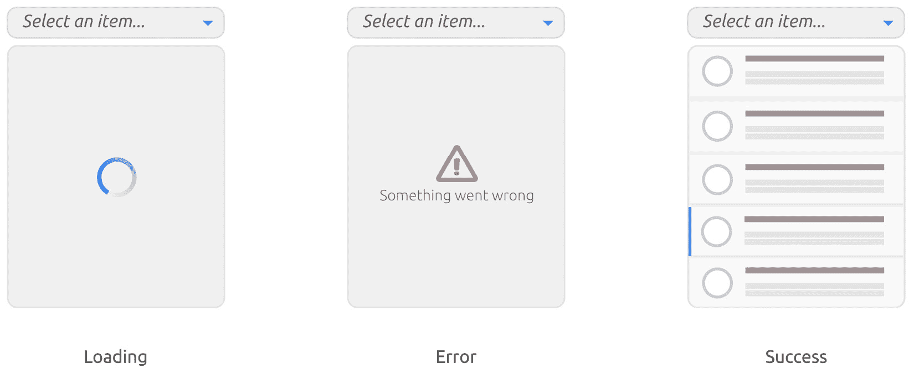

# 10

# 深入探索组合模式

构建可扩展和可维护的用户界面的旅程充满了挑战。开发者面临的一个主要挑战是确保组件在代码库增长时保持模块化、可重用和易于理解。我们的组件变得越来越交织和紧密耦合，维护、测试或甚至让新团队成员加入就变得更加困难。

组合已成为解决这一挑战的有力技术，使开发者能够构建更组织化、可扩展和更干净的代码库。我们不是创建执行众多任务的大型、单体组件，而是将它们分解成更小、更易于管理的部分，这些部分可以以多种方式组合。这为我们提供了一条清晰的路径，以简化逻辑、增强可重用性，并保持关注点的清晰分离。

本章致力于理解和掌握 React 中的组合。在过渡到高阶组件和 Hooks 之前，我们将深入研究基础技术，如高阶函数。你将学习这些工具如何无缝地与组合原则相匹配，使你能够使用 React 构建更健壮的应用程序。我们的旅程将以深入研究无头组件为高潮，这种范式封装了逻辑，而不规定 UI，提供了无与伦比的灵活性。

到本章结束时，你将欣赏到采用组合技术的益处。你将准备好创建不仅可扩展和可维护，而且令人愉悦的 UI。让我们开始这次关于 React 中组合的启发式探索之旅。

在本章中，我们将涵盖以下主题：

+   通过高阶组件理解组合

+   深入探索自定义 Hooks

+   开发下拉列表组件

+   探索无头组件模式

# 技术要求

已创建一个 GitHub 仓库来托管本书中讨论的所有代码。对于本章，你可以在[`github.com/PacktPublishing/React-Anti-Patterns/tree/main/code/src/ch1`](https://github.com/PacktPublishing/React-Anti-Patterns/tree/main/code/src/ch10)找到推荐的架构。

# 通过高阶组件理解组合

组合可能是软件设计中最重要的技术之一，就像许多其他基本设计原则一样，它适用于许多不同的层面。在本节中，我们将回顾如何在 React 世界中使用高阶函数及其变体——高阶组件——来实现组合。

## 复习高阶函数

我们在第九章讨论了一些高阶函数的例子，但这是一个如此重要的概念，我想在这里再详细回顾一下。**高阶函数**（**HOF**）是一个函数，它要么接受另一个函数作为其参数，要么返回一个函数，或者两者都是。接受函数作为参数的能力有很多优点，尤其是在组合方面。

考虑以下示例：

```js
const report = (content: string) => {
  const header = "=== Header ===";
  const footer = "=== Footer ===";
  return [header, content, footer].join("\n");
};
```

在这里，`report`函数生成一个包含标题、提供的内容和页脚的格式化报告。例如，给定输入`hello world`，输出将如下所示：

```js
=== Header ===
hello world
=== Footer ===
```

现在，想象一个场景，其中一些用户希望将内容打印为大写。虽然我们可以通过`content.toUpperCase()`来实现这一点，但其他用户可能更喜欢内容保持原样。在报告函数中引入条件是取悦这两组用户的一种方法。从我们之前关于第九章标题示例的讨论中汲取灵感，我们可以允许传递一个`transformer`函数。

这使得客户可以按照自己的意愿格式化字符串，如下所示：

```js
const report = (content: string, transformer: (s: string) => string) => {
  const header = "=== Header ===";
  const footer = "=== Footer ===";
  return [header, transformer(content), footer].join("\n");
};
```

为了灵活性，我们可以提供一个默认的转换器，确保那些不想自定义格式的人可以使用该函数而不做任何更改：

```js
const report = (
  content: string,
  transformer: (s: string) => string = (s) => s
) => {
  const header = "=== Header ===";
  const footer = "=== Footer ===";
  return [header, transformer(content), footer].join("\n");
};
```

报告函数生成一个包含定义的标题和页脚以及中间主要内容的字符串。它接受一个内容字符串和一个可选的转换函数。如果提供了转换函数，它将修改内容；否则，内容保持不变。结果是带有修改后或原始内容放置在标题和页脚之间的格式化报告。这就是 HOFs 如此强大的本质，帮助我们编写更可组合的代码。

反思这一点，一个有趣的想法浮现出来——我们能否将这种可组合和功能性的方法融入到我们的 React 应用程序中？确实，我们可以。增强组件的能力并不仅限于标准函数。在 React 中，我们有**高阶组件**（**HOCs**）。

## 介绍 HOCs

HOC 本质上是一个接受组件并返回其新、增强版本的函数。HOC 背后的原理很简单——它们允许你向现有组件注入额外的功能。这种模式特别有益于当你想在多个组件之间重用某些行为时。

让我们深入一个例子：

```js
const checkAuthorization = () => {
    // Perform authorization check, e.g., check local storage or send 
        a request to a remote server
}
const withAuthorization = (Component: React.FC): React.FC => {
  return (props: any) => {
    const isAuthorized = checkAuthorization();
    return isAuthorized ? <Component {...props} /> : <Login />;
  };
};
```

在这个片段中，我们定义了一个函数`checkAuthorization`来处理授权检查。然后，我们创建了一个 HOC，`withAuthorization`。这个 HOC 接受一个组件（`Component`）作为其参数，并返回一个新的函数。这个返回的函数在渲染时，将根据用户是否授权来渲染原始的`Component`或`Login`组件。

现在，假设我们有一个想要保护的`ProfileComponent`。我们可以使用`withAuthorization`来创建一个新的、受保护的`ProfileComponent`版本：

```js
const Profile = withAuthorization(ProfileComponent);
```

这意味着每当`Profile`被渲染时，它首先会检查用户是否有权限。如果有，它将渲染`ProfileComponent`；否则，它将用户重定向到`Login`组件。

现在我们已经看到了如何使用`withAuthorization`来控制访问权限，让我们将注意力转向增强用户交互。我们将深入研究`ExpandablePanel`组件，展示 HOC 如何管理交互式 UI 元素和状态转换。

## 实现`ExpandablePanel`组件

让我们从基本的`ExpandablePanel`组件开始。正如其名所示，这个组件由一个标题和一个内容区域组成。最初，内容区域是折叠的，但点击标题可以将其展开以显示内容。


图 10.1：可展开的面板

这样一个组件的代码很简单：

```js
export type PanelProps = {
  heading: string;
  content: ReactNode;
};
const ExpandablePanel = ({ heading, content }: PanelProps) => {
  const [isOpen, setIsOpen] = useState<boolean>(false);
  return (
    <article>
      <header onClick={() => setIsOpen((isOpen) => 
       !isOpen)}>{heading}</header>
      {isOpen && <section>{content}</section>}
    </article>
  );
};
```

现在，假设我们想要让它更加生动，使得面板在渲染时自动展开，然后几秒钟后折叠。以下是调整代码以实现这一目标的方法：

```js
const AutoCloseExpandablePanel = ({ heading, content }: PanelProps) => {
  const [isOpen, setIsOpen] = useState<boolean>(true);
  useEffect(() => {
    const id = setTimeout(() => {
      setIsOpen(false);
    }, 3000);
    return () => {
      clearTimeout(id);
    };
  }, []);
  return (
    <article>
      <header onClick={() => setIsOpen((isOpen) => 
       !isOpen)}>{heading}</header>
      {isOpen && <section>{content}</section>}
    </article>
  );
};
```

在这个修订版本中，我们将`isOpen`初始化为`true`，以便面板以展开状态开始。然后，我们使用`useEffect`设置一个计时器，在 3,000 毫秒（3 秒）后折叠面板。

这种自动折叠组件的模式在 UI 开发中相当常见——想想通知、警报或提示，它们在一段时间后会消失。为了提高代码的可重用性，让我们将这个自动折叠逻辑提取到一个 HOC 中：

```js
interface Toggleable {
  isOpen: boolean;
  toggle: () => void;
}
const withAutoClose = <T extends Partial<Toggleable>>(
  Component: React.FC<T>,
  duration: number = 2000
) => (props: T) => {
  const [show, setShow] = useState<boolean>(true);
  useEffect(() => {
    if (show) {
      const timerId = setTimeout(() => setShow(false), duration);
      return () => clearTimeout(timerId);
    }
  }, [show]);
  return (
    <Component
      {…props}
      isOpen={show}
      toggle={() => setShow((show) => !show)}
    />
  );
};
```

在`withAutoClose`中，我们定义了一个通用的 HOC，它为任何组件添加自动关闭功能。这个 HOC 接受一个持续时间参数来定制自动关闭延迟，默认为 2,000 毫秒（2 秒）。

为了确保顺利集成，我们还可以扩展`PanelProps`以包括可选的`Toggleable`属性：

```js
type PanelProps = {
  heading: string;
  content: ReactNode;
}  & Partial<Toggleable>;
```

现在，我们可以重构`ExpandablePanel`以接受`isOpen`和从`withAutoClose`来的切换属性：

```js
const ExpandablePanel = ({
  isOpen,
  toggle,
  heading,
  content,
}: PanelProps) => {
  return (
    <article>
      <header onClick={toggle}>{heading}</header>
      {isOpen && <section>{content}</section>}
    </article>
  );
};
```

使用这种设置，创建一个自动关闭版本的`ExpandablePanel`变得轻而易举：

```js
export default withAutoClose(ExpandablePanel, 3000);
```

而且你知道吗？我们封装在`withAutoClose`中的自动关闭逻辑可以在各种组件之间重用：

```js
const AutoDismissToast = withAutoClose(Toast, 3000);
const TimedTooltip = withAutoClose(Tooltip, 3000);
```

HOC 的通用性在组合方面表现得尤为出色——将一个 HOC 应用于另一个 HOC 的结果的能力。这种能力与函数式编程中的函数组合原则相吻合。

让我们考虑另一个 HOC，`withKeyboardToggle`，它增强面板的行为以响应键盘输入来切换面板的展开/折叠状态。以下是`withKeyboardToggle`的代码：

```js
const noop = () => {};
const withKeyboardToggle =
  <T extends Partial<Toggleable>>(Component: React.FC<T>) =>
  (props: T) => {
    const divRef = useRef<HTMLDivElement>(null);
    const handleKeyDown = (event: KeyboardEvent<HTMLDivElement>) => {
      if (event.key === "Enter" || event.key === " ") {
        event.preventDefault();
        (props.toggle ?? noop)();
      }
      if (event.key === "Escape" && divRef.current) {
        divRef.current.blur();
      }
    };
    return (
      <div onKeyDown={handleKeyDown} tabIndex={0} ref={divRef}>
        <Component {...props} />
      </div>
    );
  };
export default withKeyboardToggle;
```

在 `withKeyboardToggle` 高阶组件（HOC）中，创建了一个引用（`divRef`）用于包装 `div` 以启用键盘交互。`handleKeyDown` 函数定义了 *Enter*、*Space* 和 *Escape* 键的行为——*Enter* 或 *Space* 键切换面板的状态，而 *Escape* 键则从面板移除焦点。这些键盘事件处理器允许包装组件响应键盘导航。

现在，让我们将 `withKeyboardToggle` 和 `withAutoClose` 组合起来创建一个新的组件，`AccessibleAutoClosePanel`：

```js
const AccessibleAutoClosePanel = withAutoClose(withKeyboardToggle(ExpandablePanel), 2000);
```

在 `withAutoClose(withKeyboardToggle(ExpandablePanel), 2000);` 表达式中，`withKeyboardToggle` 首先应用于 `ExpandablePanel`，增强了其键盘切换功能。然后，这个结果被输入到 `withAutoClose` 中，进一步增强了组件，使其在 2,000 毫秒后自动关闭。这种 HOCs 的链式调用产生了一个新的组件，`AccessibleAutoClosePanel`，它继承了键盘切换和自动关闭的行为。

这是一个生动的例子，说明了如何将 HOCs 嵌套和组合起来，从更简单、单一职责的组件构建更复杂的行为，这在 *图 10.2* 中进一步说明。2*：


图 10.2：高阶组件

如果你有一些面向对象编程的背景，这个概念可能对你有共鸣，因为它与 **装饰器** 设计模式相吻合。如果你不熟悉，它通过将对象包装在额外的对象中来动态地为对象添加行为，而不是改变其结构。这比继承提供了更大的灵活性，因为它在不修改原始对象的情况下扩展了功能。

现在，尽管 HOCs 在各种场景下对类组件和函数组件都有益，但 React Hooks 提供了一种更轻量级的方法来实现组合。让我们接下来看看 Hooks。

# 探索 React Hooks

**Hooks** 提供了一种从组件中提取有状态逻辑的方法，使其能够独立测试和重用。它们为在不改变组件层次结构的情况下重用有状态逻辑铺平了道路。本质上，Hooks 允许你从函数组件中“钩入”React 状态和其他生命周期特性。

接着从 `ExpandablePanel` 组件的例子来看，让我们看看这段代码：

```js
const useAutoClose = (duration: number) => {
  const [isOpen, setIsOpen] = useState<boolean>(true);
  useEffect(() => {
    if (isOpen) {
      const timerId = setTimeout(() => setIsOpen(false), duration);
      return () => clearTimeout(timerId);
    }
  }, [duration, isOpen]);
  const toggle = () => setIsOpen((show) => !show);
  return { isOpen, toggle };
};
export default useAutoClose;
```

在这个 `useAutoClose` Hooks 中，我们创建了一个 `isOpen` 状态和一个切换状态的函数。`useEffect` 函数设置一个计时器，在指定的时间后将 `isOpen` 改为 `false`，但仅当 `isOpen` 为 `true` 时。它还清理计时器以防止内存泄漏。

现在，为了将这个 Hook 集成到我们的 `ExpandablePanel` 中，需要做的最小修改：

```js
const ExpandablePanel = ({ heading, content }: PanelProps) => {
  const { isOpen, toggle } = useAutoClose(2000);
  return (
    <article>
      <header onClick={toggle}>{heading}</header>
      {isOpen && <section>{content}</section>}
    </article>
  );
};
```

在这里，我们删除了传入的 `isOpen` 和 `toggle` 属性，并利用了 `useAutoClose` Hooks 的返回值，无缝地结合了自动关闭功能。

接下来，为了实现键盘导航，我们定义了另一个 Hook，`useKeyboard`，它捕获按键事件以切换面板：

```js
const useKeyboard = (toggle: () => void) => {
  const handleKeyDown = (event: KeyboardEvent) => {
    if (event.key === "Enter" || event.key === " ") {
      event.preventDefault();
      toggle();
    }
  };
  return { handleKeyDown };
};
```

然后，在 `ExpandablePanel` 中嵌入 `useKeyboard` 是直接的：

```js
const ExpandablePanel = ({ heading, content }: PanelProps) => {
  const { isOpen, toggle } = useAutoClose(2000);
  const { handleKeyDown } = useKeyboard(toggle);
  return (
    <article onKeyDown={handleKeyDown} tabIndex={0}>
      <header onClick={toggle}>{heading}</header>
      {isOpen && <section>{content}</section>}
    </article>
  );
};
```

这里，`useKeyboard` 的 `handleKeyDown` 被用来检测按键，增强了我们的组件的键盘交互性。

在 *图 10*.*3* 中，你可以观察到钩子如何与底层的 `ExpandablePanel` 相关联，与组件被包装的 HOC 场景形成对比：


图 10.3：使用替代钩子

钩子体现了一组整洁的可重用逻辑，与组件隔离但易于集成。与 HOCs 的包装方法不同，Hooks 提供了一种插件机制，使它们轻量级且由 React 管理良好。Hooks 的这一特性不仅促进了代码模块化，还提供了一种更干净、更直观的方式来丰富我们的组件，增加额外的功能。

然而，请注意，Hooks 的多功能性比最初看起来更广。它们不仅用于管理与 UI 相关的状态，而且对于处理 UI 副作用也非常有效，例如数据获取和全局事件处理（如页面级别的键盘快捷键）。我们已经看到了如何使用它们来处理键盘事件处理器，现在，让我们探索 Hooks 如何简化网络请求。

## 揭示远程数据获取

在前面的章节中，我们利用 `useEffect` 进行数据获取，这是一种常见的做法。当从远程服务器获取数据时，通常需要引入三种不同的状态 – `loading`、`error` 和 `data`。

这里是一个实现这些状态的方法：

```js
//...
  const [loading, setLoading] = useState<boolean>(false);
  const [data, setData] = useState<Item[] | null>(null);
  const [error, setError] = useState<Error | undefined>(undefined);
  useEffect(() => {
    const fetchData = async () => {
      setLoading(true);
      try {
        const response = await fetch("/api/users");
        if (!response.ok) {
          const error = await response.json();
          throw new Error(`Error: ${error.error || response.status}`);
        }
        const data = await response.json();
        setData(data);
      } catch (e) {
        setError(e as Error);
      } finally {
        setLoading(false);
      }
    };
    fetchData();
  }, []);
//...
```

在前面的代码中，我们使用 React 钩子来管理异步数据获取，初始化 `loading`、`data` 和 `error` 的状态。在 `useEffect` 中，`fetchData` 函数尝试从 `"/api/users"` 端点获取用户数据。如果成功，数据将被存储；如果不成功，将记录错误。无论结果如何，都会更新加载状态以反映完成情况。`useEffect` 只运行一次，类似于组件的初始挂载阶段。

## 优化重构以实现优雅和可重用性

将获取逻辑直接嵌入我们的组件中是可以工作的，但这不是最优雅或最可重用的方法。让我们通过将获取逻辑提取到单独的函数中来重构它：

```js
const fetchUsers = async () => {
  const response = await fetch("/api/users");
  if (!response.ok) {
    const error = await response.json();
    throw new Error('Something went wrong');
  }
  return await response.json();
};
```

在 `fetchUsers` 函数就位后，我们可以通过将获取逻辑抽象成一个通用的钩子来更进一步。这个钩子将接受一个获取函数并管理相关的 `loading`、`error` 和 `data` 状态：

```js
const useService = <T>(fetch: () => Promise<T>) => {
  const [loading, setLoading] = useState<boolean>(false);
  const [data, setData] = useState<T | null>(null);
  const [error, setError] = useState<Error | undefined>(undefined);
  useEffect(() => {
    const fetchData = async () => {
      setLoading(true);
      try {
        const data = await fetch();
        setData(data);
      } catch(e) {
        setError(e as Error);
      } finally {
        setLoading(false);
      }
    };
    fetchData();
  }, [fetch]);
  return {
    loading,
    error,
    data,
  };
}
```

现在，`useService` 钩子作为跨应用获取数据的可重用解决方案出现。它是一个整洁的抽象，我们可以用它来获取各种类型的数据，如下所示：

```js
const { loading, error, data } = useService(fetchProducts);
//or
const { loading, error, data } = useService(fetchTickets);
```

通过这次重构，我们不仅简化了数据获取逻辑，还使其可以在应用的不同场景中重用。这为我们继续增强下拉组件并深入研究更高级的功能和优化奠定了坚实的基础。

随着我们探索了钩子和它们在管理状态和逻辑方面的能力，让我们将这些知识应用到从头构建一个更复杂的 UI 组件——下拉列表。这个练习不仅将加强我们对钩子的理解，还将展示它们在创建交互式 UI 元素中的实际应用。

我们将从下拉列表的基本版本开始，然后逐步引入更多功能，使其功能齐全且用户友好。这个过程也将为后续关于无头组件的讨论奠定基础，展示一个进一步抽象和管理 UI 组件状态和逻辑的设计模式。

# 开发下拉列表组件

下拉列表是一个在许多地方都常用的组件。尽管有原生选择组件用于基本用例，但一个更高级的版本，提供对每个选项的更多控制，可以提供更好的用户体验。


图 10.4：下拉列表组件

当从头开始创建时，完整的实现所需的努力比最初看起来要多。必须考虑键盘导航、可访问性（例如，屏幕阅读器兼容性）以及移动设备上的可用性等问题。

我们将从简单的桌面版本开始，仅支持鼠标点击，逐步添加更多功能以使其更真实。请注意，这里的目的是揭示一些软件设计模式，而不是教你如何构建用于生产环境的下拉列表（实际上，我不建议从头开始构建，而是建议使用更成熟的库）。

基本上，我们需要一个用户可以点击的元素（让我们称它为触发器），以及一个状态来控制列表面板的显示和隐藏操作。最初，我们隐藏面板，当触发器被点击时，我们显示列表面板。以下是代码：

```js
import { useState } from "react";
interface Item {
  icon: string;
  text: string;
  id: string;
  description: string;
}
type DropdownProps = {
  items: Item[];
};
const Dropdown = ({ items }: DropdownProps) => {
  const [isOpen, setIsOpen] = useState(false);
  const [selectedItem, setSelectedItem] = useState<Item | null>(null);
  return (
    <div className="dropdown">
      <div className="trigger" tabIndex={0} onClick={() => 
       setIsOpen(!isOpen)}>
        <span className="selection">
          {selectedItem ? selectedItem.text : "Select an item..."}
        </span>
      </div>
      {isOpen && (
        <div className="dropdown-menu">
          {items.map((item) => (
            <div
              key={item.id}
              onClick={() => setSelectedItem(item)}
              className="item-container"
            >
              
              <div className="details">
                <div>{item.text}</div>
                <small>{item.description}</small>
              </div>
            </div>
          ))}
        </div>
      )}
    </div>
  );
};
```

在代码中，我们已经为我们的下拉组件设置了基本结构。使用`useState`钩子，我们管理`isOpen`和`selectedItem`状态来控制下拉的行为。简单的点击触发器可以切换下拉菜单，而选择一个项目会更新`selectedItem`状态。

让我们将组件分解成更小、更易于管理的部分，以便更清晰地看到它。我们将首先提取一个`Trigger`组件来处理用户点击：

```js
const Trigger = ({
  label,
  onClick,
}: {
  label: string;
  onClick: () => void;
}) => {
  return (
    <div className="trigger" tabIndex={0} onClick={onClick}>
      <span className="selection">{label}</span>
    </div>
  );
};
```

同样，我们将提取一个`DropdownMenu`组件来渲染项目列表：

```js
const DropdownMenu = ({
  items,
  onItemClick,
}: {
  items: Item[];
  onItemClick: (item: Item) => void;
}) => {
  return (
    <div className="dropdown-menu">
      {items.map((item) => (
        <div
          key={item.id}
          onClick={() => onItemClick(item)}
          className="item-container"
        >
          
          <div className="details">
            <div>{item.text}</div>
            <small>{item.description}</small>
          </div>
        </div>
      ))}
    </div>
  );
};
```

现在，在`Dropdown`组件中，我们只需简单地使用这两个组件，传入相应的状态，将它们转换为纯受控组件（无状态组件）：

```js
const Dropdown = ({ items }: DropdownProps) => {
  const [isOpen, setIsOpen] = useState(false);
  const [selectedItem, setSelectedItem] = useState<Item | null>(null);
  return (
    <div className="dropdown">
      <Trigger
        label={selectedItem ? selectedItem.text : "Select an item..."}
        onClick={() => setIsOpen(!isOpen)}
      />
      {isOpen && <DropdownMenu items={items} 
       onItemClick={setSelectedItem} />}
    </div>
  );
};
```

在这个更新的代码结构中，我们通过为下拉的不同部分创建专门的组件来分离关注点，使代码更加有序且易于管理。我们在这里可以看到结果：


图 10.5：原生实现列表

如您在*图 10**.5*中看到的，基本的下拉列表出现了，但这只是整个下拉列表功能的一小部分。例如，键盘导航是一个可访问组件的必要功能，我们将在下一部分实现它。

## 实现键盘导航

在我们的下拉列表中集成键盘导航，通过提供鼠标交互的替代方案来增强用户体验。这对于可访问性尤为重要，并在网页上提供无缝的导航体验。让我们探讨如何使用`onKeyDown`事件处理器来实现这一点。

初始时，我们将`handleKeyDown`函数附加到`Dropdown`组件中的`onKeyDown`事件。在这里，我们使用`switch`语句来确定按下的特定键并执行相应的操作。例如，当按下`Enter`或`Space`键时，下拉菜单会切换。同样，`ArrowDown`和`ArrowUp`键允许在列表项之间导航，当需要时循环回到列表的开始或结束：

```js
const Dropdown = ({ items }: DropdownProps) => {
  // ... previous state variables ...
  const handleKeyDown = (e: React.KeyboardEvent) => {
    switch (e.key) {
      // ... case blocks ...
    }
  };
  return (
    <div className="dropdown" onKeyDown={handleKeyDown}>
      {/* ... rest of the JSX ... */}
    </div>
  );
};
```

此外，我们已更新我们的`DropdownMenu`组件以接受`selectedIndex`属性。此属性用于应用高亮样式并将`aria-selected`属性设置为当前选定的项，增强视觉反馈和可访问性：

```js
const DropdownMenu = ({
  items,
  selectedIndex,
  onItemClick,
}: {
  items: Item[];
  selectedIndex: number;
  onItemClick: (item: Item) => void;
}) => {
  return (
    <div className="dropdown-menu" role="listbox">
      {/* ... rest of the JSX ... */}
    </div>
  );
};
```

在接下来的工作中，我们可以将状态和键盘事件处理逻辑封装在一个名为`useDropdown`的自定义钩子中。此钩子返回一个包含必要状态和函数的对象，可以在`Dropdown`组件中使用解构，保持其整洁和可维护性：

```js
const useDropdown = (items: Item[]) => {
  // ... state variables ...
  const handleKeyDown = (e: React.KeyboardEvent) => {
    // ... switch statement ...
  };
  const toggleDropdown = () => setIsOpen((isOpen) => !isOpen);
  return {
    isOpen,
    toggleDropdown,
    handleKeyDown,
    selectedItem,
    setSelectedItem,
    selectedIndex,
  };
};
```

现在，我们的`Dropdow`n 组件已经简化并更具可读性；它利用`useDropdown`钩子来管理其状态和处理键盘交互，展示了关注点的清晰分离，使得代码更容易理解和维护：

```js
const Dropdown = ({ items }: DropdownProps) => {
  const {
    isOpen,
    selectedItem,
    selectedIndex,
    toggleDropdown,
    handleKeyDown,
    setSelectedItem,
  } = useDropdown(items);
  return (
    <div className="dropdown" onKeyDown={handleKeyDown}>
      <Trigger
        onClick={toggleDropdown}
        label={selectedItem ? selectedItem.text : "Select an item..."}
      />
      {isOpen && (
        <DropdownMenu
          items={items}
          onItemClick={setSelectedItem}
          selectedIndex={selectedIndex}
        />
      )}
    </div>
  );
};
```

通过这些修改，我们成功地在下拉列表中实现了键盘导航，使其更具可访问性和用户友好性。此示例还说明了如何利用钩子以结构化和模块化的方式管理复杂的状态和逻辑，为我们的 UI 组件的进一步增强和功能添加铺平道路。

我们可以使用 React DevTools 更好地可视化代码。请注意，在**钩子**部分，所有状态都被列出：


图 10.6：使用 Chrome DevTools 检查钩子部分的内容

当我们需要实现不同的 UI 同时保持相同的基本功能时，将我们的逻辑提取到钩子中时，其威力就完全显现出来。通过这样做，我们将状态管理和交互逻辑从 UI 渲染中分离出来，使得在不接触逻辑的情况下更改 UI 变得轻而易举。

我们已经探讨了如何利用带有自定义钩子的小组件来增强我们的代码结构。然而，当我们面临管理更复杂的状态时会发生什么？考虑一个下拉数据来自服务 API 的场景，需要我们处理异步服务调用以及额外的状态管理。在这种情况下，这种结构是否仍然有效？

从远程源获取数据的场景需要管理更多的状态——具体来说，我们需要处理加载、错误和数据状态。如图 *图 10*.7 所示，除了显示常规列表外，我们还旨在管理数据不可立即访问的情况——要么是它仍在从远程 API 加载，要么是不可用。



图 10.7：不同的状态

这样的状态，虽然很常见，但对于用户体验至关重要。以一个包含国家名称的下拉列表为例。这是一个常见的功能，但当我们打开列表时，名称可能仍在加载，此时会显示一个加载指示器。此外，在下游服务不可用或其他错误发生的情况下，会显示错误消息。

当扩展我们现有的代码时，深思熟虑将要引入的额外状态至关重要。让我们探讨在集成新功能时保持简洁的策略。

## 在下拉组件中保持简洁性

由于 `useService` 和 `useDropdown` 钩子中的抽象逻辑，引入远程数据获取并没有使我们的 `Dropdown` 组件变得复杂。我们的组件代码保持最简形式，有效地管理获取状态并根据接收到的数据渲染内容：

```js
const Dropdown = () => {
  const { data, loading, error } = useService(fetchUsers);
  const {
    toggleDropdown,
    dropdownRef,
    isOpen,
    selectedItem,
    selectedIndex,
    updateSelectedItem,
    getAriaAttributes,
  } = useDropdown<Item>(data || []);
  const renderContent = useCallback(() => {
    if (loading) return <Loading />;
    if (error) return <Error />;
    if (data) {
      return (
        <DropdownMenu
          items={data}
          updateSelectedItem={updateSelectedItem}
          selectedIndex={selectedIndex}
        />
      );
    }
    return null;
  }, [loading, error, data, updateSelectedItem, selectedIndex]);
  return (
    <div
      className="dropdown"
      ref={dropdownRef as RefObject<HTMLDivElement>}
      {...getAriaAttributes()}
    >
      <Trigger
        onClick={toggleDropdown}
        text={selectedItem ? selectedItem.text : "Select an item..."}
      />
      {isOpen && renderContent()}
    </div>
  );
};
```

在这个更新的 `Dropdown` 组件中，我们使用 `useService` 钩子来管理数据获取状态，使用 `useDropdown` 钩子来管理下拉特定的状态和交互。`renderContent` 函数优雅地处理基于获取状态的渲染逻辑，确保正确的内容被显示，无论是加载、错误还是数据。

通过关注点的分离和钩子的使用，我们的 `Dropdown` 组件保持简洁直观，展示了 React 中可组合逻辑的力量。现在，这种模式在构建 UI 时实际上有一个特定的名称——无头组件模式。让我们更详细地看看它。

# 引入无头组件模式

**无头组件模式**揭示了一条强大的途径，可以干净地分离我们的 JSX 代码和底层逻辑。虽然使用 JSX 构建声明性 UI 来说很自然，但真正的挑战在于管理状态。这就是无头组件发挥作用的地方，它承担了所有状态管理的复杂性，并推动我们迈向抽象的新境界。

在本质上，**无头组件**是一个封装逻辑但不自身渲染任何内容的函数或对象。它将渲染部分留给消费者，从而在 UI 的渲染方式上提供了高度的灵活性。当我们有复杂的逻辑想要在不同视觉表示中重用时，这种模式可以非常有用。

如以下代码所示，`useDropdownLogic` Hook 拥有所有逻辑但没有 UI 元素，而`MyDropdown`使用无头组件，并且只需处理渲染逻辑：

```js
function useDropdownLogic() {
  // ... all the dropdown logic
  return {
    // ... exposed logic
  };
}
function MyDropdown() {
  const dropdownLogic = useDropdownLogic();
  return (
    // ... render the UI using the logic from dropdownLogic
  );
}
```

在视觉表示中，无头组件充当一个薄接口层。在一侧，它与 JSX 视图交互，在另一侧，它与底层数据模型通信。我们在*第八章*中提到了数据建模，我们将在*第十一章*中重新讨论它。这种模式对那些只寻求 UI 的行为或状态管理方面的人来说特别有益，因为它方便地将它从视觉表示中分离出来。

让我们在*图 10*.*8*中看看一个视觉说明。你可以把你的代码看作有几个层次——JSX 在顶部，负责应用的外观和感觉部分，无头组件（在这种情况下是 Hooks）管理所有有状态的逻辑，在其下方是领域层，它具有处理数据映射和转换的逻辑（我们将在*第十一章*和*第十二章*中详细介绍这一点)。


图 10.8：无头组件模式

总结无头组件模式时，值得提到的是，尽管它可以通过 HOCs 或 render props 实现，但作为 React Hook 的实现更为普遍。在无头组件模式中，所有可共享的逻辑都被封装起来，允许无缝过渡到其他 UI，而无需对状态逻辑进行任何修改。

## 无头组件模式的优势和缺点

无头组件模式的优势包括以下内容：

+   **可重用性**：封装在无头组件模式中的逻辑可以在多个组件之间重用。这促进了代码库中的**不要重复自己**（DRY）原则。

+   **关注点分离**：通过将逻辑与渲染解耦，无头组件促进了关注点的清晰分离，这是可维护代码的基石。

+   **灵活性**：它们允许在共享相同核心逻辑的同时，实现不同的 UI 实现，这使得适应不同的设计要求或框架变得更加容易。

无头组件模式的缺点包括以下内容：

+   **学习曲线**：这种模式可能会给不熟悉它的开发者带来学习曲线，这可能会在最初阶段减缓开发速度。

+   **过度抽象**：如果不加以妥善管理，无头组件创建的抽象可能会导致代码难以跟踪的间接层次。

## 图书馆和进一步的学习

Headless Component 模式已被各种库所采用，以促进可访问、可定制和可重用组件的创建。以下是一些[知名库](https://react-spectrum.adobe.com/react-aria/)及其简要描述：

+   **React Aria**：Adobe 提供的库，提供可访问性原语和 Hooks，以构建包容性的 React 应用程序。它提供了一系列 Hooks，用于管理键盘交互、焦点管理和 Aria 注释，使创建可访问的 UI 组件变得更加容易。

+   **Headless UI**：一个完全无样式的、完全可访问的 UI 组件库，旨在与 Tailwind CSS 美妙集成。它提供了构建自定义样式组件的行为和可访问性基础。

+   **React Table**：一个为 React 构建快速和可扩展表格和数据网格的无头实用工具。它提供了一个灵活的 Hook，允许你轻松创建复杂的表格，并将 UI 表示留给你自己。

+   **Downshift**：一个帮助您创建可访问和可定制下拉列表、组合框等的简约库。它处理所有逻辑，同时让您定义渲染方面。

这些库通过封装复杂的逻辑和行为，体现了 Headless Component 模式的精髓，使得创建高度交互和可访问的 UI 组件变得简单。虽然提供的示例可以作为学习的垫脚石，但在实际场景中构建强大、可访问和可定制的组件时，利用这些生产级库是明智的。

这种模式不仅教会我们如何管理复杂的逻辑和状态，还鼓励我们探索经过磨炼的 Headless Component 方法，为实际应用提供强大、可访问和可定制的组件的生产级库。

# 摘要

在本章中，我们深入探讨了 React 中的高阶组件（HOCs）和钩子（Hooks）的世界，探讨了它们在增强组件逻辑的同时保持干净、可读的代码库中的效用。通过创建可展开的面板和下拉列表的视角，我们展示了 HOCs 的可组合性和 Hooks 提供的状态逻辑封装。过渡到更复杂的下拉列表，我们介绍了异步数据获取，展示了 Hooks 如何简化数据加载场景中的状态管理。

然后，我们过渡到了无头组件的领域，这是一种强大的模式，它将逻辑与 JSX 代码分离，提供了一个强大的框架来管理状态，同时将 UI 表示留给开发者。通过示例，我们展示了这种分离如何促进可重用、可访问和可定制的组件的创建。讨论内容得到了对一些知名库的回顾，如 React Table、Downshift、React Aria 和 Headless UI，这些库体现了无头组件模式，提供了构建交互式和可访问 UI 组件的现成解决方案。

在下一章中，我们将实现我们讨论过的模式，并深入研究增强模块化的架构策略。我们还将解决大型应用程序带来的挑战。

# 第四部分：参与实际实施

在本书的最后一部分，您将通过在 React 中使用分层架构并经历端到端项目实施的过程，以实际操作的方式应用您积累的知识。本部分旨在总结书中讨论的所有原则、模式和最佳实践。

本部分包含以下章节：

+   *第十一章*, *在 React 中引入分层架构*

+   *第十二章*, *实施端到端项目*

+   *第十三章*, *回顾反模式原则*
