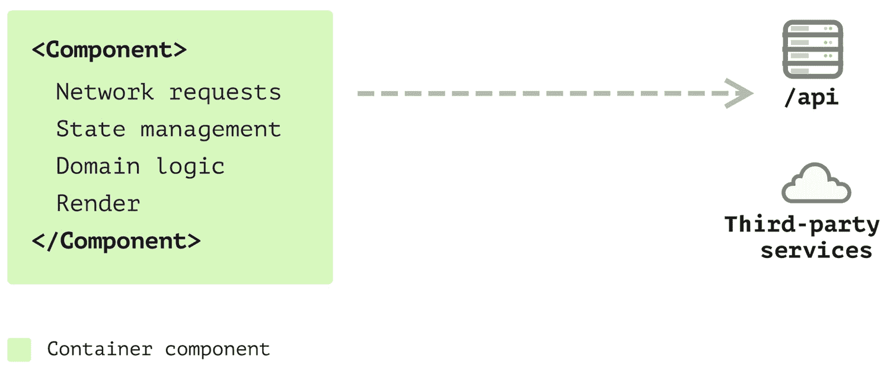

# 11

# 在 React 中引入分层架构

随着 React 应用程序的大小和复杂性的增长，有效地管理代码成为一个挑战。功能的线性增长可能导致复杂性的指数级增加，使得代码库难以理解、测试和维护。进入**分层架构**，这是一种不仅限于后端系统，而且对客户端应用程序同样有益的设计方法。

以分层方式构建你的 React 应用程序可以解决几个关键问题：

+   **关注点分离**：不同的层处理不同的责任，使得代码库更容易导航和理解

+   **可重用性**：业务逻辑和数据模型可以轻松地在应用程序的不同部分之间重用

+   **可测试性**：分层架构使得编写单元和集成测试更加简单，从而使得应用程序更加健壮

+   **可维护性**：随着应用程序的扩展，遵循分层结构进行更改或添加功能变得显著更容易

在本章中，我们将探讨在 React 应用程序的背景下分层架构的概念，深入探讨提取应用关注层、定义精确的数据模型以及展示策略模式的使用。通过逐步示例，我们将看到如何实际实现这些概念，以及为什么它们对于大规模应用程序是不可或缺的。

在本章中，我们将涵盖以下主题：

+   理解 React 应用程序的演变

+   提升 Code Oven 应用程序

+   实现 ShoppingCart 组件

+   深入研究分层架构

# 技术要求

已创建一个 GitHub 仓库来托管本书中讨论的所有代码。对于本章，你可以在[`github.com/PacktPublishing/React-Anti-Patterns/tree/main/code/src/ch11`](https://github.com/PacktPublishing/React-Anti-Patterns/tree/main/code/src/ch11)找到推荐的结构。

# 理解 React 应用程序的演变

不同规模的应用程序需要不同的策略。对于小型或一次性项目，你可能会发现所有逻辑都只是写在 React 组件内部。你可能只会看到一到几个组件。代码看起来几乎像是 HTML，只使用了一些变量或状态来使页面“动态”，但总体来说，代码易于理解和修改。

随着应用程序的增长，越来越多的代码被添加到代码库中，如果没有适当的方式来组织它们，代码库很快就会陷入不可维护的状态。这意味着即使添加小的功能也会变得耗时，因为开发者需要更多的时间来阅读代码。

在本节中，我将列出几种不同的方法，我们可以用这些方法来构建我们的 React 应用，以确保我们的代码始终保持健康状态，使得添加新功能变得轻而易举，并且易于扩展或修复现有缺陷。我们将从一个简单的结构开始，并逐步演进以处理规模问题。让我们快速回顾一下构建可扩展前端应用的步骤。

## 单组件应用

首先，让我们谈谈编写 React 应用的最简单方法——单组件应用。



图 11.1：单组件应用

单组件承担了各种任务，从从远程服务器获取数据、管理其内部状态，到处理领域逻辑，再到渲染。这种方法可能适用于只有单个表单的小型应用，或者那些希望了解将应用从另一个框架迁移到 React 的过程。

然而，你很快就会意识到将所有内容都整合到一个组件中会使代码难以理解和管理。所有内容都放在一个组件中会很快变得令人不知所措，尤其是在处理诸如遍历项目列表以创建单个组件的逻辑时。这种复杂性突显了将单组件分解为更小、职责明确的组件的需求。

## 多组件应用

决定将组件拆分为几个组件，这些结构反映了最终 HTML 上的情况，这是一个好主意，并且有助于你一次专注于一个组件。


实际上，你将从一个单体组件过渡到多个组件，每个组件都有特定的目的。例如，一个组件可能专门用于渲染列表，另一个用于渲染列表项，还有一个仅用于获取数据并将其传递给子组件。

有明确的职责会更好。然而，随着你的应用扩展，职责不仅限于视图层，还包括发送网络请求、为视图重塑数据以供消费、收集数据以发送回服务器等任务。此外，一旦数据被获取，可能还需要对数据进行转换的逻辑。将这种计算逻辑放在视图中似乎并不合适，因为它与用户界面没有直接关系。此外，一些组件可能会因为过多的内部状态而变得杂乱无章。

## 使用 Hooks 进行状态管理

将这种逻辑拆分到不同的地方会更好。幸运的是，在 React 中，你可以定义自己的 Hooks。这是一种在状态变化时共享状态和逻辑的绝佳方式。


图 11.3：使用 Hooks 进行状态管理

现在你已经从组件中提取了一堆元素。你有一些纯展示组件，一些可复用的钩子，它们使其他组件具有状态，还有一些容器组件（例如用于数据获取）。

在这个阶段，你可能会发现计算被分散在视图、钩子或各种实用函数中。缺乏结构可能会使进一步的修改变得非常具有挑战性，并且容易出错。例如，如果你已经获取了一些用于渲染的数据，但视图中的数据模式不同，你需要转换数据。然而，放置这种转换逻辑的位置可能并不明确。

## 提取商业模式

因此，你已经开始意识到将这种逻辑提取到另一个地方可以带来许多好处。例如，通过这种分割，逻辑可以更加一致且独立于任何视图。然后，你提取了一些领域对象。

这些简单的对象可以处理数据映射（从一个格式到另一个格式）、检查空值，并在需要时使用回退值。随着这些领域对象的增加，你会发现你需要一些继承或多态来使事情更加清晰。因此，你将应用从其他地方找到的许多有用的设计模式到前端应用中：


图 11.4：提取商业模式

现在，你的代码库已经通过更多元素扩展，每个元素都有关于其职责的明确边界。钩子用于状态管理，而领域对象代表领域概念，例如包含头像的用户对象，或代表支付方式详细信息的`PaymentMethod`对象。

随着我们从视图中分离出不同的元素，代码库相应地扩展。最终，我们会达到一个需要更高效地应对变化的点，这时我们需要对应用进行结构化。

## 分层前端应用

随着应用的持续发展，某些模式开始显现。你会注意到一些不属于任何用户界面的对象集合，它们对底层数据是否来自远程服务、本地存储或缓存保持中立。因此，你可能会希望将它们分离到不同的层。我们需要为应用的不同部分引入更好的方法。


图 11.5：分层前端应用

如*图 11.5*所示，我们可以将不同的部分分配到不同的文件夹中，每个文件夹都与其他文件夹明显且物理上隔离。这样，如果需要修改模型，你就不需要导航到视图文件夹，反之亦然。

那只是一个关于演变过程的高级概述，您应该对如何结构化您的代码或至少方向应该是什么有所了解。在更大规模的应用程序中，您可能会遇到各种模块和函数，每个都针对应用程序的不同方面进行了定制。这可能包括处理网络请求的请求模块，或者设计用于与各种数据供应商接口的适配器，例如谷歌的登录 API 或支付网关客户端。

然而，会有许多细节，例如如何定义一个模型，如何从视图或钩子中访问模型，等等。在将理论应用于您的应用程序之前，您需要考虑这些因素。

阅读更多

您可以在[`martinfowler.com/bliki/PresentationDomainDataLayering.html`](https://martinfowler.com/bliki/PresentationDomainDataLayering.html)找到关于表示域数据分层的高级概述。

在以下章节中，我将引导您扩展我们在*第七章*中介绍的 Code Oven 应用程序，以展示大型前端应用程序的基本模式和设计原则。

# 增强 Code Oven 应用程序

回想一下，到*第七章*结束时，我们开发了一个名为 Code Oven 的披萨店应用程序的基本结构，利用测试驱动开发为应用程序建立坚实的基础。


图 11.6：Code Oven 应用程序

注意

记住，我们使用设计草图作为指导，而不是详尽无遗地实现所有细节。主要目标仍然是说明如何在保持可维护性的同时重构代码。

虽然在第七章中我们没有深入探讨功能实现，但在本章中，我们将进一步扩展我们的设置。我们将探讨不同架构类型如何帮助我们管理复杂性。

作为复习，到*第七章*结束时，我们的结构看起来是这样的：

```js
export function PizzaShopApp() {
  const [cartItems, setCartItems] = useState<string[]>([]);
  const addItem = (item: string) => {
    setCartItems([...cartItems, item]);
  };
  return (
    <>
      <h1>The Code Oven</h1>
      <MenuList onAddMenuItem={addItem} />
      <ShoppingCart cartItems={cartItems} />
    </>
  );
}
```

我们假设数据是这样的形状：

```js
const pizzas = [
  "Margherita Pizza",
  "Pepperoni Pizza",
  "Veggie Supreme Pizza"
];
```

虽然这种设置允许消费者浏览餐厅提供的菜品，但如果我们启用在线订购，这将更有用。然而，一个直接的问题是披萨缺少价格和描述，这对于支持在线订购至关重要。描述也很重要，因为它们列出了配料，告知消费者包含的内容。

话虽如此，在 JavaScript 代码中定义菜单数据实际上并不实用。通常，我们会有一个服务来托管此类数据，提供更详细的信息。

为了展示这一点，假设我们有一个托管在[`api.code-oven.com/menus`](https://api.code-oven.com/menus)远程服务上的数据，定义如下：

```js
[
  {
    "id": "p1",
    "name": "Margherita Pizza",
    "price": 10.99,
    "description": "Classic pizza with tomato sauce and mozzarella",
    "ingredients": ["Tomato Sauce", "Mozzarella Cheese", "Basil", 
     "Olive Oil"],
    "allergyTags": ["Dairy"],
    "calories": 250,
    "category": "Pizza"
  },
  //...
]
```

为了弥合我们的应用程序和这些数据之间的差距，我们需要为远程数据定义一个类型，如下所示：

```js
type RemoteMenuItem = {
  id: string;
  name: string;
  price: number;
  description: string;
  ingredients: string[];
  allergyTags: string[];
  category: string;
  calories: number
}
```

现在，为了集成这个远程菜单数据，我们将使用`useEffect`来获取数据，并在获取后显示项目。我们将在`MenuList`组件内进行这些更改：

```js
const MenuList = ({
  onAddMenuItem,
}: {
  onAddMenuItem: (item: string) => void;
}) => {
  const [menuItems, setMenuItems] = useState<string[]>([]);
  useEffect(() => {
    const fetchMenuItems = async () => {
      const result = await fetch('https://api.code-oven.com/menus');
      const menuItems = await result.json();
      setMenuItems(menuItems.map((item: RemoteMenuItem) => item.
       name));
    }
    fetchMenuItems();
  }, [])
  return (
    <div data-testid="menu-list">
      <ol>
        {menuItems.map((item) => (
          <li key={item}>
            {item}
            <button onClick={() => onAddMenuItem(item)}>Add</button>
          </li>
        ))}
      </ol>
    </div>
  );
};
```

在这里，`MenuList`组件在初始渲染时从外部 API 获取菜单项列表并显示此列表。每个项目都附带一个`onAddMenuItem`函数，作为属性传递给`MenuList`，其参数为项目名称。

通过在获取数据后将`RemoteMenuItem`映射到字符串，我们确保我们的测试继续通过。

现在，我们的目标是揭示价格并将数据中的成分显示到 UI 组件中。然而，鉴于成分列表可能很长，我们只显示前三个以避免占用过多的屏幕空间。此外，我们希望使用小写的`category`并将其重命名为`type`。

初始时，我们定义一个新的类型以更好地结构化我们的数据：

```js
type MenuItem = {
  id: string;
  name: string;
  price: number;
  ingredients: string[];
  type: string;
}
```

在这里，`MenuItem`类型包括项目的`id`、`name`、`price`、`ingredients`和`type`属性。

现在，是时候更新我们的`MenuList`组件以使用这种新类型：

```js
const MenuList = ({
  onAddMenuItem,
}: {
  onAddMenuItem: (item: string) => void;
}) => {
  const [menuItems, setMenuItems] = useState<MenuItem[]>([]);
  useEffect(() => {
    const fetchMenuItems = async () => {
      const result = await fetch("http://api.code-oven.com/menus");
      const menuItems = await result.json();
      setMenuItems(
        menuItems.map((item: RemoteMenuItem) => {
          return {
            id: item.id,
            name: item.name,
            price: item.price,
            type: item.category.toUpperCase(),
            ingredients: item.ingredients.slice(0, 3),
          };
        })
      );
    };
    fetchMenuItems();
  }, []);
  return (
    <div data-testid="menu-list">
      <ol>
        {menuItems.map((item) => (
          <li key={item.id}>
            <h3>{item.name}</h3>
            <span>${item.price}</span>
            <div>
              {item.ingredients.map((ingredient) => (
                <span>{ingredient}</span>
              ))}
            </div>
            <button onClick={() => onAddMenuItem(item.name)}>Add
             </button>
          </li>
        ))}
      </ol>
    </div>
  );
};
```

在`MenuList`组件中，我们现在已经使用了`MenuItem`类型在我们的`useState`钩子中。在`useEffect`中触发的`fetchMenuItems`函数调用 API，获取菜单项，并将它们映射到以转换数据到所需的`MenuItem`格式。这种转换包括为每个项目保留`ingredients`数组中的前三个项目。

每个`MenuItem`组件随后在该组件内部渲染为一个列表项。我们显示项目的名称、价格，并遍历`ingredients`数组以渲染每个成分。

虽然代码是功能性的，但存在一个担忧：我们在单个组件中交织了网络请求、数据映射和渲染逻辑。将视图相关的代码与非视图代码分离是一种良好的实践，可以确保代码更干净、更易于维护。

## 通过自定义钩子重构 MenuList

我们不陌生于使用自定义钩子进行数据获取——这是一种增强可读性和整洁逻辑的实践。在我们的场景中，将`menuItems`状态和获取逻辑提取到单独的钩子中，将使`MenuList`组件变得简洁。

那么，让我们创建一个名为`useMenuItems`的钩子：

```js
const useMenuItems = () => {
  const [menuItems, setMenuItems] = useState<MenuItem[]>([]);
  useEffect(() => {
    const fetchMenuItems = async () => {
      const result = await fetch(
        "https://api.code-oven.com/menus"
      );
      const menuItems = await result.json();
      setMenuItems(
        menuItems.map((item: RemoteMenuItem) => {
          // ... transform RemoteMenuItem to MenuItem
        })
      );
    };
    fetchMenuItems();
  }, []);
  return { menuItems };
};
```

在`useMenuItems`钩子内部，我们使用空数组初始化`menuItems`状态。当钩子挂载时，它触发`fetchMenuItems`函数，从指定的 URL 获取数据。在获取之后，执行映射操作将每个`RemoteMenuItem`对象转换为`MenuItem`对象。转换的细节在此省略，但这是我们适应获取数据到所需格式的位置。随后，转换后的菜单项被设置为`menuItems`状态。

现在，在我们的`MenuList`组件中，我们可以简单地调用`useMenuItems`来获取`menuItems`数组：

```js
const MenuList = ({
  onAddMenuItem,
}: {
  onAddMenuItem: (item: string) => void;
}) => {
  const { menuItems } = useMenuItems();
  //...
}
```

这种重构非常有益，将`MenuList`重新定向到一个简化的状态，并恢复其单一职责。然而，当我们把注意力转向`useMenuItems`钩子，特别是数据映射部分时，发生了一些操作。它从远程数据中获取数据，并删除了一些未使用的字段，如`description`和`calories`。它还封装了仅保留前三个配料的逻辑。理想情况下，我们希望将这种转换逻辑集中到一个公共位置，确保代码整洁且易于管理。

## 过渡到基于类模型

如在第*第八章*中所述，将`MenuItem`类型定义应用于类中，从而将所有映射逻辑集中在这个类中。这种设置将作为一个专门的中心，用于处理任何未来的数据形状变更和相关逻辑。

将`MenuItem`从类型转换为类是直接的。我们需要一个构造函数来接受`RemoteMenuItem`和一些获取函数来访问数据：

```js
export class MenuItem {
  private readonly _id: string;
  private readonly _name: string;
  private readonly _type: string;
  private readonly _price: number;
  private readonly _ingredients: string[];
  constructor(item: RemoteMenuItem) {
    this._id = item.id;
    this._name = item.name;
    this._price = item.price;
    this._type = item.category;
    this._ingredients = item.ingredients;
  }
  // ... getter functions for id, name, price just returns the private 
          fields
  get type() {
    return this._type.toLowerCase();
  }
  get ingredients() {
    return this._ingredients.slice(0, 3);
  }
}
```

在`MenuItem`类中，我们为`id`、`name`、`type`、`price`和`ingredients`定义了私有的`readonly`属性。构造函数使用传递给它的`RemoteMenuItem`对象中的值来初始化这些属性。然后我们有每个属性的获取方法，以提供对其值的只读访问。特别是，`ingredients`获取方法只返回`ingredients`数组中的前三个项目。

虽然乍一看，这种设置似乎比简单类型定义的代码更多，但它有效地封装了数据并以受控的方式暴露它。这与不可变性和封装的原则相一致。类结构的美丽之处在于它能够容纳行为——在我们的案例中，配料切片逻辑被整洁地封装在类中。

在这个新类到位后，我们的`useMenuItems`钩子变得更加简洁：

```js
export const useMenuItems = () => {
  //...
  useEffect(() => {
    const fetchMenuItems = async () => {
      //...
      setMenuItems(
        menuItems.map((item: RemoteMenuItem) => {
          return new MenuItem(item);
        })
      );
    };
    fetchMenuItems();
  }, []);
  return { menuItems };
};
```

现在，`useMenuItems`钩子仅仅映射到获取的菜单项，为每个创建一个新的`MenuItem`实例，这显著清理了之前在钩子中存放的转换逻辑。

### 基于类模型的益处

从简单类型过渡到基于类模型带来了一系列优势，这些优势可以从长远来看为我们的应用程序提供良好的服务：

+   **封装**：类将相关的属性和方法集中在一起，从而促进清晰的架构和组织。它还限制了直接的数据访问，促进了更好的控制和数据完整性。

+   **方法行为**：对于与菜单项相关联的复杂行为或操作，类提供了一个结构化的平台来定义这些方法，无论它们是关于数据处理还是其他业务逻辑。

+   **继承和多态**：在菜单项之间存在层次结构或多态行为的情况下，类结构是必不可少的。它允许不同的菜单项类型从公共基类继承，根据需要覆盖或扩展行为。

+   **一致的界面**：类确保了对数据的统一接口，这在多个应用程序部分与菜单项交互时非常有价值。

+   **只读属性**：类允许定义只读属性，从而控制数据突变。这是维护数据完整性和使用不可变数据结构的一个关键方面。

现在，随着我们过渡到通过购物车扩展应用程序的功能，以从我们的数据建模练习中吸取的教训来处理这个新的部分至关重要。这将确保结构化和有效的实现，为用户友好的在线订购体验铺平道路。

# 实现购物车组件

在我们实施`ShoppingCart`组件的过程中，我们的目标是提供一个无缝的界面，让用户在结账前查看他们所选的商品。除了显示商品外，我们还打算通过一些吸引人的折扣政策奖励我们的客户。

在*第七章*中，我们定义了一个基本的`ShoppingCart`组件，如下所示：

```js
export const ShoppingCart = ({ cartItems }: { cartItems: string[] }) => {
  return (
    <div data-testid="shopping-cart">
      <ol>
        {cartItems.map((item) => (
          <li key={item}>{item}</li>
        ))}
      </ol>
      <button disabled={cartItems.length === 0}>Place My Order
       </button>
    </div>
  );
};
```

`ShoppingCart`组件接受一个`cartItems`属性，它是一个字符串数组。它返回一个包含有序列表（`<ol>`）的`div`标签，其中`cartItems`数组中的每个项目都被渲染为一个列表项（`<li>`）。在列表下方，`cartItems`数组为空。

然而，为了增强用户体验，显示每个商品的价格和总价在项目列表下方、**提交订单**按钮上方至关重要。以下是我们可以如何增强我们的组件以满足这些要求：

```js
export const ShoppingCart = ({ cartItems }: { cartItems: MenuItem[] }) => {
  const totalPrice = cartItems.reduce((acc, item) => (acc += item.price), 0);
  return (
    <div data-testid="shopping-cart" className="shopping-cart">
      <ol>
        {cartItems.map((item) => (
          <li key={item.id}>
            <h3>{item.name}</h3>
            <span>${item.price}</span>
          </li>
        ))}
      </ol>
      <div>Total: ${totalPrice}</div>
      <button disabled={cartItems.length === 0}>Place My Order
       </button>
    </div>
  );
};
```

`ShoppingCart`组件现在可以接受一个`cartItems`属性，它包含一个`MenuItem`对象数组（而不是简单的字符串）。为了计算购物车中商品的总价，我们使用`reduce`方法。此方法遍历每个项目，累计其价格以显示总价。然后组件返回一个 JSX 标记，渲染购物车项目的列表，每个项目都显示其名称和价格。

这个改进的`ShoppingCart`组件不仅增强了用户对订单的清晰度，还为引入折扣政策奠定了基础，我们可以在我们继续完善应用程序的过程中探索这些政策。

## 应用折扣到商品

假设我们对不同类型的菜单项有不同的折扣政策。例如，含有三个以上配料的披萨享有 10%的折扣，而大型意面菜肴享有 15%的折扣。

为了实现这一点，我们最初尝试通过一个名为`calculateDiscount`的新字段扩展`MenuItem`类：

```js
export class MenuItem {
  //... the private fields
  constructor(item: RemoteMenuItem) {
    //... assignment
  }
  get calculateDiscount() {
    return this.type === 'pizza' && this.toppings >= 3 ? this.price * 
     0.1 : 0;
  }
}
```

然而，我们遇到了一个问题——由于意面菜品没有配料，这导致了一个类型错误。

为了解决这个问题，我们首先提取了一个名为 `IMenuItem` 的接口，然后让 `PizzaMenuItem` 和 `PastaMenuItem` 类实现此接口：

```js
export interface IMenuItem {
  id: string;
  name: string;
  type: string;
  price: number;
  ingredients: string[];
  calculateDiscount(): number;
}
```

接下来，我们定义一个抽象类来实现接口，允许 `PizzaMenuItem` 和 `PastaMenuItem` 分别扩展这个抽象类：

```js
export abstract class AbstractMenuItem implements IMenuItem {
  private readonly _id: string;
  private readonly _name: string;
  private readonly _price: number;
  private readonly _ingredients: string[];
  protected constructor(item: RemoteMenuItem) {
    this._id = item.id;
    this._name = item.name;
    this._price = item.price;
    this._ingredients = item.ingredients;
  }
  static from(item: IMenuItem): RemoteMenuItem {
    return {
      id: item.id,
      name: item.name,
      price: item.price,
      category: item.type,
      ingredients: item.ingredients,
    };
  }
  //... the getter functions
  abstract calculateDiscount(): number;
}
```

在 `AbstractMenuItem` 类中，我们引入了一个静态的 `from` 方法。该方法接受一个 `IMenuItem` 实例，并将其转换为 `RemoteMenuItem` 实例，保留了我们应用程序所需的所有字段。

`calculateDiscount` 方法被声明为一个抽象方法，要求其子类实现实际的折扣计算。

注意

一个 **抽象类** 作为其他类的基类，不能单独实例化。它是一种定义一组派生类公共接口和/或实现的方式。抽象类通常包含抽象方法，这些方法声明时不包含实现，留由派生类提供具体的实现。通过这种方式，抽象类确保了公共结构，同时确保某些方法在派生类中得到实现，从而在所有派生类型之间促进了一致的行为。它们是面向对象编程中的关键特性，支持多态和封装。

我们需要在子类中重写并放置实际的 `calculateDiscount` 逻辑。对于 `PizzaMenuItem`，它简单地扩展了 `AbstractMenuItem` 并实现了 `calculateDiscount`：

```js
export class PizzaMenuItem extends AbstractMenuItem {
  private readonly toppings: number;
  constructor(item: RemoteMenuItem, toppings: number) {
    super(item);
    this.toppings = toppings;
  }
  calculateDiscount(): number {
    return this.toppings >= 3 ? this.price * 0.1 : 0;
  }
}
```

`PizzaMenuItem` 类继承自 `AbstractMenuItem`，继承了其属性和方法。它定义了一个私有的 `readonly` 属性 `toppings`，用于存储配料数量。在构造函数中，它接受两个参数：`RemoteMenuItem` 和 `toppings`（表示配料数量）。它使用 `super(item)` 调用 `AbstractMenuItem` 的构造函数，并用传入的 `toppings` 参数初始化 `this.toppings`。

`calculateDiscount` 方法被实现为，如果配料数量为 3 个或更多，则返回 10%的折扣。此方法覆盖了来自 `AbstractMenuItem` 的抽象 `calculateDiscount` 方法。

同样，我们可以创建一个 `PastaMenuItem` 类，如下所示：

```js
export class PastaItem extends AbstractMenuItem {
  private readonly servingSize: string;
  constructor(item: RemoteMenuItem, servingSize: string) {
    super(item);
    this.servingSize = servingSize;
  }
  calculateDiscount(): number {
    return this.servingSize === "large" ? this.price * 0.15 : 0;
  }
}
```

这些类之间的关系可以如图 *11.7* 所示：


图 11.7：模型类

`AbstractMenuItem` 抽象类实现了 `IMenuItem` 接口并使用 `RemoteMenuItem`。`PizzaItem` 和 `PastaItem` 都扩展了 `AbstractMenuItem` 并有自己的折扣计算逻辑。

接下来，在 `MenuList` 组件中，当向购物车添加项目时，我们根据项目类型创建正确的类实例：

```js
export const MenuList = ({}) => {
  //...
  const [toppings, setToppings] = useState([]);
  const [size, setSize] = useState<string>("small");
  const handleAddMenuItem = (item: IMenuItem) => {
    const remoteItem = AbstractMenuItem.from(item);
    if (item.type === "pizza") {
      onAddMenuItem(new PizzaMenuItem(remoteItem, toppings.length));
    } else if (item.type === "pasta") {
      onAddMenuItem(new PastaItem(remoteItem, size));
    } else {
      onAddMenuItem(item);
    }
  };
  return (
    //...
  );
};
```

`handleAddMenuItem` 函数使用 `AbstractMenuItem.from(item)` 方法将 `IMenuItem` 对象 `item` 转换为 `RemoteMenuItem` 对象。随后，它检查 `item` 的类型属性以确定它是否是披萨还是意面。如果是披萨，则使用 `remoteItem` 和选定的配料数量创建一个新的 `PizzaMenuItem` 实例，并通过 `onAddMenuItem` 函数将这个新项目添加到购物车中。如果项目既不是披萨也不是意面，则直接通过 `onAddMenuItem` 函数将原始项目添加到购物车中。

最后，在 `ShoppingCart` 组件中，我们像计算总价一样计算总折扣值，并用于渲染：

```js
export const ShoppingCart = ({ cartItems }: { cartItems: IMenuItem[] }) => {
  const totalPrice = cartItems.reduce((acc, item) => (acc += item.price), 0);
  const totalDiscount = cartItems.reduce(
    (acc, item) => (acc += item.calculateDiscount()),
    0
  );
  return (
    <div data-testid="shopping-cart">
      {/* rendering the list */}
      <div>Total Discount: ${totalDiscount}</div>
      <div>Total: ${totalPrice - totalDiscount}</div>
      <button disabled={cartItems.length === 0}>Place My Order
       </button>
    </div>
  );
};
```

`ShoppingCart` 组件通过遍历 `cartItems` 数组并累加每个项目的价格来计算 `totalPrice`。同样，它通过调用每个项目的 `calculateDiscount()` 方法来计算 `totalDiscount`，即累加每个项目的折扣。在返回的 JSX 中，它渲染一个列表，并显示 `totalDiscount` 和最终的总价（即 `totalPrice` 减去 `totalDiscount`）。

在这个阶段，函数运行得非常有效。然而，还有几个因素需要考虑——折扣目前是针对每个产品指定的：例如，披萨有自己的折扣规则，而意面有自己的。如果我们需要实现全店折扣，比如公共假期的折扣，我们的方法会是什么？

## 探索策略模式

假设是繁忙的周五晚上，我们希望对所有披萨和饮料提供特别折扣。然而，我们不想对已经打折的项目应用额外的折扣——例如，四种配料的披萨只能获得这个特定的特别折扣。

处理这样的任意折扣可能很复杂，需要将计算逻辑从项目类型中解耦。此外，我们希望有灵活性在周五之后或一定时期后移除这些折扣。

我们可以使用名为 **策略模式** 的设计模式来实现这里的灵活性。策略模式是一种行为设计模式，它允许在运行时选择算法的实现。它封装了一组算法，并使它们可互换，允许客户端选择最合适的一个，而无需修改代码。

我们将提取逻辑到一个单独的实体中，定义一个策略接口如下：

```js
export interface IDiscountStrategy {
  calculate(price: number): number;
}
```

此接口为不同的折扣策略提供了一个蓝图。例如，我们可以有一个没有折扣的策略：

```js
class NoDiscountStrategy implements IDiscountStrategy {
  calculate(price: number): number {
    return 0;
  }
}
```

`NoDiscountStrategy` 类实现了 `IDiscountStrategy` 接口，并带有 `calculate` 方法，该方法接受一个价格作为输入并返回零，这意味着没有应用折扣。

对于 `SpecialDiscountStrategy` 组件，将应用一个提供 15% 折扣的特殊折扣策略：

```js
class SpecialDiscountStrategy implements IDiscountStrategy {
  calculate(price: number): number {
    return price * 0.15;
  }
}
```

要利用这些策略，我们需要稍微修改一下 `IMenuItem` 接口：

```js
export interface IMenuItem {
  // ... other fields
  discountStrategy: IDiscountStrategy;
}
```

我们在 `IMenuItem` 接口中添加了 `discountStrategy` 类型为 `IDiscountStrategy`。由于我们将计算折扣的逻辑移动到了策略中，我们不再需要在 `AbstractMenuItem` 中使用 `calculateDiscount` 抽象方法，因此该类将不再保持抽象状态，所以我们将其重命名为 `BaseMenuItem`。相反，它将包含一个用于折扣策略的设置器并实现折扣计算：

```js
export class BaseMenuItem implements IMenuItem {
  // ... other fields
  private _discountStrategy: IDiscountStrategy;
  constructor(item: RemoteMenuItem) {
    // ... other fields
    this._discountStrategy = new NoDiscountStrategy();
  }
  // ... other getters
  set discountStrategy(strategy: IDiscountStrategy) {
    this._discountStrategy = strategy;
  }
  calculateDiscount() {
    return this._discountStrategy.calculate(this.price);
  }
}
```

`BaseMenuItem` 类现在实现了 `IMenuItem` 接口，并封装了一个折扣策略，最初设置为 `NoDiscountStrategy`。它定义了一个设置器来更新折扣策略，以及一个 `calculateDiscount` 方法，该方法将折扣计算委托给封装的折扣策略的 `calculate` 方法，并将商品的价格作为参数传递。

*图 11.8* 现在应该能让你更清楚地了解关系：


图 11.8：所有类的类图

如观察所示，`BaseMenuItem` 实现了 `IMenuItem` 接口并使用 `IDiscountStrategy`。存在多个 `IDiscountStrategy` 接口的实现，用于特定的折扣算法，并且有多个类扩展了 `BaseMenuItem` 类。

注意，`RemoteMenuItem` 类型被所有实现 `IMenuItem` 接口的类使用。

现在，当我们需要应用特定的策略时，可以轻松完成，如下所示：

```js
export const MenuList = ({
  onAddMenuItem,
}: {
  onAddMenuItem: (item: IMenuItem) => void;
}) => {
  // ...
  const handleAddMenuItem = (item: IMenuItem) => {
    if (isTodayFriday()) {
      item.discountStrategy = new SpecialDiscountStrategy();
    }
    onAddMenuItem(item);
  };
```

在 `MenuList` 组件中，`handleAddMenuItem` 函数使用 `isTodayFriday` 函数检查今天是否是星期五。如果是，它在将项目传递给接收作为属性的 `onAddMenuItem` 函数之前，将项目的 `discountStrategy` 设置为 `SpecialDiscountStrategy` 的新实例。这样，在星期五对菜单项应用特殊折扣。

这种设置为我们提供了所需的灵活性。例如，在 `handleAddMenuItem` 函数中，根据是否是星期五或项目是披萨，我们可以轻松切换折扣策略：

```js
const handleAddMenuItem = (item: IMenuItem) => {
  if (isTodayFriday()) {
    item.discountStrategy = new SpecialDiscountStrategy();
  }
  if(item.type === 'pizza') {
    item.discountStrategy = new PizzaDiscountStrategy();
  }
  onAddMenuItem(item);
};
```

在这个 `handleAddMenuItem` 函数中，根据某些条件，在将项目传递给 `onAddMenuItem` 函数之前，对项目应用不同的折扣策略。最初，它使用 `isTodayFriday()` 检查今天是否是星期五，如果是，则将 `SpecialDiscountStrategy` 的新实例分配给 `item.discountStrategy`。然而，如果项目是 `pizza` 类型，无论哪一天，它都会用 `PizzaDiscountStrategy` 的新实例覆盖 `item.discountStrategy`。

这种方法使我们的折扣逻辑模块化且易于调整，通过最小化代码修改来适应不同的场景。随着我们从应用程序代码中提取新的逻辑组件——钩子、数据模型、领域逻辑（折扣策略）和视图，它正在演变成一个分层的前端应用程序。

# 深入分层架构

我们的应用已经完美过渡到一个更健壮的状态，具有清晰、易懂且可修改的逻辑，现在也更加便于测试。

我设想的一个进一步改进是将`ShoppingCart`中存在的逻辑移至自定义 Hook。我们可以这样做：

```js
export const useShoppingCart = (items: IMenuItem[]) => {
  const totalPrice = useMemo(
    () => items.reduce((acc, item) => (acc += item.price), 0),
    [items]
  );
  const totalDiscount = useMemo(
    () => items.reduce((acc, item) => (acc += item.
     calculateDiscount()), 0),
    [items]
  );
  return {
    totalPrice,
    totalDiscount,
  };
};
```

`useShoppingCart` Hook 接受一个`IMenuItem`对象数组，并计算两个值——`totalPrice`和`totalDiscount`：

+   `totalPrice`是通过减少项目数量，对它们的`price`属性进行求和来计算的

+   `totalDiscount`是通过减少项目数量，对每个项目通过调用`item.calculateDiscount()`获得的折扣进行求和来计算的

这两个计算都被`useMemo`包装，以确保只有在项目数组发生变化时才会重新计算。

通过这次修改，`ShoppingCart`变得简洁优雅，可以轻松利用这些值：

```js
export const ShoppingCart = ({ cartItems }: { cartItems: IMenuItem[] }) => {
  const { totalPrice, totalDiscount } = useShoppingCart(cartItems);
  return (
    {/* JSX for the rendering logic */}
  );
};
```

另一种方法可能是使用 context 和`useReducer` Hook 来管理上下文中和 Hooks 中的所有逻辑，然而，由于我们在*第八章*中已经探讨了这一点，我将进一步的探索留给你们（你们可以使用*第八章*中提供的代码示例以及本章，并尝试使用`context`和`useReducer`来简化`ShoppingCart`）。

## 应用程序的分层结构

我们已经深入探讨了将组件和模型组织到单独的文件中；继续改进我们的项目结构同样至关重要。具有不同职责的函数应该位于不同的文件夹中，这样可以简化应用程序的导航并节省时间。我们的应用程序现在展现出了新的结构解剖学：

```js
src
├── App.tsx
├── hooks
│   ├── useMenuItems.ts
│   └── useShoppingCart.ts
├── models
│   ├── BaseMenuItem.ts
│   ├── IMenuItem.ts
│   ├── PastaItem.ts
│   ├── PizzaMenuItem.ts
│   ├── RemoteMenuItem.ts
│   └── strategy
│       ├── IDiscountStrategy.ts
│       ├── NoDiscountStrategy.ts
│       ├── SpecialDiscountStrategy.ts
│       └── TenPercentageDiscountStrategy.ts
└── views
    ├── MenuList.tsx
    └── ShoppingCart.tsx
```

正是这样形成了层。在视图层中，我们主要使用纯 TSX 渲染直接标签。这些视图利用 Hooks 进行状态和副作用管理。同时，在模型层中，模型对象包含业务逻辑、在不同折扣策略之间切换的算法和数据形状转换等功能。这种结构促进了关注点的分离，使得代码更加有序、可重用且易于维护。

需要注意的是这里的一个单向链接；上层访问下层，但反之则不然。TSX 使用 Hooks 进行状态管理，Hooks 使用模型进行计算。然而，我们无法在模型层中使用 JSX 或 Hooks。这种分层技术使得在不影响上层的情况下，可以方便地更改或替换底层，促进了干净且易于维护的结构。

在我们的 Code Oven 应用程序中，如图*图 11.9*所示，布局包括左侧的菜单项列表和右侧的购物车。在购物车中，每个项目在页面上显示详细的折扣和价格信息。


图 11.9：应用程序的最终外观和感觉

## 分层架构的优势

分层架构带来了许多好处：

+   **增强可维护性**：将组件划分为不同的部分，便于更容易地识别和纠正特定代码部分的缺陷，从而最小化花费的时间和减少在修改过程中产生新错误的可能性。

+   **增加模块化**：这种架构本质上是更模块化的，促进了代码重用，简化了新功能的添加。即使在每个层，如视图层，代码也往往更易于组合。

+   **增强可读性**：代码中的逻辑变得更加易于理解和导航，这不仅对原始开发者有益，也对可能与之交互的其他人有益。这种清晰度对于在代码中实施变更至关重要。

+   **提高可扩展性**：每个模块内的复杂性降低，使得应用程序更易于扩展，更容易引入新功能或变更，而不会影响整个系统——这对于预计会随时间演变的庞大、复杂的应用程序来说是一个关键优势。

+   **技术栈迁移**：尽管在大多数项目中不太可能，但如果需要，可以通过封装在纯 JavaScript（或 TypeScript）代码中的领域逻辑（对视图的存在无感知），在不改变底层模型和逻辑的情况下替换视图层。

# 摘要

在本章中，我们在应用程序中实现了分层架构，增强了其可维护性、模块化、可读性、可扩展性和技术栈迁移的潜力。通过分离逻辑，通过自定义钩子精炼`ShoppingCart`组件，并将应用程序组织成不同的层，我们显著增强了代码的结构和管理便捷性。这种架构方法不仅简化了当前的代码库，还为未来的扩展和改进奠定了坚实的基础。

在下一章中，我们将探讨从头开始实现应用程序的端到端旅程，使用用户验收测试驱动的开发方法，在过程中进行重构、清理，并始终努力保持我们的代码尽可能干净。
