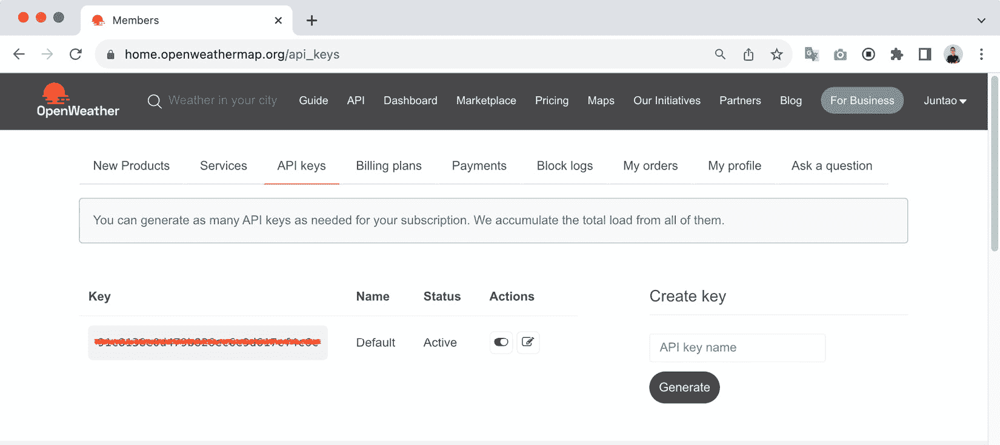
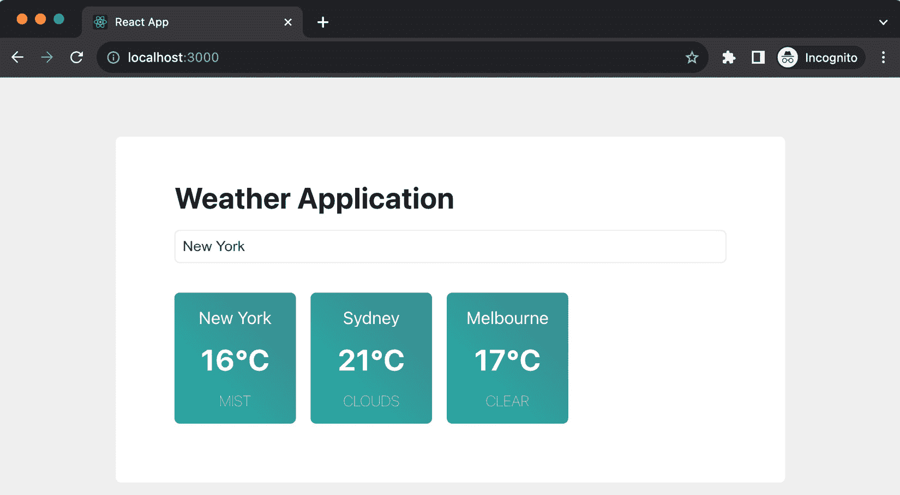
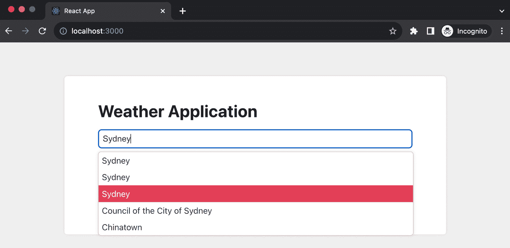
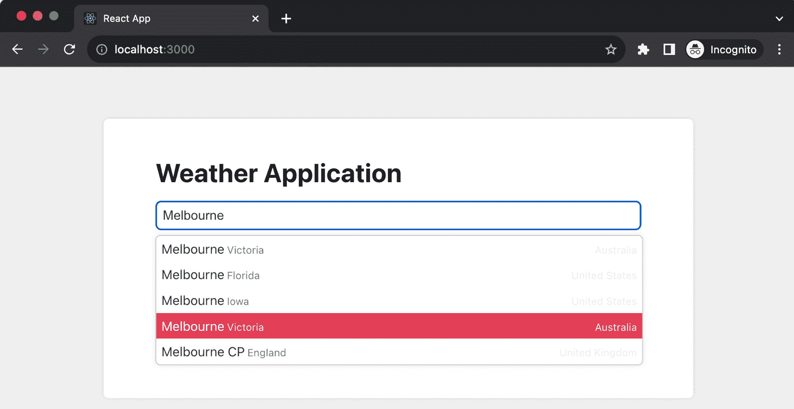
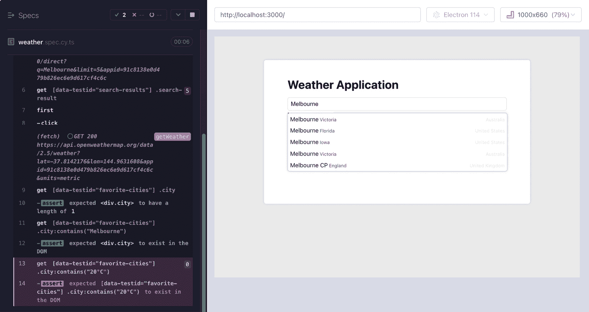
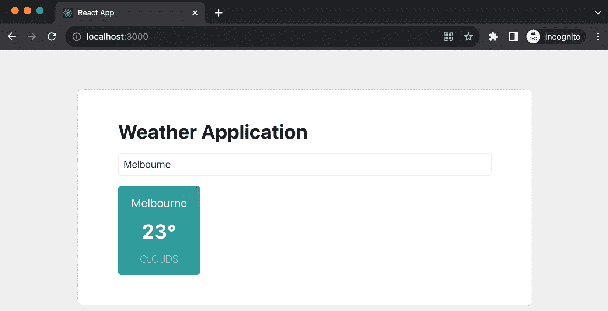
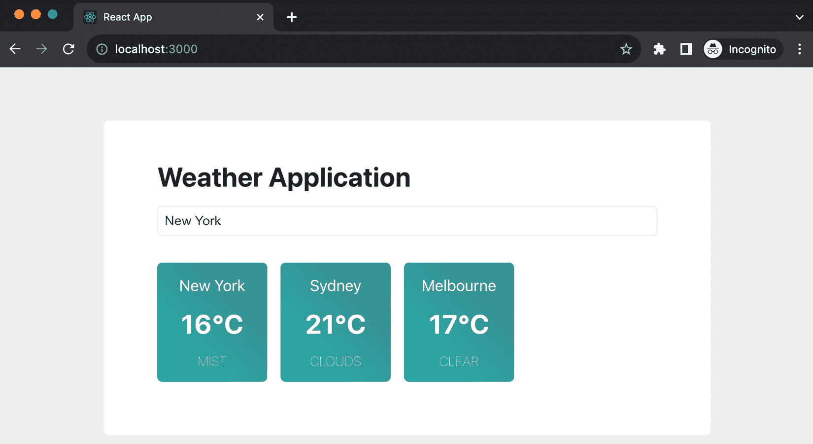
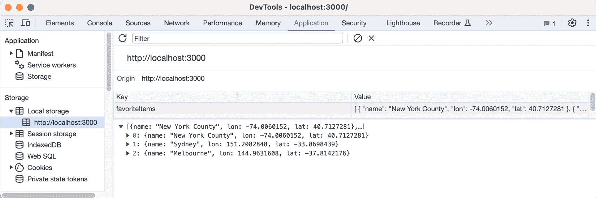

# 12

# 实现端到端项目

在前面的章节中，我们深入探讨了各种主题，包括测试、**测试驱动开发（TDD**）、设计模式和设计原则。这些概念非常有价值，因为它们为构建更健壮和可维护的代码库铺平了道路。现在，我想开始一段从零开始构建应用程序的旅程，将我们所学知识应用于解决端到端场景。

目标是展示我们如何将需求分解为可执行的任务，然后进行测试和实现。我们还将探讨如何模拟网络请求，从而在开发过程中消除对远程系统的依赖，以及如何在没有担心破坏现有功能的情况下自信地重构代码。

我们将从头开始构建一个功能性的天气应用程序，与真实的天气 API 服务器接口以获取和显示天气数据列表。在这个过程中，我们将实现诸如键盘交互等无障碍功能，回顾**反腐败层（ACL**）和单一职责原则，以及更多内容。

总体目标是展示构建一个功能软件解决方案的端到端过程，同时保持代码的可维护性、可理解性和可扩展性。

将涵盖以下主题：

+   审查天气应用程序的要求

+   编写我们的初始验收测试

+   实现城市搜索功能

+   实现 ACL

+   实现添加到收藏夹功能

+   当应用程序重新启动时获取以前的天气数据

# 技术要求

已创建一个 GitHub 仓库来托管本书中将要讨论的所有代码。对于本章，您可以在[`github.com/PacktPublishing/React-Anti-Patterns/tree/main/code/src/ch12`](https://github.com/PacktPublishing/React-Anti-Patterns/tree/main/code/src/ch12)找到推荐的架构。

在我们继续之前，我们需要完成几个步骤。请遵循下一节以设置必要的 API 密钥。

## 获取 OpenWeatherMap API 密钥

要使用 OpenWeatherMap，您需要在[`openweathermap.org/`](https://openweathermap.org/)创建一个账户。尽管根据使用情况有多种计划可供选择，但免费计划足以满足我们的需求。注册后，导航到**我的 API 密钥**以找到您的 API 密钥，如图*图 12.1*所示：



图 12.1：OpenWeatherMap API 密钥

请将此密钥随身携带，因为我们将会用它来调用天气 API 以获取数据。

## 准备项目的代码库

如果您想跟我一起做，在我们开始之前，您需要安装几个包。然而，如果您想看到最终结果，它们已经在前面提到的仓库中。我建议您跟随操作，看看我们如何将应用程序逐步发展到最终状态。

为了开始，我们将使用以下命令创建一个新的 React 应用程序：

```js
npx create-react-app weather-app --template typescript
cd weather-app
yarn add cypress jest-fetch-mock -D
yarn install
```

这些命令用于设置一个新的 React 项目，使用 TypeScript 和 Cypress：

+   `npx create-react-app weather-app --template typescript`：此命令使用`npx`运行`create-react-app`实用程序，在名为`weather-app`的目录中构建一个新的 React 应用程序。`--template typescript`选项指定该项目应配置为使用 TypeScript。

+   `yarn add cypress jest-fetch-mock -D`：此命令将 Cypress（一个测试框架）作为开发依赖项安装到项目中，并将`jest-fetch-mock`用于在 jest 测试中模拟`fetch`函数。`-D`标志表示这是一个开发依赖项，这意味着它不是应用程序生产版本所必需的。

+   `yarn install`：此命令安装项目`package.json`文件中列出的所有依赖项，确保所有必要的库和工具都可用。

最后，我们可以通过运行以下命令启动模板应用程序：

```js
yarn start
```

这将在端口 3000 上启动应用程序。您可以将应用程序在端口 3000 上运行并保持打开状态，然后在另一个终端窗口中运行测试。

# 审查天气应用程序的要求

我们构想的天气应用程序旨在成为一个功能齐全的平台，具有以下功能：

+   使用户能够搜索感兴趣的城市，无论是他们的家乡、当前居住地还是未来的旅行目的地

+   允许用户将城市添加到收藏夹中，选择将持久化本地，以便在未来的访问中轻松访问

+   支持向用户的列表中添加多个城市

+   确保网站可以通过键盘完全导航，从而方便所有用户访问

结果将类似于*图 12**.2*中所示：



图 12.2：天气应用程序

虽然这不是一个过于复杂的应用程序，但它包含了几个有趣元素。例如，我们将克服在 UI 应用程序中应用 TDD 的障碍，测试 Hooks，并在何时使用用户验收测试与较低级别的测试之间做出明智的决定。

我们将开始一个初始验收测试，以确保应用程序端到端运行，尽管它只是验证单个文本元素的外观。

# 构建我们的初始验收测试

*第七章* 使我们熟悉了从验收测试开始的概念——这种测试是从最终用户的角度出发的，而不是从开发者的角度。本质上，我们旨在让我们的测试验证用户在网页上会感知或与之交互的方面，而不是像函数调用或类初始化这样的技术细节。

在您在*技术要求*部分创建的文件夹中（即`weather-app`），在`cypress/e2e/weather.spec.cy.ts`中创建一个 Cypress 测试：

```js
describe('weather application', () => {
  it('displays the application title', () => {
    cy.visit('http://localhost:3000/');
    cy.contains('Weather Application');
  });
});
```

在此代码片段中，我们定义了一个名为`weather application`的测试套件。它使用 Cypress 测试框架中的 describe 函数。此测试用例包括两个主要操作：使用`cy.visit`导航到本地开发服务器 http://localhost:3000/，然后使用`cy.contains`检查页面以确保它包含`Weather Application`文本。如果找到`Weather Application`，则测试将通过；如果没有找到，则测试将失败。

使用`npx cypress run`执行测试时，正如预期的那样，由于我们的应用程序尚未修改，控制台将显示错误：

```js
  1) weather application
       displays the application title:
     AssertionError: Timed out retrying after 4000ms: Expected to find 
      content: 'Weather Application' but never did.
      at Context.eval (webpack://tdd-weather/./cypress/e2e/weather.
       spec.cy.ts:4:7)
```

此错误表明它预期会找到`Weather Application`文本，但未在 Cypress 指定的默认 4 秒超时时间内找到它。为了纠正这一点，我们需要调整`App.tsx`，使其包含此文本。

在清除`App.tsx`中的当前内容（由`create-react-app`生成）后，我们将插入一个简单的`h1`标签以显示文本：

```js
import React from 'react';
function App() {
  return (
    <div className="App">
      <h1>Weather Application</h1>
    </div>
  );
}
```

此代码在 React 中定义了一个名为`App`的功能组件，它渲染一个包含`Weather Application`文本的`div`元素。有了这个标题的定义，我们的 Cypress 测试将通过。

现在，让我们继续到第一个有意义的特性——允许用户按城市名称搜索。

# 实现城市搜索功能

让我们开始开发我们的第一个特性——城市搜索。用户将能够将城市名称输入到搜索框中，这将触发对远程服务器的请求。在接收到数据后，我们将将其渲染成列表供用户选择。在整个章节中，我们将使用 OpenWeatherMap API 进行城市搜索以及获取天气信息。

## 介绍 OpenWeatherMap API

OpenWeatherMap 是一个通过 API 提供全球天气数据的服务，允许用户访问任何地点的当前、预测和历史天气数据。它是开发人员在应用程序和网站上嵌入实时天气更新的流行选择。

在我们的天气应用程序中，我们将使用两个 API：一个用于按名称搜索城市，另一个用于获取实际实时天气。要使用 API，您需要按照*技术* *要求*部分中的说明获得的 API 密钥。

您可以尝试使用浏览器或命令行工具（如`curl`或 http [`httpie.io/`](https://httpie.io/)）向 OpenWeatherMap 发送请求：

```js
http https://api.openweathermap.org/geo/1.0/direct?q="Melbourne"&limit=5&appid=<your-app-key>
```

这行代码使用`http`命令向 OpenWeatherMap API 发送 HTTP 请求，特别是其地理编码端点（`geo/1.0/direct`），查找名为`Melbourne`的城市，结果限制为 5 个。`appid`（如前述 URL 中指定）参数是您需要插入*您的* OpenWeatherMap API 密钥以验证请求的地方。

因此，该命令检索名为墨尔本的城市的基本地理编码信息，这些信息可以稍后用于获取这些位置的天气数据。您将得到如下所示的 JSON 格式的结果：

```js
[
    {
        "country": "AU",
        "lat": -37.8142176,
        "local_names": {},
        "lon": 144.9631608,
        "name": "Melbourne",
        "state": "Victoria"
    },
    {
        "country": "US",
        "lat": 28.106471,
        "local_names": {
        },
        "lon": -80.6371513,
        "name": "Melbourne",
        "state": "Florida"
    }
]
```

请注意，OpenWeatherMap 免费计划附带一个速率限制，限制我们每分钟最多 60 个请求和每月最多 1,000,000 个请求。虽然这些限制看起来很高，但在开发和测试调试过程中，请求的数量可以迅速累积。为了节省我们的请求配额，我们将避免向真实服务器发送请求，而是模拟这些请求，返回预定义的值。有关模拟的复习，请参阅*第五章*。

让我们将结果数据保存到名为`search-results.json`的文本文件中，该文件位于`cypress/fixtures/search-result.json`下。

## 模拟搜索结果

文件就绪后，我们可以为`fixtures/search-result.json`编写一个测试：

```js
import searchResults from '../fixtures/search-result.json';
describe('weather application', () => {
  //...
  it('searches for a city', () => {
    cy.intercept("GET", "https://api.openweathermap.org/geo/1.0/
     direct?q=*", {
      statusCode: 200,
      body: searchResults,
    });
    cy.visit('http://localhost:3000/');
    cy.get('[data-testid="search-input"]').type('Melbourne');
    cy.get('[data-testid="search-input"]').type('{enter}');
    cy.get('[data-testid="search-results"] .search-result')
      .should('have.length', 5);
  });
});
```

在这里，我们创建了一个名为`'searches for a city'`的测试用例。该测试用例执行以下操作：

1.  首先，它设置了一个拦截针对 OpenWeatherMap API 城市搜索的`GET`请求。每当有符合标准的请求时，它以 200 状态码和来自预定义的`searchResults`文件的正文内容作为响应，实际上模拟了 API 响应。

1.  然后，它导航到运行在`http://localhost:3000/`的应用程序。

1.  接下来，它模拟用户在一个具有`data-testid`值为`search-input`的输入字段中输入`Melbourne`，并按下*Enter*键。

1.  最后，它检查一个具有`data-testid`值为`"search-results"`的容器是否包含恰好五个具有`search-result`类的元素，这些元素是从模拟的 API 请求返回的搜索结果。这验证了应用程序正确显示了搜索结果。

我们现在处于 TDD 的红色步骤（第一个步骤，表示测试失败），所以让我们进入我们的应用程序代码`App.tsx`来修复测试：

```js
function App() {
  const [query, setQuery] = useState<string>("");
  const [searchResults, setSearchResults] = useState<any[]>([]);
  const handleKeyDown = (e: KeyboardEvent<HTMLInputElement>) => {
    if (e.key === "Enter") {
      fetchCities();
    }
  };
  const handleChange = (e: ChangeEvent<HTMLInputElement>) => {
    setQuery(e.target.value);
  };
  const fetchCities = () => {
    fetch(
      `https://api.openweathermap.org/geo/1.0/direct?q=${query}&limit=
       5&appid=<app-key>`
    )
      .then((r) => r.json())
      .then((cities) => {
        setSearchResults(
          cities.map((city: any) => ({
            name: city.name,
          }))
        );
      });
  };
  return (
    <div className="app">
      <h1>Weather Application</h1>
      <div className="search-bar">
        <input
          type="text"
          data-testid="search-input"
          onKeyDown={handleKeyDown}
          onChange={handleChange}
          placeholder="Enter city name (e.g. Melbourne, New York)"
        />
      </div>
      <div className="search-results-popup">
        {searchResults.length > 0 && (
          <ul data-testid="search-results">
            {searchResults.map((city, index) => (
              <li key={index} className="search-result">
                {city.name}
              </li>
            ))}
          </ul>
        )}
      </div>
    </div>
  );
}
```

代码中的`App`函数使用 React 设置了一个简单的天气应用程序。它初始化`query`和`searchResults`状态变量来处理用户输入和显示搜索结果。`handleKeyDown`和`handleChange`事件处理器被设置来更新搜索查询并在用户按下*Enter*时触发城市搜索。`fetchCities`函数向 OpenWeatherMap API 发送请求，处理响应以提取城市名称，并更新`searchResults`。

在 TSX 部分，提供了一个输入字段供用户输入城市名称，并且每当有可用的搜索结果时，都会显示一个列表。

这些更改后，测试现在通过，我们可以启动浏览器来访问应用程序。如图*图 12**.3 所示，我们的实现现在在执行搜索后显示城市下拉列表：



图 12.3：搜索结果下拉菜单

注意

我已经加入了一些 CSS 来增强视觉效果。然而，为了保持对核心内容的关注，CSS 在此处并未包含。为了全面理解，您可以参考*技术要求*部分中提到的仓库，以查看完整的实现。

## 增强搜索结果列表

由于我们使用城市名称进行搜索查询，在搜索结果中遇到多个匹配项是很常见的。为了细化这一点，我们可以为每个项目添加额外的详细信息，例如州名、国家名，甚至坐标，以使结果更加独特。

按照 TDD（测试驱动开发）方法，我们将从一个测试开始。虽然可以构建一个 Cypress 测试，但详细说明这些方面更适合于单元测试等低级测试。Cypress 测试是端到端的，包括所有部分——页面、网络（甚至带有拦截器）——并且从其角度来看，它感知不到组件，只有 HTML、CSS 和 JavaScript。这使得它们运行成本更高，与低级测试相比，低级测试通常在内存浏览器中运行，并关注隔离的区域。

为了这次增强，我们将使用 Jest 测试，它们更轻量级、更快，并且在测试用例编写中提供特异性。

在下面的代码片段中，我们旨在测试一个项目是否显示城市名称：

```js
it("shows a city name", () => {
  render(<SearchResultItem item={{ city: "Melbourne" }} />);
  expect(screen.getByText("Melbourne")).toBeInTheDocument();
});
```

在这里，我们调用 React Testing Library 中的`render`方法，对一个带有`city`字段的`SearchResultItem`组件进行传递属性。然后，我们断言文档中存在`Melbourne`文本。

到目前为止，我们还没有准备好用于测试的`SearchResultItem`组件。然而，一点重构可以帮助我们提取一个。让我们创建一个`SearchResultItem.tsx`文件，并按如下定义组件：

```js
export const SearchResultItem = ({ item }: { item: { city: string } }) => {
  return <li className="search-result">{item.city}</li>;
};
```

现在，将组件集成到`App.tsx`中：

```js
function App() {
  //...
  <div className="search-results-popup">
    {searchResults.length > 0 && (
      <ul data-testid="search-results" className="search-results">
        {searchResults.map((city, index) => (
          <SearchResultItem key={index} item={{ city }} />
        ))}
      </ul>
    )}
  </div>
  //...
}
```

在`App.tsx`的这一部分，我们遍历`searchResults`，为每个城市渲染`SearchResultItem`，并将城市数据作为属性传递。

现在，让我们扩展我们的测试，以检查城市名称、州和国家：

```js
it("shows a city name, the state, and the country", () => {
  render(
    <SearchResultItem
      item={{ city: "Melbourne", state: "Victoria", country: 
       "Australia" }}
    />
  );
  expect(screen.getByText("Melbourne")).toBeInTheDocument();
  expect(screen.getByText("Victoria")).toBeInTheDocument();
  expect(screen.getByText("Australia")).toBeInTheDocument();
});
```

接下来，为了适应这些新字段，我们将调整`SearchResultItem`的类型定义，并渲染传递的属性：

```js
type SearchResultItemProps = {
  city: string;
  state: string;
  country: string;
};
export const SearchResultItem = ({ item }: { item: SearchResultItemProps }) => {
  return (
    <li className="search-result">
      <span>{item.city}</span>
      <span>{item.state}</span>
      <span>{item.country}</span>
    </li>
  );
};
```

在这里，我们定义一个`SearchResultItemProps`类型，以指定项目属性的结构，确保它包含`city`、`state`和`country`字段。然后，我们的`SearchResultItem`组件将这些字段在列表项中渲染，每个字段都在一个单独的`span`元素中。

如您所见，现在，列表项提供了更多细节，以帮助用户区分结果：



图 12.4：增强的城市下拉列表

在我们继续到下一个主要功能之前，让我们先处理一些日常维护任务。虽然我们一直专注于交付功能，但到目前为止，我们并没有太多关注代码质量，所以让我们来做这件事。

# 实现访问控制列表（ACL）

在我们的应用程序中，`SearchResultItem` 组件很好地完成了其任务。然而，挑战来自于我们所需要的数据形状与我们从远程服务器接收到的数据形状之间的差异。

考虑服务器的响应：

```js
[
    {
    "country": "US",
    "lat": 28.106471,
    "local_names": {
      "en": "Melbourne",
      "ja": "メルボーン",
      "ru": "Мельбурн",
      "uk": "Мелборн"
    },
    "lon": -80.6371513,
    "name": "Melbourne",
    "state": "Florida"
  }
]
```

服务器响应中包含许多我们不需要的元素。此外，我们希望保护我们的 `SearchResultItem` 组件免受服务器数据形状未来更改的影响。

正如我们在*第八章*中讨论的那样，我们可以使用访问控制列表（ACL）来解决这个问题。使用它，我们旨在直接映射城市名称和州，但对于国家，我们希望显示其全名，以避免在用户界面中产生任何歧义。

要做到这一点，首先，我们必须定义一个 `RemoteSearchResultItem` 类型来表示远程数据形状：

```js
interface RemoteSearchResultItem {
  city: string;
  state: string;
  country: string;
  lon: number;
  lat: number;
  local_names: {
    [key: string]: string
  }
}
```

接下来，我们必须将 `SearchResultItemProps` 类型更改为类，使其可以在 TypeScript 代码中初始化：

```js
const countryMap = {
  "AU": "Australia",
  "US": "United States",
  "GB": "United Kingdom"
  //...
}
class SearchResultItemType {
  private readonly _city: string;
  private readonly _state: string;
  private readonly _country: string;
  constructor(item: RemoteSearchResultItem) {
    this._city = item.city;
    this._state = item.state;
    this._country = item.country
  }
  get city() {
    return this._city
  }
  get state() {
    return this._state
  }
  get country() {
    return countryMap[this._country] || this._country;
  }
}
```

这段代码定义了一个类，`SearchResultItemType`，它在 `constructor` 中接受一个 `RemoteSearchResultItem` 对象，并相应地初始化其属性。它还提供了获取器方法来访问这些属性，对于国家属性，有一个特殊处理程序将国家代码映射到其全名。

现在，我们的 `SearchResultItem` 组件可以利用这个新定义的类：

```js
import React from "react";
import { SearchResultItemType } from "./models/SearchResultItemType";
export const SearchResultItem = ({ item }: { item: SearchResultItemType }) => {
  return (
    <li className="search-result">
      <span>{item.city}</span>
      <span>{item.state}</span>
      <span>{item.country}</span>
    </li>
  );
};
```

注意我们如何使用 `item.city` 和 `item.state` 获取器函数，就像一个常规的 JavaScript 对象一样。

然后，在我们的 Jest 测试中，我们可以直接验证转换逻辑，如下所示：

```js
it("converts the remote type to local", () => {
  const remote = {
    country: "US",
    lat: 28.106471,
    local_names: {
      en: "Melbourne",
      ja: "メルボーン",
      ru: "Мельбурн",
      uk: "Мелборн",
    },
    lon: -80.6371513,
    name: "Melbourne",
    state: "Florida",
  };
  const model = new SearchResultItemType(remote);
  expect(model.city).toEqual('Melbourne');
  expect(model.state).toEqual('Florida');
  expect(model.country).toEqual('United States');
});
```

在这个测试中，我们使用模拟的 `RemoteSearchResultItem` 对象创建一个 `SearchResultItemType` 实例，并验证转换逻辑是否按预期工作——字段被正确映射，并且国家也有其全名。

一旦测试确认了预期的行为，我们就可以在我们的应用程序代码中应用这个新类，如下所示：

```js
const fetchCities = () => {
  fetch(
    `https://api.openweathermap.org/geo/1.0/direct?q=${query}&limit=5&
     appid=<api-key>`
  )
    .then((r) => r.json())
    .then((cities) => {
      setSearchResults(
        cities.map(
          (item: RemoteSearchResultItem) => new 
           SearchResultItemType(item)
        )
      );
    });
};
```

这个函数从远程服务器获取城市数据，将接收到的数据转换为 `SearchResultItemType` 实例，然后更新 `searchResults` 状态。

在下拉菜单中添加丰富详情后，用户可以识别他们想要的城镇。在实现这一点后，我们可以继续允许用户将城市添加到他们的收藏列表中，为显示这些选定城市的天气信息铺平道路。

我们的 Cypress 功能测试提供了一个保障，以防止意外破坏功能。此外，随着新引入的单元测试，远程和本地数据形状之间的任何差异都将自动检测。我们现在已经准备好开始开发下一个功能。

# 实现添加到收藏功能

让我们调查实现下一个功能：`'添加城市到收藏列表'`。因为这个功能在天气应用中至关重要，我们想要确保用户可以看到添加的城市，并且下拉菜单已经关闭。

首先，我们将开始另一个 Cypress 测试：

```js
it('adds city to favorite list', () => {
  cy.intercept("GET", "https://api.openweathermap.org/geo/1.0/direct?q=*", {
    statusCode: 200,
    body: searchResults,
  });
  cy.visit('http://localhost:3000/');
  cy.get('[data-testid="search-input"]').type('Melbourne');
  cy.get('[data-testid="search-input"]').type('{enter}');
  cy.get('[data-testid="search-results"] .search-result')
    .first()
    .click();
  cy.get('[data-testid="favorite-cities"] .city')
    .should('have.length', 1);
  cy.get('[data-testid="favorite-cities"] 
   .city:contains("Melbourne")').should('exist');
  cy.get('[data-testid="favorite-cities"] .city:contains("20°C")').
   should('exist');
})
```

在测试中，我们设置了一个拦截来模拟对 OpenWeatherMap API 的 `GET` 请求，然后访问运行在本地的应用程序。从这里，它模拟在搜索输入中键入 `Melbourne` 并按 *Enter*。之后，它点击第一个搜索结果并检查收藏城市列表是否现在包含一个城市。最后，它验证收藏城市列表是否包含一个具有 `Melbourne` 和 `20°C` 的城市元素。

请注意，在最后两行中，有一些事情需要更多的解释：

+   `cy.get(selector)`: 这是一个 Cypress 命令，用于查询页面上的 DOM 元素。它与 `document.querySelector` 类似。在这里，它被用来选择 DOM 特定部分内具有特定文本内容的元素。Cypress 不仅支持基本的 CSS 选择器，如类和 ID 选择器，还支持高级选择器，如 `.city:contains("Melbourne")`，因此我们可以使用更具体的选择器。

+   `.city:contains(text)`: 这是一个 Cypress 支持的 jQuery 风格的选择器。它允许您选择包含特定文本的元素。在这种情况下，它被用来查找 `[data-testid="favorite-cities"]` 中具有 `city` 类并包含 `Melbourne` 或 `20°C` 的元素。

+   `.should('exist')`: 这是一个 Cypress 命令，用于断言选定的元素应该存在于 DOM 中。如果元素不存在，测试将失败。

现在，为了获取城市的天气，我们需要另一个 API 端点：

```js
http https://api.openweathermap.org/data/2.5/weather?lat=-37.8142176&lon=144.9631608&appid=<api-key>&units=metric
```

API 需要两个参数：纬度和经度。

然后，它以这种格式返回当前的天气：

```js
{
  //...
  "main": {
      "feels_like": 20.75,
      "humidity": 56,
      "pressure": 1009,
      "temp": 20.00,
      "temp_max": 23.46,
      "temp_min": 18.71
  },
  "name": "Melbourne",
  "timezone": 39600,
  "visibility": 10000,
  "weather": [
      {
          "description": "clear sky",
          "icon": "01d",
          "id": 800,
          "main": "Clear"
      }
  ],
  //...
}
```

响应中有许多字段，但我们目前只需要其中的一些。我们可以拦截请求并在 Cypress 测试中提供响应，就像我们对城市搜索 API 所做的那样：

```js
cy.intercept('GET', 'https://api.openweathermap.org/data/2.5/weather*', {
  fixture: 'melbourne.json'
}).as('getWeather')
```

转到实现方面，我们将在 `SearchResultItem` 中编织一个 `onClick` 事件处理程序；在点击项目时，将触发 API 调用，然后向用于渲染的列表中添加一个城市。

```js
export const SearchResultItem = ({
  item,
  onItemClick,
}: {
  item: SearchResultItemType;
  onItemClick: (item: SearchResultItemType) => void;
}) => {
  return (
    <li className="search-result" onClick={() => onItemClick(item)}>
    { /* JSX for rendering the item details */ }
    </li>
  );
};
```

现在，让我们深入应用程序代码，将数据获取逻辑交织在一起：

```js
const onItemClick = (item: SearchResultItemType) => {
  fetch(
    `http https://api.openweathermap.org/data/2.5/weather?lat=${item.latitude}&lon=${item.longitude}&appid=<api-key>&units=metric`
  )
    .then((r) => r.json())
    .then((cityWeather) => {
      setCity({
        name: cityWeather.name,
        degree: cityWeather.main.temp,
      });
    });
};
```

`onItemClick` 函数在点击城市项目时触发。它使用项目的纬度和经度向 OpenWeatherMap API 发起网络请求，获取所选城市的当前天气数据。然后，它将响应解析为 JSON，从解析的数据中提取城市名称和温度，并使用 `setCity` 函数更新城市状态，这将导致组件重新渲染并显示所选城市名称和当前温度。

注意前面片段中的 `SearchResultItemType` 参数。我们需要扩展此类型，使其包含纬度和经度。我们可以通过重新访问 `SearchResultItemType` 类中的 ACL 层来实现这一点：

```js
class SearchResultItemType {
  //... the city, state, country as before
  private readonly _lat: number;
  private readonly _long: number;
  constructor(item: RemoteSearchResultItem) {
    //... the city, state, country as before
    this._lat = item.lat;
    this._long = item.lon;
  }
  get latitude() {
    return this._lat;
  }
  get longitude() {
    return this._long;
  }
}
```

有了这个，我们已经将 `SearchResultItemType` 扩展为两个新字段，`latitude` 和 `longitude`，这些字段将在 API 查询中使用。

最后，在成功检索到城市数据后，是时候进行渲染了：

```js
function App() {
  const [city, setCity] = useState(undefined);
  const onItemClick = (item: SearchResultItemType) => {
    //...
  }
  return(
      <div className="search-results-popup">
        {searchResults.length > 0 && (
          <ul data-testid="search-results">
            {searchResults.map((item, index) => (
              <SearchResultItem
                key={index}
                item={item}
                onItemClick={onItemClick}
              />
            ))}
          </ul>
        )}
      </div>
      <div data-testid="favorite-cities">
        {city && (
          <div className="city">
            <span>{city.name}</span>
            <span>{city.degree}°C</span>
          </div>
        )}
      </div>
  );
}
```

在这段代码块中，将`onItemClick`函数分配为每个`SearchResultItem`的`onClick`事件处理器。当点击城市时，会调用`onItemClick`函数，触发一个获取选定城市天气数据的 fetch 请求。一旦获得数据，`setCity`函数更新城市状态，然后触发重新渲染，显示在**收藏****城市**部分选定的城市。

现在所有测试都通过了，这意味着我们的实现与到目前为止的预期相符。然而，在我们进行下一个增强之前，进行一些重构以确保我们的代码库保持健壮和易于维护是非常重要的。

## 模拟天气

正如我们模拟了城市搜索结果一样，出于类似的原因——为了使我们的实现与远程数据形状隔离，以及集中数据形状转换、回退逻辑等。

几个区域需要改进。我们必须做以下几件事：

+   确保所有相关数据都已类型化

+   创建一个天气数据模型以集中所有格式化逻辑

+   在数据模型中使用回退值，当某些数据不可用时。

让我们从远程数据类型`RemoteCityWeather`开始：

```js
interface RemoteCityWeather {
  name: string;
  main: {
    temp: number;
    humidity: number;
  };
  weather: [{
    main: string;
    description: string;
  }];
  wind: {
    deg: number;
    speed: number;
  };
}
export type { RemoteCityWeather };
```

在这里，我们定义了一个名为`RemoteCityWeather`的类型来反映远程数据形状（并且也已经过滤掉了一些我们不使用的字段）。

然后，我们必须定义一个新的类型`CityWeather`供我们的 UI 使用 CityWeather：

```js
import { RemoteCityWeather } from "./RemoteCityWeather";
export class CityWeather {
  private readonly _name: string;
  private readonly _main: string;
  private readonly _temp: number;
  constructor(weather: RemoteCityWeather) {
    this._name = weather.name;
    this._temp = weather.main.temp;
    this._main = weather.weather[0].main;
  }
  get name() {
    return this._name;
  }
  get degree() {
    return Math.ceil(this._temp);
  }
  get temperature() {
    if (this._temp == null) {
      return "-/-";
    }
    return `${Math.ceil(this._temp)}°C`;
  }
  get main() {
    return this._main.toLowerCase();
  }
}
```

这段代码定义了一个`CityWeather`类来模拟城市天气数据。它接受一个`RemoteCityWeather`对象作为构造函数参数，并从它初始化私有字段——即`_name`、`_temp`和`_main`。该类提供了获取城市名称、四舍五入的温度（以摄氏度为单位）、格式化的温度字符串以及小写形式的天气描述的 getter 方法。

对于温度的`getter`方法，如果`_temp`为 null 或 undefined，它返回一个字符串`-/-`。否则，它将使用`Math.ceil(this._temp)`计算`_temp`的向上取整（四舍五入到最接近的整数），并在其后面附加一个度符号，然后返回这个格式化的字符串。这样，当`_temp`未设置时，该方法提供回退值`-/-`，而当`_temp`设置时，格式化温度值。

现在，在`App`中，我们可以使用计算出的逻辑：

```js
const onItemClick = (item: SearchResultItemType) => {
  fetch(
    `https://api.openweathermap.org/data/2.5/weather?lat=${item.latitude}&lon=${item.longitude}&appid=<api-key>&units=metric`
  )
    .then((r) => r.json())
    .then((cityWeather: RemoteCityWeather) => {
      setCity(new CityWeather(cityWeather));
      setDropdownOpen(false);
    });
};
```

当点击城市项目时，会触发`onItemClick`函数。它使用点击的城市项目的经纬度向 OpenWeatherMap API 发起一个`fetch`请求。在收到响应后，它将响应转换为 JSON 格式，然后使用接收到的数据创建一个新的`CityWeather`实例，并使用`setCity`更新城市状态。

此外，它通过将`setDropdownOpen`状态设置为`false`来关闭下拉菜单。如果我们不关闭它，Cypress 测试将无法“看到”底层的天气信息，这将导致测试失败，如下面的截图所示：



图 12.5：Cypress 测试失败，因为天气被遮挡

然后，我们必须相应地渲染所选城市的详细信息：

```js
<div data-testid="favorite-cities">
  {city && (
    <div className="city">
      <span>{city.name}</span>
      <span>{city.temperature}</span>
    </div>
  )}
</div>
```

对于渲染城市部分，如果城市状态已定义（即已选择城市），它将显示一个具有`city`类名的`div`元素。在这个`div`元素内部，我们可以使用`city.name`和`city.temperature`属性分别看到城市的名称和温度。

现在，通过一些额外的样式，我们的应用程序看起来是这样的：



图 12.6：将城市添加到收藏夹

我们在数据建模方面做得很好，并建立了一个坚实的访问控制列表（ACL）来增强我们 UI 的健壮性和易于维护性。然而，在检查根`App`组件时，我们无疑会发现需要改进的地方。

## 重构当前实现

我们当前的`App`组件已经变得过长，难以阅读和添加功能，这表明需要进行一些重构以整理代码。它并没有很好地遵循单一职责原则，因为它承担了多个职责：处理城市搜索和天气查询的网络请求，管理下拉列表的打开和关闭状态，以及多个事件处理器。

一种与更好的设计原则重新对齐的方法是将 UI 分解成更小的组件。另一种方法是利用自定义钩子进行状态管理。鉴于这里的大部分逻辑都围绕着管理城市搜索下拉列表的状态，因此开始时隔离这部分是合理的。

让我们先提取所有与城市搜索相关的逻辑到一个自定义钩子中：

```js
const useSearchCity = () => {
  const [query, setQuery] = useState<string>("");
  const [searchResults, setSearchResults] = 
   useState<SearchResultItemType[]>(
    []
  );
  const [isDropdownOpen, setDropdownOpen] = useState<boolean>(false);
  const fetchCities = () => {
    fetch(
      `https://api.openweathermap.org/geo/1.0/direct?q=${query}&limit=
       5&appid=<api-key>`
    )
      .then((r) => r.json())
      .then((cities) => {
        setSearchResults(
          cities.map(
            (item: RemoteSearchResultItem) => new 
             SearchResultItemType(item)
          )
        );
        openDropdownList();
      });
  };
  const openDropdownList = () => setDropdownOpen(true);
  const closeDropdownList = () => setDropdownOpen(false);
  return {
    fetchCities,
    setQuery,
    searchResults,
    isDropdownOpen,
    openDropdownList,
    closeDropdownList,
  };
};
export { useSearchCity };
```

`useSearchCity`钩子管理城市搜索功能。它使用`useState`初始化查询、搜索结果和下拉列表打开状态。`fetchCities`函数触发网络请求以根据查询获取城市，处理响应以创建`SearchResultItemType`实例，更新搜索结果状态，并打开下拉列表。定义了两个函数，`openDropdownList`和`closeDropdownList`，用于切换下拉列表的打开状态。钩子返回一个包含这些功能的对象，这些功能可以被导入和调用`useSearchCity`的组件使用。

接下来，我们提取一个组件，`SearchCityInput`，来处理所有与搜索输入相关的工作：处理*Enter*键以执行搜索，打开下拉列表，以及处理用户点击每个项：

```js
export const SearchCityInput = ({
  onItemClick,
}: {
  onItemClick: (item: SearchResultItemType) => void;
}) => {
  const {
    fetchCities,
    setQuery,
    isDropdownOpen,
    closeDropdownList,
    searchResults,
  } = useSearchCity();
  const handleKeyDown = (e: KeyboardEvent<HTMLInputElement>) => {
    if (e.key === "Enter") {
      fetchCities();
    }
  };
  const handleChange = (e: ChangeEvent<HTMLInputElement>) =>
    setQuery(e.target.value);
  const handleItemClick = (item: SearchResultItemType) => {
    onItemClick(item);
    closeDropdownList();
  };
  return (
    <>
      <div className="search-bar">
        <input
          type="text"
          data-testid="search-input"
          onKeyDown={handleKeyDown}
          onChange={handleChange}
          placeholder="Enter city name (e.g. Melbourne, New York)"
        />
      </div>
      {isDropdownOpen && (
        //... render the dropdown
      )}
    </>
  );
};
```

`SearchCityInput` 组件负责渲染和管理用户用于搜索城市的输入，利用 `useSearchCity` 钩子访问搜索相关功能。

定义了 `handleKeyDown` 和 `handleChange` 函数来处理用户交互，在按下 *Enter* 键时触发搜索，并在输入更改时更新查询。然后，定义了 `handleItemClick` 函数来处理搜索结果项被点击时的动作，这会触发 `onItemClick` 属性函数并关闭下拉列表。

在 `render` 方法中，提供了一个输入字段供用户输入搜索查询，并根据 `isDropdownOpen` 状态条件性地渲染下拉列表。如果下拉列表打开且有搜索结果，则渲染一个 `SearchResultItem` 组件列表，每个组件都传递了当前项目数据和 `handleItemClick` 函数。

对于一个城市的所有天气逻辑，我们可以提取另一个钩子 `useCityWeather`：

```js
const useFetchCityWeather = () => {
  const [cityWeather, setCityWeather] = useState<CityWeather | 
   undefined>(undefined);
  const fetchCityWeather = (item: SearchResultItemType) => {
    fetch(
      `https://api.openweathermap.org/data/2.5/weather?lat=${item.latitude}&lon=${item.longitude}&appid=<api-key>&units=metric`
    )
      .then((r) => r.json())
      .then((cityWeather: RemoteCityWeather) => {
        setCityWeather(new CityWeather(cityWeather));
      });
  };
  return {
    cityWeather,
    fetchCityWeather,
  };
};
```

`useFetchCityWeather` 自定义钩子旨在管理为指定城市获取和存储天气数据。它维护一个状态 `cityWeather` 来保存天气数据。钩子提供了一个函数 `fetchCityWeather`，它接受一个 `SearchResultItemType` 对象作为参数，以获取 API 调用的 `latitude` 和 `longitude` 值。

在收到响应后，它处理 JSON 数据，从 `RemoteCityWeather` 数据创建一个新的 `CityWeather` 对象，并使用它更新 `cityWeather` 状态。钩子返回 `cityWeather` 状态和 `fetchCityWeather` 函数，以便在其他组件（例如 `Weather`）中使用。

我们可以将 `Weather` 组件提取出来，接受 `cityWeather` 并进行渲染：

```js
const Weather = ({ cityWeather }: { cityWeather: CityWeather | undefined }) => {
  if (cityWeather) {
    return (
      <div className="city">
        <span>{cityWeather.name}</span>
        <span>{cityWeather.degree}°C</span>
      </div>
    );
  }
  return null;
};
```

`Weather` 组件接受一个属性 `cityWeather`。如果 `cityWeather` 被定义，组件将渲染一个带有 `city` 类名的 `div` 元素，显示城市的名称和摄氏度温度。如果 `cityWeather` 未定义，它将返回 `null`。

通过提取钩子和组件，我们的 `App.tsx` 被简化成如下形式：

```js
function App() {
  const { cityWeather, fetchCityWeather } = useFetchCityWeather();
  const onItemClick = (item: SearchResultItemType) => 
   fetchCityWeather(item);
  return (
    <div className="app">
      <h1>Weather Application</h1>
      <SearchCityInput onItemClick={onItemClick} />
      <div data-testid="favorite-cities">
        <Weather cityWeather={cityWeather} />
      </div>
    </div>
  );
}
```

在 `App` 函数中，我们使用 `useFetchCityWeather` 自定义钩子来获取 `cityWeather` 和 `fetchCityWeather` 值。定义了 `onItemClick` 函数，用于调用 `fetchCityWeather` 并传递 `SearchResultItemType` 类型的项目。在渲染部分，我们现在可以简单地使用我们提取的组件和函数。

如果我们打开项目文件夹来检查当前的文件夹结构，我们会看到我们在不同的模块中定义了不同的元素：

```js
src
├── App.tsx
├── index.tsx
├── models
│   ├── CityWeather.ts
│   ├── RemoteCityWeather.ts
│   ├── RemoteSearchResultItem.ts
│   ├── SearchResultItemType.test.ts
│   └── SearchResultItemType.ts
├── search
│   ├── SearchCityInput.tsx
│   ├── SearchResultItem.test.tsx
│   ├── SearchResultItem.tsx
│   └── useSearchCity.ts
└── weather
    ├── Weather.tsx
    ├── useFetchCityWeather.test.ts
    ├── useFetchCityWeather.ts
    └── weather.css
```

现在，经过所有这些工作，每个模块都拥有更清晰的边界和明确的职责。如果你想要深入了解搜索功能，`SearchCityInput` 就是你的起点。对于实际搜索执行的了解，你应该查看 `useSearchCity` 钩子。每个层级都保持自己的抽象和独特的职责，这显著简化了代码的理解和维护。

由于我们的代码状态良好，并且已经准备好添加更多功能，我们可以考虑增强当前的功能。

## 启用收藏夹列表中的多个城市

现在，让我们通过一个具体的例子来展示我们如何轻松地通过简单的功能升级来扩展现有的代码。用户可能有几个他们感兴趣的城市，但到目前为止，我们只能显示一个城市。

要允许在收藏夹列表中包含多个城市，我们应该修改哪个组件来实现这一变化？正确——`useFetchCityWeather`钩子。为了使其能够管理城市列表，我们需要在`App`中显示这个列表。没有必要深入研究与城市搜索相关的文件，这表明这种结构将我们筛选文件所需的时间减半。

由于我们正在进行 TDD，让我们首先为钩子编写一个测试：

```js
const weatherAPIResponse = JSON.stringify({
  main: {
    temp: 20.0,
  },
  name: "Melbourne",
  weather: [
    {
      description: "clear sky",
      main: "Clear",
    },
  ],
});
const searchResultItem = new SearchResultItemType({
  country: "AU",
  lat: -37.8141705,
  lon: 144.9655616,
  name: "Melbourne",
  state: "Victoria",
});
```

首先，让我们定义一些我们想要测试的数据。我们可以使用`weatherAPIResponse`初始化数据，它包含一个来自天气 API 的模拟响应的 JSON 字符串格式，以及`searchResultItem`，它包含一个`SearchResultItemType`实例，其中包含澳大利亚墨尔本的位置详情。

对于实际的测试用例，我们需要使用来自`jest-fetch-mock`的`fetchMock`；我们在*技术要求*部分安装了它：

```js
describe("fetchCityWeather function", () => {
  beforeEach(() => {
    fetchMock.resetMocks();
  });
  it("returns a list of cities", async () => {
    fetchMock.mockResponseOnce(weatherAPIResponse);
    const { result } = renderHook(() => useFetchCityWeather());
    await act(async () => {
      await result.current.fetchCityWeather(searchResultItem);
    });
    await waitFor(() => {
      expect(result.current.cities.length).toEqual(1);
      expect(result.current.cities[0].name).toEqual("Melbourne");
    });
  });
});
```

之前的代码为`fetchCityWeather`函数设置了一个测试套件。在每次测试之前，它会重置任何模拟的获取调用。测试用例旨在验证该函数返回一个城市列表。它使用`fetchMock.mockResponseOnce`模拟 API 响应，然后调用`useFetchCityWeather`自定义钩子。`fetchCityWeather`函数在`act`块内被调用以处理状态更新。最后，测试断言返回的城市列表中包含一个城市，**墨尔本**。

这个设置有助于在隔离状态下测试`fetchCityWeather`函数，确保它在提供特定输入并接收到特定 API 响应时表现如预期。

相应地，我们需要更新`useFetchCityWeather`钩子以启用多个项目：

```js
const useFetchCityWeather = () => {
  const [cities, setCities] = useState<CityWeather[]>([]);
  const fetchCityWeather = (item: SearchResultItemType) => {
    //... fetch
      .then((cityWeather: RemoteCityWeather) => {
        setCities([new CityWeather(cityWeather), ...cities]);
      });
  };
  return {
    cities,
    fetchCityWeather,
  };
};
```

`useFetchCityWeather`钩子现在维护一个名为`cities`的`CityWeather`对象数组的状态。我们仍然向`OpenWeatherMap` API 发送请求，并确保在获取新项目时将其插入列表的开头。它返回一个包含`cities`数组的对象，并将其返回到调用位置。

最后，在`App`中，我们可以遍历`cities`来为每个城市生成`Weather`组件：

```js
function App() {
  //...
  const { cities, fetchCityWeather } = useFetchCityWeather();
  return (
    <div className="app">
      {/* other jsx */}
      <div data-testid="favorite-cities">
        {cities.map((city) => (
          <Weather key={city.name} cityWeather={city} />
        ))}
      </div>
    </div>
  );
}
```

`cities`数组被映射，对于数组中的每个`CityWeather`对象，都会渲染一个`Weather`组件。每个`Weather`组件的关键属性被设置为城市的名称，`cityWeather`属性被设置为`CityWeather`对象本身，它将显示列表中每个城市的天气信息。

现在，我们将在 UI 中看到类似以下内容：



图 12.7：显示收藏列表中的多个城市

在深入探讨我们下一个也是最后一个特性之前，对现有代码进行一次更直接的改进至关重要——确保遵循单一职责原则。

## 重构天气列表

功能已正常运行，所有测试都已通过；接下来的重点是提升代码质量。请记住 TDD 方法：一次处理一个任务，逐步改进。然后，我们可以提取一个 `WeatherList` 组件来渲染整个城市列表：

```js
const WeatherList = ({ cities }: { cities: CityWeather[] }) => {
  return (
    <div data-testid="favorite-cities" className="favorite-cities">
      {cities.map((city) => (
        <Weather key={city.name} cityWeather={city} />
      ))}
    </div>
  );
};
```

`WeatherList` 组件接收一个 `cities` 属性，它是一个 `CityWeather` 对象的数组。它使用 `map` 方法遍历这个数组，为每个城市渲染一个 `Weather` 组件。

在新的 `WeatherList` 组件到位后，`App.tsx` 将简化为如下所示：

```js
function App() {
  const { cities, fetchCityWeather } = useFetchCityWeather();
  const onItemClick = (item: SearchResultItemType) => 
   fetchCityWeather(item);
  return (
    <div className="app">
      <h1>Weather Application</h1>
      <SearchCityInput onItemClick={onItemClick} />
      <WeatherList cities={cities} />
    </div>
  );
}
```

太棒了！现在我们的应用程序结构已经整洁，每个组件都拥有单一职责，这正是我们深入实现一个新特性（也是最后一个）以进一步增强我们的天气应用程序的好时机。

# 应用程序重新启动时获取以前的天气数据

在我们的天气应用程序的最后一个特性中，我们旨在保留用户的选取，以便在他们下次访问应用程序时，而不是遇到一个空列表，他们能看到之前选择的那些城市。这个特性可能会被高度使用——用户最初只需要添加几个城市，之后他们只需打开应用程序，他们的城市天气就会自动加载。

因此，让我们使用 Cypress 开始这个特性的用户验收测试：

```js
const items = [
  {
    name: "Melbourne",
    lat: -37.8142,
    lon: 144.9632,
  },
];
it("fetches data when initializing when possible", () => {
  cy.window().then((window: any) => {
    window.localStorage.setItem(
      "favoriteItems",
      JSON.stringify(items, null, 2)
    );
  });
  cy.intercept("GET", "https://api.openweathermap.org/data/2.5/
   weather*", {
    fixture: "melbourne.json",
  }).as("getWeather");
  cy.visit("http://localhost:3000/");
  cy.get('[data-testid="favorite-cities"] .city').should("have.
   length", 1);
  cy.get(
    '[data-testid="favorite-cities"] .city:contains("Melbourne")'
  ).should("exist");
  cy.get('[data-testid="favorite-cities"] .city:contains("20°C")').
   should(
    "exist"
  );
});
```

`cy.window()` 命令访问全局窗口对象，并在 `localStorage` 中设置一个 `favoriteItems` 项，该项包含项目数组。随后，`cy.intercept()` 模拟对 OpenWeatherMap API 的网络请求，使用名为 `melbourne.json` 的固定文件作为模拟响应。`cy.visit()` 命令导航到 `http://localhost:3000/` 上的应用程序。一旦进入页面，测试将检查收藏城市列表中的一个城市项，验证 `Melbourne` 城市项的存在，并确认它显示的温度为 `20°C`。

换句话说，我们在 `localStorage` 中设置了一个项目，以便在页面加载时，它可以读取 `localStorage` 并向远程服务器发送请求，就像我们在 `onItemClick` 中做的那样。

接下来，我们需要在 `useFetchCityWeather` 中提取一个数据获取函数。目前，`fetchCityWeather` 函数正在处理两个任务——获取数据和更新城市状态。为了遵循单一职责原则，我们应该创建一个新的仅用于获取数据的函数，让 `fetchCityWeather` 处理更新状态：

```js
export const fetchCityWeatherData = async (item: SearchResultItemType) => {
  const response = await fetch(
    `https://api.openweathermap.org/data/2.5/weather?lat=${item.latitude}&lon=${item.longitude}&appid=<api-key>&units=metric`
  );
  const json = await response.json();
  return new CityWeather(json);
};
```

`fetchCityWeatherData` 函数接受一个 `SearchResultItemType` 对象作为参数，使用该对象的纬度和经度构建一个 URL，并向 OpenWeatherMap API 发送一个 `fetch` 请求。在收到响应后，它将响应转换为 JSON 格式，使用 JSON 数据创建一个新的 `CityWeather` 对象，并将其返回。

现在，`fetchCityWeather` 可以更新如下：

```js
const useFetchCityWeather = () => {
  //...
  const fetchCityWeather = (item: SearchResultItemType) => {
    return fetchCityWeatherData(item).then((cityWeather) => {
      setCities([cityWeather, ...cities]);
    });
  };
  //...
}
```

`useFetchCityWeather` 钩子现在包含一个 `fetchCityWeather` 函数，该函数使用给定的 `SearchResultItemType` 项目调用 `fetchCityWeatherData`。当承诺解决时，它接收一个 `CityWeather` 对象，然后通过在现有城市数组开头添加新的 `CityWeather` 对象来更新状态中的城市。

接下来，在 `App` 组件中，我们可以使用 `useEffect` 来填充 `localStorage` 数据并发送实际天气数据的请求：

```js
useEffect(() => {
  const hydrate = async () => {
    const items = JSON.parse(localStorage.getItem("favoriteItems") || 
     "[]");
    const promises = items.map((item: any) => {
      const searchResultItem = new SearchResultItemType(item);
      return fetchCityWeatherData(searchResultItem);
    });
    const cities = await Promise.all(promises);
    setCities(cities);
  };
  hydrate();
}, []);
```

在此代码片段中，一个 `useEffect` 钩子通过空依赖数组 `[]` 触发名为 `hydrate` 的函数，当组件挂载时。

在 `hydrate` 内部，首先，它从 `localStorage` 中的 `favoriteItems` 键检索一个字符串化的数组，将其解析回 JavaScript 数组，如果该键不存在，则默认为空数组。然后，它遍历这个项目数组，为每个项目创建一个新的 `SearchResultItemType` 实例，并将其传递给 `fetchCityWeatherData` 函数。此函数返回一个承诺，该承诺被收集到一个承诺数组中。

使用 `Promise.all`，它在更新状态之前等待所有这些承诺解决，使用 `setCities` 填充获取的城市天气数据。最后，在组件挂载时，在 `useEffect` 中调用 `hydrate` 来执行此逻辑。

最后，为了在用户点击项目时在 `localStorage` 中保存项目，我们需要更多的代码：

```js
const onItemClick = (item: SearchResultItemType) => {
  setTimeout(() => {
    const items = JSON.parse(localStorage.getItem("favoriteItems") || "[]");
    const newItem = {
      name: item.city,
      lon: item.longitude,
      lat: item.latitude,
    };
    localStorage.setItem(
      "favoriteItems",
      JSON.stringify([newItem, ...items], null, 2)
    );
  }, 0);
  return fetchCityWeather(item);
};
```

在这里，`onItemClick` 函数接受一个 `SearchResultItemType` 类型的参数。在函数内部，使用 `setTimeout` 并设置延迟为 `0` 毫秒，实际上是将其内容的执行推迟到当前调用栈清除之后——因此，UI 不会被阻塞。

在此延迟块中，它从 `localStorage` 中的 `favoriteItems` 键检索一个字符串化的数组，将其解析回 JavaScript 数组，如果该键不存在，则默认为空数组。然后，它从参数项中提取并重命名一些属性，创建一个新的对象 `newItem`。

随后，它使用包含 `newItem` 在开头，后跟先前存储的项目字符串化的数组更新 `localStorage` 中的 `favoriteItems` 键。

在 `setTimeout` 之外，它使用项目参数调用 `fetchCityWeather`，获取点击城市的天气数据，并从 `onItemClick` 返回此调用的结果。

现在，当我们检查浏览器中的 `localStorage` 时，我们将看到对象以 JSON 格式列出，并且数据将一直持续到用户明确清理它：



图 12.8：使用本地存储的数据

干得好！现在一切都在良好运行，代码处于一个易于构建的健壮状态。此外，项目结构直观，便于我们在需要实施更改时轻松导航和定位文件。

本章内容相当丰富，充满了有见地的信息，是对你迄今为止所学知识的良好总结。虽然继续添加更多功能会很有趣，但我相信现在是时候让你深入应用从本书中学到的概念和技术了。我将增强任务委托给你，相信你会在引入更多功能时做出值得称赞的调整。

# 摘要

在本章中，我们从零开始创建了一个天气应用程序，遵循 TDD 方法。我们使用了 Cypress 进行用户验收测试和 Jest 进行单元测试，逐步构建应用程序的功能。在重构过程中，我们还探讨了诸如建模领域对象、模拟网络请求以及应用单一职责原则等关键实践。

虽然本章并未涵盖前几章中所有技术，但它强调了在开发阶段保持纪律性步伐的重要性。它突出了能够识别代码“异味”并有效解决它们的价值，同时确保有坚实的测试覆盖率，以促进构建一个健壮且易于维护的代码库。本章作为一个实用的综合，敦促你将所学知识和技能应用于进一步增强应用程序。

在即将到来的最后一章中，我们将回顾我们探索的反模式，重新审视我们考察的设计原则和实践，并提供额外的资源以供进一步学习。
