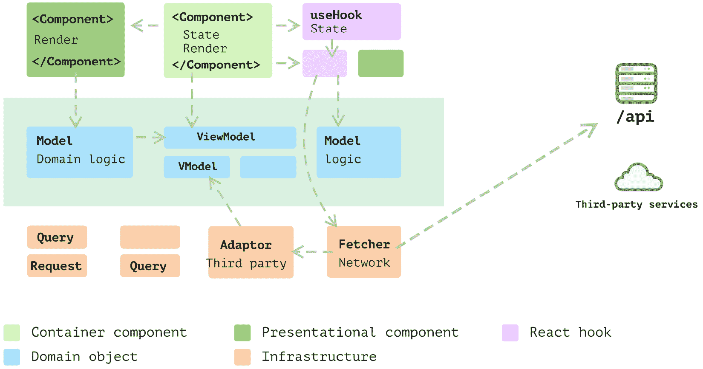

# 第十三章：回顾反模式原则

在这个简短的最后一章中，我们将简要回顾本书的关键见解，并为您提供更多资源，以便您更深入地探索 React 和软件设计领域。

本书的主要目标是挖掘在 React 代码库中经常遇到的常见反模式，尤其是在大型 React 应用程序中。我们探讨了纠正这些问题的潜在补救措施和技术。叙述中的例子要么来自我的先前项目，要么与开发者可能熟悉的领域相关——例如购物车、用户资料和网络请求，仅举几例。

我倡导一种逐步和渐进的交付方法，引导您从一个最初不太理想的实现逐步过渡到一个精炼的版本，每次只进行一点小的改进。我们开始组织一个典型的 React 应用程序，通过**测试驱动开发**（**TDD**）进入前端测试领域，并从常见的重构技术开始我们的旅程。此后，我们 navigated the challenging waters of data/state management in React，阐明了常见的设计原则，并探讨了组合策略。一系列章节都是从头开始构建完整示例，包括下拉列表、购物车和天气应用程序。

在这次探险中，我们发现了许多实用的技巧，例如如何在 Cypress 和 Jest 中模拟网络请求，将策略设计模式应用于 JavaScript 模型，以及在现实世界的代码场景中采用**反腐败层**（**ACLs**）。

本书讨论的技术可能不是突破性的或新颖的；事实上，许多都是已经确立的。然而，它们在 React 生态系统中的应用尚未得到充分探索。我真诚地希望这本书已经成功地填补了这一差距，重新引入这些宝贵的原则和模式到 React 社区中，从而在长期内为开发者提供更流畅的编码体验。

在本章中，我们将回顾以下主题：

+   回顾常见的反模式

+   概览设计模式

+   回顾基础设计原则

+   回顾技术和实践

# 回顾常见的反模式

在前几章中，我们探讨了众多反模式。识别反模式是纠正它的第一步。让我们简要回顾一下到目前为止我们所学的知识。

## Props 钻取

当一个 prop 穿越多个组件层级，最终在更深层次的组件中使用，导致中间组件不必要地了解这个 prop 时，就会产生 Props 钻取。这种做法可能导致代码复杂且难以维护。

*解决方案*：使用 Context API 创建一个中心存储和访问此存储的函数，允许组件树在需要时访问 props，而无需 prop-drilling。

## 长 props 列表/大组件

一个接受大量属性或包含大量逻辑的组件可能成为一个庞然大物，难以理解、重用或维护。这种反模式违反了**单一职责原则**（SRP），该原则主张组件或模块只应有一个改变的理由。

*解决方案*：将组件拆分成更小、更易于消化的组件，并分离关注点可以改善这个问题。每个组件应体现一个清晰、单一的责任。自定义钩子也是简化组件内代码和减少其大小的有效手段。

## 业务泄露

当业务逻辑被植入应保持纯展示性的组件中时，就会发生业务泄露，这可能会复杂化应用管理并降低组件的可重用性。

*解决方案*：使用自定义钩子或将其业务逻辑移至单独的模块或层，可以解决此问题。采用访问控制列表（ACL）可以是一种有效的技术来纠正这个问题。

## 视图中的复杂逻辑

在视图组件中嵌入复杂的逻辑会使代码变得混乱，难以阅读、理解和维护。视图应尽可能保持简洁，仅负责渲染数据。

*解决方案*：将复杂逻辑移至自定义钩子、实用函数或单独的业务逻辑层，可以帮助保持视图组件的整洁和可管理性。最初，将组件分解成更小的部分，然后逐步将逻辑分离到适当的位置可能是有益的。

## 缺乏测试（在每个级别）

缺乏足够的单元测试、集成测试或端到端测试来验证应用功能，正如预期的那样，可能会导致错误、回归以及难以重构或扩展的代码。

*解决方案*：采用包括单元测试、集成测试和端到端测试在内的强大测试策略，结合 TDD 等实践，可以确保代码的正确性和易于维护。

## 代码重复

在多个组件或应用的多个部分中重复类似的代码会复杂化代码库的维护，并增加出现错误的可能性。

*解决方案*：遵循**不要重复自己**（DRY）原则，将常见功能抽象为共享的实用函数、组件或钩子，可以帮助减少代码重复并提高代码的可维护性。

在分析了常见的反模式之后，现在迫切需要深入研究作为这些普遍问题解毒剂的设计原则。这些原则不仅提供了解决方案，还指导你编写更干净、更高效的代码。

# 浏览设计模式

有有效的模式可以对抗 React 中的反模式，有趣的是，其中一些模式超出了 React 的上下文，在更广泛的场景中也有用。让我们迅速回顾这些模式。

## 高阶组件

**高阶组件**（**HOCs**）是 React 中用于重用组件逻辑的有效模式。HOCs 是接受一个组件并返回一个新组件的函数，该新组件具有额外的属性或行为。通过利用 HOCs，您可以在组件之间提取和共享常见的行为，有助于减轻属性钻取和代码重复等问题。

## 渲染属性

**渲染属性**模式包括一种在 React 组件之间通过一个值是函数的 prop 共享代码的技术。这是一种将函数作为 prop 传递给组件的方法，该函数返回一个 React 元素。这种模式可以通过促进重用和组合来缓解诸如长属性列表和大型组件等问题。

## 无头组件

无头组件是指那些管理行为和逻辑但不渲染 UI 的组件，赋予消费者对渲染的控制权。它们将行为逻辑与展示逻辑分离，这可以成为解决业务泄漏和视图中的复杂逻辑的有效方案，使组件更加灵活和易于维护。

## 数据建模

数据建模涉及组织和定义您的数据，这有助于理解和管理您应用程序中的数据，从而简化组件内的逻辑。这个原则可以用来解决视图中的复杂逻辑和业务逻辑泄漏问题。

## 分层架构

分层架构涉及将关注点分离和组织代码，以便每一层都有特定的责任。这种分离可以导致更组织化和可管理的代码库，解决诸如业务泄漏和视图中的复杂逻辑等问题。

作为提醒，*图 13**.1*展示了这种分层架构。在分层架构中，每一层包含多个模块，每个模块都致力于整体应用中的特定任务。这包括用于数据检索的模块（*图 13**.1*中显示的**Fetcher**模块），以及与外部服务（如社交媒体登录和支付网关）接口的适配器（*图 13**.1*中显示的**Adaptor**网关），以及用于分析和安全相关功能的组件：

图 13.1：React 应用程序中的分层架构

我们在*第十一章*中对这个主题进行了全面的案例研究，深入探讨了系统的演变，并确定了应用这种架构风格的最佳时机。

## 上下文作为接口

利用上下文作为接口，允许组件在不需要向下传递多个层级属性的情况下与数据交互。这种策略可以减轻属性钻取和长属性列表的问题，使组件树更易于阅读和维护。

在牢固掌握基础和设计原则的基础上，是时候探索那些能让你在日常编码实践中运用这些原则的实用技术了。

# 回顾基础设计原则

除了 React 特定的模式外，我们在各个章节中讨论了几个高级设计原则。这些原则作为指导方针，适用于你工作的各个方面，无论是 React、数据建模、事件测试，还是促进集成的脚本。它们并不局限于特定情境，采纳它们可以显著提升你在不同领域的编码方法。

## 单一职责原则

单一职责原则（SRP）主张一个类或组件应该只有一个改变的理由。遵循 SRP 可以导致更可维护和易于理解的代码，减轻如大型组件和复杂的视图逻辑等问题。

我们已经从多个层面探讨了这一原则，从从较大的组件中分离出较小的组件，到创建新的 Hook，再到重大的重构，如将 ACL 集成到天气应用中。值得注意的是，无论何时你发现自己陷入大型组件的困境，单一职责原则（SRP）始终是你最可靠的盟友。

## 依赖倒置原则

**依赖倒置原则**（DIP）强调依赖于抽象，而不是具体实现，这导致高级和低级结构的解耦。这一原则可以用来管理业务逻辑泄漏，并促进清晰的**关注点分离**（SoC）。

## 不要重复自己

DRY 原则是关于最小化代码中的重复。通过遵循 DRY 原则，你可以最小化代码重复，使代码库更容易维护和扩展。

## 防腐层

ACL 充当应用程序不同部分或层之间的屏障，创建一个稳定的接口。实现 ACL 可以是一种强大的策略来管理业务泄漏并确保清晰的 SoC。

当你的代码需要以任何方式与其他系统交互时，访问控制列表（ACL）特别有益，这种情况在与其他团队协作时经常出现——这在许多设置中是常见的。通过 ACL 建立清晰的系统边界，我们可以减轻其他系统变化对我们自身的影响，从而更好地控制我们的应用程序，缓解潜在的集成挑战。*图 13.2*展示了如何在 React 中应用 ACL：

图 13.2：在 React 中应用 ACL

## 使用组合

组合是 React 的核心原则之一，它赋予开发者从其他组件构建组件的能力，从而促进重用和简化。采用组合可以缓解各种问题，包括长的属性列表、大型组件和代码重复，从而使得代码库更加可维护和组织。

理解这些反模式、设计模式和原则对于管理前端代码库的复杂性至关重要。然而，技术和实践同样重要，因为它们代表了开发者每天实际参与的工作。

# 回顾技术和实践

我们强调了测试的重要性和逐步改进。这种方法不仅保持了高代码质量，而且培养了一位全面的开发者——磨练批判性思维技能和一次专注于解决一个问题的能力。

## 编写用户验收测试

**用户验收测试**（**UAT**）是开发过程中的一个关键部分，确保你的应用程序符合其规范并按预期工作。在开发早期实施 UAT 可以帮助及早发现问题，确保你的应用程序处于正确的轨道上。

如 *图 13.3* 所示，我们强调测试应该从最终用户的角度编写，关注交付客户价值而不是实现细节。这在你在更高层次开始实现一个功能时尤其相关：

图 13.3：用户验收测试

## 测试驱动开发

TDD 是一种软件工程技术，其中测试是在需要测试的代码之前编写的。这个过程主要分为以下迭代开发周期：编写测试，使测试通过，然后重构。TDD 可以显著帮助确保你的代码库是功能性的且无错误的，解决每个级别的测试不足问题。

## 重构和常见代码异味

重构涉及在不改变其外部行为的情况下改进现有代码的设计。意识到常见的代码异味并持续重构你的代码可以导致更健康、更易于维护的代码库。这项技术对于解决代码重复、视图中的复杂逻辑和业务泄露等问题非常有用。

现在我们已经了解了常见的反模式，阐明了设计原则，并探讨了技术，是时候超越这本书的内容了。以下部分提供了一系列推荐阅读，这些阅读将进一步深化你对 React、TypeScript 和软件设计原则领域的理解，并磨练你的技能。

# 其他资源

当我们结束这本书的内容时，通往掌握 React 和避免常见陷阱的旅程还远未结束。尤其是与 React 这样的框架一起，Web 开发的领域始终在不断发展。持续学习和适应是保持相关性和熟练的关键。

以下部分旨在为您提供额外的学习和探索途径。这些书籍经过精心挑选，旨在扩展您的理解，并介绍软件开发中更广泛或补充的概念。每一本书都开启了一个新的知识维度，确保您的成长轨迹保持陡峭且富有成效。因此，当您从这里迈步向前时，让这些资源成为您在持续学习与掌握网络开发艺术之旅中的伴侣。

我想推荐几本开创性的书籍，这些书籍可以进一步深化您对网络应用领域良好设计、架构和开发实践的理解和欣赏，特别是关注 React 和 TypeScript：

+   *《重构：改善既有代码的设计》* by 马丁·福勒

    马丁·福勒关于重构的基石之作，是关于如何增强代码结构同时保持其功能性和无错误性的知识库。对于任何希望磨练重构技能的人来说，这是一本必读之作。

+   *《代码整洁之道》* by 罗伯特·马丁

    罗伯特·马丁的《代码整洁之道》是软件开发世界的一个里程碑。它深入探讨了编写整洁、可维护代码的各种实践和原则，这对于复杂项目的长期成功至关重要。

+   *《企业应用架构模式》* by 马丁·福勒

    通过这本书，您可以扩展您的架构视野，它剖析了设计稳健和可扩展企业应用的关键模式。这是一本重要的读物，可以帮助您把握应用架构的更大图景，超越了前端领域。

+   *《使用 React 和 TypeScript 进行测试驱动开发》* by 丘俊涛

    沉浸在 TDD 的世界中，专注于 React 和 TypeScript。这本书将引导您了解 TDD 的原则，以及它如何显著提高代码的质量、可维护性和稳健性。

# 摘要

我想对您对磨练技艺和追求技术卓越的奉献和热情表示衷心的感谢。正是像您这样渴望知识和进步的人，推动了我们的行业向前发展。当您翻过最后一页时，请记住，旅程并没有结束；事实上，它为您在现实世界项目中的应用和探索开启了新的篇章。

成长的精髓在于应用，以及将所学知识不断应用于挑战规范和追求更好解决方案的持续努力。本书旨在为您提供坚实的基础，但真正的魔法发生在您将这些概念应用于实践、实验并将它们融入日常工作之中时。

我衷心感谢您花时间浏览这些页面并与材料互动。我真诚地希望您能继续保持这种势头，深入研究，并继续通过您的贡献丰富 React 社区。随着您踏上旅程的下一阶段，我祝愿您好运。愿您的代码整洁，您的解决方案创新，您的旅程充满回报。

感谢您，祝您在持续学习和改进的旅程中一切顺利！
