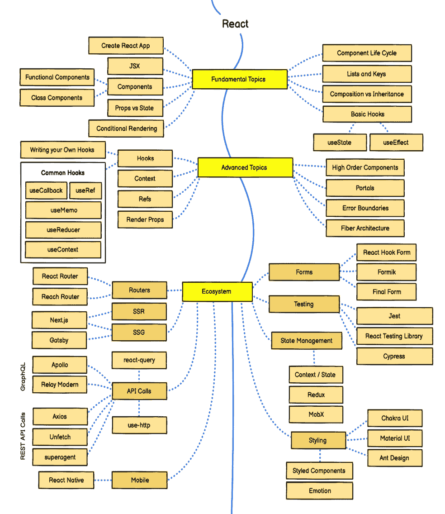
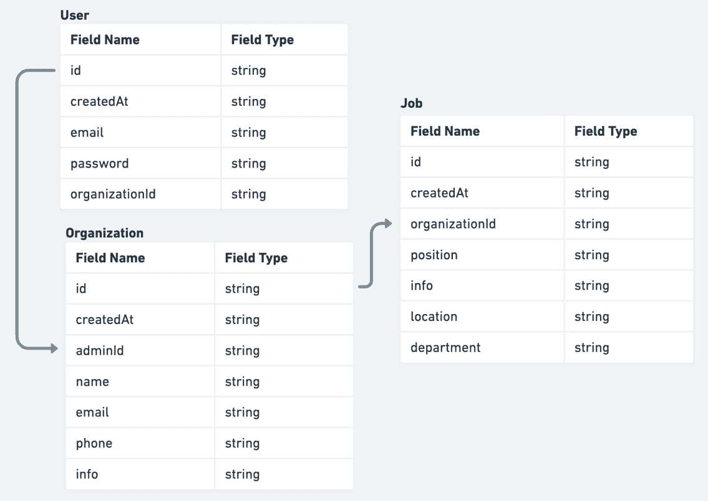

# 第一章：理解 React 应用程序的架构

React 是由 Meta（Facebook）创建和维护的开源 JavaScript 库，用于构建用户界面。

现在可能最流行的用于构建用户界面的库就是它。它之所以受欢迎，是因为它性能出色，API 简小，这使得它成为创建用户界面的简单而又非常强大的工具。

它是组件化的，这允许我们将大型应用程序拆分成更小的部分，并独立地工作在这些部分上。

React 也非常出色，因为它的核心 API 与平台解耦，这使得像 React Native 这样的项目可以在网络平台之外存在。

React 最大的优点也是缺点之一在于它的非常灵活。这允许其社区构建出优秀的解决方案。然而，默认定义一个良好的应用程序架构可能具有挑战性。

对于任何应用程序的成功来说，做出正确的架构决策至关重要，尤其是在它需要变化或规模、用户数量和参与人数增长时。

在本章中，我们将涵盖以下主题：

+   良好应用程序架构的好处

+   探索 React 应用程序的架构挑战

+   在构建 React 应用程序时理解架构决策

+   规划我们的应用程序

到本章结束时，我们将学会在开始 React 应用程序开发时从架构的角度思考更多。

# 良好应用程序架构的好处

每个应用程序都使用某种架构，即使没有考虑过。它可能被随机选择，可能并不适合其需求和需求，但无论如何，每个应用程序确实都有架构。

因此，在项目开始时就关注适当的架构对于每个项目都是至关重要的。让我们定义几个原因：

+   为项目打下良好的基础

+   更容易的项目管理

+   提高开发速度和生产力

+   成本效益

+   更好的产品质量

值得注意的是，所有应用程序都容易受到需求变化的影响，因此并不总是能够提前预测一切。然而，我们应该从一开始就关注架构。我们将在接下来的章节中详细讨论这些原因。

## 为项目打下良好的基础

每座建筑都应该建立在稳固的基础上，以保持对不同条件如年龄、天气条件、地震和其他原因的抵抗力。

同样，这种情况也适用于应用程序。在项目生命周期中，多种因素会导致各种变化，例如需求、组织、技术、市场、财务等。建立在稳固的基础上将使它能够抵御所有这些变化。

## 更容易的项目管理

合理组织不同的组件将使组织和委派任务变得更加容易，尤其是在涉及更大团队的情况下。

良好的组件解耦将允许团队和团队成员之间更好地分配工作，并实现更快的迭代，而不会因为彼此而受阻。

它还允许更好地估计完成一个功能所需的时间。

## 提高开发速度和生产力

定义良好的架构可以让开发者专注于他们正在构建的产品，而无需过度思考技术实现，因为大多数技术决策应该已经做出。

此外，它将为新开发者提供一个更平滑的入职流程，他们可以在熟悉整体架构后迅速变得高效。

## 经济效益

之前各节中提到的所有原因都表明，良好的架构带来的改进将降低成本。

在大多数情况下，每个项目的最大成本是人力和他们的工作以及时间。因此，通过让他们更有效率，我们可以减少一些不良架构可能带来的冗余成本。

它还将允许更好地进行软件产品的财务分析和定价模型规划。这将使预测平台需要的功能所需的所有成本变得更加容易。

## 更好的产品质量

让所有团队成员都变得高效，这样他们就有时间专注于重要的事情，比如业务需求和用户需求，而不是花大部分时间修复错误和减少技术债务。

更好的产品质量也会让我们的用户更加满意，这应该是最终目标。

为了存在，每款软件都需要满足其需求。在下一节中，我们将看到这些软件需求是什么。

# 探索 React 应用程序的架构挑战

在本节中，我们将重点关注 React，并探讨在构建 React 应用程序时需要考虑哪些因素，以及大多数 React 开发者构建应用程序时面临的主要挑战。

## 构建 React 应用程序时有哪些挑战？

React 是构建用户界面的优秀工具。然而，在构建应用程序时，我们应该考虑一些具有挑战性的事情。它非常灵活，这既是好事也是坏事。好事在于我们可以定义应用程序不同部分的结构，而不会受到库的干扰。

由于 React 非常灵活，它已经聚集了一个全球范围内的开发者社区，构建了不同的开源解决方案。在开发过程中，我们可能会遇到任何问题的完整解决方案。这使得 React 生态系统非常丰富。

然而，这种灵活性和生态系统丰富性是有代价的。

让我们看看由`roadmap.sh`制作的以下 React 生态系统概述图：

图 1.1 – 由 roadmap.sh 提供的 React 开发者路线图

如**图 1.1**所示，在用 React 构建应用程序时有很多要考虑的因素。我们也要记住，这个图表可能只显示了冰山一角。许多不同的包和解决方案都可以用来构建相同的应用程序。

在开始使用新的 React 应用程序时，最常见的一些问题如下：

+   我们正在使用什么项目结构？

+   我们正在使用什么渲染策略？

+   我们正在使用什么状态管理解决方案？

+   我们正在使用什么样式解决方案？

+   我们正在使用什么数据获取方法？

+   我们将如何处理用户身份验证？

+   我们将要使用哪些测试策略？

这些挑战不仅限于 React——它们与构建前端应用总体相关，无论使用哪些工具。但鉴于本书专注于 React，我们将从那个角度来处理它们。

### 我们正在使用什么项目结构？

由于 React 非常灵活并且 API 非常小，它对我们的项目结构没有特定的看法。以下是 React 的维护者之一 Dan Abramov 关于这一点所说的话：

“*移动文件直到感觉正确*”

这是一个非常正确的观点。它将主要取决于应用程序的本质。例如，我们不会以相同的方式组织社交网络应用程序和文本编辑应用程序，因为它们有不同的需求和要解决的问题。

### 我们正在使用什么渲染策略？

这取决于我们应用程序的本质。

如果我们正在构建一个内部仪表板应用程序，单页应用程序就足够了。

另一方面，如果我们构建的是一个面向客户的、应该公开且 SEO 友好的应用程序，那么我们应该考虑服务器端渲染或静态生成，具体取决于页面上的数据更新频率。

### 我们正在使用什么状态管理解决方案？

React 通过其 hooks 和 Context API 内置了状态管理机制，但对于更复杂的应用程序，我们通常求助于外部解决方案，如**Redux**、**MobX**、**Zustand**、**Recoil**等。

选择正确的状态管理解决方案很大程度上取决于应用程序的需求和需求。如果我们正在构建待办事项应用程序或电子商务应用程序，我们不会使用相同的工具。

这主要取决于整个应用程序中需要共享的状态量以及这些状态更新的频率。

我们的应用程序会有很多频繁的更新吗？如果是这样，我们可能会考虑基于原子的解决方案，如**Recoil**或**Jotai**。

如果我们的应用程序需要许多不同的组件共享相同的状态，那么**Redux**结合**Redux Toolkit**是一个好选择。

另一方面，如果我们没有很多全局状态并且不经常更新它，那么**Zustand**或**React Context API**，结合 hooks，是不错的选择。

最后，一切都取决于应用的需求和我们试图解决的问题的本质。

### 我们将使用什么样式解决方案？

这主要取决于个人喜好。有些人喜欢纯 CSS，有些人喜欢像**Tailwind**这样的实用优先 CSS 库，而有些开发者则无法离开**CSS in JS**。

做出这个决定也应该取决于我们的应用是否会被频繁地重新渲染。如果是这样，我们可能会考虑构建时解决方案，如纯 CSS、SCSS、Tailwind 等。否则，我们可以使用运行时样式解决方案，如**Styled Components**、**Emotion**等。

我们还应该记住，我们是否想使用预构建的组件库，或者如果我们想从头开始构建一切。

### 我们将如何处理用户认证？

这取决于 API 实现。我们是否使用基于令牌的认证？我们的 API 服务器是否支持基于 cookie 的认证？使用带有`httpOnly` cookie 的基于 cookie 的认证被认为更安全，可以防止**跨站脚本攻击**（XSS）。

这些大多数事情都应该与后端团队一起定义。

### 我们将使用什么测试策略？

这取决于团队结构，所以如果我们有 QA 工程师可用，我们将能够让他们进行端到端测试。

这也取决于我们可以投入多少时间进行测试和其他方面。记住，我们应该始终考虑至少进行一些级别的测试，对于应用最关键的部分，进行端到端测试。

# 构建 React 应用时理解架构决策

不论应用的具体需求如何，在构建过程中，我们都可以做出一些普遍的优劣决策。

## 恶劣的架构决策

让我们看看一些可能拖慢我们进度的恶劣架构决策。

### 平坦的项目结构

想象一下有很多组件，它们都生活在同一个文件夹中。最简单的事情就是将所有 React 组件放在 components 文件夹中，如果我们的组件数量不超过 20 个，这是可以的。之后，由于它们都混合在一起，就很难找到组件应该属于的位置。

### 大型、紧密耦合的组件

拥有大型和耦合的组件有几个缺点。它们在隔离测试中很难，很难重用，并且在某些情况下可能存在性能问题，因为组件需要完全重新渲染，而不是我们只重新渲染需要重新渲染的小部分。

### 不必要的全局状态

拥有全局状态是可以的，并且通常是必需的。但是，将太多东西放在全局状态中可能是个坏主意。它可能会影响性能，也可能影响可维护性，因为它使得理解状态的范围变得困难。

### 使用错误的工具解决问题

React 生态系统中的选择数量使得选择错误的工具来解决问题变得更容易——例如，在全局存储中缓存服务器响应。这可能是有可能的，我们过去一直在这样做，但这并不意味着我们应该继续这样做，因为存在解决这个问题的工具，如 React Query、SWR、Apollo Client 等。

### 将整个应用程序放在单个文件中的单个组件里

这是不应该发生的事情，但仍然值得提及。没有任何东西阻止我们在单个文件中创建一个完整的应用程序。它可能长达数千行——即一个能够完成所有工作的单个组件。但正如拥有大型组件一样，应该避免这样做。

### 未清理用户输入

网络上有许多黑客试图窃取我们的用户数据。因此，我们应该尽一切可能防止这类事情发生。通过清理用户输入，我们可以防止黑客在我们的应用程序中执行恶意代码并窃取用户数据。例如，我们应该通过移除可能存在风险的任何输入部分，防止我们的用户输入任何可能在我们的应用程序中执行的内容。

### 使用未优化的基础设施来托管我们的应用程序

使用未优化的基础设施来托管我们的应用程序，当从世界各地的不同部分访问时，会使我们的应用程序变慢。

现在我们已经讨论了一些不良的架构决策，让我们看看如何改进它们。

## 良好的架构决策

让我们看看我们可以做出的一些良好决策，以使我们的应用程序变得更好。

### 基于领域和功能的更好结构化的项目结构

将应用程序结构拆分为不同的功能或领域特定模块，每个模块负责其自身的角色，将允许更好地分离应用程序不同部分的关注点，更好地模块化应用程序的不同部分，更好的灵活性和可扩展性。

### 更好的状态管理

我们应该从定义尽可能接近组件中使用状态的部分的状态开始，只有在必要时才提升它，而不是将所有内容放入全局状态。

### 更小的组件

拥有更小的组件将使它们更容易测试、更容易跟踪更改，并且更容易在大团队中协作。

### 关注点分离

让每个组件尽可能少做。这使得组件易于理解、测试、修改，甚至重用。

### 静态代码分析

依赖于静态代码分析工具，如**ESLint**、**Prettier**和**TypeScript**，将提高我们的代码质量，而无需我们过多思考。我们只需要配置这些工具，它们就会告诉我们代码中有什么问题。这些工具还在代码库的格式、代码实践和文档方面引入了一致性。

### 在 CDN 上部署应用程序

由于用户遍布全球，我们的应用程序应该在全球范围内功能齐全且易于访问。通过在 CDN 上部署应用程序，全球用户都可以以最优化方式访问应用程序。

# 规划我们的应用程序

现在，让我们将刚刚学到的原则应用到实际场景中，我们将规划我们将要构建的应用程序。

## 我们在构建什么？

我们将构建一个应用程序，允许组织管理他们的工作板。组织管理员可以为他们的组织创建职位发布，候选人可以申请这些职位。

我们将构建一个具有最少功能集的最小可行产品（MVP）版本，但它应该可以扩展以添加更多功能。在本书的最后，我们将介绍最终应用程序可能具有的功能，但为了保持简单，我们将专注于 MVP 版本。

正确的应用规划始于收集应用程序的需求。

## 应用需求

应用程序有两种类型的应用需求：

+   功能性需求

+   非功能性需求

### 功能性需求

功能性需求应定义应用程序应该做什么。它们是我们用户将使用的所有功能和功能描述。

我们的应用程序可以分为两部分：

+   公开部分

+   组织管理员仪表板

#### 公开部分

+   包含我们应用程序一些基本信息的着陆页。

+   公共组织视图，访客可以找到有关给定组织的详细信息。除了基本组织信息外，还应包括组织的职位列表。

+   公共职位视图，访客可以查看有关给定职位的一些基本信息。除了这些信息外，还应包括申请职位的操作。

#### 组织管理员仪表板

+   用于仪表板的身份验证系统，应允许组织管理员登录仪表板。对于我们的最小可行产品（MVP），我们只需实现使用现有测试用户的登录功能。

+   职位列表视图，管理员可以查看组织的所有职位。

+   创建一个包含创建新工作表单的工作视图。

+   包含有关职位所有信息的职位详情视图。

### 非功能性需求

非功能性需求应定义应用程序从技术角度应该如何工作：

+   **性能**：应用程序必须在 5 秒内交互。这意味着用户应该在请求加载应用程序后 5 秒内与页面交互。

+   **可用性**：应用程序必须用户友好且直观。这包括为小屏幕实现响应式设计。我们希望用户体验流畅且直接。

+   **SEO**：应用程序的公开页面应该是 SEO 友好的。

## 数据模型概述

为了更好地理解我们的应用程序在底层的工作方式，了解其数据模型是有帮助的，因此我们将在本节中深入探讨。

在下面的图中，我们可以看到从数据库的角度看我们的数据模型是什么样的：

图 1.2 – 数据模型概述

如**图 1.2**所示，应用程序中有三种主要模型：

+   用户

+   组织

+   工作

定义应用程序需求和数据模型应该能让我们很好地理解我们正在构建的内容。现在，让我们来探讨我们应用程序的技术决策。

## 探索技术决策

让我们看看我们需要为我们的应用程序做出哪些技术决策。

### 项目结构

我们将使用基于功能的工程项目结构，这有助于良好的功能隔离和功能之间的良好沟通。

这意味着我们将为每个较大的功能创建一个功能文件夹，这将使应用程序结构更具可扩展性。

当功能数量增加时，它将扩展得非常好，因为我们只需要担心一个特定的功能，而不是整个应用程序，代码散布在各个地方。

我们将在接下来的章节中看到项目结构定义的实际应用。

### 渲染策略

当提到渲染策略时，我们指的是我们应用程序页面创建的方式。

让我们来看看不同的渲染策略类型：

+   **服务器端渲染**：在互联网的早期，这是生成具有动态内容的页面的最常见方式。页面内容是即时创建的，在服务器上插入页面，然后返回给客户端。这种方法的好处是页面更容易被搜索引擎爬取，这对 SEO 很重要，并且与单页应用程序相比，用户可能会获得更快的页面初始加载速度。这种方法的不利之处在于可能需要更多的服务器资源。在我们的场景中，我们将使用这种方法来更新频繁且需要同时进行 SEO 优化的页面，例如公共组织页面和公共工作页面。

+   **客户端渲染**：客户端 JavaScript 库和框架（如 React、Angular、Vue 等）的存在，使我们能够在客户端完全创建复杂的客户端应用程序。这种方法的优点是，一旦应用程序在浏览器中加载，页面之间的转换看起来非常快。另一方面，为了加载应用程序，我们需要下载大量的 JavaScript 来使用应用程序。这可以通过代码拆分和懒加载来改进。使用搜索引擎爬取页面内容也更加困难，这可能会影响 SEO 评分。我们可以使用这种方法来保护页面，也就是我们应用程序仪表板中的每一个页面。

+   **静态生成**：这是最直接的方法。在这里，我们可以在构建应用程序的同时生成我们的页面，并以静态方式提供服务。这非常快，我们可以使用这种方法为那些永不更新但需要 SEO 优化的页面，例如我们应用程序的着陆页。

由于我们的应用程序需要多种渲染策略，我们将使用 Next.js，它非常出色地支持每种策略。

### 状态管理

状态管理可能是 React 生态系统中最常讨论的话题之一。它非常碎片化，这意味着有如此多的库处理状态，以至于让开发者难以做出选择。

为了使状态管理对我们来说更容易，我们需要理解存在多种状态类型：

+   **本地状态**：这是最简单的状态类型。它是在单个组件中使用的状态，且不需要在其他任何地方使用。我们将使用内置的 React hooks 来处理这一点。

+   **全局状态**：这是在应用程序的多个组件间共享的状态。它用于避免属性钻取。我们将使用一个名为**Zustand**的轻量级库来处理这一点。

+   **服务器状态**：这种状态用于存储来自 API 的数据响应。像加载状态、请求去重、轮询等其他功能从头开始实现非常具有挑战性。因此，我们将使用**React Query**来优雅地处理这些功能，这样我们就有更少的代码要写。

+   **表单状态**：这应该处理表单输入、验证和其他方面。我们将使用**React Hook Form**库来处理我们应用程序中的表单。

+   **URL 状态**：这种类型的状态经常被忽视，但非常强大。URL 和查询参数也可以被视为状态的一部分。当我们想要深度链接视图的某个部分时，这特别有用。在 URL 中捕获状态使其非常容易分享。

### 样式

样式也是 React 生态系统中的一个重要话题。有许多优秀的库用于样式化 React 组件。

为了样式化我们的应用程序，我们将使用**Chakra UI**组件库，它底层使用 Emotion，并附带各种看起来很好且无障碍友好的组件，这些组件非常灵活且易于修改。

选择 Chakra UI 的原因是它拥有极佳的开发者体验。它非常可定制，并且其组件默认就是无障碍友好的。

### 认证

我们应用程序的认证将基于 cookie，这意味着在成功的认证请求中，一个 cookie 将被附加到头部，这将处理服务器上的用户认证。我们选择基于 cookie 的认证是因为它更安全。

### 测试

测试是我们确保应用程序按预期工作的重要方法。

我们不希望我们的产品带有错误。此外，手动测试需要更多的时间和精力来发现新错误，因此我们希望为我们的应用程序拥有自动化测试。

存在多种类型的测试：

+   **单元测试**：单元测试仅在隔离状态下测试应用程序的最小单元。我们将使用 **Jest** 对应用程序的共享组件进行单元测试。

+   **集成测试**：集成测试同时测试多个单元。它们对于测试应用程序不同部分之间的通信非常有用。我们将使用 **React Testing Library** 测试我们的页面。

+   **端到端测试**：端到端测试允许我们从头到尾测试应用程序最重要的部分，这意味着我们可以测试整个流程。通常，最重要的端到端测试应该测试最关键的功能。对于这种测试，我们将使用 **Cypress**。

这是对我们的应用程序应该如何工作的概述。现在，我们应该能够开始在接下来的章节中用代码实现它。

# 摘要

React 是一个用于构建用户界面的非常流行的库，它将大多数架构选择留给了开发者，这可能具有挑战性。

在本章中，我们了解到设置良好架构的一些好处包括良好的项目基础、更易于项目管理、提高生产力、成本效益和更好的产品质量。

我们还了解到了需要考虑的挑战，例如项目结构、渲染策略、状态管理、样式、身份验证、测试以及其他。

然后，我们介绍了我们将要构建的应用程序的规划阶段，这是一个通过收集需求来管理职位板和职位申请的应用程序。我们通过定义应用程序的数据模型和选择合适的工具来克服架构挑战来实现这一点。

这为我们提供了一个良好的基础，可以在现实场景中实施我们的架构，正如我们将在以下章节中看到的那样。

在下一章中，我们将介绍我们将用于构建应用程序的整个设置。
