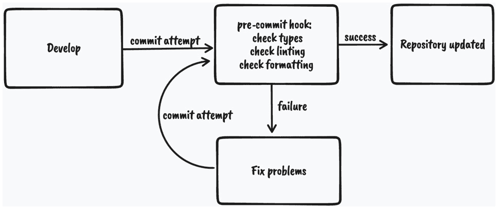
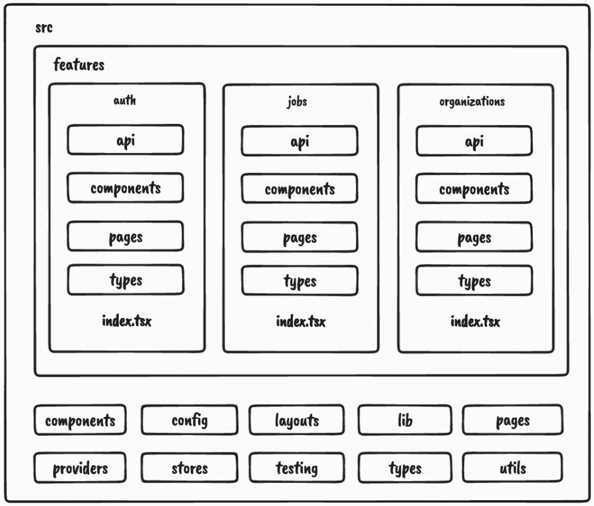

# 2

# 设置和项目结构概述

在上一章中，我们探讨了构建 React 应用程序时遇到的挑战以及一些可以帮助我们处理这些挑战的出色解决方案。我们还规划了我们的应用程序应该如何工作以及我们应该使用哪些工具。

在本章中，我们将探讨项目结构和为我们的项目提供良好基线的设置工具。

我们将涵盖以下主题：

+   Next.js 应用程序概述

+   TypeScript 设置概述及使用

+   ESLint 设置概述

+   Prettier 设置概述

+   预提交检查设置概述

+   项目结构概述

到本章结束时，我们将对用于项目设置和基于功能的项目的工具有一个很好的理解，这将使我们的代码组织更加易于管理。

# 技术要求

在我们开始之前，我们需要设置我们的项目。为了能够开发我们的项目，我们需要在计算机上安装以下内容：

+   **Node.js** 版本 16 或更高版本和 **npm** 版本 8 或更高版本。

安装 Node.js 和 npm 有多种方式。这里有一篇很好的文章，详细介绍了更多细节：[`www.nodejsdesignpatterns.com/blog/5-ways-to-install-node-js`](https://www.nodejsdesignpatterns.com/blog/5-ways-to-install-node-js)。

+   **VSCode**（可选）是目前最流行的 JavaScript/TypeScript 编辑器/IDE，因此我们将使用它。它是开源的，与 TypeScript 集成良好，并且我们可以通过扩展来扩展其功能。可以从 [`code.visualstudio.com/`](https://code.visualstudio.com/) 下载。

本章的代码文件可以在以下位置找到：[`github.com/PacktPublishing/React-Application-Architecture-for-Production`](https://github.com/PacktPublishing/React-Application-Architecture-for-Production)。

可以使用以下命令在本地克隆仓库：

```js
git clone https://github.com/PacktPublishing/React-Application-Architecture-for-Production.git
```

克隆完仓库后，我们需要安装应用程序的依赖项：

```js
npm install
```

我们还需要提供环境变量：

```js
cp .env.example .env
```

依赖项安装完成后，我们需要选择与本章匹配的代码库的正确阶段。我们可以通过执行以下命令来完成：

```js
npm run stage:switch
```

此命令将为我们显示每个章节的阶段列表：

```js
? What stage do you want to switch to? (Use arrow
 keys)
❯ chapter-02
  chapter-03
  chapter-03-start
  chapter-04
  chapter-04-start
  chapter-05
  chapter-05-start
(Move up and down to reveal more choices)
```

这是第二章，因此我们可以选择 `chapter-02` 选项。

选择好章节后，所有必要的文件将显示出来。为了跟随本章，我们不需要对代码进行任何更改。我们只需将其作为参考，以帮助更好地了解代码库。

更多关于设置细节的信息，请查看 `README.md` 文件。

# Next.js 应用程序概述

Next.js 是一个基于 React 和 Node.js 的 Web 框架，允许我们构建 Web 应用程序。因为它可以在服务器上运行，所以它可以作为一个全栈框架使用。

## 为什么选择 Next.js？

使用 Next.js 有多个好处。我们想使用它，原因如下：

+   **非常容易上手**：在 React 的早期阶段，开始一个项目非常具有挑战性。为了在屏幕上显示一个简单的页面，我们必须处理许多工具，如 Webpack、Babel 等。我们今天仍在使用这些工具，但幸运的是，大多数工具配置都通过界面隐藏起来，如果需要，可以扩展配置。

除了设置项目时的挑战外，随着时间的推移维护所有这些依赖项也非常具有挑战性。Next.js 将所有这些复杂性隐藏起来，让开发者能够快速开始新的项目。

+   **允许多种渲染策略**：能够使用多种渲染策略可能是我们想要使用 Next.js 的主要原因，尽管它还带来了其他许多好处。首先，它允许我们在页面级别定义页面渲染的行为，这意味着我们可以定义我们想要如何单独渲染每个页面。它还支持多种渲染策略，例如以下：

    +   客户端渲染

    +   服务器端渲染

    +   静态站点生成

    +   渐进式静态再生

我们将根据应用程序的需求使用不同的策略。

+   **性能优化**：Next.js 是考虑到网络性能而构建的。它实现了以下性能优化技术：

    +   代码拆分

    +   懒加载

    +   预取

    +   图片优化

这就是为什么我们想要为我们的应用程序使用 Next.js 的原因。现在，让我们看看 Next.js 应用程序的结构是什么样的。

## Next.js 应用程序结构

开始使用 Next.js 的最简单方法是使用`create-next-app` CLI 生成新应用程序。

由于我们已经在代码示例中作为部分生成了应用程序，我们不需要使用 CLI，但如果我们从头开始生成应用程序，我们将执行以下命令：

```js
npx create-next-app@latest jobs-app --typescript
```

通过执行此命令，我们将生成一个带有 TypeScript 配置的新 Next.js 应用程序。

有几件事情是 Next.js 特有的。让我们看看以下简单 Next.js 应用程序的文件和文件夹结构：

```js
- .next
- public
- src
  - pages
    - _app.tsx
    - index.tsx
- next.config.js
- package.json
```

让我们逐个分析每个文件和文件夹：

+   `.next`：包含通过运行 Next.js 的`build`命令生成的生产就绪文件。

+   `public`：包含应用程序的所有静态资源。

+   `src/pages`：这是 Next.js 中的一个特殊文件夹，其中定义的所有页面都可在相应的路由中访问。这是由于基于文件系统的路由系统实现的。`pages`文件夹也可以位于项目的根目录中，但将所有内容保持在`src`文件夹中会更好。

+   `src/pages/_app.tsx`：`_app.tsx`文件是一个特殊的文件，它导出一个 React 组件，该组件在渲染时包裹每个页面。通过使用这个特殊组件包裹页面，我们可以为我们的应用程序添加自定义行为，例如向所有页面添加任何全局配置、提供者、样式、布局等。

+   `src/pages/index.tsx`: 这是我们声明应用程序页面的方式。这显示了根页面的定义。我们将在接下来的章节中深入探讨 Next.js 特定的路由。

+   `next.config.js`: 这是我们以简单方式扩展默认功能，如 Webpack 配置和其他事物的位置。

+   `package.json`: 每个 Next.js 应用程序都包含以下 npm 脚本：

    +   `dev`: 在 `localhost:3000` 上启动开发服务器

    +   `build`: 为生产构建应用程序

    +   `start`: 在 `localhost:3000` 上启动生产构建

我们将在接下来的章节中更详细地介绍这些主题，但到目前为止，这应该足以让我们开始使用 Next.js。

# TypeScript 设置概述和使用

JavaScript 是一种动态类型的编程语言，这意味着它在构建时不会捕获任何类型错误。这就是 TypeScript 发挥作用的地方。

TypeScript 是一种作为 JavaScript 超集的编程语言，它允许我们用静态类型语言的一些行为来编写 JavaScript。这很有用，因为我们可以在它们进入生产之前捕获许多潜在的错误。

## 为什么选择 TypeScript？

TypeScript 特别适用于由大型团队构建的大型应用程序。用 TypeScript 编写的代码比用纯 JavaScript 编写的代码文档更完善。通过查看类型定义，我们可以了解一段代码应该如何工作。

另一个原因是 TypeScript 使得重构变得更加容易，因为大多数问题可以在运行应用程序之前被发现。

TypeScript 还帮助我们利用编辑器的 IntelliSense，它显示智能代码补全、悬停信息和签名信息，这提高了我们的生产力。

## TypeScript 设置

我们的项目已经配置了 TypeScript。TypeScript 配置定义在项目根目录下的 `tsconfig.json` 文件中。它允许我们根据我们的需求配置其严格程度：

```js
{
  "compilerOptions": {
    "target": "es5",
    "lib": ["dom", "dom.iterable", "esnext"],
    "allowJs": true,
    "skipLibCheck": true,
    "strict": true,
    "forceConsistentCasingInFileNames": true,
    "noEmit": true,
    "esModuleInterop": true,
    "module": "esnext",
    "moduleResolution": "Node",
    "resolveJsonModule": true,
    "isolatedModules": true,
    "jsx": "preserve",
    "incremental": true,
    "baseUrl": ".",
    "paths": {
      "@/*": ["./src/*"]
    }
  },
  "include": ["next-env.d.ts", "src"],
  "exclude": ["node_modules"]
}
```

我们不会深入到每个配置属性，因为大多数属性已经被自动生成。然而，还有一件事也被提供了：

```js
   "baseUrl": ".",
    "paths": {
      "@/*": ["./src/*"]
    }
```

这将告诉 TypeScript 编译器，通过 `@/*` 导入的任何内容都将引用 `src` 文件夹。

以前，我们必须进行混乱的导入，如下所示：

```js
import { Component } from '../../../components/component'
```

现在，我们可以这样导入组件：

```js
import { Component } from '@/components/component'
```

无论我们有多少嵌套级别，我们都可以始终使用绝对路径进行导入，并且如果我们决定将消费者文件移动到其他地方，我们不需要更改我们的导入语句。

## 基本 TypeScript 用法

让我们了解一些 TypeScript 基础知识，以便我们在这本书中能够舒适地使用它。

### 原始类型

```js
let numberVar: number;
numberVar = 1 // OK
numberVar = "1" // Error
let stringVar: string;
stringVar = "Hi"; // OK
stringVar = false; // Error
let stringVar: string;
stringVar = "Hi"; // OK
stringVar = false; // Error
```

正如我们所见，我们只能使用相应的类型赋值。将值赋给除 `any` 类型（我们将在下一刻介绍）之外的任何其他类型将导致 TypeScript 错误。

### Any

`any` 类型是 TypeScript 中最宽松的类型，使用它将禁用任何类型检查。当我们想要绕过通常会发生的错误时，我们可以使用它。然而，我们应将其作为最后的手段，并首先尝试使用其他类型：

```js
let anyVar: any;
anyVar = 1; // OK
anyVar = "Hello" // OK
anyVar = true; // OK
numberVar = anyVar; // OK
```

如我们所见，具有 `any` 类型的变量可以接受并分配为任何其他类型的值，这使得它非常灵活。

### Unknown

有时，我们可能无法提前知道我们将会有哪些类型。这可能会发生在一些动态数据上，我们不知道它的类型。在这里，我们可以使用 `unknown` 类型：

```js
let unknownVar: unknown;
unknownVar = 1; // OK
unknownVar = "123" // OK
let unknownVar2: unknown;
unknownVar = unknownVar2; // OK
anyVar = unknownVar2; // OK
numberVar = unknownVar2; // Error
stringVar = unknownVar2; // Error
booleanVar = unknownVar2; // Error
```

如我们所见，我们可以将任何类型的值分配给具有 `unknown` 类型的变量。然而，我们只能将具有 `unknown` 类型的值分配给具有 `any` 和 `unknown` 类型的变量。

### 数组

在 TypeScript 中定义数组类型有两种方式：

```js
type numbers = number[]
type strings = Array<string>
```

### 对象

对象形状可以通过两种方式定义：

```js
type Person = {
  name: string;
  age: number;
}
interface Person {
  name: string;
  age: number;
}
```

第一个被称为类型别名，而第二个被称为接口。

类型别名和接口之间有一些区别，但我们现在不会深入探讨。对于我们定义的任何对象形状类型，我们都可以使用类型别名。

### 联合

我们刚才提到的基本类型很棒，但有时我们希望允许一个变量可以是许多类型之一。让我们看看以下示例：

```js
type Content = string | number;
let content: Content;
content = 1 // OK
content = "Hi"; // OK
content = false // Error
```

如我们所见，`content` 变量现在可以是 `string` 或 `number`。

我们还可以在联合中添加字面量类型，如下面的示例所示：

```js
type Color = "red" | "green" | "blue";
let color: Color;
color = "red" // OK
color = "yellow" // Error
```

在这里，我们正在将颜色定义为字符串，但我们想添加更多约束，以便我们只能接受这三种颜色之一。如果我们尝试添加其他任何东西，TypeScript 将通过错误警告我们。

### 交集

交集类型允许我们将两个不同对象的属性组合成一个单一的类型。考虑以下示例：

```js
type Foo = {
  x: string;
  y: number;
}
type Bar = {
  z: boolean;
}
type FooBar = Foo & Bar;
```

`FooBar` 类型现在将包含 `x`、`y` 和 `z` 属性。

### 泛型

泛型是一种通过参数化创建可重用类型的机制。它们可以帮助我们减少代码重复。考虑以下类型：

```js
type Foo = {
  x: number;
}
```

让我们看看如果我们需要相同的结构但 `x` 是字符串会发生什么：

```js
type Foo = {
  x: string;
}
```

在这里，我们可以看到存在一些代码重复。我们可以通过使其泛型化来简化它，使其接受类型 `T`。这将作为 `x` 属性的类型分配：

```js
type Foo<T> = {
  x: T;
}
let x: Foo<number>;
let y: Foo<string>;
```

现在，我们有一种通过向泛型传递不同类型来重用结构的好方法。

我们也可以在函数中使用泛型：

```js
function logger<T>(value: T) {
  console.log(value)
}
logger<number>(1) // OK
logger<string>(1); // Error
```

要尝试这些代码片段并查看不同类型的行为，请访问 [`www.typescriptlang.org/play`](https://www.typescriptlang.org/play)，复制代码片段，并尝试不同的类型以查看它们的工作方式。

### TypeScript 和 React

每个使用 JSX 的 TypeScript 文件都必须有 `.tsx` 扩展名。

打印 React 组件非常简单：

```js
type InfoProps = {
  name: string;
  age: number
};
const Info = (props: InfoProps) => {
  return <div>{props.name}-{props.age}</div>;
};
```

这些例子相当简单。在我们开始构建应用程序时，将在接下来的章节中看到更多实用的例子。要了解更多关于 TypeScript 的信息，建议查看 TypeScript 手册[`www.typescriptlang.org/docs`](https://www.typescriptlang.org/docs)，它详细介绍了所有这些主题。

# ESLint 设置概述

**代码检查**是一个过程，其中代码检查器分析源代码并检测代码库中任何潜在的问题。

我们将使用**ESLint**，这是 JavaScript 中最受欢迎的代码检查工具。它可以配置不同的插件和规则，以适应我们应用程序的需求。

ESLint 配置定义在项目根目录下的`.eslintrc.js`文件中。我们可以添加不同的规则，通过不同的插件扩展它们，并覆盖应用到哪些文件上，以便它们满足我们应用程序的需求。

有时，我们不想检查每个文件夹和文件，因此我们可以通过在`.eslintignore`文件中定义它们来告诉 ESLint 忽略文件夹和文件。

ESLint 与编辑器和 IDE 有很好的集成，这样我们可以在编码时看到文件中的任何潜在问题。

要运行我们的代码检查器，我们在`package.json`中定义了代码检查脚本：

```js
"lint": "eslint --ext .ts,.tsx ./src",
```

通过运行`npm run lint`，我们将检查`src`目录中的每个`.ts`和`.tsx`文件，并且代码检查器将通知我们任何潜在的问题。

# Prettier 设置概述

`.prettierrc`文件。它还会在代码出现问题时给我们提供良好的反馈。如果它没有自动格式化，那么代码中可能存在问题，需要修复。

Prettier 默认提供了一套配置。我们可以通过创建`.prettierrc`文件并修改配置来覆盖它。

就像 ESLint 一样，有时，有些文件我们不想自动格式化。我们可以通过将它们添加到`.prettierignore`文件中来告诉 Prettier 忽略文件和文件夹。

要运行 Prettier，我们在`package.json`中定义了一些脚本：

```js
"prettier": "prettier \"**/*.+(json|ts|tsx)\"",
"format:check": "npm run prettier -- --check",
"format:fix": "npm run prettier -- --write",
```

如我们所见，我们可以运行`npm run format:check`来仅检查格式而不尝试修复它。如果我们想修复它，则可以运行`npm run format:fix`，这将修改需要修复的文件。

# 预提交检查设置概述

拥有像 TypeScript、ESLint 和 Prettier 这样的静态代码分析工具是很好的；我们已经配置了它们，并且每次我们进行一些更改时都可以运行单个脚本，以确保一切处于最佳状态。

然而，也有一些缺点。开发者可能会忘记在提交到仓库之前运行所有检查，这仍然会将问题和不一致的代码带到生产环境中。

幸运的是，有一个解决方案可以解决这个问题：每次我们尝试向仓库提交时，我们希望以自动化的方式运行所有检查。

这是我们要实现的工作流程：



图 2.1 – 预提交代码检查图

如我们所见，每次我们尝试向仓库提交时，`git pre-commit` 钩子都会运行并执行检查脚本。如果所有检查都通过，更改将被提交到仓库；否则，我们必须修复问题并再次尝试。

为了启用这个流程，我们将使用 `husky` 和 `lint-staged`：

+   `husky` 是一个允许我们运行 git 钩子的工具。我们希望运行预提交钩子在提交更改之前进行检查。

+   `lint-staged` 是一个工具，它允许我们只在 Git 的暂存区域中的文件上运行这些检查。这提高了代码检查的速度，因为在整个代码库上执行可能会太慢。

我们已经安装并配置了这些工具，但如果我们没有，可以使用以下命令进行安装：

```js
npm install –-save-dev husky lint-staged
```

然后，我们需要启用 Git 钩子：

```js
npx husky install
```

然后，我们需要创建预提交钩子：

```js
npx husky add .husky/pre-commit "npx lint-staged"
```

Husky 预提交钩子将运行 `lint-staged`。然后，我们需要在 `lint-staged.config.js` 文件中定义 `lint-staged` 应该运行的命令：

```js
module.exports = {
  '*.{ts,tsx}': [
    'npm run lint',
    "bash -c 'npm run types:check'",
    'npm run format:check',
  ],
};
```

如果我们尝试提交包含任何违规的代码，它将失败并阻止我们提交更改。

现在我们已经覆盖了大部分设置，让我们看看我们项目的结构。

# 项目结构概述

如我们之前提到的，React 在项目结构方面非常灵活。

拥有良好项目结构的某些好处如下：

+   关注点的分离

+   更容易的重构

+   更好的代码库推理

+   更容易让大型团队同时处理代码库

让我们看看基于功能的工程项目结构是什么样的。

注意

我们将只关注 `src` 文件夹，因为从现在起，大部分代码库都存放在那里。

这里是我们的 `src` 文件夹的结构：

```js
- components // (1)
- config // (2)
- features // (3)
- layouts // (4)
- lib // (5)
- pages // (6)
- providers // (7)
- stores // (8)
- testing // (9)
- types // (10)
- utils // (11)
```

让我们逐个分析每个文件夹：

1.  `components`：包含在整个应用程序中使用的所有共享组件。

1.  `config`：包含应用程序配置文件。

1.  `features`：包含所有基于功能的模块。我们将在下一节中更详细地分析这个模块。

1.  `layouts`：包含页面使用的不同布局。

1.  `lib`：包含我们在应用程序中使用的不同库的配置。

1.  `pages`：包含我们的应用程序页面。这是 Next.js 在基于文件系统的路由中查找页面的地方。

1.  `providers`：包含所有应用程序提供者。例如，如果我们的应用程序使用许多不同的提供者进行样式、状态等，我们可以在这里将它们组合起来，并导出一个单一的应用程序提供者，我们可以用这个提供者包裹 `_app.tsx`，使所有提供者对所有页面都可用。

1.  `stores`：包含在应用程序中使用的所有全局状态存储。

1.  `testing`：包含与测试相关的模拟、辅助工具、实用程序和配置。

1.  `types`：包含跨应用程序使用的基 TypeScript 类型定义。

1.  `utils`：包含所有共享的实用函数。

根据文件类型将文件分组到文件夹中并没有什么问题。然而，一旦应用程序开始增长，就变得更加难以推理和维护代码库，因为存在太多单一类型的文件。

## 功能

为了以最简单和最可维护的方式扩展应用程序，我们希望将大部分应用程序代码保存在`features`文件夹中，该文件夹应包含基于功能的不同事物。每个`feature`文件夹应包含特定功能的领域特定代码。这将使我们能够将功能的功能范围限定在功能内，而不是将其声明与共享事物混合。这比具有许多文件的扁平文件夹结构更容易维护。

让我们看看我们的一个功能文件夹，它具有以下结构：

```js
- api // (1)
- components // (2)
- types // (3)
- index.ts // (4)
```

1.  `api`：包含与特定功能相关的 API 请求声明和 API 钩子。这使得我们的 API 层和 UI 层分离且可重用。

1.  `components`：包含所有特定于特定功能的部分组件。

1.  `types`：这包含特定功能的 TypeScript 类型定义。

1.  `index.ts`：这是每个功能的入口点。它作为功能的公共 API，应该只导出其他应用程序部分应该公开的东西。

注意

功能可能还有其他文件夹，例如`hooks`、`utils`等，具体取决于功能的需要。唯一必需的文件是`index.ts`文件，它作为功能的公共 API。

让我们尝试用以下图表来可视化项目结构：



图 2.2 – 项目结构

如我们所见，我们的大部分应用程序代码将存在于功能中。

我们还可以配置强制开发者通过`index.ts`文件导入功能代码，如下所示：

```js
import {JobsList} from '@/features/jobs'
```

我们不应该这样做：

```js
import {JobsList} from '@/features/jobs/components/jobs-
  list'
```

这将使我们更好地了解哪些依赖项在哪里使用以及它们来自何处。此外，如果功能被重构，它不会影响应用程序中该组件被使用的外部部分。

我们可以通过在`.eslintrc.js`文件中设置以下 ESLint 规则来约束我们的代码：

```js
rules: {
    'no-restricted-imports': [
      'error',
      {
        patterns: ['@/features/*/*'],
      },
    ],
    'import/no-cycle': 'error',
      … rest of the eslint rules
}
```

`no-restricted-imports`规则将通过错误报告前一个模式中的任何违规行为来对其他功能的导入添加约束。

只有当它们从该功能的`index.ts`文件中导出时，才能消费来自功能的东西。这将迫使我们明确地将功能中的某些内容公开。

如果我们决定以这种方式使用功能，我们还应该包括`import/no-cycle`规则，以防止 A 功能从 B 功能导入东西，反之亦然的情况。如果发生这种情况，这意味着应用程序设计中有问题，需要重构。

在本节中，我们学习了我们的应用程序结构将如何呈现。然后，我们专注于按功能拆分应用程序，这样如果我们决定添加更多功能，我们的代码库将能够很好地扩展。

# 摘要

在本章中，我们学习了 Next.js 应用程序设置的基础知识，该设置已配置为与 TypeScript 一起使用。然后，我们学习了绝对导入，这将使移动文件变得更容易。我们还概述了 ESLint 和 Prettier，并将它们作为静态代码分析工具，以便通过使用 lint-staged 和 Husky 在将更改提交到我们的存储库之前运行检查。

最后，我们学习了我们的项目结构将如何呈现。我们了解到最佳方式是将代码按功能分组。我们还定义了一个 ESLint 规则，以强制以特定方式从功能中导入代码，并防止循环依赖，从而使代码库整洁且易于推理。

在下一章中，我们将创建作为我们应用程序用户界面基准的共享组件。
