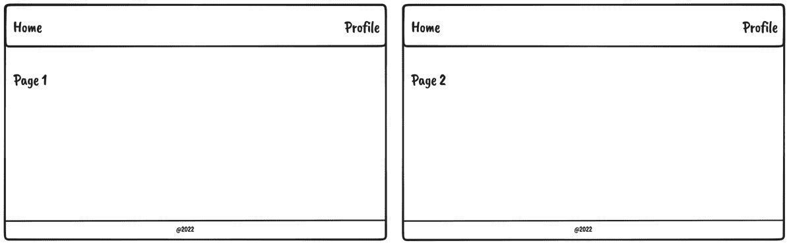
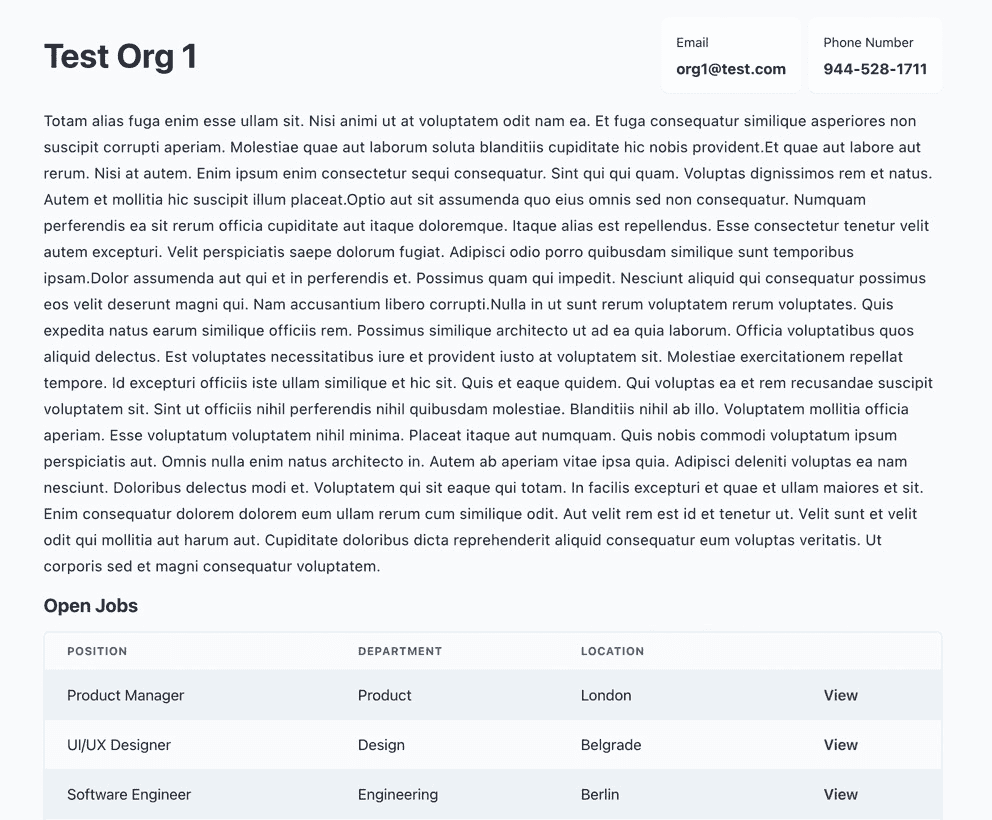
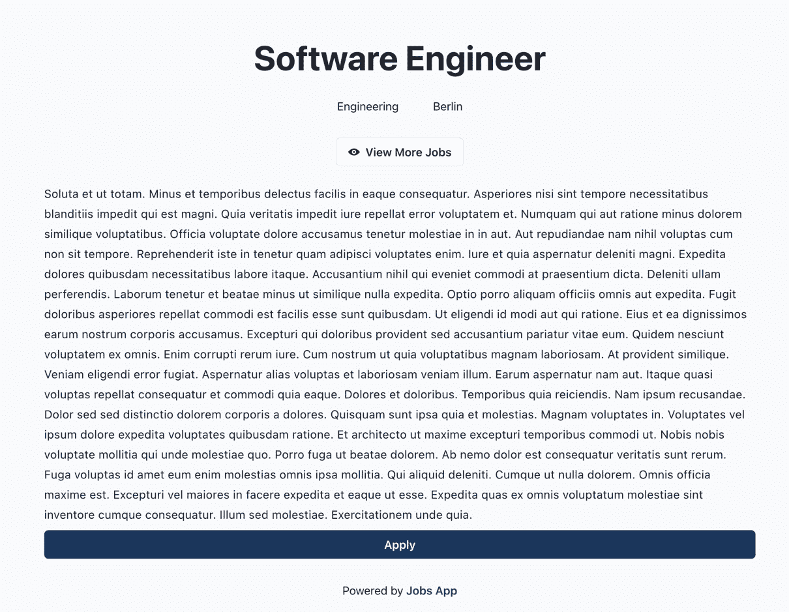
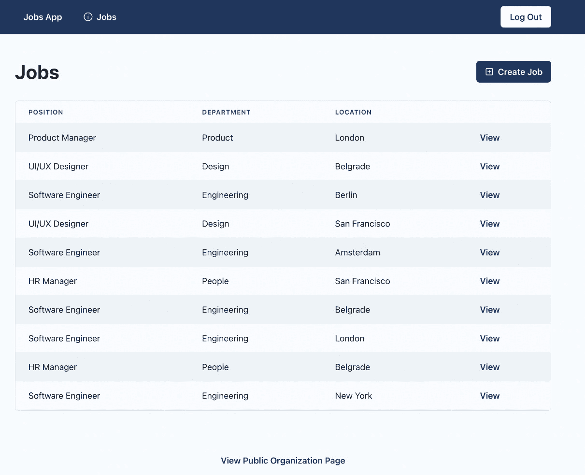
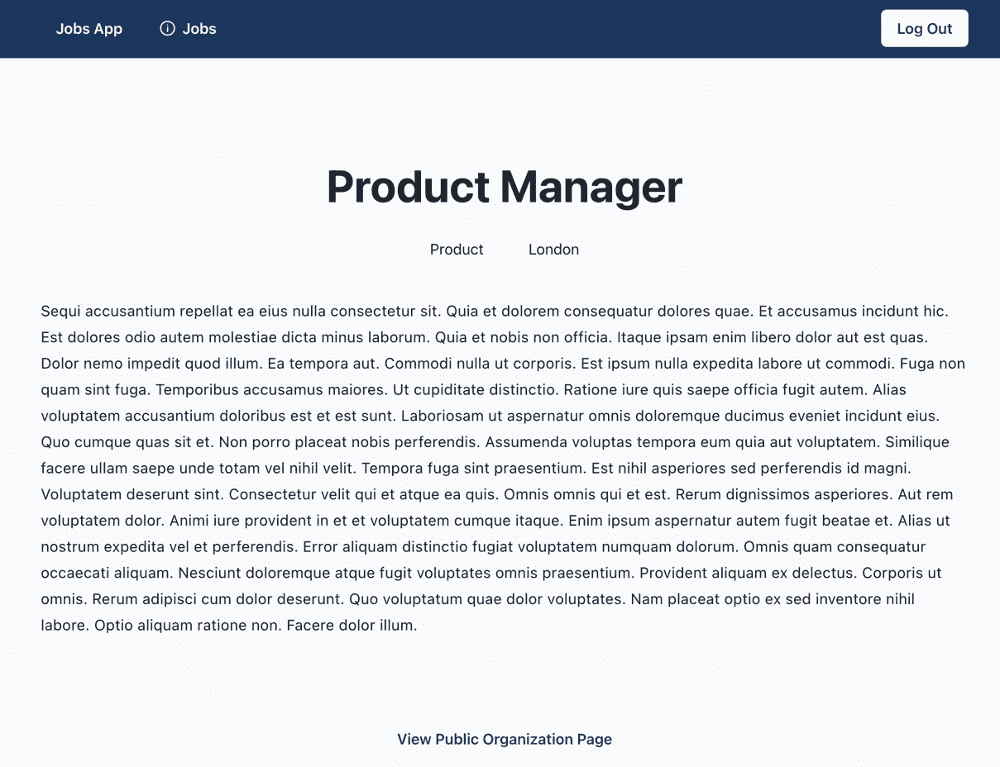
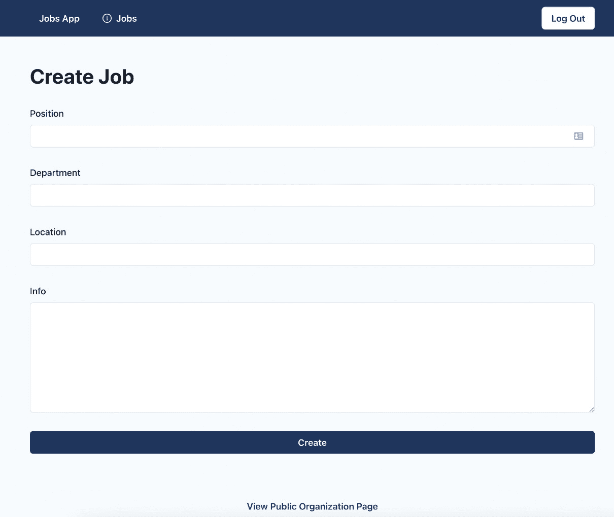

# 4

# 构建和配置页面

在前面的章节中，我们已经配置了应用程序的基础，包括应用程序的设置和共享 UI 组件，这些组件将作为我们 UI 的基础。

在本章中，我们可以通过创建应用程序页面来继续前进。我们将学习 Next.js 中的路由是如何工作的，以及我们可以使用哪些渲染方法来充分利用 Next.js。然后，我们将学习如何配置每个页面的布局，使我们的应用程序看起来和感觉像一个单页应用程序。

在本章中，我们将涵盖以下主题：

+   Next.js 路由

+   Next.js 渲染策略

+   Next.js SEO

+   布局

+   构建页面

到本章结束时，我们将学习如何在 Next.js 中创建页面，并更好地了解根据应用程序的需求选择不同的渲染策略。

# 技术要求

在我们开始之前，我们需要设置项目。为了能够开发项目，你需要在你的计算机上安装以下内容：

+   **Node.js** 版本 16 或以上和 **npm** 版本 8 或以上。

安装 Node.js 和 npm 有多种方法。这里有一篇很好的文章，详细介绍了更多细节：

[`www.nodejsdesignpatterns.com/blog/5-ways-to-install-node-js`](https://www.nodejsdesignpatterns.com/blog/5-ways-to-install-node-js)

+   **VSCode**（可选）目前是 JavaScript/TypeScript 最受欢迎的编辑器/IDE，因此我们将使用它。它是开源的，与 TypeScript 集成良好，并且你可以通过扩展来扩展其功能。可以从 [`code.visualstudio.com/`](https://code.visualstudio.com/) 下载。

本章的代码文件可以在以下位置找到：[`github.com/PacktPublishing/React-Application-Architecture-for-Production`](https://github.com/PacktPublishing/React-Application-Architecture-for-Production)

可以使用以下命令在本地克隆存储库：

```js
git clone https://github.com/PacktPublishing/React-Application-Architecture-for-Production.git
```

一旦克隆了存储库，我们需要安装应用程序的依赖项：

```js
npm install
```

我们还需要提供环境变量：

```js
cp .env.example .env
```

一旦安装了依赖项，我们需要选择与本章匹配的代码库的正确阶段。我们可以通过执行以下命令来完成：

```js
npm run stage:switch
```

此命令将为我们显示每个章节的阶段列表：

```js
? What stage do you want to switch to? (Use arrow
 keys)
❯ chapter-02
  chapter-03
  chapter-03-start
  chapter-04
  chapter-04-start
  chapter-05
  chapter-05-start
(Move up and down to reveal more choices)
```

这是第四章，所以如果你想跟随，可以选择 `chapter-04-start`，或者选择 `chapter-04` 来查看章节的最终结果。一旦选择了章节，所有必要的文件都会出现，以便跟随章节内容。

要跟随本章内容，你不需要对代码进行任何更改。你可以将其作为参考，以帮助更好地了解代码库。

关于设置细节的更多信息，请查看 `README.md` 文件。

# Next.js 路由

Next.js 有一个基于文件系统的路由器，其中每个页面文件代表一个页面。页面是存在于 `pages` 文件夹中的特殊文件，它们具有以下结构：

```js
const Page = () => {
     return <div>Welcome to the page!</div>
}
export default Page;
```

如您所见，只需将`page`组件作为默认导出即可；这是定义页面所需的最小要求。我们将在稍后看到还可以从页面导出什么。

由于路由是基于文件系统的，路由由页面文件的命名方式确定。例如，指向根路由的页面应在`src/pages/index.tsx`文件中定义。如果我们想定义关于页面，我们可以在`src/pages/about.tsx`中定义它。

对于任何具有动态数据的复杂应用程序，仅创建预定义页面是不够的。例如，假设我们有一个社交网络应用程序，我们可以访问用户个人资料。个人资料应该通过用户的 ID 加载。由于为每个用户创建页面文件会过于重复，我们需要使页面动态化，如下所示：

```js
// pages/users/[userId].tsx
import { useRouter } from 'next/router';
const UserProfile = () => {
     const router = useRouter();
     const userId = router.query.userId;
     return <div>User: {userId}</div>;
}
export default UserProfile
```

要获取 ID 并动态加载数据，我们可以在`pages/users/[userId].tsx`中定义一个通用的用户个人资料页面，其中`userId`将动态注入到页面中。例如，访问`/users/123`将显示用户个人资料页面，并通过路由器的`query`属性将`123`的值作为`userId`传递。

# Next.js 渲染策略

Next.js 支持四种不同的渲染策略：

+   **客户端渲染**：在这里，我们可以在服务器上加载初始内容，然后从客户端获取附加数据。

+   **服务器端渲染**：在这里，我们可以在服务器上获取数据，将其注入到页面中，并带有提供的数据将页面返回给客户端。

+   **静态站点生成**：在这里，静态数据被注入到页面中，并以标记的形式返回给客户端。

+   **增量静态再生**：服务器端渲染和静态站点生成之间的折中方案。我们可以静态生成*x*个页面，然后如果请求尚未渲染和缓存的页面，Next.js 可以在服务器上渲染它并为其未来的请求缓存它。

对于我们的应用程序，我们将主要关注前两种方法，让我们看看以下示例中它们是如何工作的。

## 客户端渲染

考虑到用户个人资料页面示例，我们可以通过以下方式执行客户端渲染：

```js
// pages/users/[userId].tsx
import { useRouter } from 'next/router';
import { useUser } from './api';
const UserProfile = () => {
     const router = useRouter();
     const userId = router.query.userId;
     const { user, isLoading } = useUser(userId);
     if(!user && isLoading) return <div>Loading...</div>;
     if(!user) return <div>User not found!</div>;
     return <div>User: {user.name}</div>;
}
```

如我们所见，我们正在使用`userId`来获取用户数据。在这个例子中，我们在客户端执行此操作，这意味着服务器最初将渲染以下标记：

```js
<div>Loading...</div>
```

只有在客户端获取数据后，用户数据才会显示：

```js
<div>User: {user.name}</div>
```

这在关注 SEO 和初始页面加载性能的情况下是可行的。这里我们必须等待初始页面加载，然后获取用户数据。这种方法对于不应公开的数据，如管理仪表板，是完全有效的。

然而，对于公共页面，让服务器返回实际的标记给客户端是一个好主意，这样可以使搜索引擎更容易爬取和索引我们的页面。我们可以通过服务器端渲染页面来实现这一点。

## 服务器端渲染

让我们回顾一下用户个人资料页面的示例，这次是在服务器上渲染：

```js
// pages/users/[userId].tsx
import { useRouter } from 'next/router';
import { getUser } from './api';
const UserProfile = ({ user }) => {
     const router = userRouter();
     const userId = router.query;
     const { user } = useUser(userId);
     if(!user) return <div>User not found!</div>;
     return <div>User: {user.name}</div>;
}
export const getServerSideProps = async ({ params }) => {
     const userId = params.userId;
     const user = await getUser(userId);
     return {
          props: {
               user
          }
     }
}
```

正如我们所见，除了页面组件外，`page`文件还导出了`getServerSideProps`函数，该函数在服务器上执行。它的返回值可以包含`props`，这些`props`被传递到组件的属性中。

服务器将渲染以下标记：

```js
<div>User: {user.name}</div>
```

包含用户数据的完整标记将在初始渲染时可用。

让我们记住，没有一种完美的渲染策略适用于所有用例；因此，我们必须权衡利弊，并根据我们的需求选择使用哪种策略。Next.js 的伟大之处在于它允许我们根据每个页面使用不同的渲染策略，这样我们就可以将它们结合起来，以最佳方式满足应用程序的需求。

# Next.js SEO

为了提高我们页面的 SEO，我们应该添加一些元标签和页面的标题，并将它们注入到页面中。这可以通过 Next.js 提供的`Head`组件来完成。

对于应用程序，我们希望有一个专门的组件，我们可以添加页面的标题。让我们打开`src/components/seo/seo.tsx`文件并添加以下内容：

```js
import Head from 'next/head';
export type SeoProps = {
  title: string;
};
export const Seo = ({ title }: SeoProps) => {
  return (
    <Head>
      <title>{title}</title>
    </Head>
  );
};
```

`Head`组件将把其内容注入到页面的`head`中。目前，标题就足够了，但如果需要，它可以扩展以添加不同的元标签。

让我们在`src/pages/index.tsx`的着陆页中添加`Seo`组件。

首先，让我们导入组件：

```js
import { Seo } from '@/components/seo';
```

然后，我们可以在组件的顶部添加它：

```js
const LandingPage = () => {
  return (
    <>
      <Seo title="Jobs App" />
      <Center>
      {/* rest of the component */}
      </Center>
    </>
  );
};
export default LandingPage
```

# 布局

当开发具有多个视图或页面的应用程序时，我们需要考虑布局的可重用性。

考虑以下示例：



图 4.1 – 布局示例

我们可以看到，在两个页面中，导航栏和页脚是相同的，而主要内容位于中间，因此使其可重用是一个好主意。

向页面添加`layout`组件有两种方式：

+   将每个页面的返回 JSX 包裹在布局组件中

+   将布局附加到页面组件上，并使用它来包裹整个组件

## 将每个页面的 JSX 包裹在布局组件中

假设我们有一个可以包裹每个页面内容的布局组件：

```js
const Layout = ({ children }) => {
     return (
          <div>
               <Header />
               {children}
               <Footer />
          </div>
     )
}
```

我们可以将`Layout`组件添加到页面中，如下所示：

```js
const Page1 = () => {
     const user = useUser();
     if (!user) {
          return (
               <Layout>
                    <div>Unauthenticated!</div>
               </Layout
          )
     }
     return (
          <Layout>
               <h1>Page 1</h1>
          </Layout
     )
}
```

在 Next.js 应用程序中处理布局的这种方式对于一些简单情况来说是可行的。然而，它也有一些缺点，如下列所示：

+   如果`Layout`组件跟踪一些内部状态，当页面更改时它将丢失这些状态

+   页面将丢失其滚动位置

+   我们想在最终返回之前返回的任何内容，也需要用`Layout`包裹

对于我们的应用程序，我们将使用一种更好的方式来处理每个页面的布局，通过将其附加到页面组件上。让我们在以下部分中看看它是如何工作的。

## 将布局附加到页面组件上，并使用它来包裹整个组件

为了使这起作用，我们首先需要更新`src/pages/_app.tsx`文件：

```js
import { NextPage } from 'next';
import type { AppProps } from 'next/app';
import { ReactElement, ReactNode } from 'react';
import { AppProvider } from '@/providers/app';
type NextPageWithLayout = NextPage & {
  getLayout?: (page: ReactElement) => ReactNode;
};
type AppPropsWithLayout = AppProps & {
  Component: NextPageWithLayout;
};
const App = ({
  Component,
  pageProps,
}: AppPropsWithLayout) => {
  const getLayout =
    Component.getLayout ?? ((page) => page);
  const pageContent = getLayout(
    <Component {...pageProps} />
  );
  return <AppProvider>{pageContent}</AppProvider>;
};
export default App;
```

页面组件期望附加`getLayout`静态属性，它将在`_app.tsx`中渲染整个组件时被用来包装。多亏了 React 的协调，当在具有相同布局的页面之间导航时，所有布局组件的状态都将保持。

我们已经构建了布局组件，只需将它们添加到我们的页面中。

现在我们已经准备好了所有东西，让我们构建我们的页面。

# 构建页面

现在我们已经熟悉了 Next.js 页面的工作方式，并准备好了`Seo`组件和布局设置，让我们实现应用程序的页面。我们将实现以下页面：

+   公共组织详情页面

+   公共工作详情页面

+   仪表板中的工作页面

+   仪表板中的工作详情页面

+   创建工作页面

+   404 页面

## 公共组织详情页面

公共组织详情页面是任何用户都可以看到特定组织所有详情及其工作列表的页面。由于这是一个公开页面，我们希望它在服务器上渲染以获得更好的 SEO。

要创建页面，让我们创建`src/pages/organizations/[organizationId]/index.tsx`文件，其中`organizationId`指的是组织的动态 ID，它将被用来检索指定的组织。

然后，让我们导入所有依赖项：

```js
import { Heading, Stack } from '@chakra-ui/react';
import {
  GetServerSidePropsContext,
  InferGetServerSidePropsType,
} from 'next';
import { ReactElement } from 'react';
import { NotFound } from '@/components/not-found';
import { Seo } from '@/components/seo';
import { JobsList, Job } from '@/features/jobs';
import { OrganizationInfo } from '@/features/
  organizations';
import { PublicLayout } from '@/layouts/public-layout';
import {
  getJobs,
  getOrganization,
} from '@/testing/test-data';
```

现在，让我们实现页面组件：

```js
type PublicOrganizationPageProps =
  InferGetServerSidePropsType<typeof getServerSideProps>;
const PublicOrganizationPage = ({
  organization,
  jobs,
}: PublicOrganizationPageProps) => {
  if (!organization) return <NotFound />;
  return (
    <>
      <Seo title={organization.name} />
      <Stack
        spacing="4"
        w="full"
        maxW="container.lg"
        mx="auto"
        mt="12"
        p="4"
      >
        <OrganizationInfo organization={organization} />
        <Heading size="md" my="6">
          Open Jobs
        </Heading>
        <JobsList
          jobs={jobs}
          organizationId={organization.id}
          type="public"
        />
      </Stack>
    </>
  );
};
```

页面组件接受`organization`和`jobs`作为 props。props 由 Next.js 自动传递给页面。传递给页面组件的 props 由`getServerSideProps`函数的返回值决定，该函数在服务器上执行并启用服务器端渲染。我们将在稍后看到它的实现，但现在，让我们连接布局：

```js
PublicOrganizationPage.getLayout = function getLayout(
  page: ReactElement
) {
  return <PublicLayout>{page}</PublicLayout>;
};
```

这是我们将根据我们刚刚配置的设置来使用布局的方式。`getLayout`函数将包装页面组件，并将应用布局。如果需要，我们还可以嵌套多个布局，因此这种方法非常灵活。

现在，让我们导出我们的页面，它必须以`default`导出：

```js
export default PublicOrganizationPage;
```

然后，让我们实现`getServerSideProps`函数：

```js
export const getServerSideProps = async ({
  params,
}: GetServerSidePropsContext) => {
  const organizationId = params?.organizationId as string;
  const [organization, jobs] = await Promise.all([
    getOrganization(organizationId).catch(() => null),
    getJobs(organizationId).catch(() => [] as Job[]),
  ]);
  return {
    props: {
      organization,
      jobs,
    },
  };
};
```

我们正在从`params`中提取组织的 ID，并使用它来获取组织和其工作，然后我们将其作为 props 返回，这些 props 将被传递给页面组件。`getServerSideProps`函数必须作为命名导出导出。

需要注意的另一件事是，目前我们正在使用加载测试数据的实用函数来加载数据，因为我们还没有准备好 API。在接下来的章节中，我们将看到如何创建实际的 API 集成，但到目前为止，这将使我们能够构建我们页面的大部分 UI。

让我们现在打开`http://localhost:3000/organizations/amYXmIyT9mD9GyO6CCr`：



图 4.2 – 公共组织详情页面

我们的组织详细信息页面就在这里！组织可以使用此链接来分享他们组织的详细信息以及他们的职位发布列表。

页面是在服务器上渲染的，这意味着页面的内容将立即对用户可用。

为了验证这一点，请在浏览器中禁用 JavaScript 并刷新页面。

你会注意到没有任何区别。即使禁用了 JavaScript，所有内容都是可用的，因为所有标记都是在服务器上生成的并返回给客户端的。

## 公共职位详细信息页面

公共职位详细信息页面是显示特定职位所有详细信息并允许用户申请的页面。它应该对所有用户都可用，因此我们希望使其对搜索引擎友好。因此，我们希望像组织页面一样在服务器上渲染其内容。

让我们首先创建 `src/pages/organizations/[organizationId]/jobs/[jobId].tsx` 文件，其中 `jobId` 指的是职位的 ID。

然后，让我们导入所有必需的依赖项：

```js
import { Stack, Button } from '@chakra-ui/react';
import {
  GetServerSidePropsContext,
  InferGetServerSidePropsType,
} from 'next';
import { ReactElement } from 'react';
import { NotFound } from '@/components/not-found';
import { Seo } from '@/components/seo';
import { PublicJobInfo } from '@/features/jobs';
import { PublicLayout } from '@/layouts/public-layout';
import {
  getJob,
  getOrganization,
} from '@/testing/test-data';
```

然后，让我们定义我们的职位页面组件：

```js
type PublicJobPageProps = InferGetServerSidePropsType<
  typeof getServerSideProps
>;
export const PublicJobPage = ({
  job,
  organization,
}: PublicJobPageProps) => {
  const isInvalid =
    !job ||
    !organization ||
    organization.id !== job.organizationId;
  if (isInvalid) {
    return <NotFound />;
  }
  return (
    <>
      <Seo title={`${job.position} | ${job.location}`} />
      <Stack w="full">
        <PublicJobInfo job={job} />
        <Button
          bg="primary"
          color="primaryAccent"
          _hover={{
            opacity: '0.9',
          }}
          as="a"
          href={`mailto:${organization?.email}?subject=
            Application for ${job.position} position`}
          target="_blank"
        >
          Apply
        </Button>
      </Stack>
    </>
  );
};
```

正如我们在组织页面中所做的那样，我们通过 `getServerSideProps` 加载职位和组织，并在服务器上渲染内容。

接下来，我们可以附加页面布局并将其导出：

```js
PublicJobPage.getLayout = function getLayout(
  page: ReactElement
) {
  return <PublicLayout>{page}</PublicLayout>;
};
export default PublicJobPage;
```

最后，让我们创建 `getServerSideProps` 函数并将其导出：

```js
export const getServerSideProps = async ({
  params,
}: GetServerSidePropsContext) => {
  const organizationId = params?.organizationId as string;
  const jobId = params?.jobId as string;
  const [organization, job] = await Promise.all([
    getOrganization(organizationId).catch(() => null),
    getJob(jobId).catch(() => null),
  ]);
  return {
    props: {
      job,
      organization,
    },
  };
};
```

我们正在获取职位和组织数据，并将这些数据作为属性传递给页面。内容在服务器上渲染，因此它将立即对客户端可用，就像在组织详细信息页面上一样。

为了验证一切是否正常工作，让我们打开 `http://localhost:3000/organizations/amYXmIyT9mD9GyO6CCr/jobs/2LJ_sgmy_880G9WivH5Hf`：



图 4.3 – 公共职位详细信息页面

很好，内容立即在客户端可用，那么为什么不在服务器上渲染一切呢？

服务器端渲染有几个缺点：

+   需要更多的服务器计算能力，这可能会影响服务器成本

+   长时间的 `getServerSideProps` 执行时间可能会阻塞整个应用程序

正因如此，我们只想在有意义的地方使用它，例如应该对搜索引擎友好的公共页面，以及它们的内容可能更频繁变化的地方。

对于仪表板页面，我们将在服务器上渲染初始加载状态，然后在客户端加载和渲染数据。

## 仪表板中的职位页面

让我们创建 `src/pages/dashboard/jobs/index.tsx` 文件。

然后，我们可以导入所有必需的依赖项：

```js
import { PlusSquareIcon } from '@chakra-ui/icons';
import { Heading, HStack } from '@chakra-ui/react';
import { ReactElement } from 'react';
import { Link } from '@/components/link';
import { Loading } from '@/components/loading';
import { Seo } from '@/components/seo';
import { JobsList } from '@/features/jobs';
import { DashboardLayout } from '@/layouts/dashboard-layout';
import { useJobs, useUser } from '@/testing/test-data';
```

接下来，我们可以定义并导出页面组件：

```js
const DashboardJobsPage = () => {
  const user = useUser();
  const jobs = useJobs(user.data?.organizationId ?? '');
  if (jobs.isLoading) return <Loading />;
  if (!user.data) return null;
  return (
    <>
      <Seo title="Jobs" />
      <HStack
        mb="8"
        align="center"
        justify="space-between"
      >
        <Heading>Jobs</Heading>
        <Link
          icon={<PlusSquareIcon />}
          variant="solid"
          href="/dashboard/jobs/create"
        >
          Create Job
        </Link>
      </HStack>
      <JobsList
        jobs={jobs.data || []}
        isLoading={jobs.isLoading}
        organizationId={user.data.organizationId}
        type="dashboard"
      />
    </>
  );
};
DashboardJobsPage.getLayout = function getLayout(
  page: ReactElement
) {
  return <DashboardLayout>{page}</DashboardLayout>;
};
export default DashboardJobsPage;
```

注意到所有数据获取都是在组件中发生的，因为我们是在客户端进行的。

为了验证一切是否按预期工作，让我们打开 `http://localhost:3000/dashboard/jobs`：



图 4.4 – 仪表板职位页面

就这样！这个页面允许组织管理员对其组织的职位有一个概览。

## 仪表板中的工作详情页面

仪表板工作详情页面将在仪表板中显示给定工作的所有详细信息。

要开始，让我们创建`src/pages/dashboard/jobs/[jobId].tsx`，其中`jobId`指的是工作的动态 ID。

然后，我们可以导入所有依赖项：

```js
import { useRouter } from 'next/router';
import { ReactElement } from 'react';
import { Loading } from '@/components/loading';
import { NotFound } from '@/components/not-found';
import { Seo } from '@/components/seo';
import { DashboardJobInfo } from '@/features/jobs';
import { DashboardLayout } from '@/layouts/
  dashboard-layout';
import { useJob } from '@/testing/test-data';
```

然后，让我们定义并导出我们的页面组件：

```js
const DashboardJobPage = () => {
  const router = useRouter();
  const jobId = router.query.jobId as string;
  const job = useJob(jobId);
  if (job.isLoading) {
    return <Loading />;
  }
  if (!job.data) {
    return <NotFound />;
  }
  return (
    <>
      <Seo
        title={`${job.data.position} | ${job.data.
          location}`}
      />
      <DashboardJobInfo job={job.data} />
    </>
  );
};
DashboardJobPage.getLayout = function getLayout(
  page: ReactElement
) {
  return <DashboardLayout>{page}</DashboardLayout>;
};
export default DashboardJobPage;
```

为了验证一切按预期工作，让我们打开`http://localhost:3000/dashboard/jobs/wS6UeppUQoiXGTzAI6XrM`：



图 4.5 – 仪表板工作详情页面

这就是我们的仪表板工作详情页面。我们可以在这里看到给定工作的基本详情。

## 创建工作页面

创建工作页面是我们将渲染创建工作表单的页面。

要开始，让我们创建`src/pages/dashboard/jobs/create.tsx`。

然后，让我们导入所需的依赖项：

```js
import { Heading } from '@chakra-ui/react';
import { useRouter } from 'next/router';
import { ReactElement } from 'react';
import { Seo } from '@/components/seo';
import { CreateJobForm } from '@/features/jobs';
import { DashboardLayout } from '@/layouts/
  dashboard-layout';
```

然后，我们可以创建并导出页面组件：

```js
const DashboardCreateJobPage = () => {
  const router = useRouter();
  const onSuccess = () => {
    router.push(`/dashboard/jobs`);
  };
  return (
    <>
      <Seo title="Create Job" />
      <Heading mb="8">Create Job</Heading>
      <CreateJobForm onSuccess={onSuccess} />
    </>
  );
};
DashboardCreateJobPage.getLayout = function getLayout(
  page: ReactElement
) {
  return <DashboardLayout>{page}</DashboardLayout>;
};
export default DashboardCreateJobPage;
```

为了验证一切按预期工作，让我们打开`http://localhost:3000/dashboard/jobs/create`：



图 4.6 – 仪表板创建工作页面

看到这里！对于本章，我们刚刚创建了页面，将在接下来的章节中处理数据提交。

## 404 页面

如果您在我们实现之前尝试访问一个页面，您可能已经注意到一个空白页面。为了使用户知道他们访问了一个不存在的页面，我们应该创建一个自定义的 404 页面。

让我们先创建`src/pages/404.tsx`并添加以下内容：

```js
import { Center } from '@chakra-ui/react';
import { Link } from '@/components/link';
import { NotFound } from '@/components/not-found';
const NotFoundPage = () => {
  return (
    <>
      <NotFound />
      <Center>
        <Link href="/">Home</Link>
      </Center>
    </>
  );
};
export default NotFoundPage;
```

`pages`文件夹中的`404.tsx`文件是一个特殊页面，当用户访问未知页面时将显示。

为了验证一切按预期工作，让我们访问`http://localhost:3000/non-existing-page`：


图 4.7 – 404 页面

看到这里！我们有一个漂亮的界面可以返回到应用程序，如果我们最终进入了一个缺失的页面。

# 摘要

在本章中，我们的重点是构建我们应用程序的页面。

我们首先查看 Next.js 中的路由是如何工作的。然后，我们介绍了我们将要使用的渲染策略。之后，我们构建了 SEO 组件，该组件将内容注入到页面的头部。

然后，我们为我们的页面配置了布局系统。在本章的结尾，我们为我们的应用程序构建了页面。为了构建页面的内容，我们使用了预定义的测试数据。我们使用测试数据在页面上渲染内容，但我们仍然需要执行真实的 API 调用。

在下一章中，我们将学习如何模拟 API 端点，我们可以在开发期间使用它们来执行 HTTP 请求并获取数据，就像我们正在消费真实的 API 一样。
