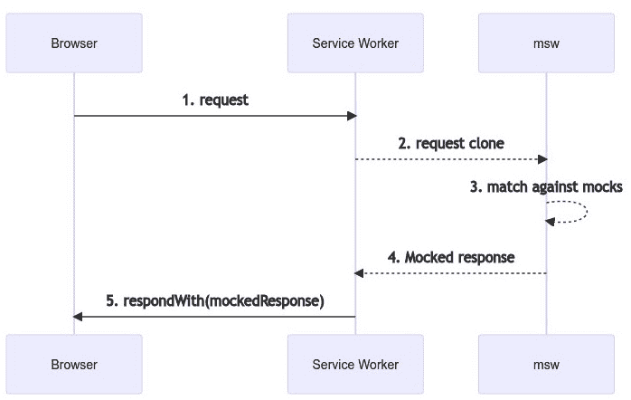
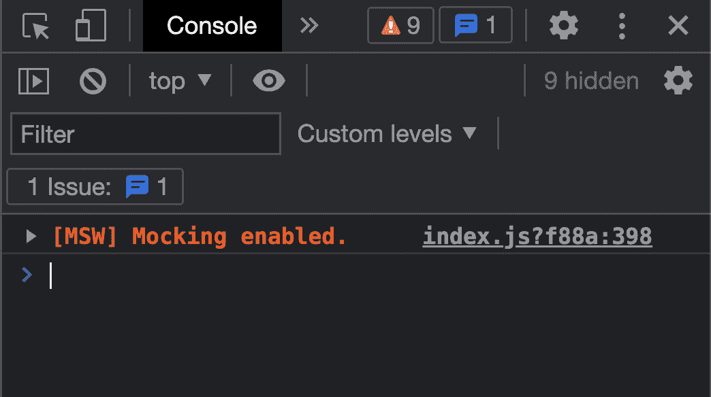
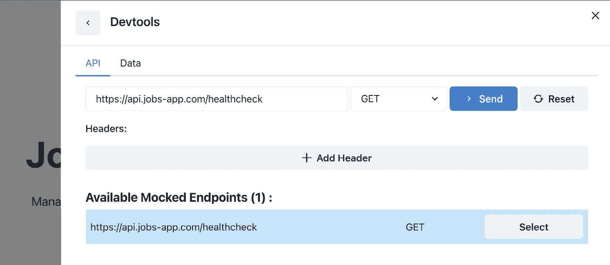
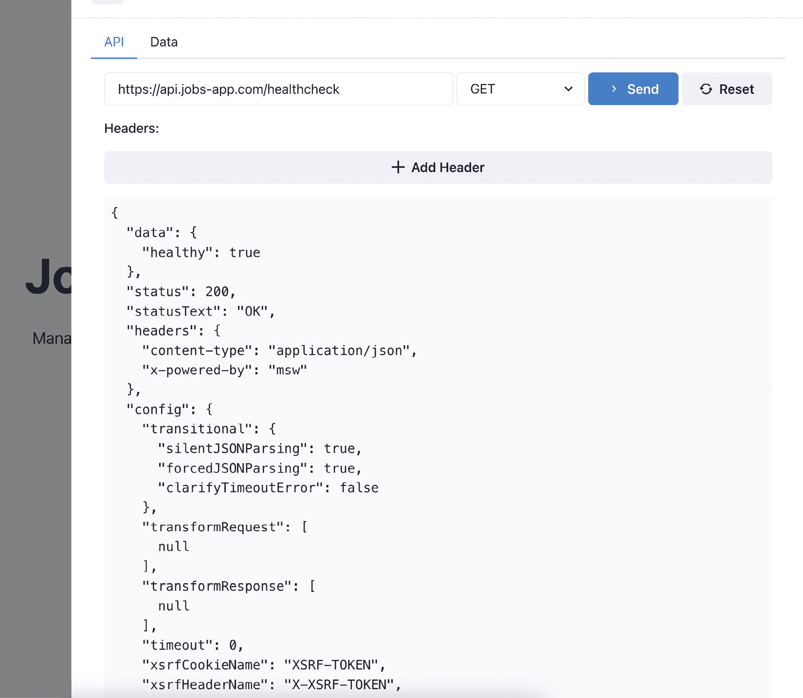
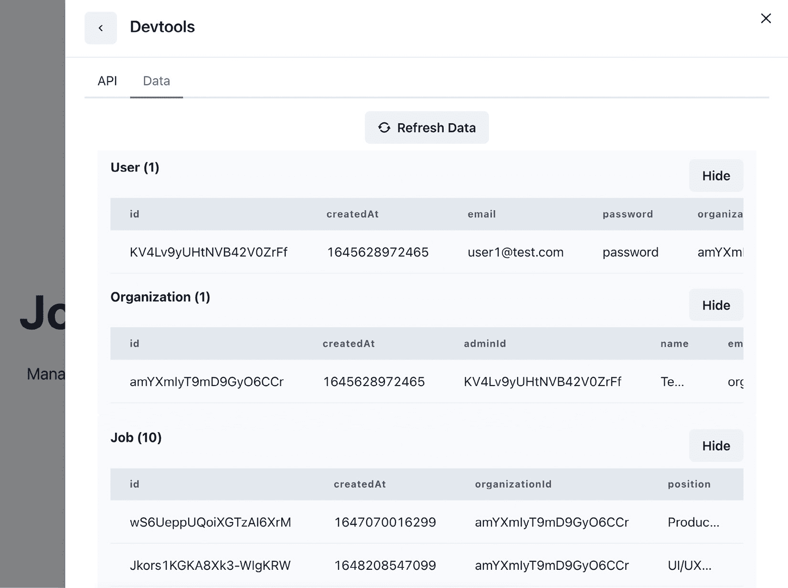
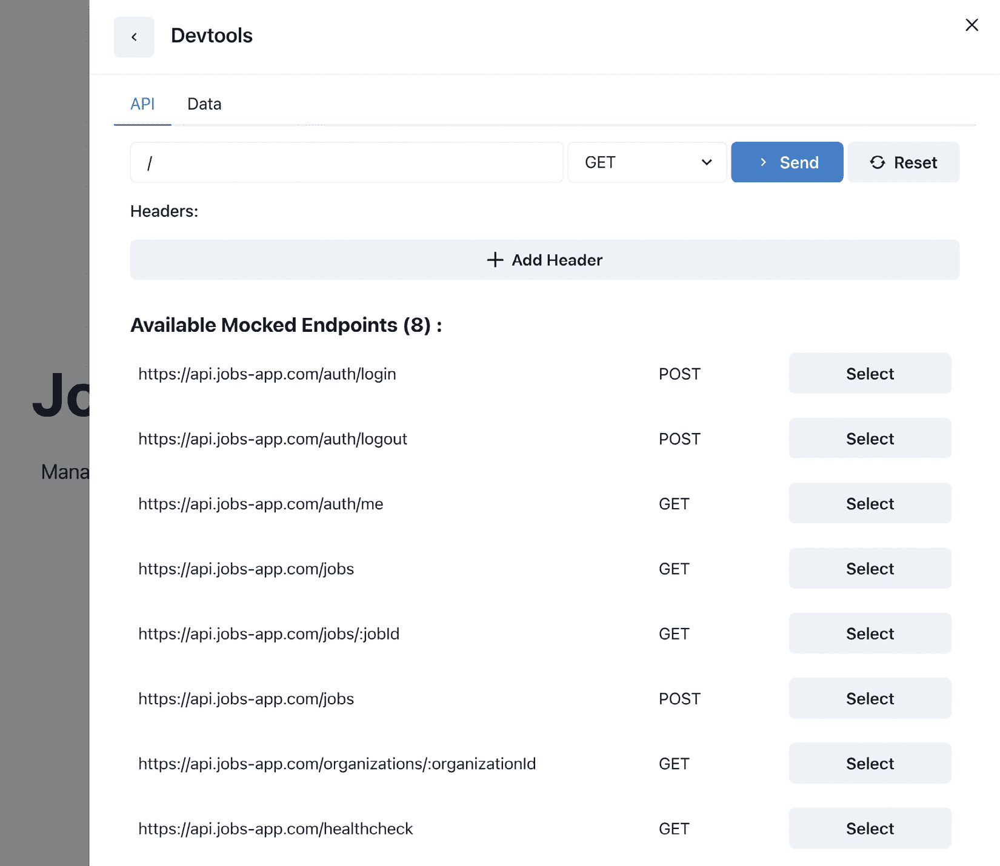

# 5

# 模拟 API

在上一章中，我们构建了使用测试数据的应用程序页面。页面的 UI 是完整的，但页面尚未启用。我们正在使用测试数据，而不向 API 发送请求。

在本章中，我们将学习模拟是什么以及为什么它有用。我们将学习如何使用 `msw` 库模拟 API 端点，这是一个允许我们创建模拟 API 端点的强大工具，这些端点的行为类似于现实世界的 API 端点。

我们还将学习如何使用 `@mswjs/data` 库对应用程序实体的数据进行建模。

在本章中，我们将涵盖以下主题：

+   为什么模拟是有用的？

+   MSW 简介

+   配置数据模型

+   配置 API 端点的请求处理器

到本章结束时，我们将学习如何生成具有完整功能的模拟 API，其中已设置数据模型，这将使我们的代码库在开发期间对外部 API 的依赖性降低。

# 技术要求

在我们开始之前，我们需要设置我们的项目。为了能够开发我们的项目，我们将在计算机上需要以下内容安装：

+   **Node.js** 版本 16 或以上和 **npm** 版本 8 或以上

安装 Node.js 和 npm 有多种方法。以下是一篇深入探讨的精彩文章：[`www.nodejsdesignpatterns.com/blog/5-ways-to-install-node-js`](https://www.nodejsdesignpatterns.com/blog/5-ways-to-install-node-js).

+   **Visual Studio Code** （**VS Code**）（可选）是目前最流行的 JavaScript/TypeScript 编辑器/IDE，因此我们将使用它。它是开源的，与 TypeScript 集成良好，并且我们可以通过扩展来扩展其功能。可以从这里下载：[`code.visualstudio.com/`](https://code.visualstudio.com/).

本章的代码文件可以在以下位置找到：[`github.com/PacktPublishing/React-Application-Architecture-for-Production`](https://github.com/PacktPublishing/React-Application-Architecture-for-Production)

可以使用以下命令在本地克隆存储库：

```js
git clone https://github.com/PacktPublishing/React-Application-Architecture-for-Production.git
```

一旦克隆了存储库，我们需要安装应用程序的依赖项：

```js
npm install
```

我们可以使用以下命令提供环境变量：

```js
cp .env.example .env
```

一旦安装了依赖项，我们需要选择与本章匹配的代码库的正确阶段。我们可以通过执行以下命令来完成：

```js
npm run stage:switch
```

此命令将为我们提供每个章节的阶段列表：

```js
? What stage do you want to switch to? (Use arrow
 keys)
❯ chapter-02
  chapter-03
  chapter-03-start
  chapter-04
  chapter-04-start
  chapter-05
  chapter-05-start
(Move up and down to reveal more choices)
```

这是第五章，所以如果我们想跟随，可以选择 `chapter-05-start`，或者选择 `chapter-05` 来查看章节的最终结果。

一旦选择了章节，所有用于跟随本章所需的文件将显示出来。

更多关于设置细节的信息，请查看 `README.md` 文件。

# 为什么模拟是有用的？

**模拟**是模拟系统部分的过程，这意味着它们不是生产就绪的，而是有用的开发测试的假版本。

你可能会问自己，*为什么我们要费心设置模拟 API 呢？* 拥有模拟 API 有几个好处：

+   **开发期间外部服务的独立性**：一个 Web 应用程序通常由许多不同的部分组成，如前端、后端、外部第三方 API 等。在开发前端时，我们希望尽可能自主，不被系统中的某些非功能部分所阻碍。如果我们的应用程序 API 损坏或不完整，我们仍然应该能够继续开发应用程序的前端部分。

+   **快速原型设计**：模拟端点允许我们更快地原型化应用程序，因为它们不需要任何额外的设置，例如后端服务器、数据库等。这对于构建**概念验证**（**POCs**）和**最小可行产品**（**MVP**）应用程序非常有用。

+   **离线开发**：通过模拟 API 端点，我们可以在没有互联网连接的情况下开发我们的应用程序。

+   **测试**：我们不想在测试前端时触及我们的真实服务。这就是模拟 API 变得有用的地方。我们可以像针对真实 API 构建一样构建和测试整个功能，然后在生产时切换到真实的一个。

为了测试我们的 API 端点，我们将使用**Mock Service Worker**（**MSW**）库，这是一个非常棒的工具，它允许我们以非常优雅的方式模拟端点。

# MSW 简介

**MSW** 是一个允许我们创建模拟 API 的工具。它作为一个服务工作者，拦截任何已定义模拟版本的 API 请求。我们可以像调用真实 API 一样，在我们的浏览器“网络”标签页中检查请求和响应。

为了获得其工作的高级概述，让我们看看他们网站上提供的图解：



图 5.1 – MSW 工作流程图

MSW 的一个优点是，我们的应用程序将表现得就像它正在使用真实的 API 一样，而且通过关闭模拟端点和不拦截请求，切换到使用真实 API 是非常简单的。

另一件很棒的事情是，由于拦截发生在网络级别，我们仍然能够在浏览器开发者工具的“网络”标签页中检查我们的请求。

## 配置概述

我们已经将 MSW 包安装为开发依赖项。msw 模拟 API 可以被配置为在浏览器和服务器上同时工作。

### 浏览器

模拟 API 的**浏览器**版本可以在应用程序开发期间运行模拟端点。

#### 初始化

需要做的第一件事是创建一个服务工作者。这可以通过执行以下命令来完成：

```js
npx msw init public/ --save
```

上述命令将在`public/mockServiceWorker.js`创建一个服务工作者，它将在浏览器中拦截我们的请求并相应地修改响应。

#### 为浏览器配置工作器

我们现在可以配置我们的工作器使用我们将在不久后定义的端点。让我们打开`src/testing/mocks/browser.ts`文件并添加以下内容：

```js
import { setupWorker } from 'msw';
import { handlers } from './handlers';
export const worker = setupWorker(...handlers);
```

上述代码片段将配置 MSW 与提供的处理程序在浏览器中一起工作。

### 服务器

*服务器*版本主要用于运行自动化测试，因为我们的测试运行器在 Node 环境中工作，而不是在浏览器中。服务器版本对于在服务器上执行的 API 调用也很有用，这对于我们的应用程序在服务器端渲染时是必需的。

#### 为服务器配置 MSW

让我们打开`src/testing/mocks/server.ts`文件并添加以下内容：

```js
import { setupServer } from 'msw/node';
import { handlers } from './handlers';
export const server = setupServer(...handlers);
```

上述代码片段将处理程序应用到我们的模拟的服务器版本。

### 在应用程序中运行 MSW

现在我们已经配置了 MSW，我们需要让它在我们的应用程序中运行。为此，让我们打开`src/testing/mocks/initialize.ts`文件并修改`initializeMocks`函数如下：

```js
import { IS_SERVER } from '@/config/constants';
const initializeMocks = () => {
  if (IS_SERVER) {
    const { server } = require('./server');
    server.listen();
  } else {
    const { worker } = require('./browser');
    worker.start();
  }
};
initializeMocks();
```

`initializeMocks`函数负责根据其被调用的环境调用适当的 MSW 设置。如果它在服务器上执行，它将运行服务器版本。否则，它将启动浏览器版本。

现在，我们需要集成我们的模拟。

让我们创建一个`src/lib/msw.tsx`文件并添加以下内容：

```js
import { MSWDevTools } from 'msw-devtools';
import { ReactNode } from 'react';
import { IS_DEVELOPMENT } from '@/config/constants';
import { db, handlers } from '@/testing/mocks';
export type MSWWrapperProps = {
  children: ReactNode;
};
require('@/testing/mocks/initialize');
export const MSWWrapper = ({
  children,
}: MSWWrapperProps) => {
  return (
    <>
      {IS_DEVELOPMENT && (
        <MSWDevTools db={db} handlers={handlers} />
      )}
      {children}
    </>
  );
};
```

在这里，我们定义了`MSWWrapper`，这是一个将包裹我们的应用程序并初始化 MSW 和 MSW 开发工具到包裹应用程序中的组件。

现在我们可以通过打开`src/pages/_app.tsx`将其集成到我们的应用程序中。

我们想要添加新的导入：

```js
import dynamic from 'next/dynamic';
import { API_MOCKING } from '@/config/constants';
import { MSWWrapperProps } from '@/lib/msw';
```

然后，我们想要动态加载`MSWWrapper`：

```js
const MSWWrapper = dynamic<MSWWrapperProps>(() =>
  import('@/lib/msw').then(({ MSWWrapper }) => MSWWrapper)
);
```

最后，让我们修改`App`组件的`return`语句如下：

```js
return (
    <AppProvider>
      {API_MOCKING ? (
        <MSWWrapper>{pageContent}</MSWWrapper>
      ) : (
        pageContent
      )}
    </AppProvider>
  );
```

如您所见，我们只有在模拟启用时才会加载`MSWWrapper`组件并包裹页面内容。我们这样做是为了排除应用程序生产版本中的 MSW 相关代码，该版本使用真实 API，并且不需要冗余的 MSW 相关代码。

为了验证 MSW 是否正在运行，让我们打开控制台。我们应该看到如下内容：



图 5.2 – MSW 在我们的应用程序中运行

现在我们已经成功安装并集成了 MSW 到我们的应用程序中，让我们实现我们的第一个模拟端点。

## 编写我们的第一个处理程序

要定义模拟端点，我们需要创建请求处理程序。将请求处理程序想象成函数，它们通过模拟其响应来确定是否应该拦截和修改请求。

让我们在`src/testing/mocks/handlers/index.ts`文件中创建我们的第一个处理程序，添加以下内容：

```js
import { rest } from 'msw';
import { API_URL } from '@/config/constants';
export const handlers = [
  rest.get(`${API_URL}/healthcheck`, (req, res, ctx) => {
    return res(
      ctx.status(200),
      ctx.json({ healthy: true })
    );
  }),
];
```

我们正在使用`msw`提供的`rest`辅助工具来定义我们的 REST 端点。我们使用的是`get`方法，它接受路径和一个回调，该回调将修改响应。

处理程序回调将返回一个状态码为`200`的响应，并将响应数据设置为`{ healthy: true }`。

为了验证我们的处理程序是否正常工作，让我们在右下角打开开发者工具，然后选择健康检查端点：



图 5.3 – 健康检查处理程序测试选择

发送请求应该会给我们一个响应，如下所示：



图 5.4 – 健康检查处理程序测试结果

**Devtools**小部件将为我们提供测试处理程序的能力，而无需立即在应用程序中创建 UI。

现在我们已经在应用程序中正确运行了 MSW，是时候为我们的应用程序创建数据模型了。

# 配置数据模型

为了对应用程序进行数据建模，我们将使用 MSW 的数据库，它非常实用且易于使用，可以以类似后端对象关系映射器（ORM）的方式操作数据。

要使我们的请求处理程序功能化，我们只需直接编写响应即可，但那样有什么乐趣呢？使用 MSW 及其数据库，我们可以构建一个模拟的后端，它包含业务逻辑，并且如果我们决定实现它，它将完全功能化。

要配置我们的数据模型，让我们打开`src/testing/mocks/db.ts`文件并添加以下内容：

```js
import { factory, primaryKey } from '@mswjs/data';
import { uid } from '@/utils/uid';
const models = {
  user: {
    id: primaryKey(uid),
    createdAt: Date.now,
    email: String,
    password: String,
    organizationId: String,
  },
  organization: {
    id: primaryKey(uid),
    createdAt: Date.now,
    adminId: String,
    name: String,
    email: String,
    phone: String,
    info: String,
  },
  job: {
    id: primaryKey(uid),
    createdAt: Date.now,
    organizationId: String,
    position: String,
    info: String,
    location: String,
    department: String,
  },
};
export const db = factory(models);
```

我们从`@mswjs/data`包中导入`factory`和`primaryKey`函数。`primaryKey`函数允许我们在模拟数据库中定义主键，而`factory`函数创建一个内存数据库，我们可以用它来进行测试。

然后，我们可以访问每个模型的一组不同方法，这些方法允许我们更轻松地操作我们的数据，如下所示：

```js
db.job.findFirst
db.job.findMany
db.job.create
db.job.update
db.job.delete
```

如果我们能在数据库中预先填充一些数据，那就太好了，这样我们总是有东西可以在我们的应用程序中展示。为此，我们应该对数据库进行预种。

让我们打开`src/testing/mocks/seed-db.ts`文件并添加以下内容：

```js
import { db } from './db';
import { testData } from '../test-data';
export const seedDb = () => {
  const userCount = db.user.count();
  if (userCount > 0) return;
  testData.users.forEach((user) => db.user.create(user));
  testData.organizations.forEach((organization) =>
    db.organization.create(organization)
  );
  testData.jobs.forEach((job) => db.job.create(job));
};
```

`seedDb`函数将用测试数据填充数据库。

在我们的模拟端点初始化后执行它。打开`src/testing/mocks/initialize.ts`并调用函数，如下所示：

```js
import { IS_SERVER } from '@/config/constants';
import { seedDb } from './seed-db';
const initializeMocks = () => {
  if (IS_SERVER) {
    const { server } = require('./server');
    server.listen();
  } else {
    const { worker } = require('./browser');
    worker.start();
  }
  seedDb();
};
initializeMocks();
```

要检查我们数据库中的数据，我们可以在**Devtools**中打开**数据**标签页：



图 5.5 – 检查预种数据

太棒了！现在，我们的数据库已经预先填充了一些测试数据。我们现在可以创建请求处理程序，它们将与数据库交互并消耗数据。

# 配置 API 端点的请求处理程序

在本节中，我们将定义我们应用程序的处理程序。如前所述，MSW 中的处理程序是一个函数，如果定义了它，将拦截任何匹配的请求，而不是将请求发送到网络，而是修改它们并返回模拟的响应。

## API 工具

在开始之前，让我们快速查看`src/testing/mocks/utils.ts`文件，它包含我们将用于处理 API 处理程序业务逻辑的一些实用工具：

+   `authenticate` 接受用户凭证，如果它们有效，它将从数据库返回用户以及认证令牌。

+   `getUser` 返回一个测试用户对象。

+   `requireAuth` 如果 cookie 中的令牌可用，则返回当前用户。如果令牌不存在，它可以选择抛出一个错误。

在开始之前，让我们将所有处理器包含在配置中。打开 `src/testing/mocks/handlers/index.ts` 文件并将其更改为以下内容：

```js
import { rest } from 'msw';
import { API_URL } from '@/config/constants';
import { authHandlers } from './auth';
import { jobsHandlers } from './jobs';
import { organizationsHandlers } from './organizations';
export const handlers = [
  ...authHandlers,
  ...jobsHandlers,
  ...organizationsHandlers,
  rest.get(`${API_URL}/healthcheck`, (req, res, ctx) => {
    return res(
      ctx.status(200),
      ctx.json({ healthy: true })
    );
  }),
];
```

我们将定义的所有处理器都包含在每个处理器的文件中，并使它们对 MSW 可用。

现在，我们可以开始为我们应用程序编写请求处理器。

## 认证处理器

对于 `auth` 功能，我们需要以下端点：

+   `POST /auth/login`

+   `POST /auth/logout`

+   `GET /auth/me`

`auth` 的端点将在 `src/test/mocks/handlers/auth.ts` 文件中定义。

让我们先导入依赖项：

```js
import { rest } from 'msw';
import { API_URL } from '@/config/constants';
import {
  authenticate,
  requireAuth,
  AUTH_COOKIE,
} from '../utils';
```

然后，让我们创建一个用于登录的请求处理器：

```js
const loginHandler = rest.post(
  `${API_URL}/auth/login`,
  async (req, res, ctx) => {
    const credentials = await req.json();
    const { user, jwt } = authenticate(credentials);
    return res(
      ctx.delay(300),
      ctx.cookie(AUTH_COOKIE, jwt, {
        path: '/',
        httpOnly: true,
      }),
      ctx.json({ user })
    );
  }
);
```

我们正在提取凭证并使用它们来获取用户信息和令牌。然后，我们将令牌附加到 cookie 中，并在 300 毫秒的延迟后以真实 API 的方式返回用户。

我们使用 `httpOnly` cookie，因为它更安全，因为它不可从客户端访问。

然后，让我们创建一个注销处理器：

```js
const logoutHandler = rest.post(
  `${API_URL}/auth/logout`,
  async (req, res, ctx) => {
    return res(
      ctx.delay(300),
      ctx.cookie(AUTH_COOKIE, '', {
        path: '/',
        httpOnly: true,
      }),
      ctx.json({ success: true })
    );
  }
);
```

该处理器将仅清空 cookie 并返回响应。任何后续请求到受保护的处理器都将抛出错误。

最后，我们有一个用于获取当前认证用户的端点：

```js
const meHandler = rest.get(
  `${API_URL}/auth/me`,
  async (req, res, ctx) => {
    const user = requireAuth({ req, shouldThrow: false });
    return res(ctx.delay(300), ctx.json(user));
  }
);
```

该端点将提取令牌中的用户并将其作为响应返回。最后，我们应该导出处理器，以便它们可以被 MSW 消费：

```js
export const authHandlers = [
  loginHandler,
  logoutHandler,
  meHandler,
];
```

## 工作处理器

对于 `jobs` 功能，我们需要以下端点：

+   `GET /jobs`

+   `GET /jobs/:jobId`

+   `POST /jobs`

`jobs` 的端点将在 `src/test/mocks/handlers/jobs.ts` 文件中定义。

让我们先导入依赖项：

```js
import { rest } from 'msw';
import { API_URL } from '@/config/constants';
import { db } from '../db';
import { requireAuth } from '../utils';
```

然后，让我们实现一个用于获取工作的处理器：

```js
const getJobsHandler = rest.get(
  `${API_URL}/jobs`,
  async (req, res, ctx) => {
    const organizationId = req.url.searchParams.get(
      'organizationId'
    ) as string;
    const jobs = db.job.findMany({
      where: {
        organizationId: {
          equals: organizationId,
        },
      },
    });
    return res(
      ctx.delay(300),
      ctx.status(200),
      ctx.json(jobs)
    );
  }
);
```

我们从查询参数中获取组织 ID，并使用它来获取给定组织的作业，然后将其作为响应返回。

我们还想要创建一个工作详情端点。我们可以通过创建以下处理器来实现：

```js
const getJobHandler = rest.get(
  `${API_URL}/jobs/:jobId`,
  async (req, res, ctx) => {
    const jobId = req.params.jobId as string;
    const job = db.job.findFirst({
      where: {
        id: {
          equals: jobId,
        },
      },
    });
    if (!job) {
      return res(
        ctx.delay(300),
        ctx.status(404),
        ctx.json({ message: 'Not found!' })
      );
    }
    return res(
      ctx.delay(300),
      ctx.status(200),
      ctx.json(job)
    );
  }
);
```

我们从 URL 参数中获取工作 ID，并使用它从数据库检索给定的工作。如果没有找到工作，我们返回一个 `404` 错误。否则，我们在响应中返回工作。

我们的应用程序还需要一个用于创建工作的端点。我们可以创建一个处理器，如下所示：

```js
const createJobHandler = rest.post(
  `${API_URL}/jobs`,
  async (req, res, ctx) => {
    const user = requireAuth({ req });
    const jobData = await req.json();
    const job = db.job.create({
      ...jobData,
      organizationId: user?.organizationId,
    });
    return res(
      ctx.delay(300),
      ctx.status(200),
      ctx.json(job)
    );
  }
);
```

我们首先检查用户是否已认证，因为我们不希望允许未认证用户创建（操作）。然后，我们从请求中获取工作数据，并使用这些数据创建一个新的工作，然后将其作为响应返回。

最后，我们想要导出处理器，以便它们对 MSW 可用：

```js
export const jobsHandlers = [
  getJobsHandler,
  getJobHandler,
  createJobHandler,
];
```

## 组织处理器

对于 `organizations` 功能，我们需要 `GET /``organizations/:organizationId` 端点。

所有针对此功能的处理程序都将定义在 `src/test/mocks/handlers/organizations.ts` 文件中。

让我们先导入所有必需的依赖项：

```js
import { rest } from 'msw';
import { API_URL } from '@/config/constants';
import { db } from '../db';
```

然后，我们可以通过添加以下内容来实现获取组织详情的端点：

```js
const getOrganizationHandler = rest.get(
  `${API_URL}/organizations/:organizationId`,
  (req, res, ctx) => {
    const organizationId = req.params
      .organizationId as string;
    const organization = db.organization.findFirst({
      where: {
        id: {
          equals: organizationId,
        },
      },
    });
    if (!organization) {
      return res(
        ctx.status(404),
        ctx.json({ message: 'Not found!' })
      );
    }
    return res(
      ctx.delay(300),
      ctx.status(200),
      ctx.json(organization)
    );
  }
);
```

我们从 URL 参数中获取组织 ID，并使用它来检索指定的组织。如果它在数据库中不存在，处理程序将返回一个 `404` 错误；否则，它将返回找到的组织。

最后，我们必须导出处理程序：

```js
export const organizationsHandlers = [
  getOrganizationHandler,
];
```

为了验证我们已定义了所有处理程序，我们可以再次访问 **Devtools**：



图 5.6 – 模拟端点

太好了！现在，我们已经拥有了所有必需的处理程序，使我们的应用程序能够像消费真实 API 一样工作。玩转这些处理程序以确保一切按预期工作。在下一章中，我们将将这些端点集成到应用程序中。

# 摘要

在本章中，我们学习了如何模拟 API。我们介绍了 **MSW** 库，这是一个以优雅方式模拟 API 的优秀工具。它可以在浏览器和服务器上工作。它在原型设计和开发过程中的测试中非常有用。

在下一章中，我们将集成应用程序的 API 层，该层将消费我们刚刚创建的端点。
