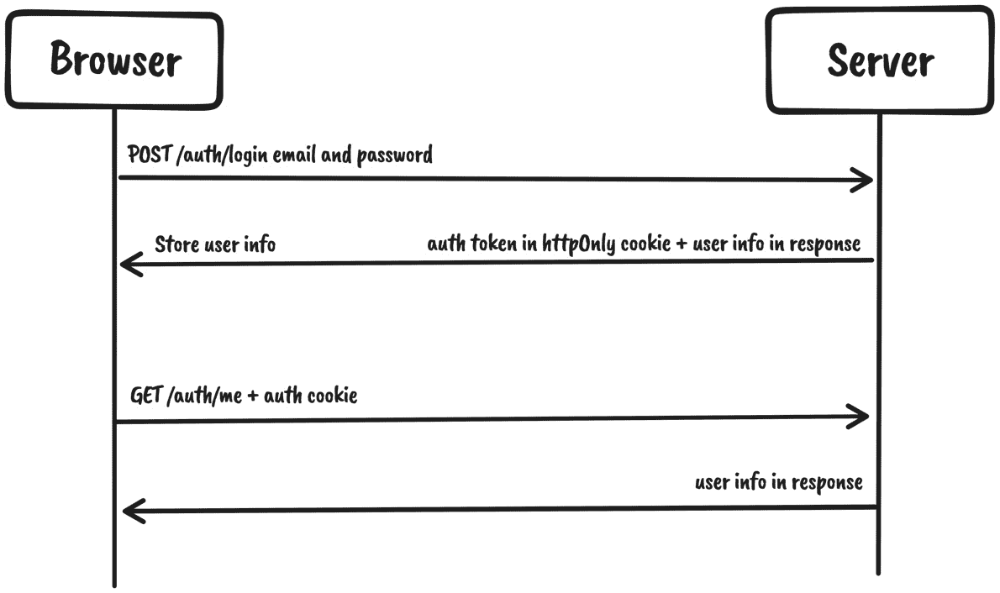
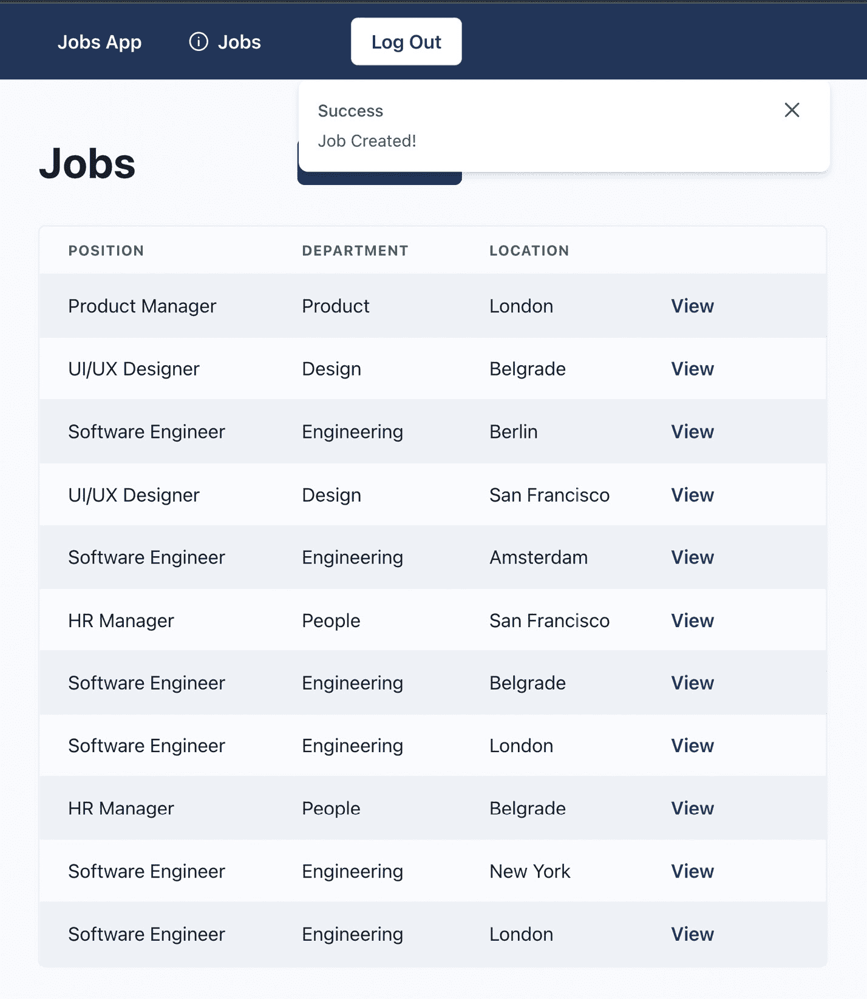

# 7

# 实现用户认证和全局通知

在前面的章节中，我们配置了页面，创建了模拟 API，并从我们的应用程序中进行了 API 调用。然而，当涉及到管理仪表板中用户的认证时，应用程序仍然依赖于测试数据。

在本章中，我们将构建应用程序的认证系统，允许用户在管理仪表板中认证并访问受保护资源。我们还将创建一个吐司通知系统，以便在发生我们希望通知用户的行为时向用户提供反馈。

在本章中，我们将涵盖以下主题：

+   实现认证系统

+   实现通知

到本章结束时，我们将学会如何在我们的应用程序中认证用户，以及如何使用 Zustand 处理全局应用程序状态。

# 技术要求

在我们开始之前，我们需要设置项目。为了能够开发项目，你需要在你的计算机上安装以下内容：

+   **Node.js**版本 16 或以上以及**npm**版本 8 或以上。

安装 Node.js 和 npm 有多种方法。这里有一篇很好的文章，详细介绍了更多细节：[`www.nodejsdesignpatterns.com/blog/5-ways-to-install-node-js`](https://www.nodejsdesignpatterns.com/blog/5-ways-to-install-node-js)。

+   **VSCode**（可选）是目前最流行的 JavaScript/TypeScript 编辑器/IDE，因此我们将使用它。它是开源的，与 TypeScript 有很好的集成，并且你可以通过扩展来扩展其功能。可以从这里下载：[`code.visualstudio.com/`](https://code.visualstudio.com/)。

本章的代码文件可以在此处找到：[`github.com/PacktPublishing/React-Application-Architecture-for-Production`](https://github.com/PacktPublishing/React-Application-Architecture-for-Production)。

可以使用以下命令在本地克隆存储库：

```js
git clone https://github.com/PacktPublishing/React-Application-Architecture-for-Production.git
```

一旦克隆了存储库，我们需要安装应用程序的依赖项：

```js
npm install
```

我们可以使用以下命令提供环境变量：

```js
cp .env.example .env
```

一旦安装了依赖项，我们需要选择与本章匹配的正确代码库阶段。我们可以通过执行以下命令来完成：

```js
npm run stage:switch
```

此命令将为我们提供每个章节的阶段列表：

```js
? What stage do you want to switch to? (Use arrow
 keys)
❯ chapter-02
  chapter-03
  chapter-03-start
  chapter-04
  chapter-04-start
  chapter-05
  chapter-05-start
(Move up and down to reveal more choices)
```

这是第七章，所以如果你想跟随，可以选择`chapter-07-start`，或者选择`chapter-07`来查看本章的最终结果。

一旦选择了章节，所有必要的文件将出现，以便跟随本章内容。

如需了解更多关于设置细节的信息，请查看`README.md`文件。

# 实现认证系统

认证是识别平台上的用户的过程。在我们的应用程序中，我们需要在用户访问管理仪表板时识别用户。

在实现系统之前，我们应该仔细研究它的工作方式。

## 认证系统概述

我们将使用基于令牌的认证系统来认证用户。这意味着 API 将期望用户在请求中发送他们的认证令牌以访问受保护资源。

让我们看一下以下图表和后续步骤：



图 7.1 – 认证系统概述

以下是对先前图表的解释：

1.  用户通过向`/auth/login`端点创建请求来使用凭据提交登录表单。

1.  如果用户存在且凭据有效，将返回包含用户数据的响应。除了响应数据外，我们还在附加一个`httpOnly` cookie，从现在起将用于认证请求。

1.  每当用户进行认证时，我们将从响应中存储用户对象到 react-query 的缓存中，并使其对应用程序可用。

1.  由于认证是基于`httpOnly` cookie 的 cookie，我们不需要在前端处理认证令牌。任何后续请求都将自动包含令牌。

1.  在页面刷新时持久化用户数据将通过调用`/auth/me`端点来处理，该端点将获取用户数据并将其存储在相同的 react-query 缓存中。

为了实现这个系统，我们需要以下内容：

+   认证功能（登录、登出和访问认证用户）

+   保护需要用户认证的资源

## 构建认证功能

为了构建认证功能，我们已经有实现了端点。我们在*第五章*，“模拟 API”中创建了它们。现在我们需要在我们的应用程序中消费它们。

### 登录

为了允许用户登录到仪表板，我们将要求他们输入他们的电子邮件和密码并提交表单。

为了实现登录功能，我们需要向服务器上的登录端点发起 API 调用。让我们创建`src/features/auth/api/login.ts`文件并添加以下内容：

```js
import { useMutation } from '@tanstack/react-query';
import { apiClient } from '@/lib/api-client';
import { queryClient } from '@/lib/react-query';
import { AuthUser, LoginData } from '../types';
export const login = (
  data: LoginData
): Promise<{
  user: AuthUser;
}> => {
  return apiClient.post('/auth/login', data);
};
type UseLoginOptions = {
  onSuccess?: (user: AuthUser) => void;
};
export const useLogin = ({
  onSuccess,
}: UseLoginOptions = {}) => {
  const { mutate: submit, isLoading } = useMutation({
    mutationFn: login,
    onSuccess: ({ user }) => {
      queryClient.setQueryData(['auth-user'], user);
      onSuccess?.(user);
    },
  });
  return { submit, isLoading };
};
```

我们正在定义 API 请求和 API 突变钩子，允许我们从我们的应用程序中调用 API。

然后，我们可以更新登录表单以进行 API 调用。让我们修改`src/features/auth/components/login-form/login-form.tsx`。

首先，让我们导入`useLogin`钩子：

```js
import { useLogin } from '../../api/login';
```

然后，在`LoginForm`组件体内部，我们希望在提交处理程序中初始化登录突变并提交它：

```js
export const LoginForm = ({
  onSuccess,
}: LoginFormProps) => {
  const login = useLogin({ onSuccess });
  const { register, handleSubmit, formState } =
    useForm<LoginData>();
  const onSubmit = (data: LoginData) => {
    login.submit(data);
  };
     // rest of the component body
}
```

我们还应该指出操作正在提交，通过禁用**提交**按钮：

```js
<Button
  isLoading={login.isLoading}
  isDisabled={login.isLoading}
  type="submit"
>
  Log in
</Button>
```

当表单提交时，它将调用登录端点，如果凭据有效，将认证用户。

### 登出

为了实现登出功能，我们需要调用登出端点，这将清除认证 cookie。让我们创建`src/features/auth/api/logout.ts`文件并添加以下内容：

```js
import { useMutation } from '@tanstack/react-query';
import { apiClient } from '@/lib/api-client';
import { queryClient } from '@/lib/react-query';
export const logout = () => {
  return apiClient.post('/auth/logout');
};
type UseLogoutOptions = {
  onSuccess?: () => void;
};
export const useLogout = ({
  onSuccess,
}: UseLogoutOptions = {}) => {
  const { mutate: submit, isLoading } = useMutation({
    mutationFn: logout,
    onSuccess: () => {
      queryClient.clear();
      onSuccess?.();
    },
  });
  return { submit, isLoading };
};
```

我们正在定义登出 API 请求和登出突变。

然后，我们可以通过从`src/features/auth/index.ts`文件中重新导出它来从认证功能中公开它：

```js
export * from './api/logout';
```

我们希望在用户点击`src/layouts/dashboard-layout.tsx`文件并导入额外依赖项时使用它：

```js
import { useRouter } from 'next/router';
import { useLogout } from '@/features/auth';
```

然后，在`Navbar`组件中，让我们使用`useLogout`钩子：

```js
const Navbar = () => {
  const router = useRouter();
  const logout = useLogout({
    onSuccess: () => router.push('/auth/login'),
  });
  // the rest of the component
};
```

注意，当注销操作成功时，我们如何将用户重定向到登录页面。

让我们最终将操作连接到注销按钮：

```js
<Button
  isDisabled={logout.isLoading}
  isLoading={logout.isLoading}
  variant="outline"
  onClick={() => logout.submit()}
>
  Log Out
</Button>
```

现在，当用户点击**注销**按钮时，将调用注销端点，然后用户将被带到登录页面。

### 获取经过认证的用户

要开始，让我们创建`src/features/auth/api/get-auth-user.ts`文件并添加以下内容：

```js
import { useQuery } from '@tanstack/react-query';
import { apiClient } from '@/lib/api-client';
import { AuthUser } from '../types';
export const getAuthUser = (): Promise<AuthUser> => {
  return apiClient.get('/auth/me');
};
export const useUser = () => {
  const { data, isLoading } = useQuery({
    queryKey: ['auth-user'],
    queryFn: () => getAuthUser(),
  });
  return { data, isLoading };
};
```

此端点将返回当前登录用户的信息。

然后，我们希望从`src/features/auth/index.ts`文件中导出它：

```js
export * from './api/get-auth-user';
```

回到`src/layouts/dashboard-layout.tsx`文件，我们需要那里的用户数据。

让我们用以下内容替换测试数据中的`useUser`钩子：

```js
import { useLogout, useUser } from '@/features/auth';
```

另一个需要用户数据的地方是仪表板工作页面。让我们打开`src/pages/dashboard/jobs/index.tsx`并导入`useUser`钩子：

```js
import { useUser } from '@/features/auth';
```

## 保护需要用户认证的资源

如果未经认证的用户尝试查看受保护资源，会发生什么？我们希望确保任何此类尝试都将用户重定向到登录页面。为此，我们希望创建一个组件，该组件将包装受保护资源，并且只有在用户经过认证的情况下才允许用户查看受保护内容。

`Protected`组件将从`/auth/me`端点获取用户，如果用户存在，它将允许内容显示。否则，它将重定向用户到登录页面。

该组件已在`src/features/auth/components/protected/protected.tsx`文件中定义，但现在并没有做什么。让我们修改该文件如下：

```js
import { Flex } from '@chakra-ui/react';
import { useRouter } from 'next/router';
import { ReactNode, useEffect } from 'react';
import { Loading } from '@/components/loading';
import { useUser } from '../../api/get-auth-user';
export type ProtectedProps = {
  children: ReactNode;
};
export const Protected = ({
  children,
}: ProtectedProps) => {
  const { replace, asPath } = useRouter();
  const user = useUser();
  useEffect(() => {
    if (!user.data && !user.isLoading) {
      replace(
        `/auth/login?redirect=${asPath}`,
        undefined,
        { shallow: true }
      );
    }
  }, [user, asPath, replace]);
  if (user.isLoading) {
    return (
      <Flex direction="column" justify="center" h="full">
        <Loading />
      </Flex>
    );
  }
  if (!user.data && !user.isLoading) return null;
  return <>{children}</>;
};
```

该组件接受子内容作为 props，这意味着它将包裹嵌套内容并决定是否应该渲染。

我们从相同的`useUser`钩子中访问用户。最初，在数据正在获取时，组件渲染`Loading`组件。一旦数据被获取，我们在`useEffect`中检查用户是否存在，如果不存在，我们将重定向到登录页面。否则，我们可以像往常一样渲染子组件。

`Protected`组件旨在在仪表板中使用。由于我们已经有了一个可重用的仪表板布局，我们不需要在每一页上包裹`Protected`，我们可以在仪表板布局中只做一次。

让我们打开`src/layouts/dashboard-layout.tsx`并导入`Protected`组件：

```js
import { Protected } from '@/features/auth';
```

然后，在`DashboardLayout`组件的 JSX 中，让我们将一切包裹在`Protected`中，如下所示：

```js
export const DashboardLayout = ({
  children,
}: DashboardLayoutProps) => {
  const user = useUser();
  return (
    <Protected>
      <Box as="section" h="100vh" overflowY="auto">
        <Navbar />
        <Container as="main" maxW="container.lg" py="12">
          {children}
        </Container>
        <Box py="8" textAlign="center">
          <Link
            href={`/organizations/${user.data?.
              organizationId}`}
          >
            View Public Organization Page
          </Link>
        </Box>
      </Box>
    </Protected>
  );
};
```

如果您尝试访问`http://localhost:3000/dashboard/jobs`页面，您将被重定向到登录页面。

尝试使用现有的凭据（电子邮件：user1@test.com；密码：password）进行登录。如果一切顺利，您可以使用属于给定用户组织的数据访问仪表板。

# 实现通知

每当应用程序中发生某些事情，例如表单提交成功或 API 请求失败时，我们希望通知我们的用户。

我们需要创建一个全局存储库，用于跟踪所有通知。我们希望它是全局的，因为我们希望从应用程序的任何地方显示这些通知。

对于处理全局状态，我们将使用 Zustand，这是一个轻量级且非常简单的状态管理库。

## 创建存储库

让我们打开`src/stores/notifications/notifications.ts`文件并导入我们将要使用的依赖项：

```js
import { createStore, useStore } from 'zustand';
import { uid } from '@/utils/uid';
```

然后，让我们声明存储库的通知类型：

```js
export type NotificationType =
  | 'info'
  | 'warning'
  | 'success'
  | 'error';
export type Notification = {
  id: string;
  type: NotificationType;
  title: string;
  duration?: number;
  message?: string;
};
export type NotificationsStore = {
  notifications: Notification[];
  showNotification: (
    notification: Omit<Notification, 'id'>
  ) => void;
  dismissNotification: (id: string) => void;
};
```

存储库将跟踪活动通知的数组。要显示通知，我们需要调用`showNotification`方法，要关闭它，我们将调用`dismissNotification`。

让我们创建存储库：

```js
export const notificationsStore =
  createStore<NotificationsStore>((set, get) => ({
    notifications: [],
    showNotification: (notification) => {
      const id = uid();
      set((state) => ({
        notifications: [
          ...state.notifications,
          { id, ...notification },
        ],
      }));
      if (notification.duration) {
        setTimeout(() => {
          get().dismissNotification(id);
        }, notification.duration);
      }
    },
    dismissNotification: (id) => {
      set((state) => ({
        notifications: state.notifications.filter(
          (notification) => notification.id !== id
        ),
      }));
    },
  }));
```

为了创建存储库，我们使用来自`zustand/vanilla`的`createStore`来使其更便携和可测试。该函数为我们提供了`set`和`get`辅助函数，分别允许我们修改和访问存储库。

由于我们使用纯方法创建了存储库，我们需要使其与 React 兼容。我们通过以下方式使用 Zustand 提供的`useStore`钩子来实现这一点：

```js
export const useNotifications = () =>
  useStore(notificationsStore);
```

那就是通知存储库。如您所见，它非常简单，几乎没有样板代码。

任何时候我们需要在 React 组件或钩子内部访问存储库，我们都可以使用`useNotifications`钩子。或者，如果我们想从 React 之外的纯 JavaScript 函数中访问存储库，我们可以直接使用`notificationStore`。

## 创建用户界面

现在我们有了通知存储库，我们需要构建一个 UI 来在活动时显示这些通知。

让我们打开`src/components/notifications/notifications.tsx`文件并导入所需的依赖项：

```js
import {
  Flex,
  Box,
  CloseButton,
  Stack,
  Text,
} from '@chakra-ui/react';
import {
  Notification,
  NotificationType,
  useNotifications,
} from '@/stores/notifications';
```

然后，让我们创建`Notifications`组件，它将显示通知：

```js
export const Notifications = () => {
  const { notifications, dismissNotification } =
    useNotifications();
  if (notifications.length < 1) return null;
  return (
    <Box
      as="section"
      p="4"
      position="fixed"
      top="12"
      right="0"
      zIndex="1"
    >
      <Flex gap="4" direction="column-reverse">
        {notifications.map((notification) => (
          <NotificationToast
            key={notification.id}
            notification={notification}
            onDismiss={dismissNotification}
          />
        ))}
      </Flex>
    </Box>
  );
};
```

我们通过`useNotifications`钩子访问通知，它为我们提供了对存储库的访问。

如您所见，我们正在映射活动通知。我们为每个活动通知渲染`NotificationToast`组件，并将通知对象和关闭处理程序作为属性传递。让我们通过描述变体和属性类型来实现它：

```js
const notificationVariants: Record<
  NotificationType,
  { color: string }
> = {
  info: {
    color: 'primary',
  },
  success: {
    color: 'green',
  },
  warning: {
    color: 'orange',
  },
  error: {
    color: 'red',
  },
};
type NotificationToastProps = {
  notification: Omit<Notification, 'duration'>;
  onDismiss: (id: string) => void;
};
```

然后，实现`NotificationToast`组件：

```js
const NotificationToast = ({
  notification,
  onDismiss,
}: NotificationToastProps) => {
  const { id, type, title, message } = notification;
  return (
    <Box
      w={{ base: 'full', sm: 'md' }}
      boxShadow="md"
      bg="white"
      borderRadius="lg"
      {...notificationVariants[type]}
    >
      <Stack
        direction="row"
        p="4"
        spacing="3"
        justifyContent="space-between"
      >
        <Stack spacing="2.5">
          <Stack spacing="1">
            <Text fontSize="sm" fontWeight="medium">
              {title}
            </Text>
            {notification.message && (
              <Text fontSize="sm" color="muted">
                {message}
              </Text>
            )}
          </Stack>
        </Stack>
        <CloseButton
          onClick={() => onDismiss(id)}
          transform="translateY(-6px)"
        />
      </Stack>
    </Box>
  );
};
```

现在我们已经有了通知存储库和创建的 UI，是时候将它们集成到应用程序中了。

## 集成和使用通知

要将通知集成到应用程序中，让我们打开`src/providers/app.tsx`文件并导入`Notifications`组件：

```js
import { Notifications } from '@/components/notifications';
```

然后，让我们在`AppProvider`中渲染组件：

```js
export const AppProvider = ({
  children,
}: AppProviderProps) => {
  return (
    <ChakraProvider theme={theme}>
      <GlobalStyle />
      <Notifications />
      {/* rest of the code */}
    </ChakraProvider>
  );
};
```

完美！现在我们准备好开始显示一些通知了。

如前所述，我们可以在 React 世界和其外部使用该存储。

我们需要在创建作业的页面 React 组件中使用它。每当成功创建一个作业时，我们希望让用户知道。

让我们打开`src/pages/dashboard/jobs/create.tsx`文件并导入`useNotifications`钩子：

```js
import { useNotifications } from '@/stores/notifications';
```

然后，让我们在`DashboardCreateJobPage`组件体内部初始化钩子：

```js
const { showNotification } = useNotifications();
```

然后，我们可以在`onSuccess`处理程序中调用`showNotification`：

```js
const onSuccess = () => {
  showNotification({
    type: 'success',
    title: 'Success',
    duration: 5000,
    message: 'Job Created!',
  });
  router.push(`/dashboard/jobs`);
};
```

我们展示了一个新的成功通知，它将在 5 秒后消失。

要查看其操作效果，让我们打开[`localhost:3000/dashboard/jobs/create`](http://localhost:3000/dashboard/jobs/create)并提交表单。如果提交成功，我们应该看到如下内容：



图 7.2 – 通知在操作中

完美！每当创建一个作业时，用户都会收到通知。

我们可以利用通知的另一个地方是在 API 错误处理中。每当发生 API 错误时，我们希望让用户知道出了些问题。

我们可以在 API 客户端级别处理它。由于 Axios 支持拦截器，并且我们已经配置了它们，我们只需要修改响应错误拦截器。

让我们打开`src/lib/api-client.ts`并导入存储：

```js
import { notificationsStore } from '@/stores/notifications';
```

然后，在响应错误拦截器中，让我们定位以下内容：

```js
console.error(message);
```

我们将用以下内容替换它：

```js
notificationsStore.getState().showNotification({
  type: 'error',
  title: 'Error',
  duration: 5000,
  message,
});
```

要访问 vanilla Zustand 存储上的值和方法，我们需要调用`getState`方法。

每当 API 发生错误时，都会向用户显示错误通知。

值得注意的是，Chakra UI 自带一个开箱即用的 toast 通知系统，使用起来非常简单，非常适合我们的需求，但我们还是自己构建了一个，以便学习如何以优雅且简单的方式管理全局应用程序状态。

# 摘要

在本章中，我们学习了如何处理身份验证和管理应用程序的全局状态。

我们从对身份验证系统及其工作原理的概述开始。然后，我们实现了登录、注销和获取认证用户信息等身份验证功能。我们还构建了`Protected`组件，该组件根据用户的认证状态控制用户是否可以查看页面。

然后，我们构建了一个 toast 通知系统，用户可以从应用程序的任何地方触发和显示通知。构建它的主要目的是介绍 Zustand，这是一个非常简单且易于使用的全局状态管理库，用于处理全局应用程序状态。

在下一章中，我们将学习如何使用单元测试、集成测试和端到端测试来测试应用程序。
