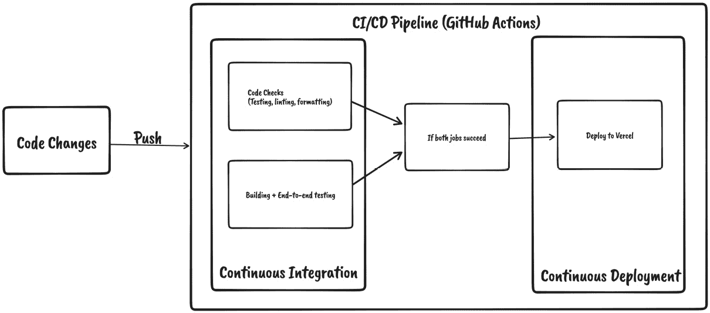
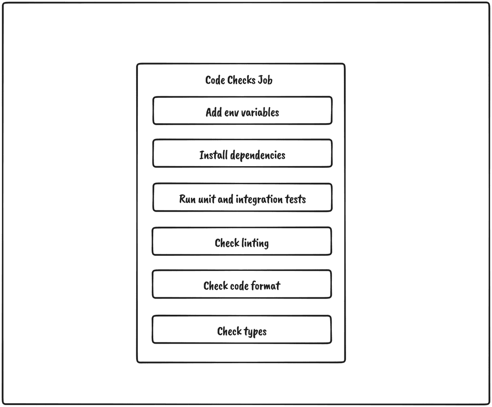
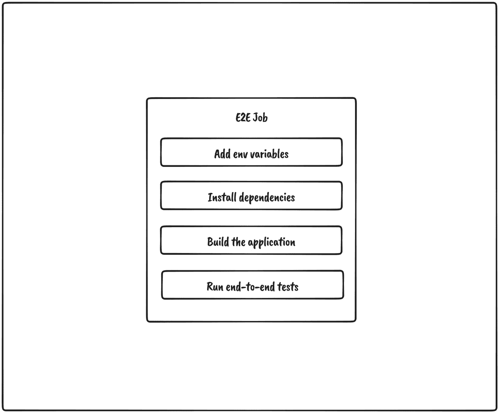
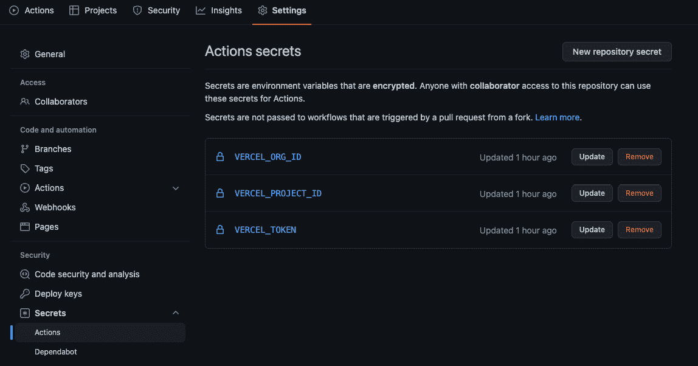
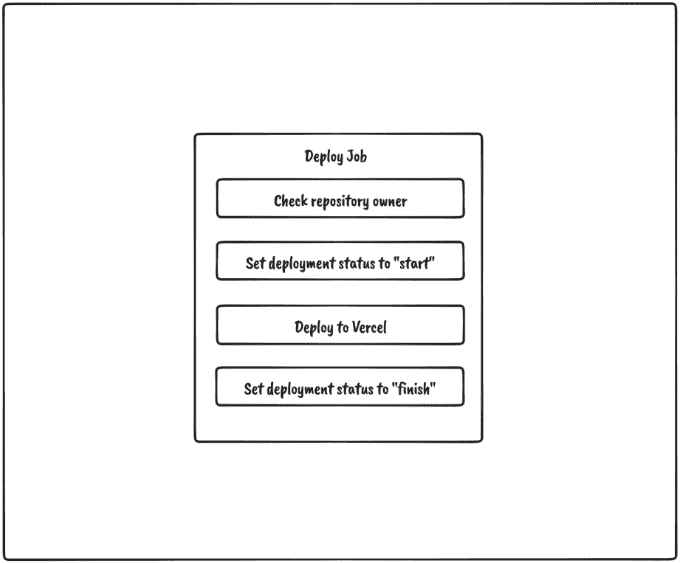
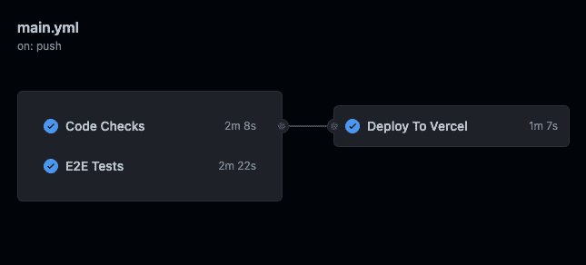
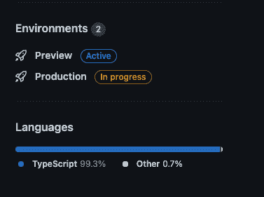

# 9

# 配置测试和部署的 CI/CD

我们的应用程序终于准备就绪，可以投入生产并迎接第一批用户。我们已经构建了其功能并实现了所有必需的检查，例如代码检查、测试等，这将让我们有信心应用程序代码正在正确运行。

然而，目前，所有这些检查都必须在我们的本地机器上执行。每次我们想要将新功能推送到生产环境时，都需要运行所有脚本然后手动重新部署应用程序，这是一个非常繁琐的过程。

在本章中，我们将学习什么是 CI/CD。然后，我们将学习什么是 GitHub Actions 以及 GitHub Actions 流水线的主要部分。接着，我们将学习如何创建一个 CI/CD 流水线，该流水线将自动化应用程序的验证和部署到 Vercel。

在本章中，我们将涵盖以下主题：

+   什么是 CI/CD？

+   使用 GitHub Actions

+   配置测试流水线

+   配置部署到 Vercel 的流水线

到本章结束时，我们将知道如何使用 GitHub Actions 配置 CI/CD 流水线并将应用程序部署到 Vercel。

# 技术要求

在我们开始之前，我们需要设置我们的项目。为了能够开发我们的项目，我们将在计算机上需要以下内容安装：

+   **Node.js** 版本 16 或更高，以及 **npm** 版本 8 或更高。

+   安装 Node.js 和 npm 有多种方式。这里有一篇很好的文章详细介绍了更多细节：[`www.nodejsdesignpatterns.com/blog/5-ways-to-install-node-js`](https://www.nodejsdesignpatterns.com/blog/5-ways-to-install-node-js)。

+   **VSCode**（可选）是目前最流行的 JavaScript/TypeScript 编辑器/IDE，因此我们将使用它。它是开源的，与 TypeScript 有很好的集成，并且我们可以通过扩展来扩展其功能。可以从[`code.visualstudio.com/`](https://code.visualstudio.com/)下载。

本章的代码文件可以在以下位置找到：[`github.com/PacktPublishing/React-Application-Architecture-for-Production`](https://github.com/PacktPublishing/React-Application-Architecture-for-Production)。

可以使用以下命令在本地克隆存储库：

```js
git clone https://github.com/PacktPublishing/React-Application-Architecture-for-Production.git
```

一旦克隆了存储库，我们需要安装应用程序的依赖项：

```js
npm install
```

我们可以使用以下命令提供环境变量：

```js
cp .env.example .env
```

一旦安装了依赖项，我们需要选择与本章匹配的正确代码库阶段。我们可以通过执行以下命令来完成：

```js
npm run stage:switch
```

此命令将提示我们每个章节的阶段列表：

```js
? What stage do you want to switch to? (Use arrow
 keys)
❯ chapter-02
  chapter-03
  chapter-03-start
  chapter-04
  chapter-04-start
  chapter-05
  chapter-05-start
(Move up and down to reveal more choices)
```

这是第九章，所以如果我们想跟随，可以选择`chapter-09-start`，或者选择`chapter-09`来查看本章的最终结果。

一旦选择了章节，所有必要的文件都会显示出来以供跟随本章内容。

更多关于设置细节的信息，请查看`README.md`文件。

# 什么是 CI/CD？

**持续集成/持续部署**（**CI/CD**）是一种以自动化方式向用户交付应用程序更改的方法。CI/CD 通常应包括以下部分：

+   **持续集成**是自动验证代码是否已构建、测试并合并到存储库的过程

+   **持续交付**意味着将更改交付到存储库

+   **持续部署**意味着将更改发布到生产服务器，在那里更改对用户可用

现在，让我们考虑如何为我们的应用程序实现 CI/CD。我们已经有了所有部分——我们只需要将它们组合在一起。这个过程将像这样工作：

+   运行应用程序的所有代码检查（单元和集成测试、代码风格检查、类型检查、格式检查等）

+   构建应用程序并运行端到端测试

+   如果两个过程都成功完成，我们可以部署我们的应用程序

下面是如何可视化这个过程：



图 9.1 – 管道概述

此过程将确保我们的应用程序始终处于最佳状态，并且更改可以频繁且容易地发布到生产环境中。这对于在大型团队中工作特别有用，因为每天都会向应用程序引入许多更改。

要运行 CI/CD 管道，我们需要适当的基础设施。由于我们将存储库保存在 GitHub 上，我们可以使用 GitHub Actions 来处理 CI/CD。

# 使用 GitHub Actions

**GitHub Actions**是一个 CI/CD 工具，允许我们自动化、构建、测试和部署管道。我们可以在存储库中的特定事件上创建运行工作流程。

要了解它是如何工作的，让我们在以下部分中查看其一些组件。

## 工作流程

一个`.github/workflows`文件夹。当指定的事件被触发时，可以运行工作流程。我们还可以直接从 GitHub 手动重新运行工作流程。一个存储库可以有我们想要的任何数量的工作流程。

## 事件

当一个**事件**被触发时，将导致工作流程运行。GitHub 活动可以触发事件，例如向存储库推送或创建拉取请求。除此之外，它们还可以按计划或通过 HTTP POST 请求启动。

## 作业

一个**作业**定义了一系列将在工作流程中执行的步骤。一个步骤可以是执行的动作或脚本。

一个工作流程可以有多个可以并行运行的作业，或者它们可以在开始之前等待依赖作业完成。

## 动作

**动作**是在 GitHub Actions 上运行以执行重复性任务的应用程序。我们可以使用在[`github.com/marketplace?type=actions`](https://github.com/marketplace?type=actions)上可用的已构建动作，或者我们可以创建自己的。我们将在我们的管道中使用几个预制的动作。

## 运行器

运行器是一个在触发时运行工作流程的服务器。它可以在 GitHub 上托管，也可以自行托管。

现在我们已经熟悉了 GitHub Actions 的基础知识，我们可以开始创建我们应用程序的工作流程。

让我们创建 `.github/workflows/main.yml` 文件和初始代码：

```js
name: CI/CD
on:
  - push
jobs:
# add jobs here
```

在前面的代码中，我们提供了工作流程的名称。如果我们省略它，名称将被分配给工作流程文件的名称。在这里，我们定义了 `push` 事件，这将导致代码更改推送到仓库时工作流程运行。

我们将在以下部分定义作业。

对于我们定义的每个作业，我们将提供以下内容：

```js
name: Name of the job
runs-on: ubuntu-latest
```

这些属性将适用于所有作业：

+   `name` 设置正在运行的作业名称

+   `runs-on` 设置运行器，它将运行作业

现在我们已经了解了 GitHub Actions 是什么以及管道的主要部分，我们可以开始为我们的应用程序构建管道。

# 配置测试管道

我们的测试管道将包括两个作业，它们应该执行以下操作：

+   运行所有代码检查，如代码风格检查、类型检查、单元测试和集成测试等

+   构建应用程序并运行端到端测试

## 代码检查作业

代码检查作业应该像以下图示中显示的那样工作：



图 9.2 – 代码检查作业概述

如我们所见，作业应该是直接的：

1.  首先，我们需要向应用程序提供环境变量。

1.  然后，我们需要安装依赖项。

1.  接下来，我们必须运行单元测试和集成测试。

1.  然后，我们必须运行代码风格检查。

1.  然后，我们必须检查代码格式。

1.  最后，我们必须运行类型检查。

在 `jobs` 中，让我们添加运行这些任务的作业：

```js
jobs:
  code-checks:
    name: Code Checks
    runs-on: ubuntu-latest
    steps:
      - uses: actions/checkout@v3
      - uses: actions/setup-node@v3
        with:
          node-version: 16
      - run: mv .env.example .env
      - run: npm install
      - run: npm run test
      - run: npm run lint
      - run: npm run format:check
      - run: npm run types:check
```

关于作业，有几件事情值得提及：

+   我们使用市场中的 `actions/checkout@v3` 动作允许作业访问仓库

+   我们使用 `actions/setup-node` 动作来配置要运行哪个节点版本

+   我们执行脚本以验证一切是否按预期工作

## 端到端测试作业

我们与测试相关的第二个作业是端到端作业，我们希望在上一章中定义的应用程序构建和端到端测试。

它应该像以下图示中显示的那样工作：



图 9.3 – E2E 测试作业

如我们所见，作业将按以下方式工作：

1.  首先，我们需要添加环境变量。

1.  然后，需要安装应用程序的依赖项。

1.  然后，我们需要创建应用程序的生产构建版本。

1.  最后，生产代码得到端到端测试。

为了实现这个作业，让我们添加以下代码：

```js
jobs:
  # previous jobs
  e2e:
    name: E2E Tests
    runs-on: ubuntu-latest
    steps:
      - uses: actions/checkout@v3
      - run: mv .env.example .env
      - uses: cypress-io/github-action@v4
        with:
          build: npm run build
          start: npm run start
```

关于作业，有几件事情值得提及：

+   我们使用 `actions/checkout@v3` 动作来检出仓库。

+   我们使用 `cypress-io/github-action@v4` 动作，它将抽象化端到端测试。它将安装所有依赖项，构建应用程序，然后启动并运行所有 Cypress 测试。

现在我们已经配置了运行代码检查（如代码检查、格式化、类型检查和测试）的管道，我们可以开始部署应用程序的工作。

# 配置部署到 Vercel 的管道

当我们的测试作业完成后，我们希望将应用程序部署到 Vercel。要从 GitHub Actions 开始部署到 Vercel，我们需要做一些事情：

+   拥有 Vercel 账户

+   禁用 Vercel 的 GitHub 集成

+   将项目链接到 Vercel

+   向 GitHub Actions 提供环境变量

+   创建部署应用程序的作业

## 拥有 Vercel 账户

Vercel 很容易开始使用。访问 [`vercel.com/signup`](https://vercel.com/signup) 并创建账户，如果您还没有的话。

## 禁用 Vercel 的 GitHub 集成

**Vercel** 是一个与 GitHub 集成出色的平台。这意味着每次我们向存储库推送更改时，应用程序的新版本将自动部署到 Vercel。然而，在我们的情况下，我们希望在部署步骤之前验证我们的应用程序是否按预期工作，以便我们可以从 CI/CD 管道执行此任务。

要做到这一点，我们需要在 Vercel 中禁用 GitHub 集成。这可以通过创建包含以下内容的`vercel.json`文件来完成：

```js
{
  "version": 2,
  "github": {
    "enabled": false
  }
}
```

## 将项目链接到 Vercel

由于我们已禁用 GitHub 集成，我们需要在 Vercel 中将项目链接到我们的存储库。这可以通过使用 Vercel CLI 来完成。

让我们执行以下命令：

```js
npx vercel
```

CLI 将会询问我们一系列问题，如下所示：

```js
? Set up and deploy "~/web/project-name"? [Y/n] y
? Which scope do you want to deploy to? org-name
? Link to existing project? [y/N] n
? What's your project's name? project-name
? In which directory is your code located? ./
```

一旦 CLI 进程完成，`.vercel` 文件夹将被生成。这是一个不应该由存储库跟踪的文件夹。在 `.vercel/project.json` 文件中，我们将找到我们的项目凭据，如下所示：

```js
{"orgId":"example_org_id","projectId":"example_project_id"}
```

我们将在几分钟后需要将这些值提供给 GitHub Actions。

## 向 GitHub Actions 提供环境变量

对于我们的管道，我们需要几个环境变量：

+   `VERCEL_ORG_ID`，我们可以从`.vercel/project.json`文件中获取

+   `VERCEL_PROJECT_ID`，我们也可以从`.vercel/project.json`文件中获取

+   `VERCEL_TOKEN`，我们可以从[`vercel.com/account/tokens`](https://vercel.com/account/tokens%) 获取

一旦我们有了这些值，我们就可以将它们添加到我们项目的 GitHub Actions 中：



图 9.4 – 向 GitHub Actions 添加环境变量

## 创建部署应用程序的作业

现在一切都已经设置好了，我们可以开始工作，这个工作将完成所有的工作。我们可以在以下图中看到它应该如何工作：



图 9.5 – 部署作业概述

如我们所见，它将经过几个步骤：

1.  检查存储库所有者，因为我们不希望从存储库分叉触发工作流程时进行部署。

1.  将部署状态设置为 *开始*。

1.  部署到 Vercel。

1.  将部署状态设置为*完成*。

让我们在定义了其他作业的工作流程文件中添加`deploy`作业：

```js
jobs:
  # previous jobs
  deploy:
    name: Deploy To Vercel
    runs-on: ubuntu-latest
    needs: [code-checks, e2e]
    if: github.repository_owner == 'my-username'
    permissions:
      contents: read
      deployments: write
    steps:
      - name: start deployment
        uses: bobheadxi/deployments@v1
        id: deployment
        with:
          step: start
          token: ${{ secrets.GITHUB_TOKEN }}
          env: ${{ fromJSON('["Production", "Preview"]')
            [github.ref != 'refs/heads/master'] }}
      - uses: actions/checkout@v3
      - run: mv .env.example .env
      - uses: amondnet/vercel-action@v25
        with:
          vercel-token: ${{ secrets.VERCEL_TOKEN }}
          vercel-args: ${{ fromJSON('["--prod", ""]')
            [github.ref != 'refs/heads/master'] }}
          vercel-org-id: ${{ secrets.VERCEL_ORG_ID}}
          vercel-project-id: ${{ secrets.
            VERCEL_PROJECT_ID}}
          scope: ${{ secrets.VERCEL_ORG_ID}}
          working-directory: ./
      - name: update deployment status
        uses: bobheadxi/deployments@v1
        if: always()
        with:
          step: finish
          token: ${{ secrets.GITHUB_TOKEN }}
          status: ${{ job.status }}
          env: ${{ steps.deployment.outputs.env }}
          deployment_id: ${{ steps.deployment.outputs.
            deployment_id }}
```

关于作业有几件事情值得提及：

+   我们通过添加`needs: [code-checks, e2e]`将此作业设置为依赖于前两个作业。这意味着此作业将在那些作业成功完成后才开始。如果其中一些作业失败，此作业将永远不会运行。

+   使用`if: github.repository_owner == 'my-username'`，我们检查仓库所有者是否是项目的所有者。这个检查应该可以防止仓库分叉部署应用程序。

+   在部署任务前后，我们使用`bobheadxi/deployments@v1`动作来更新 GitHub 中的部署状态。

+   我们使用`amondnet/vercel-action@v25`动作部署到 Vercel。根据哪个分支被更新，它将被部署到预览环境或生产环境。

我们的工作流程应该看起来像这样：



图 9.6 – 工作流程

我们可以在仓库页面右下角跟踪每个环境的部署状态：



图 9.7 – 部署状态

太棒了！我们的应用程序现在已投入生产并可供用户使用。配置管道可能需要初始时更多的努力，但从长远来看，它可以节省大量时间，因为我们不必担心所有这些步骤。它们都已经自动化了。

# 摘要

在本章中，我们了解到 CI/CD 管道是一个允许自动化代码更改和交付的过程。我们还介绍了 GitHub Actions 以及允许我们创建 CI/CD 管道以自动化测试和部署我们应用程序的各个部分。

之后，我们为工作流程定义了三个作业。通过这些作业，我们自动化了运行所有必需的检查、测试和部署的过程。最后，我们学习了如何从 CI/CD 管道部署到 Vercel 并将应用程序交付给用户。

这标志着我们应用程序 MVP 版本的完成。在下一章中，我们将介绍一些我们可以对应用程序进行的潜在功能和改进。
