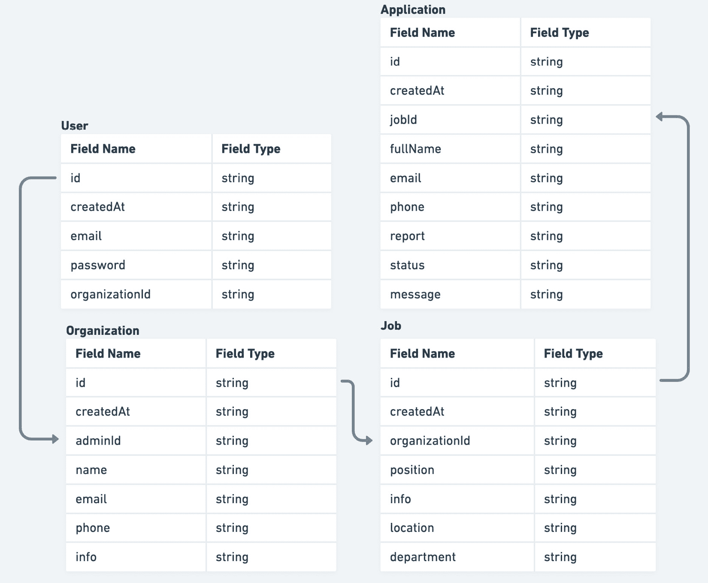

# 10

# 超越

我们的应用程序最终投入生产。可能在我们说话的时候，它已经有了用户。然而，就像每一件软件一样，我们的应用程序可能永远不会完全完成。总有改进的空间，而且由于我们构建的应用程序只是一个 MVP，有很多潜在的改进值得提及。

在本章中，我们将涵盖从功能和技术角度的一些最重要的改进。这些主题可能会给我们一些关于扩展和改进现有应用程序的想法。

在本章中，我们将涵盖以下主题：

+   功能改进

+   技术改进

+   附录

到本章结束时，我们将介绍一些可以添加到现有应用程序中的功能，使其更加完整。我们还将提及一些本书未涉及但值得自己探索的主题。

# 功能改进

由于我们的应用程序目前处于 MVP 阶段，从用户的角度来看，有许多潜在的改进可以使应用程序更加易用。

## 工作功能改进

工作功能是本应用最重要的功能。我们可以实施一些改进来使应用程序变得更好：

+   更新工作

+   以草稿状态添加工作

+   删除工作

+   使用 markdown/ *WYSIWYG* 编辑器添加/更新工作信息

### 更新工作

目前，我们的应用程序仅支持工作创建。当我们想要更改给定职位发布的信息时会发生什么？如果在创建后能够编辑工作数据，那将非常棒。

这里是我们如何做到这一点的说明：

+   在 `PATCH /jobs/:jobId` 创建 *更新* 端点处理程序，该处理程序将更新数据库中的数据

+   在 `/dashboard/jobs/:jobId/update` 创建 *更新工作* 页面，这是更新表单应该放置的地方

+   创建 *更新* 表单，包含我们想要能够更新工作所需的所有字段

+   在成功提交后，我们应该使工作查询无效，以便重新获取其数据

### 以草稿状态添加工作

目前，当我们为我们的组织创建一个工作，它将立即对公众可用。然而，如果我们能扩展其功能，以便我们可以选择何时将职位发布给公众，那将非常棒。

这可以通过以下方式完成：

+   使用 `status` 属性扩展工作模型。

+   将 `status` 值设置为 `draft` 或 `published`。

+   在提交工作创建表单时，新创建的工作将最初具有 `draft` 状态。

+   然后，我们可以通过 *更新* 表单更新工作的状态，在那里我们发送期望的状态作为值。另一种我们可以做到的方法是公开一个单独的端点，该端点只会更新工作的状态。

### 删除工作

大多数时候，职位空缺会被关闭。在这种情况下，没有人想要一个不再相关的职位发布，因此允许组织管理员删除不再相关的职位可能是个好主意。

这可以通过两种方式实现：

+   有一个*删除*端点，将处理从数据库中删除职位。点击按钮会发送请求，在请求成功的情况下，将用户重定向到职位列表。

+   扩展`status`属性，现在它可能具有额外的`archived`或`deleted`值。这种方法被称为**软删除**，因为我们并没有从数据库中删除条目，但从应用程序的角度来看，它看起来就像被删除了。存档职位发布可能有助于跟踪以前招聘的不同统计数据。

### 使用 Markdown/WYSIWYG 编辑器添加/更新职位信息

目前，职位信息是通过`textarea`输入字段填充的，这对于纯文本值来说很方便。然而，管理员添加尽可能多的信息的能力仅限于文本。

如果我们能够允许管理员添加诸如不同的标题、列表、链接等内容到职位信息中，那么职位发布将提供尽可能多的信息。

解决方案是将`textarea`输入字段替换为富文本编辑器，这将使我们能够添加不仅仅是文本的内容。只需确保在提交之前对输入进行清理，以使申请尽可能安全。

## 组织改进

目前，组织管理员无法更新组织信息。组织应该能够随时更改任何信息。

要实现这一点，我们可以做以下事情：

+   在`PATCH /organizations/:organizationId`创建更新组织的端点

+   在`/dashboard/organization/update`创建一个页面，我们可以在这里填写更新表单

## 添加职位申请

我们还可以改进的一点是添加职位申请的能力。

目前，没有直接在应用程序中申请职位的机制。当用户点击**申请**按钮时，电子邮件客户端会打开，并设置正确的主题。然后，用户会向组织的电子邮件地址发送电子邮件，这就是整个流程。

要将其提升到下一个层次，我们可以创建另一个名为*Application*的实体，当用户申请工作时将提交此实体。这种方法将允许管理员跟踪其组织的职位申请。

让我们重新思考一下，使用这个新功能，应用程序的数据模型将看起来是什么样子：



图 10.1 – 数据模型中的应用

如我们所见，申请应包含有关候选人的基本信息、一条消息、面试官的报告等等。

一旦数据模型被更新，我们可以构建应用程序功能，这将处理所有相关事务。这包括以下内容：

+   创建和浏览应用的端点。

+   仪表板上的页面，管理员可以浏览所有应用。它们可以定义为 `/dashboard/applications` 和 `/dashboard/applications/:applicationId`，分别对应列表和详情页面。

## 过滤和分页数据列表

在表格中显示数据列表是好的，但当条目数量开始显著增长时会发生什么？一次性加载所有条目并不是很优化，因为一开始可能并不需要所有条目。

为了优化数据列表，我们可以添加对过滤和分页数据的支持。这将帮助用户缩小搜索结果，以满足他们的需求。过滤和分页都应该在服务器上发生。

应该通过 URL 参数处理当前筛选和分页值。这将使应用程序能够轻松地深度链接搜索结果以供进一步使用。

## 添加用户注册

这一点相当直接。到目前为止，我们一直依赖于测试数据，其中有一个测试用户，我们用它来登录仪表板。然而，没有方法可以注册新用户。如果我们想使这个应用程序被多个组织使用，我们应该添加这个功能。这可以通过以下方式实现：

+   在 POST `/auth/register` 上创建注册端点，它将从表单中获取所需数据并创建用户及其对应组织在数据库中的记录

+   在 `/auth/register` 创建注册页面，其中包含注册表单，提交后调用注册端点

# 技术改进

我们的应用状态良好，但在应用开始增长时，有几件事情应该牢记在心。让我们看看。

## 服务器端渲染和缓存

我们可以进一步优化如何在服务器上渲染公共页面，我们可以做出以下改进。

目前，我们正在每个请求上渲染页面，如果数据频繁更改，这是好的；否则，它可能会增加加载时间和服务器成本，因为服务器上的渲染是一个计算密集型操作。

幸运的是，Next.js 支持另一种名为 **增量** **静态重新生成** 的渲染策略。

它的工作方式如下：

1.  *用户 1* 请求一个页面。

1.  服务器返回缓存的页面版本并将其返回。

1.  在那次请求期间，Next.js 被触发以使用最新数据重新生成相同的页面。

1.  *用户 2* 请求一个页面。

1.  服务器返回页面的新版本。

以我们的公共工作详情页面为例，它的工作方式如下。

首先，我们需要使用 `getStaticPaths` 来生成所有工作的所有路径：

```js
export const getStaticPaths = async () => {
  const jobs = await getJobs();
  const paths = jobs.map((job) => ({
     params: { jobId: job.id }
  }));
  return { paths, fallback: true };
}
```

这将为数据库中存在的所有作业生成路径列表。这里的关键是`fallback`属性，它将使 Next.js 不返回 404 页面，而是尝试生成一个新的页面。

我们还必须将`getServerSideProps`替换为`getStaticProps`，其外观可能如下所示：

```js
export const getStaticProps = async ({
  params,
}: GetStaticPropsContext) => {
  const jobId = params?.jobId as string;
  const job = await getJob({ jobId });
  return {
    props: {
      job
    },
    revalidate: 60,
  };
};
```

注意我们如何可以将`revalidate`属性添加到`return`值中。这将强制页面在 60 秒后重新验证。

由于作业和组织的数据变化不是很频繁，这种渲染策略从长远来看听起来更优，尤其是在请求数量开始增加之后。

这在性能和数据新鲜度之间提供了一个良好的折衷方案。

## React Query 的 SSR 解冻

目前，我们正在使用 React Query 来处理客户端的数据获取，但服务器端的数据获取则没有使用它。我们只是在页面上获取数据并传递和渲染它。如果我们没有很多层级的组件，这没问题，但还有更好的方法来做这件事。

React Query 支持两种在服务器上获取数据并将其传递到客户端的方式：

+   在服务器上获取数据，然后将其作为`initialData`传递给查询

+   在服务器上预取，解冻缓存，并在客户端重新解冻

第一种方案适用于较小型的应用，其中组件之间没有非常复杂的层次结构，因此没有必要将服务器数据向下传递多个层级到所需的查询。

第二种方案可能需要更多的初始设置，但最终会使代码库变得更加简单。

在`pages/_app.tsx`文件中，我们应该将`QueryClientProvider`内部的任何内容都包裹在`Hydrate`中，如下所示：

```js
import { Hydrate, QueryClient, QueryClientProvider }
  from '@tanstack/react-query'
export const App = ({ Component, pageProps }) => {
  const [queryClient] = React.useState(() => new
    QueryClient())
  return (
    <QueryClientProvider client={queryClient}>
      <Hydrate state={pageProps.dehydratedState}>
        <Component {...pageProps} />
      </Hydrate>
    </QueryClientProvider>
  )
}
```

这将使应用程序准备好处理任何解冻状态。但我们如何向页面提供解冻状态呢？

在特定页面上，我们可以修改`getStaticProps`或`getServerSideProps`，如下所示：

```js
export const getServerSideProps = async () => {
     const queryClient = new QueryClient()
  await queryClient.prefetchQuery(['jobs'], getJobs)
  return {
    props: {
      dehydratedState: dehydrate(queryClient),
    },
  }
}
```

然后，我们可以像在客户端获取它们一样消费作业：

```js
const JobsPage = () => {
     const jobs = useJobs();
     // ...
}
```

这将使使用 React Query 处理所有服务器状态变得更加容易。

## 使用查询键工厂

当查询的数量开始增加时，整个应用中遍布许多查询可能会变得难以管理。跟踪所有查询的变体及其使用位置可能很困难。防止重复查询键可能也是一个问题。

正因如此，我们应该考虑使用查询键工厂而不是故意在各个地方添加查询键。

我们可以在`src/lib/react-query.ts`中定义所有潜在键：

首先，我们可以定义工厂的简化版本：

```js
const getQueryKeys = (baseKey: string) => {
  return {
    all: [baseKey],
    many: (params: Record<string, unknown>) => [baseKey,
      params],
    one: (id: string) => [baseKey, id],
  };
};
```

然后，我们可以为查询创建键：

```js
export const queryKeys = {
  auth: {
    authUser: ['auth-user'],
  },
  jobs: getQueryKeys('jobs'),
  organizations: {
    one: getQueryKeys('organizations').one,
  },
};
```

如您所见，并非所有功能都具有相同的键结构，但我们可以结合不同的工厂来创建所需的内容。

然后，如果我们想在查询中使用一个键，可以这样做：

```js
const useJobs = () => {
     const { data, isLoading } = useQuery({
    queryKey: queryKeys.jobs.many(params),
    queryFn: () => getJobs({ params }),
    enabled: !!params.organizationId,
    initialData: [],
  });
  //...
}
```

这种方法的优点是我们对所有密钥有一个集中的概览，这减少了因误输入密钥或类似情况而犯错的概率。

这是一个简化查询密钥工厂的例子。如果您需要一个更健壮的解决方案，有一个非常好的库可以在[`www.npmjs.com/package/@lukemorales/query-key-factory`](https://www.npmjs.com/package/@lukemorales/query-key-factory)找到。

## 代码脚手架

当查看我们的应用程序时，我们可能会注意到存在一定程度的样板代码。例如，创建组件需要这样一个文件夹：

```js
- my-component
     - index.ts
     - my-component.tsx
```

我们必须记住从`index.ts`重新导出组件，使其可用。

对于 API 请求也可以这么说。我们需要创建请求函数，然后是消费它的钩子。这些事情可以通过帮助我们通过 CLI 更容易生成这些类型文件的工具来自动化。

拥有一些脚手架工具，如 Plop.js 和 Hygen.io，也给代码库带来了更好的一致性。

## 使用 Zod 验证表单输入和 API 响应

让我们简要地谈谈验证。通过验证，我们想确保数据处于预期的形式。对于我们的应用程序，我们可以验证表单输入和 API 响应。

对于验证，我们可以使用 Zod，这是一个以 TypeScript 为先的出色验证库。这意味着我们可以定义一个模式，从中我们可以推断出我们可以使用的类型。

### 表单输入验证

`react-hooks-form`库为 Zod 提供了很好的支持，我们可以利用它来做这件事。以当前的登录表单为例，我们可以修改它使其看起来像这样：

```js
import { z } from 'zod';
import { yupResolver } from '@hookform/resolvers/yup';
const schema = z.object({
  email: z.string().min(1, 'Required'),
  password: z.string().min(1, 'Required'),
});
const LoginForm  = () => {
     const { register, handleSubmit } = useForm({
          resolver: yupResolver(schema);
     })
     // ...
     return (
          <Stack
      as="form"
      onSubmit={handleSubmit(onSubmit)}
      spacing="5"
      w="full"
    >
      <InputField
        label="Email"
        type="email"
        {...register('email')}
        error={formState.errors['email']}
      />
      <InputField
        label="Password"
        type="password"
        {...register('password')}
        error={formState.errors['password']}
      />
      <Button
        isLoading={login.isLoading}
        isDisabled={login.isLoading}
        type="submit"
      >
        Log in
      </Button>
    </Stack>
     )
}
```

这里，我们正在创建一个对象模式，并借助`yupResolver`将其提供给`useForm`。

这将确保表单只有在所有字段都有有效值的情况下才会提交。

### API 请求验证

我们确实有 TypeScript 类型，但它们不能保护我们免受运行时错误的影响。这就是为什么在某些情况下我们应该考虑验证 API 响应。让我们看看以下例子：

```js
import { z } from 'zod';
const JobSchema = z.object({
     position: z.string(),
     info: z.string(),
     location: z.string()
});
```

由于 Zod 是一个以 TypeScript 为先的库，我们可以用它来推断给定对象的形状类型：

```js
type Job = z.infer<typeof JobSchema>
```

这可能有助于减少重复的类型定义。最后，我们可以按照以下方式验证我们的请求：

```js
const getJob = async () => {
     const jobResponse = await apiClient.get('/jobs/123');
     const job = JobSchema.parse(jobResponse);
     return job;
}
```

如果任何作业属性与模式不匹配，Zod 将抛出一个运行时错误，然后我们可以妥善处理。

## Next.js 13

Next.js 13 即将到来！它最近发布，带来了一些重大变化，包括以下内容：

+   带有应用文件夹的新路由系统

+   服务器组件

+   新的数据获取方法

值得注意的是，它与旧版本向后兼容，因此它允许增量升级。可能需要一些时间来完善所有内容，但值得关注，并在某个时候升级到新方法。

# 附录

有几个主题与我们所构建的应用程序没有直接关系，但它们值得提及。

## GraphQL

在当今，拥有 GraphQL API 是非常普遍的，尤其是在微服务架构中。我们在我们的应用程序中使用了 REST API，但如果它是 GraphQL API，我们将如何构建我们的 API 层？

好吧，实现将非常相似。我们可以选择使用不同的库，例如 Apollo，但我们将坚持使用 React Query。

看以下请求：

```js
import { request, gql } from "graphql-request";
import { useQuery } from '@tanstack/react-query';
const jobsQuery = gql`
     query {
          jobs {
               data {
                    position
                    department
                    location
               }
          }
     }
`;
const getJobs = () => {
     return request('/api/graphql', jobsQuery);
};
const useJobs = () => {
     const { data, isLoading } = useQuery({
          queryKey: ['jobs'],
          queryFn: getJobs
     })
     // ...
};
```

如您所见，首先，我们定义了 GraphQL 查询，然后我们使用它来定义请求函数。最后，我们使用请求函数来创建`useJobs`钩子。

## 单仓库

**单仓库**是一个包含多个项目且这些项目之间有明确关系的 Git 仓库。这意味着一个好的单仓库设置应该提供以下功能：

+   项目间易于代码共享

+   项目约束和可见性

+   计算缓存

+   项目清晰的边界

值得探索单仓库，因为它们被用于一些最大的软件项目中，并使这些大型项目更容易管理。

一些最受欢迎的单仓库工具有以下：

+   Lerna

+   Nx

+   Turborepo

+   Yarn 工作空间

## 微前端架构

**微前端**架构是一个非常有趣的概念。这意味着我们可以将应用程序的组件作为独立的应用程序构建和部署，它们看起来和感觉就像它们是同一应用程序的一部分。

使用这种架构的一些好处如下：

+   当在一个拥有许多不同团队的平台工作时很有用。

+   不限制应用程序使用特定的技术。每个微前端应用程序都可以有不同的堆栈，并且它们可以真正地很好地协同工作。

然而，也有一些缺点：

+   尽管使用不同的技术构建微前端架构是可能的，但应该予以劝阻。最好选择一个框架，并制定应用程序构建的标准。

+   微前端架构需要更复杂的工具，对于大多数用例来说可能并不值得。

一些值得探索的工具如下：

+   模块联邦

+   单 SPA

# 摘要

在这一章中，我们探讨了在完成这本书之后值得探索的其他主题。比如功能改进和技术改进可以将您的应用程序提升到下一个层次。希望您能将在这里学到的知识应用到类似的真实世界场景中。
