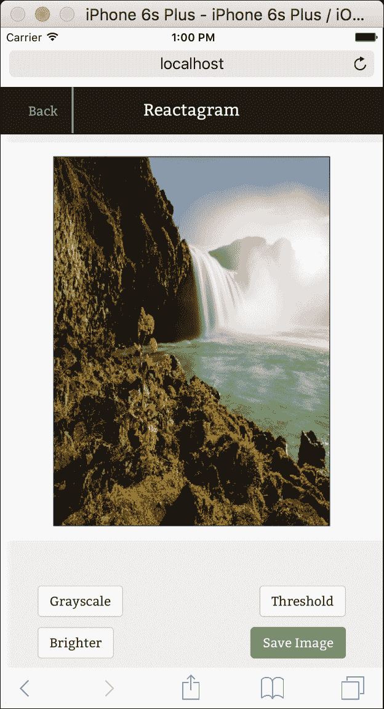
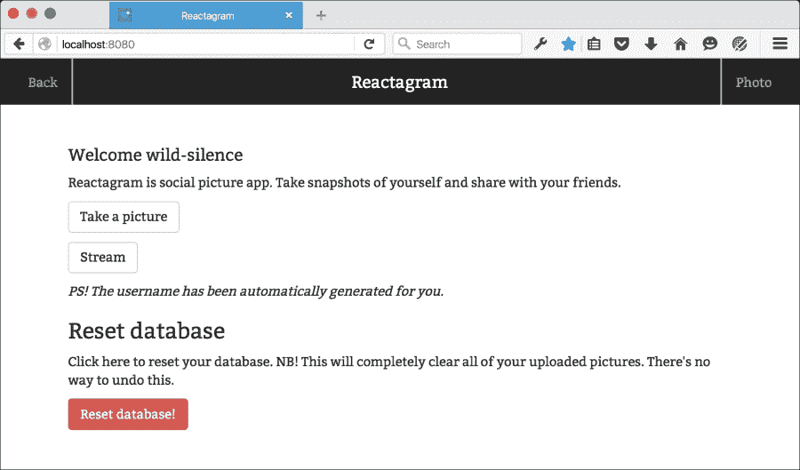
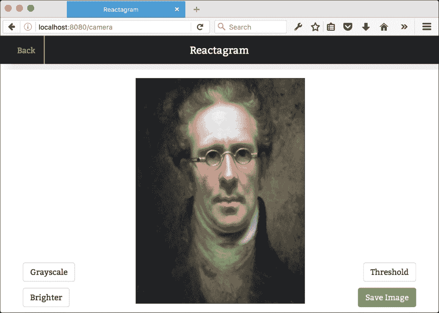
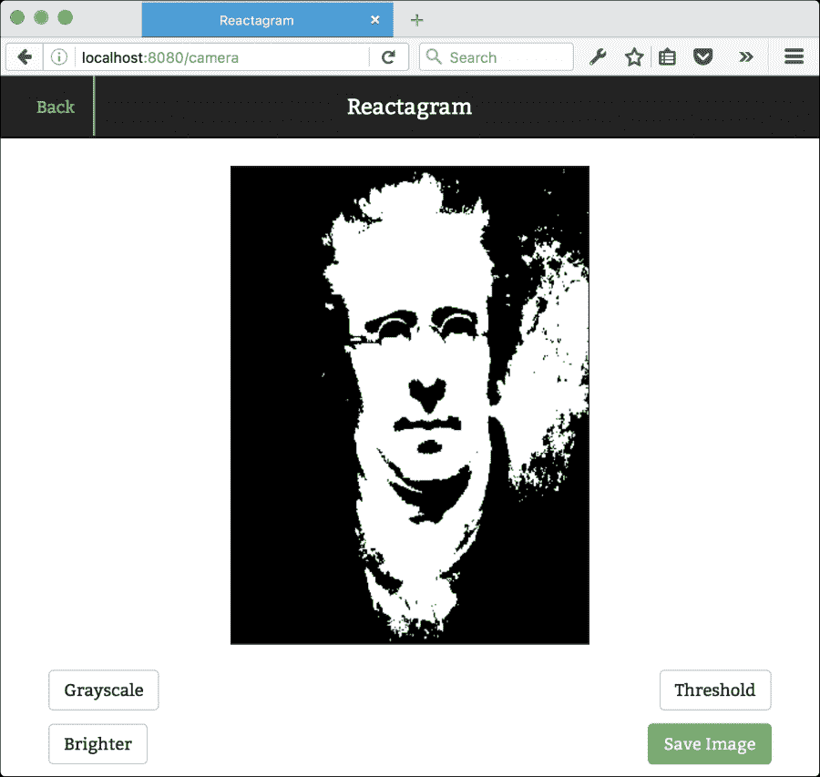
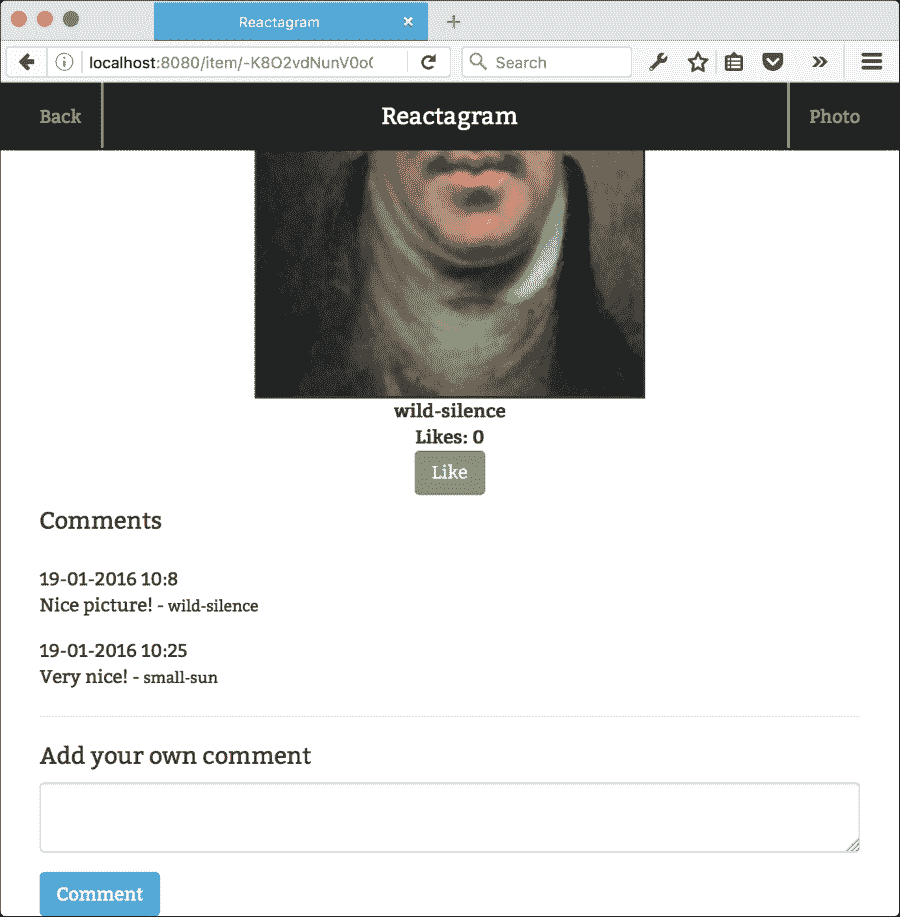
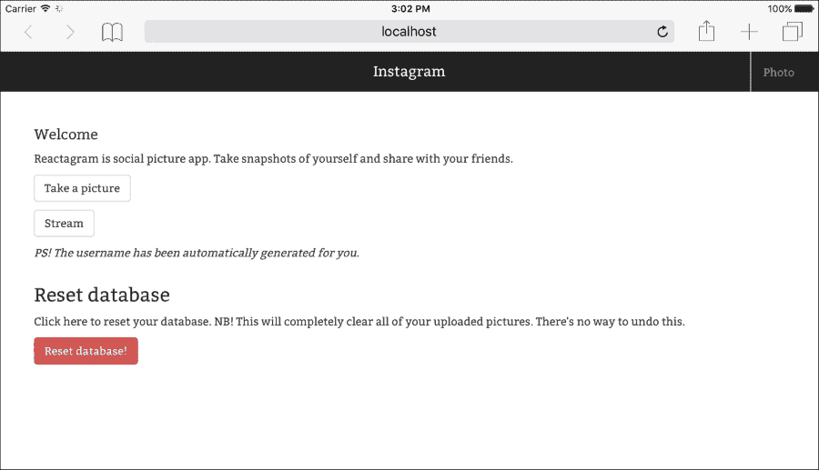

# 第七章。Reactagram

在本章中，我们将应用在前几章中开发的技能，并围绕照片构建一个社交网络应用。该应用可在桌面浏览器以及原生手机和平板电脑上使用。

在本章中，我们将通过连接到名为 **Firebase** 的实时数据库解决方案来探索 Flux 架构的替代方案。我们将创建一个高阶函数，我们将将其实现为一个围绕我们的路由的单例包装。这种设置将使我们能够为我们用户提供实时流以及应用中的 *点赞* 功能，同时仍然遵循 *单向数据流* 的原则。

我们还将探索另一个名为 **Cloudinary** 的基于云的服务。这是一个用于上传和托管图片的云服务。它是一个付费服务，但有一个慷慨的免费层，足以满足我们的需求。我们将在 Express 服务器中创建一个上传服务，用于处理图片上传，我们还将探索画布中的图片处理。

这些是我们将要讨论的主题：

+   使用网络摄像头 API

+   捕获 HTML5 画布中的照片输入

+   通过操作画布像素应用图像过滤器

+   连接到 Firebase 并将图片上传到云端

+   实时查看所有提交照片的流

+   实时评论和点赞

# 入门

我们将首先使用我们在 第六章 中开发的 Webpack 框架，*高级 React*。这是我们需要的从 `npm` 安装的依赖项：

```js
"devDependencies": {
  "autoprefixer": "⁶.2.3",
  "babel-core": "⁶.3.26",
  "babel-loader": "⁶.2.0",
  "babel-plugin-react-transform": "².0.0",
  "babel-preset-es2015": "⁶.3.13",
  "babel-preset-react": "⁶.3.13",
  "babel-tape-runner": "².0.0",
  "classnames": "².2.3",
  "exif-component": "¹.0.1",
  "exif-js": "².1.1",
  "firebase": "².3.2",
  "history": "¹.17.0",
  "imagetocanvas": "¹.1.5",
  "react": "⁰.14.5",
  "react-bootstrap": "⁰.28.2",
  "react-dom": "⁰.14.5",
  "react-router": "¹.0.3",
  "react-transform-catch-errors": "¹.0.1",
  "react-transform-hmr": "¹.0.1",
  "reactfire": "⁰.5.1",
  "redbox-react": "¹.2.0",
  "superagent": "¹.6.1",
  "webpack": "¹.12.9",
  "webpack-dev-middleware": "¹.4.0",
  "webpack-hot-middleware": "².6.0"
},
"dependencies": {
  "body-parser": "¹.14.2",
  "cloudinary": "¹.3.0",
  "cors": "².7.1",
  "envs": "⁰.1.6",
  "express": "⁴.13.3",
  "path": "⁰.12.7"
}
```

我们将使用与上一章相同的设置，但我们将对 `server.js` 进行一些小的修改，向 `index.html` 添加几行，并添加一些内容到我们的 CSS 文件中。

这是我们在原始 Webpack 框架中的树结构：

```js
├── assets
│   ├── app.css
│   ├── favicon.ico
│   └── index.html
├── package.json
├── server.js
├── source
│   └── index.jsx
└── webpack.config.js
```

确保你的结构与此相同是值得的。

我们需要对 `server.js` 文件进行一些修改。我们将设置一个上传服务，我们将从我们的应用中访问它，因此它需要支持跨源资源共享 (CORS) 以及除了我们正常的 GET 路由之外的一个 POST 路由。

打开 `server.js` 并将内容替换为以下内容：

```js
'use strict';
var path = require('path');
var express = require('express');
var webpack = require('webpack');
var config = require('./webpack.config');
var port = process.env.PORT || 8080;
var app = express();
var cors = require('cors');
var compiler = webpack(config);
var cloudinary = require('cloudinary');
var bodyParser = require('body-parser');
app.use( bodyParser.json({limit:'50mb'}) );
```

我们的应用需要 `body-parser` 包来访问我们的 POST 路由中的请求数据。我们将向我们的路由发送图片，因此我们还需要确保数据限制高于默认值。请参考以下代码：

```js
app.use(cors());

app.use(require('webpack-dev-middleware')(compiler, {
  noInfo:true,
  publicPath: config.output.publicPath,
  stats: {
    colors: true
  }
}));

var isProduction = process.env.NODE_ENV === 'production';

app.use(require('webpack-hot-middleware')(compiler));
app.use(express.static(path.join(__dirname, "assets")));

cloudinary.config({
  cloud_name: 'YOUR_CLOUD_NAME',
  api_key: 'YOUR_API_KEY',
  api_secret: 'YOUR_API_SECRET'
});

var routes = function (app) {
  app.post('/upload', function(req, res) {
    cloudinary.uploader.upload(req.body.image, function(result) { 
      res.send(JSON.stringify(result));
    });
  });
```

这个 `POST` 调用将处理我们应用中的图片上传。它将图片发送到 Cloudinary 并将其存储在我们的图像流中以便稍后检索。您需要在 [`cloudinary.com/`](http://cloudinary.com/) 创建一个账户，并用我们在用户管理部分看到的真实凭据替换我们刚才看到的 API 凭据。以下是我们所做的主要更改：

```js
  app.get('*', function(req, res) {
    res.sendFile(path.join(__dirname, 'assets','index.html'));
  });
}
```

这确保了对任何不属于静态 `asset` 文件夹的文件的请求都将路由到 `index.html`。这很重要，因为它将允许我们使用历史 API 而不是使用哈希路由来访问动态路由，让我们看一下以下代码片段：

```js
var router = express.Router();
routes(router);
app.use(router);
app.listen(port, 'localhost', function(err) {
  if (err) {
    console.log(err);
    return;
  }

  console.log('Listening at http://localhost:'+port);
});
```

接下来，打开 `assets/index.html` 并将内容替换为以下代码：

```js
<!DOCTYPE html>
<html>
  <head>
    <title>Reactagram</title>
    <meta charset="utf-8">
    <meta http-equiv="X-UA-Compatible" content="IE=edge">
    <meta name="viewport" content="width=device-width, 
    initial-scale=1, maximum-scale=1">
    <link rel="stylesheet" type="text/css" href="//netdna.bootstrapcdn.com/bootstrap/3.0.0/css/bootstrap-glyphicons.css" />
    <link rel="stylesheet" type="text/css"href="https://maxcdn.bootstrapcdn.com/bootstrap/3.3.5/css/bootstrap.min.css" />
    <link href='https://fonts.googleapis.com/css?family=Bitter' rel='stylesheet' type='text/css'>
    <link rel="stylesheet" href="/app.css">
  </head>
  <body>
    <div id="app"></div>
    <script src="img/bundle.js"></script>
  </body>
</html>
```

我们将依赖于 Bootstrap 来实现网格布局，所以我们需要添加 Bootstrap CSS 文件。我们还将添加免费的 Bitter 字体家族作为应用的主要字体。

我们将要更改的最后一件事是 `app.css`。我们将添加一组样式，确保我们构建的应用在 Web、平板电脑和智能手机上都能正常工作。

打开 `app.css` 并将内容替换为以下样式：

```js
body {
  font-family: 'Bitter', serif;
  padding: 15px;
  margin-top: 60px;
}
```

这将 `Bitter` 字体设置为应用的主要字体，并为导航标题添加顶部边距：

```js
body {
  font-family: 'Bitter', serif;
  padding: 15px;
  margin-top: 60px; 
}

.header {
  padding: 10px;
  font-size: 18px;
  margin: 5px; 
}

h1 {
  font-size: 18px; 
}

ul {
  list-style-type: none; 
}

#camera {
  position: absolute;
  opacity: 1; 
}

.hidden {
  display: none; 
}
```

`hidden` 类将被应用于所有应该保持隐藏且不可见的元素。现在查看以下内容：

```js
@media all and (max-width: 320px) {
  .canvas {
    padding: 0;
    text-align: center;
    margin: 0 auto;
    display: block;
    z-index: 10;
    position: fixed;
    left: 10px;
    top: 60px; 
  }
}
```

这是我们唯一的 `media` 查询。它将确保画布在小智能手机上保持居中和固定位置。当用户上传图片时，`imageCanvas` 的高度和宽度将被覆盖，因此这些值仅是默认值：

```js
#imageCanvas {
  max-width: 300px;
  height: 300px;
  margin: 0px auto;
  border: 1px solid #333; 
}
```

以下是将左侧和右侧菜单按钮设置到我们标题中的代码。它们将成为我们的导航元素：

```js
.menuButtonLeft {
  position: fixed;
  padding-right: 15px;
  height: 50px;
  border-right: 2px solid #999;
  padding-top: 16px;
  top: 0;
  left: 30px;
  color: #999;
  z-index: 1; 
}

.menuButtonRight {
  padding-left: 15px;
  height: 50px;
  border-left: 2px solid #999;
  padding-top: 16px;
  top: 0;
  position: fixed;
  right: 30px;
  color: #999;
  z-index: 1; 
}
```

查看以下代码行：

```js
.nav a:visited, .nav a:link {
  color: #999; }
.nav a:hover, a:focus {
  color: #fff;
  text-decoration: none;
}

.logo {
  padding-top: 16px;
  margin: 0 auto;
  text-align: center;
}

.filterButtonGrayscale {
  position: fixed;
  bottom: 55px;
  left: 40px; 
  z-index:2;
}

.filterButtonThreshold {
  position: fixed;
  bottom: 55px;
  right: 40px; 
  z-index:2;
}

.filterButtonBrightness {
  position: fixed;
  bottom: 10px;
  left: 40px; 
  z-index:2;
}

.filterButtonSave {
  position: fixed;
  bottom: 10px;
  right: 40px; 
  z-index:2;
}
```

这关于 **过滤器** 按钮。它们将在捕获图片后、发送到应用之前显示，让我们看一下以下代码片段：

```js
.stream {
  transition: all .5s ease-in;
  -webkit-animation-duration: 1s;
  animation-duration: 1s;
  -webkit-animation-fill-mode: both;
  animation-fill-mode: both;
  height: 480px;
  margin-top: 10px;
  padding: 0; }
  .stream img {
    border: 2px solid #333;
  }
```

我们将重用前面章节中的 `spinner`。这将在用户上传图片时显示：

```js
  .spinner {
    width: 40px;
    height: 40px;
    display: none;
    position: relative;
    margin: 100px auto;
  }

  .double-bounce1, .double-bounce2 {
    width: 100%;
    height: 100%;
    border-radius: 50%;
    background-color: #333;
    opacity: 0.6;
    position: absolute;
    top: 0;
    left: 0;
    -webkit-animation: sk-bounce 2.0s infinite ease-in-out;
    animation: sk-bounce 2.0s infinite ease-in-out;
  }

  .double-bounce2 {
    -webkit-animation-delay: -1.0s;
    animation-delay: -1.0s;
  }

  @-webkit-keyframes sk-bounce {
    0%, 100% {
      -webkit-transform: scale(0);
    }
    50% {
      -webkit-transform: scale(1);
    }
  }
  @keyframes sk-bounce {
    0%, 100% {
      transform: scale(0);
      -webkit-transform: scale(0);
    }
    50% {
      transform: scale(1);
      -webkit-transform: scale(1);
    }
  }
}
```

我们的应用基本设置现在已经完成，你可以通过在终端中运行以下命令来运行它：

```js
node server.js

```

你应该看到 Webpack 编译你的应用，当准备就绪时，在终端窗口中记录此信息（当然，带有不同的哈希值和毫秒计数）：

```js
Listening at http://localhost:8080
webpack built c870b4500e3efe8b5030 in 1462ms

```

你还需要在 Firebase 和 Cloudinary 上注册账户。这两个服务都适用于开发使用。你可以通过访问 [`www.firebase.com/`](https://www.firebase.com/) 并注册一个用于开发此应用的数据库名称来在 Firebase 上注册一个账户。

以下截图显示了完成代码后应用在 iPhone 上的外观：



# 设置路由

让我们从设置应用根目录的路由配置开始这个应用。

打开 `index.jsx` 并将内容替换为以下代码：

```js
import React from 'react';
import {render} from 'react-dom';
import config from './config';
import RoutesConfig from './routes';

render(
  RoutesConfig(config),
  document.getElementById('app')
);
```

你会注意到我们引用了两个我们尚未创建的文件，所以让我们继续将它们添加到我们的应用中。

在 `source` 文件夹的根目录下创建 `config.js` 文件，然后添加以下代码：

```js
var rootUrl = "https://YOURAPP.firebaseio.com/";
```

将 `YOURAPP` 替换为你注册的 Firebase 应用的名称，让我们看一下以下代码片段：

```js
var rootDb = "imageStream";
var likesDb = "likes";

module.exports = {
  rootUrl: rootUrl,
  rootDb: rootDb,
  fbImageStream: rootUrl + rootDb,
  fbLikes: rootUrl + likesDb
}
```

然后，创建 `routes.jsx` 并添加以下代码：

```js
import React from 'react';
import { Link,
  Router,
  Route,
  NoMatch,
  IndexRoute,
  browserHistory
}
from 'react-router'
import App from './components/app';
import Welcome from './components/welcome';
import Camera from './components/camera';
import Stream from './components/stream';
import Item from './components/item';
import config from './config';
import FBConnect from './fbconnect';
```

在这里，我们正在导入一些尚未创建的组件。我们将逐个创建这些组件，从`FBConnect`开始。这个组件很特殊，因为它是一个高阶组件，它将确保被它包裹的组件能够获得正确的状态。它的工作方式与我们在第六章中探讨的 Redux 非常相似，即*高级 React*。现在添加以下代码：

```js
function Routes(config) {
  return <Router history={ browserHistory }>
    <Route path="/" name="Reactagram" 
      component={ FBConnect( App, config)} >
      <Route name="Stream" path="stream"
        component={ FBConnect( Stream, config) } />
      <Route name="ItemParent" path="item"
        component={ FBConnect( Item, config) } >
        <Route name="Item" path=":key"
         component={ FBConnect( Item, config) } />
      </Route>
      <Route name="Camera" path="camera" 
        component={ FBConnect( Camera, config) } />
      <IndexRoute name="Welcome" 
        component={ FBConnect( Welcome, config) } />
    </Route>
    <Route name="404: No Match for route" path="*" component={FBConnect(App,config)} />
  </Router>
}
export default Routes;
```

在添加此代码后，Webpack 将抛出许多错误，并在浏览器中显示一个红色的错误屏幕。我们需要在应用再次可用之前添加所有我们将使用的组件，并且随着它们的添加，您将看到错误日志逐渐减少，直到应用可以正确显示为止。

# 创建一个高阶函数

高阶函数是一个接受一个或多个函数作为参数并返回一个函数作为结果的函数。所有其他函数都是一阶函数。

使用高阶函数是扩展你的组合技能的绝佳方式，也是使复杂应用更容易的简单方法。它与 mixins 的使用相辅相成，mixins 是另一种在组件中提供继承的方式。

我们将创建的是一个带有 mixins 的高阶组件。它将通过我们在`config.js`中提供的配置连接到 Firebase，并确保我们依赖的有状态数据能够实时同步。这是一个很高的要求，但通过使用 Firebase，我们将卸载提供此功能所需的大部分繁重工作。

如您之前所见，我们将使用此函数来包裹我们的路由组件，并为他们提供以 props 形式的状态。

在你的`source`文件夹根目录下创建`fbconnect.jsx`文件，并添加以下代码：

```js
import React, { Component, PropTypes } from 'react';
import ReactFireMixin from 'reactfire';
import Firebase from 'firebase';
import FBFunc from './fbfunc';
import Userinfo from './userinfo';

function FBConnect(Component, config) {
  const FirebaseConnection = React.createClass({
    mixins:[ReactFireMixin, Userinfo],
    getInitialState: function() {
      return {
        data: [],
        imageStream: [],
        fbImageStream: config.fbImageStream
      };
    },
    componentDidMount() {
      const firebaseRef = new Firebase(
      this.state.fbImageStream, 'imageStream');
      this.bindAsArray(firebaseRef.orderByChild("timestamp"),
      "imageStream");
```

这将获取你的图像流内容并将其存储在`this.state.imageStream`中。状态将可用于所有包裹组件的`this.props.imageStream`。我们将设置它，使其按时间戳值排序。请参考以下代码：

```js
    },
    render() {
      return <Component {...this.props}
      {...this.state} {...FBFunc} />;
```

在这里，我们返回传递给此函数的组件以及从 Firebase 获取的状态和`FBFunc`中的一组有状态函数，如下所示：

```js
    }
  });
  return FirebaseConnection;
};
export default FBConnect;
```

### 注意

**使用 Firebase 排序**

Firebase 将始终以升序返回数据，这意味着新图片将被插入到底部。如果你想按降序排序，请将`bindAsArray`函数替换为自定义循环，然后在将数组存储到`setState()`之前将其反转。

你还需要创建一个文件来保存你将用于向图像流添加内容的函数。在你的项目根目录下创建一个名为`fbfunc.js`的文件，并输入以下代码：

```js
import Firebase from 'firebase';

const FbFunc = {
  uploadImage(url: string, user: string) {
    let firebaseRef = new Firebase(this.fbImageStream);
    let object = JSON.stringify(
      {
        url:url,
        user:user,
        timestamp: new Date().getTime(),
        likes:0
      }
    );
    firebaseRef.push({
      text: object
    });
  },
```

此函数将使用图像 URL、用户名、时间戳和零个赞数将新图像存储到 Cloudinary。以下是我们`like`功能：

```js
  like(key) {
    var onComplete = function(error) {
      if (error) {
        console.log('Update failed');
      }
      else {
        console.log('Update succeeded');
      }
    };
    var firebaseRef = new Firebase(`${this.props.fbImageStream}/${key}/likes`);
    firebaseRef.transaction(function(likes) {
      return likes+1;
    }, onComplete);
  },
```

如你所见，每次点击“点赞”都会给图片添加一个 `+1` 点赞数。你可以扩展此功能，以防止当前用户对自己上传的图片进行投票，并防止他们重复投票。现在参考以下代码：

```js
addComment(e,key) {
  const comment = this.refs.comment.getValue();
  var onComplete = function(error) {
    if (error) {
      console.log('Synchronization failed');
    }
    else {
      console.log('Synchronization succeeded');
    }
  };
  let object = JSON.stringify(
    {
      comment:comment,
      user:this.props.username,
      timestamp: new Date().getTime()
    }
  );
  var firebaseRef = new Firebase(this.props.fbImageStream+`/${key}/comments`);
  firebaseRef.push({
    text: object
  }, onComplete);
},
```

`comment` 功能将在 `item.jsx` 中可见，这是一个显示单个照片的页面。此功能将存储新的评论，包括提交者的用户名和时间戳。现在我们继续到两个 `helper` 函数：

```js
removeItem(key) {
  var firebaseRef = new Firebase(this.props.fbImageStream);
  firebaseRef.child(key).remove();
},
resetDatabase() {
  let stringsRef = new Firebase(this.props.fbImageStream);
  stringsRef.set({});
  }
};
export default FbFunc;
```

这些函数将允许你删除单个条目或清除整个数据库。后者在调试时特别有用，但如果你将应用程序上线，保留它是非常危险的。

# 创建随机用户名

为了区分传入的不同图片，你需要给用户一个名字。我们将以非常简单的方式来做这件事，所以请参考 第六章，*高级 React*，了解如何实现更安全的登录解决方案的详细信息。

我们将简单地从形容词列表中挑选一个单词，从名词列表中挑选另一个单词，然后从这两个单词中组合一个用户名。我们将把名字存储在 `localStorage` 中，如果找不到现有的名字，我们将生成一个新的名字。

### 注意

**本地存储**

所有主流浏览器现在都支持 `localStorage`，但如果你计划支持旧浏览器，特别是 Internet Explorer，那么考虑 polyfills 可能是明智的。关于 polyfill `localStorage` 的良好讨论可以在 [`gist.github.com/juliocesar/926500`](https://gist.github.com/juliocesar/926500) 找到。

让我们创建我们的 `username` 函数。创建一个名为 `username.js` 的文件，并将其放在 `tools` 文件夹中。添加以下代码：

```js
export function username() {
  const adjs = ["autumn", "hidden", "bitter", "misty", "silent",
    "empty", "dry", "dark", "summer", "icy",
    "delicate", "quiet", "ancient", "purple",
    "lively", "nameless"];
  const nouns = ["breeze", "moon", "rain", "wind", "sea", 
    "morning", "snow", "lake", "sunset", "pine",
    "shadow", "leaf", "dawn", "frog", "smoke",
    "star"];
  const rnd = Math.floor(Math.random() * Math.pow(2, 12));
  return `${adjs[rnd % (adjs.length-1)]}-
    ${nouns[rnd % (nouns.length-1)]}`;
};
```

为了简洁起见，形容词和名词的数量已经减少，但你可以添加更多单词来为你的用户名增添多样性。

生成的用户名将是以下形式的变体：*autumn-breeze*，*misty-dawn*，和 *empty-smoke*。

### 注意

如果你想要更深入地探索名称和句子生成，我强烈建议你查看 [`www.npmjs.com/package/rantjs`](https://www.npmjs.com/package/rantjs)。

接下来，你需要实现此功能并设置所需用户名的文件。这是 `userinfo.js`，它在 `fbconnect.js` 中被引用。将文件添加到你的 `root` 文件夹，然后添加以下代码：

```js
module.exports = {

  getInitialState() {
    username: ""
  },

  componentDidMount() {
    let username;
    if(localStorage.getItem("username")) {
      username = localStorage.getItem("username");
    }

    if(!username || username === undefined) {
      localStorage.setItem("username",
      require("./tools/username").username());
    }

    this.setState({username: username})
  }

}
```

此文件是一个 mixin，它将在 `fbconnect` 中扩展 `getInitialState` 和 `componentDidMount`，并添加一个用户名状态变量，如果不存在，它将创建一个用户名并将其存储在 `localStorage` 中。

# 创建欢迎屏幕

让我们创建一个应用程序标题和欢迎屏幕。我们将使用两个不同的文件来完成，`app.jsx` 和 `welcome.jsx`，我们将它们放在 `components` 文件夹中。

添加 `components/app.jsx` 然后添加以下代码：

```js
import React from 'react';
import { Grid, Col, Row, Nav, Navbar } from 'react-bootstrap';
import { Link } from 'react-router';
import Classnames from 'classnames';

module.exports = React.createClass({
  goBack() {
    return this.props.location.pathname.split("/")[1]
      ==="item" ? "/stream" : "/";
  },
```

`goBack()` 函数会根据您的当前位置将您带回到正确的页面。如果您正在查看单个项目，按下**返回**按钮后，您将被带回到流中。如果您正在流中，您将被带到首页，让我们看一下下面的代码片段：

```js
  render() {
    const BackStyle = Classnames({
      hidden: this.props.location.pathname==="/",
      "menuButtonLeft": true
    });

    const PhotoStyle = Classnames({
      hidden: this.props.location.pathname==="/camera",
      "menuButtonRight": true
    });
```

这两种样式将防止在不需要显示链接时显示链接。**返回**按钮仅在您不在首页时可见，如果您在照片页面上，照片按钮将被隐藏。请参考以下代码：

```js
    return <Grid>
  <Navbar
    componentClass="header""
    fixedTop
    inverse>
    <h1
      center
      style={{ color:"#fff" }}
      className="logo">Reactagram
    </h1>
    <Nav
      role="navigation"
      eventKey={ 0 }
      pullRight>
      <Link
        className={ BackStyle }
        to={this.goBack()}>Back</Link>
      <Link
        className={ PhotoStyle }
        to="/camera">Photo</Link>
    </Nav>
  </Navbar>
  { this.props.children }
  </Grid>
  }
});
```

在本节中，我们添加了一个带有固定导航栏的 Bootstrap 网格。这确保了导航栏始终存在。代码块 `{ this.props.children }` 确保任何 React.js 组件都在网格内渲染。

接下来，创建 `components/welcome.jsx` 并添加以下代码：

```js
import React from 'react';
import { Row, Col, Button } from 'react-bootstrap';

module.exports = React.createClass({
  contextTypes: {
    router: React.PropTypes.object.isRequired
  },
  historyPush(location) {
    this.context.router.push(location);
  },
```

我们将使用 `react-router` 内置的 `push` 功能将用户过渡到所需的位置。URL 将是 `http://localhost:8080/stream` 或 `http://localhost:8080/camera`。

### 注意

注意，这些路由是非哈希的。

让我们看一下下面的代码片段：

```js
  renderResetButton() {
    return <Button bsStyle="danger"
    onClick={this.props.resetDatabase.bind(null, this)}>
    Reset database!
    </Button>
  },
  renderPictureButton() {
    return <Button bsStyle="default"
      onClick={this.historyPush.bind(null, '/camera')}>
      Take a picture
    </Button>
  },
```

我们将路由参数绑定到 `historyPush` 函数，作为方便用户点击进行过渡的一种方式。第一个参数是上下文，但由于我们不需要它，我们将其赋值为 `null`。第二个是我们希望用户过渡到的路由。让我们看一下以下代码片段：

```js
  renderStreamButton() {
    return <Button bsStyle="default"
      onClick={ this.historyPush.bind(null, '/stream') }>
      Stream
    </Button>
  },
  render() {
    return <Row>
      <Col md={12}>
        <h1>Welcome { this.props.username }</h1>
        <p>
          Reactagram is social picture app. Take snapshots of
          yourself and share with your friends.
        </p>
        <p>
          { this.renderPictureButton() }
        </p>
        <p>
          { this.renderStreamButton() }
        </p>

        <p>
          <em>PS! The username has been automatically
          generated for you.</em>
        </p>

      </Col>
      <Col md={ 12 }>
        <h3>Reset database</h3>
        <p>
          Click here to reset your database.
          Note: This will completely
          Clear all of your uploaded pictures.
          There's no way to undo this.
        </p>
        <p>
          { this.renderResetButton() }
        </p>
      </Col>
    </Row>
  }
})
```

添加了前面的代码后，应用程序在浏览器中的外观将是这样。请注意，此时链接将无法工作，因为我们还没有创建组件。我们很快就会做到这一点：



# 拍照

我们将使用相机 API 为我们的图像应用程序拍照。通过此接口，可以使用原生相机设备拍照，也可以选择图片通过网页上传。

通过添加一个具有 `type="file"` 和 `accept` 属性的输入元素来设置 API，以通知我们的组件它接受图片。

ReactJS JSX 看起来像这样：

```js
<Input type="file" label="Camera" onChange={this.takePhoto}
  help="Click to snap a photo" accept="image/*" />
```

当用户激活元素时，他们会看到一个选项，可以选择文件或使用内置相机（如果可用）拍照。在图片发送到 `<input type="file">` 元素并触发其 `onchange` 事件之前，用户必须接受该图片。

一旦您有了图片的引用，您就可以将其渲染到图像元素或画布元素中。我们将后者作为渲染到画布，因为它为图像处理打开了大量的可能性。

创建一个名为 `camera.jsx` 的新文件，并将其放入 `components` 文件夹中。将以下代码添加到其中：

```js
import React from 'react';
import { Link } from 'react-router';
import classNames from 'classnames';
import { Input, Button } from 'react-bootstrap';
//import Filters from '../tools/filters';
```

在我们添加此函数的代码之前，先将其注释掉：

```js
import request from 'superagent';
import ImageToCanvas from 'imagetocanvas';
```

`ImageToCanvas`模块包含大量最初为这一章节编写的代码，但由于它包含大量针对相机和画布的特定代码，所以有点过于狭窄，不适合包含。如果你想深入了解画布代码，请查看 GitHub 仓库中的代码：

```js
module.exports = React.createClass({

  getInitialState() {
    return {
      imageLoaded: false
    };
  },
```

我们将使用这个状态变量在显示输入字段或捕获的图片之间切换。当捕获到图片时，这个状态被设置为`true`。考虑以下代码：

```js
  componentDidMount() {
    this.refs.imageCanvas.style.display="none";
    this.refs.spinner.style.display="none";
  },
```

如代码所示，我们将隐藏画布，直到我们有内容可以显示。旋转器应该在用户上传图片时才可见。参考以下代码中的辅助函数：

```js
  toImg(imageData) {
    var imgElement = document.createElement('img');
    imgElement.src = imageData;
    return imgElement;
  },

  toPng(canvas) {
    var img = document.createElement('img');
    img.src = canvas.toDataURL('image/png');
    return img;
  },
```

这些函数在将最终图像渲染给用户时将非常有用。现在看看这个：

```js
  putImage(img, orientation) {
    var canvas = this.refs.imageCanvas;
    var ctx = canvas.getContext("2d");
    let w = img.width;
    let h = img.height;
    const scaleH = h / 400;
    const scaleW = w / 300;
    let tempCanvas = document.createElement('canvas');
    let tempCtx = tempCanvas.getContext('2d');
    canvas.width = w/scaleW < 300 ? w/scaleW : 300;
    canvas.height = h/scaleH < 400 ? h/scaleH : 400;
    tempCanvas.width = canvas.width;
    tempCanvas.height = canvas.height;
    tempCtx.drawImage(img, 0, 0, w/scaleW, h/scaleH); 

    ImageToCanvas.drawCanvas(canvas, this.toPng(tempCanvas), orientation, scaleW, scaleH);

    this.refs.imageCanvas.style.display="block";
    this.refs.imageCanvas.style.width= w/scaleW + "px";
    this.refs.imageCanvas.style.height= h/scaleH + "px";
  },
```

这个函数负责处理所有必要的画布处理逻辑，以便以正确的比例显示图像。我们的默认比例是 4:3（竖幅图片），并将图像的高度和宽度缩放到大约 400 像素和 300 像素。减小图像大小会导致质量下降，但会使图像处理更快，并减小文件大小，从而提高上传速度和改善用户体验。

这确实意味着方形图片或横幅模式的照片将显得挤压。因此，这个函数可以被扩展以查找水平放置的方形或矩形照片，以便它们可以正确缩放，让我们看一下以下代码片段：

```js
  takePhoto(event) {
    let camera = this.refs.camera,
      files = event.target.files,
      file, w, h, mpImg, orientation;
    let canvas = this.refs.imageCanvas;
    if (files && files.length > 0) {
      file = files[0];
      var fileReader = new FileReader();
      var putImage = this.putImage;
      fileReader.onload = (event)=> {
        var img = new Image();
        img.src=event.target.result;
        try {
          ImageToCanvas.getExifOrientation(
            ImageToCanvas.toBlob(img.src),
          (orientation)=> {
            putImage(img, orientation);
          });
```

原生设备上的相机将以不同的方向拍照。除非我们调整它，否则我们最终会得到左转、右转或颠倒的图片，让我们看一下以下代码片段：

```js
        }
        catch (e) {
          this.putImage(img, 1);
```

如果我们无法获取`exif`信息，我们将默认将方向设置为`1`，这意味着不需要转换，让我们看一下以下代码片段：

```js
        }
      }
      fileReader.readAsDataURL(file);
      this.setState({imageLoaded:true});
    }
  },

  applyGrayscale() {
    let canvas = this.refs.imageCanvas;
    let ctx=canvas.getContext("2d");
    let pixels = Filters.grayscale( 
      ctx.getImageData(0,0,canvas.width,canvas.height), {});
    ctx.putImageData(pixels, 0, 0);
  },
```

我们将设置三个不同的过滤器：`grayscale`、`threshold`和`brightness`。当我们添加`filters.js`时，我们将更详细地介绍过滤器：

```js
  applyThreshold(threshold) {
    let canvas = this.refs.imageCanvas;
    let ctx=canvas.getContext("2d");
    let pixels = Filters.threshold(
      ctx.getImageData(0,0,canvas.width,canvas.height), threshold);
    ctx.putImageData(pixels, 0, 0);
  },

  applyBrightness(adjustment) {
    let canvas = this.refs.imageCanvas;
    let ctx=canvas.getContext("2d");
    let pixels = Filters.brightness(
      ctx.getImageData(0,0,canvas.width,canvas.height), adjustment);
    ctx.putImageData(pixels, 0, 0);
  },

  saveImage() {
    let canvas = this.refs.imageCanvas;
    document.body.style.opacity=0.4;
    this.refs.spinner.style.display="block";
    this.refs.imageCanvas.style.display="none";
```

当用户保存图片时，我们将降低整个页面的不透明度，并显示加载旋转器，如前一段代码的最后部分所示，让我们看一下以下代码片段：

```js
    var dataURL = canvas.toDataURL();

    new Promise((resolve, reject)=> {
      request
      .post('/upload')
      .send({ image: dataURL, username: this.props.username })
      .set('Accept', 'application/json')
      .end((err, res)=> {
        console.log(err);
        if(err) {
          reject(err)
      }
      if(res.err) {
        reject(res.err);
      }
      resolve(res);
    });
  }).then((res)=> {
  const result = JSON.parse(res.text);
  this.props.uploadImage(result.secure_url,this.props.username);
  this.props.history.pushState(null,'stream');
  document.body.style.opacity=1.0;
});
```

当图片上传到**Cloudinary**后，我们将使用`fbfunc.js`中的`uploadImage`函数将结果存储在 Firebase 中。请考虑以下代码：

```js
  },

  render() {
    const inputClass= classNames({
      hidden: this.state.imageLoaded
    });
    const grayScaleButton= classNames({
      hidden: !this.state.imageLoaded,
      "filterButtonGrayscale": true
    });
    const thresholdButton= classNames({
      hidden: !this.state.imageLoaded,
      "filterButtonThreshold": true
    });
    const brightnessButton= classNames({
      hidden: !this.state.imageLoaded,
      "filterButtonBrightness": true
    });
    const saveButton= classNames({
      hidden: !this.state.imageLoaded,
      "filterButtonSave": true
    });
```

在这里，`classNames`函数提供了一个简单的接口来切换我们 HTML 节点上的类，让我们看一下以下代码片段：

```js
  return <div>
    <Button className={grayScaleButton} onClick={this.applyGrayscale}>Grayscale</Button>

    <Button className={thresholdButton} 
      onClick={this.applyThreshold.bind(null,128)}>Threshold
    </Button>

    <Button className={brightnessButton}
      onClick={this.applyBrightness.bind(null,40)}>Brighter
    </Button>

    <Button className={saveButton} bsStyle="success" 
        onClick={this.saveImage}>Save Image</Button>
    <div className={inputClass}>

    <Input type="file" label="Camera"  onChange={this.takePhoto}
      help="Click to snap a photo or select an image from your 
      photo roll" ref="camera" accept="image/*" />
  </div>

  <div className="spinner" ref="spinner">
    <div className="double-bounce1"></div>
    <div className="double-bounce2"></div>
  </div>

  <div className="canvas">

    <canvas ref="imageCanvas" id="imageCanvas">
      Your browser does not support the HTML5 canvas tag.
    </canvas>
  </div>

  </div>
  }
});
```

现在，你应该能够点击相机按钮，使用你的相机手机拍照，或者如果你在台式电脑上工作，从你的硬盘上选择一张图片。以下截图显示了使用文件浏览器和相机按钮选择的桌面图片：



滤镜现在还不能工作，但我们将要添加它们。一旦完成，请从 `camera.jsx` 中的 `import` 函数中移除注释。

# 添加滤镜

我们已经设置了一些用于在从图像上传器捕获图像后操作图像的过滤器按钮，但我们还没有设置实际的过滤器函数。

你通过读取画布像素，修改它们，然后将它们写回画布来应用滤镜。

我们首先获取图像像素。这是你这样做的方式：

```js
let canvas = this.refs.imageCanvas;
let ctx= canvas.getContext("2d");
let pixels = ctx.getImageData(0,0,canvas.width,canvas.height)
```

在 `camera.jsx` 中，我们将 `getImageData` 的结果作为参数传递给 `filter` 函数，如下所示：

```js
let pixels = Filters.grayscale(
ctx.getImageData(0,0,canvas.width,canvas.height), {});
```

现在你有了像素，你可以遍历它们并应用你的修改。

让我们来看看完整的灰度滤镜。添加一个名为 `filters.js` 的文件，并将其放入 `tools` 文件夹中。将以下代码添加到其中：

```js
let Filters = {};

Filters.grayscale = function(pixels, args) {
  var data = pixels.data;
  for (let i=0; i < data.length; i+=4) {
    let red = data[i];
    let green = data[i+1];
    let blue = data[i+2];
    let variance = 0.2126*red + 0.7152*green + 0.0722*blue;
```

我们分别获取 `red`、`green` 和 `blue` 的值，然后应用 RGB 到 Luma 转换公式，这是一个将淡化颜色信息并产生灰度图像的权重集：

```js
    data[i] = data[i+1] = data[i+2] = variance
```

我们然后将原始颜色值替换为新的单色颜色值，让我们看看以下代码片段：

```js
  }
  return pixels;
};

Filters.brightness = function(pixels, adjustment) {
  var data = pixels.data;
  for (let i=0; i<data.length; i+=4) {
    data[i] += adjustment;
    data[i+1] += adjustment;
    data[i+2] += adjustment;
```

此滤镜通过简单地增加 RGB 值使像素更亮。这类似于将 CSS 中字体颜色设置为 `#eeeeee (R: 238 G: 238 B: 238)` 从 `#999 (R: 153 G: 153 B: 153)`。现在我们转到阈值：

```js
  }
  return pixels;
};

Filters.threshold = function(pixels, threshold) {
  var data = pixels.data;
  for (let i=0; i<data.length; i+=4) {
    let red = data[i];
    let green = data[i+1];
    let blue = data[i+2];
    let variance = (0.2126*red + 0.7152*green + 0.0722*blue >= threshold) ? 255 : 0;
```

如你所见，阈值是通过比较像素的灰度值与阈值值来应用的。一旦完成，将颜色设置为黑色或白色，让我们看看以下代码片段：

```js
    data[i] = data[i+1] = data[i+2] = variance
  }
  return pixels;
};

module.exports = Filters;
```

这是一个非常基本的滤镜集，你可以通过调整值轻松创建更多。你还可以查看 [`github.com/kig/canvasfilters`](https://github.com/kig/canvasfilters) 以获取要添加的滤镜集，包括模糊、索贝尔、混合、亮度和反转。

以下截图显示了应用了亮度和阈值的图片：



# 添加流

现在是添加 `stream` 功能的时候了。这非常简单，因为数据流已经通过 `fbconnect.js` 可用，所以我们只需映射流数据并渲染 HTML。

在你的 `components` 文件夹中创建一个名为 `stream.jsx` 的文件，并添加以下代码：

```js
import React from 'react';
import { Grid,Row, Col, Button } from 'react-bootstrap';
import { Link } from 'react-router';

module.exports = React.createClass({
  renderStream(item, index, image, data){
    return (
      <Col
        className="stream"
        sm={ 12 }
        md={ 6 }
        lg={ 4 }
        key={ index } >
          <Link to={`/item/${item['.key']}`}>
          
        </Link>

        <strong style={{ display:'block', fontWeight:600,
         textAlign:'center' }}>
           { data.user }
        </strong>

        <strong style={{ display:'block', fontWeight:600,
          textAlign:'center' }}>
          Likes: { item.likes || 0 }
        </strong>

        <div style={{ padding:0,display:'block', fontWeight:600,
          textAlign:'center' }}>

          <Button bsStyle="success"
            onClick={ this.props.like.bind(this,item['.key']) }>
            Like
          </Button>
        </div>
```

用户可以点击“喜欢”多少次都可以，计数器每次都会更新。喜欢计数器是基于事务的，所以如果有两个或更多用户同时点击“喜欢”按钮，操作将排队直到所有“喜欢”都被计数，让我们看看以下代码片段：

```js
      </Col>
    );
  },

  render() {
    let stream = this.props.imageStream.map((item, index) => {
      const data = JSON.parse(item.text);
      let image;
      try {
        image = 
        data.url.replace("upload/","upload/c_crop,g_center,h_300/");
      }
      catch(e) {
        console.log(e);
      }
```

`try…catch` 块将防止出现空白部分（或应用抛出错误），如果用户无意中上传了一个损坏的图片（或由于某些错误，图片上传失败）。如果捕获到错误，这将记录到控制台，并且图片将不会显示。

使用像 Cloudinary 这样的服务的好处之一是，您可以请求您图像文件的不同版本，并且无需在我们的端进行任何工作即可将其交付。

在这里，我们请求一个高度为 300、以中心为权重的裁剪图像。这确保了我们返回此页面的图像在高度上是一致的，尽管宽度可能变化几像素。

Cloudinary 提供了丰富的选项，您实际上可以用它来过滤图像而不是在 JavaScript 中进行。您可以修改应用，以便每当用户捕获图像时，您可以在进一步处理之前将其发送到 Cloudinary。所有过滤器都可以通过向 Cloudinary 提供的图像 URL 添加过滤器来应用，让我们看看以下代码片段：

```js
      return image ?
        this.renderStream(item, index, image, data) : null;

    });
    return <Row>
      {stream}
    </Row>
  }
});
```

如果添加了图像，或者点赞数已更新，更改将立即在流中可见。尝试同时在一个设备上打开应用和一个浏览器窗口，或者两个浏览器窗口，您会注意到所做的任何更改都将实时同步。

# 创建项目页面并添加评论

如果您点击流中的任何图片，您将被带到项目页面。我们不需要为此设置新的查询，因为我们已经拥有了显示所需的所有内容。我们将从路由中获取项目键，并应用一个过滤器到图像流中，最终我们将得到一个单一的项目。

在以下屏幕截图 中，请注意已添加评论部分，并且有两个随机用户添加了一些评论：



在 `components` 文件夹中创建一个名为 `item.jsx` 的新文件，并添加以下代码：

```js
import React from 'react';
import { Grid,Row, Col, Button, Input } from 'react-bootstrap';
import { Link } from 'react-router';
import { pad } from '../tools/pad';

module.exports = React.createClass({
  renderStream(item, index, image, data) {
    return (
      <Col className="stream" sm={12} md={6} lg={4} key={ index } >

        

        <strong style={{display:'block', fontWeight:600, 
          textAlign:'center'}}>{data.user}</strong>

        <strong style={{display:'block', fontWeight:600,
          textAlign:'center'}}>Likes: {item.likes||0}</strong>

        <div style={{padding:0,display:'block', fontWeight:600, 
          textAlign:'center'}}>

          <Button bsStyle="success"
            onClick={this.props.like.bind(this,item['.key'])}>
            Like</Button>
        </div>

        {this.renderComments(item.comments)}
        {this.renderCommentField(item['.key'])}

      </Col>
    );
  },
```

`renderStream()` 函数几乎与我们为 `stream.jsx` 创建的函数相同，除了我们在这里移除了链接并添加了显示和添加评论的方式。请参考以下代码：

```js
  renderComments(comments) {
    if(!comments) return;

    let data,text, commentStream=[];
    const keys = Object.keys(comments);
    keys.forEach((key)=>{
      data = comments[key];
      text = JSON.parse(data.text);
      commentStream.push(text);
    })

    return <Col md={12}><h4>Comments</h4>
      {commentStream.map((item,idx)=>{
        const date = new Intl.DateTimeFormat().format(item.timestamp)
        const utcdate = new Intl.DateTimeFormat('en-US').format(date);
        const utcdate = new Intl.DateTimeFormat('en-US').format(date);
      return <div
        key={ ´comment${idx}` }
        style={{ paddingTop:15 }}>
          { utcdate } <br/> { item.comment }
          - <small>{ item.user }</small>
      </div>
    })}</Col>
  },
```

首先，我们使用 `Object.keys()` 获取评论标识符，它返回一个键的数组。然后，我们遍历这个数组以找到并渲染每个单独的评论到 HTML 中。

我们还获取时间戳并将其转换为可读日期，使用的是国际日期格式化器。此外，在这个例子中，我们使用了 en-US 区域设置，但您可以轻松地将其与任何区域设置交换。请查看以下代码：

```js
  renderCommentField(key) {
    return <Col md={12}>
      <hr/>
      <h4>Add your own comment</h4>
      <Input type="textarea" ref="comment"></Input>
      <Button bsStyle="info"
        onClick={this.props.addComment.bind(this,
        this.refs.comment, key)} >Comment</Button>
    </Col>
  },
```

在这里，我们使用 `onclick` 处理器将输入字段和提交按钮渲染到 `fbfunc.js` 中的 `addComment()` 函数。最后，我们返回到 `render()` 函数：

```js
  render() {
    let { key } = this.props.params;
    let stream = this.props.imageStream
    .filter((item)=>{return item['.key']==key})
    .map((item, index) => {
      const data = JSON.parse(item.text);
      let image;
      try {
        image = data.url.replace("upload/","upload/c_crop,g_center,h_300/");
      } catch(e){
        console.log(e);
      }
      return image ?
      this.renderStream(item, index, image, data) : null;

    });
    return <Row>
      {stream}
      </Row>
  }
});
```

如上图所示，我们从路由参数中获取键，并应用一个过滤器到图像流中，这样我们就只剩下一个包含我们想要从流数据中获取的单个项目的数组。

然后，我们对数组应用一个 `map` 函数，获取图像，并调用 `renderStream()` 函数。

您需要添加我们在 `item.jsx` 顶部导入的 `padding` 文件，因此请在 `tools` 文件夹中创建一个名为 `pad.js` 的文件并添加以下代码：

```js
export const pad = (p = '00', s = '') => {
  return p.toString().slice(s.toString().length)+s;
}
```

它会将 1 转换为 01，依此类推，但不会对 10、11 或 12 做任何处理。所以当你想要给字符串添加左填充时，这是一个安全的选择。

# 总结

你的社交照片分享应用现在可以投入使用。它现在应该能够在桌面浏览器和原生智能手机和平板电脑上完全编译并正常运行，没有任何问题。

在原生设备上，处理图像和画布可能会有些棘手。照片的文件大小常常成为一个问题，因为许多智能手机的内存非常有限，所以你可能会经常遇到渲染画布图像时的问题。

这是我们在本应用中使用缩小图像的一个原因。另一个原因当然是使将照片传输到云端时更快。这两个问题都是非常实际的，但可以或多或少地被归类为边缘情况，所以如果你们决定进一步开发这个应用，我就把这个留给你了。

在下面的屏幕截图中，你可以看到应用在 iPad 上的部署情况：



这是应用的最终文件结构：

```js
├── assets
│   ├── app.css
│   ├── favicon.ico
│   └── index.html
├── package.json
├── server.js
├── source
│   ├── components
│   │   ├── app.jsx
│   │   ├── camera.jsx
│   │   ├── item.jsx
│   │   ├── stream.jsx
│   │   └── welcome.jsx
│   ├── config.js
│   ├── fbconnect.js
│   ├── fbfunc.js
│   ├── index.jsx
│   ├── routes.jsx
│   ├── tools
│   │   ├── filters.js
│   │   ├── pad.js
│   │   └── username.js
│   └── userinfo.js
└── webpack.config.js
```

对于一个已经相当强大的应用来说，这是一个非常简洁的文件结构。你可以争论说`config`文件和 Firebase 文件可以放在自己的文件夹中，而且我不会反对。

最后，你组织文件的方式通常取决于个人偏好。有些人可能喜欢将所有 JavaScript 文件放在一个文件夹中，而其他人则更喜欢按功能排序。

### 注意

完成的项目可以在[`reactjsblueprints-chapter7.herokuapp.com`](http://reactjsblueprints-chapter7.herokuapp.com)在线查看。

# 摘要

在本章中，你学习了如何使用 HTML5 canvas 通过相机/文件读取 API 来使用相机，以及如何通过修改像素来操作图像。你连接到了 Firebase 和 Cloudinary，这两个都是流行的基于云的工具，可以帮助你作为开发者专注于你的应用而不是你的基础设施。

你还体验了通过使用 Firebase 这样的工具，你可以完全避免使用 Flux。这不是一个常见的架构，但值得知道至少有这条路可行。

最后，你制作了一个可以轻松扩展并打上你品牌标志的实时社交照片应用。

在下一章中，我们将探讨如何使用 ReactJS 开发同构应用。同构应用意味着在服务器上预先渲染的应用，所以我们将探讨向那些在其浏览器中未启用 JavaScript 的用户提供 ReactJS 应用的技巧。
