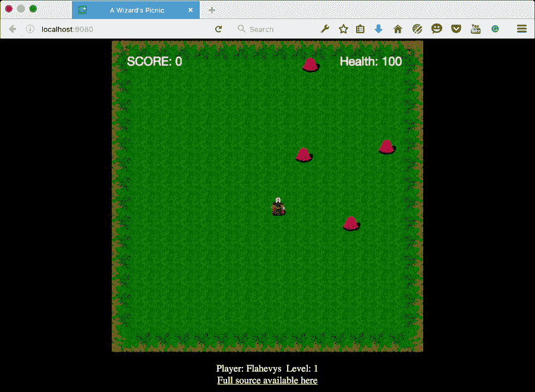

# 第十章. 制作游戏

在本章的最后，我们将创建迄今为止最复杂的蓝图。我们将创建一个游戏引擎和一个单屏动作游戏。当你完成本章后，你会理解为什么使用 ReactJS 进行开发经常被比作开发游戏。当我们用 HTML5 制作游戏时，我们使用 canvas。在 canvas 上绘制与我们在 ReactJS 中渲染浏览器的方式非常相似。我们持续更新 canvas，丢弃之前的内容，并立即渲染新内容。

我们将制作一个动作游戏，玩家将扮演一个可玩的角色，面对一群怪物，同时野餐。装备了火球法术的玩家必须击败所有敌人，才能放松并享受他的午餐。

本章我们将涵盖以下主题：

+   具有动态 SCSS 转换的最佳 Webpack 配置

+   使用 ShellJS 进行脚本编写

+   使用 Flow 进行静态类型检查

+   创建 HTML5 canvas 游戏引擎

+   响应键盘事件

+   创建和绘制图像实体

+   在屏幕上移动由计算机控制的实体

+   强制力碰撞检测

+   设置游戏标题和游戏结束场景

那么，让我们开始吧！

# 最佳 Webpack 配置

我们将实现一些较新的技术，并且再次修改我们的 Webpack 配置和构建过程。我们将添加使用 Flow 的类型检查，这是复制我们的资源和创建我们的生产`index.html`文件的一个更好的解决方案。最后，我们将添加对内联导入和即时转换 SCSS 的支持。

SCSS 是 CSS 的扩展，允许你使用在常规 CSS 中不存在的功能编写 CSS，例如嵌套、混入、继承和变量。它被称为**预处理器**，就像是一个编译器，你可以在其中用一种语言编写代码，并在使用之前将其转换为另一种语言。在这种情况下，我们将用 SCSS 编写代码，并在浏览器解析之前将其转换为常规 CSS。

为了完成所有这些，我们需要添加一些来自`npm`的新包，并修改我们的 Webpack 配置。注意，我们将从我们在第八章中制作的生成 Webpack 脚手架开始，*将您的应用程序部署到云*。这个脚手架具有以下结构：

```js
├── assets
│   ├── app.css
│   ├── favicon.ico
│   ├── index.html
│   └── index.prod.html
├── package.json
├── public
│   └── assets
│       └── bundle.js
├── server-development.js
├── server-production.js
├── source
│   └── index.jsx
├── Webpack-development.config.js
└── Webpack-production.config.js
```

在`Webpack-development.config.js`和`Webpack-production.config.js`中，在`loader`部分（方括号之间）添加以下代码：

```js
{
  test: /\.scss$/,
  loader: 'style!css!sass'
}
```

注意，我们将保留 Babel 加载器，然后在下面添加另一个加载器，以确保 Webpack 理解`scss`前缀。

在这两个配置文件中，添加以下导入：

```js
var HtmlWebpackPlugin = require('html-webpack-plugin');
```

然后，将此插件代码添加到`plugins`部分：

```js
new HtmlWebpackPlugin({
  title: "A Wizard's Picnic",
  template: 'index.ejs',
  hash: true,
  inject: 'body'
})
```

此插件将模板`index.ejs`文件复制到配置文件中之前定义的输出路径作为`index.html`。它还将插入 Webpack 生成的脚本文件。

对于`Webpack-development.config.js`，输出部分应如下所示：

```js
output: {
  path: path.join(__dirname, 'assets'),
  filename: 'bundle.js'
},
```

对于 `Webpack-production.config.js`，它应该看起来像这样：

```js
output: {
  path: path.join(__dirname, 'public', 'assets'),
  filename: 'bundle.js'
},
```

我们还需要添加 `index.ejs` 文件及其内容。使用以下代码添加它们：

```js
<!DOCTYPE html>
<html>
  <head>
    <meta charset="utf-8">
    <meta http-equiv="X-UA-Compatible" content="IE=edge">
    <meta name="viewport" content="width=device-width, initial-scale=1">
    <meta http-equiv="Content-type" content="text/html; charset=utf-8"/>
    <title><%= htmlWebpackPlugin.options.title %></title>
  </head>
  <body>
    <div id="app"></div>
  </body>
</html>
```

注意，我们已经跳过了 *CSS* 和脚本，并且通过注入 `htmlWebpackPlugin` 添加了页面标题。

这两个更改之后，我们可以移除 `cpFile` 插件以及 `server-production.js` 文件中的 `cpFile` 代码。`cpFile` 插件做了两件事：它将 `assets/index.prod.html` 复制到 `public/assets/index.html`，并将 `assets` 中的 `app.css` 复制到 `public/assets`。我们仍然需要复制资源内容，但由于我们将复制大量文件，我们需要一种比简单地逐个复制文件更智能的方法来做这件事。

## 使用 ShellJS 编写脚本

我们将使用 **ShellJS** 来复制我们的资源。这个 `npm` 包是普通 bash 脚本的替代品，并且增加了跨环境支持的好处。这意味着我们编写的脚本将适用于 Windows 用户以及 Mac/Linux 用户。

我们需要添加一个脚本来复制我们的文件，因此添加一个名为 `scripts` 的新文件夹，并在其中添加一个名为 `assets.js` 的文件。然后，添加以下代码：

```js
require('shelljs/global');
rm('-rf','public/assets');
mkdir('-p','public/assets');
cp('-R', 'assets/', 'public/assets');
```

我们还需要更新我们的 `package.json` 文件，添加一个运行脚本，以便在打包我们的应用程序时运行 ShellJS。打开文件，并将 `start` 命令替换为以下三行：

```js
"prestart": "shjs scripts/assets.js",
"start": "cross-env NODE_ENV=production npm run build",
"poststart": "cross-env NODE_ENV=production node server-production.js",
```

我们还需要更新我们的 `server` 文件，因此打开 `server-production.js` 并将其替换为以下内容：

```js
"use strict";
var express = require("express");
var app = express();
var port = process.env.PORT || 8080;
var host = process.env.HOST|| "0.0.0.0";
var path = require("path");
var compression = require("compression");
var http = require("http");
var errorHandler = require('express-error-handler');

app.use(compression());
app.get("*", function (req, res) {
  console.log(req.path);
  var file = path.join(__dirname, "public", "assets", req.path);
  res.sendFile(file);
});

server = http.createServer(app);
app.use(function (err, req, res, next) {
  console.log(err);
  next(err);
});
app.use( errorHandler({server: server}) );

app.listen(port, host, function() {
  console.log('Server started at http://'+host+':'+port);
});
```

接下来，我们需要添加我们导入的所有包。通过执行以下命令来完成此操作：

```js
npm i --save-dev shelljs@0.6.0 html-webpack-plugin@2.9.0 cross-env@1.0.8 sass-loader@3.1.2 node-sass@3.4.2 style-loader@0.13.0 css-loader@0.23.1

```

我们可以使用以下方法移除我们不再需要的两个包：

```js
npm remove --save-dev cp-file rimraf

```

您还需要一套完整的游戏资源。您可以清空当前的 `assets` 文件夹，并使用在 [`reactjsblueprints-chapter10.herokuapp.com/assets.zip`](http://reactjsblueprints-chapter10.herokuapp.com/assets.zip) 可用的内容。我们游戏中的图形包含来自公共领域 rogue-like 图块集 **RLTiles** 的图块选择。您可以在 [`rltiles.sf.net`](http://rltiles.sf.net) 找到原始图块集。

呼呼！这有很多变化，但我们终于准备好开始编写游戏了。您应该能够运行 `npm run dev` 来运行开发服务器，以及 `npm start` 来构建和运行生产服务器。

## 使用 Flow 进行静态类型检查

我们将使用 **Flow** 对我们的代码进行类型检查。这不是我们代码库的一部分，但您将在我们的引擎和游戏代码的每个地方看到这种语法。

Flow 被设计用来在 JavaScript 程序中查找类型错误。与完全类型化的语言（如 **TypeScript**）相比，它有一个主要的好处。您可以在想使用时使用它。这意味着您可以将类型化代码与非类型化代码混合，并继续像以前一样编程，同时增加了能够自动检测类型错误的好处。

缺点是 Flow 二进制文件仅在 Mac 和 Linux 上可用。有一个实验性的 Windows 二进制文件可用，但它并不总是最新的。优点是，如果你在 Windows 上，你的代码仍然会执行，但你将无法找到任何潜在的错误。

### 注意

通过访问 [`flowtype.org/docs/getting-started.html`](http://flowtype.org/docs/getting-started.html) 并按照说明进行操作来安装 Flow。

你需要在项目根目录中有一个特殊的配置文件，名为 `.flowconfig`（点号前没有名称）。添加文件并包含以下内容：

```js
[include]
./source
[ignore]
.*/*.scss*
.*/node_modules/babel.*
.*/node_modules/babylon.*
.*/node_modules/redbox-react.*
.*/node_modules/invariant.*
.*/node_modules/fbjs.*
.*/node_modules/fsevents.*
.*/node_modules/is-my-json-valid.*
.*/node_modules/config-chain.*
.*/node_modules/json5.*
.*/node_modules/ua-parser-js.*
.*/node_modules/spdx.*
.*/node_modules/binary.*
.*/node_modules/resolve.*
.*/node_modules/npmconf.*
.*/node_modules/builtin.*
.*/node_modules/sha.*
[options]
module.name_mapper='.*\(.css\)' -> 'empty/object'
module.name_mapper='.*\(.scss\)' -> 'empty/object'
```

此配置告诉 *Flow* 检查 `source` 文件夹的内容，同时忽略 `node_modules` 中的一些选定的依赖项，这些依赖项是通过 `source` 文件夹中的引用获取的。

当 Flow 安装完成并添加了配置文件后，你可以通过在命令行中执行 `flow` 来开始检查你的代码。第一次运行时，它将初始化一个服务器，然后报告之后的每次运行的错误。

一个典型的错误看起来像这样：

```js
source/engine/entity/randomMove.js:21
 21:     entity.direction = shuffle(direction)[0];
                            ^^^^^^^^^^^^^^^^^^ function call
 18:   let direction = ["x","y"];
                        ^^^ string. This type is incompatible with
  3:   array: Array<Object>
                    ^^^^^^ object type. See: source/engine/math/shuffle.js:3
```

在这里，Flow 已经确定 shuffle 调用是用一个数组进行的，但 `shuffle` 函数被定义为期望一个包含对象的数组。这个错误很容易修复，因为 shuffle 应该期望一个包含一系列值的数组，而不是包含对象的数组。

通过使用注解，你用意图编写代码，Flow 使得检查你是否以你期望的方式使用函数变得容易，正如前面错误所见证的那样。

# 创建一个 HTML5 画布引擎

游戏分为两个部分：引擎和游戏。对于这类项目，制定一个关于应用最终外观的计划是值得的。将纯游戏引擎部分与游戏部分分开是很自然的，因为这使得它们在以后更容易重用，并用于其他游戏。

通常，当你制作一个游戏时，你会基于一个现成的引擎，但我们不会这么做。我们将完全自己制作一个引擎。我们将实现我们需要的所有功能，但在我们完成之后，你可以自由地扩展并添加自己的引擎组件。

应将引擎放置在 `source` 内部的子文件夹中。这是结构：

```js
engine/
├── collision
│   └── bruteForce.js
├── entity
│   ├── createEntity.js
│   ├── drawEntity.js
│   ├── randomMove.js
│   └── targetEntity.js
├── index.js
├── input
│   ├── keyboard.js
├── math
│   ├── shuffle.js
│   ├── sign.js
└── video
    ├── clear.js
    └── loadImage.js
```

主文件是 `index.js`，它简单地充当一个中央导入/导出中心。让我们首先创建 `engine` 文件夹和 `index.js`。它应该包含以下内容：

```js
const loadImage = require('./video/loadImage');
const clear = require('./video/clear');
const drawEntity = require('./entity/drawEntity');
const createEntity = require('./entity/createEntity');
const targetEntity = require('./entity/targetEntity');
const sign = require('./math/sign');
const bruteForce = require('./collision/bruteForce');
const keyboard = require('./input/keyboard');
const shuffle = require('./math/shuffle'); 
const randomMove= require('./entity/randomMove');

module.exports = {
  loadImage,
  clear,
  randomMove,
  createEntity,
  drawEntity,
  targetEntity,
  sign,
  shuffle,
  bruteForce,
  keyboard
}
```

我们将在游戏中使用所有这些组件。让我们创建每一个，并看看它们的作用。

让我们从 `video` 文件夹和 `loadImage.js` 开始。将此代码添加到文件夹中：

```js
// @flow
const setImage = (ctx: Object, image: Image) => {
  ctx.drawImage(image, 0, 0);
}

const loadImage = (canvas: Object, image: string) => {
  let bgImage = new Image();
  bgImage.src = image;
  bgImage.onload = () => {
    setImage(canvas.getContext("2d"), bgImage)
  };
}
module.exports = loadImage;
```

在代码中添加一行注释 `@flow` 告诉 *Flow* 在此文件上使用其类型检查功能。然后定义 `setImage` 函数，它有两个参数：`ctx` 和 `image`。`ctx` 参数被转换为对象，`image` 被转换为图像。如果我们把图像转换为字符串，*Flow* 会立即告诉我们类型与 `setImage` 函数调用不兼容。

不再使用 Flow；让我们看看这个文件做了什么。它有两个函数，但只有一个被导出。`loadImage`函数接受一个图像并将其获取到`image`变量，即`bgImage`。这是一个网络调用，因此模块不能立即返回图像，但我们将函数设置为在图像加载后立即执行`setImage`函数。然后该函数将在我们传入的画布上绘制图像。

下一个文件是`clear.js`，它还需要添加到`source/engine/video`文件夹中。向其中添加以下代码：

```js
const clear = (canvas: Object) => {
  const ctx = canvas.getContext('2d');
  ctx.clearRect(0, 0, canvas.width, canvas.height);
};
module.exports = clear;
```

当被调用时，这将完全清除画布。

下一个文件是`shuffle.js`，位于`source/engine/math`文件夹中。添加它并使用以下代码：

```js
// @flow
const shuffle = (
  array: Array<any>
): Array<any> => {
  let count = array.length;
  let rnd, temp;

  while( count ) {
    rnd = Math.random() * count-- | 0;
```

这行代码在`0`和剩余项目数之间获取一个随机数。单个管道是一个位运算符，在这种情况下用于去除小数部分。它的工作方式与`Math.floor()`非常相似，但速度更快，因为位运算符是原生的。它可能更复杂，更难理解，所以如果你想让代码更易读，用`Math.floor()`包装数学操作是个好主意。然后我们将按顺序将项目分配给`temp`变量，并将随机数处的当前项目移动到数组中的当前计数器：

```js
  temp = array[count];
  array[count] = array[rnd];
  array[rnd] = temp;
```

最后，我们将随机数设置到数组中的项目顺序。这确保了所有项目都被计算在内：

```js
  }
  return array;
}
module.exports = shuffle;
```

如其名所示，`shuffle`函数接受一个数组集合，然后通过遍历输入数组中的所有项目来对其进行洗牌。

`math`文件夹中的第二个文件是`sign.js`。向其中添加以下代码：

```js
//@flow 
const sign = (n: number): number => {
  return Math.sign(n) || (n = +n) == 0 || n != n ? n : n < 0 ? -1 : 1
};
module.exports = sign;
```

符号是一个数学表达式，它返回一个整数，表示数字的符号。如果可用，我们将使用内置的`sign`函数，否则将使用我们自己的。我们将使用它来设置针对玩家的敌人实体的移动。

接下来是`input`文件夹。向其中添加`keyboard.js`并添加以下代码：

```js
// @flow
const keyboard = (keys: Array<bool>) => {
  window.addEventListener("keydown", (e) => {
    keys[e.keyCode] = true;
  }, false);

  window.addEventListener("keyup", (e) => {
    delete keys[e.keyCode];
  }, false);
}
module.exports = keyboard;
```

此文件添加了一个事件监听器，当玩家在键盘上按下任何键时注册键，并在事件监听器检测到键被释放（用户不再按下键）时从键数组中删除它们。

让我们添加`entity`文件夹。在这里我们将添加五个文件。第一个是`targetEntity.js`。向其中添加以下代码：

```js
// @flow
import sign from '../math/sign';

const targetEntity = (
  entityA: Object,
  entityB: Object,
  speed: number = 1
) => {
  let posA = entityA.pos;
  let posB = entityB.pos;
  let velX = sign(posB.x - posA.x) * speed;
  let velY = sign(posB.y - posA.y) * speed;
  entityA.pos.x+=velX;
  entityA.pos.y+=velY;
};
module.exports = targetEntity;
```

我们将使用此文件来设置一个实体在另一个实体位置路径上的一个实体。在我们制作的游戏中，我们将使用此代码来指导一个敌人实体指向玩家或反之亦然。实体是一个具有一定大小、位置和速度的对象，代码通过改变`entityA`对象的`x`和`y`位置来实现。

我们将使用`sign`方法设置正确的符号。如果我们不这样做，它很可能会远离实体而不是朝向它移动。

接下来是`randomMove.js`。添加文件并添加以下代码：

```js
// @flow
import shuffle from '../math/shuffle';
const randomMove = (
  entity: Object,
  speed: number = 1,
  Config: Object = {
    height: 512,
    width: 512,
    tileSize: 32
  }
) => {
  let {pos, vel} = entity;
  let speedX, speedY;

  entity.tick-=1;
```

当`entity.tick`达到零时，将计算一个新的方向。现在看看这个：

```js
  let direction = ["x","y"];

  if(entity.tick<=0) {
    entity.direction = shuffle(direction)[0];
    entity.tick=Math.random()*50;
  }
```

为了使方向重新计算更加随机，新的 tick 值被设置为`0`到`50`之间的一个值。让我们继续到另一个函数：

```js
  if(pos.x + vel.x >Config.width - Config.tileSize *2) {
    vel.x=-speed;
  }
  if(pos.x + vel.x < Config.tileSize/2) {
    vel.x=speed;
  }

  if(pos.y + vel.y > Config.height- Config.tileSize * 2) {
    vel.y=-speed;
  }
  if(pos.y + vel.y < Config.tileSize/2) {
    vel.y=speed;
  }

  entity.pos.x+= entity.direction==="x" ? vel.x: 0;
  entity.pos.y+= entity.direction==="y" ? vel.y: 0;
};
module.exports = randomMove;
```

这个函数实现了计算机控制实体的随机方向。

我们接下来要创建的文件是`drawEntity.js`。添加以下代码：

```js
// @flow
import createEntity from './createEntity';

module.exports = (
  canvas: Object,
  entity: Object
) => {
  if(entity._creating && !entity._sprite){
    return 0;
  }
  else if(!entity._sprite) {
    createEntity(canvas, entity);
  }
  else {
    // draw the sprite as soon as the image
    // is ready
    var ctx = canvas.getContext("2d");
    ctx.drawImage(
      entity._sprite,
      entity.pos.x,
      entity.pos.y
    );
  }
}
```

这个文件与`loadImage`类似，但我们将通过设置两个变量`_creating`和`_sprite`为实体添加一个状态。我们将在游戏中稍后使用它，只实际绘制具有适当的`ImageData`对象（包含在`_sprite`中）的实体。

`entity`文件夹中的最后一个文件是`createEntity.js`。添加以下代码：

```js
// @flow
import drawEntity from './drawEntity';

module.exports = (
  entity: Object
) => {
  entity.id=Math.random()*2;
```

这为实体提供了一个 ID，请看以下内容：

```js
  entity._creating=true;
```

标记它，这样我们就不尝试创建实体两次。让我们看一下下面的代码片段：

```js
  let entityImage = new Image();
  entityImage.src = entity.image;
  entityImage.onload = () => {
    entity._sprite = entityImage;
  };
}
```

我们几乎完成了引擎。我们需要添加一个额外的文件夹和文件，分别是`collision`和`bruteForce.js`。使用以下代码添加它：

```js
// @flow
module.exports = (
  entityA: Object = {pos: {x:0, y:0}},
  entityB: Object = {pos: {x:0, y:0}},
  size: number = 32
): bool => {
  return (
    entityA.pos.x <=
      (entityB.pos.x + size)
    && entityB.pos.x <=
      (entityA.pos.x + size)
    && entityA.pos.y <=
      (entityB.pos.y + size)
    && entityB.pos.y <=
      (entityA.pos.y + size)
  )
}
```

这个函数将比较两个实体的位置并确定它们是否占据相同的空间。对于小画布和屏幕上有限的实体数量，这是你可以想象到的最快的碰撞检测实现。

现在你有一个小型的工作游戏引擎。让我们继续并开始实现游戏。

# 创建游戏

游戏本身将比引擎更大。这对 HTML5 游戏来说并不罕见，但请做好准备，因为我们将要添加很多文件。让我们看一下下面的截图：


这是游戏的文件结构（不包括引擎）：

```js
├── components
│   ├── addEntity.js
│   ├── addProjectile.js
│   ├── checkCollision.js
│   ├── debugBoard.js
│   ├── diceroll.js
│   ├── drawEntities.js
│   ├── drawGameOver.js
│   ├── drawGameWon.js
│   ├── drawHud.js
│   ├── clearCanvas.js
│   ├── keyInput.js
│   ├── keypress
│   │   ├── a.js
│   │   ├── d.js
│   │   ├── down.js
│   │   ├── index.js
│   │   ├── left.js
│   │   ├── right.js
│   │   ├── s.js
│   │   ├── space.js
│   │   ├── up.js
│   │   └── w.js
│   ├── outOfBounds.js
│   ├── removeEntity.js
│   └── setupGame.js
├── config
│   ├── beasts.js
│   ├── index.js
│   ├── players.js
│   └── spells.js
├── game.jsx
├── index.jsx
├── polyfills.js
├── style.scss
└── title.jsx
```

让我们从`root`源文件开始。

将以下内容添加到`index.jsx`：

```js
import './style.scss';
import polyfill from './polyfills';
import Config from './config';
```

`Config`文件是我们将提供游戏所有内容的文件，如下所示：

```js
import React, { Component, PropTypes } from 'react';
import MyGame from './game';
import Title from './title';
import {render} from 'react-dom';

class Index extends Component {
  constructor() {
    super();
    this.state={};
    this.state.scene="title";
  }

  callback(val: string) {
    this.setState({scene: val})
  }

  render() {
    switch(this.state.scene) {
      case "title":
        return <Title cb={this.callback.bind(this)} />
      break;

      case "game":
        return <MyGame cb={this.callback.bind(this)} />
      break;
    }
  }
}

render(
  <Index />,
  document.getElementById('app')
);
```

当玩家开始游戏时，我们显示标题或游戏屏幕。我们通过为组件提供一个`setState`回调来实现切换，这意味着任何时候我们想要切换到场景，我们都可以使用`this.props.cb(scene)`。

接下来，添加`polyfills.js`，代码如下：

```js
// polyfill for requestAnimationFrame
var requestAnimFrame = (function() {
  return window.requestAnimationFrame  ||
    window.webkitRequestAnimationFrame ||
    window.mozRequestAnimationFrame    ||
    window.oRequestAnimationFrame      ||
    window.msRequestAnimationFrame     ||
    function(callback) {
      window.setTimeout(callback, 1000 / 60);
  };
})();
```

这是一个垫片，用于为尚未支持`requestAnimationFrame`的浏览器提供支持。正如你在代码中所见，如果`requestAnimationFrame`不受支持，它将实现`setTimeOut`。我们想使用`requestAnimationFrame`因为它比`setTimeOut`更高效，`setTimeOut`不够准确，而且在不需要渲染时也会浪费很多周期。

让我们添加`title.jsx`：

```js
import './style.scss';
import polyfill from './polyfills';
import Config from './config';
import React, { Component, PropTypes } from 'react';
import Game from './engine';
import keyboard from './components/keypress/index';

class Title extends Component {
  constructor() {
    super();
    this.last = Date.now();
    this.keys={};
  }

  keyInput( keys ) {
    if (keyboard.space(keys)) {
      this.props.cb("game");
    }
  }
```

如果玩家在键盘上按下空格键，则开始游戏。下面是下一步：

```js
  updateGame(modifier) {
    if(typeof this.refs.canvas ==="undefined")
      return;
```

这避免了在画布尚未初始化时更新游戏。以下代码告诉游戏监听键盘输入：

```js
    const { canvas } = this.refs;
    const ctx = canvas.getContext("2d");

    Game.loadImage(
      canvas,
      Config.backgrounds.title
    );

    // Keyboard
    this.keyInput(this.keys);
  }

  componentDidMount() {
    Game.keyboard(this.keys);
```

这是主游戏循环：

```js
    const gameLoop = () => {
      var now = Date.now();
      var delta = now - this.last;
      this.updateGame(delta / 1000);
      this.last = now;
      window.requestAnimationFrame(gameLoop);
    }
    gameLoop();
```

尽管这是一个标题场景，但我们将其视为一个迷你游戏并相应地更新它。这使得我们能够轻松地使用实体和游戏逻辑来动画化标题屏幕，并使用与游戏中相同的输入方法，让我们看一下下面的代码片段：

```js
  }

  render() {
    return <div><canvas
      ref="canvas"
      id={ Config.id || "canvas" }
      height={ Config.height }
      width={ Config.width } >
      Sorry, your browser doesn't
      support canvas
    </canvas>
    <br/>
    <div className="info">
      You're a wizard. You're on a picnic.
      <br/>
    You hear a noise...
    </div>
  </div>
  }
}
module.exports = Title;
```

接下来，添加`style.scss`并使用以下代码：

```js
canvas {
  margin: 0 auto;
  display: block;
}
body {
  background: black;
}
.info {
  color:white;
  text-align:center;
  margin: 0 auto;
  display: block;
  a {
    color:white;
  }
}
```

最后，我们添加游戏本身。添加`game.jsx`并使用以下代码：

```js
import './style.scss';
import polyfill from './polyfills';
import Config from './config/index';
import React, { Component, PropTypes } from 'react';
import Game from './engine';
import SetupGame from './components/setupGame';
import KeyInput from './components/keyInput';
import DrawHUD from './components/drawHud';
import DrawGameOver from './components/drawGameOver';
import DrawGameWon from './components/drawGameWon';
import DrawEntities from './components/drawEntities';
import ClearCanvas from './components/clearCanvas';
import CheckCollision from './components/checkCollision';
import OutOfBounds from './components/outOfBounds';
import AddProjectile from './components/addProjectile';
import AddEntity from './components/addEntity';
import RemoveEntity from './components/removeEntity';
```

我们需要创建所有这些组件，以便游戏能够正常运行。在开发游戏时，通常会将这些组件内联。在迭代游戏时，你会了解如何将它们分离成独立的组件，以及如何对它们进行修改以实现复用。让我们看一下以下代码片段：

```js
class MyGame extends Component {
  constructor() {
    super();
    this.lastTime = Date.now();
    this.keys={};
    this.gameOver=false;
    this.gameWon=false;
    this.maxMonsters=3;
    this.level=0;
    this.beast=Config.beasts[0],
    this.state={};
    this.returnToTitleScreen=150;
```

这是一个倒计时，将在游戏结束后，玩家返回到标题屏幕时使用。请看以下代码片段：

```js
    this.score = 0;
    this.coolDown=0;
```

这又是一个倒计时。它用于玩家射击时，防止玩家在板上用弹射物进行垃圾邮件式攻击。让我们看一下以下代码片段：

```js
    this.entities= Config.entities;
    this.current_player_no = 0;
    this.current_player = this.entities.players[0];
    this.state.player = this.current_player;
    this.current_player.health=100;
    this.current_player.pos= {x:8, y:8};
```

游戏板是 512 x 512 像素，每个单独的实体是 32 x 32 像素。通过将板大小除以实体大小，可以更容易地可视化板上的放置。通过查看这个值，很容易理解当前玩家被放置在板的中间。如果我们使用了精确的像素值，即 256 x 256，可能会稍微困难一些。现在，让我们看看下一步：

```js
  }

  updateGame(modifier) {
    if(typeof this.refs.canvas ==="undefined")
      return;

    const { canvas } = this.refs;
    const ctx = canvas.getContext("2d");

   if(this.gameOver) {
      ClearCanvas(canvas, this.gameOverImage);
      if(this.gameWon)
        DrawGameWon(canvas);
      else
        DrawGameOver(canvas);
      --this.returnToTitleScreen;
      if(this.returnToTitleScreen<=0)
        this.props.cb('title');
      return;
    }
```

当`gameOver`标志被设置为`true`时，我们告诉游戏暂停，并启动一个计数器，当计数器达到零时，将玩家返回到标题屏幕。请看以下代码：

```js
    const player = this.entities.players[
      this.current_player_no
    ];
```

这是一个单人游戏，但你可以通过在`config`中的`players`数组中添加更多玩家来扩展游戏，并通过迭代`current_player_no`变量来切换他们。这个函数负责绘制玩家以及任何敌人和弹射物：

```js
    DrawEntities(Config, canvas, this.entities);
```

这个函数在屏幕顶部绘制得分和玩家生命值：

```js
    DrawHUD(canvas, this.score, player.health);
```

这是一个相当高级的函数，用于处理游戏中的所有键输入：

```js
    this.coolDown-=0.1;

    KeyInput(
      Config,
      this.keys,
      player,
      1,
      AddProjectile.bind(this),
      (item) => this.entities.projectiles.push(item),
        this.coolDown,
      _ => this.coolDown = 1.5
    );
```

它需要`Config`对象来计算弹射物的位置，处理移动和射击动作的键，`player`对象，以及一个可以用来加快或减慢移动速度的修饰符。它还要求你传递创建弹射物的函数和两个回调：第一个用于将弹射物添加到`entities`数组，第二个用于设置`coolDown`变量。这个最后值越高，玩家能发射的弹射物就越少。对于每一次迭代，弹射物都会根据其速度移动：

```js
    this.entities.projectiles.forEach((item)=> {
      item.pos.x+= item.direction.xVel;
      item.pos.y+= item.direction.yVel;
```

以下循环是必要的，用于检查是否有任何弹射物与任何怪物发生碰撞：

```js
      this.entities.monsters.forEach((monster)=> {
```

这是一个嵌套循环，我们通常应该小心处理，因为它可能是性能下降的主要原因。现在，看看以下代码：

```js
        if(Game.bruteForce(
          item, monster, Config.tileSize/2
        )) {
          monster.health-=20;

          this.entities.projectiles =
          RemoveEntity(
              this.entities.projectiles,
              item,
              _ => {}
          );
```

如上图所示，如果弹射物与敌人碰撞，敌人会损失 20 点生命值，并且我们将弹射物从实体数组中移除。这确保了它不会在游戏循环的下一轮中被绘制。下一个检查会移除生命值小于零的敌人：

```js
          if(monster.health<=0) {
            this.entities.monsters =
            RemoveEntity(
              this.entities.monsters,
              monster,
              _ => { this.score++}
            );
          }
        }
      })

      if(OutOfBounds(
        item,
      {h:Config.height,w:Config.width},
      Config.tileSize
      )) {
        this.entities.projectiles =
        RemoveEntity(
          this.entities.projectiles,
          item,
          _ => {}
        );
      }
```

这个函数负责移除逃离画布的弹丸。这很重要，因为我们不想保留我们计算出的元素列表尽可能小。我们继续到下一个循环：

```js
    })

    this.entities.monsters.forEach((monster)=> {
```

这个循环检查敌人是否接近或与玩家发生碰撞。如果它们接近，它们应该直接向玩家移动。尝试增加范围以使游戏更具挑战性。

如果它们发生碰撞，玩家会失去生命值。

如果这些情况都没有发生，我们为实体提供一个随机的方向：

```js
      if(Game.bruteForce(monster, player, 32)) {
        Game.targetEntity(
          monster,
          player,
          monster.speed
        )
      }
      Game.randomMove(
        monster,
        monster.speed,
        Config
      )

      CheckCollision(
        canvas, player,
        monster,
        _ => {player.health-=1},
        _ => {}
      );
    })

    if(!this.gameOver && this.level<=14) {
      if(this.entities.monsters.length<=0) {
        ++this.level;
```

每当玩家清空当前的一组敌人时，他们就会进入下一级：

```js
        this.beast=Config.beasts[this.level-1];
        this.setState({
          level: this.level,
          beast: this.beast
        })
        this.maxMonsters=this.level+3;
      }

      if(this.beast && this.maxMonsters>0) {
        --this.maxMonsters;
```

每个级别都会带来更多的敌人。这个检查确保我们添加的 `enemy` 实体数量与当前级别的要求相符：

```js
        AddEntity(
          this.beast,
          {
            x: Game.shuffle([64,256,480])[0],
            y: Game.shuffle([-32,520])[0]
          },
          20+this.score,
          1+Math.random()*this.score/10,
          (item) => this.entities.monsters.push(item)
        )
      }
    }

    if(this.level>14) {
      this.gameWon=true;
      this.returnToTitleScreen = 400;
      this.gameOver=true;
    }

    if(player.health<0 || this.gameWon) {
```

如果玩家的生命值耗尽，我们将当前画布的图像存储起来，并将其用作游戏结束屏幕。然后，我们清除实体并设置 `gameOver` 标志：

```js
      this.gameOverImage = 
        ctx.getImageData(
          0, 0, canvas.width, canvas.height
      );
      this.entities.monsters=[];
      this.entities.projectiles=[];
      this.gameOver = true;
    }

  }

  componentDidMount() {
    const canvas = this.refs.canvas;
    const ctx = canvas.getContext("2d");

    this.level=0;
    this.setState({
      score: 0,
      level: 0,
      beast: Config.beasts[0]
    })
```

当挂载游戏时，我们重置得分、级别和当前敌人。这样，当玩家击中游戏结束并按下空格键重新开始游戏时，我们可以从头开始：

```js
    SetupGame(
      Config, this.keys, this.refs.canvas,
      this.entities, this.positions
    );

    const gameLoop = () => {
      var now = Date.now();
      var delta = (now - this.lastTime) / 1000.0;
      this.updateGame(delta);
      this.last = now;
      window.requestAnimationFrame(gameLoop);
    }

    gameLoop();

  }

  getCurrentplayer() {
    return this.current_player.name
  }

  render() {
    return <div>
      <canvas
        ref="canvas"
        id={ Config.id || "canvas" }
        height={ Config.height }
        width={ Config.width } >
        Sorry, your browser doesn't
        support canvas
      </canvas>
      <br/>
      <div className="info">
        Player: {this.getCurrentplayer()}
        &nbsp;
        Level: {this.level}
      </div>

    </div>
  }
}

module.exports = MyGame;
```

以下截图显示了玩家可见的游戏画面，敌人实体正在蜂拥而至，标题栏中有一个得分和生命条。屏幕底部，你可以看到玩家的名字（从 `name` 数组中随机选择）和当前的难度级别：



这就是游戏文件的全部内容，但正如你所注意到的，我们还有更多文件要添加。我们需要添加两个新的文件夹：`components` 和 `config`。让我们从 `config` 开始。添加这个文件夹和 `index.js` 文件。然后，添加以下内容：

```js
import { players, names } from './players';
import { beasts } from './beasts';
import Shuffle from '../engine/math/shuffle';

let config =  {
  tileSize: 32,
  height: 512,
  width: 512,
  debug: true,
  beasts: beasts,
  backgrounds: {
    title: '/title.png',
    game: '/board512_grass.png'
  },
  entities: {
    players : [],
    projectiles: [],
    monsters: [],
    pickups: [],
    enemies: []
  }
```

我们还没有在游戏中添加任何拾取物，但这是一个好主意，并添加各种物品，如生命、不同的武器等等，让我们看一下以下代码：

```js
}

config.entities.players.push({
```

我们将为玩家添加一个单独的玩家，并从玩家名单中随机选择一个名字，以及从玩家名单中随机选择一个图片，让我们看一下以下代码片段：

```js
  name: Shuffle(names).pop(),
  image: Shuffle(players).pop(),
  health: 100,
  width: 32,
  height: 32,
  pos:{
    x: 8,
    y: 8
  },
  speed: 5
})

module.exports = config;
```

接下来，添加 `config/players.js` 并包含以下内容：

```js
let names = [
  "Striliyrin",
  "Xijigast",
  "Omonar",
  "Egeor",
  "Omakojamar",
  "Eblokephior",
  "Tegorim",
  "Ugniforn",
  "Igsior",
  "Imvius",
  "Pobabine",
  "Oecodali",
  "Baro",
  "Trexaryl",
  "Flahevys",
  "Ugyritaris",
  "Afafyne",
  "Stayora",
  "Ojgis",
  "Ikgrith"
];
let players = [
  '/deep_elf_knight.png',
  '/deep_elf_death_mage.png',
  '/deep_elf_demonologist.png',
  '/deep_elf_fighter.png',
  '/deep_elf_high_priest.png',
  '/deep_elf_mage.png',
  '/deep_elf_blademaster.png',
  '/deep_elf_conjurer.png',
  '/deep_elf_annihilator.png'
]
exports.players = players;
exports.names = names;
```

这个文件为游戏增添了多样性。如果我们添加更多玩家到游戏中，它也可能很有用。

最后，添加 `config/beasts.js` 并包含以下内容：

```js
let beasts = [
  "/beasts/acid_blob",
  "/beasts/rat",
  "/beasts/boring_beetle",
  "/beasts/giant_mite",
  "/beasts/orc_warrior",
  "/beasts/demonspawn",
  "/beasts/hydra",
  "/beasts/ooze",
  "/beasts/hobgoblin",
  "/beasts/dragon",
  "/beasts/harpy",
  "/beasts/golden_dragon",
  "/beasts/griffon",
  "/beasts/hell_knight"
]
exports.beasts = beasts;
```

我们已经完成了配置，所以让我们添加所有的游戏组件。

添加 `components/addEntity.js` 并包含以下代码：

```js
//@flow
import Game from '../engine';
let directions = [1, -1];

const addEntity = (
  item: string,
  pos: Object,
  health: number = 60,
  speed: number = 1,
  callback: Function
) => {
  let entity = {
    name: item,
    image: `${item}.png`,
    width: 32,
    height: 32,
    health: health,
    pos:{
      x: pos.x,
      y: pos.y
    },
    vel:{
      x: Game.shuffle(directions)[0],
      y: Game.shuffle(directions)[0]
    },
    tick: 50,
    direction: Game.shuffle(["x","y"])[0],
    speed: speed+(Math.random()*1)
  };
  Game.createEntity(entity);
  callback(entity);
}
module.exports = addEntity;
```

我们通过 `shuffle` 和 `Math.random` 添加多样性。我们希望它们的移动是随机的，并且希望其中一些比其他移动得更快。

添加 `components/addProjectile.js` 并包含以下代码：

```js
//@flow
import Game from '../engine';

const addProjectile = (
  item: string,
  player: Object,
  direction: Object,
  pushProjectile: Function
) => {
  let projectile = {
    name: item,
    image: `${item}.png`,
    width: 32,
    height: 32,
    pos:{
      x: player.pos.x,
      y: player.pos.y
    },
    direction: direction,
    speed: 10
  };
  Game.createEntity(projectile);
  pushProjectile(projectile);
}
module.exports = addProjectile;
```

这段代码与上一段非常相似，因此值得考虑是否可以将这两个文件合并。在计算机科学中有一个流行的缩写词 **DRY**，代表 **Don't Repeat Yourself**（不要重复自己）。其目的是识别概念上重复的代码，例如 `addEntity` 和 `addProjectile`，然后努力将其合并成一个单一的功能。

我们接下来要添加的文件是 `checkCollision.js`。添加它并包含以下代码：

```js
import Game from '../engine';

const checkCollision = (
  canvas,
  player,
  monster,
  cb,
  score
) => {
  const collides = Game.bruteForce(
    player, monster, 32
  );
  if(collides) {
    score();

    const ctx = canvas.getContext("2d");
    ctx.fillStyle = "rgb(250, 250, 250)";
    ctx.font = "12px Helvetica";
    ctx.textAlign = "left";
    ctx.textBaseline = "top";
    ctx.fillText("Ouch", player.pos.x, player.pos.y-24);

    cb(monster, canvas);
  }
}

module.exports = checkCollision;
```

我们将重用 `bruteForce` 碰撞检测，并在玩家实体与任何东西碰撞时在其上方显示一个小小的 **Ouch**。

接着，添加 `components/drawEntities.js` 并使用以下代码：

```js
//@flow
import Game from '../engine';
const drawEntities = (
  Config: Object,
  canvas: Object,
  entities: Object
) => {
  // Draw all entities
  Game.loadImage(
    canvas,
    Config.backgrounds.game
  );

  entities.projectiles.forEach((item)=> {
    Game.drawEntity(canvas, item);
  })

  entities.monsters.forEach((monster)=> {
    Game.drawEntity(canvas, monster);
  })

  entities.players.forEach((player)=> {
    Game.drawEntity(canvas, player);
  })

}
module.exports = drawEntities;
```

在游戏循环中，此代码用于绘制屏幕上的所有实体。顺序很重要，因为首先绘制的实体将被下一个绘制的实体覆盖。如果你先绘制玩家，投射物和敌人将出现在玩家上方，发生碰撞时。

接着，添加 `components/drawGameOver.js` 并使用以下代码：

```js
//@flow
import Game from '../engine';

const drawGameOver = (
  canvas: Object
) => {
  const ctx = canvas.getContext("2d");
  ctx.fillStyle = "rgb(255, 255, 255)";
  ctx.font = "24px Helvetica Neue";
  ctx.textAlign = "center";
  ctx.textBaseline = "top";
  ctx.fillText("Game Over", canvas.width/2, canvas.height/2-25);
}

module.exports = drawGameOver;
```

然后添加 `components/drawGameWon.js` 并使用以下代码：

```js
//@flow
import Game from '../engine';

const drawGameWon = (
  canvas: Object
) => {
  const ctx = canvas.getContext("2d");
  ctx.fillStyle = "rgb(255, 255, 255)";
  ctx.font = "24px Helvetica Neue";
  ctx.textAlign = "center";
  ctx.textBaseline = "top";
  ctx.fillText("You won!", canvas.width/2, canvas.height/2-25);
  ctx.font = "20px Helvetica Neue";
  ctx.fillText("You can finally enjoy your picnic!", canvas.width/2, canvas.height/2);
}

module.exports = drawGameWon;
```

它们都很相似，并且会根据是常规游戏结束事件还是玩家完成游戏而显示不同的文本。你可以添加颜色，使用不同的字体和字体大小来使文本更具吸引力。它的工作方式与 CSS 类似，通过向下级联。注意，胜利条件中的第二行文本的字体大小比第一行小，以及它是如何排列以实现这一点的。

接着，添加 `components/drawHud.js` 并添加以下代码：

```js
//@flow
import Game from '../engine';

const drawHUD= (
  canvas: Object,
  score: number = 0,
  health: number = 100
) => {
  const ctx = canvas.getContext("2d");
  ctx.fillStyle = "rgb(250, 250, 250)";
  ctx.font = "20px Helvetica Neue";
  ctx.textAlign = "left";
  ctx.textBaseline = "top";
  ctx.fillText("SCORE: " + score, 25, 25);
  ctx.textAlign = "right";
  ctx.fillText("Health: " + health, canvas.width-35, 25);
}

module.exports = drawHUD;
```

注意，这与其他文本函数的主要区别是文本的位置。

使用以下代码添加 `components/clearCanvas.js`：

```js
//@flow
import Game from '../engine';

const clearCanvas = (
  canvas: Object,
  gameOverImage: ImageData
) => {
  const ctx = canvas.getContext("2d");
  ctx.clearRect(0, 0, canvas.width, canvas.height);
  ctx.putImageData(gameOverImage, 0, 0);
}

module.exports = clearCanvas;
```

此组件将用提供的图像替换当前画布。我们将使用游戏在 `gameOver` 标志设置后的快照作为游戏结束屏幕。

使用以下代码添加 `components/outOfBunds.js`：

```js
//@flow
const outOfBounds = (
  item: Object = {pos: {x: 160, y: 160}},
  bounds: Object = {height: 16, width: 16},
  tileSize: number = 32
): bool => {
  if( item.pos.y< -tileSize ||
      item.pos.x< -tileSize ||
      item.pos.y > bounds.height+tileSize ||
      item.pos.x > bounds.width+tileSize
    ) {
      return true;
  }
  return false;
}
module.exports = outOfBounds;
```

如果一个实体在画布外，这将返回 `true`。

使用以下代码添加 `components/removeEntity.js`：

```js
//@flow
const removeEntity = (
  entities: Array<any>,
  item: Object,
  callback: Function
): Array<any> => {
  callback();
  return entities =
    entities.filter((p)=> {
    return p.id !== item.id
  })
}
module.exports = removeEntity;
```

此文件将在返回过滤后的 `entity` 数组之前执行回调。在我们的代码中，回调要么是一个空函数，要么是一个更新得分的函数。

接着，添加 `components/setupGame.js` 并使用以下代码：

```js
//@flow
import Config from '../config/index';
import Game from '../engine';

const setupGame = (
  Config: Object,
  keys: Object,
  canvas: Object,
  entities: Object,
  positions: Object
) => {
  // setup keyboard
  Game.keyboard(keys);

  entities.players.forEach((player)=> {
```

在这里，我们添加玩家实体。注意，我们通过乘以瓦片大小来设置位置，以在板上设置实际位置：

```js
    const tilePos = player.pos;
    player.pos.x = tilePos.x * Config.tileSize;
    player.pos.y = tilePos.y * Config.tileSize;
    Game.createEntity(player);
  })
}
module.exports = setupGame;
```

我们几乎完成了 `components` 文件夹。我们现在需要添加一个文件和一个包含几个 `keypress` 文件的子文件夹。

## 响应键盘事件

首先，添加 `components/keyInput.js` 并使用以下代码：

```js
//@flow
import keypress from './keypress;

const keyInput = (
  Config: Object,
  keys: Object,
  player: Object,
  modifier: number = 1,
  addProjectile: Function,
  pushProjectile: Function,
  coolDown: number,
  setCoolDown: Function
) => {
  const { pos, speed } = player;
  let direction;

  const Shoot = (coolDown, setCoolDown)=> {
    if(coolDown<=0) {
      addProjectile(
        'fire',
        player, 
        direction,
        pushProjectile
      )
      setCoolDown();
    }
  }
```

此函数将确保添加一个投射物，但直到 `coolDown` 变量达到或低于零之前，它不会做任何事情：

```js
  if (keypress.up(keys)) {
    direction = {
      xVel: 0,
      yVel: -20
    }
    Shoot(coolDown, setCoolDown);
  }

  if (keypress.down(keys)) {
    direction = {
      xVel: 0,
      yVel: 20
    }
    Shoot(coolDown, setCoolDown);

  }

  if (keypress.left(keys)) {
    direction = {
      xVel: -20,
      yVel: 0
    }
    Shoot(coolDown, setCoolDown);
  }

  if (keypress.right(keys)) {
    direction = {
      xVel: 20,
      yVel: 0
    }
    Shoot(coolDown, setCoolDown);
  }

  if (keypress.w(keys)) {
    if(pos.y>0) pos.y -= speed *  modifier;
  }

  if (keypress.s(keys)) {
    if(pos.y < Config.height-32) pos.y += speed * modifier;
  }

  if (keypress.a(keys)) {
    if(pos.x>8) pos.x -= speed * modifier;
  }

  if (keypress.d(keys)) {
    if(pos.x < Config.width-32)pos.x += speed * modifier;
  }

}

module.exports = keyInput;
```

接着，将 `keypress` 文件夹添加到 `components` 文件夹中。

对于每个文件，添加相应的代码，如下所示：

+   `a.js` 的代码如下：

    ```js
    //@flow
    const s = (
      keys: Object
    ): bool => {
      return 65 in keys;
    }
    module.exports = s;
    ```

+   对于 `d.js`，请参考以下内容：

    ```js
    //@flow
    const d = (
      keys: Object
    ): bool => {
      return 68 in keys;
    }
    module.exports = d;
    ```

+   这是 `s.js` 的代码：

    ```js
    //@flow
    const s = (
      keys: Object
    ): bool => {
      return 83 in keys;
    }
    module.exports = s;
    ```

+   对于 `w.js`，请参考以下内容：

    ```js
    //@flow
    const w = (
      keys: Object
    ): bool => {
      return 87 in keys;
    }
    module.exports = w;
    ```

+   `down.js` 的代码如下：

    ```js
    //@flow
    const down = (
      keys: Object
    ): bool => {
      return 40 in keys;
    }
    module.exports = down;
    ```

+   对于 `up.js` 文件：

    ```js
    //@flow
    const up = (
      keys: Object
    ): bool => {
      return 38 in keys;
    }
    module.exports = up;
    ```

+   我们继续到 `left.js` 文件：

    ```js
    //@flow
    const left = (
      keys: Object
    ): bool => {
      return 37 in keys;
    }
    module.exports = left;
    ```

+   现在，是 `right.js` 文件：

    ```js
    //@flow
    const right = (
      keys: Object
    ): bool => {
      return 39 in keys;
    }
    module.exports = right;
    ```

+   对于 `space.js`，请参考以下内容：

    ```js
    //@flow
    const s = (
      keys: Object
    ): bool => {
      return 32 in keys;
    }
    module.exports = s;
    ```

+   最后，是 `index.js` 文件：

    ```js
    import w from './w';
    import s from './s';
    import a from './a';
    import d from './d';
    import up from './up';
    import down from './down';
    import left from './left';
    import right from './right';
    import space from './space';

    module.exports = {
      w,
      s,
      a,
      d,
      up,
      down,
      left,
      right,
      space
    }
    ```

我们的游戏现在已完成，并准备好被玩。在当前设置下，游戏可能太难，但通过一点平衡，应该可以使玩家更容易获胜。让我们看看以下截图：


# 进一步改进

你可以通过多种方式改进游戏。以下是你可以添加的项目列表：

+   使用 WebAudio 添加声音

+   限制玩家一次可以发射的火球数量，或者限制玩家拥有的火球数量，并添加拾取物品来增加这个限制

+   利用资源缓存来预加载所有资产

+   精灵动画

+   增加游戏可玩性的奖励拾取物品，例如，增加生命值的心形或造成更多伤害的新武器

+   让敌人向玩家开火

+   为读者提供替代控制方式（使用箭头键移动，使用`wsad`射击）

+   添加更多屏幕和更好的关卡间进度

+   在关卡之间添加过渡效果，奖励玩家鼓励性的文字，说明已经取得了进步，然后介绍下一个敌人实体

+   添加暂停游戏的可能性

+   添加全屏选项

# 摘要

你已经制作了一个 ReactJS 的游戏引擎和游戏。这是一个相当大的成就。我们开始使用 Flowtype，并优化了我们使用 Webpack 创建`React.js`项目的方式。

如果你想查看我们刚刚创建的内容，请访问[`reactjsblueprints-chapter10.herokuapp.com/`](https://reactjsblueprints-chapter10.herokuapp.com/)。

我真诚地希望你喜欢这一章和这本书，并且希望通过完成所有这些项目，你现在为在 ReactJS 中创建自己的项目打下了坚实的基础。
