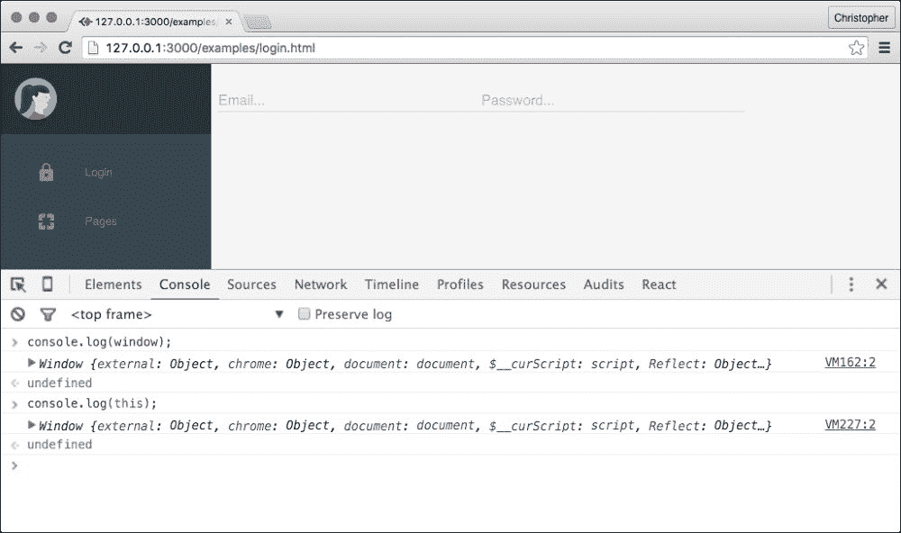
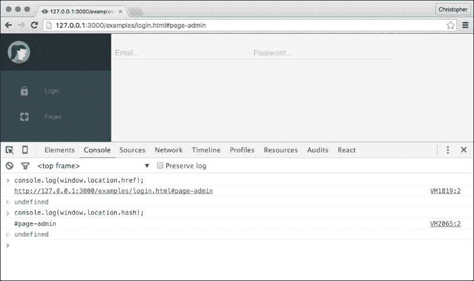
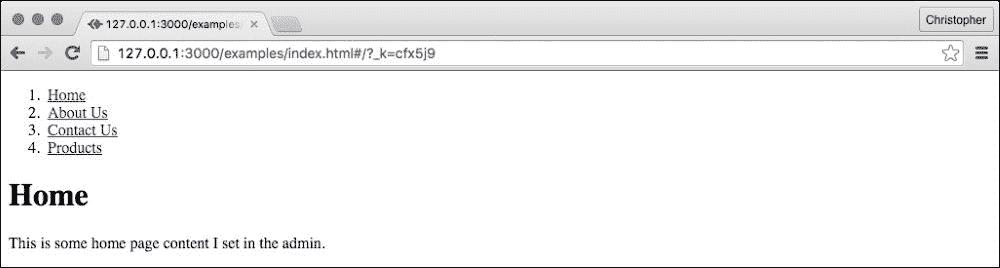

# 第六章。更改视图

在上一章中，我们简要介绍了材料设计，因此我们将登录和页面管理部分分成了不同的文件。我们还没有将登录重定向到页面管理部分。

在本章中，你将学习如何在不重新加载页面的情况下更改部分。我们将使用这些知识来创建我们 CMS 意图控制的网站的公共页面。

我们将了解如何与浏览器的地址栏和位置历史记录一起工作。我们还将学习如何使用流行的库来抽象这些功能，这样我们就可以节省编写样板代码的时间，专注于使我们的界面更加出色！

# 位置，位置，位置！

在我们了解页面重新加载的替代方案之前，让我们看看浏览器是如何管理重新加载的。

你可能已经遇到了 `window` 对象。它是浏览器功能状态的全球通用对象。它也是任何 HTML 页面的默认 `this` 作用域：



我们甚至之前已经访问过 `window`。当我们渲染到 `document.body` 或使用 `document.querySelector` 时，这些属性和方法是在 `window` 对象上被调用的。这和调用 `window.document.querySelector` 是一样的。

大多数情况下，`document` 是我们需要的唯一属性。但这并不意味着它是我们唯一有用的属性。在控制台中尝试以下操作：

```js
console.log(window.location);
```

你应该会看到以下类似的内容：

```js
Location {
    hash: ""
    host: "127.0.0.1:3000"
    hostname: "127.0.0.1"
    href: "http://127.0.0.1:3000/examples/login.html"
    origin: "http://127.0.0.1:3000"
    pathname: "/examples/login.html"
    port: "3000"
    ...
}
```

如果我们试图根据浏览器 URL 来确定要显示哪些组件，这将是一个绝佳的起点。我们不仅可以从这个对象中读取，还可以写入它：

```js
<script>
    window.location.href = "http://material-ui.com";
</script>
```

将此内容放入 HTML 页面或输入控制台中的那一行 JavaScript 代码，将使浏览器重定向到 [www.material-ui.com](http://www.material-ui.com)。这和点击该网站的链接是一样的。而且，如果它重定向到了不同的页面（而不是浏览器指向的页面），那么它将导致整个页面刷新。

## 一点历史

那么，这如何帮助我们呢？毕竟，我们试图避免整个页面的刷新。让我们通过这个对象进行实验。

让我们看看当我们在 URL 中添加类似 `#page-admin` 的内容时会发生什么。



将 `#page-admin` 添加到 URL 中会导致 `window.location.hash` 属性被填充相同的值。更重要的是，更改哈希值不会刷新页面！这和点击具有 `href` 属性中哈希的链接是一样的。我们可以修改它而不会导致整个页面刷新，并且每次修改都会在浏览器历史记录中存储一个新的条目。

使用这个技巧，我们可以不重新加载页面地逐步通过多个不同的状态，并且我们将能够使用浏览器的后退按钮回退每个状态。

## 使用浏览器历史记录

让我们在我们的 CMS 中使用这个技巧。首先，让我们在我们的 `Nav` 组件中添加几个函数：

```js
export default (props) => {
    // ...define class names

 var redirect = (event, section) => {
 window.location.hash = `#${section}`;
 event.preventDefault();
 }

    return <div className={drawerClassNames}>
        <header className="demo-drawer-header">
            
        </header>
        <nav className={navClassNames}>
            <a className="mdl-navigation__link"
               href="/examples/login.html"
               onClick={(e) => redirect(e, "login")}>
                <i className={buttonIconClassNames}
                   role="presentation">
                    lock
                </i>
                Login
            </a>
            <a className="mdl-navigation__link"
               href="/examples/page-admin.html"
               onClick={(e) => redirect(e, "page-admin")}>
                <i className={buttonIconClassNames}
                   role="presentation">
                    pages
                </i>
                Pages
            </a>
        </nav>
    </div>;
};
```

我们给我们的导航链接添加了一个`onClick`属性。我们创建了一个特殊函数，该函数将改变`window.location.hash`并阻止链接可能引起的默认完整页面刷新行为。

### 注意

这是对箭头函数的一个巧妙应用，但我们在每次渲染调用中实际上创建了三个新函数。记住，这可能会很昂贵，所以最好将函数创建移出渲染。我们很快就会替换它。

看到模板字符串的实际应用也很有趣。我们不是使用`"#" + section`，而是可以使用`'#${section}'`来插入 section 名称。在短字符串中，这并不那么有用，但在长字符串中变得越来越有用。

点击导航链接现在会改变 URL hash。我们可以通过在点击导航链接时渲染不同的组件来添加这种行为：

```js
import React from "react";
import ReactDOM from "react-dom";
import Component from "src/component";
import Login from "src/login";
import Backend from "src/backend";
import PageAdmin from "src/page-admin";

class Nav extends Component {
    render() {
        // ...define class names

        return <div className={drawerClassNames}>
            <header className="demo-drawer-header">
                
            </header>
            <nav className={navClassNames}>
                <a className="mdl-navigation__link"
                   href="/examples/login.html"
                   onClick={(e) => this.redirect(e, "login")}>
                    <i className={buttonIconClassNames}
                       role="presentation">
                        lock
                    </i>
                    Login
                </a>
                <a className="mdl-navigation__link"
                   href="/examples/page-admin.html"
                   onClick={(e) => this.redirect(e, "page-admin")}>
                    <i className={buttonIconClassNames}
                       role="presentation">
                        pages
                    </i>
                    Pages
                </a>
            </nav>
        </div>;
    }

 redirect(event, section) {
 window.location.hash = '#${section}';

 var component = null;

 switch (section) {
 case "login":
 component = <Login />;
 break;
 case "page-admin":
 var backend = new Backend();
 component = <PageAdmin backend={backend} />;
 break;
 }

 var layoutClassNames = [
 "demo-layout",
 "mdl-layout",
 "mdl-js-layout",
 "mdl-layout--fixed-drawer"
 ].join(" ");

 ReactDOM.render(
 <div className={layoutClassNames}>
 <Nav />
 {component}
 </div>,
 document.querySelector(".react")
 );

 event.preventDefault();
 }
};

export default Nav;

```

我们不得不将`Nav`函数转换为`Nav`类。我们希望在渲染之外创建重定向方法（因为这样更高效），并且隔离渲染组件的选择。

使用类也给我们提供了一种命名和引用`Nav`组件的方法，因此我们可以在`redirect`方法中创建一个新的实例来覆盖它。将这种代码包装在组件中并不理想，所以我们会稍后清理它。

我们现在可以在不进行完整页面刷新的情况下在不同的部分之间切换。

还有一个问题需要解决。当我们使用浏览器的后退按钮时，组件不会改变以反映每个 hash 应该显示的组件。我们可以通过几种方式解决这个问题。我们可以尝试的第一种方法是频繁检查 hash：

```js
componentDidMount() {
 var hash = window.location.hash;

 setInterval(() => {
 if (hash !== window.location.hash) {
 hash = window.location.hash;
 this.redirect(null, hash.slice(1), true);
 }
 }, 100);
}

redirect(event, section, respondingToHashChange = false) {
 if (!respondingToHashChange) {
 window.location.hash = `#${section}`;
 }

    var component = null;

    switch (section) {
        case "login":
            component = <Login />;
            break;
        case "page-admin":
            var backend = new Backend();
            component = <PageAdmin backend={backend} />;
            break;
    }

    var layoutClassNames = [
        "demo-layout",
        "mdl-layout",
        "mdl-js-layout",
        "mdl-layout--fixed-drawer"
    ].join(" ");

    ReactDOM.render(
        <div className={layoutClassNames}>
            <Nav />
            {component}
        </div>,
        document.querySelector(".react")
    );

 if (event) {
 event.preventDefault();
 }
}
```

我们的`redirect`方法有一个额外的参数，用于在我们不响应 hash 更改时应用新的 hash。我们还包装了对`event.preventDefault`的调用，以防我们没有点击事件可以处理。除了这些更改之外，`redirect`方法保持不变。

我们还在其中添加了一个`componentDidMount`方法，在其中我们调用`setInterval`。我们存储了初始的`window.location.hash`属性，并且每秒检查 10 次是否已更改。hash 值是`#login`或`#page-admin`，所以我们切掉了第一个字符，并将剩余的部分传递给`redirect`方法。

尝试点击不同的导航链接，然后使用浏览器的后退按钮。

第二种选项是使用`window.history`对象上的较新的`pushState`和`popState`方法。它们目前支持得不是很好，所以当你处理旧浏览器时需要小心，或者确保你不需要处理它们。

### 注意

你可以在[`developer.mozilla.org/en-US/docs/Web/API/History_API`](https://developer.mozilla.org/en-US/docs/Web/API/History_API)了解更多关于`pushState`和`popState`的信息。

有一种更简单的方式来响应用户点击链接：`hashchange` 事件。我们不需要给每个链接添加 `onClick` 事件（并且每次都调用 `redirect` 函数），我们可以监听 `hashchange` 事件并切换到相应的视图。关于这个主题有一个很好的教程在 [`medium.com/@tarkus/react-js-routing-from-scratch-246f962ededf`](https://medium.com/@tarkus/react-js-routing-from-scratch-246f962ededf)。

# 使用路由器

我们的哈希代码是功能性的但侵入性的。我们不应该在组件内部（至少不是我们自己的组件）调用 `render` 方法。因此，我们将使用一个流行的路由器来帮我们管理这些。

使用以下命令下载路由器：

```js
$ npm install react-router --save

```

然后，我们需要将 `login.html` 和 `page-admin.html` 放回到同一个文件中：

```js
<!DOCTYPE html>
<html>
    <head>
        <script src="img/browser.js"></script>
        <script src="img/system.js"></script>
        <script src="img/material.min.js"></script>
        <link rel="stylesheet" href="https://storage.googleapis.com/code.getmdl.io/1.0.6/material.indigo-pink.min.css" />
        <link rel="stylesheet" href="https://fonts.googleapis.com/icon?family=Material+Icons" />
        <link rel="stylesheet" href="admin.css" />
    </head>
    <body class="
        mdl-demo
        mdl-color--grey-100
        mdl-color-text--grey-700
        mdl-base">
        <div class="react"></div>
        <script>
            System.config({
                "transpiler": "babel",
                "map": {
                    "react": "/examples/react/react",
                    "react-dom": "/examples/react/react-dom",
 "router": "/node_modules/react-router/umd/ReactRouter"
                },
                "baseURL": "../",
                "defaultJSExtensions": true
            });

 System.import("examples/admin");
        </script>
    </body>
</html>
```

注意我们是如何将 `ReactRouter` 文件添加到导入映射中的？我们将在 `admin.js` 中使用它。首先，让我们定义我们的 `layout` 组件：

```js
import React from "react";
import ReactDOM from "react-dom";
import Component from "src/component";
import Nav from "src/nav";
import Login from "src/login";
import Backend from "src/backend";
import PageAdmin from "src/page-admin";
import {Router, browserHistory, IndexRoute, Route} from "router";

var App = function(props) {
    var layoutClassNames = [
        "demo-layout",
        "mdl-layout",
        "mdl-js-layout",
        "mdl-layout--fixed-drawer"
    ].join(" ");

    return (
        <div className={layoutClassNames}>
            <Nav />
            {props.children}
        </div>
    );
};
```

这创建了我们所使用的页面布局，并允许一个动态的内容组件。每个 React 组件都有一个 `this.props.children` 属性（或者对于函数组件来说是 `props.children`），它是一个嵌套组件的数组。例如，考虑以下组件：

```js
<App>
    <Login />
</App>
```

在 `App` 组件内部，`this.props.children` 将包含一个单独的项目：一个 `Login` 实例。接下来，我们将为想要路由的两个部分定义处理组件：

```js
var LoginHandler = function() {
    return <Login />;
};

var PageAdminHandler = function() {
    var backend = new Backend();
    return <PageAdmin backend={backend} />;
};
```

我们实际上并不需要将 `Login` 包装在 `LoginHandler` 中，但我选择这样做是为了与 `PageAdminHandler` 保持一致。`PageAdmin` 期望一个 `Backend` 实例，因此我们必须像在这个示例中看到的那样进行包装。

现在，我们可以为我们的 CMS 定义路由：

```js
ReactDOM.render(
 <Router history={browserHistory}>
 <Route path="/" component={App}>
 <IndexRoute component={LoginHandler} />
 <Route path="login" component={LoginHandler} />
 <Route path="page-admin" component={PageAdminHandler} />
 </Route>
 </Router>,
    document.querySelector(".react")
);
```

对于根路径 `/`，存在一个单一的根路由。它创建了一个 `App` 实例，因此我们总是得到相同的布局。然后，我们嵌套了一个 `"login"` 路由和一个 `"page-admin"` 路由。这些创建了它们各自组件的实例。我们还定义了 `IndexRoute`，以便登录页面将显示为着陆页。

我们需要从 `Nav` 中移除我们的自定义历史代码：

```js
import React from "react";
import ReactDOM from "react-dom";
import { Link } from "router";

export default (props) => {
    // ...define class names

    return <div className={drawerClassNames}>
        <header className="demo-drawer-header">
            
        </header>
        <nav className={navClassNames}>
 <Link className="mdl-navigation__link" to="login">
                <i className={buttonIconClassNames}
                   role="presentation">
                    lock
                </i>
                Login
 </Link>
 <Link className="mdl-navigation__link" to="page-admin">
                <i className={buttonIconClassNames}
                   role="presentation">
                    pages
                </i>
                Pages
 </Link>
        </nav>
    </div>;
};
```

由于我们不再需要一个单独的 `redirect` 方法，我们可以将类转换回一个声明式组件（`function`）。

注意我们用新的 `Link` 组件替换了锚点组件。这个组件与路由器交互，在我们点击导航链接时显示正确的部分。我们还可以更改路由路径，而无需更新此组件（除非我们同时更改路由名称）。

### 备注

在前一章中，我们将 `index.html` 分割成 `login.html` 和 `page-admin.html`，以便通过更改 URL 来查看这两个部分。在这一章中，我们将它们重新组合在一起，因为我们有一个路由器可以在它们之间切换。你需要做出同样的更改或使用本章的示例代码，以便使示例正常工作。

# 创建公共页面

现在我们能够轻松地在 CMS 各个部分之间切换，我们可以使用同样的技巧来显示我们网站的公共页面。让我们创建一个全新的 HTML 页面专门用于这些：

```js
<!DOCTYPE html>
<html>
    <head>
 <script src="img/browser.js"></script>
 <script src="img/system.js"></script>
    </head>
    <body>
        <div class="react"></div>
        <script>
            System.config({
                "transpiler": "babel",
                "map": {
                    "react": "/examples/react/react",
                    "react-dom": "/examples/react/react-dom",
                    "router": "/node_modules/react-router/umd/ReactRouter"
                },
                "baseURL": "../",
                "defaultJSExtensions": true
            });

            System.import("examples/index");
        </script>
    </body>
</html>
```

这是一个没有材料设计资源的`admin.html`的简化形式。我认为在我们专注于导航的同时，我们可以暂时忽略这些页面的外观。

公共页面是无状态的，因此我们可以为它们使用函数组件。让我们从布局组件开始：

```js
var App = function(props) {
    return (
        <div className="layout">
            <Nav pages={props.route.backend.all()} />
            {props.children}
        </div>
    );
};
```

这与`App`管理组件类似，但它还有一个对`Backend`的引用。然后我们在渲染组件时定义它：

```js
var backend = new Backend();

ReactDOM.render(
    <Router history={browserHistory}>
        <Route path="/" component={App} backend={backend}>
 <IndexRoute component={StaticPage} backend={backend} />
 <Route path="pages/:page" component={StaticPage} backend={backend} />
        </Route>
    </Router>,
    document.querySelector(".react")
);
```

为了使这可行，我们还需要定义`StaticPage`：

```js
var StaticPage = function(props) {
    var id = props.params.page || 1;
    var backend = props.route.backend;

    var pages = backend.all().filter(
        (page) => {
            return page.id == id;
        }
    );

    if (pages.length < 1) {
        return <div>not found</div>;
    }

    return (
        <div className="page">
            <h1>{pages[0].title}</h1>
            {pages[0].content}
        </div>
    );
};
```

这个组件更有趣。我们访问`params`属性，这是一个包含所有为该路由定义的 URL 路径参数的映射。路径中有`:page`（`pages/:page`），所以当我们访问`pages/1`时，`params`对象是`{"page":1}`。

我们还将`Backend`传递给`Page`，这样我们就可以获取所有页面并通过`page.id`进行过滤。如果没有提供`page.id`，则默认为`1`。

过滤后，我们检查是否有任何页面。如果没有，我们返回一个简单的**未找到**信息。否则，我们渲染数组中第一个页面的内容（因为我们期望数组长度至少为`1`）。

现在我们有一个网站公共页面的页面：



我们还可以为每个路由添加`onEnter`和`onLeave`回调函数：

```js
<Route path="pages/:page"
    component={StaticPage}
    backend={backend}
    onEnter={props => console.log("entering")}
    onLeave={() => console.log("leaving")} />
```

当当前路由发生变化时，前一个路由将触发`onLeave`，以及继承链上的每个父组件。一旦所有`onLeave`回调函数被触发，路由器将开始触发继承链下的`onEnter`回调函数。我们没有真正使用很多继承（由于我们的导航很简单），但仍然重要的是要记住`onLeave`是在`onEnter`之前触发的。

如果我们想将任何未保存的数据提交到我们的后端，记录用户通过界面的进度，或者任何可能依赖于用户在网站页面间导航的其他事情，这将很有用。

此外，我们希望在渲染不同页面时进行动画。我们可以将它们与`React.addons.CSSTransitionGroup`结合使用，我们在第四章中见过，*样式和动画组件*。当新的组件在`App`组件内部渲染时，我们将能够以完全相同的方式对它们进行动画。只需在`React.addons.CSSTransitionGroup`组件中包含`div.layout`，你应该就设置好了！

# 摘要

在本章中，你学习了浏览器如何存储 URL 历史记录，以及我们如何操作它以在不进行完整页面刷新的情况下加载不同的部分。它介绍了一些复杂性，但我们还看到了其他替代方案（例如，`hashchange`事件），这些方案在减少复杂性的同时，仍然减少了我们需要执行的完整页面刷新次数。

你还了解了一个流行的 React 路由，并使用它来抽象我们之前必须手动进行的定位跟踪或更改。

在下一章中，你将学习关于服务器端渲染和应用程序结构的内容。
