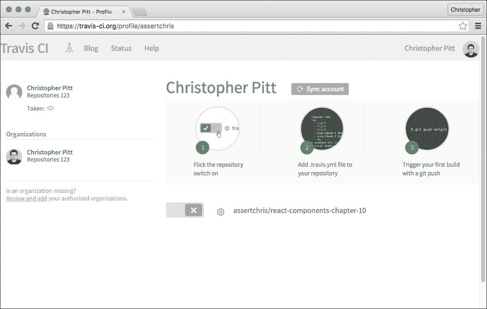

# 第十章。测试组件

在最后一章，我们探讨了使我们的组件对插件开发者友好的方法。我们看到了依赖注入的一些好处以及 AdonisJS Fold 如何帮助我们以最小的努力实现它。

在本章中，我们将学习关于测试——自动化测试、有效测试、在编写代码之前进行测试。我们将学习测试的好处和不同类型的测试。

# 吃你的蔬菜

你真的不喜欢吃某样东西吗？可能是一种蔬菜或水果。当我还是个孩子的时候，有很多我不喜欢吃的食物。我甚至记不起它们是什么味道的，它们也没有伤害到我。我只是下定决心认为它们不好，我不喜欢它们。

一些开发者有类似的习惯。作为开发者，你不喜欢做什么？不是因为它们困难或不好，只是因为...

对我来说，测试就是这样一件事。我在开始编程多年后才了解到测试，而且这仍然是我需要积极努力的事情。我知道为什么它好，为什么反对测试的常见论点是错误的。尽管如此，我仍需要说服自己不断对我的工作进行良好的测试。

我必须学会，仅仅点击界面是不够的，测试除非可以自动运行，否则不是真正的测试，测试除非是持续进行的，否则不是真正有用的，而且测试通常在实施之前作为设计阶段的一部分非常有用。

这里有一些我认为的理由。也许你在学习测试或试图说服人们为什么他们应该为测试制定计划和预算时，会发现它们有用。

### 注意

我无法强调测试的重要性。我们在这里探讨的概念只是冰山一角。如果你真的想了解测试和编写可测试的代码，我强烈推荐你阅读*《代码整洁之道》*（罗伯特·C·马丁著）。

## 通过测试进行设计

测试可以是代码的强大设计工具，就像线框可以是交互式界面的设计工具一样。有时，快速制作你认为可以为你工作的代码原型是好的。但一旦你知道你希望你的代码如何表现，为这种行为编写一些断言是有用的。

把原型放在一边，开始创建一个清单，列出你现在知道你的代码应该具有的行为。也许这是一个好时机让产品负责人参与，因为你实际上创建了一个尚未实现的功能合同。

这种先测试后开发的方法通常被称为**测试驱动开发**（**TDD**）。测试的有用性不在于你是否先编写它们。但如果你先编写它们，它们可以帮助你在项目的关键阶段塑造代码的行为。

## 通过测试进行文档编写

除非你有示例文件夹或广泛的文档，否则测试可能是你展示代码应该做什么以及如何做的唯一方式。

你（或与你代码一起工作的开发者）可能对你的代码应该做什么知之甚少，但如果你编写了好的测试，他们可以从中了解到一些有趣的事情。测试可以揭示函数的参数、函数崩溃的方式，甚至是不再使用的代码。

## 通过测试来睡眠

几乎没有什么事情能像将关键代码更改部署到大型生产系统那样让我感到紧张。你们团队是否遵循“周五永不部署”的规则？如果你有一套好的测试，你就可以毫无畏惧地部署。

测试是发现代码中回归的绝佳方式。想知道你做的更改是否会影响到应用程序的其他部分吗？如果应用程序经过良好的测试，你会在它发生的那一刻就知道。

总结来说，一个好的测试套件将帮助你保持代码按照预期运行，并在你破坏它时通知你。测试是极好的。

### 注意

无论你是在编写应用程序代码之前还是之后编写测试，有测试通常比没有测试要好。你不必遵循 TDD 原则，但它们已被证明可以改善代码的设计。成年人知道在拒绝西兰花之前先尝试一下。

# 测试类型

许多书籍可以（并且已经被）充满测试的复杂性。有很多术语，我们可以讨论很长时间。相反，我想专注于一些我认为对我们最有用的术语。我们可以编写两种常见的测试。

## 单元测试

单元测试是专注于一次一个小型、实际工作单元的测试。给定一个非平凡的类或组件，单元测试将专注于一个方法，甚至只是这个方法的一部分（如果这个方法做了很多事情）。

为了说明这一点，考虑以下示例代码：

```js
class Page extends React.Component {
    render() {
        return (
            <div className="page">
                <h1>{this.props.title}</h1>
                {this.props.content}
            </div>
        );
    }
}

class Pages extends React.Component {
    render() {
        return (
            <div className="pages">
                {this.getPageComponents()}
            </div>
        );
    }

    getPageComponents() {
        return this.props.pages.map((page, key) => {
            return this.getPageComponent(page, key);
        });
    }

    getPageComponent(page, key) {
        return (
            <li key={key}>
                <Page {...page} />
            </li>
        );
    }
}

let pages = [
    {"title": "Home", "content": "A welcome message"},
    {"title": "Products", "content": "Some products"},
];

let component = <Pages pages={pages} />;
```

### 注意

在前面的章节中，我们创建了一个工作流程，可以通过 Node.js 运行 ES6 代码。我建议你为本章的一些代码重新创建这个设置，或者使用像[`jsbin.com/`](http://jsbin.com/)这样的网站。

对于`Page`组件的单元测试可能如下：给定这个组件的一个实例，一个包含标题`"Home"`和内容`"欢迎信息"`的对象，当我调用类似`ReactDOMServer.render`的操作时，我可以看到包含具有相同标题的`h1`元素和一些`data-reactid`属性的标记。

我们测试一个小型、实际的工作单元。在这种情况下，`Page`有一个单一的方法，具有小的关注点。我们可以一次性测试整个组件，确保我们测试的是小而专注的东西。

另一方面，`Pages`的单元测试可能如下：给定一个包含一个包含良好格式化页面对象的`pages`属性的组件实例，当我调用`getPageComponents`时，`getPageComponent`方法对每个页面对象调用一次，每次都带有正确的属性。

我们会为每个方法编写单独的测试，因为它们有不同的焦点和产生不同的结果。我们不会在单元测试中将所有页面一起测试。

## 功能测试

与单元测试相比，功能测试不太关注如此狭窄的焦点。功能测试仍然测试更多区域，但它们不需要像单元测试那样多的单元隔离。我们可以在单个功能测试中测试整个`Pages`组件，例如：给定一个包含一个包含良好格式化页面对象的`pages`属性的组件实例，当我调用类似于`ReactDOMServer.render`的操作时，我看到包含所有页面及其正确属性的标记。

使用功能测试，我们可以在更短的时间内测试更多内容。缺点是错误的原因更难定位。单元测试立即指向较小错误的根源，而功能测试通常只显示功能组没有按预期工作。

### 注意

所有这些都是为了说明——你测试代码越准确、越细致，定位错误原因就越容易。你可以为同一代码编写一个功能测试或 20 个单元测试。因此，你需要平衡可用时间和详细测试的重要性。

# 使用断言进行测试

断言是代码中的口语/书面语言结构。它们看起来和功能与我之前描述的相似。事实上，大多数测试都是按照我们描述测试的方式构建的：

+   给定一些前置条件

+   当发生某些事情时

+   我们可以看到一些后置条件

前两点发生在我们创建对象和组件并调用它们的各种方法时。断言发生在第三点。Node.js 自带一些基本的断言方法，我们可以使用它们来编写我们的第一个测试：

```js
import assert from "assert";

assert(
    rendered.match(/<h1 data-reactid=".*">Home<\/h1>/g)
);

```

我们可以使用相当多的断言方法：

+   `assert(condition), assert.ok(condition)`

+   `assert.equal(actual, expected)`

+   `assert.notEqual(actual, expected)`

+   `assert.strictEqual(actual, expected)`

+   `assert.notStrictEqual(actual, expected)`

+   `assert.deepEqual(actual, expected)`…

+   `assert.notDeepStrictEqual(actual, expected)`

+   `assert.throws(function, type)`

你可以为这些方法的参数添加一个可选的自定义消息字符串。自定义消息将替换每个方法的默认错误消息。

我们可以非常简单地编写这些测试——创建一个`tests.js`文件，导入类和组件，并对它们的方法和标记进行断言。

如果你更喜欢更丰富的语法，考虑安装`assertthat`库：

```js
$ npm install --save-dev assertthat

```

然后，您可以编写类似的测试：

```js
import assert from "assertthat";

assert.that(actual).is.equals.to(expected);
assert.that(actual).is.between(expectedLow, expectedHigh);
assert.that(actual).is.not.undefined();

```

本章的示例代码包括您可以检查和运行的测试。我还创建了一种使用 BabelJS 的方式，可以在测试中使用 ES6 和 JSX。您可以使用以下命令运行测试：

```js
$ npm test

```

这将运行以下定义的 NPM 脚本：

```js
"scripts": {
  "test": "node_modules/.bin/babel-node index.js"
}
```

如果运行后您什么也没看到，请不要惊慌。测试被设置为这样的方式，只有当测试失败时您才会看到错误。如果您没有看到错误，那么一切正常！

## 测试不可变性和幂等性

当我们查看 Flux 和 Redux 时，我们看到的一个有趣的事情是他们推荐使用不可变类型和幂等功能（如在 reducers 中）。如果我们想要测试这些特性，我们可以！让我们安装一个辅助库：

```js
$ npm install --save-dev deep-freeze

```

然后，让我们考虑以下示例：

```js
import { createStore } from "redux";

const defaultState = {
    "pages": [],
};

const reducer = (state = defaultState, action) => {
    if (action.type === "ADD_PAGE") {
        state.pages.push(action.payload);
    }

    return state;
};

let store = createStore(reducer);

store.dispatch({
    "type": "ADD_PAGE",
    "payload": {
        "title": "Home",
        "content": "A welcome message",
    },
});

let state = store.getState();

assert(
    state.pages.filter(page => page.title == "Home").length > 0
);

```

### 注意

如果这对你来说不熟悉，请参阅关于设计模式的章节(第八章，*React 设计模式*)。

在这里，我们有一个示例 reducer、store 和断言。该 reducer 处理单个动作——添加新页面。当我们向 store 发送`ADD_PAGE`动作时，reducer 会将新页面添加到`pages`状态数组中。这个 reducer 不是幂等的——它不能使用相同的输入运行并总是产生相同的输出。

我们可以通过冻结默认状态来查看这一点：

```js
import freeze from "deep-freeze";

const defaultState = freeze({
    "pages": [],
});

```

当我们运行这个时，我们应该会看到一个错误，例如`无法添加属性 0，对象不可扩展`。请记住，我们可以通过从我们的 reducer 返回一个新的、修改后的状态对象来解决这个问题：

```js
const reducer = (state = defaultState, action) => {
    if (action.type === "ADD_PAGE") {
        let pages = state.pages;

        pages = [
            ...pages,
            action.payload,
        ];
    }

    return {
        "pages": pages,
    };
};
```

现在，我们可以发送相同的动作并总是得到相同的结果。我们不再就地修改状态，而是返回一个新的、修改后的状态。幂等性和不可变性的具体细节在其他地方有更好的解释；但重要的是要注意我们如何测试幂等性。

我们可以冻结我们想要保持幂等的对象/数组，并确信我们没有修改我们不希望修改的东西。

## 连接到 Travis

有测试是迈向更好代码的伟大第一步，但经常运行它们也很重要。有许多方法可以做到这一点（例如 Git 钩子或构建步骤），但我更喜欢将我的项目连接到*Travis*。

Travis 是一个持续集成服务，这意味着 Travis 会监视 GitHub 仓库([`github.com`](https://github.com))中的更改，并为这些更改触发测试。


### 注意

我们将探讨如何将 Travis 连接到 GitHub 仓库，这意味着我们需要一个已经设置好的 GitHub 仓库。我不会详细介绍如何使用 GitHub，但您可以在[`guides.github.com/activities/hello-world`](https://guides.github.com/activities/hello-world)找到一个优秀的教程。

您可以通过登录 GitHub 账户并点击一个**使用 GitHub 登录**按钮来登录 Travis。将鼠标悬停在您的个人资料上，然后点击**账户**：



启用你希望 Travis 检查的仓库。此外，你还需要创建一个名为`.travis.yml`的配置文件：

```js
language: node_js

node_js:
  - "5.5"
```

这告诉 Travis 将此项目作为 Node.js 项目进行测试，并针对版本 5.5 进行测试。默认情况下，Travis 将在任何测试之前运行`npm install`。它还会运行`npm test`来执行实际的测试。我们可以通过在`package.json`中添加以下内容来启用此命令：

```js
"scripts": {
  "test": "node run.js"
}
```

### 注意

如果你将测试放在了另一个文件中，你需要调整该命令以反映你运行测试时输入的内容。这不过是一个常见的别名。

在你将代码提交到你的仓库后，Travis 应该会为你测试这些代码。


### 注意

你可以在[`docs.travis-ci.com/user/for-beginners`](https://docs.travis-ci.com/user/for-beginners)了解更多关于 Travis 的信息。

## 端到端测试

你可能还希望尝试以普通用户的方式测试你的应用程序。当你点击你正在开发的应用程序以检查你刚刚输入的内容是否按预期工作的时候，你已经在做这件事了。为什么不自动化这个过程呢？

有很多这样的工具。我最喜欢使用的是名为*Protractor*的工具。设置起来可能有点棘手，但关于这个主题有一个非常优秀的教程，可以在[`www.joelotter.com/2015/04/18/protractor-reactjs.html`](http://www.joelotter.com/2015/04/18/protractor-reactjs.html)找到。

# 摘要

在本章中，你了解了编写测试和经常运行测试的好处。我们为我们的类和组件创建了一些测试，并对它们的行为做出了断言。

我们现在已经涵盖了我想与你分享的所有主题。希望它们为你提供了开始自信地创建界面的所有工具。我们一起学到了很多；涵盖了单组件设计和管理状态、组件如何相互通信（通过如上下文这样的方式）、如何构建和装饰整个系统，甚至如何对其进行测试。

React 社区才刚刚开始，你可以加入其中并影响它。你所需要做的只是花一点时间用 React 构建一些东西，并与他人分享你的经验。
