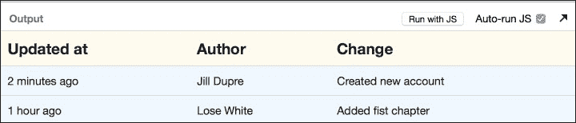
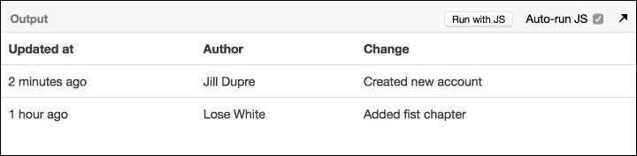

# 第二章 JSX 深入

在第一章中，我们使用 React 构建了我们的第一个组件。我们看到了使用 JSX 如何使开发变得简单。在本章中，我们将深入探讨 JSX。

**JavaScript XML** (**JSX**) 是一种 XML 语法，用于在 React 组件中构建标记。React 可以不使用 JSX 工作，但使用 JSX 可以使阅读和编写 React 组件以及对其结构化变得容易，就像任何其他 HTML 元素一样。

在本章中，我们将涵盖以下要点：

+   为什么使用 JSX？

+   将 JSX 转换为 JavaScript

+   指定 HTML 标签和 React 组件

+   多个组件

+   不同类型的 JSX 标签

+   在 JSX 中使用 JavaScript 表达式

+   命名空间组件

+   属性展开

+   CSS 样式和 JSX

+   JSX 的注意事项

在本章结束时，我们将熟悉 JSX 语法，如何与 React 一起使用它，以及使用它的最佳实践。我们还将研究一些在使用 JSX 时可能会遇到的一些边缘情况。

# 为什么使用 JSX？

肖恩第一天过得很愉快，他在 Adequate Consulting 正在开始新的一天。拿着一杯咖啡，他惊醒了迈克。

"嗨，迈克，我看到我们用 JSX 构建了我们的第一个组件。为什么我们要使用 JSX，当 React 有 `React.createElement` 时呢？"

"您可以在不使用 JSX 的情况下使用 React。但 JSX 使构建 React 组件变得容易。它减少了编写代码所需的数量。它看起来像 HTML 标记。其语法简单简洁，并且很容易可视化正在构建的组件。"

"以一个不使用 JSX 的组件的渲染函数为例。"

```js
// render without JSX
render: function(){
    return(React.createElement("div", 
                               null, 
                               "Hello React World!"));
}
```

"有了 JSX，看起来好多了。"

```js
// render with JSX
render: function(){
    return <div>
      Hello React World
    </div>;
  }
```

"与之前的非 JSX 示例相比，JSX 代码的阅读性更好，易于理解，并且接近实际的 HTML 标记。"

"JSX 和 HTML 标记之间的相似性意味着团队中的非开发者，如 UI 和 UX 设计师，可以使用 JSX 为项目做出贡献。拥有类似 XML 的标签语法也使得阅读大型组件树比 JavaScript 中的函数调用或对象字面量更容易。" 迈克解释道。

"是的，语法看起来很熟悉。我们将在我们的项目中全程使用 JSX，对吧？"

"是的，我们会"，迈克说道。

# 将 JSX 转换为 JavaScript

"肖恩，正如我提到的，JSX 被转换成原生 JavaScript 语法。"

```js
// Input (JSX):
var app = <App name="Mike" />;
```

"这最终会被转换成"

```js
// Output (JS):
var app = React.createElement(App, {name:"Mike"});
```

### 小贴士

**下载示例代码**

您可以从您在 [`www.packtpub.com`](http://www.packtpub.com) 的账户中下载本书的示例代码文件。如果您在其他地方购买了此书，您可以访问 [`www.packtpub.com/support`](http://www.packtpub.com/support) 并注册以直接将文件通过电子邮件发送给您。

您可以通过以下步骤下载代码文件：

+   使用您的电子邮件地址和密码登录或注册我们的网站。

+   将鼠标指针悬停在顶部的 **SUPPORT** 选项卡上。

+   点击 **代码下载与勘误**。

+   在 **搜索** 框中输入书籍名称。

+   选择您想要下载代码文件的书籍。

+   从下拉菜单中选择您购买此书的来源。

+   点击**代码下载**。

文件下载后，请确保使用最新版本解压或提取文件夹：

+   WinRAR / 7-Zip for Windows

+   Zipeg / iZip / UnRarX for Mac

+   7-Zip / PeaZip for Linux

"如果你想看到这个实时演示，请尝试这个示例[`babeljs.io/repl/`](https://babeljs.io/repl/)。这是一个实时 REPL，可以将 JSX 代码转换为原生 JavaScript 代码。"

"还有一个编辑器可以将 HTML 转换为 JSX。你可以在[`facebook.github.io/react/html-jsx.html`](http://facebook.github.io/react/html-jsx.html)查看它。这允许你粘贴任意 HTML 代码，该代码会被转换为 JSX，并提取样式、类和其他信息，然后在此基础上创建一个组件。" 迈克说。

"非常方便。然而，这只是为了开发方便，对吧？当我们部署我们的代码时会发生什么？" 肖恩问道。

"JSX 不是用来在运行时编译的。尽管有一个 JSX 转换器可以在浏览器中将 JSX 转换为 JavaScript。在浏览器中用它来编译 JSX 会减慢我们的应用程序。我们将使用像 Babel 这样的工具，它是一个 JavaScript 编译器，在部署应用程序之前将我们的 JSX 代码转换为原生 JavaScript 代码。"

# HTML 标签与 React 组件

"迈克，我对另一件事很感兴趣。在 JSX 中，我们就像简单的 HTML 标签一样混合 React 组件。我们在第一个组件中就是这样做的。"

```js
ReactDOM.render(<App headings = {['When', 'Who', 'Description']} 
                     data = {data} />, 
             document.getElementById('container'));
```

"这里的`App`标签不是一个有效的 HTML 标签。但这仍然有效。"

"是的。这是因为我们可以在 JSX 中指定 HTML 标签和 React 组件。不过，这里有一个细微的区别。HTML 标签以小写字母开头，而 React 组件以大写字母开头。" 迈克解释道。

```js
// Specifying HTML tags
render: function(){
    return(<table className = 'table'>
           .....
           </table>);
}

// Specifying React components
var App = React.createClass({..});
ReactDOM.render(<App headings = {['When', 'Who', 'Description']}  
                     data = {data} />, 
                document.getElementById('container'));
```

"这是主要区别。JSX 使用这个约定来区分本地组件类和 HTML 标签。"

# 自闭合标签

"迈克补充说，你肯定注意到了在`ReactDOM.render`中组件标签是如何关闭的。"

```js
ReactDOM.render(<App .../>, document.getElementById('container'));
```

"由于 JSX 基于 XML，它允许添加自闭合标签。所有组件标签都必须以自闭合格式或闭合标签结束。"

"谢谢迈克！现在事情变得更有意义了。"

# 多个组件

"肖恩，让我们回到我们的应用程序。我们几乎使用了上次相同的代码，但你可以设置一个新的 JSBin。我们在 HTML 标签中包含了最新的 React 库和 bootstrap 库。我们还添加了一个容器元素，我们将在这里渲染我们的 React 应用程序。"

```js
<!DOCTYPE html>
<html>
  <head>
    <script src="img/jquery.min.js"></script>
    <link href="https://netdna.bootstrapcdn.com/twitter-bootstrap/2.3.2/css/bootstrap-combined.min.css" rel="stylesheet" type="text/css" />
    <script src="img/bootstrap.min.js"></script>
    <script src="img/"></script>
    <script src="img/"></script>
    <meta charset="utf-8">
    <meta name="viewport" content="width=device-width">
    <title>JSX in Detail</title>
  </head>
  <body>
    <div id="container">
    </div>
  </body>
</html>
```

"目前，我们只使用单个组件来显示最近更改 API 的数据。"

```js
var App = React.createClass({
  render: function(){
    var headings = this.props.headings.map(function(heading) {
      return(<th>
        {heading}
      </th>);
    });

    var rows = this.props.data.map(function(row){
      return  <tr>
        <td>{row.when}</td>
        <td>{row.who}</td>
        <td>{row.description}</td>
      </tr>

    })
      return <div><h1>{this.props.title}</h1><table>
        <thead>
          {headings}
        </thead>
        {rows}
      </table></div>
  }
});
```

"让我们将这个单个组件拆分成小的可组合组件。这些简单的模块化组件将使用其他模块化组件，这些组件具有定义良好的自包含接口。"

"明白了" 肖恩说。

"好的。第一步是尝试识别我们单个组件中存在的不同组件。"

"目前，我们的渲染方法将`tableHeadings`和`tableRows`作为表格元素的子元素列出。"

```js
return(<table>
             {tableHeadings}
             {tableRows}
       </table>);
```

"我想我们将为标题和行创建组件？" 肖恩问道。

"是的。但我们可以更进一步。标题和行都是更小单元的列表，分别是`Heading`和`Row`标签。它可以这样可视化："

```js
<table>
  <Headings>
    <Heading/>
    <Heading/>
  </Headings>
  <Rows >
    <Row/>
    <Row/>
  </Rows>
</table>
```

"有道理，迈克。我现在尝试创建`Heading`。"

"当然，继续吧。"

```js
var Heading = React.createClass({
  render: function() {
    return(<th>{heading}</th>);
  }
});
```

"迈克，我认为这会起作用，除了标题。我不确定如何在`<th>`标签中渲染实际的标题。"

"不用担心。我们只需假设它将被作为 props 传递给`Heading`组件。"

"当然。这是`Heading`组件的代码："

```js
var Heading = React.createClass({
  render: function() {
    return(<th>{this.props.heading}</th>);
  }
}); 
```

"太好了！`Row`组件也将类似于`Heading`。它将在其 props 中获取`changeSet`对象。"

```js
var Row = React.createClass({
  render: function() {
    return(<tr>
             <td>{this.props.changeSet.when}</td>
             <td>{this.props.changeSet.who}</td>
             <td>{this.props.changeSet.description}</td>
          </tr>);
  }
});
```

"肖恩，我们已经完成了最低级别的组件。现在，是时候提升一个层次了。让我们先构建`Headings`。"

"类似于`Heading`组件将通过 props 获取其标题，`Headings`将获取传递给它的标题列表。"

```js
var Headings = React.createClass({
  render: function() {
    var headings = this.props.headings.map(function(heading) {
      return(<Heading heading = {heading}/>);
    });

   return (<thead><tr>{headings}</tr><thead>);
  }
});
```

"我们正在遍历标题列表，并将它们转换为`Heading`组件的列表。`Headings`组件控制如何将 props 传递给单个`Heading`组件。从某种意义上说，单个`Heading`组件是`Headings`的拥有者。" 迈克解释道。

"在 React 中，拥有者是指设置其他组件 props 的组件。我们也可以说，如果 X 组件存在于 Y 组件的`render()`方法中，那么 Y 就拥有 X。" 迈克进一步补充道。

"肖恩，去构建一个类似于`Headings`的`Rows`组件。"

"给你："

```js
var Rows = React.createClass({
  render: function() {
    var rows = this.props.changeSets.map(function(changeSet) {
      return(<Row changeSet = {changeSet}/>);
    });
    return ({rows});
  }
});
```

"只有一个问题。你不能渲染行，因为它是一组组件的集合。记住，`render()`函数只能渲染一个标签。" 迈克说。

"我想我应该将行包裹在`<tbody>`标签中。" 肖恩说。

```js
var Rows = React.createClass({
  render: function() {
    var rows = this.props.changeSets.map(function(changeSet) {
      return(<Row changeSet = {changeSet}/>);
    });

    return (<tobdy>{rows}</tbody>);
  }
});
```

"太好了。我们现在几乎有了所有东西。让我们通过添加顶级的`App`组件来完成它。"

```js
var App = React.createClass({
  render: function(){
    return <table className = 'table'>
             <Headings headings = {this.props.headings} />
             <Rows changeSets = {this.props.changeSets} />
           </table>;
    }
});
```

"现在我们的完整代码看起来是这样的："

```js
var Heading = React.createClass({
  render: function() {
    return <th>{this.props.heading}</th>;
  }
});

var Headings = React.createClass({
  render: function() {
    var headings = this.props.headings.map(function(name) {
      return <Heading heading = {name}/>;
    });
   return <thead><tr>{headings}</tr></thead>;
  }
});

var Row = React.createClass({
  render: function() {
    return <tr>
             <td>{this.props.changeSet.when}</td>
             <td>{this.props.changeSet.who}</td>
             <td>{this.props.changeSet.description}</td>
           </tr>;
  }
});

var Rows = React.createClass({
  render: function() {
    var rows = this.props.changeSets.map(function(changeSet) {
      return(<Row changeSet = {changeSet}/>);
    });
    return <tbody>{rows}</tbody>;
  }
});

var App = React.createClass({
  render: function() {
    return <table className = 'table'>
             <Headings headings = {this.props.headings} />
             <Rows changeSets = {this.props.changeSets} />
           </table>;
    }
});

var data = [{ "when": "2 minutes ago",
              "who": "Jill Dupre",
              "description": "Created new account"
            },
            {      
              "when": "1 hour ago",
              "who": "Lose White",
              "description": "Added fist chapter"
           }];
var headings = ['When', 'Who', 'Description'];

ReactDOM.render(<App headings = {headings} 
                     changeSets = {data} />, 
                                      document.getElementById('container')); 
```

"肖恩，我想你现在已经理解了组件的可组合性力量。这使得我们的 UI 易于推理和重用以及组合。我们将在整个 React 中使用这种哲学。"

"我同意。每个组件都做了一件事，最终，它们都被组合在一起，从而构建了整个应用程序。代码的不同部分被分离，这样它们就不会相互干扰。"

# JavaScript 表达式

"肖恩，让我们讨论一下我们是如何渲染`Rows`和`Headings`标签的。"

```js
render: function() {
    var headings = this.props.headings.map(function(name) {
      return(<Heading heading = {name}/>);
    });

   return <tr>{headings}</tr>;
  }
```

"我们正在直接通过在`<tr>`标签的子元素中添加花括号来渲染`{headings}`，这是一个 React 组件列表。用于指定子组件的表达式被称为子表达式。"

"还有一种称为 JavaScript 表达式的表达式类别。这些是用于传递 props 或评估一些可以用作属性值的 JavaScript 代码的简单表达式。"

```js
// Passing props as expressions
ReactDOM.render(<App headings = {['When', 'Who', 'Description']} 
                  data = {data} />, 
                document.getElementById('container'));

// Evaluating expressions
ReactDOM.render(<App headings = {['When', 'Who', 'Description']} 
                  data = {data.length > 0 ? data : ''} />, 
                document.getElementById('container'));
```

"任何在花括号中的内容都会被 JSX 评估。它适用于子表达式以及 JavaScript 表达式。" 迈克补充道。

"感谢详细的解释。不过，我有一个疑问。在 JSX 代码中写注释有办法吗？我的意思是，我们可能并不总是需要它，但知道如何添加注释可能很有用。" 肖恩问道。

"记住花括号规则。注释只是简单的 JavaScript 表达式。当我们处于子元素中时，只需将注释放在花括号中。"

```js
render: function() {
    return(<th> 
             {/* This is a comment */}
             {this.props.heading}
           </th>);
  }
```

"你还可以在 JSX 标签中添加注释。在这种情况下，没有必要将它们放在花括号中。" 迈克补充道。

```js
ReactDOM.render(<App 
                  /* Multi
                     Line 
                     Comment
                  */
                  headings = {headings} 
                  changeSets = {data} />, 
                document.getElementById('container'));
```

# 命名空间组件

"肖恩，你一定在 Ruby 和 Java 等语言中使用过模块和包。这些概念背后的想法是创建一个代码的命名空间层次结构，使得一个模块或包中的代码不会干扰另一个模块或包。"

"是的。React 中有类似的东西吗？" 肖恩问道。

"是的。React 允许创建在父组件下命名的组件，这样它们就不会干扰其他组件或全局函数。"

"我们正在使用非常通用的名称，如 Rows 和 Headings，这些名称可以在应用程序的其他部分使用。因此，现在命名空间它们比以后命名空间它们更有意义。" 迈克解释说。

"同意。我们立刻这么做。" 肖恩说。

"我们需要将顶层组件表示为自定义组件，而不是使用 `<table>` 元素。"

```js
var RecentChangesTable = React.createClass({
  render: function() {
    return <table>
             {this.props.children}
           </table>;
  } 
});
```

"现在，我们可以将 `App` 组件替换为使用 `RecentChangesTable` 而不是 `<table>`。"

```js
var App = React.createClass({
  render: function(){
    return(<RecentChangesTable>
                <Headings headings = {this.props.headings} />
                <Rows changeSets = {this.props.changeSets} />
           </RecentChangesTable>);
    }
});
```

"等等，迈克。我们刚刚用自定义组件替换了 `<table>`。它所做的只是渲染 `this.props.children`。它是如何获取所有标题和行的？" 肖恩问道。

"啊！很好的观察。React 默认情况下，会捕获组件打开和关闭标签之间的所有子节点，并将它们作为一个数组添加到该组件的 props 中，作为 `this.props.children`。因此，我们可以使用 `{this.props.children}` 来渲染它。在 `RecentChangesTable` 组件中，我们将得到所有标题和行作为 `this.props.children`。输出与之前使用 `<table>` 标签时相同。"

"太棒了！" 肖恩兴奋地喊道。

"太好了。让我们继续下一步，将所有其他组件在 `RecentChangesTable` 下命名空间。"

```js
RecentChangesTable.Headings = React.createClass({
  render: function() {
    var headings = this.props.headings.map(function(name) {
      return(<RecentChangesTable.Heading heading = {name}/>);
    });

   return (<thead><tr>{headings}</tr></thead>);
  }
});

RecentChangesTable.Heading = React.createClass({
  render: function() {
    return(<th>
             {this.props.heading}
           </th>);
  }
});

RecentChangesTable.Row = React.createClass({
  render: function() {
    return(<tr>
             <td>{this.props.changeSet.when}</td>
             <td>{this.props.changeSet.who}</td>
             <td>{this.props.changeSet.description}</td>
          </tr>);
  }
});

RecentChangesTable.Rows = React.createClass({
  render: function() {
    var rows = this.props.changeSets.map(function(changeSet) {
      return(<RecentChangesTable.Row changeSet = {changeSet}/>);
    });

    return (<tbody>{rows}</tbody>);
  }
});
```

"我们现在还需要更新 `App` 组件，以使用命名空间组件。"

```js
var App = React.createClass({
  render: function(){
    return(<RecentChangesTable>
                 <RecentChangesTable.Headings headings = {this.props.headings} />
                 <RecentChangesTable.Rows changeSets = {this.props.changeSets} />
               </RecentChangesTable>);
    }
});
```

"我们现在完成了。现在，所有内容都在 `RecentChangesTable` 的命名空间下。" 迈克说。

# 属性展开

肖恩学到了很多关于 JSX 的知识，但在反思之前的步骤时，他又提出了另一个问题。

"迈克，到目前为止，我们只是向 `App` 组件传递了两个 props：`headings` 和 `changesets`。然而，明天这些 props 可以增加到任意数量。逐个传递它们可能会很繁琐。特别是，当我们需要直接从最近更改的 API 传递一些数据时。这将很难跟踪传入数据的结构，并相应地在 props 中传递。有没有更好的方法？"

"另一个出色的问题，肖恩。是的，逐个传递大量属性给组件可能会有些繁琐。但我们可以使用 `spread` 属性来解决这个问题。"

```js
var props = { headings: headings, changeSets: data, timestamps: timestamps };
ReactDOM.render(<App {...props } />, 
                     document.getElementById('container'));
```

"在这种情况下，对象的所有属性都作为 props 传递给 `App` 组件。我们可以传递任何可以包含任意数量键值对的任何对象，并且所有这些都会作为 props 传递给组件" 迈克解释道。

"非常酷。`(…)` 运算符只存在于 JSX 中吗？"

"不，它实际上是基于 ES2015 中的扩展属性特性，这是下一个 JavaScript 标准。ES2015，或称为 ES6，在 JavaScript 语言中引入了一些新特性，React 正在利用这些发展中的标准，以便在 JSX 中提供更干净的语法" 迈克补充道。

### 注意

ES2015 已经支持数组使用扩展运算符，详情请见 [`developer.mozilla.org/en-US/docs/Web/JavaScript/Reference/Operators/Spread_operator`](https://developer.mozilla.org/en-US/docs/Web/JavaScript/Reference/Operators/Spread_operator)。对于对象也有一个提案，请见 [`github.com/sebmarkbage/ecmascript-rest-spread`](https://github.com/sebmarkbage/ecmascript-rest-spread)。

"不仅如此，散列属性可以多次使用，或者可以与其他属性结合使用。不过，属性的顺序很重要。新属性会覆盖之前的属性。"

```js
var data = [{ "when": "2 minutes ago",
              "who": "Jill Dupre",
              "description": "Created new account"
            },
            {
              "when": "1 hour ago",
              "who": "Lose White",
              "description": "Added fist chapter"
            }];
var headings = ['When', 'Who', 'Description'];

var props = { headings: headings, changeSets: data };

ReactDOM.render(<App {...props} headings = {['Updated at ', 'Author', 'Change']} />, document.getElementById('container'));
```

"在这种情况下，将显示 **When**、**Who** 和 **Description**，而 **Updated at**、**Author** 和 **Change** 将作为标题显示" 迈克解释说。



### 注意

ES2015 或 ES6 是最新的 JavaScript 标准版本。它有很多特性，这些特性被 React 使用，类似于扩展运算符。在接下来的章节中，我们将使用更多的 ES2015 或 ES6 代码。

# JSX 中的样式

"迈克，我们今天所做的一切都非常酷。我们什么时候开始添加样式？我怎样才能让这个页面看起来更漂亮？现在它有点单调。" 肖恩问道。

"啊，对了。我们就这样做。React 允许我们以与传递 props 相同的方式传递样式。例如，我们想让我们的标题颜色为花白色，也许我们还想改变字体大小。我们将以典型的 CSS 方式表示如下："

```js
background-color: 'FloralWhite',
font-size: '19px';
```

"我们可以用驼峰式表示法将其表示为一个 JavaScript 对象。"

```js
    var headingStyle = { backgroundColor: 'FloralWhite',
                         fontSize: '19px' 
                       };
```

然后，我们可以在每个标题组件中将其用作一个 JavaScript 对象。"

```js
RecentChangesTable.Heading = React.createClass({
  render: function() {
    var headingStyle = { backgroundColor: 'FloralWhite',
                         fontSize: '19px' };
    return(<th style={headingStyle}>{this.props.heading}</th>);
  }
});
```

"同样，让我们改变行以拥有它们自己的样式。"

```js
  RecentChangesTable.Row = React.createClass({
  render: function() {
  var trStyle = { backgroundColor: 'aliceblue' };
    return <tr style={trStyle}>
                <td>{this.props.changeSet.when}</td>
                <td>{this.props.changeSet.who}</td>
                <td>{this.props.changeSet.description}</td>
            </tr>;
  }
});
```

"我们现在有一些闪闪发光的新标题和行，它们被 CSS 样式所点缀" 迈克补充道。



"好的。传递这些样式的属性名必须是 'style'，对吧？" 肖恩问道。

"是的。此外，这个样式对象的键也需要使用驼峰式命名，例如，`backgroundColor`、`backgroundImage`、`fontSize` 等等。"

"迈克，我理解了内联样式，但是如何添加 CSS 类？"

"啊，对了。我们可以将类名作为属性传递给 DOM 标签。让我们将样式提取到一个新的 `recentChangesTable` CSS 类中。"

```js
// css
recentChangesTable {
  background-color: 'FloralWhite',
  font-size: '19px'
}
```

"现在，为了将这个类应用到我们的组件上，我们只需要使用解释过的 `className` 属性将其传递给组件。"

```js
render: function(){
    return <table className = 'recentChangesTable'>
             <Headings headings = {this.props.headings} />
             <Rows changeSets = {this.props.changeSets} />
           </table>;
    }
});
```

"正如我们之前所看到的，React 使用驼峰式属性。在这里，当 React 渲染实际的 HTML 时，`className` 属性将被转换为正常的类属性。"

```js
<table class = 'recentChangesTable'> 
…
</table>
```

"我们也可以将多个类传递给 `className` 属性。"

```js
<table className = 'recentChangesTable userHeadings'>
```

"就这样！我们可以在我们的组件中自由地使用样式。这使得将 React 与现有的 CSS 样式集成变得非常简单。"

# JSX 的注意事项

"那天即将结束。迈克和肖恩还在讨论这个闪亮的新事物——JSX。迈克决定是时候告诉肖恩使用 JSX 的问题了。"

"肖恩，你对使用 JSX 感觉如何？"

"到目前为止，我很喜欢它。它与 HTML 标记非常相似。我可以传递属性、样式，甚至类。我还可以使用所有的 DOM 元素。" 肖恩解释说。

"是的。但是 JSX 不是 HTML。我们一定要记住这一点。否则，我们可能会遇到麻烦。"

"例如，如果你想传递一些在 HTML 规范中不存在的自定义属性，那么 React 将简单地忽略它。"

```js
// custom-attribute won't be rendered
<table custom-attribute = 'super_awesome_table'>
</table>
```

"它必须作为数据属性传递，这样 React 才会渲染它。"

```js
// data-custom-attribute will be rendered
<table data-custom-attribute = 'super_awesome_table'>
</table>
```

"在动态渲染 HTML 内容时，我们可能会遇到一些问题。在 JSX 标签中，我们可以直接添加一个有效的 HTML 实体。"

```js
// Using HTML entity inside JSX tags.
<div> Mike &amp; Shawn </div>
// will produce
 React.createElement("div", null, " Mike & Shawn ")
```

"但是如果我们用动态表达式渲染它，它就会逃逸掉 ampersand。"

```js
// Using HTML entity inside dynamic expression
var first = 'Mike';
var second = 'Shawn';
<div> { first + '&amp;' + second } </div>

var first = 'Mike';
var second = 'Shawn';
React.createElement("div", null, " ", first + '&amp;' + second, " ")
```

"React 默认会转义所有字符串，以防止 XSS 攻击。为了克服这个问题，我们可以直接传递 `&amp;` 的 Unicode 字符，或者我们可以使用字符串数组和 JSX 元素。" 迈克解释说。

```js
// Using mixed arrays of JSX elements and normal variables
<div> {[first, <span>&amp;</span>, second]} </div>

React.createElement("div", null, " ", [first, 
                                   React.createElement("span", null, "&"), second], " ")
```

"哇。这可能会变得相当混乱" 肖恩表示。

"嗯，是的，但是如果我们记住规则，那么这很简单。而且，作为最后的手段，React 也允许使用特殊的 `dangerouslySetInnerHTML` 属性来渲染原始 HTML。"

```js
// Rendering raw HTML directly
<div dangerouslySetInnerHTML={{__html: 'Mike &amp; Shawn'}} />
```

"迈克解释说，尽管这个选项应该在考虑了渲染内容之后使用，以防止 XSS 攻击。"

# JSX 中的条件

"React 赞同将标记和生成标记的逻辑联系在一起的想法。这意味着我们可以使用 JavaScript 的循环和条件语句的强大功能。"

"但是，在标记中表达 if/else 逻辑有点困难。因此，在 JSX 中，我们不能使用 if/else 这样的条件语句。"

```js
// Using if/else directly doesn't work
<div className={if(success) { 'green' } else { 'red' }}/>
Error: Parse Error: Line 1: Unexpected token if
```

"相反，我们可以使用三元运算符来指定 if/else 逻辑。"

```js
// Using ternary operator
<div className={ success ? 'green' : 'red' }/>
React.createElement("div", {className:  success ? 'green' : 'red'})
```

"但是，当我们要使用 React 组件作为子组件时，大型表达式使用三元运算符会变得繁琐。在这种情况下，将逻辑卸载到块或函数中会更好。" 迈克补充说。

```js
// Moving if/else logic to a function
var showResult = function() {
  if(this.props.success === true)
    return <SuccessComponent />
  else
    return <ErrorComponent />
};
```

# 非 DOM 属性

"好吧，肖恩，是时候再次详细查看我们的应用程序了。如果你仔细查看控制台输出，你会看到一些与键相关的警告。"

```js
"Each child in an array should have a unique \"key\" prop. Check the render method of Rows. See http://fb.me/react-warning-keys for more information."
```

"在`Rows`组件的`render()`方法中，我们正在渲染`Row`组件的集合。"

```js
RecentChangesTable.Rows = React.createClass({
  render: function() {
    var rows = this.props.changeSets.map(function(changeSet) {
      return(<Row changeSet = {changeSet}/>);
    });

    return <tbody>{rows}</tbody>;
  }
});
```

"在渲染列表项期间，根据用户交互，组件可能在 DOM 树中上下移动。例如，在搜索或排序的情况下，列表中的项可以改变其位置。如果获取到新数据，新项也可以添加到列表的前面。在这种情况下，React 可能会根据 diff 算法删除并重新创建组件。但如果我们为列表中的每个元素提供一个唯一的标识符，那么 React 将智能地决定是否销毁它。这将提高渲染性能。这可以通过将唯一的`key`属性传递给列表中的每个项来实现。"

在我们这个例子中，行数目前是固定的。但稍后，我们希望在从 API 获取新数据时显示更新页面。当动态添加或删除子组件时，情况会变得复杂，因为每个组件的状态和标识必须在每次渲染过程中保持不变。`key`属性将帮助 React 在这种情况下唯一地识别组件。迈克进一步解释说：“继续使用`Row`组件的索引来完成这个目的，因为现在它是唯一的。”

"很好。那么让我尝试给`Rows`组件添加`key`属性。我也注意到`Headings`组件也存在相同的问题，因此，我将为`Headings`也添加一个键。" 肖恩说。

```js
RecentChangesTable.Rows = React.createClass({
  render: function() {
    var rows = this.props.changeSets.map(function(changeSet, index) {
      return(<Row key={index} changeSet = {changeSet}/>);
    });

    return (<div>{rows}</div>);
  }
});
RecentChangesTable.Headings = React.createClass({
  render: function() {
    var headings = this.props.headings.map(function(name, index) {
      return(<RecentChangesTable.Heading key={index} heading = {name}/>);
    });

    return (<thead><tr>{headings}</tr></thead>);
  }
});
```

"完美。请注意，给定列表的键值应该是唯一的。当我们开始根据动态数据更新 DOM 时，我们将了解更多关于键的信息。但这对现在来说已经足够了。" 迈克说。

"有道理。还有其他这样的关键字/标识符可供我们使用吗？"

"是的。除了键，还有引用或 refs。它允许父组件保持对子组件的引用。目前，我们无法在组件的`render()`方法之外访问子组件。但拥有`ref`允许我们在组件的任何地方使用子组件，而不仅仅是`render()`方法。"

```js
<input ref="myInput" />
```

"现在，我们可以在`render`方法之外访问这些引用了。"

```js
    this.refs.myInput
```

"当我们想要在运行时通知组件更改某些内容时，这非常有用。我们将在处理事件处理程序时详细讨论和使用`refs`。" 迈克补充说。

# 摘要

在本章中，我们深入探讨了 JSX。我们讨论了为什么使用 JSX 使得使用 React 进行开发变得容易，以及 JSX 如何被转换成纯原生 JavaScript。我们将大的单个 React 组件拆分成小而专注的组件，并理解了可重用、模块化组件的优势。我们看到了不同的 JSX 标签、JavaScript 表达式，以及 React 如何利用 ES6 特性，如扩展属性。最后，我们讨论了高级主题，例如命名空间组件和一些在使用 JSX 时应该注意的陷阱。

在下一章中，我们将重点关注数据流和模型，以访问数据和组件生命周期及其使用。
