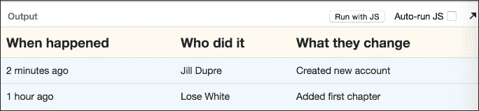

# 第三章 数据流和生命周期事件

在上一章中，我们看到了 JSX 的强大功能。JSX 使得编写 React 组件变得容易。

在本章中，我们将关注组件之间的数据流以及如何管理组件的状态和生命周期。

在本章中，我们将涵盖以下内容：

+   React 中的数据流

+   Props

+   PropTypes

+   状态

+   状态与 props

+   何时使用状态和 props

+   组件生命周期概述

+   组件生命周期方法

在本章结束时，我们将熟悉 React 组件中的数据流以及维护和管理状态的方法。我们还将习惯于组件的生命周期以及 React 提供的各种生命周期钩子。

# React 中的数据流

肖恩和马克正准备在雨天喝着咖啡开始工作。

“迈克，我对我们用来传递`headings`和`changeSet`数据的 props 有一个问题。”

“哎呀！”迈克惊呼。

“在我看来，我们似乎正在将数据传递给当前组件下方的组件，但一个组件如何将数据传递给父组件呢？”

“啊。在 React 中，默认情况下，所有数据都只在一个方向上流动：从父组件到子组件。就是这样。”

这使得子组件的工作变得简单且可预测。从父组件接收 props 并渲染。”迈克解释道。

```js
var RecentChangesTables = React.createClass({
  render: function(){
    return(<table className = 'table'>
             <Headings headings = {this.props.headings} />
             <Rows changeSets = {this.props.changeSets} />
           </table>);
    }
});
```

“让我们看看我们的例子。`RecentChangesTables`组件将 props 传递给`Headings`和`Rows`组件。所以基本上，我们可以这样说，`RecentChangesTables`拥有`Headings`和`Rows`组件。”

“在 React 中，一个拥有者组件为另一个组件设置 props。”迈克解释道。

“明白了。因此，在前面的例子中，`<table>`也是`RecentChangesTables`的拥有者吗？”肖恩问道。

“不。拥有者关系是特定于 React 组件的。在这种情况下，表格是`Headings`和`Rows`的父组件，类似于 DOM 中的父子关系。但它不是它们的拥有者。”迈克解释道。

“如果一个子组件是在父组件的渲染方法中创建的，那么这个组件就是子组件的拥有者。我想这会解决混淆。”迈克补充道。

“是的。我明白了拥有者和父子关系之间的区别。”肖恩说。

“此外，一个组件不应该修改其 props。它们应该始终与父组件设置的保持一致。这是一个非常重要的点，它使得 React 的行为既一致又快速，正如我们很快就会看到的。”迈克进一步补充道。

“可以通过`this.props`访问 props，正如我们之前看到的。如果父组件的 props 中有任何变化，React 将确保这些变化会向下流动，并重新渲染组件树。”迈克说。

“太好了。昨天，我读了一些关于验证 props 的内容。”肖恩回忆道。

“是的。React 允许使用`PropTypes`验证 props。让我们看看它们。”迈克一边说着，一边喝了一口新鲜磨的咖啡。

# Props 验证

"React 提供了一个使用 PropTypes 来验证 props 的方法。这非常有用，可以确保组件被正确使用。这里是一个使用`propTypes`为我们应用程序的例子。" 迈克解释说。

```js
var App = React.createClass({
  propTypes: {
   headings: React.PropTypes.array,
   changeSets: React.PropTypes.array,
   author: React.PropTypes.string.isRequired
   },

  render: function(){
    return(<table className = 'table'>
             <Headings headings = {this.props.headings} />
             <Rows changeSets = {this.props.changeSets} />
           </table>);
    }
});
```

"哦！它会不会显示错误，因为我们没有传递作者，这是必需的，我猜？我看到`propTypes`已经将作者值设置为`isRequired`。" 肖恩问道。


"不。它不会抛出错误，但它会显示一个漂亮的警告，让我们看看。" 迈克说。

"此外，`propTypes`只在开发时进行检查。它们的工作只是检查我们对我们组件所做的所有假设是否得到满足。" 迈克补充说。

"明白了。我同意有它比在生产过程中被随机的小故障所惊讶要好得多," 肖恩说。

"是的。它特别有用，因为我们不仅可以用标准类型，还可以验证自定义类型。" 迈克通知说。

```js
var App = React.createClass({
  propTypes: {
   headings: function(props, propName, componentName) {
   if(propName === 'headings')
     return Error('Failed Validation');
   }
  },

  render: function(){
    return(<table className = 'table'>
             <Headings headings = {this.props.headings} />
             <Rows changeSets = {this.props.changeSets} />
           </table>);
    }
});
```

"因此，如果 props 的结构与你的假设不符，你可以通过定义一个自定义验证器来发出警告，就像上一个案例中展示的那样"，迈克解释说。

# 指定默认 props

"肖恩，React 还允许我们为 props 定义一些默认值。这在父组件根据某些条件传递 props 或者由于某些变化而没有传递任何 props 时非常有用"，迈克说。

```js
var App = React.createClass({

 getDefaultProps: function() {
    return {
      headings: ['When happened ', 'Who did it', 'What they change']
    };
  },

  render: function(){
            …
  }
});

var data = [{ "when": "2 minutes ago",
              "who": "Jill Dupre",
              "description": "Created new account"
            },
            {
              "when": "1 hour ago",
              "who": "Lose White",
              "description": "Added first chapter"
            }];

React.render(<App changeSets={data}/>, document.body);
```

"在这里，我们更新了代码，不再从 props 中发送标题。相反，我们使用了`getDefaultProps`函数来定义在它们未传递时将使用的默认 props。"



"因此，我们的输出看起来像这样。"

"哦，好的。这很有道理。与其通过 if-else 语句检查 props 是否存在，不如使用默认 props 来预先定义我们的数据简单得多。" 肖恩说。

# 修改 this.props.children

"肖恩。我们应该了解一个特殊的 props。它是`this.props.children`," 迈克继续说。

"React 会将所有存在于开始和结束标签之间的子元素捕获到 props 中，这些 props 可以通过`this.props.children`访问。" 迈克说。

"让我们尝试修改我们的代码以使用`this.props.children`。这也很有必要，因为我们想为我们的输出表格显示一个标题。" 迈克补充道。

```js
var RecentChangesTable = React.createClass({
  render: function(){
          return(
          <div>
            <h1> Recent Changes </h1>
            <table className='table'>
               {this.props.children}
            </table>
          </div>
          );
  }
});

var App = React.createClass({
  render: function(){
    return(<RecentChangesTable>
             <Headings headings = {this.props.headings} />
             <Rows changeSets = {this.props.changeSets} />
           </RecentChangesTable>);
    }
});
```


"太好了。所以我们提取了表格到它自己的组件中，并添加了一个标题。" 肖恩确认道。

"是的，我们使用`this.props.children`来渲染`标题`和`行`。" 迈克解释道。

"太棒了。让我根据我们关于 props 的讨论来修改我们的代码。" 肖恩兴奋地说。

# 状态

"肖恩，让我们再讨论一种在组件中处理数据的技术，状态。在 React 中，每个组件都可以有自己的状态。状态和 props 之间的主要区别是，props 是从父组件传递给组件的；而状态是组件内部的东西。

组件实例化时传递 props。state 是随时间可以变化的东西。因此，state 的变化会影响组件的渲染。可以把 state 看作是组件的一种私有数据结构。"迈克补充道。

"迈克，但到目前为止我们根本没使用过 state。我们只是使用了 props。"肖恩问道。

"确实。这是因为只有在需要的时候才应该引入 state。你已经知道管理 state 是困难的。当我们玩`ChangeSets` API 的静态数据时，我们不需要 state。然而，我们很快就会需要它。"迈克补充道。

# 设置初始状态

"可以使用`getInitialState`函数设置初始状态。"迈克说。

```js
var App = React.createClass({
  getInitialState: function() {
    return {
      changeSets: []
    };
  },

  render: function(){
    console.log(this.state.changeSets); // prints []  
});
```

"state 可以通过`this.state`类似 props 的方式访问。"迈克进一步解释。

# 设置 state

"我们可能需要根据某些用户事件更新初始状态。使用`setState()`函数更新 state 也很简单。"迈克通知道。

```js
var App = React.createClass({
  getInitialState: function() {
    return {
      changeSets: [],
      headings: ['Updated At', 'Author', 'Change']
    };
  },

  handleEvent: function(data) {
    this.setState({ changeSets: data.changeSets });
  },

  render: function(){
    …    
});
```

# 避免使用 state

"目前，我们不需要 state；然而，当我们从`RecentChanges` API 获取动态数据时，我们将使用 state 和 props。"迈克进一步补充。

"太好了。基于我们的讨论，我认为我们应该尽可能避免使用 state。"肖恩建议。

"确实。如果一个组件没有变化，那么就没有必要使用 state。在这种情况下，最好依赖于父组件传递的 props。这也避免了组件因为 state 的变化而反复重新渲染。"迈克解释道。

# state 与 props 的区别

"肖恩，理解 props 和 state 之间的区别以及何时使用什么非常重要。"迈克说道。

"props 是不可变的。它们不应该被传递给它们的组件更新。它们属于将它们传递给其他组件的组件。state 是组件内部和私有的东西。state 会根据与外部世界的交互而改变。"迈克说。

"state 应该存储尽可能简单的数据，例如输入复选框是否被选中或一个用于隐藏或显示组件的 CSS 类。"迈克补充道。

"还有一点需要确保的是，不要在 state 中重复 props。"迈克说。

```js
var App = React.createClass({
  getInitialState: function() {
    return {
      changeSets: this.props.changeSets
    };
  }
});
```

"根据传递给 props 的数据设置 state 是可能的。然而，父组件可以更新 props 并将它们再次发送。在这种情况下，如果 state 有任何变化，它将与新数据混淆。"

"此外，数据现在存在于两个地方，因此，管理两个数据源变得更加困难。"迈克解释道。

"我想在这种情况下，直接使用 props 是最好的，对吧？"肖恩问道。

"是的。state 完全是可选的。最好尽可能避免使用。你理解得对。"迈克高兴地说。

# 组件生命周期概述

"肖恩，现在让我们开始看看如何从[`openlibrary.org/`](https://openlibrary.org/)动态获取数据，将其存储在我们的组件中，并在使其兼容渲染后进行渲染。

组件会经历不同的生命周期事件。它们帮助我们确定何时初始化组件的哪个部分，或者何时获取外部数据。

我们已经看到了一些这些方法，例如`render`、`getInitialState`和`getDefaultProps`。

可以在[`videos.bigbinary.com/react/react-life-cycle-methods-in-depth.html`](http://videos.bigbinary.com/react/react-life-cycle-methods-in-depth.html)找到关于同一内容的更新详细列表和示例。

让我们逐一了解这些方法以及它们的使用方式，这样我们就可以开始获取用于显示的动态信息。以下是我们将讨论的方法列表：

+   `componentWillMount`

+   `componentDidMount`

+   `componentWillReceiveProps(object nextProps)`

+   `boolean shouldComponentUpdate(object nextProps, object nextState)`

+   `componentWillUpdate(object nextProps, object nextState)`

+   `componentDidUpdate(object prevProps, object prevState)`

+   `componentWillUnmount()`

+   `React.unmountComponentAtNode(document.body)`

    ### 提示

    你可以跟随下一个示例在[`jsbin.com/tijeco/3/edit`](http://jsbin.com/tijeco/3/edit)。

# 组件生命周期方法

"肖恩，让我们从一个能够触发这些方法的详尽示例开始。"迈克通知说。

```js
console.log('Start') // Marks entry point of JS code.
var App = React.createClass({
    componentWillMount: function(){
      console.log('componentWillMount');
    },

    componentDidMount: function(){
      console.log('componentDidMount');
    },

    getInitialState: function(){
      return { status: true}
    },

    getDefaultProps: function(){
      return {name: 'John'};
    },

    componentWillReceiveProps: function(nextProps){
      console.log('componentWillReceiveProps');
    },

    shouldComponentUpdate: function(nextProps, nextState){
      console.log('shouldComponentUpdate');
      return true;
    },

    componentWillUpdate: function(){
      console.log('componentWillUpdate');
    },

    render: function() {
      console.log('render');
      return <h1 onClick={this.toggleState}>    
             {this.state.status.toString()}
             </h1>
    },

    componentWillUnmount: function(){
      console.log('componentWillUnmount')
    },

    toggleState: function() {
      this.setState({status: !this.state.status})
    }
    });

/* List of methods and signatures for reference
* componentWillMount
* componentDidMount
* componentWillReceiveProps(object nextProps)
* boolean shouldComponentUpdate(object nextProps, object nextState)
* componentWillUpdate(object nextProps, object nextState)
* componentDidUpdate(object prevProps, object prevState)
* componentWillUnmount()
/

React.render(<App name='Jane'/>, document.body);
```


"它只是显示一个带有`true`文本的正文，然后点击后，它会改变以显示`false`。"迈克。

"肖恩，为了使事情简单，我为每个生命周期方法添加了一个简单的`console.log()`方法，这样我们就可以知道它被调用了。如果我们进行一次全新的运行，以下内容会被打印出来："

```js
"Start"
"componentWillMount"
"render"
"componentDidMount"
```

"啊，明白了。基本上，窗口首先打印了`Start`来表示文件已被加载。"肖恩说。

"正确。接下来，它打印出了`componentWillMount`。这是我们组件的入口点。当组件第一次在主体上挂载时，会调用此方法。如果你能看到，我们正在调用`React.render`。”

```js
React.render(<App name='Jane'/>, document.body);
```

这会触发`componentWillMount`。在这个方法中，我们可以调用`setState`来对我们内部数据进行一些更改。然而，这不会调用新的重新渲染或此方法再次调用。

接下来是实际的`render`方法调用。这负责实际的组件显示。

最后，我们有一个对`componentDidMount`的调用。这会在组件挂载后立即调用，并且仅在组件渲染后调用一次。

我们可以利用这个方法在组件的初始渲染之后获取我们想要在组件中显示的动态信息。

"一旦完成，我们就完成了组件显示的初始运行！"

"不错。"肖恩惊呼。

"现在，我们添加了一个简单的`onClick`事件。这会调用`this.toggleState`，它会将当前状态从`true`切换到`false`，反之亦然。"迈克说。

由于状态受到影响，React 重新渲染了`App`组件。当发生这种情况时，我们可以看到方法调用序列，如下所示："

```js
"…"
"shouldComponentUpdate"
"componentWillUpdate"
"render"
"…"
```

"啊，不错。它又经历了一个重新渲染周期。"肖恩说。

"正确。当状态发生变化时，React 知道它需要重新渲染`App`组件。它首先调用`shouldComponentUpdate`。这个方法返回`true`或`false`，指示 React 是否渲染组件。"

"我们甚至可以在状态更新时控制组件是否应该重新渲染。这种方法可以返回`false`，然后即使状态发生变化，React 也不会重新渲染组件。"

```js
    shouldComponentUpdate: function(nextProps, nextState){
      console.log('shouldComponentUpdate');
      return false; // Will not re-render the component.
    },
```

"我们还可以比较`nextProps`和`nextState`与现有值，然后决定是否重新渲染。"

"太棒了，这意味着我们可以得到更快的组件！"肖恩兴奋地说。

"确实如此。默认情况下，它总是返回`true`，这意味着在变化时总是渲染。"迈克总结道。

"接下来，`componentWillUpdate`将在渲染之前被调用。我们可以处理任何我们想要做的更改或任何家务工作。需要注意的是，我们在这个方法中不能调用`setState`。状态更新应该在别处处理。"

"哦，好的，"肖恩。

"我们只剩下`componentWillReceiveProps`了。"

```js
 componentWillReceiveProps: function(nextProps){
      console.log('componentWillReceiveProps');
    },
```

"它接收`nextProps`，这是子组件从父组件接收的新属性。这个方法在初始渲染时不会被调用。我们可以根据属性的变化更新状态或做一些其他家务工作。"

"很好，迈克。我觉得我对这个越来越有感觉了。"

"最后，我们有`componentWillUnmount`。当组件从主体中卸载时会被调用。我们可以使用这个方法释放资源，执行清理工作，取消任何定时器等等。"

"明白了。"

"好的！让我们更新我们的组件，开始从[`openlibrary.org/`](https://openlibrary.org/)获取信息。"

"所以，我们将更新`componentDidMount`来执行 AJAX 调用并获取要显示的数据。"

```js
  componentDidMount : function(){
    $.ajax({
      url: 'http://openlibrary.org/recentchanges.json?limit=10',
      context: this,
      dataType: 'json',
      type: 'GET'
    }).done(function (data) {
      var changeSets = this.mapOpenLibraryDataToChangeSet(data);
      this.setState({changeSets: changeSets});
    });
  }
```

"在这里，我们正在调用[`openlibrary.org/recentchanges.json?limit=10`](http://openlibrary.org/recentchanges.json?limit=10)并请求最近的十个更改。我们将以以下格式获取数据："

```js
[{
     comment:   "Added new cover",
     kind:      "add-cover",
     author:    {
         key: "/people/fsrc"
     },
     timestamp: "2015-05-25T19:20:33.981700",
     changes:   [
                    {
                        key:      "/books/OL25679864M",
                        revision: 2
                    }
                ],
     ip:        null,
     data:      { url: "" },
     id:        "49441324"
 }, 
{
…
}
]
```

"我们需要根据我们的要求格式化数据，以便它能够很好地显示。让我们看看它："

```js
mapOpenLibraryDataToChangeSet : function (data) {
  return data.map(function (change, index) {
    return {
      "when": jQuery.timeago(change.timestamp),
      "who": change.author.key,
      "description": change.comment
    }
  });
} 
```

"在这里，我们正在提取时间戳、作者信息和更改的描述，即更改中的评论。由于更改的时间是一个时间戳，我们使用了`jQuery.timeago`插件来获取期望的显示时间，如`2 分钟前`等等。要使用此插件，我们需要将其包含在我们的 HTML`head`标签中。"迈克解释道。

```js
<script src="img/jquery.timeago.js" type="text/javascript"></script>
```

"看起来一切都在顺利进行。"肖恩说。

"是的，让我们看看所有这些是如何实际运作的，怎么样？"

```js
var Heading = React.createClass({
    render: function () {
        var headingStyle = {
            backgroundColor: 'FloralWhite',
            fontSize: '19px'
        };
        return (<th style={headingStyle}> {this.props.heading} </th>);
    }
});
var Headings = React.createClass({
    render: function () {
        var headings = this.props.headings.map(function (name, index) {
            return (<Heading key={"heading-" + index} heading={name}/>);
        });

        return (<tr className='table-th'> {headings} </tr>);
    }
});
var Row = React.createClass({
    render: function () {
        var trStyle = {backgroundColor: 'aliceblue'};
        return (<tr style={trStyle}>
            <td> {this.props.changeSet.when} </td>
            <td> {this.props.changeSet.who} </td>
            <td> {this.props.changeSet.description} </td>
        </tr>);
    }
});
var Rows = React.createClass({
    render: function () {
        var rows = this.props.changeSets.map(function (changeSet, index) {
            return (<Row key={index} changeSet={changeSet}/>);
        });

        return (<tbody>{rows}</tbody>);
    }
});

var App = React.createClass({
    getInitialState: function () {
        return {changeSets: [];
    },
    mapOpenLibraryDataToChangeSet: function (data) {
        return data.map(function (change, index) {
            return {
                "when": jQuery.timeago(change.timestamp),
                "who": change.author.key,
                "description": change.comment
            }
        });
    },
    componentDidMount: function () {
        $.ajax({
            url: 'http://openlibrary.org/recentchanges.json?limit=10',
            context: this,
            dataType: 'json',
            type: 'GET'
        }).done(function (data) {
            var changeSets = this.mapOpenLibraryDataToChangeSet(data);
            this.setState({changeSets: changeSets});
        });
    },

    render: function () {
        return (<table className='table'>
            <Headings headings={this.props.headings}/>
            <Rows changeSets={this.state.changeSets}/>
        </table>);
    }
});

var headings = ['Updated at ', 'Author', 'Change'];
React.render(<App headings={headings} />, document.body);
```

"这就是我们的最终产品！"迈克兴奋地说。

"太棒了，我迫不及待想看看我们接下来会构建什么！"肖恩补充道。

在 Adequate 又一个高效的一天。迈克和肖恩对进度感到满意，于是返回了。

# 摘要

在本章中，我们探讨了如何在 React 组件中使用 props 和 state 来传递数据。我们还讨论了何时以及如何使用 state 和 props。我们了解了如何使用 `propTypes` 来验证 props。之后，我们讨论了组件的生命周期。我们讨论了各种生命周期方法及其使用方式。随后，我们利用这些生命周期方法从 Open Library API 获取实时数据。
