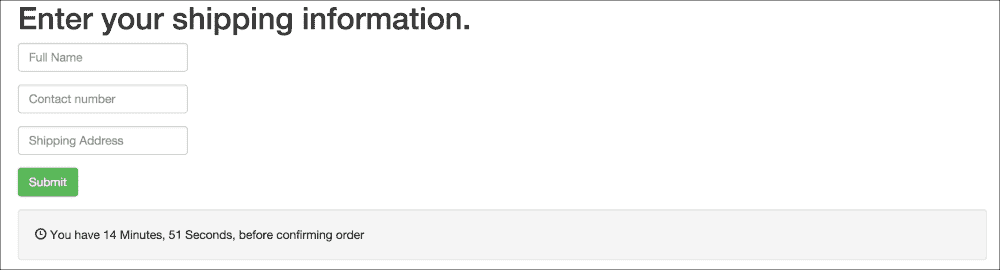
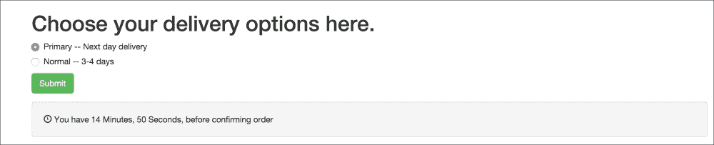
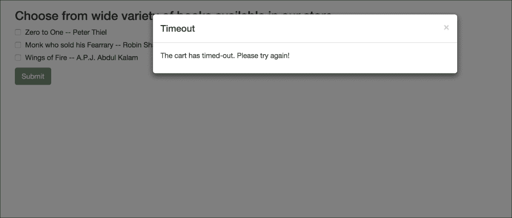

# Chapter 5. Mixins and the DOM

In the previous chapter, we took a deep dive into React Forms. We took a look at building multiple components and interactivity between them, Controller and Uncontrolled Components, building Forms and Form elements, and Form events and handlers for the events. We build a form to capture cart-checkout flow and orders being placed in a multi-step form.

In this chapter, we will focus on abstracting content using mixins and touch upon DOM handling.

Here, we will cover the following points:

+   Mixins

+   PureRender mixin

+   React and the DOM

+   Refs

At the end of this chapter, we will be able to abstract and reuse logic across our components and learn how to handle DOM from within the components.

# Back at the office

The duo was back at work. Mike entered with a cup of coffee. It was morning and the office had just started to buzz.

"So Shawn, we did a lot of complex forms stuff last time. Our cart flow is now complete. However, now we have been asked to add a timeout to the cart. We need to show a timer to the user that they need to checkout and complete the order in 15 minutes."

"Any idea how we can do this?"

"Umm, maintain a state for timer and keep updating every second? Take some action when the timer hits zero."

"Right! We will use intervals to reduce the timeout values and keep updating our views to display the timer. As we have been storing the form data in a single place, our `Bookstore` component, let's go ahead and add a state value that will track this timeout value. Let's change our initial state to something similar to the following:"

```js
getInitialState() {
    return ({currentStep: 1, formValues: {}, cartTimeout: 60 * 15});
  }
```

"60 X 15, that's 15 minutes in seconds value. We will also need to add a method to keep updating this state so that we can use it freely from here as well as the child components."

```js
updateCartTimeout(timeout){
    this.setState({cartTimeout: timeout});
}
```

"Cool."

"Now, what we will do is define what are called as mixins."

"Mixins?"

"Yeah, mixins allow us to share a code across components. Let's take a look at how we are going to use it before moving ahead."

```js
var SetIntervalMixin = {

  componentWillMount: function() {
    this.intervals = [];
  },

  setInterval: function() {
    this.intervals.push(setInterval.apply(null, arguments));
  },

  componentWillUnmount: function() {
    this.intervals.map(clearInterval);
  }
};

module.exports = SetIntervalMixin;
```

"所以我们在这里做的 nothing much but defining an object. We will see how we use it in our components."

"As you can see, what we are trying to achieve here is add a way to track all our interval handlers, as follows:"

```js
componentWillMount: function() {
    this.intervals = [];
  }

```

"Here, we are first initializing an array to hold instances to intervals that we will be creating. Next, we will define a method that can be used to define new intervals, as follows:"

```js
  setInterval: function() {
    this.intervals.push(setInterval.apply(null, arguments));
  }
```

"Got it. I see the last bit is defining the `componentWillUnmount` method and we have already defined `componentWillMount`; but this isn't a React component. Why do we have these method here?"

"Oh right. Let's take a look at the following method first:"

```js
  componentWillUnmount: function() {
    this.intervals.map(clearInterval);
  }
```

"What this method does is clean up the intervals, which we might have created, before we unmount our component."

"Got it."

"Now, as you mentioned, we have two life cycle methods here—`componentWillMount` and `componentWillUnmount`."

"当我们开始在组件中使用这个功能时，它们就像我们组件中其他类似的生命周期方法一样被调用。"

"哦，很好。这两个方法都会被调用吗？”肖恩问。

"没错。现在我们已经定义了 mixin，让我们开始使用它！"

"我们首先想开始使用这个功能的地方是在交付详情页。这就像做以下事情一样简单："

```js
var DeliveryDetails = React.createClass({
…
mixins: [SetIntervalMixin]
…
```

"太棒了，接下来我们希望开始使用这个功能来存储`cartTimeout`值并更新它们。你能定义一个 mixin 来完成这个任务吗？”迈克问道。

"好的，我将首先定义一个方法来递减购物车计时器，这将保持更新状态。接下来，我们需要实际设置超时，以便每隔一段时间调用该方法，使其每秒调用一次以递减时间？"

"没错，让我们看看你会怎么做。"

```js
var CartTimeoutMixin = {
  componentWillMount: function () {
    this.setInterval(this.decrementCartTimer, 1000);
  },

  decrementCartTimer(){
    if (this.state.cartTimeout == 0) {
      this.props.alertCartTimeout();
      return;
    }
    this.setState({cartTimeout: this.state.cartTimeout - 1});
  },

};
```

"太好了，这正是我们需要的。但我们遗漏了一部分；我们需要能够将这个信息发送回父组件以存储我们在这里更新的计时器值。"

"我们还将注意从父组件传递当前计时器的状态到子组件。"

"哦，对了。"

"让我们回到父组件，开始传递购物车计时器值给子组件。现在我们的渲染方法应该看起来像这样："

```js
……
render() {
    switch (this.state.currentStep) {

      case 1:
        return <BookList updateFormData={this.updateFormData}/>;

      case 2:
        return <ShippingDetails updateFormData={this.updateFormData}
                                cartTimeout={this.state.cartTimeout}
                                updateCartTimeout={this.updateCartTimeout} />;

      case 3:
        return <DeliveryDetails updateFormData={this.updateFormData}
                                cartTimeout={this.state.cartTimeout}
                                updateCartTimeout={this.updateCartTimeout} />;

……
```

"请注意，我们在这里传递了`updateCartTimeout`方法。这是我们将在 mixin 中开始使用的东西。"

"接下来，我们将更新`DeliveryDetails`组件以开始存储`cartTimeout`值。"

```js
getInitialState() {
    return { deliveryOption: 'Primary', cartTimeout: this.props.cartTimeout };
 } 
```

"有了这个设置，我们现在可以设置交付选项页的渲染方法，现在应该看起来像以下这样："

```js
  render() {

    var minutes = Math.floor(this.state.cartTimeout / 60);
    var seconds = this.state.cartTimeout - minutes * 60;

    return (
      <div>
        <h1>Choose your delivery options here.</h1>
        <div style={{width:200}}>
          <form onSubmit={this.handleSubmit}>
            <div className="radio">
              <label>

                <input type="radio"
                       checked={this.state.deliveryOption === "Primary"}
                       value="Primary"
                       onChange={this.handleChange} />
                Primary -- Next day delivery
              </label>
            </div>

            <div className="radio">
              <label>
                <input type=e"radio"
                       checked={this.state.deliveryOption === "Normal"}
                       value="Normal"
                       onChange={this.handleChange} />
                Normal -- 3-4 days
              </label>
            </div>

            <button className="btn btn-success">
              Submit
            </button>

          </form>
        </div>

        <div className="well">
          <span className="glyphicon glyphicon-time" aria-hidden="true"></span> You have {minutes} Minutes, {seconds} Seconds, before confirming order
        </div>

      </div>
    );
  }
```

"我们还需要开始使用`CartMixin`，所以我们的`mixins`导入应该看起来像以下这样："

```js
…
mixins: [SetIntervalMixin, CartTimeoutMixin],
…
```

"很好，让我看看现在的运输信息看起来怎么样。"



"它工作了！”肖恩兴奋地说。

"太棒了。记住，肖恩，现在我们需要在切换到其他页面时将信息传递回父组件。"

"是的，我们应该将其添加到使用了 mixin 的组件中？"

"更好的是，让我们将以下代码添加到 mixin 中："

```js
….
componentWillUnmount(){
    this.props.updateCartTimeout(this.state.cartTimeout);
  }
….
```

"现在我们的 mixin 应该看起来像以下这样："

```js
var CartTimeoutMixin = {
  componentWillMount: function () {
    this.setInterval(this.decrementCartTimer, 1000);
  },

  decrementCartTimer(){
    if (this.state.cartTimeout == 0) {
      this.props.alertCartTimeout();
      return;
    }
    this.setState({cartTimeout: this.state.cartTimeout - 1});
  },

  componentWillUnmount(){
    this.props.updateCartTimeout(this.state.cartTimeout);
  }

};

module.exports = CartTimeoutMixin;
```

"我们的 mixin 现在将在组件卸载时更新当前的购物车值。"

"我们遗漏了一件事，它是这个 mixin 的一部分。当计时器达到零时，我们调用`this.props.alertCartTimeout()`。"

"我们将在父组件上定义这个，并传递它以便从子组件调用，如下所示："

```js
  alertCartTimeout(){
    this.setState({currentStep: 10});
  },
```

"然后更新我们的渲染方法，以便在达到超时步骤时进行处理，如下所示："

```js
render() {
    switch (this.state.currentStep) {
      case 1:
        return <BookList updateFormData={this.updateFormData}/>;
      case 2:
        return <ShippingDetails updateFormData={this.updateFormData}
                                cartTimeout={this.state.cartTimeout}
                                updateCartTimeout={this.updateCartTimeout}
                                alertCartTimeout={this.alertCartTimeout}/>;
      case 3:
        return <DeliveryDetails updateFormData={this.updateFormData}
                                cartTimeout={this.state.cartTimeout}
                                updateCartTimeout={this.updateCartTimeout}
                                alertCartTimeout={this.alertCartTimeout}/>;
      case 4:
        return <Confirmation data={this.state.formValues}
                             updateFormData={this.updateFormData}
                             cartTimeout={this.state.cartTimeout}/>;
      case 5:
        return <Success data={this.state.formValues} cartTimeout={this.state.cartTimeout}/>;

      case 10:
       /* Handle the case of Cart timeout */
        return <div><h2>Your cart timed out, Please try again!</h2></div>;
      default:
        return <BookList updateFormData={this.updateFormData}/>;
    }
  }
```

"让我们看看完成它后`DeliveryDetails`组件看起来怎么样："

```js
import React from 'react';
import SetIntervalMixin from './mixins/set_interval_mixin'
import CartTimeoutMixin from './mixins/cart_timeout_mixin'

var DeliveryDetails = React.createClass({
  propTypes: {
    alertCartTimeout: React.PropTypes.func.isRequired,
    updateCartTimeout: React.PropTypes.func.isRequired,
    cartTimeout: React.PropTypes.number.isRequired
  },

  mixins: [SetIntervalMixin, CartTimeoutMixin],

  getInitialState() {
    return { deliveryOption: 'Primary', cartTimeout: this.props.cartTimeout };
  },

  componentWillReceiveProps(newProps){
    this.setState({cartTimeout: newProps.cartTimeout});
  },

  handleChange(event) {
    this.setState({ deliveryOption: event.target.value});
  },

  handleSubmit(event) {
    event.preventDefault();
    this.props.updateFormData(this.state);
  },

  render() {
    var minutes = Math.floor(this.state.cartTimeout / 60);
    var seconds = this.state.cartTimeout - minutes * 60;
    return (
      <div>
        <h1>Choose your delivery options here.</h1>
        <div style={{width:200}}>
          <form onSubmit={this.handleSubmit}>
            <div className="radio">
              <label>
                <input type="radio"
                       checked={this.state.deliveryOption === "Primary"}
                       value="Primary"
                       onChange={this.handleChange} />
                Primary -- Next day delivery
              </label>
            </div>
            <div className="radio">
              <label>
                <input type="radio"
                       checked={this.state.deliveryOption === "Normal"}
                       value="Normal"
                       onChange={this.handleChange} />
                Normal -- 3-4 days
              </label>
            </div>

            <button className="btn btn-success">
              Submit
            </button>
          </form>
        </div>
        <div className='well'>
          <span className="glyphicon glyphicon-time" aria-hidden="true"></span> You have {minutes} Minutes, {seconds} Seconds, before confirming order
        </div>
      </div>
    );
  }
});

module.exports = DeliveryDetails;
```

"我们还将更新我们的`ShippingDetails`组件，使其看起来像以下这样："

```js
import React from 'react';
import SetIntervalMixin from './mixins/set_interval_mixine'
import CartTimeoutMixin from './mixins/cart_timeout_mixin'

var ShippingDetails = React.createClass({
  propTypes: {
    alertCartTimeout:React.PropTypes.func.isRequired,
    updateCartTimeout: React.PropTypes.func.isRequired,
    cartTimeout: React.PropTypes.number.isRequired
  },

  mixins: [SetIntervalMixin, CartTimeoutMixin],

  getInitialState() {
    return {fullName: '', contactNumber: '', shippingAddress: '', error: false, cartTimeout: this.props.cartTimeout};
  },
  _renderError() {
    if (this.state.error) {
      return (
        <div className=e"alert alert-danger">
          {this.state.error}
        </div>
      );
    }
  },

  _validateInput() { 
  …..
  },

  handleSubmit(event) {
  ….
  },

  handleChange(event, attribute) {
    var newState = this.state;
    newState[attribute] = event.target.value;
    this.setState(newState);
    console.log(this.state);
  },

  render() {
    var errorMessage = this._renderError();
    var minutes = Math.floor(this.state.cartTimeout / 60);
    var seconds = this.state.cartTimeout - minutes * 60;

    return (
      <div>
        <h1>Enter your shipping information.</h1>
           …..

        <div className='well'>
          <span className="glyphicon glyphicon-time" aria-hidden="true"></span> You have {minutes} Minutes, {seconds} Seconds, before confirming order
        </div>
      </div>
    );
  }
});

module.exports = ShippingDetails;
```

"现在它应该看起来像以下截图所示："



"太棒了，”肖恩兴奋地说。

"在超时的情况下，我们有简单的显示："


# 添加模态框

"好吧，这工作得很好，”迈克继续说。

"然而，目前这有点笨拙。超时后，用户无法进行任何操作。我们可以添加一个弹出窗口来通知用户。而不是显示错误页面，让我们显示一个带有警告的模态框，并将用户重定向到第一页，这样用户就可以重新开始流程。我们可以使用 Bootstrap 模态框来实现这一点。"

"明白了。你想让我试一试吗？"肖恩问道。

"继续！"

"让我先从设置模态框开始。我将使用一个简单的 Bootstrap 模态框来显示它。完成之后，我需要从`alertCartTimeout`调用模态框的显示。我想我还需要设置显示第一页和重置表单数据。"

"正确。"

"这就是模态框将呈现的样子"

```js
import React from 'react';

var ModalAlertTimeout = React.createClass({
  render() {
    return (

      <div className="modal fade" ref='timeoutModal'>
        <div className="modal-dialog">
          <div className="modal-content">
            <div className="modal-header">
              <button type="button" className="close" data-dismiss="modal" aria-label="Close"><span aria-hidden="true">×</span></button>
              <h4 className="modal-title">Timeout</h4>
            </div>
            <div className="modal-body">
              <p>The cart has timed-out. Please try again!</p>
            </div>
          </div>
        </div>
      </div>
    );
  }
});
module.exports = ModalAlertTimeout;
```

"很好。接下来，你将更新`Bookstore`组件的`alertCartTimeout`方法。"

"是的，我在 body 中添加了一个新的空 HTML 元素，ID 为`modalAlertTimeout`。这将用于显示新的模态框并在其上方挂载组件。我还将更改警告超时方法如下："

```js
alertCartTimeout(){
    React.render(<ModalAlertTimeout />, document.getElementById('modalAlertTimeout'));
    this.setState({currentStep: 1, formValues: {}, cartTimeout: 1});
  }
```

"啊，让我们看看这个做了什么"迈克继续说，检查肖恩所做的更改。

"肖恩，看起来超时将我们带到了第一页，但没有显示模态警告"

"哦，对了。我们仍然需要从 Bootstrap 调用模态框的显示。"

"正确。让我来处理这个问题，肖恩。在我们的`ModalAlertTimeout`中，我们将在组件成功挂载后添加一个方法调用以显示模态框，如下所示："

```js
componentDidMount(){
    setTimeout(()=> {
      let timeoutModal = this.refs.timeoutModal.getDOMNode();
      $(timeoutModal).modal('show');
    }, 100);
  }
```

"啊，我明白了我们在这里做了一些 DOM 操作。"

"是的，让我过一遍它们。"

# 引用

"我想我们之前用过这个，”肖恩问道。"

"是的。引用的作用是给我们一个引用组件某部分的句柄。我们在表单中做过这个。在这里，我们使用它来获取对模态框的引用，这样我们就可以在上面调用`modal()`方法。"

"这将反过来显示模态框。"

"现在，注意我们是如何使用`getDOMNode()`方法的。"

"是的。它做什么？"

"`getDOMNode()`方法帮助我们获取渲染 React 元素的底层 DOM 节点。在我们的例子中，我们想在 DOM 节点上调用一个方法。"

"当我们调用`this.refs.timeoutModal`时，它返回给我们一个组件的引用对象。"

"这与实际的 DOM 组件不同。它实际上是一个 React 包装的对象。为了获取底层的 DOM 对象，我们调用了`getDOMNode()`。"

"明白了。"

"接下来，我们将所有这些包裹在一个`setTimeout`调用中，这样我们就可以在 React 组件成功渲染并且模态框内容存在于页面上时调用它。"

"最后，我们调用了`$(timeoutModal).modal('show')`来调用模态框！"

"让我们看看我们的模态框现在看起来怎么样。"

```js
import React from 'react';

var ModalAlertTimeout = React.createClass({
  componentDidMount(){
    setTimeout(()=> {
      let timeoutModal = this.refs.timeoutModal.getDOMNode();
      $(timeoutModal).modal('show');
    }, 100);
  },

  render() {
    return (

      <div className="modal fade" ref='timeoutModal'>
        <div className="modal-dialog">
          <div className="modal-content">
            <div className="modal-header">
              <button type="button" className="close" data-dismiss="modal" aria-label="Close"><span aria-hidden="true">×</span></button>
              <h4 className="modal-title">Timeout</h4>
            </div>
            <div className="modal-body">
              <p>The cart has timed-out. Please try again!</p>
            </div>
          </div>
        </div>
      </div>
    );
  }
});
module.exports = ModalAlertTimeout;
```

"让我们看看现在看起来怎么样。"



"既然我们正在讨论这个，还有一个关于 DOM 的问题。我们可以调用`getDOMNode()`来获取当前组件的节点。因此，我们可以简单地调用`this.getDOMNode()`，这将返回给我们一个元素！"

"好的，让我们这么做。当有人关闭模态时，我们将卸载模态，以便在第二次渲染时重新调用它。"

"让我们定义一个回调方法来完成这个任务，如下："

```js
unMountComponent () {
    React.unmountComponentAtNode(this.getDOMNode().parentNode);
  }
```

"最后，我们将设置一个回调函数在模态关闭时执行，如下："

```js
$(timeoutModal).on('hidden.bs.modal', this.unMountComponent);
```

"这样一来，我们就完成了！当模态隐藏时，组件将会卸载。"

"注意我们是如何在 DOM 节点上使用`parentNode`属性来隐藏模态的。这有助于我们获取包含 React 元素的容器，并使用它来移除模态。"

"太好了。这真是一次很好的复习。谢谢 Mike！"

随着这些，这对搭档回到了检查他们刚刚所做的各种更改。

# 摘要

在本章中，我们探讨了重构组件。我们学习了如何利用混入（mixins）提取相似的功能，以便在组件间无缝使用。我们还研究了 DOM 交互，使用 refs 以及从组件中执行相关的 DOM 操作。

在下一章中，我们将探讨 React 在服务器端的运行方式。我们将看到 React 如何允许我们在服务器上渲染和处理组件，以预渲染 HTML，这对于多个原因来说是有用的。我们还将研究这如何影响 React 组件的生命周期。
