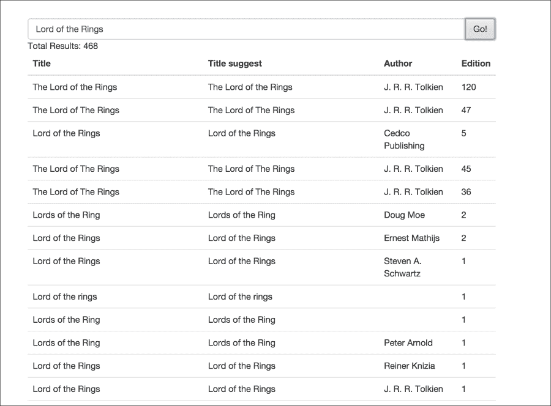
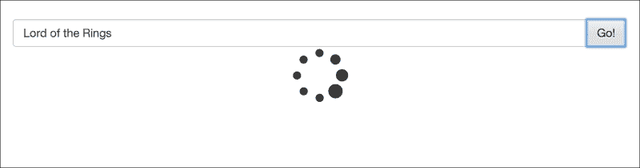

# 第六章。React 在服务器端

在上一章中，我们查看了对组件的重构。我们看到了如何使用混入（mixins）提取相似的功能，以便在组件之间无缝使用。我们还查看了一下 DOM 交互，使用 refs 以及从组件中相关的 DOM 操作。

在本章中，我们将探讨 React 在服务器端的运行方式。React 允许我们在服务器上渲染和处理组件，以预渲染 HTML，这有几个原因很有用。我们还将看看这如何影响 React 组件的生命周期。

在本章中，我们将涵盖以下要点：

+   服务器端渲染

+   渲染函数

+   服务器端组件生命周期

在本章结束时，我们将能够开始在服务器端使用 React 组件，并理解其与服务器端的交互和影响。

# 让 React 在服务器上渲染

"嘿，肖恩！" 迈克带着一杯咖啡闯入他们的工作场所，吓了肖恩一跳。

"早上好，迈克，”肖恩回答道。

阳光在肖恩的桌子上闪耀，他们开始讨论即将开始的新项目。

"肖恩，我从卡拉那里刚刚得知，我们有一个新的项目需要承担。客户要求我们为我们的 Open Library 项目构建一个简单的搜索页面。"

肖恩和迈克之前构建了一个应用程序，用于显示来自`openlibrary.com` API 的最新更改。他们现在将基于 Open Library 的搜索 API 构建一个搜索应用程序。

"太棒了，”迈克对此兴奋不已。他已经非常喜欢在 React 上工作了。

"肖恩，对于这个项目，我们将探讨如何在服务器上使用 React 的选项。"

到目前为止，我们一直在页面加载后手动挂载我们的组件。直到组件被渲染，页面都没有任何来自组件的 HTML 内容。

"让我们看看我们如何在服务器上完成这项工作，以便在页面完全加载后预先生成 HTML。"

"明白了。那么，服务器端组件的渲染有什么好处呢？"

"这有几个有用的原因。其中一个原因是我们在服务器上生成内容。这对于 SEO 目的和更好的搜索引擎索引很有用。"

"由于内容是在服务器上生成的，第一次渲染将立即显示页面，而不是等待页面加载完全完成后才正确渲染组件。"

"这也帮助我们避免了页面加载时的闪烁效果。还有其他这样的优点我们可以利用，我们将在稍后探讨，”迈克解释道。

"好。那我们就开始吧。"

"好的！对于这个项目，让我们从一个入门 Webpack 项目开始，以管理我们的代码。对于服务器端元素，我们将使用 Express JS。我们在这里不会做任何复杂的事情，我们只是简单地从 Express JS 中暴露一个路由，并渲染一个包含我们的组件的`.ejs`视图。"

"这样的入门级项目示例可以在[`webpack.github.io/`](http://webpack.github.io/)网站上找到，"迈克告知。

"很好，我想我们也会在客户端/服务器端划分代码？"

"是的。让我们将它们放在`/app`目录下以组成我们的组件，`/client`用于客户端特定的代码，`/server`用于我们`/src`目录中的服务器端代码，"迈克继续说道。

"接下来，我们将在`/app/server`目录中设置`server.js`文件。"

```js
import path from 'path';
import Express from 'express';

var app = Express();
var server;

const PATH_STYLES = path.resolve(__dirname, '../client/styles');
const PATH_DIST = path.resolve(__dirname, '../../dist');

app.use('/styles', Express.static(PATH_STYLES));
app.use(Express.static(PATH_DIST));

app.get('/', (req, res) => {
  res.sendFile(path.resolve(__dirname, '../client/index.html'));
});

server = app.listen(process.env.PORT || 3000, () => {
  var port = server.address().port;

  console.log('Server is listening at %s', port);
});
```

"这是一个相当标准的 Express 应用程序设置。我们指定了要使用的样式，静态资源路径等等。"

"对于我们的路由，我们通过这样做来简单地暴露根`/`："

```js
app.get('/', (req, res) => {
  res.sendFile(path.resolve(__dirname, '../client/index.html'));
});
```

"我们要求 Express 在请求根目录时服务`index.html`文件。在我们的`index.js`文件中，我们将将其传递给 node 以运行应用程序，我们只需简单地暴露我们刚刚编写的服务器模块。"

```js
require('babel/register');

module.exports = require('./server');
```

"迈克，为什么在这里需要`babel/register`？"

"哦，对了。在这里，我们引入 Babel([`babeljs.io/`](http://babeljs.io/))将我们的文件转换为浏览器兼容的格式。我们正在使用一些 JavaScript ES2015 语法的好处。Babel 通过语法转换器帮助我们添加对 JavaScript 最新版本的支持。这允许我们使用目前浏览器不支持的最新的 JavaScript 语法。"

"有了这个设置，我们将定义我们的`index.html`如下："

```js
<!DOCTYPE html>
<html>
<head lang="en">
  <meta charset="UTF-8">
  <title>Search</title>

  <link href="styles/main.css" rel="stylesheet" />

  <link rel="stylesheet" href="//maxcdn.bootstrapcdn.com/bootstrap/3.3.5/css/bootstrap.min.css">
  <link rel="stylesheet" href="//maxcdn.bootstrapcdn.com/bootstrap/3.3.5/css/bootstrap-theme.min.css">
<link rel="stylesheet" href="//maxcdn.bootstrapcdn.com/font-awesome/4.4.0/css/font-awesome.min.css">

</head>
<body>
  <div id="app"></div>
  <script src="img/bundle.js"></script>
</body>
</html>
```

"这里没有什么特别的。我们只是在顶部定义一个 div，我们将在其上渲染 React 组件。"

"此外，请注意，我们已经包含了添加 Bootstrap 和 Font Awesome 支持到我们的应用程序的文件链接。"

"接下来，在客户端渲染处理方面，我们将做"

```js
// file: scr/client/scripts/client.js
import App from '../../app';

var attachElement = document.getElementById('app');
var state = {};
var app;

// Create new app and attach to element
app = new App({ state: state});

app.renderToDOM(attachElement);
```

"最后，让我们在移动到我们的实际组件之前看看这里定义的`App`类是如何使用的。"

```js
import React from 'react/addons';
import AppRoot from './components/AppRoot';

class App {
  constructor(options) {
    this.state = options.state;
 }

  render(element) {
    var appRootElement = React.createElement(AppRoot, {
      state: this.state
    });

    // render to DOM
    if (element) {
      React.render(appRootElement, element);
      return;
    }

    // render to string
    return React.renderToString(appRootElement);
  }

  renderToDOM(element) {
    if (!element) {
      new Error('App.renderToDOM: element is required');
    }

    this.render(element);
  }

  renderToString() {
    return this.render();
  }
}

export default App;
```

"哇，这需要消化很多东西，"肖恩叹了口气。

"哈哈！给它一些时间。我们在这里所做的只是处理我们的渲染逻辑。如果我们向这个类传递一个元素，内容将被渲染到它上面；否则，我们将返回渲染后的字符串版本。注意我们是如何使用`React.renderToString`来实现相同功能的。让我们先完成这个，然后我们将在使用它来在服务器请求上渲染内容时再次回顾它。"

"简而言之，我们只是要求 React 接收一个组件的状态，渲染它，并将`render()`方法将渲染的内容作为字符串返回。"

"然后我们将开始定义我们的根容器组件。"

```js
require("jquery");
import React from 'react/addons';
import SearchPage from './SearchPage'

var AppRoot = React.createClass({
    propTypes: {
      state: React.PropTypes.object.isRequired
    },
    render()
    {
      return <SearchPage/>;
    }
  })
  ;

export default AppRoot;
```

"在这里，我们简单地定义一个容器来存放我们的主组件，并引入所有依赖。让我们接下来构建我们的搜索组件。"

"太棒了。我想我可以处理这个。看起来这只是一个简单的组件？"

"是的。继续吧，"迈克回应道。

"好的，我明白了我们需要从 Open Library API 端点获取数据。"

[`openlibrary.org/search.json?page=1&q=searchTerm`](https://openlibrary.org/search.json?page=1&q=searchTerm)

"在这里，`q` 查询参数将是搜索词。一个示例响应看起来像："

```js
{
 "start": 0,
 "num_found": 6,
 "numFound": 6,
 "docs": [
  {
   "title_suggest": "Automatic search term variant generation for document retrieval",
   "edition_key": [
    ..
   ],
…
   ],
   "author_name": [
..
..}]
}
```

"没错，" Mike 补充说。

"我想我会从根据 `start`、`num_found` 和 `docs` 字段定义初始状态开始，" Shawn 说

"好的。"

```js
  getInitialState(){
    return {docs: [], numFound: 0, num_found: 0, start: 0, searchCompleted: false, searching: false}
  }
```

"我还添加了两个其他状态，我将保持它们：`searchCompleted` 以知道当前搜索操作是否已完成，以及 `searching` 以知道我们目前正在搜索某物。"

"酷。让我们看看下一个渲染方法，" Mike 继续说。

"让我先在 `render` 方法中添加搜索框。"

```js
render() {
    let tabStyles = {paddingTop: '5%'};
    return (
        <div className='container'>
          <div className="row" style={tabStyles}>
            <div className="col-lg-8 col-lg-offset-2">
              <div className="input-group">
                <input type="text" className="form-control" placeholder="Search for Projects..." ref='searchInput'/>
            <span className="input-group-btn">
              <button className="btn btn-default" type="button" onClick={this.performSearch}>Go!</button>
            </span>
              </div>
            </div>
          </div>
       </div>
    );
  },
```

"我们现在应该有一个搜索框的显示。"



"接下来，我们将添加 `performSearch` 方法，它基于用户输入的搜索词启动搜索。"

```js
  performSearch(){
    let searchTerm = $(this.refs.searchInput.getDOMNode()).val();
    this.openLibrarySearch(searchTerm);
    this.setState({searchCompleted: false, searching: true});
  },
```

"在这里，我们只是获取用户输入的搜索词，并将其传递给 `openLibrarySearch` 方法，它将实际执行搜索。然后，我们更新状态，表明我们现在正在积极执行搜索。"

"现在让我们完成搜索功能。"

```js
 openLibrarySearch(searchTerm){
    let openlibraryURI = `https://openlibrary.org/search.json?page=1&q=${searchTerm}}`;
    fetch(openlibraryURI)
        .then(this.parseJSON)
        .then(this.updateState)
        .catch(function (ex) {
          console.log('Parsing failed', ex)
        })
  }
```

"啊，好，Shawn，你正在使用 `fetch` 而不是常规的 Ajax！"

"嗯，是的。我一直在使用 [`github.com/github/fetch`](https://github.com/github/fetch) 作为 `window.fetch` 规范的 polyfill。"

"不错，不是吗？它支持简单且干净的 API，如 Ajax，以及统一的获取 API。"

在获取某些资源或请求完成后，回调会通过 `then` 方法执行。注意，我们还在构建 URI 时使用了 ES2015 字符串字面量，" Shawn 补充说。

"酷。看起来你正在获取资源，然后将其传递给 `parseJSON` 以解析并从响应体中返回 JSON 结果。然后，我们是否在它之上更新状态？"

"是的，让我定义那些"

```js
  parseJSON(response) {
    return response.json();
  },

// response.json() is returning the JSON content from the response. 

updateState(json){
    this.setState({
      ...json,
      searchCompleted: true,
      searching: false
    });
  },
```

"在获取最终响应后，我正在更新和设置返回的结果状态，以及更新我们的 `searchCompleted` 和 `searching` 状态，以表明搜索工作已完成。"

"啊，好，Shawn，我看到你已经开始采用并使用 JS Next! 的新特性，比如 `spread` 操作符。"

"哈哈，是的。我已经爱上了这些。我正在使用这个来合并 JSON 结果的属性和我想添加的新键，并构建一个新的对象。这也会使用我们之前看到的 `Object.assign` 以类似的方式完成。"

```js
Object.assign({}, json, {searchCompleted: true, searching: false} )
```

"这样，我们是在构建一个新的对象，而不是修改先前的对象。"

"Shawn 很棒，Mike 愉快地知道 Shawn 正在掌握新事物。"

"最后，让我添加加载动作显示，以显示加载器图标和实际结果的显示。现在渲染方法将看起来像这样。"

```js
render() {
    let tabStyles = {paddingTop: '5%'};
    return (
        <div className='container'>
          <div className="row" style={tabStyles}>
            <div className="col-lg-8 col-lg-offset-2">
              <div className="input-group">
                <input type="text" className="form-control" placeholder="Search for Projects..." ref='searchInput'/>
            <span className="input-group-btn">
              <button className="btn btn-default" type="button" onClick={this.performSearch}>Go!</button>
            </span>
              </div>
            </div>
          </div>
          { (() => {
            if (this.state.searching) {
              return this.renderSearching();
            }
            return this.state.searchCompleted ? this.renderSearchElements() : <div/>
          })()}
        </div>
    );
  },
```

"在这里，我们正在检查搜索操作当前的状态。基于此，我们正在显示实际内容、结果或空 div 元素的加载器。"

"让我定义元素的加载和渲染。"

```js
renderSearching(){
    return <div className="row">
      <div className="col-lg-8 col-lg-offset-2">
        <div className='text-center'><i className="fa fa-spinner fa-pulse fa-5x"></i></div>
      </div>
    </div>;
  },
```

"这将定义旋转按钮的显示，以指示正在加载。"

```js
renderSearchElements(){
    return (

        <div className="row">
          <div className="col-lg-8 col-lg-offset-2">
            <span className='text-center'>Total Results: {this.state.numFound}</span>

            <table className="table table-stripped">
              <thead>
              <th>Title</th>
              <th>Title suggest</th>
              <th>Author</th>
              <th>Edition</th>
              </thead>
              <tbody>
              {this.renderDocs(this.state.docs)}
              </tbody>
            </table>

          </div>
        </div>

    );
  },

  renderDocs(docs){
    return docs.map((doc) => {
      console.log(doc);
      return <tr key={doc.cover_edition_key}>
        <td>{doc.title}</td>
        <td>{doc.title_suggest}</td>
        <td>{(doc.author_name || []).join(', ')}</td>
        <td>{doc.edition_count}</td>
      </tr>
    })
  },
```

"添加这个之后，搜索操作应该会显示一个类似这样的加载器。"


显示的结果将如下所示：



"完成的`SearchPage`组件如下："

```js
import React from 'react';
var SearchPage = React.createClass({
  getInitialState(){
    return {docs: [], numFound: 0, num_found: 0, start: 0, searchCompleted: false, searching: false}
  },
  render() {
    let tabStyles = {paddingTop: '5%'};
    return (
      <div className='container'>
        <div className="row" style={tabStyles}>
          <div className="col-lg-8 col-lg-offset-2">
            <div className="input-group">
              <input type="text" className="form-control" placeholder="Search for Projects..." ref='searchInput'/>
            <span className="input-group-btn">
              <button className="btn btn-default" type="button" onClick={this.performSearch}>Go!</button>
            </span>
            </div>
          </div>
        </div>
        { (() => {
          if (this.state.searching) {
            return this.renderSearching();
          }
          return this.state.searchCompleted ? this.renderSearchElements() : <div/>
        })()}
      </div>
    );
  },
  renderSearching(){
    return <div className="row">
      <div className="col-lg-8 col-lg-offset-2">
        <div className='text-center'><i className="fa fa-spinner fa-pulse fa-5x"></i></div>
      </div>
    </div>;
  },
  renderSearchElements(){
    return (
      <div className="row">
        <div className="col-lg-8 col-lg-offset-2">
          <span className='text-center'>Total Results: {this.state.numFound}</span>
          <table className="table table-stripped">
            <thead>
            <th>Title</th>
            <th>Title suggest</th>
            <th>Author</th>
            <th>Edition</th>
            </thead>
            <tbody>
            {this.renderDocs(this.state.docs)}
            </tbody>
          </table>
        </div>
      </div>
    );
  },
  renderDocs(docs){
    return docs.map((doc) => {
      console.log(doc);
      return <tr key={doc.cover_edition_key}>
        <td>{doc.title}</td>
        <td>{doc.title_suggest}</td>
        <td>{(doc.author_name || []).join(', ')}</td>
        <td>{doc.edition_count}</td>
      </tr>
    })
  },

  performSearch(){
    let searchTerm = $(this.refs.searchInput.getDOMNode()).val();
    this.openLibrarySearch(searchTerm);
    this.setState({searchCompleted: false, searching: true});
  },

  parseJSON(response) {   return response.json();  },

  updateState(json){
    this.setState({
      ...json,
      searchCompleted: true,
      searching: false
    });
  },
  openLibrarySearch(searchTerm){
    let openlibraryURI = `https://openlibrary.org/search.json?page=1&q=${searchTerm}}`;
    fetch(openlibraryURI)
      .then(this.parseJSON)
      .then(this.updateState)
      .catch(function (ex) {
        console.log('Parsing failed', ex)
      })
  }
});
module.exports = SearchPage;
```

"如果你注意到，我使用立即调用的函数添加了一个`if`语句来显示搜索图标渲染，如下所示："

```js
          { (() => {
            if (this.state.searching) {
              return this.renderSearching();
            }
            return this.state.searchCompleted ? this.renderSearchElements() : <div/>
          })()}
```

"在这里，我们使用了`()=>{}`语法首先定义函数，然后立即调用它`(()=>{}))()`，返回我们在渲染期间需要显示的内容。"

"干得好，肖恩！" 迈克对肖恩取得的进展感到高兴。

"这很方便，当我们想在渲染本身中添加简单的逻辑开关时，而不是定义新的方法，"迈克继续说。

# 在服务器上

"现在肖恩，让我们在服务器上预渲染组件。这意味着从 React 组件创建一个 HTML 元素，并在第一次页面加载时本身渲染其内容。目前，元素的加载由客户端代码处理。"

```js
app.renderToDOM(attachElement);
```

"而不是这样，我们将在 Express 动作本身中渲染 React 元素。"

"首先，让我们设置一个`.ejs`视图来显示我们的 HTML 内容以及动态生成的 React 内容。"

```js
<!DOCTYPE html>
<html>
<head lang="en">
  <meta charset="UTF-8">
  <title>Search</title>

  <link href="styles/main.css" rel="stylesheet" />
  <link rel="stylesheet" href="https://maxcdn.bootstrapcdn.com/bootstrap/3.3.5/css/bootstrap.min.css">
  <link rel="stylesheet" href="https://maxcdn.bootstrapcdn.com/bootstrap/3.3.5/css/bootstrap-theme.min.css">
  <link rel="stylesheet" href="https://maxcdn.bootstrapcdn.com/font-awesome/4.4.0/css/font-awesome.min.css">
</head>
<body>
  <div id="app">
  <%- reactOutput %>
  </div>
  <script src="img/bundle.js"></script>
</body>
</html>
```

"在这里，我们将`reactOutput`作为变量传递给视图进行渲染。"

"我们现在将修改`server.js`文件，以包含所需的组件和 React 进行渲染。"

```js
import AppRoot from '../app/components/AppRoot'
import React from 'react/addons';
```

"我们的动作将变为："

```js
app.get('/', (req, res) => {
  var reactAppContent = React.renderToString(<AppRoot state={{} }/>);
  console.log(reactAppContent);
  res.render(path.resolve(__dirname, '../client/index.ejs'), {reactOutput: reactAppContent});
});
```

"我们的最终服务器代码将如下所示。"

```js
import path from 'path';
import Express from 'express';

import AppRoot from '../app/components/AppRoot'
import React from 'react/addons';

var app = Express();
var server;

const PATH_STYLES = path.resolve(__dirname, '../client/styles');
const PATH_DIST = path.resolve(__dirname, '../../dist');

app.use('/styles', Express.static(PATH_STYLES));
app.use(Express.static(PATH_DIST));

app.get('/', (req, res) => {
  var reactAppContent = React.renderToString(<AppRoot state={{} }/>);
  console.log(reactAppContent);
  res.render(path.resolve(__dirname, '../client/index.ejs'), {reactOutput: reactAppContent});
});

server = app.listen(process.env.PORT || 3000, () => {
  var port = server.address().port;

  console.log('Server is listening at %s', port);
});
```

"这里就是了！我们正在使用 React 的`renderToString`方法来渲染一个组件，如果需要，可以传递任何状态，以伴随它。"

# 摘要

在本章中，我们探讨了如何使用`Express.js`的帮助，将服务器端渲染与 React 结合使用。我们从一个客户端 React 组件开始，最后使用 React API 提供的方法将其替换为服务器端渲染。

在下一章中，我们将探讨 React 插件，用于执行双向绑定、类名操作、组件克隆、不可变辅助工具和 PureRenderMixin，同时继续在本章中构建的搜索项目。
