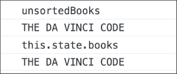

# 第七章。React 插件

在上一章中，我们学习了如何在服务器端使用 React。我们了解了在服务器端使用 React 时 React 组件的预渲染以及组件生命周期的变化。我们还看到了如何使用 Express.js 调用 React 的服务器端 API。

在本章中，我们将探讨 React 插件——这些不是 React 核心库的一部分的实用程序包，但它们使开发过程变得有趣和愉快。我们将学习使用不可变辅助工具、组件克隆和测试实用工具。我们不会涵盖其他插件，如`Animation`、`Perf`和`PureRenderMixin`。这些插件将在下一章中介绍。

在本章中，我们将涵盖以下主题：

+   开始学习 React 插件

+   不可变辅助工具

+   克隆 React 组件

+   测试辅助工具

# 开始学习插件

在完成关于在服务器端使用 React 的上一项目之后，迈克的团队在开始下一个项目之前有一些空闲时间。迈克决定利用这段时间来学习 React 插件。

"肖恩，我们有了一些空闲时间。让我们利用这段时间开始学习 React 插件。"

"什么是 React 插件？它们与 React 核心库有关吗？"肖恩问道。

"React 插件是 React 核心库之外的实用模块。然而，它们得到了 React 团队的认可。在未来，其中一些可能会被包含在 React 核心中。这些库提供了编写不可变代码的辅助工具、测试 React 应用的实用工具以及衡量和改进 React 应用性能的方法。"迈克解释道。

"每个插件都有自己的 npm 包，这使得使用变得非常简单。例如，要使用 Update 插件，我们需要安装并引入其 npm 包。"

```js
 $ npm install  react-addons-update --save

 // src/App.js
 import Update from 'react-addons-update';

```

## 不可变辅助工具

"肖恩，随着我们学习插件，让我们给我们的应用添加排序功能，这样用户就可以按标题排序书籍。我已经添加了所需的标记。"


"你能尝试编写当用户点击**标题**时进行排序的代码吗？"马克问道。

"这就是它。我引入了排序状态来指示排序方向——升序或降序。"

```js
  // Updated getInitialState function of App component
  // src/App.js

  getInitialState(){
    return { books: [],
             totalBooks: 0,
             searchCompleted: false,
             searching: false,
             sorting: 'asc' };
  }
```

"当用户点击**标题**时，它将使用 sort-by npm 包按升序或降序对现有状态中存储的书籍进行排序，并使用排序后的书籍更新状态。"

```js
import sortBy from 'sort-by';

_sortByTitle() {
    let sortByAttribute = this.state.sorting === 'asc' ? "title" : "-title";
    let unsortedBooks = this.state.books;
    let sortedBooks = unsortedBooks.sort(sortBy(sortByAttribute));
    this.setState({ books: sortedBooks, 
                    sorting: this._toggleSorting() });
  },

  _toggleSorting() {
    return this.state.sorting === 'asc' ? 'desc' : 'asc';
  }
```

"肖恩，这是功能性的；然而，它并不遵循 React 的方式。React 假设状态对象是不可变的。当我们为`unsortedBooks`赋值时，我们正在使用现有状态中对书籍的引用。"

```js
let unsortedBooks = this.state.books;
```

"稍后，我们将`unsortedBooks`转换为`sortedBooks`；然而，作为副作用，我们也在修改`this.state`的当前值。"

```js
_sortByTitle() {
    let sortByAttribute = this.state.sorting === 'asc' ? "title" : "-title";
    let unsortedBooks = this.state.books;
    console.log("Before sorting :");
    console.log(this.state.books[0].title);
    let sortedBooks = unsortedBooks.sort(sortBy(sortByAttribute));
    console.log("After sorting :");
    console.log(this.state.books[0].title);
    // this.setState({ books: sortedBooks, 
                       sorting: this._toggleSorting() });

  },
```


"正如你所见，即使我们注释掉了对 this.`setState`的调用，我们的当前状态仍然被修改了。"马克解释道。

"这可以通过使用 ES6 中的 `Object.assign` 轻易地修复。我们可以简单地创建一个新的数组，并将 `this.state.books` 的当前值复制到其中。然后我们可以对新的数组进行排序，并使用新的排序数组调用 `setState`。" 肖恩告知。

### 注意

`Object.assign` 方法将多个源对象的所有可枚举属性值复制到目标对象。更多详细信息可以在以下链接找到：[`developer.mozilla.org/en/docs/Web/JavaScript/Reference/Global_Objects/Object/assign`](https://developer.mozilla.org/en/docs/Web/JavaScript/Reference/Global_Objects/Object/assign)。

```js
_sortByTitle() {
    let sortByAttribute = this.state.sorting === 'asc' ? "title" : "-title";
    let unsortedBooks = Object.assign([], this.state.books);
    console.log("Before sorting :");
    console.log(this.state.books[0].title);
    let sortedBooks = unsortedBooks.sort(sortBy(sortByAttribute));
    console.log("After sorting :");
    console.log(this.state.books[0].title);
    this.setState({ books: sortedBooks, 
                    sorting: this._toggleSorting() });
  }
```


"是的。这行得通。但是 `Object.assign` 方法将创建 `this.state.books` 的浅拷贝。它将创建一个新的 `unsortedBooks` 对象，然而，它仍然会在 `unsortedBooks` 中使用 `this.state.books` 的相同引用。假设，由于某种原因，我们想要将所有书籍的标题转换为大写字母，那么我们可能会意外地变异 `this.state`，" 迈克解释道。

```js
_sortByTitle() {
    let sortByAttribute = this.state.sorting === 'asc' ? "title" : "-title";
    let unsortedBooks = Object.assign([], this.state.books);
    unsortedBooks.map((book) => book.title = book.title.toUpperCase());
    console.log("unsortedBooks");
    console.log(unsortedBooks[0].title);
    console.log("this.state.books");
    console.log(this.state.books[0].title); 
  }
```



"正如您所看到的，即使使用了 `Object.assign`，`this.state.books` 仍然发生了变异。实际上，这与 React 本身无关。这是由于 JavaScript 传递数组和对象引用的方式造成的。然而，由于这个原因，如果我们深层次的状态中有数组和对象，就很难防止变异。" 迈克进一步解释道。

"我们是否总是必须执行深拷贝状态对象以确保安全？" 肖恩问道。

"嗯，深拷贝可能很昂贵，有时在深层次嵌套的状态中很难实现。幸运的是，React 提供了带有不可变辅助工具的 Update 插件，我们可以使用它来解决这个问题的。" 迈克补充道。

"在使用不可变辅助工具时，我们需要回答以下三个问题："

+   需要更改什么？

+   需要在哪里更改？

+   需要如何更改？

"在这种情况下，我们需要更改 `this.state` 以显示排序后的书籍。"

"第二个问题是，`this.state` 内部应该在哪个位置发生变异？变异应该发生在 `this.state.books` 上。"

"第三个问题是变异应该如何发生？我们是打算删除某些内容，还是添加新的元素，或者重构现有元素？在这种情况下，我们想要根据某些标准对元素进行排序。"

"Update 插件接受两个参数。第一个参数是我们想要变异的对象。第二个参数告诉我们第一个参数中变异应该发生在哪里以及如何进行。在这种情况下，我们想要变异 `this.state`。在 `this.state` 中，我们想要用排序后的书籍更新书籍。因此，我们的代码将类似于以下内容："

```js
Update(this.state, { books: { sortedBooks }})
```

## 可用命令

Update 插件提供了不同的命令来执行数组和对象的变异。这些命令的语法受到了 MongoDB 查询语言的启发。

"大多数这些命令都操作数组对象，允许我们向数组中推入一个数组或从数组中 unshift 一个元素。它还支持使用 set 命令完全替换目标。除此之外，它还提供了 merge 命令来合并新键与现有对象。" 迈克解释道。

"肖恩，这个插件提供的我最喜欢的命令是 apply。它接受一个函数，并将该函数应用于我们想要修改的目标的当前值。它为在复杂数据结构中做出更改提供了更多的灵活性。这也是你下一个任务的提示。尝试使用它来按标题对书籍进行排序，而不进行修改。" 迈克提出了挑战。

"当然。给你，" 肖恩说。

```js
    // src/App.js

import Update from 'react-addons-update';

_sortByTitle() {
  let sortByAttribute = this.state.sorting === 'asc' ? "title" : "-title";
  console.log("Before sorting");
  console.log(this.state.books[0].title);
  let newState = Update(this.state,
                        { books: { $apply: (books) => { return books.sort(sortBy(sortByAttribute)) } },
                          sorting: { $apply: (sorting) => { return sorting === 'asc' ? 'desc' : 'asc' } } });
  console.log("After sorting");
  console.log(this.state.books[0].title);
  this.setState(newState);
  }
```


"太好了，肖恩。使用 Update 插件使得管理复杂状态变得非常容易，而实际上并没有修改它。"

### 小贴士

查阅[`facebook.github.io/immutable-js/docs/`](https://facebook.github.io/immutable-js/docs/)以获取在 JavaScript 中使用不可变数据结构的完整解决方案。

# 克隆组件

"肖恩，在 React 中，props 也是不可变的。在大多数情况下，子组件只是使用父组件传递的 props。然而，有时我们在渲染子组件之前想要扩展传入的 props 以添加一些新数据。这是一个典型的用例，用于更新样式和 CSS 类。React 提供了一个插件来克隆组件并扩展其 props。它被称为**cloneWithProps**插件。" 迈克说。

"迈克，这个插件已经过时了。我以前看过它，React 已经将其弃用。它还与子组件的 refs 未传递给新克隆的子组件等问题有关。" 肖恩通知说。

"确实如此。然而，React 还有一个顶级的`React.cloneElement` API 方法，它允许我们克隆并扩展一个组件。它有一个非常简单的 API，并且可以用作 cloneWithProps 插件的替代品。" 迈克解释道。

```js
React.cloneElement(element, props, …children);
```

"这个方法可以用来克隆给定的元素，并将新属性与现有属性合并。它用新子元素替换现有子元素。因此，在处理子组件时，我们必须记住这一点。"

"`cloneElement`函数还会将旧子组件的 ref 传递给新克隆的组件。因此，如果我们有任何基于 refs 的回调，它们在克隆后仍然会继续工作。"

"肖恩，你的下一个挑战来了。我们在我们的应用中显示书籍列表。实际上，在我们的所有应用中，我们都显示其他事物的列表，如产品、项目等。我们希望在所有这些列表中显示带有交替颜色的行，而不是只有白色背景。因为这个功能的代码将在所有应用中都是相同的，所以我正在考虑创建一个单独的组件，该组件将接受行作为输入，并以交替颜色渲染它们。这样的组件可以用于我们的所有应用。我认为你可以使用`React.cloneElement`来完成这个任务。" 迈克解释了下一个任务。

"将这个功能提取为一个单独的组件听起来是个好主意。我们几乎在所有应用中都需要它。昨天我们的 QA 团队抱怨我们的搜索应用缺少颜色。" 肖恩回忆道。

"让我们添加一些交替颜色吧。" 迈克轻声笑了。

"首先，让我们看看我们目前是如何显示书籍的。"

```js
// src/App.js

render() {
    let tabStyles = {paddingTop: '5%'};
    return (
      <div className='container'>
        <div className="row" style={tabStyles}>
          <div className="col-lg-8 col-lg-offset-2">
            <h4>Open Library | Search any book you want!</h4>
            <div className="input-group">
              <input type="text" className="form-control" placeholder="Search books..." ref='searchInput'/>
              <span className="input-group-btn">
                <button className="btn btn-default" type="button" onClick={this._performSearch}>Go!</button>
              </span>
            </div>
          </div>
        </div>
        {this._displaySearchResults()}
      </div>
    );
  },

_displaySearchResults() {
    if(this.state.searching) {
      return <Spinner />;
    } else if(this.state.searchCompleted) {
      return (
        <BookList
            searchCount={this.state.totalBooks}
            _sortByTitle={this._sortByTitle}>
          {this._renderBooks()}
        </BookList>
      );
    }
  } 

_renderBooks() {
    return this.state.books.map((book, idx) => {
      return (
        <BookRow key={idx}
                 title={book.title}
                 author_name={book.author_name}
                 edition_count={book.edition_count} />
      );
    })
  },

})
  }
```

"`BookList` 组件只是按照原样渲染传递给它的行，因为它使用了 `this.props.children`。"

```js
// BookList component

var BookList = React.createClass({
  render() {
    return (
      <div className="row">
        <div className="col-lg-8 col-lg-offset-2">
          <span className='text-center'>
            Total Results: {this.props.searchCount}
          </span>
          <table className="table table-stripped">
            <thead>
              <tr>
                <th><a href="#" onClick={this.props._sortByTitle}>Title</a></th>
                <th>Author</th>
                <th>No. of Editions</th>
              </tr>
            </thead>
            <tbody>
              {this.props.children}
            </tbody>
          </table>
        </div>
      </div>
    );
  }
});
```

"迈克，我打算将这个组件命名为 `RowAlternator`。`RowAlternator` 组件将获取动态的子行数组，并以交替颜色渲染它们。我们也可以向 `RowAlternator` 传递多个颜色。这样，使用这个组件的客户端代码就可以控制它们想要使用的交替颜色。"

"听起来不错，肖恩。我认为现在这个 API 已经足够了。"

```js
// RowAlternator component

import React from 'react';

var RowAlternator = React.createClass({
  propTypes: {
    firstColor: React.PropTypes.string,
    secondColor: React.PropTypes.string
  },

  render() {
    return (
      <tbody>
        { this.props.children.map((row, idx) => {
            if (idx %2 == 0) {
              return React.cloneElement(row, { style: { background: this.props.firstColor }});
            } else {
              return React.cloneElement(row, { style: { background: this.props.secondColor }});
            }
          })
        }
      </tbody>
    )
  }
});

module.exports = RowAlternator;
```

"由于我们不知道在 `RowAlternator` 中我们会得到多少子元素，所以我们只是遍历所有元素并使用交替颜色设置样式。我们在这里也使用了 `React.cloneElement` 来克隆传递的子元素，并使用适当的背景颜色扩展其样式属性。"

"现在让我们更改 `BookList` 组件，以便使用 `RowAlternator`。"

```js
// BookList component

import RowAlternator from '../src/RowAlternator';

var BookList = React.createClass({
  render() {
    return (
      <div className="row">
        <div className="col-lg-8 col-lg-offset-2">
          <span className='text-center'>
            Total Results: {this.props.searchCount}
          </span>
          <table className="table table-stripped">
            <thead>
              <tr>
                <th><a href="#" onClick={this.props._sortByTitle}>Title</a></th>
                <th>Author</th>
                <th>No. of Editions</th>
              </tr>
            </thead>
            <RowAlternator firstColor="white" secondColor="lightgrey">
              {this.props.children}
            </RowAlternator>
          </table>
        </div>
      </div>
    );
  }
});
```

"我们已经准备好了。现在列表显示了我们所想要的交替颜色，如下面的图片所示："


"太好了，肖恩。正如你已经注意到的，当我们构建一个具有动态子元素的组件时，使用 `React.cloneElement` 是有意义的，在这些子元素的渲染方法上我们没有控制权，但基于某些标准想要扩展它们的属性。" 迈克很高兴。

## 测试 React 应用程序的帮助器

"肖恩，我们还没有为我们的应用添加任何测试，但是现在是时候开始慢慢添加测试覆盖率了。有了 Jest 库和测试实用工具插件，设置和开始测试 React 应用程序变得非常简单。" 马克解释了下一个任务。

"我听说过 Jest。它不是 Facebook 的一个测试库吗？" 肖恩问道。

### 设置 Jest

"是的。它是建立在 Jasmine 之上的。设置起来非常简单。首先，我们必须安装 `jest-cli` 和 `babel-jest` 包。"

```js
npm install jest-cli --save-dev
npm install babel-jest –-save-dev

```

"之后，我们需要配置 `package.json`，如下所示："

```js
{
 ...
 "scripts": {
   "test": "jest"
 },

 "jest": {
   "scriptPreprocessor": "<rootDir>/node_modules/babel-jest",
    "unmockedModulePathPatterns": [
         "<rootDir>/node_modules/react",
         "<rootDir>/node_modules/react-dom",
         "<rootDir>/node_modules/react-addons-test-utils",
         "<rootDir>/node_modules/fbjs"
     ],
   "testFileExtensions": ["es6", "js", "jsx"],
   "moduleFileExtensions": ["js", "json", "es6"]
 }
 ...
}
```

"默认情况下，Jest 模拟所有模块，但是在这里我们告诉 Jest 不要模拟 React 和相关库。我们还指定了 Jest 将识别为测试文件的测试文件扩展名。"

"创建一个 `__test__` 文件夹，我们将在这里添加我们的测试。Jest 将从这个文件夹中的文件运行测试。让我们也添加一个空文件。我们必须确保文件以 `-test.js` 结尾，这样 Jest 才能将其识别为测试文件。" 迈克解释道。

```js
mkdir __test__
touch __test__/app-test.js

```

"现在让我们验证我们是否可以从命令行运行测试。"

```js
$ npm test

> react-addons-examples@0.0.1 test /Users/prathamesh/Projects/sources/reactjs-by-example/chapter7
> jest

Using Jest CLI v0.7.1
PASS __tests__/app-test.js (0.007s)

```

### 备注

你应该看到一个与前面输出类似的输出。它可能会根据 Jest 版本而变化。如有任何问题，请咨询[`facebook.github.io/jest/docs/getting-started.html`](https://facebook.github.io/jest/docs/getting-started.html)以设置 Jest。

"肖恩，我们已经准备好使用 Jest 了。现在是时候开始编写测试了。我们将测试顶层`App`组件是否正确挂载。然而，首先，我们需要更多地了解 Jest 的使用方法，"迈克说。

"默认情况下，Jest 模拟了测试文件中需要的所有模块。Jest 这样做是为了隔离正在测试的模块与其他所有模块。在这种情况下，我们想测试`App`组件。如果我们只是导入它，那么 Jest 将提供`App`的模拟版本。"

```js
// app-test.js

   const App = require('App'); // Mocked by Jest
```

"因为我们想测试`App`组件本身，所以我们需要指定 Jest 不要模拟它。Jest 提供了`jest.dontmock()`函数来实现这个目的。"

```js
// app-test.js

jest.dontmock('./../src/App'); // Tells Jest not to mock App.
const App = require('App');
```

### 注意

查阅[`facebook.github.io/jest/docs/automatic-mocking.html`](https://facebook.github.io/jest/docs/automatic-mocking.html)以获取 Jest 自动模拟功能的更多详细信息。

"接下来，我们将添加 React 和 TestUtils 插件的导入语句。"

```js
// app-test.js

jest.dontMock('../src/App');
const App = require('../src/App');

import React from 'react';
import ReactDOM from 'react-dom';
import TestUtils from 'react-addons-test-utils';
```

"TestUtils 插件提供了渲染组件、在渲染组件中查找子组件以及模拟渲染组件上的事件的实用函数。它有助于测试 React 组件的结构和行为。"迈克补充道。

## 测试 React 组件的结构

"我们将从`renderIntoDocument`函数开始。这个函数将给定的组件渲染到文档中的一个分离的 DOM 节点中。它返回`ReactComponent`，可以用于进一步的测试。"

```js
// app-test.js

describe('App', () => {
  it('mounts successfully', () => {
    let app = TestUtils.renderIntoDocument(<App />);
    expect(app.state.books).toEqual([]);
    expect(app.state.searching).toEqual(false);
  })
});
```

"我们在 DOM 中渲染了`App`组件，并断言初始书籍和搜索状态被正确设置。"迈克解释道。

"迈克，这太棒了。我们不是在测试真实的 DOM，而是在测试 React 组件。"

"是的。TestUtils 插件附带了一些查找方法，可以用来在给定的组件树中查找子组件。它们对于查找子组件，如输入框和提交按钮，并模拟点击事件或更改事件很有用。"

+   `findAllInRenderedTree(tree, predicate function)`：这对于在给定的树中找到返回谓词函数真值的所有组件很有用。

+   `scryRenderedDOMComponentsWithClass(tree, className)`：这对于找到具有给定类名的所有 DOM 组件很有用。

+   `findRenderedDOMComponentWithClass(tree, className)`：与找到具有给定类的所有 DOM 组件不同，此方法期望只有一个这样的组件存在。如果有多个具有给定类名的组件，它将抛出异常。

+   `scryRenderedDOMComponentsWithTag(tree, tagName)`：它与根据类名查找 DOM 组件类似，但是，它基于给定的标签名来查找组件。

+   `findRenderedDOMComponentWithTag(tree, tagName)`: 与查找具有给定标签的所有组件不同，它期望只有一个这样的组件存在。如果存在多个此类组件，它也会抛出异常。

+   `scryRenderedComponentsWithType(tree, componentType)`: 此方法查找所有具有给定类型的组件。这对于查找用户创建的所有复合组件非常有用。

+   `findRenderedComponentWithType (tree, componentType)`: 这与所有之前的查找方法类似。如果存在具有给定类型的多个组件，它将引发异常。

## 测试 React 组件的行为

"让我们使用这些函数来断言，当用户输入搜索词并点击**提交**按钮时，搜索书籍开始。我们将通过模拟用户输入搜索词的事件来实现这一点。"迈克说。

```js
// app-test.js

it('starts searching when user enters search term and clicks submit', () => {
    let app = TestUtils.renderIntoDocument(<App />);

    let inputNode = TestUtils.findRenderedDOMComponentWithTag(app, 'input');
    inputNode.value = "Dan Brown";
    TestUtils.Simulate.change(inputNode);
    let submitButton = TestUtils.findRenderedDOMComponentWithTag(app, 'button');
    TestUtils.Simulate.click(submitButton);
    expect(app.state.searching).toEqual(true);
    expect(app.state.searchCompleted).toEqual(false);
  })
```

"我们渲染`App`组件，找到输入节点，将输入节点的值设置为搜索词，并使用`TestUtils.Simulate()`模拟更改事件。这个函数模拟在 DOM 节点上给定事件的派发。`Simulate`函数为 React 理解的所有事件都有一个方法。因此，我们可以模拟所有事件，如更改、点击等。我们可以使用这种方法来测试用户行为。"迈克解释道。

"明白了。因此，在更改搜索词后，我们点击提交按钮并验证状态是否按预期更新。"肖恩说道。

"是的，肖恩。现在，你能检查一下用户点击**提交**按钮后是否显示 Spinner 吗？你可以使用我们之前讨论过的查找方法之一。"迈克解释了下一个任务。

"是的。在点击**提交**按钮后，组件状态发生变化后，我们可以搜索渲染的组件树，以查看 Spinner 组件是否存在。"。

```js
// app-test.js

// __tests__/app-test.js

import Spinner from './../src/Spinner';

it('starts searching when user enters search term and clicks submit', () => {
    let app = TestUtils.renderIntoDocument(<App />);
    let inputNode = TestUtils.findRenderedDOMComponentWithTag(app, 'input');
    inputNode.value = "Dan Brown";
    TestUtils.Simulate.change(inputNode);
    let submitButton = TestUtils.findRenderedDOMComponentWithTag(app, 'button');
    TestUtils.Simulate.click(submitButton);
    expect(app.state.searching).toEqual(true);
    expect(app.state.searchCompleted).toEqual(false);
 let spinner = TestUtils.findRenderedComponentWithType(app, Spinner);
 expect(spinner).toBeTruthy();
  }),
```

"我们在这里使用`TestUtils.findRenderedComponentWithType`来检查 Spinner 是否存在于由`App`组件渲染的树中。然而，在添加此断言之前，我们需要在测试文件顶部导入 Spinner 组件，因为`findRenderedComponentWithType`期望第二个参数是一个 React 组件。"。

"非常好，肖恩。正如你所看到的，使用`TestUtils.Simulate`和`finder`方法，React 组件的测试行为变得非常简单。"迈克解释道。

### 注意

注意，我们没有添加测试来异步从 Open Library API 加载书籍，因为这超出了本章的范围。

## 浅渲染

“肖恩，TestUtils 还提供了一种使用浅渲染以隔离方式测试组件的方法。浅渲染允许我们渲染顶级组件并断言其渲染方法的返回值。它不会渲染子组件或实例化它们。因此，我们的测试不受子组件行为的影响。与之前的方法不同，浅渲染不需要 DOM，”迈克解释道。

```js
let renderer = TestUtils.createRenderer();
```

“这创建了一个浅渲染器对象，我们将在这个对象中渲染我们想要测试的组件。浅渲染器有一个类似于`ReactDOM.render`的`render`方法，可以用来渲染组件。”

```js
let renderer = TestUtils.createRenderer();
let result = renderer.render(<App />);
```

“在调用渲染方法之后，我们应该调用`renderer.getRenderedOutput`，它返回渲染组件的浅渲染输出。我们可以在`getRenderedOutput`的输出上开始断言关于组件的事实。”

“让我们看看从`getRenderedOutput`得到的输出。”

```js
let renderer = TestUtils.createRenderer();
let result = renderer.render(<App />);
result = renderer.getRenderOutput();
console.log(result);

// Output of console.log(result)

Object {
  '$$typeof': Symbol(react.element),
  type: 'div',
  key: null,
  ref: null,
  props: 
   Object {
     className: 'container',
     children: Array [ [Object], undefined ] },
  _owner: null,
  _store: Object {} }
```

“正如你所见，基于渲染输出，我们可以断言关于当前组件 props 的事实。然而，如果我们想测试关于子组件的任何事情，我们需要通过`this.props.children[0].props.children[1].props.children`显式地访问它们。”

“这使得使用浅渲染测试子组件的行为变得困难。然而，由于浅渲染不受子组件的影响，它对于以隔离方式测试小型组件是有用的，”迈克说。

# 摘要

在本章中，我们首先了解了 React 插件及其使用方法。我们使用了插件提供的不可变辅助工具和测试实用函数。我们还探讨了如何克隆组件。

在下一章中，我们将使我们的 React 应用更加高效。你将学习到可以提升 React 应用性能的插件。具体来说，你将学习如何测量我们应用的性能以及 React 如何在不改变大部分 UI 的情况下进行更快的更新。

让我们的 React 应用更快吧！
