# 第八章. React 应用的性能

在上一章中，我们学习了如何使用各种 React 插件。我们看到了从不可变辅助工具到测试工具的各种插件。

在本章中，我们将探讨可以提高我们 React 应用性能的 React 性能工具。特别是，我们将使用 PERF 插件、`PureRenderMixin`和`shouldComponentUpdate`。我们还将探讨在使用 React 提供的性能工具时需要考虑的一些陷阱。

# React 应用的性能

"嗨，迈克，我今天有几个问题想问你。周末我一直在思考我们的搜索应用。你有时间讨论一下吗？"肖恩问道。

"当然，但让我先喝点咖啡。好的，我现在准备好了。开始吧！"迈克说。

"我对 React 应用的性能有几个问题。我知道 React 在状态变化时重新渲染组件树方面做得非常好。React 使我能很容易地理解和推理我的代码。然而，这不会影响性能吗？重新渲染看起来是一个非常昂贵的操作，尤其是在重新渲染大型组件树时。"肖恩问道。

"肖恩，重新渲染可能会很昂贵。然而，React 在这方面很聪明。它只渲染发生变化的部分。它不需要重新渲染页面上的一切。它也在尽量减少 DOM 操作方面很聪明。"

"这是怎么可能的？它是怎么知道页面哪一部分发生了变化？它不是依赖于用户交互或传入的状态和属性吗？"肖恩质疑道。

"虚拟 DOM 在这里发挥了作用。它完成了跟踪变化和帮助 React 对真实 DOM 进行最小更改的所有繁重工作。"迈克解释道。

# 虚拟 DOM

"肖恩，React 使用虚拟 DOM 来跟踪真实 DOM 中的变化。它的概念非常容易理解。React 始终在内存中保留实际 DOM 表示的副本。每当某些状态操作发生变化时，它都会计算一个新的 DOM 副本，该副本将使用新的状态和属性生成。然后它计算原始虚拟 DOM 副本和新虚拟 DOM 副本之间的差异。这个差异导致对真实 DOM 进行最小操作，可以将当前 DOM 带到新的阶段。这样，React 在发生变化时不需要进行重大更改。"迈克解释道。

"但是，差异计算不是很昂贵吗？"肖恩问道。

"与实际的 DOM 操作相比，它并不昂贵。DOM 操作总是昂贵的。虚拟 DOM 的比较发生在 JavaScript 代码中，所以它总是比手动 DOM 操作快。"迈克说。

"这种方法的优势之一是，一旦 React 知道需要在 DOM 上执行哪些操作，它就会一次性完成。因此，当我们渲染 100 个元素的列表时，而不是逐个添加元素，React 将执行最少的 DOM 操作来在页面上插入这 100 个元素。"迈克解释道。

"我印象深刻！"肖恩惊呼。

"你们会更加印象深刻。让我实际展示一下我的意思。让我们使用来自 React 的 PERF 插件，并实际看到我们讨论的内容。" 

# The PERF 插件

"让我们从安装 PERF 插件开始。"

```js
$ npm install react-addons-perf --save-dev

```

"我们只需要在开发模式下使用这个插件。这是一个需要记住的重要点，因为在生产中，我们不需要调试信息，因为它可能会使我们的应用程序变慢。"迈克告知。

"肖恩，PERF 插件可以用来查看 React 对 DOM 做了哪些更改，它在渲染我们的应用程序时在哪里花费时间，它是否在渲染过程中浪费了一些时间，等等。然后，我们可以使用这些信息来提高应用程序的性能。"迈克说。

"让我们首先将 PERF 插件暴露为一个全局对象。当我们的应用程序运行时，我们可以使用它在浏览器控制台中查看 React 根据用户交互所做的更改。"迈克解释道。

```js
// index.js
import ReactDOM from 'react-dom';
import React from 'react';
import App from './App';
import Perf from 'react-addons-perf';

window.Perf = Perf;

ReactDOM.render(<App />, document.getElementById('rootElement'));
```

"我们已经将 PERF 插件导入到我们的 `index.js` 文件中，这是应用程序的起点。我们可以在浏览器控制台中访问 `Perf` 对象，因为我们已经将其附加到 `window.Perf`。"迈克补充道。

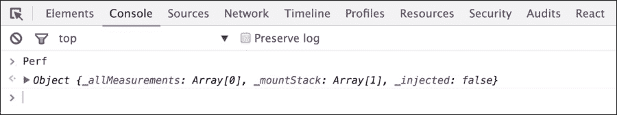

"PERF 插件附带了一些方法，可以帮助我们了解当某些内容发生变化时 React 如何处理 DOM。让我们测量一些性能统计数据。我们将通过在浏览器控制台中调用 `Perf.start()` 来开始测量过程。之后，我们将与应用程序进行交互。我们将输入一个查询以搜索一本书，点击提交，搜索结果将显示出来。我们将通过在浏览器控制台中调用 `Perf.stop()` 来停止性能测量。之后，让我们分析我们收集到的信息。"迈克解释了整个过程。

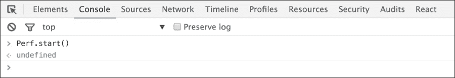

"让我们搜索丹·布朗写的书籍。"


"一旦结果显示出来，我们就停止性能测量。"

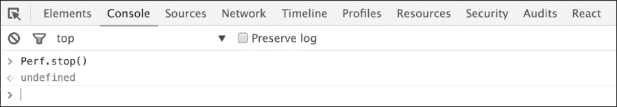

# React 执行的 DOM 操作

"肖恩，PERF 插件可以显示 React 执行了哪些 DOM 操作。让我们看看 React 对丹·布朗的书籍列表进行了哪些操作。"迈克说。

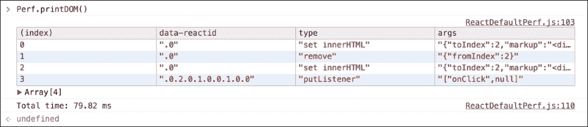

"`Perf.printDOM()` 方法告诉我们 React 执行的 DOM 操作。它只做了两次设置 `innerHTML` 调用。第一次是渲染加载指示器，第二次是渲染行列表。在这之间，我们看到一个移除调用，这应该是加载指示器从页面上移除的时候。"

"哇，这个方法看起来非常实用，因为它可以告诉我们 React 是否在某种程度上做了额外的 DOM 操作。" 肖恩说。

"是的，但还有更多工具可以用来分析性能。让我们看看 React 渲染每个组件需要多少时间。这可以通过使用`Perf.printInclusive()`来实现。" 迈克解释道。

## 渲染所有组件所需的时间

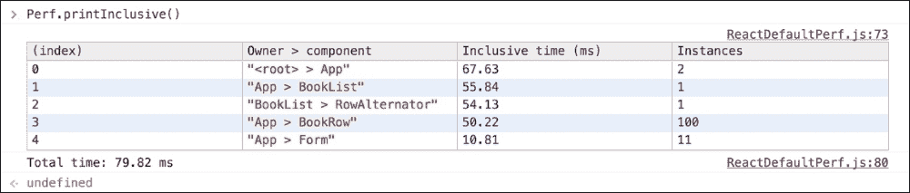

"这个方法打印了渲染所有组件所需的总时间。这还包括处理属性、设置初始状态以及调用`componentDidMount`和`componentWillMount`所需的时间。"

"因此，如果我们在这其中的某个钩子中有一些耗时操作，它将影响`printInclusive`函数显示的输出，对吧？" 肖恩问道。

"正是如此。尽管 PERF 插件提供了另一种方法——`printExclusive()`——它可以在不使用这些钩子的情况下打印渲染所需的时间，这些钩子用于安装应用程序。"

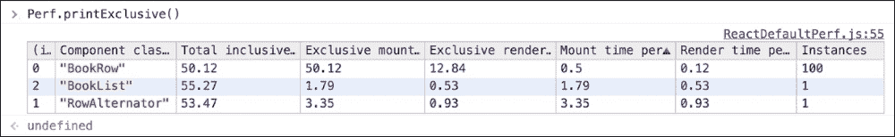

"但是迈克，这些方法对于检测 React 的性能并不那么有帮助。我了解了所有发生的事情的总体情况，但它并没有告诉我如何优化哪个部分。" 肖恩问道。

## React 浪费的时间

"肖恩，PERF 插件还可以告诉我们 React 浪费了多少时间以及在哪里。这有助于确定我们可以进一步优化的应用程序的部分。" 迈克说。

"什么是浪费时间？"

"当 React 重新渲染组件树时，一些组件可能不会从它们的前一个表示形式中改变。然而，如果它们再次渲染，那么 React 在渲染相同的输出上就浪费了时间。PERF 插件可以跟踪所有这些时间，并给我们一个 React 浪费了时间渲染相同输出的总结。让我们看看这个实际操作。" 迈克说。

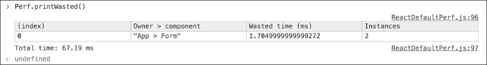

"PERF 插件告诉我们，它浪费了时间在两次重新渲染`Form`组件上，但`Form`组件中没有任何变化，因此，它只是按照原样重新渲染了一切。" 迈克解释道。

"让我们看看`Form`组件，了解为什么会发生这种情况。"

```js
// src/Form.js

import React from 'react';

export default React.createClass({
  getInitialState() {
    return { searchTerm: '' };
  },

  _submitForm() {
    this.props.performSearch(this.state.searchTerm);
  },

  render() {
    return (
      <div className="row" style={this.props.style}>
        <div>
          <div className="input-group">
            <input type="text"
                   className="form-control input-lg"
                   placeholder="Search books..."
                   onChange={(event) => { this.setState({searchTerm: event.target.value}) }}/>
            <span className="input-group-btn">
              <button className="btn btn-primary btn-lg"
                      type="button"
                      onClick={this._submitForm}>
                Go!
              </button>
            </span>
          </div>
        </div>
      </div>
    )
  }
})
```

"肖恩，`Form`组件的渲染不依赖于状态或属性。无论状态和属性如何，它都会渲染相同的输出。然而，当用户在输入框中输入字符时，我们会更新其状态。因此，React 会重新渲染它。实际上，重新渲染的输出并没有任何变化。因此，PERF 插件正在抱怨浪费了时间。" 迈克解释道。

"这是有用的信息，但这看起来像是一种微不足道的浪费，对吧？" 肖恩问道。

"同意。让我们做一些更改，这样我就可以向您展示 React 如何在实际上不应该的情况下浪费大量时间重新渲染相同的输出。" 迈克说。

"目前，我们只显示 Open Library API 返回的前 100 个搜索结果。让我们更改我们的代码，在同一页面上显示所有结果。"

```js
// src/App.js
getInitialState() {
    return { books: [],
             totalBooks: 0,
             offset: 100,
             searching: false,
             sorting: 'asc',
             page: 1,
             searchTerm: '',
             totalPages: 1
    };
  }
```

"我引入了一个新的状态来保存搜索词、从开放图书馆获取的总页数以及当前正在获取的页码。"

"现在，我们想要从 API 默认获取同一页的所有结果。API 通过`numFounds`属性返回查询找到的书籍总数。基于这个，我们需要找到需要从 API 获取的总页数。"

"此外，每次最多返回 100 条记录，这些记录我们已经存储在`state.offset`中了。"

```js
totalPages = response.numFound / this.state.offset + 1;
```

"一旦我们得到总页数，我们需要继续请求下一页的搜索结果，直到所有页面都被获取。你想要尝试让它工作吗？" 迈克问道。

"当然。" 肖恩说。

```js
 // src/App.js  

 // Called when user hits "Go" button.
 _performSearch(searchTerm) {
    this.setState({searching: true, searchTerm: searchTerm});
    this._searchOpenLibrary(searchTerm);
  },

  _searchOpenLibrary(searchTerm) {
    let openlibraryURI = `https://openlibrary.org/search.json?q=${searchTerm}&page=${this.state.page}`;
    this._fetchData(openlibraryURI).then(this._updateState);
  },

  // called with the response received from open library API
  _updateState(response) {
    let jsonResponse = response;
    let newBooks = this.state.books.concat(jsonResponse.docs);
    let totalPages = jsonResponse.numFound / this.state.offset + 1;
    let nextPage = this.state.page + 1;

    this.setState({
      books: newBooks,
      totalBooks: jsonResponse.numFound,
      page: nextPage,
      totalPages: totalPages
    } this._searchAgain);
  },

     // Keep searching until all pages are fetched.
  _searchAgain() {
    if (this.state.page > this.state.totalPages) {
      this.setState({searching: false});
    } else {
      this._searchOpenLibrary(this.state.searchTerm);
    }
  }
```

"我将 API URL 更改为包含页面参数。每次从 API 收到响应时，我们都会用新的页面更新状态。我们还更新`this.state.books`以包括新获取的书籍。然后，在`this.setState`调用的回调中调用`_searchAgain`函数，以确保它是`setState`调用设置的下一页的正确值。" 肖恩解释说。

"很好，这是一个重要的要点，要记住不要在`this.setState()`调用之外调用`_searchAgain`函数，因为它可能会在`setState()`完成之前执行。"

"因为如果我们在外面调用它，`_searchAgain`函数可能会使用错误的`this.state.page`值。然而，由于你已经在回调中将`_searchAgain`函数传递给了`setState`，所以这种情况不可能发生。" 迈克解释道。

"`_searchAgain`函数会一直获取结果，直到所有页面都完成。这样，我们将在页面上显示所有搜索结果，而不仅仅是前 100 条。" 肖恩通知说。

"这正是我想要的。做得好。让我清理一下渲染方法，这样旋转器就会始终显示在底部。" 迈克说。

```js
// src/App.js
render() {
    let style = {paddingTop: '5%'};
    return (
      <div className='container'>
        <Header style={style}></Header>
        <Form style={style}
              performSearch={this._performSearch}>
        </Form>

        {this.state.totalBooks > 0 ?
         <BookList
             searchCount={this.state.totalBooks}
             _sortByTitle={this._sortByTitle}>
           {this._renderBooks()}
         </BookList>
       : null }

        { this.state.searching ? <Spinner /> : null }
      </div>
    );
  }
```

"这将确保在所有结果都显示之前，旋转器会一直显示。好的，都完成了。现在让我们再次测量性能。" 迈克说。

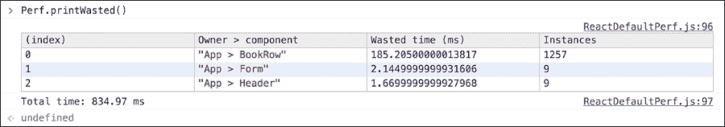

"哇，浪费的时间增加了很多！丹·布朗发布了新书吗？比我们上次看到的时间多了这么多？" 肖恩说。

"哈哈，我认为他刚才并没有发布新书。每次从下一页获取书籍时，我们都将它们添加到现有的书籍中，并从下一页开始获取书籍。然而，之前页面的书籍渲染并没有任何变化。因为我们把所有状态都保存在顶层的`App`组件中，所以每当它的状态发生变化时，`App`下的整个组件树都会重新渲染。因此，`BookList`会再次渲染。反过来，所有的`BookRows`也会再次渲染。这导致在重复渲染之前页面的相同`BookRow`组件上浪费了大量的时间。" 迈克说道。

"所以每次我们从新页面获取书籍时，包括已经在页面上存在的所有书籍都会再次重新渲染？我认为在这种情况下，仅仅将新的书籍行添加到现有列表中会更好。"肖恩说。

"别担心。我们可以轻松地消除这种不必要的浪费时间。React 为我们提供了一个用于短路重新渲染过程的钩子。它是`shouldComponentUpdate`。"

## 应该使用`shouldComponentUpdate`钩子

"肖恩，`shouldComponentUpdate`是一个钩子，它告诉 React 是否重新渲染组件。它不会在组件的初始渲染时被调用。然而，每当组件即将接收新的状态或属性时，`shouldComponentUpdate`都会在那时被调用。如果这个函数的返回值是`true`，那么 React 将重新渲染组件。然而，如果返回值是`false`，那么 React 将不会在下次调用之前重新渲染组件。在这种情况下，`componentWillUpdate`和`componentDidUpdate`钩子也不会被调用。"迈克解释道。

"很好。那么我们的代码为什么浪费了这么多时间？React 不应该使用这个钩子来优化它，并且不应该反复重新渲染相同的`BookRow`组件吗？"肖恩问道。

"默认情况下，`shouldComponentUpdate`总是返回`true`。React 这样做是为了避免微小的错误。我们的代码中可能有可变的状态或属性，这会使`shouldComponentUpdate`返回假阳性。它可能在应该返回`true`时返回`false`，导致组件在应该重新渲染时没有重新渲染。因此，React 将实现`shouldComponentUpdate`的责任放在了开发者的手中。"迈克说。

"让我们尝试自己使用`shouldComponentUpdate`来减少在重新渲染相同的`BookRow`组件上浪费的时间。"迈克补充道。

"这是我们目前的`BookRow`组件："

```js
// src/BookRow.js

import React from 'react';

export default React.createClass({
  render() {
    return(
      <tr style={this.props.style}>
        <td><h4>#{this.props.index}</h4></td>
        <td><h4>{this.props.title}</h4></td>
        <td><h4>{(this.props.author_name || []).join(', ')}</h4></td>
        <td><h4>{this.props.edition_count}</h4></td>
      </tr>
    );
  }
});
```

"让我们添加`shouldComponentUpdate`以减少不必要的重新渲染。"

```js
// src/BookRow.js

import React from 'react';

export default React.createClass({
  shouldComponentUpdate(nextProps, nextState) {
    return nextProps.title !== this.props.title ||
           nextProps.author_name !== this.props.author_name ||
           nextProps.edition_count !== this.props.edition_count;
  },

  render() {
    return(
      <tr style={this.props.style}>
        <td><h4>#{this.props.index}</h4></td>
        <td><h4>{this.props.title}</h4></td>
        <td><h4>{(this.props.author_name || []).join(', ')}</h4></td>
        <td><h4>{this.props.edition_count}</h4></td>
      </tr>
    );
  }
});
```

`shouldComponentUpdate`钩子接收`nextProps`和`nextState`作为参数，并且我们可以将它们与当前的状态或属性进行比较，以做出是否返回`true`或`false`的决定。

"在这里，我们正在检查标题、作者姓名或版次是否已更改。如果这些属性中的任何一个已更改，那么我们将返回`true`。然而，如果所有这些都没有更改，那么我们将返回`false`。因此，如果没有任何属性更改，组件将不会重新渲染。由于`BookRow`组件只依赖于属性，我们根本不必担心状态变化。"迈克补充道。

"现在，再次测量性能，看看我们是否有所改进。"

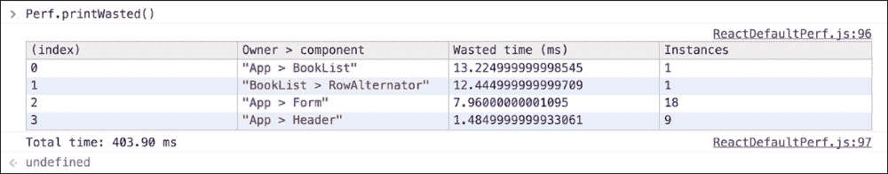

"太棒了，我们完全消除了`BookRow`组件重新渲染所花费的时间。然而，我们还可以做得更好。看起来我们也可以消除重新渲染`Form`和`Header`组件的时间，根据前面的结果。它们是静态组件。因此，它们根本不应该重新渲染。肖恩，这是你的下一个挑战。"

"知道了。"

```js
// src/Header.js

import React from 'react';

export default React.createClass({
  shouldComponentUpdate(nextProps, nextState) {
    return false;
  },

  render() {
    return (
      <div className="row" style={this.props.style}>
        <div className="col-lg-8 col-lg-offset-2">
          <h1>Open Library | Search any book you want!</h1>
        </div>
      </div>
    )
  }
})

// src/Form.js

import React from 'react';

export default React.createClass({
  getInitialState() {
    return { searchTerm: '' };
  },

  shouldComponentUpdate(nextProps, nextState) {
    return false;
  },

  _submitForm() {
    this.props.performSearch(this.state.searchTerm);
  },

  render() {
    return (
      <div className="row" style={this.props.style}>
        <div>
          <div className="input-group">
            <input type="text"
                   className="form-control input-lg"
                   placeholder="Search books..."
                   onChange={(event) => { this.setState({searchTerm: event.target.value}) }}/>
            <span className="input-group-btn">
              <button className="btn btn-primary btn-lg"
                      type="button"
                      onClick={this._submitForm}>
                Go!
              </button>
            </span>
          </div>
        </div>
      </div>
    )
  }
})
```

"迈克，我们可以简单地从`shouldComponentUpdate`中返回`false`，对于`Header`和`Form`组件，因为它们在渲染时根本不依赖于状态或 props！"

"完美的发现，肖恩。记下这些不依赖于任何东西的静态组件。它们是告诉 React 不比较它们的虚拟 DOM 的完美目标，因为它们根本不需要重新渲染。"迈克通知说。

"没错。我会密切关注 UI 中可以提取成更小组件的这些静态部分。"肖恩说。

"现在让我们看看在进行这些改进之后，是否消除了更多浪费的时间。"

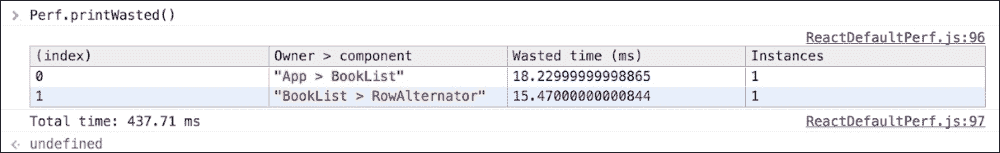

"酷！我们消除了重新渲染相同的`Header`和`Form`组件所浪费的时间。"迈克说。

"太棒了！让我也尝试一下消除`BookList`和`RowAlternator`上花费的时间。"肖恩通知道。

"等等，肖恩。在我们做这件事之前，我想讨论一下`shouldComponentUpdate`的一个替代方案。"

# PureRenderMixin

"肖恩，`PureRenderMixin`是一个可以作为`shouldComponentUpdate`替代品使用的附加组件。在底层，它使用`shouldComponentUpdate`并比较当前和下一个 props 和 state。让我们在我们的代码中试试它。当然，首先我们需要安装这个附加组件。"迈克说。

```js
$ npm install react-addons-pure-render-mixin

// src/Header.js

import React from 'react';
import PureRenderMixin from 'react-addons-pure-render-mixin';

export default React.createClass({
 mixins: [PureRenderMixin],
 ..
 ..
})

// src/Form.js

import React from 'react';
import PureRenderMixin from 'react-addons-pure-render-mixin';

export default React.createClass({
 mixins: [PureRenderMixin],
 ..
 ..
 }
})

```

"肖恩，现在我们用过了`PureRenderMixin`，来看看浪费的时间吧。"迈克说。

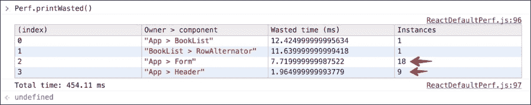

"哦，情况变得更糟了。`PureRenderMixin`函数又把重新渲染`Form`和`Header`组件所浪费的时间加回去了。怎么了，迈克？"肖恩问道。

"冷静点！我要解释一下为什么会这样。`PureRenderMixin`会将当前的 props 和 state 与下一个 props 和 state 进行比较，但它进行的是浅比较。因此，如果我们传递包含对象和数组的 state 或 props，即使它们内容相同，浅比较也不会返回 true。"迈克解释道。

"然而，我们在哪里将任何复杂对象或数组传递给`Header`和`Form`组件呢？我们只是传递了书籍数据，如作者的名字、版次等。我们没有向`Header`传递任何东西，`PureRenderMixin`怎么会失败呢？"肖恩问道。

"你忘了从`App`组件传递给`Header`和`Form`组件的样式属性。"迈克提醒说。

```js
// src/App.js

render() {
    let style = {paddingTop: '5%'};
    return (
      <div className='container'>
        <Header style={style}></Header>
        <Form style={style}
              performSearch={this._performSearch}>
        </Form>
         ..
         ..
      </div>
)}
```

"每次`App`重新渲染时，都会创建一个新的样式对象，并通过 props 发送给`Header`和`Form`。"

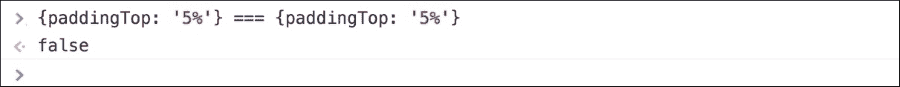

## The PureRenderMixin anti pattern

`PureRenderMixin`内部实现了`shouldComponentUpdate`，如下所示：

```js
var ReactComponentWithPureRenderMixin = {
  shouldComponentUpdate: function(nextProps, nextState) {
    return shallowCompare(this, nextProps, nextState);
  },
};
```

`shallowCompare`函数也是 React 提供的一个附加功能，是一个比较当前状态和 props 与下一个状态和 props 的辅助函数。它基本上实现了与`PureRenderMixin`相同的功能，但由于它是一个函数，可以直接使用，而不是使用`PureRenderMixin`。当我们使用 ES6 类与 React 一起使用时，这尤其必要。" 迈克解释说。

"迈克，所以浅比较是`PureRenderMixin`未能检测到下一个 props 没有变化的原因吗？" 肖恩问。

"是的。`shallowCompare`只是遍历正在比较的对象的键，当每个对象中键的值不是严格相等时返回`false`。因此，如果我们传递简单的 props，如下所示，那么`shallowCompare`将正确地确定不需要重新渲染："

```js
// shallowCompare will detect correctly that props are not changed.
{ author_name: "Dan Brown", 
  edition_count: "20", 
  title: "Angels and Demons" }
```

"然而，如果道具是一个对象或数组，它将立即失败。"

```js
{ author_name: "Dan Brown", 
  edition_count: "20", 
  title: "Angels and Demons", 
  style: { paddingTop: '%5' } }
```

"尽管`PureRenderMixin`为我们节省了一些代码行，但它可能不会像我们预期的那样始终有效。特别是当我们有可变状态、对象或数组作为 props 时。" 迈克说。

"明白了。所以当我们有嵌套状态或 props 时，我们可以编写自己的`shouldComponentUpdate`函数吗？" 肖恩问道。

"是的。`PureRenderMixin`和`shallowCompare`对于具有简单 props 和 states 的简单组件来说很好，但我们在使用它时应该小心。" 迈克说。

### 注意

由于各种原因，在 React 世界中不建议使用混入。在此处查看`PureRenderMixin`模式的替代方法 - [`github.com/gaearon/react-pure-render`](https://github.com/gaearon/react-pure-render)。

# 不可变数据

"迈克，不过我有一个问题。尽管如此，为什么`PureRenderMixin`最初要执行浅比较呢？它不应该执行深度比较，以便我们始终有更好的性能吗？" 肖恩对`PureRenderMixin`不太满意。

"嗯，这里有一个原因。浅比较非常便宜。它不花太多时间。深度比较总是昂贵的。因此，`PureRenderMixin`执行浅比较，这对于大多数简单用例来说已经足够好了。" 迈克说。

"然而，React 确实为我们提供了一个选项，可以定义我们自己的`shouldComponentUpdate`版本，就像我们之前看到的。我们只需从`shouldComponentUpdate`返回`false`就可以完全短路重新渲染过程，或者我们只需比较我们组件所需的那部分 props。"

"没错，就像我们为`BookRow`组件编写`shouldComponentUpdate`一样？" 肖恩问。

```js
// src/BookRow.js

export default React.createClass({
  shouldComponentUpdate(nextProps, nextState) {
    return nextProps.title !== this.props.title ||
           nextProps.author_name !== this.props.author_name ||
           nextProps.edition_count !== this.props.edition_count;
  },

  render() {
    return(
      <tr style={this.props.style}>
        ..
      </tr>
    );
  }
});
```

"确实如此，肖恩。如果需要，你还可以根据组件的需求进行深度比较。"

```js
// custom deep comparison as per requirement
shouldComponentUpdate(nextProps, nextState) {
    return nextProps.book.review === props.book.review;
}
```

"肖恩，我们还有另一个选择，那就是使用不可变数据。比较不可变数据非常简单，因为它总是会创建新的数据或对象，而不是修改现有的对象。"

```js
// pseudo code 
book_ids = [1, 2, 3]
new_book_ids = book_ids.push(4)
book_ids === new_book_ids # false
```

"因此，我们只需要比较新对象的引用与旧对象的引用，当值相等时它们总是相同的，当值不相等时它们总是不同的。因此，如果我们使用不可变数据作为我们的 props 和 state，那么`PureRenderMixin`将按预期工作。" 迈克说道。

### 注意

检查[`facebook.github.io/immutable-js/`](http://facebook.github.io/immutable-js/)，作为使用不可变数据作为 state 和 props 的选项。

# 摘要

在本章中，你了解了 React 提供的性能工具以及如何使用它们。我们使用了 PERF 插件：`shouldComponentUpdate`和`PureRenderMixin`。我们还看到了在尝试提高我们应用性能时需要关注的区域。我们还研究了在提高性能时可能遇到的陷阱，特别是与`PureRenderMixin`相关。最后，我们讨论了不可变数据的重要性和优势。

在下一章中，我们将使用 React Router 和 Flux 详细查看 React 的数据模型。你将学习如何使用 React 与其他框架如 Backbone 一起使用。
