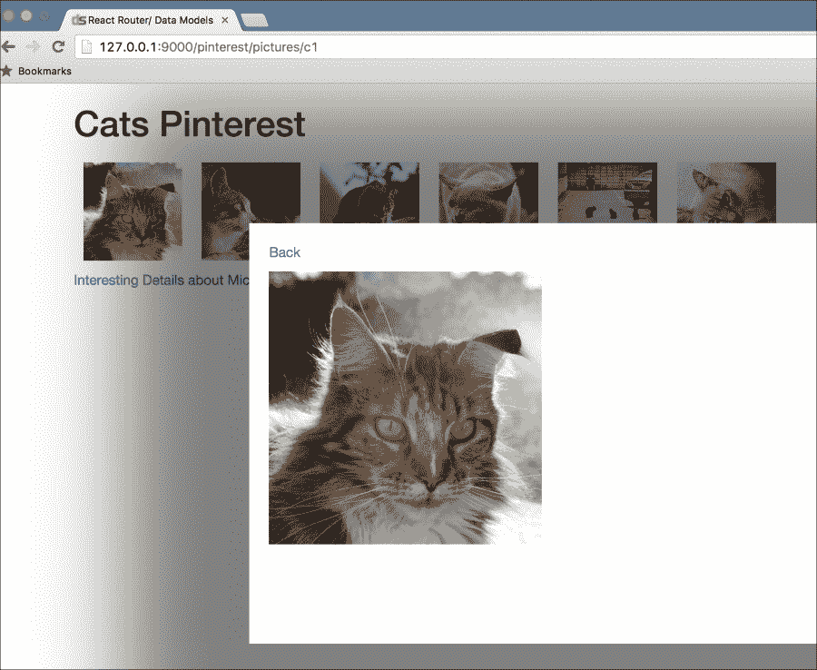
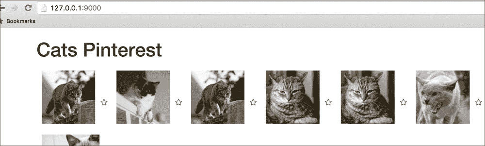
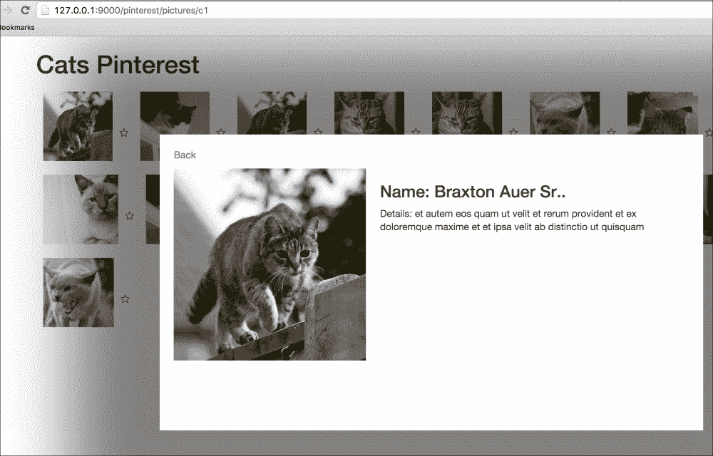
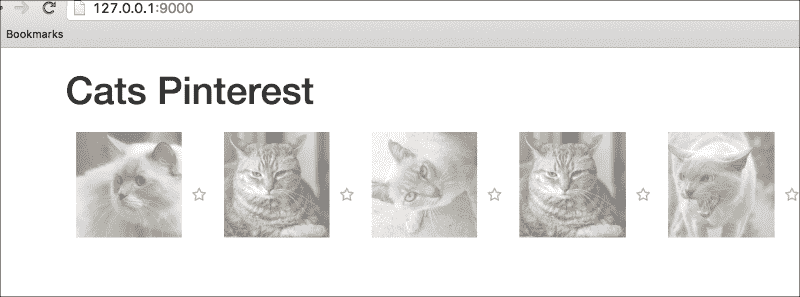
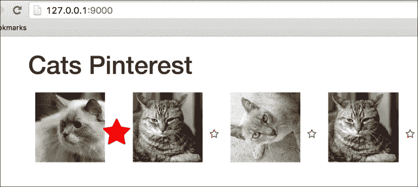
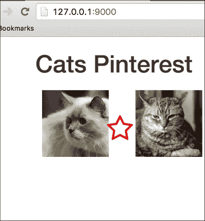
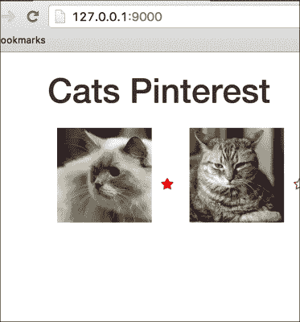

# 第十章。动画

在上一章中，我们了解了 react-router 并在不同级别执行路由。我们还探讨了嵌套路由、传递参数以及 react-router 在执行路由任务时如何维护历史记录。我们学习了传递上下文和使用上下文来渲染 React 组件。我们探讨了数据模型，并将它们与其他框架混合匹配，用作 React-like Backbone 中的数据模型，并介绍了 Flux。

在本章中，我们将探索一个有趣的 React 插件，动画。我们将从继续我们的猫 Pinterest 应用开始，并增强它以支持星标和共享数据来更新视图。然后我们将探索添加动画处理器。我们将看到组件是如何被包装进行动画的，以及 React 是如何为不同事件添加处理器的。我们还将探索不同的事件，以及我们如何轻松增强我们的应用程序以创建惊人的效果。

在本章中，我们将涵盖以下主题：

+   修改数据流并从 react-router 链接传递数据

+   React 中的动画

+   CSS 过渡

+   转换组

+   转换处理器

+   动画我们的动态组件

在本章末尾，我们将能够开始为不同的动作如添加新内容、更改数据和位置等对 React 组件进行动画处理。我们还将能够添加不同类型事件的处理器，并探索除了核心动画插件之外的不同动画选项。

# 在 Adequate LLC 有很多有趣的事情！

"嗨，肖恩和迈克！" 卡拉加入了迈克和肖恩的对话。

在前一天，卡拉要求他们为他们的一个客户构建一个 Pinterest 风格的猫应用。

"今天怎么样？"她询问道。

"一切顺利，卡拉。肖恩，你想向卡拉展示我们昨天建造的东西吗？"

"当然。"



"看起来不错！我们接下来要添加点赞/星标猫的按钮吗？"

"是的，我们正准备做这件事。"

"酷。昨天客户打电话来了。他们除了显示猫之外还想显示屏幕上猫的更新流。这将在有人点赞猫时发生，这样我们就可以向其他用户展示它。"

"明白了。我们将开始工作，并模拟添加猫到屏幕上以开始。"

"太棒了，我就让你们俩处理吧。"

# 模型更新

"所以肖恩，我们不如将 Backbone 集合移动到一个类中，以独立的方式使用它，让它随机添加新的猫并提供一些其他工具，如下所示："

```js
const PictureModel = Backbone.Model.extend({
  defaults: {
    src: 'http://lorempixel.com/601/600/cats/',
    name: 'Pusheen',
    details: 'Pusheen is a Cat',
    faved: false
  }
});
```

"我们的`PictureModel`保持不变。我们在这里添加一个新的`faved`属性来维护用户是否喜欢这只猫的状态。

"我们将把这个新类命名为`CatGenerator`，它将提供我们用来显示猫的组件，以及显示、获取和添加新猫的数据。"

"明白了。需要我试一试吗？"

"当然。"

```js
import Backbone from 'backbone';
import Faker from 'faker';
import _ from 'underscore';
…

class CatGenerator {
  constructor() {
    this.Cats = new Backbone.Collection;
    [600, 601, 602, 603, 604, 605].map( (height)=>{
      this.createCat(height, 600);
    })
  }

  createCat(height = _.random(600, 650), width = 600) {
    console.log('Adding new cat');
    this.Cats.add(new PictureModel({
      src: `http://lorempixel.com/${height}/${width}/cats/`,
      name: Faker.Name.findName(),
      details: Faker.Lorem.paragraph()
    }));
  }
}
```

"做得好，肖恩。"

"谢谢。我已经将`createCat`作为一个独立的方法移动，这样我们就可以在运行时向集合中添加猫。我现在正在添加一个随机的一个，随机高度为 600-650 和随机宽度来创建一个新的`PictureModel`实例。"

"此外，首先，我在类属性上创建了一个`cats`集合。接下来，我一开始就添加了六只猫。"

"酷。我们现在将开始更改它在我们的组件中的使用。"

### 提示

"记住，当新数据到来时，我们将更新组件。这样做的一个简单方法是开始在`Home`组件上存储`CatGenerator`作为状态对象。"

"让我们开始定义和更改我们的`Home`组件，如下所示："

```js
class Home extends React.Component {
  constructor() {
    super();
    this.timer = null;
    this.state = {catGenerator: new CatGenerator()};
  }

  componentDidMount() {
    this.timer = setInterval(::this.generateCats, 1000);
  }

  generateCats() {
    let catGenerator = this.state.catGenerator;
    catGenerator.createCat();
    clearInterval(this.timer);
    this.timer = setInterval(::this.generateCats, catGenerator.randRange());

    this.setState({catGenerator: catGenerator});
  }
…
```

"所以，我们在这里做的是创建一个计时器来跟踪时间间隔。我们将使用一个随机的时间间隔来模拟在这里添加新的猫流。"

"明白了," 肖恩接着说。

"为此，我添加了`generateCats()`方法。在我们的`componentDidMount`中，我们在第一次创建后添加并设置计时器来调用此方法。"

"在方法本身中，我添加了清除旧间隔，并且我们调用`catGenerator.createCat()`方法来实际上从我们的`CatGenerator`类创建猫。"

"然后我们重置计时器并设置一个新的，基于随机的时间间隔。我在`CatGenerator`类中添加了`catGenerator.randRange()`方法来生成随机的时间间隔。这就是它在`CatGenerator`类中的样子："

```js
randRange() {
    return _.random(5000, 10000);
  }
```

"明白了。这应该会在 5-10 秒的范围内创建一个新的猫流。"

"接下来，让我们看看我们的渲染方法看起来怎么样。我打算在猫旁边添加一个星号。"

```js
render() {
    let Cats = this.state.catGenerator.Cats;

    return (
        <div>
          <div>

              {Cats.map(cat => (
                  <div key={cat.cid} style={{float: 'left'}}>
                    <Link to={`/pictures/${cat.cid}`}
                          state={{ modal: true, returnTo: this.props.location.pathname, cat: cat }}>
                      
                    </Link>
                    <span key={`${cat.cid}`} className="fa fa-star"></span>
                  </div>
              ))}

          </div>
        </div>
    )
  }
```

"我在这里做了两个更改。首先，我添加了一个默认未收藏的星号。"

```js
                    <span key={`${cat.cid}`} className="fa fa-star"></span>
```

"其次，我开始在模态链接的状态中传递猫对象。"

```js
                    <Link to={`/pictures/${cat.cid}`}
                          state={{ modal: true, 
                                       returnTo: this.props.location.pathname,  
                                       cat: cat }}>
```

"在我们的`PictureModel`框中，我们之前可以访问全局猫集合。从现在起，情况将不再是这样，我们需要将猫对象传递给`Picture`组件。"

"这很棒，我们能够将对象传递给从路由`<Link/>`对象来的组件。"

"是的，让我们继续更改图片组件，以便它能够正确地处理这个新的数据传递变化。我们的`Modal`保持不变："

```js
const Modal = React.createClass({
  styles: {
…   
  },

  render() {
     return (
      <div style={this.styles}>
        <p><Link to={this.props.returnTo}>Back</Link></p>
        {this.props.children}
      </div>
    )
  }
})
…
export {Modal as default}
```

"现在`Picture`组件开始使用猫对象。"

```js
import React from 'react'
import { PictureModel } from './models';

const Picture = React.createClass({
  render() {
    let { location } = this.props;
    let cat = location.state.cat;
    console.log(this.props);
    return (
        <div>
          <div style={{ float: 'left', width: '40%' }}>
            
          </div>
          <div style={{ float: 'left', width: '60%' }}>
            <h3>Name: {cat.get('name')}.</h3>
            <p>Details: {cat.get('details')} </p>
          </div>
        </div>
    )
  }
});

export {Picture as default}
```

"正如你所看到的，猫对象是通过`location.state`对象从 props 接收的。"

"我已经扩展了图片以显示有关猫的更多详细信息，例如名称等，而不是在单独的页面上显示。之前它看起来相当空白。"

"酷，让我们看看它看起来怎么样，好吗？"



"很好，星星看起来不错。我们很快需要检查我添加的样式。"

"模态看起来也不错，看看所有这些作为流生成的猫！"

"太棒了！" 迈克和肖恩欢呼。



# 动画

"React 允许我们通过其 react-addons-css-transition-group 扩展插件轻松地动画化对象。"

"这为我们提供了对 `ReactCSSTransitionGroup` 对象的引用，这是我们用来动画化数据变化（如添加猫、点赞/取消点赞等）的。"

"让我们先从动画化新猫添加到流中开始，怎么样？"

```js
render() {
    let Cats = this.state.catGenerator.Cats;

    return (
        <div>
          <div>
            <ReactCSSTransitionGroup transitionName="cats" 
                                     transitionEnterTimeout={500} 
                                     transitionLeaveTimeout={300}
                                     transitionAppear={true} 
                                     transitionAppearTimeout={500}>
              {Cats.map(cat => (
                  <div key={cat.cid} style={{float: 'left'}}>
                    <Link to={`/pictures/${cat.cid}`}
                          state={{ modal: true, returnTo: this.props.location.pathname, cat: cat }}>
                      
                    </Link>
                    <span key={`${cat.cid}`} className="fa fa-star"></span>
                  </div>
              ))}

</ReactCSSTransitionGroup>
          </div>
        </div>
    )
  }
```

"在这里，我更改了我们的渲染方法，并简单地用 `ReactCSSTransitionGroup` 元素包裹了猫集合的显示，如下所示。"

```js
            <ReactCSSTransitionGroup transitionName="cats" 
                                     transitionEnterTimeout={500}
                                     transitionLeaveTimeout={300}
                                     transitionAppear={true} 
                                     transitionAppearTimeout={500}>
```

"让我们逐一在以下内容中查看它们："

+   `transitionName`：此属性用于定义应用于不同事件（如元素进入、离开等）的 CSS 类的前缀。

+   `transitionEnterTimeout`：这是元素在渲染后新鲜显示的超时时间。

+   `transitionLeaveTimeout`：这与 `transitionEnterTimeout` 类似，但用于元素从页面移除时。

+   `transitionAppear`：有时，我们想在元素首次渲染时动画化元素集合的添加，在我们的例子中是猫。我们可以通过将此属性设置为 `true` 来实现这一点。

    ### 注意

    注意，在第一个元素显示之后添加的元素将应用 `transitionEnter` 属性。

+   `transitionAppearTimeout`：这与其他超时值类似，但用于 `transitionAppear`。

+   `transitionEnter`：默认情况下，此属性设置为 `true`。如果我们不想动画化元素进入过渡，则可以将其设置为 `false`。

+   `transitionLeave`：默认情况下，此属性设置为 `true`。如果我们不想动画化元素离开过渡动画，则可以将其设置为 `false`。

"现在，基于过渡和过渡名称，类被应用到 `<ReactCSSTransitionGroup/>` 组件内的元素上。例如，对于进入过渡，以及我们的 `cats` 前缀，`cats-enter` 将被应用到元素上。"

"在下一个周期中，`cats-enter-active` 将应用到元素应该处于的最终类。"

"明白了。"

"让我们检查一下我们可以根据这个定义的所有不同过渡。"

```js
.cats-enter {
    opacity: 0.01;
}

.cats-enter.cats-enter-active {
    opacity: 1;
    transition: opacity 1500ms ease-in;
}
.cats-leave {
    opacity: 1;
}

.cats-leave.cats-leave-active {
    opacity: 0.01;
    transition: opacity 300ms ease-in;
}

.cats-appear {
    opacity: 0.01;
}

.cats-appear.cats-appear-active {
    opacity: 1;
    transition: opacity 1.5s ease-in;
}
```

"这里的动画过渡相当简单。当在开始时添加新元素，从我们初始化的六只猫开始，将应用 .cats-appear 类。在下一次计时器滴答声后，将添加 .`cats-appear-active` 类到元素上。"

"接下来，在过渡成功后，类将被移除，如下面的截图所示："



"肖恩，如果你能看到，你会注意到猫是如何淡入然后以全不透明度显示其最终状态的。"

"不错。看起来很棒。当新元素被添加时，这是一个很好的效果。"

"确实。你想尝试动画化星星吗？"

"当然！"

"让我首先检查一下我们为星星设置的类。我看到你已经使用了 font-beautiful 星星并为他们添加了样式。"

```js
.fa {
  transition: all .1s ease-in-out;
  color: #666;
}
.star{
    display: inline-block;
    width: 20px;
    position: relative;
}

.star span{
    position: absolute;
    left: 0;
    top: 0;
}

.fa-star{
  color: #fa0017;
}

.fa-star-o{
    color: #fa0017;
}

.fa-star-o:active:before {
  content: "\f005"!important;
}
```

"是的，就在那里。"

"首先，让我处理星星的点赞和取消点赞功能。"

```js
faveUnfave(event){
    let catCid = event.target.dataset;
    let catGenerator = this.state.catGenerator;
    let Cats = catGenerator.Cats;
    let cat = Cats.get(catCid);
    cat.set('faved', !cat.get('faved'));
    catGenerator.Cats = Cats;
    this.setState({catGenerator: catGenerator});
  }
```

"将元素改为添加 `data-cid` 和 `handler`，如下所示："

```js
<span key={`${cat.cid}`}  className="fa fa-star" onClick={::this.faveUnfave} data-cid={cat.cid}></span>  
```

"首先，我将 `faveUnfave` 作为 `onClick` 事件传递，这个事件在这里绑定到了类上下文中。接下来，我为 `data-cid` 传递了 `cat.cid` 的值。"

"在 `faveUnfave` 方法中，我将拉取点赞元素的猫 ID。基于此，我将从猫生成器的猫集合中拉取猫对象。稍后，我将切换当前点赞值的状态并重置集合的状态。"

"看起来不错。"

"接下来，我将根据当前的点赞状态显示点赞或取消点赞的星星，并将其包装为 CSS 过渡，这样我们就可以开始显示显示和隐藏星星、更改颜色等动画。"

```js
<ReactCSSTransitionGroup transitionName="faved"
                                             transitionEnterTimeout={500}
                                             transitionLeaveTimeout={300}
                                             transitionAppear={true}
                                             transitionAppearTimeout={500}
                                             className="star">
                    {()=>{
                      if(cat.get('faved') === true){
                        return <span key={`${cat.cid}`}  className="fa fa-star" onClick={::this.faveUnfave} data-cid={cat.cid}></span>;
                      } else {
                        return <span key={`${cat.cid}`}  className="fa fa-star-o" onClick={::this.faveUnfave} data-cid={cat.cid}></span>;
                      }
                    }()}
                    </ReactCSSTransitionGroup>
```

"太完美了，”迈克接着说。

"现在让我们为这个点赞添加样式。"

```js
.faved-enter {
    transform: scale(1.5);
}

.faved-enter.faved-enter-active {
    transform: scale(3);
    transition: all .5s ease-in-out;
}

.faved-leave {
    transform: translateX(-100%);
    transform: scale(0);
}

.faved-leave.faved-leave-active {
    transform: scale(0);
    transition: all .1s ease-in-out;
}
```

"在这里，我添加了动画，当点击星星时，它会放大，类似于 Twitter 的点赞功能。然后，它会恢复缩放并保持在点赞状态。"

"同样，在取消点赞时，它将放大并恢复到原始大小。"

"看起来不错，让我们检查一下，”迈克接着说。

"嗯，我觉得所有元素都在这里，但它似乎不起作用，迈克？"

"让我看看。啊，所以罪魁祸首是这个："

```js
                       {()=>{
                      if(cat.get('faved') === true){
                        return <span key={`${cat.cid}`}  className="fa fa-star" onClick={::this.faveUnfave} data-cid={cat.cid}></span>;
                      } else {
                        return <span key={`${cat.cid}`}  className="fa fa-star-o" onClick={::this.faveUnfave} data-cid={cat.cid}></span>;
                      }
                    }()}
```

### 注意

注意我们在这里使用的关键值？它是相同的。`TransitionGroup` 会跟踪元素的变化，并根据键值执行动画任务。`TransitionGroup` 需要知道元素中发生了什么变化，以便执行动画任务，它还需要键来识别元素。

"在这种情况下，点赞或取消点赞时，键将保持为 `cat.cid`，因此元素保持不变。"

"让我们给键添加一个后缀或前缀，以及点赞状态。"

```js
{()=>{
                      if(cat.get('faved') === true){
                        return <span key={`${cat.cid}_${cat.get('faved')}`} className="fa fa-star" onClick={::this.faveUnfave} data-cid={cat.cid}></span>;
                      } else {
                        return <span key={`${cat.cid}_${cat.get('faved')}`} className="fa fa-star-o" onClick={::this.faveUnfave} data-cid={cat.cid}></span>;
                      }
}()}
```

"太完美了。现在它工作了，迈克。"

"是的。肖恩，你在 CSS 动画方面做得很好。星星看起来不错。让我们看看现在是什么样子。"

"这就是我们给猫点赞时的样子："



"这个是在点赞过渡完成后。"



"最后，当我们尝试取消点赞猫时，也会发生相同的动画。"



"太完美了，卡拉会喜欢的！"

在 Adequate LLC 度过了一个愉快的一天。肖恩和迈克致力于重构他们的应用程序，以便数据更改能够反映视图更改，并对添加和删除的猫进行动画处理。他们还研究了如何点赞/取消点赞星星。

# 摘要

在本章中，我们围绕改变数据流和直接从 react-router 链接传递数据进行了操作。我们查看了对添加/删除或出现的对象集合进行动画处理。我们看到了 `ReactCSSTransitionGroup` 支持的不同过渡事件以及如何使用相关类来动画化我们的对象。

在下一章中，我们将学习如何使用 Jest 和 React TestUtils 测试我们的应用程序。
