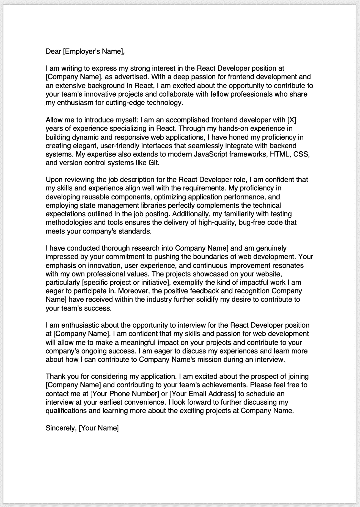
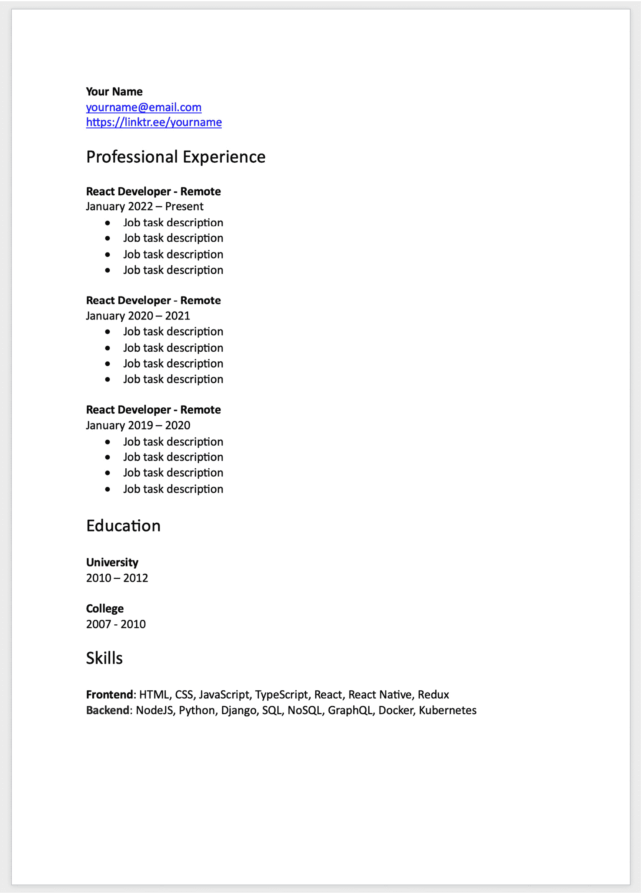
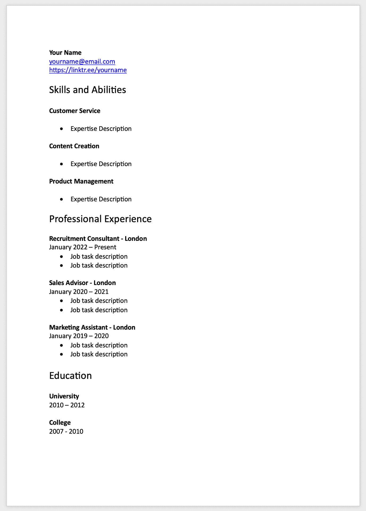
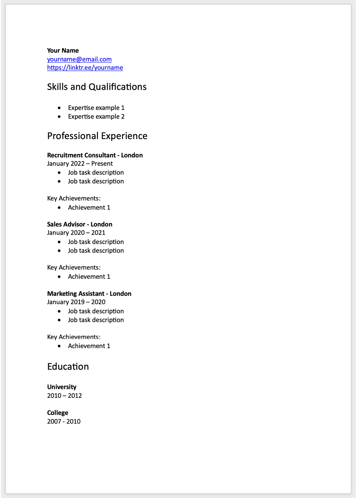
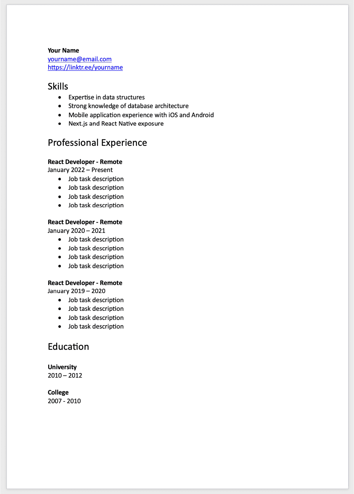

# 1

# 为面试准备做好准备

在今天这个不断变化的就业环境中，找到适合你能力、兴趣和目标的工作可能很困难。如果你想从人群中脱颖而出并获得理想的工作，就必须投入时间和精力来完善面试技巧。本章将为你提供完整的路线图，通过提供有用的指导和每个面试阶段的必要见解，帮助你自信地导航到下一个职业机会。在接下来的章节中，我们将探讨针对 React 开发者的常见面试问题，以便我们为在这个行业作为熟练使用 React 框架的 JavaScript 开发者找到工作做好准备。

当我们开始实际求职时，我们会查看许多资源来寻找机会，包括 LinkedIn、会议和推荐。我们通过利用你的专业网络、增强你的互联网个人资料和进入未开发的就业市场来了解方法，这样你就有必要了解和资源来找到各种机会并建立持久的关系。在本章中，我们将从讨论你的简历和求职信开始，这是你求职的基础。这些关键文件向潜在雇主提供了你资格的概述，并让你了解你的专业态度。为了吸引招聘经理的注意，我们详细介绍了创建吸引人的内容、根据工作的需求定制你的简历和求职信，以及提高它们的整体展示效果。

由于我们将申请 React 职位，因此我们适当地调整简历非常重要，这样我们就有机会让招聘经理看到我们的简历。这可以通过包括相关的热门词汇，如*React*、*Redux*和*Next.js*来实现，这些都是与 React 生态系统相关的，进一步强化了我们的个人资料，因为很明显，我们是一个值得检查的候选人，因为我们使用他们在职位描述中最可能拥有的工具和技术。

接下来的策略应该是建立一个能够提升我们的求职过程并使我们更具可雇佣性的流程。这可以包括以下事项：

+   拥有 GitHub 个人资料

+   创建个人网站作品集

这在创意和技术领域尤为重要，雇主经常需要你技能的具体证据。我们将在以下方面提供建议：

+   选择项目

+   完善你的个人资料

+   建立一个有趣的个人作品集

通过这些信息，我们可以展示我们的技术专长，同时捕捉到我们个性的精髓，这对于突出我们最好的工作，使我们成为一个突出的候选人非常有帮助。

最后，我们提供无价的面试建议，帮助你成功。我们涵盖了所有内容，不留任何石块未翻，以确保你为面试做好了充分的准备，从准备行为和技术问题到掌握沟通和谈判的艺术。

开始这段旅程可能会既令人兴奋又充满挑战，但如果你持有正确的态度并遵循本章中的建议，你就可以拥抱这个过程并取得成功。所以，做好准备，让我们开始你的面试准备之路。

在本章中，我们将涵盖以下主题：

+   准备你的简历和求职信

+   构建你的 GitHub 个人资料或网站作品集

+   寻找可以申请的工作

+   理解聚会和推荐的作用

+   探索面试技巧

# 准备你的简历和求职信

在本节中，我们将介绍如何创建一份优秀的简历和求职信的过程，这对于你作为 React 开发者在求职过程中想要在面试阶段取得最佳效果至关重要。这是一个可以实质性地影响你是否会发现自己处于一个不断有工作机会涌入的位置的领域。拥有一份优秀的简历和同样优秀的求职信是准备全面的第一步——换句话说，就是为你可能遇到的任何挑战性结果做好准备。第一步始终是说服招聘经理你是一个值得列入候选人名单的候选人。

## 区分简历和求职信

现在，我们将讨论简历和求职信之间的区别，让我们开始吧。本质上，简历是一种 Word 或 PDF 文档，基本上展示了一个人的工作历史。这就是你将展示你截至最近日期的所有职业经验的地方。简历可以涵盖你的兴趣领域，如教育、工作经验、成就和技能。拥有简历的初衷主要是向试图雇佣你的公司展示你的知识和资格，希望你的个人资料足够强大，能让你获得面试机会。第一步始终是说服招聘经理你是一个值得列入候选人名单的候选人。

另一方面，求职信是篇幅不超过一页的文件。它们的主要目的是伴随简历使用，并且通常与简历同时提交以申请某个职位。求职信不如简历正式，这意味着你可以在这里用词更加表达自己。这是你向公司介绍自己的机会，并解释为什么你是最值得他们认真考虑雇佣的候选人。我们应该利用求职信来突出我们的最佳技能和经验，目标是最终说服招聘经理和公司，我们的简历和个性使我们成为潜在的文化契合者，并且我们有资格获得面试机会，至少这样我们可以证明自己。你可以在*图 1.1*中找到一个优秀的求职信示例：

图 1.1：求职信

## 优秀简历和求职信的重要性

现在我们来讨论拥有良好简历和求职信的重要性，以及为什么它们对于求职者来说是必不可少的。相信你只需一个通用的简历就能应付一切，认为这不是一个高优先级的事项，而且你的时间应该花在求职过程的其它领域，比如做工作申请，这实在是太容易了。我们将进一步分析，以便突出拥有突出简历和求职信如何对你有利。

为了做到这一点，我们将探讨留下良好第一印象的重要性，学习如何通过筛选流程，了解哪些定制化需要关注，学习如何推销自己的品牌，以及学习如何训练自己以自信的姿态进入面试。

### 如何留下良好第一印象

当人们第一次见到我们时，他们实际上对我们知之甚少。这本质上给了我们一块空白画布，我们可以在上面真正地向新人推销自己，并说服他们我们是有价值且值得了解的。简历和求职信基本上是类似向新人打招呼或与想要了解的新人握手的那种介绍性文件。通过撰写良好的文件，我们能够将自己与其他候选人区分开来，并希望将自己置于候选名单的顶端。

根据我的经验，你需要尽可能地友好，带着魅力和尽可能多的信念与积极性去参加面试。有时候，如果你因为任何原因在那天感到情绪低落或不好，那可能会很困难，但你必须找到克服它的方法。我曾经在感觉不是最好的时候去参加面试，这反而影响了面试。同样，我也曾因为那天心态正确，知道要说什么，而面试进行得很顺利。对我来说，一个有效的方法是在面试前听音乐或冥想。感到放松或充满挑战的热情真的会给你提供在那天展示最佳自我的力量。

### 通过筛选流程

这是我们的机会，向潜在的新雇主展示我们有多么优秀。简历和求职信被用来筛选新候选人，看看哪些人值得面试。如果我们提交的内容写得不好、过时、虚假，或者有太多的语法、拼写和其他不准确之处，那么我们几乎不可能进入面试阶段。在这些情况下，可能会遇到拒绝甚至被“幽灵”的情况，即你从未收到他们的回复。当然，这种情况可能有很多原因；我们只是刚刚讨论了几种情况。

我记得有一次，我的简历上有些拼写错误，我甚至没有注意到，也没有人指出。你可能认为 Word 的拼写检查器会显示所有错误，但事实并非如此。我有一些单词全部是大写字母，拼写检查器没有发现这些错误。这就是为什么你双倍和三倍检查你所写的内容是至关重要的。甚至让其他人帮你校对也是一个好选择。他们可能会发现你遗漏的东西。

### 定制你的简历和求职信

现在是我们学习定制化的时候了，了解定制简历和求职信如何能进一步增加你的就业机会。如果你为每个申请的职位都创建一个定制的简历和求职信，那么你可以展示你已经花时间阅读了他们的职位描述，并且能够展示你的当前技术栈与工作完美匹配。一个定制的个人资料总是会比通用的个人资料更突出。当然——为每个申请定制内容可能需要更长的时间，但如果这能带来几个面试机会，那么显然这是值得的。

这些年，我在这方面取得了很大的成功，我定制的简历比我在各个地方都用的通用简历带来了更多的面试机会。所以，假设我正在申请一个 React 角色。为了提高成功的可能性，我会尝试突出我所有的 React 经验。所以，我会添加链接到我在 GitHub 或一个活网站中创建的 React 项目。我也是一个技术作家，添加链接到我已经发布的关于 React 的文章将帮助我更加突出。

我还可以更进一步，对于每个相关角色，我都可以提及一些关于 React 的内容，例如——比如——“集成 Redux 存储并优化了应用程序的性能，使用户的加载时间更快。”加入诸如*Next.js*、*Vercel*、*Netlify*、*AWS*和其他技术的关键词将进一步提升我们的形象，因为它表明我们精通现代技术栈。

### 销售你的品牌

我们是品牌。这是一个在我们生活中行走时应该意识到的重要概念。每次我们遇到新的人，我们都有机会建立新的联系，这可能会为我们打开更多生活体验的大门。我们使用简历和求职信进行营销，因为我们本质上是在向新的人销售自己和我们的理念。这给了我们一个机会来突出我们的经验、生活成就和技术能力，这些在常规的求职申请中很难衡量。

这种认识让我将这种心态应用到生活的方方面面。无论是我在社交媒体上创建的内容，还是我发送给客户的电子邮件，都关乎拥有这种品牌和商业专业精神。如果你能证明自己是一个可信的人，人们更有可能相信你。

### 带着自信进入

当我们投入时间和精力制作一份精美的简历和求职信时，它对我们的自信大有裨益。你一开始就能展现出的自信越多，你在面试中表现良好的可能性就越高。当我们充满自信地进入某个场合，而不是感到消极和沮丧时，这确实会带来很大的不同。我们吸引我们向世界输出的东西。我们输出的正能量越多，反馈回来的正能量就越多。

我很难想起我心情低落、缺乏自信时在那里进行的成功面试。人们真的能感受到这种能量，这就是为什么在面试前保持正确的心理状态如此重要的原因。有时候，在经历了多次拒绝和被冷落的经验之后，我会感到情绪低落，这种情况我们每个人都会遇到。在这种情况下，最好暂时休息一下面试，这是我强迫自己做的。自信会随着时间的推移而回归。如果你像我一样感到疲惫不堪，那就休息一下。

在下一节中，我们将学习我们可以创建的不同类型的简历。每份工作都是不同的，因此了解我们可用的各种简历类型以及哪些最适合每项工作非常重要。

## 探索简历类型

选择一种最能突出你的才能和经验，并且与你所寻找的职位相关的简历格式至关重要。

简历有多种类型，如按时间顺序、功能性、组合、针对性、创意等。每一种都有其不同的用途。我们将学习它们之间的区别，以便在创建自己的简历时考虑这一点。

### 按时间顺序的简历

最受欢迎的简历格式是按时间顺序的简历。我们可以在*图 1.2*中看到一个此类简历的例子：

图 1.2：按时间顺序的简历

你从最近的工作开始，然后往回追溯；它以倒序时间顺序展示你的工作历史。这种方法展示了你的职业发展，并展示了你的才能是如何随着时间的推移而发展的。这种风格受到求职者的喜爱，也是我个人偏好的风格，因为它提供了一个简洁且易于理解的就业历史描述，使招聘经理能够快速评估资历和潜力。

一个普通的按时间顺序的简历将从候选人的联系信息开始，然后是专业概述或目标陈述，接着是详细的工作历史列表。每个职位都将记录标题、雇主、雇佣日期、主要职责和成就，以及在该职位期间获得的任何相关技能或认证。

对于有稳定工作历史和明确职业轨迹的候选人来说，按时间顺序的简历最有益，因为他们可以展示他们的发展和进步。然而，这种风格可能不适合那些几乎没有工作经验、长期失业或试图改变职业或角色的人。

### 功能性简历

与强调你的工作经验不同，功能性简历专注于你的才能和能力。我们可以在*图 1.3*中看到一个此类简历的例子：

图 1.3：功能性简历

它展示了你的成功和才能，那些在就业历史中存在空缺的人经常选择使用这种类型。

功能性简历仍然包括申请人的工作历史，但它以简化的风格呈现，不包含日期或职位名称。相反，重点在于与申请职位最相关的成就和才能。通常，这些能力会被分类成组，例如沟通、领导力、问题解决和技术能力。

在功能型简历的开头，可能包括一个简短的概述或目标陈述，强调申请人的顶级资质。简历的最后部分也可能包括有关教育和其他相关资历的信息。尽管功能型简历可以有效地突出候选人的能力和成就，但一些招聘经理可能会对此风格持谨慎态度，因为它可能被视为试图掩盖缺乏经验或就业空缺的努力。因此，确保功能型简历针对具体的职位需求进行定制，并以开放和诚实的的方式进行展示至关重要。

### 组合简历

这种简历格式结合了功能型和按时间顺序简历的方面。简历包括您的工作历史部分，同时突出您的成就和才能。对于拥有多样化工作历史的求职者，这种风格特别有帮助，因为它同时突出了他们的先前经验和才能。

我们可以在*图 1.4*中看到这种简历的例子：

图 1.4：组合简历

在组合简历中，候选人的就业历史以倒序时间顺序列出，但用对最显著成就和职责的总结代替了每个职位的详细描述。这使得申请人能够在不过度详细的情况下展示他们的资质。

当候选人在特定技能类别中概述他们的主要才能和成就时，工作历史部分之后会包含一个技能部分。技术能力、语言能力、项目管理技能和其他才能可以包含在这个与申请职位相关的区域中。

组合简历也可能以一个总结或目标陈述开始，强调申请人的显著成就和职业目标，并且它可能以申请人的教育和其他相关资历信息结束。

### 目标简历

目标简历是一种针对特定职位或行业定制的简历。它强调与您申请的职位最相关的知识和专业技能。

我们可以在*图 1.5*中看到这种简历的例子：

图 1.5：目标简历

对于目标职位申请人来说，通常在根据职位的独特标准定制简历之前，会仔细阅读职位描述。为了突出申请人的相关经验和才能，并展示他们如何满足特定的职位标准，有必要对简历的内容和关键词进行修改。

一种有针对性的简历风格可以从概述或目标陈述开始，突出申请人的强大教育背景、培训经验和成就，以及证明他们适合该职位的成就。尽管候选人的工作历史和教育背景也将被包括在内，但重点将放在突出他们最相关的资格，这些资格与职位描述相匹配。

通常，有针对性的简历是一种突出候选人技能并提高他们获得面试机会的好方法。它显示了申请人对职位的兴趣以及他们根据工作要求定制申请的能力，这对于招聘经理来说可能是一个积极的信号。

### 创意简历

使用创意简历的优势在于它旨在突出你的个性和创新性。为了脱颖而出，它可能使用非传统形式或结合视觉设计元素。创意简历往往是简历中最具表现力的形式，你可以利用你的设计技能真正让你与众不同。这些可以使用像 Photoshop、Illustrator、Figma 和 Canva 这样的设计工具创建。还有许多在线和模板网站可以让我们创建这些类型的创意简历。

在创意简历中，可以以各种格式包含信息图表、图表、照片和其他设计元素。候选人经常在需要视觉作品集的创意职业中使用它们，如平面设计、市场营销或广告。

除了常规简历外，还可以提交一份创意简历，以更全面和美观地总结申请人的经验和资历。最终，创意简历可以成为展示候选人设计能力和原创性的强大工具，同时给潜在雇主留下深刻印象。但确保简历仍然正式、易于阅读，并且准确简洁地传达候选人的资历和专长是至关重要的。

接下来，在下一节中，让我们找出优秀简历的关键要素。知道如何制作简历是一回事，但如果我们真的想让简历脱颖而出，那么让它满足我们的需求是非常重要的。

## 优秀简历的关键要素

没有一份简历是同等重要的，尽管简历相似是很常见的情况，但我们完全有能力制作一份能够给我们带来优势的简历。现在我们将学习一些关键元素，这些元素可以帮助我们使简历更加个性化。

首先，我们的简历格式良好且易于阅读非常重要。显然，你不应该有任何拼写或语法错误，因为这可能会损害你的形象和信誉。它必须看起来专业。项目符号通常是描述每个工作角色的最有效方式。只需将它们分解成要点，并描述你在该角色中所做的工作以及它如何对业务产生积极影响。避免写段落，因为它们会使你的简历过长，而且招聘经理更有可能避免它们，因为它们会减慢他们的筛选过程。这是我在与许多招聘经理和招聘人员交谈后得到的建议。总的来说，在这种情况下，三到四个项目符号通常表现最好。

在大多数情况下，我们将按倒序时间顺序列出我们的工作经验。因此，最近的角色在顶部，过去的角色在下面。保持我们的简历更新，并尽可能减少空缺，这将有助于我们长期发展。为了展示我们的才能和能力，给出我们成功的特定例子是一个好主意。为了衡量我们的成就，一个可能的解决方案是使用数字和百分比来展示我们在那里工作期间所取得的成果。在内容中加入与 React 相关的内容是至关重要的，因为毕竟我们是在申请 React 职位。所以，你能在经验部分放入更多与 React 相关的经验就越好。在一个例子中，你可以展示你的经验是如何进步的。比如说，你在一个使用旧有类语法的代码库上工作，然后你将其更新为使用最新的 Hooks 语法。这表明你能够处理旧代码库，并且熟悉最新的语法，这些是程序员拥有的优秀特质：解决问题的能力和适应不同情况的能力。

在教育部分，应该展示我们的资格。因此，我们应该在那里列出我们持有的任何大学或学院学位。提及任何认证、课程和培训可以进一步增加我们的个人资料分量。当谈到技能部分时，最好包括硬技能和软技能。硬技能包括与编程相关的领域，如 JavaScript、React 和 Node.js。另一方面，软技能包括沟通、团队合作、主动性等领域。

最后，确保你的简历能够有效地针对该职位，并使用关键词来突出你的技能和经验，这些技能和经验与你要申请的职位相关。许多公司使用**应聘者跟踪系统**（**ATS**）简历扫描工具来寻找候选人。所以，如果你能加入像 HTML、CSS 和 JavaScript 这样的关键词，这些关键词也可能出现在他们的职位描述中，那么你就有机会收到招聘经理的消息。我尽量在我的求职信中使用尽可能多的关键词，因为永远不知道——这可能会带来巨大的差异，并决定你是否是那些被列入候选人名单的人之一。

因此，我们刚刚学习了优秀简历的关键要素。下一步将是同样为求职信做同样的事情。

## 一封优秀求职信的关键要素

求职信让我们能够以一种更加非正式的方式表达自己，这在简历中通常是不可能的，因为简历需要更加正式。让我们探讨一些撰写优秀求职信的领域。这里的目的是要有良好的互动，所以要有强有力的有趣的开场白，简要地说明你是谁，你能做什么，以及为什么你想申请那家公司的职位。别忘了提到你在职位描述中看到的公司名称和职位名称。

开门见山，突出你的最佳技能和经验。尽可能多地使用魅力来吸引阅读你求职信的人，并尽量以轻松的方式写作。所有这些都将表明你非常适合这个职位。利用这个时间让它尽可能个性化。通过这种方式，我们可以通过展示大量的热情和动力来展示我们对公司的深入了解。

在解决所有这些问题之后，我们应该准备好通过请求面试或表明你愿意分享更多细节来结束求职信。有了这些要点，我们可以通过添加这些重要方面来撰写一封强大且成功的求职信。当我写求职信时，我的目标是使它们引人入胜、吸引人并具有社交性。我努力尝试吸引读者，让他们能够想象与我一起工作的情景。你可能在世界上拥有最好的编程技能，但迟早你将不得不与人互动，因此这也是一个需要改进的领域。硬技能和软技能的良好结合是最理想的。

与简历相比，求职信给了我们更多的创意自由，简历在结构上要严格得多。总的来说，它就像写一封信或一封电子邮件，向潜在的新公司推销我们的技能、品牌和个性。

通常，我们可以涵盖以下话题：

+   一段介绍

+   我们如何使我们的技能与职位描述相匹配

+   我们从自己的研究中了解到的公司信息

+   一个**行动号召**（**CTA**），表明我们渴望接受面试并期待回复

这些是在撰写求职信时应包含的一些内容示例。快速进行一次谷歌搜索以获取求职信模板，可以找到许多示例和不同的撰写方式。本质上，你所做的一切就是写一封信来说明你为什么是这个职位的合适人选，这通常不需要模板；我们基本上可以用一篇好的写作来应付。然而，如果你想使用模板，那么如果你认为它对你有效，那么请随意使用。

我们取得了非常好的进展，所以让我们继续我们的旅程。我们可以进一步改进我们的求职过程，而这只需要我们深入查看我们看到的职位描述。在下一节中，我们将了解为什么彻底检查职位描述是一个好主意。

## 检查职位描述

我们在阅读职位描述方面越擅长，我们申请最合适职位的可能性就越大。在本节中，我们将介绍一些关键步骤，这些步骤将使我们在寻找下一份工作时生活变得更加容易。

当你搜索并找到一份职位描述时，请花些时间从头到尾仔细阅读。职位描述就像一个项目的概要。仔细阅读以确保你确切地知道需要什么，不要遗漏任何内容。寻找提及资格、教育、技能、经验等方面的区域。你并不总是需要满足所有要求。事实上，人们即使不具备所有技能和经验也能被雇佣，这对我来说已经发生了好几次。职位描述就像指南；很多时候，获胜的候选人并不具备所有要求，但他们完全有能力在工作中或空闲时间学习。留意那些 ATS 关键词，因为找到的越多，你得到面试的机会就越大。

我们还需要密切关注的其他领域是工作、地点和薪酬。这些因素与工作与生活的平衡有关，如果我们想要保持健康的心理状态，那么它们需要认真考虑。这些因素越好，我们能够在工作中表现良好的可能性就越高。你可以通过仔细审查职位描述并调整你的申请以适应个别职位和组织来最大化你接到面试电话并被雇佣的机会。

我们必须利用我们所能利用的每一项资产来寻找工作，这就是为什么我们必须强调识别我们的关键技能和成就。现在让我们看看这如何成为提升我们形象的一个好方法。

## 识别关键技能和成就

我们应该在“工作历史”、“工作经验”或类似标题的章节下创建一份我们曾经担任的工作列表。这个章节应包括完成的志愿工作和我们获得的学位。目标是确定我们在每个职位上应用的能力和产生的影响。我们可以问自己一些问题，比如我们如何提高生产率或业绩，以及我们是否按时并在预算内完成了项目。在我们的简历上列出这些成就以及我们能够想到的其他成就至关重要。任何能让我们显得可信和成为理想候选人的事情都值得提及。在我早期，我列出了我能想到的所有经历，因为这可能与我所申请的工作有些关联，例如——比如——如果你在零售业担任客户服务职位，这可能与你现在申请的职位完全不同，但它证明了你可以谈判并与客户交谈。

制作简历并不困难；然而，很容易犯一些你可能甚至没有意识到的错误，除非有人指出。现在我们将了解一些常见的简历错误以及如何避免它们。

## 避免常见的简历错误

我们必须注意的可能是拼写和语法错误。一定要多次校对你的简历，因为多次审阅可以提高你不会错过重要内容的几率。使用拼写检查器，如果你能使用像 Grammarly 这样的工具那就更好了，这是一个非常有效和专业的文案工具。

删除非必要信息也会对我们有利，例如介绍段落，解释我们是谁以及我们在寻找什么。这部分应该放在求职信中，而不是简历里。任何关于我们个人爱好章节也可以删除，因为它对于这份工作不是必需的。如果他们想知道你在业余时间做什么，他们可以在面试时询问，在这种情况下，这样做更为合适，尤其是如果这是一次文化适应性面试。

我知道这可能是显而易见的，但仍然，有些人会跳过这一步或者根本不重视。我指的是研究你发送简历的公司。我们喜欢专注于回答面试问题，因为，说实话，我们可以做数百份工作申请，没有人会了解每一家公司。我们的主要目标是找到一份工作，这就是为什么我们把简历发送到各个地方。尽管如此，如果那家公司邀请我们面试，至少，我们应该对他们有所了解。

在下一节中，我们将看看为什么这是至关重要的。

## 研究公司

去公司的网站进行调研是必须的。不要犯只带着通用的面试问题和手头知识去面试的错误。面试官询问你对公司的了解是很常见的，所以不要期望他们会问与你相关的所有 React 编码问题，因为你永远不知道那天会发生什么。

了解他们所做的工作、他们的客户、他们的技术栈和他们的历史——基本上，所有这些——并且你可以使用搜索引擎，如 Google，来了解更多关于他们的信息。我多年来犯过很多这样的错误。我记得有一次面试，其中一位面试官问我关于公司的了解，我试图避免回答，因为我一无所知。我对于任何编程相关的问题都准备得很充分，因为那是我想要改正的弱点。我没有认为花时间去深入了解公司是值得的，因为——让我们说实话——第一阶段面试可能不会有什么结果，然后你会觉得自己浪费了时间。然而，你必须做好万无一失的准备，以防万一你被问到，而你无法给出答案，这会让你从候选名单中被淘汰。

我们已经讨论了简历中的错误，所以现在，我们将对求职信也进行同样的分析，因为这些同样重要。那么，接下来是下一部分。

## 需要避免的常见求职信错误

编写一封出色的求职信是提升我们的职位描述到另一个层次的好方法，然而，这也是许多人往往因为不花时间做好而让自己失望的领域。它不应被视为简历的附加选项，而应被视为应与简历一起提交的文件。它们就像是同一枚硬币的两面，相辅相成。

我们可能犯的最大错误之一就是使用通用的模板。使用通用的求职信模板可能会给人留下我们没有花时间针对特定职位定制申请的印象。相反，调整你的求职信以适应你正在申请的职位；这就是应该始终这样做的方式。

另一个需要注意的领域是重复。我们的求职信应该补充，而不是重复我们的简历。利用你的求职信来展示你独特的例子和才能，这些才能让你成为该职位的最佳候选人。强调你能为公司带来的好处，而不是你想要得到什么。成为一个给予者远比成为一个索取者要好，因为给予者提供价值，这是值得拥有的品质。确定在写作时使用哪种语调可能也是一个挑战。努力匹配公司的风格；在正式和非正式之间找到合适的平衡是很重要的。

我们正在学习很多关于简历和求职信的知识，这将在我们申请那些 React 职位时大有裨益。现在是时候解决 GitHub 和作品集的问题了。我们的简历和求职信可以让我们出现在招聘经理面前，但最终，我们拥有的项目和技能很可能使我们获得面试机会。在接下来的部分，我们将了解 GitHub 个人资料和作品集，以及为什么我们应该利用它们。

# 建立你的 GitHub 个人资料或网站作品集

我们将探讨建立 GitHub 个人资料的感觉以及这如何使你在面试筛选过程中脱颖而出。同样，拥有一个网站作品集同样重要，因为这确实是一个让你能够让自己独特并成为值得雇佣的突出候选人的领域。你需要意识到，就业市场竞争非常激烈，这意味着我们必须尽一切可能来提高我们成为公司认为最适合该职位的候选人的机会。

这些年，我成功仅凭我的作品集网站获得了面试机会，这得益于其设计、内容和多年来我所完成的工作细节。在招聘经理看过十几份简历和求职信之后，我们的简历和求职信在他们眼中可能看起来几乎一模一样。然而，拥有一个定制的作品集和 GitHub 主页可以成为亮点。这对我的成功起到了作用，同样也可以对你产生同样的效果。

## 建立 GitHub 个人资料或网站作品集寻找工作的好处

创建网站作品集或 GitHub 个人资料可能帮助你找到工作，并在招聘过程中脱颖而出。这些不仅突出了你的能力，还显示了你可以与他人合作，有效使用工具，并处理挑战性情况。此外，它们为潜在雇主提供了一个更全面的关于你的编码经验和技能的概述。制作一个引人注目的个人资料或作品集可能在区分竞争者方面至关重要。

## 如何让你的 GitHub 个人资料或网站作品集脱颖而出

在申请工作时，制作网站作品集或 GitHub 个人资料是一种很好的方法，可以让自己在竞争中脱颖而出。虽然这可能需要一些时间，但最终的努力是值得的。你可以通过投入时间来扩展你的技能集，分享你正在工作的项目，并与其他开发者建立联系，向潜在雇主展示你对加入团队的认真态度。此外，你可以利用这些网站来突出你的最佳作品，并给出令人信服的理由，说明为什么他们应该雇佣你。向他们展示你的实力，因为在当今的就业市场中，网络存在感有着重要的影响。

我们学习了一些关于如何让你的 GitHub 个人资料和网站作品集脱颖而出的技巧，现在，下一个主题将帮助我们深入了解我们应该在上面放置的内容类型。

## 你应该在作品集中包含哪些内容

在寻找工作时，你可以做的最重要的事情之一就是建立一个作品集。但我们应该包含哪些材料呢？首先，包括你的资格和任何使你成为最佳候选人的先前工作经验。添加任何你创建的项目或网站，以展示你的技术专长和对该行业的理解。更进一步，提供每个项目的概述，以便未来的雇主可以立即看到你对项目完成的贡献。例如，你是否创建了任何图形或 JavaScript 应用？展示你对某些工具和技术熟悉性的文档也是一个好主意，比如软件许可证或证书。将这些项目包含在你的个人资料和网站上。

## 创新作品集作品的例子以及它们如何帮助你获得工作

一个坚实的 GitHub 个人资料和网站作品集可能是吸引面试官并尝试获得理想工作的绝佳方法。所以，为什么不通过一个创新的个人资料让你的申请从竞争中脱颖而出呢？我们可以通过提供我们如何通过代码突破常规的例子来与竞争对手区分开来。面试官可以看到，即使是从被放弃或从未使用的倡议中，我们也有独特的主意。我们不应该低估展示非常规解决方案的影响，即使它们没有被使用。雇主会对我们的勤奋和创造力印象深刻。

例如，众所周知，每个人在尝试展示自己的技能时都会尝试构建一个待办事项应用。因为它没有让我们彼此之间有任何区别，所以它已经变得非常普遍。当候选人几乎都是彼此的复制品时，很难在他们之间做出选择。在我看来，一个更好的解决方案是在你的 GitHub 或作品集中展示你的项目进展。

因此，你可以从一个基本的 React 应用开始，这个应用可能包含一些简单的业务逻辑——比如，可能是一个计算器——然后，你可以创建一个更高级的 React 应用，它可以拥有多个功能，比如拥有一些 CRUD 功能，或者如果我们正在构建电子商务应用，可以有一个商店。之后，我们可以更进一步，也许添加一个带有登录和登出的认证层，GraphQL，以及各种微服务相互交互。这显示了随着你的技能不断发展和项目变得更加复杂，你的技能进步是清晰的。

现在，带着这些理解，让我们来看看使用第三方工具构建网站与 DIY 方法相比的一些优缺点。

## 使用第三方作品集构建网站与 DIY 的优缺点

在创建在线作品集时，在自行创建内容和使用第三方网站之间做出选择可能会很具挑战性。无需担心编码或设计能力即可展示你的作品是使用第三方网站的一个好处。Wix、Squarespace 和 WordPress 等几个第三方网站还允许用户展示他们的技能和专业知识，同时为他们提供如何优化个人资料的指导。然而，由于用户可以完全控制他们网站的布局和功能，选择 DIY 路线在构建作品集时给我们提供了更多的自由。在创建作品集时权衡你的选择时，最终应仔细考虑时尚或可定制性。

让我们现在看看优缺点的总结，看看有什么区别。

### 总结优缺点

首先，我们将探讨第三方构建工具的优缺点。让我们开始吧。

这里是优点：

+   提供预制的自定义模板

+   无代码工具需要很少的技术知识

+   不需要设计经验

+   快速部署，因为它是现成的

+   快速设置

+   由于使用内容管理系统（CMS），易于更新

+   技术支持和服务

这里是缺点：

+   缺乏定制

+   可能需要为托管和服务付费

+   使用第三方工具意味着你无法展示你的编程技能

现在，我们将探讨 DIY 自定义方法的优缺点。让我们开始吧。

这里是优点：

+   完全定制

+   能够展示你的编程技能

+   免费或付费托管选项

这里是缺点：

+   如果没有设计背景，可能看起来不像你希望的那样好

+   根据复杂程度，构建可能需要更长的时间

+   没有技术支持——你负责一切

好吧——我们学到了很多关于 GitHub 和创建作品集的知识。在接下来的这一节中，我们将学习更多关于寻找申请的工作。有无数种方法可以做到这一点，所以让我们继续阅读，看看我们如何做到这一点。

# 寻找申请的工作

在本节中，我们将详细介绍在招聘板上寻找工作的最佳方法以及如何使用 LinkedIn 等网络进行操作。你会意识到我们面前已经有了所有需要的工具，我们需要学习如何最好地将它们应用到我们的求职过程中。

## 理解你的职业目标并针对特定的职位发布

找工作并不是唯一需要考虑的因素。通过了解你的职业目标和针对特定的职位空缺进行申请，你可以缩小你的搜索范围，找到最适合你的工作。LinkedIn 是一个极好的资源，可以帮助你了解当前有哪些机会，以及如何将这些机会与你的抱负相匹配。在这方面，当提供就业详情时，你将完全清楚这份工作与你的整体职业目标有多契合。根据我的经验，在平台上保持活跃并与求职者和招聘经理互动，可以带来更多的成功，这也使得更多的人联系到我。

## 利用职位板搜索相关机会

在在线职位板上寻找职位空缺是开始求职过程的最佳方式。由于有大量的职位发布，从在线实习到任何领域的初级职位都有，我们可以利用这些板来发现相关的机会，这些机会将帮助我们更接近我们的职业目标。在深入申请和招聘世界之前，确保你了解如何使用职位板及其所有服务；这将有助于确保在探索职位机会并专注于你想要的东西时，追求特定的就业市场不会过于令人不知所措。我喜欢为职位搜索参数设置电子邮件提醒，这样我就能在我的收件箱中收到最新的职位信息。

## 线上线下建立人脉

好的一点是，你既有线下也有线上的网络选择，这在找工作时至关重要。参加招聘会和研讨会或与行业内的人士交流都是线下网络建立的方式。通过使用如 LinkedIn 这样的社交媒体网站，我们也可以进行线上网络建立。加入职业网络是与你所在领域的招聘人员和可能的雇主建立联系的好方法。通过有效地使用这些工具，你可以与合适的人建立联系，并获取你所在行业的最新职位信息。为了提高成功的机会，不要害怕寻找新的联系并扩大你的职业网络。我参加活动来扩大我的网络，现在有如此多的聚会可以去。我发现，对线上线下机会持开放态度会带来最大的益处。

职业博览会和专业聚会是开始你的求职之旅或了解更多可能适合你的职业类型的好地方。通过利用这些机会，你可以结识招聘经理、有影响力的人以及其他可以帮助你有效建立人脉的人。你可以了解各种职业道路，扩大你在所选领域的专业知识，它们还为你提供了了解公司和行业趋势最新信息的途径。此外，参加职业博览会和研讨会可能为你提供类似会议的经历，在那里你可以学到实用的技能，使你更具竞争力——这是一个脱颖而出的绝佳方式。利用所有机会参加附近的职业博览会或专业聚会。

## 研究公司和了解他们的当前职位空缺

寻找可能的就业机会需要研究潜在的雇主。一旦你列出了一份潜在公司的清单，你可以进一步研究有关公司文化、职位空缺和其他因素的信息。LinkedIn 是进行公司研究的一个绝佳工具；除了找到全面的公司信息外，你还可以与该行业的招聘经理和现有员工建立联系。通过进行研究，你可以在提交职位申请时选择你想要集中时间和精力的雇主。

## 使用 Indeed 等在线资源研究薪资及其他信息

寻找工作不一定是猜谜游戏。借助像 Glassdoor 这样的职位板，你可以获取有关潜在就业机会的关键信息，例如该职位的典型工资，以及关键的企业信息。通过了解你所在领域的类似薪资，你可以获得谈判优势并确保你得到有竞争力的薪酬。通过研究公司的历史和前员工的评价，你可以获得关于公司好、坏以及介于两者之间的真实看法。一旦你获得了信息，就没有理由你不能得到你想要的职位或薪酬。

在本节中，我们了解了网络的重要性。在下一节中，我们将进一步探讨，尝试理解聚会和推荐的作用以及它们如何帮助我们。

# 理解聚会和推荐的作用

我们将探讨聚会和推荐的话题，以及了解正确的人如何帮助你进入新角色。你的力量与你的网络一样强大，因此，尽可能与人建立联系和关系非常重要，因为有一天，他们可能会以你无法想象的方式帮助你。与同行开发者、招聘经理、首席执行官、求职者、会计师和招聘人员建立联系。所有这些人都是进入该行业的潜在途径。现在，让我们更深入地了解这个主题。首先，让我们从聚会开始。

## 聚会是什么以及为什么对求职者来说很重要

聚会是有计划的集会，将具有相似兴趣的人聚集在一起，如求职者、企业家或学者。这些聚会为参与者提供了极好的机会来建立联系、相互学习、分享概念和策略。它们还提供了与该领域的知识渊博的专家建立有益联系和获得见解的无价机会。当我们寻找可能引导我们到下一个职位的推荐时，聚会对我们来说是一个无价的资源。尽管有这种即时的优势，但聚会提供了一种磨练专业技能、增强自信和获得通过传统求职渠道无法获得的见解的方法。

## 如何找到适合您的聚会团体的小贴士

要开始寻找理想职业，首先要找到适合您的聚会团体。通过事先进行研究和规划，您可以节省时间和压力。首先了解您所在地区哪些俱乐部专注于您感兴趣的话题或您希望提高的技能。确保该团体的目标与您的目标一致，任何来自前参与者的反馈也可以帮助简化决策。您不希望陷入在活动中间无法自拔的困境。努力向朋友或熟人寻求推荐，以便您能加入最适合您需求的聚会。

## 参加聚会的好处

找工作可能很困难，但通过参加聚会和使用参考资料，你可以使它变得更简单。聚会为你提供了与领域内的专家建立联系和建立可能带来工作机会推荐的有意义联系的优秀机会。这不仅有助于建立持久的关系，也扩大了你的个人网络，提高了你找到理想工作的机会。通过会议认识与你兴趣或爱好相同的企业人士是一种快速简单的方法，可以在求职中给你带来优势。

在我的职业生涯中帮助我的另一个部分实际上是参加这些聚会。假设你在 React 的一个部分很擅长；如果你能参与聚会甚至教授他人，这有助于提升你的形象。潜在的招聘人员和未来的同事可能就在聚会上。

## 如何从聚会中获得最大收益

在寻找职业时，聚会可能是一个进入门槛的好方法。你可能会遇到可以介绍你认识其他人或为你提供雇主接触的人。采取主动，积极发展人际关系，以充分利用每一次相遇。进行有意义的对话，展现一个充满活力、热情的群体成员形象。此外，不要害怕在社交媒体上与喜欢的行业领袖互动；这样做可能会让你了解他们可能招聘的职位类型以及你可以如何帮助他们。

我已经无数次这样做过，而且是无意的。我所做的就是与志同道合的人在社交媒体上互动，正是这种坚持不懈让我在 X（以前称为 Twitter）上收到了来自想要面试我担任角色的公司 CEO 的私信。在职业网络方面，永远不要浪费时间；利用任何出现的机遇。

现在我们已经足够了解聚会及其重要性，让我们来看看推荐。

## 获得工作中推荐的重要性

在现代世界中，推荐是寻找就业的最重要资源之一。这是因为来自现有员工或朋友的推荐可以让你了解公司的内部运作，包括新的职位列表和职业发展机会。通过参加会议和其他网络活动，你可以确保你的名字被列入任何内部和外部行业的机会。这让你在那些没有那么多赞美他们的证词的竞争对手之上，给你更多的机会。当谈到掌控自己的职业轨迹时，利用推荐应该是一个首要任务。

## 获得推荐的建议

获得理想工作的一个绝佳策略是请求推荐。尽管这可能看起来令人害怕，但并不需要这样。从你现有的网络中的人开始，比如朋友或熟人。选择一个了解你的资格和网络的至关重要的人。然后，询问他们是否知道任何符合你资格的空缺或职位。考虑参加当地的专业会议，这也是另一个网络和了解当地就业机会的机会。在这些活动中，抓住机会结识一些终身有意义的联系，因为你永远不知道你可能会遇到谁。最重要的是，在请求推荐时要坚持不懈，保持专注，保持热情。

好的——我们做得很好，到目前为止我们所学的所有东西都提高了我们作为 React 开发者的形象。在下一节中，我想介绍一些非常有用的面试技巧，这些技巧可以进一步提升我们。继续阅读，看看我们还能做些什么来增强我们的存在感。

# 探索面试技巧

在本节中，我们将讨论一些优秀的面试技巧以及如何将它们融入我们的求职日常中。提前做好良好的规划至关重要，这样我们才能充分利用那些最终会降临在我们身上的工作机会。

申请工作可能是一件令人紧张的事情，尤其是如果你不知道期望什么。确保成功最好的方法是以正确的态度和理解最佳面试方法做好准备。让我们通过一些有助于我们通过下一次工作面试的要点来探讨。 

## 准备可能的技术面试

毫无疑问，这是最重要的一步，可能是你接近工作机会或被拒绝并从下一轮面试的潜在候选人名单中被移除的区别。技术面试阶段是你最终向新潜在雇主展示你能做什么以及你是否是一位优秀的程序员的时候。通常，技术面试可以有不同的形式。

例如，它们可能是以下任何一种：

+   你与其他开发者就编程话题的对话

+   与其他开发者一起进行配对编程代码练习

+   需要在几天内完成的带回家做的代码作业

+   数据结构和算法在线考试

+   编程的多选题在线问卷

在我的职业生涯中，我遇到过所有这些情况。如果你非常幸运，你可能不需要做任何非常技术性的工作，因为可能雇佣你的公司不相信进行这些类型的代码评估。这是一个可能性，我也面试过认为这样做的公司，但这并不总是有保证。所以，无论怎样，都要做好充分的准备。在准备方面，我会尽我所能地工作在我的技术栈上——也就是说，尽可能多地编写代码并构建应用程序。

例如，你可能会申请前端或全栈工作。所以，在这些情况下，我所做的是仅仅练习构建**创建、读取、更新、删除**（**CRUD**）应用程序，这些应用程序连接到具有 React 前端的数据库，然后更进一步，集成第三方库，如 Day.js，用于日期转换，或图表库如 recharts.js，用于数据可视化。这些是实际项目中使用的工具，所以现在学习它们会让你为可能需要使用它们的带回家做的代码挑战做好准备。

完成这一步将增强你对技术栈编程技能的信心。你还需要努力提升的另一个领域是数据结构和算法。你可以在 Udemy 上找到相关课程，或者你也可以在其他地方学习这个主题。接下来，你需要找到时间在网上通过像 LeetCode 这样的编码平台进行实践。这可能会很枯燥，但不幸的是，我们需要为任何情况做好准备。在一些招聘网站上，我看到过要求你填写你为代码测试做了多少准备的表格，这是你在提交简历时申请过程中的一个环节。我可以想象，如果你说你准备不足，那么你可能甚至都不会进入短名单。所以，这个故事的意义在于：让自己达到一个自信的程度，至少尝试去做一个代码测试。由于有很多不同的变量需要考虑，所以不可能做到 100%的准备。至少，我们应该做好充分的准备，以便能够尽力而为。

## 研究公司

在我们的面试之前，对我们要寻找的机构和职位进行研究至关重要。浏览公司的网站，阅读任何相关的新闻发布或文章。提前准备一份与您发现的相关材料相关的问题清单。这可以帮助潜在的雇主看到我们对行业的兴趣和专业知识。

作为求职者，我们可以通过研究我们所寻求的机构和职位来表现出对其的真正兴趣。这表明他们认真对待面试，并愿意投入时间和精力来准备。我发现，通过研究公司，我可以调整我的回答以适应个别职位和商业文化。这使我能够理解公司的信念、目标和使命，并据此调整我的回答。

我们应该关注的另一个重要领域是了解我们想要工作的公司整体表现以及其员工对公司的总体看法。我相信我们都在职业生涯的某个时刻经历过在一家有毒的工作环境中工作的糟糕公司的感受。并不是所有公司都会给你带来那种梦想般的体验，这就是为什么花时间进行研究是值得的。在研究公司时使用像 Glassdoor 这样的网站是正常的，这样我们可以看到反馈和评价是什么样的。阅读积极的评价时，你总是充满希望和兴奋；然而，对于负面的评价则不然。尽管我们都想找到那份完美的职位，有时甚至愿意为了得到一份工作而妥协，但我们都有权在工作中感到快乐。所以，事先做好研究。

## 练习你的问题和答案

一个优秀的面试技巧是在面试前练习回答问题，这样你在面试时回答问题时会感到更加自在和自信。考虑可能的问题，并和你的朋友或家人练习你的回答。如今，视频面试和电话面试都很常见。所以，也要找到一种方法来练习这一点。如果你没有人可以练习，你总是可以录下自己，回看视频，并努力改进。

我参加了一个实习课程，它教会了我如何更好地沟通。我们被教导要避免使用填充词和其他可能分散我们信息注意力的语言错误，如*嗯*和*啊*。更多的练习给我们提供了识别我们可能存在的任何潜在弱点的机会。

## 适当的着装

当谈到面试着装时，整洁、专业和良好的仪容至关重要。确保你的衣服干净、熨烫，并且适合你正在寻找的工作。即使是视频面试也是如此。即使角色是远程的，你也应该像专业人士一样着装。至少，为了保险起见，也要穿着得体。

适当的着装可以给人一种专业的印象，这可能会帮助我们建立良好的第一印象。以我为例，至少在面试前我会刮胡子或修剪胡须，以免看起来不整洁。理发或修剪头发也是推荐的。如今，我们很幸运，因为如果是视频面试或电话，那也还过得去。你可以稍微邋遢一点。不过，我个人不会冒这个风险去面对面的面试；可以喷一点香水或须后水，但不要太多以至于让人感到压抑。

## 保持自信

在面试中，态度至关重要。我努力保持对所寻求职位的良好态度和热情。在回应潜在雇主的查询时，确保创造良好的眼神交流，经常微笑，并给出清晰简洁的回答。这表明我们自信且有能力。自信可能会积极影响面试官，并提高我们获得工作的机会。此外，这也是改善面试中对话的绝佳方法。当我感到自信和准备充分时，我的面试往往会有更好的对话。虽然这并不总是立刻发生，但自信可以在面试中增强。我发现，当我能够正确回答问题并对其他问题给出良好回答时，这一点尤其正确。

## 面试后的跟进

记得在面试结束后向面试官表示感谢。我确保尽快这样做，并发送一封电子邮件表达我的感谢并重申我对该职位的兴趣。这可以帮助您与其他可能的候选人区分开来，并展示您对该职位的承诺。这表明我们作为候选人对该职位感兴趣，并准备好努力与雇主取得联系以跟进面试。这将给公司留下深刻印象，并使我们与其他可能没有跟进的申请人区分开来。

这也给了我们机会来突出我们的资格和对于该职位的热情。我们可以重申我们的资格和经验，并提醒雇主我们可能为公司带来的潜在利益。通过跟进，我们可以使就业过程的下一步更加清晰。这使我们能够展示我们对该职位的持续兴趣，并询问决策的时间表。

# 摘要

在本章中，我们讨论了面试准备的重要话题，以帮助您为工作面试做好准备。我们首先讨论了创建一份展示您经验和才能的坚实简历和求职信的重要性。然后，我们讨论了开发您的网站作品集或 GitHub 页面以突出您的工作和技术专长的重要性。之后，我们探讨了寻找工作的几种方法，例如利用 LinkedIn、参加会议和寻求推荐。

最后，我们提供了一些关于如何通过面试的建议，包括研究业务、准备对典型问题的回答，以及准备好提出自己的问题。通过花时间并遵循这些步骤来准备，你将大大提高获得梦想工作的机会。

好的——我们做得很好！让我们继续前进。在接下来的章节中，我们将学习理解 ReactJS 基础及其主要特性。因此，我们可以期待获得关于 JSX、虚拟 DOM、状态、类和函数组件以及许多与 React API 相关的更多概念。稍作休息，准备好学习更多高级主题。

# 第二部分：精通核心 React 技术面试

在这部分，您将学习 React.js 的核心概念和特性，以在 React.js 基础中建立坚实的基础。我们还将探讨如何使用 Hooks 在函数组件中使用状态和其他 React.js 特性。然后，我们将处理路由以在应用程序的屏幕之间导航，以及国际化以支持区域内的各种地区。最后，我们将学习一些高级概念，例如 portals、错误边界和并发渲染，以及它们如何在 React 应用程序中使用。

本部分包含以下章节：

+   *第二章*, *理解 React.js 的基本原理及其特性*

+   *第三章*, *钩子* - *将状态和其他功能引入函数组件*

+   *第四章*, *处理路由和国际化*

+   *第五章*, *React.js 的高级概念*
