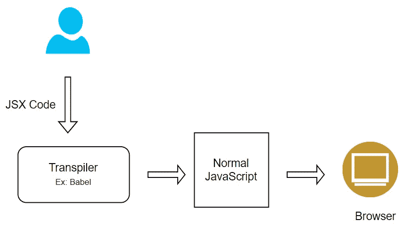
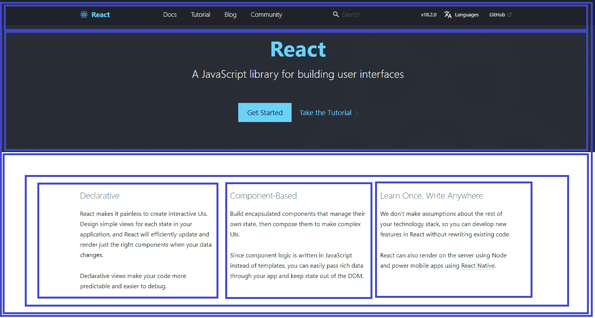
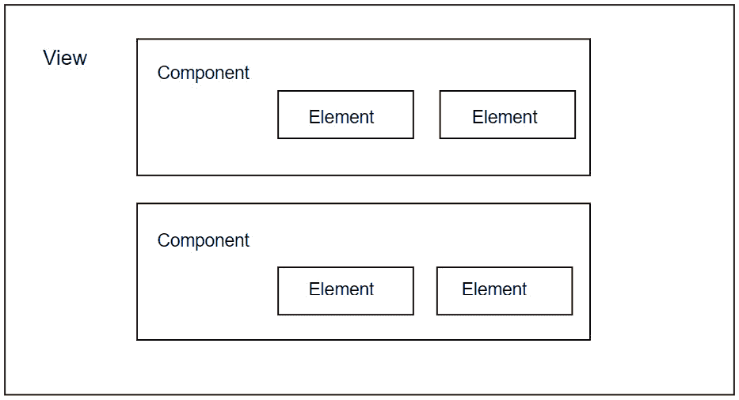
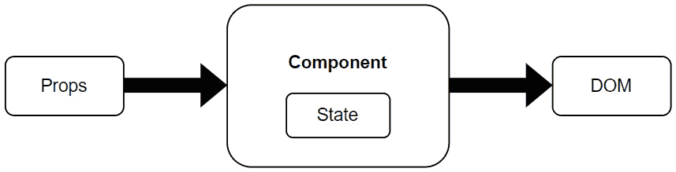
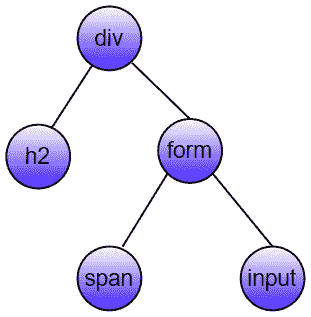
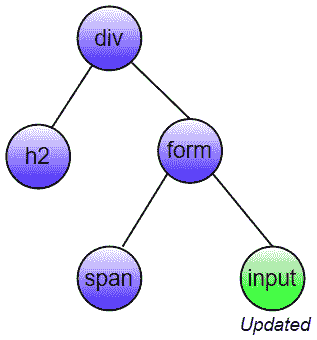
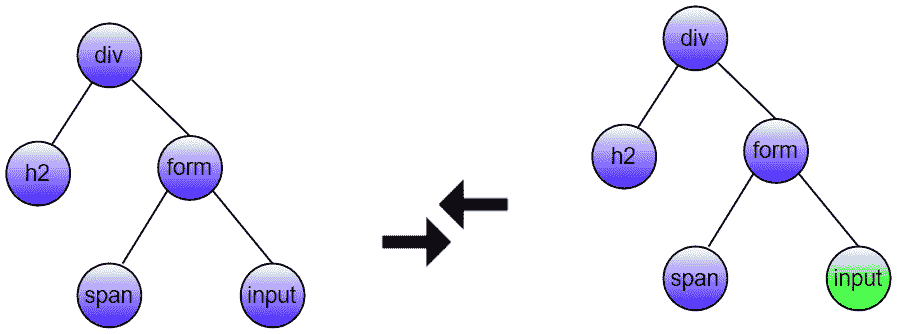
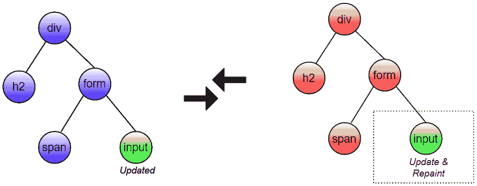
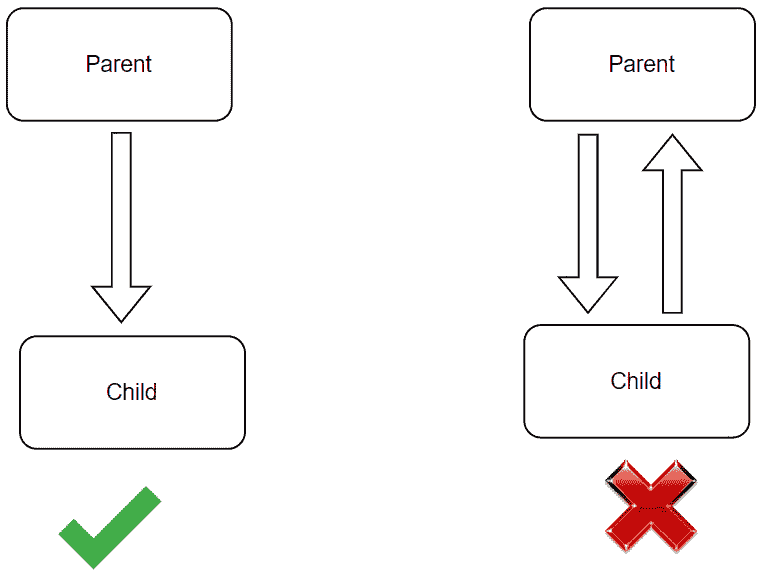
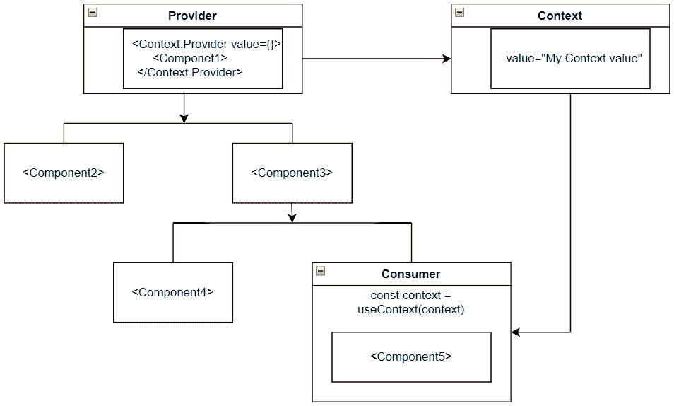

# 2

# 理解 ReactJS 基础及其特性

网络开发是当今现代企业生成长期客户关系的关键要求，因为它提供了一个与客户互动的平台。然而，对于拥有大量用户交互的大型企业来说，构建可扩展和优化的网络应用具有挑战性。

JavaScript 是一种流行的网络开发编程语言。在过去几年中，它变得越来越受欢迎，并被用于创建各种应用，包括基于网络的、移动的、桌面和游戏应用。作为 JavaScript 进化的一个部分，一些库在考虑其可重用的**用户界面**（**UI**）的同时被创建出来，以加快开发速度，但它们未能通过重新渲染整个 UI（即使是任何小的变化）来提高其性能。这种情况通过引入基于可组合组件的 ReactJS 库得到了克服，该库仅在屏幕更新需要的地方重新渲染应用的具体部分。在我们深入 ReactJS 的特性之前，了解 React 的基础知识非常重要，这样您可以在面试中自信地面对，并为 React 开发者角色打下坚实的基础。

本章将为您提供 React 基础知识的完整知识，如类组件、函数组件、状态、props 和 JSX 作为起点。您必须理解重要特性，如虚拟 DOM 单向数据流、refs、上下文 API 和**服务器端渲染**（**SSR**），以便能够回答面试官提出的大部分问题。

在本章中，我们将涵盖以下主要主题：

+   ReactJS 的先决条件

+   ReactJS 简介

+   JSX 简介

+   使用元素和组件构建视图

+   使用 props 和 state 控制组件数据

+   理解 key prop 的重要性

+   学习事件处理

+   理解虚拟 DOM

+   单向数据流与双向数据流的区别

+   在 React 中访问 DOM 元素

+   使用上下文 API 全局管理状态

+   理解服务器端渲染

# ReactJS 的先决条件

在学习 ReactJS 的基础和特性之前，您需要了解以下网络技术和主题。这些技术将作为学习 ReactJS 的强大基础：

+   HTML、CSS 和 JavaScript 的基本知识

+   ES6 特性的基础，如`let`、`const`、箭头函数、类、导入和导出、扩展运算符、Promise 和析构赋值等

+   对包管理器如 npm 的基本理解

通过理解这些先决条件，您将清楚地了解网络开发的核心理念和 React 生态系统中常用的 ECMAScript 特性。

# ReactJS 简介

ReactJS 在 JavaScript 社区中的流行源于其构建大规模应用程序的能力，这些应用程序的数据随时间不断变化。在面试过程的开始阶段，面试官期望您讨论 ReactJS 的简介、其特性、您选择它进行编程的原因、JSX 及其在 React 开发中的作用，以及更多内容。因此，让我们回答一些入门问题。

## 什么是 React？

React（也称为**React.js**或**ReactJS**）是一个开源的前端 JavaScript 库，用于构建 UI，特别是用于单页和移动应用程序。它用于处理网络和移动应用程序的视图层。

React 是由 Facebook 的软件工程师 Jordan Walke 创建的，后来由 Facebook 团队维护。React 首次于 2011 年在 Facebook 的新闻源上部署，并于 2012 年在 Instagram 上部署。

## 选择 React 进行编程的原因有哪些？

React 是当今前端库中流行的选择之一，用于网络开发，并且有多个原因。以下是一些最显著的原因：

+   **快速**：React 可以在保持快速和响应式 UI 的同时处理复杂的更新。

+   **声明式**：它遵循声明式方法，您只需编写所需的全部代码。然后，React 将负责执行所有 JavaScript/DOM 步骤以生成所需的输出。

+   **高性能**：由于使用了虚拟 DOM 策略，React 在 DOM 操作调用上成本较低，因此与其它 JavaScript 语言相比，性能更优。

+   **SEO 友好型**：React 允许您通过 SSR（服务器端渲染）功能创建对搜索引擎优化（SEO）友好的网络应用程序。此功能使应用程序加载速度更快，页面加载时间更短，渲染时间更快，从而与客户端渲染（CSR）相比，带来更好的搜索引擎排名。

+   **跨平台**：该库支持使用 React Native 构建网络应用程序、跨平台桌面应用程序，甚至移动应用程序。

+   **易于测试**：该库提供了一套全面的测试工具，通过在测试中模拟用户行为来轻松测试组件。

+   **强大的社区支持**：它拥有非常强大的社区支持，全球有数百万开发者可以访问或共享资源，如教程、文章、博客和 YouTube 视频，并在各种论坛和社区中讨论它们。

上述原因解释了为什么与其它框架或库相比，ReactJS 是一个流行的库。ReactJS 还有一些显著特性，为商业带来了诸多好处。

## React 的主要特性有哪些？

React 具有一些卓越的特性，使其在现代前端技术中成为更优的选择。以下是一些主要特性：

+   它使用**JavaScript XML**（**JSX**）语法，这是 JavaScript 的一种语法扩展，允许开发者在 JavaScript 代码中编写 HTML，这使得代码易于理解和阅读。

+   它使用虚拟 DOM 而不是真实 DOM，因为真实 DOM 操作成本较高。传统的 JavaScript 框架会一次性更新整个 DOM，这使得 Web 应用变得相当缓慢。

+   它支持 SSR（服务器端渲染），与 CSR（客户端渲染）相比，它提供了快速的初始页面加载时间和 SEO 友好的应用。

+   它遵循**单向数据流**或单向数据绑定，其中数据从父级流向子级，但反之则不然。这有助于使应用更少出错，更容易调试，并提供了对数据的更多控制。

+   它使用可重用或可组合的 UI 组件以快速的速度开发视图，并遵循**DRY**（不要重复自己）原则，该原则指出逻辑重复应该被消除。

React 可以用**JSX**或 JavaScript 代码编写，但大多数开发者由于学习曲线的收益，在代码中使用 JSX。下一节将提供您在面试开始时最常被问到的问题的答案。

# 理解 JSX

建议您使用 JSX 与 React 来描述 Web 应用中 UI 应该呈现的样子。尽管在 React 中使用 JSX 不是强制性的，但它带来了许多优势，所有这些优势我们都会在这里介绍。

## JSX 是什么？

JSX 是 JavaScript 语言的一种类似于 XML 的语法扩展，基于 ES6，这意味着您可以使用 HTML 之类的语法来结构化组件渲染。这意味着它只是语法糖，允许您在 JavaScript 内部编写 HTML 并将其放置在 DOM 中，而无需使用任何`createElement()`或`appendChild()`方法。

让我们通过一个简单的 JSX 代码片段的例子来更好地理解它是如何工作的：

```js
const myElement = <h1>This is my first JSX code</h1>
ReactDOM.render(myElement, document.getElementById
  ('root'));
```

在渲染代码后，React 将`<h1>`标签内的内容输出到您的 DOM 中。

没有前导 JSX 代码的纯 JavaScript 代码片段如下所示：

```js
const myElement = React.createElement('h1', {},
  'This is my React element without JSX code!');
ReactDOM.render(myElement, document.getElementById
  ('root'));
```

注意

JSX 比 HTML 更严格，因此所有元素都应该有闭合标签。

## 为什么浏览器不能理解 JSX？

Web 浏览器只能读取 JavaScript 对象，但不能读取 JSX，因为没有浏览器引擎内置的实现来读取和理解该语法。要使用 JSX，您需要使用转译器或编译器，如 Babel，在运行时将 JSX 代码转换为相应的纯 JavaScript 代码：



图 2.1：JSX 转译

上述图表解释了 JSX 代码中的转译是如何工作的。

## JSX 的优势是什么？

JSX 不是编写 React 应用的强制要求，但它提供了许多好处：

+   JSX 使得仅通过查看代码中的布局就能更容易地阅读和理解组件的结构。

+   大多数开发者发现，在编写 UI 模板代码时，将其作为视觉辅助工具非常有帮助。

+   它允许您创建可重复使用的组件，这些组件可以在整个应用程序中重复使用

+   它可以在 React 应用程序中显示有用的错误和警告消息

+   JSX 在将代码转换为常规 JavaScript 时进行优化，因此与编写常规 JavaScript 相比，它提高了性能

一旦您熟悉 JSX 代码，使用元素和组件构建视图就变得容易。

# 使用元素和组件构建视图

元素和组件是创建 React 视图或应用程序的基本构建块。使用隔离的、可定制的和可重复使用的组件来构建 UI 非常容易。以下问题和它们涵盖的内容将帮助您了解 ReactJS 的基础知识，并将作为本书下一组问题的基石。

## 什么是组件？

组件是一个独立的、可重复使用的代码块，它将 UI 分割成更小的部分。例如，在构建使用 React 库的 Web 应用程序的 UI 部分时，您可以将它的 UI 分割成小块以提高可重复使用性，如下图中用蓝色方框突出显示：



图 2.2：React 组件

每个部分都可以被视为一个组件，并且它们分别在一个单独的文件中表示，而不是在单个文件中构建 UI。这些组件可以在应用程序的任何适用位置重复使用。

注意

每个组件返回一些 HTML 代码，但您只能返回一个 HTML 元素。否则，JSX 将抛出一个错误，表示*JSX 表达式必须有一个* *父元素*。

## 有哪些创建组件的不同方式？

在 ReactJS 中创建组件有两种可能的方式。让我们来看看它们：

+   将`props`对象作为第一个参数，并返回 React 元素以渲染输出：

    ```js
    function User({ message }) {
        return <h1>{`Hello, ${message}`}</h1>;
      }
      export default User;
    ```

注意

在引入 React Hooks 功能之后，也可以在函数组件中使用本地状态。

+   `React.Component`。

    上述函数组件可以写成以下形式：

    ```js
     class User extends React.Component {
      render() {
        return <h1>{`Hello, ${this.props.message}`} </h1>;
      }
     }
     export default User;
    ```

    上述代码中的`render()`方法是每个类组件必须实现的唯一强制方法。

## 元素和组件之间的区别是什么？

元素是一个描述组件实例或 DOM 节点及其所需属性以在某个时间点表示 UI 的普通对象。它包含有关组件类型、其属性以及其下的任何子元素的信息。与 DOM 元素相比，创建 React 元素的成本更低。

任何 React 元素的语法表示如下：

```js
React.createElement(type, {props}, children);
```

这里是一个创建简单的`SignOut` React 元素的示例，其中元素包含另一个元素：

```js
const element = React.createElement("div",
  { id: "signout-container" },
React.createElement("button", {id: "signout-btn"},
  "Sign Out")
);
```

上述`React.createElement`方法返回一个对象，如下所示：

```js
{
  type: 'div',
  props: {
  children: {
    type: 'button',
    props:  {
      children: 'SignOut'
      id: 'signout-btn'
    }
  },
    id: 'signout-container'
  }
}
```

最后，它使用`ReactDOM.render()`渲染到 DOM 中。

相同的 React 元素可以通过简化的方式在 JSX 中以短格式表示：

```js
const signoutElement = <div id="signout-container">
  <button id="signout-btn">SignOut</button>
    <div>;
```

注意

React 元素是不可变的——也就是说，一旦你创建了一个元素，你就不能再进一步修改其子元素或属性。

另一方面，一个组分由 React 元素组成。换句话说，一个组分是一个创建元素的工厂。这个组分可以是两种类型之一——一个类或一个可选输入并返回元素树的函数类型。

让我们通过一个例子来理解这个概念，这个例子使用了前面的 `SignOut` React 元素来创建一个 React 组分：

```js
const SignOut = ({handleSignOut}) => (
  <div id="signout-container">
    <button id="signout-btn" onClick={ handleSignOut}>
      SignOut
    </button>
  <div>
)
```

以下图表示了元素和组分在 React 视图中的结构：



图 2.3：组分与元素

这些组分可以进一步分为纯组分、**高阶组分**（**HOCs**）等，以及它们的特定功能。你将在接下来的问题中了解更多关于它们的信息。

## 什么是纯组分？

纯组分是指对于相同的 state 和 props，渲染相同输出的组分。在函数组件中，借助 Memoize API（即 `React.memo()`），可以在组件周围包裹以实现纯功能。这个 API 主要用于性能优化。

Memoize API 通过对 props 进行浅比较来防止不必要的更新渲染。这意味着它不会比较前一个状态与新状态。这是因为函数组件默认情况下会阻止重新渲染，当你再次设置（即使用设置函数）相同的状态时。

让我们通过一个例子来理解这个记忆化概念。首先，创建一个父 `UserEnquiryForm` 组分来输入用户输入，然后创建另一个显示相同信息的组分，称为 `UserProfile`；这是子组分。子组分被包裹在 Memoize API 中，以防止相同的 prop 细节从父组件传递下来：

```js
import { memo, useState } from 'react';
const UserProfile = memo(function UserProfile
  ({ name, age }) {
  return (<>
           <p>Name:{name}</p>
           <p>Age: {age}</p>
         </>);
});
export default function UserEnquiryForm() {
  const [name, setName] = useState('');
  const [age, setAge] = useState(0);
  const [email, setEmail] = useState('');
  return (
    <>
      <label>
        Name: <input value={name} onChange=
          {e => setName(e.target.value)} />
      </label>
      <label>
        Age: <input value={age} onChange=
          {e => setAge(e.target.value)} />
      </label>
        <label>
        Email: <input value={email} onChange=
          {e => setEmail(e.target.value)} />
      </label>
      <hr/>
      <UserProfile name={name} age={age}/>
    </>
  );
}
```

在前面的代码中，`email` 属性没有被传递给子组件。因此，对于 email 输入的变化，不会进行任何重新渲染。

然而，在类组件中，由于我们用 `PureComponent` 扩展了它而不是 `Component`，组件将变成一个纯组件。内部，纯组件实现了 `shouldComponentUpdate()` 生命周期方法，并使用浅比较。

注意

建议所有 React 组分在处理 props 时都像纯函数一样。这个指南有助于提高性能，因为它防止了不必要的重新渲染，并避免了应用中意外的错误。

除了纯组分之外，在 React 生态系统中还创建了一种特殊的组分类型，作为一种模式。它作为一个具有零副作用（类似于纯组件的行为）的纯函数工作。

## 什么是高阶组分？

HOC（高阶组件）是一个函数，它接受一个组件并返回一个新的组件。HOC 不是 React API 的一部分，但它们是重用组件逻辑的高级技术。你可以使用 HOC 在组件之间共享 props 和 states。

HOC 可以用以下语法表示：

```js
const withHigherOrderComponent = (OriginalComponent) => (props) => <OriginalComponent {...props} />;
```

基于 HOC 概念创建了第三方库，如 Redux 的`connect`和 Relay 的`createFragmentContainer`。

## 什么是片段以及你会在哪里使用它们？

React 片段是一种语法，允许你将一组子元素包装或分组到一个 React 组件中，而无需在 DOM 中添加额外的节点。你可以使用`<Fragment>`或带有空标签的更短语法（`<></>`）。

例如，让我们以一个`Author`组件来表示一个发布了多篇博客文章的作者。该组件遍历作者的博客文章并显示它们，而不添加额外的 DOM 节点，如`<div>`或`<span>`：

```js
function Author() {
         return posts.map(post =>
                 <Fragment key={ post.id}>
                       <Post title={post.text} body={post.body} />
                       <Date date= {post.date} />
                 </Fragment>
    );
}
```

在前面的代码片段中，使用`<Fragment>`标签来支持在迭代列表项时的`key` prop。替代的`<></>`语法不支持 key 属性。因此，如果你正在迭代列表项，则首选使用`<Fragment>`而不是`<></>`。

使用片段还有更多好处：

+   在非常大的或深层的 DOM 树中，片段更快且占用更少的内存

+   CSS 框架或库，如`<div>`元素，会干扰期望的布局

+   DOM 检查器不那么拥挤，因为它不包含任何额外的 DOM 节点

现在你已经了解了组件的各种构建块，你可以轻松地学习如何控制组件中的数据或组件之间的数据。数据管理对于任何 Web 应用都是至关重要的。

# 使用 props 和 state 控制组件数据

组件内的数据由 props 和 state 控制。所有类型的 React 应用都基于这两个概念，它们是创建高效和健壮应用的重要核心主题。这些主题不仅在面试中很有用，你也会在日常工作中遇到它们的用法。

## React 中的 props 是什么？

Props，代表属性，是以单个值或包含一组值的对象的形式出现的参数，它们被传递到组件中。它们的命名规范类似于 HTML 属性。它们有助于将数据从父组件传递到子组件，并用于在屏幕上动态渲染子组件。这意味着 props 充当组件在组件树内部通信的通道。

React 中 props 的主要目的是实现以下组件功能：

+   根据业务需求将自定义数据传递到你的组件中。

+   根据 prop 的值在组件中触发状态变化。

+   通过在组件的渲染代码中使用`props.propName`（对于函数组件）或`this.props.reactProp`（对于类组件）来访问 props。这些数据对于条件渲染 UI 很有帮助。

下面是一个从父组件向子组件传递道具的例子（在这种情况下，`Employee`）：

```js
import React from 'react';
function App() {
return (
    < >
        <Employee name="John" age="30" department="Manufacturing"></
          Employee>
        <Employee name="Malcolm" age="35" department="Engineering" ></
          Employee>
        <Employee name="Luther" department="Finance"></Employee>
    </ >
);
}
function Employee(props) {
return (
    < >
        <span>Name: {props.name} </span>
        <span>Age: {props.age} </span>
        <span>Department: {props.department} </span>
    </ >
)
}
Employee.defaultProps = {
    name: "Jack",
    age: "45",
    department: "HR"
}
export default App; 
```

在前面的代码中，使用了`defaultProps`属性来分配道具的默认值。如果没有传递显式道具，将使用这些值。

访问道具对象的属性的更好方法是使用 ES6（ECMAScript 2015）中的解构。

通过解构的帮助，前面的子组件可以重写如下：

```js
function Employee({name, age, department}) {
return (
    <>
        <span>Name: {name} </span>
        <span>Age: {age} </span>
        <span>Department: {department} </span>
    </>
)
}
```

重要提示

道具在本质上是不可变的（只读），尝试修改这些值将引发错误。如果你仍然需要在组件中修改数据，那么状态是管理你的数据的正确选择。

## 你能描述一下 React 中的状态吗？

状态是一个内置的 JavaScript 对象，其中存储属于组件的属性值。换句话说，状态是私有的，完全由组件控制。状态的关键部分是，每当状态对象发生变化时，组件都会重新渲染。

状态的作用域始终在组件内部，如下面的图所示：



图 2.4：组件内部状态的作用域

下面是一个`User`函数组件的例子，其中包含欢迎信息作为状态，以解释其用法：

```js
import React, { useState } from "react";
function User() {
  const [message, setMessage] = useState
    ("Welcome to React world");
  return (
    <>
      <h1>{message}</h1>
    </>
  );
}
```

在前面的代码中，使用了`useState`钩子向`User`组件添加状态。它返回一个数组，包含当前状态和用于更新状态的 setter 函数。

与函数组件相比，类组件将状态属性存储在内部状态对象中，并在`User`组件内部通过`this.state.message`访问它：

```js
class User extends React.Component {
  constructor(props) {
    super(props);
    this.state = {
      message: "Welcome to React world",
    };
  }
  render() {
    return (
      <>
        <h1>{this.state.message}</h1>
      </>
    );
  }
}
```

内置的`setState`函数用于更新前一个类组件的状态。

注意

为了提高可读性，建议将状态变量保持尽可能简单，并尽量减少有状态的组件以实现单一数据源。

## 道具和状态之间主要有哪些区别？

道具和状态都是用于管理组件数据的纯 JavaScript 对象，但它们以不同的方式使用，具有不同的特性：

| **道具** | **状态** |
| --- | --- |
| 只读和不可变 | 可变和异步更改 |
| 道具是从父组件传递给子组件 | 由组件本身管理 |
| 由子组件访问 | 不能由子组件访问 |
| 道具使组件可重用 | 状态不能使组件可重用 |
| 用于组件间的通信 | 用于渲染动态变化 |

表 2.1：道具与状态对比

与道具不同，状态可以通过不同的方式更新。让我们更深入地了解批量更新多个状态。

## React 是如何批量更新多个状态的？

React 防止组件在每次状态更新时重新渲染。React 通过使用内置的 Hooks 在事件处理器内进行分组更新来优化应用程序性能，从而实现这一点。整个过程被称为**批处理**。React 版本 17 仅支持浏览器事件的批处理，而 React 版本 18 支持批处理的改进版本，称为**自动批处理**。

自动批处理支持从任何位置调用的状态更新，而不仅仅是浏览器事件。换句话说，它支持原生事件处理器、异步操作、超时和间隔。

让我们看看一个展示自动批处理的例子：

```js
import { useState } from 'react';
export default function MultiState() {
  const [count, setCount] = useState(0);
  const [message, setMessage] = useState('Batching');
  console.log('Application re-rendered');
  const handleAsyncFetch = () => {
    fetch(https://jsonplaceholder.typicode.com/todos/1
      ).then(() => {
        // trigger only one(1) re-render due to
           Automatic Batching
        setCount(count +1);
        setMessage('Automatic batching');
      });
  }
  return (
    <>
      <h1>{count}</h1>
      <button onClick={handleAsyncFetch}>
        Click Me!</button>
    </>
  )
}
```

即使前面的代码使用事件处理器更新了两个状态变量，React 也会默认自动批处理它们，组件只会重新渲染一次。

## 你能防止自动批处理吗？

自动批处理是 React 库的一个优秀特性，它优化了渲染性能。然而，在某些情况下，你可能需要为每个状态更新重新渲染你的组件，或者根据另一个更新的状态值更新一个状态。React 通过 ReactDOM 引入了`flushSync` API 函数，以便在必要时随时停止自动批处理。此函数对于需要立即将更新刷新到 DOM 的情况也很有用，尤其是在与第三方代码（如浏览器 API 和 UI 库）集成时。

例如，假设你想在向简单的待办事项应用中添加一个新的待办事项或任务后更新网页的滚动位置。如果你希望直接关注新的待办事项内容，这种行为是有帮助的。在这种情况下，最新的待办事项状态需要立即更新，以便你获得正确的滚动位置：

```js
  const handleAddTodo = (todoName) => {
    flushSync(() => {
      setTodos([...todos, { id: uuid(), task: todoName }]);
    });
    todoListRef.current.scrollTop = todoListRef.
      current.scrollHeight;
  };
```

这个函数的使用并不常见，使用它可能会严重影响应用程序的性能。

## 你如何更新状态中的对象？

你不应该直接更新 React 的状态对象。相反，你需要创建一个新的对象或复制现有的对象，然后使用新创建的对象设置状态。因此，在更新状态对象时，你始终需要将状态中的对象视为只读的，尽管 JavaScript 对象是可变的。

让我们看看这个比较的实际效果，并展示这两个更新过程的结果。例如，已经创建了`WeatherReport`组件及其属性，包括`temperature`和`city`。之后，组件属性在事件处理器内部被直接修改：

```js
function WeatherReport() {
  const [weather, setWeather] = useState({
    temperature: 26,
    city: "Singapore",
  });
  const handleWeatherChange = (e) => {
    if (e.target.name === "temperature") {
      weather.temperature = e.target.value;
    }
    if (e.target.name === "city") {
      weather.city = e.target.value;
    }
  };
  return (
    <>
      <label>
        Temparature:
        <input value={weather.temperature} onChange=
          {handleWeatherChange} />
      </label>
      <label>
        City:
        <input value={weather.city} onChange={handleWeatherChange} />
      </label>
      <div>
        Report:
        <span>{weather.temperature}</span>
        <span>{weather.city}</span>
      </div>
    </>
  );
}
```

一旦前面的代码被部署，尝试在 UI 中输入新的天气详情。你会发现输入字段不会更新。

你可以通过创建`weather`对象的新副本然后设置状态来修复这个问题。为此，让我们更新前面的事件处理器：

```js
handleWeatherChange(e) {
    setWeather({
        ...weather,
        [e.target.name]: e.target.value
    })
}
```

前面的代码按预期更新了 UI 中的天气详情。

有时候，只需要修改状态对象中的一个字段。在这种情况下，建议使用对象展开语法来利用重用先前状态对象属性值的优势，而不是在状态中设置每个字段。

## 如何更新嵌套状态对象？

使用展开语法更新顶层状态对象相当容易。但是，当涉及到嵌套状态对象时，你不能直接更新所需的嵌套属性，就像你在常规 JavaScript 对象中做的那样。

这可以通过一个例子进一步解释：我们将使用嵌套状态对象并修改其内部的嵌套属性。为了演示这种行为，让我们考虑具有嵌套地址详情属性的用户`User`状态对象：

```js
{
    name: 'Tom',
    age: 35,
    address: {
        country: 'United States',
        state: 'Texas',
        postalCode: 73301
    }
}
```

现在，你可以在 React 组件中使用类似于在纯 JavaScript 中进行的表达式`user.address.postalCode = 75015`来尝试更新`postalCodeproperty`，但屏幕不会更新为最新值。

如果无法通过作为解决方案将嵌套的`User`对象展平，那么有两条可能的途径来正确更新状态：

+   使用展开语法创建一个新的顶层对象`updatedUser`，它指向新创建的嵌套对象：

    ```js
    const updatedAddress = { ...user.address,
      postalCode: 75015 };
    const updatedUser = { ...user, address:
      updatedAddress };
    setUser(updatedUser);
    ```

+   **通过单个** **函数调用** **更新嵌套对象**：

    也可以通过在单个状态设置函数中使用展开语法来一起更新嵌套对象和顶层对象：

    ```js
    setUser({
      ...user,
      address: {
        ...user.address,
        postalCode: 75015
      }
    });
    ```

如果你想要超越传统方法，第三方库如**Immer**提供了一种方便的方式来更新深层嵌套的状态对象。这个库允许直接更新嵌套对象，就像常规 JavaScript 更新属性一样。

使用 Immer 修改嵌套对象看起来是这样的：

```js
setUser(user => {
  user.address.postalCode = 75015;
});
```

组件的状态也可以是一个项的数组，而不仅仅是原始值或对象类型。然而，你需要提供额外的 key 属性，这将在后续问题中详细说明。

# 理解 key 属性的重要性

Keys 帮助你控制组件或元素实例。它们在决定元素是否需要在元素列表中重新渲染中起着重要作用。因此，每个开发者都应该了解 key 属性的重要性。

## key 属性是什么，它的用途是什么？

**关键**属性是在创建组件中元素列表时需要包含的一个特殊属性。这个 key 属性帮助 React 识别哪些元素已更改、已添加或已删除。换句话说，它帮助你在元素被修改后仍然保留元素的唯一标识或列表中兄弟元素的唯一标识。

即使你没有提供 key 属性，列表也可以成功地将内容渲染到浏览器中，但会在控制台记录一条警告消息，如下所示：

```js
Warning: Each child in an array or iterator
         should have a unique "key" prop
```

建议使用数据中的唯一 ID 值作为 key 属性。这个值可以是字符串或数字。

让我们通过实现程序员的待办事项列表来更好地理解这个关键的属性概念。在这里，你是在迭代列表时将键分配给`TodoItem`组件，而不是分配给提取的`<li>`标签：

```js
import React from "react";
import ReactDOM from "react-dom";
function TodoItem(props) {
    const { item: todo } = props;
    return <li>{todo.id}: {todo.message}</li>;
}
function TodoList(props) {
    const { todos: list } = props;
    const updatedTodos = list.map((todo) => {
        return <TodoItem key={todo.id} item={todo} />;
    });
    return <ul>{updatedTodos}</ul>;
}
const devTodoItems = [{id: 1, message:"Write a component"}, {id:2, message:"Test it"}, {id:3, message:"Publish the component"}]; 
ReactDOM.render( 
    <TodoList todos={ devTodoItems } />, 
    document.getElementById("root") 
);  
```

不建议将索引（从元素列表迭代中接收）作为键分配，因为如果列表的元素在未来被重新排序，那么元素的键也会改变。

# 了解事件处理

事件处理对于在应用程序中与网页交互至关重要。React 有自己的事件处理生态系统。事件处理器决定了每当特定事件被触发时必须采取什么操作。本节将为您提供一个关于 React 库中事件处理的良好理解。

## 什么是合成事件？

合成事件是浏览器实际原生事件对象的跨浏览器包装器。它提供了一个统一的 API，防止浏览器不一致性，并确保事件在多个平台上工作。

如果你在这两种事件中使用相同的`preventDefault`和`stopPropagation`方法，合成事件和原生事件之间有一些相似之处。你也可以通过在`syntheticEvent`实例上使用`nativeEvent`属性直接访问原生事件。例如，以下搜索组件仍然能够访问原生输入事件和其他在处理器内部的其他属性或方法：

```js
function Search() {
  handleInputChange(e) {
      // 'e' represents synthetic event
      const nativeEvent = e.nativeEvent;
      e.stopPropogation();
      e.preventDefault();
      // Code goes here..
  }
  return <input onChange={handleInputChange} />
}
```

与 HTML 事件处理相比，React 事件处理有一些不同之处，我们将在下一节中讨论。

## 你如何区分 React 事件处理和 HTML 事件处理？

React 事件处理类似于 HTML 中的 DOM 元素事件处理。然而，它们之间有一些显著的区别：

+   **命名约定**：在 HTML 中，事件名称按照惯例以小写表示：

    ```js
    <button onclick="handleSingUp()">SingUp</button>
    <button onClick={handleSignUp}>SingUp</button>
    ```

+   事件处理器中的`false`。

    例如，让我们以一个简单的登录表单为例，该表单包含用户名和密码字段以输入数据。在提交表单后，你需要限制`onsubmit`事件的默认行为，并且包含表单必须不被刷新：

    ```js
    <form onsubmit="console.log('The form has been
      submitted.'); return false">
          <input type="text" name="name" />
          <input type="password" name="password" />
          <button type="submit">Login</button>
    </form>
    ```

    然而，在 React 中，可以通过调用`event.preventDefault()`方法来防止默认行为：

    ```js
    function Login() {  
        function handleSubmit(e) { 
            e.preventDefault(); 
            console.log('You submitted Login form.'); 
        }  

        return (
            <form onsubmit="handleSubmit"> 
                <input type="text" name="name" /> 
                <input type="password" name="password" /> 
                <button type="submit">Login</button> 
            </form>
        )   
    } 
    ```

+   在函数名称后使用`()`或使用`addEventListener()`来附加事件和监听器。

    以下示例显示了一个按钮的`onclick`事件和调用相应的处理器。这可以通过两种方式完成。

    对于第一种方法，你可以在`handleSiginUp`函数名称后插入括号：

    ```js
    <button onclick="handleSingUp()">
    However, in React, you just need to specify the method name inside the curly braces (`{}`) of the event attribute's value.
    ```

## 你如何在类组件中绑定事件处理器？

在 React 类组件中绑定事件处理器有几种方法：

+   构造函数中的`this`关键字。

    例如，让我们在构造函数中添加一个`handleUserDetails()`绑定：

    ```js
    class User extends Component { 
        constructor(props) { 
          super(props); 
          this.handleUserDetails = this.handleUserDetails.
            bind(this); 
        } 

        handleUserDetails() { 
          console.log("Show User details"); 
        } 

        render() { 
          return <button onClick={this.handleUserDetails}>Profile</
            button>; 
        } 

    } 
    ```

    如果你忘记绑定处理器，当函数被调用时`this`关键字将是未定义的。

+   **公共类** **字段语法**：

    如果你对在构造函数中绑定处理程序不感兴趣，那么公共类字段方法在可读性和易用性方面要优越得多。这种语法在 **Create React App** （**CRA**） 工具中默认启用。

    之前的绑定方法可以使用公共类字段语法重写和简化，如下所示：

    ```js
    class User extends Component {
      handleUserDetails = () => {
        console.log("Show User details");
      }
      render() {
        return <button onClick={this.handleUserDetails}>Profile</
          button>; 
      }
    }
    ```

+   显式使用 `this` 关键字。

    箭头函数被传递到 `User` 组件的回调中，如下所示：

    ```js
    handleUserDetails() { 
        console.log("Show User details"); 
    } 
    render() { 
        return <button onClick={() => this.handleUserDetails()}>
          Profile</button>; 
    } 
    ```

    这种箭头函数方法的主要问题在于，每次组件渲染时都会创建不同的回调，如果将回调作为属性传递给子组件，子组件可能会进行额外的重新渲染。因此，建议使用构造函数中的绑定或公共类字段语法方法。

React 库背后的魔法，包括同步组件数据与 UI、DOM 更新等，都由虚拟 DOM 来处理。在下一节中，你将了解虚拟 DOM、其重要性以及其背后的工作流程。

# 理解虚拟 DOM

**DOM** 代表 **Document Object Model**，它以树形数据格式表示网页（HTML）的整个 UI。虚拟 DOM 不是由 React 发明的，但它将其作为核心功能。其主要目的是在重新渲染 UI 时最小化 DOM 操作的数量。React 使用此功能来提高其性能。在面试中，你很可能会有关于这个话题的问题。

## 什么是虚拟 DOM？

虚拟 DOM 是由 React 组件生成的 Real DOM 的内存中轻量级虚拟表示。UI 的虚拟表示存储在内存中，并与 Real DOM 同步以与最新的状态更新保持一致。这是通过名为 **ReactDOM** 的库实现的，这一步骤发生在调用渲染函数和元素显示在屏幕之间。整个过程被称为 **reconciliation**。

## 虚拟 DOM 是如何工作的？

React 和 Vue.js 技术在底层使用虚拟 DOM 来抽象开发者的手动 DOM 操作。这种编程机制在四个主要步骤中工作。

例如，让我们以一个简单的搜索表单为例，该表单包含在 `CitySearch 组件` 中的输入字段，看看虚拟 DOM 是如何工作的。我们将提供图表以方便理解：

```js
function CitySearch() { 
    return ( 
       <div> 
        <h2>Find city:</h2> 
        <form> 
            <span> 
                City: 
            </span>
            <input onChange={handleCitySearch} /> 
        </form> 
       </div> 
    ) 
 }
```

之前的城市搜索在内部使用以下虚拟 DOM 机制的步骤：

1.  当应用程序首次渲染时，React 创建一个代表 UI 的虚拟 DOM 并将其存储在内存中：



图 2.5：初始虚拟 DOM

1.  当底层状态发生变化时，它将自动为更新创建一个新的虚拟 DOM。由于虚拟 DOM 只是一个代表 UI 的对象，因此在这一点上 UI 不会有任何变化（例如重绘）：



图 2.6：更新后的虚拟 DOM

1.  一旦创建了新的虚拟 DOM，React 就将其与预更新的虚拟 DOM 版本或快照进行比较。React 使用 **diffing** 算法来比较变化；这个过程被称为 **协调**：



图 2.7：比较虚拟 DOM 快照

1.  在协调过程之后，React 使用像 ReactDOM 这样的渲染库，它接受变化并更新 Real DOM：



图 2.8：更新后的 Real DOM

## 什么是 Shadow DOM？

Shadow DOM 是一种主要设计用于作用域变量和 CSS 的 Web 组件技术。当父组件中定义的 CSS 样式不会影响或应用于子组件时，这非常有用。

## Real DOM、虚拟 DOM 和 Shadow DOM 之间的区别是什么？

在现代 Web 开发中，虚拟 DOM 和 Shadow DOM 作为真实 DOM 的附加功能被引入，以提高性能和封装。

这些三个 DOM 之间的显著差异如下列出：

| **Real DOM** | **Virtual DOM** | **Shadow DOM** |
| --- | --- | --- |
| 它为整个屏幕创建一个单一的 DOM | 它在内存中创建整个真实 DOM 的副本并跟踪变化 | 它创建具有独立作用域（即，作用域 CSS 样式和 JavaScript）的真实 DOM 的小副本 |
| 任何变化都将涉及整个屏幕的重绘 | 状态变化将涉及页面特定部分的重绘 | 变更适用于其自身的 Web 组件 |
| 通过像 Solid.js 这样的库在 Web 浏览器中实现 | 通过像 React、Vue 等这样的 JavaScript 库实现 | 通过像 Lit 和 Vaadin 这样的 Web 组件库实现 |
| 适用于小到中等规模的应用程序，没有复杂的交互性 | 适用于具有复杂交互性的大型应用程序 | 适用于小到中等规模的应用程序，交互性相对简单 |
| 相比虚拟 DOM，使用更少的 CPU 和内存 | 相比 Real DOM，使用更多的 CPU 和内存 | 相比虚拟 DOM，使用更少的 CPU 和内存 |
| 不支持封装，因为组件可以在外部被修改 | 支持封装，因为组件不能在外部被修改 | 支持封装，因为组件不能在外部被修改 |

表 2.2：Real DOM 与 irtual DOM 与 Shadow DOM 的比较

## 什么是 React Fiber？

Fiber 是 React 版本 16 中引入的一种新的协调引擎，它能够实现虚拟 DOM 的内置调度和增量渲染。增量渲染意味着能够将渲染工作分成块，并在多个帧上分散。因此，借助增量渲染，Fiber 在动画、布局和手势等方面提高了应用程序的性能。

这个协调器是对一个名为 **stack reconciler** 的旧协调算法的完全重写。

# React 应用程序中的数据流和通信

React 的单向数据流特性使得 UI 在从小到大规模的应用程序中数据变化时简单且可预测。了解数据流和组件之间的通信的好处对于更好地理解相关的 React 概念非常重要。

## 你能描述一下 React 中的单向数据流吗？

单向数据流也称为单向数据绑定，是指数据在应用程序的不同部分之间传输时只能单向流动。这种技术或特性已经在函数式响应式编程中存在。

React 遵循单向数据流，其中数据通过 props 从父组件传递到子组件，而不是相反。此外，子组件不能更新来自父组件的数据。React 不鼓励双向或双向绑定，以确保你遵循清晰的数据流架构。

下图更清晰地展示了 React 中的数据流：



图 2.9：单向与双向数据流

更新父组件中的数据的唯一方法是通过从子组件触发事件。

注意

与 React 不同，Vue.js 在组件之间遵循双向数据绑定或双向数据流。

## 单向数据流有哪些优点？

单向数据流的主要优势是拥有数据的一个单一真相来源。单向数据流特性的其他优点也很多。以下列出了一些关键好处：

+   **调试**：由于开发者知道数据从何而来以及去向何方，因此调试问题要容易得多

+   **更少错误**：数据单向流动，这使得程序更少出错，并使开发者有更好的控制

+   **效率**：在应用中，单向数据流的已知边界不会浪费额外资源

你不能总是依赖状态、属性和数据流概念来控制视图层。无论 JavaScript 库如何，你可能需要访问 DOM 元素，而通过传统的`document.getElementById`等方式访问元素变得繁琐。在下一节中，你将找到更好的替代方法来访问 DOM。

# 你如何访问 DOM？

React 库在底层处理 DOM 操作，无需任何手动 DOM 更新。但有时，你可能会遇到需要由 React 管理 DOM 元素访问的情况（如聚焦、滚动到特定元素等）。为了解决这些用例，引入了 refs 来访问 DOM 节点。

React 面试官可能期望你对 DOM 访问和可能的用例有很好的了解，这两者都不能通过传统的声明式方法处理。

## 什么是 refs？如何创建 refs？

Ref 的 `current` 属性。换句话说，refs 是具有附加 current 属性的纯 JavaScript 对象。为了更好地理解这个 ref 概念，让我们看看使用 ref 实现输入元素自动聚焦行为的示例。为此，我们将遵循以下说明：

1.  从 React 库中导入 `useRef` Hook。

1.  在 `SignUpForm` 组件内部声明 `inputRef`，并使用 Hook 的返回值。

1.  将 `inputRef` 传递给 `<input>` 元素，这会将输入的 DOM 节点连接到 `inputRef.current` 属性。

1.  在加载组件实例时，通过在 `useEffect` Hook 中的 DOM 节点上调用 `focus()` 来程序化地将焦点应用于输入元素。

在遵循所有前面的步骤之后，使用 refs 的最终组件应该看起来像这样：

```js
import {useRef, useEffimport {useRef, useEffect} from 'react'; 
export default function SignUpForm() { 
  const inputRef = useRef(null); 
  useEffect(() => { 
    inputRef.current.focus(); 
  }, []) 
  return ( 
    <> 
      <input type="email" ref={inputRef} /> 
      <button> 
        Verify Email 
      </button> 
    </> 
  ); 
} 
```

与在函数组件中使用 `useRef` Hook 类似，`createRef` 通常用于在类组件中创建 ref。

## Refs 的主要用途是什么？

Refs 的主要目的是在典型的单向数据流之外强制修改子组件。这里讨论了一些可以通过 refs 作为逃生口的常见用例：

+   对于第一个用例，让我们谈谈如何通过某些事件或操作修改 UI 元素。这个用例类别包括管理输入字段焦点、文本选择和媒体控制（或播放）等场景。

    作为例子，让我们看看通过外部按钮点击控制的上述文本选择和音频场景：

    ```js
     //Text selection 
    const hasInputText = inputRef.current.value.length > 0; 
    if (hasInputText) { 
        inputRef.current.select(); 
    } 
    // Audio controls 
    const playAudio = () => { 
        audioRef.current.play(); 
    }; 
    const pauseAudio = () => { 
        audioRef.current.pause(); 
    }; 
    ```

+   对于第二个用例，让我们谈谈在不通过 CSS 或 JavaScript 编写任何显式动画的情况下在 UI 中触发命令式动画。

    这里是一个示例，展示如何通过滚动事件访问 `div` 元素并找到其位置，以在布局中执行某些操作：

    ```js
      function handleScroll() {
        const block = blockRef.current;
        const { y } = block.getBoundingClientRect();
        const blockBackgroundColor = y <= 0 ?
          'white' : 'black';
        setBackground(blockBackgroundColor);
      }
    ```

+   对于第三个用例，让我们讨论在 React 应用程序中与第三方 DOM 库的集成。

    使用 refs 很容易将现有的应用程序与一些 JavaScript 插件或库集成。例如，第三方插件如 `DataTable.js` 和 `select2` 可以轻松地在 React 应用程序内部访问，而无需从头开始重新创建。

注意

如果可以声明式地实现任务，建议避免使用 refs。

## 你如何比较 refs 和状态？

Refs 和状态都用于在渲染之间持久化组件数据。然而，它们之间有很多不同之处：

| **Ref** | **State** |
| --- | --- |
| 由 `useRef(initialValue)` Hook 创建，它返回 `{current: initialValue}` JavaScript 对象 | 由 `useState(initialValue)` Hook 创建，它返回当前状态值和更新状态的设置函数–即 `[value, setValue]` |
| 不会触发对其所做的任何更改的重新渲染 | 触发状态中的任何更改的重新渲染 |
| 它通常用于与外部 API 通信 | 它经常在组件内部使用以改变其外观 |
| 可以在渲染过程之外更新 `current` 属性值 – 即，引用是可变的 | 你不应该直接更新状态变量；应该使用设置函数来修改值 – 即，状态是不可变的 |
| React 无法跟踪引用变化 | React 可以跟踪状态变化 |
| 在渲染过程中你不应该读取或写入引用 | 你可以在任何时候读取状态 |
| 除非基于状态的声明性视图无法实现，否则应避免使用引用，因为 DOM 结构的变化可能与 React 的 `diff` 和 `update` 方法冲突 | 始终推荐使用状态进行 UI 更新 |

表 2.3：引用与状态

尽管引用（在可变方面）不如状态严格，但大多数时候，你将使用状态而不是引用，因为引用是访问 DOM 的逃生门，而你不需要那么频繁地这样做。

注意

如果你是在屏幕渲染之外存储信息，那么你应该使用引用。否则，你总是需要使用状态来存储数据。

## 前向引用是什么？

现在，组件更加复杂，几乎不直接使用纯 HTML 元素。这导致了一个父组件和子组件的层次结构，具有可组合的视图。如果你只是尝试将引用作为属性传递给子组件，子组件将不会接收到需要访问的实际 DOM 元素。相反，它返回 `{` `current:` `null}`。

React 的 `forwardRef` 是一种方法，允许父组件将其引用传递给其子组件。在下面的示例中，子组件通过使用 `forwardRef` 方法从其父组件接收一个引用，然后将其转发到 `<button/>` DOM 元素：

```js
import { forwardRef } from 'react';
const MySignInButton = forwardRef(function  MySignInButton(props, ref) {
  const { label, ...otherProps } = props;
  return (
    <label>
      {label}
      <button {...otherProps} ref={ref} />
    </label>
  );
});
```

前面的子组件接收一个 `ref` 作为第二个参数，而第一个参数指的是 `props`。

注意

你可以通过使用 `userImperativeHandle` 钩子来限制你关于 DOM 节点的信息暴露，而不是传递整个 DOM 节点。你将在 *第三章* 中了解更多关于这个钩子的内容。

# 使用上下文 API 全局管理状态

上下文可以帮助你与子组件共享全局数据，即使这些组件在组件树中存在更深的层级。你可以通过使用上下文 API 和钩子来执行大型应用的状态管理。有很大可能性你会在面试中遇到与上下文实现相关的问题，以解决有关在 React 应用程序中全局维护数据的常见用例。

## 什么是开孔钻探？

传参钻取指的是通过中间的几个组件（这些组件不需要数据，但仅帮助传递数据）将属性从组件树中的高级组件发送到低级组件的过程。这个“传参钻取”术语在 ReactJS 中官方并不存在，但它经常被用来表示这种情况。

## 你能描述一下上下文吗？

上下文用于解决传参钻取问题。它提供了一种通过在中央位置存储数据，而不需要在组件树的每一级手动传递数据的方式来将数据从父级组件传递到子级组件。

您可以通过以下三个简单步骤在 React 中使用上下文：

1.  来自 React 库的`createContext(defaultValue)`工厂函数用于创建上下文对象。它只接受一个参数来提供默认值。让我们创建一个带有默认用户名的用户上下文：

    ```js
    // userContext.js
    import { createContext } from 'react'; 
    export const UserContext = createContext('Jonathan'); 
    ```

1.  `Context.Provider`组件需要应用于带有上下文更改的父组件，这些更改已提供给其子组件。此组件上的`value`属性用于设置上下文值。

    在这一步，`username`字段将更新为当前用户详情，作为提供者组件的上下文：

    ```js
    import { UserContext } from './userContext'; 
    function App() { 
      const value = 'Michael'; 
      return ( 
        <Context.Provider value={value}> 
          <MyParentComponent /> 
        </Context.Provider> 
      ); 
    } 
    ```

    需要消费上下文的子组件应该被包裹在提供者组件内部。

1.  `useContext`钩子。这个钩子返回上下文的值：

    ```js
    import { useContext } from 'react'; 
    import { UserContext } from './context'; 
    function MyChildComponent() { 
      const currentUser = useContext(UserContext); 
      return <span>{currentUser}</span>; 
    } 
    ```

您将在*第三章*中了解更多关于`useContext`钩子的内容。

这些步骤已经用图表表示，以帮助您理解实际操作中的上下文：



图 2.10：上下文在行动

## 上下文的作用是什么？

上下文的主要目的是允许您的组件访问全局数据，而不会遇到任何传参钻取问题，并且当全局数据发生变化时，不需要重新渲染组件。

这里是一些上下文的常见用例：

+   应用程序主题信息，用于将品牌应用于整个应用程序

+   认证用户配置文件信息

+   用户设置

+   偏好语言设置

+   应用程序配置

到目前为止，我们已经学习了如何在客户端渲染 React 应用程序。在下一节中，您将学习如何通过服务器端渲染 Web 内容来提高页面加载速度，以及一些其他好处。

# 理解服务器端渲染技术

**SSR**正迅速成为 JavaScript 库和框架中一个更加突出的特性。基于 React 的框架，如 Next.js、Gatsby 等，使得创建 SSR 变得更加容易。如今，面试官期望应聘者对 SSR 有很好的了解，以及常规的**CSR**。

## 服务器端渲染是什么？

SSR 是**单页应用**（**SPAs**）的一种流行的替代渲染方法。这种技术将在服务器上渲染客户端 SPA，然后将完全渲染的 HTML 页面发送到客户端。这对于 SEO 来说很有帮助，因为搜索引擎可以在将页面发送给用户之前先轻松找到内容。

## 服务器端渲染和客户端渲染之间主要区别是什么？

CSR 是一种渲染模式，其中浏览器下载一个最小的 HTML 页面，并使用 JavaScript 进行渲染。数据获取、模板化和路由过程由客户端处理——即浏览器处理。

与此相反，SSR 将服务器上的 HTML 文件转换为包含客户端数据的完全渲染的 HTML 页面。

## 何时需要使用服务器端渲染？

哪种渲染方法被使用取决于业务需求。但在这里，我们提到了一些可以考虑使用 SSR 的情况：

+   如果您优先考虑 SEO 并构建博客网站，建议使用 SSR

+   如果您的网站需要更快的初始页面加载时间

+   如果应用程序具有简单的 UI，与较少的功能和页面交互性较小

+   如果应用程序包含较少的动态数据

+   如果网站的用户流量较少

还有一些其他预渲染技术，例如**静态站点生成**（**SSG**）和**增量静态再生**（**ISR**），这两者将在*第九章*中讨论。

我们现在已经回答了关于 React 的许多基本问题。这些知识也作为回答即将到来的章节中下一阶段问题的基础。

# 摘要

在本章中，我们讨论了许多在 React 面试中经常被问到的基础概念。我们首先介绍了 ReactJS 和 JSX，并讨论了它们在构建健壮的 Web 应用程序中的优势。然后，我们继续讨论 ReactJS 的核心构建块，如元素、组件、属性和状态，以及虚拟 DOM 和单向数据流在幕后是如何工作的。

最后，我们讨论了与通过事件处理与应用程序交互相关的问题，以及如何在 React 生态系统中使用上下文和 SSR 来全局共享数据。在下一章中，我们将考虑与 Hooks 相关的问题，它们的重要性以及 Hooks 如何通过更快、更有效地实现功能来使 React 变得更好。
