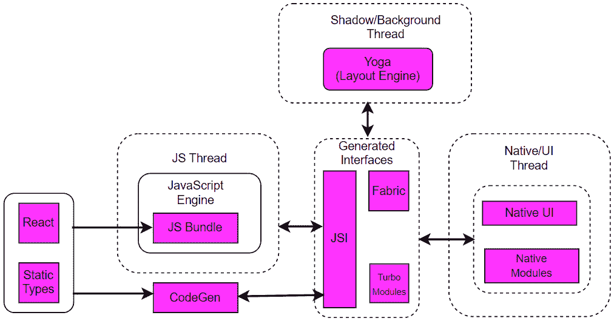
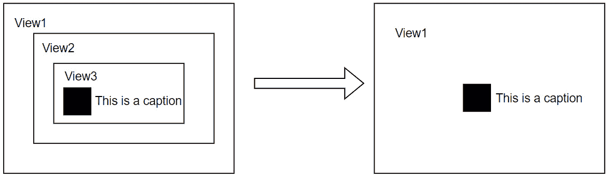

# 第五章：ReactJS 的高级概念

每个网页开发者都应该对 React 的基础知识、核心概念、Hooks 和路由导航有深入的了解，以便在 React 技术栈中建立成功的职业生涯。但如果你想要将你的 React 技能提升到下一个层次，你应该能够通过应用高级 React 概念，如 Portals、错误边界、并发渲染特性、分析器等，来构建生产级别的应用。虽然其中一些概念很久以前就被引入，并且随着每个主要版本的更新而得到改进，但其他高级概念只在新版本中引入。

在本章中，您将了解 ReactJS 的高级概念，以便您可以在各种实时用例中使用它们。将讨论错误边界、Portals、并发渲染、Suspense 等高级概念，以及与代码质量和性能优化相关的特性，如严格模式、静态类型检查和分析器，以涵盖中级到高级开发者的面试问题。最后，我们将快速探讨一些与 React Native 相关的问题，这些问题旨在针对 iOS 和 Android 等移动环境。

在本章中，我们将涵盖以下主要主题：

+   探索 Portals

+   理解错误边界

+   使用 Suspense API 管理异步操作

+   使用并发渲染优化渲染性能

+   使用 Profiler API 调试 React 应用程序

+   严格模式

+   静态类型检查

+   移动环境中的 React 及其特性

本章的主要目标是让您对 React 的高级概念有一个清晰的理解，并解决那些用来测试求职者高级技能水平的面试问题。

# 探索 Portals

现在，在网页上使用模型窗口或弹出窗口来快速吸引用户的注意力是非常常见的。它们有助于通知用户一些重要信息或请求用户输入。但在大型应用中实现这些小部件是具有挑战性的，因为它涉及到编写复杂的 CSS 代码和处理 DOM 层级。幸运的是，React 提供了 Portals 功能来解决这类用例。

Portals 在 2017 年被引入，首次出现在 React 版本 16 中。它们用于在 DOM 层级之外渲染 React 组件。Portals 的使用并不典型，但在某些特定用例中非常有帮助，您将在以下小节中看到。

## 什么是 Portals？您如何创建它们？

React Portals 允许您将子组件渲染到存在于父 DOM 层级之外的 DOM 节点。尽管您在父组件之外渲染子组件，但组件之间仍然存在父子关系。

可以通过调用从 `react-dom` 包导入的 `createPortal` 函数来创建一个 React Portal。此函数接受两个必需参数和一个可选参数：

+   `Children`: 可以用 React 渲染的任何 JSX 代码。

+   `DOMNode`: 需要在其中渲染门户内容的 DOM 节点。

+   `Key`: 用于在组件树中区分门户的唯一标识符。这是可选的。

以下模态窗口的示例显示了如何在根树层次结构之外的特定 DOM 节点处创建门户：

```js
import { createPortal } from 'react-dom';
const ModalWindow =({ description, isOpen, onClose })=> {
  if (!isOpen) return null;
  return createPortal(
     <div className="modal">
      <span>{description}</span>
      <button onClick={onClose}>Close</button>
     </div>
    ,document.body);
}
```

在前面的代码中，门户返回一个 React 节点，该节点可以在组件树中的任何位置渲染。在这个例子中，返回的节点将是一个模态小部件。这个模态已经被附加到文档主体上，并且与 HTML 中的`root`节点处于同一级别。

注意

常规做法是将顶级节点命名为`root`，因为其中的一切都将由 React 管理。仅使用 React 构建的应用程序通常只有一个根节点。但是，如果您正在将 React 集成到现有应用程序中，您可能有许多独立的根 DOM 节点。

任何 React 组件都可以将前面的门户用作子组件：

```js
function ParentComponent() {
  const [open, setOpen] = useState(false);
  return (
    <div className="container">
      <button onClick={() => setOpen(true)}>Open Modal</button>
      <Modal
        message="This is a portal modal!"
        isOpen={open}
        onClose={() => setOpen(false)}
      />
    </div>
  );
}
```

没有对特定组件或应用程序中可使用的门户数量的限制。使用门户，您还可以将 React 组件渲染到非 React 服务器标记（如静态或服务器端渲染的页面）和非 React DOM 节点中，这些节点由 React 之外管理。

## 门户的常见用例有哪些？

在可以直观地看到子组件从父容器中分离的应用程序中，门户非常有用。最常见的用例如下列出：

+   **Modal windows or dialogue components**: 门户可用于创建大型对话框或模态窗口，这些窗口可以浮在网页的其余部分之上，而无需担心父组件。

+   如果使用`overflow:hidden`或`z-index`样式，那么在门户内部创建的工具提示不会从其父容器中切断。

+   **Loaders**: 当后台任务（如从数据库获取数据）正在进行时，在现代网络中显示加载屏幕是合理的。这有助于阻止用户在后台任务完成之前与应用程序交互。

+   **Popovers**: Popovers 对于快速提供上下文信息非常有用。例如，可以使用个人资料卡片来显示用户个人资料信息，而无需点击并访问个人资料本身。您只需将鼠标悬停在图标或按钮元素上即可阅读详细信息。

+   **Cookie alerts**: 可以创建 cookie 警报（或横幅），以便访客在访问网站时选择允许跟踪哪些 cookie。

+   **Drop-down menus**: 如果下拉菜单显示在具有隐藏溢出样式的父组件内部，则可以将其创建为门户。

注意

通过将子组件移出主组件树，渲染性能将得到优化，因为组件不会在每次状态更新时重新渲染。此外，它提供了抽象的灵活性。

## 门户内部的事件冒泡是如何工作的？

即使 portal 存在于 DOM 树的某个位置，它通过支持所有组件功能（如访问 props、state、context 和事件传播）来保留其在 React 组件树中的位置。这意味着事件冒泡也适用于 portals。

portals 中事件冒泡的行为类似于 React 子组件在组件树内部触发事件。从 portals 触发的事件将向上传播到包含的 React 树中的祖先元素，即使这些元素在 DOM 树中不是祖先。例如，在以下 HTML 代码中，位于主根（`#main-root`）下的父组件可以捕获一个未捕获的冒泡事件，该事件来自使用 portals 实现的兄弟节点（`#dialog-root`）：

```js
<html>
  <body>
    <div id="main-root"></div>
    <div id="dialog-root"></div>
  </body>
</html>
```

注意

portals 中的事件冒泡遵循 React 树而不是 DOM 树。

## 在 portals 中采取了哪些可访问性预防措施？

你需要确保使用 portals 构建的 React 应用程序对残疾人士也是可访问的。例如，当你在不同模态窗口和父网页之间移动焦点时，键盘焦点应该自然工作。作为 portals 部分创建的模态对话框应遵循 WAI-ARIA 模态编写实践（[`www.w3.org/WAI/ARIA/apg/patterns/dialog-modal/`](https://www.w3.org/WAI/ARIA/apg/patterns/dialog-modal/))。

实现键盘可访问性的部分指南如下：

+   当对话框或模态框打开时，焦点会移动到对话框内的一个元素。

+   使用制表符键在可聚焦元素之间循环时，应仅遍历对话框元素。焦点不应跳过已打开的对话框。

+   按下 *Esc* 键后，对话框应关闭。

如果你打算使用第三方库来创建模态框，你需要确保该库遵循所需的可访问性指南。

在构建应用程序时，你总会遇到意外的错误。这些错误可能以多种方式发生，例如通过网络请求、调用第三方 API、访问不存在的嵌套对象属性等。错误边界主要在 React 应用程序中用于处理这些类型的错误。

# 理解错误边界

在 React 应用程序中，你可以以两种可能的方式处理错误。第一种方法是在命令式代码块中使用 `try..catch` 块来处理错误，类似于常规事件处理器。第二种方法是使用 **错误边界**。这些用于处理将在屏幕上渲染的声明式组件代码。

React 团队在 React 版本 16 中引入了错误边界作为其一部分。React 库中没有创建用于错误边界的官方组件，因此你需要自己创建错误边界组件。

## 什么是错误边界？

错误边界只是具有特定任务列表的 React 组件。它们用于捕获其子组件树中可能发生的 JavaScript 错误，记录这些特定错误，并将屏幕重定向到回退 UI 以从错误状态中恢复。该组件有助于防止整个组件树因为树中某个地方发生的错误而崩溃。

错误边界在渲染期间、生命周期方法和整个组件树的构造函数中捕获错误。可以通过定义以下生命周期方法之一或两者来使用类组件创建错误边界：

+   `static getDerivedStateFromError`：此方法用于在抛出错误后渲染回退 UI

+   `componentDidCatch`：此方法用于记录错误信息

可以使用这两种方法之一创建错误边界来保护应用程序免受崩溃的影响。以下是实现方式：

```js
class MyErrorBoundary extends Component {
  constructor(props) {
    super(props);
    this.state = { isErrorThrown: false };
  }
  static getDerivedStateFromError(error) {
    return { isErrorThrown: true };
  }
  componentDidCatch(error, errorInfo) {
    logErrorToReportingService(error, errorInfo);
  }
  render() {
    if (this.state.isErrorThrown) {
      return <h1>Oops, the application is unavaialble.</h1>;
    }
    return this.props.children;
  }
}
```

如果任何生命周期方法在渲染阶段发生错误，将调用`getDerivedStateFromError`方法。在这个方法中，你可以更新错误状态标志变量的值，以反映下一次渲染中的回退 UI。根据错误状态变量，`render`方法将在屏幕上更新 UI。同时，可以使用`componentDidCatch`方法将相同的错误报告给日志服务，用于调试目的。

一旦创建了错误边界，它就可以作为一个常规的 React 组件使用。错误边界组件需要围绕你怀疑可能存在任何类型错误的最顶层 React 组件进行包装。组件的使用方式如下：

```js
<MyErrorBoundary>
  <MyComponent />
</MyErrorBoundary>
```

前面的错误边界捕获`MyComponent`组件树中抛出的任何错误，并防止应用程序崩溃。

注意

你还可以用不同的一组错误消息包裹单个组件的错误边界，以防止它们破坏页面的其他部分。错误边界的设计决策取决于业务需求和 UX 设计。

如果包含的错误边界未能捕获错误，错误将传播到其周围的下一个最近的错误边界。这种行为类似于`catch()`块，它将错误传播到下一个最近的捕获块。

像 Jest 这样的流行测试框架可以用来为错误边界编写类似于任何其他 React 组件的单元测试。单元测试应该模拟 React 组件（错误边界所包裹的组件）中的错误，并验证错误边界是否能够捕获错误并正确渲染回退 UI。也可以通过强制选定的组件进入错误（红色按钮）状态来使用 React DevTools 验证错误边界。

## 是否可以创建一个作为函数组件的错误边界？

在撰写本文时，无法使用最新的 React 版本创建错误边界作为函数组件 - 也就是说，您只能使用类组件创建错误边界。此外，您可以通过重用社区中的`react-error-boundary` ([`github.com/bvaughn/react-error-boundary`](https://github.com/bvaughn/react-error-boundary))包来避免编写错误边界类。

## 何时错误边界不起作用？

在以下场景中，错误边界不会捕获错误：

+   `onClick`、`onChange`和其他在渲染阶段不使用，因此不需要错误边界来从错误中恢复 UI

+   `setTimeout`、`requestAnimationFrame`和其他

+   **服务器端渲染**：React 不支持在服务器上使用错误边界

+   **当错误边界内部有错误时**：React 无法捕获在错误边界本身抛出的错误

对于上述情况（除了最后一个情况外），您可能需要选择常规的 JavaScript `try..catch`语句或`promise#catch()`块来处理错误，确保在错误边界中没有发生错误。

就像错误边界用于在应用程序中捕获任何错误并显示回退 UI 一样，Suspense API 用于在子组件完成加载之前显示回退 UI。

# 使用 Suspense API 管理异步操作

Suspense 功能是在 React 版本 16 中引入的，与错误边界同时出现。最初，它仅用于与`lazy` API 一起进行代码拆分，并且不能用于服务器端渲染。React18 改进了 Suspense API，使其能够支持许多用例，包括服务器端渲染和异步操作，如数据获取。

## 什么是 Suspense API？如何使用它？

Suspense API 用于显示回退 UI，如加载指示器，直到其子组件准备好渲染。suspense 组件接受一个`fallback`属性来渲染一个替代 UI，如果其子组件尚未完成渲染。您可以在应用的最顶层或应用的各个部分使用 suspense 组件。

让我们通过以下示例学习如何使用 Suspense 功能。

考虑一个简单的用例，即从特定作者那里加载博客文章。在这里，博客文章组件（即`<Posts/>`）在获取文章列表时挂起。在内容准备好显示之前，React 切换到最近的 suspense 边界来显示回退加载指示器（即`<Loading/>`），而不是显示文章列表：

```js
import { Suspense } from "react";
import Posts from "./posts.js";
export default function Author({ author }) {
  return (
    <>
      <h1>{author.name}</h1>
      <span>{author.age}</span>
      <Suspense fallback={<Loading />}>
        <Posts authorId={author.id} />
      </Suspense>
    </>
  );
}
function Loading() {
  return <h2>Loading...</h2>;
}
```

一旦博客文章数据已被获取，React 会切换回显示实际的博客文章数据。

您还可以将更新列表和显示状态的内容延迟到新结果准备就绪。通过传递查询到`useDeferredValue` Hook，可以实现这种替代 UI 模式：

```js
const deferredAuthorDetails = useDeferredValue(author);
```

在传统应用程序中，你需要使用 `isLoading` 数据标志变量来指示数据获取是否完成，并在屏幕上显示相应的内容。然而，如果你使用 Suspense 功能，React 会自动确定是否显示回退 UI 或组件数据，而不依赖于任何额外的标志。

注意

只有启用了 suspense 的框架才与 Suspense 功能集成，以将加载状态传达给 React。

## 我可以使用 suspense 组件进行任何类型的数据获取吗？

suspense 组件无法检测 effect 或事件处理器内部的数据获取。它只能用于以下启用了 suspense 的数据源：

+   使用启用了 suspense 的有意见框架（如 Relay、Next.js、Remix 和 Hydrogen）进行数据获取

+   使用 `lazy` API 懒加载组件代码

在编写本文时，不支持在没有框架的情况下使用 Suspense 功能。然而，React 团队有一个计划，在未来的版本中提供官方 API 以将数据源与 suspense 组件集成。

## 你是如何在更新过程中防止不必要的回退的？

如果可见的 UI 被回退替换，将会有闪烁的用户体验。这不是一个好的用户体验。这种情况发生在状态更新导致组件挂起，但最近的 suspense 边界已经向用户显示了一些回退内容时。你可以通过使用 `startTransition` API 将状态更新标记为非紧急来避免这些不必要的回退。

考虑一个在应用程序中导航页面并应用页面更新过渡以防止不必要的回退的例子：

```js
  function navigate(url) {
    startTransition(() => {
      setPage(url);
    });
  }
```

在过渡期间，React 将等待内容加载，而不会重新触发 suspense 回退 UI 来隐藏已经显示的内容。

注意

React 只会防止非紧急更新的不必要的回退。它不会延迟任何紧急更新的渲染。

在过去，React 只能一次处理一个任务，渲染过程是同步的。一旦任务开始，就无法中断。这被称为阻塞渲染。后来，通过引入并发模式解决了这个问题，如果存在另一个紧急任务，并发模式可以中断任务。并发模式最初作为一个实验性功能引入，并在 React 版本 18 中被并发渲染功能取代。

# 使用并发渲染优化渲染性能

React 18 引入了并发渲染器，这使得渲染过程异步，并确保它可以被中断、暂停、恢复，甚至放弃。因此，React 可以快速响应用户交互，即使它正在进行繁重的渲染任务。

新功能，如 suspense、流式服务器渲染和过渡，都是由并发渲染驱动的。

## 你如何在 React 中启用并发渲染？

首先，你需要将`react`和`react-dom`包更新到版本 18。之后，你需要将已弃用的`ReactDOM.render`方法替换为`ReactDOM.createRoot`方法。并发渲染将在你使用并发功能（如 suspense、流式服务器渲染和过渡）的应用程序部分自动启用。

随着应用程序变得复杂，你需要花费大量时间分析应用程序的性能。在向客户交付之前，测量应用程序性能的特征尤为重要。尽管你可以使用浏览器的 User Timing API（Web API）来测量组件的渲染成本，但 React 团队已经创建了更好的替代方案。例如，Profiler API 可以帮助识别 React 应用程序中的性能瓶颈。

# 使用 Profiler API 调试 React 应用程序

如果你正在基准测试 React 应用程序的性能，那么跟踪你的组件重渲染的次数以及每次重渲染的成本将帮助你识别应用程序中的缺陷区域或部分。React 提供了两种不同的方式来衡量应用程序的渲染性能：**React Profiler API**和**React DevTools**的 Profiler 标签。考虑到它支持 Suspense 功能，推荐使用 React Profiler API。

## 你如何衡量渲染性能？

React 提供了 Profiler API 以编程方式测量组件树的渲染性能。该组件有两个属性：`id`属性，用于识别正在测量的 UI 部分，以及`onRender`回调，每次树更新时都会调用。

回调函数接收诸如`id`、`phase`、`actualDuration`、`baseDuration`、`startTime`和`commitTime`等参数，这些参数用于记录渲染时间。

假设你对一个存在于在线书店应用程序中的作者简介组件的渲染性能表示怀疑，并希望对其进行分析。在这种情况下，`AuthorBio`组件需要被`Profiler`组件包裹，并附带`onRender`回调。这看起来如下所示：

```js
<App>
  <Profiler id="bio" onRender={onRender}>
    <AuthorBio />
  </Profiler>
  <Posts />
</App>
```

你还可以使用多个`Profiler`组件来衡量应用程序的不同部分。

JavaScript 在 ECMAScript5 中提供了严格模式作为一项新特性，以强制执行 JavaScript 的受限版本。此特性在编写代码时带来了更严格的规则，并在违反这些规则时抛出错误。可以通过在文件顶部添加`use strict`行来启用严格模式。同样，React 提供了`StrictMode`组件作为开发工具，用于在编写 React 代码时强制执行更严格的警告和检查。

# 严格模式

React 团队引入了严格模式作为调试工具，用于识别网络应用程序中可能存在的错误或问题。此工具作为 React API 中的 `StrictMode` 组件提供。它不会渲染任何类似于 `Fragment` 组件的 UI。此功能仅适用于开发模式 – 它不会影响生产环境中的行为。本节重点介绍重要的严格模式概念和可能在面试中提出的问题。

## 你如何启用严格模式？

你可以通过将整个应用包裹在根组件周围来为整个应用启用严格模式，如下所示：

```js
import { StrictMode } from "react";
import { createRoot } from "react-dom/client";
const root = createRoot(document.getElementById("root"));
root.render(
  <StrictMode>
    <App />
  </StrictMode>
);
```

你还可以仅在应用程序的某些部分（即不是整个应用程序）中使用严格模式，如果你认为这些部分有很高的错误可能性。考虑将严格模式用于应用程序页面主体。它应该看起来像这样：

```js
<>
  <Navigation>
    <Details>
      <StrictMode>
        <Services />
        <Support />
      </StrictMode>
    </Details>
    <Footer />
  </Navigation>
</>;
```

大多数时候，React 开发者会遇到渲染部分逻辑不当的问题，以及 effects Hook 内缺少清理代码的问题。这些类型的错误可以通过严格模式轻松识别。

## 你能描述一下严格模式启用的仅限开发模式的检查列表吗？

严格模式启用了以下仅限开发模式的检查列表，以在早期开发过程中查找常见错误：

+   组件将重新渲染一次以查找由不纯渲染引起的错误

+   组件将重新运行一次效果以查找由效果缺少清理引起的错误

+   组件将被验证是否使用了已弃用的 API，并将通过警告通知用户

这些检查仅适用于开发目的。它们不会对生产构建产生影响。

## 严格模式的两次渲染过程中调用哪些函数？

严格模式在开发模式下会调用以下列表中的函数两次：

+   函数的组件体，不包括事件处理程序内部的代码

+   传递给 Hook 的函数，如 `useState`、`useReducer` 和 `useMemo`

+   状态更新函数

+   类组件方法，如 `constructor`、`render`、`shouldComponentUpdate` 和 `getDerivedStateFromProps`

如果你的函数不纯，在开发模式下运行两次将影响预期的输出。这个结果可以帮助你尽早识别代码中的任何错误。

除了严格模式之外，你还可以在 React 应用程序中使用静态类型检查来避免运行时出现的错误和错误。随着你的应用程序增长，你可以使用类型检查捕获许多错误。

# 静态类型检查

React 基于 JavaScript，JavaScript 是一种弱类型语言。因此，在 React 中我们没有默认的静态类型检查功能。

在其旧版本（<15.5）中，React 有`PropTypes`验证器，以便在应用程序中执行简单的类型检查。在那之后，这个库从 React 的核心模块中移出，并作为一个独立的库创建，即`prop-types`([prop-types 包](https://www.npmjs.com/package/prop-types))。如今，`PropTypes`在现代 React 应用程序中不常用。尽管在 React 中静态类型检查不是强制性的，但在面试中您可能会遇到一些与静态类型检查相关的问题。

## 静态类型检查有哪些好处？

在 JavaScript 应用程序中进行静态类型检查有许多好处。其中一些列在这里：

+   可以在运行时之前（即在编译时）识别类型错误

+   可以在早期阶段检测 bug 和错误

+   优化且易于阅读

+   更好的 IDE 支持

+   可以生成文档

如果您尽早发现错误，修复它们会更便宜。

## 您如何在 React 应用程序中实现静态类型检查？

在 React 中，有多种方式可以实现静态类型检查，但以下两种方式是最好的：

+   TypeScript

+   Flow

这两个静态类型检查器可以帮助您在运行代码之前识别某些类型的错误。由于 TypeScript 稳健且社区支持度最高，让我们看看它如何在 React 中实现。

TypeScript 是由微软创建的，被认为是 JavaScript 的超集。它自带编译器，可以在构建时捕获错误和 bug。它支持 JSX，并且可以无问题地使用 React hooks。如今，TypeScript 可以通过添加各种选项来支持主要框架，如下所示：

+   Next.js:

    ```js
     npx create-next-app@latest --ts
    ```

+   Remix:

    ```js
    npx create-remix@latest
    ```

+   Gatsby:

    ```js
     npm init gatsby –ts
    ```

+   Expo:

    ```js
    npx create-expo-app -t expo-template-blank-typescript
    ```

如果您没有使用这些框架，您需要遵循以下手动步骤在 React 应用程序中设置 TypeScript：

1.  `npm`或`yarn`包管理器：

    ```js
    tsc compiler (that is, the TypeScript compiler) so that you can build the application.
    ```

1.  通过以下命令生成`tsconfig.json`文件：

    ```js
    npx tsc --init
    ```

    常用的选项包括 TypeScript 文件的源目录和输出文件夹的生成 JavaScript 文件。配置看起来像这样：

    ```js
    //tsconfig.json
    {
      "compilerOptions": {
        // ...
        "rootDir": "src",
        "outDir": "dist"
        // ...
      },
    }
    ```

    您可以添加更多配置选项，如这里所述：[TypeScript 配置选项](https://www.typescriptlang.org/docs/handbook/tsconfig-json.html)。TypeScript 的 React 启动器提供了一个包含良好规则的配置文件。

1.  `.ts`扩展名或`.tsx`扩展名用于包含 JSX 代码的文件。

1.  `DefinitelyTyped` ([DefinitelyTyped 仓库](https://github.com/DefinitelyTyped/DefinitelyTyped))或创建一个本地的声明文件。

现在，您可以使用 TypeScript 包中的`tsc`命令构建 TypeScript 项目。

最初，React 主要用于 Web 开发。如今，它也可以用于移动、桌面和 VR 应用。React Native 是一个独立的库，是为了支持移动设备而创建的。它基于与 React 相同的概念，但使用原生组件而不是 Web 组件在屏幕上渲染。

# 移动环境中的 React 及其特性

当 Facebook 最初决定将其服务扩展到移动设备时，它决定基于 HTML5 运行移动页面，而不是构建当时许多科技巨头更喜欢的原生应用。然而，它最终遇到了用户体验和性能开销的问题。

2013 年，Facebook 团队发现了一种使用 JavaScript 生成 iOS 应用 UI 元素的方法。这个想法对移动应用很成功，后来 React Native 也支持了 Android 设备。

本节将重点关注 React Native，这样我们可以超越 ReactJS 概念，涵盖与架构、导航及其与 ReactJS 的区别相关的重要主题，这些可能在 React 面试中有所期待。

## 什么是 React Native？

React Native 是一个流行的基于 JavaScript 的移动应用框架，用于为 iOS、Android 和 Windows 构建原生渲染的移动应用。这个库的主要优势是你可以使用一个在多个平台上运行的单一代码库。

Facebook 团队在 2015 年开源了 React Native。仅仅几年后，这个库就成为了移动开发中最受欢迎的解决方案之一，现在被用于 Facebook、Instagram、Skype、Uber 等流行移动应用中。

## React 和 React Native 之间的区别是什么？

React Native 基于 React 库，它们共享许多概念。但也有一些主要区别，如下所示：

| **React** | **React Native** |
| --- | --- |
| 它用于开发 Web 应用 | 它用于开发移动应用 |
| 使用 `react-router` 库进行页面导航 | 使用内置的导航库进行页面导航 |
| 使用虚拟 DOM 来渲染网页 | 使用原生 API 来渲染页面 |
| React 使用 HTML、CSS 和 JavaScript 来创建用户界面 | React Native 使用原生组件和 API 来构建应用 |
| 它使用 JavaScript 和 CSS 库进行动画 | 它自带内置的动画库 |

表 5.1：React 与 React Native 对比

因此，React Native 是在 React 库之上构建的一个附加库，用于创建原生应用，这个原生库有自己的架构。

## 你能根据线程模型描述 React Native 的架构吗？

Fabric 是由 Facebook 团队创建的新渲染架构，甚至他们的应用程序也是由这个渲染器支持的。该架构的核心原则是在 C++ 中统一渲染器逻辑，并优化主机平台之间的互操作性。它基于线程模型，类似于旧架构，但功能不同，以优化用户体验，使其优于原生应用程序。

在旧架构中，React Native 桥被用于在 JavaScript 和原生模块之间进行通信。但它有其局限性——例如，通信只能通过异步操作进行，并且需要将数据序列化为 JSON 或反序列化为 JSON。在新架构中，此桥组件被**JavaScript 接口**（**JSI**）所取代。

让我们看看在新渲染架构中各种组件是如何进行通信的：



图 5.1：Fabric 渲染架构

在每个 React 应用程序中，无论使用的是旧渲染器还是新渲染器，都会运行三个并行线程：

+   **UI 线程或主线程**：此线程负责处理 iOS 和 Android 主视图。它处理一些原生交互，例如点击按钮、用户手势事件、滚动等。

+   **JS 线程**：此线程负责处理你的 React Native 应用程序的所有逻辑。它负责处理代码中编写的所有 DOM 层级操作并执行它们。之后，代码被发送到原生模块线程进行优化。

+   **阴影或背景线程**：此线程负责布局计算，例如元素的位置、高度和宽度，然后将它们转换为原生元素。

在旧架构中，桥组件用于通过序列化和反序列化数据以异步方式在 JS 线程和 UI 线程之间进行通信。因此，内存管理和应用程序性能变得过载。在新架构中，桥组件已被 JSI 取代，以实现原生代码和 JavaScript 代码之间的有效通信。JSI 是一个轻量级层，其中用 C++ 编写的函数可以被 JavaScript 引擎（如 **JavaScript Core**（**JSC**）或 Hermes）直接调用或调用原生代码中的方法。

新架构的工作流程如下：

1.  当用户点击移动应用程序的应用图标时，Fabric 渲染系统直接加载原生端而不是打开原生模块。

1.  渲染系统在准备好后通知 JS 线程。之后，JS 线程加载名为 `main.bundle.js` 的最终包，其中包含 JavaScript 代码、React 逻辑及其组件。

1.  JS 代码通过 ref 原生函数被调用，该函数已通过 JSI API 暴露给 Fabric。

1.  阴影线程内的瑜伽引擎执行布局计算，将基于 Flexbox 的样式转换为宿主布局等。

1.  最后，组件将在屏幕上渲染。

此外，新架构中增加了两个新组件：`Turbo module` 和 `CodeGen`。

`Turbo module` 是原生模块（存在于旧架构中）的改进版本，通过懒加载模块与 JavaScript 和平台原生代码进行通信，以改善启动性能。`CodeGen` 静态类型检查器有助于沟通动态 JavaScript 代码和作为静态类型 C++ 编写的 JSI 代码。

## 如何在 React Native 中执行导航？

React Native 使用 `react-navigation` 库在原生应用之间进行页面导航。多个屏幕之间的转换由各种类型的导航器管理，例如堆栈导航器、抽屉导航器和标签导航器。在多个屏幕之间导航时，您还可以在它们之间传递数据。

React Navigation 由核心实用工具组成，这些工具被导航器用于在您的应用中创建导航结构。该包可以使用以下命令安装：

```js
npm install @react-navigation/native
```

React Navigation 中的每个导航器都存在于自己的库中。例如，如果您想使用 `native-stack` 导航器，应单独使用以下命令进行安装：

```js
npm install @react-navigation/native-stack
```

堆栈导航器为您的应用提供了在屏幕之间切换和管理导航历史的方法。这种行为类似于网络浏览器处理导航历史的方式。它还提供了在堆栈内导航页面时可能期望在 Android 和 iOS 设备上出现的手势和动画。

下面是一个基于堆栈导航器创建的组织网站导航菜单项的示例：

```js
import * as React from "react";
import { View, Text } from "react-native";
import { NavigationContainer } from "@react-navigation/native";
import { createNativeStackNavigator } from "@react-navigation/native-stack";
import HomeScreen from "components/HomeScreen";
import ServicesScreen from "components/ServicesScreen";
const Stack = createNativeStackNavigator();
function App() {
  return (
    <NavigationContainer>
      <Stack.Navigator>
        <Stack.Screen name="Home" component={HomeScreen} />
        <Stack.Screen name="Services" component={ServicesScreen} />
      </Stack.Navigator>
    </NavigationContainer>
  );
}
export default App;
```

在前面的代码中，我们创建了一个堆栈导航菜单，用于将用户重定向到网站的重要屏幕，例如主页和服务页面。

此外，您可以使用 Navigation API 嵌套导航器。

## 新架构有哪些好处？

React Native 的新架构在用户体验、代码质量、性能和可扩展性方面带来了许多好处。我们在这里列出了一些：

+   **更好的互操作性**：在旧架构中，当您尝试将 React 视图嵌入宿主视图时，会出现布局跳跃问题。这是因为 React Native 的布局是异步的。新的渲染器通过同步渲染 React 页面提供了改进的互操作性。

+   **更好的数据获取行为**：通过集成 React 的 Suspense 功能，数据获取用户体验得到了改善。

+   **类型安全**：代码生成确保了 JS 和平台层之间的类型安全。它使用 JavaScript 组件声明来生成 C++ 结构体以保存属性。从 JS 规范生成的代码必须通过 Flow 或 TypeScript 进行类型化。

+   **同步执行**：这提高了用户体验。现在，可以同步执行函数，而不是异步执行。

+   **并发**：JavaScript 可以调用在不同线程上执行的功能。

+   **共享的 C++代码**：新的渲染器是用 C++实现的。因此，可以编写平台无关的代码，并在不同平台之间共享。

+   **性能提升**：在新渲染架构中，可以识别特定平台的全部限制，并为 iOS 和 Android 的使用提供了解决方案。最初，视图展平解决方案仅在 Android 上可用，但现在默认适用于两个平台。

+   **更快的启动**：由于主组件默认是懒加载的，因此启动时间将更快。

+   **一致性**：由于新的渲染系统是跨平台的，因此组件的行为在各个平台之间是一致的。

+   **更少的开销**：不再需要在 JavaScript 和 UI 层之间进行序列化和反序列化。

使用旧架构无法实现这些好处。

## 视图展平是什么？

React API 的声明性和组合特性允许你创建深层次的 React 元素树，其中大多数节点仅影响屏幕的布局，而不是在屏幕上渲染。这些节点被称为**仅布局**节点。大量的仅布局节点会导致渲染时的性能下降。

渲染器实现了视图展平算法以提升性能。视图展平是一种优化算法，由 React Native 渲染器使用，以避免深层次布局树。这种机制合并或展平这些仅用于布局的节点类型，并减少屏幕上显示的主视图层次结构的深度。

这个过程可以用`MyLogoComponent`来解释，它包含具有边距和填充样式的视图容器组件：

```js
function MyLogoComponent() {
  return (
    <View>
      <View style={{margin: 10}} >
        <View style={{padding: 20}}>
          <Image {...} />
          <Text {...}>This is a caption</Text>
        </View>
      </View>
    </View>
  );
}
```

在前面的代码中，在容器和组件的实际内容之间添加了两个主视图（即`<View style={..}>`），以对内部内容应用结构样式。

视图展平算法作为渲染器**差异**阶段的组成部分集成，并将第二和第三个视图的样式合并到第一个视图中。这样，它避免了创建和渲染两个额外的主视图的需求。

以下图表显示了使用此机制没有深层次布局树的原生屏幕的外观：



图 5.2：合并视图的原生屏幕

应用此视图展平算法后，将不会出现任何可见的变化。

在本节中，我们介绍了一些 React Native 的重要基本概念，这些概念你可能在 React 面试中遇到。你可能会被问到这些问题来测试你对 React 技术栈的了解。本节也标志着本章的结束，其中我们涵盖了 React 生态系统中的广泛高级主题。

# 摘要

本章介绍了一系列你可能在 ReactJS 面试中遇到的高级概念。我们首先介绍了新特性，如处理模态窗口的 portals、防止应用因错误而崩溃的错误边界，以及 Suspense 特性，它为耗时较长的后台任务显示替代 UI。之后，我们讨论了与并发渲染相关的话题，它支持提高渲染性能的特性，接着是 Profiler API，它可以用来检测应用程序特定部分的渲染成本。

然后，我们讨论了仅用于开发的特性，如严格模式和静态类型，这些特性有助于我们避免在代码中遇到任何可能的错误和 bug。最后，我们介绍了在移动环境中以及 React Native，以及它与 ReactJS 的区别，包括其内部结构和渲染架构。

在本章中，我们帮助你学习了高级概念、它们的重要性以及 React 开发中的最佳实践。因此，这本书将提高你的 React 技能，让你成为专家，并在竞争激烈的就业市场中脱颖而出。

在下一章中，我们将了解 React 中流行的状态管理解决方案。我们将从了解 Flux 模式和 Redux 架构开始，以便你理解 Redux 的基础。之后，我们将讨论核心原则、各种组件、处理异步请求、中间件以及调试 Redux 应用程序等重要话题。

# 第三部分：超越 React 和高级主题

在本部分中，你将了解流行的 React.js 状态库 Redux，以及与使用本地状态相比，在我们的项目中拥有全局状态存储可以带来极大的好处。我们还将探讨在 React.js 应用程序中使用 CSS 的多种方式以及每种方法的优缺点。

然后，我们将随着对测试的不同方式的学习来进行测试和调试，以使我们的代码更加可靠。最后，我们将了解 React.js 库 Next.js、Gatsby 和 Remix，看看它们如何帮助我们构建 React.js 应用程序。

本部分包含以下章节：

+   *第六章*，*Redux：最佳状态管理解决方案*

+   *第七章*，*在 React.js 中应用 CSS 的不同方法*

+   *第八章*，*测试和调试 React 应用程序*

+   *第九章*，*使用 Next.js、Gatsby 和 Remix 框架进行快速开发*
