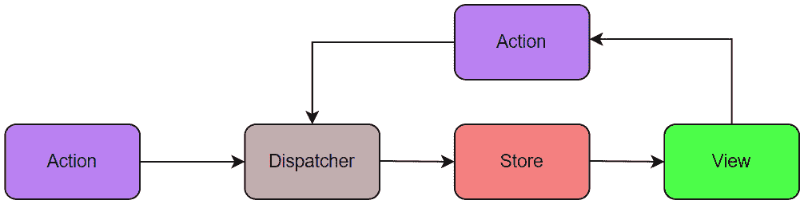
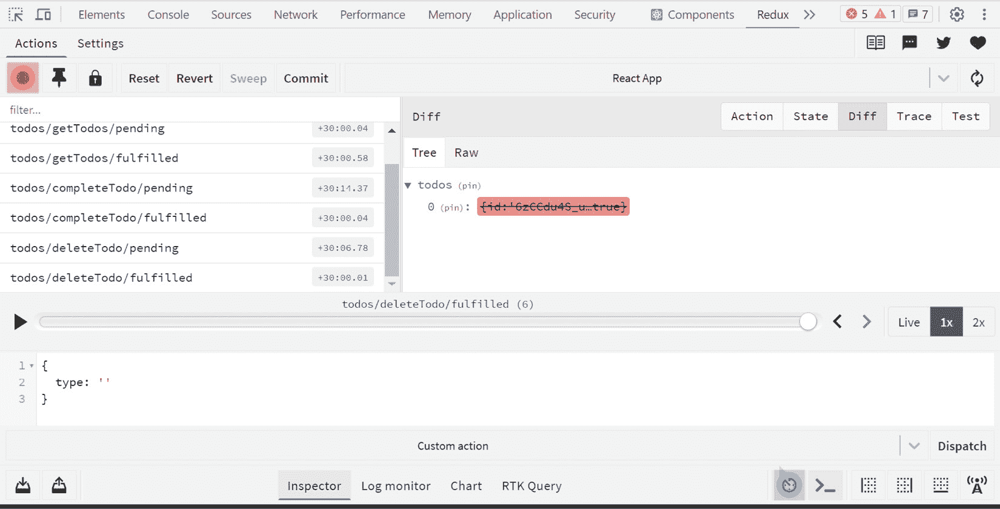

# 6

# Redux：最佳状态管理解决方案

随着你的 JavaScript 单页应用程序的需求变得更加复杂，维护应用程序状态将变得具有挑战性。这种应用程序状态可以由服务器或 API 响应、本地组件状态以及 UI 状态（如分页控件、活动路由和选定的标签页）创建。可以通过你应用程序中的直接或间接模型或 UI 交互来更改状态。在某个时候，你可能会失去对何时、为什么以及如何更改状态的控制。这个问题已经被状态管理设计模式和库（如 Flux、Redux、MobX、Recoil、Rematch、Vuex 等）所解决。

选择正确的状态管理解决方案对于任何中型到大型规模的 React 应用程序至关重要。阅读本章后，你将能够流畅地回答有关 Flux 模式和 Redux 架构、核心原则、主要组件、处理异步数据流、中间件如 Saga 和 Thunk 以及 Redux DevTools 用于调试的问题。

在本章中，我们将涵盖以下主要内容：

+   理解 Flux 模式和 Redux

+   Redux 的核心原则、组件和 API

+   Redux 中间件 – Saga 和 Thunk

+   使用 RTK 标准化 Redux 逻辑

+   使用 Redux DevTools 调试应用程序

Redux 最初是为 React 应用程序创建的，并且在所有可用的状态管理库中都非常受欢迎。让我们在下一节中了解更多关于 Flux 模式、Redux 基础和核心概念，以便更好地理解 Redux 库。

# 理解 Flux 模式和 Redux

Flux 被创建为一种设计模式，用于管理 React 应用程序中的数据流。这是对 *观察者* 模式的一种轻微修改，该模式定义了一种订阅机制，其中任何对象的状态更改都会通知所有其他对象（[`en.wikipedia.org/wiki/Observer_pattern`](https://en.wikipedia.org/wiki/Observer_pattern)）。

2015 年，Redux 库被引入。它受到了 Flux 架构的启发，但实现方式不同。接下来的几个问题将关注 Flux 和 Redux 的核心概念，为 Redux 状态管理库的坚实基础。

## 什么是 Flux 模式？你能解释数据流吗？

Flux 是一种管理应用程序中单向数据流的模式，并作为传统 MVC 模式的替代品。它既不是框架也不是库，而是一种新的架构，用于解决客户端 Web 应用程序中的状态管理复杂性。它是在与 React 应用程序一起工作时由 Facebook 内部开发和使用的。

Flux 在其数据流中有四个主要组件：Action、Dispatcher、Store 和 View。以下是关于它们的更多内容：

+   **Action**：这代表一个发送到派发器的 JavaScript 对象，用于触发数据流。

+   **分发器**：这是一个更新存储的单例回调注册表，并在 Flux 应用程序的数据流中充当中央枢纽。它没有真正的智能，只是简单地从动作分发有效载荷到存储。

+   **存储**：这是应用程序状态和逻辑维护的地方。

+   **视图**：它从存储接收数据并重新渲染应用程序。视图将触发动作以响应任何用户交互。

基于 preceding 组件的 Flux 架构的逐步数据流看起来是这样的：

1.  如果任何用户执行任何 UI 交互，将生成一个事件，并且视图将向分发器发送动作。

1.  分发器将那些动作发送到相应的存储。

1.  存储更新状态并通知视图重新渲染。

以下图表描述了基于 Flux 的 Web 应用程序中数据流的发生方式：



图 6.1：Flux 数据流

在大多数应用程序中，我们还会创建 *action creators* 作为一组辅助方法库，这些方法不仅创建动作对象，还将动作传递给分发器。

## Flux 的优点是什么？

Flux 架构具有以下优点，并且有助于在客户端 Web 应用程序中使用：

+   由于其单向数据流，它很容易理解

+   Flux 组件是解耦的，每个组件都有自己的职责

+   它是一个开源架构，而不是框架或库

+   由于其设计，运行时错误将减少

+   它易于维护

Flux 架构有助于将 API 通信、缓存和本地化代码的实现从视图或 UI 层移出。

## 如何区分 Flux 和 MVC？

**模型-视图-控制器**（**MVC**）设计模式于 1976 年在 Smalltalk 编程语言中引入。随着应用程序的增长，这种模式因其多数据流而变得复杂。Facebook 团队通过引入 Flux 架构解决了这个问题。MVC 和 Flux 设计模式之间的主要区别列在以下表格中。

| **MVC** | **Flux** |
| --- | --- |
| 数据流方向是双向的 | 数据流方向是单向的 |
| 控制器处理逻辑 | 存储处理逻辑 |
| MVC 中没有存储概念 | Flux 中可以有多个存储 |
| 它是同步的 | 它是异步的 |
| 由于双向数据流，调试困难 | 使用分发器调试更容易 |
| 它用于客户端和服务器端框架 | 它仅用于客户端框架 |

表 6.1：MVC 与 Flux 对比

Flux 并非完全不同于 MVC 的方法，但它是一个改进的 MVC 模式。如果应用程序复杂且数据模型复杂，最好选择 Flux 而不是 MVC。

## 什么是 Redux？

Redux 是一个流行的、可预测的状态容器库，旨在编写在客户端、服务器和原生环境中表现一致的 JavaScript 应用，同时易于测试。它受到了 Facebook 的 Flux 架构的启发。它消除了 Flux 模式中存在的无必要复杂性。

当应用包含较少的组件时，使用组件状态相当直接。随着组件数量的增加和应用的变大，维护应用中每个组件的状态将变得具有挑战性。在这种情况下，Redux 通过创建一个全局存储来拯救，所有需要的组件都使用这个全局存储，而不需要从一个组件传递 props 到另一个组件。

注意

Redux 是一个大小约为 2 KB 的轻量级库，包括其依赖项。

## Flux 和 Redux 之间有什么区别？

尽管 Redux 受到了 Flux 架构的启发，但有一些主要区别，如下表所示。

| **Flux** | **Redux** |
| --- | --- |
| 这是由 Facebook 开发的 | 这是由 Dan Abramov 和 Andrew Clark 开发的 |
| 它是一种用于管理应用状态的应用架构 | 它是一个用于管理状态的开放源代码 JavaScript 库 |
| Flux 在应用中提供多个存储 | Redux 的目标模式是在应用中只有一个存储 |
| 它由四个主要组件组成：ActionDispatcherStoreView | 它由三个主要组件组成：ActionReducerStore |
| 存储管理处理逻辑 | Reducers 管理处理逻辑 |
| 它有一个单例分发器 | 它不会使用任何分发器 |
| 存储的状态是可变的 | 存储的状态是不可变的 |

表 6.2：Flux 与 Redux 对比

除了上述区别之外，Redux 通过函数组合减少复杂性，而 Flux 使用回调注册。

## 你何时需要使用 Redux？

Redux 用于维护和更新应用中的数据，为多个组件提供共享状态。但并非所有类型的应用都需要它。它具有较大的学习曲线和需要编写更多代码的需求。

以下是一个 Redux 有用的用例列表：

+   你有大量的应用状态需要由应用中的许多组件共享

+   你需要遵循应用状态的单一真相源

+   应用状态需要频繁更新

+   更新应用状态的逻辑很复杂

+   你需要监控状态更新在一段时间内发生的情况

+   应用代码不是一个小型代码库，许多团队成员需要在其上工作

此外，如果你可以在 React 或其他前端框架内部管理状态，那么你不需要使用 Redux。

Redux 不仅仅是一个小型的库；它还基于核心原则的模式，一个由三个主要组件组成的工作系统，并为 Redux 应用程序提供了多个附加功能和广泛的 API，以覆盖常见的用例。让我们在下一节深入探讨所有这些主题。

# Redux 的核心原则、组件和 API

尽管 Redux 受到了 Flux 架构重要品质的启发，但它有自己的基础原则和多种组件，这使得 Redux 系统能够处理大型应用程序的状态管理。作为本节的一部分，你将清楚地了解 Redux 的内部结构和它们的用法，以回答中到高级别的问题。

## Redux 的核心原则是什么？

Redux 基于三个核心原则。这些原则有助于更好地理解库：

+   `getState()`函数如下：

    ```js
    console.log(store.getState());
    ```

    这棵单一的树也有助于在开发中持久化状态，以加快开发周期。

注意

Redux 的单存储方法与 Flux 的多存储方法的主要区别之一。

+   **状态是只读的**：修改状态的唯一可能方式是发出一个动作，该动作是一个对象，描述了发生了什么。这意味着应用程序不能直接更改状态，而是通过传递一个动作来表达更改状态的意图。

    ```js
    cities state by dispatching an action:
    ```

    ```js
    store.dispatch({
      type: 'ADD_CITY',
      payload: "London"
    })
    ```

    由于前面的动作是一个普通的 JavaScript 对象，它可以被序列化、存储、记录，并且可以用于调试目的的重放。

+   `cities`状态变量：

    ```js
    function cities(cities = [], action) {
      switch (action.type) {
        case 'ADD_CITY':
          return [
            ...cities,
            {
              name: action.payload,
              position: 1
            }
          ]
        default:
          return cities;
      }
    }
    ```

初始时，你的应用程序可以从单个还原器开始。一旦你的应用程序增长，你可以将大型还原器拆分为多个小型还原器，这些还原器管理状态树的具体部分。此外，你还可以控制还原器的调用顺序，传递额外的数据，并在应用程序中使它们可重用于常见任务。

## Redux 是如何工作的？Redux 的主要组件有哪些？

Redux 系统通过在中央存储中保留整个应用程序的状态来工作。每个作为 Redux 提供者子组件的 UI 组件都可以访问这个存储状态，而不是从一个组件向另一个组件发送 props。Redux 工作流程的整个过程基于三个主要核心组件：**动作**、**还原器**和**存储**。

在以下代码中，使用简单的待办事项示例解释了 Redux 使用核心组件的工作流程，以更好地理解。在示例中，日常活动如吃饭和跑步被视为待办事项，并使用 Redux 工作流程添加到存储中：

+   `type`字段表示要执行的动作类型，以及其他用于更改状态的数据字段。它们是向 Redux 存储发送应用程序数据的唯一方式（例如，通过表单数据、用户交互或 API 调用）。所有这些动作都是通过动作创建器创建的，这些动作创建器只是返回动作的函数。

    ```js
    addTodo that returns a todo action:
    ```

    ```js
    function addTodo(todo) {
      return {
        type: 'ADD_TODO',
        payload: todo
      }
    }
    ```

    前面的动作还包含 todo 详细信息作为有效负载。它将由`store.dispatch(addTodo)`方法执行，该方法将此动作发送到存储。

+   `todo`，如下代码片段所示：

    ```js
    const todoReducer = (state = initialState, action) => {
      switch (action.type) {
        case "ADD_TODO":
          const { name, priority } = action.payload;
          return [...state.todos, { name, priority }];
        default:
          return state;
      }
    };
    ```

    前面的 reducer 将初始状态和动作作为参数。如果 switch case 与`ADD_TODO`动作类型匹配，它将复制状态中的现有 todos，使用新的`todo`值更新 todos，并返回新的 todo 列表。否则，将返回带有未更改 todos 的现有状态。您可以根据可能的动作（如更新、删除和过滤应用程序中的 todos）添加更多功能案例。

注意

它不仅限于使用 switch-case 代码块来决定新状态应该是什么。您还可以使用`if/else`循环或任何其他编程结构。

+   `createStore`或`configureStore`

+   `dispatch(action)`

+   `getState()`

这些辅助方法将被用来创建或更新存储中的 todos 状态，如下所示：

```js
import { createStore } from "redux";
import todoReducer from "reducers/todoReducer";
const store = createStore(todoReducer); // Create a store
const firstTodo = addTodo({ name: "Running", priority: 2 });
console.log(firstTodo);
store.dispatch(firstTodo); // Dispatch a todo
const secondTodo = addTodo({ name: "Eating", priority: 1 });
console.log(secondTodo);
store.dispatch(secondTodo);
console.log(store.getState()); // Returns the todos list
createStore from plain Redux, and you will see the usage of the configureStore method when we introduce the RTK.
```

注意

随着应用程序的增长，可以使用称为*选择器*的函数访问存储状态中的特定状态信息部分。reselect 库因其记忆化的选择器函数而广受欢迎。

还可以通过添加 store enhancers 和 middleware 来扩展 store 的功能。这些主题将在本章后续问题中介绍。

## 我可以使用 Redux 与非 React UI 库一起使用吗？

尽管 Redux 主要用于与 React 和 React Native 库一起使用，但它可以与任何其他 UI 库（即 Redux 作为各种 UI 库的数据存储）一起使用。但您需要使用 UI 绑定库将 Redux 与您的 UI 框架或库集成。例如，React Redux 是将 Redux 与 React 库结合在一起的官方绑定库。还有为 AngularJS、Angular、Vue、Mithril、Ember 和其他许多框架提供的绑定。Redux 提供了一个订阅机制，可以被任何其他代码使用，但它主要用于与通过 React 或其他类似库创建的声明性视图或 UI 集成。

## Reducers 遵循哪些规则？

在 Redux 中，reducer 组件应遵循一些特定的规则。这些规则在此列出：

+   Reducers 应该仅根据当前状态和动作参数推导出新的状态值。

+   Reducers 不应该修改现有的状态。然而，他们可以通过复制现有状态并对复制的值进行更改来执行不可变更新。

+   他们不允许执行任何异步逻辑，计算随机值或任何副作用。

遵循上述规则的函数也被称为**纯函数**。换句话说，reducers 仅仅是纯函数。通过遵循这些规则，reducers 使 Redux 代码和状态可预测，没有任何错误。

## mapStateToProps()方法和 mapDispatchToProps()方法之间的区别是什么？

`mapStateToProps()`方法是一个用于从存储中选择连接组件所需数据部分的实用函数。所选状态将被传递给应用了`connect()`的组件作为属性。这样，这个方法有助于避免将整个应用程序状态传递给组件。

以下示例将`city`值作为属性传递给`WeatherReport`组件以查找天气信息：

```js
const mapStateToProps = (state) => {
  return {
    city: state.user.address.city,
  };
};
connect(mapStateToProps)(WeatherReport);
```

现在，`WeatherReport`组件只接受`city`作为属性。你可以通过解耦 Redux 代码和 React 组件，轻松地在应用程序的任何地方使用此组件：

```js
<WeatherReport city={city} />
```

这个函数的简写符号是`mapState`，这个函数会在存储状态改变时被调用。

`mapDispatchToProps()`方法是一个实用函数，用于指定组件可能需要派发的动作。此函数提供动作派发函数作为属性。

以下函数指定了`WeatherReport` React 组件所需的动作：

```js
const mapDispatchToProps = (dispatch) => {
  return {
    changeCity: (city) => {
      dispatch(changeCity(city));
    },
  };
};
```

前面的代码片段执行了一个城市更改动作。这是通过在组件中直接调用`props.changeCity(city)`动作来完成的，而不是调用`props.dispatch(changeCity(city))`这种冗长的表达式。

对于`mapDispatchToProps`函数，有一个推荐的对象简写符号。在这种方法中，Redux 将其包装在一个看起来像`(…args) => dispatch(changeCity(…args))`的函数中，并将该包装函数作为属性传递给您的组件。

现在，前面的代码可以简化如下：

```js
const mapDispatchToProps = {
   toggleCity
};
```

总结来说，`mapStateToProps`函数用于将存储数据渲染到组件中，而`mapDispatchToProps`用于将动作创建者作为属性提供给组件。

## 什么是存储增强器？

存储增强器是一个接受存储创建函数（即`createStore`）并返回一个新的增强存储创建函数的高阶函数。这有助于自定义原始 Redux 存储，并将覆盖存储方法，如`dispatch`、`getState`和`subscribe`。

查看以下代码片段以了解存储增强器实现的外观：

```js
const ourCustomEnhancer =
  (createStore) => (reducer, initialState, enhancer) => {
    const customReducer = (state, action) => {
      // Logic to return new state
    };
    const store = createStore(customReducer, initialState, enhancer);
    //Add enhancer logic
    return {
      ...store,
      //Override the some store properties or add new properties
    };
  };
```

存储增强器与 React 中的**高阶组件**（**HOC**）概念非常相似。因此，你也可以将 HOC 称为**组件增强器**。

注意

中间件为 Redux 的派发函数提供了额外的功能，增强器为 Redux 存储提供了额外的功能。

实时应用程序包含涉及副作用（如外部 API 调用、生成随机值、保存文件和更新本地存储）的逻辑。默认情况下，Redux 不支持执行这些类型的副作用。然而，Redux 中间件使得拦截派发的动作并注入额外的复杂行为（包括副作用）成为可能。接下来，我们将对此有更好的了解。

# Redux 中间件 – Saga 和 Thunk

基本的 Redux 存储只能通过分发一个动作来执行简单的同步状态更新。例如**Redux Thunk**和**Redux Saga**这样的中间件通过将异步逻辑写入与存储交互来扩展存储功能。这些中间件有助于避免在我们的动作、动作创建者或组件中直接引起副作用。

## 什么是 Redux 中间件？如何创建中间件？

Redux 中间件提供了一种第三方扩展，通过修改动作或取消动作来拦截发送给 reducer 的每个动作。这对于日志记录、错误报告、路由和执行异步 API 调用非常有用。尽管 Redux 中间件类似于 Node.js 中间件（例如 Express 和 Koa），但它解决了不同的问题。

在以下示例中，我们将通过逐步说明来演示创建一个名为`loggerMiddleware`的自定义中间件，以在控制台中记录各种动作：

1.  作为第一步，你需要按照以下方式从 Redux 库中导入`applyMiddleware`函数：

    ```js
    import { applyMiddleware } from "redux";
    ```

1.  创建一个名为`loggerMiddleware`的中间件，用于拦截动作以进行日志记录，其结构化语法如下：

    ```js
    const loggerMiddleware = (store) => (next) =>
      (action) => {
      console.log("action", action);
      return next(action);
    };
    ```

1.  在创建`loggerMiddleware`函数之后，需要将其传递给`applyMiddleware`函数：

    ```js
    const middleware = applyMiddleware(loggerMiddleware);
    ```

1.  最后，我们需要将自定义中间件传递给`createStore`函数。尽管中间件被分配为存储的第三个参数，但`createStore`函数会根据类型自动识别中间件：

    ```js
    const store = createStore(reducer, middleware);
    ```

在动作被分发到存储之前，中间件会执行，并在控制台中记录动作详情。由于在中间件内部调用了下一个函数，因此 reducer 也会执行以更新存储中的状态。

也可以通过将它们传递给`applyMiddleware`函数来创建多个中间件，如下所示：

```js
const middleware = applyMiddleware(
  loggerMiddleware,
  firstMiddleware,
  secondMiddleware,
  thirdMiddleware
);
```

在前面的代码中，所有这些中间件都是依次执行的。

## 你如何在 Redux 中处理异步任务？

大多数现代 Web 应用都需要处理异步任务。在 React 中，有两个流行的库可以用来处理这些任务：**Redux Thunk**和**Redux Saga**。

Redux Thunk 中间件用于编写一个动作创建者，它返回一个函数而不是一个动作对象。从动作创建者返回的函数被称为 thunk 函数，用于延迟计算。这些函数接受两个参数——`dispatch`和`getState`方法：

```js
const thunkFunction = (dispatch, getState) => {
  // This is the place where you can write logic to
     dispatch other actions or read state
}
store.dispatch(thunkFunction);
```

所有 thunk 函数都是通过 store 的`dispatch`方法调用的，而不是从应用代码中调用。这种行为在前面代码中也可以看到。

与生成动作以进行分发的动作创建者类似，你可以使用 Thunk 动作创建者来生成 thunk 函数。例如，可以使用名为`getPostsByAuthor`的 thunk 动作创建者检索特定用户创建的帖子列表，它生成匿名 thunk 函数：

```js
export const getPostsByAuthor = (authorId) => async (dispatch) => {
  const response = await client.get(`/api/posts/${authorId}`);
  dispatch(postsLoaded(response.posts));
};
```

之后，您可以在 UI 组件内部访问动作创建器以处理任何用户交互。以下 `AuthorComponent` 在懒加载事件中访问帖子列表：

```js
function AuthorComponent({ authorId }) {
  //...
  const onLazyLoading = () => {
    dispatch(getPostsByAuthor(authorId))
  }
}
```

最后一个重要步骤是将 `redux-thunk` 中间件配置到 Redux 存储中，以分发 thunk 函数。有两种可能的选择。Thunk 中间件需要传递给 `applyMiddleware()` 方法，以手动将 thunk 中间件添加到存储中。但如果你使用 RTK，`configureStore` API 在创建存储时会自动添加 thunk 中间件（即不需要任何额外的配置）。

## Redux Thunk 的用例有哪些？

Redux Thunk 可以有任意逻辑，并且可以用作多种目的。Redux Thunk 的最常见用例如下：

+   当你试图将复杂逻辑从 React 组件中移除时。

+   当你正在执行异步请求，如 Ajax 调用和其他异步逻辑时。

+   当你需要创建需要连续分发多个不同动作的逻辑时。

+   当你计划编写需要访问 `getState` 或其他状态值以做出决策的逻辑时。

总结来说，Redux Thunk 中间件的主要用途是处理非同步的动作。

## Redux Saga 是什么？

Redux Saga 是 Redux Thunk 中间件处理异步副作用的一个流行竞争对手。Redux Saga 使用一个名为 **generators** 的 ES6 功能，这有助于编写异步代码。这些生成器是可以在执行过程中暂停、恢复、退出并在稍后重新进入的函数。

将使用来自 `redux-saga` 包的特殊辅助函数生成副作用。以下列出了一些常用函数：

+   `Call`：一个效果描述，指示中间件在 Saga 中调用其他函数。

+   `Put`：用于向存储分发动作。

+   `Yield`：一个内置函数，允许顺序使用生成器函数。

+   `takeLatest`：一次只调用一次函数处理器，并通过再次运行带有最新数据的任务来取消之前的任务。

+   `takeEvery`：每当动作触发时，无限并发地调用函数处理器。

Saga 函数监听已分发的动作，并触发你代码中编写的副作用。例如，以下 `postsSaga` 函数监听 `GET_POSTS` 动作，并调用 Posts API 获取作者的帖子：

```js
import { takeLatest, put, call } from "redux-saga/effects";
import { GET_POSTS } from "./actionTypes";
import { getPostsSuccess, getPostsFail } from "./actions";
import { getPosts } from "../backend/api/posts ";
function* fetchAuthorPosts() {
  try {
    const response = yield call(getPosts);
    yield put(getPostsSuccess(response));
  } catch (error) {
    yield put(getPostsFail(error.response));
  }
}
function* postsSaga() {
  yield takeLatest(GET_POSTS, fetchAuthorPosts);
}
export default postsSaga;
```

在前面的代码中，无论是成功响应还是失败响应都会分发到存储中。这个响应取决于通过 `call` 辅助函数发生的 API 调用。

## 你是如何在 Redux Saga 和 Redux Thunk 之间做出选择的？

无论是 Redux Thunk 还是 Redux Saga 中间件，都有助于允许 Redux 存储异步地与外部 API 调用（或副作用）交互。但选择其中之一完全取决于你的项目需求和个人偏好。如果你是 React 或 Redux 生态系统的初学者，且项目规模较小，Redux Thunk 是一个不错的选择。此外，Redux Thunk 需要的样板代码更少，更容易理解。

另一方面，Redux Saga 适用于需要将逻辑拆分为多个文件的大型项目。然而，Redux Saga 相较于 Redux Thunk 的主要优势是能够编写干净且可读的异步代码测试。

纯粹的 Redux 需要大量的样板代码来满足状态管理需求。开发者需要实现一些常见任务，如设置存储、编写 reducer 和 actions 等。此外，你可能还需要根据需要从其他包中导入 API。这个过程使得开发者学习并实现 Redux 解决方案变得困难。RTK 通过其辅助工具将标准化这个过程并简化它。

# 使用 RTK 标准化 Redux 逻辑

RTK 包提供了必要的工具来简化 Redux 开发。这个包不仅简化了开发，还防止了常见的错误，提供了建议的最佳实践，以及更多功能。

## 什么是 RTK？

`@reduxjs/toolkit`，它围绕核心 `redux` 包进行包装。总的来说，这个包提供了构建 Redux 应用程序所需的实用工具和常见依赖项。

这个工具有助于覆盖常见的用例，例如设置存储、创建 reducer 和 actions、编写不可变更新逻辑，以及一次性创建整个状态切片。

默认情况下，RTK 自动支持以下官方推荐的工具或库集合，以覆盖大多数常见用例：

+   Redux DevTools

+   Immer

+   Redux Thunk

+   Reselect

RTK 通过 TypeScript 支持，API 提供了出色的类型安全，并减少了代码中使用的类型数量。

## RTK 解决了哪些问题？

RTK 有助于加快开发过程并自动应用推荐的最佳实践。它解决了在 Redux 库中发现的以下三个主要问题：

+   配置过于复杂的 Redux 存储

+   这个 Redux 库需要大量的依赖项来构建大型应用程序

+   Redux 需要太多的样板代码，这影响了代码的效率和品质

工具包提供了一些配置全局存储的选项，创建 actions 和 reducers，通过抽象 Redux API 使开发更加简单。

## 什么是 RTK Query？如何使用它？

RTK Query 是一个强大的数据获取和客户端缓存工具，用于简化 Redux 应用程序中的常见用例。例如，此工具支持在 Web 应用程序中加载数据、避免需要手动编写数据获取和缓存逻辑等用例。如果你正在使用 RTK 包，此查询功能将作为一个可选的附加组件提供。此外，此功能是在 `createSlice` 和 `createAsyncThunk` 等 RTK API 方法之上构建的，以实现其实施。

让我们通过 Web 应用程序中的数据获取用例来解释 RTK Query 的用法。

首先，你需要从 RTK Query 包中导入 `createAPI` 和 `fetchBaseQuery` API 方法。此 `createAPI` 方法接受一个对象，该对象包括由 `fetchBaseQuery` API 创建的 `baseQuery` 配置以及与服务器交互的 API 端点列表。

在此示例中，将创建两个端点 – 一个用于创建用户，另一个用于列出用户：

```js
import { createApi, fetchBaseQuery } from "@reduxjs/toolkit/query/react";
export const usersServerApi = createApi({
  reducerPath: "api",
  baseQuery: fetchBaseQuery({
    baseUrl: "https://jsonplaceholder.typicode.com/",
  }),
  endpoints: (builder) => ({
    users: builder.query({
      query: (page = 1) => `users?page=${page}&limit=10`,
    }),
    createUser: builder.mutation({
      query: (name) => ({
        url: "users",
        method: "POST",
        body: { name },
      }),
    }),
  }),
});
export const { useUsersQuery, useCreateUserMutation } = usersServerApi;
```

如前述代码所示，RTK Query 为每个可用的端点自动生成 React Hooks，这些 Hooks 可以通过导出声明在函数组件中使用。

接下来，需要通过将 RTK Query 生成的切片还原器映射到根还原器以及处理数据获取的自定义中间件来配置存储。`setupListeners` API 是一个可选的实用工具，用于启用 `refreshOnFocus` 和 `refreshOnReconnect` 行为：

```js
import { configureStore } from "@reduxjs/toolkit";
import { setupListeners } from "@reduxjs/toolkit/query";
import { usersServerApi } from "./services/usersAPI";
export const store = configureStore({
  reducer: {
    [usersServerApi.reducerPath]: usersServerApi.reducer,
  },
  middleware: (getDefaultMiddleware) =>
    getDefaultMiddleware().concat(usersServerApi.middleware),
});
setupListeners(store.dispatch);
```

之后，你需要使用 `react-redux` 包中的 `Provider` 组件包裹我们的应用程序，将存储作为属性传递给所有子组件，就像任何 Redux 应用程序一样：

```js
const rootElement = document.getElementById("root");
render(
  <Provider store={store}>
    <App />
  </Provider>,
  rootElement
);
```

完成这些操作后，你可以在组件中通过查询进行请求。第二页上的用户列表可以按以下代码片段所示检索：

```js
const { data, error, isLoading } = useUsersQuery(2)
```

除了用户的 `data`、`error` 和 `isLoading` 字段外，前面的查询还提供了其他布尔实用工具，如 `isFetching`、`isError` 和 `isSuccess`，这些可能根据功能需求而有用。

Redux 是大型应用程序的最佳状态解决方案。然而，调试这类应用程序中出现的错误将具有挑战性。Redux DevTools 通过追踪应用程序状态何时、何地以及如何被更改，使开发和调试体验变得容易。

# 使用 Redux DevTools 调试应用程序

就像 Chrome DevTools 用于动态操作网页内容一样，Redux DevTools 允许你直接操作 Web 应用程序中的 Redux 操作。如今，这个工具已成为开发任何类型 Redux 应用程序的标准开发工具。

## 什么是 Redux DevTools？

Redux DevTools 是一个仅用于调试应用程序状态变化的开发工具。它用于执行时间旅行调试和 Redux 的实时编辑，具有热重载、动作历史、撤销和重放功能。如果您不想将 Redux DevTools 作为独立应用程序安装或将其集成为客户应用程序中的 React 组件，它可以用作 Chrome、Firefox 或 Edge 浏览器的浏览器扩展。

以下是一个 DevTools 快照示例，表示获取待办事项、完成和删除待办事项操作的顺序：



图 6.2：Redux DevTools UI

在前面的屏幕截图中，左侧面板表示动作列表，在选择特定动作时具有 *跳过* 和 *跳转* 选项，右侧面板描述了当前状态、状态差异和其他有用功能。

注意

RTK 的 `configureStore` API 会自动设置与 Redux DevTools 的集成。

## Redux DevTools 的主要功能有哪些？

下面列出了 Redux DevTools 的一些主要功能：

+   它提供了检查每个状态和动作负载的能力

+   您可以通过取消动作来回到过去

+   一旦 reducer 代码发生变化，每个阶段动作将被重新评估

+   如果 reducer 抛出错误，您可以追踪导致错误的动作以及错误的内容

+   您可以使用 `persistState()` 存储增强器在页面重新加载之间持久化调试会话

使用 Redux DevTools 的 **dispatch** 选项，可以在不编写任何代码的情况下在应用程序中分发动作。

# 摘要

本章提供了关于 React 应用程序 Redux 状态管理解决方案的全面知识。我们本章开始以对 Flux 的简要介绍，其架构、与 MVC 模式的差异以及用例，然后是 Redux 基础知识、与 Flux 的差异以及作为状态管理解决方案的优势，接着我们讨论了 Redux 的核心原则、其组件、各种附加组件和数据流。之后，我们了解了异步任务、Redux 中流行的中间件库，如何在 React 应用程序中使用它们以及它们的用例。最后，我们介绍了调试技术以及 Redux DevTools 以跟踪状态变化。

在下一章中，我们将了解在 React 应用程序中应用 CSS 的各种方法。首先，我们将从 React 中的常规 CSS 样式方法开始，使用内联样式和外部样式。然后，我们将介绍一些高级技术，例如使用 CSS Modules 的局部作用域 CSS 和基于 CSS-in-JS 解决方案的 `styled-components` 库。
