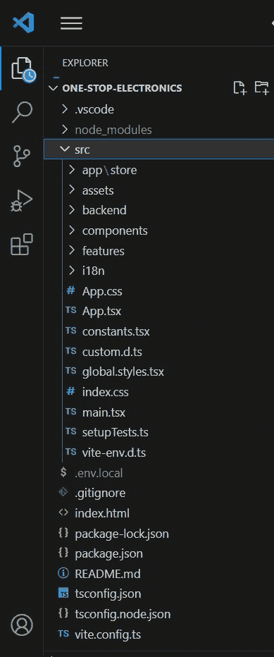
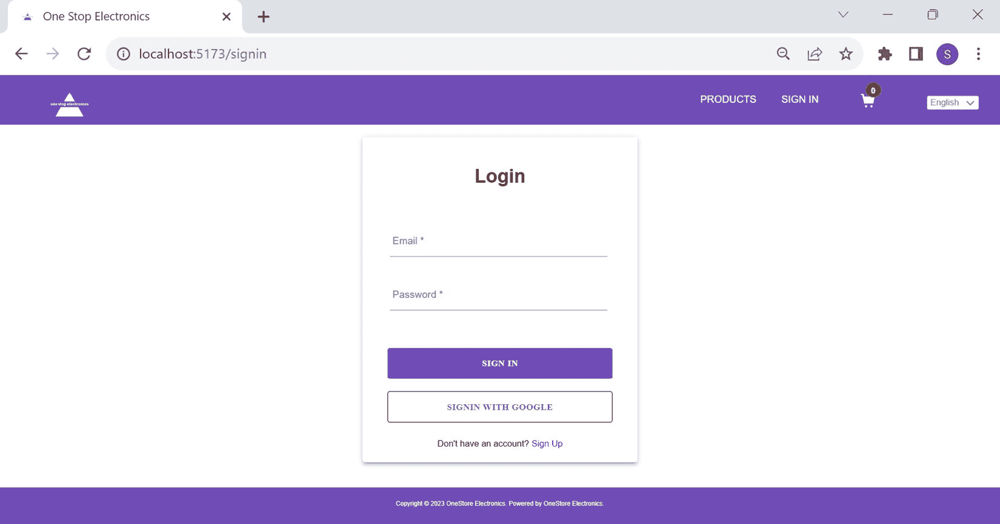
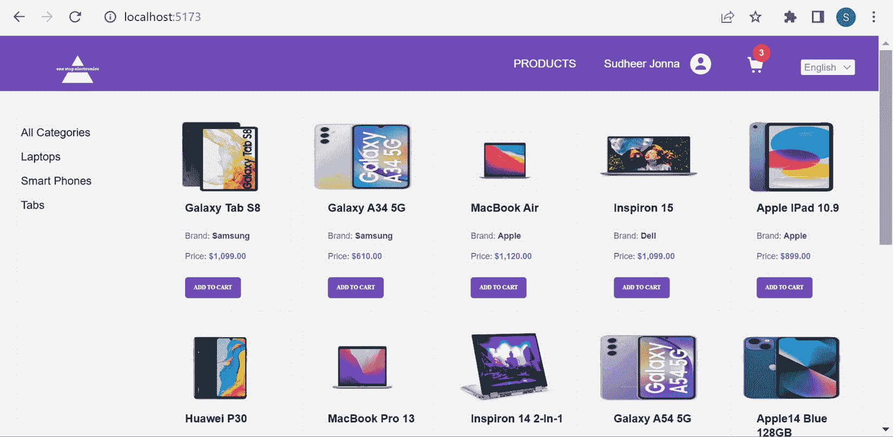
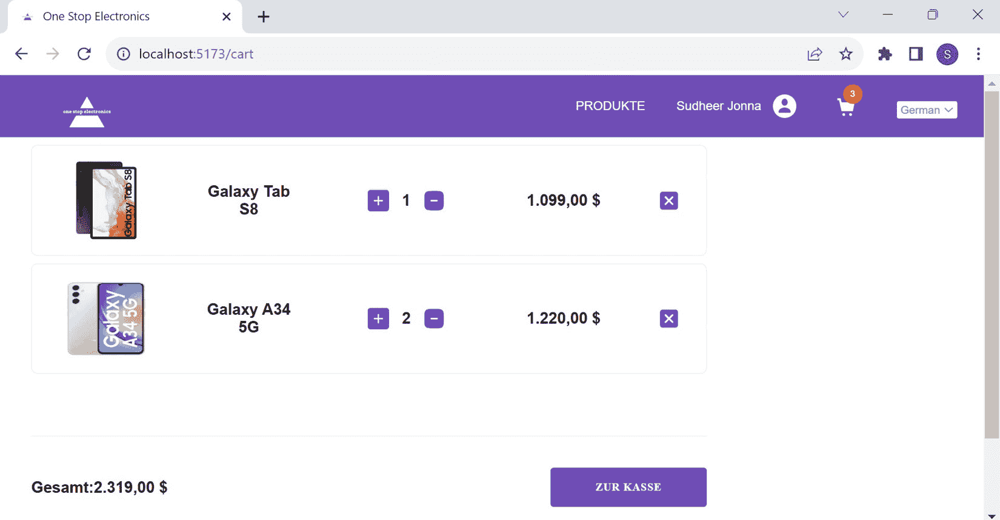

# 11

# 基于 React、Redux、Styled Components 和 Firebase 后端构建应用程序

随着我们继续阅读本书，我们将涵盖与 React 生态系统、流行库以及构建现代 Web 应用时代稳健 React 应用程序的最佳实践相关的许多概念和技能。本章致力于利用前几章学到的知识创建一个全栈 React 应用程序。作为面试过程的一部分，面试官可能会要求你基于某些功能和技术要求构建一个完整的 React 项目，或者分配一个快速编码挑战来评估你在特定领域的技能。本章将指导你如何应对编码轮次，通过从头开始创建一个 React 项目，遵循标准指南，并对实施的项目提出面试问题。在本章中，我们将通过实现各种 UI 组件、应用样式、通过身份验证机制验证注册用户的身份、集成 Firebase 后端以及部署应用程序使其可供公众使用来构建一个电子商务应用程序。

首先，我们将使用官方的`react-intl`库来支持国际化，以及 Firebase 包来实现后端，开始搭建项目的流程。然后，我们将快速介绍 Firebase 后端及其服务，将 Firebase 集成到我们的 React 项目中，并实现身份验证功能。

此后，我们将按照 Redux 标准构建业务逻辑，以处理从 UI 触发的各种动作。为了增加来自不同地区的用户基础，我们将通过国际化过程增强应用程序。然后，我们将编写几个单元测试，以确保我们的代码无瑕疵并符合业务要求。在本章结束时，我们将把我们的 Git 仓库托管在 GitHub 上，并使其在线上可用，以展示我们的技能。

在本章中，我们将涵盖以下主要主题：

+   搭建和配置项目

+   介绍 Firebase 服务和配置应用程序

+   实现 Firebase 身份验证及其后端

+   构建用于状态管理的 Redux 组件

+   构建表示层

+   支持国际化

+   使用 Vitest 框架实现测试

+   创建带有 README 文档的 Git 仓库

+   部署应用程序以供公众访问

# 技术要求

在开始我们项目的旅程之前，你的工作站应该安装了最新的 Node.js 和 npm ([`nodejs.org/en`](https://nodejs.org/en)) 包。在构建此项目的同时，你还需要一个 Netlify ([`www.netlify.com/`](https://www.netlify.com/)) 账户用于部署部分，以及一个 GitHub ([`github.com/`](https://github.com/)) 账户来托管 Git 仓库。此项目的代码库可以在以下 Git 仓库中找到：[`github.com/PacktPublishing/React-Interview-Guide/tree/main/Chapter11/one-stop-electronics`](https://github.com/PacktPublishing/React-Interview-Guide/tree/main/Chapter11/one-stop-electronics)。

首先，让我们谈谈构建 React 应用程序所需的脚手架和项目配置。

# 脚手架和配置项目

在*第六章*中，我们介绍了关于 Redux 及其工作流程的多个主题，这些主题基于 Redux 状态管理解决方案来构建 React 网络应用程序。为了减少与 Redux 逻辑相关的样板代码，Redux 团队建议使用 **RTK** 来简化许多常见用例，应用最佳实践，并防止常见错误。

如果你从头开始创建项目，使用 **Redux 和 TypeScript 模板 for Vite** 是 Redux 团队建议的方法之一。因此，在本节中，我们将使用相同的方法来构建项目。在这个项目中，我们将构建一个名为 *One Stop Electronics* 的电子商务应用程序，用户可以购买电子设备。

以下 `degit` 项目脚手架命令有助于创建基于 RTK 的项目结构：

```js
npx degit reduxjs/redux-templates/packages/vite-template-redux onestop-electronics
```

此模板基于 TypeScript（`.tsx` 或 `.ts` 文件）创建项目，并为 `react`、`react-dom` 和 `jest` 包提供了所需的类型定义依赖项。

项目将使用 React Router 在应用程序中导航页面，并使用 `FormatJS`，这是一个支持国际化的模块化 JavaScript 库集合，使用 `React Intl` 库。以下列出安装这些包的命令：

```js
npm install --save react-router-dom
npm install --save react-intl
```

存在多种方法来为 React 组件添加样式。我们将在此项目中使用 styled-components 来编写基于组件的样式。此包将与其类型定义依赖项一起安装，如下所示：

```js
npm install --save styled-components
npm install --save-dev @types/styled-components
```

在*第七章*中讨论了 styled-components。你还可以在官方网站上找到更多详细信息和新功能：[`styled-components.com`](https://styled-components.com)。

此应用程序将使用 Firebase 基于云的开发平台来实现身份验证机制和后端数据存储。因此，让我们使用以下命令安装最新的 Firebase 版本：

```js
npm install --save firebase
```

一旦创建了应用程序文件夹结构并安装了上述依赖项，让我们再创建几个文件夹来根据技术栈定制项目。以下列出了重要的文件夹：

+   `app/store`：`store` 文件夹用于创建 RTK 的各种组件，如 actions 或 action creators、reducers 和 selectors

+   `assets`：此文件夹包含所有图像和图标文件

+   `backend`：此目录包含与 Firebase 相关的 API 和电子商务应用程序数据

+   `features`：此文件夹专门用于 Web 应用程序的主要页面

+   `i18n`：此目录包含所有国际化特定文件

**Visual Studio**（**VS**）Code 广泛使用，并且对于 React 开发来说相当受欢迎。因此，我们将使用它来完成此项目，并在添加所有上述文件夹后，如图所示：



图 11.1：应用程序文件夹结构

VS Code 在其市场提供大量扩展。在此项目中，将使用 `vscode-styled-components` 扩展来突出显示 styled-components 的语法，并使用 `Prettier` 代码格式化扩展来格式化代码。

注意

没有使用特定 IDE 的限制。您可以根据自己的偏好和所需功能使用任何流行的 IDE。

在下一节中，我们将介绍 Firebase 的服务、所需配置以及 Firebase 身份验证和后端，然后再进行其实施。

# 介绍 Firebase 服务和配置应用程序

Firebase 是由 Google 提供的全面的后端即服务（**BaaS**）提供商，它提供数据库、身份验证、云存储、分析以及许多其他即时服务。这些后端服务帮助开发者更快、更安全地构建应用程序，而无需编写大量编程代码。

## Firebase 的主要功能有哪些？

为了更清楚地了解 Firebase，我们将查看其一些主要功能。它们如下列出：

+   **实时数据库**：Firebase 实时数据库是一个云托管的 NoSQL 数据库。数据以 JSON 格式存储，并为每个连接的客户端实时同步。数据库支持所有类型的平台，如 Android、iOS 和 Web 平台。

    在这里，*实时*意味着对数据的任何更改都会在几毫秒内立即反映在平台和设备上。此外，实时数据库通过缓存您查询的所有数据，并在没有互联网连接时从缓存中检索它，提供了出色的离线支持。一旦设备重新连接到互联网，数据库就会将本地数据更改同步到原始远程数据，以避免因互联网中断而发生的任何冲突。因此，应用程序保持响应。

+   `FirebaseUI` 库作为一个完整的现成 UI 身份验证解决方案。

+   **云存储**：云存储是针对需要存储和处理用户生成的大容量文件（如图像、音频、视频和其他任何对象类型）的应用程序开发者的简单且成本效益高的存储服务。您可以使用 Firebase SDK 或 Google Cloud Storage API 访问这些内容文件。Firebase SDK 允许客户端直接进行安全上传和下载。

+   **Google Analytics 和 Crashlytics**：Google Analytics for Firebase 是一款免费的应用程序测量解决方案，可以帮助您深入了解应用程序的使用情况和用户参与度。此服务提供使用 Firebase SDK 定义的最多 500 个不同事件的无限量报告。这些分析信息可以通过保留更多用户和为营销和性能优化做出明智决策来促进业务增长。

    Crashlytics 是一款实时崩溃报告工具，可以收集有关应用程序中发生的错误和崩溃的详细信息。这有助于通过记录错误详情（如错误发生的行号、设备名称、操作系统版本以及问题发生的时间）来解决问题。

## 如何设置和配置 Firebase 以进行身份验证和数据存储？

如果您构建的项目基于 Firebase 后端，您需要采取以下步骤来创建 Firebase 应用：

1.  请访问官方 Firebase 控制台 [`console.firebase.google.com/`](https://console.firebase.google.com/) 并使用您的 Google 账户登录。

1.  点击 `onestop-electronics`。然后，点击 **继续** 按钮以继续配置向导。

1.  您将获得启用项目 Google Analytics 的选项。这是可选的，并且对于此项目不是必需的。

1.  然后，点击 **创建项目**。您需要等待一段时间以配置资源并完成项目的设置。

1.  点击您项目主页上的网页图标以创建您的网络应用。这将打开一个输入网络应用名称的表单。然后点击 **注册应用** 按钮将网络应用与 Firebase 集成。

1.  然后，复制网络应用的 Firebase 生成的配置，并将其保存以供项目中的后续使用。

1.  然后，添加名为 `Authentication` 的 Firebase 产品以构建安全的身份验证系统，以及用于项目中云托管 NoSQL 数据库的 `Cloud Firestore`。

注意

`Authentication` 产品用于在注册时存储已验证用户，并在每次登录操作中更新用户信息，而 Firestore 数据库将存储应用程序数据。

1.  默认情况下，Firestore 不提供读取或写入权限。此权限标志可以在 **规则** 选项卡中启用。更新的安全规则看起来如下：

    ```js
    rules_version = '2';
    service cloud.firestore {
      match /databases/{database}/documents {
        match /{document=**} {
          allow read, write: if true;
        }
      }
    }
    ```

1.  在 `Authentication` 产品中，您可以选择如 *电子邮件/密码* 和 *Google* 提供商等登录方式。您还可以在登录提供商部分找到几个其他第三方提供商。

你可以在单个账户下创建多个项目，但免费计划有限制。

## 你在哪里安全地放置 Firebase 配置？

不建议将 Firebase 配置存储在将可在公共开发平台上公开的存储库中，例如 GitHub。你可以将配置保存在以下 `.env.local` 文件中，以键值格式，并将其添加到项目的 `.gitignore` 文件中：

```js
VITE_FIREBASE_API_KEY = "yourfirebaseapikey"
VITE_FIREBASE_AUTH_DOMAIN = "yourfirebaseauthdomain"
VITE_FIREBASE_PROJECT_ID = "yourfirebaseprojectid"
VITE_FIREBASE_STORAGE_BUCKET = "yourfirebasestoragebucket"
VITE_FIREBASE_MESSAGING_SENDER_ID =
  "yourfirebasemessagingsenderid"
VITE_FIREBASE_APP_ID = "yourfirebaseappid"
```

在基于 Vite 的项目中，密钥应以 `VITE` 关键字开头，如前述代码所示。相同的密钥可以通过 `import.meta.env.VITE` 在项目中访问。例如，此配置在 `config.ts` 文件中实例化 Firebase 应用很有用：

```js
import { initializeApp } from "firebase/app"
const firebaseConfig = {
  apiKey: import.meta.env.VITE_FIREBASE_API_KEY,
  authDomain: import.meta.env.VITE_FIREBASE_AUTH_DOMAIN,
  projectId: import.meta.env.VITE_FIREBASE_PROJECT_ID,
  storageBucket: import.meta.env.
    VITE_FIREBASE_STORAGE_BUCKET,
  messagingSenderId: import.meta.env.
    VITE_FIREBASE_SENDER_ID,
  appId: import.meta.env.VITE_FIREBASE_APP_ID,
}
export const firebaseApp = initializeApp(firebaseConfig)
```

前述代码中导出的 `firebaseApp` 可以在任何需要的地方在项目中使用。

注意

如果你基于 `REACT_APP` 创建一个 React 项目，它将通过 `process.env` 变量可访问。

一旦配置了 Firebase 项目，我们需要实现将在注册和登录表单提交时调用的 Firebase 身份验证方法。同时，应将 Cloud Firestore 数据操作以方法的形式实现，用于存储和检索产品信息。以下部分将专注于此 Firebase API 实现。

# 实现 Firebase 身份验证及其后端

一旦在 Firebase 控制台中配置了 Firebase 应用，你可以使用 Firebase Authentication API 实现 One Stop Electronics 应用的身份验证。这些 API 方法在用户注册和登录以购买此电子商务应用中的产品时，有助于验证合法用户。通常，我们会在一个单独的文件夹内创建所有 API 处理程序（在我们的例子中是 `backend->firebase->api`），以将其与前端代码分离。

## 你如何实现 Firebase 身份验证的登录、注册和注销场景？

我们需要从 `Firebase/auth` 包中导入几个 Firebase 函数和实用工具，以与身份验证机制一起工作。Firebase 包为登录、注册和注销场景提供了单独的方法。让我们从以下 `api/auth.ts` 文件中导入所有这些 API 方法以及一个 Firebase 实例开始：

```js
import { firebaseApp } from "@/backend/firebase/config"
import {
  signInWithEmailAndPassword,
  signInWithPopup,
  signInWithRedirect,
  GoogleAuthProvider,
  createUserWithEmailAndPassword,
  updateProfile,
  signOut,
  getAuth,
  onAuthStateChanged,
  NextOrObserver,
  User,
} from "firebase/auth"
const auth = getAuth(firebaseApp)
const googleProvider = new GoogleAuthProvider()
googleProvider.setCustomParameters({
  prompt: "select_account",
})
```

在前述代码中，`auth` 实例是基于 Firebase 应用实例创建的。此外，Google 提供商已配置为提示 Google 账户详细信息以执行 Google 登录身份验证。

使用上述 API 工具，在上述同一文件中写下两个登录方法——一个使用电子邮件地址和密码，另一个使用 Google 登录身份验证。同样，注册方法可以根据电子邮件地址和密码以及用户名创建。注销方法将用于结束当前用户会话。以下 `auth.ts` 文件已更新为这些身份验证方法：

```js
export const signInEmailAndPassword = async (
  email: string,
  password: string,
) => {
  if (!email || !password) return
  return await signInWithEmailAndPassword(auth,
    email, password)
}
export const signInGooglePopup = () => signInWithPopup
  (auth, googleProvider)
export const signInGoogleRedirect = () =>
  signInWithRedirect(auth, googleProvider)
export const signUpEmailAndPassword = async (
  displayName: string,
  email: string,
  password: string,
): Promise<User> => {
  Const userInfo = await createUserWithEmailAndPassword
    (auth, email, password)
  await updateProfile(userInfo.user, { displayName })
  return userInfo.user
}
export const signOutUser = async () => await signOut(auth)
```

前面的导出方法将在下一节中与 UI 屏幕集成，特别是对于登录或注册表单，我们将构建表示层。

最后，还可以使用以下方法监听身份验证状态的变化。此方法有助于在应用程序中更新当前用户详情：

```js
export const onAuthStateChangedListener =
  (callback: NextOrObserver<User>) =>
  onAuthStateChanged(auth, callback)
```

现在，我们已经准备好了所有后端身份验证方法，这些方法有助于在电子商务应用程序中创建一个活跃的用户会话。一旦用户经过身份验证，他们通常可以根据业务需求在应用程序数据上执行**创建、读取、更新和删除**（**CRUD**）操作。

## 您如何实现云存储数据操作？您能否用任何集合解释数据操作？

与 SQL 数据库不同，云存储数据库中没有表和行。在这里，您将数据以文档的形式存储为键值对，这些文档组织成集合。存储的产品信息作为着陆页的一部分显示，这对于这个电子商务应用程序至关重要。因此，让我们通过产品集合来解释数据操作。

首先，我们需要在 Firebase 的*Cloud Firestore*数据库中创建一个产品集合来存储电子设备数据。如果集合在数据库中不存在，它将自动创建并插入产品数据。在这个应用程序中，产品记录（或文档，使用 Firebase 的术语）通过一个 JSON 文件上传到数据库，该文件位于`firebase/data/products-data.json`。

让我们从导入`firebase/firestore`包中的所有必需函数开始，包括产品类型，在以下`firebase/data/db-utils.ts`文件中：

```js
import {
  getFirestore,
  doc,
  collection,
  writeBatch,
  query,
  getDocs,
  QueryDocumentSnapshot,
} from "firebase/firestore"
import { Product } from "@/app/store/product/product.types"
export const db = getFirestore()
```

在前面的代码片段中，数据库实例是通过`getFirestore()`函数创建的，以便在应用程序集合上执行数据库操作。

使用之前导入的函数，您可以在同一文件中为产品集合创建读取和写入操作：

```js
export const insertProductsData = async <T extends Product>(
  collectionKey: string,
  productItems: T[],
) => {
  const collectionRef = collection(db, collectionKey)
  const batch = writeBatch(db)
  productItems.forEach((product) => {
    const docRef = doc(collectionRef)
    batch.set(docRef, product)
  })
  await batch.commit()
}
export const fetchProductsData = async () => {
  const collectionRef = collection(db, "products")
  const queryRef = query(collectionRef)
  const querySnapshot = await getDocs(queryRef)
  return querySnapshot.docs.map((docSnapshot) =>
    docSnapshot.data())
}
```

在前面的代码中，产品数据通过以下四个步骤插入：

1.  首先，创建一个基于数据库实例和唯一键的集合引用。

1.  然后，基于数据库实例创建一个批次引用以一次插入多个产品。

1.  迭代每个产品，并为更新批次创建一个文档引用。

1.  最后，提交批次以同时插入多个记录。

同样，产品数据通过以下四个步骤检索：

1.  首先，为产品创建一个集合引用。

1.  然后，基于上一步创建的集合引用创建一个查询引用。

1.  使用`getDocs`方法获取产品集合的所有文档，并将它们存储为快照。

1.  最后，遍历查询快照并返回结果。

所有的前述云存储数据函数都是从`firebase/firestore`包中导入的。

根据每个注册动作创建用户集合也是可能的，这个动作是通过新用户触发的。你可以在代码中找到这个特定的 API 处理程序，并根据需求扩展这个项目的功能。然而，这超出了本节的范围，并且代码片段仅作为参考进行注释。

现在，我们已经完成了后端代码。在下一节中，让我们创建所有 Redux 组件，以实现这个应用的状态管理解决方案。

# 构建 Redux 组件以进行状态管理

Redux 存储相关的组件涵盖了应用的大部分动作，例如计算业务逻辑、在存储中创建或更新数据，以及获取最新数据以在 UI 上显示。在这个项目中，存储组件被分类到产品、购物车和用户文件夹中。每个文件夹包含实体类型（`*.type.ts`）、包含动作或还原器的切片（`*.slice.ts`），以及用于检索数据的选择器（`*.selector.ts`）。

在我们的电子商务应用中，`Product` 实体需要显示产品名称、品牌、价格和数量等详细信息，以展示所有可用的产品。因此，让我们首先创建产品实体的存储组件。以下 `product.type.ts` 文件创建了产品和相关的类型，包含所有可能的属性：

```js
export type Product = {
  id: number
  productImageUrl: string
  name: string
  brand: string
  price: number
  category: string
}
//Holds the list of products,product category and boolean flag to indicate loading state
export type ProductsState = {
  products: Product[]
  category: string
  isLoading: boolean
}
export type ProductMap = {
  [key: string]: Product[]
}
```

一旦创建了产品类型，应该创建产品切片来更新存储中的产品列表和产品类别。RTK 通过将这些动作保持在一个名为产品切片的还原器内部来简化事情。以下是一个名为 `product.slice.ts` 的产品切片：

```js
import { createSlice } from "@reduxjs/toolkit"
import { ProductsState } from "./product.types"
const INITIAL_STATE: ProductsState = {
  products: [],
  category: "all",
  isLoading: true,
}
export const productsSlice = createSlice({
  name: "products",
  initialState: INITIAL_STATE,
  reducers: {
    setProducts(state, action) {
      state.products = action.payload
      state.isLoading = false
    },
    setCategory(state, action) {
      state.category = action.payload
    },
  },
})
export const { setProducts, setCategory } =
  productsSlice.actions
export const productsReducer = productsSlice.reducer
```

前面的动作被导出，以便在相应的产品 UI 页面上使用，以响应用户动作，而导出的还原器用于使用 `reselect` 库根据类别名称获取存储状态，例如产品、类别和产品映射。

以下代码是 `product.selector.tsx` 文件。这个文件的代码相当长，所以让我们将其分解成更小的代码块。第一个代码块包含用于获取产品、产品加载状态和产品类别的选择器：

```js
import { createSelector } from "reselect"
import { RootState } from "@/app/store/store"
import { Product, ProductMap, ProductsState }
  from "./product.types"
const selectProductReducer = (state: RootState):
  ProductsState => state.products
export const selectProducts = createSelector(
  [selectProductReducer],
  (productsSlice) => productsSlice.products,
)
export const selectCategory = createSelector(
  [selectProductReducer],
  (productsSlice) => productsSlice.category,
)
export const selectProductsIsLoading = createSelector(
  [selectProductReducer],
  (productsSlice) => productsSlice.isLoading,
)
```

以下代码块包含每个类别的产品映射：

```js
export const selectProductsMap = createSelector(
  [selectProducts],
  (products): ProductMap =>
    products.reduce(
      (acc, product) => {
        const { category } = product
        acc[category]
          ? acc[category].push(product)
          : (acc[category] = [product])
        acc["all"].push(product)
        return acc
      },
      { all: [] } as ProductMap,
    ),
)
```

One Stop Electronics 应用使用前面的 `selectProductsMap` 根据类别过滤产品。我们的应用有各种类别，如所有类型的笔记本电脑、平板电脑和手机。

同样，我们可以为 `User` 和 `Cart` 实体创建存储组件。

## 你如何在 Redux 应用中处理多个还原器？

一旦完成项目的所有 Redux 实体，所有还原器都需要在一个名为 `root-reducer.ts` 的单个根还原器文件中合并。在这里，我们将使用 Redux 的 `combineReducers` 方法，它接受所有还原器作为一个对象的单个参数：

```js
import { combineReducers } from "redux"
import { userReducer } from "./user/user.slice"
import { productsReducer } from "./product/product.slice"
import { cartReducer } from "./cart/cart.slice"
export const rootReducer = combineReducers({
  user: userReducer,
  products: productsReducer,
  cart: cartReducer,
})
```

此后，可以在 `store.ts` 文件中使用前面提到的根 reducer 来配置 store：

```js
import { configureStore } from "@reduxjs/toolkit"
export const store = configureStore({
  reducer: rootReducer,
})
```

RTK 自动调用 `combineReducers` 方法，因此你不需要直接调用它。

现在，store 已准备好用于对应用程序数据进行任何 `read` 或 `update` 操作。

使用 RTK，整个应用程序的 Redux 开发现已完成。下一节将专注于使用 UI 组件和基于这些可重用组件的网页构建表示层。

# 构建表示层

将可重用组件保存在 `components` 文件夹下是一种常见做法。在本项目中，我们将在 `components` 文件夹内创建定制的表单组件，如按钮、输入、选择和旋转器，布局组件如页眉和页脚，以及可重用的功能组件如产品和类别。

## 你如何使用 styled-components 实现自定义按钮？

HTML 按钮元素在样式方面没有不同的变体，但可以使用 React 和 styled-components 创建多个按钮变体。让我们看看按钮组件以及它是如何根据本项目需求进行定制的。

该项目需要更大的基本按钮（主要用于注册和登录页面），具有对比颜色的反转按钮用于 Google 登录，以及屏幕空间有限的情况下的小按钮（通常用于添加产品到购物车）。作为第一步，应在 `button.styles.tsx` 文件内创建具有这些不同样式的 styled-component。

由于文件内容较多，让我们将代码分解成小的代码块。第一个代码块包含 `BasicButton` styled-component：

```js
import styled from "styled-components"
export const BasicButton = styled.button`
  min-width: 10rem;
  width: auto;
  height: 2.5rem;
  line-height: 2.5rem;
  letter-spacing: 0.5px;
  padding: 0 2rem;
  background-color: rgb(112, 76, 182);
  color: white;
  font-size: 0.7rem;
  font-family: "Barlow Condensed";
  font-weight: bolder;
  text-transform: uppercase;
  border: none;
  border-radius: 0.2rem;
  cursor: pointer;
  display: flex;
  justify-content: center;
  &:hover {
    background-color: white;
    color: black;
    border: 1px solid black;
  }
`
```

以下代码块包含两个扩展基本按钮的 styled 按钮组件。反转按钮反转了基本按钮的背景和文字颜色，而小按钮看起来与基本按钮相似，但实际上会更小：

```js
export const InvertedButton = styled(BasicButton)`
  background-color: white;
  color: rgb(112, 76, 182);
  border: 1px solid black;
  &:hover {
    background-color: rgb(112, 76, 182);
    border: none;
    border: 1px solid white;
    color: white;
  }
`
export const SmallBasicButton = styled(BasicButton)`
  width: 4rem;
  height: 1.5rem;
  min-width: 0rem;
  padding: 0rem;
  letter-spacing: 0.1rem;
  line-height: 2rem;
  font-size: 0.4rem;
  align-items: center;
  letter-spacing: 0rem;
`
```

在前面的 styled-components 中，我们使用了 `rem` 相对单位而不是 `px` 这样的绝对单位，以便根据屏幕大小动态调整大小或间距。

然后，我们将这些按钮样式导入到下面的 `button.tsx` 文件中，并根据按钮的 `type` 属性值动态渲染相应的按钮组件。该组件还接受子元素和其他按钮属性：

```js
import { FC, ButtonHTMLAttributes } from "react"
import { BasicButton, InvertedButton, SmallBasicButton }
  from "./button.styles"
export enum BUTTON_TYPE_CLASSES {
  basic = "basic",
  inverted = "inverted",
  small = "small",
}
const getButton = (buttonType = BUTTON_TYPE_CLASSES.basic) =>
  ({
    [BUTTON_TYPE_CLASSES.basic]: BasicButton,
    [BUTTON_TYPE_CLASSES.inverted]: InvertedButton,
    [BUTTON_TYPE_CLASSES.small]: SmallBasicButton,
  }[buttonType])
export type ButtonProps = {
  buttonType?: BUTTON_TYPE_CLASSES
} & ButtonHTMLAttributes<HTMLButtonElement>
const MyButton: FC<ButtonProps> = ({ children, buttonType,
  ...otherProps }) => {
  const CustomButton = getButton(buttonType)
  return <CustomButton {...otherProps}>
  {children}</CustomButton>
}
export default MyButton
```

前面的 `MyButton` 组件被类型化为仅接受 `button` 类型和其他内置 HTML 按钮属性作为属性。如果你传递任何不属于按钮元素的按钮属性，由于使用了 TypeScript，将会出现编译时错误。之前定制的按钮的使用出现在我们应用程序的多个页面上。

## 实现特定业务 UI 组件

与按钮组件类似，你可以创建一个产品盒组件。产品组件应按照特定的样式布局显示产品图片、名称、品牌和价格详情。让我们在`product.styles.tsx`文件中应用每个字段所需的样式。

第一个代码块包含 styled-components 的导入和图像背景属性的类型声明：

```js
import styled from "styled-components"
type ImageBackgroundProps = {
  $hasWhiteBackgroundImage: boolean
}
```

以下代码块包含一个用于包装产品图片和其他产品详情的`ProductContainer` styled 组件：

```js
export const ProductContainer = styled.div<ImageBackgroundProps>`
  display: flex;
  flex-direction: column;
  background-color: #f1f1f1;
  padding: 1rem;
  border-radius: 0.125rem;
  img {
    width: 7rem;
    height: 5rem;
    object-fit: fill;
    background-color: #f1f1f1;
    transition: 0.5s all ease-in-out;
    mix-blend-mode: ${(props) =>
      props.$hasWhiteBackgroundImage ? "multiply" :
        "normal"};
    &:hover {
      transform: scale(1.1);
    }
  }
  &:hover {
    img {
      opacity: 0.8;
    }
    button {
      opacity: 0.85;
      display: flex;
    }
  }
`
```

以下代码块包含一个用于样式化和包装产品字段的`Footer` styled-component：

```js
export const Footer = styled.div`
  width: 100%;
  display: flex;
  flex-direction: column;
  justify-content: space-between;
  font-size: 1rem;
  padding-left: 1rem;
`
```

最后，我们为每个产品字段声明的 styled-component 以赋予它们独特的样式：

```js
export const Name = styled.h2`
  font-size: 0.8rem;
  line-height: 1rem;
  font-weight: 600;
  text-transform: capitalize;
  margin-bottom: 1rem;
`
export const Brand = styled.div`
  font-size: 0.6rem;
  line-height: 1rem;
  color: rgb(75 85 99);
  margin-bottom: 0.5rem;
  span {
    font-weight: 600;
    text-transform: capitalize;
  }
`
export const Price = styled.span`
  font-size: 0.6rem;
  line-height: 1rem;
  color: rgb(75 85 99);
  margin-bottom: 1rem;
  span {
    font-weight: 600;
    text-transform: capitalize;
    color: rgb(85, 118, 209);
  }
`
```

在前面的 styled-component 中，每个产品字段都有自己的样式。例如，产品的名称应该使用更大的字体大小，而价格应该使用不同的字体颜色来突出显示重要数据，同时展示产品。

之前完成的`product.styles.tsx`文件中的 styled-components 将在以下`product.tsx`文件中的标记中使用，如下所示。组件代码相当长，所以让我们将其分解成更小的代码片段。

首先，定义我们页面的导入、产品的 prop 类型和验证非白色背景图像的实用函数：

```js
import { FC } from "react"
import { useDispatch } from "react-redux"
import { useAppSelector } from "@/app/store/hooks"
import { selectCurrentUser } from
  "@/app/store/user/user.selector"
import MyButton, { BUTTON_TYPE_CLASSES } from
  "@/components/button/button"
import { Product } from "@/app/store/product/product.types"
import { addProductToCart } from
  "@/app/store/cart/cart.slice"
import { BRAND_NAMES } from "@/constants"
import { ProductContainer, Footer, Name, Brand, Price }
  from "./product.styles"
type ProductProps = {
  product: Product
}
const hasWhiteBackground = (brand: string) =>
  BRAND_NAMES.includes(brand)
```

现在，让我们添加`ProductItem`组件，该组件接受`product`作为 prop，没有任何标记代码。组件声明了`currentUser`和`addCartProduct`来将产品派发到购物车：

```js
const ProductItem: FC<ProductProps> = ({ product }) => {
  const currentUser = useAppSelector(selectCurrentUser)
  const { name, price, productImageUrl, brand } = product
  const dispatch = useDispatch()
  const addCartProduct = () => dispatch
    (addProductToCart(product))
  return (
   //Markup goes here
     )
}
export default ProductItem
```

最后，添加了渲染的产品标记，如下所示：

```js
    <ProductContainer $hasWhiteBackgroundImage=
      {hasWhiteBackground(brand)}>
      
      <Footer>
        <Name>{name}</Name>
        <Brand>
          Brand: <span>{brand}</span>
        </Brand>
        <Price>
          Price:{" "}
          <span>
            ${price}
          </span>
        </Price>
        {currentUser && (
          <MyButton
            buttonType={BUTTON_TYPE_CLASSES.small}
            onClick={addCartProduct} >
            Add to cart
          </MyButton>
        )}
      </Footer>
    </ProductContainer>
```

前面的`ProductItem`组件在应用程序未通过用户认证时隐藏将产品添加到购物车的按钮。

类似地，你可以创建其他 UI 组件以在所需页面上重用。现在，让我们基于所有这些可重用 UI 组件构建应用程序页面。

## 实现应用程序页面使用 UI 组件

每个 React 应用程序中的网页都是由 UI 组件组成的。我们的应用程序需要产品着陆页、添加产品到购物车、注册和登录页面。根据脚手架结构，这些页面应该在`features`文件夹下创建。产品着陆页是通过迭代产品列表中的`Product`组件创建的。以下代码是`products.tsx`文件中的代码。

这个文件代码相当长，所以让我们将其分解成更小的代码块。第一个代码块包含与 React Hooks、组件、选择器和 styled-components 相关的导入，如下所示：

```js
import { useState, useEffect, Fragment } from "react"
import { useParams } from "react-router-dom"
import { useAppSelector } from "@/app/store/hooks"
import ProductItem from "@/components/product/product"
import MySpinner from "@/components/spinner/spinner"
import { insertProductsData } from
  "@/backend/firebase/api/db-utils"
import { Product } from "@/app/store/product/product.types"
import {
  selectProductsMap,
  selectCategory,
  selectProductsIsLoading,
} from "@/app/store/product/product.selector"
import { Categories } from "@/components/
  categories/categories"
import {
  ProductsContainer,
  Title,
  LayoutContainer,
  LoaderContainer,
} from "./products.styles"
const Products = () => {
     // The component code goes here
}
export default Products
```

以下代码块更新了组件代码，该代码从存储中检索产品信息（即`productsMap`和`category`），并包括`useEffect` Hook，在类别和产品数据发生变化时设置最新的产品：

```js
const Products = () => {
  const productsMap = useAppSelector(selectProductsMap)
  const category = useAppSelector(selectCategory)
  const isLoading = useAppSelector(selectProductsIsLoading)
  const [products, setProducts] = useState
    (productsMap[category])
  useEffect(() => {
    setProducts(productsMap[category])
  }, [category, productsMap])
  return (
    // Markup goes here
  )
}
export default Products
```

最后，我们的产品页面的渲染标记如下所示：

```js
    <Fragment>
      <LayoutContainer>
        <Categories></Categories>
        <ProductsContainer>
          {isLoading ? (
            <LoaderContainer>
              <MySpinner />
            </LoaderContainer>
          ) : (
            products &&
            products.map((product: Product) => (
              <ProductItem key={product.id} product=
                {product} />
            ))
          )}
        </ProductsContainer>
      </LayoutContainer>
    </Fragment>
```

在前面的代码中，`Products` 屏幕在数据检索之前显示页面加载器。一旦数据准备就绪，产品列表将以网格格式显示。

相反，可以使用输入和按钮 UI 组件创建登录页面以验证 Firebase 后端。它通过常规电子邮件或 Google 登录机制跟踪登录过程。用于验证用户的登录页面如下所示：



图 11.2：登录页面

通过登录页面进行身份验证有助于将产品添加到购物车。如果存在新用户，它还提供了一个底部的注册链接。以类似的方式，您可以实现注册和购物车页面。

注意

即使用户未登录到应用程序，仍然可以查看可用的产品。

现在，我们已经到达了一个位置，所有必需的 UI 组件和页面都已准备好使用。作为最后一步，可以在以下 `App.tsx` 文件中使用 `Header` 和 `Footer` UI 组件设计应用程序布局，以及为每个路由映射的先前实现的页面：

```js
function App() {
   return(
     <Fragment>
      <Header></Header>
      <div className="app-content">
        <Routes>
          <Route path="/" element={<Products></Products>} />
          <Route path="/signin" element={<SignIn />} />
          <Route path="/signup" element={<SignUp />} />
          <Route path="/cart" element={<CartProducts />} />
        </Routes>
      </div>
  <Footer></Footer>
  </Fragment>
 )
}
```

在前面的代码中，为每个页面配置了路由。产品页面被配置为默认路由。这意味着在项目根目录中运行 `npm run dev` 命令后，将立即显示此页面。



图 11.3：产品展示

每次将产品添加到购物车时，购物车图标上都会显示产品数量。如果用户未登录到应用程序，则隐藏“添加到购物车”按钮。此外，您可以根据所选类别过滤产品列表，作为附加功能。

尽管我们已经完成了所有页面，但文本消息是硬编码在英语中的。这意味着非英语读者阅读消息将很困难。在下一节中，将通过国际化支持增强应用程序，以增加我们全球的用户基础。

# 支持国际化

如果您想在国际市场上推出当前的服务，您的 Web 应用程序应支持国际化以满足全球用户的需求。在 *第四章* 中，我们通过 `FormatJS` 库介绍了国际化。

此项目主要使用相同的 `FormatJS` 库来翻译文本消息并支持格式化的货币金额。将国际化扩展到应用程序的过程仅涉及几个指令。

首先，在 `i18n->translations` 文件夹中创建所有翻译，形式为 JSON 文件。这些翻译将根据 `i18n->locale.ts` 文件中定义的相应区域设置加载：

```js
import ENGLISH from "./translations/en-US.json"
import FRENCH from "./translations/fr-FR.json"
import GERMAN from "./translations/de-DE.json"
export const LOCALES = {
  "en-US": ENGLISH,
  "fr-FR": FRENCH,
  "de-DE": GERMAN
}
```

然后，你需要在应用程序的根目录下配置`IntlProvider`。此提供者使用`locale`值加载特定区域的消息，如上一步映射所示：

```js
import { IntlProvider } from "react-intl"
import { LOCALES } from "@/i18n/locale"
import { DEFAULT_LOCALE } from "@/constants"
import { useAppSelector } from "./app/store/hooks"
import { selectCurrentLocale } from
  "@/app/store/user/user.selector"
function App() {
  const userLanguage = useAppSelector(selectCurrentLocale)
  return (
    <IntlProvider
      messages={LOCALES[userLanguage]}
      locale={userLanguage}
      defaultLocale={DEFAULT_LOCALE}
    >
      // Main layout goes here
    </IntlProvider>
  )
}
```

在前面的代码中，当前的`locale`值是动态的，其值根据 UI 头部区域出现的区域选择下拉菜单进行更新。

现在，你可以开始使用`react-intl`中的`FormattedMessage`和`FormattedNumber`组件分别本地化文本消息和格式化货币数字，如下所示：

```js
import { FormattedMessage, FormattedNumber } from
  "react-intl"
const CartProducts = () => {
   return(
     <CartContainer>
      // UI markup goes here
          <FormattedMessage id="cart.total" />:
            <FormattedNumber
              value={cartProductsTotalCost}
              style="currency"
              currency="USD"
            ></FormattedNumber>
      // UI markup goes here
   </CartContainer>
   )
}
```

之前与货币金额相关的翻译不仅包括货币符号，还添加了逗号分隔符。例如，以下添加到购物车屏幕显示了一个添加的产品列表，页面文本使用德语，并且格式化货币金额。



图 11.4：添加到购物车的产品

如您所见，逗号和十进制分隔符以及货币符号的位置根据所选语言进行修改。在页面上点击增加、减少和清除按钮时，产品数量和金额值及其格式将更新。

## 你如何通过命令式 API 实现国际化？

并非总是可以使用`react-intl`组件，如`FormattedMessage`、`FormattedNumber`或`FormattedDate`来格式化文本消息、数字或日期——也就是说，你无法使用内置组件在 React 组件的标记区域外或非 React 生态系统（如 Node.js、Redux 存储和测试部分）中的文本属性（如`title`和`aria-label`）内格式化文本消息。

在你声明`IntlProvider`之后，你可以在 React 函数组件内部调用`useIntl()`钩子来获取`intl`对象（类型为`IntlShape`）。例如，此钩子用于支持国际化，在标记区域外准备类别列表：

```js
import { useIntl } from "react-intl"
const categories: Category[] = [
  { type: "all", name: intl.formatMessage({ id: "categories.all" }) },
  { type: "laptop", name: intl.formatMessage({ id: "categories.
    laptops" }) },
  { type: "phone", name: intl.formatMessage({ id: "categories.phones" 
    }) },
    { type: "tab", name: intl.formatMessage({ id: "categories.tabs" }) },
];
```

如果你想在 React 组件之外支持国际化，你需要通过传递对象形式的`locale`和`messages`属性来使用`createIntl` API 方法。

目前，我们已经完成了完整的后端和前端实现。在下一节中，我们将看到如何编写单元测试以确保功能符合业务需求。

# 使用 Vitest 框架实现测试

Jest 是一个非常流行的测试框架，拥有完整的测试功能和易于使用的 API，这使得它成为 Web 生态系统中的标准测试框架。本项目基于 Vite 前端工具，也可以在 Vite 设置中集成 Jest。然而，这会导致你需要配置和维护两个不同的工作区，这对开发者来说很困难。因此，我们将使用**Vitest**来处理这个项目，这是一个基于 Jest 和 Vite 工具的闪电般的单元测试框架。这个框架提供了与 Jest 框架类似的功能和语法，使用现有的 Vite 工具配置或插件。

在这个项目中，我们将为`cart.slice.ts`下存在的所有操作编写单元测试。首先，让我们创建一个带有初始购物车状态的测试套件：

```js
describe("Cart Reducer", () => {
  let initialState: CartState = {
    cartProducts: [
      {
        id: 1,
        productImageUrl: "someurl.com",
        name: "Inspiron 15",
        price: 1200,
        quantity: 2,
      },
    ],
  }
});
```

在前面的代码中，初始状态是可用的，有一个购物车产品数量为`2`。

然后，我们将编写一个测试用例来验证在购物车中增加数量的功能，如下所示：

```js
  it("Should handle adding or incrementing products
    quantity inside cart", () => {
    const productToAdd: Cart = {
      id: 1,
      productImageUrl: "someurl.com",
      name: "Inspiron 15",
      price: 1200,
      quantity: 1,
    }
    const { cartProducts } = cartReducer(
      initialState,
      addProductToCart(productToAdd),
    )
    expect(cartProducts.length).toEqual(1)
    expect(cartProducts[0].quantity).toEqual(3)
  })
```

前面的测试用例验证了产品数量增加到`3`，而购物车中不同产品的数量保持不变。

类似地，减少购物车中产品数量的测试用例如下：

```js
  it("Should handle removing or decreasing products
    quantity inside cart", () => {
    const productToRemove: Cart = {
      id: 1,
      productImageUrl: "someurl.com",
      name: "Inspiron 15",
      price: 1200,
      quantity: 1,
    }
    const state = cartReducer(
      initialState,
      removeProductFromCart(productToRemove),
    )
    expect(state.cartProducts.length).toEqual(1)
    expect(state.cartProducts[0].quantity).toEqual(1)
  })
```

前面的测试用例检查在减少购物车中的数量后的产品数量。在减少或从购物车中移除一个项目后，产品数量变为`1`，其初始状态数量值为`2`。

同样，我们还有测试用例来清除和重置购物车操作。一旦运行`npm run test`命令，你就可以看到所有通过测试和任何错误代码的失败测试的摘要。

现在，我们的应用程序已经准备好，带有完整的开发代码，并覆盖了单元测试用例，以检测代码中的早期缺陷。让我们将此代码作为 Git 仓库发布到 GitHub 上，以支持版本控制和确保我们的应用程序在线上顺利运行。

# 创建带有 README 文档的 Git 仓库

目前，项目已经准备好，并且可以在本地系统中成功运行应用程序。为了进一步改进项目，需要一个托管平台，如 GitHub，因为它提供存储和版本控制，部署项目，并使团队成员之间的协作无缝进行。让我们应用以下 Git 命令将本地代码推送到 GitHub 平台：

```js
git init
git add .
git commit -m "Add one stop electronics"
git branch -M main
git remote add origin https://github.com/yourname/one-stop-electronics.git
git push -u origin main
```

现在，我们的项目已托管在 GitHub 上，这使得我们能够轻松地将应用程序部署到 Netlify。

包含`README.md`说明的 One Stop Electronics GitHub 项目的最终版本可在 Git 仓库中快速参考：[`github.com/PacktPublishing/React-Interview-Guide/tree/main/Chapter11/one-stop-electronics`](https://github.com/PacktPublishing/React-Interview-Guide/tree/main/Chapter11/one-stop-electronics)。

以下部分将讨论部署过程，以便使项目对公众可访问。

# 部署应用程序以供公众访问

部署应用程序有几种选择，例如 Netlify、Vercel、GitHub Pages 和 Firebase Hosting。我们将通过在 Netlify 网站上通过 GitHub 账户登录来使用 Netlify 进行部署。在仪表板上，您可以选择仓库并通过设置配置网站。您还可以将随机网站名称更改为新名称。由于环境变量文件（例如，`.env.local`）在 GitHub 仓库的根目录中不可用，您需要在点击**部署** **网站**按钮之前将环境变量文件导入仪表板。

通过遵循所有这些步骤，应用程序现在已在线上对全球所有人开放。您可以快速浏览所有屏幕，这些屏幕在 Netlify 域名下可供您参考：[`onestop-electronics.netlify.app/`](https://onestop-electronics.netlify.app/)。

通过持续部署，Netlify 会在 GitHub 仓库中的代码更新时自动更新您的网站。

# 摘要

我们已经到达了本章的结尾，并将之前章节中学到的所有编程概念应用到构建一个健壮的全栈 React 应用程序中。在本章开始时，我们简要介绍了使用 Redux 库的标准模板来搭建 React 项目。后来，我们简要介绍了 Firebase 服务，并提供了使用 Firebase 控制台设置和配置身份验证机制的逐步说明。然后，我们为我们的 One Stop Electronics 应用程序提供了 Firebase 身份验证和 Cloud Firestore 数据库操作的详细实现。

后端准备就绪后，我们开始通过编写几个 React UI 组件来构建 UI 层，包括应用程序布局和登录、注册、产品展示和购物车页面的页面。这一部分之后，我们根据 RTK 指南实现了业务层。然后，通过国际化支持和编写单元测试进一步增强了项目。当应用程序达到完成阶段时，最后一步是创建 Git 仓库并使应用程序可通过网络访问，包括部署流程。

在学习所有这些应用程序开发的主要里程碑之后，您现在应该足够自信，可以在编码挑战中展示您的技能并回答面试问题，尤其是凭借您的实际工作经验。在下一章中，我们将基于不同的技能集（如 Next.js、GraphQL、SWR 和 Vercel）构建另一个 React 应用程序以进行部署。这将帮助您增强对构建各种类型项目的知识，这些技术和概念在本章中没有涉及。
