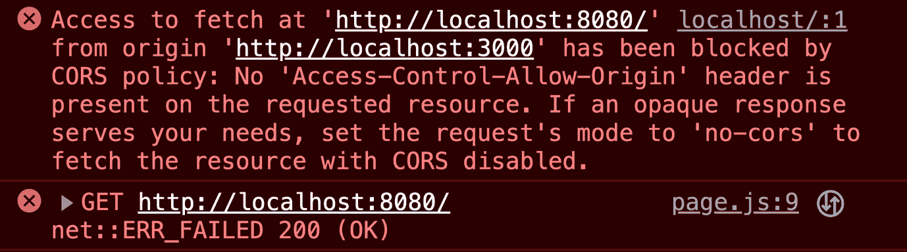

# 第十二章：基于 Next.js 工具包、身份验证、SWR、GraphQL 和部署构建应用程序

在这本书的旅程中，我们学习了新的技能、方法和更好的思维方式。这一章是我们努力的结晶，所以让我们继续前进，因为现在是时候将我们所学的一切结合起来，以开发一个具有最新现代技术堆栈的令人兴奋的应用程序。这一章将使我们能够从概念到部署一个具有身份验证、**stale-while-revalidate**（SWR）、GraphQL 和部署实现的 Next.js 应用程序。

我们将从一个关于 REST API 的快速介绍开始，如果你已经熟悉它们，这将是一个极好的复习，如果你是第一次学习这个基本方法，这将是一个很好的介绍。然后，我们将继续探讨如何最好地规划应用程序的架构，我们将深入了解身份验证的工作原理。这将由 SWR 的有效性和为什么它值得使用来跟进，因为它是一个非常有用的方面，可以提高我们应用程序的性能。接下来，我们将了解 GraphQL 以及它与传统的 REST API 相比如何。然后，我们将结束部署部分，这是我们最终将本地开发构建发布到网上，以便全世界都能使用的地方。

在接下来的部分中，我们将讨论业务逻辑背后的理念以及我们编写的代码的重要性，这不仅对我们的应用程序的运行方式有重要意义，而且根据其编写的好坏，它还可以对我们的团队和公司产生积极或消极的影响。继续前进，我们将创建表示层，这对于用户界面和用户体验至关重要。测试将是下一个主要功能，我们将会涉及，因为强烈建议生产就绪的应用程序设置一个强大的测试套件，以确保其稳定并且处于可以发布为**最小可行产品**（MVP）的状态。

在完成这些功能后，我们将学习如何部署我们的应用程序，以便公众可以访问它。在最后几节中，我们将创建一个带有 README 文件的 Git 仓库。

在接下来的部分中，我们将关注以下主题：

+   REST API 的快速介绍

+   规划应用程序架构，包括身份验证、SWR、GraphQL 和部署

+   构建业务逻辑

+   构建表示层

+   实施测试

+   创建带有 README 文档的 Git 仓库

+   部署应用程序以供公众访问

# 技术要求

在您的机器上，请确认 [`nodejs.org/en`](https://nodejs.org/en) 已更新，并且 Next.js 的 JavaScript 节点包已设置并运行。您可以使用您想要的任何包管理器，无论是 `npm`、`yarn` 还是 `pnpm`。只需确保在安装时使用适当的命令。为了简化起见，我们将使用 `npm`。使用您首选的 **集成开发环境**（**IDE**）和 **命令行界面**（**CLI**）工具来处理您的项目。您还需要在 [`vercel.com/`](https://vercel.com/) 上有一个账户，以便在构建我们的应用程序时进行部署部分。对于认证部分，我们将使用 GitHub 和 Google，所以如果您还没有这两个服务的账户，现在就创建一个。GitHub 也需要用于版本控制部分，因此拥有一个账户是必不可少的。

Next.js 的包可以在 [`nextjs.org/`](https://nextjs.org/) 找到。

项目和代码库可以在 [`github.com/PacktPublishing/React-Interview-Guide/tree/main/Chapter12/coffee-restaurant`](https://github.com/PacktPublishing/React-Interview-Guide/tree/main/Chapter12/coffee-restaurant) 上找到。

首先，让我们先谈谈 REST API，以便了解其核心概念。

# 快速了解 REST API

**表示状态转移应用程序编程接口**（**REST API**）是一种特定的技术，它已经确立了自己作为当代网络开发基石的地位。通过在 JavaScript 和 React 应用程序中使用 REST API，开发者可以开发出健壮且动态的网络应用程序，这些应用程序可以与其他平台和信息源进行通信。开发者可以使用 REST API 在服务器和客户端之间传输数据，而无需担心底层应用程序的架构。简单来说，REST API 标准化了通信协议，从而简化了开发。有了正确的工具和技能，REST API 可以完全改变网络开发者工作的方式。

我们可以通过使用餐厅作为例子来轻松理解 REST API 的核心方法和概念。这被认为是一种描述工作流程的流行方式。例如，假设一个用户有一个餐厅应用程序。基本上，用户会请求菜单页面的某些数据，这相当于餐厅里的顾客向服务员点菜。在这种情况下，接受食物请求的服务员与接收显示菜单请求的 API 相同。服务员随后去厨房取食物，这相当于 API 获取应用程序。

因此，让我们想象一下，应用程序有一个菜单上的食物列表。顾客查看菜单，然后向服务员下单。服务员带着顾客的订单去厨房，等待餐点完成。当食物准备好后，厨房工作人员将食物交给服务员，服务员随后通过将食物带回顾客处来响应。在现实世界中，顾客现在可以享用餐点了。如果我们把这种情况想象成一个网站，那么一个页面已经加载，其中包含一个表格，显示菜单中的食物。这些信息是通过 API 从后端服务器应用程序获取的，该应用程序返回了这些信息。

这个例子在*图 12*.1 中得到了完美的说明。


图 12.1：描述 REST API

现在，让我们学习如何使用各种工具来管理我们的 API。这对开发者来说是一项重要的技能。

## 我们可以使用哪些工具来测试我们的 API？

在进行 API 开发时，开发者使用 API 工具来管理、测试和与 API 交互是正常的。以下是一些 JavaScript 开发中最受欢迎的 API 开发工具，可以在*表 12.1*中看到：

| **API 工具** | **网站地址** |
| --- | --- |
| Postman | [`www.postman.com/`](https://www.postman.com/) |
| Insomnia | [`insomnia.rest/`](https://insomnia.rest/) |
| Swagger | [`swagger.io/`](https://swagger.io/) |
| Thunder Client | [`www.thunderclient.com/`](https://www.thunderclient.com/) |

表 12.1：流行的 JavaScript REST API 工具

使用这些工具，我们可以彻底测试我们的 REST API，甚至可以将这些工具作为创建文档的基础。然而，在构建 API 时，我们需要注意的一点是**跨源资源共享**（**CORS**）。CORS 基本上是一种应用程序集成方法。CORS 指定了一种方法，允许单个域中加载的客户端 Web 应用程序与位于另一个域中的资源进行通信。因此，如果我们没有指定或允许 API 中的 CORS 访问，那么除非它们位于同一服务器上，否则我们将无法访问它们。

例如，我们可以在网站上托管一个 API，假设我们有一个位于不同服务器上的 React 应用程序。如果我们的 API 没有设置 CORS，那么我们的 React 应用程序将无法连接到它以检索任何数据，我们将在浏览器控制台中看到一个 CORS 错误，如下面的图所示：



图 12.2：CORS 错误网页浏览器控制台消息

是时候更深入地了解 REST API 了，因为我们已经更好地理解了它们的设置方式。那么，让我们看看有哪些功能可供选择。

## REST API 中有哪些功能可用？

REST API 是一个强大的工具，它为开发者提供了访问广泛功能的能力。REST API 的出色安全系统是其最重要的特性之一。它保证了通过 API 提供的数据不会受到恶意攻击。此外，REST API 的可扩展性是另一个关键方面，这意味着它对于流量大的应用程序是一个很好的选择，因为它可以处理大量的查询。REST API 的另一个显著特点是它们的灵活性，这使得开发者可以使用他们选择的任何架构或技术。由于所有这些特性的结合，REST API 是开发者创建可靠和耐用的应用程序的绝佳工具。

REST API 能够请求和响应请求，但这究竟意味着什么？让我们来探究一下。

## 在向 REST API 发送请求时，请求和响应之间的区别是什么？

如果你想创建一个连接到 REST API 的网络应用程序，理解 HTTP 请求和响应的工作方式是至关重要的。数据通过 HTTP 请求从客户端发送到服务器，并通过 HTTP 响应从服务器发送回客户端。REST API 通过 **GET**、**POST**、**PUT** 和 **DELETE** 标准 HTTP 协议在客户端和服务器之间进行交互。通过了解这些请求和响应的工作方式，我们可以设计出更有效率和效率的 Web 应用程序，以便它们能够轻松地与 REST API 接口。虽然还有其他 HTTP 协议可用，但标准协议是最常见的。现在，让我们了解这些 HTTP 协议之间的区别。

### 什么是 GET 请求？

`GET` 请求是一种用于从服务器获取数据的方法。它是一个只读过程，因此不会对服务器产生负面影响。`GET` 请求不会导致数据或服务器改变其状态。

### 什么是 POST 请求？

使用 `POST` 请求将信息传输到服务器以建立新的数据。它不是不可变的，这意味着多次提交相同的 `POST` 请求可能会得到不同的结果。`POST` 请求通常返回 URL 或新创建的资源实例。

### 什么是 PUT 请求？

`PUT` 请求可以用来向现有的服务器数据添加新信息。它是可变的，因此你可以发送相同的 `PUT` 请求以获得不同的结果。根据其执行方式，如果数据不存在，服务器可能会创建它。

### 什么是 DELETE 请求？

`DELETE` 请求用于从服务器删除数据。它也是不可变的，这意味着多次发送相同的 `DELETE` 请求会产生相同的结果。在删除数据后，服务器通常会提供一个状态，表明操作是成功还是失败。

在这个代码示例中，我们可以看到一个示例 REST API 应用程序：

```js
const express = require('express');
const cors = require('cors');
const path = require('path');
require('dotenv').config();
const app = express();
app.use(cors());
app.use(express.urlencoded({ extended: false }));
app.use(express.json());
app.use('/static', express.static(path.join
  (__dirname + '/public')));
app.get('/api', (req, res) => {
res.json({ msg: 'API Route' });
});
app.post('/post/:data', (req, res) => {
const data = req.params.data;
console.log(data);
res.json({ msg: `Data logged ${data}` });
});
const port = process.env.PORT || 8080;
app.listen(port, () =>
console.log(`Server running on port ${port},
  http://localhost:${port}`)
);
```

在这个例子中，我们有一个`静态`路由，用于提供文件，例如图片、CSS 和 JavaScript，只要它们位于我们应用中的公共文件夹内。我们有一个用于 API 的`GET`路由，它只返回一个 JSON 对象。最后，我们有一个`POST`路由，它将日志记录到控制台，并返回用户作为`POST`请求发送的任何文本的 JSON 对象，例如这个例子：`http://localhost:8080/post/helloworld`。

HTTP 协议只是 REST API 的一个方面。同时，设置良好的认证也很重要。继续阅读以了解为什么这是这种情况。

## 使用 REST API 时，认证为什么很重要？

使用 REST API 需要认证以确保私有数据的安全。认证需要在提供 API 功能访问之前确认用户的身份。这有助于避免未经授权的数据访问或使用，这可能会危及用户。在与 API 通信时，你可能会利用各种认证机制，包括基于令牌的认证和 OAuth。这些方法确保只有授权用户才能访问 API 并允许发送请求或获取数据。在与 REST API 交互时理解认证可以帮助我们构建更安全、更高效的解决方案。如果我们通过如图所示的图表来观察认证流程，就有可能理解认证流程。


图 12.3：REST API 认证流程

值得讨论的另一个方面是错误处理，因为检查错误非常重要，尤其是在涉及认证和用户详情时。让我们发现有效的错误处理如何使我们的应用程序更加值得信赖。

## 我们如何在集成 REST API 时使用错误处理？

与 REST API 连接有时很困难，尤其是在遇到错误时。然而，有一个强大的错误处理计划可以长期节省我们时间和麻烦。一个有用的策略是指定我们的应用程序可以识别并响应的错误代码和消息。此外，安装自动重试和监控系统可以帮助更快地识别和解决问题。另一个重要的话题是处理数据验证错误，因为 API 输入在使用我们应用程序之前必须彻底审查。通过在错误管理方面采取积极主动和全面的方法，我们可以确保轻松集成 REST API 并为我们的客户提供更好的用户体验。

在本节中我们将讨论的最后一个主题是 GraphQL。那么，现在让我们看看 GraphQL 是如何与传统 REST API 进行比较的。

## REST API 和 GraphQL 之间的区别是什么？

REST 和 GraphQL 是创建和操作网络服务 API 的两种技术；然而，它们在许多方面有所不同。GraphQL 通常更灵活，因为您可以请求所需的数据，而不是像 REST API 那样一次性请求所有数据。这很好，因为它意味着网络上数据传输请求更少。GraphQL 在版本历史记录方面也表现出色，因为它不依赖于版本，这与 REST API 的情况不同，需要更多手动操作。尽管如此，它们在彼此之间都有优点和缺点，在比较两者时，我们可以看到它们为我们提供了不同的优势和劣势。

### 获取数据

最终用户通常通过预设的端点使用 REST API 来访问资源，每个端点都与单个资源或一组相关资源相关联。客户端向这些端点发送 HTTP 请求以获取或修改数据。当使用 GraphQL 时，客户端向单个端点发送查询或突变，指示所需的数据或想要进行的修改。与 REST API 相比，这允许客户端仅检索实际需要的数据，消除了请求比所需更多或太少数据的需求。

### 缓存数据

为了提高效率和减轻服务器负载，REST API 可以使用 ETags 和缓存控制头，这两种是常见的 HTTP 缓存方法。相比之下，由于 GraphQL 的灵活查询形式，缓存更困难。客户端通常需要使用如 Apollo Client 或应用程序级缓存等 GraphQL 客户端库提供的独特缓存技术。

### 文档

在 REST API 中，文档通常单独提供，程序员有责任保持其更新。如果不及时更新，可能会导致矛盾和不准确的数据。另一方面，由于 GraphQL 包含内置的反射功能，用户可以动态地了解 API 的不同类型和功能。工程师可以更轻松地探索和理解 API，通常使用 GraphiQL 等工具。

为了结束这一部分，我们将查看一些使用 REST 和 GraphQL 获取数据的代码示例，以便清楚地了解这两种方法之间的差异。

## 我们如何使用 REST API 和 GraphQL 获取数据？

我们将查看使用 REST 和 GraphQL 获取数据的代码示例，从 REST API 开始。在这些示例中，我们将使用作者和帖子。

### 我们如何使用 REST API 获取数据？

第一步是获取一个 ID 为`1`的帖子：

```js
GET /posts/1
```

这可能是一个潜在的示例响应的样子：

```js
{
  "id": 1,
  "title": "Hello World",
  "content": "Welcome to my first blog.",
  "authorId": 64
}
```

当使用 REST API 进行数据检索时，请求返回数据对象中的所有信息。无法请求，比如说，只获取`id`和`title`信息。我们不得不在 JavaScript 中编写业务逻辑来过滤对象，以便我们只获取在应用程序中想要使用的数据。

因此，如果我们想获取作者详情，那么我们就必须发送第二个 `GET` 请求：

```js
GET /authors/64
```

现在，我们将获得作者的信息：

```js
{
  "id": 64,
  "name": "Jack Thomas",
  "email": "jackthomas@gmail.com"
}
```

因此，现在我们已经了解了使用 REST API 获取数据的基本概念，让我们看看我们如何使用 GraphQL 来完成同样的操作，但这次是使用 GraphQL。

### 我们如何使用 GraphQL 获取数据？

当我们使用 GraphQL 时，我们首先需要为我们的 API 创建一个模式，如下面的示例所示：

```js
type Post {
  id: ID!
  title: String!
  content: String!
  author: Author!
}
type Author {
  id: ID!
  name: String!
  email: String!
}
type Query {
  post(id: ID!): Post
}
```

然后，我们需要编写一个 GraphQL 查询来获取作者和帖子：

```js
query {
  post(id: 1) {
    id
    title
    content
    author {
      id
      name
      email
    }
  }
}
```

响应将看起来像这样：

```js
{
  "data": {
    "post": {
      "id": "1",
      "title": "Hello World",
      "content": " Welcome to my first blog.",
      "author": {
        "id": "64",
        "name": " Jack Thomas",
        "email": " jackthomas@gmail.com"
      }
    }
  }
}
```

GraphQL 允许我们通过定义我们想要的字段，用一个请求检索必要的数据。

最终，决定使用 REST API 还是 GraphQL 归结于我们的具体用例和需求。两者都有独特的特性和能力，可以帮助我们在创建 Web 或移动应用时优化开发过程。然而，正如许多技术问题一样，在我们确定最佳方法之前，考虑所有替代方案至关重要。如果我们能够掌握它们的共同特性和特殊优势，我们可以在 React 应用程序中安全地使用 REST API 或 GraphQL 来获得期望的结果。无论我们采用什么技术，目标始终应该是为使用该应用的人提供安全、可扩展和有效的解决方案。

现在我们已经完成了这个入门级复习部分，让我们迈出下一步，在了解架构规划所需内容的同时，为构建我们的应用程序打下基础。

# 规划应用程序架构，包括认证、SWR、GraphQL 和部署

在今天这个竞争激烈的市场中，掌握设计、开发和部署高效、安全且满足用户需求的应用程序架构的技能至关重要。然而，随着 Next.js 等新兴技术的出现，认证方法从传统的 OAuth 2.0 过渡到 SWR，以及 GraphQL 的流行，规划我们的应用程序架构可能看起来是一项艰巨的任务。

在本节中，我们将获得宝贵的见解，帮助我们组织应用程序以取得成功，从选择适当的技术到融入用户体验设计元素。到本节结束时，我们将有一个路线图来指导我们完成下一个项目的构建，包括明确的步骤以完成整个过程。

我们下一个主题将关注无服务器框架。那么，让我们继续阅读，看看为什么它们是构建现代应用的绝佳选择。

## 为什么无服务器框架如 Next.js 是构建现代应用的绝佳选择？

随着数字技术的进步，新的框架和架构被开发出来，以更好地构建 Web 应用程序的有效性。Next.js 就是这些架构之一，因为它速度快、灵活。Next.js 应用程序有一个独特的设计，将服务器端代码与客户端逻辑分开，从而实现更快的处理时间和更好的性能。这种架构采用**服务器端渲染**（**SSR**）在服务器上生成 HTML 页面，显著减少了客户端的负载。Next.js 应用程序还使用一种混合方法，结合动态和静态渲染，以提高效率和更快的加载时间。由于这些特性，Next.js 是程序员创建现代、强大 Web 应用程序的绝佳选择。

我们接下来要讨论的主题是身份验证。那么，让我们看看某些安全措施如何增强我们的防御。

## Next.js 应用程序中提供了哪些身份验证方式？

随着在线应用在我们的日常生活中变得越来越重要，网络安全成为了一个高度优先的事项。保护这些应用程序的关键组成部分是身份验证，这是确认用户身份的方法。在 Next.js 应用程序中提供身份验证可以使用各种技术，包括以下内容：

+   Auth.js

+   **JSON Web** **Tokens** (**JWTs**)

+   Auth0

+   OAuth2

+   登录和密码身份验证

通过利用这些技术，工程师可以保护他们的应用程序免受在线威胁，例如黑客试图窃取用户数据的尝试。这种高程度的验证确保用户在一个安全可靠的环境中，同时也保护了他们的私人数据。鉴于在线隐私日益重要，Next.js 应用程序必须使用适当的身份验证程序。

在构建我们的应用程序基础设施时，速度是一个高度优先的要求，但 SWR 是如何使其变得更好的呢？我们将在下一节中找到答案。

## SWR 是如何实现快速数据检索的？

随着世界变得越来越以数据驱动，快速有效的数据获取被提升到开发者优先事项的首位，这并不令人惊讶。这就是**stale-while-revalidate**（或**SWR**）发挥作用的地方。SWR 是一个优先考虑速度、缓存和重新验证的远程数据获取 React Hooks 库。使用 SWR 可以简化数据获取，因为它消除了令人烦恼的加载框，并确保数据持续更新。此外，它有一个用户友好的 API，使得任何经验水平的程序员都能轻松使用。

现在，我们将再次审视 GraphQL，看看为什么它已经成为现代应用程序架构的最佳选择。

## 如何通过 GraphQL 集成优化我们的数据获取？

随着技术的发展，提高生产力和简化操作的需求日益增长。作为回应，GraphQL 集成变得更加普遍。通过允许优化的数据获取，GraphQL 显著提高了数据检索的速度和准确性。使用 GraphQL，查询可以定制以满足特定需求，而无需获取多个数据集并从中筛选出必要的信息。结果是，数据可以更快、更准确地检索，这可以帮助公司保持最新状态。由于这些优势，许多企业已经采用了 GraphQL 集成，因为它能够改善数据检索流程。

部署是我们应用程序上线供公众使用的地方，我们得以向世界展示我们的创作。因此，现在让我们在下一节中学习这一关键步骤。

## 我们如何将 Next.js 应用程序部署到网上？

在云平台上部署应用程序是我们所有辛勤工作的结论，这个过程可能既具有挑战性又具有回报。最佳特性（这使得 Next.js 成为开发者的最爱）是它允许 SSR。现在，当我们将 Next.js 应用程序部署在云基础设施上时，它将始终可以从任何地点访问。市场上有许多云提供商，每个都有其独特的特点。

最受欢迎的在线云托管提供商之一是**Vercel**，它是 Next.js 的创造者，这意味着他们的平台是部署我们的 Next.js 应用程序的完美场所。其他流行的无服务器托管提供商包括 Netlify、AWS、Azure、Render、Firebase 和 Supabase。可供选择的选择不计其数。重要的是要找到一个既经济高效又提供许多良好功能和服务的平台。这里提到的大多数都提供免费服务。

最后，我们将通过探讨在应用程序部署后如何进行扩展和维护来结束本节。

## 随着应用程序的增长，我们可以使用哪些策略来扩展和维护我们的应用程序架构？

随着我们的应用程序的流行度和使用量的增长，制定一个既能够扩展又能够维持我们架构的计划至关重要。如果没有适当的规划，我们的应用程序可能无法应对流量激增，这可能会让潜在客户感到失望。预测潜在的未来增长，并考虑到可能帮助我们实现这一目标的工具和技术，对于可扩展的设计是必要的。应用程序的持续有效性也极大地依赖于我们架构的发展维护。添加用户反馈以增强用户体验，测试我们的软件以查找故障和问题，以及定期审查和修订代码库都是这一过程的一部分。如果我们制定了正确的计划，我们的应用程序可以长期繁荣发展。

对认证、SWR 数据获取策略、GraphQL 集成和部署策略有深入的了解，将极大地有利于我们开始开发 Next.js 应用程序的架构。有了这些计划，我们可以开始考虑随着应用程序的增长进行扩展和管理，这是任何有效应用程序架构的关键组成部分。Next.js 的强大功能，结合这些策略，将带来卓越的用户体验，并有助于提高开发过程的效率。

# 在我们的咖啡餐厅项目中工作

理论部分完成后，让我们开始构建我们的网站。我们首先需要做的是设置我们的项目，现在就让我们这么做。

我们的技术栈如下：

+   **Next.js**：React 框架

+   **styled-components**：CSS 样式

+   **apollographql**：数据 API

+   **authjs**：认证

+   **React Testing Library** 和 **Jest**：测试

+   **GitHub**：版本控制

+   **Vercel**：无服务器在线网站托管

我们将为这个项目创建一个餐厅应用程序。将会有五个主要页面，其中两个页面需要您认证后才能访问。认证将通过 Google 或 GitHub 完成，因此您可以使用任一账户登录。

这就是我们的应用程序最终项目的样子：


图 12.4：Next.js 最终项目主页

项目和代码库可以在网上找到，地址为[`github.com/PacktPublishing/React-Interview-Guide/tree/main/Chapter12/coffee-restaurant`](https://github.com/PacktPublishing/React-Interview-Guide/tree/main/Chapter12/coffee-restaurant)

并且在 GitHub 上有一个指向工作网站的链接，您可以看到所有页面。

## 构建业务逻辑

现在，随着理论部分的完成，我们准备在构建应用程序的过程中做一些实际工作。这将是一个相当简单的应用程序；这里的主要目的是了解我们如何连接所有这些技术。该应用程序将是一个餐厅网站，其中包含一些需要认证用户才能访问的受限页面。这些认证页面将仅在用户登录时显示我们的 GraphQL API 数据；否则，他们将看到一个登录页面。

在介绍这部分完成后，让我们开始构建业务逻辑。

在您的电脑上创建一个文件夹，例如在桌面上，然后运行以下 Next.js 命令来创建一个 Next.js 项目：

```js
npx create-next-app my-app-restaurant
```

您可以使用以下设置：

+   `您想在这个项目中使用 TypeScript 吗？…` `否/是`

+   `您想在这个项目中使用 ESLint 吗？…` `否/是`

+   `您想在这个项目中使用 Tailwind CSS 吗？…` `否/是`

+   ``您想在这个项目中使用`src/`目录吗？…`` `否/是`

+   `使用 App Router（推荐）？…` `否/是`

+   `您想自定义默认导入别名吗？…` `否/是`

现在，我们必须安装我们项目的所有依赖项和包。因此，在 `my-app-restaurant` 目录中 `cd` 并运行以下命令以安装包。

运行以下脚本以安装常规依赖项：

```js
npm i @apollo/client @apollo/server @as-integrations/next @testing-library/user-event graphql graphql-tag next-auth styled-components@latest
```

运行以下脚本以安装开发依赖项：

```js
npm i --save-dev @testing-library/jest-dom @testing-library/react jest jest-environment-jsdom
```

注意

如果在尝试安装这些包时遇到任何错误，您可以尝试添加 --force 命令或在 Mac 上使用 sudo，如下所示：sudo npm i --save-dev @testing-library/jest-dom @testing-library/react jest jest-environment-jsdom --force。

现在，将以下测试运行脚本添加到 `root` 文件夹中 `package.json` 文件的 `scripts` 部分：

```js
"test": "jest --watch",
```

现在，在 `my-app-restaurant` 文件夹的根目录下运行此命令。这将创建我们为此项目所需的全部文件和文件夹：

```js
mkdir data
touch data/menu.js data/profile.js
touch .env.local jest.config.mjs
cd src/app
mkdir account account/menu account/profile
touch account/menu/page.js  account/profile/page.js
mkdir api api/auth api/auth/"[...nextauth]"
touch api/auth/"[...nextauth]"/route.js
mkdir components graphql lib nutrition queries rewards utils
touch components/GlobalStyles.js components/MainMenu.js components/Provider.js
touch graphql/route.js
touch lib/registry.js
touch nutrition/page.js nutrition/page.test.js
touch queries/clientQueries.js
touch utils/withApollo.js utils/cors.js
touch not-found.js page.test.js
```

在我们开始处理主应用文件之前，让我们先整理配置文件。

## 配置文件设置

将此代码放入 `api/auth/[…nextauth]/route.js` 文件中。我们将使用此代码来设置我们的身份验证层，其中 GitHub 和 Google 将用于登录受保护的路线：

```js
import NextAuth from 'next-auth';
import GithubProvider from 'next-auth/providers/github';
import GoogleProvider from 'next-auth/providers/google';
export const handler = NextAuth({
  providers: [
    GithubProvider({
      clientId: process.env.GITHUB_ID,
      clientSecret: process.env.GITHUB_SECRET,
    }),
    GoogleProvider({
      clientId: process.env.GOOGLE_ID,
      clientSecret: process.env.GOOGLE_SECRET,
    }),
  ],
});
export { handler as GET, handler as POST };
```

接下来，将此代码放入 `lib/registry.js` 文件中。此代码用于配置 `styled-components` 以与 Next.js 一起工作：

```js
use client';
import React, { useState } from 'react';
import { useServerInsertedHTML } from 'next/navigation';
import { ServerStyleSheet, StyleSheetManager } from 'styled-components';
export default function StyledComponentsRegistry({ children }) {
  // Only create stylesheet once with lazy initial state
  // x-ref: https://reactjs.org/docs/hooks-reference.html#lazy-initial-state
  const [styledComponentsStyleSheet] = useState(() => new ServerStyleSheet());
  useServerInsertedHTML(() => {
    const styles = styledComponentsStyleSheet.getStyleElement();
    styledComponentsStyleSheet.instance.clearTag();
    return <>{styles}</>;
  });
  if (typeof window !== 'undefined') return <>{children}</>;
  return (
    <StyleSheetManager sheet={styledComponentsStyleSheet.instance}>
      {children}
    </StyleSheetManager>
  );
}
```

现在，将以下代码添加到 `root` 目录下的 `jest.config.mjs` 文件中。此文件可用于设置 Jest 测试运行器：

```js
import nextJest from 'next/jest.js';
const createJestConfig = nextJest({
  // Provide the path to your Next.js app to load next.config.js and .env files in your test environment
  dir: './',
});
// Add any custom config to be passed to Jest
/** @type {import('jest').Config} */
const config = {
  // Add more setup options before each test is run
  // setupFilesAfterEnv: ['<rootDir>/jest.setup.js'],
  testEnvironment: 'jest-environment-jsdom',
};
// createJestConfig is exported this way to ensure that next/jest can load the Next.js config which is async
export default createJestConfig(config);
```

现在，更新 `root` 文件夹中的 `next.config.js` 文件，使用此代码将 `styled-components` 启用以及应用目录设置：

```js
/** @type {import('next').NextConfig} */
const nextConfig = {
  compiler: {
    styledComponents: true,
  },
};
module.exports = nextConfig;
```

我们只需完成最后一步，即 GitHub 和 Google 身份验证设置部分。我们必须为我们的 `.env.local` 文件创建 ID 和密钥。身份验证设置可在 [`authjs.dev/getting-started/oauth-tutorial`](https://authjs.dev/getting-started/oauth-tutorial) 找到。教程展示了如何使用 GitHub 进行身份验证设置。然而，对于其他身份验证提供者，设置相当相似，您可以在 [`developers.google.com/identity/protocols/oauth2`](https://developers.google.com/identity/protocols/oauth2) 找到 Google 的设置。

只需记住，当我们在本地上运行我们的应用时，如果以 GitHub 为例，回调 URL 将看起来像这样：`http://localhost:3000/api/auth/callback/github`。

当我们将其部署到线上时，它可能看起来像这样：`https://your-app-url.vercel.app/api/auth/callback/github`。

这很重要，因为除非我们使用正确的 URL，否则我们的认证路由将无法工作。最后，我们只需将 ID 和密钥添加到我们的 `.env.local` 文件中。此文件还需要为我们的 `NEXTAUTH_SECRET` 键值对创建一个密钥，这是 NextAuth.js 所必需的：

```js
NEXTAUTH_SECRET="yournextsecret"
GITHUB_ID="yourgithubid"
GITHUB_SECRET="yourgithubsecret"
GOOGLE_ID="yourgoogleid"
GOOGLE_SECRET="yourgooglesecret"
```

你可以创建自己的密钥，它可以是你想要的任何东西；我建议通过生成一个随机字符串来使其安全，就像你创建强密码一样。有许多免费工具可以为你做这件事，或者你也可以自己随机创建一个，例如这个示例：`Y@q7LH@6YoBa$Dkz`。它使用大写和小写字母数字字符，还包含特殊字符。我们都知道如何创建安全的密码；只需在创建密钥时使用相同的思维方式。

## 构建应用

让我们开始吧！由于构建阶段有很多文件，所以文件数量相当多。但在这个部分之后，我们将接近完成！我们有一个数据层将充当我们的数据库。基本上，有一个对象数组，我们将使用 GraphQL 获取并在我们的前端显示。

在我们创建的 `data` 文件夹中使用以下代码。此代码将用于我们在 `data/menu.js` 文件中显示的数据：

```js
export const menu = [
  {
    id: '1',
    foodType: 'Drinks',
    name: 'Latte',
    description: 'Steamed milk',
  },
  {
    id: '2',
    foodType: 'Drinks',
    name: 'Cappuccino',
    description: 'Espresso',
  },
];
```

现在，以下代码是针对 `data/profile.js` 的：

```js
export const profile = [
  {
    id: '1',
    bio: `Born and raised in London, my name is Jordan Brewer and I am a passionate coffee aficionado with a heart as warm as a freshly brewed cup of java.`,
  },
];
```

接下来，下一批代码是针对菜单和配置文件的认证页面。

以下代码是针对 `account/menu/page.js` 的。

这段代码相当长，所以让我们将其分解成更小的代码块。这个第一个代码块包含我们的导入和颜色主题设置：

```js
'use client';
import { useSession, signIn, signOut }  from 'next-auth/react';
import { useQuery } from '@apollo/client';
import { GET_MENU } from '@/app/queries/clientQueries';
import withApollo from '../../utils/withApollo';
import { styled, ThemeProvider } from 'styled-components';
import GlobalStyle from '../../components/GlobalStyles';
import MainMenu from '../../components/MainMenu';
const theme = {
  colors: {
    primary: 'rgb(15 23 42)',
  },
};
```

下一个代码块包含我们的 CSS 和 `styled-components`：

```js
const MainContainer = styled.div`
  margin: 2rem auto;
  max-width: 120rem;
  padding: 2rem;
  width: 100%;
`;
const PageTitle = styled.h1`
  color: #ffffff;
`;
const LoginStatus = styled.p`
  color: #ffffff;
`;
const SignInOutButton = styled.button`
  color: #ffffff;
  padding: 0.5rem;
  cursor: pointer;
  margin: 2rem 0 2rem 0;
`;
const ContentContainer = styled.div`
  display: flex;
  flex-flow: column wrap;
`;
const Content = styled.p`
  color: #ffffff;
  font-size: 1.4rem;
`;
const ItemContainer = styled.div`
  display: flex;
  flex-flow: row nowrap;
  margin: 2rem 0 2rem 0;
  border: 0.1rem solid black;
`;
const ItemDescription = styled.div`
  margin-left: 1rem;
`;
```

最后，我们有我们应用的渲染数据：

```js
const Menu = () => {
  const { loading, error, data } = useQuery(GET_MENU);
  const { data: session, status } = useSession();
  const userEmail = session?.user?.email;
  if (loading) return <Content>Loading...</Content>;
  if (error) return <Content>Something
    went wrong</Content>;
  if (status === 'loading') {
    return <Content>Hang on there...</Content>;
  }
  if (status === 'authenticated') {
    return (
      <>
        <ThemeProvider theme={theme}>
          <GlobalStyle />
          <MainMenu />
          <MainContainer>
            <PageTitle>Menu</PageTitle>
            <LoginStatus>Signed in as {userEmail}</LoginStatus>
            <SignInOutButton onClick={() => signOut()}>
              Sign out
            </SignInOutButton>
            {!loading && !error && (
              <ContentContainer>
                {data.menu.map((items) => (
                  <ContentContainer key={items.id}>
                    <ItemContainer>
                      <ItemDescription>
                        <Content>{items.name}</Content>
                        <Content>{items.foodType}</Content>
                        <Content>{items.description}
                        </Content>
                      </ItemDescription>
                    </ItemContainer>
                  </ContentContainer>
                ))}
              </ContentContainer>
            )}
          </MainContainer>
        </ThemeProvider>
      </>
    );
  }
  return (
    <>
      <ThemeProvider theme={theme}>
        <GlobalStyle />
        <MainMenu />
        <MainContainer>
          <PageTitle>Menu</PageTitle>
          <SignInOutButton onClick={() => signIn('')}>
            Sign in</SignInOutButton>
          <LoginStatus>Not signed in. Sign in to view
            the menu.</LoginStatus>
        </MainContainer>
      </ThemeProvider>
    </>
  );
};
export default withApollo(Menu);
```

现在，以下代码是针对 `account/profile/page.js` 的。

和上次一样，让我们将其分解成更小的代码块。

首先，我们有我们页面的导入：

```js
'use client';
import { useSession, signIn, signOut }  from 'next-auth/react';
import { useQuery } from '@apollo/client';
import { GET_PROFILE } from '@/app/queries/clientQueries';
import withApollo from '../../utils/withApollo';
import { styled, ThemeProvider } from 'styled-components';
import GlobalStyle from '../../components/GlobalStyles';
import MainMenu from '../../components/MainMenu';
```

现在，我们有颜色主题和 `styled-components` 代码：

```js
const theme = {
  colors: {
    primary: 'rgb(15 23 42)',
  },
};
const MainContainer = styled.div`
  margin: 2rem auto;
  max-width: 120rem;
  padding: 2rem;
  width: 100%;
`;
const PageTitle = styled.h1`
  color: #ffffff;
`;
const LoginStatus = styled.p`
  color: #ffffff;
`;
const SignInOutButton = styled.button`
  color: #ffffff;
  padding: 0.5rem;
  cursor: pointer;
  margin: 2rem 0 2rem 0;
`;
const ContentContainer = styled.div`
  display: flex;
  flex-flow: row wrap;
`;
const Content = styled.p`
  color: #ffffff;
  font-size: 1.4rem;
  margin-top: 2rem;
`;
```

最后，我们有页面的渲染内容：

```js
const ClientProtectPage = () => {
  const { loading, error, data } = useQuery(GET_PROFILE);
  const { data: session, status } = useSession();
  const userEmail = session?.user?.email;
  if (loading) return <Content>Loading...</Content>;
  if (error) return <Content>Something went wrong
    </Content>;
  if (status === 'loading') {
    return <Content>Hang on there...</Content>;
  }
  if (status === 'authenticated') {
    return (
      <>
        <ThemeProvider theme={theme}>
          <GlobalStyle />
          <MainMenu />
          <MainContainer>
            <PageTitle>Profile</PageTitle>
            <LoginStatus>Signed in as {userEmail}
            </LoginStatus>
            <SignInOutButton onClick={() => signOut()}>
              Sign out
            </SignInOutButton>
            {!loading && !error && (
              <ContentContainer>
                {data.profile.map((account) => (
                  <ContentContainer key={account.id}>
                    <Content>{account.bio}</Content>
                  </ContentContainer>
                ))}
              </ContentContainer>
            )}
          </MainContainer>
        </ThemeProvider>
      </>
    );
  }
  return (
    <>
      <ThemeProvider theme={theme}>
        <GlobalStyle />
        <MainMenu />
        <MainContainer>
          <PageTitle>Profile</PageTitle>
          <SignInOutButton onClick={() => signIn('')}>
          Sign in</SignInOutButton>
          <LoginStatus>
            Not signed in. Sign in to view your profile.
          </LoginStatus>
        </MainContainer>
      </ThemeProvider>
    </>
  );
};
export default withApollo(ClientProtectPage);
```

现在，让我们处理一些组件文件。第一个代码是针对 `components/MainMenu.js` 的：

```js
import Link from 'next/link';
import { styled } from 'styled-components';
const MainNavigation = styled.nav`
  position: relative;
  z-index: 1;
  display: flex;
  flex-flow: wrap;
  justify-content: space-around;
  font-size: 2rem;
  padding: 1rem;
  background: rgb(250 250 250);
`;
export default function MainMenu() {
  return (
    <MainNavigation>
      <Link href="/">Home</Link>
      <Link href="/nutrition">Nutrition</Link>
      <Link href="/account/menu">Menu</Link>
      <Link href="/account/profile">Profile</Link>
    </MainNavigation>
  );
}
```

接下来，以下代码是针对 `components/Provider.js` 文件的，该文件对于身份验证和会话状态是必需的：

```js
'use client';
import { SessionProvider } from 'next-auth/react';
const Provider = ({ children }) => {
  return <SessionProvider>{children}</SessionProvider>;
};
export default Provider;
```

我们下一个文件包含我们的 GraphQL 架构、解析器和 Apollo 服务器。以下代码放入 `graphql/route.js`：

```js
mport { ApolloServer } from '@apollo/server';
import { startServerAndCreateNextHandler } from '@as-integrations/next';
import { gql } from 'graphql-tag';
import { menu } from '../../../data/menu';
import { profile } from '../../../data/profile';
import allowCors from '../utils/cors';
// Define the GraphQL schema and resolvers
const typeDefs = gql`
  type Menu {
    id: String
    foodType: String
    name: String
    description: String
  }
  type Profile {
    id: String
    bio: String
  }
  type Query {
    menu: [Menu]
    profile: [Profile]
  }
`;
const resolvers = {
  Query: {
    menu: () => menu,
    profile: () => profile,
  },
};
// Create the Apollo Server
const server = new ApolloServer({
  typeDefs,
  resolvers,
});
const handler = startServerAndCreateNextHandler(server, {
  context: async (req, res) => ({ req, res }),
});
export async function GET(request) {
  return handler(request);
}
export async function POST(request) {
  return handler(request);
}
export default allowCors(handler);
```

现在，使用以下代码构建 `nutrition/page.js`：

```js
'use client';
import { styled, ThemeProvider } from 'styled-components';
import GlobalStyle from '../components/GlobalStyles';
import MainMenu from '../components/MainMenu';
const theme = {
  colors: {
    primary: 'rgb(15 23 42)',
  },
};
const MainContainer = styled.div`
  margin: 2rem auto;
  max-width: 120rem;
  padding: 2rem;
  width: 100%;
`;
const PageTitle = styled.h1`
  color: #ffffff;
`;
const PageIntro = styled.p`
  color: #ffffff;
  margin-top: 2rem;
  font-size: 1.4rem;
`;
export default function Nutrition() {
  return (
    <>
      <ThemeProvider theme={theme}>
        <GlobalStyle />
        <MainMenu />
        <MainContainer>
          <PageTitle>Nutrition</PageTitle>
          <PageIntro>Nutrition is good for health
          and diet!</PageIntro>
        </MainContainer>
      </ThemeProvider>
    </>
  );
}
```

接下来是 GraphQL 查询，所以以下代码是针对 `queries/clientQueries.js` 文件的：

```js
import { gql } from '@apollo/client';
const GET_MENU = gql`
  query {
    menu {
      id
      name
      foodType
      description
    }
  }
`;
const GET_PROFILE = gql`
  query {
    profile {
      id
      bio
    }
  }
`;
export { GET_MENU, GET_PROFILE };
```

现在，重要的 `utils/cors.js` 文件是必需的，这样我们在线部署应用时就不会出现 CORS 错误。这将允许我们在认证路由上访问我们的 GraphQL API：

```js
const allowCors = (fn) => async (req, res) => {
  res.setHeader('Access-Control-Allow-Credentials', true);
  res.setHeader('Access-Control-Allow-Origin', '*');
  res.setHeader('Access-Control-Allow-Origin', req.headers.origin);
  res.setHeader(
    'Access-Control-Allow-Methods',
    'GET,OPTIONS,PATCH,DELETE,POST,PUT'
  );
  res.setHeader(
    'Access-Control-Allow-Headers',
    'X-CSRF-Token, X-Requested-With, Accept, Accept-Version, 
       Content-Length, Content-MD5, Content-Type, Date, X-Api-Version'
  );
  if (req.method === 'OPTIONS') {
    res.status(200).end();
    return;
  }
  await fn(req, res);
};
export default allowCors;
```

让我们继续前进。这里还有一些代码，它是针对另一个 GraphQL 设置页面的；这次，它有 GraphQL 的端点，这是我们稍后如何访问查询的方式。此文件位于 `utils/withApollo.js`：

```js
import { ApolloClient, InMemoryCache, ApolloProvider } from '@apollo/client';
import { useMemo } from 'react';
import { SessionProvider } from 'next-auth/react';
export function initializeApollo(initialState = null) {
  const _apolloClient = new ApolloClient({
    // Local GraphQL endpoint
    // uri: 'http://localhost:3000/graphql',
    // Your online GraphQL endpoint
    uri: 'https://coffee-restaurant.vercel.app/graphql',
    cache: new InMemoryCache().restore(initialState || {}),
  });
  return _apolloClient;
}
export function useApollo(initialState) {
  const store = useMemo(() => initializeApollo(initialState), 
    [initialState]);
  return store;
}
export default function withApollo(PageComponent) {
  const WithApollo = ({ apolloClient, apolloState, session, 
    ...pageProps }) => {
    const client = useApollo(apolloState);
    return (
      <SessionProvider session={session}>
        <ApolloProvider client={client}>
          <PageComponent {...pageProps} />
        </ApolloProvider>
      </SessionProvider>
    );
  };
  // On the server
  if (typeof window === 'undefined') {
    WithApollo.getInitialProps = async (ctx) => {
      const apolloClient = initializeApollo();
      let pageProps = {};
      if (PageComponent.getInitialProps) {
        pageProps = await PageComponent.getInitialProps(ctx);
      }
      if (ctx.res && ctx.res.finished) {
        // When redirecting, the response is finished.
        // No point in continuing to render
        return pageProps;
      }
      const apolloState = apolloClient.cache.extract();
      return {
        ...pageProps,
        apolloState,
      };
    };
  }
  return WithApollo;
}
```

几乎完成了！我们现在在 `layout.js` 页面文件：

```js
import './globals.css';
import { Dosis } from 'next/font/google';
import StyledComponentsRegistry from './lib/registry';
const dosis = Dosis({ subsets: ['latin'] });
export const metadata = {
  title: 'Resturant App',
  description: 'Generated by create next app',
};
export default function RootLayout({ children }) {
  return (
    <html lang="en">
      <StyledComponentsRegistry>
        <body className={dosis.className}>{children}</body>
      </StyledComponentsRegistry>
    </html>
  );
}
```

404 错误页面 `not-found.js` 包含以下代码：

```js
'use client';
import { styled, ThemeProvider } from 'styled-components';
import GlobalStyle from '../../src/app/components/GlobalStyles';
import MainMenu from './components/MainMenu';
const theme = {
  colors: {
    primary: 'rgb(15 23 42)',
  },
};
const MainContainer = styled.div`
  margin: 2rem auto;
  max-width: 120rem;
  padding: 2rem;
  width: 100%;
`;
const PageTitle = styled.h1`
  color: #ffffff;
`;
const PageIntro = styled.p`
  color: #ffffff;
  margin-top: 2rem;
  font-size: 1.4rem;
`;
export default function NotFound() {
  return (
    <>
      <ThemeProvider theme={theme}>
        <GlobalStyle />
        <MainMenu />
        <MainContainer>
          <PageTitle>Page Not Found</PageTitle>
          <PageIntro>Could not find requested
            page :(</PageIntro>
        </MainContainer>
      </ThemeProvider>
    </>
  );
}
```

最后，`page.js` 文件位于 `root` 文件夹中，这是我们的主页。

为了提高可读性，代码被分为两部分。首先，我们有导入和 CSS 部分：

```js
'use client';
import { styled, ThemeProvider } from 'styled-components';
import GlobalStyle from '../../src/app/components/GlobalStyles';
import MainMenu from './components/MainMenu';
const theme = {
  colors: {
    primary: 'rgb(15 23 42)',
  },
};
const MainContainer = styled.div`
  margin: 0 auto;
  width: 100%;
`;
const CoverHeadingBG = styled.div`
  margin: 2rem auto;
  display: flex;
  flex-flow: column;
  align-items: center;
  background-color: rgb(6 95 70);
  color: rgb(255 255 255);
  border-radius: 2rem;
  padding: 2rem;
`;
const CoverHeading = styled.h1`
  text-transform: uppercase;
`;
const CoverIntro = styled.p`
  font-size: 1.4rem;
  margin: 2rem 2rem;
`;
const Hero = styled.div`
  margin: 2rem auto;
  background-image: url('https://res.cloudinary.com/d74fh3kw/image/
    upload/v1692557430/coffee-restaurant/coffee-shop_zlkf7u.jpg');
  background-repeat: no-repeat;
  background-size: cover;
  background-position: center;
  background-color: rgb(4 120 87);
  height: 67.5rem;
  width: 100%;
`;
export default function Home() {
  return (
    <>
      <ThemeProvider theme={theme}>
        <GlobalStyle />
        <MainContainer>
          <MainMenu />
          <CoverHeadingBG>
            <CoverHeading>Summer time is here!</CoverHeading>
            <CoverIntro>
              Our summer menu has arrived. Freshen up your day with 
                our creamy
              and delicious coffee range, iced teas and mouth watering 
                snacks.
            </CoverIntro>
          </CoverHeadingBG>
          <Hero></Hero>
        </MainContainer>
      </ThemeProvider>
    </>
  );
}
```

现在是渲染我们的组件在 JSX 中的 HTML 的函数：

```js
export default function Home() {
  return (
    <>
      <ThemeProvider theme={theme}>
        <GlobalStyle />
        <MainContainer>
          <MainMenu />
          <CoverHeadingBG>
            <CoverHeading>Summer time is here!</CoverHeading>
            <CoverIntro>
              Our summer menu has arrived. Freshen up your day with 
                our creamy
              and delicious coffee range, iced teas and mouth watering 
                snacks.
            </CoverIntro>
          </CoverHeadingBG>
          <Hero></Hero>
        </MainContainer>
      </ThemeProvider>
    </>
  );
}
```

就这样！我们已经完成了大部分代码库，我们的应用几乎完成了！剩下要做的只有创建一个`GlobalStyles.js`文件和前端所需的图片。我们将在下一节中完成这些。

## 构建表示层

我们的项目使用`styled-components`，这意味着组件和页面文件已经有了本地化的 CSS。我们确实有一个全局 CSS 文件，它是一个具有全局样式的样式组件。以下是`components/GlobalStyles.js`的代码：

```js
import { createGlobalStyle } from 'styled-components';
const GlobalStyle = createGlobalStyle`
  html,
  body {
    color: ${({ theme }) => theme.colors.primary};
    padding: 0;
    margin: 0;
    font-size: 1rem;
    background: rgb(6 78 59);
  }
  * {
    box-sizing: border-box;
  }
`;
export default GlobalStyle;
```

我们已经等待得够久了；现在是时候最终看到我们的应用程序运行了！

确保你处于`my-app-restaurant`的`root`文件夹中，并使用`npm run dev`命令运行应用程序。

我们的应用应该运行在`http://localhost:3000`上，我们的 GraphQL API 应该运行在`http://localhost:3000/graphql`。

GraphQL API 为测试我们的查询提供了内置文档。以下是一个应该返回`menu`数据的示例查询：

```js
query {
  menu {
    id
    name
    foodType
    description
  }
}
```

在我们将应用放在 GitHub 上并在线部署之前，我们将为一些文件完成一些单元测试，这样我们就可以习惯测试驱动开发。

## 实施测试

我们有两个测试套件。首先，我们有`nutrition/page.test.js`的代码：

```js
import { render, screen } from '@testing-library/react';
import '@testing-library/jest-dom/extend-expect';
import Nutrition from './page';
describe('Nutrition', () => {
  it('renders without crashing', () => {
    render(<Nutrition />);
  });
  it('displays the correct title and intro', () => {
    render(<Nutrition />);
    expect(
      screen.getByText('Nutrition is good for health and diet!')
    ).toBeInTheDocument();
  });
});
```

最后，以下代码是`root`文件夹中的`page.test.js`文件：

```js
import { render, screen } from '@testing-library/react';
import '@testing-library/jest-dom/extend-expect';
import Home from './page';
describe('Home', () => {
  it('renders without crashing', () => {
    render(<Home />);
  });
  it('displays the correct heading and intro', () => {
    render(<Home />);
    expect(screen.getByText('Summer time is here!')).
      toBeInTheDocument();
    expect(
      screen.getByText(
        /Our summer menu has arrived. Freshen up your day with our 
           creamy and delicious coffee range, iced teas and mouth 
           watering snacks./
      )
    ).toBeInTheDocument();
  });
});
```

运行`npm test`命令，所有测试应该都是通过的。你可以按*A*按钮重新运行所有测试。

我们的应用几乎完成了。现在让我们将其放在 GitHub 上，以便我们可以进行版本控制。这也是在我们将应用部署到我们的无服务器主机 Vercel 时使其在线工作的准备。

## 创建带有 README 文档的 Git 仓库

前往 GitHub，为我们的项目创建一个新的仓库。如果你是 GitHub 的新手或者还不熟悉 GitHub，那么你可以在这里遵循*入门*指南：[`docs.github.com/en/get-started`](https://docs.github.com/en/get-started)。然后，简单地按照命令将你的项目推送到 GitHub。这些是我使用的命令。用你自己的仓库替换它们：

```js
git init
git add .
git commit -m "first commit"
git branch -M main
git remote add origin https://github.com/yourname/yourprojectname.git
git push -u origin main
```

我们的项目现在已经在 GitHub 上了！我们只剩下一件事要做——将我们的应用部署到 Vercel——然后我们就完成了！

## 部署应用以供公开访问

登录你的 Vercel 账户，然后在仪表板上应该有一个添加新项目的按钮。添加一个新项目，并导入你为该项目创建的 Git 仓库。

在你点击项目根目录下的`.env.local`文件之前。这个文件没有上传到你的 GitHub 仓库，因为它包含了你的 GitHub 和 Google ID 以及密钥，你不想让别人看到！完成之后，点击**部署**并等待构建完成。

我们的应用程序现在应该已经上线。然而，`utils/withApollo.js`文件中的 URL 设置为`http://localhost:3000/graphql`；我们的应用程序现在在线，并且不是在我们的机器上运行的，所以地址需要更改。更新为 Vercel 上您应用程序的地址，如下例所示：`https://your-app-url.vercel.app/graphql`。将最新的更改推送到您的 GitHub 仓库，Vercel 将自动更新和部署新的 URI。

以下提交信息应该是可以的：

```js
git status
git add .
git commit -m "vercel graphql endpoint for uri"
git push
```

并且记得之前提到的，当我们本地运行我们的应用程序时，如果以 GitHub 为例，回调 URL 将看起来像这样：`http://localhost:3000/api/auth/callback/github`。

当在线部署时，它将具有以下类型的 URL 结构：`https://your-app-url.vercel.app/api/auth/callback/github`。

因此，更新您在 GitHub 和 Google 上的应用程序身份验证，以便使**菜单**和**个人资料**页面在线工作。

应该都完成了。现在，我们的应用程序应该对全世界可见。做得好！

# 摘要

我们已经到达了本章的结尾，并且我们的编程技能有了显著的提升。在本章的开头，我们学习了 REST API 以及它们如何帮助我们从互联网上获取数据，然后我们可以在我们的应用程序中使用这些数据。之后，我们介绍了应用程序架构规划，其中我们讨论了身份验证，随后是 SWR，一种 HTTP 缓存失效策略。下一个主题是 GraphQL，它是使用 REST API 的流行替代品，因为它可以只获取我们所需的数据，从而减少了 API 请求。然后我们谈到了部署，因为从一开始就要记住这个设置是很重要的。

在接下来的章节中，我们深入探讨了业务逻辑，并学习了为什么我们的代码需要经过良好的精炼。本节之后是表示层，我们创建了一个使用 styled-components 的设计。测试也被考虑在内，我们学习了如何测试我们为项目编写的代码。随着我们的应用程序完成，最后一步是它的部署，这是我们学习了如何创建一个包含 README 文件和我们的文档的 Git 仓库。在这一步中，我们还把我们的应用程序上线，使其对每个人公开可用。

在吸收了所有这些知识之后，我们可以肯定地说，我们在学习和成为更优秀的程序员方面取得了巨大的进步。我们现在为求职者应对面试做好了更好的准备。
