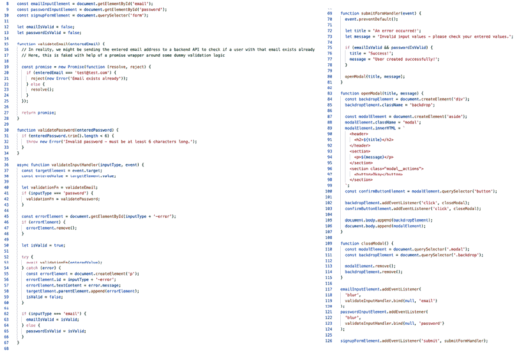
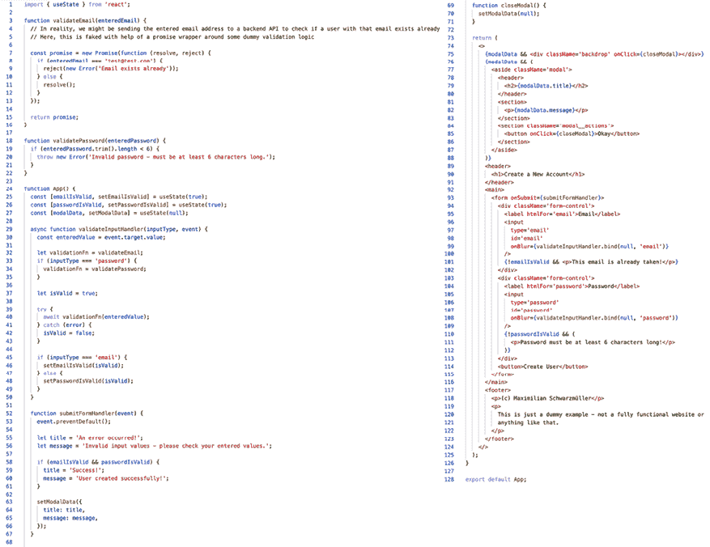

# 第一章：React – 什么是 React 以及为什么使用它

学习目标

到本章结束时，你将能够做到以下内容：

+   描述 React 是什么以及为什么你会使用它

+   将 React 与仅使用 JavaScript 构建的 Web 项目进行比较

+   解释命令式和声明式代码之间的区别

+   区分**单页应用程序**（**SPAs**）和多页应用程序

+   创建新的 React 项目

# 简介

**React.js**（或简称**React**，本书中也将这样称呼，并将在大多数情况下使用此称呼）是最受欢迎的前端 JavaScript 库之一——根据 2023 年 Stack Overflow 开发者调查，可能甚至是最受欢迎的一个。目前，它被前 1000 个顶级网站中的超过 5% 使用，与其他流行的前端 JavaScript 库和框架（如 Angular）相比，React 在关键指标（如通过 npm 的每周包下载量）上领先巨大，npm 是一个常用于下载和管理 JavaScript 包的工具。

虽然当然可以在不完全理解 React 的工作原理以及为什么使用它的前提下编写好的 React 代码，但你可能会更快地学习高级概念，并在尝试理解你正在使用的工具以及最初选择该工具的原因时避免错误。

因此，在考虑其核心概念和理念或审查示例代码之前，你首先需要了解 React 究竟是什么以及为什么它存在。这将帮助你理解 React 内部是如何工作的以及为什么它提供了这些功能。

如果你已经知道为什么你使用 React，为什么像 React 这样的解决方案通常会被用于代替**纯 JavaScript**（即没有框架或库的 JavaScript，更多内容将在下一节中介绍），以及 React 及其语法的理念是什么，你当然可以跳过这一节，直接跳到本书后面更注重实践的章节。

但如果你只是**认为**自己了解它，并且并不完全确定，你绝对应该首先阅读这一章。

# 什么是 React？

React 是一个 JavaScript 库，如果你查看官方网页（官方 React 网站和文档可在以下链接找到：[`react.dev/`](https://react.dev/)），你会了解到创造者称其为*“用于 Web 和原生用户界面的库。”*

但这究竟意味着什么？

首先，重要的是要理解 React 是一个 JavaScript 库。作为本书的读者，你知道 JavaScript 是什么以及为什么你在浏览器中使用 JavaScript。JavaScript 允许你在页面加载后添加交互性，因为你可以通过 JavaScript 对用户事件做出反应并操作页面。这非常有价值，因为它允许你构建高度交互的 Web **用户界面**（**UIs**）。

但“库”是什么？React 又是如何帮助构建用户界面的？

虽然你可以就库是什么（以及它与框架的区别）进行哲学讨论，但库的实用定义是它是一组你可以用于代码中的功能，以实现通常需要更多代码和工作的结果。库可以帮助你编写更简洁的代码，可能也更不容易出错，并使你能够更快地实现某些功能。

React 就是这样的一个库——它专注于提供帮助你创建交互性和响应性 UI 的功能。确实，React 不仅处理 Web 界面（即浏览器中加载的网站），你还可以使用 React 和 React Native（这是一个在底层使用 React 的库）为移动设备构建原生应用。本书中涵盖的 React 概念，无论选择哪个目标平台都适用。但示例将专注于 React Web 浏览器。不过，无论你针对哪个平台，仅使用 JavaScript 创建交互式 UI 可能会迅速变得非常复杂和令人不知所措。

# “纯 JavaScript”的问题

纯 JavaScript 是 Web 开发中常用术语，指的是没有框架或库的 JavaScript。这意味着你将所有 JavaScript 代码都自己编写，而不依赖任何提供额外实用功能的库或框架。当使用纯 JavaScript 时，你尤其不使用像 React 或 Angular 这样的主要前端框架或库。

使用纯 JavaScript 通常具有这样的优势，即网站的访问者需要下载的 JavaScript 代码更少（因为主要的框架和库通常相当庞大，并且可以快速添加 50+ KB 的额外 JavaScript 代码，这些代码必须下载）。

依赖于纯 JavaScript 的缺点是，作为开发者，你必须从头开始自己实现所有功能。这可能会导致错误，并且非常耗时。因此，特别是对于更复杂的 UI 和网站，使用纯 JavaScript 很快就会变得非常难以管理。

React 通过从**命令式**方法转向**声明式**方法来简化此类 UI 的创建和管理。尽管这是一个不错的句子，但如果之前没有使用过 React 或类似框架，可能会很难理解。为了理解它，了解“命令式与声明式方法”背后的理念，以及为什么你可能想使用 React 而不是仅仅使用纯 JavaScript，退一步评估纯 JavaScript 的工作方式是有帮助的。

让我们看看一个简短的代码片段，展示你如何使用纯 JavaScript 处理以下 UI 操作：

1.  为按钮添加事件监听器以监听`click`事件。

1.  一旦点击按钮，就用新文本替换段落中的文本。

    ```js
    const buttonElement = document.querySelector('button');
    const paragraphElement = document.querySelector('p');
    function updateTextHandler() {
      paragraphElement.textContent = 'Text was changed!';
    }
    buttonElement.addEventListener('click', updateTextHandler); 
    ```

这个例子故意保持简单，所以它看起来可能并不太糟糕或令人不知所措。它只是一个基本的例子，用来展示代码通常是如何用纯 JavaScript 编写的（稍后会讨论一个更复杂的例子）。但即使这个例子很容易理解，使用纯 JavaScript 处理功能丰富的 UI 以及相应处理各种用户交互的代码也会很快达到其极限。代码可以迅速增长，因此维护它可能成为一个挑战。

在前面的例子中，代码是用纯 JavaScript 编写的，并且是命令式的。这意味着你一条条地写下指令，并详细描述需要采取的每一步。

之前显示的代码可以翻译成以下更易于阅读的指令：

1.  寻找页面上的第一个`button`类型的`HTML`元素以获取对该按钮的引用。

1.  创建一个名为`buttonElement`的常量（即数据容器），其中包含按钮引用。

1.  重复*步骤 1*，但获取类型为`p`的第一个元素的引用。

1.  将段落元素引用存储在名为`paragraphElement`的常量中。

1.  向`buttonElement`添加一个事件监听器，该监听器监听`click`事件，并在发生此类`click`事件时触发`updateTextHandler`函数。

1.  在`updateTextHandler`函数内部，使用`paragraphElement`将其`textContent`设置为`"Text was changed!"`。

你是否看到每个需要采取的步骤都在代码中被清晰地定义和写出？

这并不令人惊讶，因为大多数编程语言都是这样工作的：你定义一系列必须按顺序执行的步骤。这是一个很有意义的做法，因为代码执行的顺序不应该随机或不可预测。

然而，当与 UI 一起工作时，这种命令式方法并不理想。实际上，它可能会很快变得繁琐，因为作为开发者，你必须添加很多指令，尽管这些指令增加的价值很少，但它们不能简单地被省略。你需要编写所有允许你的代码与元素交互、添加元素、操作元素等的**文档对象模型**（**DOM**）指令。

因此，你的核心业务逻辑（例如，在点击后推导和定义应设置的文本）通常只占整体代码的一小部分。当用 JavaScript 控制和管理 Web UI 时，大量的代码（通常是大多数）经常由 DOM 指令、事件监听器、HTML 元素操作和 UI 状态管理组成。

因此，你最终需要描述所有与 UI 技术交互所需的步骤，以及所有推导输出数据（即 UI 的期望最终状态）所需的步骤。

**注意**

本书假设你已经熟悉 DOM。简而言之，DOM 是你 JavaScript 代码和想要与之交互的网站 HTML 代码之间的“桥梁”。通过内置的**DOM API**，JavaScript 能够创建、插入、操作、删除和读取 HTML 元素及其内容。

你可以在这篇文章中了解更多关于 DOM 的信息：[`academind.com/tutorials/what-is-the-dom`](https://academind.com/tutorials/what-is-the-dom)。

现代 Web UI 通常相当复杂，幕后有很多交互性。你的网站可能需要在输入字段中监听用户输入，将输入的数据发送到服务器进行验证，在屏幕上输出验证反馈消息，如果提交了错误数据，则显示错误覆盖模态。

按钮点击示例在一般情况下并不是一个复杂的例子，但实现此类场景的原生 JavaScript 代码可能会让人感到压倒性。你最终会进行大量的 DOM 选择、插入和操作操作，以及多行代码，这些代码除了管理事件监听器之外什么都不做。此外，保持 DOM 更新，不引入错误或 bug，可能是一个噩梦，因为你必须确保在正确的时间更新正确的 DOM 元素和正确的值。在这里，你可以找到描述的使用案例的一些示例代码的截图。

**注意**

完整的、可工作的代码可以在 GitHub 上找到：[`github.com/mschwarzmueller/book-react-key-concepts-e2/tree/01-what-is-react/examples/example-1/vanilla-javascript`](https://github.com/mschwarzmueller/book-react-key-concepts-e2/tree/01-what-is-react/examples/example-1/vanilla-javascript)。

如果你查看截图中的 JavaScript 代码（或链接的仓库），你可能会想象出一个更复杂的 UI 可能看起来是什么样子。



图 1.1：一个包含超过 100 行代码的示例 JavaScript 代码文件，用于一个相当简单的 UI

这个示例 JavaScript 文件已经包含了大约 110 行代码。即使经过压缩（“压缩”意味着代码会自动缩短，例如通过用较短的变量名替换较长的变量名和删除冗余空格；在这种情况下，通过[`www.toptal.com/developers/javascript-minifier`](https://www.toptal.com/developers/javascript-minifier)）并随后将代码拆分到多行（以计算原始代码行数），它仍然有大约 80 行代码。这是一个简单 UI 的完整 80 行代码，只具有基本功能。实际的业务逻辑（即输入验证、确定何时显示覆盖层以及定义输出文本）只占整个代码库的一小部分——在这个例子中大约 20 到 30 行代码，经过压缩后大约 20 行。

这大约是 75%的代码用于纯 DOM 交互、DOM 状态管理和类似样板任务。

如这些示例和数字所示，控制所有 UI 元素及其不同状态（例如，信息框是否可见）是一项具有挑战性的任务，而仅使用 JavaScript 尝试创建此类界面通常会导致代码复杂，甚至可能包含错误。

正是因为在这种情况中，必须定义并写下每个单独步骤的命令式方法有其局限性，这就是为什么 React 提供了允许您以不同的方式编写代码的实用功能：使用声明式方法。

**注意**

这不是一篇科学论文，前面的例子也不是作为精确的科学研究的意图。根据您如何计算行数以及您认为哪种代码是“核心业务逻辑”，您最终会得到更高的或更低的百分比值。不过，关键信息并没有改变：大量的代码（在这种情况下，大部分）处理 DOM 和 DOM 操作——而不是定义您的网站及其关键功能的实际逻辑。

# React 和声明式代码

回到之前的第一段简单代码片段，这里是相同的代码片段，这次使用 React：

```js
import { useState } from 'react';
function App() {
  const [outputText, setOutputText] = useState('Initial text');
  function updateTextHandler() {
    setOutputText('Text was changed!');
  }
  return (
    <>
      <button onClick={updateTextHandler}>
        Click to change text
      </button>
      <p>{outputText}</p>
    </>
  );
} 
```

这个片段执行与第一个相同的操作，只是使用了纯 JavaScript：

1.  向按钮添加事件监听器以监听`click`事件（现在带有一些 React 特定的语法：`onClick={…})`。

1.  一旦点击按钮，就用新文本替换段落的文本。

尽管如此，这段代码看起来完全不同——就像 JavaScript 和 HTML 的混合体。确实，React 使用一种名为**JSX**（即扩展 JavaScript 以包含类似 XML 的语法）的语法扩展。目前，只需理解这种 JSX 代码能够工作，是因为它包含在每个 React 项目构建工作流程中的**预处理器**（或**转译**）步骤。

预处理器意味着某些工具，它们是 React 项目的一部分，会在代码部署之前分析和转换代码。这允许使用仅适用于开发的语法，如 JSX，这在浏览器中无法工作，因此在部署之前将其转换为常规 JavaScript。（您将在*第二章*，*理解 React 组件和 JSX*中详细了解 JSX。）

此外，之前显示的代码片段包含一个 React 特有的功能：状态。本书稍后将对状态进行更详细的讨论（*第四章*，*处理事件和状态*，将专注于使用 React 处理事件和状态）。目前，您可以将其视为一个变量，当它改变时，将触发 React 更新浏览器中的 UI。

在前面的示例中，你所看到的是 React 使用的“声明式方法”：你编写你的 JavaScript 逻辑（例如，最终应该被执行的函数），并将该逻辑与触发它的或受它影响的 HTML 代码结合起来。你不需要编写选择某些 DOM 元素或更改某些 DOM 元素的文本内容的指令。相反，使用 React 和 JSX，你专注于你的 JavaScript 业务逻辑，并定义最终应该达到的期望 HTML 输出。这个输出可以，并且通常将，包含在主 JavaScript 代码内部推导出的动态值。

在前面的示例中，`outputText` 是由 React 管理的一些状态。在代码中，`updateTextHandler` 函数在点击时触发，并使用 `setOutputText` 函数将 `outputText` 状态值设置为一个新的字符串值（`'Text was changed!'`）。这里发生的确切细节将在 *第四章* 中探讨。

然而，总体思路是状态值发生变化，由于它在最后一段（`<p>{outputText}</p>`）中被引用，React 在实际的 DOM（以及因此，在实际的网页）中的那个位置输出当前状态值。React 将保持段落更新，因此，每当 `outputText` 发生变化时，React 将再次选择这个段落元素并自动更新其 `textContent`。

这就是声明式方法的应用。作为一个开发者，你不需要担心技术细节（例如，选择段落并更新其 `textContent`）。相反，你将这项工作交给 React。你只需要关注期望的最终状态，目标仅仅是输出 `outputText` 的当前值在页面的特定位置（即在这个例子中的第二个段落）。这是 React 的任务，在幕后完成达到该结果的工作。

结果表明，这个代码片段并不比纯 JavaScript 的代码片段短；实际上，它甚至更长。但这仅仅是因为这个第一个片段被故意保持简单和简洁。在这种情况下，React 实际上添加了一些开销代码。如果那将是你的整个 UI，使用 React 确实没有太多意义。再次强调，这个片段被选择是因为它使我们能够一目了然地看到差异。如果你看一下之前更复杂的纯 JavaScript 示例，并将其与它的 React 选项进行比较，情况就会发生变化。

**注意**

参考代码可以在 GitHub 上找到，分别位于 [`github.com/mschwarzmueller/book-react-key-concepts-e2/tree/01-what-is-react/examples/example-1/vanilla-javascript`](https://github.com/mschwarzmueller/book-react-key-concepts-e2/tree/01-what-is-react/examples/example-1/vanilla-javascript) 和 [`github.com/mschwarzmueller/book-react-key-concepts-e2/tree/01-what-is-react/examples/example-1/reactjs`](https://github.com/mschwarzmueller/book-react-key-concepts-e2/tree/01-what-is-react/examples/example-1/reactjs)。



图 1.2：之前的代码片段现在通过 React 实现

它仍然不短，因为所有的 JSX 代码（即，HTML 输出）都包含在 JavaScript 文件中。如果你几乎忽略那个截图的整个右侧（因为 HTML 也不是纯 JavaScript 文件的一部分），React 代码会变得更加简洁。然而，最重要的是，如果你仔细查看所有的 React 代码（也包括第一个较短的片段），你会注意到绝对没有选择 DOM 元素、创建或插入 DOM 元素或编辑 DOM 元素的操作。

这是 React 的核心思想。你不需要写下所有单独的步骤和指令；相反，你专注于“大局”和页面内容的期望最终状态。使用 React，你可以合并你的 JavaScript 和标记代码，而无需处理与 DOM 交互的低级指令，如通过 `document.getElementById()` 或类似操作选择元素。

使用这种声明式方法而不是纯 JavaScript 的命令式方法，可以让开发者专注于核心业务逻辑和 HTML 代码的不同状态。你不需要定义所有必须采取的单独步骤（如“添加事件监听器”、“选择段落”等），这极大地简化了复杂 UI 的开发。

**注意**

需要强调的是，如果你正在处理一个非常简单的 UI，React 并不是一个很好的解决方案。如果你可以用几行纯 JavaScript 代码解决问题，那么将 React 集成到项目中可能没有强烈的理由。

第一次看 React 代码时，它可能看起来非常陌生和奇怪。它不是你从 JavaScript 中习惯看到的样子。然而，它仍然是 JavaScript – 只是通过 JSX 功能和各种 React 特定功能（如状态）进行了增强。如果你记得你通常使用 HTML 定义你的 UI（即，你的内容和其结构），可能会更容易理解。你不会在那里写一步一步的指令，而是使用 HTML 标签创建一个嵌套的树结构。你通过使用不同的 HTML 元素和嵌套 HTML 标签来表达你的内容、不同元素的意义以及你 UI 的层次结构。

如果你记住这一点，那么“传统”的（纯 JavaScript）操作 UI 的方法看起来可能相当奇怪。如果你在 HTML 中根本不做这样的低级指令，比如*“在这个按钮下方插入一个段落元素并设置其文本为<某些文本>”*，你会怎么做呢？最终，React 恢复了 HTML 语法，这在定义内容和结构时更为方便。使用 React，你可以将动态 JavaScript 代码与受其影响的 UI 代码（即 HTML 代码）并排编写。

## React 如何操作 DOM

如前所述，在编写 React 代码时，你通常按照前面所示的方式编写：通过使用 JSX 语法扩展将 HTML 与 JavaScript 代码混合。

值得指出的是，JSX 代码在浏览器中不会像这样运行。它需要在部署之前进行预处理。JSX 代码必须在发送到浏览器之前被转换成常规 JavaScript 代码。下一章将更详细地探讨 JSX 及其转换后的内容。不过，目前只需记住 JSX 代码必须被转换。

尽管如此，了解以下信息是很有价值的：JSX 将被转换成的代码也不会包含任何 DOM 指令。相反，转换后的代码将执行各种内置在 React 中的实用方法和函数（换句话说，那些由 React 包提供，需要添加到每个 React 项目中的函数）。在内部，React 创建了一个类似于虚拟 DOM 的树结构，反映了 UI 的当前状态。本书将更深入地探讨这个抽象的虚拟 DOM，以及 React 在*第十章*，*React 幕后和优化机会*中的工作方式。这就是为什么 React（库）将其核心逻辑分布在两个主要包之间：

+   主要的`react`包

+   `react-dom`包

主要的`react`包是一个第三方 JavaScript 库，需要将其导入到项目中才能使用 React 的功能（如 JSX 或状态）。是这个包创建了虚拟 DOM 并推导出当前的 UI 状态。但如果你想在项目中使用 React 操作 DOM，你还需要`react-dom`包。

`react-dom`包，特别是该包的`react-dom/client`部分，充当了 React 代码、内部生成的虚拟 DOM 以及需要更新的浏览器实际 DOM 之间的“翻译桥”。是`react-dom`包将生成实际的 DOM 指令，用于选择、更新、删除和创建 DOM 元素。

这种分割存在是因为你还可以在其他目标环境中使用 React。一个非常流行且广为人知的 DOM（即浏览器）的替代方案是 React Native，它允许开发者借助 React 构建原生移动应用。使用 React Native 时，你也会在你的项目中包含 react 包，但会使用`react-native`包代替`react-dom`。在这本书中，“React”既指`react`包也指“桥接”包（如`react-dom`）。

**注意**

如前所述，这本书主要关注 React 本身。因此，书中解释的概念将适用于网络浏览器、网站以及移动设备。尽管如此，所有示例都将关注网络和`react-dom`，因为这可以避免引入额外的复杂性。

# 介绍单页应用（SPAs）

React 可以用来简化复杂 UI 的创建，主要有两种方式：

+   管理网站的部分（例如，左下角的聊天框）。

+   管理整个页面以及在该页面上发生的所有用户交互。

这两种方法都是可行的，但更流行和常见的场景是第二种：使用 React 来管理整个网页，而不是仅仅管理其部分。这种方法之所以更受欢迎，是因为大多数具有复杂 UI 的网站在其页面上不仅有单个复杂元素，还有多个复杂元素。实际上，如果你开始使用 React 处理网站的部分区域而不处理其他区域，复杂性实际上会增加。因此，使用 React 来管理整个网站是非常常见的。

这甚至在使用 React 处理网站的一个特定页面后也不会停止。实际上，React 可以用来处理 URL 路径变化，并更新需要更新的页面部分，以反映应该加载的新页面。这种功能被称为**路由**，与 React 集成的第三方包（如`react-router-dom`，见第十三章，*使用 React Router 的多页应用*）允许你创建一个整个 UI 都通过 React 控制的网站。

一个不仅在其页面部分使用 React，而是对所有子页面和路由都使用 React 的网站通常被构建为单页应用（SPA），因为创建只包含一个 HTML 文件（通常命名为`index.html`）的 React 项目是很常见的，该文件用于最初加载 React JavaScript 代码。之后，React 库和你的 React 代码接管并控制实际的 UI。这意味着整个 UI 都是由 JavaScript 通过 React 和你的 React 代码创建和管理的。

话虽如此，构建全栈 React 应用也越来越受欢迎，其中前端和后端代码被合并。现代 React 框架如**Next.js**简化了构建此类 Web 应用的过程。虽然核心概念相同，无论构建哪种类型的应用，本书将在第十五章*服务器端渲染与使用 Next.js 构建全栈应用*、第十六章*React 服务器组件和服务器操作*以及第十七章*理解 React Suspense 和 use() Hook 的使用*中更详细地探讨全栈 React 应用开发。

最终，这本书为你准备在所有类型的 React 项目中使用 React，因为核心构建块和关键概念始终相同。

## 使用 Vite 创建 React 项目

要使用 React，第一步是创建一个 React 项目。官方文档建议使用像 Next.js 这样的框架。但对于复杂 Web 应用来说，这可能是有意义的，但对于 React 入门和探索 React 概念来说可能会感到压倒性。Next.js 和其他框架引入了它们自己的概念和语法。因此，学习 React 可能会很快变得令人沮丧，因为很难区分 React 功能和框架功能。此外，并非所有 React 应用都需要构建为全栈 Web 应用 – 因此，使用像 Next.js 这样的框架可能会增加不必要的复杂性。

正因如此，基于 Vite 的 React 项目已成为一个流行的替代方案。**Vite**是一个开源的开发和构建工具，可以用于创建和运行基于所有类型库和框架的 Web 开发项目 – React 只是众多选项之一。

Vite 创建的项目自带预配置的构建过程，在 React 项目中，它会处理 JSX 代码的转译。它还提供了一个本地运行的开发 Web 服务器，允许你在开发过程中预览 React 应用。

你需要一个这样的项目设置，因为 React 项目通常使用 JSX 这样的特性，如果没有先前的代码转换，这些特性在浏览器中是无法工作的。因此，正如之前提到的，需要一个预处理步骤。

要使用 Vite 创建项目，你必须安装 Node.js –最好是最新版（或最新**LTS**版）。你可以从[`nodejs.org/`](https://nodejs.org/)获取所有操作系统的官方 Node.js 安装程序。一旦安装了 Node.js，你也将获得内置的`npm`命令的访问权限，你可以使用它来利用 Vite 包创建一个新的 React 项目。

你可以在命令提示符（Windows）、bash（Linux）或终端（macOS）程序中运行以下命令。只需确保你已经导航（通过`cd`）到你想创建新项目的文件夹中：

```js
npm create vite@latest my-react-project 
```

执行此命令后，系统将提示你选择你想要用于此新项目的框架或库。你应该选择 React 和 JavaScript。

此命令将在你运行它的位置创建一个新的子文件夹，其中包含基本的 React 项目设置（即，包含各种文件和文件夹）。你应该在系统中的某个路径上运行它，你拥有完整的读写权限，并且不会与任何系统或其他项目文件冲突。

值得注意的是，项目创建命令不会安装任何必需的依赖项，例如 React 库包。因此，你必须进入系统终端或命令提示符中创建的文件夹（通过 `cd my-react-project`）并运行以下命令来安装这些包：

```js
npm install 
```

一旦安装成功，项目设置过程就完成了。

要查看创建的 React 应用程序，你可以在你的机器上通过此命令启动开发服务器：

```js
npm run dev 
```

这将调用 Vite 提供的脚本，该脚本将启动一个本地运行的 Web 服务器，该服务器会预处理、构建并托管你的 React 驱动的 SPA - 默认为 `localhost:5173`。因此，在编写代码时，你通常需要保持这个开发服务器运行，因为它允许你预览和测试代码更改。

最好的是，这个本地开发服务器将自动更新网站，每当保存任何代码更改时，因此允许你几乎瞬间预览你的更改。

当你一天的工作完成时，你可以通过在执行 `npm run dev` 的终端或命令提示符中按 *Ctrl* + *C* 来退出此服务器。

当你准备好再次开始工作在项目上时，你可以通过 `npm run dev` 命令重新启动服务器。

**注意**

如果你在创建 React 项目时遇到任何问题，你也可以下载并使用以下起始项目：[`github.com/mschwarzmueller/book-react-key-concepts-e2/tree/01-what-is-react/react-starting-project`](https://github.com/mschwarzmueller/book-react-key-concepts-e2/tree/01-what-is-react/react-starting-project)。这是一个通过 Vite 创建的项目，可以像使用前面的命令创建的项目一样使用。

当使用此起始项目（或者，实际上，任何属于此书的 GitHub 托管代码快照）时，你需要在项目文件夹中首先运行 `npm install`，然后再运行 `npm run dev`。

具体的项目结构（即，文件名和文件夹名）可能会随时间而变化，但通常，每个新的基于 Vite 的 React 项目都包含一些关键文件和文件夹：

+   一个 `src/` 文件夹，其中包含项目的源代码文件：

    +   一个 `main.jsx` 文件，这是首先执行的入口脚本文件

    +   一个 `App.jsx` 文件，其中包含应用程序的根组件（你将在下一章中了解更多关于组件的内容）

    +   各种样式（ `*.css` ）文件，这些文件被 JavaScript 文件导入

    +   一个 `assets/` 文件夹，可以用来存储在 React 代码中使用的图像或其他资产

+   一个 `public/` 文件夹，其中包含将成为最终网站一部分的静态文件（例如，一个图标）

+   一个 `index.html` 文件，这是本网站的单一 HTML 页面

+   `package.json` 和 `package-lock.json` 是列出和定义项目第三方依赖项的文件：

    +   生产依赖项，如 `react` 或 `react-dom`

    +   开发依赖项，如 `eslint` 用于自动代码质量检查

+   其他项目配置文件（例如，`.gitignore` 用于管理 Git 文件跟踪）

+   一个 `node_modules` 文件夹，其中包含已安装的第三方包的实际代码

值得注意的是，`App.jsx` 和 `main.jsx` 使用 `.jsx` 作为文件扩展名，而不是 `.js`。这是一个由 Vite 强制执行的文件扩展名，用于包含标准 JavaScript 以及 JSX 代码的文件。当在 Vite 项目中工作时，大多数项目文件将相应地使用 `.jsx` 作为扩展名。

几乎所有的 React 特定代码都将写在 `App.jsx` 文件或将被添加到项目中的自定义组件文件中。我们将在下一章探讨组件。

**注意**

`package.json` 是你实际管理包及其版本的文件。`package-lock.json` 是自动创建的（由 `Node.js` 创建）。它锁定确切的依赖项和子依赖项版本，而 `package.json` 只指定版本范围。你可以在 [`docs.npmjs.com/`](https://docs.npmjs.com/) 上了解更多关于这些文件和包版本的信息。

项目依赖项的代码存储在 `node_modules` 文件夹中。由于它包含所有已安装包及其依赖项的代码，这个文件夹可能会变得非常大。因此，当项目与其他开发者共享或推送到 GitHub 时，通常不会包含它。你只需要 `package.json` 文件。通过运行 `npm install`，`node_modules` 文件夹将在本地重新创建。

# 摘要和关键要点

+   React 是一个库，尽管它实际上是两个主要包的组合：`react` 和 `react-dom`。

+   虽然没有 React 也可以构建非平凡的 UI，但仅使用纯 JavaScript 来做这样的事情可能会很繁琐、容易出错且难以维护。

+   React 通过提供一种声明式的方式来定义 UI 的期望最终状态，简化了复杂 UI 的创建。

+   **声明式**意味着你定义目标 UI 内容和结构，结合不同的状态（例如，“模态是打开还是关闭？”），然后将其留给 React 来确定适当的 DOM 指令。

+   本身，react 包导出 UI 状态并管理虚拟 DOM。它是一个“桥梁”，类似于 `react-dom` 或 `react-native`，将这个虚拟 DOM 转换为实际的 UI（DOM）指令。

+   使用 React，你可以构建单页应用（SPAs），这意味着 React 用于控制所有页面上的整个 UI 以及页面间的路由。

+   你还可以结合 Next.js 等框架使用 React 来构建全栈 Web 应用程序，其中服务器端和客户端代码是连接在一起的。

+   可以使用 Vite 包来创建 React 项目，它提供了一个预先配置好的项目文件夹和一个实时预览的开发服务器。

## 接下来是什么？

到目前为止，你应该对 React 是什么以及为什么你可能考虑使用它有一个基本的了解，尤其是对于构建非平凡的用户界面。你学习了如何使用 Vite 创建新的 React 项目，现在你准备好更深入地了解 React 以及它提供的实际关键特性。

在下一章中，你将学习一个名为 **组件** 的概念，它们是 React 应用的基本构建块。你将了解组件是如何用来组合 UI 的，以及为什么最初需要这些组件。下一章还将更深入地探讨 JSX，并探索它如何被转换成常规 JavaScript 代码，以及你可以用其他什么类型的代码来替代 JSX。

## 测试你的知识！

通过回答以下问题来测试你对本章涵盖的概念的了解。然后你可以将你的答案与这里可以找到的示例答案进行比较：[`github.com/mschwarzmueller/book-react-key-concepts-e2/blob/01-what-is-react/exercises/questions-answers.md`](https://github.com/mschwarzmueller/book-react-key-concepts-e2/blob/01-what-is-react/exercises/questions-answers.md)。

1.  什么是 React？

1.  React 相比纯 JavaScript 项目有哪些优势？

1.  命令式代码和声明式代码有什么区别？

1.  什么是 **单页应用程序**（**SPA**）？

1.  你如何创建新的 React 项目，为什么你需要这样一个复杂的项目设置？

# 加入我们的 Discord

与其他用户、AI 专家和作者本人一起阅读这本书。

提出问题，为其他读者提供解决方案，通过“问我任何问题”的环节与作者聊天，还有更多。

扫描二维码或访问链接加入社区。

[`packt.link/ReactKeyConcepts2e`](https://packt.link/ReactKeyConcepts2e)


