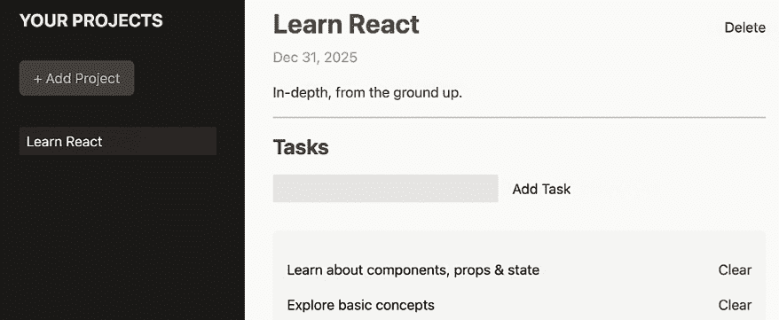
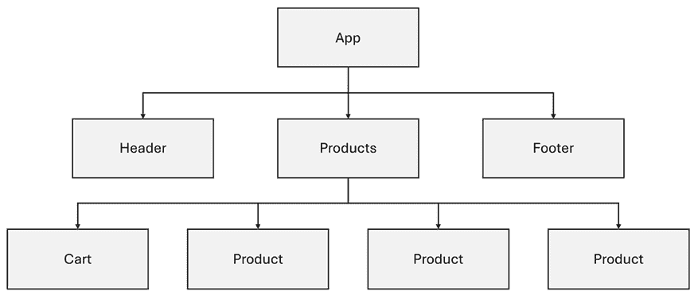
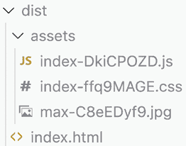

# 第二章：理解 React 组件和 JSX

学习目标

到本章结束时，你将能够做到以下几点：

+   定义组件的确切含义

+   有效地构建和使用组件

+   利用常见的命名约定和代码模式

+   描述组件和 JSX 之间的关系

+   编写 JSX 代码并理解其用途

+   不使用 JSX 代码编写 React 组件

+   编写你的第一个 React 应用程序

# 简介

在上一章中，你了解了 React 的基础知识，它是什么，以及为什么你应该考虑使用它来构建用户界面。你还学习了如何使用 Vite 创建 React 项目，通过运行 `npm create vite@latest <your-project-name>` 来实现。

在本章中，你将了解 React 最重要概念和构建块之一。你将了解到组件是可重用的构建块，用于构建用户界面。此外，还将更详细地讨论 JSX 代码，以便你能够使用组件和 JSX 的概念来构建你自己的第一个基本 React 应用程序。

# 组件是什么？

React 的一个关键概念是所谓的组件的使用。**组件**是可重用的构建块，它们被组合起来构成最终的用户界面。例如，一个基本的网站可以由包含导航项的侧边栏和一个包含添加和查看任务元素的主体部分组成。



图 2.1：一个包含侧边栏和主区域的示例任务管理屏幕

如果你查看这个示例页面，你可能能够识别出各种构建块（即组件）。其中一些组件甚至被重复使用：

+   侧边栏及其导航项

+   主页面区域

+   在主区域，包含标题和截止日期的页眉

+   添加任务的表单

+   任务列表

请注意，一些组件嵌套在其他组件内部——即，组件也由其他组件组成。这是 React 和类似库的关键特性。

## 为什么需要组件？

无论你查看哪个网页，它们都是由这样的构建块组成的。这不是一个特定于 React 的概念或想法。实际上，如果你仔细观察，HTML 本身“认为”在组件中。你有一些元素，如 ``、`<header>`、`<nav>` 等，你将这些元素组合起来描述和结构化你的网站内容。

但 React **接受**将网页分解为可重用构建块的想法，因为这是一种允许开发者对小块、可管理的代码进行工作的方法。与处理单个、巨大的 HTML（或 React 代码）文件相比，这更容易且更易于维护。

因此，其他库——无论是前端库如 React 或 Angular，还是后端库和模板引擎如 **EJS**（**嵌入式 JavaScript 模板**）——也接受组件（尽管名称可能不同，你也会找到 *“部分”* 或 *“包含”* 作为常见名称）。

**注意**

EJS 是 JavaScript 的一个流行模板引擎。它特别适合与 Node.js 一起进行后端 Web 开发。

当使用 React 时，保持你的代码可管理并与小型、可重用组件一起工作尤为重要，因为 React 组件不仅仅是 HTML 代码的集合。相反，React 组件还封装了 JavaScript 逻辑，通常还封装了 CSS 样式。对于复杂的用户界面，标记（JSX）、逻辑（JavaScript）和样式（CSS）的组合可能会迅速导致大量代码，这使得维护这些代码变得困难。想象一下一个包含 JavaScript 和 CSS 代码的大型 HTML 文件。在这样的代码文件中工作不会很有趣。

简而言之，当你在 React 项目中工作时，你将处理很多组件。你会将你的代码分割成小而可管理的构建块，然后将这些组件组合起来形成整体的用户界面。这是 React 的一个关键特性。

**注意**

当使用 React 时，你应该接受这种与组件一起工作的想法。但从技术上讲，这是可选的。理论上，你可以仅使用一个组件构建非常复杂的网页。这不会很有趣，也不太实用，但从技术上讲，没有任何问题。

## 组件的解剖结构

组件很重要。但一个 React 组件究竟是什么样子？你如何自己编写 React 组件？

这里有一个示例组件：

```js
import { useState } from 'react';
function SubmitButton() {
  const [isSubmitted, setIsSubmitted] = useState(false);

  function handleSubmit() {
    setIsSubmitted(true);
  };
  return (
    <button onClick={handleSubmit}>
      { isSubmitted ? 'Loading…' : 'Submit' }
    </button>
  );
};
export default SubmitButton; 
```

通常，你会将这样的代码片段存储在一个单独的文件中（例如，一个名为`SubmitButton.jsx`的文件，存储在`/components`文件夹中，该文件夹位于你的 React 项目的`/src`文件夹中），并将其导入需要此组件的其他组件文件中。`.jsx`被用作扩展名，因为该文件包含 JSX 代码。Vite 强制使用`.jsx`作为文件扩展名，如果你正在编写 JSX 代码——在 Vite 项目中不允许将此类代码存储在`.js`文件中（尽管在其他 React 项目设置中可能可行）。

以下组件导入上面定义的组件，并在其`return`语句中使用它来输出`SubmitButton`组件：

```js
import SubmitButton from './submit-button.jsx';
function AuthForm() {
  return (
    <form>
      <input type="text" />
      <SubmitButton />
    </form>
  );
};
export default AuthForm; 
```

你在这些示例中看到的`import`语句是标准的 JavaScript `import`语句。理论上，在基于 Vite 的项目中，你可以在`import`语句中省略文件扩展名（在这个例子中是`.jsx`）。然而，包含扩展名可能是个好主意，因为这符合标准 JavaScript。当你从第三方包（如`react`包中的`useState`）导入时，不需要添加文件扩展名——你只需使用包名。`import`和`export`是标准的 JavaScript 关键字，有助于将相关代码分割到多个文件中。像变量、常量、类或函数这样的东西可以通过`export`或`export default`导出，以便在导入后可以在其他文件中使用。

**注意**

如果将代码拆分为多个文件并使用`import`和`export`的概念对你来说完全陌生，你可能首先需要深入了解有关此主题的基本 JavaScript 资源。例如，MDN 有一篇优秀的文章解释了基础知识，您可以在[`developer.mozilla.org/en-US/docs/Web/JavaScript/Guide/Modules`](https://developer.mozilla.org/en-US/docs/Web/JavaScript/Guide/Modules)找到。

当然，这些示例中展示的组件非常简化，也包含了一些你尚未学习到的功能（例如，`useState()`）。然而，拥有可以组合的独立构建块的一般想法应该是清晰的。

当使用 React 时，有两种不同的方式来定义组件：

+   **基于类的组件**（或“类组件”）：通过`class`关键字定义的组件

+   **函数组件**（或“函数组件”）：通过常规 JavaScript 函数定义的组件

在本书涵盖的所有示例中，组件都是作为 JavaScript 函数构建的。作为一名 React 开发者，你必须使用这两种方法之一，因为 React 期望组件是函数或类。

**注意**

直到 2018 年底，你必须使用基于类的组件来完成某些类型的任务——特别是对于使用内部状态的组件。（状态将在*第四章*，*处理事件和状态*中介绍）。然而，在 2018 年底，引入了一个新的概念：**React Hooks**。这允许你使用函数组件执行所有操作和任务。因此，尽管仍然由 React 支持，但基于类的组件正在逐渐淘汰，本书中不会涉及。

在上面的示例中，还有一些其他值得注意的事情：

+   组件函数具有大写命名的名称（例如，`SubmitButton`）

+   在组件函数内部，可以定义其他“内部”函数（例如，`handleSubmit`，通常使用**camelCase**编写）

+   组件函数返回类似*HTML*的代码（JSX 代码）

+   类似于`useState()`这样的功能可以在组件函数内部使用

+   组件函数通过`export default`导出

+   某些功能（如`useState`或自定义组件`SubmitButton`）通过`import`关键字导入

以下章节将更深入地探讨构成组件及其代码的不同概念。

## 组件函数究竟是什么？

在 React 中，组件是函数（或类，但如上所述，那些不再相关了）。

函数是一个常规的 JavaScript 构造，不是一个 React 特定的概念。这一点很重要。React 是一个 JavaScript 库，因此**使用 JavaScript 功能**（如函数）；React**不是一个全新的编程语言**。

当使用 React 时，可以使用常规 JavaScript 函数来封装属于该标记代码的 HTML（或者更准确地说，是 JSX）代码和 JavaScript 逻辑。然而，一个函数是否可以被视为 React 组件，取决于你在这个函数中编写的代码。例如，在上面的代码片段中，`handleSubmit` 函数也是一个常规 JavaScript 函数，但它不是 React 组件。以下示例展示了另一个不符合 React 组件资格的常规 JavaScript 函数：

```js
function calculate(a, b) {
  return {sum: a + b};
}; 
```

事实上，如果一个函数返回一个 **可渲染** 的值（通常是 JSX 代码），它将被视为一个组件，因此可以像 HTML 元素一样在 JSX 代码中使用。这非常重要。你只能在 JSX 代码中使用函数作为 React 组件，如果它返回的是 React 可以渲染的东西。返回的值在技术上不必是 JSX 代码，但在大多数情况下，它将是。你将在 *第七章* 中看到一个返回非 JSX 代码的例子，*Portals 和 Refs*。

在定义名为 `SubmitButton` 和 `AuthForm` 的函数的代码片段中，这两个函数符合 React 组件的资格，因为它们都返回了 JSX 代码（这是 React 可以渲染的代码，使其可渲染）。一旦一个函数符合 React 组件的资格，它就可以像 HTML 元素一样在 JSX 代码中使用，就像 `<SubmitButton />` 被用作（自闭合的）HTML 元素一样。

当使用纯 JavaScript 时，你当然通常调用函数来执行它们。对于函数组件，情况不同。React 代表你调用这些函数，因此，作为一个开发者，你将它们用作 JSX 代码中的 HTML 元素。

**注意**

当提到可渲染值时，值得注意的是，到目前为止，最常见返回或使用的值类型确实是 JSX 代码——即通过 JSX 定义的标记。这应该是有道理的，因为使用 JSX，你可以定义你内容和使用界面的类似 HTML 的结构。

除了 JSX 标记之外，还有一些其他关键值也符合可渲染的资格，因此也可以由自定义组件返回（而不是 JSX 代码）。最值得注意的是，你也可以返回字符串或数字，以及包含 JSX 元素、字符串或数字的数组。

# React 都用这些组件做了些什么？

如果你追踪所有组件及其 `import` 和 `export` 语句到顶部，你将在 React 项目的入口脚本中找到一个 `root.render(...)` 指令。通常，这个主入口脚本可以在项目的 `src/` 文件夹中的 `main.jsx` 文件中找到。这个由 React 库（确切地说，由 `react-dom` 包）提供的 `render()` 方法接受一段 JSX 代码，并为你解释和执行它。

你在根入口文件（`main.jsx`）中找到的完整代码片段通常如下所示：

```js
import React from 'react';
import ReactDOM from 'react-dom/client';
import './index.css';
import App from './App.jsx';
const root = ReactDOM.createRoot(document.getElementById('root'));
root.render(<App />); 
```

你在新的 React 项目中找到的确切代码可能看起来略有不同。

例如，它可能包含一个额外的 `<StrictMode>` 元素，该元素被 `<App>` 包围。`<StrictMode>` 会开启额外的检查，这有助于捕捉 React 代码中的细微错误。但这也可能导致令人困惑的行为和意外的错误信息，尤其是在实验 React 或学习 React 时。由于本书主要关注 React 核心功能和关键概念的覆盖，因此不会使用 `<StrictMode>`。

虽然在这里省略了，但严格模式将在第十章“React 背后场景和优化机会”中介绍。如果你现在想了解更多关于它的信息，可以深入了解官方文档：[`react.dev/reference/react/StrictMode`](https://react.dev/reference/react/StrictMode)。但请注意，在阅读更多本书内容之后，严格模式触发的某些效果将更容易理解。

因此，为了顺利地跟随，清理一个新创建的 `main.jsx` 文件，使其看起来像上面的代码片段是一个好主意。

`createRoot()` 方法指示 React 创建一个新的 **入口点**，该入口点将用于将生成的用户界面注入要提供给网站访问者的实际 HTML 文档中。因此传递给 `createRoot()` 的参数是指向可以在 `index.html` 中找到的 DOM 元素的指针——这是将被提供给网站访问者的单个页面。

在许多情况下，`document.getElementById('root')` 被用作参数。这个内置的纯 JavaScript 方法返回一个指向 `index.html` 文档中已存在的 DOM 元素的引用。因此，作为开发者，你必须确保具有提供的 `id` 属性值（在这个例子中是 `root`）的此类元素存在于加载 React 应用脚本的那个 HTML 文件中。在一个通过 `npm create vite@latest` 创建的默认 React 项目中，情况就是这样。你可以在根项目文件夹中的 `index.html` 文件中找到一个 `<div id="root">` 元素。

这个 `index.html` 文件是一个相对空白的文件，它仅作为 React 应用的外壳。React 只需要一个入口点（通过 `createRoot()` 定义），该入口点将用于将生成的用户界面附加到显示的网站上。因此，HTML 文件及其内容并不直接定义网站内容。相反，该文件仅作为 React 应用的起点，允许 React 然后接管并控制实际的用户界面。

一旦定义了根入口点，就可以在通过 `createRoot()` 创建的 `root` 对象上调用 `render()` 方法：

```js
root.render(<App />); 
```

这个 `render()` 方法告诉 React 应将哪个内容（即哪个 React 组件）注入到该根入口点中。在大多数 React 应用中，这是一个名为 `App` 的组件。React 将生成适当的 DOM 操作指令，以反映 `App` 组件在网页上通过 JSX 定义的标记。

这个`App`组件是一个从其他文件导入的组件函数。在一个默认的 React 项目中，`App`组件函数在`App.jsx`文件中定义并导出，该文件也位于`src/`文件夹中。

这个传递给`render()`（通常是`<App />`）的组件也被称为 React 应用的**根组件**。它是渲染到 DOM 中的主要组件。所有其他组件都嵌套在`App`组件的 JSX 代码中，或者嵌套在更多嵌套的子组件的 JSX 代码中。你可以将这些组件视为由 React 评估并转换为实际 DOM 操作指令的组件树。



图 2.2：嵌套的 React 组件形成一个组件树

**注意**

如前一章所述，React 可以在各种平台上使用。使用`react-native`包，它可以用来为 iOS 和 Android 构建原生移动应用。`react-dom`包，它提供了`createRoot()`方法（因此隐式地提供了`render()`方法），专注于浏览器。它提供了 React 的能力和浏览器指令之间的“桥梁”，这些指令是必需的，以便在浏览器中将 UI（通过 JSX 和 React 组件描述）呈现出来。如果你为不同的平台构建，则需要`ReactDOM.createRoot()`和`render()`的替代品（当然，这样的替代品确实存在）。

无论哪种方式，无论你是否在 JSX 代码中像 HTML 元素一样使用组件函数，或者将其作为参数传递给`render()`方法，React 都会为你处理解释和执行组件函数。

当然，这并不是一个新概念。在 JavaScript 中，函数是**一等对象**，这意味着你可以将函数作为参数传递给其他函数。这里基本上就是这样做的，只是额外地使用了这种 JSX 语法，这不是 JavaScript 的默认功能。

React 为你执行这些组件函数，并将返回的 JSX 代码转换为 DOM 指令。更准确地说，React 遍历返回的 JSX 代码，并深入到该 JSX 代码中可能使用的任何其他自定义组件，直到它最终得到只由原生、内置 HTML 元素组成的 JSX 代码（技术上，它并不是真正的 HTML，但这将在本章后面的内容中讨论）。

以这两个组件为例：

```js
function Greeting() {
  return <p>Welcome to this book!</p>;
};
function App() {
  return (
    <div>
      <h2>Hello World!</h2>
      <Greeting />
    </div>
  );
};
const root = ReactDOM.createRoot(document.getElementById('root'));
root.render(<App />); 
```

`App`组件在其 JSX 代码中使用了`Greeting`组件。React 会遍历整个 JSX 标记结构，并推导出以下最终的 JSX 代码：

```js
root.render((
  <div>
    <h2>Hello World!</h2>
    <p>Welcome to this book!</p>
  </div>
), document.getElementById('root')); 
```

这段代码将指示 React 和 ReactDOM 执行以下 DOM 操作：

1.  创建一个`<div>`元素

1.  在那个`<div>`内部，创建两个子元素：`<h2>`和`<p>`

1.  将`<h2>`元素的文本内容设置为`'Hello World!'`

1.  将 `<p>` 元素的文本内容设置为 `'欢迎来到这本书！'`

1.  将 `<div>` 及其子元素插入到已经存在的 DOM 元素中，该元素的 ID 为 `'root'`

这有点简化，但你可以将 React 处理组件和 JSX 代码的方式想象成上述描述的那样。

**注意**

React 实际上并不在内部使用 JSX 代码。它只是对开发者来说更容易使用。在本章的后面，你将学习 JSX 代码会被转换成什么，以及 React 实际上使用的代码是什么样的。

## 内置组件

如前例所示，你可以通过创建返回 JSX 代码的函数来创建自己的自定义组件。确实，作为 React 开发者，你将一直要做的主要事情之一就是创建组件函数——大量的组件函数。

但，最终，如果你要将所有 JSX 代码合并成一个大片段，就像在最后一个例子中展示的那样，你将得到一个只包含标准 HTML 元素（如 `<div>`、`<h2>`、`<p>` 等）的 JSX 代码块。

当使用 React 时，你不会创建浏览器能够显示和处理的全新 HTML 元素。相反，你创建的组件 **仅在 React 环境中工作**。在它们到达浏览器之前，它们已经被 React 评估并“转换”成 DOM 操作的 JavaScript 指令（如 `document.append(…)`）。

但请记住，所有这些 JSX 代码都是 React 库和用于编写 React 代码的项目设置提供的一个特性，而不是 JavaScript 语言本身的一部分。它基本上是 **语法糖**（即关于代码语法的简化）的提供。因此，当在 JSX 代码中使用 `<div>` 等元素时，它们也不是常规的 HTML 元素，因为你 **没有编写 HTML 代码**。它看起来可能像那样，但它是在 `.jsx` 文件中，并且它不是 HTML 标记。相反，它是这种特殊的 JSX 代码。这一点很重要。

因此，在这些所有例子中看到的 `<div>` 和 `<h2>` 元素最终也只是 React 组件。但它们不是你构建的组件，而是由 React（或更准确地说，由 ReactDOM）提供的。

当使用 React 时，你最终总是得到这些原语——这些内置的组件函数，这些函数最终会被转换成浏览器指令，用于生成和附加或删除常规 DOM 元素。构建自定义组件背后的想法是将这些元素组合在一起，这样你最终得到的是可重用的构建块，可以用来构建整体 UI。但是，最终，这个 UI 是由常规 HTML 元素组成的。

**注意**

根据你对前端 Web 开发知识的了解程度，你可能已经听说过一个名为 **Web Components** 的 Web 特性。这个特性的想法是，你确实可以使用纯 JavaScript 构建全新的 HTML 元素。

如前所述，React 并不识别这个特性；你不会用 React 构建新的自定义 HTML 元素。

## 命名约定

本书中所能找到的所有组件函数的名称都像 `SubmitButton`、`AuthForm` 或 `Greeting` 这样。

你可以随意命名你的 React 函数——至少在你定义它们的文件中是这样。但使用 **PascalCase** 命名约定是一种常见的惯例，其中第一个字符是大写，多个单词组合成一个单词（例如 `SubmitButton` 而不是 `Submit Button`），然后每个“子词”都以另一个大写字母开头。

在定义你的组件函数的地方，这只是一种命名约定，而不是一个硬性规则。然而，在你**使用**组件函数的地方——即嵌入你自定义组件的 JSX 代码中——这是一个硬性规则。

你不能像这样将自定义组件函数用作组件：

```js
<greeting /> 
```

React 强制你在 JSX 代码中使用大写字母开头来自定义组件名称。这个规则存在是为了让 React 有一个清晰且简单的方法来区分自定义组件和内置组件（如 `<div>` 等）。React 只需要查看起始字符就能确定它是一个内置元素还是一个自定义组件。

除了实际组件函数的名称外，了解文件命名约定也很重要。自定义组件通常存储在 `src/components/` 文件夹内的单独文件中。然而，这并不是一个硬性规则。确切的放置位置以及文件夹名称由你决定，但应该在 `src/` 文件夹内。使用名为 `components/` 的文件夹是标准做法。

虽然使用 PascalCase 命名组件函数是标准，但对于文件名来说并没有一个通用的默认约定。一些开发者也倾向于使用 PascalCase 命名文件；实际上，按照本书描述创建的新 React 项目中，`App` 组件可以在名为 `App.jsx` 的文件中找到。然而，你也会遇到许多 React 项目，其中组件存储在遵循 kebab-case 命名约定的文件中。（所有小写字母和多个单词通过连字符合并成一个单词）。按照这种约定，组件函数可以存储在名为 `submit-button.jsx` 的文件中，例如。

最终，选择哪种文件命名约定取决于你（以及你的团队）。在这本书中，我们将使用 PascalCase 来命名文件。

# JSX 与 HTML 与纯 JavaScript

如上所述，React 项目通常包含大量的 JSX 代码。大多数自定义组件将返回 JSX 代码片段。你可以在迄今为止分享的所有示例中看到这一点，你将在探索的几乎所有 React 项目中看到这一点，无论你是使用 React 为浏览器还是其他平台如 `react-native`。

但 JSX 代码究竟是什么？它与 HTML 有何不同？它与纯 JavaScript 有何关联？

JSX 是一个不属于纯 JavaScript 的功能。但令人困惑的是，它也不是 React 库的直接部分。

相反，JSX 是构建工作流程提供的一种语法糖，它是 React 项目整体的一部分。当你通过`npm run dev`启动开发 Web 服务器或通过`npm run build`构建 React 应用程序以进行生产（即部署）时，你启动了一个将此 JSX 代码转换回常规 JavaScript 指令的过程。作为开发者，你不会看到那些最终指令，但 React 库实际上接收并评估它们。

那么，JSX 代码会被转换成什么？

在现代 React 项目中，它被转换成相当复杂、不直观的代码，看起来像这样：

```js
function Ld() {
  return St.jsx('p', { children: 'Welcome to this book!' });
} 
```

当然，这段代码对开发者来说并不友好。这不是你想要编写的代码类型。相反，这是 Vite（即底层构建过程）为浏览器执行生成的代码。

但从理论上讲，你可以用这样的代码代替 JSX——如果你出于某种原因想避免编写 JSX 代码。React 有一个内置的方法可以用来代替 JSX：你可以使用 React 的`createElement(…)`方法。

这里有一个具体的例子，首先是 JSX：

```js
function Greeting() {
  return <p>Hello World!</p>;
}; 
```

如果你不想使用 JSX，你也可以这样编写组件代码：

```js
function Greeting() {
  return React.createElement('p', {}, 'Hello World!');
}; 
```

`createElement()` 是 React 库中内置的一个方法。它指示 React 创建一个段落元素，其子内容为`'Hello World!'`（即作为内部、嵌套内容）。然后这个段落元素首先在内部创建（通过一个称为**虚拟 DOM**的概念，本书将在第十章*React 和优化机会背后的场景*中稍后讨论）。之后，一旦所有 JSX 元素的所有元素都已创建，虚拟 DOM 将被转换为浏览器执行的真正 DOM 操作指令。

**注意**

之前已经提到，React（在浏览器中）实际上是由两个包组成的：`react`和`react-dom`。

随着`React.createElement(…)`的引入，现在更容易解释这两个包是如何协同工作的：React 在内部创建这个虚拟 DOM，然后将其传递给`react-dom`包。然后这个包生成必须执行的真正 DOM 操作指令，以便更新网页，显示所需的用户界面。

正如提到的，这将在第十章中更详细地介绍。

中间参数值（`{}`，在示例中）是一个 JavaScript 对象，它可能包含要创建的元素的额外配置。

这里有一个例子，其中这个中间论点变得很重要：

```js
function Advertisement() {
  return <a href="https://my-website.com">Visit my website</a>;
}; 
```

这将被转换为以下内容：

```js
function Advertisement() {
  return React.createElement(
    'a',
    { href: ' https://my-website.com ' },
    'Visit my website' 
  );
}; 
```

传递给 `React.createElement(…)` 的最后一个参数是元素的子内容——即应该在元素的开标签和闭标签之间的内容。对于嵌套的 JSX 元素，将生成嵌套的 `React.createElement(…)` 调用：

```js
function Alert() {
  return (
    <div>
      <h2>This is an alert!</h2>
    </div>
  );
}; 
```

这将被转换成这样：

```js
function Alert() {
  return React.createElement(
    'div', {}, React.createElement('h2', {}, 'This is an alert!')
  );
}; 
```

## 不使用 JSX 使用 React

由于所有 JSX 代码最终都会被转换成这些原生 JavaScript 方法调用，因此你实际上可以使用 React 而不使用 JSX 来构建 React 应用和用户界面。

如果你愿意，完全可以跳过 JSX。你不需要在你的组件和 JSX 期望的所有地方编写 JSX 代码，你只需简单地调用 `React.createElement(…)` 即可。

例如，以下两个代码片段将在浏览器中产生完全相同的外观界面：

```js
function App() {
  return (
    <p>Please visit my <a href="https://my-blog-site.com">Blog</a></p>
  );
}; 
```

前面的代码片段最终将与以下代码相同：

```js
function App() {
  return React.createElement(
    'p',
    {},
    [
      'Please visit my ',
      React.createElement(
        'a',
        { href: 'https://my-blog-site.com' },
        'Blog'
      )
    ]
  );
}; 
```

当然，你是否想这样做是另一个问题。正如你在本例中可以看到的，仅仅依赖 `React.createElement(…)` 会非常繁琐。你最终会写很多代码，深度嵌套的元素结构会导致代码几乎无法阅读。

这就是为什么，通常，React 开发者使用 JSX。这是一个使使用 React 构建用户界面变得更加愉快的出色功能。但重要的是要理解，它既不是 HTML 也不是纯 JavaScript 功能，而是一种在幕后转换为函数调用的语法糖。

## JSX 元素被当作常规 JavaScript 值处理

因为 JSX 只是一种会被转换的语法糖，所以有一些值得注意的概念和规则你应该知道：

+   JSX 元素最终只是 **常规 JavaScript 值**（更准确地说，是函数）。

+   适用于所有 JavaScript 值的规则也适用于 JSX 元素。

+   因此，在只期望一个值的地方（例如，在 `return` 关键字之后），你只能有一个 JSX 元素。

这段代码会导致错误：

```js
function App() {
  return (
    <p>Hello World!</p>
    <p>Let's learn React!</p>
  );
}; 
```

这段代码可能看起来是有效的，但实际上是错误的。在这个例子中，你会返回两个值而不是一个。在 JavaScript 中这是不允许的。

例如，以下非 React 代码也将无效：

```js
function calculate(a, b) {
  return (
    a + b
    a - b
  );
}; 
```

你不能返回超过一个值。无论你如何写它。

当然，你可以返回一个数组或一个对象。例如，以下代码将是有效的：

```js
function calculate(a, b) {
  return [
    a + b,
    a - b
  ];
}; 
```

这将是有效的，因为你只返回一个值：一个数组。这个数组包含多个值，就像数组通常那样。这将是可行的，如果你使用 JSX 代码也是同样的情况：

```js
function App() {
  return [
    <p>Hello World!</p>,
    <p>Let's learn React!</p>
  ];
}; 
```

这种类型的代码将被允许，因为你返回了一个包含两个元素的数组。在这种情况下，这两个元素是 JSX 元素，但如前所述，JSX 元素只是常规 JavaScript 值。因此，你可以在任何期望值的地方使用它们。

当使用 JSX 时，你不会经常看到这种数组方法——仅仅是因为通过方括号包装 JSX 元素可能会变得令人烦恼，而且它看起来也不太像 HTML，这有点违背了 JSX 的目的和核心思想（它被发明出来是为了允许开发者在 JavaScript 文件中编写 HTML 代码）。

相反，如果需要兄弟元素，就像这些例子中一样，会使用一种特殊的包装组件：一个 React **片段**。这是一个内置组件，其目的是允许你返回或定义兄弟 JSX 元素：

```js
function App() {
  return (
    <>
      <p>Hello World!</p>
      <p>Let's learn React!</p>
    </>
  );
}; 
```

这个特殊的`<>…</>`元素在大多数现代 React 项目中都是可用的（例如，通过 Vite 创建的项目），你可以将其想象为在幕后用数组包装你的 JSX 元素。或者，你也可以使用`<React.Fragment>…</React.Fragment>`。由于一些 React 项目可能不支持较短的`<>…</>`语法，这个内置组件始终可用。

在所有这些例子中围绕 JSX 代码的括号（`()`）是必需的，以便允许进行多行格式化。技术上，你可以将所有的 JSX 代码放在一行中，但那样会非常难以阅读。为了将 JSX 元素拆分到多行，就像你在`.html`文件中通常对常规 HTML 代码所做的那样，你需要那些括号；它们告诉 JavaScript 返回值的开始和结束位置。

由于 JSX 元素是常规 JavaScript 值（至少在构建过程中被转换后），你还可以在所有可以使用值的地方使用 JSX 元素。

到目前为止，所有这些`return`语句都是这样，但你也可以将 JSX 元素存储在变量中或将它们作为参数传递给其他函数：

```js
function App() {
  const content = <p>Stored in a variable!</p>; // this works!
  return content;
}; 
```

一旦你深入研究到更高级的概念，比如条件或重复内容——这些内容将在*第五章*，*渲染列表和条件内容*中介绍——这将会变得很重要。

## JSX 元素必须有闭合标签

与 JSX 元素相关的重要规则之一是它们必须始终有一个闭合标签。因此，如果开标签和闭合标签之间没有内容，JSX 元素必须是自闭合的：

```js
function App() {
  return ;
}; 
```

在常规 HTML 中，你不需要在末尾使用那个前向反斜杠。相反，常规 HTML 支持空元素（即，``）。你同样可以在那里添加那个前向斜杠，但这不是强制的。

当使用 JSX 时，如果你的元素不包含任何子内容，这些前向斜杠是强制的。

# 超越静态内容

到目前为止，在所有这些例子中，返回的内容都是静态的。它像`<p>Hello World!</p>`这样的内容——当然，这是永远不会改变的内容。它总是会输出一个显示`'Hello World!'`的段落。

但当然，大多数网站都需要输出可能改变的内容（例如，由于用户输入）。同样，你也很难找到没有任何图片的网站。

因此，作为一名 React 开发者，了解如何输出动态内容（以及“动态内容”实际上是什么意思）以及如何在 React 应用中显示图像是很重要的。

## 输出动态内容

在本书的这一部分，你还没有任何工具来使内容更加动态。更准确地说，React 需要状态概念（将在 *第四章* ，*处理事件和状态* 中介绍）来改变显示的内容（例如，在用户输入或其他事件发生时）。

尽管如此，由于本章是关于 JSX 的，因此深入了解输出动态内容的语法是值得的，即使它还不是真正的动态：

```js
function App() {
  const userName = 'Max';
  return <p>Hi, my name is {userName}!</p>;
}; 
```

这个例子在技术上仍然产生静态输出，因为 `userName` 从未改变，但你已经可以看到输出动态内容作为 JSX 代码一部分的语法。你使用开闭花括号（`{…}`）和其中的 JavaScript 表达式（如变量或常量的名称，就像这里的情况一样）。

你可以在那些花括号之间放置任何有效的 JavaScript 表达式。例如，你也可以调用一个函数（例如，`{getMyName()}`）或进行简单的内联计算（例如，`{1 + 1}`）。

你不能在那些花括号之间添加复杂的语句，如循环或 `if` 语句。再次强调，标准 JavaScript 规则适用。你输出一个（可能是）动态值，因此，任何产生单个值的任何东西都可以放在那个位置。然而，值得注意的是，一些值类型不能用于在 JSX 中输出值。例如，尝试在 JSX 中输出 JavaScript 对象将导致错误。

还值得注意的是，你不仅限于在元素标签之间输出动态内容。相反，你还可以为属性设置动态值：

```js
function App() {
  const userName = 'Max';
  return <input type="text" value={userName} />;
}; 
```

## 渲染图像

大多数网站不仅仅显示纯文本。相反，你通常还需要渲染图像。

当然，当使用 React 时，你可以像在其他任何 Web 项目中一样使用默认的 `` 元素。但在显示 React 项目中的图像时，有两个重要的事情需要记住：

1.  `` 必须是自闭合标签。

1.  当显示存储在 `src/` 文件夹中的本地图像时，你必须将它们导入到你的 `.jsx` 文件中。

如上所述，在 *JSX 元素必须有闭合标签* 这一部分，你不能有空的 JSX 元素，即没有任何闭合标签的元素。

此外，当输出本地存储的图像（即存储在项目的 `src/` 文件夹中的图像，而不是某个远程服务器上的图像）时，你通常不需要在代码中设置图像的字符串路径。

你可能习惯于输出如下所示的图像：

```js
 
```

但 React 项目（例如，使用 Vite 创建时）确实涉及某种构建过程。在大多数项目中，最终部署到服务器上的项目结构将与你在开发期间工作的项目结构大不相同。

既然如此，如果你在一个基于 Vite 的 React 项目中将图像存储在 `src/assets` 文件夹中，并使用该路径（``），那么在部署的网站上图像将无法加载。它无法加载是因为可部署的文件夹结构将不再包含 `src/assets` 文件夹。

事实上，你可以通过运行 `npm run build` 来了解生产就绪的文件夹结构。这将构建用于部署的项目，并在你的项目目录中产生一个新的 `dist` 文件夹。将部署到某个服务器上的内容就是那个 `dist` 文件夹的内容。如果你检查那个文件夹，你不会在那里找到一个 `src` 文件夹。



图 2.3：dist 文件夹包含不同的结构

换句话说：你无法提前知道本地存储的图像的确切路径。这就是为什么你应该将图像文件导入到你的 `.jsx` 文件中。结果，你将得到一个包含实际路径的字符串值（这在生产中是有效的）。然后，可以将此值设置为 `` 元素的 `src` 属性的动态值：

```js
import myImage from './assets/my-image.png';
function App() {
  return ;
}; 
```

这可能一开始看起来有些奇怪，但这是在几乎所有 React 项目中都能正常工作的代码。幕后，这个导入被底层的构建过程分析。然后，`import` 语句被移除，图像路径被硬编码到生产就绪的输出代码中（即存储在 `dist` 文件夹中的代码）。

尽管如此，有一个重要的例外：如果你将图像文件（实际上，任何资产）存储在你的项目 `public/` 文件夹中，你可以直接引用其路径。

例如，一个存储在 `public/images/demo.jpg` 的 `demo.jpg` 图像文件可以像这样渲染和显示：

```js
function App() {
  return ;
}; 
```

这之所以可行，是因为 `public/` 文件夹的内容被简单地复制到 `dist/` 文件夹中。与 `src/` 文件夹及其嵌套文件不同，`public/` 文件夹的文件跳过了转译步骤。

请注意，公共文件夹名称本身不是引用路径的一部分——它是 `src="img/demo.jpg"` ，而不是 `src="img/demo.jpg"`。

那么，你应该使用哪种方法？将图像存储在 `src/` 还是 `public/`？

对于大多数图像，`src/` 是一个合理的选择，因为预处理步骤为每个导入的文件分配一个唯一的文件名。因此，一旦应用程序部署，文件可以更有效地缓存。

任何导入到根 `index.html` 文件中的文件，或者文件名必须永远不变的文件（例如，因为它也被其他应用程序引用，该应用程序在某个其他服务器上运行）通常应该放入 `public/` 文件夹中。

因此，在大多数情况下，当你输出存储在你项目中的本地图像时，你应该将它们存储在 `src/` 文件夹中，然后导入到你的 JSX 文件中。当使用存储在某个远程服务器上的图像时，你会使用完整的图像 URL：

```js
function App() {
  return ;
}; 
```

# 你应该在何时拆分组件？

随着你使用 React 并对其了解更多，以及你深入到更具挑战性的 React 项目中，你很可能会提出一个非常常见的问题：*我应该何时将单个 React 组件拆分为多个单独的组件？*

如本章前面所述，React 的一切都是关于组件的，因此在单个 React 项目中拥有数十、数百甚至数千个 React 组件是非常常见的。

当涉及到将单个 React 组件拆分为多个较小的组件时，并没有必须遵循的硬性规则。如前所述，你可以将所有的 UI 代码放入一个单独的、较大的组件中。或者，你也可以为 UI 中的每一个 HTML 元素和内容创建一个单独的定制组件。这两种方法可能都不是很好。相反，一个好的经验法则是为每个可识别的**数据实体**创建一个单独的 React 组件。

例如，如果你正在输出一个“待办事项”列表，你可以识别出两个主要实体：单个待办事项和整体列表。在这种情况下，创建两个单独的组件而不是编写一个更大的组件是有意义的。

将代码拆分为多个组件的优势在于，由于每个组件和组件文件中的代码更少，因此单个组件更容易管理。

然而，当涉及到将组件拆分为多个组件时，会出现一个新的问题：*如何使你的组件可重用和可配置？*

```js
import Todo from './todo.jsx';
function TodoList() {
  return (
    <ul>
      <Todo />
      <Todo />
    </ul>
  );
}; 
```

在这个例子中，所有的“待办事项”都是相同的，因为我们使用的是相同的`<Todo />`组件，它无法配置。你可能希望通过添加自定义属性（`<Todo text="Learn React!" />`）或在开闭标签之间传递内容（`(<Todo>Learn React!</Todo>`）来使其可配置。

当然，React 支持这一点。在下一章中，你将学习一个关键概念，称为**props**，它允许你使你的组件像这样可配置。

# 摘要和关键要点

+   React 拥抱**组件**：可重用的构建块，它们被组合起来定义最终的用户界面

+   组件必须返回**可渲染**的内容——通常是定义最终应生成的 HTML 代码的 JSX 代码。

+   React 提供了许多内置组件：除了特殊的`<>…</>`组件之外，你还可以获得所有标准 HTML 元素的组件。

+   为了让 React 能够区分自定义组件和内置组件，自定义组件名称在 JSX 代码中使用时必须以大写字母开头（通常使用 PascalCase 命名法）。

+   JSX 既不是 HTML 也不是标准的 JavaScript 特性——相反，它是所有 React 项目中构建工作流程提供的**语法糖**。

+   你可以用`React.createElement(…)`调用替换 JSX 代码，但由于这会导致代码的可读性显著降低，通常避免这样做。

+   当使用 JSX 元素时，在期望单个值的地方（例如，直接在`return`关键字之后）不允许有兄弟元素

+   如果在开标签和闭标签之间没有内容，JSX 元素必须始终自闭合

+   动态内容可以通过花括号输出（例如，`<p>{someText}</p>`）

+   可以通过引用它们的路径（如果存储在远程或`public/`文件夹中）或通过将图像文件导入 JSX 文件并使用动态内容语法输出它们来渲染图像

+   在大多数 React 项目中，你将 UI 代码拆分到数十个或数百个组件中，然后导出并导入以再次组合

## 接下来是什么？

在本章中，你学到了很多关于组件和 JSX 的知识。下一章将在此基础上，解释如何通过使组件可配置来使组件可重用。

在你继续之前，你也可以通过下面的问题和练习来练习你到目前为止所学到的内容。

## 测试你的知识！

通过回答以下问题来测试你对本章涵盖的概念的了解。然后，你可以将你的答案与这里可以找到的示例答案进行比较：[`github.com/mschwarzmueller/book-react-key-concepts-e2/blob/02-components-jsx/exercises/questions-answers.md`](https://github.com/mschwarzmueller/book-react-key-concepts-e2/blob/02-components-jsx/exercises/questions-answers.md)。

1.  使用组件背后的想法是什么？

1.  你如何创建一个 React 组件？

1.  什么将一个普通函数转换成一个 React 组件函数？

1.  在 JSX 元素方面，你应该记住哪些核心规则？

1.  JSX 代码是如何被 React 和 ReactDOM 处理的？

# 应用你所学的知识

通过本章和上一章，你已经拥有了创建 React 项目并填充一些基本组件所需的所有知识。

在下面，你将找到这本书的第一个两个实际活动。

## 活动二.1：创建一个 React App 来展示自己

假设你正在创建你的个人作品集页面，作为该页面的部分，你想要输出一些关于你自己的基本信息（例如，你的名字或年龄）。你可以使用 React 并构建一个 React 组件来输出这类信息，如以下活动概述。

目标是创建一个 React 应用，就像你在上一章中学到的那样（即通过`npm create vite@latest <your-project-name>`创建，并通过`npm run dev`启动开发服务器）并编辑`App.jsx`文件，以便输出一些关于你自己的基本信息。例如，你可以输出你的全名、地址、职位或其他类型的信息。最后，输出什么内容以及选择哪些 HTML 元素取决于你。

这个第一个练习的目的是练习项目创建和与 JSX 代码一起工作。

步骤如下：

1.  通过`npm create vite@latest <project>`创建一个新的 React 项目。或者，你也可以使用这里提供的起始项目快照：[`github.com/mschwarzmueller/book-react-key-concepts-e2/tree/02-components-jsx/activities/practice-1-start`](https://github.com/mschwarzmueller/book-react-key-concepts-e2/tree/02-components-jsx/activities/practice-1-start)。

1.  编辑创建的项目中的`/src`文件夹下的`App.jsx`文件，并返回带有任何 HTML 元素的 JSX 代码以输出关于你自己的基本信息。你可以使用起始项目快照中的`index.css`文件中的样式来应用一些样式。

1.  此外，将图片存储在`src/assets`文件夹中，并在`App`组件中输出它。

最终你应该得到如下输出：


图 2.4：最终活动结果——一些用户信息被输出到屏幕上

**注意**

样式当然会有所不同。要获得截图中所显示的相同样式，请使用我准备的起始项目，你可以在以下位置找到：[`github.com/mschwarzmueller/book-react-key-concepts-e2/tree/02-components-jsx/activities/practice-1-start`](https://github.com/mschwarzmueller/book-react-key-concepts-e2/tree/02-components-jsx/activities/practice-1-start)。

分析该项目的`index.css`文件，以确定如何构建你的 JSX 代码来应用样式。

你可以在 GitHub 上找到一个示例解决方案：[`github.com/mschwarzmueller/book-react-key-concepts-e2/blob/02-components-jsx/activities/practice-1/SOLUTION-INSTRUCTIONS.md`](https://github.com/mschwarzmueller/book-react-key-concepts-e2/blob/02-components-jsx/activities/practice-1/SOLUTION-INSTRUCTIONS.md)。

除了链接的说明外，你还会在包含`SOLUTIONS-INSTRUCTIONS.md`文件的工程文件夹中找到完成的示例解决方案代码。

然而，在你探索这个解决方案之前，你应该考虑先尝试自己解决这个问题。即使你的结果与示例解决方案不同，或者如果你无法创建一个可工作的应用程序，至少尝试一下你也会学到更多，因为，就像生活中始终一样，只有实践才能使完美。

## 活动二.2：创建一个 React 应用来记录这本书的目标

假设你正在为你的作品集网站添加一个新章节，你计划在这里跟踪你的学习进度。作为这个页面的一个部分，你计划定义并输出这本书的主要目标（例如，*“了解关键 React 特性”*，*“完成所有练习”*等）。

这个活动的目的是创建另一个新的 React 项目，在这个项目中添加**多个新组件**。每个目标将代表一个单独的组件，所有这些目标组件将组合成另一个组件，列出所有主要目标。此外，你可以添加一个额外的标题组件，包含网页的主要标题。

完成这个活动的步骤如下：

1.  通过`npm create vite@latest <project>`创建一个新的 React 项目，或者使用这里提供的项目起始快照：[`github.com/mschwarzmueller/book-react-key-concepts-e2/tree/02-components-jsx/activities/practice-2-start`](https://github.com/mschwarzmueller/book-react-key-concepts-e2/tree/02-components-jsx/activities/practice-2-start)。

1.  在新项目中，创建一个包含多个组件文件（包括单个目标、目标列表和页面标题）的`components`文件夹。

1.  在不同的组件文件中，为不同的目标（每个文件一个组件）定义并导出多个组件函数（`FirstGoal`、`SecondGoal`、`ThirdGoal`等）。

1.  此外，定义一个组件用于整体目标列表（`GoalList`）和另一个组件用于页面标题（`Header`）。

1.  在各个目标组件中，返回包含目标文本和适合的 HTML 元素结构的 JSX 代码来包含此内容。

1.  在`GoalList`组件中，导入并输出各个目标组件。

1.  在根`App`组件中导入并输出`GoalList`和`Header`组件（替换现有的 JSX 代码）。

应用你喜欢的任何样式。你也可以使用起始项目快照中的`index.css`文件来获取灵感。

最终你应该得到以下输出：


图 2.5：最终页面输出，显示目标列表

你还可以在 GitHub 上找到这个活动的示例解决方案：[`github.com/mschwarzmueller/book-react-key-concepts-e2/blob/02-components-jsx/activities/practice-2/SOLUTION-INSTRUCTIONS.md`](https://github.com/mschwarzmueller/book-react-key-concepts-e2/blob/02-components-jsx/activities/practice-2/SOLUTION-INSTRUCTIONS.md)。

如前所述，除了链接的说明外，你还会在包含`SOLUTIONS-INSTRUCTIONS.md`文件的工程文件夹中找到完成的示例解决方案代码。
