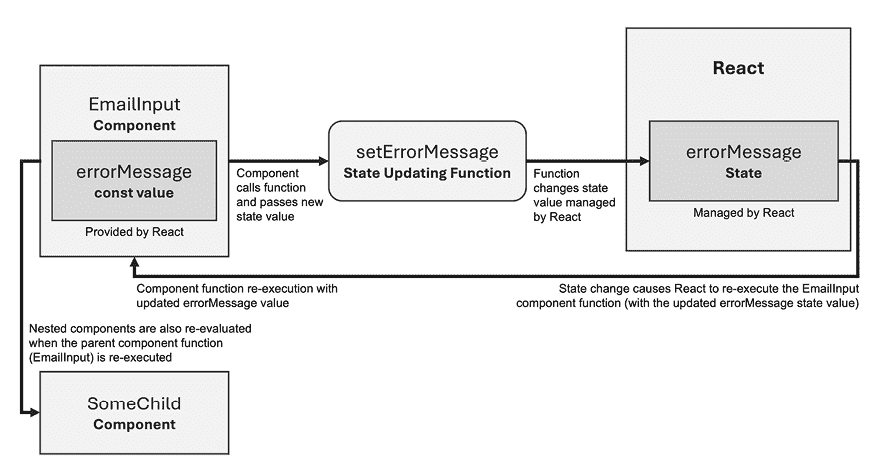
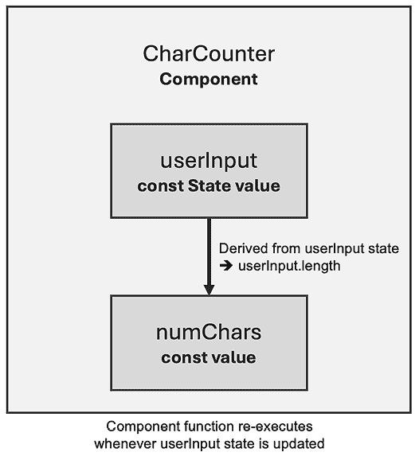

# 4

# 与事件和状态一起工作

学习目标

到本章结束时，你将能够做到以下几点：

+   向 React 应用添加用户事件处理器（例如，用于对按钮点击做出反应）

+   通过一个称为**状态**的概念来更新**用户界面**（**UI**）

+   构建真正的动态和交互式 UI（即它们不再是静态的）

# 简介

在前面的章节中，你学习了如何在 React **组件** 的帮助下构建 UI。你也了解了**属性**——这是一个概念和功能，它使 React 开发者能够构建和重用可配置的组件。

这些都是重要的 React 特性和构建块，但仅凭这些特性，你只能构建静态的 React 应用（即永远不会改变的 Web 应用）。如果你只能访问这些特性，你就无法更改或更新屏幕上的内容。你也不能对任何用户事件做出反应，并更新 UI 以响应这些事件（例如，在按钮点击时显示覆盖窗口）。

用其他的话说，如果你仅仅局限于组件和属性，你就无法构建真正的网站和 Web 应用。

因此，在本章中，引入了一个全新的概念：状态。状态是 React 的一个功能，允许开发者更新内部数据，并根据这些数据调整触发 UI 更新。此外，你还将学习如何对用户事件（如按钮点击或输入字段中输入的文本）做出反应。

# 问题是什么？

如前所述，在本书的这个阶段，你可能会遇到所有构建的 React 应用和网站的问题：它们是静态的。UI 无法改变。

为了更好地理解这个问题，看看一个典型的 React 组件，就像你现在能够构建到本书的这个阶段一样：

```js
function EmailInput() {
  return (
    <div>
      <input placeholder="Your email" type="email" />
      <p>The entered email address is invalid.</p>
    </div>
  );
}; 
```

这个组件可能看起来有点奇怪。为什么会有一个 `<p>` 元素通知用户关于不正确的电子邮件地址？

好吧，目标可能是只有在用户*确实*输入了不正确的电子邮件地址时才显示那个段落。也就是说，Web 应用应该等待用户开始输入，并在用户完成输入（即输入失去焦点）后评估用户输入。然后，如果电子邮件地址被认为无效（例如，空输入字段或缺少`@`符号），则应显示错误消息。

但目前，凭借到目前为止学到的 React 技能，这是你无法构建的。相反，错误消息总是会显示，因为没有方法可以根据用户事件和动态条件来更改它。换句话说，这个 React 应用是一个静态应用，不是动态的。UI 无法改变。

当然，改变 UI 和动态 Web 应用是你可能想要构建的事情。几乎每个存在的网站都包含一些动态 UI 元素和功能。因此，这就是本章要解决的问题。

## 如何不解决问题

如何使之前展示的组件更加动态？

以下是你可能想到的一个解决方案（*剧透*，这段代码将无法工作，所以你不需要尝试运行它）：

```js
function EmailInput() {
  return (
    <div>
      <input placeholder="Your email" type="email" />
      <p></p>
    </div>
  );
};
const input = document.querySelector('input');
const errorParagraph = document.querySelector('p');
function evaluateEmail(event) {
  const enteredEmail = event.target.value;
  if (enteredEmail.trim() === '' || !enteredEmail.includes('@')) {
    errorParagraph.textContent = ' The entered email address is invalid.';
  } else {
    errorParagraph.textContent = '';
  }
};
input.addEventListener('blur', evaluateEmail); 
```

这段代码将无法工作，因为你不能以这种方式从同一组件文件内部选择 React 渲染的 DOM 元素。这只是一个示例，说明你可以尝试如何解决这个问题。话虽如此，你可以在组件函数下方某个地方放置下面的代码，以便它能够成功执行（例如，放入`setTimeout()`回调函数中，在 1 秒后触发，允许 React 应用将所有元素渲染到屏幕上）。

将代码放在正确的位置，这段代码将添加本章前面描述的电子邮件验证行为。在内置的`blur`事件发生时，`evaluateEmail`函数被触发。这个函数接收`event`对象作为参数（由浏览器自动提供），因此`evaluateEmail`函数能够通过`event.target.value`解析从该`event`对象中输入的值。然后，可以使用`if`检查来有条件地显示或删除错误消息。

**注意**

所有处理`blur`事件（如`addEventListener`）和`event`对象的代码，包括`if`检查中的代码，都是标准的 JavaScript 代码。它以任何方式都不特定于 React。

如果你发现自己在这段非 React 代码上遇到了困难，强烈建议你首先深入研究更多纯 JavaScript 资源（例如，MDN 网站上的指南[`developer.mozilla.org/en-US/docs/Web/JavaScript`](https://developer.mozilla.org/en-US/docs/Web/JavaScript)）。

但如果这段代码在某些地方的工作正常，它有什么问题呢？

这是命令式代码！这意味着你正在写下浏览器应该按步骤执行的指令。你并没有声明所需的最终状态；相反，你描述了一种达到该状态的方式；而且这不是使用 React。

请记住，React 的全部内容都是关于控制 UI，编写 React 代码是关于编写声明式代码——而不是命令式代码。如果你觉得这一点听起来很新鲜，请重新阅读*第二章*，*理解 React 组件和 JSX*。

你可以通过引入这种类型的代码来实现你的目标，但你会与 React 及其哲学作对（React 的哲学是声明你的所需最终状态，让 React 找出如何达到那里）。一个明显的迹象是，你将被迫找到这种代码的正确位置，以便它能够工作。

这不是一个哲学问题，也不仅仅是一些奇怪的硬性规则，你应该遵循。相反，通过这样与 React 作对，你将使作为开发者的生活变得不必要地艰难。你既没有使用 React 提供的工具，也没有让 React 找出如何实现所需（UI）状态的方法。

这不仅意味着你花费时间解决你本不必解决的问题。这也意味着你放弃了 React 可能在底层执行的可能优化。你的解决方案很可能不仅导致你做更多的工作（也就是说，写更多的代码），还可能导致有缺陷的结果，也可能遭受性能不佳的问题。

之前展示的例子是一个简单的例子。想想更复杂的网站和 Web 应用，比如在线商店、度假租赁网站，或者像 Google Docs 这样的 Web 应用。在那里，你可能会有数十个或数百个（动态）UI 功能和元素。用 React 代码和标准 vanilla JavaScript 代码的混合来管理它们将很快变成一场噩梦。再次参考本书的*第二章，理解 React 组件和 JSX*，以了解 React 的优点。

## 更好的错误解决方案

之前讨论的简单方法效果不佳。它迫使你找出如何使代码正确运行（例如，通过将部分代码包裹在某个`setTimeout()`调用中以延迟执行）并导致你的代码四处散落（也就是说，在 React 组件函数内部，外部，也许也在完全不相关的文件中）。那么，一个拥抱 React 的解决方案如何呢？

```js
function EmailInput() {
  let errorMessage = '';
  function evaluateEmail(event) {
    const enteredEmail = event.target.value;
    if (enteredEmail.trim() === '' || !enteredEmail.includes('@')) {
      errorMessage = ' The entered email address is invalid.';
    } else {
      errorMessage = '';
    }
  };
  const input = document.querySelector('input');
  input.addEventListener('blur', evaluateEmail);
  return (
    <div>
      <input placeholder="Your email" type="email" />
      <p>{errorMessage}</p>
    </div>
  );
}; 
```

这段代码再次无法工作（尽管它在技术上有效的 JavaScript 代码）。选择 JSX 元素的方式不是这样的。它无法工作是因为`document.querySelector('input')`在将任何内容渲染到 DOM 之前执行（当组件函数第一次执行时）。再次强调，你必须将这段代码的执行延迟到第一次渲染周期结束（因此你又一次与 React 作对）。

尽管它仍然不会工作，但它更接近正确的解决方案。

它更接近理想的实现，因为它比第一次尝试的解决方案更多地采用了 React 的方式。所有代码都包含在它所属的组件函数中。错误信息通过一个作为 JSX 代码一部分输出的`errorMessage`变量来处理。

这个可能解决方案背后的想法是，控制某个 UI 功能或元素的 React 组件也负责其状态和事件。你可能会在这个章节中识别出两个重要的关键词！

这种方法肯定是在正确的方向上，但仍有两个原因它不会工作：

+   通过`document.querySelector('input')`选择 JSX `<input>`元素将失败。

+   即使输入可以被选择，UI 也不会按预期更新。

下一个将要解决这两个问题——最终实现一个完全拥抱 React 及其特性的实现。即将到来的解决方案将避免混合 React 和非 React 代码。正如你将看到的，结果将是更简单的代码，你不需要做更多的工作（也就是说，写更少的代码）。

## 通过正确响应事件改进解决方案

与将命令式 JavaScript 代码（如 `document.querySelector('input')`）与 React 特定代码混合相比，您应该完全拥抱 React 及其功能。

由于监听事件并在事件上触发动作是一个极其常见的需求，React 提供了一个内置的解决方案。您可以直接将事件监听器附加到它们所属的 JSX 元素上。

前面的示例将重写如下：

```js
function EmailInput() {
  let errorMessage = '';
  function evaluateEmail(event) {
    const enteredEmail = event.target.value;
    if (enteredEmail.trim() === '' || !enteredEmail.includes('@')) {
      errorMessage = 'The entered email address is invalid.';
    } else {
      errorMessage = '';
    }
  };
  return (
    <div>
      <input 
        placeholder="Your email" 
        type="email" 
        **onBlur****=****{evaluateEmail}** />
      <p>{errorMessage}</p>
    </div>
  );
}; 
```

此代码仍然不会更新 UI，但至少事件得到了适当的处理。

`onBlur` 属性被添加到内置的输入元素。这个属性是由 React 提供的，就像所有这些基础 HTML 元素（如 `<input>` 和 `<p>`）都是由 React 作为组件提供的。实际上，所有这些内置的 HTML 组件都带有它们的标准 HTML 属性作为 React 属性（加上一些额外的属性，如 `onBlur` 事件处理属性）。

React 将所有可以连接到 DOM 元素的标准事件都暴露为 `onXYZ` 属性（其中 `XYZ` 是事件名称，例如 `blur` 或 `click`，以大写字母开头）。您可以通过添加 `onBlur` 属性来响应 `blur` 事件。您可以通过 `onClick` 属性来监听 `click` 事件。您应该已经明白了。

**注意**

更多有关标准事件的信息，请参阅 [`developer.mozilla.org/en-US/docs/Web/Events#event_listing`](https://developer.mozilla.org/en-US/docs/Web/Events#event_listing)。

这些属性需要值来履行其职责。更准确地说，它们需要一个指向在事件发生时应执行的函数的指针。在上面的例子中，`onBlur` 属性接收一个指向 `evaluateEmail` 函数的指针作为值。

**注意**

`evaluateEmail` 和 `evaluateEmail()` 之间有一个细微的差别。前者是指向函数的指针；后者实际上执行了函数（如果有的话，则返回其返回值）。再次强调，这并不是 React 特有的，而是标准的 JavaScript 概念。如果还不清楚，这个资源可以更详细地解释它：[`developer.mozilla.org/en-US/docs/Web/Events#event_listing`](https://developer.mozilla.org/en-US/docs/Web/Events#event_listing)。

通过使用这些事件属性，前面的示例代码现在最终将执行而不会抛出任何错误。您可以通过在 `evaluateEmail` 函数内添加 `console.log('Hello');` 语句来验证这一点。这将显示 `'Hello'` 文本在浏览器开发者工具的控制台中，每当输入失去焦点时：

```js
function EmailInput() {
  let errorMessage = '';
  function evaluateEmail(event) {
    console.log('Hello');
    const enteredEmail = event.target.value;
    if (enteredEmail.trim() === '' || !enteredEmail.includes('@')) {
      errorMessage = 'The entered email address is invalid.';
    } else {
      errorMessage = '';
    }
  };
  return (
    <div>
      <input 
        placeholder="Your email" 
        type="email" 
        onBlur={evaluateEmail} />
      <p>{errorMessage}</p>
    </div>
  );
}; 
```

在浏览器控制台中，它看起来如下：


图 4.1：在从输入字段移除焦点时在浏览器控制台中显示一些文本

这确实是一个向最佳可能实现迈进的一步，但它仍然不会产生动态更新页面内容所需的结果。

# 正确更新状态

到现在为止，你已经了解了如何正确设置事件监听器并在某些事件上执行函数。缺少的是一种强制 React 更新屏幕上可见的 UI 和显示给应用用户的内容的特性。

正是 React 的**状态**概念在这里发挥作用。与 props 一样，状态是 React 的关键概念，但与 props 关于在组件内部接收外部数据不同，状态是关于管理和更新**内部数据**。最重要的是，每当状态更新时，React 都会更新受状态变化影响的 UI 部分。

在 React 中如何使用状态（当然，代码将在之后详细解释）：

```js
**import** **{ useState }** **from****'react'****;**
function EmailInput() {
  **const** **[errorMessage, setErrorMessage] =** **useState****(****''****);**
  function evaluateEmail(event) {
    const enteredEmail = event.target.value;
    if (enteredEmail.trim() === '' || !enteredEmail.includes('@')) {
      **setErrorMessage****(****'The entered email address is invalid.'****);**
    } else {
      **setErrorMessage****(****''****);**
    }
  };
  return (
    <div>
      <input 
        placeholder="Your email" 
        type="email" 
        onBlur={evaluateEmail} />
      <p>{errorMessage}</p>
    </div>
  );
}; 
```

与本章前面讨论的示例代码相比，这段代码看起来并没有太大的不同。但有一个关键的区别：`useState()` Hook 的使用。

**Hooks**是 React 的另一个关键概念。这些是只能在 React 组件内部（或在其他 Hooks 内部，如第十二章*构建自定义 React Hooks*所述）使用的特殊函数。Hooks 为它们所使用的 React 组件添加了特殊的功能和行为。例如，`useState()` Hook 允许组件（以及隐式地 React）设置和管理与该组件相关联的一些状态。React 提供了各种内置的 Hooks，它们并不都专注于状态管理。你将在本书中了解其他 Hooks 及其用途。

`useState()` Hook 是一个极其重要且常用的 Hook，因为它允许你在组件内部管理数据，当数据更新时，它会告诉 React 相应地更新 UI。

这就是状态管理和状态概念背后的核心思想：状态是数据，当它改变时，应该迫使 React 重新评估组件，并在需要时更新 UI。

使用 Hooks，如`useState()`，相当简单：你从`'react'`导入它们，然后在组件函数内部像调用函数一样调用它们。你像调用函数一样调用它们，因为如前所述，React Hooks 是函数——只是特殊的函数（从 React 的角度来看）。

## 深入了解 useState()

`useState()` Hook 究竟是如何工作的，它内部做了什么？

通过在组件函数内部调用`useState()`，你向 React 注册了一些数据。这有点像在纯 JavaScript 中定义一个变量或常量。但有一个特别之处：React 会内部跟踪注册的值，每当更新它时，React 都会重新评估注册状态的组件函数。

React 通过检查组件中使用的数据是否发生变化来完成此操作。最重要的是，React 验证 UI 是否需要因为数据的变化而更改（例如，因为 JSX 代码中输出了一个值）。如果 React 确定 UI 需要更改，它将更新需要更新的真实 DOM 中的位置（例如，更改屏幕上显示的文本）。如果不需要更新，React 将在更新 DOM 之前结束组件的重新评估。

React 的内部工作原理将在第十章 *React 和优化机会的幕后* 中详细讨论。

整个过程从在组件内部调用 `useState()` 开始。这创建了一个状态值（将由 React 存储和管理）并将其绑定到特定的组件。通过简单地将它作为参数值传递给 `useState()` 来注册初始状态值。在先前的例子中，一个空字符串（`''`）被注册为第一个值：

```js
const [errorMessage, setErrorMessage] = useState(''); 
```

如你所见，`useState()` 不仅接受一个参数值，它还返回一个值：一个包含恰好两个元素的数组。

先前的例子使用了 **数组解构**，这是 JavaScript 的一个标准特性，允许开发者从数组中检索值并将其立即分配给变量或常量。在例子中，组成 `useState()` 返回的数组的两个元素被从该数组中提取出来并存储在两个常量（`errorMessage` 和 `setErrorMessage`）中。尽管如此，在处理 React 或 `useState()` 时，你不必使用数组解构。

你也可以这样编写代码：

```js
const stateData = useState('');
const errorMessage = stateData[0];
const setErrorMessage = stateData[1]; 
```

这完全没问题，但使用数组解构时，代码会更加简洁。这就是为什么在浏览 React 应用和示例时，你通常看到使用数组解构的语法。你也不必使用常量；通过 `let` 的变量也可以。然而，正如你将在本章和本书的其余部分看到的那样，变量不会被重新赋值，因此使用常量是有意义的（但并非必须）。

**注意**

如果你对于数组解构或变量与常量的区别感到陌生，强烈建议你在继续阅读本书之前先复习一下 JavaScript 的基础知识。正如往常一样，MDN 提供了很好的资源（有关数组解构，请参阅 [`packt.link/3B8Ct`](http://packt.link/3B8Ct)，有关 `let` 变量的信息，请参阅 [`packt.link/hGjqL`](https://packt.link/hGjqL)，有关 `const` 的使用指南，请参阅 [`packt.link/TdPPS`](https://packt.link/TdPPS)）。

如前所述，`useState()` 返回一个包含恰好两个元素的数组。它总是恰好两个元素——并且总是同一种类的元素。第一个元素总是当前状态值，第二个元素是一个你可以调用的函数，用于将状态设置为新的值。

但这两个值（状态值和状态更新函数）是如何一起工作的呢？React 在内部如何使用它们？这两个数组元素是如何（由 React）用来更新 UI 的？

### 深入了解 React 的内部机制

React 为你管理状态值，在某个你，即开发者，无法直接访问的内部存储中。由于你经常需要访问状态值（例如，一些输入的电子邮件地址，如前例所示），React 提供了一种读取状态值的方法：`useState()`返回的数组中的第一个元素。返回数组的第一个元素包含当前状态值。因此，你可以在任何需要使用状态值的地方使用此元素（例如，在 JSX 代码中输出它）。

此外，你通常还需要更新状态——例如，因为用户输入了新的电子邮件地址。由于你无法自行管理状态值，React 提供了一个你可以调用的函数来通知 React 关于新的状态值。这就是返回数组中的第二个元素。

在前面显示的示例中，你调用`setErrorMessage('Error!')`来将`errorMessage`状态值设置为一个新的字符串（`'Error!'`）。

但为什么是这样管理的呢？为什么不直接使用一个标准的 JavaScript 变量，根据需要分配和重新分配呢？

因为每当有影响 UI 变化的状态时，React 都必须被告知。否则，可见的 UI 根本不会改变，即使在应该改变的情况下。React 不跟踪常规变量及其值的变化，因此它们对 UI 的状态没有影响。

React 暴露的状态更新函数（`useState()`返回的第二个数组元素）确实会触发一些内部 UI 更新效果。这个状态更新函数不仅设置了一个新值；它还通知 React 状态值已更改，因此 UI 可能需要更新。

因此，每次你调用`setErrorMessage('Error!')`时，React 不仅更新它内部存储的值；它还会检查 UI 并在需要时更新它。UI 更新可能涉及从简单的文本更改到各种 DOM 元素的完全删除和添加。任何情况都是可能的！

React 通过重新运行（也称为重新评估）受状态变化影响的任何组件函数来确定新的目标 UI。这包括执行了`useState()`函数并返回了状态更新函数的组件函数。但也包括任何子组件，因为父组件的更新可能会导致新的状态数据，这些数据也被某些子组件使用（状态值可以通过 props 传递给子组件）。

如果你需要一个如何将这些内容组合在一起的视觉表示，请考虑以下图表：



图 4.2：React 状态更新流程

重要的是理解和记住，如果在组件函数或某些父组件函数中调用了状态更新函数，React 将会重新执行（重新评估）组件函数。这也解释了为什么 `useState()` 返回的状态值（即第一个数组元素）可以是一个常量，尽管你可以通过调用状态更新函数（第二个数组元素）来分配新值。由于整个组件函数都会重新执行，`useState()` 也会再次被调用（因为所有组件函数的代码都会再次执行），因此 React 会返回一个新的包含两个新元素的数组。第一个数组元素仍然是当前的状态值。

然而，由于组件函数是因为状态更新而被调用的，当前的状态值现在是更新后的值。

这可能有点难以理解，但这就是 React 内部的工作方式。最终，这只是 React 多次调用组件函数，就像任何 JavaScript 函数都可以被多次调用一样。

#### 命名约定

`useState()` 钩子通常与数组解构一起使用，如下所示：

```js
const [enteredEmail, setEnteredEmail] = useState(''); 
```

但当使用数组解构时，变量或常量的名称（在这种情况下为 `enteredEmail` 和 `setEnteredEmail`）由你，即开发者来决定。因此，一个合理的问题是，你应该如何命名这些变量或常量。幸运的是，在 React 和 `useState()` 方面有一个明确的约定，以及这些变量或常量的命名。

**第一个元素**（即当前状态值）的命名应该能够描述状态值的内容。例如，可以是 `enteredEmail`、`userEmail`、`providedEmail`、仅仅是 `email` 或类似的名字。你应该避免使用通用名称，如 `a` 或 `value`，或者误导性的名称，如 `setValue`（听起来像是一个函数——但实际上不是）。

**第二个元素**（即状态更新函数）的命名应该能够清楚地表明它是一个函数，并且它执行了什么操作。例如，可以是 `setEnteredEmail` 或 `setEmail`。一般来说，这个函数的约定是命名为 `setXYZ`，其中 `XYZ` 是你为第一个元素，当前状态值变量所选择的名称。（注意，尽管如此，你应该以大写字母开头，就像 `setEnteredEmail` 而不是 `setenteredEmail`。）

#### 允许的状态值类型

管理输入的电子邮件地址（或一般用户输入）确实是处理状态的一个常见用例和示例。然而，你并不局限于这种场景和值类型。

在处理用户输入的情况下，你通常会处理诸如电子邮件地址、密码、博客文章或类似值的字符串。但任何有效的 JavaScript 值类型都可以通过 `useState()` 的帮助来管理。例如，你可以管理多个购物车项目的总价——即一个数字——或者一个布尔值（例如，“用户是否确认了使用条款？”）。

除了管理原始值类型外，你还可以存储和更新引用数据类型，如对象和数组。

**注意**

如果你对原始数据类型和引用数据类型之间的区别并不完全清楚，强烈建议你在继续阅读本书之前，通过以下链接深入了解这个核心 JavaScript 概念：[`academind.com/tutorials/reference-vs-primitive-values`](https://academind.com/tutorials/reference-vs-primitive-values)。

React 允许你将所有这些值类型作为状态来管理。你甚至可以在运行时切换值类型（就像在纯 JavaScript 中一样）。将数字作为初始状态值，并在稍后将其更新为字符串是完全没问题的。

就像在纯 JavaScript 中一样，当然你应该确保你的程序适当地处理这种行为，尽管在技术上切换类型并没有错误。

# 与多个状态值一起工作

当构建除了非常简单的 Web 应用或 UI 之外的应用时，你需要多个状态值。也许用户不仅能够输入他们的电子邮件，还可以输入用户名或地址。也许你还需要跟踪一些错误状态或保存购物车项目。也许用户可以点击一个“喜欢”按钮，其状态应该被保存并反映在 UI 上。有许多值会频繁变化，并且其变化应该在 UI 中体现出来。

考虑这个具体的场景：你有一个需要管理用户在电子邮件输入字段中输入的值和密码字段中插入的值的组件。每个值都应该在字段失去焦点时被捕获。

由于你有两个包含不同值的输入字段，因此你有两个状态值：输入的电子邮件和输入的密码。即使你可能在某个时刻使用这两个值（例如，用于登录用户），这些值并不是同时提供的。此外，你可能还需要每个值独立存在，因为你在用户输入数据时使用它来显示潜在的错误消息（例如，“密码太短”）。

这种情况非常常见，因此，你也可以使用`useState()` Hook 来管理多个状态值。主要有两种方法：

1.  使用多个**状态片段**（多个状态值）

1.  使用一个单一的、*大的*状态对象

## 使用多个状态片段

你可以通过在组件函数中多次调用`useState()`来管理多个状态值（也常被称为**状态片段**）。

对于之前描述的例子，一个（简化的）组件函数可能看起来像这样：

```js
function LoginForm() {
  const [enteredEmail, setEnteredEmail] = useState(''); 
  const [enteredPassword, setEnteredPassword] = useState('');
  function handleUpdateEmail(event) {
    setEnteredEmail(event.target.value);
  };
  function handleUpdatePassword(event) {
    setEnteredPassword(event.target.value);
  };
  // Below, props are split across multiple lines for better readability
  // This is allowed when using JSX, just as it is allowed in standard HTML
  return (
    <form>
      <input
        type="email"
        placeholder="Your email"
        onBlur={handleUpdateEmail} />
      <input
        type="password"
        placeholder="Your password"
        onBlur={handleUpdatePassword} />
    </form>
  );
}; 
```

在这个例子中，通过两次调用`useState()`来管理两个状态片段。因此，React 内部注册并管理两个状态值。这两个值可以独立于彼此进行读取和更新。

**注意**

在这个例子中，触发事件时调用的函数以 `handle` 开头（`handleUpdateEmail` 和 `handleUpdatePassword`）。这是一些 React 开发者使用的约定。事件处理函数以 `handle…` 开头，以清楚地表明这些函数处理某些（用户触发的）事件。这不是你必须遵循的约定。函数也可以命名为 `updateEmail`、`updatePassword`、`emailUpdateHandler`、`passwordUpdateHandler` 或其他任何名称。如果名称有意义并且遵循某些严格的约定，那么它是一个有效的选择。

你可以在组件中注册任意数量的状态切片（通过多次调用 `useState()`），以满足你的需要。你可能只有一个状态值，但也可能有几十个甚至几百个。通常情况下，你将只为每个组件拥有几个状态切片，因为你应该尝试将较大的组件（可能执行许多不同的操作）拆分成多个较小的组件，以保持其可管理性。

以这种方式管理多个状态值的优势在于你可以独立地更新它们。如果用户输入了一个新的电子邮件地址，你只需要更新那个电子邮件状态值。对于你的目的来说，密码状态值并不重要。

可能的缺点是，多个状态切片——因此是多个 `useState()` 调用——会导致大量的代码行，这可能会膨胀你的组件。然而，正如之前提到的，你通常应该尝试将大组件（处理许多不同的状态切片）拆分成多个较小的组件。

然而，管理多个状态值还有另一种选择：你也可以管理一个单一的、*合并的*状态值对象。

## 管理合并状态对象

而不是为每个单独的状态切片调用 `useState()`，你可以选择一个 *大的* 状态对象，它结合了所有不同的状态值：

```js
function LoginForm() {
  const [userData, setUserData] = useState({
    email: '',
    password: ''
  }); 
  function handleUpdateEmail(event) {
    setUserData({
      email: event.target.value,
      password: userData.password
    });
  };
  function handleUpdatePassword(event) {
    setUserData({
      email: userData.email,
      password: event.target.value
    });
  };
  // ... code omitted, because the returned JSX code is the same as before
}; 
```

在这个例子中，`useState()` 只被调用了一次（即只有一个状态切片），传递给 `useState()` 的初始值是一个 JavaScript 对象。该对象包含两个属性：`email` 和 `password`。属性名由你决定，但它们应该描述将存储在属性中的值。

`useState()` 仍然返回一个包含恰好两个元素的数组。初始值是一个对象并不会改变这一点。现在返回数组的第一个元素是一个对象，而不是一个字符串（正如之前展示的例子中那样）。正如之前提到的，当使用 `useState()` 时，可以使用任何有效的 JavaScript 值类型。原始值类型，如字符串或数字，可以像引用值类型（如对象或数组，技术上它们当然也是对象）一样使用。

状态更新函数（例如前一个示例中的 `setUserData`）仍然是 React 创建的函数，您可以调用它来将状态设置为新的值。尽管通常情况下您不需要再次将其设置为对象，但这通常是默认行为。除非您有充分的理由，否则在更新状态时不要更改值类型（尽管，技术上，您可以在任何时候切换到不同的类型）。

**注意**

在前一个示例中，使用状态更新函数的方式并不完全正确。它将工作，但它违反了推荐的最佳实践。您将在本章后面学习为什么这是这种情况以及如何使用状态更新函数。

在管理状态对象，如前一个示例所示，有一件至关重要的事情您必须记住：您必须始终设置对象包含的所有属性，即使是没有更改的属性。这是必需的，因为，在调用状态更新函数时，您“告诉”React 应该存储哪个新的状态值。

因此，您传递给状态更新函数的任何值都将覆盖之前存储的值。如果您提供一个只包含已更改属性的对象，所有其他属性都将丢失，因为上一个状态对象被新的一个替换，而新的对象包含的属性更少。

这是一个常见的陷阱，因此您必须注意这一点。因此，在前面示例中，未更改的属性被设置为上一个状态值——例如，`email: userData.email`，其中`userData`是当前状态快照，也是`useState()`返回的数组的第一个元素，同时将`password`设置为`event.target.value`。

您完全可以根据自己的喜好来管理一个状态值（即，将多个值组合在一起的对象）或多个状态切片（即，多个`useState()`调用）。没有正确或错误的方法，两种方法都有其优点和缺点。

然而，值得注意的是，您通常应该尝试将大型组件拆分成更小的组件。就像常规 JavaScript 函数不应该在单个函数中做太多工作（被认为是一种良好的实践，为不同的任务有单独的函数）一样，组件也应该专注于每个组件的一个或几个任务。而不是有一个巨大的`<App />`组件，该组件直接在一个组件中处理多个表单、用户身份验证和购物车，最好是将其代码拆分成多个较小的组件，然后将这些组件组合起来构建整个应用程序。

遵循那条建议时，大多数组件实际上不需要管理太多状态，因为管理许多状态值是组件做“太多工作”的指标。这就是为什么您可能会在每个组件中使用几个状态切片，而不是大型状态对象。

## 正确基于前一个状态更新状态

当学习对象作为状态值时，你了解到很容易不小心覆盖（并丢失）数据，因为你可能将新状态设置为只包含已更改属性的对象——而不是未更改的属性。这就是为什么在处理对象或数组作为状态值时，始终将现有属性和元素添加到新状态值中很重要的原因。

此外，通常，将状态值设置为基于前一个状态的新值（至少部分基于前一个状态）是一个常见任务。你可能将`password`设置为`event.target.value`，但也将`email`设置为`userData.email`，以确保存储的电子邮件地址不会因为更新整体状态的一部分（即，因为更新密码为新输入的值）而丢失。

但这并不是新状态值可能基于前一个状态的唯一场景。另一个例子是一个`counter`组件——例如，一个像这样的组件：

```js
function Counter() {
  const [counter, setCounter] = useState(0);
  function handleIncrement() {
    setCounter(counter + 1);
  };
  return (
    <>
      <p>Counter Value: {counter}</p>
      <button onClick={handleIncrement}>Increment</button>
    </>
  );
}; 
```

在这个例子中，为`<button>`元素注册了一个`click`事件处理程序（通过`onClick`属性）。每次点击时，计数器的状态值都会增加`1`。

这个组件可以正常工作，但示例代码片段中展示的代码实际上违反了一个重要的最佳实践和推荐：依赖于某些先前状态的状态更新应该通过传递给状态更新函数的函数来完成。更准确地说，示例应该这样重写：

```js
function Counter() {
  const [counter, setCounter] = useState(0);
  function handleIncrement() {
    setCounter(function(prevCounter) { return prevCounter + 1; });
    // alternatively, JS arrow functions could be used:
    // setCounter(prevCounter => prevCounter + 1);
  };
  return (
    <>
      <p>Counter Value: {counter}</p>
      <button onClick={handleIncrement}>Increment</button>
    </>
  );
}; 
```

这可能看起来有点奇怪。它可能看起来像是现在将一个函数作为新的状态值传递给了状态更新函数（即，`counter`中存储的数字被一个函数所替代）。但实际上并非如此。

技术上，确实是将一个函数作为参数传递给了状态更新函数，但 React 不会将这个函数存储为新状态值。相反，当状态更新函数接收到一个函数作为新的状态值时，React 会为你调用这个函数，并将最新的状态值传递给它。因此，你应该提供一个至少接受一个参数的函数：前一个状态值。这个值将由 React 在执行函数时（它将在内部执行）自动传递给函数。

这个函数应该返回一个值——React 应该存储的新状态值。此外，由于函数接收到了前一个状态值，你现在可以根据前一个状态值推导出新状态值（例如，通过将其与数字 1 相加，但这里可以执行任何操作）。

为什么在这次更改之前应用运行正常的情况下还需要这样做呢？这是因为，在更复杂的 React 应用和 UI 中，React 可能会同时处理多个状态更新——这些更新可能来自不同的来源，在不同的时间触发。

当**不**使用上一段中讨论的方法时，状态更新的顺序可能不是预期的，并且可能会在应用中引入错误。即使你知道你的用例不会受到影响，并且应用在没有问题的状态下完成其工作，也建议简单地遵循讨论过的最佳实践，并在新状态依赖于前一个状态时将函数传递给状态更新函数。

在心中牢记这一新获得的知识，再看看之前的代码示例：

```js
function LoginForm() {
  const [userData, setUserData] = useState({
    email: '',
    password: ''
  }); 
  function handleUpdateEmail(event) {
    setUserData({
      email: event.target.value,
      password: userData.password
    });
  };
  function handleUpdatePassword(event) {
    setUserData({
      email: userData.email,
      password: event.target.value
    });
  };
  // ... code omitted, because the returned JSX code is the same as before
}; 
```

你能在这段代码中找到错误吗？

这不是一个技术错误；代码将正常执行，应用将按预期工作。但尽管如此，这段代码还是有问题。它违反了讨论过的最佳实践。在代码片段中，两个处理函数中的状态都是通过`userData.password`和`userData.email`分别引用当前状态快照来更新的。

代码片段应该这样重写：

```js
function LoginForm() {
  const [userData, setUserData] = useState({
    email: '',
    password: ''
  }); 
  function handleUpdateEmail(event) {
    setUserData(prevData => ({
      email: event.target.value,
      password: prevData.password
    }));
  };
  function handleUpdatePassword(event) {
    setUserData(prevData => ({
      email: prevData.email,
      password: event.target.value
    }));
  };
  // ... code omitted, because the returned JSX code is the same as before
  // userData is not actively used here, hence you could get a warning
  // regarding that. Simply ignore it or start using userData
  // (e.g., via console.log(userData))
}; 
```

通过将箭头函数作为`setUserData`的参数传递，你允许 React 调用该函数。React 会自动这样做（也就是说，如果它在这一点上收到一个函数，React 会调用它），并且它会自动提供前一个状态（`prevState`）。然后返回的值（存储更新后的`email`或`password`以及当前存储的`email`或`password`的对象）被设置为新的状态。在这种情况下，结果可能与之前相同，但现在代码遵循了推荐的最佳实践。

**注意**

在之前的例子中，使用了箭头函数而不是“常规”函数。两种方法都很好，你可以使用这两种函数类型中的任何一种；结果将是相同的。

总结来说，如果你新状态依赖于前一个状态，你应该始终将函数传递给状态更新函数。否则，如果新状态依赖于其他值（例如，用户输入），直接将新状态值作为函数参数传递是完全没问题且推荐的。

## 双向绑定

值得讨论的是 React 状态概念的一个特殊用法：**双向绑定**。

双向绑定是一个概念，如果你有一个输入源（通常是`<input>`元素），它在用户输入时（例如，在`change`事件上）设置一些状态，并同时输出输入。

这里有一个例子：

```js
function NewsletterField() {
  const [email, setEmail] = useState('');
  function handleUpdateEmail(event) {
    setEmail(event.target.value);
  };
  return (
    <>
      <input
        type="email"
        placeholder="Your email address"
        value={email}
        onChange={handleUpdateEmail} />
    </>    
  );
}; 
```

与其他代码片段和示例相比，这里的区别在于组件不仅仅在`change`事件（在这种情况下）上存储用户输入，而且输入的值还会在之后的`<input>`元素中输出（通过默认的`value`属性）。

这可能看起来像是一个无限循环，但 React 会处理这种情况，确保它不会变成一个无限循环。相反，这通常被称为双向绑定，因为值既从同一源设置又从同一源读取。

你可能会想知道为什么这个问题在这里被讨论，但重要的是要知道，编写这样的代码是完全有效的。此外，如果你不仅想在 `<input>` 字段的用户输入时设置值（在这个例子中，是 `email` 值），还希望从其他来源设置值，这种代码可能是必要的。例如，你可能有一个按钮在组件中，当点击时，应该清除输入的电子邮件地址。

它可能看起来像这样：

```js
function NewsletterField() {
  const [email, setEmail] = useState('');
  function handleUpdateEmail(event) {
    setEmail(event.target.value);
  };
  function handleClearInput() {
    setEmail(''); // reset email input (back to an empty string)
  };
  return (
    <>
      <input
        type="email"
        placeholder="Your email address"
        value={email}
        onChange={handleUpdateEmail} />
      <button onClick={handleClearInput}>Reset</button>
    </>
  );
}; 
```

在这个更新的示例中，当点击 `<button>` 时会执行 `handleClearInput` 函数。在函数内部，`email` 状态被设置回空字符串。如果没有双向绑定，状态会更新，但变化不会反映在 `<input>` 元素上。在那里，用户仍然会看到他们最后的输入。UI（网站）上反映的状态和 React 内部管理的状态将不同——这是一个绝对必须避免的错误。

# 从状态中推导值

如你至今可能已经注意到的，状态是 React 中的一个关键概念。状态允许你管理数据，当数据改变时，它会迫使 React 重新评估组件，并最终更新 UI。

作为开发者，你可以在组件的任何地方（以及通过 props 将状态传递给子组件）使用状态值。例如，你可以像这样重复用户输入的内容：

```js
function Repeater() {
  const [userInput, setUserInput] = useState('');
  function handleChange(event) {
    setUserInput(event.target.value);
  };
  return (
    <>
      <input type="text" onChange={handleChange} />
      <p>You entered: {userInput}</p>
    </>
  );
}; 
```

这个组件可能不是非常有用，但它会工作，并且它确实使用了状态。

通常，为了做更有用的事情，你需要使用状态值作为基础来推导一个新的（通常是更复杂的）值。例如，你不仅可以简单地重复用户输入的内容，还可以计算输入的字符数，并将该信息显示给用户：

```js
function CharCounter() {
  const [userInput, setUserInput] = useState('');
  function handleChange(event) {
    setUserInput(event.target.value);
  };
  const numChars = userInput.length;
  return (
    <>
      <input type="text" onChange={handleChange} />
      <p>Characters entered: {numChars}</p>
    </>
  );
}; 
```

注意新添加的 `numChars` 常量（它也可以通过 `let` 变量）。这个常量是通过访问存储在 `userInput` 状态中的字符串值的 `length` 属性来从 `userInput` 状态推导出来的。

这很重要！你不仅限于只与状态值一起工作。你可以将某些关键值作为状态（即会改变的值）来管理，并基于该状态值推导其他值——例如，在这个例子中，用户输入的字符数。实际上，作为 React 开发者，你将经常这样做。

你可能还在想为什么 `numChars` 是一个常量，并且位于 `handleChange` 函数之外。毕竟，那是用户输入时（即用户每次按键时）执行的功能。

请记住你学到的关于 React 如何处理内部状态的知识。当你调用状态更新函数（在这个例子中是 `setUserInput`）时，React 会重新评估属于该状态组件。这意味着 React 会再次调用 `CharCounter` 组件函数。因此，该函数中的所有代码都会再次执行。



图 4.3：当组件函数再次执行时，numChars 值是从状态中派生出来的

React 会重新执行组件函数以确定在状态更新后 UI 应该是什么样子；如果它检测到与当前渲染 UI 的差异，React 将相应地更新浏览器 UI（即 DOM）。否则，不会发生任何事。

由于 React 会再次调用组件函数，`useState()`将产生其值数组（当前状态值和状态更新函数）。当前状态值将是`setUserInput`被调用时设置的状态。因此，这个新的`userInput`值可以在组件函数的任何地方使用来执行其他计算——例如，通过访问`userInput`的`length`属性来推导`numChars`（如*图 4.3*所示）。

因此，`numChars`可以是一个常量。对于此组件执行，它不会被重新分配。只有在组件函数在未来再次执行时（即如果再次调用`setUserInput`），才可能派生新的值。在这种情况下，将创建一个新的`numChars`常量（而旧的将被丢弃）。

## 与表单和表单提交一起工作

在处理表单和用户输入时，通常使用状态。实际上，本章中的大多数示例都涉及某种形式的用户输入。

到目前为止，所有示例都集中在监听直接附加到单个输入元素的用户事件上。这很有意义，因为你会经常想要监听诸如按键或输入失去焦点等事件。特别是当添加输入验证（即检查输入值）时，你可能想使用输入事件在用户输入时提供有用的反馈。

但对整体表单提交做出反应也是很常见的。例如，目标可能是将来自各个输入字段的输入组合起来，并将数据发送到某个后端服务器。你该如何实现这一点？你该如何监听并响应表单的提交？

你可以在标准 JavaScript 事件和 React 提供的适当事件处理属性的帮助下完成所有这些操作。具体来说，可以将`onSubmit`属性添加到`<form>`元素中，以分配一个在表单提交时应执行的功能。为了使用 React 和 JavaScript 处理提交，你必须确保浏览器不会执行其默认操作并自动生成（并发送）HTTP 请求。

与纯 JavaScript 一样，这可以通过在自动生成的事件对象上调用`preventDefault()`方法来实现。

下面是一个完整的示例：

```js
function NewsletterSignup() {
  const [email, setEmail] = useState('');
  const [agreed, setAgreed] = useState(false);
  function handleUpdateEmail(event) {
    // could add email validation here
    setEmail(event.target.value);
  };
  function handleUpdateAgreement(event) {
    setAgreed(event.target.checked); // checked is a default JS boolean property
  };
  function handleSignup(event) {
    event.preventDefault(); // prevent browser default of sending a Http request
    const userData = {userEmail: email, userAgrees: agreed};
    // doWhateverYouWant(userData);
  };
  return (
    <form onSubmit={handleSignup}>
      <div>
        <label htmlFor="email">Your email</label>
        <input type="email" id="email" onChange={handleUpdateEmail}/>
      </div>
      <div>
        <input type="checkbox" id="agree" onChange={handleUpdateAgreement}/>
        <label htmlFor="agree">Agree to terms and conditions</label>
      </div>
    </form>
  );
}; 
```

这个代码片段通过将`handleSignup()`函数分配给内置的`onSubmit`属性来处理表单提交。用户输入仍然通过两个状态片段（`email`和`agreed`）获取，这些状态片段在输入更改事件发生时更新。

**注意**

在前面的代码示例中，你可能注意到了一个之前在这本书中没有使用过的新属性：`htmlFor`。这是一个特殊的属性，它是 React 及其提供的核心 JSX 元素内置的。它可以添加到`<label>`元素中，以便为这些元素设置`for`属性。之所以称为`htmlFor`而不是仅仅`for`，是因为，正如本书前面所解释的，JSX 看起来像 HTML，但实际上不是 HTML。它是底层的 JavaScript。在 JavaScript 中，`for`是一个用于`for`循环的保留关键字。为了避免问题，因此将属性命名为`htmlFor`。

使用`onSubmit`（结合`preventDefault()`）处理表单提交是处理 React 中用户输入和表单的一种非常常见的方式。但是，当你在使用 React 19 或更高版本的项目上工作时，你也可以使用另一种处理表单提交的方法：你可以使用一个称为**表单操作**的 React 功能，这将在第九章*使用表单操作处理用户输入和表单*中详细讨论。

## 提升状态

这是一个常见的场景和问题：在你的 React 应用程序中有两个组件，组件 A 中的更改或事件应该改变组件 B 中的状态。为了使这个问题更具体，考虑以下简单的例子：

```js
function SearchBar() {
  const [searchTerm, setSearchTerm] = useState('');
  function handleUpdateSearchTerm(event) {
    setSearchTerm(event.target.value);
  };
  return <input type="search" onChange={handleUpdateSearchTerm} />;
};
function Overview() {
  return <p>Currently searching for {searchTerm}</p>;
};
function App() {
  return (
    <>
      <SearchBar />
      <Overview />
    </>
  );
}; 
```

在这个例子中，`Overview`组件应该输出输入的搜索词。然而，搜索词实际上是在另一个组件中管理的——即`SearchBar`组件。在这个简单的例子中，当然可以将这两个组件合并成一个单独的组件，问题也就解决了。但在构建更现实的应用程序时，你可能会遇到类似的场景，但组件会更复杂。将组件拆分成更小的部分被认为是良好的实践，因为它保持了各个组件的可管理性。

因此，在处理 React 时，多个组件依赖于某些共享的状态是一个你将经常遇到的场景。

这个问题可以通过*提升状态*来解决。当提升状态时，状态不是在两个使用它的组件中管理——既不在读取状态的`Overview`组件中，也不在设置状态的`SearchBar`组件中——而是在一个共享的祖先组件中。更准确地说，它是在**最近的**共享祖先组件中管理的。记住，组件是嵌套的，因此最终会构建出一个“组件树”（其中`App`组件是根组件）。


图 4.4：一个示例组件树

在前面的简单代码示例中，`App`组件是`SearchBar`和`Overview`两个组件最近的（在这个例子中，也是唯一的）祖先组件。如果应用程序的结构如图所示，状态设置在一个`Product`组件中并在`Cart`中使用，`Products`将是最近的祖先组件。

通过在需要操作（即设置）或读取状态的组件中使用属性，以及通过在两个其他组件共享的祖先组件中注册状态，来提升状态。以下是之前更新的示例：

```js
function SearchBar({onUpdateSearch}) {
  return <input type="search" onChange={onUpdateSearch} />;
};
function Overview({currentTerm}) {
  return <p>Currently searching for {currentTerm}</p>;
};
function App() {
  const [searchTerm, setSearchTerm] = useState('');
  function handleUpdateSearchTerm(event) {
    setSearchTerm(event.target.value);
  };
  return (
    <>
      <SearchBar onUpdateSearch={handleUpdateSearchTerm} />
      <Overview currentTerm={searchTerm} />
    </>
  );
}; 
```

代码实际上并没有改变多少；它主要只是移动了一下位置。现在状态是在共享的祖先和`App`组件内部管理的，而其他两个组件通过属性访问它。

在这个例子中有三个关键的事情发生：

1.  `SearchBar`组件接收一个名为`onUpdateSearch`的属性，其值是一个函数——这是一个在`App`组件中创建并从`App`传递到`SearchBar`的函数。

1.  然后，将`onUpdateSearch`属性设置为`SearchBar`组件内部`<input>`元素的`onChange`属性的值。

1.  `searchTerm`状态（即其当前值）通过名为`currentTerm`的属性从`App`传递到`Overview`。

前两点可能有些令人困惑。但请记住，在 JavaScript 中，函数是一等对象和常规值。你可以将函数存储在变量中，并在使用 React 时，将函数作为属性值传递。实际上，你已经在本章的开头看到了这一点。在介绍事件和事件处理时，函数被作为值传递给了所有这些`onXYZ`属性（`onChange`、`onBlur`等等）。

在这个代码片段中，一个函数被作为自定义属性（即，你创建的组件中期望的属性，而不是 React 内置的属性）的值传递。`onUpdateSearch`属性期望一个函数作为值，因为该属性本身被用作`<input>`元素上的`onChange`属性的值。

该属性被命名为`onUpdateSearch`，以使其明确期望一个函数作为值，并且它将被连接到事件。当然，可以选择任何名称；它不必以`on`开头。但这是一个常见的约定，为期望函数作为值并且打算连接到类似事件的属性命名。

当然，`updateSearch`不是一个默认事件，但由于该函数将在`<input>`元素的`change`事件上被调用，因此该属性的行为就像一个自定义事件。

使用这种结构，状态被提升到了`App`组件。该组件注册并管理状态。然而，它还通过`handleUpdateSearchTerm`函数（在这种情况下，间接地）将状态更新函数暴露给`SearchBar`组件。它还通过`currentTerm`属性将当前状态值（`searchTerm`）传递给`Overview`组件。

由于子组件和后代组件在组件状态变化时也会被 React 重新评估，因此`App`组件的变化也会导致`SearchBar`和`Overview`组件被重新评估。因此，`searchTerm`的新属性值将被获取，React 将通过 UI 更新。

对于此操作不需要新的 React 功能。这只是一个状态和 props 的组合。然而，根据这些功能如何连接以及它们在哪里使用，可以实现简单和更复杂的 app 模式。

# 概括和要点

+   可以通过`on[EventName]`属性（例如，`onClick`，`onChange`）将事件处理器添加到 JSX 元素中。

+   任何函数都可以在（用户）事件上执行。

+   为了强制 React 重新评估组件和（可能）更新渲染的 UI，必须使用状态。

+   状态是指 React 内部管理的数据，可以通过`useState()` Hook 定义状态值。

+   React Hooks 是 JavaScript 函数，它们为 React 组件添加特殊功能（例如，本章中的状态功能）。

+   `useState()`总是返回一个包含恰好两个元素的数组：

    +   **第一个元素**是当前状态值。

    +   **第二个元素**是一个将状态设置为新的值（即*状态更新函数*）的函数。

+   当设置状态为新值，该值依赖于前一个值时，应将一个函数传递给状态更新函数。然后，该函数接收前一个状态作为参数（将由 React 自动提供）并返回应设置的新状态。

+   任何有效的 JavaScript 值都可以设置为状态——除了字符串或数字等原始值。这还包括对象和数组等引用值。

+   如果状态需要因为另一个组件中发生的事件而改变，你应该*提升状态*并在更高、共享的级别（即公共祖先组件）上管理它。

## 接下来是什么？

状态是一个极其重要的构建块，因为它使你能够构建真正动态的应用程序。在这个关键概念解决之后，下一章将深入探讨利用状态（以及迄今为止学到的其他概念）来条件性地渲染内容和渲染内容列表。

这些是在几乎任何你正在构建的 UI 或 Web 应用中都需要执行的任务，无论它是关于显示警告覆盖层还是显示产品列表。下一章将帮助你向你的 React 应用添加这些功能。

## 测试你的知识！

通过回答以下问题来测试你对本章涵盖的概念的了解。然后你可以将你的答案与可以在[`github.com/mschwarzmueller/book-react-key-concepts-e2/blob/04-state-events/exercises/questions-answers.md`](https://github.com/mschwarzmueller/book-react-key-concepts-e2/blob/04-state-events/exercises/questions-answers.md)找到的示例进行比较。

1.  状态解决了哪个“问题”？

1.  props 和状态之间的区别是什么？

1.  状态是如何在组件中注册的？

1.  `useState()` Hook 提供了哪些值？

1.  单个组件可以注册多少个状态值？

1.  状态是否也会影响其他组件（而不仅仅是注册状态的组件）？

1.  如果新状态依赖于前一个状态，应该如何更新状态？

1.  怎样才能在多个组件之间共享状态？

# 应用所学知识

在本章中获得的新知识使你最终能够构建真正动态的 UI 和 React 应用程序。现在，你不再局限于硬编码的静态内容和页面，可以使用状态来设置和更新值，并强制 React 重新评估组件和 UI。

在这里，你可以找到一个活动，让你应用到目前为止所获得的所有知识，包括新的状态知识。

## 活动四.1：构建简单计算器

在这个活动中，你将构建一个非常基本的计算器，允许用户将两个数字相加、相减、相乘和相除。

步骤如下：

1.  使用 React 组件构建 UI。确保为四个数学运算构建四个单独的组件，即使有很多代码可以复用。

1.  当用户在两个相关输入字段之一中输入值时，收集用户输入并更新结果。

注意，当与数字打交道并从用户输入中获取这些数字时，你需要确保输入的值被当作数字处理，而不是字符串。

计算器的最终结果和 UI 应该看起来像这样：


图 4.5：计算器 UI

**注意**

样式当然会有所不同。要获得截图中所显示的相同样式，请使用我准备的起始项目，你可以在这里找到：[`github.com/mschwarzmueller/book-react-key-concepts-e2/tree/04-state-events/activities/practice-1-start`](https://github.com/mschwarzmueller/book-react-key-concepts-e2/tree/04-state-events/activities/practice-1-start)。

分析那个项目中的`index.css`文件，以确定如何结构化你的 JSX 代码来应用样式。

**注意**

你可以在这里找到完整的示例解决方案：[`github.com/mschwarzmueller/book-react-key-concepts-e2/tree/04-state-events/activities/practice-1`](https://github.com/mschwarzmueller/book-react-key-concepts-e2/tree/04-state-events/activities/practice-1)。

## 活动四.2：增强计算器

在这个活动中，你将基于*活动 4.1*来构建一个稍微复杂一点的计算器。目标是减少组件数量，并构建一个单组件，用户可以通过下拉元素选择数学运算。此外，结果应该输出到不同的组件中——也就是说，不是在收集用户输入的组件中。

步骤如下：

1.  从上一个活动中移除四个组件中的三个，并使用一个单组件来处理所有数学运算。

1.  在剩余的组件（两个输入之间）添加一个下拉元素（`<select>`元素），并将四个数学运算作为选项（`<option>`元素）添加到其中。

1.  使用状态来收集用户输入的数字和通过下拉菜单选择的数学运算（是否喜欢一个单一的状态对象或多个状态片段由你决定）。

1.  在另一个组件中输出结果。（提示：选择一个合适的地方来注册和管理状态。）

计算器的结果和 UI 应该看起来像这样：


图 4.6：增强计算器的 UI

**注意**

你可以在这里找到完整的示例解决方案：[`github.com/mschwarzmueller/book-react-key-concepts-e2/tree/04-state-events/activities/practice-2`](https://github.com/mschwarzmueller/book-react-key-concepts-e2/tree/04-state-events/activities/practice-2) .
