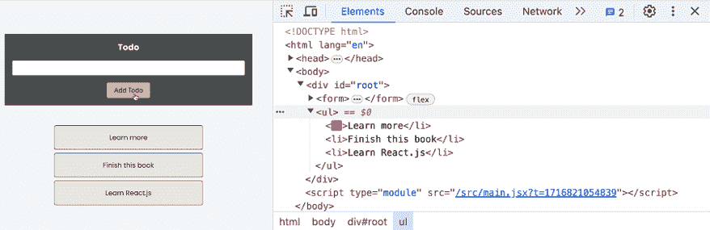

# 5

# 渲染列表和条件内容

学习目标

到本章结束时，你将能够做到以下几件事情：

+   条件输出动态内容

+   渲染数据列表并将列表项映射到 JSX 元素

+   优化列表，以便 React 在需要时能够高效地更新用户界面

# 简介

到这本书的这一部分，你已经熟悉了几个关键概念，包括组件、属性、状态和事件，这些是构建各种不同 React 应用和网站所需的所有核心工具。你也已经学会了如何将动态值和结果作为用户界面的一部分输出。

然而，有两个与输出动态数据相关的话题尚未深入讨论：条件输出内容和渲染列表数据。由于你构建的大多数（如果不是所有）网站和 Web 应用都将需要这两个概念中的至少一个，因此了解如何处理条件内容和列表数据至关重要。

因此，在本章中，你将学习如何根据动态条件渲染和显示不同的用户界面元素（甚至整个用户界面部分）。此外，你还将学习如何输出数据列表（如待办事项列表及其条目）并动态渲染构成列表的 JSX 元素。本章还将探讨与输出列表和条件内容相关的重要最佳实践。

# 条件内容和列表数据是什么？

在深入研究输出条件内容或列表数据的技巧之前，了解这些术语的确切含义非常重要。

条件内容简单来说就是任何只在特定情况下应该显示的内容。以下是一些示例：

+   仅在用户在表单中提交错误数据时显示的错误覆盖层

+   用户选择输入额外详细信息（如业务详情）时出现的附加表单输入字段

+   在向或从后端服务器发送或获取数据时显示的加载旋转器

+   当用户点击菜单按钮时滑入视图的侧导航菜单

这只是一个包含几个示例的非常简短的列表。当然，你可以想出数百个额外的例子。但最终应该清楚所有这些示例都是关于什么的：仅在满足某些条件时才显示的视觉元素或用户界面的整个部分。

在第一个示例（错误覆盖层）中，条件是用户在表单中输入了错误数据。然后，条件显示的内容将是错误覆盖层。

条件内容非常常见，因为几乎所有的网站和 Web 应用都有一些与前面示例相似或可比的内容。

除了条件性内容外，许多网站还会输出数据列表。这不一定总是立即明显，但如果你仔细想想，几乎没有任何网站不显示某种类型的列表数据。再次，这里有一些可能在网站上输出的列表数据的例子：

+   显示产品网格或列表的在线商店

+   显示活动列表的活动预订网站

+   显示购物车中商品列表的购物车

+   显示订单列表的订单页面

+   显示博客文章列表——以及可能位于博客文章下方的评论列表

+   页眉中的导航项列表

一个没有恶意的无尽列表（例子）可以在这里创建。列表在网络上无处不在。正如前面的例子所示，许多（可能甚至大多数）网站在同一网站上都有多个列表，包含各种类型的数据。

以一个在线商店为例。在这里，你会有一个产品列表（或者一个网格，实际上它只是另一种列表形式），购物车商品列表，订单列表，页眉中的导航项列表，以及当然还有很多其他的列表。这就是为什么了解如何在 React 驱动的用户界面中输出任何类型的数据的任何类型的列表变得非常重要。

# 条件性渲染内容

想象以下场景。你有一个按钮，点击后应该显示一个额外的文本框，如下所示：


图 5.1：最初，屏幕上只显示按钮

点击按钮后，另一个框被显示：


图 5.2：点击按钮后，信息框被显示

这是一个非常简单的例子，但并非不切实际。许多网站的用户界面部分都像这样工作。在按钮点击（或类似交互）时显示额外信息是一种常见模式。只需想想食品订单网站上餐点下方的营养成分信息或是在选择问题后显示答案的常见问题解答部分。

那么，这个场景如何在 React 应用中实现呢？

如果你忽略了渲染某些内容条件性的要求，整个 React 组件可能看起来像这样：

```js
function TermsOfUse() {
  return (
    <section>
      <button>Show Terms of Use Summary</button>
      <p>By continuing, you accept that we will not indemnify you for any
      damage or harm caused by our products.</p>
    </section>
  );
} 
```

这个组件中完全没有条件性代码，因此按钮和额外的信息框总是显示出来。

在这个例子中，如何有条件地显示包含使用条款摘要文本的段落（即，仅在按钮点击后显示）？

通过前面章节中获得的知识，特别是*第四章*，*处理事件和状态*，你已经拥有了在按钮点击后仅显示文本所需的所有技能。以下代码显示了组件如何被重写，以便仅在按钮点击后显示完整文本：

```js
import { useState } from 'react';

function TermsOfUse() {
  const [showTerms, setShowTerms] = useState(false);
  function handleShowTermsSummary() {
    setShowTerms(true);
  }
  let paragraphText = '';
  if (showTerms) {
    paragraphText = 'By continuing, you accept that we will not indemnify you for any damage or harm caused by our products.';
  }
  return (
    <section>
      <button onClick={handleShowTermsSummary}>
         Show Terms of Use Summary
      </button>
      <p>{paragraphText}</p>
    </section>
  );
} 
```

在此代码片段中显示的代码部分已经符合条件内容的资格。`paragraphText`值是根据存储在`showTerms`状态中的值有条件地设置的，借助一个`if`语句。

然而，`<p>`元素本身实际上**不是**条件性的。它始终存在，无论它包含一个完整的句子还是一个空字符串。如果你打开浏览器开发者工具并检查该页面的该区域，你会看到一个空的段落元素，如下面的图所示：


图 5.3：一个空的段落元素作为 DOM 的一部分被渲染

在 DOM 中保留那个空的`<p>`元素并不是理想的做法。虽然它对用户来说是不可见的，但它是一个需要浏览器渲染的额外元素。性能影响可能非常小，但仍然是你应该避免的事情。网页不会从包含无内容的空元素中受益。

您可以将关于条件值（例如段落文本）的知识翻译成条件元素。除了在变量中存储标准值，如文本或数字外，您还可以在变量中存储 JSX 元素。这是因为，如*第一章*，*React – What and Why*中提到的，JSX 只是一种语法糖。在幕后，一个 JSX 元素是一个由 React 执行的标准 JavaScript 函数。当然，函数调用的返回值也可以存储在变量或常量中。

考虑到这一点，以下代码可以用来有条件地渲染整个段落：

```js
import { useState } from 'react';
function TermsOfUse() {
  const [showTerms, setShowTerms] = useState(false);
  function handleShowTermsSummary() {
    setShowTerms(true);
  }
  let paragraph;
  if (showTerms) {
    paragraph = <p>By continuing, you accept that we will not indemnify you for any damage or harm caused by our products.</p>;
  }
  return (
    <section>
      <button onClick={handleShowTermsSummary}>
         Show Terms of Use Summary
      </button>
      {paragraph}
    </section>
  );
} 
```

在这个例子中，如果`showTerms`为`true`，`paragraph`变量不存储文本，而是存储一个完整的 JSX 元素（`<p>`元素）。在返回的 JSX 代码中，存储在`paragraph`变量中的值通过`{paragraph}`动态输出。如果`showTerms`为`false`，`paragraph`存储的值为`undefined`，并且不会将任何内容渲染到 DOM 中。因此，在 JSX 代码中插入`null`或`undefined`会导致 React 不输出任何内容。但如果`showTerms`为`true`，整个段落作为一个值保存并输出到 DOM 中。

这就是如何动态渲染整个 JSX 元素的方法。当然，你不仅限于单个元素。你可以在变量或常量中存储整个 JSX 树结构（如多个、嵌套或兄弟 JSX 元素）。作为一个简单的规则，任何可以由组件函数返回的内容都可以存储在变量中。

## 有条件地渲染内容的不同方式

在前面显示的示例中，内容是通过使用变量有条件地渲染的，该变量通过`if`语句设置，然后在 JSX 代码中动态输出。这是一种常见的（并且完全可行的）有条件渲染内容的技术，但并不是你唯一可以使用的方案。

或者，你也可以这样做：

+   利用三元表达式。

+   *滥用* JavaScript 逻辑运算符。

+   使用任何其他有效的 JavaScript 条件选择值的方式。

以下各节将详细探讨每种方法。

### 利用三元表达式

在 JavaScript（以及许多其他编程语言）中，你可以使用 **三元表达式**（也称为 **条件三元运算符**）作为 `if` 语句的替代。三元表达式可以节省代码行数，尤其是在简单条件中，主要目标是条件性地分配一些变量值。

这里是一个直接的比较——首先从一个普通的 `if` 语句开始：

```js
let a = 1;
if (someCondition) {
  a = 2;
} 
```

这里是相同的逻辑，使用三元表达式实现：

```js
const a = someCondition ? 2 : 1; 
```

这段代码是标准的 JavaScript 代码，并非特定于 React。然而，理解这个核心 JavaScript 功能对于理解如何在 React 应用程序中使用它非常重要。

将其翻译到先前的 React 示例中，段落内容可以通过以下三元表达式有条件地设置和输出：

```js
import { useState } from 'react';
function TermsOfUse() {
  const [showTerms, setShowTerms] = useState(false);
  function handleShowTermsSummary() {
    setShowTerms(true);
  }
  const paragraph = showTerms ? <p>By continuing, you accept that we will not indemnify you for any damage or harm caused by our products.</p> : null;
  return (
    <section>
      <button onClick={handleShowTermsSummary}>
         Show Terms of Use Summary
      </button>
      {paragraph}
    </section>
  );
} 
```

正如你所见，整体代码比之前使用 `if` 语句时更短。段落常量包含段落（包括文本内容）或 `null`。`null` 被用作替代值，因为 `null` 可以安全地插入到 JSX 代码中，它只会导致在该位置不渲染任何内容。

三元表达式的一个缺点是可读性和可理解性可能会受到影响——尤其是在使用嵌套的三元表达式时，如下面的例子所示：

```js
const paragraph = !showTerms ? null : someOtherCondition ? <p>By continuing, you accept that we will not indemnify you for any damage or harm caused by our products.</p> : null; 
```

这段代码难以阅读，甚至更难以理解。因此，通常你应该避免编写嵌套的三元表达式，并在这种情况下回退到 `if` 语句。

然而，尽管存在这些潜在的缺点，三元表达式可以帮助你在 React 应用程序中编写更少的代码，尤其是在内联使用时，直接在某个 JSX 代码内部：

```js
import { useState } from 'react';
function TermsOfUse() {
  const [showTerms, setShowTerms] = useState(false);
  function handleShowTermsSummary() {
    setShowTerms(true);
  }
  return (
    <section>
      <button onClick={handleShowTermsSummary}>
        Show Terms of Use Summary
      </button>
      {showTerms ? <p>By continuing, you accept that we will not indemnify you for any damage or harm caused by our products.</p> : null}
    </section>
  );
} 
```

这与之前的例子相同，但现在它更短，因为在这里你通过在 JSX 片段中直接使用三元表达式来避免使用 `paragraph` 常量。这使得组件代码相对简洁，因此在 React 应用程序中，在 JSX 代码中使用三元表达式以利用这一点是非常常见的。

### 滥用 JavaScript 逻辑运算符

三元表达式之所以受欢迎，是因为它们允许你编写更少的代码，当在正确的地方使用（并避免嵌套多个三元表达式）时，可以帮助提高整体的可读性。

尤其是在 React 应用程序中，在 JSX 代码中你经常会写出类似这样的三元表达式：

```js
<div>
  {showDetails ? <h1>Product Details</h1> : null}
</div> 
```

或者，像这样：

```js
<div>
  {showTerms ? <p>Our terms of use …</p> : null}
</div> 
```

这两个代码片段有什么共同之处？

它们是不必要的长，因为在两个例子中，即使它对最终用户界面没有任何贡献，也必须指定 else 情况（`: null`）。毕竟，这些三元表达式的首要目的是渲染 JSX 元素（在先前的例子中是 `<h1>` 和 `<p>`）。else 情况（`: null`）仅仅意味着如果条件（`showDetails` 和 `showTerms`）不满足，则不渲染任何内容。

这就是为什么在 React 开发者中流行另一种模式：

```js
<div>
  {showDetails && <h1>Product Details</h1>}
</div> 
```

这是实现预期结果的最短方式，如果`showDetails`是`true`，则仅渲染`<h1>`元素及其内容。

此代码使用（或滥用）了 JavaScript 逻辑运算符的一个有趣的行为，特别是`&&`（逻辑与）运算符。在 JavaScript 中，如果第一个值（即`&&`前面的值）是`true`或真值（即不是`false`、`undefined`、`null`、`0`等），则`&&`运算符返回第二个值（即`&&`后面的值）。通常，你会在`if`语句或三元表达式中使用`&&`运算符。然而，当与 React 和 JSX 一起工作时，你可以利用前面描述的行为有条件地输出真值。这种技术也称为**短路**。

例如，以下代码将输出`'Hello'`：

```js
console.log(1 === 1 && 'Hello'); 
```

这种行为可以用来编写非常短的检查条件并输出另一个值的表达式，如前例所示。

**注意**

值得注意的是，如果你使用非布尔条件值（即`&&`前面的值持有非布尔值）与`&&`一起使用，可能会导致意外结果。如果`showDetails`是`0`而不是`false`（无论什么原因），屏幕上会显示数字`0`。因此，你应该确保作为条件的值产生`null`或`false`而不是任意假值。例如，你可以通过添加`!!`（例如，`!!showDetails`）强制转换为布尔值。如果你的条件值已经持有`null`或`false`，则不需要这样做。

### 发挥创意！

到目前为止，你已经学习了三种不同的定义和有条件输出内容的方法（常规`if`语句、三元表达式和使用`&&`运算符）。然而，最重要的观点是 React 代码最终只是常规 JavaScript 代码。因此，任何选择条件值的方案都将有效。

如果在你的特定用例和 React 应用中合理，你也可以有一个组件，它像这样有条件地选择和输出内容：

```js
const languages = {
  de: 'de-DE',
  us: 'en-US',
  uk: 'en-GB'
};
function LanguageSelector({country}) {
  return <p>Selected Language: {languages[country]}</p>
} 
```

该组件根据`country`属性的值输出`'de-DE'`、`'en-US'`或`'en-GB'`。这个结果是通过使用 JavaScript 的动态属性选择语法实现的。你不需要通过点符号选择特定的属性（例如`person.name`），而是可以通过括号符号选择属性值。使用这种符号，你可以传递一个特定的属性名（`languages['de-DE']`）或者一个产生属性名的表达式（`languages[country]`）。

以这种方式动态选择属性值是选择值从值映射中的另一种常见模式。因此，它是指定多个`if`语句或三元表达式的替代方案。

此外，通常你可以使用任何在标准 JavaScript 中有效的方法——因为毕竟 React 在其核心上只是标准 JavaScript。

### 哪种方法最好？

已经讨论了各种设置和有条件输出内容的方法，但哪种方法最好？

这完全取决于你（如果适用，还有你的团队）。最重要的优缺点已经突出显示，但最终，这是你的决定。如果你更喜欢三元表达式，选择它们而不是逻辑`&&`运算符也没有什么不妥。

这也将取决于你试图解决的特定问题。如果你有一个值的映射（例如国家列表及其国家语言代码），选择动态属性选择而不是多个`if`语句可能更可取。另一方面，如果你有一个单一的`true`/`false`条件（例如`age > 18`），使用标准的`if`语句或逻辑`&&`运算符可能最好。

## 有条件地设置元素标签

有条件地输出内容是一个非常常见的场景。但有时，你也会想要选择将要输出的 HTML 标签的类型。通常情况下，这会在你构建主要任务是对内置组件进行包装和增强的组件时发生。

这里有一个例子：

```js
function Button({isButton, config, children}) {
  if (isButton) {
    return <button {...config}>{children}</button>;
  }
  return <a {...config}>{children}</a>;
}; 
```

这个`Button`组件检查`isButton`属性值是否为真值，如果是这样，就返回一个`<button>`元素。`config`属性预期是一个 JavaScript 对象，并且使用标准的 JavaScript 扩展运算符（`...`）将`config`对象的所有键值对作为属性添加到`<button>`元素。如果`isButton`不是真值（可能是因为没有为`isButton`提供值，或者值是`false`），则`else`条件变为活动状态。而不是`<button>`元素，返回一个`<a>`元素。

**注意**

使用扩展运算符（`...`）将对象的属性（键值对）转换为组件属性是另一个常见的 React 模式（并在*第三章*，*组件和属性*中介绍）。扩展运算符不是一个 React 特定的运算符，但用于这个特殊目的*是*。

当将类似于`{link: 'https://some-url.com', isButton: false}`的对象扩展到`<a>`元素上（通过`<a {...obj}>`），结果将与所有属性单独设置时相同（即`<a link="https://some-url.com" isButton={false}>`）。

这种模式在构建自定义*包装组件*的情况下特别受欢迎，这些组件包装一个常见的核心组件（例如`<button>`、`<input>`或`<a>`）以添加某些样式或行为，同时仍然允许组件以与内置组件相同的方式使用（即，你可以设置所有默认属性）。

上一示例中的`Button`组件根据`isButton`属性值的差异返回两个完全不同的 JSX 元素。这是一种检查条件并返回不同内容（即条件内容）的好方法。

然而，通过使用特殊的 React 行为，这个组件可以用更少的代码编写：

```js
function Button({isButton, config, children}) {
  const Tag = isButton ? 'button' : 'a';
  return <Tag {...config}>{children}</Tag>;
}; 
```

特殊行为在于可以将标签名（作为字符串值）存储在变量或常量中，然后这些变量或常量可以在 JSX 代码中用作 JSX 元素（只要变量或常量的名称以大写字母开头，就像所有你的自定义组件一样）。

上一示例中的`Tag`常量存储的是`'button'`或`'a'`字符串。由于它以大写字母开头（`Tag`，而不是`tag`），因此它可以在 JSX 代码片段中用作自定义组件。React 将其接受为一个组件，即使它不是一个组件函数。这是因为存储了一个标准的 HTML 元素标签名，所以 React 可以渲染相应的内置组件。相同的模式也可以用于自定义组件。不是存储字符串值，而是通过以下方式存储指向你的自定义组件函数的指针：

```js
import MyComponent from './my-component.jsx';
import MyOtherComponent from './my-other-component.jsx';
const Tag = someCondition ? MyComponent : MyOtherComponent; 
```

这是一种非常有用的模式，可以帮助节省代码，从而使得组件更加精简。

# 输出列表数据

除了输出条件数据外，你还会经常处理需要在页面上输出的列表数据。如本章前面所述，一些例子包括产品列表、交易和导航项。

通常，在 React 应用中，此类列表数据以值的数组形式接收。例如，一个组件可能通过 props（从可能从后端 API 获取数据的另一个组件内部传递到组件中）接收产品数组：

```js
function ProductsList({products}) {
  // … todo!
}; 
```

在这个例子中，产品数组可能看起来像这样：

```js
const products = [
  {id: 'p1', title: 'A Book', price: 59.99},
  {id: 'p2', title: 'A Carpet', price: 129.49},
  {id: 'p3', title: 'Another Book', price: 39.99},
]; 
```

然而，数据不能这样输出。相反，通常的目标是将它转换成适合的 JSX 元素列表。例如，期望的结果可能是以下这样：

```js
<ul>
  <li>
    <h2>A Book</h2>
    <p>$59.99</p>
  </li>
  <li>
    <h2>A Carpet</h2>
    <p>$129.49</p>
  </li>
  <li>
    <h2>Another Book</h2>
    <p>$39.99</p>
  </li>
</ul> 
```

如何实现这种转换？

再次强调，忽略 React 并找到一种使用标准 JavaScript 转换列表数据的方法是个好主意。实现这一目标的一种可能方式是使用`for...of`循环，如下所示：

```js
const transformedProducts = [];
for (const product of products) {
  transformedProducts.push(product.title);
} 
```

在这个例子中，产品对象列表（`products`）被转换成产品标题列表（即字符串值的列表）。这是通过遍历`products`中的所有产品项并从每个产品中提取`title`属性来实现的。然后，这个`title`属性值被推入新的`transformedProducts`数组中。

可以使用类似的方法将对象列表转换成 JSX 元素列表：

```js
const productElements = [];
for (const product of products) {
  productElements.push((
    <li>
      <h2>{product.title}</h2>
      <p>${product.price}</p>
    </li>
  ));
} 
```

第一次看到这样的代码时，可能会觉得有点奇怪。但请记住，JSX 代码可以在任何可以使用常规 JavaScript 值（即数字、字符串、对象等）的地方使用。因此，你也可以将 JSX 值 `push` 到一个值数组中。由于它是 JSX 代码，你还可以在那些 JSX 元素中动态输出内容（例如 `<h2>{product.title}</h2>`）。

这段代码是有效的，并且是输出列表数据的重要第一步。但这是第一步，因为当前的数据已经进行了转换，但还没有通过组件返回。

那么这样的 JSX 元素数组是如何返回的呢？

答案是它可以不使用任何特殊技巧或代码而返回。实际上，JSX 接受数组值作为动态输出的值。

你可以这样输出 `productElements` 数组：

```js
return (
  <ul>
    {productElements}
  </ul>
); 
```

当将 JSX 元素数组插入到 JSX 代码中时，该数组内的所有 JSX 元素都会相邻输出。因此，以下两个代码片段会产生相同的输出：

```js
return (
  <div>
    {[<p>Hi there</p>, <p>Another item</p>]}
  </div>
);
return (
  <div>
    <p>Hi there</p>
    <p>Another item</p>
  </div>
); 
```

考虑到这一点，`ProductsList` 组件可以写成这样：

```js
function ProductsList({products}) {
  const productElements = [];
  for (const product of products) {
    productElements.push((
      <li>
        <h2>{product.title}</h2>
        <p>${product.price}</p>
      </li>
    ));
  }
  return (
    <ul>
      {productElements}
    </ul>
  );
}; 
```

这是输出列表数据的一种可能方法。正如本章前面所解释的，这完全关于使用标准的 JavaScript 功能，并将这些功能与 JSX 结合起来。

然而，这并不一定是 React 应用中输出列表数据最常见的方式。在大多数项目中，你会遇到不同的解决方案。

## 映射列表数据

使用 `for` 循环输出列表数据是可行的，正如前面示例中所见。然而，就像 `if` 语句和三元表达式一样，你可以用替代语法替换 `for` 循环，以编写更少的代码并提高组件的可读性。

JavaScript 提供了一个内置的数组方法，可以用来转换数组项：`map()` 方法。`map()` 是一个默认方法，可以在任何 JavaScript 数组上调用。它接受一个函数作为参数，并为每个数组项执行该函数。该函数的返回值应该是转换后的值。`map()` 然后将所有这些返回的转换值组合成一个新的数组，然后由 `map()` 返回这个新数组。

你可以这样使用 `map()`：

```js
const users = [
  {id: 'u1', name: 'Max', age: 35},
  {id: 'u2', name: 'Anna', age: 32}
];
const userNames = users.map(user => user.name);
// userNames = ['Max', 'Anna'] 
```

在这个例子中，`map()` 被用来将用户对象数组转换成用户名数组（即字符串值数组）。

`map()` 方法通常可以用更少的代码产生与 `for` 循环相同的结果。

因此，`map()` 也可以用来生成一个 JSX 元素数组，以及之前提到的 `ProductsList` 组件，可以重写如下：

```js
function ProductsList({products}) {
  const productElements = products.map(product => (
      <li>
        <h2>{product.title}</h2>
        <p>${product.price}</p>
      </li>
    )
  );
  return (
    <ul>
      {productElements}
    </ul>
  );
}; 
```

这已经比之前的 `for` 循环示例更短了。然而，就像三元表达式一样，代码可以通过将逻辑直接移动到 JSX 代码中来进一步缩短：

```js
function ProductsList({products}) {
  return (
    <ul>
      {products.map(product => (
          <li>
            <h2>{product.title}</h2>
            <p>${product.price}</p>
          </li>
        )
      )}
    </ul>
  );
}; 
```

根据转换的复杂性（即传递给 `map()` 方法的内部函数中执行的代码的复杂性），出于可读性的原因，你可能想要考虑不使用这种 *内联* 方法（例如，当将数组元素映射到某些复杂的 JSX 结构或在进行映射过程中的额外计算时）。最终，这取决于个人偏好和判断。

由于它非常简洁，使用 `map()` 方法（无论是通过额外的变量或常量，还是直接在 JSX 代码中 *内联*）是 React 应用和 JSX 中输出列表数据的既定标准方法。

## 更新列表

想象一下，你有一个数据列表映射到 JSX 元素，并在某个时刻添加了一个新的列表项。或者，考虑一个场景，其中你有一个列表，其中两个列表项交换了位置（即列表被重新排序）。如何将这些更新反映在 DOM 中？

好消息是，如果你以有状态的方式（即使用 React 的状态概念，如第四章中解释的 *工作与事件和状态*）执行更新，React 会为你处理这些。

然而，在更新（有状态的）列表时，有几个重要的方面你应该注意。

这里有一个简单的例子，它**不会**按预期工作：

```js
import { useState } from 'react';
function Todos() {
  const [todos, setTodos] = useState(['Learn React', 'Recommend this book']);
  function handleAddTodo() {
    todos.push('A new todo');
  };
  return (
    <div>
      <button onClick={handleAddTodo}>Add Todo</button>
      <ul>
        {todos.map(todo => <li>{todo}</li>)}
      </ul>
    </div>
  );
}; 
```

初始时，屏幕上会显示两个待办事项（`<li>学习 React</li>` 和 `<li>推荐这本书</li>`）。但是一旦点击按钮并执行 `handleAddTodo`，预期显示另一个待办事项的结果将不会实现。

这是因为执行 `todos.push('一个新的待办事项')` 会更新 `todos` 数组，但 React 不会注意到这一点。请记住，你必须只通过 `useState()` 返回的状态更新函数来更新状态；否则，React 不会重新评估组件函数。

那么，这个代码怎么样：

```js
function handleAddTodo() {
  setTodos(todos.push('A new todo'));
}; 
```

这也是不正确的，因为状态更新函数（在这个例子中是 `setTodos`）应该接收新的状态（即应该设置的状态）作为参数。然而，`push()` 方法不会返回更新后的数组。相反，它会原地修改现有的数组。即使 `push()` 会返回更新后的数组，使用前面的代码仍然是不正确的，因为状态更新函数执行之前，数据（在幕后）已经被改变（修改）。由于数组是对象，因此是引用数据类型，技术上，数据会在通知 React 之前被改变。遵循 React 的最佳实践，应该避免这种情况。

因此，在更新数组（或者，作为一个旁注，一般对象）时，你应该以**不可变**的方式（即不改变原始数组或对象）进行更新。相反，应该创建一个新的数组或对象。这个新数组可以基于旧数组，并包含所有旧数据，以及任何新的或更新的数据。

因此，`todos`数组应该这样更新：

```js
function handleAddTodo() {
  setTodos(curTodos => [...curTodos, 'A new todo']);
  // alternative: Use concat() instead of the spread operator:
  // concat(), unlike push(), returns a new array
  // setTodos(curTodos => curTodos.concat('A new todo'));
}; 
```

通过使用`concat()`或新数组，结合扩展运算符，可以为状态更新函数提供一个全新的数组。注意，由于新状态依赖于前一个状态，因此将函数传递给状态更新函数。

当更新数组（或任何对象）状态值时，React 能够检测到这些变化。因此，React 将重新评估组件函数，并将任何必要的更改应用到 DOM 上。

**注意**

不变性不是一个 React 特有的概念，但在 React 应用中它仍然是一个关键概念。当与状态和引用值（即对象和数组）一起工作时，不变性对于确保 React 能够检测到变化以及没有“不可见”的（即不被 React 识别）状态变化执行至关重要。

更新对象和数组的不变性的方法有很多，但一种流行的方法是创建新的对象或数组，然后使用扩展运算符（`...`）将现有数据合并到这些新的数组或对象中。

## 列表项的问题

如果你正在跟随自己的代码，并且按照前几节所述输出列表数据，你可能已经注意到 React 实际上在浏览器开发者工具控制台中显示了一个警告，如下面的截图所示：


图 5.4：React 有时会生成关于缺少唯一键的警告

React 正在抱怨缺少键。

要理解这个警告和键背后的理念，探索一个特定的用例和该场景的潜在问题是有帮助的。假设你有一个负责显示项目列表的 React 组件——可能是一个待办事项列表。此外，假设这些列表项可以重新排序，并且列表可以通过其他方式编辑（例如，可以添加新项，更新或删除现有项等）。换句话说，列表不是静态的。

考虑这个示例用户界面，其中向待办事项列表中添加了一个新项：


图 5.5：通过在顶部插入新项来更新列表

在前面的图中，你可以看到最初渲染的列表（*1*），然后在用户输入并提交新的待办事项值后更新（*2*）。一个新的待办事项被添加到列表的顶部（即列表的第一个项目）(*3*)。

**注意**

这个演示应用的示例源代码可以在[`github.com/mschwarzmueller/book-react-key-concepts-e2/tree/05-lists-conditional-code/examples/02-keys`](https://github.com/mschwarzmueller/book-react-key-concepts-e2/tree/05-lists-conditional-code/examples/02-keys)找到。

如果你在这个应用上工作并打开浏览器开发者工具（然后是 JavaScript 控制台），你会看到之前提到的“缺少键”警告。这个应用也有助于理解这个警告的来源。

在 Chrome DevTools 中，导航到**元素**选项卡并选择一个待办项或空待办列表（即`<ul>`元素）。一旦添加一个新的待办项，任何插入或更新的 DOM 元素都会在**元素**选项卡中由 Chrome 突出显示（通过短暂闪烁）。参考以下截图：


图 5.6：更新的 DOM 项在 Chrome DevTools 中被突出显示

有趣的是，不仅新添加的待办元素（即新插入的`<li>`元素）会闪烁。相反，**所有**现有的`<li>`元素，即使它们反映的待办项没有变化，也会被 Chrome 突出显示。这表明所有这些其他的`<li>`元素在 DOM 中也被更新了——尽管没有必要进行这种更新。这些项之前就存在，它们的内容（待办文本）并没有改变。

由于某种原因，React 似乎会销毁现有的 DOM 节点（即现有的`<li>`项），然后立即重新创建它们。这发生在列表中添加的每个新待办项上。正如你可能想象的那样，这并不非常高效，可能会为渲染多个列表中数十或数百项的更复杂的应用程序造成性能问题。

这是因为 React 无法知道只有一个 DOM 节点应该被插入。它无法判断所有其他 DOM 节点是否应该保持不变，因为 React 只收到了一个新的状态值：一个新的数组，其中填充了新的 JavaScript 对象。即使这些对象的内容没有改变，它们在技术上仍然是新的对象（内存中的新值）。

作为开发者，你知道你的应用是如何工作的，以及待办数组的内容实际上并没有发生太多变化。但是 React 并不知道这一点。因此，React 确定所有现有的列表项（`<li>`元素）都必须被丢弃，并由反映新提供的数据（作为状态更新的部分）的新项所替换。这就是为什么每次状态更新时，所有与列表相关的 DOM 节点都会被更新（即销毁并重新创建）。

### 键的拯救！

之前概述的问题是一个非常常见的问题。大多数列表更新都是增量更新，而不是批量更改。但是 React 无法判断你的用例和你的列表是否属于这种情况。

这就是为什么 React 在处理列表数据和渲染列表项时使用**键**的概念。键只是可以（并且应该）在渲染列表数据时附加到 JSX 元素上的唯一标识符值。键帮助 React 识别之前渲染且未更改的元素。通过允许对所有列表元素进行唯一标识，键还帮助 React 有效地移动（列表项）DOM 元素。

通过特殊的内置`key`属性将键添加到 JSX 元素中，该属性被每个组件接受：

```js
<li key={todo.id}>{todo.text}</li> 
```

这个特殊的属性可以添加到所有组件中，无论是内置的还是自定义的。你不需要在你的自定义组件中以任何方式接受或处理 `key` 属性；React 会自动为你处理。

`key` 属性需要一个对每个列表项都是唯一的值。没有任何两个列表项应该有相同的键。此外，良好的键直接附加到构成列表项的底层数据。因此，列表项索引是较差的键，因为索引没有附加到列表项数据。如果你在列表中重新排列项目，索引将保持不变（数组始终从索引 `0` 开始，然后是 `1`，依此类推），但数据会发生变化。

考虑以下示例：

```js
const hobbies = ['Sports', 'Cooking'];
const reversed = hobbies.reverse(); // ['Cooking', 'Sports'] 
```

在这个例子中，`'Sports'` 在 `hobbies` 数组中的索引是 `0`。在 `reversed` 数组中，它的索引将是 `1`（因为它现在是第二个项目）。在这种情况下，如果使用索引作为键，数据将不会附加到它上。

良好的键是唯一的 `id` 值，每个 `id` 只对应一个值。如果该值移动或被删除，其 `id` 应该随之移动或消失。

通常找到良好的 `id` 值并不是一个大问题，因为大多数列表数据都是从数据库中获取的。无论你是在处理产品、订单、用户还是购物车项，这些数据通常都会存储在数据库中。这种数据已经具有唯一的 `id` 值，因为你在将数据存储在数据库中时始终有一些唯一的识别标准。

有时，值本身也可以用作键。考虑以下示例：

```js
const hobbies = ['Sports', 'Cooking']; 
```

爱好是 `string` 类型的值，并且没有唯一的 `id` 值附加到个别爱好上。每个爱好都是一个原始值（一个 `string`）。然而，在这种情况下，你通常不会有重复的值，因为在这个数组中列出爱好一次以上是没有意义的。因此，这些值本身就符合良好的键的条件：

```js
hobbies.map(hobby => <li key={hobby}>{hobby}</li>); 
```

在无法使用值本身且没有其他可能的键值的情况下，你可以在你的 React 应用代码中直接生成唯一的 `id` 值。作为最后的手段，你也可以回退到使用索引；但请注意，如果你重新排列列表项，这可能会导致意外的错误和副作用。

在列表项元素中添加键后，React 能够正确地识别所有项目。当组件状态发生变化时，它能够识别之前已经渲染的 JSX 元素。因此，这些元素不再被销毁或重新创建。

你可以通过再次打开浏览器 DevTools 来确认，检查在底层列表数据发生变化时哪些 DOM 元素被更新：



图 5.7：从多个列表项中，只有一个是 DOM 元素被更新

添加键后，在更新列表状态时，只有新的 DOM 项在 Chrome DevTools 中被突出显示。其他项被 React （正确地）忽略。

# 摘要和关键要点

+   与任何其他 JavaScript 值一样，JSX 元素可以根据不同的条件动态设置和更改。

+   内容可以通过`if`语句、三元表达式、逻辑“与”运算符（`&&`）或任何在 JavaScript 中可行的其他方式来设置条件。

+   处理条件内容有多种方法——任何在纯 JavaScript 中可行的方案也可以在 React 应用中使用。

+   JSX 元素数组可以被插入到 JSX 代码中，这将导致数组元素作为同级 DOM 元素被输出。

+   列表数据可以通过`for`循环、`map()`方法或任何其他导致类似转换的 JavaScript 方法转换为 JSX 元素数组。

+   使用`map()`方法是将列表数据转换为 JSX 元素列表的最常见方式。

+   （通过`key`属性）应该将键添加到列表 JSX 元素中，以帮助 React 高效地更新 DOM。

## 接下来是什么？

通过条件内容和列表，你现在拥有了构建简单和更复杂用户界面所需的所有关键工具，使用 React 你可以根据需要隐藏和显示元素或元素组，并且可以动态渲染和更新元素列表以输出产品列表、订单或用户列表。

当然，这并不是构建真实用户界面所需的所有内容。添加动态更改内容的逻辑是一回事，但大多数 Web 应用还需要应用于各种 DOM 元素的 CSS 样式。本书不涉及 CSS，但下一章仍将探讨 React 应用如何被样式化。特别是当涉及到动态设置和更改样式或将样式范围限定到特定组件时，有各种 React 特定的概念，每个 React 开发者都应该熟悉。

## 测试你的知识！

通过回答以下问题来测试你对本章涵盖的概念的了解。然后你可以将你的答案与可以在[`github.com/mschwarzmueller/book-react-key-concepts-e2/blob/05-lists-conditional-code/exercises/questions-answers.md`](https://github.com/mschwarzmueller/book-react-key-concepts-e2/blob/05-lists-conditional-code/exercises/questions-answers.md)找到的示例进行比较。：

1.  “条件内容”是什么？

1.  至少列举两种渲染 JSX 元素的条件方式。

1.  哪种优雅的方法可以用来条件性地定义元素标签？

1.  仅使用三元表达式（对于条件内容）的潜在缺点是什么？

1.  如何将数据列表渲染为 JSX 元素？

1.  为什么应该在渲染的列表项中添加键？

1.  分别给出一个良好和不良键的示例。

# 应用你所学的知识

你现在能够使用你的 React 知识以各种方式改变动态用户界面。除了能够更改显示的文本值和数字之外，你现在也可以隐藏或显示整个元素（或元素块）并显示数据列表。

在以下章节中，你将找到两个活动，这些活动允许你应用你新获得的知识（结合在其他书籍章节中获得的知识）。

## 活动 5.1：显示条件错误消息

在这个活动中，你将构建一个基本表单，允许用户输入他们的电子邮件地址。在表单提交后，用户输入应该被验证，无效的电子邮件地址（为了简单起见，这里指的是不包含`@`符号的电子邮件地址）应该导致在表单下方显示错误消息。当无效的电子邮件地址变为有效时，可能可见的错误消息应该再次被移除。

执行以下步骤以完成此活动：

1.  构建一个包含标签、输入字段（文本类型——为了演示目的，使输入错误的电子邮件地址更容易）和提交按钮的用户界面，该按钮会导致表单提交。

1.  收集输入的电子邮件地址，如果电子邮件地址不包含`@`符号，则在表单下方显示错误消息。

最终用户界面应该看起来和工作方式如下所示：


图 5.8：此活动的最终用户界面

**注意**

样式当然会有所不同。要获得截图中所显示的相同样式，请使用我准备的起始项目，你可以在这里找到：[`github.com/mschwarzmueller/book-react-key-concepts-e2/tree/05-lists-conditional-code/activities/practice-1-start`](https://github.com/mschwarzmueller/book-react-key-concepts-e2/tree/05-lists-conditional-code/activities/practice-1-start)。

分析该项目的`index.css`文件，以确定如何结构化你的 JSX 代码以应用样式。

**注意**

你可以在这里找到完整的示例解决方案：[`github.com/mschwarzmueller/book-react-key-concepts-e2/tree/05-lists-conditional-code/activities/practice-1`](https://github.com/mschwarzmueller/book-react-key-concepts-e2/tree/05-lists-conditional-code/activities/practice-1)。

## 活动 5.2：输出产品列表

在这个活动中，你将构建一个用户界面，其中在屏幕上显示产品列表（（虚拟）产品）。界面还应包含一个按钮，当点击时，将另一个新的（虚拟）项目添加到现有的产品列表中。

执行以下步骤以完成此活动：

1.  将一组虚拟产品对象（每个对象应具有 ID、标题和价格）添加到 React 组件中，并添加代码以输出这些产品项作为 JSX 元素。

1.  向用户界面添加一个按钮。当按钮被点击时，应该向产品数据列表中添加一个新的产品对象。这应该导致用户界面更新并显示更新后的产品元素列表。

最终用户界面应该看起来和工作方式如下所示：


图 5.9：此活动的最终用户界面

**注意**

当然，样式会有所不同。要获得与截图相同的样式，请使用我准备的起始项目，您可以在以下链接找到：[`github.com/mschwarzmueller/book-react-key-concepts-e2/tree/05-lists-conditional-code/activities/practice-2-start`](https://github.com/mschwarzmueller/book-react-key-concepts-e2/tree/05-lists-conditional-code/activities/practice-2-start) .

分析该项目中的`index.css`文件，以确定如何构建您的 JSX 代码以应用样式。

**注意**

您可以在以下链接找到完整的示例解决方案：[`github.com/mschwarzmueller/book-react-key-concepts-e2/tree/05-lists-conditional-code/activities/practice-2`](https://github.com/mschwarzmueller/book-react-key-concepts-e2/tree/05-lists-conditional-code/activities/practice-2) .
