# 第七章：门户和引用

学习目标

到本章结束时，你将能够做到以下几点：

+   使用直接 DOM 元素访问来与元素交互

+   将你的组件的函数和数据暴露给其他组件

+   控制渲染的 JSX 元素在 DOM 中的位置

# 简介

React.js 是关于构建用户界面的，在本书的上下文中，它特别是指构建网络用户界面。

网络用户界面最终都是关于**文档对象模型**（**DOM**）。你可以使用 JavaScript 来读取或操作 DOM。这就是允许你构建交互式网站的原因：你可以在页面加载后添加、删除或编辑 DOM 元素。这可以用来添加或删除覆盖窗口或读取输入字段中输入的值。

这在*第一章*，*React – 什么是和为什么*中已经讨论过了，正如你所学的，React 用于简化这个过程。你不需要手动操作 DOM 或从 DOM 元素中读取值，你可以使用 React 来描述所需的状态。然后 React 负责完成达到这个所需状态的步骤。

然而，在某些场景和用例中，尽管使用了 React，你仍然希望能够直接访问特定的 DOM 元素——例如，读取用户输入到输入字段中的值，或者如果你对 React 选择的 DOM 中新插入元素的位置不满意。

React 提供了一些功能，可以帮助你在这些情况下：**门户**和**引用**。尽管直接操作 DOM 仍然不是一个好主意，但正如你将在本章中学习的，这些工具可以帮助读取 DOM 元素值或更改 DOM 结构，而不会与 React 作对。

# 没有引用的世界

考虑以下示例：你有一个网站，它渲染一个输入字段，请求用户的电子邮件地址。它可能看起来像这样：

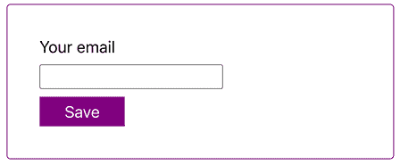

图 7.1：一个带有电子邮件输入字段的示例表单

负责渲染表单并处理输入的电子邮件地址值的组件的代码可能看起来像这样：

```js
function EmailForm() {
  const [enteredEmail, setEnteredEmail] = useState('');
  console.log(enteredEmail);
  function handleUpdateEmail(event) {
    setEnteredEmail(event.target.value);
  }
  function handleSubmitForm(event) {
    event.preventDefault();
    // could send enteredEmail to a backend server
  }
  return (
    <form className={classes.form} onSubmit={handleSubmitForm}>
      <label htmlFor="email">Your email</label>
      <input type="email" id="email" onChange={handleUpdateEmail} />
      <button>Save</button>
    </form>
  );
} 
```

如你所见，这个示例使用`useState()`钩子，结合`change`事件，来注册`email`输入字段中的按键，并存储输入的值。

这段代码运行良好，在你的应用程序中包含这种类型的代码也没有什么问题。但是，添加额外的事件监听器和状态，以及添加在`change`事件触发时更新状态的函数，对于这样一个简单的任务——获取输入的电子邮件地址——来说，是一段相当多的样板代码。

上述代码片段除了提交电子邮件地址外，没有做其他任何事情。换句话说，在示例中使用`enteredEmail`状态的唯一原因就是读取输入的值。

即使`enteredEmail`只在`handleSubmitForm()`函数中需要，React 也会为每次`enteredEmail`状态更新重新执行`EmailForm`组件函数，即每次在`<input>`字段中的按键输入。这也不是理想的，因为它会导致大量的不必要的代码执行，从而可能引起性能问题。

在这种情况下，如果你退回到一些纯 JavaScript 逻辑，可以节省大量的代码（也许还有性能）：

```js
const emailInputEl = document.getElementById('email');
const enteredEmailVal = emailInputEl.value; 
```

这两行代码（理论上可以合并为一行）允许你获取一个 DOM 元素并读取当前存储的值。

这种代码的问题在于它没有使用 React。如果你正在构建 React 应用程序，你应该真正坚持使用 React 来处理 DOM。不要开始将你自己的纯 JavaScript 代码（访问 DOM 的代码）混合到 React 代码中。

这可能会导致意外的行为或错误，特别是如果你开始操作 DOM。它可能导致错误，因为在这种情况下 React 不会意识到你的更改；实际的渲染 UI 不会与 React 假设的 UI 同步。即使你只是从 DOM 中读取，也不应该将纯 JavaScript DOM 访问方法与你的 React 代码合并。

为了仍然允许你获取 DOM 元素并读取值，如上所示，React 为你提供了一个特殊的概念，你可以使用：**引用**。

Ref 代表引用，这是一个允许你存储对值引用的功能——例如，从 React 组件内部对 DOM 元素的引用。前面的纯 JavaScript 代码会做同样的事情（它也让你能够访问渲染后的元素），但是当使用引用时，你可以在不将纯 JavaScript 代码混合到 React 代码中的情况下获取访问权限。

可以使用一个特殊的 React Hook，称为`useRef()` Hook 来创建引用。

这个 Hook 可以被调用以生成一个`ref`对象：

```js
import { useRef } from 'react';
function EmailForm() {
  const emailRef = useRef(null);
  // other code ...
}; 
```

在前面的例子中，这个生成的引用对象`emailRef`最初被设置为 null，但随后可以被分配给任何 JSX 元素。这个分配是通过一个特殊的属性（`ref`属性）完成的，这个属性被每个 JSX 元素自动支持：

```js
return (
  <form className={classes.form} onSubmit={handleSubmitForm}>
    <label htmlFor="email">Your email</label>
    <input
      **ref****=****{emailRef}**
      type="email"
      id="email"
    />
    <button>Save</button>
  </form>
); 
```

就像在*第五章*中引入的`key`属性一样，*渲染列表和条件内容*，`ref`属性是由 React 提供的。`ref`属性需要一个引用对象，即通过`useRef()`创建的。

在这个例子中，`useRef()`接收`null`作为初始值，因为当组件函数第一次执行时，它技术上还没有分配给 DOM 元素。只有在最初的组件渲染周期之后，连接才会建立。因此，在第一次组件函数执行之后，存储在引用中的值将是这个例子中`<input>`元素的底层 DOM 对象。

创建并分配了那个 Ref 对象之后，你可以使用它来获取连接的 JSX 元素（在这个例子中是 `<input>` 元素）。需要注意的是：要获取连接的元素，你必须访问创建的 Ref 对象上的特殊 `current` 属性。这是必需的，因为 React 将分配给 Ref 对象的值存储在一个嵌套对象中，可以通过 `current` 属性访问，如下所示：

```js
function handleSubmitForm(event) {
  event.preventDefault();
  **const** **enteredEmail = emailRef.****current****.****value****;** // .current is mandatory!
  // could send enteredEmail to a backend server
}; 
```

`emailRef.current` 返回为连接的 JSX 元素渲染的底层 DOM 对象。在这种情况下，因此它允许访问输入元素 DOM 对象。由于该 DOM 对象有一个 `value` 属性，因此可以无问题地访问这个 `value` 属性。

**注意**

关于这个主题的更多信息，请参阅 [`developer.mozilla.org/en-US/docs/Web/HTML/Element/input#attributes`](https://developer.mozilla.org/en-US/docs/Web/HTML/Element/input#attributes) 。

使用这种代码，你可以从 DOM 元素中读取值，而无需使用 `useState()` 和事件监听器。因此，最终的组件代码变得更加简洁：

```js
function EmailForm() {
  const emailRef = useRef(null);
  function handleSubmitForm(event) {
    event.preventDefault();
    const enteredEmail = emailRef.current.value;
    // could send enteredEmail to a backend server
  }
  return (
    <form className={classes.form} onSubmit={handleSubmitForm}>
      <label htmlFor="email">Your email</label>
      <input
        ref={emailRef}
        type="email"
        id="email"
      />
      <button>Save</button>
    </form>
  );
} 
```

# Refs 与 State 的比较

由于 Refs 可以用来快速轻松地访问 DOM 元素，因此可能会出现的问题是是否应该始终使用 Refs 而不是状态。

对这个问题的明确答案是“不。”

在需要读取元素的情况，如上面所示的使用案例中，Refs 可以是一个非常好的替代品。在处理用户输入时，这种情况通常很常见。一般来说，如果你只是访问一些值来在某个函数（例如表单提交处理函数）执行时读取它，Refs 可以替代状态。一旦你需要更改值并且这些更改必须在 UI 中反映（例如，通过渲染一些条件内容），Refs 就不再适用。

在上面的例子中，如果你除了获取输入的值之外，还希望在表单提交后重置（即清除）电子邮件输入，你应该再次使用状态。虽然你可以借助 Ref 重置输入，但你不应这样做。你会开始操作 DOM，而只有 React 应该这样做——使用它自己的、内部的方法，基于你提供给 React 的声明性代码。

你应该避免像这样重置电子邮件输入：

```js
function EmailForm() {
  const emailRef = useRef(null);
  function handleSubmitForm(event) {
    event.preventDefault();
    const enteredEmail = emailRef.current.value;
    // could send enteredEmail to a backend server
    **emailRef.****current****.****value** **=** **''****;** **// resetting the input value**
  }
  return (
    <form className={classes.form} onSubmit={handleSubmitForm}>
      <label htmlFor="email">Your email</label>
      <input
        ref={emailRef}
        type="email"
        id="email"
      />
      <button>Save</button>
    </form>
  );
} 
```

相反，你应该通过使用 React 的状态概念和遵循 React 所采用的声明性方法来重置它：

```js
function EmailForm() {
  const [enteredEmail, setEnteredEmail] = useState('');
  function handleUpdateEmail(event) {
    setEnteredEmail(event.target.value);
  }
  function handleSubmitForm(event) {
    event.preventDefault();
    // could send enteredEmail to a backend server
    // reset by setting the state + using the value prop below
    **setEnteredEmail**('');
  }
  return (
    <form className={classes.form} onSubmit={handleSubmitForm}>
      <label htmlFor="email">Your email</label>
      <input
        type="email"
        id="email"
        onChange={handleUpdateEmail}
        **value****=****{enteredEmail}**
      />
      <button>Save</button>
    </form>
  );
} 
```

**注意**

作为一个规则，你应该简单地尝试在 React 项目中避免编写命令式代码。相反，告诉 React 最终 UI 应该是什么样子，然后让 React 想出如何到达那里。

通过 Refs 读取值是一个可接受的例外，并且操作 DOM 元素（无论是否使用 Refs，例如，通过直接选择 DOM 节点 `document.getElementById()` 或类似方法）应该避免。一个罕见的例外是调用输入元素 DOM 对象上的 `focus()` 方法，因为像 `focus()` 这样的方法通常不会引起任何可能导致 React 应用程序中断的 DOM 变化。

# 使用 Refs 进行更多操作

访问 DOM 元素（用于读取值）是使用 Refs 的最常见用例之一。如上所示，它可以在某些情况下帮助您减少代码。

但 Refs 不仅仅是“元素连接桥梁”；它们是可以用来存储各种值的对象——不仅仅是 DOM 对象的指针。例如，您还可以在 Ref 中存储字符串、数字或其他任何类型的值：

```js
const passwordRetries = useRef(0); 
```

您可以向 `useRef()` 传递一个初始值（本例中的 `0`），然后在任何时候访问或更改 Ref 所属组件中的该值：

```js
passwordRetries.current = 1; 
```

然而，您仍然必须使用 `current` 属性来读取和更改存储的值，因为，如上所述，这是 React 存储属于 Ref 的实际值的地方。

这对于存储应该“生存”组件重新评估的数据很有用。正如你在 *第四章* 中学到的，*与事件和状态一起工作*，React 每当组件状态发生变化时都会执行组件函数。由于函数再次执行，存储在函数作用域变量中的任何数据都会丢失。考虑以下示例：

```js
function Counters() {
  const [counter1, setCounter1] = useState(0);
  const counterRef = useRef(0);
  let counter2 = 0;
  function handleChangeCounters() {
    setCounter1(1);
    counter2 = 1;
    counterRef.current = 1;
  };
  return (
    <>
      <button onClick={handleChangeCounters}>Change Counters</button>
      <ul>
        <li>Counter 1: {counter1}</li>
        <li>Counter 2: {counter2}</li>
        <li>Counter 3: {counterRef.current}</li>
      </ul>
    </>
  );
}; 
```

在这个例子中，当按钮被点击时，计数器 1 和 3 会变为 1。然而，计数器 2 将保持为零，尽管在 `handleChangeCounters` 中 `counter2` 变量也被更改为值 `1`：

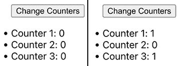

图 7.2：只有三个计数器值中的两个发生了变化

在这个例子中，应该预期状态值发生变化，并且新值会反映在更新的用户界面中。毕竟，这就是状态的全部理念。

Ref（`counterRef`）也会在组件重新评估之间保持其更新值。这就是上面描述的行为：当周围组件函数再次执行时，Refs 不会被重置或清除。纯 JavaScript 变量（`counter2`）不会保持其值。尽管它在 `handleChangeCounters` 中被更改，但当组件函数再次执行时，会初始化一个新的变量；因此，更新值（`1`）会丢失。

在这个例子中，它可能看起来像 Refs 可以替代状态，但实际上这个例子很好地说明了这**不是**情况。尝试将 `counter1` 替换为另一个 Ref（这样组件中就没有剩余的状态值）并点击按钮：

```js
import { useRef } from 'react';
function Counters() {
  const counterRef1 = useRef(0);
  const counterRef2 = useRef(0);
  let counter2 = 0;
  function handleChangeCounters() {
    counterRef1.current = 1;
    counter2 = 1;
    counterRef2.current = 1;
  }
  return (
    <>
      <button onClick={handleChangeCounters}>Change Counters</button>
      <ul>
        <li>Counter 1: {counterRef1.current}</li>
        <li>Counter 2: {counter2}</li>
        <li>Counter 3: {counterRef2.current}</li>
      </ul>
    </>
  }
);
export default Counters; 
```

页面上不会发生任何变化，因为虽然按钮点击被记录并且 `handleChangeCounters` 函数被执行，但没有发起状态变化，状态变化（通过 `setXYZ` 状态更新函数调用发起）是触发 React 重新评估组件的触发器。改变 Ref 值**不会**这样做。

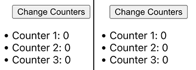

图 7.3：计数器值没有变化

正如你可以看到的，更改 Ref 值不会触发组件函数再次执行——另一方面，状态会。然而，如果一个组件函数再次运行（由于状态变化），Ref 值会被保留而不是丢弃。

因此，如果你有应该能够生存组件重新评估但不应作为状态管理的数据（因为该数据的变化不应导致组件在变化时重新评估），你可以使用一个 Ref：

```js
const passwordRetries = useRef(0);
// later in the component ...
passwordRetries.current = 1; // changed from 0 to 1
// later ...
console.log(passwordRetries.current); // prints 1, even if the component changed 
```

这不是一个经常使用的功能，但有时可能会有所帮助。在其他所有情况下，使用正常的状态值。

## 自定义组件中的 Refs

Refs 不仅可以用来访问 DOM 元素，还可以用来访问 React 组件——包括你自己的组件。

这有时可能很有用。考虑这个例子：你有一个`<Form>`组件，它包含一个嵌套的`<Preferences>`组件。后者组件负责显示两个复选框，询问用户的新闻通讯偏好：

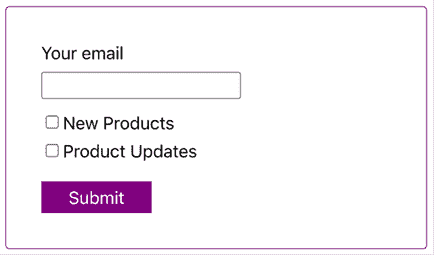

图 7.4：一个显示两个复选框以设置新闻通讯偏好的新闻通讯注册表单

`Preferences`组件的代码可能看起来像这样：

```js
function Preferences() {
  const [wantsNewProdInfo, setWantsNewProdInfo] = useState(false);
  const [wantsProdUpdateInfo, setWantsProdUpdateInfo] = useState(false);
  function handleChangeNewProdPref() {
    setWantsNewProdInfo((prevPref) => !prevPref);
  }
  function handleChangeUpdateProdPref() {
    setWantsProdUpdateInfo((prevPref) => !prevPref);
  }
  return (
    <div className={classes.preferences}>
      <label>
        <input
          type="checkbox"
          id="pref-new"
          checked={wantsNewProdInfo}
          onChange={handleChangeNewProdPref}
        />
        <span>New Products</span>
      </label>
      <label>
        <input
          type="checkbox"
          id="pref-updates"
          checked={wantsProdUpdateInfo}
          onChange={handleChangeUpdateProdPref}
        />
        <span>Product Updates</span>
      </label>
    </div>
  );
}; 
```

正如你所看到的，这是一个基本组件，它本质上输出两个复选框，添加一些样式，并通过状态跟踪选定的复选框。

`Form`组件的代码可能看起来像这样：

```js
function Form() {
  function handleSubmit(event) {
    event.preventDefault();
  }
  return (
    <form className={classes.form} onSubmit={handleSubmit}>
      <div className={classes.formControl}>
        <label htmlFor="email">Your email</label>
        <input type="email" id="email" />
      </div>
      <Preferences />
      <button>Submit</button>
    </form>
  );
} 
```

现在想象一下，在表单提交（在`handleSubmit`函数内部）时，应该重置`Preferences`（即不再选择任何复选框）。此外，在重置之前，应该读取选定的值并在`handleSubmit`函数中使用它们。

如果复选框没有被放入一个单独的组件中，这将很简单。如果整个代码和 JSX 标记都位于`Form`组件中，那么可以在该组件中使用状态来读取和更改值。但在这个例子中并非如此，仅仅因为这个问题而重写代码听起来像是一个不必要的限制。

幸运的是，Refs 可以帮助这种情况。

你可以通过 Refs 将组件的功能（例如，函数或状态值）暴露给其他组件。本质上，Refs 可以用作两个组件之间的*通信设备*，就像它们在前面章节中用作与 DOM 元素的*通信设备*一样。

便利的是，你的自定义组件可以接收一个 ref 作为常规属性：

```js
function Preferences(props) { // or function Preferences({ ref }) {}
  // can use props.ref in here
  // component code ...
};
export default Preferences; 
```

因此，你可以使用这个`Preferences`组件并将其传递一个`ref`给它：

```js
function Form() {
  const preferencesRef = useRef(null);
  return <Preferences ref={preferencesRef} />;
} 
```

重要的是要注意，这段代码仅在 React 19 或更高版本中使用时才有效。当使用较旧的 React 版本时，将 Refs 作为常规属性传递给组件是不支持的。在这种情况下，你将不得不使用 React 提供的特殊`forwardRef()`函数将应该接收 Ref 的组件函数包装起来。

因此，在 React 18 或更早版本的 React 项目中，要接收和使用 Refs，你必须将接收组件（例如，在这个例子中的`Preferences`）包裹在`forwardRef()`中。

这可以这样操作：

```js
const Preferences = forwardRef((props, ref) => {
  // component code ...
});
export default Preferences; 
```

这与其他本书中的所有组件看起来略有不同，因为这里使用的是箭头函数而不是`function`关键字。你始终可以使用箭头函数而不是“普通函数”，但在这里切换是有帮助的，因为它使得用`forwardRef()`包裹函数变得非常容易。或者，你也可以坚持使用`function`关键字，并像这样包裹函数：

```js
function Preferences(props, ref) {
 // component code ...
};
export default forwardRef(Preferences); 
```

你可以选择你喜欢的语法。两者都有效，并且在 React 项目中都常用。

这段代码有趣的部分是，组件函数现在接收**两个**参数而不是一个。除了接收`props`，组件函数始终会这样做之外，它现在还接收一个特殊的`ref`参数。而这个参数之所以被接收，是因为组件函数被`forwardRef()`包裹。

这个`ref`参数将包含使用`Preferences`组件设置的任何`ref`值。例如，`Form`组件可以在`Preferences`上设置一个`ref`参数，如下所示：

```js
function Form() {
  **const** **preferencesRef =** **useRef****({});**
  function handleSubmit(event) {
    // other code ...
  }
  return (
    <form className={classes.form} onSubmit={handleSubmit}>
      <div className={classes.formControl}>
        <label htmlFor="email">Your email</label>
        <input type="email" id="email" />
      </div>
      <Preferences **ref****=****{preferencesRef**} />
      <button>Submit</button>
    </form>
  );
} 
```

再次强调，`useRef()`用于创建一个`ref`对象（`preferencesRef`），然后通过特殊的`ref`属性将其传递给`Preferences`组件。创建的 Ref 接收一个默认值为空对象（`{}`）的值；正是这个对象可以通过`ref.current`访问。在`Preferences`组件中，`ref`值可以像常规属性一样接收和提取（React >= 19）或必须使用 React 的`forwardRef()`函数来访问。在这种情况下，它通过第二个`ref`参数接收，这是由于`forwardRef()`的存在。

但这有什么好处呢？现在如何在这个`preferencesRef`对象内部使用`Preferences`来启用跨组件交互？

由于`ref`是一个永远不会被替换的对象，即使通过`useRef()`创建它的组件被重新评估（参见上面的前几节），接收组件可以将属性和方法分配给该对象，创建组件然后可以使用这些方法和属性。因此，`ref`对象被用作通信工具。

在这个例子中，`Preferences`组件可以像这样更改以使用`ref`对象：

```js
function Preferences(props) { // wrap with forwardRef() for React < 19
  const { ref } = props; // Extracting ref prop
  const [wantsNewProdInfo, setWantsNewProdInfo] = useState(false);
  const [wantsProdUpdateInfo, setWantsProdUpdateInfo] = useState(false);
  function handleChangeNewProdPref () {
    setWantsNewProdInfo((prevPref) => !prevPref);
  }
  function handleChangeUpdateProdPref() {
    setWantsProdUpdateInfo((prevPref) => !prevPref);
  }
  function reset() {
    setWantsNewProdInfo(false);
    setWantsProdUpdateInfo(false);
  }
  **ref.****current****.****reset** **= reset;**
  **ref.****current****.****selectedPreferences** **= {**
    **newProductInfo****: wantsNewProdInfo,**
    **productUpdateInfo****: wantsProdUpdateInfo**,
  };
  // also return JSX code (has not changed) ...
}); 
```

在`Preferences`中，状态值和指向新添加的`reset`函数的指针都存储在接收到的`ref`对象中。使用`ref.current`是因为 React（在使用`useRef()`时）创建的对象始终具有这样的`current`属性，并且应该使用该属性来在`ref`中存储实际值。

由于`Preferences`和`Form`操作的是存储在`ref`对象中的同一个对象，因此在`Preferences`中分配给该对象的属性和方法也可以在`Form`中使用：

```js
function Form() {
  const preferencesRef = useRef({});
  function handleSubmit(event) {
    event.preventDefault();
    **console****.****log****(preferencesRef.****current****.****selectedPreferences**); // reading a value
    **preferencesRef.****current****.****reset**(); // executing a function stored in Preferences
  }
  return (
    <form className={classes.form} onSubmit={handleSubmit}>
      <div className={classes.formControl}>
        <label htmlFor="email">Your email</label>
        <input type="email" id="email" />
      </div>
      <Preferences ref={preferencesRef} />
      <button>Submit</button>
    </form>
  );
} 
```

通过这种方式使用 Refs，父组件（在这种情况下是 `Form`）能够以命令式的方式与某些子组件（例如，`Preferences`）进行交互——这意味着可以访问属性并调用方法来操作子组件（或者更准确地说，触发子组件内部的一些函数和行为）。

**注意**

React 还提供了一个 `useImperativeHandle()` 钩子，它可以用来从自定义组件中暴露数据或函数。

从技术上讲，您不需要使用这个钩子，因为上面的例子已经证明了这一点。您可以通过 Refs 在组件之间进行通信，而不需要任何额外的钩子。

但您可能需要考虑使用 `useImperativeHandle()`，因为它将处理像缺少 `ref` 值（即没有提供 `ref` 值）这样的场景。您可以在官方文档中了解更多关于这个（可以说是小众的）钩子的使用方法：[`react.dev/reference/react/useImperativeHandle`](https://react.dev/reference/react/useImperativeHandle)。

## 受控组件与不受控组件

将 Refs 传递给自定义组件（通过 props 或 `forwardRef()`）是一种方法，可以用来允许 `Form` 和 `Preferences` 组件协同工作。但尽管这最初可能看起来像是一个优雅的解决方案，但对于这类问题，它通常不应成为您的默认解决方案。

如上面示例所示，使用 Refs 最终会导致更多的命令式代码。这是因为，而不是通过 JSX（这将是一种声明式方法）定义所需的用户界面状态，JavaScript 中添加了单个的逐步指令。

如果您回顾 *第一章* ，*React – 什么和为什么*（*JavaScript 的弊端*部分），您会看到像 `preferencesRef.current.reset()`（来自上面的例子）这样的代码看起来与 `buttonElement.addEventListener(…)`（来自 *第一章* 的例子）这样的指令非常相似。这两个例子都使用了命令式代码，并且应该避免，正如 *第一章* 中提到的理由（逐步编写指令会导致低效的微观管理，并且通常会产生不必要的复杂代码）。

在 `Form` 组件内部，调用了 `Preferences` 的 `reset()` 函数。因此，代码描述了应该执行的动作（而不是预期的结果）。通常，当使用 React 时，您应该努力描述所需的（UI）状态。记住，当使用 React 时，您应该编写声明式代码，而不是命令式代码。

当使用 Refs 来读取或操作数据，如本章前面的部分所示，您正在构建所谓的**不受控组件**。这些组件被认为是“不受控”的，因为 React 并没有直接控制 UI 状态。相反，值是从其他组件或 DOM 中读取的。因此，DOM 控制着状态（例如，用户输入到输入字段中的值这样的状态）。

作为 React 开发者，你应该尽量减少使用非受控组件。如果你只需要收集一些输入值，使用 Refs 来节省一些代码是完全可行的。但是，一旦你的 UI 逻辑变得更加复杂（例如，如果你还想清除用户输入），你应该选择 **受控组件**。

这样做相当简单：组件一旦被 React 管理状态，就变为受控组件。在本章开头提到的 `EmailForm` 组件的例子中，在引入 Refs 之前已经展示了受控组件的方法。使用 `useState()` 存储用户的输入（并且每次按键更新状态）意味着 React 完全控制了输入的值。

对于前面的例子，`Form` 和 `Preferences` 组件，切换到受控组件方法可能看起来像这样：

```js
function Preferences({newProdInfo, prodUpdateInfo, onUpdateInfo}) {
  return (
    <div className={classes.preferences}>
      <label>
        <input
          type="checkbox"
          id="pref-new"
          checked={newProdInfo}
          onChange={onUpdateInfo.bind(null, 'pref-new')}
        />
        <span>New Products</span>
      </label>
      <label>
        <input
          type="checkbox"
          id="pref-updates"
          checked={prodUpdateInfo}
          onChange={onUpdateInfo.bind(null, 'pref-updates')}
        />
        <span>Product Updates</span>
      </label>
    </div>
  );
}; 
```

在这个例子中，`Preferences` 组件停止管理复选框状态，而是从其父组件（`Form` 组件）接收属性。

在 `onUpdateInfo` 属性（它将接收一个函数作为值）上使用 `bind()` 来 *预先配置* 该函数以供将来执行。`bind()` 是一个默认的 JavaScript 方法，可以在任何 JavaScript 函数上调用，以控制在将来调用该函数时将传递哪些参数。

**注意**

你可以在 [`academind.com/tutorials/function-bind-event-execution`](https://academind.com/tutorials/function-bind-event-execution) 上了解更多关于这个 JavaScript 功能的信息。

`Form` 组件现在管理复选框状态，即使它不直接包含复选框元素。但现在它开始控制 `Preferences` 组件及其内部状态，因此将 `Preferences` 转换为受控组件而不是非受控组件：

```js
function Form() {
  const [wantsNewProdInfo, setWantsNewProdInfo] = useState(false);
  const [wantsProdUpdateInfo, setWantsProdUpdateInfo] = useState(false);
  function handleUpdateProdInfo(selection) {
    // using one shared update handler function is optional
    // you could also use two separate functions (passed to Preferences) as props
    if (selection === 'pref-new') {
      setWantsNewProdInfo((prevPref) => !prevPref);
    } else if (selection === 'pref-updates') {
      setWantsProdUpdateInfo((prevPref) => !prevPref);
    }
  }
  function reset() {
    setWantsNewProdInfo(false);
    setWantsProdUpdateInfo(false);
  }
  function handleSubmit(event) {
    event.preventDefault();
    // state values can be used here
    reset();
  }
  return (
    <form className={classes.form} onSubmit={handleSubmit}>
      <div className={classes.formControl}>
        <label htmlFor="email">Your email</label>
        <input type="email" id="email" />
      </div>
      <Preferences
        newProdInfo={wantsNewProdInfo}
        prodUpdateInfo={wantsProdUpdateInfo}
        onUpdateInfo={handleUpdateProdInfo}
      />
      <button>Submit</button>
    </form>
  );
} 
```

`Form` 组件管理复选框的选择状态，包括通过 `reset()` 函数重置状态，并将管理的状态值（`wantsNewProdInfo` 和 `wantsProdUpdateInfo`）以及 `handleUpdateProdInfo` 函数（用于更新状态值）传递给 `Preferences`。现在 `Form` 组件控制 `Preferences` 组件。

如果你阅读了上面的两个代码片段，你会注意到最终的代码再次是纯声明式的。在所有组件中，状态被管理和使用来声明预期的用户界面。

在大多数情况下，使用受控组件被认为是一种良好的实践。然而，如果你只是提取一些输入的用户值，那么使用 Refs 并创建一个非受控组件是完全可行的。

# React 和 DOM 中的元素位置

离开 Refs 的主题，还有一个其他重要的 React 功能可以帮助影响（间接）DOM 交互：**Portals**。

在构建用户界面时，有时需要条件性地显示元素和内容。这已经在*第五章*，*渲染列表和条件内容*中讨论过了。当渲染条件性内容时，React 会将该内容注入到包含条件性内容的整体组件在 DOM 中的位置。

例如，当在输入字段下方显示条件性错误信息时，该错误信息在 DOM 中正好位于输入字段下方：

*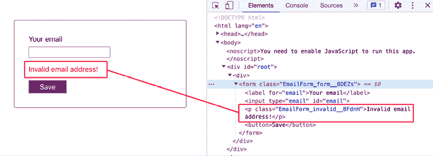*

图 7.5：错误信息 DOM 元素位于其所属的<input>元素下方

这种行为是有意义的。确实，如果 React 开始在随机位置插入 DOM 元素，那将会非常令人烦恼。但在某些场景中，你可能希望（条件性）DOM 元素被插入到 DOM 中的不同位置——例如，当处理如错误对话框之类的覆盖元素时。

在前面的示例中，你可以添加逻辑以确保如果表单提交了无效的电子邮件地址，则向用户显示错误对话框。这可以通过类似于“无效的电子邮件地址！”的错误信息逻辑来实现，因此对话框元素当然也会被动态注入到 DOM 中：

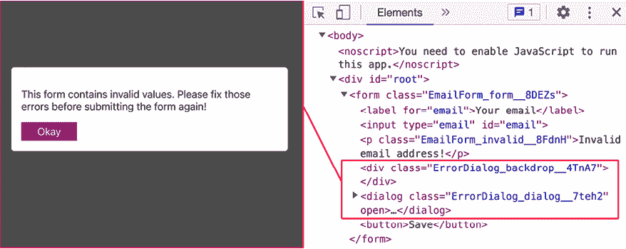

图 7.6：错误对话框及其背景被注入到 DOM 中

在此屏幕截图中，错误对话框作为一个覆盖层在背景元素上方打开，而背景元素本身被添加是为了使其作为用户界面的覆盖层。

**注意**

外观完全由 CSS 处理，你可以在这里查看完整的项目（包括样式）：[`github.com/mschwarzmueller/book-react-key-concepts-e2/tree/07-portals-refs/examples/05-portals-problem`](https://github.com/mschwarzmueller/book-react-key-concepts-e2/tree/07-portals-refs/examples/05-portals-problem) .

这个示例工作得很好，看起来也很不错。然而，还有改进的空间。

从语义上讲，将覆盖元素注入到 DOM 中，嵌套在<input>元素旁边，并不完全合理。覆盖元素更接近 DOM 的根（换句话说，是<div id="root">或甚至是<body>的直接子元素）会更合理，而不是成为<form>的子元素。而且，这不仅仅是一个语义问题。如果示例应用包含其他覆盖元素，这些元素可能会相互冲突，如下所示：

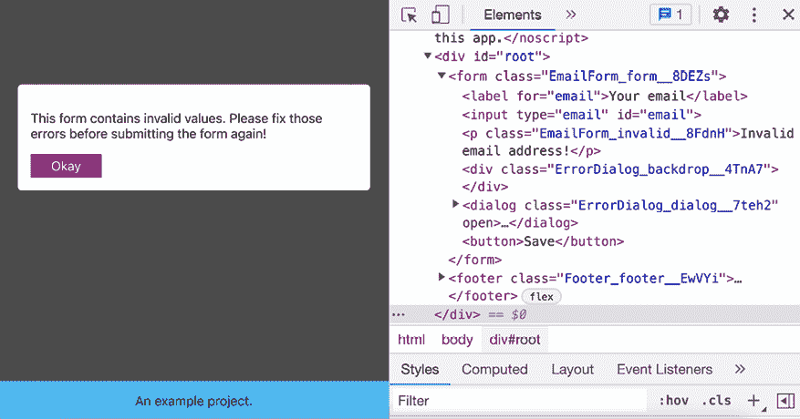

图 7.7：底部的<footer>元素在背景之上可见

在这个例子中，底部（“一个示例项目”）的`<footer>`元素没有被错误对话框的背景隐藏或变灰。原因是 footer 也附加了一些 CSS 样式，使其成为事实上的覆盖层（因为使用了`position: fixed`和`left` + `bottom`）。

作为这个问题的解决方案，你可以调整一些 CSS 样式，例如，使用`z-index` CSS 属性来控制覆盖层级。然而，如果覆盖元素（即，`<div>`背景和`<dialog>`错误元素）被插入到 DOM 的不同位置——例如，在`<body>`元素的末尾（但作为`<body>`的直接子元素）——将会是一个更干净的解决方案。

这正是 React **门户**可以帮助你解决的问题。

## 门户救援

在 React 的世界里，**门户**是一个允许你指示 React 将 DOM 元素插入到不同于其通常插入位置的功能。

考虑到上面显示的例子，这个门户功能可以用来指示 React 不要在`<form>`元素内部插入属于对话框的`<dialog>`错误和`<div>`背景，而是将这些元素插入到`<body>`元素的末尾。

要使用这个门户功能，你首先必须定义一个可以插入元素的位置（一个“注入钩子”）。这可以在属于 React 应用的 HTML 文件中完成（例如，`index.html`）。在那里，你可以在`<body>`元素中的某个位置添加一个新元素（例如，一个`<div>`元素）：

```js
<body>
  <div id="root"></div>
  **<****div****id****=****"dialogs"****></****div****>**
  <script type="module" src="img/main.jsx"></script>
</body> 
```

在这种情况下，在`<div id="root">`元素之后在`<body>`部分添加了一个`<div id="dialogs">`元素，以确保插入该元素的任何组件（及其样式）都是最后评估的。这将确保它们的样式具有更高的优先级，并且插入到`<div id="dialogs">`中的覆盖元素不会被 DOM 中较早出现的内容覆盖。添加和使用多个钩子是可能的，但在这个例子中只需要一个*注入点*。你也可以使用除`<div>`元素之外的 HTML 元素。

调整了`index.html`文件后，可以通过`react-dom`的`createPortal()`函数指示 React 在指定的*注入点*渲染某些 JSX 元素（即，组件）：

```js
import { createPortal } from 'react-dom';
import classes from './ErrorDialog.module.css';
function ErrorDialog({ onClose }) {
  return createPortal(
    <>
      <div className={classes.backdrop}></div>
      <dialog className={classes.dialog} open>
        <p>
          This form contains invalid values. Please fix those errors before
          submitting the form again!
        </p>
        <button onClick={onClose}>Okay</button>
      </dialog>
    </>,
    document.getElementById('dialogs')
  );
}
export default ErrorDialog; 
```

在这个`ErrorDialog`组件内部，它由另一个组件（例如，GitHub 上的示例代码`EmailForm`组件）条件性地渲染，返回的 JSX 代码被`createPortal()`包裹。`createPortal()`接受两个参数：应该在 DOM 中渲染的 JSX 代码以及在`index.html`中内容应注入的元素的指针。

在这个例子中，新添加的`<div id="dialogs">`是通过`document.getElementById('dialogs')`选择的。因此，`createPortal()`确保由`ErrorDialog`生成的 JSX 代码在 HTML 文档的该位置渲染：

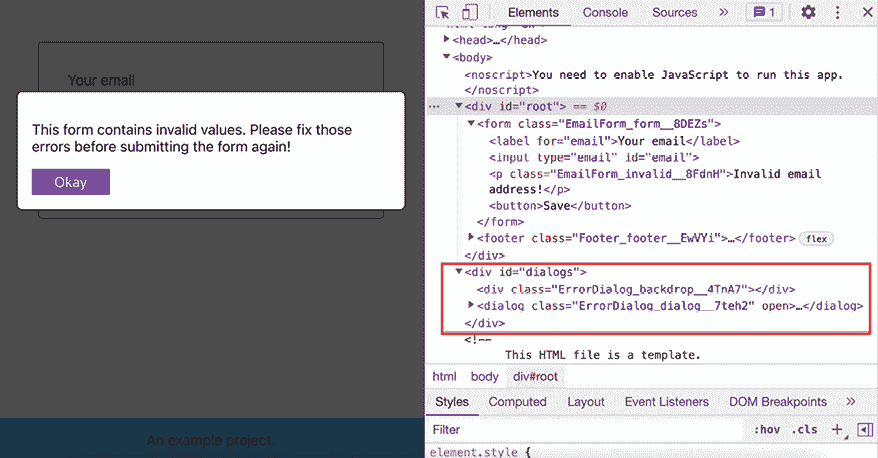

图 7.8：覆盖元素被插入到`<div id="dialogs">`中

在此屏幕截图中，您可以看到覆盖元素（`<div>`背景和`<dialog>`错误）确实被插入到`<div id="dialogs">`元素中，而不是`<form>`元素（如之前那样）。

由于这次更改，无需修改任何 CSS 代码，`<footer>`元素不再覆盖错误对话框的背景。从语义上讲，最终的 DOM 结构也更加合理，因为通常期望覆盖元素更接近根 DOM 节点。

尽管如此，使用此门户功能是可选的。通过更改一些 CSS 样式，同样可以达到相同的效果（尽管不是 DOM 结构）。不过，追求干净的 DOM 结构是一个值得追求的目标，避免不必要的复杂 CSS 代码也是一个不错的选择。

# 概述和关键要点

+   Refs 可用于直接访问 DOM 元素或存储在周围组件重新评估时不会被重置或更改的值。

+   仅使用此直接访问来读取值，而不是操纵 DOM 元素（让 React 来处理）。

+   通过 Refs 而不是状态和其他 React 功能获得 DOM 访问的组件被认为是未受控组件（因为 React 没有直接控制）。

+   除非您正在执行非常简单的任务，例如读取输入的值，否则请优先使用受控组件（使用状态和严格的声明式方法）而不是不受控组件。

+   使用 Refs，您还可以暴露您自己的组件功能，以便它们可以被命令式地使用。

+   当使用 React 19 或更高版本时，您可以在自定义组件上设置和使用`ref`属性。

+   当使用 React < 19 时，必须在自定义组件上使用 React 的`forwardRef()`函数来接收 Refs。

+   门户可以用来指示 React 在 DOM 的不同位置渲染 JSX 元素，而不是它们通常的位置。

## 接下来是什么？

在本书的这一部分，您已经遇到了许多可以用来构建交互式和引人入胜的用户界面的关键工具和概念。多亏了 Refs，您可以在不使用状态的情况下读取 DOM 值（从而避免不必要的组件重新评估），或者管理在组件更新之间持续存在的值。多亏了 Portals，您能够控制组件标记在 DOM 中确切的位置。

因此，您获得了一些可以用来微调您的 React 应用的新工具。您可能能够通过避免组件重新评估来提高性能，或者提高 DOM 元素的架构和语义。最终，正是所有这些工具的组合，使您能够使用 React 构建引人入胜、交互式且性能良好的 Web 应用。

但是，正如您将在下一章中了解到的那样，React 还有更多有用的核心概念可以提供：例如，处理**副作用**的方法。

下一章将探讨**副作用**究竟是什么，为什么需要特殊处理，以及 React 如何帮助您处理这些。

## 测试你的知识！

通过回答以下问题来测试你对本章涵盖的概念的理解。然后，你可以将你的答案与在[`github.com/mschwarzmueller/book-react-key-concepts-e2/blob/07-portals-refs/exercises/questions-answers.md`](https://github.com/mschwarzmueller/book-react-key-concepts-e2/blob/07-portals-refs/exercises/questions-answers.md)中可以找到的示例进行比较。

1.  Refs 如何帮助处理表单中的用户输入？

1.  什么是无状态组件？

1.  什么是受控组件？

1.  你应该在什么情况下**不**使用 Refs？

1.  端口背后的主要思想是什么？

# 应用你所学的知识

在学习了关于 Refs 和端口的新的知识之后，又是时候练习你所学的内容了。

下面，你将找到两个活动，允许你练习使用 Refs 和端口。一如既往，你当然还需要一些之前章节中涵盖的概念（例如，处理状态）。

## 活动 7.1：提取用户输入值

在这个活动中，你必须向现有的 React 组件添加逻辑以从表单中提取值。该表单包含一个输入字段和一个下拉菜单，你应该确保在表单提交时，两个值都被读取，并且为了这个模拟应用程序，输出到浏览器控制台。

使用你对 Refs 和无状态组件的了解来实现一个不使用 React 状态的解决方案。

**注意**

你可以在[`github.com/mschwarzmueller/book-react-key-concepts-e2/tree/07-portals-refs/activities/practice-1-start`](https://github.com/mschwarzmueller/book-react-key-concepts-e2/tree/07-portals-refs/activities/practice-1-start)找到这个活动的起始代码。下载此代码时，你将始终下载整个仓库。请确保然后导航到包含起始代码的子文件夹（在本例中为`activities/practice-1-start`），以使用正确的代码快照。

在项目文件夹中下载代码并运行`npm install`（安装所有必需的依赖项）之后，解决方案步骤如下：

1.  创建两个 Refs，一个用于每个需要读取的输入元素（输入字段和下拉菜单）。

1.  将 Refs 连接到输入元素。

1.  在提交处理函数中，通过 Refs 访问连接的 DOM 元素并读取当前输入或选择的值。

1.  将值输出到浏览器控制台。

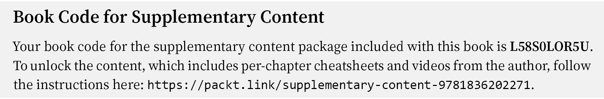

预期的结果（用户界面）应如下所示：

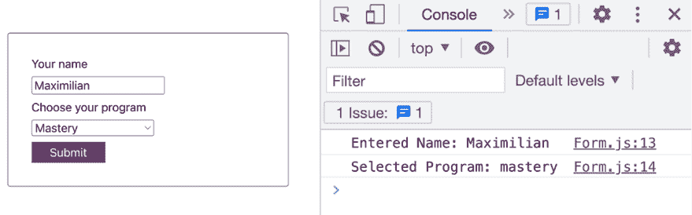

图 7.9：浏览器开发者工具控制台输出所选值

**注意**

你将在这个活动中找到所有用于此活动的代码文件以及解决方案，可以在[`github.com/mschwarzmueller/book-react-key-concepts-e2/tree/07-portals-refs/activities/practice-1`](https://github.com/mschwarzmueller/book-react-key-concepts-e2/tree/07-portals-refs/activities/practice-1)找到。

## 活动 7.2：添加侧边抽屉

在这个活动中，你将连接一个已经存在的`SideDrawer`组件与主导航栏中的按钮，以便在点击按钮时打开侧边抽屉（即显示它）。侧边抽屉打开后，点击背景应再次关闭抽屉。

除了实现上述的一般逻辑外，你的目标将是确保在最终 DOM 中的正确定位，以便没有其他元素覆盖在`SideDrawer`之上（无需编辑任何 CSS 代码）。`SideDrawer`也不应嵌套在任何其他组件或 JSX 元素中。

**注意**

此活动附带一些起始代码，可以在以下位置找到：[`github.com/mschwarzmueller/book-react-key-concepts-e2/tree/07-portals-refs/activities/practice-2-start`](https://github.com/mschwarzmueller/book-react-key-concepts-e2/tree/07-portals-refs/activities/practice-2-start)。

下载代码并运行`npm install`以安装所有必需的依赖项后，解决方案步骤如下：

1.  在`MainNavigation`组件中添加逻辑，以有条件地显示或隐藏`SideDrawer`组件。

1.  在 HTML 文档中为侧边抽屉添加一个*注入钩子*。

1.  使用 React 的 portal 功能在新增的钩子中渲染`SideDrawer`的 JSX 元素。

最终的用户界面应看起来和表现如下：


图 7.10：点击菜单按钮打开侧边抽屉

点击菜单按钮后，侧边抽屉打开。如果点击侧边抽屉背后的背景，它应该再次关闭。

最终的 DOM 结构（侧边抽屉已打开）应如下所示：

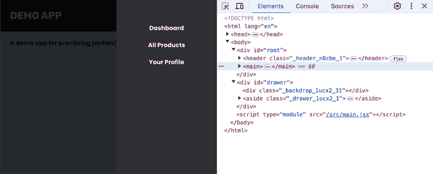

图 7.11：与抽屉相关的元素在 DOM 中插入到单独的位置

与侧边抽屉相关的 DOM 元素（背景`<div>`和`<aside>`）被插入到一个单独的 DOM 节点中（`<div id="drawer">`）。

**注意**

你将在这个活动中找到所有用于此活动的代码文件，以及解决方案，请访问[`github.com/mschwarzmueller/book-react-key-concepts-e2/tree/07-portals-refs/activities/practice-2`](https://github.com/mschwarzmueller/book-react-key-concepts-e2/tree/07-portals-refs/activities/practice-2)。
