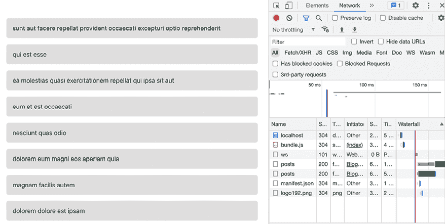
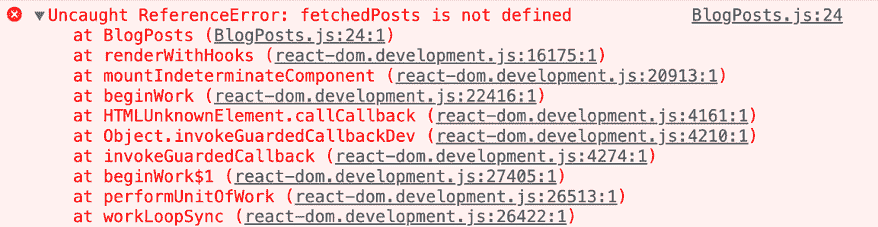
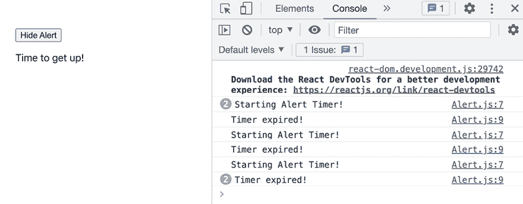
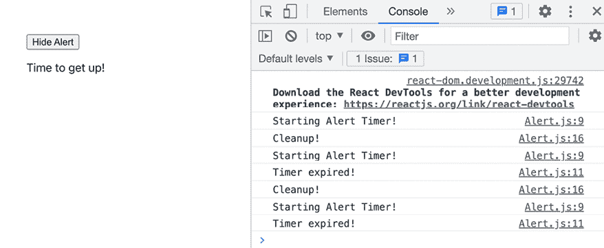
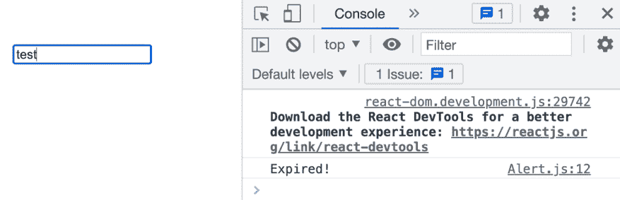
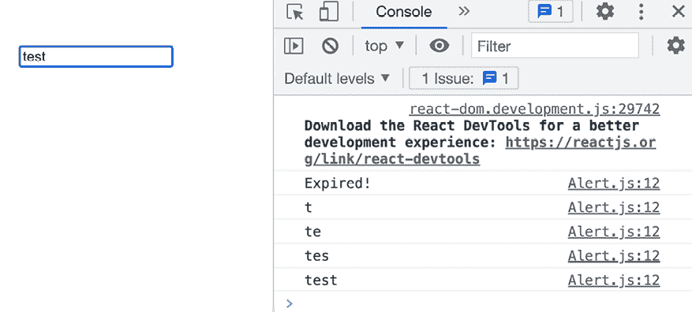
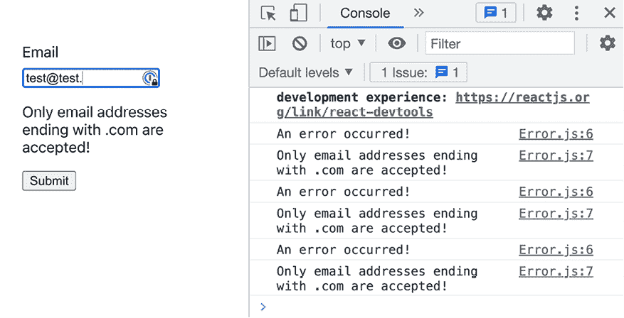
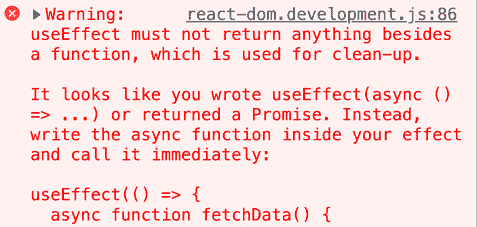
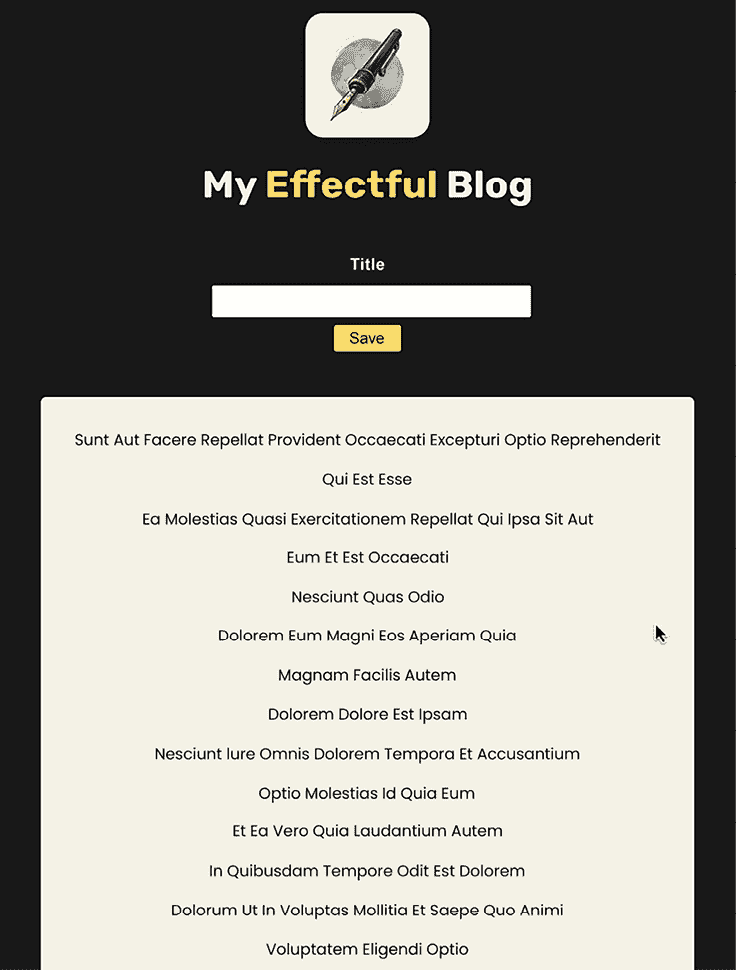

# 第八章：处理副作用

学习目标

到本章结束时，你将能够做到以下几件事情：

+   识别你的 React 应用程序中的副作用

+   理解和使用 `useEffect()` 钩子

+   利用与 `useEffect()` 钩子相关的不同特性和概念，以避免错误并优化你的代码

+   处理与状态变化相关和无关的副作用

# 简介

尽管本书之前涵盖的所有 React 示例都相对简单，并且介绍了许多关键 React 概念，但仅凭这些概念很难构建出许多真实的应用程序。

你作为 React 开发者将构建的大多数真实应用程序也需要发送 HTTP 请求，访问浏览器存储和日志分析数据，或执行任何其他类似任务，而仅凭组件、属性、事件和状态，你通常在尝试向应用程序添加此类功能时会遇到问题。详细的解释和示例将在本章后面讨论，但核心问题是这类任务通常会干扰 React 的组件渲染周期，导致意外的错误，甚至破坏应用程序。

本章将更深入地探讨这类操作，分析它们的共同点，最重要的是，教你如何在 React 应用程序中正确处理这类任务。

# 问题是什么？

在探索解决方案之前，首先理解具体问题是重要的。

与生成（新）用户界面状态无关的操作通常与 React 的组件渲染周期冲突。它们可能会引入错误，甚至破坏整个 Web 应用程序。

考虑以下示例代码片段（重要：不要执行此代码，因为它将导致无限循环并在幕后发送大量 HTTP 请求）：

```js
import { useState } from 'react';
import classes from './BlogPosts.module.css';
async function fetchPosts() {
  const response = await fetch('https://jsonplaceholder.typicode.com/posts');
  const blogPosts = await response.json();
  return blogPosts;
}
function BlogPosts() {
  const [loadedPosts, setLoadedPosts] = useState([]);
  fetchPosts().then((fetchedPosts) => setLoadedPosts(fetchedPosts));
  return (
    <ul className={classes.posts}>
      {loadedPosts.map((post) => (
        <li key={post.id}>{post.title}</li>
      ))}
    </ul>
  );
}
export default BlogPosts; 
```

那么，这段代码有什么问题？为什么它会创建一个无限循环？

在这个例子中，创建了一个 React 组件（`BlogPosts`）。此外，还定义了一个非组件函数（`fetchPosts()`）。该函数使用浏览器提供的内置 `fetch()` 函数发送 HTTP 请求到外部 **应用程序编程接口**（**API**）并获取一些数据。

**注意**

`fetch()` 函数由浏览器提供（所有现代浏览器都支持此功能）。你可以在[`academind.com/tutorials/xhr-fetch-axios-the-fetch-api`](https://academind.com/tutorials/xhr-fetch-axios-the-fetch-api)了解更多关于 `fetch()` 的信息。

`fetch()` 函数返回一个 **promise**，在这个例子中，它通过 `async` / `await` 来处理。就像 `fetch()` 一样，promises 是一个关键的 Web 开发概念，你可以在这里了解更多信息（包括 `async` / `await`）：[`developer.mozilla.org/en-US/docs/Web/JavaScript/Reference/Statements/async_function`](https://developer.mozilla.org/en-US/docs/Web/JavaScript/Reference/Statements/async_function)。

在这个上下文中，API 是一个公开各种路径的网站，可以发送请求——无论是提交还是获取数据。[jsonplaceholder.typicode.com](https://jsonplaceholder.typicode.com) 是一个模拟 API，响应模拟数据。它可以用于像前面的例子那样的场景，你只需要一个 API 来发送请求。你可以用它来测试一些概念或代码，而无需连接或创建真实的后端 API。在这种情况下，它被用来探索一些 React 问题和解。对于本章和本书整体，预期你将具备使用 `fetch()` 发送 HTTP 请求和了解 API 的基本知识。如果需要，你可以使用 MDN（[`developer.mozilla.org/`](https://developer.mozilla.org/)）等页面来加强你对这些核心概念的了解。

在前面的代码片段中，`BlogPosts` 组件使用 `useState()` 注册了一个 `loadedPosts` 状态值。这个状态用于输出一系列博客帖子。尽管这些帖子并没有在应用本身中定义，而是从注释框中提到的外部 API 中获取的。

`fetchPosts()`，这是一个包含使用内置 `fetch()` 函数从后端 API 获取博客帖子数据的代码的实用函数，在组件函数体中被直接调用。由于 `fetchPosts()` 是一个 `async` 函数（使用 `async` / `await`），它返回一个承诺。在 `BlogPosts` 中，一旦承诺解决，应该执行的代码是通过内置的 `then()` 方法注册的。

**注意**

`async` / `await` 不会直接在组件函数体中使用，因为常规的 React 组件不能是 `async` 函数。这样的函数会自动返回一个承诺作为值（即使没有显式的 `return` 语句），这对于 React 组件来说是一个无效的返回值。

话虽如此，确实存在允许使用 `async` / `await` 并返回承诺的 React 组件。所谓的 **React 服务器组件** 并不局限于返回 JSX 代码、字符串等。这一特性将在 *第十六章* ，*React 服务器组件与服务器操作* 中详细讨论。

一旦 `fetchPosts()` 的承诺得到解决，提取的帖子数据（`fetchedPosts`）就被设置为新的 `loadedPosts` 状态（通过 `setLoadedPosts(fetchedPosts)`）。

如果你运行前面的代码（你不应该这样做！），它最初似乎可以工作。但实际上，它会在幕后启动一个无限循环，不断地用 HTTP 请求打击 API。这是因为，由于从 HTTP 请求中得到了响应，`setLoadedPosts()` 被用来设置新的状态。

在本书的早期（在第 *第四章* ，*处理事件和状态* 中），你了解到每当组件的状态发生变化时，React 会重新评估该状态所属的组件。“重新评估”简单来说就是组件函数再次被执行（由 React 自动执行）。

由于这个`BlogPosts`组件在组件函数体内直接调用`fetchPosts()`（它发送 HTTP 请求），因此每次执行组件函数时都会发送这个 HTTP 请求。并且由于从该 HTTP 请求中获取响应而更新状态（`loadedPosts`），这个过程再次开始，从而创建了一个无限循环。

在这种情况下，根本问题是发送 HTTP 请求是一个副作用——一个将在下一节中更详细探讨的概念。

# 理解副作用

副作用是指除了另一个*主要过程*之外发生的动作或过程。至少，这是一个简洁的定义，有助于在 React 应用程序的上下文中理解副作用。

**注意**

如果你想深入了解*副作用*的概念，你还可以探索 Stack Overflow 上的以下关于副作用的讨论：[`softwareengineering.stackexchange.com/questions/40297/what-is-a-side-effect`](https://softwareengineering.stackexchange.com/questions/40297/what-is-a-side-effect) 。

在 React 组件的情况下，主过程将是组件渲染周期，其中组件的主要任务是渲染在组件函数中定义的用户界面（返回的 JSX 代码）。React 组件应该返回最终的 JSX 代码，然后将其转换为 DOM 操作指令。

因此，React 将状态变化视为更新用户界面的触发器。注册事件处理器（如`onClick`）、添加 refs 或渲染子组件（可能通过使用 props）将是属于这个主过程的另一个元素——因为这些概念都与渲染所需用户界面的主要任务直接相关。

正如前例所示，发送 HTTP 请求并不属于这个主过程，它不会直接影响用户界面。虽然响应数据最终可能会显示在屏幕上，但它肯定不会在发送请求的同一个组件渲染周期中被使用（因为 HTTP 请求是异步任务）。

由于发送 HTTP 请求不是由组件函数（渲染用户界面）执行的主过程的一部分，因此它被认为是副作用。它是由同一个函数（`BlogPosts`组件函数）调用的，而这个函数的主要目标不同。

如果 HTTP 请求是在点击按钮时发送，而不是作为主组件函数体的一部分，那么它就不会是副作用。考虑以下示例：

```js
import { useState } from 'react';
import classes from './BlogPosts.module.css';
async function fetchPosts() {
  const response = await fetch('https://jsonplaceholder.typicode.com/posts');
  const blogPosts = await response.json();
  return blogPosts;
}
function BlogPosts() {
  const [loadedPosts, setLoadedPosts] = useState([]);
  **function****handleFetchPosts****() {**
    **fetchPosts****().****then****(****(****fetchedPosts****) =>****setLoadedPosts****(fetchedPosts));**
  **}**
  return (
    <>
      **<****button****onClick****=****{handleFetchPosts}****>****Fetch Posts****</****button****>**
      <ul className={classes.posts}>
        {loadedPosts.map((post) => (
          <li key={post.id}>{post.title}</li>
        ))}
      </ul>
    </>
  );
}
export default BlogPosts; 
```

这段代码几乎与前一个示例相同，但它有一个重要的区别：JSX 代码中添加了一个`<button>`。正是这个按钮调用了新添加的`handleFetchPosts()`函数，然后发送 HTTP 请求（并更新状态）。

进行了此更改后，每次组件函数重新渲染（即，再次执行）时，都不会发送 HTTP 请求。相反，只有在按钮被点击时才会发送，因此，这不会创建无限循环。在这种情况下，HTTP 请求也不假设存在副作用，因为 `handleFetchPosts()`（即，主要过程）的主要目标是获取新帖子并更新状态。

## 副作用不仅仅是关于 HTTP 请求

在上一个例子中，你了解到了组件函数中可能发生的一种潜在副作用：HTTP 请求。你也了解到 HTTP 请求并不总是副作用，这取决于它们是在哪里创建的。

通常，任何在执行 React 组件函数时启动的动作，如果该动作与渲染组件用户界面的主要任务没有直接关系，则是一个副作用。

这里是一个副作用示例的非详尽列表：

+   发送 HTTP 请求（如前所述）

+   将数据存储到或从浏览器存储中获取数据（例如，通过内置的 `localStorage` 对象）

+   设置定时器（通过 `setTimeout()`）或间隔（通过 `setInterval()`）

+   通过 `console.log()` 将数据记录到控制台

然而，并非所有副作用都会导致无限循环。只有当副作用导致状态更新时，才会发生这样的循环。

这里是一个不会导致无限循环的副作用示例：

```js
function ControlCenter() {
  function handleStart() {
    // do something ...
  }
  console.log('Component is rendering!'); // this is a side effect!
  return (
    <div>
      <p>Press button to start the review process</p>
      <button onClick={handleStart}>Start</button>
    </div>
  );
} 
```

在这个例子中，`console.log(…)` 是一个副作用，因为它作为每个组件函数执行的一部分执行，并且不会影响渲染的用户界面（在这种情况下，既不是针对这个特定的渲染周期，也不是间接地针对任何未来的渲染周期，与之前带有 HTTP 请求的例子不同）。

当然，像这样使用 `console.log()` 不会引起任何问题。在开发过程中，为了调试目的记录消息或数据是非常正常的。副作用并不一定是问题，实际上，这种副作用可以被使用或容忍。

但你也经常需要处理如之前所述的 HTTP 请求等副作用。有时，当组件渲染时需要获取数据——可能不是每个渲染周期，但通常是第一次执行时（即，当其生成的用户界面首次出现在屏幕上时）。

React 也为此类问题提供了一个解决方案。

# 使用 useEffect() Hook 处理副作用

为了以安全的方式（即，不创建无限循环）处理如前所述的 HTTP 请求等副作用，React 提供了另一个核心 Hook：`useEffect()` Hook。

第一个例子可以修复并重写如下：

```js
import { useState, **useEffect** } from 'react';
import classes from './BlogPosts.module.css';
async function fetchPosts() {
  const response = await fetch('https://jsonplaceholder.typicode.com/posts');
  const blogPosts = await response.json();
  return blogPosts;
}
function BlogPosts() {
  const [loadedPosts, setLoadedPosts] = useState([]);
  **useEffect****(****function** **() {**
    **fetchPosts****().****then****(****(****fetchedPosts****) =>****setLoadedPosts****(fetchedPosts));**
  **}, []);**
  return (
    <ul className={classes.posts}>
      {loadedPosts.map((post) => (
        <li key={post.id}>{post.title}</li>
      ))}
    </ul>
  );
}
export default BlogPosts; 
```

在这个例子中，导入了 `useEffect()` 钩子并使用它来控制副作用（因此钩子的名字叫 `useEffect()`，因为它处理 React 组件中的副作用）。确切的语法和用法将在下一节中探讨，但如果你使用这个钩子，你可以安全地运行示例并得到一些类似以下的输出：



图 8.1：一组示例博客文章列表，没有无限循环的 HTTP 请求

在前面的屏幕截图中，你可以看到示例博客文章标题的列表，最重要的是，在检查发送的网络请求时，你找不到无限请求列表。

因此，`useEffect()` 是解决之前概述的问题的解决方案。它帮助你处理副作用，以便你可以避免无限循环并将它们从组件函数的主要流程中提取出来。

但 `useEffect()` 是如何工作的，以及如何正确使用它？

## 如何使用 useEffect()

如前一个示例代码片段所示，`useEffect()`，像所有 React 钩子一样，作为组件函数（在这种情况下是 `BlogPosts`）内部的一个函数执行。

虽然，与 `useState()` 或 `useRef()` 不同，`useEffect()` 不返回值，尽管它接受一个参数（或者实际上，两个参数）像那些其他钩子一样。第一个参数 *总是* 一个函数。在这种情况下，传递给 `useEffect()` 的函数是一个匿名函数，通过 `function` 关键字创建的。

或者，你也可以提供一个作为箭头函数创建的匿名函数（`useEffect(() => { … })`）或指向某个命名函数（`useEffect(doSomething)`）。唯一重要的是，传递给 `useEffect()` 的第一个参数 *必须* 是一个函数。它不能是任何其他类型的值。

在前面的例子中，`useEffect()` 还接收第二个参数：一个空数组（`[]`）。第二个参数必须是一个数组，但提供它是 *可选的*。你也可以省略第二个参数，只传递第一个参数（函数）给 `useEffect()`。然而，在大多数情况下，第二个参数是必要的，以实现正确的行为。以下将更详细地探讨这两个参数及其用途。

第一个参数是一个函数，它将由 React 执行。它将在每个组件渲染周期之后执行（即，在每个组件函数执行之后）。

在前面的例子中，如果你只提供这个第一个参数并省略第二个，你仍然会创建一个无限循环。由于 HTTP 请求现在将在每次组件函数执行后发送（而不是作为它的一部分），因此会有一个（不可见的）时间差，但你仍然会触发状态变化，这仍然会触发组件函数再次执行。因此，效果函数将再次运行，并创建一个无限循环。在这种情况下，副作用在技术上是从组件函数中提取出来的，但无限循环的问题并没有得到解决：

```js
useEffect(function () {
  fetchPosts().then((fetchedPosts) => setLoadedPosts(fetchedPosts));
}); // this would cause an infinite loop again! 
```

将副作用从 React 组件函数中提取出来是`useEffect()`的主要任务，因此只有第一个参数（包含副作用代码的函数）是必需的。但是，如前所述，你通常还需要第二个参数来控制效果代码执行的频率，因为这就是第二个参数（一个数组）的作用。

`useEffect()`接收到的第二个参数*总是*一个数组（除非省略）。这个数组指定了效果函数的依赖项。任何在这个数组中指定的依赖项，一旦它发生变化，就会导致效果函数再次执行。如果没有指定数组（即省略第二个参数），效果函数将在每次组件函数执行时再次执行：

```js
useEffect(function () {
  fetchPosts().then((fetchedPosts) => setLoadedPosts(fetchedPosts));
}, []); 
```

在前面的例子中，第二个参数没有被省略，但它是一个空数组。这告诉 React 这个效果函数没有依赖项。因此，效果函数将不会再次执行。相反，它只会在组件首次渲染时执行一次。如果你设置没有依赖项（通过提供一个空数组），React 将只执行一次效果函数——直接在组件函数首次执行之后。

重要的是要注意，指定一个空数组与省略它非常不同。如果省略了它，就不会向 React 提供任何依赖信息。因此，React 会在每次组件重新评估后执行效果函数。如果提供了空数组，你明确表示这个效果没有依赖项，因此应该只运行一次。

尽管如此，这又引出了另一个重要的问题：你何时应该添加依赖项？以及依赖项是如何添加或指定的？

# 影响及其依赖关系

省略`useEffect()`的第二个参数会导致效果函数（第一个参数）在每次组件函数执行后执行。提供一个空数组会导致效果函数只运行一次（在首次调用组件函数之后）。但这是你能控制的全部吗？

不，不是的。

传递给`useEffect()`的数组可以也应该包含在效果函数内部使用的所有变量、常量或函数——如果这些变量、常量或函数是在组件函数内部（或在某些父组件函数中，通过 props 传递下来）定义的。

考虑这个例子：

```js
import { useState, useEffect } from 'react';
import classes from './BlogPosts.module.css';
async function fetchPosts(url) {
  const response = await fetch(url);
  const blogPosts = await response.json();
  return blogPosts;
}
function BlogPosts(**{ url }**) {
  const [loadedPosts, setLoadedPosts] = useState([]);
  useEffect(function () {
    fetchPosts(**url**)
     .then((fetchedPosts) => setLoadedPosts(fetchedPosts));
  }, **[url]**);
  return (
    <ul className={classes.posts}>
      {loadedPosts.map((post) => (
        <li key={post.id}>{post.title}</li>
      ))}
    </ul>
  );
}
export default BlogPosts; 
```

这个例子基于前面的例子，但在一个重要地方进行了调整：`BlogPosts`现在接受一个`url`属性。

因此，这个组件现在可以被其他组件使用和配置。当然，如果其他组件设置了一个不会返回博客文章列表的 URL，应用程序将无法按预期工作。因此，这个组件可能在实际应用中有限制，但它确实很好地展示了效果依赖的重要性。

但如果其他组件更改了 URL（例如，由于某些用户输入），当然应该发送一个新的请求。因此，每当`url`属性值发生变化时，`BlogPosts`应该发送另一个获取请求。

这就是为什么将`url`添加到`useEffect()`的依赖项数组中的原因。如果数组保持为空，效果函数将只运行一次（如前节所述）。因此，对`url`的任何更改都不会对效果函数或作为该函数一部分执行的 HTTP 请求产生影响。不会发送新的 HTTP 请求。

通过将`url`添加到依赖项数组中，React 注册了这个值（在这种情况下，是一个属性值，但任何值都可以注册），并且每当该值发生变化时（即，每当使用`BlogPosts`的组件设置新的`url`属性值时），都会重新执行效果函数。

最常见的效果依赖类型是状态值、属性以及可能在效果函数内部执行的函数。后者将在本章后面进行更深入的分析。

根据规则，你应该将效果函数内部使用的所有值（包括函数）添加到效果依赖项数组中。

在这个新知识的基础上，如果你再次查看前面的`useEffect()`示例代码，可能会发现一些缺失的依赖项：

```js
useEffect(function () {
  fetchPosts(url)
    .then((fetchedPosts) => setLoadedPosts(fetchedPosts));
}, [url]); 
```

为什么`fetchPosts`、`fetchedPosts`和`setLoadedPosts`没有被添加为依赖项？毕竟，这些都是效果函数内部使用的值和函数。下一节将详细说明这一点。

## 不必要的依赖项

在前面的例子中，可能会觉得应该将`fetchPosts`、`fetchedPosts`和`setLoadedPosts`作为依赖项添加到`useEffect()`中，如下所示：

```js
useEffect(function () {
  fetchPosts(url)
    .then((fetchedPosts) => setLoadedPosts(fetchedPosts));
}, [url, fetchPosts, fetchedPosts, setLoadedPosts]); 
```

然而，对于`fetchPosts`和`fetchedPosts`，这将是不正确的。对于`setLoadedPosts`，这将是不必要的。

不应该将`fetchedPosts`添加，因为它不是一个外部依赖。它是一个局部变量（或更准确地说，是参数），在效果函数内部定义和使用。它没有在属于效果函数的组件函数中定义。如果你尝试将其作为依赖项添加，你会得到一个错误：



图 8.2：发生错误——无法找到 fetchedPosts

发送实际 HTTP 请求的 `fetchPosts` 函数不是在 effect 函数内部定义的函数。但仍然不应该添加，因为它是在组件函数外部定义的。

因此，这个函数无法改变。它只定义了一次（在 `BlogPosts.jsx` 文件中），并且无法改变。话虽如此，如果它在组件函数内部定义，情况就不同了。在这种情况下，每当组件函数再次执行时，`fetchPosts` 函数也会被重新创建。这种情况将在本章后面的部分（在 *函数作为依赖* 部分中）进行讨论。

然而，在这个例子中，`fetchPosts` 无法改变。因此，不需要将其作为依赖项添加（并且因此不应该添加）。对于浏览器或第三方包提供的函数，或任何类型的值，只要不是在组件函数内部定义的，都不应该添加到依赖项数组中。

**注意**

可能会让人困惑，一个函数可能会改变——毕竟，逻辑是硬编码的，对吧？但在 JavaScript 中，函数实际上只是对象，因此可能会改变。当包含函数的代码再次执行时（例如，React 再次执行组件函数），内存中会创建一个新的函数对象。

如果你对这个不熟悉，以下资源可能会有所帮助：[`academind.com/tutorials/javascript-functions-are-objects`](https://academind.com/tutorials/javascript-functions-are-objects) .

因此，`fetchedPosts` 和 `fetchPosts` 都不应该添加（出于不同的原因）。那么 `setLoadedPosts` 呢？

`setLoadedPosts` 是由 `useState()` 返回用于更新 `loadedPosts` 状态值的函数。因此，像 `fetchPosts` 一样，它是一个函数。不过，与 `fetchPosts` 不同的是，它是一个在组件函数内部定义的函数（因为 `useState()` 是在组件函数内部调用的）。它是由 React 创建的函数（因为它是由 `useState()` 返回的），但它仍然是一个函数。因此，理论上应该将其添加为依赖项。实际上，你可以添加它而不会产生任何负面影响。

但 `useState()` 返回的状态更新函数是一个特殊情况：React 保证这些函数永远不会改变或被重新创建。当周围的组件函数（`BlogPosts`）再次执行时，`useState()` 也会再次执行。然而，只有在组件函数第一次被 React 调用时才会创建一个新的状态更新函数。随后的执行不会导致创建新的状态更新函数。

由于这种特殊行为（即，React 保证函数本身永远不会改变），状态更新函数可以（实际上也应该）省略在依赖项数组中。

由于所有这些原因，`fetchedPosts`、`fetchPosts` 和 `setLoadedPosts` 都不应添加到 `useEffect()` 的依赖项数组中。`url` 是效果函数使用的唯一可能变化的依赖项（即，当用户在输入字段中输入新的 URL 时），因此应列在数组中。

总结一下，当涉及到向效果依赖项数组添加值时，有三种类型的异常：

+   在效果内部定义并使用的内部值（或函数）（例如 `fetchedPosts`）

+   组件函数内部未定义的外部值（例如 `fetchPosts`）

+   状态更新函数（例如 `setLoadedPosts`）

在所有其他情况下，如果效果函数中使用了某个值，*必须将其添加* 到依赖项数组中！错误地省略值可能导致意外的效果执行（即，效果执行得太频繁或不够频繁）。

## 效果后的清理

要执行特定任务（例如，发送 HTTP 请求），许多效果应该在它们的依赖项发生变化时简单地触发。虽然某些效果可以多次重新执行而不会出现问题，但也有效果，如果在之前的任务完成之前再次执行，则表明执行的任务需要取消。或者，也许在相同的效果再次执行时，应该执行一些其他类型的清理工作。

这里有一个示例，其中效果设置了一个计时器：

```js
import { useState, useEffect } from 'react';
function Alert() {
  const [alertDone, setAlertDone] = useState(false);
  useEffect(function () {
    console.log('Starting Alert Timer!');
    setTimeout(function () {
      console.log('Timer expired!');
      setAlertDone(true);
    }, 2000);
  }, []);
  return (
    <>
      {!alertDone && <p>Relax, you still got some time!</p>}
      {alertDone && <p>Time to get up!</p>}
    </>
  );
}
export default Alert; 
```

此 `Alert` 组件在 `App` 组件中使用：

```js
import { useState } from 'react';
import Alert from './components/Alert.jsx';
function App() {
  const [showAlert, setShowAlert] = useState(false);
  function handleShowAlert() {
    // state updating is done by passing a function to setShowAlert
    // because the new state depends on the previous state (it's the opposite)
    setShowAlert((isShowing) => !isShowing);
  }
  return (
    <>
      <button onClick={handleShowAlert}>
        {showAlert ? 'Hide' : 'Show'} Alert
      </button>
      {showAlert && <Alert />}
    </>
  );
}
export default App; 
```

在 `App` 组件中，`Alert` 组件是条件性地显示的。`showAlert` 状态通过 `handleShowAlert` 函数切换（该函数在按钮点击时触发）。

在 `Alert` 组件中，使用 `useEffect()` 设置了一个计时器。如果没有 `useEffect()`，将会创建一个无限循环，因为计时器在到期时通过 `setAlertDone` 状态更新函数更改了一些组件状态（`alertDone` 状态）。

依赖项数组是一个空数组，因为此效果函数没有使用任何组件值、变量或函数。`console.log()` 和 `setTimeout()` 是浏览器内置的函数（因此是外部函数），而 `setAlertDone()` 可以省略，因为前文提到的理由。

如果你运行此应用并开始切换警报（通过点击按钮），你会注意到奇怪的行为。计时器每次 `Alert` 组件渲染时都会设置。但它没有清除现有的计时器。这是因为同时运行了多个计时器，如果你查看浏览器开发者工具中的 JavaScript 控制台，可以清楚地看到这一点：



图 8.3：启动了多个计时器

这个示例故意保持简单，但还有其他场景，你可能需要在发送新的请求之前取消当前的 HTTP 请求。在这种情况下，应该先清理效果再重新运行。

React 也为这些情况提供了一个解决方案：传递给 `useEffect()` 的第一个参数的效果函数可以返回一个可选的清理函数。如果你在效果函数内部返回一个函数，React 将在每次再次运行效果之前执行该函数。

这是带有返回清理函数的 `useEffect()` 调用的 `Alert` 组件：

```js
useEffect(function () {
  **let** **timer;**
  console.log('Starting Alert Timer!');
  **timer =** setTimeout(function () {
    console.log('Timer expired!');
    setAlertDone(true);
  }, 2000);
  **return****function****() {**
    **clearTimeout****(timer);**
  **}**
}, []); 
```

在这个更新的示例中，添加了一个新的 `timer` 变量（一个仅在效果函数内部可访问的局部变量）。该变量存储由 `setTimeout()` 创建的计时器的引用。然后可以使用这个引用与 `clearTimeout()` 一起使用来移除一个计时器。

计时器是在效果函数返回的函数中被移除的——这就是将在 React 下一次调用效果函数之前自动执行清理函数的清理函数。

如果你给它添加一个 `console.log()` 语句，你就可以看到清理函数的实际效果：

```js
return function() {
  console.log('Cleanup!');
  clearTimeout(timer);
} 
```

在你的 JavaScript 控制台中，这看起来如下所示：



图 8.4：清理函数在效果再次运行之前执行

在前面的屏幕截图中，你可以看到清理函数是在效果函数再次执行之前执行的（由 `Cleanup!` 日志表示）。你还可以看到计时器已被成功清除：第一个计时器永远不会过期（屏幕截图中第一个计时器没有 `Timer expired!` 日志）。

当效果函数第一次被调用时，清理函数不会被执行。然而，每当包含效果的组件卸载（即从 DOM 中移除）时，React 都会调用它。

如果一个效果有多个依赖项，那么每当任何依赖项值发生变化时，效果函数都会被执行。因此，清理函数也会在每次某些依赖项发生变化时被调用。

## 处理多个效果

到目前为止，本章中的所有示例都只处理了一个 `useEffect()` 调用。尽管如此，你并不局限于每个组件只调用一次。你可以根据需要多次调用 `useEffect()`——因此可以注册所需数量的效果函数。

但你需要多少个效果函数呢？

你可以将每个副作用都放入它自己的 `useEffect()` 包装器中。你可以将每个 HTTP 请求、每个 `console.log()` 语句和每个计时器放入单独的效果函数中。

话虽如此，正如你在一些之前的示例中看到的那样——特别是前一个部分中的代码片段——这并不是必要的。在那里，你可以在一个 `useEffect()` 调用中实现多个效果（三个 `console.log()` 语句和一个计时器）。

一种更好的方法是按照依赖关系拆分你的效果函数。如果一个副作用依赖于状态 A，而另一个副作用依赖于状态 B，你可以将它们放入不同的效果函数中（除非这两个状态相关），如下所示：

```js
function Demo() {
  const [a, setA] = useState(0); // state updating functions aren't called
  const [b, setB] = useState(0); // in this example
  useEffect(function() {
    console.log(a);
  }, [a]);  

  useEffect(function() {
    console.log(b);
  }, [b]);
  // return some JSX code ...
} 
```

但最好的方法是按照逻辑拆分你的效果函数。如果一个效果涉及通过 HTTP 请求获取数据，而另一个效果是设置计时器，那么将它们放入不同的效果函数（即不同的 `useEffect()` 调用）通常是有意义的。

## 作为依赖项的函数

不同的效果有不同的依赖类型，其中一种常见的依赖类型是函数。

如前所述，JavaScript 中的函数只是对象。因此，每当执行包含函数定义的代码时，就会创建一个新的函数对象并将其存储在内存中。调用函数时，执行的是内存中特定的函数对象。在某些情况下（例如，对于在组件函数中定义的函数），可能存在基于相同函数代码的多个对象在内存中。

由于这种行为，即使在基于相同的函数定义，代码中引用的函数也不一定是相等的。

考虑以下示例：

```js
function Alert() {
  function setAlert() {
    setTimeout(function() {
      console.log('Alert expired!');
    }, 2000);
  }
  useEffect(function() {
    setAlert();
  }, [setAlert]);
  // return some JSX code ...
} 
```

在这个例子中，不是在效果函数内部直接创建计时器，而是在组件函数中创建一个单独的 `setAlert()` 函数。然后，在传递给 `useEffect()` 的效果函数中使用该 `setAlert()` 函数。由于该函数在那里使用，并且因为它是在组件函数中定义的，所以它应该被添加为 `useEffect()` 的依赖项。

另一个原因是，每当 `Alert` 组件函数再次执行（例如，因为某些状态或属性值发生变化）时，就会创建一个新的 `setAlert` 函数对象。在这个例子中，这不会成为问题，因为 `setAlert` 只包含静态代码。为 `setAlert` 创建的新函数对象将像上一个一样工作；因此，这不会产生影响。

但现在考虑这个调整后的示例：

**注意**

完整的应用可以在 GitHub 上找到：[`github.com/mschwarzmueller/book-react-key-concepts-e2/tree/08-effects/examples/function-dependencies`](https://github.com/mschwarzmueller/book-react-key-concepts-e2/tree/08-effects/examples/function-dependencies)。

```js
function Alert() {
  **const** **[alertMsg, setAlertMsg] =** **useState****(****'Expired!'****);**
  **function****handleChangeAlertMsg****(****event****) {**
    **setAlertMsg****(event.****target****.****value****);**
  **}**
  function setAlert() {
    setTimeout(function () {
      console.log(**alertMsg**);
    }, 2000);
  }
  useEffect(
    function () {
      setAlert();
    },
    []
  );
  **return****<****input****type****=****"text"****onChange****=****{handleChangeAlertMsg}** **/>****;**
}
export default Alert; 
```

现在，使用一个新的 `alertMsg` 状态来设置实际记录到控制台的警告消息。此外，`setAlert` 依赖关系已从 `useEffect()` 中移除。

如果你运行此代码，你会得到以下输出：



图 8.5：控制台日志没有反映输入的值

在这个屏幕截图中，你可以看到，尽管输入字段中输入了不同的值，但仍然输出了原始的警告消息。

这种行为的原因是新警报消息没有被捕获。它没有被使用，因为尽管组件函数再次执行（因为状态发生了变化），但效果并没有再次执行。并且原始的效果执行仍然使用旧的`setAlert`函数版本——旧的`setAlert`函数对象，其中锁定了旧的警报消息。这就是 JavaScript 函数的工作方式，这就是为什么在这种情况下，期望的结果没有实现。

解决这个问题的方法很简单：将`setAlert`作为依赖项添加到`useEffect()`中。你应该始终将效果中使用的所有值、变量或函数作为依赖项添加，这个例子展示了*为什么*你应该这样做。即使是函数也可以改变。

如果你将`setAlert`添加到效果依赖数组中，你会得到不同的输出：

```js
useEffect(
  function () {
    setAlert();
  },
  [setAlert]
); 
```

请注意，只添加了`setAlert`函数的指针。你不需要在依赖项数组中执行函数（这会将函数的返回值作为依赖项添加，这通常不是目标）。



图 8.6：启动多个计时器

现在，每按一个键都会启动一个新的计时器，因此输入的消息会在控制台输出。

当然，这可能也不是你期望的结果。你可能只对最后输入的最终错误消息感兴趣。这可以通过向效果添加清理函数（并对`setAlert`进行一点调整）来实现：

```js
function setAlert() {
  return setTimeout(function () {
    console.log(alertMsg);
  }, 2000);
}
useEffect(
  function () {
    **const** **timer =** **setAlert****();**
    **return****function** **() {**
      **clearTimeout****(timer);**
    **};**
  },
  [setAlert]
); 
```

如*效果清理*部分所示，计时器是通过计时器引用和效果清理函数中的`clearTimeout()`来清除的。

调整代码后，只有最后输入的最终警报消息会被输出。

再次看到清理函数的作用是有帮助的；主要的启示是添加所有依赖项的重要性——包括函数依赖项。

将函数作为依赖项包括的替代方案是将整个函数定义移动到效果函数中，因为任何在效果函数内部定义并使用的值都不应该作为依赖项添加：

```js
useEffect(
  function () {
    **function****setAlert****() {**
      **return****setTimeout****(****function** **() {**
        **console****.****log****(alertMsg);**
      **},** **2000****);**
    **}**
    const timer = setAlert();
    return function () {
      clearTimeout(timer);
    };
  },
  []
); 
```

当然，你也可以完全去掉`setAlert`函数，然后将函数的代码移动到效果函数中。

无论哪种方式，你都需要添加一个新的依赖项，`alertMsg`，现在它被用于效果函数内部。即使`setAlert`函数不再是依赖项，你仍然必须添加任何使用的值（现在`alertMsg`被用于效果函数）：

```js
useEffect(
  function () {
    function setAlert() {
      return setTimeout(function () {
        console.log(alertMsg);
      }, 2000);
    }
    const timer = setAlert();
    return function () {
      clearTimeout(timer);
    };
  },
  **[alertMsg]**
); 
```

因此，这种编写代码的替代方法只是个人偏好的问题。它并不会减少依赖项的数量。

如果你将函数移出组件函数，你就可以消除函数依赖。这是因为，如 *不必要的依赖项* 部分所述，外部依赖项（例如，内置在浏览器中或定义在组件函数之外的）不应作为依赖项添加。

然而，对于 `setAlert` 函数来说，这是不可能的，因为 `setAlert` 使用了 `alertMsg`。由于 `alertMsg` 是组件状态值，使用它的函数必须在组件函数内部定义；否则，它将无法访问该状态值。

这听起来可能相当复杂，但归结为两个简单的规则：

+   总是添加所有非外部依赖项——无论它们是变量还是函数。

+   函数只是对象，如果它们的周围代码再次执行，它们可能会发生变化。

## 避免不必要的副作用执行

由于所有依赖项都应该添加到 `useEffect()` 中，有时你最终会得到一些导致不必要的副作用执行的代码。

考虑以下示例组件：

**注意**

完整的示例可以在 GitHub 上找到：[`github.com/mschwarzmueller/book-react-key-concepts-e2/tree/08-effects/examples/unnecessary-executions`](https://github.com/mschwarzmueller/book-react-key-concepts-e2/tree/08-effects/examples/unnecessary-executions)。

```js
import { useState, useEffect } from 'react';
function Alert() {
  const [enteredEmail, setEnteredEmail] = useState('');
  const [enteredPassword, setEnteredPassword] = useState('');
  function handleUpdateEmail(event) {
    setEnteredEmail(event.target.value);
  }
  function handleUpdatePassword(event) {
    setEnteredPassword(event.target.value);
  }
  function validateEmail() {
    if (!enteredEmail.includes('@')) {
      console.log('Invalid email!');
    }
  }
  useEffect(function () {
    validateEmail();
  }, [validateEmail]);
  return (
    <form>
      <div>
        <label>Email</label>
        <input type="email" onChange={handleUpdateEmail} />
      </div>
      <div>
        <label>Password</label>
        <input type="password" onChange={handleUpdatePassword} />
      </div>
      <button>Save</button>
    </form>
  );
}
export default Alert; 
```

此组件包含一个带有两个输入字段的形式。输入的值存储在两个不同的状态值中（`enteredEmail` 和 `enteredPassword`）。然后 `validateEmail()` 函数执行一些电子邮件验证，如果电子邮件地址无效，则将消息记录到控制台。`validateEmail()` 是通过 `useEffect()` 执行的。

此代码的问题在于，每当 `validateEmail` 发生变化时，副作用函数都会执行，因为正确地，`validateEmail` 被添加为依赖项。但是，每当组件函数再次执行时，`validateEmail` 都会发生变化。这不仅适用于 `enteredEmail` 的状态变化，也适用于 `enteredPassword` 的任何变化——即使这个状态值在 `validateEmail` 内部根本未使用。

可以通过各种解决方案避免这种不必要的副作用执行：

+   你可以将 `validateEmail` 中的代码直接移动到副作用函数中（这样 `enteredEmail` 就会成为副作用的唯一依赖项，避免在任何其他状态变化时执行副作用）。

+   你可以完全避免使用 `useEffect()`，因为你可以将电子邮件验证放在 `handleUpdateEmail` 中执行。其中包含 `console.log()`（副作用）是可以接受的，因为它不会造成任何伤害。

+   你可以直接在组件函数中调用 `validateEmail()`——因为它不会改变任何状态，所以不会触发无限循环。

**注意**

官方 React 文档中有一篇文章强调了可能不需要 `useEffect()` 的场景：[`react.dev/learn/you-might-not-need-an-effect`](https://react.dev/learn/you-might-not-need-an-effect)。

此外，我创建了一个视频，总结了你需要或不需要 `useEffect()` 的最重要的情况：[`www.youtube.com/watch?v=V1f8MOQiHRw`](https://www.youtube.com/watch?v=V1f8MOQiHRw)。

当然，在某些其他场景中，你可能需要使用 `useEffect()`。幸运的是，React 也为这种情况提供了解决方案：你可以用另一个 React Hook，即 `useCallback()` Hook，包裹用作依赖项的函数。

调整后的代码将看起来像这样：

```js
import { useState, useEffect, useCallback } from 'react';
function Alert() {
  const [enteredEmail, setEnteredEmail] = useState('');
  const [enteredPassword, setEnteredPassword] = useState('');
  function handleUpdateEmail(event) {
    setEnteredEmail(event.target.value);
  }
  function handleUpdatePassword(event) {
    setEnteredPassword(event.target.value);
  }
  **const** **validateEmail =** **useCallback****(**
    **function** **() {**
      **if** **(!enteredEmail.****includes****(****'@'****)) {**
        **console****.****log****(****'Invalid email!'****);**
      **}**
    **},**
    **[enteredEmail]**
  **);**
  useEffect(
    function() {
      validateEmail();
    },
    [validateEmail]
  );
  // return JSX code ...
}
export default Alert; 
```

`useCallback()`，像所有 React Hooks 一样，是一个在组件函数内部直接执行的功能。像 `useEffect()` 一样，它接受两个参数：另一个函数（可以是匿名函数或命名函数）和一个依赖项数组。

然而，与 `useEffect()` 不同，`useCallback()` 不会执行接收到的函数。相反，`useCallback()` 确保只有在指定的依赖项之一发生变化时，函数才会被重新创建。默认的 JavaScript 行为是在周围代码再次执行时创建一个新的函数对象（合成地）被禁用。

`useCallback()` 返回最新的保存的函数对象。因此，返回的值（它是一个函数）被保存在一个变量或常量中（在前面的例子中是 `validateEmail`）。

由于 `useCallback()` 包装的函数现在只有在依赖项之一发生变化时才会改变，因此返回的函数可以用作 `useEffect()` 的依赖项，而无需为所有类型的州变化或组件更新执行该效果。

在前一个例子的情况下，副作用函数只有在 `enteredEmail` 发生变化时才会执行——因为这是唯一会导致创建新的 `validateEmail` 函数对象的变化。

另一个导致不必要的副作用执行的原因是使用对象作为依赖项，如下例所示：

```js
import { useEffect } from 'react';
function Error(props) {
  useEffect(
    function () {
      // performing some error logging
      // in a real app, a HTTP request might be sent to some analytics API
      console.log('An error occurred!');
      console.log(props.message);
    },
    [props]
  );
  return <p>{props.message}</p>;
}
export default Error; 
```

这个 `Error` 组件被用于另一个组件，即 `Form` 组件，如下所示：

```js
import { useState } from 'react';
import Error from './Error.jsx';
function Form() {
  const [enteredEmail, setEnteredEmail] = useState('');
  const [errorMessage, setErrorMessage] = useState('');
  function handleUpdateEmail(event) {
    setEnteredEmail(event.target.value);
  }
  function handleSubmitForm(event) {
    event.preventDefault();
    if (!enteredEmail.endsWith('.com')) {
      setErrorMessage('Only email addresses ending with .com are accepted!');
    }
  }
  return (
    <form onSubmit={handleSubmitForm}>
      <div>
        <label>Email</label>
        <input type="email" onChange={handleUpdateEmail} />
      </div>
      {errorMessage && <Error message={errorMessage} />}
      <button>Submit</button>
    </form>
  );
}
export default Form; 
```

`Error` 组件通过 props（`props.message`）接收错误消息并在屏幕上显示它。此外，借助 `useEffect()`，它进行一些错误记录。在这个例子中，错误只是简单地输出到 JavaScript 控制台。在实际应用中，错误可能会通过 HTTP 请求发送到某个分析 API。无论如何，都会执行一个依赖于错误消息的副作用。

`Form` 组件包含两个状态值，跟踪输入的电子邮件地址以及输入的错误状态。如果提交了无效的输入值，`errorMessage` 将被设置，并且会显示 `Error` 组件。

这个例子中有趣的部分是`Error`组件内部的`useEffect()`的依赖数组。它包含`props`对象作为依赖项（`props`始终是一个对象，将所有属性值组合在一起）。当使用对象（props 或任何其他对象；这并不重要）作为`useEffect()`的依赖项时，可能会出现不必要的效果函数执行。

你可以在这个例子中看到这个问题。如果你运行应用程序并输入一个无效的电子邮件地址（例如，`test@test.de`），你会注意到在电子邮件输入字段中的后续按键会导致错误信息被记录（通过效果函数）。

**注意**

完整代码可以在 GitHub 上找到：[`github.com/mschwarzmueller/book-react-key-concepts-e2/tree/08-effects/examples/objects-as-dependencies`](https://github.com/mschwarzmueller/book-react-key-concepts-e2/tree/08-effects/examples/objects-as-dependencies)。



图 8.7：每次按键都会记录一条新的错误信息

这些额外的执行可能发生，因为组件重新评估（即，组件函数再次被 React 调用）将产生全新的 JavaScript 对象。即使这些对象的属性值没有改变（如前例所示），技术上，JavaScript 会创建一个新的对象。由于效果依赖于整个对象，React 只“看到”该对象有一个新版本，因此会再次运行效果。

在前面的例子中，每当 React 调用`Form`组件函数时，就会创建一个新的`props`对象（用于`Error`组件）——即使错误信息（唯一设置的属性值）没有改变。

在这个例子中，这只会让人感到烦恼，因为它会弄乱开发者工具中的 JavaScript 控制台。然而，如果你向某个分析后端 API 发送 HTTP 请求，这可能会引起带宽问题并使应用程序变慢。因此，最好养成避免不必要的效果执行的惯例。

在对象依赖的情况下，避免不必要的执行的最佳方法是将对象解构，以便只传递那些效果所需的属性作为依赖项：

```js
function Error(props) {
  const { message } = props; // destructure to extract required properties
  useEffect(
    function () {
      console.log('An error occurred!');
      console.log(message);
    },
    // [props] // don't use the entire props object!
    [message]
  );
  return <p>{message}</p>;
} 
```

在属性的情况下，你还可以在组件函数参数列表中直接解构对象：

```js
function Error({message}) {
  // ...
} 
```

使用这种方法，你可以确保只有所需的属性值被设置为依赖项。因此，即使对象被重新创建，属性值（在这种情况下，`message`属性的值）是唯一重要的事情。如果它没有改变，效果函数将不会再次执行。

## 效果和异步代码

一些副作用处理异步代码（发送 HTTP 请求是一个典型的例子）。在效果函数中执行异步任务时，有一个重要的规则需要记住：效果函数本身不应该异步，也不应该返回承诺。这并不意味着你无法在副作用中处理承诺——你只是不能返回承诺。

你可能想使用`async` / `await`来简化异步代码，但在效果函数内部这样做时，很容易意外地返回一个承诺。例如，以下代码可以工作，但不符合最佳实践：

```js
useEffect(async function () {
  const fetchedPosts = await fetchPosts();
  setLoadedPosts(fetchedPosts);
}, []); 
```

在`function`前添加`async`关键字可以解锁函数内`await`的使用——这使得处理异步代码（即，处理承诺）更加方便。

但传递给`useEffect()`的效果函数应该只返回一个普通函数，如果有的话。它不应该返回承诺。实际上，当尝试运行前面代码片段中的代码时，React 会发出警告：

**

图 8.8：React 显示关于在效果函数中使用异步的警告

为了避免这个警告，你可以像这样使用承诺而不使用`async` / `await`：

```js
useEffect(function () {
  fetchPosts().then((fetchedPosts) => setLoadedPosts(fetchedPosts));
}, []); 
```

这之所以有效，是因为效果函数没有返回承诺。

或者，如果你想使用`async` / `await`，你可以在效果函数内部创建一个单独的包装函数，然后在该效果中执行：

```js
useEffect(function () {
  async function loadData() {
    const fetchedPosts = await fetchPosts();
    setLoadedPosts(fetchedPosts);
  }

  loadData();
}, []); 
```

通过这样做，效果函数本身不是异步的（它不返回承诺），但你仍然可以使用`async` / `await`。

## Hooks 规则

在本章中，介绍了两个新的 Hooks：`useEffect()`和`useCallback()`。这两个 Hooks 都非常重要——`useEffect()`尤其重要，因为这是你通常会大量使用的 Hooks。与在*第四章*，*处理事件和状态*中引入的`useState()`和*第七章*，*Portals 和 Refs*中引入的`useRef()`一起，你现在有一套坚实的核心 React Hooks。

当使用 React Hooks 时，你必须遵循两条规则（所谓的**Hooks 规则**）：

+   只在组件函数的最顶层调用 Hooks。不要在`if`语句、循环或嵌套函数内部调用它们。

+   只能在 React 组件或自定义 Hook（自定义 Hook 将在*第十二章*，*构建自定义 React Hook*）内部调用 Hooks。

这些规则存在的原因是，如果以不符合规定的方式使用，React Hooks 将无法按预期工作。幸运的是，如果你违反了这些规则之一，React 会生成一个警告消息；因此，如果你不小心这样做，你会注意到。

# 摘要和关键要点

+   与函数的主要流程不直接相关的操作可以被认为是副作用。

+   副作用可以是异步任务（例如，发送 HTTP 请求），但也可以是同步的（例如，`console.log()` 或访问浏览器存储）。

+   副作用通常是为了实现某个目标而需要的，但将它们从函数的主要流程中分离出来是个好主意。

+   如果副作用导致无限循环（因为效果和状态之间的更新周期），它们可能会变得有问题。

+   `useEffect()` 是一个 React 钩子，应该用于包装副作用并以安全的方式执行它们。

+   `useEffect()` 接收一个效果函数和一个效果依赖项数组。

+   效果函数在组件函数调用后直接执行（不是同时执行）。

+   在效果内部使用的任何值、变量或函数都应该添加到依赖数组中。

+   依赖数组异常是外部值（在组件函数外部定义的）、状态更新函数或在效果函数内部定义和使用的值。

+   如果没有指定依赖数组，效果函数在每次组件函数调用后执行。

+   如果指定了一个空的依赖数组，效果函数将在组件首次挂载时运行一次（即，当它第一次被创建时）。

+   效果函数还可以返回可选的清理函数，这些函数在效果函数再次执行之前（以及组件从 DOM 中移除之前）被调用。

+   效果函数不得返回承诺。

+   对于函数依赖项，`useCallback()` 可以帮助减少效果执行的次数。

+   对于对象依赖项，解构可以有助于减少效果执行的次数。

## 接下来是什么？

在构建应用程序时处理副作用是一个常见问题，因为大多数应用程序需要某种形式的副作用（例如，发送 HTTP 请求）才能正确工作。因此，副作用本身并不是问题，但如果处理不当，它们可能会引起问题（例如，无限循环）。

通过本章获得的知识，你知道如何使用 `useEffect()` 和相关关键概念高效地处理副作用。

许多副作用都是由于用户输入或交互触发的——例如，因为某个表单已提交。下一章将通过探索 React 的 **表单操作** 功能来回顾表单提交的概念。

## 测试你的知识！

通过回答以下问题来测试你对本章涵盖的概念的了解。然后，你可以将你的答案与可以在 [`github.com/mschwarzmueller/book-react-key-concepts-e2/blob/08-effects/exercises/questions-answers.md`](https://github.com/mschwarzmueller/book-react-key-concepts-e2/blob/08-effects/exercises/questions-answers.md) 找到的示例进行比较。：

1.  你会如何定义副作用？

1.  在 React 组件中，某些副作用可能会出现什么潜在问题？

1.  `useEffect()` 钩子是如何工作的？

1.  应该将哪些值**不**添加到 `useEffect()` 依赖项数组中？

1.  效果函数可以返回哪种值？以及哪种类型的值**不得**返回？

# 应用你所学的知识

现在你已经了解了效果，你可以在你的 React 应用中添加更多令人兴奋的功能。在组件渲染时通过 HTTP 获取数据与在状态变化时访问浏览器存储一样简单。

在下一节中，你将找到一个活动，让你练习使用效果和`useEffect()`。像往常一样，你需要应用前面章节中介绍的一些概念（例如，处理状态）。

## 活动第 8.1 节：构建基本博客

在这个活动中，你必须向现有的 React 应用添加逻辑，以渲染从后端 Web API 获取的博客文章列表，并将新添加的博客文章提交到同一个 API。使用的后端 API 是[`jsonplaceholder.typicode.com/`](https://jsonplaceholder.typicode.com/)，这是一个模拟 API，实际上不会存储你发送给它的任何数据。它总是会返回相同的模拟数据，但它非常适合练习发送 HTTP 请求。

作为奖励，你还可以添加逻辑来在保存新博客文章的 HTTP 请求进行时更改提交按钮的文本。

使用你关于效果和浏览器端 HTTP 请求的知识来实现解决方案。

**注意**

你可以在以下位置找到这个活动的起始代码：[`github.com/mschwarzmueller/book-react-key-concepts-e2/tree/08-effects/activities/practice-1-start`](https://github.com/mschwarzmueller/book-react-key-concepts-e2/tree/08-effects/activities/practice-1-start)。下载此代码时，你将始终下载整个仓库。请确保然后导航到包含起始代码的子文件夹（在这个例子中是`activities/practice-1-start`），以使用正确的代码快照。

对于这个活动，你需要知道如何通过 JavaScript 发送 HTTP 请求（例如，通过`fetch()`函数或使用第三方库）。如果你还没有这方面的知识，这个资源可以帮助你入门：[`packt.link/DJ6Hx`](http://packt.link/DJ6Hx)。

下载代码并在项目文件夹中运行`npm install`以安装所有必需的依赖项后，解决方案步骤如下：

1.  向模拟 API 发送`GET` HTTP 请求，在`App`组件内部获取博客文章（当组件首次渲染时）。

1.  在屏幕上显示获取到的模拟博客文章。

1.  处理表单提交并向模拟后端 API 发送`POST` HTTP 请求（带有一些模拟数据）。

1.  奖励：在请求进行时将按钮标题设置为`Saving…`（当请求完成时设置为`Save`）。

预期的结果应该是一个看起来像这样的用户界面：



图 8.9：最终用户界面

**注意**

你可以在以下位置找到完整的示例解决方案：[`github.com/mschwarzmueller/book-react-key-concepts-e2/tree/08-effects/activities/practice-1`](https://github.com/mschwarzmueller/book-react-key-concepts-e2/tree/08-effects/activities/practice-1)。
