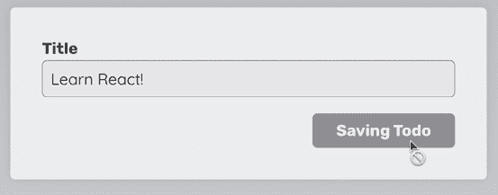

# 9

# 使用表单操作处理用户输入和表单

学习目标

到本章结束时，你将能够做到以下几点：

+   描述 React 表单操作的目的

+   构建和使用自定义表单操作来处理表单提交

+   使用 `useActionState()` 钩子管理表单相关的状态

+   通过 `useFormStatus()` 钩子渲染提交期间的挂起 UI

+   使用 `useOptimistic()` 钩子执行乐观状态更新

+   实现同步和异步操作

# 简介

在 *第四章* ，*与事件和状态一起工作* 中，你学习了如何在 React 应用程序中处理表单提交。虽然那里展示的方法绝对没有问题——实际上，这可能是你在大多数 React 项目中找到的方法——当在使用 React 19 或更高版本的项目中工作时，React 提供了一种处理表单提交的替代方法。React 19 引入了一个名为 **actions**（在本章中也将称为 **表单 actions**）的新功能，它可以简化处理表单提交、提取用户输入和提供验证反馈的过程。

本章将首先回顾 *第四章* 中介绍的表单提交，并探讨如何提取和验证用户输入。之后，本章将介绍表单操作，并解释如何使用该功能执行相同的步骤（处理提交、提取值和验证值）。你还将了解与操作相关的 React 钩子，如 `useActionState()`。

# 处理不带操作的表单提交

如你在 *第四章* ，*与事件和状态一起工作* 中所学，在不使用操作的情况下，你可以通过在 `<form>` 元素的 `onSubmit` 属性上监听 `submit` 事件来处理表单提交。

考虑以下示例代码片段：

```js
function App() {
  **function****handleSubmit****(****event****) {**
    **event.****preventDefault****();**
    **console****.****log****(****'Submitted!'****);**
  **}**
  return (
    <form **onSubmit****=****{handleSubmit}**>
      <p>
        <label htmlFor="email">Email</label>
        <input type="email" id="email" />
      </p>
      <p>
        <label htmlFor="password">Password</label>
        <input type="password" id="password" />
      </p>
      <p className="actions">
        <button>Login</button>
      </p>
    </form>
  );
} 
```

你可以在 GitHub 上找到完整的示例：[`github.com/mschwarzmueller/book-react-key-concepts-e2/tree/09-form-actions/examples/01-form-submission-without-actions`](https://github.com/mschwarzmueller/book-react-key-concepts-e2/tree/09-form-actions/examples/01-form-submission-without-actions)。

此代码显示了一个表单，并通过 `handleSubmit()` 函数处理其提交。此函数自动接收一个 `event` 对象，用于防止浏览器向托管网站的服务器发送 HTTP 请求的默认行为。

但是，当然，仅仅处理提交并不太有用。通常，你还需要提取并使用网站用户输入的值。

## 提取用户输入

当涉及到提取表单中输入的值时，你有几种选择：

+   通过状态（即，使用 `useState()`）跟踪值，如 *第四章* 中所述。

+   如 *第七章* ，*Portals 和 Refs* 中所述，通过 `useRef()` 依赖 Refs。

+   利用自动创建的 `event` 对象。

### 跟踪状态

您可以通过 `useState()` 管理的状态跟踪用户输入的值，如 *第四章* 中所述。例如，可以从上一个代码片段中跟踪和使用表单输入值，如下面的示例所示：

```js
function App() {
  **const** **[email, setEmail] =** **useState****(****''****);**
  **const** **[password, setPassword] =** **useState****(****''****);**
  function handleSubmit(event) {
    event.preventDefault();
    **const** **credentials = { email, password };**
    **console****.****log****(credentials);**
  }
  **function****handleEmailChange****(****event****) {**
    **setEmail****(event.****target****.****value****);**
  **}**
  **function****handlePasswordChange****(****event****) {**
    **setPassword****(event.****target****.****value****);**
  **}**
  return (
    <form onSubmit={handleSubmit}>
      <p>
        <label htmlFor="email">Email</label>
        <input
          type="email"
          id="email"
          **value****=****{email}**
          **onChange****=****{handleEmailChange}**
        />
      </p>
      <p>
        <label htmlFor="password">Password</label>
        <input
          type="password"
          id="password"
          **value****=****{password}**
          **onChange****=****{handlePasswordChange}**
        />
      </p>
      <p className="actions">
        <button>Login</button>
      </p>
    </form>
  );
} 
```

在这个更新的代码片段中，`useState()` 钩子用于管理 `email` 和 `password` 状态值。每当输入字段上的键入时，状态值都会更新。因此，当表单提交时，`handleSubmit()` 中可以获取到最新的输入值。

这种方法效果很好，并且将在许多 React 项目中找到。然而，使用状态来跟踪输入值有一些潜在的缺点：

+   由于状态在每次键入时都会更新，并且组件函数会在某个状态值更改时重新执行，因此应用程序的性能可能会受到影响。

+   当处理具有更多输入字段的更复杂表单时，可能需要管理许多不同的状态值。

您可以通过实现代码优化（将在 *第十章* ，*React 的幕后场景和优化机会* 中讨论）以及按照 *第十一章* ，*处理复杂状态* 中解释的方式将状态作为对象来管理，来绕过这些问题。

但您也可以考虑使用 Refs 来提取输入值。

### 依赖 Refs

如果您正在构建一个不打算设置输入值，而只想在表单提交时读取这些值的表单，使用 React 的 ref 功能（在 *第七章* 中介绍）可能是有意义的：

```js
function App() {
  **const** **emailRef =** **useRef****(****null****);**
  **const** **passwordRef =** **useRef****(****null****);**
  function handleSubmit(event) {
    event.preventDefault();
    const credentials = {
      **email****: emailRef.****current****.****value****,**
      **password****: passwordRef.****current****.****value****,**
    };
    console.log(credentials);
  }
  return (
    <form onSubmit={handleSubmit}>
      <p>
        <label htmlFor="email">Email</label>
        <input type="email" id="email" **ref****=****{emailRef}** />
      </p>
      <p>
        <label htmlFor="password">Password</label>
        <input type="password" id="password" **ref****=****{passwordRef}** />
      </p>
      <p className="actions">
        <button>Login</button>
      </p>
    </form>
  );
} 
```

在这个代码块中，`useRef()` 钩子用于创建两个与电子邮件和密码输入字段连接的 Refs。然后，这些 Refs 被用于在 `handleSubmit()` 中读取输入值。

当使用这种方法时，`App` 组件函数不再会在每次键入时执行。但您仍然需要编写通过 `useRef()` 创建 Refs 的代码，以及通过 `ref` 属性将它们连接到 JSX 元素的代码。

正因如此，您可以考虑依赖浏览器和自动创建的 `event` 对象（在 `handleSubmit()` 中接收），而不是使用 React 特性来提取这些输入值。

### 利用事件对象的优势

在 *第四章* ，*处理事件和状态* 中，您了解到当表单提交时，浏览器会尝试发送一个 HTTP 请求。这就是为什么在 `handleSubmit()` 中调用 `event.preventDefault()` 的原因——这个函数调用确保这个请求不会被发送。

然而，`event` 对象不仅仅用于防止默认行为。它还携带有关发生的 `submit` 事件的 重要信息。例如，您可以通过 `event.currentTarget` 获取底层表单 DOM 对象（即一个描述渲染的 `<form>` 元素、其配置及其当前状态的 JavaScript 对象）。

这非常有用，因为你可以将该表单 DOM 对象传递给浏览器提供的`FormData`构造函数。这个接口可以用来提取表单的输入字段值。

以下示例展示了该功能的具体用法：

```js
function App() {
  function handleSubmit(event) {
    event.preventDefault();
    **const** **fd =** **new****FormData****(event.****currentTarget****);**
    const credentials = {
      email: **fd.****get****(****'email'****)**,
      password: **fd.****get****(****'password'****)**,
    };
    console.log(credentials);
  }
  return (
    <form onSubmit={handleSubmit}>
      <p>
        <label htmlFor="email">Email</label>
        <input type="email" id="email" **name****=****"email"** />
      </p>
      <p>
        <label htmlFor="password">Password</label>
        <input type="password" id="password" **name****=****"password"** />
      </p>
      <p className="actions">
        <button>Login</button>
      </p>
    </form>
  );
} 
```

如上代码片段所示，表单数据对象`fd`是通过实例化`FormData`来构建的。如前所述，`FormData`接口由浏览器提供；因此，不需要从 React 或任何其他库中导入。

这个表单数据对象提供了各种方法来帮助访问表单字段值——例如，`get()`方法用于提取特定输入字段的值。为了确定你想要获取值的输入字段，`get()`方法需要一个输入字段名称作为参数。这就是为什么你必须在表单控件元素（即上面示例中的`<input>`元素）上设置`name`属性的原因。

这种方法的优势在于你不需要状态或 refs；因此，需要编写的代码略少。此外，由于几乎不使用任何 React 特性，这段代码不太可能因为未来的 React 变化而出现错误。

因此，这种方法可能看起来是处理表单提交的最佳方式。但这是真的吗？

## 哪个解决方案最好？

处理表单提交没有正确或错误的方式。除了个人偏好外，应用程序的要求也可能使一种方法优于其他方法。

例如，如果你的应用程序需要更改输入值，仅使用上面显示的`FormData`可能不是最佳选择，因为你将不得不编写命令式代码来更新输入字段。

这是一个问题，因为，如*第一章*中所述，*React – 什么是和为什么？*，你应该避免在你的 React 应用程序中编写这样的代码：

```js
function clearInput() {
  document.getElementById('email').value = ''; // imperative code :(
} 
```

因此，如果你需要编辑输入值，使用状态（即`useState()`）是首选：

```js
const [email, setEmail] = useState('');
// ... other code
function clearInput() {
  setEmail('');
}
// simplified JSX code below
return (
  <form>
    <input 
      value={email} 
      onChange={event => setEmail(event.target.value)} />
  </form>
); 
```

即使你不需要更新任何输入字段，仅使用`event`对象和`FormData`可能也不够。

例如，如果你需要在`handleSubmit()`之外访问输入字段，则`event`对象不可用。结果，通过`event`对象与表单元素及其子元素交互是不可能的。在这种情况下，使用直接连接到单个输入元素的 refs 可能会简化问题。

以下示例使用 ref 来在函数内部调用`<input>`元素的内置`focus()`方法：

```js
const emailRef = useRef(null);
function showForm() {
  // other code ...
  emailRef.current.focus(); 
}
// simplified JSX code below
return (
  <form>
    <input ref={emailRef} />
  </form>
); 
```

因此，正如你所见，没有一劳永逸的解决方案。所有这些 React 特性和处理表单提交的不同方式都存在合理的理由。你可以根据需要混合使用它们；因此，了解这些不同的选项是有帮助的。

尽管已经有几种处理表单提交的方法，但 React 19 又提供了一种新的方法。

# 使用动作处理表单提交

React 19 引入了（表单）动作的概念——这个概念实际上包含两种类型的动作：**客户端动作**和**服务器动作**。这两种类型的动作都可以帮助处理表单提交，但为了本章节的目的，术语**表单动作**将用于描述客户端动作（即，在网站用户的浏览器中执行的表单动作）。服务器动作将在第十六章*React 服务器组件与服务器动作*中单独介绍。

表单动作的引入是为了简化处理表单提交和数据提取的过程——尤其是在构建带有服务器动作的全栈应用程序时。此外，当与一些新的 React Hooks 结合使用时，它们也非常有用，这些 Hooks 将在本章的后面讨论。

下面是如何通过客户端表单动作处理表单提交的示例：

```js
function App() {
  function **submitAction****(****formData****)** {
    const credentials = {
      email: formData.get('email'),
      password: formData.get('password'),
    };
    console.log(credentials);
  }
  return (
    <form **action****=****{submitAction}**>
      <p>
        <label htmlFor="email">Email</label>
        <input type="email" id="email" name="email" />
      </p>
      <p>
        <label htmlFor="password">Password</label>
        <input type="password" id="password" name="password" />
      </p>
      <p className="actions">
        <button>Login</button>
      </p>
    </form>
  );
} 
```

初看，这个例子可能看起来与使用 `event` 对象和 `currentTarget` 来推导 `FormData` 的代码片段非常相似。但如果你仔细观察，你会发现一些关键的区别：

+   `handleSubmit` 已更名为 `submitAction`，并接受一个名为 `formData` 的参数，而不是 `event`。

+   `<form>` 元素不再有 `onSubmit` 属性——相反，现在它有一个指向 `submitAction` 函数的 `action` 属性。

函数名称更改是可选的；没有技术要求必须将此函数命名为 `submitAction` 或类似名称。但更改名称是有意义的，因为该函数不再直接处理 `submit` 事件。相反，它被用作新添加的 `action` 属性的值。

这正是 React 的表单动作功能的核心所在：将 `<form>` 元素的 `action` 属性设置为函数，当表单提交时，React 将代表你调用该函数。然而，与使用 `onSubmit` 属性不同，React 将阻止浏览器默认行为，并为你创建一个表单数据对象（并将该对象作为参数传递给动作函数）。

你不再需要手动执行这些步骤，因此，表单提交可以用最少的代码来处理。

当然，如果你需要手动设置和管理输入值，或者在某些时候需要与表单字段交互（例如，调用 `focus()`），你仍然需要与状态或 Refs 一起工作。但如果你只是尝试处理提交并获取输入值，使用表单动作功能将非常方便。

但表单动作之所以有用，不仅仅是因为它们可能需要更少的代码。

## 同步动作与异步动作

客户端表单动作可以是同步的，也可以是异步的，这意味着你还可以在动作函数中使用并返回一个 `Promise`。因此，你还可以使用 `async / await` 与该函数一起使用。

例如，如果你有一个旨在将一些任务数据存储在浏览器存储中的表单（通过`localStorage` API），你可以使用同步操作来完成（因为`localStorage`是一个同步 API）：

```js
function storeTaskAction(formData) {
  const task = {
    title: formData.get('title'),
    body: formData.get('body'),
    dueDate: formData.get('date')
  };
  localStorage.setItem('daily-task', JSON.stringify(task));
} 
```

这个操作函数是同步的，因为它不返回`Promise`或使用`async / await`。因此，正如你所看到的，迄今为止的所有表单操作示例都使用了同步操作。

但是，如果你正在开发一个需要通过 HTTP 请求将输入数据提交到后端的项目，你可以利用对异步代码的支持：

```js
**async** function storeTodoAction(formData) {
  const todoTitle = formData.get('title');
  const response = await fetch(
    'https://jsonplaceholder.typicode.com/todos', 
    {
      method: 'POST',
      body: JSON.stringify({ title: todoTitle }),
      headers: {
        'Content-type': 'application/json; charset=UTF-8',
      },
    }
  );
  const todo = await response.json();
  console.log(todo);
} 
```

在这个例子中，在函数前添加了`async`关键字。这会将函数转换为异步函数，该函数将返回一个`Promise`。

React 表单操作功能提供的这种灵活性非常有用，因为它允许你在表单提交时执行各种操作。然而，重要的是要记住，目前所有这些操作都是在客户端执行的，即在网站访问者的浏览器中。服务器端操作将在*第十六章*中探讨。

# 底层：操作是过渡

在深入研究表单操作之前，简要地看看底层可能有所帮助。

这是因为，从技术上讲，React 中的操作（即客户端和服务器操作）被称为所谓的**过渡**。更准确地说，它们是异步过渡。

因此，问题是，React 中的过渡是什么？

在 React 应用中，过渡是一个概念，React 将确保一些可能耗时的状态更新不会阻塞 UI 更新。

表单操作可以被认为是（潜在的）耗时的状态更新；因此，在底层，React 以使其剩余 UI 保持响应性的方式处理它们。

因此，你在一个表单操作函数内部做出的任何状态更新调用都只会在该表单操作完成后由 React 处理。例如，以下代码可能会出乎意料地只更新 UI 三秒后：

```js
import { useState } from 'react';
function App() {
  const [error, setError] = useState(null);
  async function storeTodoAction(formData) {
    const todoTitle = formData.get('title');
    if (!todoTitle || todoTitle.trim() === '') {
      **setError****(****'Title is required.'****);** **// state update BEFORE delay**
    }
    **// 3s delay to simulate a slow process**
    **await****new****Promise****(****(****resolve****) =>****setTimeout****(resolve,** **3000****));** 
    console.log('Submission done!');
  }
  return (
    <>
      <form action={storeTodoAction}>
        <p>
          <label htmlFor="title">Title</label>
          <input type="text" id="title" name="title" />
        </p>
        {error && <p className="errors">{error}</p>}
        <p className="actions">
          <button>Store Todo</button>
        </p>
      </form>
    </>
  );
} 
```

即使在延迟开始之前更新了`error`状态，React 也不会在表单操作整体完成之前重新执行组件函数（因此，更新 UI）。因此，错误信息只会在三秒后出现在屏幕上。


图 9.1：错误信息会延迟显示

**注意**

你可以在 GitHub 上找到完整的示例代码：[`github.com/mschwarzmueller/book-react-key-concepts-e2/tree/09-form-actions/examples/08-transition`](https://github.com/mschwarzmueller/book-react-key-concepts-e2/tree/09-form-actions/examples/08-transition)。

# 基于表单提交管理状态

在处理表单提交时，您可能还希望在提交后更新 UI。对于异步操作，执行的操作可能需要几秒钟（当然，这取决于操作），您甚至可能希望在提交过程中更新 UI，显示一些挂起状态，同时提交的表单正在处理中。

React 旨在通过提供两个特定的表单操作相关的 Hooks 来帮助您满足这两个要求：`useActionState()`和`useFormStatus()`。

## 使用 useActionState()更新 UI 状态

React 提供了一个名为`useActionState()`的 Hook，它旨在与表单操作一起使用——无论您是处理客户端还是服务器操作。

这个 Hook 的目标是帮助您根据表单操作的结果更新应用程序的 UI。

例如，这可以帮助验证表单输入值，并在输入无效时显示错误消息。为了执行此任务，可以从`react`包中导入`useActionState()` Hook 并按如下方式使用：

```js
**import** **{ useActionState }** **from****'react'****;**
function App() {
  async function storeTodoAction(**prevState**, formData) {
    const todoTitle = formData.get('title');
    if (!todoTitle || todoTitle.trim() === '') {
      **return** **{**
        **error****:** **'Title must not be empty.'****,**
      **};**
    }
    // sending HTTP request etc...
    **return** **{**
      **error****:** **null****,**
    **};**
  }
  **const** **[formState, formAction] =** **useActionState****(storeTodoAction, {**
    **error****:** **null****,**
  **});**
  return (
    <form **action****=****{formAction}**>
      <p>
        <label htmlFor="title">Title</label>
        <input type="text" id="title" name="title" />
      </p>
      **{formState.error &&** **<****p****className****=****'errors'****>**
        **{formState.error}**
      **</****p****>****}**
      <p className="actions">
        <button>Store Todo</button>
      </p>
    </form>
  );
} 
```

当运行此示例应用程序时，如果存在无效输入，用户将看到验证错误消息。


图 9.2：提交空输入字段时显示错误消息

在这个代码示例中发生了一些事情：

+   表单操作函数已被修改为接受两个参数而不是一个：前一个状态（`prevState`）和提交的数据（`formData`）。

+   现在表单操作也返回一个值：一个包含名为`error`的键的对象，其中包含错误消息或`null`。

+   `useActionState()` Hook 被导入并使用：它接收表单操作函数（`storeTodoAction`）作为第一个参数，以及一些初始状态对象（在这种情况下为`{error: null}`）作为第二个参数。

+   `useActionState()` Hook 也返回一个值：一个数组，从中解构出两个元素（`formState`和`formAction`）。

+   解构的`formAction`取代了`storeTodoAction`作为`<form>`的`action`属性的值。

+   `formState`用于有条件地显示存储在`formState`的`error`键中的值。

因此，如您所见，`useActionState()`是一个 Hook，它期望一个表单操作函数（同步或异步）作为第一个参数，以及一个初始状态作为第二个输入。这个初始状态需要有一些状态可用，如果表单尚未提交。在表单提交后，初始状态将被表单操作函数返回的新状态值所取代。

由于`useActionState()`的目的在于提供一些可以用来更新（部分）UI 的状态值，因此这个派生状态通过`useActionState()`返回的值暴露出来：

```js
const [**formState**, formAction] = useActionState(storeTodoAction, {
    error: null,
  }
); 
```

返回的值是一个包含恰好三个元素的数组，顺序如下：

1.  当前状态值，要么是初始状态（如果表单尚未提交），要么是表单操作函数返回的状态值。

1.  一个更新的表单操作函数，本质上就是你的操作函数，由 React 包装。这是必要的，以便 React 能够访问你的操作函数返回的值（即新状态）。

1.  一个布尔值，表示表单当前是否正在提交。这个第三个元素在之前的代码示例中没有使用，将在本章的“管理待处理 UI 状态”部分进行讨论。

因此，当使用`useActionState()`时，你不再将你的操作函数绑定到`<form>`元素的`action`属性上。相反，你使用由`useActionState()`创建的操作函数——即你使用包装你的操作函数的操作函数。

当使用`useActionState()`时，你还必须调整你的表单操作函数，因为 React 将使用两个参数调用你的函数，而不是一个：前一个状态和提交的表单数据：

```js
async function storeTodoAction(**prevState**, formData) {
  // ...
} 
```

将前一个表单状态传递给你的操作函数，这样你就可以使用它来从它推导出你的新状态（与提交的表单数据结合使用）。在上面的示例中，这实际上并不是这样——前一个状态参数在那里没有被使用。尽管如此，它仍然必须作为参数接受。

然而，对表单操作函数所做的更改不止这些。相反，现在它还应该返回一个新的状态值，然后通过`useActionState()`（通过`useActionState()`返回的数组中的第一个元素）暴露给组件函数：

```js
async function storeTodoAction(**prevState**, formData) {
  // ...
  return {
    error: 'Title must not be empty.'
  };
} 
```

该状态值可以是任何东西——一个字符串、一个数字、一个数组、一个对象等。在之前的代码示例中，它是一个具有名为`error`的键的对象，该键包含`null`或一个字符串错误消息。

每当表单提交时，因此表单操作函数被执行或返回一个值，`useActionState()`将触发 React 重新执行周围的组件函数。因此，更新后的状态变得可用。如果你觉得这与`useState()`相似，你是对的！`useActionState()`本质上就像`useState()`，但经过微调，可以从操作中推导状态。

因此，`useActionState()`肯定是一个重要的 Hook，尽管它实际上并不仅限于仅将你的操作函数返回的值暴露给组件函数。

### 使用`useActionState()`管理待处理 UI 状态

考虑一个场景，你有一个表单操作需要几秒钟才能完成其操作。例如，你可以有一个向慢速服务器或通过慢速互联网连接发送请求的操作。在这种情况下，你可能想在表单提交期间更新 UI，以向用户显示正在发生某些事情。

在下面的示例中，从表单操作内部调用了名为`saveTodo()`的函数。该函数故意延迟三秒钟来模拟缓慢的网络或服务器：

```js
**async****function****saveTodo****(****todo****) {**
  **// dummy function that simulates a slow backend which manages todos**
  **await****new****Promise****(****(****resolve****) =>****setTimeout****(resolve,** **3000****));** **// delay**
  **const** **response =** **await****fetch****(**
    **'https://jsonplaceholder.typicode.com/todos'****, {**
      **method****:** **'POST'****,**
      **body****:** **JSON****.****stringify****(todo),**
      **headers****: {**
        **'Content-type'****:** **'application/json; charset=UTF-8'****,**
      **},**
    **}**
  **);**
  **const** **fetchedTodo =** **await** **response.****json****();**
  **console****.****log****(fetchedTodo);**
**}**
function App() {
  async function storeTodoAction(prevState, formData) {
    const todoTitle = formData.get('title');
    if (!todoTitle || todoTitle.trim() === '') {
      return {
        error: 'Title must not be empty.',
      };
    }
    **await****saveTodo****({** **title****: todoTitle });**
    return {
      error: null,
    };
  }
  // same code as before, hence omitted
} 
```

当使用表单操作，如本例所示，在处理表单提交时更新 UI 相对容易，因为`useActionState()`在其返回的数组中暴露了第三个元素：一个布尔值，指示操作是否正在执行。

因此，上述示例可以调整如下，以利用该布尔值：

```js
function App() {
  async function storeTodoAction(prevState, formData) {
    // same code as before, hence omitted
  }
  const [formState, formAction, **pending**] = useActionState(
    storeTodoAction, 
    {
      error: null,
    }
  );
  return (
    <form action={formAction}>
      <p>
        <label htmlFor="title">Title</label>
        <input type="text" id="title" name="title" />
      </p>
      {formState.error && 
        <p className="errors">{formState.error}</p>}
      <p className="actions">
        <button **disabled****=****{pending}**>
          **{pending ? 'Saving' : 'Store'} Todo**
        </button>
      </p>
    </form>
  );
} 
```

通过解构从数组中检索`pending`元素，然后使用它来禁用`<button>`并更新按钮文本。

因此，一旦表单提交，UI 就会发生变化——直到三秒后完成（在这种情况下，由于之前在`saveTodo()`函数中添加的延迟）。



图 9.3：按钮在表单提交期间被禁用，并显示“保存待办”回退文本

## 使用`useFormStatus()`处理待处理 UI 状态

`useActionState()`返回的`pending`元素是一个简单直接的方法，但不是唯一的方法，在表单操作执行时更新 UI。

React 还提供了一个`useFormStatus()` Hook，它提供了有关当前表单提交状态的信息。更准确地说，这是`react-dom`包（而不是`react`！）导出的`useFormStatus()` Hook。

与`useActionState()`不同，`useFormStatus()`必须在某个嵌套组件中调用，该组件被包裹在您感兴趣的提交状态的`<form>`元素中。

例如，您可以构建一个`SubmitButton`组件，如以下代码片段所示：

```js
**import** **{ useFormStatus }** **from****'react-dom'****;**
import { saveTodo } from './todos.js';
function SubmitButton() {
  **const** **{ pending } =** **useFormStatus****();**
  return (
    <button disabled={pending}>
      **{pending ? 'Saving' : 'Store'} Todo**
    </button>
  );
}
function App() {
  async function storeTodoAction(formData) {
    const todo = { title: formData.get('title') };
    await saveTodo(todo);
  }
  return (
    <form action={storeTodoAction}>
      <p>
        <label htmlFor="title">Title</label>
        <input type="text" id="title" name="title" />
      </p>
      <p className="actions">
        **<****SubmitButton** **/>**
      </p>
    </form>
  );
} 
```

在此示例中，将待办事项发送到后端服务器的实际代码被提取到一个单独的`saveTodo()`函数中，该函数存储在`todo.js`文件中。该函数包含与之前示例中相同的代码（即，它向 JSONPlaceholder 发送 HTTP 请求）。此外，移除了`useActionState()`以使代码更短、更简单。然而，您绝对可以在`useFormStatus()`与`useActionState()`结合使用。例如，您可以使用`useActionState()`输出验证错误，同时在单独的嵌套组件中通过`useFormStatus()`管理提交按钮的`disabled`状态。

`useFormStatus()`从`react-dom`导入，并在`SubmitButton`组件函数内部调用。它返回一个包含一个`pending`属性，该属性产生一个布尔值的对象。

如前所述，`useFormStatus()`不能用于渲染`<form>`元素的组件中。相反，它必须在嵌套组件中使用——这就是为什么`<SubmitButton>`组件被放置在`<form>`标签之间。

除了`pending`之外，`useFormStatus()`返回的对象还包含三个其他属性：

+   `data`：一个`FormData`对象，包含提交父`<form>`时使用的数据（即，与表单操作函数接收的数据相同）。

+   `method`：一个字符串值，可以是 `'get'` 或 `'post'` ，反映 `<form>` 元素的 `method` 属性设置的值。默认情况下，它是 `'get'` 。

+   `action`：指向与 `<form>` 相连的表单操作函数的指针。

如果你只关心待处理状态，当然你可以使用 `useActionState()` 或 `useFormStatus()` 。使用 `useActionState()` 的优点是无需构建单独的嵌套组件。另一方面，如果你在页面上有多个表单，创建这样一个额外的组件并依赖于 `useFormStatus()` 可能是有用的——例如，你可以在所有这些表单中重用 `<SubmitButton>`。

# 执行乐观更新

除了 `useActionState()` 和 `useFormStatus()` ，React 还提供了一个与表单和表单操作相关的重要的最后一个 Hook：`useOptimistic()` Hook。

这个 Hook 背后的想法是，你可以用它来显示一些临时的、乐观的 UI，同时异步表单操作（可能需要几秒钟）正在进行中。“乐观”意味着你可以使用这个 Hook 来渲染通常只有在表单提交完成后才存在的 UI（例如，已经包括新提交的任务的待办事项列表）。

以下示例代码使用 `<form>` 和表单操作管理待办事项列表，但没有使用 `useOptimistic()` ：

```js
import { useFormStatus } from 'react-dom';
import { useState } from 'react';
let storedTodos = [];
export async function saveTodo(todo) {
  // dummy function that simulates a slow backend which manages todos
  **await****new****Promise****(****(****resolve****) =>****setTimeout****(resolve,** **3000****));**
  const newTodo = { ...todo, id: new Date().getTime() };
  storedTodos = [...storedTodos, newTodo];
  return storedTodos;
}
function SubmitButton() {
  // same as before, didn't change, hence omitted here
}
function App() {
  **const** **[todos, setTodos] =** **useState****(storedTodos);**
  async function storeTodoAction(formData) {
    const todo = { title: formData.get('title') };
    const updatedTodos = await saveTodo(todo); // takes 3s
    **setTodos****(updatedTodos);**
  }
  return (
    <>
      <form action={storeTodoAction}>
        <p>
          <label htmlFor="title">Title</label>
          <input type="text" id="title" name="title" />
        </p>
        <p className="actions">
          <SubmitButton />
       </p>
      </form>
      <div id="todos">
        <h2>My Todos</h2>
        **{todos.length === 0 &&** **<****p****>****No todos found.****</****p****>****}**
        **{todos.length > 0 && (**
          **<****ul****>**
            **{todos.map((todo) => (**
              **<****li****key****=****{todo.id}****>****{todo.title}****</****li****>**
            **))}**
          **</****ul****>**
        **)}**
      </div>
    </>
  );
} 
```

在这个例子中，由于 `saveTodo()` 函数再次内置了三秒钟的故意延迟，网站用户会看到过时的待办事项列表，直到表单提交过程完成。


图 9.4：没有乐观更新时，UI 更新被延迟

因此，可以通过引入 `useOptimistic()` Hook 来提高用户体验。

这个 Hook 需要两个参数，并返回一个包含恰好两个元素的数组：

```js
const [optimisticState, addOptimistic] = useOptimistic(
  state, updateFunction
); 
```

+   `state`（第一个参数）是初始时应处于活动状态或没有待处理的表单操作时的组件状态。

+   `updateFunction`（第二个参数）是你定义的函数，它控制状态应该如何乐观地更新。

+   `optimisticState` 是在表单操作执行期间将处于活动状态的乐观更新状态。

+   `addOptimistic` 触发 `updateFunction` 并允许你向该函数传递一个值。

应用到上述示例中，`useOptimistic()` 可以用来管理一个替代的、乐观更新的待办事项数组，只要表单操作正在执行，这个数组就会是活动的。之后，常规状态将再次变得活跃（并相应地更新 UI）：

```js
**import** **{ useOptimistic }** **from****'react'****;**
import { saveTodo, getTodos } from './todos.js';
import { useState } from 'react';
function SubmitButton() {
  // same code as before, hence omitted
}
function App() {
  const loadedTodos = getTodos(); // initial fetch
  const [todos, setTodos] = useState(loadedTodos);
  **const** **[optimisticTodos, addOptimisticTodo] =** **useOptimistic****(**
    **todos,**
    **(****currentState, optimisticValue****) =>** **{**
      **return** **[...currentState, { ...optimisticValue,** **id****:** **'temp'** **}];**
    **}**
  **);**
  async function storeTodoAction(formData) {
    const todo = { title: formData.get('title') };
    **addOptimisticTodo****(todo);**
    const updatedTodos = await saveTodo(todo);
    setTodos(updatedTodos);
  }
  return (
    <form action={storeTodoAction}>
      <p>
        <label htmlFor="title">Title</label>
        <input type="text" id="title" name="title" />
      </p>
      <p className="actions">
        <SubmitButton />
      </p>
    </form>
    <div id="todos">
      <h2>My Todos</h2>
      {**optimisticTodos**.length === 0 && <p>No todos found.</p>}
      {**optimisticTodos**.length > 0 && (
        <ul>
          {**optimisticTodos**.map((todo) => (
            <li key={todo.id}>{todo.title}</li>
          ))}
        </ul>
      )}
    </div>
  );
} 
```

如此例所示，`optimisticTodos` 状态现在被用于 JSX 代码中。该常量中存储的值要么是正常的 `todos` 状态（由 `useState()` 管理），如果 `storeTodoAction()` 表单操作没有执行，要么是传递给 `useOptimistic()` 的函数生成的数组（作为第二个参数）。


图 9.5：使用 `useOptimistic()` 后，提交后 UI 立即更新

使用 `useOptimistic()` 钩子可以帮助构建一个出色的用户体验，即使某些慢速进程可能仍在后台运行，您的应用程序也能提供即时反馈。由于一旦表单提交完成，临时的乐观状态总会被常规状态（即 `todos` 状态）所取代，因此也不会有显示不正确用户界面的风险。如果操作失败，React 将会自动将暂时不正确的用户界面替换为正确的界面，当它回退到使用常规状态时。

# 摘要和关键要点

+   表单提交可以通过手动监听 `submit` 事件通过 `onSubmit` 属性来处理。

+   或者，可以使用表单操作——即绑定到 `<form>` 元素的 `action` 属性的函数。

+   当手动处理表单提交（通过 `onSubmit`）时，您可以使用状态（`useState()`）、Refs（`useRef()`）或从 `event.currentTarget` 创建一个 `FormData` 对象来提取表单字段值。

+   当使用表单操作时，一个包含表单字段输入值的表单数据对象会自动作为参数传递给操作函数。

+   `useActionState()` 钩子可以用来管理与表单相关的状态（例如，验证错误消息）。

+   `useActionState()` 也提供了一个待定布尔值，可以在表单操作处理时用于更新用户界面。

+   在嵌套组件（嵌套在 `<form>` 内）中，可以调用 `useFormStatus()` 钩子来获取和使用有关父表单提交状态的信息。

+   为了在处理慢速后台进程（例如，慢速 HTTP 请求）时提供快速的用户界面更新，`useOptimistic()` 钩子可能有所帮助。

## 接下来是什么？

处理表单和处理用户输入是大多数网络应用程序中一个非常常见的任务。当然，React 应用程序也不例外。

正因如此，React 提供了广泛的方法和可能的模式，您可以使用它们来处理表单提交和提取用户输入。本章探讨了并比较了两种主要的方法：使用 `onSubmit` 属性或依赖表单操作（仅从 React 19 开始可用）。

正如本章中解释和展示的那样，这两种方法都是有效的，并且各有用例。个人偏好以及应用程序需求都很重要，并将影响您的决策。

到这本书的这一部分，您已经了解了构建功能丰富的网络应用程序所需的所有关键 React 概念。下一章将深入 React 的幕后，探索它是如何内部工作的。您还将了解一些常见的优化技术，这些技术可以使您的应用程序性能更佳。

## 测试你的知识！

通过回答以下问题来测试您对本章所涵盖概念的了解。然后，您可以比较您的答案与可在[`github.com/mschwarzmueller/book-react-key-concepts-e2/blob/09-form-actions/exercises/questions-answers.md`](https://github.com/mschwarzmueller/book-react-key-concepts-e2/blob/09-form-actions/exercises/questions-answers.md) 找到的示例：

1.  “表单操作”是什么？

1.  如何在表单操作内部访问用户输入？

1.  `useActionState()` 钩子的目的是什么？它是如何使用的？

1.  `useFormStatus()` 钩子的目的是什么？它是如何使用的？

1.  `useActionState()` 和 `useFormStatus()` 之间的区别是什么？

1.  `useOptimistic()` 钩子的目的是什么？它是如何使用的？

# 应用所学知识

在您的 React 工具包中添加表单操作，您又有另一种强大的处理表单提交和提取用户输入的方法。

在以下部分，您将找到一个活动，允许您练习使用表单操作和 React 提供的与表单相关的钩子。一如既往，您还需要应用之前章节中介绍的一些概念（例如处理状态或输出列表）。

## 活动九.1：管理反馈表单

在这个活动中，您的任务是构建一个现有的、基本的反馈表单应用程序，并使用表单操作处理表单提交。作为此活动的一部分，您应该验证提交的标题和反馈文本，并在提交空值时显示错误消息。您还应该乐观地更新提交的反馈项列表，并在表单操作进行时禁用提交按钮。

**注意**

您可以在[`github.com/mschwarzmueller/book-react-key-concepts-e2/tree/09-form-actions/activities/practice-1-start`](https://github.com/mschwarzmueller/book-react-key-concepts-e2/tree/09-form-actions/activities/practice-1-start) 找到此活动的起始代码。在下载此代码时，您将始终下载整个存储库。请确保导航到包含起始代码的子文件夹（在这种情况下为 `activities/practice-1-start`）以使用正确的代码快照。

下载代码后，在项目文件夹中运行 `npm install` 以安装所有必需的依赖项，解决方案步骤如下：

1.  将现有的 `onSubmit` 处理器函数替换为表单操作—之后清理并删除不再需要的任何代码。

1.  在表单操作处理过程中禁用表单提交按钮。

1.  使用 `useActionState()` 钩子验证用户输入并输出任何错误消息。

1.  通过利用 `useOptimistic()` 钩子乐观地更新提交的反馈项列表。

预期结果应类似于以下截图：


图 9.6：在表单提交期间，按钮被禁用，但提交的项目立即显示


图 9.7：当提交无效值时，会显示适当的错误信息

**注意**

您可以在此处找到完整的示例解决方案：[`github.com/mschwarzmueller/book-react-key-concepts-e2/tree/09-form-actions/activities/practice-1`](https://github.com/mschwarzmueller/book-react-key-concepts-e2/tree/09-form-actions/activities/practice-1) .
