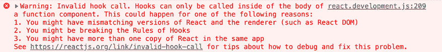
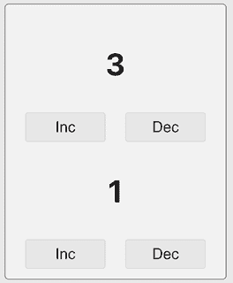

# 12

# 构建 Custom React 钩子

学习目标

到本章结束时，您将能够做到以下几件事情：

+   构建您自己的 React 钩子

+   在您的组件中使用自定义和默认 React 钩子

# 简介

在本书中，一个关键的 React 功能被反复以许多不同的变体引用。这个功能就是 React 钩子。

钩子几乎提供了 React 所有的核心功能和概念——从单个组件中的状态管理到在多个组件中访问跨组件状态（上下文）。它们允许您通过 refs 访问 JSX 元素，并允许您在组件函数内部处理副作用。

没有钩子，现代 React 就无法工作，构建功能丰富的应用程序将是不可能的。

到目前为止，只介绍了内置钩子并使用了它们。然而，您也可以构建自己的自定义钩子——或者您可以使用其他开发者构建的自定义钩子（例如，通过使用第三方库）。在本章中，您将了解为什么您可能想要这样做以及它是如何工作的。

# 介绍 Custom 钩子

在开始构建自定义钩子之前，了解自定义钩子究竟是什么非常重要。

在 React 应用中，自定义钩子是满足以下条件的常规 JavaScript 函数：

+   函数名称以 `use` 开头（就像所有内置钩子一样以 `use` 开头：`useState()` 、`useReducer()` 等）。

+   函数调用另一个 React 钩子（一个内置的或自定义的——无关紧要）。

+   此函数不仅返回 JSX 代码（否则，它本质上就是一个 React 组件），尽管它可以返回一些 JSX 代码——只要这不是返回的唯一值。

如果一个函数满足以下三个条件，它可以（并且应该）被称为自定义（React）钩子。因此，自定义钩子实际上只是具有特殊名称（以 `use` 开头）的正常函数，这些函数调用其他（自定义或内置）钩子，并且不（仅）返回 JSX 代码。如果您在其他地方（例如，在函数外部或在常规的非钩子函数中）尝试调用（自定义或内置）钩子，您可能会收到警告（取决于您的项目设置；见下文）。

例如，以下函数使用了 `useEffect()` 钩子，但其名称不以 `use` 开头。因此，它不符合官方的命名建议：

```js
function sendAnalyticsEvent(event) {
  useEffect(() => {
    fetch('https://my-analytics-backend.com/events', {
      method: 'POST',
      body: JSON.stringify(event)
    })
  }, []);
} 
```

在执行代码检查以查找规则违规的项目中，此代码将产生警告，因为此函数不符合自定义钩子的资格（由于其名称）。



图 12.1：React 会抱怨你在错误的位置调用钩子函数

正如警告所述，无论是自定义还是内置的钩子，都必须仅在组件函数内部调用。尽管警告消息没有明确提到，它们也可以在自定义钩子内部调用。

因此，如果将 `sendAnalyticsEvent()` 函数重命名为 `useSendAnalyticsEvent()` ，警告就会消失，因为现在该函数符合自定义钩子的资格。

尽管从技术上讲，这不是 React 本身强制执行的规定规则，但强烈建议遵循此命名约定。

能够构建自定义钩子是一个极其重要的功能，因为它意味着你可以构建包含状态逻辑的可重用非组件函数（通过`useState()`或`useReducer()`），在你的可重用自定义钩子函数中处理副作用（通过`useEffect()`），或使用任何其他 React 钩子。使用正常的非钩子函数，这些都不可能实现，因此你将无法将这些涉及 React 钩子的任何逻辑外包到这样的函数中。

以这种方式，自定义钩子补充了 React 组件的概念。虽然 React 组件是可重用的 UI 构建块（可能包含状态逻辑），但自定义钩子是可重用的逻辑片段，可以在你的组件函数中使用。因此，自定义钩子帮助你跨组件重用共享逻辑。例如，自定义钩子使你能够将发送 HTTP 请求和处理相关状态（加载、错误等）的逻辑外包出去。

## 为什么你会构建自定义钩子？

在上一章（*第十一章*，*处理复杂状态*）中，当介绍了`useReducer()`钩子时，提供了一个示例，其中钩子被用于发送 HTTP 请求。这里再次提供相关的最终代码：

```js
const initialHttpState = {
  data: null,
  isLoading: false,
  error: null,
};
function httpReducer(state, action) {
  if (action.type === 'FETCH_START') {
    return {
      ...state, // copying the existing state
      isLoading: state.data ? false : true,
      error: null,
    };
  }
  if (action.type === 'FETCH_ERROR') {
    return {
      data: null,
      isLoading: false,
      error: action.payload,
    };
  }
  if (action.type === 'FETCH_SUCCESS') {
    return {
      data: action.payload,
      isLoading: false,
      error: null,
    };
  }
  return initialHttpState; // default value for unknown actions
}
function App() {
  const [httpState, dispatch] = useReducer(
    httpReducer, 
    initialHttpState
  );
  const fetchPosts = useCallback(async function fetchPosts() {
    dispatch({ type: 'FETCH_START' });
    try {
      const response = await fetch(
        'https://jsonplaceholder.typicode.com/posts'
      );
      if (!response.ok) {
        throw new Error('Failed to fetch posts.');
      }
      const posts = await response.json();
      dispatch({ type: 'FETCH_SUCCESS', payload: posts });
    } catch (error) {
      dispatch({ type: 'FETCH_ERROR', payload: error.message });
    }
  }, []);
  useEffect(
    function () {
      fetchPosts();
    },
    [fetchPosts]
  );
  return (
    <>
      <header>
        <h1>Complex State Blog</h1>
        <button onClick={fetchPosts}>Load Posts</button>
      </header>
      {httpState.isLoading && <p>Loading...</p>}
      {httpState.error && <p>{httpState.error}</p>}
      {httpState.data && <BlogPosts posts={httpState.data} />}
    </>
  );
}; 
```

在这个代码示例中，每当`App`组件首次渲染时，就会发送一个 HTTP 请求。HTTP 请求获取一个（虚拟的）帖子列表。在请求完成之前，向用户显示一个加载消息（`<p>Loading…</p>`）。如果有错误，则显示错误消息。

如您所见，必须编写相当多的代码来处理这个相对基本的使用场景。特别是在更大的 React 应用程序中，很可能多个组件需要发送 HTTP 请求。它们可能不需要发送到相同 URL（例如，`https://jsonplaceholder.typicode.com/posts`）的完全相同的请求，但肯定有可能不同的组件会从不同的 URL 获取不同的数据。

因此，几乎完全相同的代码必须在多个组件中反复编写。这不仅仅是发送 HTTP 请求的代码（即由`useCallback()`包装的函数）。相反，HTTP 相关的状态管理（在本例中通过`useReducer()`完成），以及通过`useEffect()`进行的请求初始化，必须在所有这些组件中重复。

正是自定义钩子（Custom Hooks）在这里拯救了局面。自定义钩子通过允许你构建可重用、可能具有状态的“逻辑片段”，这些片段可以在组件之间共享，帮助你避免这种重复。

## 第一个自定义钩子

在探索高级场景和解决之前提到的 HTTP 请求问题之前，这里有一个更基本的第一个自定义钩子的例子：

```js
import { useState } from 'react';
function useCounter() {
  const [counter, setCounter] = useState(0);
  function increment() {
    setCounter(oldCounter => oldCounter + 1);
  };
  function decrement() {
    setCounter(oldCounter => oldCounter - 1);
  };
  return { counter, increment, decrement };
};
export default useCounter; 
```

这段代码可以存储在 `hooks/` 文件夹内的一个名为 `use-counter.js` 的文件中——尽管这两个名称完全由您决定。关于文件名或文件夹名（或一般而言，存储此代码的位置）没有规则。由于此文件不包含 JSX 代码，因此文件扩展名是 `.js` 而不是 `.jsx`。

如您所见，`useCounter` 是一个常规的 JavaScript 函数。函数名以 `use` 开头，因此这个函数符合自定义钩子的标准（这意味着在它内部使用其他钩子时，您不会收到任何警告信息）。

在 `useCounter()` 内部，通过 `useState()` 管理一个 `counter` 状态。状态通过两个嵌套函数（`increment` 和 `decrement`）进行更改，状态以及函数都由 `useCounter` 返回（在 JavaScript 对象中一起分组）。

**注意**

将 `counter`、`increment` 和 `decrement` 一起分组的语法使用了常规的 JavaScript 功能：简写属性名。

如果一个对象的属性名与分配给该属性的变量的名称完全匹配，您可以使用这种简短的表示法。

而不是编写 `{ counter: counter, increment: increment, decrement: decrement }`，您可以使用上面片段中显示的简写表示法 `{ counter, increment, decrement }`。

这个自定义钩子可以存储在单独的文件中（例如，在 React 项目的 `hooks` 文件夹中，如 `src/hooks/use-counter.js`）。之后，它可以在任何 React 组件中使用，并且您可以在所需的任何数量的 React 组件中使用它。

例如，以下两个组件（`Demo1` 和 `Demo2`）可以这样使用这个 `useCounter` 钩子：

```js
import useCounter from './hooks/use-counter.js';
function Demo1() {
  const { counter, increment, decrement } = useCounter();
  return (
    <>
      <p>{counter}</p>
      <button onClick={increment}>Inc</button>
      <button onClick={decrement}>Dec</button>
    </>
  );
};
function Demo2() {
  const { counter, increment, decrement } = useCounter();
  return (
    <>
      <p>{counter}</p>
      <button onClick={increment}>Inc</button>
      <button onClick={decrement}>Dec</button>
    </>
  );
};
function App() {
  return (
    <main>
      <Demo1 />
      <Demo2 />
    </main>
  );
};
export default App; 
```

**注意**

您可以在 [`github.com/mschwarzmueller/book-react-key-concepts-e2/tree/12-custom-hooks/examples/01-first-hook`](https://github.com/mschwarzmueller/book-react-key-concepts-e2/tree/12-custom-hooks/examples/01-first-hook) 找到完整的示例代码。

`Demo1` 和 `Demo2` 组件都在它们的组件函数内部执行 `useCounter()`。`useCounter()` 函数被称为普通函数，因为它是一个常规的 JavaScript 函数。

由于 `useCounter` 钩子返回一个包含三个属性（`counter`、`increment` 和 `decrement`）的对象，`Demo1` 和 `Demo2` 使用对象解构将属性值存储在局部常量中。然后，这些值在 JSX 代码中用于输出 `counter` 值，并将两个 `<button>` 元素连接到 `increment` 和 `decrement` 函数。

按钮按了几次之后，最终的用户界面可能看起来像这样：



图 12.2：两个独立的计数器

在这个屏幕截图上，你还可以看到一个非常有趣且重要的自定义钩子行为。那就是，如果多个组件中使用了相同的具有状态的自定义钩子，每个组件都会得到自己的状态。`counter`状态是不共享的。`Demo1`组件通过`useCounter()`自定义钩子管理自己的`counter`状态，`Demo2`组件也是如此。

# 自定义钩子：一个灵活的功能

`Demo1`和`Demo2`的两个独立状态展示了自定义钩子的一个非常重要的特性：你使用它们来共享逻辑，而不是状态。如果你需要在组件之间共享状态，你将使用 React 上下文（参见上一章）。

当使用钩子时，每个组件都会使用该钩子的自己的“实例”（或“版本”）。逻辑始终相同，但钩子处理的任何状态或副作用都是基于每个组件的。

还有一点也值得注意，自定义钩子**可以**有状态，但**不一定**必须有状态。它们可以通过`useState()`或`useReducer()`来管理状态，但你也可以构建只处理副作用（没有任何状态管理）的自定义钩子。

在自定义钩子中，你隐式地必须做的一件事是：你必须使用其他 React 钩子（自定义或内置的）。这是因为如果你没有包含任何其他钩子，那么最初就没有必要构建自定义钩子。自定义钩子只是一个普通的 JavaScript 函数（以`use`开头命名），允许你使用其他钩子。如果你不需要使用任何其他钩子，你可以简单地构建一个不以`use`开头的普通 JavaScript 函数。

你在钩子内部的逻辑、其参数以及它返回的值方面也有很多灵活性。关于钩子逻辑，你可以添加所需的任何逻辑。你可以管理没有状态或多个状态值。你可以包含其他自定义钩子或仅使用内置钩子。你可以管理多个副作用，与 refs 一起工作，或执行复杂的计算。在自定义钩子中可以做的事情没有限制。

## 自定义钩子和参数

你也可以在自定义钩子函数中接受和使用参数。例如，*第一个自定义钩子*部分的`useCounter`钩子可以被调整以接受一个初始计数器值和计数器应该增加或减少的单独值，如下面的代码片段所示：

```js
import { useState } from 'react';
function useCounter(initialValue, incVal, decVal) {
  const [counter, setCounter] = useState(initialValue);
  function increment() {
    setCounter(oldCounter => oldCounter + incVal);
  };
  function decrement() {
    setCounter(oldCounter => oldCounter - decVal);
  };
  return { counter, increment, decrement };
};
export default useCounter; 
```

在这个调整后的示例中，`initialValue`参数用于通过`useState(initialValue)`设置初始状态。`incVal`和`decVal`参数用于`increment`和`decrement`函数中，以不同的值改变`counter`状态。

当然，一旦在自定义钩子中使用了参数，在组件函数（或在另一个自定义钩子）中调用自定义钩子时，必须提供合适的参数值。因此，`Demo1`和`Demo2`组件的代码也必须进行调整——例如，如下所示：

```js
function Demo1() {
  const { counter, increment, decrement } = useCounter(1, 2, 1);
  return (
    <>
      <p>{counter}</p>
      <button onClick={increment}>Inc</button>
      <button onClick={decrement}>Dec</button>
    </>
  );
};
function Demo2() {
  const { counter, increment, decrement } = useCounter(0, 1, 2);
  return (
    <>
      <p>{counter}</p>
      <button onClick={increment}>Inc</button>
      <button onClick={decrement}>Dec</button>
    </>
  );
}; 
```

**注意**

您也可以在 GitHub 上找到此代码：[`github.com/mschwarzmueller/book-react-key-concepts-e2/tree/12-custom-hooks/examples/02-parameters`](https://github.com/mschwarzmueller/book-react-key-concepts-e2/tree/12-custom-hooks/examples/02-parameters)。

现在，两个组件将不同的参数值传递给`useCounter`钩子函数。因此，它们可以动态地重用相同的钩子和其内部逻辑。

## 自定义钩子和返回值

如`useCounter`所示，自定义钩子可以返回值。而且这是重要的：它们**可以**返回值，但不必这样做。如果您构建了一个仅处理一些副作用（通过`useEffect()`）的自定义钩子，您不必返回任何值（因为可能没有应该返回的值）。

但如果您确实需要返回一个值，您决定您想要返回哪种类型的值。您可以返回一个单独的数字或字符串。如果您的钩子必须返回多个值（如`useCounter`所做的那样），您可以将这些值组合成一个数组或对象。您还可以返回包含对象的数组或反之亦然。简而言之，您可以返回任何内容。毕竟，它是一个正常的 JavaScript 函数。

一些内置钩子，如`useState()`和`useReducer()`，返回数组（具有固定数量的元素）。另一方面，`useRef()`返回一个对象（它始终具有一个`current`属性）。`useEffect()`不返回任何值。因此，您的钩子可以返回您想要的任何内容。

例如，之前提到的`useCounter`钩子可以被重写为返回一个数组：

```js
import { useState } from 'react';
function useCounter(initialValue, incVal, decVal) {
  const [counter, setCounter] = useState(initialValue);
  function increment() {
    setCounter((oldCounter) => oldCounter + incVal);
  }
  function decrement() {
    setCounter((oldCounter) => oldCounter - decVal);
  }
  return [counter, increment, decrement];
}
export default useCounter; 
```

要使用返回的值，`Demo1`和`Demo2`组件需要从对象解构切换到数组解构，如下所示：

```js
function Demo1() {
  const [counter, increment, decrement] = useCounter(1, 2, 1);
  return (
    <>
      <p>{counter}</p>
      <button onClick={increment}>Inc</button>
      <button onClick={decrement}>Dec</button>
    </>
  );
}
function Demo2() {
  const [counter, increment, decrement] = useCounter(0, 1, 2);
  return (
    <>
      <p>{counter}</p>
      <button onClick={increment}>Inc</button>
      <button onClick={decrement}>Dec</button>
    </>
  );
} 
```

两个组件的行为与之前相同，因此您可以决定您更喜欢哪种返回值。

**注意**

这段完成后的代码也可以在 GitHub 上找到：[`github.com/mschwarzmueller/book-react-key-concepts-e2/tree/12-custom-hooks/examples/03-return-values`](https://github.com/mschwarzmueller/book-react-key-concepts-e2/tree/12-custom-hooks/examples/03-return-values)。

# 一个更复杂的例子

之前的例子故意比较简单。现在，自定义钩子的基础知识已经清楚，深入一个稍微复杂和现实的例子是有意义的。

考虑本章开头提到的 HTTP 请求示例：

```js
const initialHttpState = {
  data: null,
  isLoading: false,
  error: null,
};
function httpReducer(state, action) {
  if (action.type === 'FETCH_START') {
    return {
      ...state, // copying the existing state
      isLoading: state.data ? false : true,
      error: null,
    };
  }
  if (action.type === 'FETCH_ERROR') {
    return {
      data: null,
      isLoading: false,
      error: action.payload,
    };
  }
  if (action.type === 'FETCH_SUCCESS') {
    return {
      data: action.payload,
      isLoading: false,
      error: null,
    };
  }
  return initialHttpState; // default value for unknown actions
}
function App() {
  const [httpState, dispatch] = useReducer(
    httpReducer, 
    initialHttpState
  );
  const fetchPosts = useCallback(async function fetchPosts() {
    dispatch({ type: 'FETCH_START' });
    try {
      const response = await fetch(
        'https://jsonplaceholder.typicode.com/posts'
      );
      if (!response.ok) {
        throw new Error('Failed to fetch posts.');
      }
      const posts = await response.json();
      dispatch({ type: 'FETCH_SUCCESS', payload: posts });
    } catch (error) {
      dispatch({ type: 'FETCH_ERROR', payload: error.message });
    }
  }, []);
  useEffect(
    function () {
      fetchPosts();
    },
    [fetchPosts]
  );
  return (
    <>
      <header>
        <h1>Complex State Blog</h1>
        <button onClick={fetchPosts}>Load Posts</button>
      </header>
      {httpState.isLoading && <p>Loading...</p>}
      {httpState.error && <p>{httpState.error}</p>}
      {httpState.data && <BlogPosts posts={httpState.data} />}
    </>
  );
}; 
```

在那个例子中，整个`useReducer()`逻辑（包括 reducer 函数`httpReducer`）和`useEffect()`调用都可以外包到一个自定义钩子中。结果将是一个非常精简的`App`组件和一个可重用的钩子，它也可以在其他组件中使用。

## 构建自定义钩子的第一个版本

这个自定义钩子可以命名为`useFetch`（因为它用于获取数据），并且它可以存储在`hooks/use-fetch.js`中。当然，钩子名称以及文件存储路径由您决定。以下是`useFetch`的第一个版本可能看起来像这样：

```js
import { useCallback, useEffect, useReducer } from 'react';
const initialHttpState = {
  data: null,
  isLoading: false,
  error: null,
};
function httpReducer(state, action) {
  // same reducer code as before
}
function useFetch() {
  const [httpState, dispatch] = useReducer(
    httpReducer, 
    initialHttpState
  );
  const fetchPosts = useCallback(async function fetchPosts() {
    dispatch({ type: 'FETCH_START' });
    try {
      const response = await fetch(
        'https://jsonplaceholder.typicode.com/posts'
      );
      if (!response.ok) {
        throw new Error('Failed to fetch posts.');
      }
      const posts = await response.json();
      dispatch({ type: 'FETCH_SUCCESS', payload: posts });
    } catch (error) {
      dispatch({ type: 'FETCH_ERROR', payload: error.message });
    }
  }, []);
  useEffect(
    function () {
      fetchPosts();
    },
    [fetchPosts]
  );
}
export default useFetch; 
```

请注意，这并非最终版本。

在这个第一个版本中，`useFetch` 钩子包含了 `useReducer()` 和 `useEffect()` 逻辑。值得注意的是，`httpReducer` 函数是在 `useFetch` 外部创建的。这确保了当 `useFetch()` 重新执行时（这将在使用此钩子的组件重新评估时经常发生），函数不会被不必要地重新创建。因此，`httpReducer` 函数将只创建一次（对于整个应用程序的生命周期），并且相同的函数实例将由所有使用 `useFetch` 的组件共享。

由于 `httpReducer` 是一个纯函数（即，它总是基于参数值产生新的返回值），共享这个函数实例是可以的，并且不会引起任何意外的错误。如果 `httpReducer` 要存储或操作任何不是基于函数输入的值，它应该创建在 `useFetch` 内部。这样，你可以避免多个组件意外地操作和使用共享值。

然而，这个版本的 `useFetch` 钩子有两个主要问题：

+   目前没有返回任何值。因此，使用这个钩子的组件将无法访问获取的数据或加载状态。

+   HTTP 请求 URL 被硬编码到 `useFetch` 中。因此，所有使用这个钩子的组件都会向相同的 URL 发送相同类型的请求。

因此，为了改进这个钩子，必须解决这两个问题——从第一个问题开始。

## 通过返回值使钩子变得有用

第一个问题可以通过返回获取的数据（如果没有获取数据，则为 `undefined`）、加载状态值和错误值来解决。由于这些值正好是 `useReducer()` 返回的 `httpState` 对象的组成部分，`useFetch` 可以简单地返回整个 `httpState` 对象，如下所示：

```js
// httpReducer function and initial state did not change, 
// hence omitted here
function useFetch() {
  const [httpState, dispatch] = useReducer(
    httpReducer, 
    initialHttpState
  );
  const fetchPosts = useCallback(async function fetchPosts() {
    dispatch({ type: 'FETCH_START' });
    try {
      const response = await fetch(
        'https://jsonplaceholder.typicode.com/posts'
      );
      if (!response.ok) {
        throw new Error('Failed to fetch posts.');
      }
      const posts = await response.json();
      dispatch({ type: 'FETCH_SUCCESS', payload: posts });
    } catch (error) {
      dispatch({ type: 'FETCH_ERROR', payload: error.message });
    }
  }, []);
  useEffect(
    function () {
      fetchPosts();
    },
    [fetchPosts]
  );
  **return** **httpState;**
} 
```

在这个代码片段中，唯一改变的是 `useFetch` 函数的最后一行。通过 `return httpState`，`useReducer()`（因此是 `httpReducer` 函数）管理的状态由自定义钩子返回。

在解决了第一个问题之后，下一步是也要使钩子更具可重用性。

## 通过接受输入参数提高可重用性

为了修复第二个问题（即硬编码的 URL），应向 `useFetch` 添加一个参数：

```js
// httpReducer function and initial state did not change, hence omitted here
function useFetch(**url**) {
  const [httpState, dispatch] = useReducer(
    httpReducer, 
    initialHttpState
  );
  const fetchPosts = useCallback(async function fetchPosts() {
    dispatch({ type: 'FETCH_START' });
    try {
      const response = await fetch(**url**);
      if (!response.ok) {
        throw new Error('Failed to fetch posts.');
      }
      const posts = await response.json();
      dispatch({ type: 'FETCH_SUCCESS', payload: posts });
    } catch (error) {
      dispatch({ type: 'FETCH_ERROR', payload: error.message });
    }
  }, [**url**]);
  useEffect(
    function () {
      fetchPosts();
    },
    [fetchPosts]
  );
  return httpState;
} 
```

在这个片段中，`url` 参数被添加到了 `useFetch` 中。这个参数值随后在调用 `fetch(url)` 时在 `try` 块内使用。请注意，`url` 也被添加到了 `useCallback()` 依赖数组中。

由于`useCallback()`被包装在获取函数周围（以防止`useEffect()`造成的无限循环），`useCallback()`内部使用的任何外部值都必须添加到其依赖项数组中。由于`url`是外部值（意味着它不在包装函数内部定义），因此必须添加。这在逻辑上也是合理的：如果`url`参数发生变化（即，如果使用`useFetch`的组件更改它），则应发送新的 HTTP 请求。

此`useFetch`钩子的最终版本现在可以在所有组件中使用，以向不同的 URL 发送 HTTP 请求，并按组件所需使用 HTTP 状态值。

例如，`App`组件可以这样使用`useFetch`：

```js
import BlogPosts from './components/BlogPosts.jsx';
import useFetch from './hooks/use-fetch.js';
function App() {
  const { data, isLoading, error } = useFetch(
    'https://jsonplaceholder.typicode.com/posts'
  );
  return (
    <>
      <header>
        <h1>Complex State Blog</h1>
      </header>
      {isLoading && <p>Loading...</p>}
      {error && <p>{error}</p>}
      {data && <BlogPosts posts={data} />}
    </>
  );
}
export default App; 
```

组件导入并调用`useFetch()`（以适当的 URL 作为参数），并使用对象解构从`httpState`对象中获取`data`、`isLoading`和`error`属性。然后，这些值在 JSX 代码中使用。

当然，`useFetch`钩子也可以返回指向`fetchPosts`函数的指针（除了`httpState`），以允许像`App`组件这样的组件手动触发新的请求，如下所示：

```js
// httpReducer function and initial state did not change, hence omitted here
function useFetch(url) {
  const [httpState, dispatch] = useReducer(
    httpReducer, 
    initialHttpState
   );
  const fetchPosts = useCallback(async function fetchPosts() {
    dispatch({ type: 'FETCH_START' });
    try {
      const response = await fetch(url);
      if (!response.ok) {
        throw new Error('Failed to fetch posts.');
      }
      const posts = await response.json();
      dispatch({ type: 'FETCH_SUCCESS', payload: posts });
    } catch (error) {
      dispatch({ type: 'FETCH_ERROR', payload: error.message });
    }
  }, [url]);
  useEffect(
    function () {
      fetchPosts();
    },
    [fetchPosts]
  );
  **return** **[ httpState, fetchPosts ];**
} 
```

在此示例中，`return`语句已更改。现在`useFetch`返回一个包含`httpState`对象和指向`fetchPosts`函数的指针的数组。或者，`httpState`和`fetchPosts`可以合并到一个对象中（而不是数组）。

在`App`组件中，现在可以这样使用`useFetch`：

```js
import BlogPosts from './components/BlogPosts.jsx';
import useFetch from './hooks/use-fetch.js';
function App() {
  const [{ data, isLoading, error }, **fetchPosts**] = useFetch(
    'https://jsonplaceholder.typicode.com/posts'
  );
  return (
    <>
      <header>
        <h1>Complex State Blog</h1>
        **<****button****onClick****=****{fetchPosts}****>****Load Posts****</****button****>**
      </header>
      {isLoading && <p>Loading...</p>}
      {error && <p>{error}</p>}
      {data && <BlogPosts posts={data} />}
    </>
  );
}
export default App; 
```

`App`组件使用数组和对象解构结合提取返回的值（以及嵌套在`httpState`对象中的值）。然后，添加了一个新的`<button>`元素来触发`fetchPosts`函数。

此示例有效地展示了自定义钩子如何通过允许轻松的逻辑重用，无论是否有状态或副作用，从而使得组件函数更加精简。

此外，钩子还可以启用一些有趣的模式——例如，与 React 的 Context API 相关。

# 使用自定义钩子进行上下文访问

如前一章中所述，在*将上下文逻辑外包到单独组件中*部分，你可以使用自定义钩子来改进在组件中消费上下文值的过程。

例如，如果你提供一些名为`BookmarkContext`的上下文（例如，通过`<BookmarkContextProvider>`组件），你可以在组件内部这样访问此上下文值：

```js
import { use } from 'react';
import BookmarkContext from '../../store/bookmark-context.jsx';
function BookmarkSummary() {
  const bookmarkCtx = use(BookmarkContext);
  // other component code, including returned JSX code
} 
```

然而，你不必像这样直接访问上下文值，也可以构建以下自定义钩子（例如，存储在`store/use-bookmark-context.js`文件中）：

```js
import { use } from 'react';
import BookmarkContext from './bookmark-context.jsx';
function useBookmarkContext() {
  const bookmarkCtx = use(BookmarkContext);
  return bookmarkCtx;
}
export default useBookmarkContext; 
```

但，当然，这个钩子与通过`use()`在组件中直接消费上下文值相比，并没有提供任何优势。

一旦你用更多有用的逻辑丰富了此自定义钩子——例如，如果它在没有上下文可用的地方使用，则包含错误处理：

```js
function useBookmarkContext() {
  const bookmarkCtx = use(BookmarkContext);
  if(!bookmarkCtx) {
    throw new Error('BookmarkContext must be provided!')
  }
  return bookmarkCtx;
} 
```

这个钩子然后可以在你的组件中使用，以获取上下文值，如下所示：

```js
import useBookmarkContext from '../../store/use-bookmark-context.js';
function BookmarkSummary() {
  const bookmarkCtx = useBookmarkContext();
  // other component code, including returned JSX code
} 
```

因此，这不仅仅是一个自定义钩子的例子，而且是一个你应该了解的常见模式。这是一个在许多 React 项目中使用的模式，因为它确保你不会意外地在一个无法访问上下文值的地方尝试使用上下文值（即在未被`BookmarkContextProvider`包裹的组件中）。

当然，这不是你必须使用的模式。但这是你可以考虑使用以在错误位置访问上下文时获得早期错误的一种方法。如果你正在分发暴露一些上下文的库，那么这是一个特别有用的模式，因为它会在你的库用户忘记提供上下文时发出警告。

# 摘要和关键要点

+   你可以创建自定义钩子来外包和重用依赖于其他内置或自定义钩子的逻辑。

+   自定义钩子是名称以`use`开头的常规 JavaScript 函数。

+   自定义钩子可以调用任何其他钩子。

+   因此，自定义钩子可以管理状态或执行副作用。

+   所有组件都可以通过像调用任何其他（内置）钩子一样调用它们来使用自定义钩子。

+   当多个组件使用相同的自定义钩子时，每个组件都会接收到自己的“实例”（即，自己的状态值等）。

+   在自定义钩子内部，你可以接受任何参数值并返回你选择的任何值。

## 接下来是什么？

自定义钩子是 React 的一个关键特性，因为它们帮助你编写更精简的组件，并在它们之间重用（有状态的）逻辑。尤其是在构建更复杂的 React 应用（由数十个甚至数百个组件组成）时，自定义钩子可以使代码更加易于管理。

结合组件、属性、状态（通过`useState()`或`useReducer()`）、副作用以及在本章和前几章中涵盖的所有其他概念，你现在拥有了一个非常坚实的基础，这使你能够构建生产就绪的 React 应用。因此，你现在准备深入更高级的 React 概念以及你应该了解的关键第三方包。

例如，大多数 React 应用不仅仅由一个单独的页面组成——相反，至少在大多数网站上，用户应该能够在多个页面之间切换。例如，在线商店有一个产品列表、产品详情页面、购物车页面以及许多其他页面。

因此，下一章将探讨如何使用 React 和流行的 React Router 第三方包构建这样的多页应用。

## 测试你的知识！

通过回答以下问题来测试你对本章涵盖的概念的理解。然后你可以将你的答案与可以在[`github.com/mschwarzmueller/book-react-key-concepts-e2/blob/12-custom-hooks/exercises/questions-answers.md`](https://github.com/mschwarzmueller/book-react-key-concepts-e2/blob/12-custom-hooks/exercises/questions-answers.md)找到的示例进行比较。：

1.  自定义钩子的定义是什么？

1.  在自定义钩子内部可以使用哪些特殊功能？

1.  当多个组件使用相同的自定义钩子时会发生什么？

1.  如何使自定义钩子更具可重用性？

# 应用所学知识

应用你对自定义钩子的知识。

## 活动第 12.1 节：构建自定义键盘输入钩子

在这个活动中，你的任务是重构一个提供的组件，使其更加精简，不再包含任何状态或副作用逻辑。相反，你应该创建一个包含该逻辑的自定义钩子。这个钩子随后可能也可以在 React 应用程序的其他区域使用。

**注意**

你可以在[`github.com/mschwarzmueller/book-react-key-concepts-e2/tree/12-custom-hooks/activities/practice-1-start`](https://github.com/mschwarzmueller/book-react-key-concepts-e2/tree/12-custom-hooks/activities/practice-1-start)找到这个活动的起始代码。在下载此代码时，你将始终下载整个仓库。请确保导航到包含起始代码的子文件夹（在这个例子中是`activities/practice-1-start`），以使用正确的代码快照。

提供的项目还使用了前面章节中介绍的一些许多功能。花时间分析它并理解提供的代码。这是一个很好的练习，让你看到许多关键概念的实际应用。

下载代码后，在项目文件夹中运行`npm install`以安装所有必需的依赖项，然后可以通过`npm run dev`启动开发服务器。结果，访问`localhost:5173`时，你应该看到以下用户界面：


图 12.3：正在运行的项目起始状态

要完成这个活动，解决方案步骤如下：

1.  在`src/hooks`文件夹中创建一个新的自定义钩子文件，并在该文件中创建一个钩子函数。

1.  将副作用和状态管理逻辑移动到那个新的钩子函数中。

1.  通过接受和使用一个控制允许哪些键的参数来使自定义钩子更具可重用性。

1.  返回自定义钩子管理的状态。

1.  在`App`组件中使用自定义钩子和其返回的值。

完成活动后，用户界面应保持不变，但`App`组件的代码应发生变化。完成活动后，`App`应只包含以下代码：

```js
function App() {
  const pressedKey = useKeyEvent(['s', 'c', 'p']); // this is your Hook!
  let output = '';
  if (pressedKey === 's') {
    output = '';
  } else if (pressedKey === 'c') {
    output = '';
  } else if (pressedKey === 'p') {
    output = '';
  }
  return (
    <main>
      <h1>Press a key!</h1>
      <p>
        Supported keys: <kbd>s</kbd>, <kbd>c</kbd>, <kbd>p</kbd>
      </p>
      <p id="output">{output}</p>
    </main>
  );
} 
```

**注意**

所有用于此活动的代码文件以及一个示例解决方案，可以在[`github.com/mschwarzmueller/book-react-key-concepts-e2/tree/12-custom-hooks/activities/practice-1`](https://github.com/mschwarzmueller/book-react-key-concepts-e2/tree/12-custom-hooks/activities/practice-1)找到。
