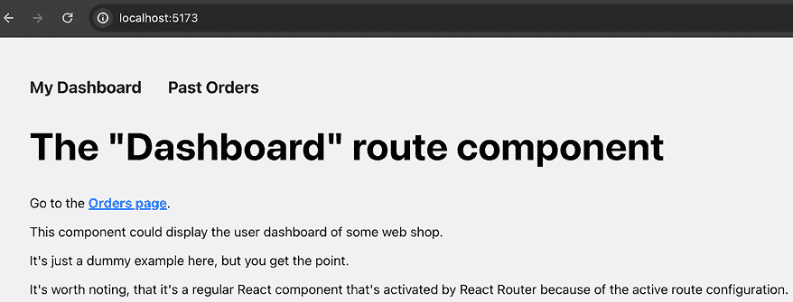

# 13

# 使用 React Router 的多页应用程序

学习目标

到本章结束时，你将能够做到以下事情：

+   构建多页单页应用程序（以及理解这并不是一个矛盾的说法）

+   使用 React Router 包为不同的 URL 路径加载不同的 React 组件

+   创建静态和动态路由（以及首先了解什么是路由）

+   通过链接和程序性命令导航网站

+   构建嵌套页面布局

# 简介

在完成本书的前十二章后，你现在应该知道如何构建 React 组件和 Web 应用程序，以及如何管理组件和全局状态，以及如何在组件之间共享数据（通过 props 或 context）。

尽管你知道如何从多个组件中组合 React 网站，但所有这些组件都在同一个单页网站上。当然，你可以有条件地显示组件和内容，但用户永远不会切换到不同的页面。这意味着 URL 路径永远不会改变；用户将始终停留在 `your-domain.com`。此外，到目前为止，你的 React 应用程序不支持任何路径，如 `your-domain.com/products` 或 `your-domain.com/blog/latest`。

**注意**

**统一资源定位符**（ **URLs**）是网络资源的引用。例如，[`academind.com/courses`](https://academind.com/courses) 是一个指向作者网站特定页面的 URL。在这个例子中，`academind.com` 是网站的 **域名**，`/courses` 是指向特定网站页面的 **路径**。

对于 React 应用程序来说，加载的网站路径从不改变可能是有意义的。毕竟，在 *第一章* 中，*React – 什么是以及为什么*，你学习了使用 React 构建 **单页应用程序**（ **SPAs**）。

但尽管这可能是有意义的，但它也是一个相当严重的限制。

# 一页不够

只有一个页面意味着那些通常由多个页面组成（例如，包含产品、订单等页面的在线商店）的复杂网站很难用 React 构建。没有多个页面，你不得不退而求其次，使用状态和条件值在屏幕上显示不同的内容。

但如果没有改变 URL 路径，你的网站访客只能分享指向网站起始页的链接。此外，当新访客访问该起始页时，任何有条件加载的内容都会丢失。如果用户简单地重新加载他们当前所在的页面，情况也是如此。重新加载会获取页面的新版本，因此任何状态（以及因此用户界面）的变化都会丢失。

由于这些原因，对于大多数 React 网站，你绝对需要在单个 React 应用程序中包含多个页面（具有不同的 URL 路径）。多亏了现代浏览器功能和高度流行的第三方包，这确实可能实现（并且对于大多数 React 应用程序来说是默认的）。

通过 **React Router** 包，你的 React 应用可以监听 URL 路径的变化，并为不同的路径显示不同的组件。例如，你可以定义以下路径-组件映射：

+   `<domain>/` => 加载 `<Home />` 组件。

+   `<domain>/products` => 加载 `<ProductList />` 组件。

+   `<domain>/products/p1` => 加载 `<ProductDetail />` 组件。

+   `<domain>/about` => 加载 `<AboutUs />` 组件。

从技术上讲，它仍然是一个单页应用（SPA），因为仍然只向网站用户发送了一个 HTML 页面。但在那个单页 React 应用中，不同的组件是由 React Router 包根据访问的具体 URL 路径条件性地渲染的。作为应用的开发者，你不需要手动管理这种状态或条件性地渲染内容——React Router 会为你处理。此外，你的网站能够处理不同的 URL 路径，因此，单个页面可以被共享或重新加载。

# React Router 入门与定义路由

React Router 是一个可以在任何 React 项目中安装的第三方 React 库。一旦安装，你就可以在你的代码中使用各种组件来启用上述功能。

在你的 React 项目内部，通过以下命令安装该包：

```js
npm install react-router-dom 
```

安装完成后，你可以导入并使用该库中的各种组件（和 Hooks）。

要开始在你的 React 应用中支持多页，你需要通过以下步骤设置 **路由**：

1.  为你的不同页面创建不同的组件（例如，`Dashboard` 和 `Orders` 组件）。

1.  使用 React Router 库中的 `createBrowserRouter()` 函数和 `RouterProvider` 组件来启用路由并定义 React 应用应支持的 **路由**。

在这个上下文中，术语 **路由** 指的是 React 应用能够为不同的 URL 路径加载不同的组件（例如，为 `/` 和 `/orders` 路径加载不同的组件）。路由是一个添加到 React 应用的定义，它定义了应该渲染预定义 JSX 片段的 URL 路径（例如，对于 `/orders` 路径，应该加载 `Orders` 组件）。

在一个包含 `Dashboard` 和 `Orders` 组件的示例 React 应用中，并且通过 `npm install` 安装了 React Router 库，你可以通过编辑根组件（在 `src/App.jsx` 中）来启用这两个组件之间的路由和导航，如下所示：

```js
**import** **{** 
  **createBrowserRouter,** 
  **RouterProvider**
**}** **from****'react-router-dom'****;**
import Dashboard from './routes/Dashboard.jsx';
import Orders from './routes/Orders.jsx';
**const** **router =** **createBrowserRouter****([**
  **{** **path****:** **'/'****,** **element****:** **<****Dashboard** **/>** **},**
  **{** **path****:** **'/orders'****,** **element****:** **<****Orders** **/>** **}**
**]);**
function App() {
  return **<****RouterProvider****router****=****{router}** **/>**;
}
export default App; 
```

**注意**

你可以在 GitHub 上找到完整的示例代码：[`github.com/mschwarzmueller/book-react-key-concepts-e2/tree/13-routing/examples/01-getting-started-with-routing`](https://github.com/mschwarzmueller/book-react-key-concepts-e2/tree/13-routing/examples/01-getting-started-with-routing)。

在前面的代码片段中，React Router 的 `createBrowserRouter()` 函数被调用以创建一个包含应用程序的路由配置（可用路由列表）的 `router` 对象。传递给 `createBrowserRouter()` 的数组包含路由定义对象，其中每个对象定义了一个应匹配的 `path` 以及应渲染的 `element`。

然后，使用 React Router 的 `RouterProvider` 组件来设置 `router` 配置并定义一个用于渲染活动路由元素的位置。

您可以将 `<RouterProvider />` 元素视为一旦路由变为活动状态，就被通过 `element` 属性定义的内容所替换。因此，`RouterProvider` 组件的位置很重要。在这种情况下（以及可能的大多数 React 应用程序），它应该是根应用程序组件——即 React Router，它应该控制整个应用程序组件树。

如果您运行提供的示例 React 应用程序（通过 `npm run dev`），您将在屏幕上看到以下输出：


图 13.1：仪表板组件内容已加载

如果您访问 `localhost:5173`，屏幕上会显示 `Dashboard` 组件的内容。请注意，可见的页面内容并未在 `App` 组件（在之前共享的代码片段中）中定义。相反，只添加了两个路由定义：一个用于 `/` 路径（即 `localhost:5173/` 或仅 `localhost:5173`，不带尾随正斜杠——它以相同的方式处理）和一个用于 `/orders` 路径（`localhost:5173/orders`）。

**注意**

`localhost` 是一个通常用于开发的本地地址。当您部署您的 React 应用程序（即，您将其上传到 Web 服务器）时，您将收到不同的域名——或者分配一个自定义域名。无论如何，部署后它将不再是 `localhost`。

`localhost` 之后的部分（`:5173`）定义了请求将被发送到的网络端口。如果没有额外的端口信息，将自动使用端口 `80` 或 `443`（作为默认的 HTTP(S) 端口）。然而，在开发期间，这些并不是您想要的端口。相反，您通常会使用 `5173`、`8000` 或 `8080` 这样的端口，因为这些端口通常不会被任何其他系统进程占用，因此可以安全使用。通过 Vite 创建的项目通常使用端口 `5173`。

由于 `localhost:5173` 默认加载（当运行 `npm run dev` 时），第一个路由定义（`{ path: '/', element: <Dashboard /> }`）变为活动状态。此路由处于活动状态是因为其路径（`'/'`）与 `localhost:5173` 的路径匹配（因为这与 `localhost:5173/` 相同）。

因此，通过 `element` 定义的 JSX 代码替换了 `<RouterProvider>` 组件。在这种情况下，这意味着 `Dashboard` 组件的内容被显示，因为此路由定义的 `element` 属性值是 `<Dashboard />`。在示例中，使用单个组件（如 `<Dashboard />`）是很常见的，但你也可以将任何 JSX 内容设置为 `element` 属性的值。

在前面的例子中，没有显示复杂的页面。相反，屏幕上只显示了一些文本。不过，在本章的后面部分，这将会改变。

但如果你在浏览器地址栏中将 URL 从 `localhost:5173` 手动更改为 `localhost:5173/orders`，这会变得有趣。在任何前面的章节中，这都不会改变页面内容。但现在，由于启用了路由并且定义了适当的路由，页面内容确实发生了变化，如下所示：


图 13.2：对于 /orders，显示 Orders 组件的内容

一旦 URL 发生变化，`Orders` 组件的内容就会显示在屏幕上。在这个第一个例子中，它仍然是基本的文本，但它表明对于不同的 URL 路径，会渲染不同的代码。

然而，这个基本例子有一个主要的缺陷（除了相当无聊的页面内容）。目前，用户必须手动输入 URL。但当然，这不是通常使用网站的方式。

## 添加页面导航

为了允许用户在不手动编辑浏览器地址栏的情况下在网站的不同页面之间切换，网站通常包含链接，通常通过 `<a>` HTML 元素（锚元素）添加，如下所示：

```js
<a href="/orders">Past Orders</a> 
```

对于这个例子，可以通过修改 `Dashboard` 组件代码来添加页面导航，如下所示：

```js
function Dashboard() {
  return (
    <>
      <h1>The "Dashboard" route component</h1>
      **<****p****>****Go to the** **<****a****href****=****"/orders"****>****Orders page****</****a****>****.****</****p****>**
      {/* <p> elements omitted */}
    </>
  );
}
export default Dashboard; 
```

在这个代码片段中，已添加了对 `/orders` 路由的链接。因此，网站访客现在看到的是这个页面：


图 13.3：添加了导航链接

因此，当网站用户点击这个链接时，他们会进入 `/orders` 路由，并且 `Orders` 组件的内容会显示在屏幕上。

这种方法可行，但有一个主要的缺陷：每次用户点击链接时，网站都会重新加载。你可以通过点击链接时浏览器刷新图标变为一个叉号（短暂地）来判断页面正在重新加载。

这是因为每当点击链接时，浏览器都会向服务器发送一个新的 HTTP 请求。尽管服务器总是返回相同的单个 HTML 页面，但在那个过程中页面会重新加载（因为发送了新的 HTTP 请求）。

虽然在这个简单的演示页面上这并不是问题，但如果你有某些共享状态（例如，通过上下文管理的全局状态）不应该在页面更改时重置，那么这就会成为一个问题。此外，每次新的请求都会花费时间，并迫使浏览器重新下载所有网站资源（例如，脚本文件）。即使这些文件可能被缓存，这也是一个不必要的步骤，可能会影响网站性能。

下面的略微调整后的 `App` 组件示例说明了状态重置问题：

```js
**import** **{ useState }** **from****'react'****;**
import { 
  createBrowserRouter, 
  RouterProvider 
} from 'react-router-dom';
import Dashboard from './routes/Dashboard.jsx';
import Orders from './routes/Orders.jsx';
const router = createBrowserRouter([
  { path: '/', element: <Dashboard /> },
  { path: '/orders', element: <Orders /> },
]);
function App() {
  **const** **[counter, setCounter] =** **useState****(****0****);**
  **function****handleIncCounter****() {**
    **setCounter****(****(****prevCounter****) =>** **prevCounter +** **1****);**
  **}**
  return (
    <>
      **<****p****>**
        **<****button****onClick****=****{handleIncCounter}****>****Increase Counter****</****button****>**
      **</****p****>**
      **<****p****>****Current Counter:** **<****strong****>****{counter}****</****strong****></****p****>**
      <RouterProvider router={router} />
    </>
  );
}
export default App; 
```

**注意**

本例的代码可以在[`github.com/mschwarzmueller/book-react-key-concepts-e2/tree/13-routing/examples/03-naive-navigation-problem`](https://github.com/mschwarzmueller/book-react-key-concepts-e2/tree/13-routing/examples/03-naive-navigation-problem) 找到。

在本例中，一个简单的计数器被添加到了 `App` 组件中。由于 `<RouterProvider>` 在同一个组件中被渲染，在计数器下方，当用户访问不同的页面时，不应替换 `App` 组件（相反，应该替换 `<RouterProvider>` 而不是整个 `App` 组件的 JSX 代码）。

至少，这是理论上的情况。但是，正如你在下面的屏幕截图中所看到的，每次点击任何链接时，`counter` 状态都会丢失：


图 13.4：切换页面时计数器状态被重置

在屏幕截图中，你可以看到计数器最初被设置为 `3`（因为按钮被点击了三次）。在从 `Dashboard` 页面导航到 `Orders` 页面（通过点击 `Orders page` 链接）后，计数器变为 `0`。

这是因为页面因浏览器发送的 HTTP 请求而重新加载。

为了解决这个问题并避免这种意外的页面重新加载，你必须阻止浏览器默认行为。而不是发送新的 HTTP 请求，浏览器 URL 地址应该只更新（从 `localhost:5173` 更新到 `localhost:5173/orders`），并且应该加载目标组件（`Orders`）。因此，对于网站用户来说，这看起来就像加载了不同的页面。但在幕后，只是页面文档（DOM）被更新了。

幸运的是，你不必自己实现这个逻辑。相反，React Router 库公开了一个特殊的 `Link` 组件，应该用它来代替锚 `<a>` 元素。

要使用这个新组件，`src/routes/Dashboard.jsx` 中的代码必须进行调整如下：

```js
**import** **{** **Link** **}** **from****'react-router-dom'****;**
function Dashboard() {
  return (
    <>
      <h1>The "Dashboard" route component</h1>
      <p>Go to the **<****Link****to****=****"/orders"****>****Orders page****</****Link****>**.</p>
      <p>
        This component could display the user dashboard 
        of some web shop.
      </p>
      <p>It's just a dummy example here, but you get the point.</p>
      <p>
        It's worth noting, that it's a regular React component 
        that's activated by React Router because of the 
        active route configuration.
      </p>
    </>
  );
}
export default Dashboard; 
```

**注意**

本例的代码可以在[`github.com/mschwarzmueller/book-react-key-concepts-e2/tree/13-routing/examples/04-react-router-navigation`](https://github.com/mschwarzmueller/book-react-key-concepts-e2/tree/13-routing/examples/04-react-router-navigation) 找到。

在这个更新后的示例中，使用了新的 `Link` 组件。该组件需要一个 `to` 属性，用于定义应该加载的 URL 路径。

通过使用此组件代替 `<a>` 锚点元素，计数器状态不再重置。这是因为 React Router 现在阻止了浏览器的默认行为（即上述描述的不希望的页面重新加载）并显示了正确的页面内容。

在底层，`Link` 组件仍然渲染内置的 `<a>` 元素。但 React Router 控制它并实现了上述描述的行为。

因此，`Link` 组件是用于内部链接的默认组件。对于外部链接，应使用标准的 `<a>` 元素，因为链接会离开网站，因此没有需要保留的状态或页面重新加载来防止。

## 使用布局和嵌套路由

大多数网站都需要某种形式的页面宽范围导航（以及相应的导航链接）或其他应在某些或所有路由之间共享的页面部分。

考虑到之前的示例网站，它有 `/` 和 `/orders` 路由。该示例网站也将从有一个允许用户在起始页面（即 `Dashboard` 路由）和 `Orders` 页面之间切换的顶部导航栏中受益。

因此，可以将 `App.jsx` 调整为在 `<RouterProvider>` 上方的 `<header>` 中包含一个顶部导航栏：

```js
import { 
  createBrowserRouter, 
  RouterProvider, 
  Link 
} from 'react-router-dom';
import Dashboard from './routes/Dashboard.jsx';
import Orders from './routes/Orders.jsx';
const router = createBrowserRouter([
  { path: '/', element: <Dashboard /> },
  { path: '/orders', element: <Orders /> },
]);
function App() {
  return (
    <>
      **<****header****>**
        **<****nav****>**
          **<****ul****>**
            **<****li****>**
              **<****Link****to****=****"/"****>****My Dashboard****</****Link****>**
            **</****li****>**
            **<****li****>**
              **<****Link****to****=****"/orders"****>****Past Orders****</****Link****>**
            **</****li****>**
          **</****ul****>**
        **</****nav****>**
      **</****header****>**
      <RouterProvider router={router} />
    </>
  );
}
export default App; 
```

但如果你尝试运行此应用程序，你将看到一个空白页面，并在浏览器开发者工具的 JavaScript 控制台中遇到错误信息。


图 13.5：React Router 好像在抱怨某些事情

错误信息有点晦涩难懂，但问题在于上述代码试图在由 React Router 控制的组件之外使用 `<Link>`。

只有通过 `<RouterProvider>` 加载的组件才受 React Router 控制，因此 React Router 的功能，如其 `Link` 组件，只能在路由组件（或其子组件）中使用。

因此，在 `App` 组件（**不是**由 React Router 加载）内部设置主要导航不起作用。

要使用某个共享组件和 JSX 标记来包装或增强多个路由组件，必须定义一个新的路由来包装现有路由。这样的路由有时也被称为 **布局路由**，因为它可以用来提供一些共享布局。被此路由包装的路由将被称为 **嵌套路由**。

布局路由的定义方式与路由定义数组内的任何其他路由相同。然后，通过使用 React Router 接受的特殊 `children` 属性来包装其他路由，它就变成了一个布局路由。这个 `children` 属性接收一个嵌套路由的数组——包装父路由的子路由。

这是此示例应用程序调整后的路由定义代码：

```js
**import****Root****from****'./routes/Root.jsx'****;**
import Dashboard from './routes/Dashboard.jsx';
import Orders from './routes/Orders.jsx';
const router = createBrowserRouter([
  {
    **path****:** **'/'****,**
    **element****:** **<****Root** **/>****,**
    **children****:** [
      { **index****:** **true**, element: <Dashboard /> },
      { path: '/orders', element: <Orders /> },
    ],
  },
]); 
```

在这个更新的代码片段中，定义了一个新的根布局路由——一个注册现有路由（`Dashboard`和`Orders`组件）为子路由的路由。因此，这种设置允许`Root`组件与`Dashboard`或`Orders`路由组件同时激活。

你可能还会注意到，`Dashboard`路由不再有`path`。相反，它现在有一个`index`属性，设置为`true`。这个`index`属性是在处理嵌套路由时可以使用的属性。它告诉 React Router 在父路由路径完全匹配时激活哪个嵌套路由（因此加载哪个组件）。

在这个例子中，当`/`路径处于活动状态（即，如果用户访问`<domain>/`），`Root`和`Dashboard`组件将被渲染。对于`<domain>/orders`，`Root`和`Orders`将变得可见。

`Root`组件是这个例子中新增的组件。它是一个标准组件（如`Dashboard`或`Orders`），具有一个特殊功能：它通过 React Router 提供的特殊`Outlet`组件定义了子路由组件应该插入的位置：

```js
import { Link, **Outlet** } from 'react-router-dom';
function Root() {
  return (
    <>
      <header>
        <nav>
          <ul>
            <li>
              <Link to="/">My Dashboard</Link>
            </li>
            <li>
              <Link to="/orders">Past Orders</Link>
            </li>
          </ul>
        </nav>
      </header>
      **<****Outlet** **/>**
    </>
  );
}
export default Root; 
```

`<Outlet />`占位符是必需的，因为 React Router 必须知道在哪里渲染传递给`children`属性的路由组件的路由组件。

**注意**

你可以在 GitHub 上找到完整的示例代码：[`github.com/mschwarzmueller/book-react-key-concepts-e2/tree/13-routing/examples/05-layouts-nested-routes`](https://github.com/mschwarzmueller/book-react-key-concepts-e2/tree/13-routing/examples/05-layouts-nested-routes)。

由于`Root`组件本身也是由 React Router 渲染的，它现在是一个可以访问`<Link>`标签的组件。因此，这个`Root`组件可以用来在所有嵌套路由之间共享通用标记（如导航`<header>`）。



图 13.6：顶部显示了一个共享的导航栏（适用于所有路由）

因此，嵌套路由和布局路由（或包装路由）是 React Router 提供的关键特性。

还值得注意的是，你可以根据应用程序的需要添加任意级别的路由嵌套——你**不**仅限于只有一个包裹子路由的布局路由。

## 从 Link 到 NavLink

在上一章中设置的共享导航中，你通常希望突出显示导致当前活动页面的链接。例如，如果用户点击了`Past Orders`链接（因此导航到`/orders`），该链接应该改变其外观（例如，其颜色）。

考虑之前的例子（*图 13.6*）——在那里，在顶部导航栏中，用户是否在`Dashboard`页面或`Orders`页面并不立即明显。当然，URL 地址和主页内容确实会改变，但导航项在视觉上并没有调整。

为了证明这一点，比较之前的截图和下面的截图：


图 13.7：高亮的“历史订单”导航链接被下划线并改变颜色

在这个版本的网站上，用户立即就能清楚地看到他们位于“订单”页面，因为“历史订单”导航链接被突出显示。正是这样的细微之处使得网站更加易用，并最终可能导致更高的用户参与度。

但这是如何实现的呢？

要做到这一点，你不会使用 `Link` 组件，而是使用 `react-router-dom` 提供的特别替代组件：`NavLink` 组件：

```js
import { **NavLink**, Outlet } from 'react-router-dom';
function Root() {
  return (
    <>
      <header>
        <nav>
          <ul>
            <li>
              **<****NavLink****to****=****"/"****>****My Dashboard****</****NavLink****>**
            </li>
            <li>
              **<****NavLink****to****=****"/orders"****>****Past Orders****</****NavLink****>**
            </li>
          </ul>
        </nav>
      </header>
      <Outlet />
    </>
  );
}
export default Root; 
```

`NavLink` 组件的使用方式与 `Link` 组件非常相似。你将其包裹在一段文本（链接的标题）周围，并通过 `to` 属性定义目标路径。然而，`NavLink` 组件有一些额外的与样式相关的功能，这是常规 `Link` 组件所不具备的。

严格来说，当链接处于活动状态时，`NavLink` 组件默认将一个名为 `active` 的 CSS 类应用到渲染的锚点元素上。


图 13.8：渲染的 `<a>` 元素接收了一个“active” CSS 类

如果你想在链接变为活动状态时应用不同的 CSS 类名或内联样式，`NavLink` 也允许你这样做。因为 `NavLink` 的 `className` 和 `style` 属性在行为上与其他元素略有不同。除了接受字符串值（`className`）或样式对象（`style`）之外，这两个属性还接受函数，这些函数将由 React Router 在每次导航操作时自动调用。例如，以下代码可以用来确保应用特定的 CSS 类或样式：

```js
<NavLink
  className={({ isActive }) => isActive ? 'loaded' : ''}
  style={({ isActive }) => isActive ? { color: 'red' } : undefined}>
    Some Link
</NavLink> 
```

在上述代码片段中，`className` 和 `style` 都利用了 React Router 将要执行的功能。这个函数自动接收一个对象作为输入参数——这个对象是由 React Router 创建并提供的，它包含一个 `isActive` 属性。当链接指向当前活动路由时，React Router 将 `isActive` 设置为 `true`，否则设置为 `false`。

因此，你可以在这些函数中返回任何你选择的 CSS 类名或样式对象。然后 React Router 将它们应用到渲染的 `<a>` 元素上。

**注意**

你可以在 GitHub 上找到这个示例的完整代码：[`github.com/mschwarzmueller/book-react-key-concepts-e2/tree/13-routing/examples/06-navlinks`](https://github.com/mschwarzmueller/book-react-key-concepts-e2/tree/13-routing/examples/06-navlinks)。

一个重要的注意事项是，`NavLink`会将路径与当前 URL 路径匹配或以当前 URL 路径开头的情况视为活动路由。例如，如果你有一个`/blog/all-posts`路由，一个指向`/blog`的`NavLink`组件如果当前路由是`/blog/all-posts`，则会被视为活动状态（因为该路由路径以`/blog`开头）。如果你不希望这种行为，你可以在`NavLink`组件中添加特殊的`end`属性，如下所示：

```js
<NavLink
  to="/blog"
  style={({ isActive }) => isActive ? { color: 'red' } : undefined}
  **end**>
    Blog
</NavLink> 
```

添加了这个特殊属性后，这个`NavLink`只有在当前路由正好是`/blog`时才会被视为活动状态——对于`/blog/all-posts`，链接则不会是活动状态。

例外情况是链接到`/`。由于所有路由在技术上都是以这个“空路径”开始的，React Router 默认情况下只将`<NavLink to="/">`视为活动状态，如果用户当前位于`<domain>/`。对于其他路径（例如，`/orders`），`<NavLink to="/">`则不会被标记为活动状态。

当链接的样式依赖于当前活动路由时，`NavLink`始终是首选的选择。对于所有其他内部链接，使用`Link`。对于外部链接，`<a>`是首选元素。

## 路由组件与“常规”组件的比较

值得注意的是，在之前的示例中，`Dashboard`和`Orders`组件是常规的 React 组件。你可以在你的 React 应用的任何地方使用这些组件——而不仅仅是作为路由定义的`element`属性的值。

然而，这两个组件是特殊的，因为它们都存储在项目目录下的`src/routes`文件夹中。它们没有存储在`src/components`文件夹中，而这本书中使用的组件都是存储在这个文件夹中的。

虽然这不是你必须做的事情。实际上，文件夹名称完全由你决定。这两个组件可以存储在`src/components`中。你也可以将它们存储在`src/elements`文件夹中。但使用`src/routes`对于仅用于路由的组件来说是非常常见的。流行的替代方案有`src/screens`、`src/views`和`src/pages`（同样，这取决于你）。

如果你的应用包含任何其他不是作为路由元素的组件，你仍然会将这些组件存储在`src/components`（即，在不同的路径下）。这并不是一个硬性规则或技术要求，但它确实有助于保持你的 React 项目可管理。将你的组件分散存储在多个文件夹中，可以更容易地快速理解项目中的哪些组件实现了哪些功能。

在之前提到的示例项目中，例如，你可以重构代码，使得导航代码存储在一个单独的组件中（例如，一个`MainNavigation`组件，存储在`src/components/shared/MainNavigation.jsx`）。组件文件代码如下：

```js
import { NavLink } from 'react-router-dom';
import classes from './MainNavigation.module.css';
function MainNavigation() {
  return (
    <header className={classes.header}>
      <nav>
        <ul>
          <li>
            <NavLink
              to="/"
              className={({ isActive }) =>
                isActive ? classes.active : undefined
              }
              end
            >
              My Dashboard
            </NavLink>
          </li>
          <li>
            <NavLink
              to="/orders"
              className={({ isActive }) =>
                isActive ? classes.active : undefined
              }
            >
              Past Orders
            </NavLink>
          </li>
        </ul>
      </nav>
    </header>
  );
}
export default MainNavigation; 
```

在这个代码片段中，`NavLink`组件被调整以将名为`active`的 CSS 类分配给属于当前活动路由的任何链接。这是在使用 CSS Modules 时必需的，因为类名在构建过程中会发生变化，正如在第六章*为 React 应用添加样式*中讨论的那样。除此之外，它基本上与本章早期使用的相同导航菜单代码。

然后，这个`MainNavigation`组件可以被导入并像这样在`Root.jsx`文件中使用：

```js
import { Outlet } from 'react-router-dom';
**import****MainNavigation****from****'../components/shared/MainNavigation.jsx'****;**
function Root() {
  return (
    <>
      **<****MainNavigation** **/>**
      <Outlet />
    </>
  );
}
export default Root; 
```

导入和使用`MainNavigation`组件会导致`Root`组件更加精简，同时仍然保留之前的功能。

这些更改显示了你可以如何组合仅用于路由的组件（`Dashboard`和`Orders`）以及用于路由外部的组件（`MainNavigation`）。

**注意**

你可以在 GitHub 上找到这个示例的完成代码：[`github.com/mschwarzmueller/book-react-key-concepts-e2/tree/13-routing/examples/07-routing-and-normal-cmp`](https://github.com/mschwarzmueller/book-react-key-concepts-e2/tree/13-routing/examples/07-routing-and-normal-cmp)。

即使有了那些标记和样式的改进，演示应用程序仍然存在一个重要问题：它只支持静态、预定义的路由。但对于大多数网站来说，这类路由是不够的。

# 从静态路由到动态路由

到目前为止，所有示例都有两个路由：`/`用于`Dashboard`组件，`/orders`用于`Orders`组件。但你可以，当然，添加所需的路由数量。如果你的网站有 20 个不同的页面，你（应该）为`App`组件添加 20 个路由定义（即 20 个`Route`组件）。

然而，在大多数网站上，你也会有一些无法手动定义的路由——因为并非所有路由及其确切路径都是预先知道的。

考虑之前的示例，增加了额外的组件和一些模拟数据：


图 13.9：订单项列表

**注意**

你可以在 GitHub 上找到这个示例的代码：[`github.com/mschwarzmueller/book-react-key-concepts-e2/tree/13-routing/examples/08-dynamic-routes-problem`](https://github.com/mschwarzmueller/book-react-key-concepts-e2/tree/13-routing/examples/08-dynamic-routes-problem)。在代码中，你会注意到添加了许多新的组件和样式文件。尽管如此，代码并没有使用任何新特性。它只是用来显示一个更真实的用户界面并输出一些模拟数据。

在前面的屏幕截图*图 13.9*中，你可以看到订单项列表在`Past Orders`页面（即由`Orders`组件）上输出。

在底层代码中，每个订单项都被一个`Link`组件包裹，以便为每个项目加载一个包含更多详细信息的单独页面：

```js
function OrdersList() {
  return (
    <ul className={classes.list}>
      {orders.map((order) => (
        <li key={order.id}>
          **<****Link****to****=****'/orders'****><****OrderItem****order****=****{order}** **/></****Link****>**
        </li>
      ))}
    </ul>
  );
} 
```

在这个代码片段中，`Link`组件的路径被设置为`/orders`。然而，这并不是应该分配的最终值。相反，这个例子突出了一个重要问题：虽然对于每个订单项都应该加载相同的路由和组件（即显示所选订单详细数据的组件），但该组件输出的确切内容取决于选择了哪个订单项。这是相同的路由和组件，但数据不同。

除了路由之外，你会使用 props 来重复使用具有不同数据的相同组件。但是，在路由的情况下，这不仅仅关乎组件。你还必须支持不同的路径——因为不同订单的详细信息应该通过不同的路径（例如，`/orders/o1`、`/orders/o2`等）来加载。否则，你又会得到不可共享或重新加载的 URL。

因此，路径必须包含不仅是一些静态标识符（例如`/orders`），而且对于每个订单项都是不同的动态值。对于具有`id`值`o1`、`o2`和`o3`的三个订单项，目标可能是支持`/orders/o1`、`/orders/o2`和`/order/o3`路径。

因此，以下三个路由定义可以添加：

```js
{ path: '/orders/o1', element: <OrderDetail id="o1" /> },
{ path: '/orders/o2', element: <OrderDetail id="o2" /> },
{ path: '/orders/o3', element: <OrderDetail id="o3" /> } 
```

但这个解决方案有一个主要的缺陷。手动添加所有这些路由是一项巨大的工作量。而且这还不是最大的问题。你通常甚至不知道所有值。在这个例子中，当放置一个新订单时，必须添加一个新的路由。但你不能每次访客下单时都调整你网站的源代码。

显然，因此需要一个更好的解决方案。React Router 提供了这个更好的解决方案，因为它支持**动态路由**。

动态路由的定义方式与其他路由相同，只是在定义它们的`path`值时，你需要包含一个或多个你选择的**动态路径段**。

因此，`OrderDetail`路由定义看起来是这样的：

```js
{ path: '/orders/:id', element: <OrderDetail /> } 
```

以下三个关键事物已经改变：

+   这只是一个路由定义，而不是一个（可能）无限的路由定义列表。

+   `path`包含一个动态路径段（`:id`）。

+   `OrderDetail`不再接收`id`prop。

`:id`语法是 React Router 支持的特殊语法。每当路径的一个部分以冒号开头时，React Router 将其视为**动态段**。这意味着它将在实际的 URL 路径中被不同的值替换。对于`/orders/:id`路由路径，`/orders/o1`、`/orders/o2`和`/orders/abc`路径都会匹配，因此激活路由。

当然，你不必使用`:id`。你可以使用任何你选择的标识符。对于前面的例子，`:orderId`、`:order`或`:oid`也是有意义的。

标识符将帮助你的应用程序访问页面组件中应加载的动态路由的正确数据（即上面代码片段中的`OrderDetail`路由组件）。这就是为什么在上一个代码片段中从`OrderDetail`中移除了`id`属性。由于只定义了一个路由，因此只能通过属性传递一个特定的`id`值。这不会有所帮助。因此，必须使用不同的方式来加载特定订单的数据。

## 提取路由参数

在前面的例子中，当网站用户访问`/orders/o1`或`/orders/o2`（或任何其他订单 ID 的相同路径）时，会加载`OrderDetail`组件。然后，该组件应该输出有关所选特定订单的更多信息（即 ID 编码在 URL 路径中的订单）。

顺便说一下，这不仅仅适用于这个例子；你也可以考虑许多其他类型的网站。例如，你也可以有一个在线商店，其中包含产品路由（`/products/p1`、`/products/p2`等），或者一个旅游博客，用户可以访问单个博客文章（`/blog/post1`、`/blog/post2`等）。

在所有这些情况下，问题是如何获取应加载到特定标识符（例如，ID）中的数据，该标识符包含在 URL 路径中？由于总是加载相同的组件，你需要一种动态识别顺序、产品或博客文章的方法，以便获取相应的详细数据。

一种可能的解决方案是使用属性。每当构建一个应该可重用且可配置和动态的组件时，可以使用属性来接受不同的值。例如，`OrderDetail`组件可以接受一个`id`属性，然后在组件函数体内加载该特定订单 ID 的数据。

然而，如前所述，当通过路由加载组件时，这不是一个可行的解决方案。记住，`OrderDetail`组件是在定义路由时创建的：

```js
{ path: '/orders/:id', element: <OrderDetail /> } 
```

由于组件是在`App`组件中定义路由时创建的，因此无法传递任何动态的、ID 特定的属性值。

幸运的是，这并不是必要的。React Router 为你提供了一个解决方案，允许你从屏幕上显示的组件内部（当路由变为活动状态时）提取编码在 URL 路径中的数据：`useParams()`钩子。

这个钩子可以用来获取当前活动路由的路由参数。路由参数仅仅是编码在 URL 路径中的动态值——在本例的`OrderDetail`中是`id`。

因此，在`OrderDetail`组件内部，可以使用`useParams()`来提取特定的订单 ID 并加载相应的订单数据，如下所示：

```js
import { useParams } from 'react-router-dom';
import Details from '../components/orders/Details.jsx';
import { getOrderById } from '../data/orders.js';
function OrderDetail() {
  const params = useParams();
  const orderId = params.id; // orderId is "o1", "o2" etc.
  const order = getOrderById(orderId);
  return <Details order={order} />;
}
export default OrderDetail; 
```

如您在这段代码片段中所见，`useParams()` 返回一个对象，该对象包含当前活动路由的所有路由参数作为属性。由于路由路径被定义为 `/orders/:id`，因此 `params` 对象包含一个 `id` 属性。该属性的值是实际编码在 URL 路径中的值（例如，`o1`）。如果您在路由定义中选择不同的标识符名称（例如，`/orders/:orderId` 而不是 `/orders/:id`），则必须使用该属性名称来访问 `params` 对象中的值（即访问 `params.orderId`）。

**注意**

您可以在 GitHub 上找到完整的代码，地址为 [`github.com/mschwarzmueller/book-react-key-concepts-e2/tree/13-routing/examples/09-dynamic-routes`](https://github.com/mschwarzmueller/book-react-key-concepts-e2/tree/13-routing/examples/09-dynamic-routes)。

因此，通过使用路由参数，您可以轻松创建动态路由，这些路由可以加载不同的数据。但是，当然，如果您没有指向动态路由的链接，那么定义路由和处理路由激活并没有那么有用。

## 创建动态链接

如在本章前面（在 *添加页面导航* 部分中）所述，网站访客应该能够点击链接，然后这些链接应该将他们带到构成整个网站的各个页面——这意味着，这些链接应该激活使用 React Router 定义的各个路由。

如在 *添加页面导航* 和 *从链接到 NavLink* 部分中所述，对于内部链接（即指向 React 应用内部定义的路由的链接），使用 `Link` 或 `NavLink` 组件。

因此，对于像 `/orders` 这样的静态路由，链接是这样创建的：

```js
<Link to="/orders">Past Orders</Link> // or use <NavLink> instead 
```

因此，当构建指向如 `/orders/:id` 这样的动态路由的链接时，您可以简单地创建一个如下所示的链接：

```js
<Link to="/orders/o1">Past Orders</Link> 
```

此特定链接加载了 ID 为 `o1` 的 `OrderDetails` 组件。

按如下方式构建链接是不正确的：

```js
<Link to="/orders/:id">Past Orders</Link> 
```

动态路径段语法（`:id`）仅在定义路由时使用——在创建链接时不使用。链接必须指向特定的资源（在这种情况下是特定的订单）。

然而，正如之前所示，创建指向特定订单的链接并不太实用。正如在 *从静态路由到动态路由* 部分中定义所有动态路由单独来说没有意义一样，手动创建相应的链接也没有意义。

以订单为例，由于您已经在单页（在这种情况下是 `Orders` 组件）上输出了订单列表，因此无需创建此类链接。同样，您可以在在线商店中有一个产品列表。在这些所有情况下，单个项目（订单、产品等）应该是可点击的，并链接到包含更多信息的详细信息页面。


图 13.10：可点击的订单项列表

因此，在渲染 JSX 元素列表时可以动态生成链接。在订单示例的情况下，代码看起来是这样的：

```js
function OrdersList() {
  return (
    <ul className={classes.list}>
      {orders.map((order) => (
        <li key={order.id}>
          **<****Link**
            **to****=****{****`/****orders****/${****order.id****}`}>**
            <OrderItem order={order} />
          </Link>
        </li>
      ))}
    </ul>
  );
} 
```

在此代码示例中，`to`属性的值被动态设置为包含`order.id`值的字符串。因此，每个列表项都接收一个独特的链接，该链接指向不同的详情页面。或者，更准确地说，链接始终指向同一个组件，但具有不同的`order id`值，因此加载不同的订单数据。

**注意**

在此代码片段（可在[`github.com/mschwarzmueller/book-react-key-concepts-e2/tree/13-routing/examples/10-dynamic-links`](https://github.com/mschwarzmueller/book-react-key-concepts-e2/tree/13-routing/examples/10-dynamic-links) )中，字符串被创建为**模板字面量**。这是一个默认的 JavaScript 功能，它简化了包含动态值的字符串的创建。

您可以在 MDN 上了解更多关于模板字面量的信息，网址为[`developer.mozilla.org/en-US/docs/Web/JavaScript/Reference/Template_literals`](https://developer.mozilla.org/en-US/docs/Web/JavaScript/Reference/Template_literals) 。

## 程序化导航

在上一节以及本章前面的内容中，用户导航是通过向网站添加链接来实现的。确实，链接是向网站添加导航的默认方式。但有些情况下需要使用程序化导航。

程序化导航意味着新页面应通过 JavaScript 代码加载（而不是使用链接）。这种导航通常在活动页面因某些操作而改变时需要——例如，在表单提交时。

如果以表单提交为例，您通常希望提取并保存提交的数据。但在此之后，有时需要将用户重定向到不同的页面。例如，在处理输入的信用卡详情后，让用户留在`结账`页面是没有意义的。您可能希望将用户重定向到`成功`页面。

在本章讨论的示例中，`历史订单`页面可以包括一个输入字段，允许用户直接输入订单 ID，并在点击`查找`按钮后加载相应的订单数据。


图 13.11：一个可以快速加载特定订单的输入字段

在此示例中，首先处理并验证输入的订单 ID，然后用户被发送到相应的详情页面。如果提供的 ID 无效，则显示错误消息。代码如下：

```js
import orders, { getOrdersSummaryData } from '../../data/orders.js';
import classes from './OrdersSummary.module.css';
function OrdersSummary() {
  const { quantity, total } = getOrdersSummaryData();
  const formattedTotal = new Intl.NumberFormat('en-US', {
    style: 'currency',
    currency: 'USD',
  }).format(total);
  function findOrderAction(formData) {
    const orderId = formData.get('order-id');
    const orderExists = orders.some((order) => order.id === orderId);
    if (!orderExists) {
      alert('Could not find an order for the entered id.');
      return;
    }
  }
  return (
    <div className={classes.row}>
      <p className={classes.summary}>
        {formattedTotal} | {orders.length} Orders | 
          {quantity} Products
      </p>
      <form className={classes.form} action={findOrderAction}>
        <input
          type="text"
          name="order-id"
          placeholder="Enter order id"
          aria-label="Find an order by id."
        />
        <button>Find</button>
      </form>
    </div>
  );
}
export default OrdersSummary; 
```

代码片段尚未包括实际触发页面更改的代码，但它显示了如何读取和验证用户输入。

因此，这是一个使用程序化导航的完美场景。在这里不能使用链接，因为它会立即触发页面更改——在允许您首先验证用户输入之前（至少在点击链接之后不会）。

React Router 库还支持此类情况下的程序化导航。你可以导入并使用特殊的 `useNavigate()` 钩子来获取一个可以用来触发导航操作（即页面更改）的导航函数：

```js
import { useNavigate } from 'react-router-dom';
const navigate = useNavigate();
navigate('/orders'); 
// programmatic alternative to <Link to="/orders"> 
```

因此，之前提到的 `OrdersSummary` 组件可以调整如下以使用这个新的钩子：

```js
function OrdersSummary() {
  **const** **navigate =** **useNavigate****();**
  const { quantity, total } = getOrdersSummaryData();
  const formattedTotal = new Intl.NumberFormat('en-US', {
    style: 'currency',
    currency: 'USD',
  }).format(total);
  function findOrderAction(formData) {
    const orderId = formData.get('order-id');
    const orderExists = orders.some((order) => order.id === orderId);
    if (!orderExists) {
      alert('Could not find an order for the entered id.');
      return;
    }
    **navigate****(****`/orders/****${orderId}****`****);**
  }
  // returned JSX code did not change, hence omitted
} 
```

值得注意的是，传递给 `navigate()` 的值是一个动态构造的字符串。程序化导航支持静态和动态路径。

**注意**

此示例的代码可以在 [`github.com/mschwarzmueller/book-react-key-concepts-e2/tree/13-routing/examples/11-programmatic-navigation`](https://github.com/mschwarzmueller/book-react-key-concepts-e2/tree/13-routing/examples/11-programmatic-navigation) 找到。

# 重定向

到目前为止，所有探索过的导航选项（链接和程序化导航）都将用户转发到特定页面。

在大多数情况下，这是预期的行为。但在某些情况下，目标是重定向用户而不是转发他们。

这种区别细微但很重要。当用户被转发时，他们可以使用浏览器的导航按钮（`后退` 和 `前进`）返回到上一页或跳转到他们来的页面。对于重定向，这是不可能的。无论何时用户被重定向到特定页面（而不是被转发），他们都不能使用 `后退` 按钮返回到上一页。

重定向用户，例如，可以确保用户在成功认证后无法返回登录页面。

当使用 React Router 时，默认行为是转发用户。但你可以通过向 `Link`（或 `NavLink`）组件添加特殊的 `replace` 属性来轻松切换到重定向，如下所示：

```js
<Link to="/success" **replace**>Confirm Checkout</Link> 
```

当使用程序化导航时，你可以向 `navigate()` 函数传递第二个可选参数。该第二个参数值必须是一个对象，该对象可以包含一个 `replace` 属性，如果你想重定向用户，则应将其设置为 `true`：

```js
navigate('/dashboard', **{** **replace****:** **true** **}**); 
```

能够重定向或转发用户，让你能够构建高度用户友好的网络应用程序，为不同场景提供最佳的用户体验。

## 处理未定义的路由

本章前面的部分都假设你已经有预定义的路由，这些路由应该可以被网站访客访问。但如果是访客输入了一个根本不支持 URL 呢？

例如，本章中使用的演示网站支持 `/`、`/orders` 和 `/orders/<some-id>` 路径。但它不支持 `/home`、`/products/p1`、`/abc` 或任何不是定义的路由路径的其他路径。

要显示自定义的 *未找到* 页面，你可以定义一个具有特殊路径的“捕获所有”路由——`*` 路径：

```js
{ path: '*', element: <NotFound /> } 
```

当将此路由添加到 `App` 组件的路由定义列表中时，如果没有其他路由与输入或生成的 URL 路径匹配，屏幕上将显示 `NotFound` 组件。

## 懒加载

在第十章 *React 和优化机会背后的场景* 中，你学习了懒加载——一种仅在需要时加载 React 应用程序代码片段的技术。

如果某些组件将条件性加载并且可能根本不需要，代码拆分就非常有意义。因此，路由是懒加载的完美场景。当应用程序有多个路由时，一些路由可能永远不会被用户访问。即使所有路由都被访问，也不必在应用程序加载时立即下载所有应用路由（即它们的组件）的代码。相反，当它们实际变为活动状态时，只下载单个路由的代码是有意义的。

幸运的是，React Router 内置了对懒加载和基于路由的代码拆分的支持。它提供了一个可以添加到路由定义中的 `lazy` 属性。该属性期望一个函数，该函数动态导入要懒加载的文件（其中包含应渲染的组件）。然后 React Router 负责其余工作——例如，你不需要将 `Suspense` 包装在任何组件周围：

```js
import { 
  createBrowserRouter, 
  RouterProvider 
} from 'react-router-dom';
import Root from './routes/Root.jsx';
import Dashboard from './routes/Dashboard.jsx';
// Removed static imports of Orders.jsx and OrderDetail.jsx
const router = createBrowserRouter([
  {
    path: '/',
    element: <Root />,
    children: [
      { index: true, element: <Dashboard /> },
      { 
        path: '/orders', 
        **lazy****:** **() =>****import****(****'./routes/Orders.jsx'****)** 
      },
      { 
        path: '/orders/:id', 
        **lazy****:** **() =>****import****(****'./routes/OrderDetail.jsx'****)** 
      },
    ],
  },
]);
function App() {
  return <RouterProvider router={router} />;
}
export default App; 
```

在这个例子中，`/orders` 和 `/orders/:id` 路由都设置为懒加载它们各自组件。

为了使上述代码正常工作，当使用此内置懒加载支持时，你必须对你的路由组件文件进行一项重要调整：你必须将默认组件函数导出（`export default SomeComponent`）替换为命名导出，其中组件函数被命名为 `Component`。

例如，`Orders` 组件代码需要修改为如下所示：

```js
import OrdersList from '../components/orders/OrdersList.jsx';
import OrdersSummary from '../components/orders/OrdersSummary.jsx';
function Orders() {
  return (
    <>
      <OrdersSummary />
      <OrdersList />
    </>
  );
}
**export****const****Component** **=** **Orders****;** // named export as "Component" 
```

在此代码片段中，`Orders` 组件函数被导出为 `Component`。由于 React Router 在激活懒加载路由时会寻找名为 `Component` 的组件函数，因此这个名称是必需的。

**注意**

该示例的代码可以在[`github.com/mschwarzmueller/book-react-key-concepts-e2/tree/13-routing/examples/12-lazy-loading`](https://github.com/mschwarzmueller/book-react-key-concepts-e2/tree/13-routing/examples/12-lazy-loading) 找到。

如在第十章 *React 和优化机会背后的场景* 中所述，添加懒加载可以显著提高 React 应用程序的性能。你应该始终考虑使用懒加载，但不应为每个路由都使用它。对于那些保证会早期加载的路由，例如，这样做尤其没有逻辑。在前面的例子中，由于这是默认路由（路径为 `/`），对 `Dashboard` 组件进行懒加载并没有太多意义。

但对于那些根本不会被访问的路由（或者至少不是在网站加载后立即访问）是懒加载的理想候选者。

# 摘要和关键要点

+   路由是许多 React 应用程序的关键特性。

+   使用路由，用户可以在单页应用（SPA）中访问多个页面。

+   最常用的帮助路由的包是 React Router 库（`react-router-dom`）。

+   路由是通过`createBrowserRouter()`函数和`RouterProvider`组件定义的（通常在`App`组件或`main.jsx`文件中，但你可以在任何地方做这件事）。

+   路由定义对象通常通过一个`path`（路由应该变得活跃的路径）和一个`element`（应该显示的内容）属性来设置。

+   内容和标记可以通过设置布局路由来在多个路由之间共享——即包裹其他嵌套路由的路由。

+   用户可以通过手动更改 URL 路径、点击链接或程序性导航在路由之间导航。

+   内部链接（即指向你定义的应用程序路由的链接）应通过`Link`或`NavLink`组件创建，而指向外部资源的链接则使用标准的`<a>`元素。

+   程序性导航是通过由`useNavigate()`钩子提供的`navigate()`函数触发的。

+   你可以定义静态和动态路由：静态路由是默认的，而动态路由是路径（在路由定义中）包含动态段的路由（由冒号表示，例如`:id`）。

+   动态路径段的实际值可以通过`useParams()`钩子提取。

+   你可以使用懒加载来仅在用户实际访问路由时加载特定路由的代码。

## 接下来是什么？

路由是 React 默认不支持的功能，但对于大多数 React 应用来说仍然很重要。这就是为什么它包含在这本书中，以及为什么存在 React Router 库。路由是一个关键概念，它完善了你关于最基本 React 想法和概念的知识，使你能够构建简单和复杂的 React 应用。

下一章基于本章内容，并更深入地探讨 React Router，探索其数据获取和处理能力。

## 测试你的知识！

通过回答以下问题来测试你对本章涵盖的概念的了解。然后，你可以将你的答案与可以在[`github.com/mschwarzmueller/book-react-key-concepts-e2/tree/13-routing/exercises/questions-answers.md`](https://github.com/mschwarzmueller/book-react-key-concepts-e2/tree/13-routing/exercises/questions-answers.md)找到的示例进行比较。：

1.  路由与条件性加载内容有何不同？

1.  路由是如何定义的？

1.  你应该如何将链接添加到你的页面上的不同路由？

1.  如何将动态路由（例如，许多产品之一的产品详情）添加到你的应用中？

1.  如何提取动态路由参数值（例如，加载产品数据）？

1.  嵌套路由的目的是什么？

# 应用所学知识

将你对路由的知识应用到以下活动中。

## 活动第 13.1 节：创建一个基本的三个页面网站

在此活动中，你的任务是创建一个全新的在线商店网站的基本初稿。该网站必须支持三个主要页面：

+   欢迎页面

+   一个显示可用产品列表的产品概览页面

+   一个产品详情页面，允许用户探索产品详情

最终网站的风格、内容和数据将由其他团队添加，但你应提供一些占位符数据和默认样式。你还必须在顶部添加一个共享的主导航栏并实现基于路由的懒加载。

完成的页面应如下所示：


图 13.12：欢迎页面。


图 13.13：显示一些占位符产品占位符的页面。


图 13.14：带有一些占位符数据和样式的最终产品详情页面。

**注意**

对于此活动，你当然可以自己编写所有 CSS 样式。但如果你想要专注于 React 和 JavaScript 逻辑，你也可以使用解决方案中的完成 CSS 文件，位置在 [`github.com/mschwarzmueller/book-react-key-concepts-e2/blob/13-routing/activities/practice-1/src/index.css`](https://github.com/mschwarzmueller/book-react-key-concepts-e2/blob/13-routing/activities/practice-1/src/index.css)。

如果你使用那个文件，请仔细探索以确保你理解可能需要添加到解决方案中某些 JSX 元素的哪些 ID 或 CSS 类。你也可以使用解决方案的占位符数据而不是创建自己的占位符产品数据。你可以在这个位置找到这些数据：[`github.com/mschwarzmueller/book-react-key-concepts-e2/blob/13-routing/activities/practice-1/src/data/products.js`](https://github.com/mschwarzmueller/book-react-key-concepts-e2/blob/13-routing/activities/practice-1/src/data/products.js)。

要完成此活动，解决方案步骤如下：

1.  创建一个新的 React 项目并安装 React Router 包。

1.  创建组件（如前一个屏幕截图所示），这些组件将被加载到三个必需的页面中。

1.  启用路由并添加三个页面的路由定义。

1.  添加一个对所有页面都可见的主导航栏。

1.  添加所有必要的链接并确保导航栏链接反映页面是否处于活动状态。

1.  实现懒加载（对于有意义的路由）。

**注意**

此活动的完整代码和解决方案可以在以下位置找到：[`github.com/mschwarzmueller/book-react-key-concepts-e2/tree/13-routing/activities/practice-1`](https://github.com/mschwarzmueller/book-react-key-concepts-e2/tree/13-routing/activities/practice-1)。
