# 第十四章：使用 React Router 管理数据

学习目标

到本章结束时，你将能够做到以下几点：

+   使用 React Router 获取或发送数据，而不使用 `useEffect()` 或 `useState()`

+   在不使用 React 的 context 功能的情况下，在不同路由间共享数据

+   根据当前数据提交状态更新 UI

+   创建页面和动作路由

+   通过延迟加载非关键数据来提高用户体验

# 简介

在上一章中，你学习了如何使用 React Router 为不同的 URL 路径加载不同的组件。这是一个重要的特性，因为它允许你在使用 React 的同时构建多页面网站。

路由对于许多 Web 应用来说是一个关键特性，因此 React Router 是一个非常重要的包。但就像大多数网站需要路由一样，几乎所有的网站都需要获取和操作数据。例如，在大多数网站中，HTTP 请求是用来加载数据（例如产品列表或博客文章）或修改数据（例如创建产品或博客文章）的。

在 *第八章* ，*处理副作用* 中，你学习了可以使用 `useEffect()` Hook 和其他各种 React 特性在 React 应用内部发送 HTTP 请求。但如果你使用 React Router，你将获得一些新的、甚至更强大的工具来处理数据。

本章将探讨 React Router 提供了哪些新功能，以及如何使用这些功能简化数据获取或发送的过程。

# 数据获取和路由紧密耦合

如前所述，大多数网站确实需要获取（或发送）数据，并且大多数网站确实需要多个页面。但重要的是要认识到这两个概念通常是紧密相关的。

当用户访问新页面（例如 `/posts` ）时，很可能需要获取一些数据。在 `/posts` 页面的情况下，所需的数据可能是一份从后端服务器检索到的博客文章列表。因此，渲染的 React 组件（例如 `Posts` ）必须向后端服务器发送 HTTP 请求，等待响应，处理响应（以及潜在的错误），并最终显示获取到的数据。

当然，并非所有页面都需要获取数据。着陆页、“关于我们”页面和“条款与使用”页面在用户访问时可能不需要获取数据。相反，这些页面上的数据可能是静态的。甚至可能包含在源代码中，因为它不经常改变。

但许多页面确实需要在每次加载时从后端获取数据——例如，“产品”、“新闻”、“活动”或其他不经常更新的页面，如“用户资料”。

数据获取并非一切。大多数网站还包含需要提交数据的功能——无论是可以创建或更新的博客文章，管理的产品数据，还是可以添加的用户评论。因此，向后端发送数据也是一个非常常见的用例。

除了请求之外，组件可能还需要与其他浏览器 API 交互，例如 `localStorage`。例如，用户设置可能需要在页面加载时从存储中检索。

自然地，所有这些交互都在页面上发生。但可能并不立即明显数据获取和提交与路由是如何紧密相连的。

大多数情况下，数据是在路由变为活动状态时获取的，即当组件（页面组件）首次渲染时。当然，用户也可能能够点击按钮来刷新数据，但尽管这是可选的，在页面初始加载时获取数据几乎是必需的。

当涉及到发送数据时，它与路由也有密切的联系。乍一看，可能不清楚它们是如何相关的，因为虽然页面加载时获取数据是有意义的，但立即发送一些数据的需求可能较少（除非可能是跟踪或分析数据）。

但是，在发送数据后，你很可能想要导航到不同的页面，这意味着实际上情况正好相反，你希望在发送一些数据后加载不同的页面。例如，在管理员输入一些产品数据并提交表单后，他们通常会被重定向到不同的页面（例如，从 `/products/new` 到 `/products` 页面）。

因此，数据获取、提交和路由之间的关系可以总结如下：

+   **数据获取**通常应该在路由变为活动状态时启动（如果该页面需要数据）

+   在**提交数据**后，用户通常会被重定向到另一个路由

由于这些概念紧密相连，React Router 提供了额外的功能，极大地简化了与数据交互的过程。

## 不使用 React Router 发送 HTTP 请求

与数据交互不仅仅是发送 HTTP 请求。如前所述，你可能还需要通过 `localStorage` 或执行其他操作来存储或检索数据，当页面加载时。但是，发送 HTTP 请求是一个特别常见的场景，因此将是本章主要考虑的使用案例。然而，重要的是要记住，本章所学的内容并不仅限于发送 HTTP 请求。

正如你将看到的，React Router 提供了各种功能来帮助发送 HTTP 请求（或使用其他数据获取和操作 API），但你也可以在没有这些功能的情况下发送 HTTP 请求（或与 `localStorage` 或其他 API 交互）。实际上，*第八章*，*处理副作用*，已经教你如何使用 `useEffect()` 在 React 组件内部发送 HTTP 请求。

当使用 React Router 的数据获取功能时，你可以摆脱 `useEffect()` 和手动状态管理。

**注意**

除了回到这本书中，你还可以通过 GitHub 上的这个代码示例回顾使用`useEffect()`进行数据获取的方式：[`github.com/mschwarzmueller/book-react-key-concepts-e2/tree/14-routing-data/examples/01-data-fetching-classic`](https://github.com/mschwarzmueller/book-react-key-concepts-e2/tree/14-routing-data/examples/01-data-fetching-classic)。

# 使用 React Router 加载数据

使用 React Router，可以简化数据获取到这个更短、更简洁的代码片段：

```js
import { useLoaderData } from 'react-router-dom';
function Posts() {
  const loadedPosts = useLoaderData();
  return (
    <main>
      <h1>Your Posts</h1>
      <ul className="posts">
        {loadedPosts.map((post) => (
          <li key={post.id}>{post.title}</li>
        ))}
      </ul>
    </main>
  );
}
export default Posts;
export async function loader() {
  const response = await fetch(
    'https://jsonplaceholder.typicode.com/posts'
  );
  if (!response.ok) {
    throw new Error('Could not fetch posts');
  }
  return response;
} 
```

信不信由你，这确实比*第八章*中展示的例子少很多代码。当时，当使用`useEffect()`时，必须管理单独的状态片段来处理加载、错误状态以及接收到的数据。不过，公平地说，这里缺少了错误情况下应显示的内容。它在一个单独的文件中（稍后将会展示），但这只会增加三行额外的代码。

在前面的代码片段中，你可以看到一些尚未在书中介绍的新功能。`loader()`函数和`useLoaderData()` Hook 是由 React Router 添加的。这些功能，以及本章中将探讨的许多其他功能，都是由 React Router 包提供的。

安装了这个库后，你可以在路由定义上设置一个额外的`loader`属性。这个属性接受一个函数，该函数将由 React Router 在激活此路由（或其定义的子路由，如果有的话）时执行：

```js
{ path: '/posts', element: <Posts />, **loader****:** **() =>** **{...}** } 
```

这个函数可以用来执行任何数据获取或其他任务，以成功显示页面组件。因此，获取所需数据的逻辑可以从组件中提取出来，并移动到单独的函数中。

由于许多网站有数十个甚至数百个路由，将加载函数内联添加到路由定义对象中会迅速导致复杂且令人困惑的路由定义。因此，你通常会（并导出）在包含需要数据的组件的同一文件中添加`loader()`函数。

在设置路由定义时，你可以导入组件及其`loader`函数，并像这样使用它：

```js
import Posts, **{ loader** **as** **postsLoader }** from './components/Posts.jsx';
// … other code …
const router = createBrowserRouter([
  { path: '/posts', element: <Posts />, **loader****: postsLoader** }
]); 
```

在这个例子中，将导入的`loader`函数分配一个别名（例如`postsLoader`）是可选的，但推荐这样做，因为你很可能有来自不同组件的多个`loader`函数，否则可能会导致名称冲突。

**注意**

技术上，你不需要将你的函数命名为`loader`。你可以使用任何名称，并将它们作为路由定义中`loader`属性的值。

但将`loader`用作函数名不仅遵循了惯例，而且还有这样的优势：React Router 的内置懒加载支持（在上一章中介绍）在需要时懒加载`loader`函数。如果你选择任何其他名称，它将无法做到这一点。

在定义了此`loader`之后，React Router 将在激活任何路由时执行`loader()`函数。更准确地说，`loader()`函数是在组件函数执行之前被调用的（即，在组件渲染之前）。

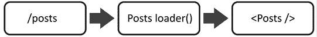

图 14.1：在`loader`执行之后渲染`Posts`组件

这也解释了为什么本节开头提到的`Posts`组件示例中没有处理任何加载状态的代码。因为实际上*根本就没有加载状态*，因为组件函数只有在它的`loader`完成（并且数据可用）之后才会执行。React Router 不会完成页面转换，直到`loader()`函数完成其工作（尽管，如你将在本章末尾学到的那样，有一种方法可以改变这种行为）。

`loader()`函数可以执行任何你选择的操作（例如发送 HTTP 请求，或通过`localStorage` API 访问浏览器存储）。在该函数内部，你应该返回应该暴露给组件函数的数据。还值得注意的是，`loader()`函数可以返回任何类型的数据。它也可能返回一个`Promise`对象，该对象随后解析为任何类型的数据。在这种情况下，React Router 将自动等待`Promise`得到解决，在`useLoaderData()`被调用时提供解析后的数据。因此，`loader()`函数可以执行异步和同步任务。

**注意**

重要的是要理解，`loader()`函数，就像构成你的 React 应用的其它所有代码一样，在客户端执行（即在网站访问者的浏览器中）。因此，你可以在你的 React 应用中执行任何可以在任何其他地方执行的操作（例如，在`useEffect()`中）。 

你绝对不应该尝试运行属于服务器端的代码。直接访问数据库、写入文件系统或执行任何其他服务器端任务都会失败或引入安全风险，这意味着你可能会意外地在客户端暴露数据库凭证。

## 获取加载的数据

当然，属于`loader`的组件（即属于同一路由定义的组件）需要`loader`返回的数据。这就是为什么 React Router 提供了一个新的 Hook 来访问这些数据：`useLoaderData()` Hook。

当在组件函数内部调用此 Hook 时，它将返回属于活动路由的`loader`返回的数据。如果返回的数据是一个`Promise`，React Router（如前所述）将自动等待该`Promise`解决，并在`useLoaderData()`被调用时提供解析后的数据。

`loader()` 函数也可能返回一个 HTTP 响应对象（或一个解析为 `Response` 的 `Promise`）。在先前的例子中就是这样，因为 `fetch()` 函数产生一个解析为 `Response` 类型的对象的 `Promise`。在这种情况下，React Router 自动提取响应体，并提供直接访问附加到响应中的数据（通过 `useLoaderData()`）。

**注意**

如果应该返回响应，返回的对象必须遵循这里定义的标准 `Response` 接口：[`developer.mozilla.org/en-US/docs/Web/API/Response`](https://developer.mozilla.org/en-US/docs/Web/API/Response)。

返回响应可能一开始会显得有些奇怪。毕竟，`loader()` 代码仍然在浏览器内部执行（而不是在服务器上）。因此，技术上没有发送请求，也不应该需要响应（因为整个代码都在同一个环境中执行，即浏览器）。

因此，您可以返回响应，但不必这样做；您可以返回任何类型的值。React Router 也支持响应作为可能的返回值类型之一。

`useLoaderData()` 可以在任何由当前活动路由组件渲染的组件中调用。这可能就是路由组件本身（在先前的例子中是 `Posts`），也可能是任何嵌套组件。

例如，`useLoaderData()` 也可以在包含在 `Posts` 组件中的 `PostsList` 组件中使用（该组件在其路由定义中添加了 `loader`）：

```js
import { useLoaderData } from 'react-router-dom';
function PostsList() {
  const loadedPosts = useLoaderData();
  return (
    <main>
      <h1>Your Posts</h1>
      <ul className="posts">
        {loadedPosts.map((post) => (
          <li key={post.id}>{post.title}</li>
        ))}
      </ul>
    </main>
  );
}
export default PostsList; 
```

对于这个例子，`Posts` 组件文件看起来是这样的：

```js
import PostsList from '../components/PostsList.jsx';
function Posts() {
  return (
    <main>
      <h1>Your Posts</h1>
      <PostsList />
    </main>
  );
}
export default Posts;
export async function loader() {
  const response = await fetch(
    'https://jsonplaceholder.typicode.com/posts'
  );
  if (!response.ok) {
    throw new Error('Could not fetch posts');
  }
  return response;
} 
```

这意味着 `useLoaderData()` 可以在您需要数据的确切位置使用。`loader()` 函数也可以定义在任何您想要的地方，但它必须添加到需要数据的路由中。

**注意**

根据使用的 React Router 版本，您可能会收到有关“未提供 'No HydrateFallback' 元素”的警告。您可以忽略这个警告，因为它仅在服务器端渲染时才有意义。

**注意**

您还可以在 GitHub 上探索这个代码示例：[`github.com/mschwarzmueller/book-react-key-concepts-e2/tree/14-routing-data/examples/02-data-fetching-react-router`](https://github.com/mschwarzmueller/book-react-key-concepts-e2/tree/14-routing-data/examples/02-data-fetching-react-router)。

## 动态路由的数据加载

对于大多数网站来说，仅使用静态、预定义的路由很可能不足以满足您的需求。例如，如果您创建了一个仅使用静态路由的博客网站，您将仅限于在 `/posts` 路径上的简单博客文章列表。要添加关于在 `/posts/1` 或 `/posts/2`（对于具有不同 `id` 值的文章）等路径上所选博客文章的更多详细信息，您需要包含动态路由。

当然，React Router 也支持通过 `loader()` 函数帮助动态路由进行数据获取：

```js
{ 
  path: "/posts/:id",
  element: <PostDetails />, 
  loader: postDetailsLoader 
} 
```

`PostDetails` 组件及其 `loader` 函数可以像这样实现：

```js
import { useLoaderData } from 'react-router-dom';
function PostDetails() {
  const post = useLoaderData();
  return (
    <div id="post-details">
      <h1>{post.title}</h1>
      <p>{post.body}</p>
    </div>
  );
}
export default PostDetails;
export async function loader({ params, request }) {
  console.log(request); 
  const response = await fetch(
    'https://jsonplaceholder.typicode.com/posts/' + params.id
  );
  if (!response.ok) {
    throw new Error('Could not fetch post for id ' + params.id);
  }
  return response;
} 
```

如果它与 *使用 React Router 加载数据* 部分的 `Posts` 组件看起来非常相似，这并非巧合。因为 `loader()` 函数以完全相同的方式工作，只是使用了一个额外的功能来获取动态路径段值：由 React Router 提供的 `params` 对象。

**注意**

你还可以在 GitHub 上探索这个代码示例：[`github.com/mschwarzmueller/book-react-key-concepts-e2/tree/14-routing-data/examples/03-dynamic-routes`](https://github.com/mschwarzmueller/book-react-key-concepts-e2/tree/14-routing-data/examples/03-dynamic-routes)。

当向路由定义添加 `loader()` 函数时，React Router 在组件渲染之前，即路由变为活跃状态时调用该函数。在执行该函数时，React Router 将包含额外信息的对象作为参数传递给 `loader()`。

传递给 `loader()` 的对象包括两个主要属性：

+   一个包含导致路由激活的请求更多详细信息的 `request` 属性

+   一个返回包含所有动态路由参数键值映射的对象的 `params` 属性

对于这个例子来说，`request` 对象并不重要，将在下一节中进行讨论。但 `params` 对象包含一个 `id` 属性，它携带了加载该路由的帖子的 `id` 值。该属性被命名为 `id`，因为在路由定义中，`/posts/:id` 被选为路径。如果选择了不同的占位符名称，那么在 `params` 上将会有一个具有该名称的属性可用（例如，对于 `/posts/:postId`，这将是一个 `params.postId`）。这种行为与在 *第十三章*，*使用 React Router 的多页应用* 中解释的 `useParams()` 返回的 `params` 对象类似。

通过 `params` 对象和帖子 `id`，可以在出站请求 URL（对于 `fetch()` 请求）中包含适当的帖子 `id`，从而从后端 API 加载正确的帖子数据。一旦数据到达，React Router 将渲染 `PostDetails` 组件，并通过 `useLoaderData()` 钩子公开加载的帖子。

## 加载器、请求和客户端代码

在前一节中，你学习了 `loader()` 函数提供的 `request` 对象。获取这样的 `request` 对象可能会令人困惑，因为 React Router 是一个客户端库——所有代码都在浏览器中执行，而不是在服务器上。因此，不应该有请求到达 React 应用（因为 HTTP 请求是从客户端发送到服务器的，而不是客户端 JavaScript 函数之间的请求）。

事实上，并没有通过 HTTP 发送任何请求。相反，React Router 通过浏览器内置的 `Request` 接口创建一个请求对象，用作“数据载体”。这个请求不是通过 HTTP 发送的，但它被用作传递给 `loader()` 函数的数据对象上的 `request` 属性的值。

**注意**

关于内置的 `Request` 接口更多信息，请访问 [`developer.mozilla.org/en-US/docs/Web/API/Request`](https://developer.mozilla.org/en-US/docs/Web/API/Request) 。

这个 `request` 对象在许多 `loader` 函数中将不再需要，但在某些情况下，你可以从该对象中提取有用的信息——这些信息可能在 `loader` 中用于获取正确数据。

例如，你可以使用 `request` 对象及其 `url` 属性来获取访问任何可能包含在当前活动页面 URL 中的搜索参数（查询参数）：

```js
export async function loader({ request }) {
  // e.g. for localhost:5173/posts?sort=desc
  const sortDirection = new URL(request.url).searchParams.get('sort');
  // Fetch sorted posts, based on local 'sort' query param value
  const response = await fetch(
    'https://example.com/posts?sorting=' + sortDirection
  );
  return response;
} 
```

在此代码片段中，使用 `request` 值获取用于 React 应用程序 URL 中的查询参数值。然后，该值用于出站请求。

然而，你必须牢记，你的 `loader()` 函数内部的代码，就像你所有的其他 React 代码一样，总是在客户端执行。如果你想在服务器上执行代码（例如，在服务器端获取数据），你需要使用 **服务器端渲染**（**SSR**）或实现 SSR 的某些 React 框架，如 Next.js。SSR 和 Next.js 将在下一章，*第十五章*，*服务器端渲染与使用 Next.js 构建全栈应用程序*，以及随后的章节中介绍。

# 重新审视布局

React Router 支持布局路由的概念。这些是包含其他路由并将这些其他路由作为嵌套子路由渲染的路由。如您所回忆的，这个概念在第十三章，*使用 React Router 的多页应用程序* 中介绍。

方便的是，布局路由也可以用于在嵌套路由之间共享数据。考虑以下示例网站：

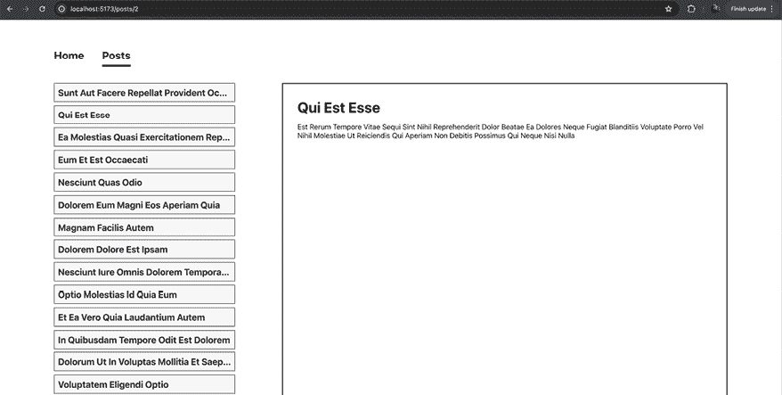

图 14.2：一个包含页眉、侧边栏和一些主要内容的网站

该网站有一个包含导航栏的页眉，一个显示可用帖子列表的侧边栏，以及一个显示当前所选博客文章的主要区域。

此示例包括两个嵌套的布局路由：

+   根布局路由，它包括跨越所有页面的顶部导航栏

+   一个包含侧边栏及其子路由（例如，所选帖子的详细信息）主要内容的帖子布局路由

路由定义代码看起来像这样：

```js
const router = createBrowserRouter([
  {
    path: '/',
    element: <Root />, // main layout, adds navigation bar
    children: [
      { index: true, element: <Welcome /> },
      {
        path: '/posts',
        element: <PostsLayout />, // posts layout, adds posts sidebar
        loader: postsLoader,
        children: [
          { index: true, element: <Posts /> },
          { 
            path: ':id', 
            element: <PostDetails />, 
            loader: postDetailsLoader 
          },
        ],
      },
    ],
  },
]); 
```

使用这种设置，`<Posts />` 和 `<PostDetails />` 组件都渲染在侧边栏旁边（因为侧边栏是 `<PostsLayout />` 元素的一部分）。

有趣的是，`/posts` 路径（即布局路径）会加载帖子数据，因为它被分配了 `postsLoader`，因此 `PostsLayout` 组件文件看起来像这样：

```js
import { Outlet, useLoaderData } from 'react-router-dom';
import PostsList from '../components/PostsList.jsx';
function PostsLayout() {
  const loadedPosts = useLoaderData();
  return (
    <div id="posts-layout">
      <nav>
        <PostsList posts={loadedPosts} />
      </nav>
      <main>
        <Outlet />
      </main>
    </div>
  );
}
export default PostsLayout;
export async function loader() {
  const response = await fetch(
    'https://jsonplaceholder.typicode.com/posts'
  );
  if (!response.ok) {
    throw new Error('Could not fetch posts');
  }
  return response;
} 
```

由于布局路由也是常规路由，因此您可以添加 `loader()` 函数并使用 `useLoaderData()`，就像在任意其他路由中一样。然而，由于布局路由为多个子路由激活，它们的数据也会显示在不同的路由上。在前面的例子中，无论用户访问 `/posts` 还是 `/posts/10`，博客帖子列表始终显示在屏幕的左侧：

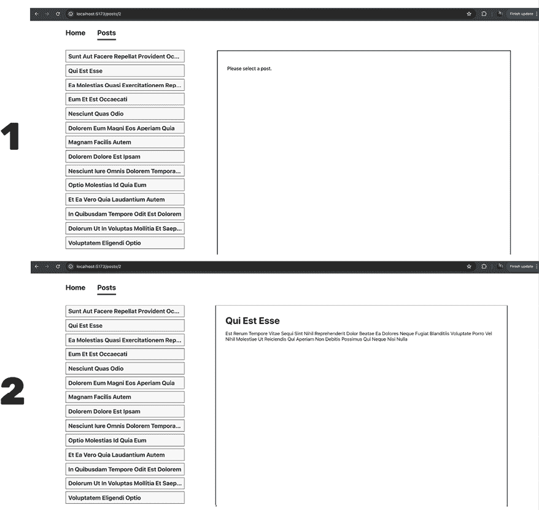

图 14.3：相同的布局和数据用于不同的子路由

在此屏幕截图中，随着不同的子路由被激活，所使用的布局和数据不会改变。React Router 还避免了在切换子路由时进行不必要的数据重新获取（对于博客帖子列表数据）。它足够智能，能够意识到周围的布局没有改变。

## 在不同路由间复用数据

布局路由不仅可以帮助您共享组件和标记。它们还允许您在布局路由及其子路由之间加载和共享数据。

例如，`PostDetails` 组件（即渲染 `/posts/:id` 路由的组件）需要一个帖子的数据，并且可以通过附加到 `/posts/:id` 路由的 `loader` 来检索这些数据：

```js
export async function loader({ params }) {
  const response = await fetch(
    'https://jsonplaceholder.typicode.com/posts/' + params.id
  );
  if (!response.ok) {
    throw new Error('Could not fetch post for id ' + params.id);
  }
  return response;
} 
```

这个例子在本书的 *为动态路由加载数据* 部分已经讨论过。这种方法是可行的，但在某些情况下，可以避免额外的 HTTP 请求。例如，以下路由配置可以简化，并且可以避免在子路由上的额外 `postDetailsLoader`：

```js
const router = createBrowserRouter([
  {
    path: '/',
    element: <Root />, // main layout, adds navigation bar
    children: [
      { index: true, element: <Welcome /> },
      {
        path: '/posts',
        element: <PostsLayout />, // posts layout, adds posts sidebar
        loader: postsLoader,
        children: [
          { index: true, element: <Posts /> },
          { 
            path: ':id', 
            element: <PostDetails />, 
            **loader****: postDetailsLoader** // can be removed
          },
        ],
      },
    ],
  },
]); 
```

在本例中，`PostsLayout` 路由已经获取了所有帖子的列表。该布局组件也对 `PostDetails` 路由有效。在这种情况下，获取单个帖子是不必要的，因为已经为帖子列表获取了所有数据。当然，如果帖子列表的请求（在 `PostsLayout` 路由上的 `postsLoader`）没有提供 `PostDetails` 所需的所有数据，则需要为 `PostDetails` 子路由提供一个特定的 `postDetailsLoader` 加载器。

但如果所有数据都已可用，React Router 允许您通过 `useRouteLoaderData()` 钩子访问父路由组件的加载器数据。

此钩子可以这样使用：

```js
const posts = useRouteLoaderData('posts'); 
```

`useRouteLoaderData()` 需要一个路由标识符作为参数。它需要一个分配给包含应复用数据的祖先路由的标识符。您可以通过将 `id` 属性分配给路由作为路由定义代码的一部分来指定此类标识符：

```js
const router = createBrowserRouter([
  {
    path: '/',
    element: <Root />, // main layout, adds navigation bar
    children: [
      { index: true, element: <Welcome /> },
      {
        path: '/posts',
        **id****:** **'posts'****,** **// the id value is up to you**
        element: <PostsLayout />, // posts layout, adds posts sidebar
        loader: postsLoader,
        children: [
          { index: true, element: <Posts /> },
          { 
            path: ':id', 
            element: <PostDetails />, // details loader was removed
          },
        ],
      },
    ],
  },
]); 
```

然后 `useRouteLoaderData()` 钩子返回与您添加 `id` 的路由中 `useLoaderData()` 产生的相同数据。在本例中，它将提供一个博客帖子列表。

在 `PostDetails` 中，此钩子可以这样使用：

```js
import { **useParams****useRouteLoaderData**,  } from 'react-router-dom';
function PostDetails() {
  **const** **params =** **useParams****();**
  **const** **posts =** **useRouteLoaderData****(****'posts'****);**
  **const** **post = posts.****find****(****(****post****) =>** **post.****id****.****toString****() === params.****id****);**
  return (
    <div id="post-details">
      <h1>{post.title}</h1>
      <p>{post.body}</p>
    </div>
  );
}
export default PostDetails; 
```

使用`useParams()`钩子来获取动态路由参数值，并在帖子列表上使用`find()`方法来识别具有合适`id`属性的单一帖子。在这个例子中，你将避免发送不必要的 HTTP 请求，通过重用已经可用的数据。

因此，`/posts/:id`路由定义中作为`postDetailsLoader`的一部分可以删除。

# 错误处理

在本章开头非常早期的第一个例子（其中使用`useEffect()`发送了 HTTP 请求），代码不仅处理了成功情况，还处理了可能的错误。从那时起，所有基于 React Router 的例子中，错误处理都被省略了。错误处理尚未讨论，因为虽然 React Router 在错误处理中扮演着重要角色，但首先必须牢固地理解 React Router 的一般工作原理以及它如何帮助数据获取。但是，当然，错误并不总是可以避免的，并且绝对不应该被忽视。

幸运的是，当使用 React Router 的数据功能时，错误处理也非常简单和容易。你可以在你的路由定义上设置一个`errorElement`属性，并定义当发生错误时应渲染的元素：

```js
// ... other imports
**import****Error****from****'./components/Error.jsx'****;**
const router = createBrowserRouter([
  {
    path: '/',
    element: <Root />,
    **errorElement****:** **<****Error** **/>****,**
    children: [
      { index: true, element: <Welcome /> },
      {
        path: '/posts',
        id: 'posts',
        element: <PostsLayout />,
        loader: postsLoader,
        children: [
          { index: true, element: <Posts /> },
          { path: ':id', element: <PostDetails /> },
        ],
      },
    ],
  },
]); 
```

这个`errorElement`属性可以设置在任何你选择的路由定义上，甚至可以同时设置多个路由定义。React Router 将会渲染最接近错误抛出位置的路由的`errorElement`。

在前面的代码片段中，无论哪个路由产生了错误，都会显示根路由的`errorElement`（因为这是唯一带有`errorElement`的路由定义）。但是，如果你也向`/posts`路由添加了一个`errorElement`，并且`:id`路由产生了错误，那么屏幕上显示的将是`/posts`路由的`errorElement`，如下所示：

```js
const router = createBrowserRouter([
  {
    path: '/',
    element: <Root />,
    **errorElement****:** **<****Error** **/>****,** **// for all errors not handled elsewhere**
    children: [
      { index: true, element: <Welcome /> },
      {
        path: '/posts',
        id: 'posts',
        element: <PostsLayout />,
        // used if /posts or /posts/:id throws an error
        **errorElement****:** **<****PostsError** **/>****,** **// handles /posts related errors**
        loader: postsLoader,
        children: [
          { index: true, element: <Posts /> },
          { path: ':id', element: <PostDetails /> },
        ],
      },
    ],
  },
]); 
```

这允许你，作为开发者，设置精细的错误处理。

在用作`errorElement`值的组件内部，你可以通过`useRouteError()`钩子访问抛出的错误：

```js
import { useRouteError } from 'react-router-dom';
function Error() {
  const error = useRouteError();
  return (
    <>
      <h1>Oh no!</h1>
      <p>An error occurred</p>
      <p>{error.message}</p>
    </>
  );
}
export default Error; 
```

通过这个简单而有效的错误处理解决方案，React Router 允许你避免自己管理错误状态。相反，你只需定义一个标准的 React 元素（通过`element`属性），当一切顺利时应该显示，以及一个`errorElement`，当事情出错时应该显示。

# 数据提交之旅

到目前为止，你已经学到了很多关于数据获取的知识。但如本章前面所述，React Router 也帮助处理数据提交。

考虑以下示例组件：

```js
function NewPost() {
  return (
    <form id="post-form">
      <p>
        <label htmlFor="title">Title</label>
        <input type="text" id="title" name="title" />
      </p>
      <p>
        <label htmlFor="text">Text</label>
        <textarea id="text" name="text" rows={3} />
      </p>
      <button>Save Post</button>
    </form>
  );
}
export default NewPost; 
```

这个组件渲染一个`<form>`元素，允许用户输入新帖子的详细信息。由于以下路由配置，组件在`/posts/new`路由变为活动状态时显示：

```js
const router = createBrowserRouter([
  {
    path: '/',
    element: <Root />,
    errorElement: <Error />,
    children: [
      { index: true, element: <Welcome /> },
      {
        path: '/posts',
        id: 'posts',
        element: <PostsLayout />,
        loader: postsLoader,
        children: [
          { index: true, element: <Posts /> },
          { path: ':id', element: <PostDetails /> },
          **{** **path****:** **'new'****,** **element****: <****NewPost** **/> },**
        ],
      },
    ],
  },
]); 
```

在没有 React Router 的数据相关功能的情况下，你可能这样处理表单提交：

```js
function NewPost() {
  const navigate = useNavigate();
  async function submitAction(formData) {
    const enteredTitle = formData.get('title');
    const enteredText = formData.get('text');
    const postData = {
      title: enteredTitle,
      text: enteredText
    };
    await fetch('https://jsonplaceholder.typicode.com/posts', {
      method: 'POST',
      body: JSON.stringify(postData),
      headers: {'Content-Type': 'application/json'}
    });
    navigate('/posts');
  } 
  return (
    <form action={submitAction}>
      <p>
        <label htmlFor="title">Title</label>
        <input type="text" id="title" name="title" />
      </p>
      <p>
        <label htmlFor="text">Text</label>
        <textarea id="text" rows={3} name="text" />
      </p>
      <button>Save Post</button>
    </form>
  );
} 
```

就像之前在获取数据时一样，这需要在组件函数中添加相当多的代码和逻辑。你必须手动提取提交的数据，发送 HTTP 请求，并在收到 HTTP 响应后导航到不同的页面。

此外，你可能还需要管理加载状态和潜在的错误（在先前的示例中省略）。

再次强调，React Router 提供了一些帮助。当可以添加 `loader()` 函数来处理数据加载时，可以定义 `action()` 函数来处理数据提交。

当使用新的 `action()` 函数时，前面的示例组件看起来像这样：

```js
**import** **{** **Form****, redirect }** **from****'react-router-dom'****;**
function NewPost() {
  return (
    <**Form****method****=****"post"** id="post-form">
      <p>
        <label htmlFor="title">Title</label>
        <input type="text" id="title" name="title"/>
      </p>
      <p>
        <label htmlFor="text">Text</label>
        <textarea id="text" rows={3} name="text" />
      </p>
      <button>Save Post</button>
    </Form>
  );
}
export default NewPost;
**export****async****function****action****(****{ request }****) {**
  **const** **formData =** **await** **request.****formData****();**
  **const** **enteredTitle = formData.****get****(****'****title'****);**
  **const** **enteredText = formData.****get****(****'text'****);**
  **const** **postData = {**
    **title****: enteredTitle,**
    **text****: enteredText**
  **};**
  **await****fetch****(****'https://jsonplaceholder.typicode.com/posts'****, {**
    **method****:** **'POST'****,**
    **body****:** **JSON****.****stringify****(postData),**
    **headers****: {** **'Content-Type'****:** **'application/json'** **},**
  **});**
  **return****redirect****(****'****/posts'****);**
**}** 
```

这段代码的长度可能相似，但它有一个优点，就是将所有数据提交逻辑从组件函数移动到特殊的 `action()` 函数中。

除了添加 `action()` 函数之外，示例代码片段还包括以下重要更改和功能：

+   使用 `<Form>` 组件代替 `<form>`。

+   `method` 属性被设置在 `<Form>` 元素上（设置为 `"post"`）。

+   提交的数据通过调用 `request.formData()` 被提取为 `FormData`。

+   用户通过新添加的 `redirect()` 函数进行重定向（而不是 `useNavigate()` 和 `navigate()`）。

但这些元素是什么？

## 与 action() 和表单数据一起工作

就像 `loader()` 一样，`action()` 是一个可以添加到路由定义中的特殊函数，如下所示：

```js
**import****NewPost****, { action** **as** **newPostAction }** **from****'./components/NewPost.jsx'****;**
**// ...**
**{** **path****:** **'new'****,** **element****:** **<****NewPost** **/>****,** **action****: newPostAction },** 
```

当在路由定义上设置 `action` 属性时，指定的函数会在提交目标此路由的 `<Form>`（不是 `<form>`！）时自动调用。`Form` 是 React Router 提供的一个组件，应代替默认的 `<form>` 元素使用。

内部，`Form` 使用默认的 `<form>` 元素，但阻止浏览器在表单提交时创建和发送 HTTP 请求。相反，React Router 创建一个 `FormData` 对象，并调用为 `<Form>` 目标路由定义的 `action()` 函数，传递一个基于内置 `Request` 接口的对象，并将其传递给它。传递的对象包含由 React Router 生成的表单数据。在本章的 *控制哪个 <Form> 触发哪个动作* 部分，你将学习如何控制 React Router 将执行哪个路由的 `action()` 函数。

**注意**

使用“actions”来处理表单提交可能听起来很熟悉——*第九章*，*使用表单动作处理用户输入和表单*，讨论了类似的概念。

但 whereas *第九章* 讨论了内置在 React 中的功能（这与路由无关或依赖），本章探讨了 React Router 的核心概念。

最终，你可以使用任何一种处理表单提交的方法。或者你也可以不使用这两种方法，而是通过 `onSubmit` 手动处理 `submit` 事件。

但当使用 React Router 进行路由时，你通常会得到更干净、更简洁的代码，这些代码可以与其他路由功能（如使用 React Router 的 `<Form>` 组件和 `action()` 函数时的重定向）无缝集成。

通过调用 `request.formData()` 创建的表单数据对象包括提交的表单中输入的所有表单输入值。为了注册，输入元素（如 `<input>`、`<select>` 或 `<textarea>`）必须分配一个 `name` 属性。为这些 `name` 属性设置的值可以后来用来提取输入的数据。

`action()` 函数接收到的 `request` 对象（包含表单数据）是由 React Router 在表单提交时创建的。

`Form` 组件定义了请求对象的 HTTP 方法。通过将 `Form` 的 `method` 属性设置为 `"get"`（默认值）或 `"post"`，你可以控制表单提交时会发生什么。当设置 `method="get"`（或根本不设置 `method`）时，将发生常规的 URL 导航——就像点击了指向某个路径的链接一样。在这种情况下，任何输入的表单值都将作为 URL 查询参数进行编码。要触发 `action()` 函数，`<Form>` 的 `method` 必须设置为 `"post"`。

然而，重要的是要理解，请求不是通过 HTTP 发送的，因为 `action()`，就像 `loader()` 或组件函数一样，仍然在浏览器中执行，而不是在服务器上执行。

然后，`action()` 函数接收一个包含 `request` 属性的对象，该属性包含包含表单数据的创建请求对象。此 `request` 对象可以用来提取表单输入字段中输入的值，如下所示：

```js
**export****async****function****action****(****{ request }****) {**
  **const** **formData =** **await** **request.****formData****();**
  **const** **postData =** **Object****.****fromEntries****(formData);**
  **// ...**
**}** 
```

内置的 `formData()` 方法返回一个解析为 `FormData` 对象的 `Promise`，该对象提供了一个 `get()` 方法，可以用来通过其标识符（即，通过在输入元素上设置的 `name` 属性值）获取输入的值。例如，输入到 `<input name="title">` 中的值可以通过 `formData.get('title')` 来检索。

或者，你可以遵循前面代码片段中选择的方案，通过 `Object.fromEntries(formData)` 将 `formData` 对象转换为简单的键值对象。此对象（在前面的例子中为 `postData`）包含在表单输入元素上设置的名称作为属性，以及这些属性的值（这意味着 `postData.title` 会返回 `<input name="title">` 中输入的值）。

**注意**

React Router 也支持其他主要的 HTTP 动词（`"patch"`、`"put"` 和 `"delete"`），将 `method` 设置为这些动词之一确实也会触发 `action()` 函数。

当处理多个应触发相同 `action()` 的表单时，这很有用。通过使用不同的方法，你可以使用单个操作来根据在 `action()` 函数内部从 `request.method` 提取的值运行不同的代码。

但值得注意的是，使用除 `'get'` 和 `'post'` 之外的方法不符合 HTML 标准。因此，React Router 可能会在未来移除对这些方法的支持。

因此，当处理触发相同 `action()` 的多个表单时，一个更稳定的解决方案是包含一个具有唯一标识符的隐藏输入字段（例如，`<input type="hidden" name="_method" value="DELETE">`）。然后可以提取并使用这个值（例如，在 `if` 语句中）在 `action()` 函数中。

提取的数据可以用于你选择的任何操作。这可能是一个额外的验证步骤，或者发送到某个后端 API 的 HTTP 请求，其中数据可能被存储在数据库或文件中：

```js
export async function action({ request }) {
  const formData = await request.formData();
  const postData = Object.fromEntries(formData);
  await fetch('https://jsonplaceholder.typicode.com/posts', {
    method: 'POST',
    body: JSON.stringify(postData),
    headers: { 'Content-Type': 'application/json' },
  });
  return redirect('/posts');
} 
```

最后，一旦执行了所有预期的步骤，`action()` 函数必须返回一个值——任何类型的任何值，但至少是 `null`。不返回任何内容（即省略 `return` 语句）是不允许的。尽管如此，与 `loader()` 函数一样，你也可以返回一个响应，例如，像这样的重定向响应：

```js
**export****async****function****action****(****{ request }****) {**
  **// action logic …**
  **return****new****Response****(****""****, {**
    **status****:** **302****,**
    **headers****: {**
      **Location****:** **'/posts'**
    **}**
  **});**
**}** 
```

事实上，对于操作来说，你很可能希望在操作执行后导航到不同的页面（例如，一旦向 API 发送了 HTTP 请求）。这可能需要将用户从数据输入页面导航到显示所有可用数据条目的页面（例如，从 `/posts/new` 到 `/posts`）。

为了简化这个常见的模式，React Router 提供了一个 `redirect()` 函数，它返回一个响应对象，导致 React Router 切换到不同的路由。因此，你可以在 `action()` 函数中返回调用 `redirect()` 的结果，以确保用户被导航到不同的页面。这相当于在手动处理表单提交时调用 `navigate()`（通过 `useNavigate()`）。

```js
**export****async****function****action****(****{ request }****) {**
  **// action logic …**
  **return****redirect****(****'/posts'****)**
**}** 
```

在这个片段中，React Router 的 `redirect()` 函数被用来代替手动构造 `Response` 对象。

## 返回数据而不是重定向

如前所述，你的 `action()` 函数可以返回任何内容。你不必返回响应对象。虽然返回重定向响应相当常见，但你偶尔可能想返回一些原始数据。

有一种情况下你可能不希望重定向用户，那就是在验证用户输入之后。在 `action()` 函数中，在将输入的数据发送到某个 API 之前，你可能希望首先验证提供的值。如果检测到无效的值（例如，空标题），通常通过保持用户在 `<Form>` 路由上以获得良好的用户体验。用户输入的值不应被清除和丢失；相反，表单应更新以向用户提供有用的验证错误信息。这些信息可以从 `action()` 传递到组件函数，以便在那里显示（例如，在表单输入字段旁边）。

在这种情况下，您可以从 `action()` 函数返回一个“正常”值（即不是重定向响应）：

```js
export async function action({ request }) {
  const formData = await request.formData();
  const postData = Object.fromEntries(formData);
  **let** **validationErrors = [];**
  **if** **(postData.****title****.****trim****().****length** **===** **0****) {**
    **validationErrors.****push****(****'Invalid post title provided.'****)**
  **}**
  **if** **(postData.****text****.****trim****().****length** **===** **0****) {**
    **validationErrors.****push****(****'Invalid post text provided.'****)**
  **}**
  **if** **(validationErrors.****length** **>** **0****) {**
    **return** **validationErrors;**
  **}**
  await fetch('https://jsonplaceholder.typicode.com/posts', {
    method: 'POST',
    body: JSON.stringify(postData),
    headers: { 'Content-Type': 'application/json' },
  });
  return redirect('/posts');
} 
```

在此示例中，如果输入的 `title` 或 `text` 值为空，则返回 `validationErrors` 数组。

`action()` 函数返回的数据可以通过 `useActionData()` 钩子在路由组件（或任何其他嵌套组件）中使用：

```js
import { Form, redirect, **useActionData** } from 'react-router-dom';
function NewPost() {
  **const** **validationErrors =** **useActionData****();**
  return (
    <Form method="post" id="post-form">
      <p>
        <label htmlFor="title">Title</label>
        <input type="text" id="title" name="title" />
      </p>
      <p>
        <label htmlFor="text">Text</label>
        <textarea id="text" name="text" rows={3} />
      </p>
      **<****ul****>**
        **{validationErrors &&**
          **validationErrors.map((err) =>** **<****li****key****=****{err}****>****{err}****</****li****>****)}**
      **</****ul****>**
      <button>Save Post</button>
    </Form>
  );
} 
```

`useActionData()` 很像 `useLoaderData()`，但与 `useLoaderData()` 不同，它不保证产生任何数据。这是因为虽然 `loader()` 函数总是在路由组件渲染之前被调用，但 `action()` 函数只有在 `<Form>` 提交后才会被调用。

在此示例中，`useActionData()` 用于获取 `action()` 返回的 `validationErrors` 的访问权限。如果 `validationErrors` 是真值（即不是 `undefined`），则数组将被映射到显示给用户的错误项列表：

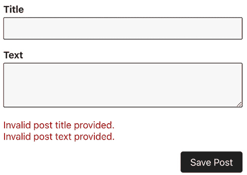

图 14.4：验证错误输出在输入字段下方

因此，`action()` 函数非常灵活，您可以使用它执行操作并重定向，也可以执行多个操作并为不同的用例返回不同的值。

## 控制哪个 <Form> 触发哪个操作

在本章前面的部分，在 *使用 action() 和表单数据* 的部分，您学习了当使用 `<Form>` 而不是 `<form>` 时，React Router 将执行目标 `action()` 函数。但 `<Form>` 针对的是哪个 `action()` 函数？

默认情况下，渲染表单的 `action()` 函数（无论是直接还是通过某些子组件）也是分配给路由的。考虑以下路由定义：

```js
{ path: '/posts/new', element: <NewPost />, action: newPostAction } 
```

使用此定义，当 `NewPost` 组件（或任何嵌套组件）中的任何 `<Form>` 被提交时，将触发 `newPostAction()` 函数。

在许多情况下，这种默认行为正是您想要的。但您也可以通过在 `<Form>` 上设置 `action` 属性为目标路由的路径来针对其他路由上定义的 `action()` 函数：

```js
// form rendered in a component that belongs to /posts
<Form method="post" action="/save-data">
  ...
</Form> 
```

此表单将导致 React Router 执行属于 `/save-data` 路由的 `action`，即使 `<Form>` 组件可能是属于不同路由（例如，`/posts`）的组件的一部分。

然而，值得注意的是，针对不同的路由会导致页面过渡到该路由的路径，即使您的操作没有返回重定向响应。在本章的后续部分，标题为 *幕后数据获取和提交* 的部分，您将了解如何避免这种行为。

## 反映当前导航状态

提交表单后，触发的 `action()` 函数可能需要一些时间来执行所有预期的操作。特别是向 API 发送 HTTP 请求可能需要几秒钟。

当然，如果用户得不到关于当前数据提交状态的任何反馈，那么用户体验就不会很好。点击提交按钮后，是否发生了任何操作并不立即明了。

因此，你可能想在`action()`函数运行期间显示一个加载指示器或更新按钮的标题。确实，提供用户反馈的一种常见方式是禁用提交按钮并更改其标题，如下所示：

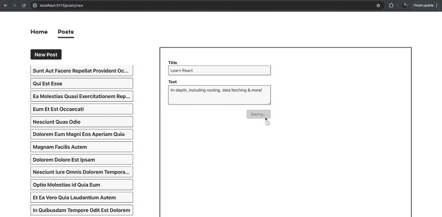

图 14.5：提交按钮变灰

你可以通过`useNavigation()` Hook 获取当前的 React Router 状态（即它是否正在过渡到另一个路由或执行`action()`函数）。这个 Hook 提供了一个包含各种与路由相关的信息的导航对象。

最重要的是，这个对象有一个`state`属性，它返回一个描述当前导航状态的字符串。此属性被设置为以下三个可能值之一：

+   `submitting`：如果当前正在执行`action()`函数

+   `loading`：如果当前正在执行`loader()`函数（例如，由于`redirect()`响应）

+   `idle`：如果没有`action()`或`loader()`函数正在执行

因此，你可以使用这个`state`属性来找出 React Router 是否正在导航到不同的页面或执行`action()`。因此，可以通过前面的截图中的代码更新提交按钮：

```js
import { 
  Form, 
  redirect, 
  useActionData, 
  **useNavigation** 
} from 'react-router-dom';
function NewPost() {
  const validationErrors = useActionData();
  **const** **navigation =** **useNavigation****();**
  **const** **isSubmitting = navigation.****state** **!==** **'idle'****;**
  return (
    <Form method="post" id="post-form">
      <p>
        <label htmlFor="title">Title</label>
        <input type="text" id="title" name="title" />
      </p>
      <p>
        <label htmlFor="text">Text</label>
        <textarea id="text" name="text" rows={3} />
      </p>
      <ul>
        {validationErrors &&
          validationErrors.map((err) => <li key={err}>{err}</li>)}
      </ul>
      <button **disabled****=****{isSubmitting}**>
        **{isSubmitting ? 'Saving...' : 'Save Post'}**
      </button>
    </Form>
  );
} 
```

在这个例子中，如果当前导航状态不是`'idle'`，则`isSubmitting`常量是`true`。然后使用这个常量通过`disabled`属性禁用提交按钮并调整按钮的标题。

## 以编程方式提交表单

在某些情况下，你可能不希望在表单提交时立即触发`action()`，例如，当你需要先请求用户确认时，比如触发删除或更新数据的操作。

对于此类场景，React Router 允许你以编程方式提交表单（因此触发`action()`函数）。你不需要使用 React Router 提供的`Form`组件，而是使用默认的`<form>`元素手动处理表单提交。作为你代码的一部分，你可以使用 React Router 的`useSubmit()` Hook 提供的`submit()`函数手动触发`action()`。

考虑以下例子：

```js
import {
  redirect,
  useParams,
  useRouteLoaderData,
  **useSubmit,**
} from 'react-router-dom';
function PostDetails() {
  const params = useParams();
  const posts = useRouteLoaderData('posts');
  const post = posts.find((post) => post.id.toString() === params.id);
  **const** **submit =** **useSubmit****();**
  **function****handleSubmit****(****event****) {**
    **event.****preventDefault****();**
    **const** **proceed =** **window****.****confirm****(****'Are you sure?'****);**
    **if** **(proceed) {**
      **submit****(**
        **{** **message****:** **'Your submitted data, if needed'** **},**
        **{**
          **method****:** **'post'****,**
        **}**
      **);**
    **}**
  **}**
  return (
    <div id="post-details">
      <h1>{post.title}</h1>
      <p>{post.body}</p>
      **<****form****onSubmit****=****{handleSubmit}****>**
        **<****button****>****Delete****</****button****>**
      **</****form****>**
    </div>
  );
}
export default PostDetails;
// action must be added to route definition!
**export****async****function****action****(****{ request }****) {**
  **const** **formData =** **await** **request.****formData****();**
  **console****.****log****(formData.****get****(****'message'****));**
  **console****.****log****(request.****method****);**
  **return****redirect****(****'/posts'****);**
**}** 
```

在这个例子中，`action()`是通过`useSubmit()`提供的`submit()`函数以编程方式提交数据手动触发的。这种做法是必需的，否则将无法通过浏览器的`window.confirm()`方法请求用户确认。

由于数据是以编程方式提交的，应该使用默认的`<form>`元素，并手动处理`submit`事件。作为这个过程的一部分，必须手动阻止浏览器发送 HTTP 请求的默认行为。

通常情况下，使用 `<Form>` 而不是程序化提交更为可取。但在某些情况下，例如前述示例中，能够手动控制表单提交可能是有用的。

## 背景数据获取和提交

在某些情况下，你可能需要触发一个操作或加载数据，而不引起页面转换。

点赞按钮就是一个例子。当点击时，应在后台触发一个过程（例如，存储有关用户和点赞帖子的信息），但用户不应被导向到不同的页面：

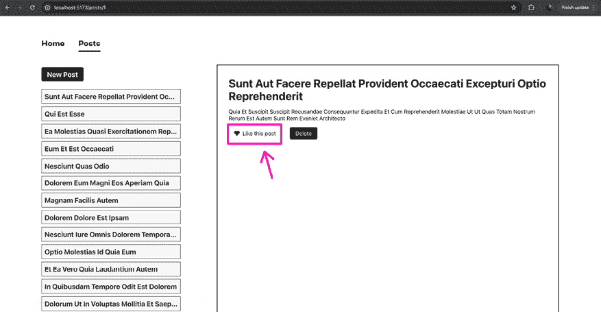

图 14.6：帖子下方的点赞按钮

要实现这种行为，你可以将按钮包裹在一个 `<Form>` 中，并在 `action()` 函数的末尾简单地重定向回已活跃的页面。

但从技术上讲，这仍然会导致额外的导航操作。因此，`loader()` 函数将被执行，并可能发生其他可能的副作用（例如，当前的滚动位置可能会丢失）。因此，你可能想要避免这种行为。

幸运的是，React Router 提供了一个解决方案：`useFetcher()` 钩子，它产生一个包含 `submit()` 方法的对象。与 `useSubmit()` 提供的 `submit()` 函数不同，`useFetcher()` 产生的 `submit()` 方法旨在触发操作（或 `loader()` 函数）而不启动页面转换。

如前所述，点赞按钮可以像这样实现（借助 `useFetcher()`）：

```js
import {
  // ... other imports
  **useFetcher,**
} from 'react-router-dom';
import { FaHeart } from 'react-icons/fa';
function PostDetails() {
  // ... other code & logic
  **const** **fetcher =** **useFetcher****();**
  **function****handleLikePost****() {**
    **fetcher.****submit****(****null****, {**
      **method****:** **'post'****,**
      **action****:** **`/posts/****${post.id}****/like`****,** 
      **// targeting an action on another route**
    **});**
  **}**
  return (
    <div id="post-details">
      <h1>{post.title}</h1>
      <p>{post.body}</p>
      <div className="actions">
        **<****button****className****=****"icon-btn"****onClick****=****{handleLikePost}****>**
          <FaHeart />
          <span>Like this post</span>
        </button>
        <form onSubmit={handleSubmit}>
          <button>Delete</button>
        </form>
      </div>
    </div>
  );
} 
```

`useFetcher()` 返回的 `fetcher` 对象具有各种属性。例如，它还包含提供有关触发操作或加载程序当前状态的属性（包括可能已返回的任何数据）。

但此对象还包括两个重要的方法：

+   `load()`：触发路由的 `loader()` 函数（例如，`fetcher.load('/route-path')`）

+   `submit()`：使用提供的数据和配置触发一个 `action()` 函数

在上面的代码片段中，通过调用 `submit()` 方法来触发 `/posts/<post-id>/like` 路由上定义的操作。在没有 `useFetcher()`（即使用 `useSubmit()` 或 `<Form>`）的情况下，React Router 会切换到选定的路由路径以触发其操作。使用 `useFetcher()` 时，可以避免这种情况，并且可以从另一个路由内部调用该路由的操作（这意味着在 `/posts/<post-id>` 路由活跃时，会调用为 `/posts/<post-id>/like` 定义的操作）。

这还允许你定义不渲染任何元素的路由（即没有页面组件的路由），而是只包含一个 `loader()` 或 `action()` 函数。例如，`/posts/<post-id>/like` 路由文件（`pages/like.js`）看起来是这样的：

```js
// there is no component function in this file!
export function action({ params }) {
  console.log('Triggered like action.');
  console.log(`Liking post with id ${params.id}.`);
  // Do anything else
  // May return data or response, including redirect() if needed
  return null; // something must be returned, even if it's just null
} 
```

如代码片段中所述，任何数据都可以在这个操作中返回。但你至少必须返回 `null` ——避免 `return` 语句并且不返回任何内容是不允许的，并且会导致错误。

它被注册为以下路由：

```js
import { action as likeAction } from './pages/like.js';
// ...
{ path: ':id/like', action: likeAction }, 
```

这之所以有效，是因为这个 `action()` 只通过 `useFetcher()` 提供的 `submit()` 方法触发。`<Form>` 和 `useSubmit()` 产生的 `submit()` 函数将启动一个路由转换到 `/posts/<post-id>/like` 。如果没有在路由定义上设置 `element` 属性，这个转换将导致一个空页面，如下所示：

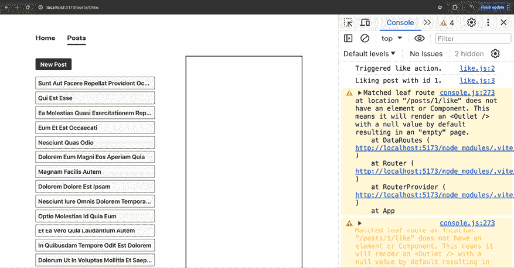

图 14.7：显示了一个空（嵌套）页面，以及一条警告信息

由于它提供的额外灵活性，`useFetcher()` 在构建高度交互的用户界面时非常有用。它不是作为 `useSubmit()` 或 `<Form>` 的替代品，而是一个额外的工具，用于不需要或不需要路由转换的情况。

## 延迟数据加载

到目前为止，本章中的所有数据获取示例都假设页面应该只在所有数据都获取到后才显示。这就是为什么从未有任何加载状态需要管理（因此也没有需要显示的加载重试内容）。

在许多情况下，这正是你想要的这种行为，因为仅仅为了在几秒钟内显示一个加载指示器或类似的重试内容，然后再用实际页面数据替换它，通常是没有意义的。

但也有可能需要相反的行为——例如，如果你知道某个页面将需要相当长的时间来加载数据（可能是因为必须在后端执行的一个复杂的数据库查询）或者如果你有一个页面，它加载不同的数据块，其中一些块比其他块慢得多。

在这种情况下，即使某些数据仍然缺失，渲染页面组件可能也是有意义的。React Router 也支持这种用例，允许你延迟数据加载，这反过来又使得页面组件可以在数据可用之前被渲染。

延迟数据加载就像从加载器返回一个承诺（而不是在那里等待它）一样简单：

```js
// ... other imports
export async function loader() {
  return **{**
    **posts****:** **getPosts****()**
  **};**
} 
```

在这个例子中，`getPosts()` 是一个返回（慢速）`Promise` 的函数：

```js
async function getPosts() {
  const response = await fetch(
    'https://jsonplaceholder.typicode.com/posts'
  );
  await wait(3); // utility function, simulating a slow response
  if (!response.ok) {
    throw new Error('Could not fetch posts');
  }
  const data = await response.json();
  return data;
} 
```

React Router 允许你返回原始承诺。这样做时，你可以在客户端代码中等待那些承诺产生的实际值。

在使用 `useLoaderData()` 的组件函数内部，你还必须使用 React Router 提供的新组件：`Await` 组件。它的使用方式如下：

```js
**import** **{** **Suspense** **}** **from****'react'****;**
**import** **{** **Await** **}** **from****'react-router-dom'****;**
// ... other imports
function PostsLayout() {
  const data = useLoaderData();
  return (
    <div id="posts-layout">
      <nav>
        **<****Suspense****fallback****=****{****<****p****>****Loading posts...****</****p****>****}>**
          **<****Await****resolve****=****{data.posts}****>**
            **{(loadedPosts) =>** **<****PostsList****posts****=****{loadedPosts}** **/>****}**
          **</****Await****>**
        **</****Suspense****>**
      </nav>
      <main>
        <Outlet />
      </main>
    </div>
  );
} 
```

`<Await>` 元素接受一个 `resolve` 属性，该属性从加载器数据接收类型为 `Promise` 的值。它被 React 提供的 `<Suspense>` 组件包裹。

传递给解决的是存储在 `loader()` 函数返回的对象中的 `Promise`。在那里，一个名为 posts 的键被用来保存那个 `Promise`。那个键的值是 `getPosts()` 返回的 `Promise`。这就是通过 `<Await resolve={data.posts}>` 传递给 `resolve` 的 `Promise`。如果使用了不同的键名（例如，`blogPosts`），在设置 `resolve` 时必须引用那个键名（例如，`<Await resolve={data.blogPosts}>`）。

`Await` 在调用作为 `<Await>` 子组件（即在 `<Await>` 开启和关闭标签之间传递的函数）之前，会自动等待 `Promise` 解决。这个函数由 React Router 在延迟操作的数据可用时执行。因此，在这个函数内部，`loadedPosts` 作为参数接收，最终的用户界面元素可以被渲染。

用作 `<Await>` 包装器的 `Suspense` 组件定义了一些后备内容，在延迟数据尚未可用时渲染。在*第十章*，*React 背后的场景和优化机会*中，`Suspense` 组件被用来显示一些后备内容，直到缺失的代码下载完成。现在，它被用来填补直到所需数据可用的时间。

如*图 14.8*所示，当返回一个 `Promise`（并使用 `<Await>`）时，网站的其他部分，那些不是通过 `<Await>` 加载的，在等待帖子数据的同时已经渲染并显示出来。

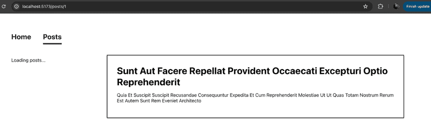

图 14.8：在帖子列表加载时，帖子详情已经可见

返回 `Promise` 并在客户端代码中等待它的另一个大优点是，你可以轻松地组合多个获取过程，并控制哪些过程应该延迟，哪些不应该。例如，一个路由可能正在获取不同的数据片段。如果只有一个过程比较慢，你可以像这样只延迟慢的那个：

```js
export async function loader() {
  return {
      posts: getPosts(), // slow operation => deferred
      userData: await getUserData() // fast operation => NOT deferred
    };
} 
```

在这个例子中，`getUserData()` 没有被延迟，因为在其前面添加了 `await` 关键字。因此，JavaScript 会在从 `loader()` 返回之前等待那个 `Promise`（`getUserData()` 返回的 `Promise`）解决。因此，当 `getUserData()` 完成时，路由组件就会被渲染，但在 `getPosts()` 完成之前。

# 摘要和关键要点

+   React Router 可以帮助你处理数据获取和提交。

+   你可以为你的路由注册 `loader()` 函数，使得数据获取在路由变得活跃时初始化。

+   `loader()` 函数返回数据（或包含数据的响应）可以在你的组件函数中使用 `useLoaderData()` 访问。

+   `loader()` 数据可以通过 `useRouteLoaderData()` 在组件间共享。

+   你也可以在你的路由上注册 `action()` 函数，这些函数在表单提交时被触发。

+   要触发`action()`函数，你必须使用 React Router 的`<Form>`组件或通过`useSubmit()`或`useFetcher()`程序化地提交数据。

+   `useFetcher()`可用于在不启动路由转换的情况下加载数据或提交数据。

+   在获取慢速数据时，你可以在`loader()`中返回承诺而不等待，以延迟加载路由的一些或全部数据。

## 接下来是什么？

获取和提交数据是极其常见的任务，尤其是在构建更复杂的 React 应用程序时。

通常，这些任务与路由转换紧密相关，React Router 是处理此类操作的完美工具。这就是为什么 React Router 包提供了强大的数据管理功能，极大地简化了这些过程。

在本章中，你学习了 React Router 如何帮助你获取或提交数据，以及哪些高级特性有助于你处理基本和更复杂的数据操作场景。

因此，本章总结了你需要了解的核心 React Router 特性列表。

下一章将探讨 React 的服务器端功能以及如何使用 React 构建全栈应用程序，在服务器上加载数据，并使用 Next.js 框架。

## 测试你的知识！

通过回答以下问题来测试你对本章涵盖的概念的了解。然后，你可以将你的答案与在[`github.com/mschwarzmueller/book-react-key-concepts-e2/blob/14-routing-data/exercises/questions-answers.md`](https://github.com/mschwarzmueller/book-react-key-concepts-e2/blob/14-routing-data/exercises/questions-answers.md)中找到的示例进行比较。

1.  数据获取和提交与路由有何关联？

1.  `loader()`函数的目的是什么？

1.  `action()`函数的目的是什么？

1.  `<Form>`和`<form>`之间有什么区别？

1.  `useSubmit()`和`useFetcher()`之间有什么区别？

1.  返回承诺而不是在`loader()`中等待背后的想法是什么？

# 应用你所学的知识

将你对路由的知识与数据操作相结合，应用于以下活动。

## 活动十四点一：待办事项应用程序

在这个活动中，你的任务是创建一个基本的待办事项列表 Web 应用程序，允许用户管理他们的日常待办任务。完成的页面必须允许用户添加待办事项、更新待办事项、删除待办事项和查看待办事项列表。

以下路径必须得到支持：

+   `/`：主页面，负责加载和显示待办事项列表

+   `/new`：一个页面，以模态形式在主页面上方打开，允许用户添加新的待办事项

+   `/:id`：一个页面，也可以在主页面上方以模态形式打开，允许用户更新或删除选定的待办事项

如果还没有待办事项，应在`/`页面上显示一条合适的信息。如果用户尝试访问无效的待办事项 ID 的`/:id`，应显示一个错误模态。

**注意**

对于这个活动，没有可用的后端 API。相反，使用 `localStorage` 来管理待办事项数据。请注意，`loader()` 和 `action()` 函数是在客户端执行的，因此可以使用任何浏览器 API，包括 `localStorage`。

你可以在 [`github.com/mschwarzmueller/book-react-key-concepts-e2/blob/14-routing-data/activities/practice-1/src/data/todos.js`](https://github.com/mschwarzmueller/book-react-key-concepts-e2/blob/14-routing-data/activities/practice-1/src/data/todos.js) 找到添加、更新、删除和从 `localStorage` 获取待办事项的示例实现。

另外，不要被打开在其他页面之上的模态页面弄混。最终，这些只是嵌套页面，被设计成模态覆盖样式。如果你遇到困难，可以使用在 [`github.com/mschwarzmueller/book-react-key-concepts-e2/blob/14-routing-data/activities/practice-1/src/components/Modal.jsx`](https://github.com/mschwarzmueller/book-react-key-concepts-e2/blob/14-routing-data/activities/practice-1/src/components/Modal.jsx) 找到的示例 `Modal` 包装组件。

对于这个活动，如果你愿意，可以自己编写所有的 CSS 样式。但如果你想专注于 React 和 JavaScript 逻辑，你也可以使用解决方案中的完成 CSS 文件，见 [`github.com/mschwarzmueller/book-react-key-concepts-e2/blob/14-routing-data/activities/practice-1/src/index.css`](https://github.com/mschwarzmueller/book-react-key-concepts-e2/blob/14-routing-data/activities/practice-1/src/index.css) 。

如果你使用那个文件，请仔细探索它，以确保你理解哪些 ID 或 CSS 类可能需要添加到你的解决方案的某些 JSX 元素中。

要完成这个活动，请执行以下步骤：

1.  创建一个新的 React 项目并安装 React Router 包。

1.  创建（如以下截图所示）的内容组件，这些组件将被加载到所需的三个页面中。同时，在这些页面之间添加链接（或程序性导航）。

1.  启用路由并添加三个页面的路由定义。

1.  创建 `loader()` 函数来加载（并使用）单个页面所需的所有数据。

1.  为添加、更新和删除待办事项添加 `action()` 函数。

*提示:* 如果你需要从同一页面提交多个表单以执行不同的操作，你可以在 `action()` 函数中包含一个隐藏的输入字段来设置一些你可以检查的值，例如 `<input type="hidden" name="_method" value="DELETE">`。或者，你也可以设置 `<Form method="delete">`（或将它设置为 `"patch"`、`"put"` 或其他 HTTP 动词）并在 `action()` 函数中检查 `request.method`。

1.  在数据加载或保存失败的情况下添加错误处理。

完成的页面应该看起来像这样：

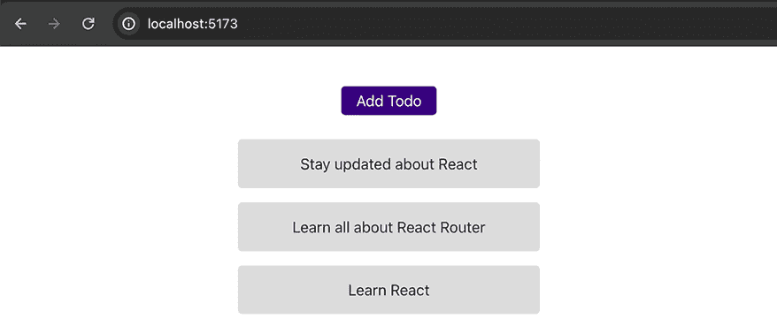

图 14.9：主页面显示待办事项列表


图 14.10：/new 页面，以模态形式打开，允许用户添加新的待办事项

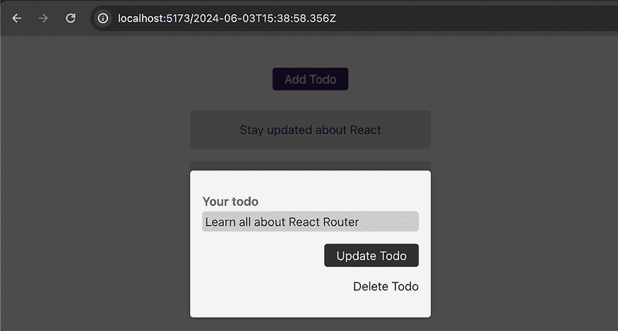

图 14.11：/:id 页面，也可以作为模态打开，允许用户编辑或删除待办事项

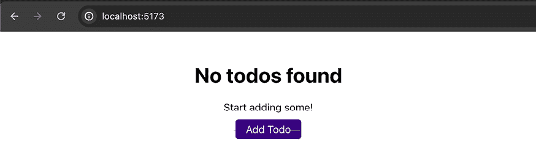

图 14.12：如果没有找到待办事项，将显示一条信息消息

**注意**

本活动的完整代码和解决方案可以在[`github.com/mschwarzmueller/book-react-key-concepts-e2/tree/14-routing-data/activities/practice-1`](https://github.com/mschwarzmueller/book-react-key-concepts-e2/tree/14-routing-data/activities/practice-1)找到。
