# 第一章：网格 - 在页面上放置组件

在本章中，我们将介绍以下内容：

+   理解断点

+   填充空间

+   抽象容器和项目

+   固定列布局

+   列方向

# 简介

Material-UI 网格用于控制应用中屏幕的布局。而不是实现自己的样式来管理 Material-UI 组件的布局，你可以利用`Grid`组件。在幕后，它使用 CSS flexbox 属性来处理灵活布局。

# 应用断点

**断点**被 Material-UI 用于确定在屏幕上何时打断内容流并继续到下一行。了解如何使用`Grid`组件应用断点是实现 Material-UI 应用程序布局的基本。

# 如何实现...

假设你想要在屏幕上均匀分布四个元素，并占据所有可用的水平空间。相应的代码如下：

```js
import React from 'react';
import { withStyles } from '@material-ui/core/styles';
import Paper from '@material-ui/core/Paper';
import Grid from '@material-ui/core/Grid';

const styles = theme => ({
  root: {
    flexGrow: 1
  },
  paper: {
    padding: theme.spacing(2),
    textAlign: 'center',
    color: theme.palette.text.secondary
  }
});

const UnderstandingBreakpoints = withStyles(styles)(({ classes }) => (
  <div className={classes.root}>
    <Grid container spacing={4}>
      <Grid item xs={12} sm={6} md={3}>
        <Paper className={classes.paper}>xs=12 sm=6 md=3</Paper>
      </Grid>
      <Grid item xs={12} sm={6} md={3}>
        <Paper className={classes.paper}>xs=12 sm=6 md=3</Paper>
      </Grid>
      <Grid item xs={12} sm={6} md={3}>
        <Paper className={classes.paper}>xs=12 sm=6 md=3</Paper>
      </Grid>
      <Grid item xs={12} sm={6} md={3}>
        <Paper className={classes.paper}>xs=12 sm=6 md=3</Paper>
      </Grid>
    </Grid>
  </div>
));

export default UnderstandingBreakpoints;
```

这将渲染四个`Paper`组件。标签指示了`xs`、`sm`和`md`属性使用的值。以下是结果的外观：

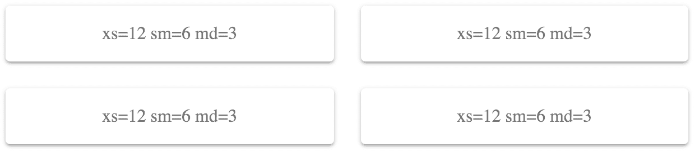

# 它是如何工作的...

你可以传递给`Grid`组件的每个断点属性都对应于屏幕宽度，如下所示：

+   `xs >= 0px`

+   `sm >= 600px`

+   `md >= 960px`

+   `lg >= 1280px`

+   `xl >= 1920px`

之前显示的屏幕像素宽度为 725，这意味着`Grid`组件使用了`sm`断点。传递给此属性的值是`6`。这个值可以是`1`到`12`之间的数字，它定义了将有多少个项目放入网格中。这可能会令人困惑，因此将这些数字视为百分比可能会有所帮助。例如，`6`将是 50%，正如前面的截图所示，`Grid`元素占据了 50%的宽度。

例如，假设你希望在小型断点激活时，每个`Grid`元素的宽度占屏幕宽度的 75%。你可以将`sm`值设置为`9`（9/12 = 0.75），如下所示：

```js
<div className={classes.root}>
  <Grid container spacing={4}>
    <Grid item xs={12} sm={9} md={3}>
      <Paper className={classes.paper}>xs=12 sm=9 md=3</Paper>
    </Grid>
    <Grid item xs={12} sm={9} md={3}>
      <Paper className={classes.paper}>xs=12 sm=9 md=3</Paper>
    </Grid>
    <Grid item xs={12} sm={9} md={3}>
      <Paper className={classes.paper}>xs=12 sm=9 md=3</Paper>
    </Grid>
    <Grid item xs={12} sm={9} md={3}>
      <Paper className={classes.paper}>xs=12 sm=9 md=3</Paper>
    </Grid>
  </Grid>
</div>
```

当屏幕宽度仍然是 725 像素时，这是结果：

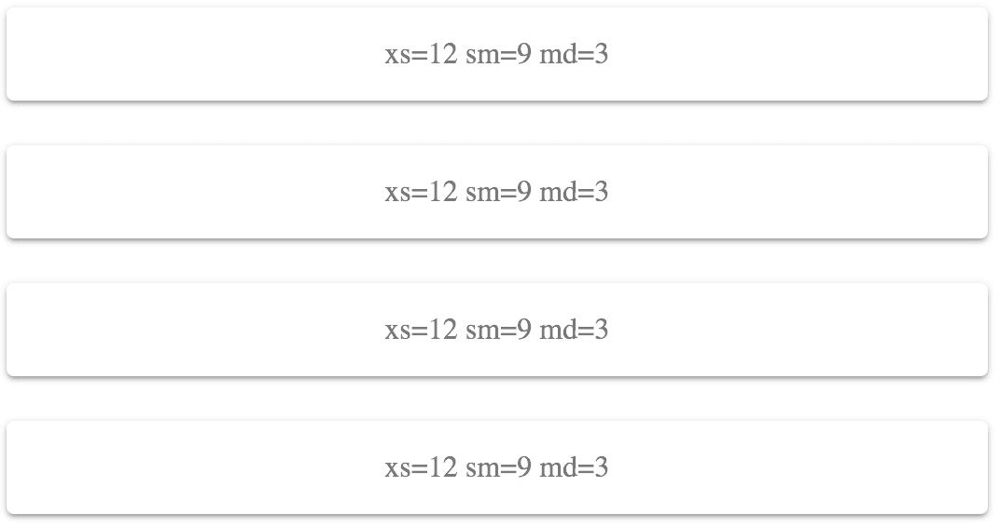

这种屏幕宽度和断点值的组合并不理想——右侧有大量的空间被浪费了。通过实验，你可以使`sm`值更大，以减少浪费的空间，或者你可以减小值，以便更多项目能适应一行。例如，`6`看起来更好，因为正好有 2 个项目适合屏幕。

让我们将屏幕宽度降低到 575 像素。这将激活`xs`断点，其值为`12`（100%）：

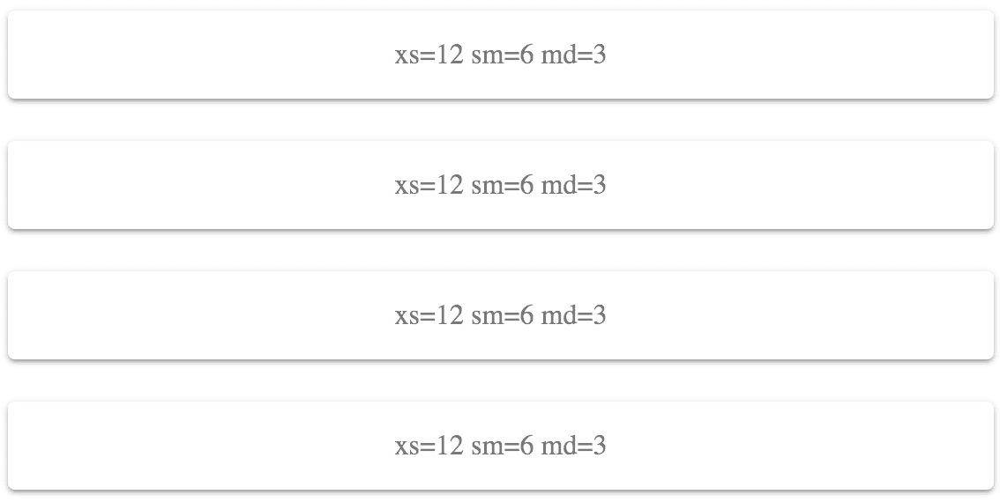

这种布局适用于较小的屏幕，因为它不会试图在一行中放置过多的网格项目。

# 更多内容...

如果你不确定使用哪个值，可以为每个断点值使用`auto`：

```js
<div className={classes.root}>
  <Grid container spacing={4}>
    <Grid item xs="auto" sm="auto" md="auto">
      <Paper className={classes.paper}>
        xs=auto sm=auto md=auto
      </Paper>
    </Grid>
    <Grid item xs="auto" sm="auto" md="auto">
      <Paper className={classes.paper}>
        xs=auto sm=auto md=auto
      </Paper>
    </Grid>
    <Grid item xs="auto" sm="auto" md="auto">
      <Paper className={classes.paper}>
        xs=auto sm=auto md=auto
      </Paper>
    </Grid>
    <Grid item xs="auto" sm="auto" md="auto">
      <Paper className={classes.paper}>
        xs=auto sm=auto md=auto
      </Paper>
    </Grid>
  </Grid>
</div>
```

这将尝试在每一行中尽可能多地放置项目。当屏幕尺寸变化时，项目会重新排列，以便相应地适应屏幕。以下是在屏幕宽度为 725 像素时的样子：

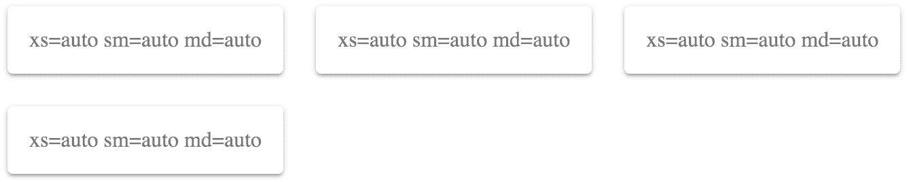

我建议在某个时候将`auto`替换为`1`至`12`之间的一个值。`auto`的值已经足够好，你可以开始做其他事情，而不必过多担心布局，但它对你的生产应用来说远非完美。至少通过这样设置`auto`，你所有的`Grid`组件和断点属性都已经就位。你只需要调整数字，直到一切看起来都很好。

# 参见

+   `Grid` API 文档：[`material-ui.com/api/grid/`](https://material-ui.com/api/grid/)

+   `Grid` 演示：[`material-ui.com/layout/grid/`](https://material-ui.com/layout/grid/)

+   断点文档：[`material-ui.com/layout/breakpoints/`](https://material-ui.com/layout/breakpoints/)

# 填充空间

对于某些布局，让你的网格项占据整个屏幕宽度是不可能的。使用`justify`属性，你可以控制网格项如何填充行中的可用空间。

# 如何实现...

假设你需要在网格中渲染四个`Paper`组件。在每个`Paper`组件内部，你有三个`Chip`组件，它们是**嵌套的网格项**。

这段代码看起来是这样的：

```js
import React from 'react';

import { withStyles } from '@material-ui/core/styles';
import Paper from '@material-ui/core/Paper';
import Grid from '@material-ui/core/Grid';
import Chip from '@material-ui/core/Chip';

const styles = theme => ({
  root: {
    flexGrow: 1
  },
  paper: {
    padding: theme.spacing(2),
    textAlign: 'center',
    color: theme.palette.text.secondary
  }
});

const FillingSpace = withStyles(styles)(({ classes, justify }) => (
  <div className={classes.root}>
    <Grid container spacing={4}>
      <Grid item xs={12} sm={6} md={3}>
        <Paper className={classes.paper}>
          <Grid container justify={justify}>
            <Grid item>
              <Chip label="xs=12" />
            </Grid>
            <Grid item>
              <Chip label="sm=6" />
            </Grid>
            <Grid item>
              <Chip label="md=3" />
            </Grid>
          </Grid>
        </Paper>
      </Grid>
      <Grid item xs={12} sm={6} md={3}>
        <Paper className={classes.paper}>
          <Grid container justify={justify}>
            <Grid item>
              <Chip label="xs=12" />
            </Grid>
            <Grid item>
              <Chip label="sm=6" />
            </Grid>
            <Grid item>
              <Chip label="md=3" />
            </Grid>
          </Grid>
        </Paper>
      </Grid>
      <Grid item xs={12} sm={6} md={3}>
        <Paper className={classes.paper}>
          <Grid container justify={justify}>
            <Grid item>
              <Chip label="xs=12" />
            </Grid>
            <Grid item>
              <Chip label="sm=6" />
            </Grid>
            <Grid item>
              <Chip label="md=3" />
            </Grid>
          </Grid>
        </Paper>
      </Grid>
      <Grid item xs={12} sm={6} md={3}>
        <Paper className={classes.paper}>
          <Grid container justify={justify}>
            <Grid item>
              <Chip label="xs=12" />
            </Grid>
            <Grid item>
              <Chip label="sm=6" />
            </Grid>
            <Grid item>
              <Chip label="md=3" />
            </Grid>
          </Grid>
        </Paper>
      </Grid>
    </Grid>
  </div>
));

export default FillingSpace;
```

`justify`属性是在`container Grid`组件上指定的。在这个例子中，包含`Chip`组件作为项的`container`。每个`container`都使用`flex-start`值，这将使`Grid`项对齐到`container`的起始位置。结果是：

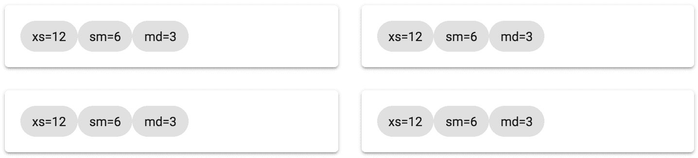

# 它是如何工作的...

`justify`属性的`flex-start`值将所有`Grid`项对齐到`container`的起始位置。在这种情况下，四个容器中的每个容器中的三个`Chip`组件都挤在行的左侧。项目左侧的空间没有被填充。你不必更改这些项目的断点属性值，这会导致宽度变化，你可以更改`justify`属性值来告诉`Grid`容器如何填充空隙。

例如，你可以使用`center`值来将`Grid`项对齐到`container`的中心，如下所示：

```js
<div className={classes.root}>
  <Grid container spacing={4}>
    <Grid item xs={12} sm={6} md={3}>
      <Paper className={classes.paper}>
        <Grid container justify="center">
          <Grid item>
            <Chip label="xs=12" />
          </Grid>
          <Grid item>
            <Chip label="sm=6" />
          </Grid>
          <Grid item>
            <Chip label="md=3" />
          </Grid>
        </Grid>
      </Paper>
    </Grid>
    <Grid item xs={12} sm={6} md={3}>
      <Paper className={classes.paper}>
        <Grid container justify="center">
          <Grid item>
            <Chip label="xs=12" />
          </Grid>
          <Grid item>
            <Chip label="sm=6" />
          </Grid>
          <Grid item>
            <Chip label="md=3" />
          </Grid>
        </Grid>
      </Paper>
    </Grid>
    <Grid item xs={12} sm={6} md={3}>
      <Paper className={classes.paper}>
        <Grid container justify="center">
          <Grid item>
            <Chip label="xs=12" />
          </Grid>
          <Grid item>
            <Chip label="sm=6" />
          </Grid>
          <Grid item>
            <Chip label="md=3" />
          </Grid>
        </Grid>
      </Paper>
    </Grid>
    <Grid item xs={12} sm={6} md={3}>
      <Paper className={classes.paper}>
        <Grid container justify="center">
          <Grid item>
            <Chip label="xs=12" />
          </Grid>
          <Grid item>
            <Chip label="sm=6" />
          </Grid>
          <Grid item>
            <Chip label="md=3" />
          </Grid>
        </Grid>
      </Paper>
    </Grid>
  </Grid>
</div>
```

以下截图显示了将`justify`属性值更改后的结果：

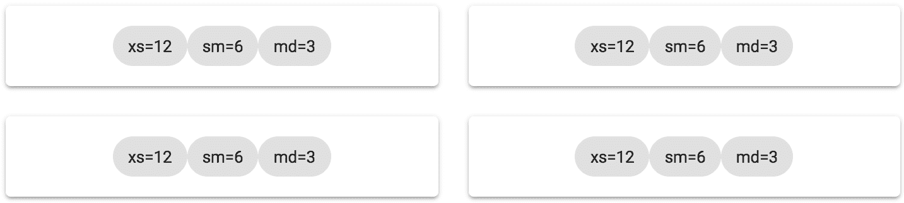

这会将空隙均匀分布到`Grid`项的左右两侧。但是，由于它们之间没有空间，项目仍然显得拥挤。如果你使用`justify`属性的`space-around`值，它看起来是这样的：

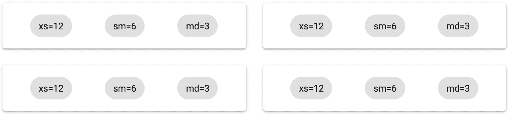

这个值在填充`Grid`容器中所有可用空间方面做得最好，而无需更改`Grid`项的宽度。

# 更多内容...

`space-around`值的一个变体是`space-between`值。这两个值在填充行中所有空间方面是相似的。以下是前一个示例部分使用`space-between`的效果：

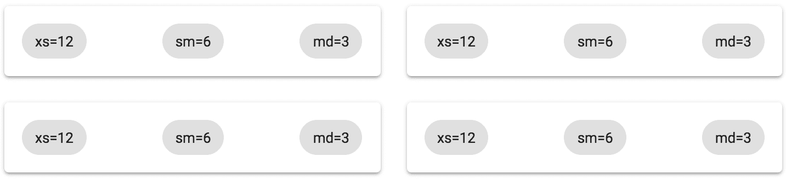

行中所有的多余空间都放在`Grid`项目之间，而不是周围。换句话说，当你想要确保每行左右没有空隙时，使用这个值。

# 参见

+   `Grid`演示：[`material-ui.com/layout/grid/`](https://material-ui.com/layout/grid/)

+   `Grid` API 文档：[`material-ui.com/api/grid/`](https://material-ui.com/api/grid/)

# 抽象容器和项目

在你的应用中，你有许多屏幕，每个屏幕都有许多`Grid`组件，用于创建复杂的布局。试图阅读包含大量`<Grid>`元素的源代码可能会令人望而却步。特别是当`Grid`组件既用于容器又用于项目时。

# 如何做到这一点...

`Grid`组件的`container`或`item`属性决定了元素的角色。你可以创建两个使用这些属性的组件，并在有大量布局组件时创建一个更容易阅读的元素名称：

```js
import React from 'react';

import { withStyles } from '@material-ui/core/styles';
import Paper from '@material-ui/core/Paper';
import Grid from '@material-ui/core/Grid';

const styles = theme => ({
  root: {
    flexGrow: 1
  },
  paper: {
    padding: theme.spacing(2),
    textAlign: 'center',
    color: theme.palette.text.secondary
  }
});

const Container = props => <Grid container {...props} />;
const Item = props => <Grid item {...props} />;

const AbstractingContainersAndItems = withStyles(styles)(
  ({ classes }) => (
    <div className={classes.root}>
      <Container spacing={4}>
        <Item xs={12} sm={6} md={3}>
          <Paper className={classes.paper}>xs=12 sm=6 md=3</Paper>
        </Item>
        <Item xs={12} sm={6} md={3}>
          <Paper className={classes.paper}>xs=12 sm=6 md=3</Paper>
        </Item>
        <Item xs={12} sm={6} md={3}>
          <Paper className={classes.paper}>xs=12 sm=6 md=3</Paper>
        </Item>
        <Item xs={12} sm={6} md={3}>
          <Paper className={classes.paper}>xs=12 sm=6 md=3</Paper>
        </Item>
      </Container>
    </div>
  )
);

export default AbstractingContainersAndItems;
```

这就是结果布局的外观：

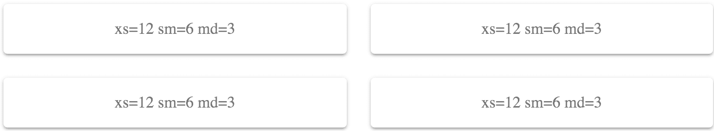

# 它是如何工作的...

让我们更仔细地看看`Container`和`Item`组件：

```js
const Container = props => <Grid container {...props} />;
const Item = props => <Grid item {...props} />;
```

`Container`组件渲染一个具有`container`属性设置为 true 的`Grid`组件，而`Item`组件做同样的事情，只是将`item`属性设置为 true。每个组件将任何额外的属性传递给`Grid`组件，例如`xs`和`sm`断点。

当你有大量的`Grid`容器和组成你的布局的项目时，能够看到`<Container>`和`<Item>`元素之间的区别会使你的代码更容易阅读。与此相对的是，在所有地方都有`<Grid>`元素。

# 更多内容...

如果你发现你在布局中反复使用相同的断点，你可以在你的高阶`Item`组件中包含它们。让我们重写示例，以便除了`Item`属性外，还包括`xs`、`sm`和`md`属性：

```js
const Container = props => <Grid container {...props} />;
const Item = props => <Grid item xs={12} sm={6} md={3} {...props} />;

const AbstractingContainersAndItems = withStyles(styles)(
  ({ classes }) => (
    <div className={classes.root}>
      <Container spacing={4}>
        <Item>
          <Paper className={classes.paper}>xs=12 sm=6 md=3</Paper>
        </Item>
        <Item>
          <Paper className={classes.paper}>xs=12 sm=6 md=3</Paper>
        </Item>
        <Item>
          <Paper className={classes.paper}>xs=12 sm=6 md=3</Paper>
        </Item>
        <Item>
          <Paper className={classes.paper}>xs=12 sm=6 md=3</Paper>
        </Item>
      </Container>
    </div>
  )
);
```

现在，你不再有四个`<Item xs={12} sm={6} md={3}>`实例，而是有四个`<Item>`实例。组件抽象是移除你的**JavaScript XML**（**JSX**）标记中多余语法的优秀工具。

任何需要覆盖你在`Item`组件中设置的任何断点属性的时候，你只需要将属性传递给`Item`。例如，如果你有一个特定的案例需要`md`为`6`，你只需写`<Item md={6}>`。这之所以有效，是因为在`Item`组件中，`{...props}`是在默认值之后传递的，这意味着它们覆盖了具有相同名称的任何属性。

# 参见

+   `Grid`演示：[`material-ui.com/layout/grid/`](https://material-ui.com/layout/grid/)

+   `Grid` API 文档：[`material-ui.com/api/grid/`](https://material-ui.com/api/grid/)

# 固定列布局

当你使用`Grid`组件构建布局时，它们通常会根据你的断点设置和屏幕宽度发生变化。例如，如果用户将浏览器窗口缩小，你的布局可能会从两列变为三列。然而，有时你可能更喜欢固定列数，并且每列的宽度会根据屏幕大小变化。

# 如何实现...

假设你想要渲染八个`Paper`组件，但你还想确保不超过四列。使用以下代码来完成此操作：

```js
import React from 'react';

import { withStyles } from '@material-ui/core/styles';
import Paper from '@material-ui/core/Paper';
import Grid from '@material-ui/core/Grid';

const styles = theme => ({
  root: {
    flexGrow: 1
  },
  paper: {
    padding: theme.spacing(2),
    textAlign: 'center',
    color: theme.palette.text.secondary
  }
});

const FixedColumnLayout = withStyles(styles)(({ classes, width }) => (
  <div className={classes.root}>
    <Grid container spacing={4}>
      <Grid item xs={width}>
        <Paper className={classes.paper}>xs={width}</Paper>
      </Grid>
      <Grid item xs={width}>
        <Paper className={classes.paper}>xs={width}</Paper>
      </Grid>
      <Grid item xs={width}>
        <Paper className={classes.paper}>xs={width}</Paper>
      </Grid>
      <Grid item xs={width}>
        <Paper className={classes.paper}>xs={width}</Paper>
      </Grid>
      <Grid item xs={width}>
        <Paper className={classes.paper}>xs={width}</Paper>
      </Grid>
      <Grid item xs={width}>
        <Paper className={classes.paper}>xs={width}</Paper>
      </Grid>
      <Grid item xs={width}>
        <Paper className={classes.paper}>xs={width}</Paper>
      </Grid>
      <Grid item xs={width}>
        <Paper className={classes.paper}>xs={width}</Paper>
      </Grid>
    </Grid>
  </div>
));

export default FixedColumnLayout;
```

以下是在像素宽度为 725 时的结果：

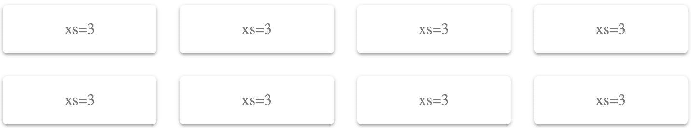

以下是在像素宽度为 350 时的结果：

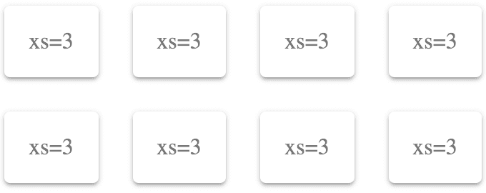

# 它是如何工作的...

如果你想要固定列数，你应该只指定`xs`断点属性。在这个例子中，`3`是屏幕宽度的 25%——或者 4 列。这永远不会改变，因为`xs`是最小的断点。任何更大的断点都会应用到`xs`上，除非你指定更大的断点。

假设你想要两列。你可以将`xs`值设置为`6`，如下所示：

```js
<div className={classes.root}>
  <Grid container spacing={4}>
    <Grid item xs={6}>
      <Paper className={classes.paper}>xs=6</Paper>
    </Grid>
    <Grid item xs={6}>
      <Paper className={classes.paper}>xs=6</Paper>
    </Grid>
    <Grid item xs={6}>
      <Paper className={classes.paper}>xs=6</Paper>
    </Grid>
    <Grid item xs={6}>
      <Paper className={classes.paper}>xs=6</Paper>
    </Grid>
    <Grid item xs={6}>
      <Paper className={classes.paper}>xs=6</Paper>
    </Grid>
    <Grid item xs={6}>
      <Paper className={classes.paper}>xs=6</Paper>
    </Grid>
    <Grid item xs={6}>
      <Paper className={classes.paper}>xs=6</Paper>
    </Grid>
    <Grid item xs={6}>
      <Paper className={classes.paper}>xs=6</Paper>
    </Grid>
  </Grid>
</div>
```

以下是在像素屏幕宽度为 960 时的结果：

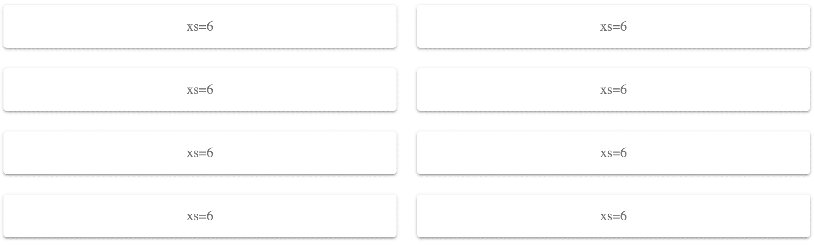

因为你已经将`xs`值设置为`6`（50%），这些`Grid`组件将始终只使用两列。项目本身将改变其宽度以适应屏幕宽度，而不是改变每行的项目数。

# 还有更多...

你可以以固定方式组合不同的宽度。例如，你可以有使用全宽布局的页眉和页脚`Grid`组件，而中间的`Grid`组件使用两列：

```js
<div className={classes.root}>
  <Grid container spacing={4}>
    <Grid item xs={12}>
      <Paper className={classes.paper}>xs=12</Paper>
    </Grid>
    <Grid item xs={6}>
      <Paper className={classes.paper}>xs=6</Paper>
    </Grid>
    <Grid item xs={6}>
      <Paper className={classes.paper}>xs=6</Paper>
    </Grid>
    <Grid item xs={6}>
      <Paper className={classes.paper}>xs=6</Paper>
    </Grid>
    <Grid item xs={6}>
      <Paper className={classes.paper}>xs=6</Paper>
    </Grid>
    <Grid item xs={6}>
      <Paper className={classes.paper}>xs=6</Paper>
    </Grid>
    <Grid item xs={6}>
      <Paper className={classes.paper}>xs=6</Paper>
    </Grid>
    <Grid item xs={12}>
      <Paper className={classes.paper}>xs=12</Paper>
    </Grid>
  </Grid>
</div>
```

第一行和最后一行的`Grid`组件具有`xs`值为`12`（100%），而其他`Grid`组件的`xs`值为`6`（50%），以实现两列布局。以下是在像素宽度为 725 时的结果：

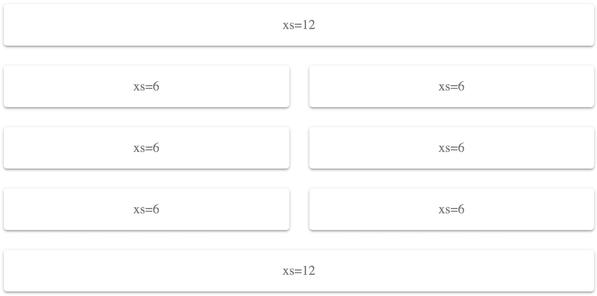

# 参见

+   `Grid`演示：[`material-ui.com/layout/grid/`](https://material-ui.com/layout/grid/)

+   `Grid` API 文档：[`material-ui.com/api/grid/`](https://material-ui.com/api/grid/)

# 改变列方向

当使用固定列数进行布局时，内容从左到右流动。第一个网格项位于第一列，第二个项位于第二列，依此类推。有时你可能需要更好地控制哪些网格项进入哪些列。

# 如何实现...

假设你有一个四列布局，但你希望第一和第二项位于第一列，第三和第四项位于第二列，依此类推。这涉及到使用嵌套的 `Grid` 容器，并更改 `direction` 属性，如下所示：

```js
import React from 'react';

import { withStyles } from '@material-ui/core/styles';
import Paper from '@material-ui/core/Paper';
import Grid from '@material-ui/core/Grid';
import Hidden from '@material-ui/core/Hidden';
import Typography from '@material-ui/core/Typography';

const styles = theme => ({
  root: {
    flexGrow: 1
  },
  paper: {
    padding: theme.spacing(2),
    textAlign: 'center',
    color: theme.palette.text.secondary
  }
});

const ColumnDirection = withStyles(styles)(({ classes }) => (
  <div className={classes.root}>
    <Grid container justify="space-around" spacing={4}>
      <Grid item xs={3}>
        <Grid container direction="column" spacing={2}>
          <Grid item>
            <Paper className={classes.paper}>
              <Typography>One</Typography>
            </Paper>
          </Grid>
          <Grid item>
            <Paper className={classes.paper}>
              <Typography>Two</Typography>
            </Paper>
          </Grid>
        </Grid>
      </Grid>
      <Grid item xs={3}>
        <Grid container direction="column" spacing={2}>
          <Grid item>
            <Paper className={classes.paper}>
              <Typography>Three</Typography>
            </Paper>
          </Grid>
          <Grid item>
            <Paper className={classes.paper}>
              <Typography>Four</Typography>
            </Paper>
          </Grid>
        </Grid>
      </Grid>
      <Grid item xs={3}>
        <Grid container direction="column" spacing={2}>
          <Grid item>
            <Paper className={classes.paper}>
              <Typography>Five</Typography>
            </Paper>
          </Grid>
          <Grid item>
            <Paper className={classes.paper}>
              <Typography>Six</Typography>
            </Paper>
          </Grid>
        </Grid>
      </Grid>
      <Grid item xs={3}>
        <Grid container direction="column" spacing={2}>
          <Grid item>
            <Paper className={classes.paper}>
              <Typography>Seven</Typography>
            </Paper>
          </Grid>
          <Grid item>
            <Paper className={classes.paper}>
              <Typography>Eight</Typography>
            </Paper>
          </Grid>
        </Grid>
      </Grid>
    </Grid>
  </div>
));

export default ColumnDirection;
```

在像素宽度为 725 时的结果如下：

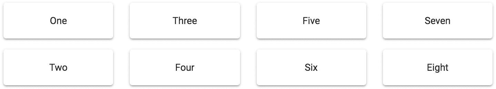

与从左到右流动的值不同，你可以完全控制项目放置在哪个列中。

你可能已经注意到，与本章中的其他示例相比，字体看起来不同。这是因为使用了 `Typography` 组件来设置文本样式并应用 Material-UI 主题样式。大多数 Material-UI 组件在显示文本时不需要你使用 `Typography`，但 `Paper` 组件需要。

# 它是如何工作的...

这个示例中有很多内容，所以让我们先看看 `Grid` 代码中的第一个项目：

```js
<Grid item xs={3}>
  <Grid container direction="column" spacing={2}>
    <Grid item>
      <Paper className={classes.paper}>
        <Typography>One</Typography>
      </Paper>
    </Grid>
    <Grid item>
      <Paper className={classes.paper}>
        <Typography>Two</Typography>
      </Paper>
    </Grid>
  </Grid>
</Grid>
```

`Grid` 项目使用 `xs` 值为 `4` 来创建四列布局。本质上，这些项目是列。接下来，你有一个嵌套的 `Grid` 容器。这个 `container` 的 `direction` 属性值为 `column`。这是你可以放置属于此列的 `Grid` 项的地方，并且它们将从上到下流动，而不是从左到右。这个网格中的每一列都遵循这个模式。

# 还有更多...

有时候，隐藏最右侧的列比尝试适应屏幕宽度更有意义。你可以使用 `Hidden` 组件来实现这一点。它已经在示例中导入，如下所示：

```js
import Hidden from '@material-ui/core/Hidden';
```

要使用它，你需要用它包裹最后一个 `column`。例如，以下是最后一个 `column` 现在的样子：

```js
<Grid item xs={3}>
  <Grid container direction="column" spacing={2}>
    <Grid item>
      <Paper className={classes.paper}>
        <Typography>Seven</Typography>
      </Paper>
    </Grid>
    <Grid item>
      <Paper className={classes.paper}>
        <Typography>Eight</Typography>
      </Paper>
    </Grid>
  </Grid>
</Grid>
```

如果你想在某个断点隐藏这个 `column`，你可以用 `Hidden` 包裹这个 `column`，如下所示：

```js
<Hidden smDown>
  <Grid item xs={3}>
    <Grid container direction="column" spacing={2}>
      <Grid item>
        <Paper className={classes.paper}>
          <Typography>Seven</Typography>
        </Paper>
      </Grid>
      <Grid item>
        <Paper className={classes.paper}>
          <Typography>Eight</Typography>
        </Paper>
      </Grid>
    </Grid>
  </Grid>
</Hidden>
```

`smDown` 属性指示 `Hidden` 组件在达到 `sm` 断点或更低时隐藏其子元素。以下是在像素宽度为 1000 时的结果：

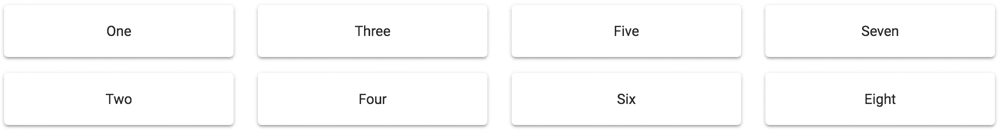

最后一列被显示出来，因为 `sm` 断点比屏幕尺寸小。以下是在像素屏幕宽度为 550，且不显示最后一列的结果：

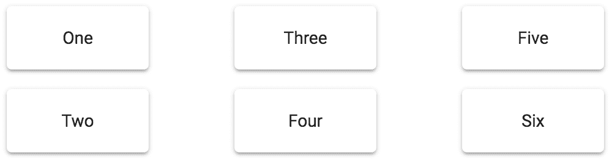

# 参见

+   `Grid` 示例：[`material-ui.com/layout/grid/`](https://material-ui.com/layout/grid/)

+   `Grid` API 文档：[`material-ui.com/api/grid/`](https://material-ui.com/api/grid/)

+   `Hidden` API 文档：[`material-ui.com/api/hidden/`](https://material-ui.com/api/hidden/)
