# App Bars - 每个页面的顶层

在本章中，你将学习以下内容：

+   固定位置

+   滚动时隐藏

+   工具栏抽象

+   带导航

# 简介

App Bars 是任何 Material-UI 应用的锚点。它们提供上下文，并且通常在用户在应用程序中导航时始终可见。

# 固定位置

你可能希望你的`AppBar`组件始终可见。通过使用`fixed`定位，`AppBar`组件即使在用户滚动页面时也保持可见。

# 如何实现...

你可以使用`position`属性的`fixed`值。以下是实现方法：

```js
import React from 'react';

import { withStyles } from '@material-ui/core/styles';
import AppBar from '@material-ui/core/AppBar';
import Toolbar from '@material-ui/core/Toolbar';
import Typography from '@material-ui/core/Typography';
import Button from '@material-ui/core/Button';
import IconButton from '@material-ui/core/IconButton';
import MenuIcon from '@material-ui/icons/Menu';

const styles = theme => ({
  root: {
    flexGrow: 1
  },
  flex: {
    flex: 1
  },
  menuButton: {
    marginLeft: -12,
    marginRight: 20
  }
});

const FixedPosition = withStyles(styles)(({ classes }) => (
  <div className={classes.root}>
    <AppBar position="fixed">
      <Toolbar>
        <IconButton
          className={classes.menuButton}
          color="inherit"
          aria-label="Menu"
        >
          <MenuIcon />
        </IconButton>
        <Typography
          variant="title"
          color="inherit"
          className={classes.flex}
        >
          Title
        </Typography>
        <Button color="inherit">Login</Button>
      </Toolbar>
    </AppBar>
    <ul>
      {new Array(500).fill(null).map((v, i) => (
        <li key={i}>{i}</li>
      ))}
    </ul>
  </div>
));

export default FixedPosition;
```

这是结果`AppBar`组件的样子：

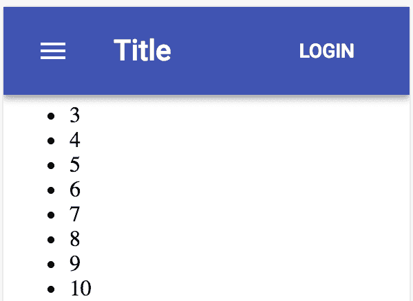

# 它是如何工作的...

如果你向下滚动，你会看到`AppBar`组件如何保持*固定*，并且内容在其后面滚动。以下是在本例中滚动到页面底部时的样子：

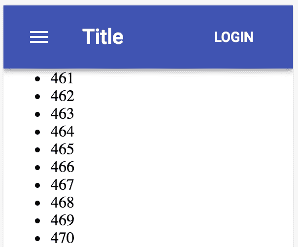

`position`属性的默认值是`fixed`。然而，明确设置此属性可以帮助读者更好地理解你的代码。

# 还有更多...

当本例中的屏幕首次加载时，一些内容被隐藏在`AppBar`组件后面。这是因为位置是固定的，并且它比常规内容的`z-index`值更高。这是预期的，这样当滚动时，常规内容就会在`AppBar`组件后面。解决方案是为你的内容添加一个顶部边距。问题是，你并不一定知道`AppBar`的高度。

你可以设置一个看起来不错的值。更好的解决方案是使用`toolbar mixin`样式。你可以通过将`styles`设置为返回对象的函数来访问这个`mixin`对象。然后，你将能够访问主题参数，它包含一个`toolbar mixin`对象。

这是`styles`应该更改的样子：

```js
const styles = theme => ({
  root: {
    flexGrow: 1
  },
  flex: {
    flex: 1
  },
  menuButton: {
    marginLeft: -12,
    marginRight: 20
  },
  toolbarMargin: theme.mixins.toolbar
});
```

新增的样式是`toolbarMargin`。注意，这使用的是来自`theme.mixins.toolbar`的值，这就是你现在为什么使用函数的原因——这样你就可以访问`theme`。以下是`theme.mixins.toolbar`的值：

```js
{
  "minHeight": 56,
  "@media (min-width:0px) and (orientation: landscape)": {
    "minHeight": 48
  },
  "@media (min-width:600px)": {
    "minHeight": 64
  }
}
```

最后一步是在`AppBar`组件下方的`<div>`元素中添加一个元素，以便可以应用这个新的`toolbarMargin`样式：

```js
<div className={classes.root}>
  <AppBar position="fixed">
    <Toolbar>
      <IconButton
        className={classes.menuButton}
        color="inherit"
        aria-label="Menu"
      >
        <MenuIcon />
      </IconButton>
      <Typography
        variant="title"
        color="inherit"
        className={classes.flex}
      >
        Title
      </Typography>
      <Button color="inherit">Login</Button>
    </Toolbar>
  </AppBar>
  <div className={classes.toolbarMargin} />
  <ul>
    {new Array(500).fill(null).map((v, i) => <li key={i}>{i}</li>)}
  </ul>
</div>
```

现在，当屏幕首次加载时，内容的开头不再被`AppBar`组件隐藏：

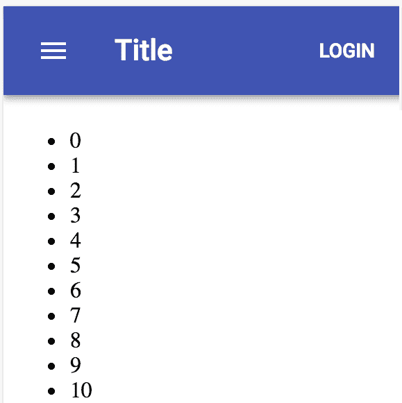

# 参见

+   CSS 定位指南：[`developer.mozilla.org/en-US/docs/Learn/CSS/CSS_layout/Positioning`](https://developer.mozilla.org/en-US/docs/Learn/CSS/CSS_layout/Positioning)

+   `AppBar` 演示：[`material-ui.com/demos/app-bar/`](https://material-ui.com/demos/app-bar/)

+   `AppBar` API 文档：[`material-ui.com/api/app-bar/`](https://material-ui.com/api/app-bar/)

+   `Toolbar` API 文档：[`material-ui.com/api/toolbar/`](https://material-ui.com/api/toolbar/)

# 滚动时隐藏

如果你屏幕上有大量需要用户垂直滚动的内 容，App Bar 可能会分散用户的注意力。一种解决方案是在用户向下滚动时隐藏 `AppBar` 组件。

# 如何实现...

要在用户向下滚动时隐藏 `AppBar` 组件，你必须知道用户何时在滚动。这需要监听 `window` 对象上的 `scroll` 事件。你可以实现一个组件来监听此事件，并在滚动时隐藏 `AppBar` 组件。以下是实现方式：

```js
import React, { Component } from 'react';
import { withStyles } from '@material-ui/core/styles';
import AppBar from '@material-ui/core/AppBar';
import Toolbar from '@material-ui/core/Toolbar';
import Typography from '@material-ui/core/Typography';
import Button from '@material-ui/core/Button';
import IconButton from '@material-ui/core/IconButton';
import MenuIcon from '@material-ui/icons/Menu';
import Fade from '@material-ui/core/Fade';

const styles = theme => ({
  root: {
    flexGrow: 1
  },
  flex: {
    flex: 1
  },
  menuButton: {
    marginLeft: -12,
    marginRight: 20
  },
  toolbarMargin: theme.mixins.toolbar
});

const ScrolledAppBar = withStyles(styles)(
  class extends Component {
    state = {
      scrolling: false,
      scrollTop: 0
    };

    onScroll = e => {
      this.setState(state => ({
        scrollTop: e.target.documentElement.scrollTop,
        scrolling:
          e.target.documentElement.scrollTop > state.scrollTop
      }));
    };

    shouldComponentUpdate(props, state) {
      return this.state.scrolling !== state.scrolling;
    }

    componentDidMount() {
      window.addEventListener('scroll', this.onScroll);
    }

    componentWillUnmount() {
      window.removeEventListener('scroll', this.onScroll);
    }

    render() {
      const { classes } = this.props;

      return (
        <Fade in={!this.state.scrolling}>
          <AppBar>
            <Toolbar>
              <IconButton
                className={classes.menuButton}
                color="inherit"
                aria-label="Menu"
              >
                <MenuIcon />
              </IconButton>
              <Typography
                variant="h6"
                color="inherit"
                className={classes.flex}
              >
                My Title
              </Typography>
              <Button color="inherit">Login</Button>
            </Toolbar>
          </AppBar>
        </Fade>
      );
    }
  }
);

const AppBarWithButtons = withStyles(styles)(
  ({ classes, title, buttonText }) => (
    <div className={classes.root}>
      <ScrolledAppBar />
      <div className={classes.toolbarMargin} />
      <ul>
        {new Array(500).fill(null).map((v, i) => (
          <li key={i}>{i}</li>
        ))}
      </ul>
    </div>
  )
);

export default AppBarWithButtons;
```

当你首次加载屏幕时，工具栏和内容会像往常一样显示：

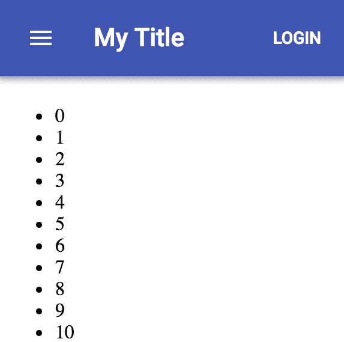

当你向下滚动时，`AppBar` 组件消失，为查看更多内容腾出空间。以下是当你滚动到屏幕底部时的屏幕外观：

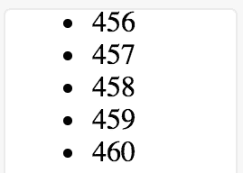

一旦你开始向上滚动，`AppBar` 组件就会立即重新出现。

# 工作原理...

让我们看看 `ScrolledAppBar` 组件的 `state` 方法 和 `onScroll()` 方法：

```js
state = {
  scrolling: false,
  scrollTop: 0
};

onScroll = e => {
  this.setState(state => ({
    scrollTop: e.target.documentElement.scrollTop,
   scrolling:
      e.target.documentElement.scrollTop > state.scrollTop
  }));
};

componentDidMount() {
  window.addEventListener('scroll', this.onScroll);
}

componentWillUnmount() {
  window.removeEventListener('scroll', this.onScroll);
}
```

当组件挂载时，`onScroll()` 方法被添加为监听 `window` 对象上的 `scroll` 事件的监听器。`scrolling` 状态是一个布尔值，当为 true 时隐藏 `AppBar` 组件。`scrollTop` 状态是前一个滚动事件的位置。`onScroll()` 方法通过检查新的滚动位置是否大于最后一个滚动位置来确定用户是否在滚动。

接下来，让我们看看用于在滚动时隐藏 `AppBar` 组件的 `Fade` 组件，如下所示：

```js
<Fade in={!this.state.scrolling}>
  <AppBar>
    <Toolbar>
      <IconButton
        className={classes.menuButton}
        color="inherit"
        aria-label="Menu"
      >
        <MenuIcon />
      </IconButton>
      <Typography
        variant="title"
        color="inherit"
        className={classes.flex}
      >
        My Title
      </Typography>
      <Button color="inherit">Login</Button>
    </Toolbar>
  </AppBar>
</Fade>
```

`in` 属性告诉 `Fade` 组件在值为 true 时淡入其子组件，`in`。在这个例子中，当 `scrolling` 状态为 false 时，条件为 true。

# 还有更多...

当用户滚动时，你不必淡入淡出 `AppBar` 组件，可以使用不同的效果。例如，以下代码块演示了如果你想使用 `Grow` 效果会是什么样子：

```js
<Grow in={!this.state.scrolling}>
  <AppBar>
    <Toolbar>
      <IconButton
        className={classes.menuButton}
        color="inherit"
        aria-label="Menu"
      >
        <MenuIcon />
      </IconButton>
      <Typography
        variant="title"
        color="inherit"
        className={classes.flex}
      >
        My Title
      </Typography>
      <Button color="inherit">Login</Button>
    </Toolbar>
  </AppBar>
</Grow>
```

# 参见

+   `Fade` API 文档：[`material-ui.com/api/fade/`](https://material-ui.com/api/fade/)

+   `Grow` API 文档：[`material-ui.com/api/grow/`](https://material-ui.com/api/grow/)

+   `Slide` API 文档：[`material-ui.com/api/slide/`](https://material-ui.com/api/slide/)

# 工具栏抽象

如果你需要在多个地方渲染工具栏，工具栏代码可能会变得冗长。为了解决这个问题，你可以创建自己的 `Toolbar` 组件，该组件封装了工具栏的内容模式，使得在多个地方渲染 `AppBar` 组件更容易。

# 如何实现...

假设你的应用在多个屏幕上渲染 `AppBar` 组件。每个 `AppBar` 组件也会将 `Menu` 和 `title` 渲染到左侧，以及 `Button` 渲染到右侧。以下是如何实现你自己的 `AppBar` 组件，以便在多个屏幕上更容易使用：

```js
import React, { Fragment, Component } from 'react';

import { withStyles } from '@material-ui/core/styles';
import AppBar from '@material-ui/core/AppBar';
import Toolbar from '@material-ui/core/Toolbar';
import Typography from '@material-ui/core/Typography';
import Button from '@material-ui/core/Button';
import IconButton from '@material-ui/core/IconButton';
import MenuIcon from '@material-ui/icons/Menu';
import Menu from '@material-ui/core/Menu';
import MenuItem from '@material-ui/core/MenuItem';

const styles = theme => ({
  root: {
    flexGrow: 1
  },
  flex: {
    flex: 1
  },
  menuButton: {
    marginLeft: -12,
    marginRight: 20
  },
  toolbarMargin: theme.mixins.toolbar
});

const MyToolbar = withStyles(styles)(
  class extends Component {
    static defaultProps = {
      MenuItems: ({ closeMenu }) => (
        <Fragment>
          <MenuItem onClick={closeMenu}>Profile</MenuItem>
          <MenuItem onClick={closeMenu}>My account</MenuItem>
          <MenuItem onClick={closeMenu}>Logout</MenuItem>
        </Fragment>
      ),
      RightButton: () => <Button color="inherit">Login</Button>
    };

    state = { anchor: null };

    closeMenu = () => this.setState({ anchor: null });

    render() {
      const { classes, title, MenuItems, RightButton } = this.props;

      return (
        <Fragment>
          <AppBar>
            <Toolbar>
              <IconButton
                className={classes.menuButton}
                color="inherit"
                aria-label="Menu"
                onClick={e =>
                  this.setState({ anchor: e.currentTarget })
                }
              >
                <MenuIcon />
              </IconButton>
              <Menu
                anchorEl={this.state.anchor}
                open={Boolean(this.state.anchor)}
                onClose={this.closeMenu}
              >
                <MenuItems closeMenu={this.closeMenu} />
              </Menu>
              <Typography
                variant="title"
                color="inherit"
                className={classes.flex}
              >
                {title}
              </Typography>
              <RightButton />
            </Toolbar>
          </AppBar>
          <div className={classes.toolbarMargin} />
        </Fragment>
      );
    }
  }
);

const ToolbarAbstraction = withStyles(styles)(
  ({ classes, ...props }) => (
    <div className={classes.root}>
      <MyToolbar {...props} />
    </div>
  )
);

export default ToolbarAbstraction;
```

这是最终工具栏的外观：

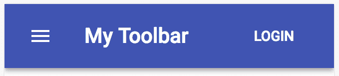

当用户点击标题旁边的菜单按钮时，菜单看起来是这样的：

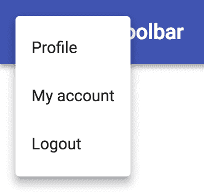

# 它是如何工作的...

让我们从查看 `MyToolbar` 组件的 `render()` 方法开始，如下所示：

```js
render() {
  const { classes, title, MenuItems, RightButton } = this.props;

  return (
    <Fragment>
      <AppBar>
        <Toolbar>
          <IconButton
            className={classes.menuButton}
            color="inherit"
            aria-label="Menu"
            onClick={e =>
              this.setState({ anchor: e.currentTarget })
            }
          >
            <MenuIcon />
          </IconButton>
          <Menu
            anchorEl={this.state.anchor}
            open={Boolean(this.state.anchor)}
            onClose={this.closeMenu}
          >
            <MenuItems closeMenu={this.closeMenu} />
          </Menu>
          <Typography
            variant="title"
            color="inherit"
            className={classes.flex}
          >
            {title}
          </Typography>
          <RightButton />
        </Toolbar>
      </AppBar>
      <div className={classes.toolbarMargin} />
    </Fragment>
  );
}
```

这就是 `AppBar` 组件和 Material-UI 中的 `Toolbar` 组件被渲染的地方。使用了一个 `Fragment` 组件，因为返回了两个元素：`AppBar` 组件和设置页面内容顶部边距的 `<div>` 元素。在工具栏中，您有以下内容：

+   点击时显示菜单的菜单按钮

+   菜单本身

+   标题

+   右侧按钮

从 `MyToolbar` 属性中，`render()` 方法使用了两个组件：`MenuItems` 和 `RightButton`。除了 `title` 属性外，这些是您想要自定义的 `AppBar` 组件的部分。这里的做法是为这些属性定义默认值，以便 `AppBar` 组件可以被渲染：

```js
static defaultProps = {
  MenuItems: ({ closeMenu }) => (
    <Fragment>
      <MenuItem onClick={closeMenu}>Profile</MenuItem>
      <MenuItem onClick={closeMenu}>My account</MenuItem>
      <MenuItem onClick={closeMenu}>Logout</MenuItem>
    </Fragment>
  ),
  RightButton: () => <Button color="inherit">Login</Button>
};
```

当您渲染 `MyToolbar` 时，可以向这些属性传递自定义值。这里使用的默认值可能是用于主页的值。

您实际上不必为这些属性提供默认值。但如果您提供了，比如对于主页，那么其他开发者查看您的代码并理解其工作方式会更容易。

# 更多内容...

让我们尝试设置一些自定义菜单项和右侧按钮，分别使用 `MenuItems` 和 `RightButton` 属性：

```js
const ToolbarAbstraction = withStyles(styles)(
  ({ classes, ...props }) => (
    <div className={classes.root}>
      <MyToolbar
        MenuItems={({ closeMenu }) => (
          <Fragment>
            <MenuItem onClick={closeMenu}>Page 1</MenuItem>
            <MenuItem onClick={closeMenu}>Page 2</MenuItem>
            <MenuItem onClick={closeMenu}>Page 3</MenuItem>
          </Fragment>
        )}
        RightButton={() => (
          <Button color="secondary" variant="contained">
            Logout
          </Button>
        )}
        {...props}
      />
    </div>
  )
);
```

这是渲染后的工具栏看起来：

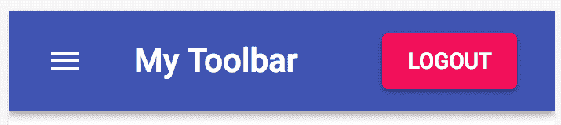

这是带有自定义菜单选项的菜单看起来：

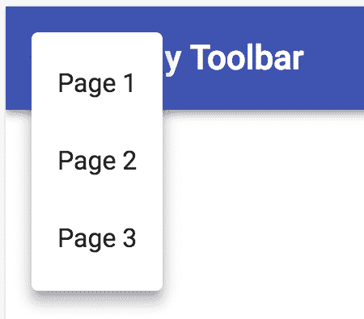

您传递给 `MenuItems` 和 `RightButton` 的值是返回 React 元素的函数。这些函数实际上是您即时创建的功能组件。

# 参见

+   `AppBar` 演示：[`material-ui.com/demos/app-bar/`](https://material-ui.com/demos/app-bar/)

+   `AppBar` API 文档：[`material-ui.com/api/app-bar/`](https://material-ui.com/api/app-bar/)

+   `Toolbar` API 文档：[`material-ui.com/api/toolbar/`](https://material-ui.com/api/toolbar/)

# 带有导航

Material-UI 应用程序通常由几个页面组成，这些页面通过路由器（如 `react-router`）相互链接。每个页面渲染一个具有特定页面信息的 App Bar。这是在 *Toolbar 抽象* 菜谱中创建的抽象的一个用例。

# 如何实现...

假设您正在构建一个有三个页面的应用程序。在每个页面上，您想要 `render` 一个具有页面 `title` 属性的 App Bar。此外，AppBar 中的菜单应包含指向三个页面的链接。以下是实现方法：

```js
import React, { Fragment, Component } from 'react';
import {
  BrowserRouter as Router,
  Route,
  Link
} from 'react-router-dom';

import { withStyles } from '@material-ui/core/styles';
import AppBar from '@material-ui/core/AppBar';
import Toolbar from '@material-ui/core/Toolbar';
import Typography from '@material-ui/core/Typography';
import Button from '@material-ui/core/Button';
import IconButton from '@material-ui/core/IconButton';
import MenuIcon from '@material-ui/icons/Menu';
import Menu from '@material-ui/core/Menu';
import MenuItem from '@material-ui/core/MenuItem';

const styles = theme => ({
  root: {
    flexGrow: 1
  },
  flex: {
    flex: 1
  },
  menuButton: {
    marginLeft: -12,
    marginRight: 20
  },
  toolbarMargin: theme.mixins.toolbar
});

const MyToolbar = withStyles(styles)(
  class extends Component {
    static defaultProps = {
      MenuItems: () => (
        <Fragment>
          <MenuItem component={Link} to="/">
            Home
          </MenuItem>
          <MenuItem component={Link} to="/page2">
            Page 2
          </MenuItem>
          <MenuItem component={Link} to="/page3">
            Page 3
          </MenuItem>
        </Fragment>
      ),
      RightButton: () => <Button color="inherit">Login</Button>
    };

    state = { anchor: null };

    closeMenu = () => this.setState({ anchor: null });

    render() {
      const { classes, title, MenuItems, RightButton } = this.props;

      return (
        <Fragment>
          <AppBar>
            <Toolbar>
              <IconButton
                className={classes.menuButton}
                color="inherit"
                aria-label="Menu"
                onClick={e =>
                  this.setState({ anchor: e.currentTarget })
                }
              >
                <MenuIcon />
              </IconButton>
              <Menu
                anchorEl={this.state.anchor}
                open={Boolean(this.state.anchor)}
                onClose={this.closeMenu}
              >
                <MenuItems />
              </Menu>
              <Typography
                variant="title"
                color="inherit"
                className={classes.flex}
              >
                {title}
              </Typography>
              <RightButton />
            </Toolbar>
          </AppBar>
          <div className={classes.toolbarMargin} />
        </Fragment>
      );
    }
  }
);

const WithNavigation = withStyles(styles)(({ classes }) => (
  <div className={classes.root}>
    <Route
      exact
      path="/"
      render={() => (
        <Fragment>
          <MyToolbar title="Home" />
          <Typography>Home</Typography>
        </Fragment>
      )}
    />
    <Route
      exact
      path="/page2"
      render={() => (
        <Fragment>
          <MyToolbar title="Page 2" />
          <Typography>Page 2</Typography>
        </Fragment>
      )}
    />
    <Route
      exact
      path="/page3"
      render={() => (
        <Fragment>
          <MyToolbar title="Page 3" />
          <Typography>Page 3</Typography>
        </Fragment>
      )}
    />
  </div>
));

export default WithNavigation;

```

当您首次加载应用程序时，您会看到以下内容：

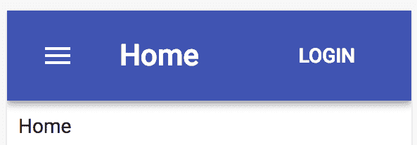

当 App Bar 被打开时，菜单看起来是这样的：

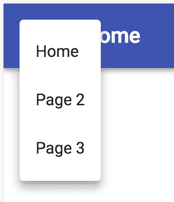

尝试点击第 2 页；您应该看到以下内容：

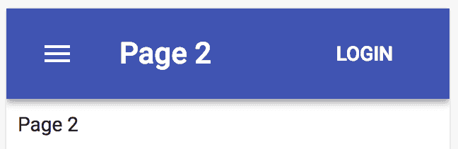

App Bar 的标题已更改，以反映页面的标题，页面的内容也发生了变化。

# 它是如何工作的...

让我们先看看定义您应用中页面的 Routes 组件，如下所示：

```js
const WithNavigation = withStyles(styles)(({ classes }) => (
  <div className={classes.root}>
    <Route
      exact
      path="/"
      render={() => (
        <Fragment>
          <MyToolbar title="Home" />
          <Typography>Home</Typography>
        </Fragment>
      )}
    />
    <Route
      exact
      path="/page2"
      render={() => (
        <Fragment>
          <MyToolbar title="Page 2" />
          <Typography>Page 2</Typography>
        </Fragment>
      )}
    />
    <Route
      exact
      path="/page3"
      render={() => (
        <Fragment>
          <MyToolbar title="Page 3" />
          <Typography>Page 3</Typography>
        </Fragment>
      )}
    />
  </div>
));
```

每个 `Route` 组件（来自 `react-router` 包）对应您应用中的一个页面。它们有一个 `path` 属性，与浏览器地址栏中的路径匹配。当有匹配时，此 Routes 组件的内容会被渲染。例如，当路径是 `/page3` 时，会渲染 `path="/page3"` 的 `Route` 组件的内容。

每个 `Route` 组件还定义了一个 `render()` 函数。当其 `path` 匹配时，会调用此函数，并渲染返回的内容。您应用中的 Routes 组件每个都会以不同的 `title` 属性值渲染 `MyToolbar`。

接下来，让我们看看组成 `MenuItems` 默认属性值的菜单项，如下所示：

```js
static defaultProps = {
  MenuItems: () => (
    <Fragment>
      <MenuItem component={Link} to="/">
        Home
      </MenuItem>
      <MenuItem component={Link} to="/page2">
        Page 2
      </MenuItem>
      <MenuItem component={Link} to="/page3">
        Page 3
      </MenuItem>
    </Fragment>
  ),
  RightButton: () => <Button color="inherit">Login</Button>
};
```

这些 `MenuItems` 属性中的每一个都是一个指向您应用中声明的每个 Routes 组件的链接。`MenuItem` 组件接受一个 `component` 属性，用于渲染链接。在这个例子中，您传递了来自 `react-router-dom` 包的 `Link` 组件。`MenuItem` 组件会将任何额外的属性传递给 `Link` 组件，这意味着您可以将 `to` 属性传递给 `MenuItem` 组件，这就像您将其传递给 `Link` 组件一样。

# 更多内容...

大多数时候，组成您应用屏幕的屏幕将遵循相同的模式。您不必在路由的 `render` 属性中有重复的代码，可以创建一个高阶函数，该函数接受屏幕独特部分的参数，并返回一个可以由 `render` 属性使用的新组件。

在这个例子中，每个屏幕唯一的数据只有标题和内容文本。以下是一个通用函数，它构建了一个新的函数组件，可以用于应用中的每个 `Route` 组件：

```js
const screen = (title, content) => () => (
  <Fragment>
    <MyToolbar title={title} />
    <Typography>{content}</Typography>
  </Fragment>
);
```

要使用此函数，请在 `render` 属性中调用它，如下代码块所示：

```js
export default withStyles(styles)(({ classes }) => (
  <div className={classes.root}>
    <Route exact path="/" render={screen('Home', 'Home')} />
    <Route exact path="/page2" render={screen('Page 2', 'Page 2')} />
    <Route exact path="/page3" render={screen('Page 3', 'Page 3')} />
  </div>
));
```

现在您已经清楚地分离了静态的 `screen` 结构，它在应用中的每个屏幕上都是相同的，以及作为 `screen()` 函数参数传递的每个屏幕的独特部分。

# 参见

+   React Router 文档：[`reacttraining.com/react-router/`](https://reacttraining.com/react-router/)

+   `AppBar` 示例：[`material-ui.com/demos/app-bar/`](https://material-ui.com/demos/app-bar/)

+   `AppBar` API 文档：[`material-ui.com/api/app-bar/`](https://material-ui.com/api/app-bar/)
