# 标签 - 将内容分组到标签部分

在本章中，你将学习以下内容：

+   `AppBar` 集成

+   标签对齐

+   根据状态渲染标签

+   抽象标签内容

+   使用路由进行标签导航

# 简介

`Tabs` Material-UI 组件用于在屏幕上组织内容。标签以水平方式组织，并且应该让用户感觉自然。当你的屏幕上有大量内容可以分成不同的类别部分时，你可以随时使用标签。

# `AppBar` 集成

`AppBar` 组件可以与 `Tabs` 组件一起使用。你可以这样做，以便标签按钮在 App Bar 中渲染。这为你的标签按钮提供了一个容器——默认情况下，它们周围没有任何东西。

# 如何实现...

假设你有一个包含三个 `Tab` 按钮的 `Tabs` 组件。你不必将标签渲染得看起来像是漂浮在屏幕上，而是可以将它们包裹在一个 `AppBar` 组件中，以赋予它们一个封装的外观和感觉。以下是代码示例：

```js
import React, { useState } from 'react';

import { withStyles } from '@material-ui/core/styles';
import AppBar from '@material-ui/core/AppBar';
import Tabs from '@material-ui/core/Tabs';
import Tab from '@material-ui/core/Tab';
import Typography from '@material-ui/core/Typography';

const styles = theme => ({
  root: {
    flexGrow: 1,
    backgroundColor: theme.palette.background.paper
  },
  tabContent: {
    padding: theme.spacing.unit * 2
  }
});

function AppBarIntegration({ classes }) {
  const [value, setValue] = useState(0);

  const onChange = (e, value) => {
    setValue(value);
  };

  return (
    <div className={classes.root}>
      <AppBar position="static">
        <Tabs value={value} onChange={onChange}>
          <Tab label="Item One" />
          <Tab label="Item Two" />
          <Tab label="Item Three" />
        </Tabs>
      </AppBar>
      {value === 0 && (
        <Typography component="div" className={classes.tabContent}>
          Item One
        </Typography>
      )}
      {value === 1 && (
        <Typography component="div" className={classes.tabContent}>
          Item Two
        </Typography>
      )}
      {value === 2 && (
        <Typography component="div" className={classes.tabContent}>
          Item Three
        </Typography>
      )}
    </div>
  );
}

export default withStyles(styles)(AppBarIntegration);
```

当屏幕首次加载时，你会看到以下内容：

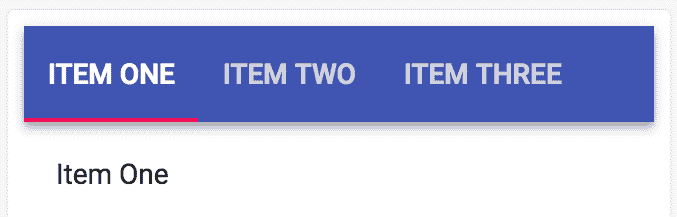

当你点击其中一个标签按钮时，选中的标签会改变，以及标签下方的相关内容也会更新。例如，点击“项目三”标签会得到以下结果：

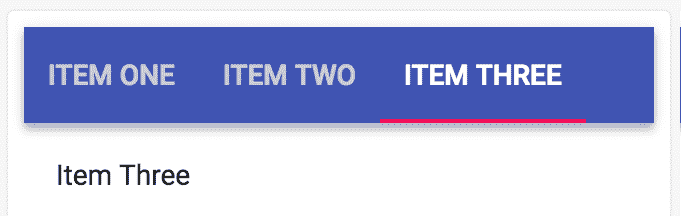

# 工作原理...

`Tabs` 和 `Tab` 组件在 `AppBar` 组件内部渲染。通常，`AppBar` 有一个 `Toolbar` 组件作为其子组件，但 `Tab` 也可以工作：

```js
<AppBar position="static">
  <Tabs value={value} onChange={onChange}>
    <Tab label="Item One" />
    <Tab label="Item Two" />
    <Tab label="Item Three" />
  </Tabs>
</AppBar>
```

你的组件有一个 `value` 状态，用于跟踪选中的标签。`onChange()` 处理器用于更新这个状态；它被设置为当前选中标签的索引。然后，你可以使用 `value` 状态来确定在 `AppBar` 组件下方渲染哪个内容：

```js
{value === 0 && (
  <Typography
    component="div"
    className={classes.tabContent}
  >
    Item One
  </Typography>
)}
{value === 1 && (
  <Typography
    component="div"
    className={classes.tabContent}
  >
    Item Two
  </Typography>
)}
{value === 2 && (
  <Typography
    component="div"
    className={classes.tabContent}
  >
    Item Three
  </Typography>
)}
```

如果第一个标签被选中，那么值是 `0`，并且会渲染“项目一”文本。对于其他两个标签，遵循相同的逻辑。

# 更多内容...

如果你想要标签，但不想在文本下方渲染指示器，你可以将其设置为与 `AppBar` 组件相同的颜色。这可以通过 `indicatorColor` 属性完成，如下所示：

```js
<Tabs
  value={value}
  onChange={this.onChange}
  indicatorColor="primary"
>
  <Tab label="Item One" />
  <Tab label="Item Two" />
  <Tab label="Item Three" />
</Tabs>
```

通过将 `indicatorColor` 值设置为 `primary`，指示器现在应该与 `AppBar` 组件颜色相同：

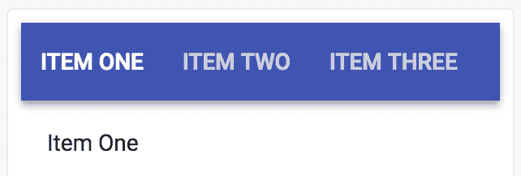

# 相关内容

+   `Tabs` API 文档：[`material-ui.com/api/tabs/`](https://material-ui.com/api/tabs/)

+   `Tabs` 示例：[`material-ui.com/demos/tabs/`](https://material-ui.com/demos/tabs/)

# 标签对齐

`Tabs` 组件有两个属性可以帮助你对齐标签按钮。`centered` 属性使标签居中，而 `fullWidth` 属性使标签展开。

# 如何实现...

假设你使用了以下代码创建了三个基本标签：

```js
import React, { useState } from 'react';

import { withStyles } from '@material-ui/core/styles';
import Tabs from '@material-ui/core/Tabs';
import Tab from '@material-ui/core/Tab';

const styles = theme => ({
  root: {
    flexGrow: 1,
    backgroundColor: theme.palette.background.paper
  }
});

function TabAlignment({ classes }) {
  const [value, setValue] = useState(0);

  const onChange = (e, value) => {
    setValue(value);
  };

  return (
    <div className={classes.root}>
      <Tabs value={value} onChange={onChange}>
        <Tab label="Item One" />
        <Tab label="Item Two" />
        <Tab label="Item Three" />
      </Tabs>
    </div>
  );
}

export default withStyles(styles)(TabAlignment);
```

当屏幕首次加载时，你应该看到以下内容：

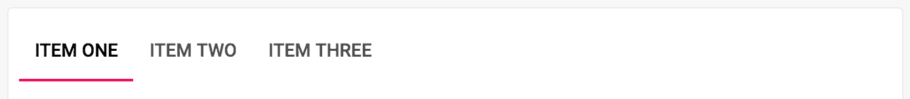

默认情况下，制表符对齐到左侧。您可以通过设置`centered`属性来使制表符居中，如下所示：

```js
<Tabs value={value} onChange={onChange} centered>
  <Tab label="Item One" />
  <Tab label="Item Two" />
  <Tab label="Item Three" />
</Tabs>
```

下面是居中制表符的外观：

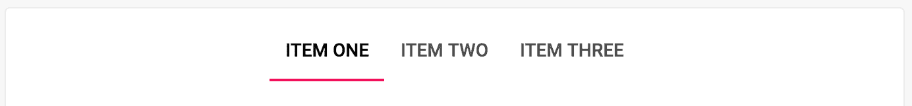

当您的制表符居中时，所有空余空间都位于制表符的左右两侧。另一种选择是将`variant`属性设置为`fullWidth`：

```js
<Tabs value={value} onChange={onChange} variant="fullWidth">
  <Tab label="Item One" />
  <Tab label="Item Two" />
  <Tab label="Item Three" />
</Tabs>
```

下面是全宽制表符的外观：

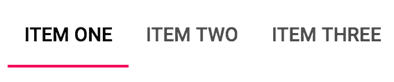

制表符居中，但它们均匀分布以覆盖屏幕宽度。

# 它是如何工作的...

`centered`属性只是指定`Tabs`组件上的`justifyContent`样式的一种方便方式。每当有属性可以以特定方式样式化 Material-UI 组件时，您应该使用它而不是应用自己的样式。库的将来版本可能包括依赖于您将错过的属性的修复。

使用属性来设置组件样式的另一个原因是，Material-UI 可能会根据其他属性的设置方式表现出不同的行为。例如，在使用`Tabs`组件时，当`scrollable`属性设置为`true`时，您不能设置`centered`属性；Material-UI 会检查这一点并处理它。

`variant`属性的`fullWidth`值实际上传递给了`Tab`组件，这将根据此值更改它使用的样式。结果是制表符在容器元素内的均匀分布。

您可以同时设置`centered`和`variant`属性。然而，如果`variant`的值为`fullWidth`，则`centered`不是必需的。尽管如此，同时使用两者是无害的。

# 还有更多...

制表符的居中布局在小屏幕上表现良好，而全宽布局在大屏幕上看起来不错。您可以使用 Material-UI 的实用工具来了解断点更改。然后，您可以使用这些信息来更改制表符的对齐方式。

下面是此示例的修改版本：

```js
import React, { useState } from 'react';
import compose from 'recompose/compose';

import { withStyles } from '@material-ui/core/styles';
import withWidth from '@material-ui/core/withWidth';
import Tabs from '@material-ui/core/Tabs';
import Tab from '@material-ui/core/Tab';

const styles = theme => ({
  root: {
    flexGrow: 1,
    backgroundColor: theme.palette.background.paper
  }
});

function TabAlignment({ classes, width }) {
  const [value, setValue] = useState(0);

  const onChange = (e, value) => {
    setValue(value);
  };

  return (
    <div className={classes.root}>
      <Tabs
        value={value}
        onChange={onChange}
        variant={['xs', 'sm'].includes(width) ? null : 'fullWidth'}
        centered
      >
        <Tab label="Item One" />
        <Tab label="Item Two" />
        <Tab label="Item Three" />
      </Tabs>
    </div>
  );
}

export default compose(
  withWidth(),
  withStyles(styles)
)(TabAlignment);
```

现在当您调整屏幕大小时，网格的对齐属性会根据断点更改而改变。让我们从底部开始分析这些更改，首先是`variant`属性值：

```js
variant={['xs', 'sm'].includes(width) ? null : 'fullWidth'}
```

如果`width`属性不是`xs`或`sm`断点，则值将是`fullWidth`。换句话说，如果屏幕更大，则值将是`fullWidth`。

接下来，您需要以某种方式将宽度属性传递给您的组件。您可以使用 Material-UI 的`withWidth()`实用工具。它的工作方式类似于`withStyles()`，它会返回一个新的组件，并为其分配新的属性。`withWidth()`返回的组件将在断点更改时更新其`width`属性。例如，如果用户将屏幕大小从`sm`调整为`md`，这将触发宽度更改，`fullWidth`将从`false`变为`true`。

要使用 `withWidth()` 组件——以及 `withStyles()` 组件——你可以使用 `recompose` 中的 `compose()` 函数。当你应用多个高阶函数来装饰你的组件时，这个函数会使你的代码更易于阅读：

```js
export default compose(
  withWidth(),
  withStyles(styles)
)(TabAlignment);
```

如果你真的不想使用 `recompose`，你可以调用 `withWidth(withStyles(styles))(TabAlignment)`，但作为一个一般规则，我喜欢在涉及多个高阶函数时使用它。

# 参见

+   `Tabs` 示例：[`material-ui.com/demos/tabs/`](https://material-ui.com/demos/tabs/)

+   `Tabs` API 文档：[`material-ui.com/api/tabs/`](https://material-ui.com/api/tabs/)

+   React 组件组合工具：[`github.com/acdlite/recompose/`](https://github.com/acdlite/recompose/)

# 根据状态渲染标签页

在你的 React 应用程序中，标签页可能是由数据驱动的。如果是这样，你可以在组件的状态中设置标签数据，以便它们最初渲染并在有任何更改时更新。

# 如何做到这一点...

假设你有一些数据，这些数据决定了你的应用程序中要渲染的标签页。你可以在组件的状态中设置这些数据，并使用它来渲染 `Tab` 组件，以及当标签选择被做出时的标签内容。以下是代码：

```js
import React, { useState } from 'react';

import { makeStyles } from '@material-ui/styles';
import Tabs from '@material-ui/core/Tabs';
import Tab from '@material-ui/core/Tab';
import Typography from '@material-ui/core/Typography';

const useStyles = makeStyles(theme => ({
  root: {
    flexGrow: 1,
    backgroundColor: theme.palette.background.paper
  },
  tabContent: {
    padding: theme.spacing(2)
  }
}));

export default function RenderingTabsBasedOnState() {
  const classes = useStyles();
  const [tabs, setTabs] = useState([
    {
      active: true,
      label: 'Item One',
      content: 'Item One Content'
    },
    {
      active: false,
      label: 'Item Two',
      content: 'Item Two Content'
    },
    {
      active: false,
      label: 'Item Three',
      content: 'Item Three Content'
    }
  ]);

  const onChange = (e, value) => {
    setTabs(
      tabs
        .map(tab => ({ ...tab, active: false }))
        .map((tab, index) => ({
          ...tab,
          active: index === value
        }))
    );
  };

  const active = tabs.findIndex(tab => tab.active);
  const content = tabs[active].content;

  return (
    <div className={classes.root}>
      <Tabs value={active} onChange={onChange}>
        {tabs
          .map(tab => (
            <Tab
              key={tab.label}
              label={tab.label}
            />
          ))}
      </Tabs>
      <Typography component="div" className={classes.tabContent}>
        {content}
      </Typography>
    </div>
  );
}
```

当你首次加载屏幕时，你会看到以下内容：

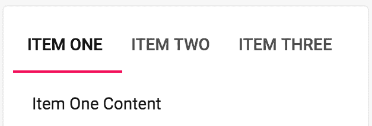

如果你点击“项目二”标签，你会看到以下内容：

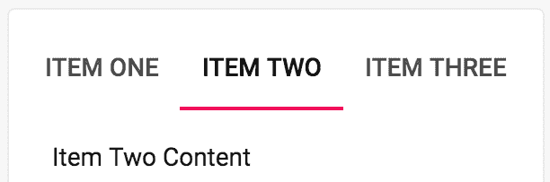

# 它是如何工作的...

让我们从查看驱动渲染的 `tabs` 的组件状态开始：

```js
const [tabs, setTabs] = useState([
  {
    active: true,
    label: 'Item One',
    content: 'Item One Content'
  },
  {
    active: false,
    label: 'Item Two',
    content: 'Item Two Content'
  },
  {
    active: false,
    label: 'Item Three',
    content: 'Item Three Content'
  }
]);
```

`tabs` 状态是一个数组，数组中的每个对象代表一个要渲染的标签。`active` 布尔属性确定哪个标签是“活动”的。`label` 属性是实际渲染为标签按钮的内容，当点击标签时，内容在标签下方渲染。

接下来，让我们看看用于渲染 `tabs` 和内容的标记：

```js
<Tabs value={active} onChange={onChange}>
  {tabs.map(tab => <Tab label={tab.label} />)}
</Tabs>
<Typography component="div" className={classes.tabContent}>
  {content}
</Typography>
```

而不是手动渲染 `Tab` 组件，你现在正在遍历 `tabs` 状态来渲染每个标签。对于选定的内容，你现在只需要渲染一个引用 `content` 的 `Typography` 组件。

让我们看看两个 `active` 和 `content` 值，如下所示：

```js
const active = tabs.findIndex(tab => tab.active);
const content = tabs[active].content;
```

`active` 常量是活动标签的索引。这个值传递给 `Tabs` 组件的 `value` 属性。它也被 `content` 值——活动标签的内容——使用。这两个常量简化了你的组件需要渲染的标记。

# 还有更多...

现在你用 `state` 控制你的标签页后，你可以控制更多渲染的标签的方面。例如，你可以在每个标签中添加 `disabled` 和 `hidden` 状态。你还可以在标签状态中放置一个 `icon` 属性来渲染。以下是 `tabs` 状态的新版本：

```js
const [tabs, setTabs] = useState([
  {
    active: true,
    label: 'Home',
    content: 'Home Content',
    icon: <HomeIcon />
  },
  {
    active: false,
    label: 'Settings',
    content: 'Settings Content',
    icon: <SettingsIcon />
  },
  {
    active: false,
    disabled: true,
    label: 'Search',
    content: 'Search Content',
    icon: <SearchIcon />
  },
  {
    active: false,
    hidden: true,
    label: 'Add',
    content: 'AddContent',
    icon: <AddIcon />
  }
]);
```

现在，您有了渲染`disabled`标签的能力，这些标签不能被点击——例如，SEARCH 标签的情况。您还可以通过将`hidden`设置为`true`来完全隐藏标签——例如，添加标签的情况。每个标签现在都有一个图标。让我们看看加载屏幕时的样子：

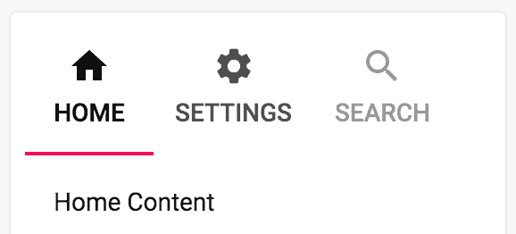

每个标签的图标都按预期渲染，即使是标记为`disabled`的 SEARCH 标签。没有添加标签，因为它被标记为`hidden`。让我们看看为了适应这些新的状态值而对`Tabs`标记所做的更改：

```js
<Tabs value={active} onChange={onChange}>
  {tabs
    .filter(tab => !tab.hidden)
    .map(tab => (
      <Tab
        key={tab.label}
        disabled={tab.disabled}
        icon={tab.icon}
        label={tab.label}
      />
    ))}
</Tabs>
```

`Tab`的`disabled`和`icon`属性直接从组件状态中的标签传递。添加了`filter()`调用以删除标记为隐藏的标签。

# 参见

+   `Tabs` API 文档：[`material-ui.com/api/tabs/`](https://material-ui.com/api/tabs/)

+   `Tabs`演示：[`material-ui.com/demos/tabs/`](https://material-ui.com/demos/tabs/)

# 抽象标签内容

如果您的应用程序在多个位置使用标签，您可以创建抽象来简化涉及渲染标签和标签内容的标记。为什么不将所有内容都包含在内，使其更容易阅读，而不是在标签组件外部定义标签内容？

# 如何做到...

假设您的应用程序在应用程序的多个位置使用标签，并且您想简化创建标签和标签内容的标记。在您使用标签的地方，您只想能够渲染内容，而无需担心处理活动标签的状态。以下是一些代码，创建了两个新的组件，这些组件简化了渲染标签内容所需的**JavaScript XML**（**JSX**）：

```js
import React, { Fragment, Children, useState } from 'react';

import { withStyles } from '@material-ui/core/styles';
import Tabs from '@material-ui/core/Tabs';
import Tab from '@material-ui/core/Tab';
import Typography from '@material-ui/core/Typography';

const styles = theme => ({
  root: {
    flexGrow: 1,
    backgroundColor: theme.palette.background.paper
  },
  tabContent: {
    padding: theme.spacing(2)
  }
});

function TabContainer({ children }) {
  const [value, setValue] = useState(0);

  const onChange = (e, value) => {
    setValue(value);
  };

  return (
    <Fragment>
      <Tabs value={value} onChange={onChange}>
        {Children.map(children, child => (
          <Tab label={child.props.label} />
        ))}
      </Tabs>
      {Children.map(children, (child, index) =>
        index === value ? child : null
      )}
    </Fragment>
  );
}

const TabContent = withStyles(styles)(({ classes, children }) => (
  <Typography component="div" className={classes.tabContent}>
    {children}
  </Typography>
));

const AbstractingTabContent = withStyles(styles)(({ classes }) => (
  <div className={classes.root}>
    <TabContainer>
      <TabContent label="Item One">Item One Content</TabContent>
      <TabContent label="Item Two">Item Two Content</TabContent>
      <TabContent label="Item Three">Item Three Content</TabContent>
    </TabContainer>
  </div>
));

export default AbstractingTabContent;
```

当您加载屏幕时，您将看到三个标签被渲染，默认选中第一个标签。第一个标签的内容也是可见的。以下截图显示了它的样子：


# 它是如何工作的...

让我们先看看在这个以下示例中用于渲染标签的标记：

```js
<TabContainer>
  <TabContent label="Item One">Item One Content</TabContent>
  <TabContent label="Item Two">Item Two Content</TabContent>
  <TabContent label="Item Three">Item Three Content</TabContent>
</TabContainer>
```

与直接使用`Tab`和`Tabs`组件相比，这种标记更加简洁。这种方法还处理了渲染选中标签的内容。这种方法将所有内容都包含在内。

接下来，让我们看看`TabContainer`组件：

```js
function TabContainer({ children }) {
  const [value, setValue] = useState(0);

  const onChange = (e, value) => {
    setValue(value);
  };

  return (
    <Fragment>
      <Tabs value={value} onChange={onChange}>
        {Children.map(children, child => (
          <Tab label={child.props.label} />
        ))}
      </Tabs>
      {Children.map(children, (child, index) =>
        index === value ? child : null
      )}
    </Fragment>
  );
}
```

`TabContainer`组件处理选中标签的状态，并在选择不同的标签时更改状态。该组件渲染一个`Fragment`组件，以便它可以在`Tabs`组件之后放置选中的标签内容。它使用`Children.map()`来渲染单个`Tab`组件。标签的标签来自子组件的`label`属性。在这个例子中，有三个子组件（`TabContent`）。下一次调用`Children.map()`将渲染选中标签的内容。这是基于`value`状态——如果子组件索引匹配，则是`active`内容。否则，它被映射到`null`，不进行渲染。

最后，让我们来看看`TabContent`组件：

```js
const TabContent = withStyles(styles)(({ classes, children }) => (
  <Typography component="div" className={classes.tabContent}>
    {children}
  </Typography>
));
```

`TabContent`负责对`Typography`组件进行样式设置，并在其中渲染子文本。尽管将`label`属性传递给了`TabContent`，但它实际上并没有使用它；相反，它在渲染标签时由`TabContainer`使用。

# 还有更多...

你可以向`TabsContainer`组件添加一个`value`属性，这样你就可以设置要激活的任何标签。例如，你可能希望在屏幕首次加载时，第二个标签是`active`而不是第一个标签。为此，你必须为`value`添加一个默认属性值，如果`value`状态尚未设置，则调用`setValue()`，并从初始状态中删除`value`。

```js
function TabContainer({ children, value: valueProp }) {
  const [value, setValue] = useState();

  const onChange = (e, value) => {
    setValue(value);
  };

  if (value === undefined) {
    setValue(valueProp);
  }

  return (
    <Fragment>
      <Tabs value={value} onChange={onChange}>
        {Children.map(children, child => (
          <Tab label={child.props.label} />
        ))}
      </Tabs>
      {Children.map(children, (child, index) =>
        index === value ? child : null
      )}
    </Fragment>
  );
}

TabContainer.defaultProps = {
  value: 0
};
```

默认属性是必要的，因为`value`状态默认是未定义的。如果`value`状态是未定义的，则调用`setValue()`方法。如果是，则可以通过传递`value`属性值来设置它。

现在，你可以将这个属性传递给你的组件以更改初始激活的标签页：

```js
<TabContainer value={1}>
  <TabContent label="Item One">Item One Content</TabContent>
  <TabContent label="Item Two">Item Two Content</TabContent>
  <TabContent label="Item Three">Item Three Content</TabContent>
</TabContainer>
```

值属性设置为`1`。它是一个基于零的索引，这意味着第二个标签将默认激活：

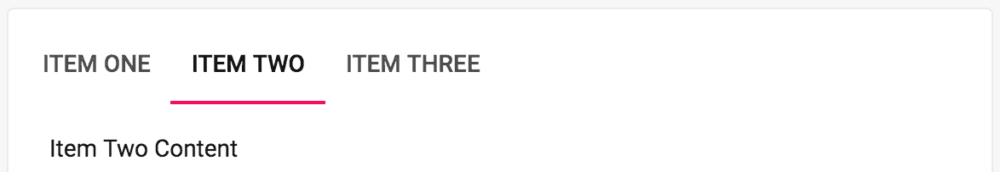

当用户开始点击其他标签时，`value`状态按预期更新——只有初始激活的标签受此更改影响。

# 参见

+   `Tabs` API 文档：[`material-ui.com/api/tabs/`](https://material-ui.com/api/tabs/)

+   `Tabs`演示：[`material-ui.com/demos/tab/`](https://material-ui.com/demos/tab/)

+   与 React 子组件一起工作：[`reactjs.org/docs/react-api.html#reactchildren`](https://reactjs.org/docs/react-api.html#reactchildren)

# 基于路由的标签导航

你可以在路由解决方案（如`react-router`）中根据路由来设置你的标签内容。为此，你必须将你的标签按钮转换为链接，并且需要在`Tabs`组件下方有`Route`组件来渲染当前 URL。

# 如何做到这一点...

假设你的应用有三个 URL，你想要使用标签作为导航机制在路由之间导航。第一步是将`Tab`按钮转换为链接。第二步是让`Route`组件根据点击的标签渲染相应的标签内容。以下是代码：

```js
import React, { useState } from 'react';
import { Route, Link } from 'react-router-dom';

import { withStyles } from '@material-ui/core/styles';
import AppBar from '@material-ui/core/AppBar';
import Tabs from '@material-ui/core/Tabs';
import Tab from '@material-ui/core/Tab';
import Typography from '@material-ui/core/Typography';

const styles = theme => ({
  root: {
    flexGrow: 1,
    backgroundColor: theme.palette.background.paper
  },
  tabContent: {
    padding: theme.spacing(2)
  }
});

function TabNavigationWithRoutes({ classes }) {
  const [value, setValue] = useState(0);

  const onChange = (e, value) => {
    setValue(value);
  };

  return (
    <div className={classes.root}>
      <AppBar position="static">
        <Tabs value={value} onChange={onChange}>
          <Tab label="Item One" component={Link} to="/" />
          <Tab label="Item Two" component={Link} to="/page2" />
          <Tab label="Item Three" component={Link} to="/page3" />
        </Tabs>
      </AppBar>
      <Route
        exact
        path="/"
        render={() => (
          <Typography component="div" className={classes.tabContent}>
            Item One
          </Typography>
        )}
      />
      <Route
        exact
        path="/page2"
        render={() => (
          <Typography component="div" className={classes.tabContent}>
            Item Two
          </Typography>
        )}
      />
      <Route
        exact
        path="/page3"
        render={() => (
          <Typography component="div" className={classes.tabContent}>
            Item Three
          </Typography>
        )}
      />
    </div>
  );
}

export default withStyles(styles)(TabNavigationWithRoutes);
```

当你加载屏幕时，第一个标签应该被选中，并且第一个标签内容应该被渲染：

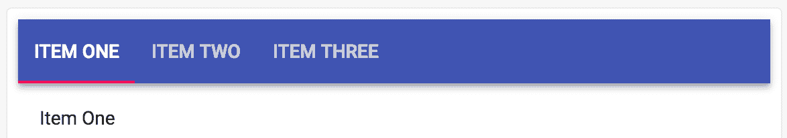

如果你点击“项目二”标签页，你将被带到`/page2` URL。这会导致活动的`Route`组件更改标签内容，并且更改的标签状态会改变选中的标签：

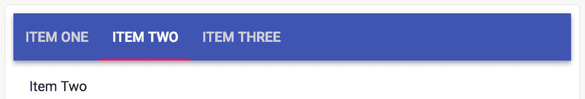

# 它是如何工作的...

你的组件的状态部分与使用`Tabs`组件的任何其他组件相同。`onChange`事件改变`value`状态，该状态作为属性传递给`Tabs`以标记选中的标签。

让我们更仔细地看看`Tab`组件：

```js
<Tabs value={value} onChange={onChange}>
  <Tab label="Item One" component={Link} to="/" />
  <Tab label="Item Two" component={Link} to="/page2" />
  <Tab label="Item Three" component={Link} to="/page3" />
</Tabs>
```

与更标准的实现相比，这个实现的一个主要区别是，你使用`Link`作为组件属性值。来自`react-router-dom`的`Link`组件被用来将标签按钮变成路由器将处理的链接。`to`属性实际上传递给了`Link`，这样它就知道链接应该将用户带到哪里。

在`Tabs`组件下方是渲染标签内容的路由，基于用户点击的标签。让我们看看这些 Routes 中的一个：

```js
<Route
  exact
  path="/"
  render={() => (
    <Typography
      component="div"
      className={classes.tabContent}
    >
      Item One
    </Typography>
  )}
/>
```

在标签下方渲染的内容基于当前 URL，而不是组件的`value`状态。`value`状态仅用于控制选中标签的状态。

# 还有更多...

由于活动标签依赖于活动路由，你可以完全移除任何与标签相关的状态。首先，你创建一个`TabContainer`组件来渲染`Tabs`组件：

```js
const TabContainer = ({ value }) => (
  <AppBar position="static">
    <Tabs value={value}>
      <Tab label="Item One" component={Link} to="/" />
      <Tab label="Item Two" component={Link} to="/page2" />
      <Tab label="Item Three" component={Link} to="/page3" />
    </Tabs>
  </AppBar>
);
```

不同于向`Tabs`组件提供`onChange()`处理程序，`value`属性是从`TabContainer`传递的。现在，你可以在每个`Route`组件中`render`此组件，传递适当的`value`属性：

```js
const TabNavigationWithRoutes = withStyles(styles)(({ classes }) => (
  <div className={classes.root}>
    <Route
      exact
      path="/"
      render={() => (
        <Fragment>
          <TabContainer value={0} />
          <Typography component="div" className={classes.tabContent}>
            Item One
          </Typography>
        </Fragment>
      )}
    />
    <Route
      exact
      path="/page2"
      render={() => (
        <Fragment>
          <TabContainer value={1} />
          <Typography component="div" className={classes.tabContent}>
            Item Two
          </Typography>
        </Fragment>
      )}
    />
    <Route
      exact
      path="/page3"
      render={() => (
        <Fragment>
          <TabContainer value={2} />
          <Typography component="div" className={classes.tabContent}>
            Item Three
          </Typography>
        </Fragment>
      )}
    />
  </div>
));

export default TabNavigationWithRoutes;
```

不要再混淆组件状态与当前`Route`以及它们之间的交互了。所有这些都由路由处理。

# 参见

+   `Tabs` API 文档：[`material-ui.com/api/tabs/`](https://material-ui.com/api/tabs/)

+   `Tabs` 示例：[`material-ui.com/demos/tabs/`](https://material-ui.com/demos/tabs/)

+   React Router 文档：[`reacttraining.com/react-router/`](https://reacttraining.com/react-router/)
