# 列表 - 显示简单集合数据

在本章中，你将涵盖以下食谱：

+   使用状态来渲染列表项

+   列表图标

+   列表头像和文本

+   列表部分

+   嵌套列表

+   列表控制

+   滚动列表

# 简介

Material-UI 中的`List`组件用于渲染数据集合。列表就像表格，但更简单。如果你需要显示用户数组，例如，你可以将它们渲染成列表，只显示最相关的数据，而不是在表格格式中显示多个属性。Material-UI 列表是通用的，并提供了很多灵活性。

# 使用状态来渲染列表项

用于渲染`List`组件的数据源通常来自你的组件状态。一个集合——通常是一个对象数组——被映射到`ListItem`组件。当这个数组中的对象发生变化时，Material-UI 列表项会在屏幕上相应地改变。

# 如何做到这一点...

假设你有一个包含三个对象的数组，你需要将其显示在你的屏幕上的列表中。你可以将这个数组添加到你的组件状态中，然后将每个数组项映射到一个`ListItem`组件。以下是代码：

```js
import React, { useState } from 'react';

import List from '@material-ui/core/List';
import ListItem from '@material-ui/core/ListItem';
import ListItemText from '@material-ui/core/ListItemText';

export default function UsingStatetoRenderListItems() {
  const [items, setItems] = useState([
    { name: 'First Item', timestamp: new Date() },
    { name: 'Second Item', timestamp: new Date() },
    { name: 'Third Item', timestamp: new Date() }
  ]);

  return (
    <List>
      {items.map((item, index) => (
        <ListItem key={index} button dense>
          <ListItemText
            primary={item.name}
            secondary={item.timestamp.toLocaleString()}
          />
        </ListItem>
      ))}
    </List>
  );
}
```

当你首次加载屏幕时，你会看到以下内容：

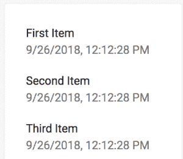

# 它是如何工作的...

让我们从查看`items`状态开始：

```js
const [items, setItems] = useState([
  { name: 'First Item', timestamp: new Date() },
  { name: 'Second Item', timestamp: new Date() },
  { name: 'Third Item', timestamp: new Date() }
]);
```

`name`属性是每个列表项的`primary`文本，而`timestamp`属性是每个列表项的`secondary`文本。接下来，让我们看看将这个状态转换为渲染列表项的`List`标记：

```js
<List>
  {items.map((item, index) => (
    <ListItem key={index} button dense>
      <ListItemText
        primary={item.name}
        secondary={item.timestamp.toLocaleString()}
      />
    </ListItem>
  ))}
</List>
```

`ListItem`组件有两个布尔属性传递给它——`button`和`dense`。`button`属性使列表项表现得像一个按钮。例如，如果你将鼠标指针移到列表中的某个项上，你会看到应用于它的悬停样式。`dense`属性从列表项中移除了额外的填充。如果没有这个属性，列表在屏幕上会占用更多的空间。

`ListItemText`组件使用`primary`和`secondary`属性分别渲染`name`和`timestamp`属性。`primary`文本旨在相对于显示在项中的`secondary`信息脱颖而出——在这个例子中，是`timestamp`。

# 还有更多...

这个例子原本可以使用属性而不是状态，因为列表中的项目从未改变。让我们修改它，以便用户可以从列表中选择项目。下面是新的`List`标记的样式：

```js
<List>
  {items.map((item, index) => (
    <ListItem
      key={index}
      button
      dense
      selected={item.selected}
      onClick={onClick(index)}
    >
      <ListItemText
        primary={item.name}
        secondary={item.timestamp.toLocaleString()}
        primaryTypographyProps={{
          color: item.selected ? 'primary' : undefined
        }}
      />
    </ListItem>
  ))}
</List>
```

传递给`ListItem`组件的`selected`属性将在`true`时应用选中样式到该项。这个值来自`item.selected`状态，默认情况下每个项都是`false`（没有选中）。接下来，`ListItem`组件有一个`onClick`处理程序。

`ListItemText`组件也会根据项目的选择状态应用样式。在幕后，项目文本是通过`Typography`组件渲染的。你可以使用`primaryTypographyProps`属性将属性传递给`Typography`组件。在这种情况下，当项目被选中时，你正在将文本的`color`更改为`primary`。

让我们看看以下是如何处理`onClick()`处理器的：

```js
const onClick = index => () => {
  const item = items[index];
  const newItems = [...items];

  newItems[index] = { ...item, selected: !item.selected };
  setItems(newItems);
};
```

这是一个高阶函数，它根据`index`参数返回一个事件处理函数。它切换给定索引处的项目选择状态。

`onClick`属性不是`ListItem`属性，而是`button`属性。由于你已经将`button`属性设置为`true`，`ListItem`使用`button`属性并将其传递给你的`onClick`属性。

当选择第一个项目时，列表看起来是这样的：

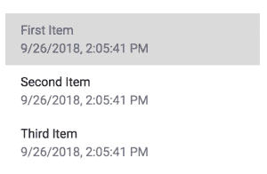

背景颜色的变化是由`ListItem`的`selected`属性引起的。文本颜色的变化是由`ListItemText`的`primaryTypographyProps`属性引起的。

# 参见

+   `List`演示：[`material-ui.com/demos/lists/`](https://material-ui.com/demos/lists/)

+   `Typography` API 文档：[`material-ui.com/api/typography/`](https://material-ui.com/api/typography/)

# 列表图标

`ListItem`组件对图标有第一级支持。通过在每个列表项中渲染图标，你可以清楚地让用户知道列表中显示的对象类型。

# 如何实现...

假设你有一个用户对象的数组，你想要在`List`中渲染这些对象。你可以为列表中的每个项目渲染一个用户图标，以便清楚地表明列表中的每个项目是什么。下面是这个功能的代码实现：

```js
import React, { useState } from 'react';

import List from '@material-ui/core/List';
import ListItem from '@material-ui/core/ListItem';
import ListItemText from '@material-ui/core/ListItemText';
import ListItemIcon from '@material-ui/core/ListItemIcon';

import AccountCircleIcon from '@material-ui/icons/AccountCircle';

export default function ListIcons() {
  const [items, setItems] = useState([
    { name: 'First User' },
    { name: 'Second User' },
    { name: 'Third User' }
  ]);

  return (
    <List>
      {items.map((item, index) => (
        <ListItem key={index} button>
          <ListItemIcon>
            <AccountCircleIcon />
          </ListItemIcon>
          <ListItemText primary={item.name} />
        </ListItem>
      ))}
    </List>
  );
}
```

当你加载屏幕时，列表应该看起来是这样的：

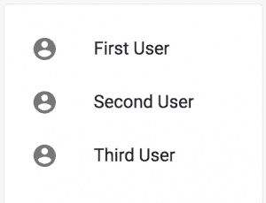

# 它是如何工作的...

`ListItemIcon`组件可以用作`ListItem`组件的子组件。在上一个示例中，它位于文本之前，因此最终位于项目文本的左侧：

```js
<ListItem button key={index}>
  <ListItemIcon>
    <AccountCircleIcon />
  </ListItemIcon>
  <ListItemText primary={item.name} />
</ListItem>
```

你也可以将图标放置在文本之后：

```js
<ListItem button key={index}>
  <ListItemText primary={item.name} />
  <ListItemIcon>
    <AccountCircleIcon />
  </ListItemIcon>
</ListItem>
```

这就是它的样子：

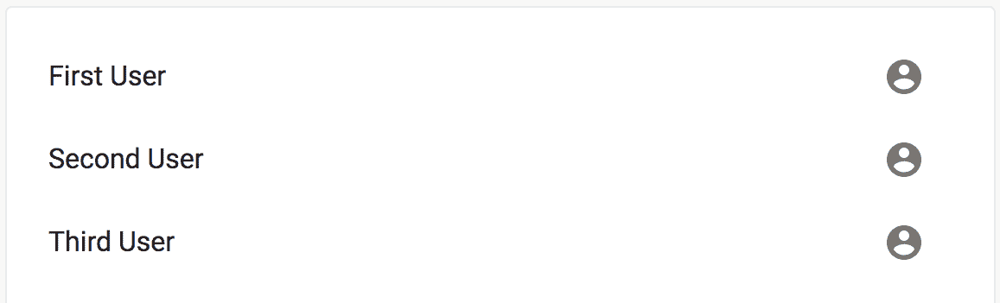

# 更多内容...

你可以通过将`selected`属性设置为`true`来标记`ListItem`组件为选中状态。你还可以更改图标，以更好地提供项目已选中的视觉指示。以下是更新后的代码：

```js
import React, { useState } from 'react';

import List from '@material-ui/core/List';
import ListItem from '@material-ui/core/ListItem';
import ListItemText from '@material-ui/core/ListItemText';
import ListItemIcon from '@material-ui/core/ListItemIcon';

import AccountCircleIcon from '@material-ui/icons/AccountCircle';
import CheckCircleOutlineIcon from '@material-ui/icons/CheckCircleOutline';

const MaybeSelectedIcon = ({ selected, Icon }) =>
  selected ? <CheckCircleOutlineIcon /> : <Icon />;

export default function ListIcons() {
  const [items, setItems] = useState([
    { name: 'First User' },
    { name: 'Second User' },
    { name: 'Third User' }
  ]);

  const onClick = index => () => {
    const item = items[index];
    const newItems = [...items];

    newItems[index] = { ...item, selected: !item.selected };
    setItems(newItems);
  };

  return (
    <List>
      {items.map((item, index) => (
        <ListItem
          key={index}
          button
          selected={item.selected}
          onClick={onClick(index)}
        >
          <ListItemText primary={item.name} />
          <ListItemIcon>
            <MaybeSelectedIcon
              selected={item.selected}
              Icon={AccountCircleIcon}
            />
          </ListItemIcon>
        </ListItem>
      ))}
    </List>
  );
}
```

这是选择第一个用户时列表的样子：

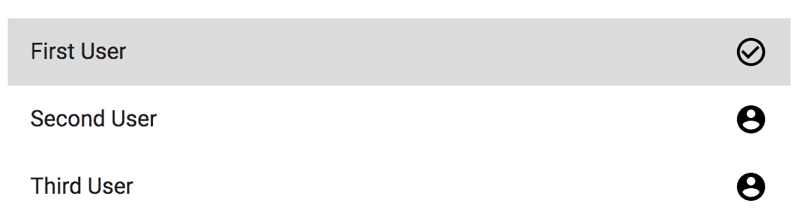

选择项目的图标变为圆形勾选标记。让我们分析一下引入的更改，从`MaybeSelectedIcon`组件开始：

```js
const MaybeSelectedIcon = ({ selected, Icon }) =>
  selected ? <CheckCircleOutlineIcon /> : <Icon />;
```

此组件将渲染`CheckCircleOutlineIcon`或作为属性传入的`Icon`组件。这取决于`selected`属性。接下来，让我们看看这个组件如何在`ListItemIcon`内部使用：

```js
<ListItemIcon>
  <MaybeSelectedIcon
    selected={item.selected}
    Icon={AccountCircleIcon}
  />
</ListItemIcon>
```

当点击列表项时，该项目的`selected`状态会被切换。然后，`selected`状态会被传递给`MaybeSelectedIcon`。`AccountCircleIcon`组件是在列表项未被选中时渲染的图标，因为它被传递给了`Icon`属性。

# 另请参阅

+   `List`演示：[`material-ui.com/demos/lists/`](https://material-ui.com/demos/lists/)

+   `ListItemIcon` API 文档：[`material-ui.com/api/list-item-icon/`](https://material-ui.com/api/list-item-icon/)

# 列表头像和文本

如果你的列表项有`primary`和`secondary`文本，单独使用图标可能不如围绕图标的头像在视觉上吸引人。它更好地填充了列表项内的空间。

# 如何实现...

假设你的应用可以显示四种消息类别。要访问某个类别，用户点击列表中的一个项。为了帮助用户理解类别，你会使用图标。为了让图标在列表项的`primary`和`secondary`文本中脱颖而出，你会用`Avatar`组件包裹它。以下是代码：

```js
import React, { useState } from 'react';
import clsx from 'clsx';

import Avatar from '@material-ui/core/Avatar';
import List from '@material-ui/core/List';
import ListItem from '@material-ui/core/ListItem';
import ListItemText from '@material-ui/core/ListItemText';
import ListItemIcon from '@material-ui/core/ListItemIcon';

import MarkunreadIcon from '@material-ui/icons/Markunread';
import PriorityHighIcon from '@material-ui/icons/PriorityHigh';
import LowPriorityIcon from '@material-ui/icons/LowPriority';
import DeleteIcon from '@material-ui/icons/Delete';

export default function ListAvatarsAndText({ classes }) {
  const [items] = useState([
    {
      name: 'Unread',
      updated: '2 minutes ago',
      Icon: MarkunreadIcon,
      notifications: 1
    },
    {
      name: 'High Priority',
      updated: '30 minutes ago',
      Icon: PriorityHighIcon
    },
    {
      name: 'Low Priority',
      updated: '3 hours ago',
      Icon: LowPriorityIcon
    },
    { name: 'Junk', updated: '6 days ago', Icon: DeleteIcon }
  ]);

  return (
    <List>
      {items.map(({ Icon, ...item }, index) => (
        <ListItem button>
          <ListItemIcon>
            <Avatar>
              <Icon />
            </Avatar>
          </ListItemIcon>
          <ListItemText
            primary={item.name}
            secondary={item.updated}
          />
        </ListItem>
      ))}
    </List>

  );
}
```

这就是列表渲染后的样子：

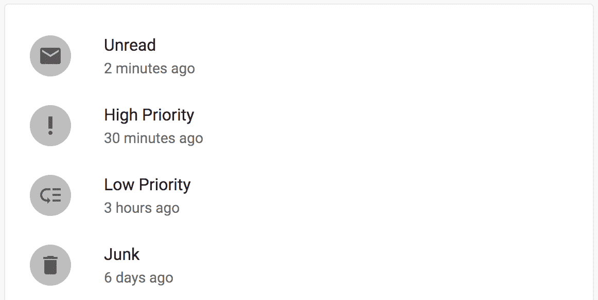

围绕图标的圆圈是`Avatar`组件，它帮助图标脱颖而出。以下是这个没有头像的列表的样子：

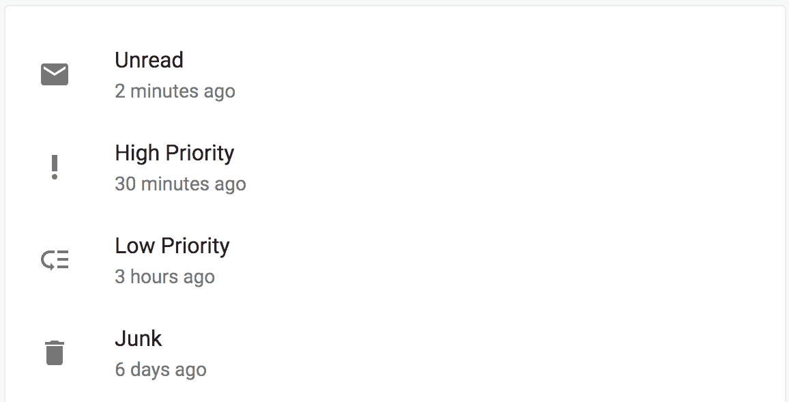

内容和图标都是相同的，但由于列表项文本的高度，图标周围有大量的多余空间。`Avatar`组件帮助填充这个空间，同时吸引人们对图标的注意。

# 它是如何工作的...

`Avatar`组件用于圆形形状的图标。圆圈的颜色来自主题调色板——使用的灰色阴影取决于主题是亮色还是暗色。图标本身作为子元素传递：

```js
<ListItemIcon>
  <Avatar>
    <Icon />
  </Avatar>
</ListItemIcon>
```

# 还有更多...

如果你使用`Avatar`在你的列表项中的图标，你可以改变`Avatar`的颜色，并且可以应用徽章来指示未确认的操作。让我们修改示例，使得`items`状态中的每个项都可以有一个`notifications`属性；即表示该类别未读消息数量的数字。如果这个数字大于 0，你可以改变`Avatar`的颜色，并在徽章中显示通知数量。以下是结果的样子：

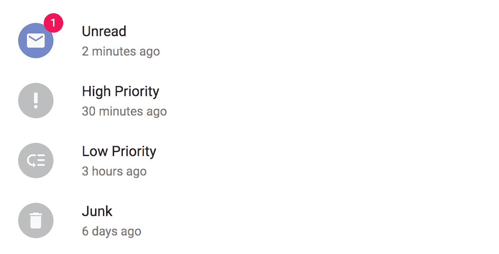

列表中的第一个项有一个使用主要`theme`颜色和显示通知数量的徽章的`Avatar`。其余的项没有通知，所以`Avatar`颜色使用默认值，徽章不显示。

让我们看看这是如何实现的，从样式开始：

```js
const styles = theme => ({
  activeAvatar: {
    backgroundColor: theme.palette.primary[theme.palette.type]
  }
});
```

当`notifications`状态为一个大于 0 的数字时，`activeAvatar`样式会被应用到`Avatar`组件上。它会根据主题类型（浅色或深色）查找主要的`theme`颜色。接下来，让我们看看`items`数组中第一个项目的状态：

```js
{
  name: 'Unread',
  updated: '2 minutes ago',
  Icon: MarkunreadIcon,
  notifications: 1
}
```

因为`notifications`的值是`1`，所以头像的颜色会改变，徽章会显示。最后，让我们看看如何使用`Badge`和`Avatar`组件在组件标记中组合所有这些内容：

```js
<Badge
  color={item.notifications ? 'secondary' : undefined}
  badgeContent={
    item.notifications ? item.notifications : null
  }
>
  <Avatar
    className={clsx({
      [classes.activeAvatar]: item.notifications
    })}
  >
    <Icon />
  </Avatar>
</Badge>
```

`Badge`的`color`属性基于项目`notifications`状态是否大于 0。如果是，则使用主要颜色。如果不是，则将`undefined`传递给`Badge`。在这种情况下，这是必要的，这样当没有通知时，就不会显示空的徽章圆圈。

将`undefined`作为属性值相当于根本未设置该属性。

接下来，根据项目的`notifications`状态设置`badgeContent`属性。如果它不大于 0，那么你不想设置任何值。最后，设置`Avatar`组件的颜色时，如果项目的`notifications`状态大于 0，则使用`clsx()`应用`activeAvatar`类。

# 参见

+   `Badge`演示：[`material-ui.com/demos/badges/`](https://material-ui.com/demos/badges/)

+   `Avatar`演示：[`material-ui.com/demos/avatars/`](https://material-ui.com/demos/avatars/)

+   `List`演示：[`material-ui.com/demos/lists/`](https://material-ui.com/demos/lists/)

# 列表部分

当你的列表中包含的不仅仅是几个项目时，你可能想要考虑将项目组织到部分中。为此，你将你的列表分成几个更小的列表，这些列表彼此堆叠，中间用分隔符隔开。

# 如何做...

假设你有几个可以分成三个部分的项目。你可以使用三个`List`组件将你的项目分组到各自的区域，并使用`Divider`组件来向用户视觉上指示部分边界。以下是代码的样子：

```js
import React, { Fragment } from 'react';

import List from '@material-ui/core/List';
import ListItem from '@material-ui/core/ListItem';
import ListItemText from '@material-ui/core/ListItemText';
import Divider from '@material-ui/core/Divider';

const ListSections = () => (
  <Fragment>
    <List>
      <ListItem>
        <ListItemText primary="First" />
      </ListItem>
      <ListItem>
        <ListItemText primary="Second" />
      </ListItem>
    </List>
    <Divider />
    <List>
      <ListItem>
        <ListItemText primary="Third" />
      </ListItem>
      <ListItem>
        <ListItemText primary="Fourth" />
      </ListItem>
    </List>
    <Divider />
    <List>
      <ListItem>
        <ListItemText primary="Fifth" />
      </ListItem>
      <ListItem>
        <ListItemText primary="Sixth" />
      </ListItem>
    </List>
  </Fragment>
));

export default ListSections;
```

这就是渲染后的列表看起来像什么：

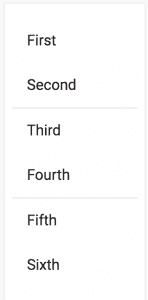

# 它是如何工作的...

每个部分都是一个独立的`List`组件，有自己的`ListItem`组件。`Divider`组件用于分隔列表。例如，第一个部分看起来是这样的：

```js
<List>
  <ListItem>
    <ListItemText primary="First" />
  </ListItem>
  <ListItem>
    <ListItemText primary="Second" />
  </ListItem>
</List>
```

# 更多内容...

你可以使用`Typography`来标记你的部分，而不是使用`Divider`组件分隔你的列表部分。这可以帮助你的用户理解每个部分中的项目：

```js
<Fragment>
  <Typography variant="title">First Section</Typography>
  <List>
    <ListItem>
      <ListItemText primary="First" />
    </ListItem>
    <ListItem>
      <ListItemText primary="Second" />
    </ListItem>
  </List>
  <Typography variant="title">Second Section</Typography>
  <List>
    <ListItem>
      <ListItemText primary="Third" />
    </ListItem>
    <ListItem>
      <ListItemText primary="Fourth" />
    </ListItem>
  </List>
  <Typography variant="title">Third Section</Typography>
  <List>
    <ListItem>
      <ListItemText primary="Fifth" />
    </ListItem>
    <ListItem>
      <ListItemText primary="Sixth" />
    </ListItem>
  </List>
</Fragment>
```

现在列表看起来是这样的：

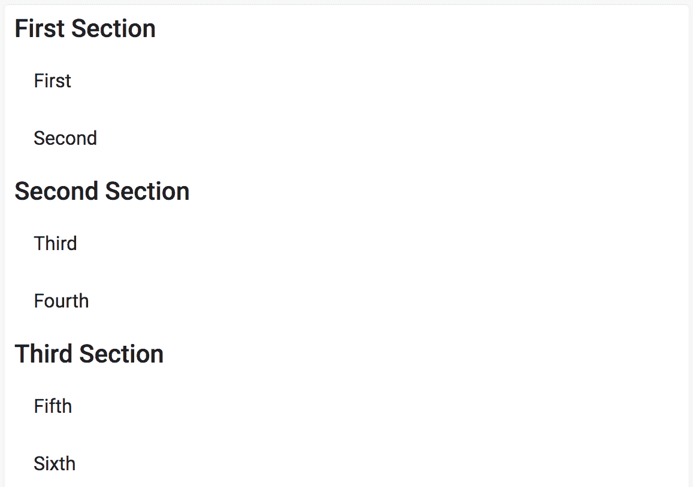

# 参见

+   `List`演示：[`material-ui.com/demos/lists/`](https://material-ui.com/demos/lists/)

+   `Typography` API 文档：[`material-ui.com/api/typography/`](https://material-ui.com/api/typography/)

# 嵌套列表

列表可以嵌套。当你需要渲染大量项目时，这很有用。你不必一次性显示所有内容，而只需显示这些项目类别。然后用户可以点击这些类别来显示项目。

# 如何实现...

假设你有两个项目类别。当用户点击一个类别时，该类别中的项目应该显示出来。以下是通过使用 `List` 组件来实现此功能的代码：

```js
import React, { useState, Fragment } from 'react';

import List from '@material-ui/core/List';
import ListItem from '@material-ui/core/ListItem';
import ListItemText from '@material-ui/core/ListItemText';
import ListItemIcon from '@material-ui/core/ListItemIcon';
import Collapse from '@material-ui/core/Collapse';

import ExpandLessIcon from '@material-ui/icons/ExpandLess';
import ExpandMoreIcon from '@material-ui/icons/ExpandMore';
import InboxIcon from '@material-ui/icons/Inbox';
import MailIcon from '@material-ui/icons/Mail';
import ContactsIcon from '@material-ui/icons/Contacts';
import ContactMailIcon from '@material-ui/icons/ContactMail';

const ExpandIcon = ({ expanded }) =>
  expanded ? <ExpandLessIcon /> : <ExpandMoreIcon />;

export default function NestedLists() {
  const [items, setItems] = useState([
    {
      name: 'Messages',
      Icon: InboxIcon,
      expanded: false,
      children: [
        { name: 'First Message', Icon: MailIcon },
        { name: 'Second Message', Icon: MailIcon }
      ]
    },
    {
      name: 'Contacts',
      Icon: ContactsIcon,
      expanded: false,
      children: [
        { name: 'First Contact', Icon: ContactMailIcon },
        { name: 'Second Contact', Icon: ContactMailIcon }
      ]
    }
  ]);

  const onClick = index => () => {
    const newItems = [...items];
    const item = items[index];

    newItems[index] = { ...item, expanded: !item.expanded };

    setItems(newItems);
  };

  return (
    <List>
      {items.map(({ Icon, ...item }, index) => (
        <Fragment key={index}>
          <ListItem button onClick={onClick(index)}>
            <ListItemIcon>
              <Icon />
            </ListItemIcon>
            <ListItemText primary={item.name} />
            <ExpandIcon expanded={item.expanded} />
          </ListItem>
          <Collapse in={item.expanded}>
            {item.children.map(child => (
              <ListItem key={child.name} button dense>
                <ListItemIcon>
                  <child.Icon />
                </ListItemIcon>
                <ListItemText primary={child.name} />
              </ListItem>
            ))}
          </Collapse>
        </Fragment>
      ))}
    </List>
  );
}
```

当你首次加载屏幕时，你会看到以下内容：

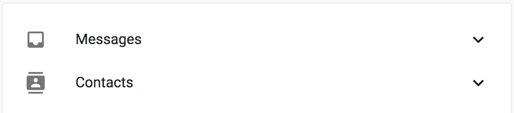

如果你点击每个这些类别，你会看到以下内容：

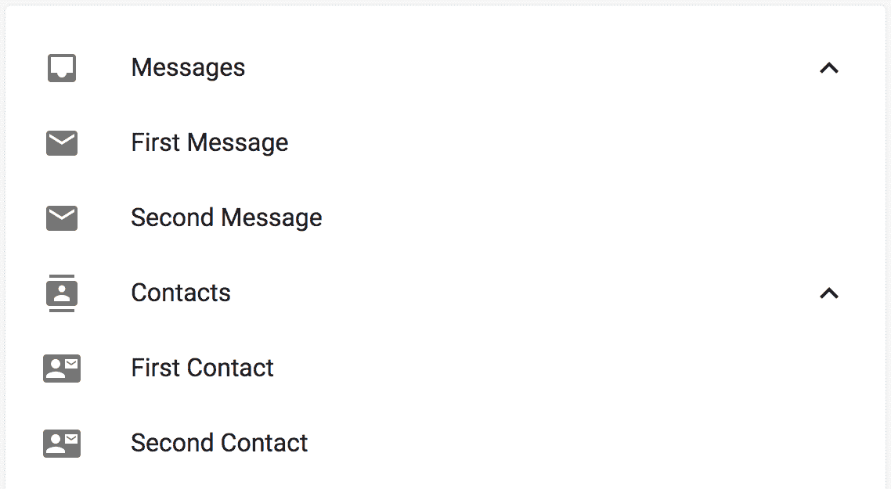

# 它是如何工作的...

当你点击一个类别时，向下箭头图标会变成向上箭头。在类别下方，显示属于该类别的列表项。让我们分析一下代码中发生的事情，从组件状态开始：

```js
const [items, setItems] = useState([
  {
    name: 'Messages',
    Icon: InboxIcon,
    expanded: false,
    children: [
      { name: 'First Message', Icon: MailIcon },
      { name: 'Second Message', Icon: MailIcon }
    ]
  },
  {
    name: 'Contacts',
    Icon: ContactsIcon,
    expanded: false,
    children: [
      { name: 'First Contact', Icon: ContactMailIcon },
      { name: 'Second Contact', Icon: ContactMailIcon }
    ]
  }
]);
```

项目数组中的每个对象代表一个列表类别。在这种情况下，类别是 `Messages` 和 `Contacts`。`Icon` 属性是用于渲染类别的图标组件。`expanded` 属性确定展开箭头图标的状态，以及类别中的项目是否应该显示。

`children` 数组包含属于该类别的项目。它们具有 `name` 和 `Icon` 属性，就像类别项目一样，因为它们都是使用 `ListItem` 组件渲染的。

接下来，让我们看看用于渲染每个类别及其子项的标记：

```js
<Fragment key={index}>
  <ListItem button onClick={onClick(index)}>
    <ListItemIcon>
      <Icon />
    </ListItemIcon>
    <ListItemText primary={item.name} />
    <ExpandIcon expanded={item.expanded} />
  </ListItem>
  <Collapse in={item.expanded}>
    {item.children.map(child => (
      <ListItem key={child.name} button dense>
        <ListItemIcon>
          <child.Icon />
        </ListItemIcon>
        <ListItemText primary={child.name} />
      </ListItem>
    ))}
  </Collapse>
</Fragment>
```

类别 `ListItem` 组件有一个 `onClick` 处理器，用于切换类别的 `expanded` 状态。接下来，使用 `Collapse` 组件根据 `expanded` 的值来控制类别子项的可见性。

# 还有更多...

你可以通过区分子项的外观来改善嵌套列表的外观。目前，类别项目和子项之间的唯一区别是类别项目有展开和折叠箭头。

通常，列表项会缩进以表示它们是另一个项目层次结构的一部分。让我们创建一个样式，允许你缩进子项：

```js
const useStyles = makeStyles(theme => ({
  subItem: { paddingLeft: theme.spacing(3) }
}));
```

`paddingLeft` 样式属性会将列表项中的所有内容向右移动。现在，让我们将这个类应用到 `subItem` 上，同时使项目比类别项目更小：

```js
<ListItem
  key={child.name}
  className={classes.subItem}
  button
  dense
>
  <ListItemIcon>
    <child.Icon />
  </ListItemIcon>
  <ListItemText primary={child.name} />
</ListItem>
```

通过将 `dense` 和 `className` 属性添加到 `ListItem` 中，用户应该能够更容易地区分类别及其子项：

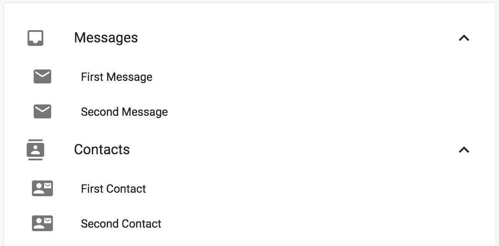

# 相关内容

+   `List` 示例：[`material-ui.com/demos/lists/`](https://material-ui.com/demos/lists/)

+   `Collapse` API 文档：[`material-ui.com/api/collapse/`](https://material-ui.com/api/collapse/)

# 列表控件

列表项可以是可点击的，导致状态改变，或者跟随链接，或者完全是其他操作。这是项目的主要操作。你可以在列表上拥有次要操作，称为控件。这些是你可能会执行的一些常见操作，具体取决于项目的类型。

# 如何做到这一点...

假设你有一个设备列表。当你点击列表项时，它可能会带你到设备的详细信息页面。每个设备都有可以开启或关闭的蓝牙连接。这是在项目中渲染的很好的候选次要操作。以下是实现此功能的代码：

```js
import React, { useState } from 'react';

import List from '@material-ui/core/List';
import ListItem from '@material-ui/core/ListItem';
import ListItemText from '@material-ui/core/ListItemText';
import ListItemIcon from '@material-ui/core/ListItemIcon';
import ListItemSecondaryAction from '@material-ui/core/ListItemSecondaryAction';
import IconButton from '@material-ui/core/IconButton';

import BluetoothIcon from '@material-ui/icons/Bluetooth';
import BluetoothDisabledIcon from '@material-ui/icons/BluetoothDisabled';
import DevicesIcon from '@material-ui/icons/Devices';

const MaybeBluetoothIcon = ({ bluetooth }) =>
  bluetooth ? <BluetoothIcon /> : <BluetoothDisabledIcon />;

export default function ListControls() {
  const [items, setItems] = useState([
    {
      name: 'Device 1',
      bluetooth: true,

      Icon: DevicesIcon
    },
    {
      name: 'Device 2',
      bluetooth: true,

      Icon: DevicesIcon
    },
    {
      name: 'Device 3',
      bluetooth: true,

      Icon: DevicesIcon
    }
  ]);

  const onBluetoothClick = index => () => {
    const newItems = [...items];
    const item = items[index];

    newItems[index] = { ...item, bluetooth: !item.bluetooth };

    setItems(newItems);
  };

  return (
    <List>
      {items.map(({ Icon, ...item }, index) => (
        <ListItem key={index} button>
          <ListItemIcon>
            <Icon />
          </ListItemIcon>
          <ListItemText primary={item.name} />
          <ListItemSecondaryAction>
            <IconButton
              onClick={onBluetoothClick(index, 'bluetooth')}
            >
              <MaybeBluetoothIcon bluetooth={item.bluetooth} />
            </IconButton>
          </ListItemSecondaryAction>
        </ListItem>
      ))}
    </List>
  );
}
```

这是屏幕首次加载时的样子：

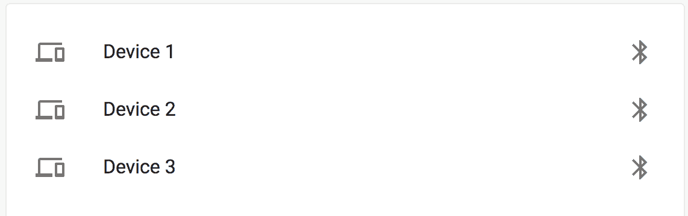

你可以通过点击图标按钮来切换其中一个项目的蓝牙状态。以下是切换第一个项目蓝牙状态后的样子：

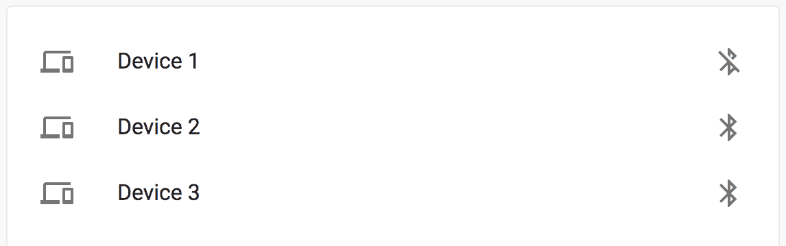

蓝牙图标已更改以表示 `disabled` 状态。再次点击图标将启用蓝牙。

# 它是如何工作的...

让我们看看用于渲染每个列表项的标记：

```js
<ListItem key={index} button>
  <ListItemIcon>
    <Icon />
  </ListItemIcon>
  <ListItemText primary={item.name} />
  <ListItemSecondaryAction>
    <IconButton
      onClick={onBluetoothClick(index, 'bluetooth')}
    >
      <MaybeBluetoothIcon bluetooth={item.bluetooth} />
    </IconButton>
  </ListItemSecondaryAction>
</ListItem>
```

`ListItemSecondaryAction` 组件被用作列表项中任何控件的外壳。在这个例子中，`IconButton` 被用作控件。它使用 `MaybeBluetoothIcon` 组件显示根据项目状态的不同图标。`onBluetoothClick()` 函数用于返回项目的处理函数。让我们看看这个函数：

```js
const onBluetoothClick = index => () => {
  const newItems = [...items];
  const item = items[index];

  newItems[index] = { ...item, bluetooth: !item.bluetooth };

  setItems(newItems);
};
```

在 `items` 数组中查找设备项。然后，切换蓝牙状态，并返回新的 `items` 数组以设置为新状态。这导致列表项控件中的图标更新。

# 还有更多...

你可以在列表项中拥有多个控件。例如，假设除了切换设备的蓝牙状态外，用户还可能执行切换设备的 `power` 状态的常见操作。当设备关闭电源时，列表项和蓝牙控件应该显示。

避免在列表项中拥有太多的控件作为次要操作。这样做会减少用户轻松访问一两个常见操作的便利性。

让我们从为你的组件状态中的每个项目添加一个新的 `power` 状态开始：

```js
const [items, setItems] = useState([
  {
    name: 'Device 1',
    bluetooth: true,
    power: true,
    Icon: DevicesIcon
  },
  {
    name: 'Device 2',
    bluetooth: true,
    power: true,
    Icon: DevicesIcon
  },
  {
    name: 'Device 3',
    bluetooth: true,
    power: true,
    Icon: DevicesIcon
  }
]);
```

接下来，让我们创建一个可以处理更新蓝牙和项目 `power` 状态的切换点击处理程序：

```js
const onToggleClick = (index, prop) => () => {
  const newItems = [...items];
  const item = items[index];

  newItems[index] = { ...item, [prop]: !item[prop] };

  setItems(newItems);
};
```

这与 `onBluetoothClick()` 处理程序非常相似。现在，它接受一个额外的 `prop` 参数。这用于告诉函数更新哪个属性 - `bluetooth` 或 `power`。最后，让我们看看更新的 `ListItem` 标记：

```js
<ListItem key={index} disabled={!item.power} button>
  <ListItemIcon>
    <Icon />
  </ListItemIcon>
  <ListItemText primary={item.name} />
  <ListItemSecondaryAction>
    <IconButton
      onClick={onToggleClick(index, 'bluetooth')}
      disabled={!item.power}
    >
      <MaybeBluetoothIcon bluetooth={item.bluetooth} />
    </IconButton>
    <IconButton onClick={onToggleClick(index, 'power')}>
      <PowerSettingsNewIcon />
    </IconButton>
  </ListItemSecondaryAction>
</ListItem>
```

变更可以总结如下：

+   `ListItem` 的 `disabled` 属性取决于项目的 `power` 状态。

+   另有一个用于切换项目 `power` 状态的 `IconButton` 控件。

+   `onToggleClick()` 函数被两个控件用来切换项目的状态。

这是首次加载时的屏幕外观：

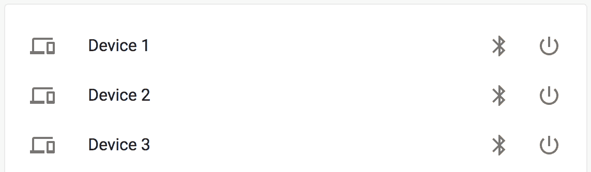

当你点击电源图标时，列表项和蓝牙按钮将变为禁用状态。以下是第一个项目关闭电源时的样子：

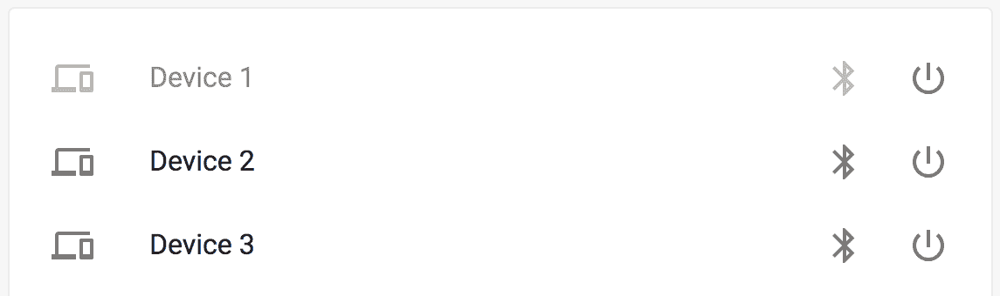

# 参考也

+   `ListItemSecondaryAction` API 文档：[`material-ui.com/api/list-item-secondary-action/`](https://material-ui.com/api/list-item-secondary-action/)

+   `IconButton` API 文档：[`material-ui.com/api/icon-button/`](https://material-ui.com/api/icon-button/)

# 滚动列表

当你的列表中包含有限数量的项目时，你可以安全地遍历项目数据并渲染`ListItem`组件。当你有超过 1,000 个项目的列表时，这就会成为一个问题。你可以快速渲染这些项目，但这么多项目在**文档对象模型**（**DOM**）中会消耗大量的浏览器资源，并可能导致用户面临不可预测的性能挑战。解决方案是使用`react-virtualized`虚拟化你的 Material-UI 列表。

# 如何做到这一点...

假设你有一个包含 1,000 个项目的列表。你希望在具有固定高度的列表中渲染这些项目。为了为用户提供可预测的性能特性，你只想渲染用户在滚动列表时实际可见的项目。以下是代码：

```js
import React, { useState } from 'react';
import { List as VirtualList, AutoSizer } from 'react-virtualized';

import { makeStyles } from '@material-ui/styles';
import List from '@material-ui/core/List';
import ListItem from '@material-ui/core/ListItem';
import ListItemText from '@material-ui/core/ListItemText';
import Paper from '@material-ui/core/Paper';

const useStyles = makeStyles(theme => ({
  list: {
    height: 300
  },
  paper: {
    margin: theme.spacing(3)
  }
}));

function* genItems() {
  for (let i = 1; i <= 1000; i++) {
    yield `Item ${i}`;
  }
}

export default function ScrollingLists() {
  const classes = useStyles();
  const [items] = useState([...genItems()]);

  const rowRenderer = ({ index, isScrolling, key, style }) => {
    const item = items[index];

    return (
      <ListItem button key={key} style={style}>
        <ListItemText primary={isScrolling ? '...' : item} />
      </ListItem>
    );
  };

  return (
    <Paper className={classes.paper}>
      <List className={classes.list}>
        <AutoSizer disableHeight>
          {({ width }) => (
            <VirtualList
              width={width}
              height={300}
              rowHeight={50}
              rowCount={items.length}
              rowRenderer={rowRenderer}
            />
          )}
        </AutoSizer>
      </List>
    </Paper>
  );
}
```

当你首次加载屏幕时，你将看到以下内容：

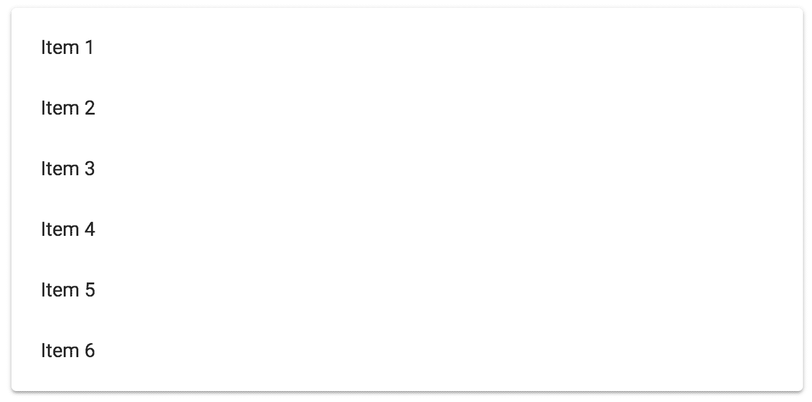

当你滚动浏览列表时，你将看到以下内容：

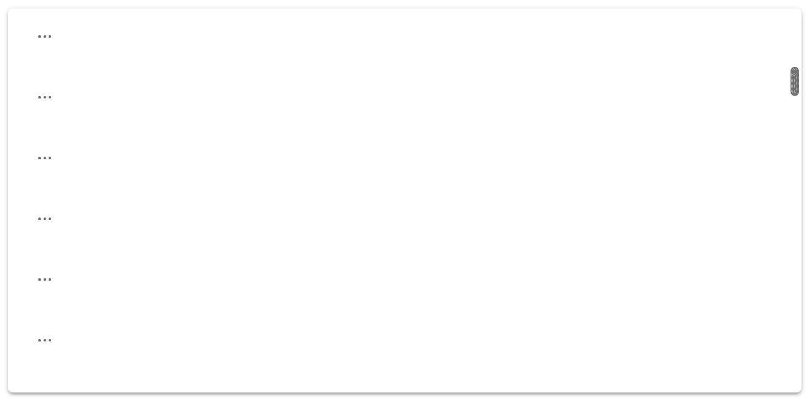

最后，这是列表底部的样子：

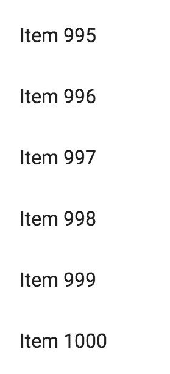

# 它是如何工作的...

首先，让我们看看`items`状态是如何生成的。首先，有一个`genItems()`生成器函数：

```js
function* genItems() {
  for (let i = 1; i <= 1000; i++) {
    yield `Item ${i}`;
  }
}
```

然后，使用扩展运算符将生成的`items`转换为组件状态中的数组：

```js
const [items] = useState([...genItems()]);
```

接下来，让我们看看`rowRenderer()`函数：

```js
const rowRenderer = ({ index, isScrolling, key, style }) => {
  const item = items[index];

  return (
    <ListItem button key={key} style={style}>
      <ListItemText primary={isScrolling ? '...' : item} />
    </ListItem>
  );
};
```

此函数返回在给定索引处应渲染的`ListItem`组件。而不是手动将此组件映射到`items`上，`react-virtualized`中的`List`组件会根据用户如何滚动列表来为你安排调用它的时间。

传递给此函数的`key`和`style`值是`react-virtualized`正确工作所必需的。例如，`style`值用于控制项目在滚动时的可见性。`isScrolling`值用于在列表被积极滚动时渲染不同的数据。例如，想象一下，在列表项中除了文本标签之外，你还有一个图标，以及其他所有基于状态的控制。在滚动过程中尝试渲染这些内容是昂贵且浪费的。相反，你可以渲染一些资源消耗较少的内容，例如占位符字符串：`'...'`。

最后，让我们检查用于渲染此列表的标记：

```js
<List className={classes.list}>
  <AutoSizer disableHeight>
    {({ width }) => (
      <VirtualList
        width={width}
        height={300}
        rowHeight={50}
        rowCount={items.length}
        rowRenderer={rowRenderer}
      />
    )}
  </AutoSizer>
</List>
```

`列表`组件是其他所有内容的容器。接下来，`react-virtualized`中的`AutoSizer`组件确定列表的宽度，这是作为`VirtualList`属性所需的。

使用别名`VirtualList`从`react-virtualized`导入`List`。这样做是为了避免与`material-ui`中的`List`命名冲突。如果你更喜欢，你也可以将`List`从`material-ui`导入为一个别名。

`react-virtualized`中的`List`组件还接受列表的高度、每行的高度和行数，以确定要渲染哪些行。有了这个，你永远不必担心由于列表组件包含太多项目而导致应用程序的性能问题。

# 参见

+   React Virtualized 文档：[`bvaughn.github.io/react-virtualized/`](https://bvaughn.github.io/react-virtualized/)

+   `列表`演示：[`material-ui.com/demos/lists/`](https://material-ui.com/demos/lists/)
