# 表格 - 显示复杂集合数据

在本章中，你将学习以下主题：

+   状态化表格

+   可排序的列

+   过滤行

+   选择行

+   行操作

# 简介

如果你的应用程序需要显示表格数据，你可以使用 Material-UI 的`Table`组件及其所有支持组件。与你在其他 React 库中可能看到或使用过的网格组件不同，Material-UI 组件是无偏见的。这意味着你必须编写自己的代码来控制表格数据。好处是，`Table`组件不会妨碍你，让你能够以自己的方式实现。

# 状态化表格

使用`Table`组件时，很少会遇到静态标记来定义表格的行数据。相反，组件状态将映射到构成你的表格数据的行。例如，你可能有一个从 API 获取数据并希望在表格中显示的组件。

# 如何实现...

假设你有一个从 API 端点获取数据的组件。当数据加载时，你希望在 Material-UI 的`Table`组件中显示表格数据。以下是代码的样子：

```js
import React, { useState, useEffect } from 'react';

import { makeStyles } from '@material-ui/styles';
import Table from '@material-ui/core/Table';
import TableBody from '@material-ui/core/TableBody';
import TableCell from '@material-ui/core/TableCell';
import TableHead from '@material-ui/core/TableHead';
import TableRow from '@material-ui/core/TableRow';
import Paper from '@material-ui/core/Paper';

const fetchData = () =>
  new Promise(resolve => {
    const items = [
      {
        id: 1,
        name: 'First Item',
        created: new Date(),
        high: 2935,
        low: 1924,
        average: 2429.5
      },
      {
        id: 2,
        name: 'Second Item',
        created: new Date(),
        high: 439,
        low: 231,
        average: 335
      },
      {
        id: 3,
        name: 'Third Item',
        created: new Date(),
        high: 8239,
        low: 5629,
        average: 6934
      },
      {
        id: 4,
        name: 'Fourth Item',
        created: new Date(),
        high: 3203,
        low: 3127,
        average: 3165
      },
      {
        id: 5,
        name: 'Fifth Item',
        created: new Date(),
        high: 981,
        low: 879,
        average: 930
      }
    ];

    setTimeout(() => resolve(items), 1000);
  });

const usePaperStyles = makeStyles(theme => ({
  root: { margin: theme.spacing(2) }
}));

export default function StatefulTables() {
  const classes = usePaperStyles();

  const [items, setItems] = useState([]);

  useEffect(() => {
    fetchData().then(items => {
      setItems(items);
    });
  }, []);

  return (
    <Paper className={classes.root}>
      <Table>
        <TableHead>
          <TableRow>
            <TableCell>Name</TableCell>
            <TableCell>Created</TableCell>
            <TableCell align="right">High</TableCell>
            <TableCell align="right">Low</TableCell>
            <TableCell align="right">Average</TableCell>
          </TableRow>
        </TableHead>
        <TableBody>
          {items.map(item => {
            return (
              <TableRow key={item.id}>
                <TableCell component="th" scope="row">
                  {item.name}
                </TableCell>
                <TableCell>{item.created.toLocaleString()}</TableCell>
                <TableCell align="right">{item.high}</TableCell>
                <TableCell align="right">{item.low}</TableCell>
                <TableCell align="right">{item.average}</TableCell>
              </TableRow>
            );
          })}
        </TableBody>
      </Table>
    </Paper>
  );
}
```

当你加载屏幕时，你将在一秒后看到一个填充了数据的表格：

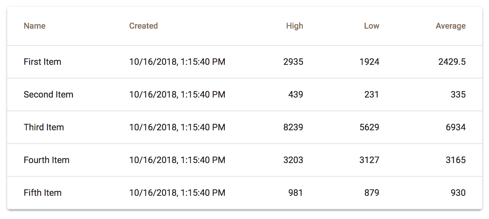

# 它是如何工作的...

让我们从查看`fetchData()`函数开始，该函数解析最终设置为组件状态的数据：

```js
const fetchData = () =>
  new Promise(resolve => {
    const items = [
      {
        id: 1,
        name: 'First Item',
        created: new Date(),
        high: 2935,
        low: 1924,
        average: 2429.5
      },
      {
        id: 2,
        name: 'Second Item',
        created: new Date(),
        high: 439,
        low: 231,
        average: 335
      },
      ...
    ];

    setTimeout(() => resolve(items), 1000);
  });
```

此函数返回一个`Promise`，在一秒后解析为一个对象数组。其想法是模拟一个使用`fetch()`调用真实 API 的函数。

为了简洁起见，数组中显示的对象被截断了。

接下来，让我们看看初始组件状态以及你的组件挂载时会发生什么：

```js
const [items, setItems] = useState([]);

useEffect(() => {
  fetchData().then(items => {
    setItems(items);
  });
}, []);
```

`items`状态表示要在`Table`组件内渲染的表格行。当你的组件挂载时，会调用`fetchData()`，当`Promise`解析时，`items`状态被设置。最后，让我们看看负责渲染表格行的标记：

```js
<Table>
  <TableHead>
    <TableRow>
      <TableCell>Name</TableCell>
      <TableCell>Created</TableCell>
      <TableCell align="right">High</TableCell>
      <TableCell align="right">Low</TableCell>
      <TableCell align="right">Average</TableCell>
    </TableRow>
  </TableHead>
  <TableBody>
    {items.map(item => {
      return (
        <TableRow key={item.id}>
          <TableCell component="th" scope="row">
            {item.name}
          </TableCell>
          <TableCell>{item.created.toLocaleString()}</TableCell>
          <TableCell align="right">{item.high}</TableCell>
          <TableCell align="right">{item.low}</TableCell>
          <TableCell align="right">{item.average}</TableCell>
        </TableRow>
      );
    })}
  </TableBody>
</Table>
```

`Table`组件通常有两个子组件——一个`TableHead`组件和一个`TableBody`组件。在`TableHead`内部，你会找到一个包含多个`TableCell`组件的`TableRow`组件。这些是表格列标题。在`TableBody`内部，你会看到`items`状态被映射到`TableRow`和`TableCell`组件。当`items`状态改变时，行也会改变。你已经在实际操作中看到了这一点，因为`items`状态默认为空数组。在 API 数据解析后，`items`状态改变，行在屏幕上可见。

# 还有更多...

这个示例的一个次优方面是用户在等待表格数据加载时的体验。提前显示列标题是可以的，因为你事先知道它们是什么，用户也可能知道。需要的是某种指示器，表明实际的行数据确实正在加载。

解决此问题的一种方法是在列标题下方添加一个环形进度指示器。这应该有助于用户理解他们不仅正在等待数据加载，而且具体是等待表格行数据，多亏了进度指示器的位置。

首先，让我们介绍一个新的组件来显示`CircularProgress`组件和一些新的样式：

```js
const usePaperStyles = makeStyles(theme => ({
  root: { margin: theme.spacing(2), textAlign: 'center' }
}));

const useProgressStyles = makeStyles(theme => ({
  progress: { margin: theme.spacing(2) }
}));

function MaybeLoading({ loading }) {
  const classes = useProgressStyles();
  return loading ? (
    <CircularProgress className={classes.progress} />
  ) : null;
}
```

新增了一种应用于`CircularProgress`组件的`progress`样式。这为进度指示器添加了`margin`。`textAlign`属性已被添加到`root`样式，以便进度指示器在`Paper`组件内水平居中。如果`loading`属性为`true`，则`MaybeLoading`组件会渲染`CircularProgress`组件。

这意味着你现在必须跟踪 API 调用的`loading`状态。以下是新的状态，默认为`true`：

```js
const [loading, setLoading] = useState(true);
```

当 API 调用返回时，您可以设置`loading`状态为`false`：

```js
useEffect(() => {
  fetchData().then(items => {
    setItems(items);
    setLoading(false);
  });
}, []);
```

最后，你需要在`Table`组件之后渲染`MaybeLoading`组件：

```js
<Paper className={classes.root}>
  <Table>
    ...
  </Table>
  <MaybeLoading loading={loading} />
</Paper>
```

当您的用户等待表格数据加载时，他们会看到以下内容：

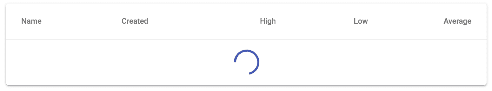

# 参见

+   `Table` API 文档：[`material-ui.com/api/table/`](https://material-ui.com/api/table/)

# 可排序列

Material-UI 表格具有帮助您实现可排序列的工具。如果您在应用程序中渲染`Table`组件，您的用户可能会期望能够按列排序表格数据。

# 如何实现...

当用户点击列标题时，应该有一个视觉指示表明表格行现在按此列排序，行顺序应改变。再次点击时，列应以相反的顺序出现。以下是代码：

```js
import React, { useState } from 'react';

import { makeStyles } from '@material-ui/styles';
import Table from '@material-ui/core/Table';
import TableBody from '@material-ui/core/TableBody';
import TableCell from '@material-ui/core/TableCell';
import TableHead from '@material-ui/core/TableHead';
import TableRow from '@material-ui/core/TableRow';
import TableSortLabel from '@material-ui/core/TableSortLabel';
import Paper from '@material-ui/core/Paper';

const comparator = (prop, desc = true) => (a, b) => {
  const order = desc ? -1 : 1;

  if (a[prop] < b[prop]) {
    return -1 * order;
  }

  if (a[prop] > b[prop]) {
    return 1 * order;
  }

  return 0 * order;
};

const useStyles = makeStyles(theme => ({
  root: { margin: theme.spacing(2), textAlign: 'center' }
}));

export default function SortableColumns() {
  const classes = useStyles();
  const [columns, setColumns] = useState([
    { name: 'Name', active: false },
    { name: 'Created', active: false },
    { name: 'High', active: false, numeric: true },
    { name: 'Low', active: false, numeric: true },
    { name: 'Average', active: false, numeric: true }
  ]);
  const [rows, setRows] = useState([
    {
      id: 1,
      name: 'First Item',
      created: new Date(),
      high: 2935,
      low: 1924,
      average: 2429.5
    },
    {
      id: 2,
      name: 'Second Item',
      created: new Date(),
      high: 439,
      low: 231,
      average: 335
    },
    {
      id: 3,
      name: 'Third Item',
      created: new Date(),
      high: 8239,
      low: 5629,
      average: 6934
    },
    {
      id: 4,
      name: 'Fourth Item',
      created: new Date(),
      high: 3203,
      low: 3127,
      average: 3165
    },
    {
      id: 5,
      name: 'Fifth Item',
      created: new Date(),
      high: 981,
      low: 879,
      average: 930
    }
  ]);

  const onSortClick = index => () => {
    setColumns(
      columns.map((column, i) => ({
        ...column,
        active: index === i,
        order:
          (index === i &&
            (column.order === 'desc' ? 'asc' : 'desc')) ||
          undefined
      }))
    );

    setRows(
      rows
        .slice()
        .sort(
          comparator(
            columns[index].name.toLowerCase(),
            columns[index].order === 'desc'
          )
        )
    );
  };

  return (
    <Paper className={classes.root}>
      <Table>
        <TableHead>
          <TableRow>
            {columns.map((column, index) => (
              <TableCell
                key={column.name}
                align={column.numeric ? 'right' : 'inherit'}
              >
                <TableSortLabel
                  active={column.active}
                  direction={column.order}
                  onClick={onSortClick(index)}
                >
                  {column.name}
                </TableSortLabel>
              </TableCell>
            ))}
          </TableRow>
        </TableHead>
        <TableBody>
          {rows.map(row => (
            <TableRow key={row.id}>
              <TableCell component="th" scope="row">
                {row.name}
              </TableCell>
              <TableCell>{row.created.toLocaleString()}</TableCell>
              <TableCell align="right">{row.high}</TableCell>
              <TableCell align="right">{row.low}</TableCell>
              <TableCell align="right">{row.average}</TableCell>
            </TableRow>
          ))}
        </TableBody>
      </Table>
    </Paper>
  );
}
```

如果你点击名称列标题，你会看到以下内容：

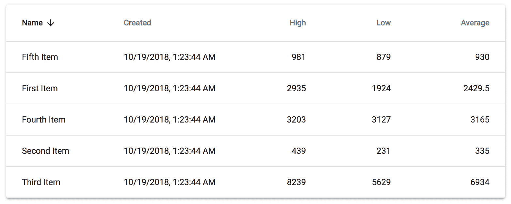

列会改变以指示排序顺序。如果您再次点击名称列，排序顺序将反转：

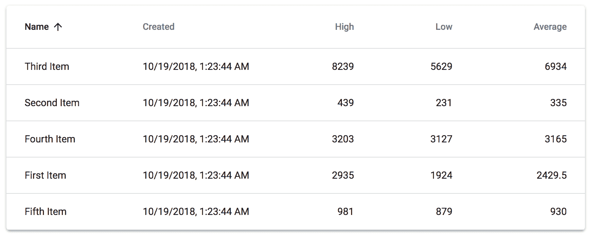

# 它是如何工作的...

让我们分解用于渲染此表格的代码，从用于渲染列标题的标记开始：

```js
<TableHead>
  <TableRow>
    {columns.map((column, index) => (
      <TableCell
        key={column.name}
        align={column.numeric ? 'right' : 'inherit'}
      >
        <TableSortLabel
          active={column.active}
          direction={column.order}
          onClick={onSortClick(index)}
        >
          {column.name}
        </TableSortLabel>
      </TableCell>
    ))}
  </TableRow>
</TableHead>
```

表格中的每一列都在`columns`状态中定义。此数组映射到`TableCell`组件。在每个`TableCell`内部，有一个`TableSortLabel`组件。当它是排序的激活列时，此组件会使列标题文本加粗，并在文本右侧添加排序箭头。`TableSortLabel`接受`active`、`direction`和`onClick`属性。`active`属性基于列的`active`状态，当列被点击时改变。`direction`属性确定对于给定列，行是按升序还是降序排序。`onClick`属性接受一个事件处理器，当列被点击时，它会进行必要的状态更改。以下是`onSortClick()`处理器：

```js
const onSortClick = index => () => {
  setColumns(
    columns.map((column, i) => ({
      ...column,
      active: index === i,
      order:
        (index === i &&
          (column.order === 'desc' ? 'asc' : 'desc')) ||
        undefined
    }))
  );

  setRows(
    rows
      .slice()
      .sort(
        comparator(
          columns[index].name.toLowerCase(),
          columns[index].order === 'desc'
        )
      )
  );
};
```

这个函数接受一个`index`参数——列索引——并返回一个新的列函数。返回的函数有两个目的：

1.  为了更新列状态，以便正确标记为激活的列，并具有正确的排序方向

1.  为了更新行状态，使表格行按正确顺序排列

一旦这些状态变化已经完成，`active`列和表格行将反映这些变化。接下来要查看的最后一段代码是`comparator()`函数。这是一个高阶函数，它接受一个列名，并返回一个新的函数，该函数可以被传递给`Array.sort()`以按给定列对对象数组进行排序：

```js
const comparator = (prop, desc = true) => (a, b) => {
  const order = desc ? -1 : 1;

  if (a[prop] < b[prop]) {
    return -1 * order;
  }

  if (a[prop] > b[prop]) {
    return 1 * order;
  }

  return 0 * order;
};
```

这个函数足够通用，可以用于你应用中的任何表格。在这种情况下，列名和顺序是从组件状态传递给`comparator()`的。随着组件状态的变化，`comparator()`中的排序行为也会发生变化。

# 还有更多...

如果你的数据在从 API 到达时已经按特定列排序，你会怎么办？如果是这种情况，你可能会想在用户开始与表格交互之前，指出哪些列的行是按什么方向排序的。

要这样做，你只需要更改默认的列状态。例如，假设平均值列默认按降序排序。以下是你的初始`column`状态的外观：

```js
const [columns, setColumns] = useState([
  { name: 'Name', active: false },
  { name: 'Created', active: false },
  { name: 'High', active: false, numeric: true },
  { name: 'Low', active: false, numeric: true },
  { name: 'Average', active: true, numeric: true }
]);
```

平均值列默认为激活状态。由于默认为升序，因此不需要指定顺序。以下是屏幕首次加载时的表格外观：

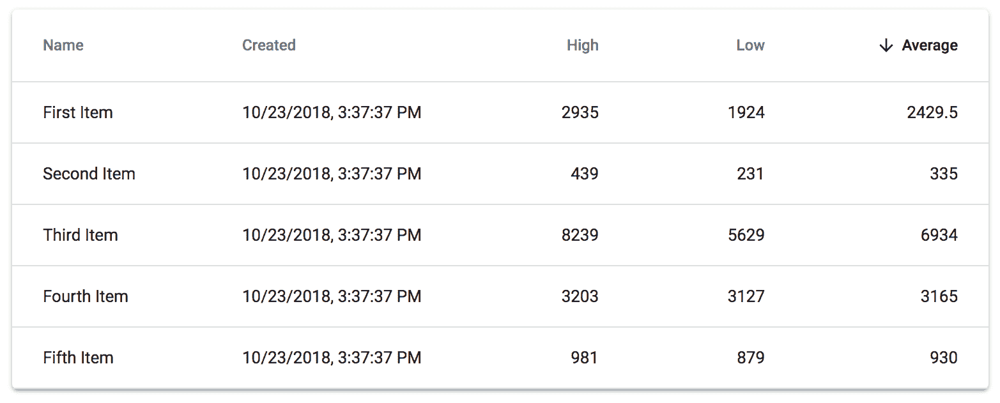

# 相关内容

+   `Table`演示：[`material-ui.com/demos/tables/`](https://material-ui.com/demos/tables/)

# 过滤行

在有表格的地方，信息量过多是潜在的问题。这就是为什么在表格中添加搜索功能是个好主意。它允许用户在输入时从表格中删除不相关的行。

# 如何实现...

假设你有一个包含许多行的表格，这意味着用户将很难滚动查看整个表格。为了让他们更容易操作，你决定在你的表格中添加一个搜索功能，通过检查搜索文本是否存在于名称列中来过滤行。以下是代码：

```js
import React, { useState, useEffect, Fragment } from 'react';

import { makeStyles } from '@material-ui/styles';
import { withStyles } from '@material-ui/core/styles';
import Table from '@material-ui/core/Table';
import TableBody from '@material-ui/core/TableBody';
import TableCell from '@material-ui/core/TableCell';
import TableHead from '@material-ui/core/TableHead';
import TableRow from '@material-ui/core/TableRow';
import Paper from '@material-ui/core/Paper';
import CircularProgress from '@material-ui/core/CircularProgress';
import Input from '@material-ui/core/Input';
import InputLabel from '@material-ui/core/InputLabel';
import InputAdornment from '@material-ui/core/InputAdornment';
import FormControl from '@material-ui/core/FormControl';
import TextField from '@material-ui/core/TextField';

import SearchIcon from '@material-ui/icons/Search';

const fetchData = () =>
  new Promise(resolve => {
    const items = [
      {
        id: 1,
        name: 'First Item',
        created: new Date(),
        high: 2935,
        low: 1924,
        average: 2429.5
      },
      {
        id: 2,
        name: 'Second Item',
        created: new Date(),
        high: 439,
        low: 231,
        average: 335
      },
      {
        id: 3,
        name: 'Third Item',
        created: new Date(),
        high: 8239,
        low: 5629,
        average: 6934
      },
      {
        id: 4,
        name: 'Fourth Item',
        created: new Date(),
        high: 3203,
        low: 3127,
        average: 3165
      },
      {
        id: 5,
        name: 'Fifth Item',
        created: new Date(),
        high: 981,
        low: 879,
        average: 930
      }
    ];

    setTimeout(() => resolve(items), 1000);
  });

const styles = theme => ({
  root: { margin: theme.spacing(2), textAlign: 'center' },
  progress: { margin: theme.spacing(2) },
  search: { marginLeft: theme.spacing(2) }
});
const useStyles = makeStyles(styles);

const MaybeLoading = withStyles(styles)(({ classes, loading }) =>
  loading ? <CircularProgress className={classes.progress} /> : null
);

export default function FilteringRows() {
  const classes = useStyles();
  const [search, setSearch] = useState('');
  const [items, setItems] = useState([]);
  const [loading, setLoading] = useState(true);

  useEffect(() => {
    fetchData().then(items => {
      setItems(items);
      setLoading(false);
    });
  }, []);

  const onSearchChange = e => {
    setSearch(e.target.value);
  };

  return (
    <Fragment>
      <TextField
        value={search}
        onChange={onSearchChange}
        className={classes.search}
        id="input-search"
        InputProps={{
          startAdornment: (
            <InputAdornment position="start">
              <SearchIcon />
            </InputAdornment>
          )
        }}
      />
      <Paper className={classes.root}>
        <Table>
          <TableHead>
            <TableRow>
              <TableCell>Name</TableCell>
              <TableCell>Created</TableCell>
              <TableCell align="right">High</TableCell>
              <TableCell align="right">Low</TableCell>
              <TableCell align="right">Average</TableCell>
            </TableRow>
          </TableHead>
          <TableBody>
            {items
              .filter(item => !search || item.name.includes(search))
              .map(item => {
                return (
                  <TableRow key={item.id}>
                    <TableCell component="th" scope="row">
                      {item.name}
                    </TableCell>
                    <TableCell>
                      {item.created.toLocaleString()}
                    </TableCell>
                    <TableCell align="right">{item.high}</TableCell>
                    <TableCell align="right">{item.low}</TableCell>
                    <TableCell align="right">
                      {item.average}
                    </TableCell>
                  </TableRow>
                );
              })}
          </TableBody>
        </Table>
        <MaybeLoading loading={loading} />
      </Paper>
    </Fragment>
  );
}
```

当屏幕首次加载时，表格和搜索输入字段看起来如下：

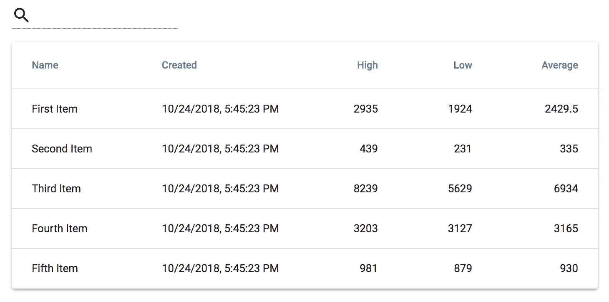

搜索输入位于表格上方。尝试输入一个过滤器字符串，例如 第四——你应该看到以下内容：

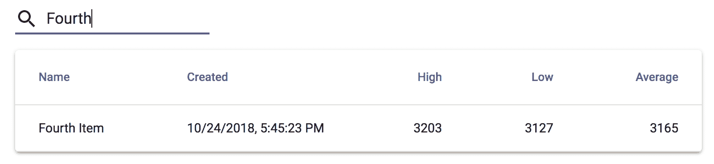

如果你从搜索输入中删除过滤器文本，表格数据中的所有行将再次渲染。

# 它是如何工作的...

让我们先看看`FilteringRows`组件的状态：

```js
const [search, setSearch] = useState('');
const [items, setItems] = useState([]);
const [loading, setLoading] = useState(true);
```

搜索字符串是实际过滤器，它会改变在`Table`元素中渲染的行。接下来，让我们看看渲染搜索输入的`TextField`组件：

```js
<TextField
  value={search}
  onChange={onSearchChange}
  className={classes.search}
  id="input-search"
  InputProps={{
    startAdornment: (
      <InputAdornment position="start">
        <SearchIcon />
      </InputAdornment>
    )
  }}
/>
```

`onSearchChange()` 函数负责在用户输入时维护搜索状态。你应该在过滤表格附近渲染搜索输入组件。在这个例子中，搜索输入的位置感觉像是属于表格的。

最后，让我们看看表格行是如何过滤和渲染的：

```js
<TableBody>
  {items
    .filter(item => !search || item.name.includes(search))
    .map(item => {
      return (
        <TableRow key={item.id}>
          <TableCell component="th" scope="row">
            {item.name}
          </TableCell>
          <TableCell>
            {item.created.toLocaleString()}
          </TableCell>
          <TableCell align="right">{item.high}</TableCell>
          <TableCell align="right">{item.low}</TableCell>
          <TableCell align="right">
            {item.average}
          </TableCell>
        </TableRow>
      );
    })}
</TableBody>
```

不同于直接在项目状态上调用 `map()`，使用 `filter()` 来生成一个与搜索标准匹配的项目数组。随着 `search` 状态的变化，`filter()` 调用会重复进行。检查项目是否匹配用户输入的条件是查看项目的 `name` 属性是否包含搜索字符串。但首先，你必须确保用户实际上正在进行过滤。例如，如果搜索字符串为空，则应返回每个项目。项目是如何被搜索的取决于你的应用程序——如果你想的话，你可以搜索每个项目的每个属性。

# 参见

+   `Table` 示例：[`material-ui.com/demos/tables/`](https://material-ui.com/demos/tables/)

# 选择行

用户经常需要与表格中的特定行进行交互。例如，他们可能会选择一行，然后执行使用所选行数据的操作。或者，用户选择多行，这会产生与他们的选择相关的新数据。使用 Material-UI 表格，你可以使用单个 `TableRow` 属性来标记选中的行。

# 如何做到这一点...

在这个例子中，假设用户需要能够在你的表格中选择多行。随着行的选择，屏幕上的另一个部分会更新，以显示反映所选行的数据。让我们首先看看显示所选表格行数据的 `Card` 组件：

```js
<Card className={classes.card}>
  <CardHeader title={`(${selections()}) rows selected`} />
  <CardContent>
    <Grid container direction="column">
      <Grid item>
        <Grid container justify="space-between">
          <Grid item>
            <Typography>Low</Typography>
          </Grid>
          <Grid item>
            <Typography>{selectedLow()}</Typography>
          </Grid>
        </Grid>
      </Grid>
      <Grid item>
        <Grid container justify="space-between">
          <Grid item>
            <Typography>High</Typography>
          </Grid>
          <Grid item>
            <Typography>{selectedHigh()}</Typography>
          </Grid>
        </Grid>
      </Grid>
      <Grid item>
        <Grid container justify="space-between">
          <Grid item>
            <Typography>Average</Typography>
          </Grid>
          <Grid item>
            <Typography>{selectedAverage()}</Typography>
          </Grid>
        </Grid>
      </Grid>
    </Grid>
  </CardContent>
</Card>
```

现在让我们看看其余的组件：

```js
import React, { useState, Fragment } from 'react';

import { makeStyles } from '@material-ui/styles';
import Typography from '@material-ui/core/Typography';
import Grid from '@material-ui/core/Grid';
import Table from '@material-ui/core/Table';
import TableBody from '@material-ui/core/TableBody';
import TableCell from '@material-ui/core/TableCell';
import TableHead from '@material-ui/core/TableHead';
import TableRow from '@material-ui/core/TableRow';
import Paper from '@material-ui/core/Paper';
import Card from '@material-ui/core/Card';
import CardContent from '@material-ui/core/CardContent';
import CardHeader from '@material-ui/core/CardHeader';

const useStyles = makeStyles(theme => ({
  root: { margin: theme.spacing.unit * 2, textAlign: 'center' },
  card: { margin: theme.spacing.unit * 2, maxWidth: 300 }
}));

export default function SelectingRows() {
  const classes = useStyles();
  const [columns, setColumns] = useState([
    { name: 'Name', active: false },
    { name: 'Created', active: false },
    { name: 'High', active: false, numeric: true },
    { name: 'Low', active: false, numeric: true },
    { name: 'Average', active: true, numeric: true }
  ]);
  const [rows, setRows] = useState([
    {
      id: 1,
      name: 'First Item',
      created: new Date(),
      high: 2935,
      low: 1924,
      average: 2429.5
    },
    {
      id: 2,
      name: 'Second Item',
      created: new Date(),
      high: 439,
      low: 231,
      average: 335
    },
    {
      id: 3,
      name: 'Third Item',
      created: new Date(),
      high: 8239,
      low: 5629,
      average: 6934
    },
    {
      id: 4,
      name: 'Fourth Item',
      created: new Date(),
      high: 3203,
      low: 3127,
      average: 3165
    },
    {
      id: 5,
      name: 'Fifth Item',
      created: new Date(),
      high: 981,
      low: 879,
      average: 930
    }
  ]);

  const onRowClick = id => () => {
    const newRows = [...rows];
    const index = rows.findIndex(row => row.id === id);
    const row = rows[index];

    newRows[index] = { ...row, selected: !row.selected };
    setRows(newRows);
  };

  const selections = () => rows.filter(row => row.selected).length;

  const selectedLow = () =>
    rows
      .filter(row => row.selected)
      .reduce((total, row) => total + row.low, 0);

  const selectedHigh = () =>
    rows
      .filter(row => row.selected)
      .reduce((total, row) => total + row.high, 0);

  const selectedAverage = () => (selectedLow() + selectedHigh()) / 2;

  return (
    <Fragment>
      <Card className={classes.card}>
        ...
      </Card>
      <Paper className={classes.root}>
        <Table>
          <TableHead>
            <TableRow>
              {columns.map(column => (
                <TableCell
                  key={column.name}
                  align={column.numeric ? 'right' : 'inherit'}
                >
                  {column.name}
                </TableCell>
              ))}
            </TableRow>
          </TableHead>
          <TableBody>
            {rows.map(row => (
              <TableRow
                key={row.id}
                onClick={onRowClick(row.id)}
                selected={row.selected}
              >
                <TableCell component="th" scope="row">
                  {row.name}
                </TableCell>
                <TableCell>{row.created.toLocaleString()}</TableCell>
                <TableCell align="right">{row.high}</TableCell>
                <TableCell align="right">{row.low}</TableCell>
                <TableCell align="right">{row.average}</TableCell>
              </TableRow>
            ))}
          </TableBody>
        </Table>
      </Paper>
    </Fragment>
  );
}
```

这是屏幕首次加载时的样子：

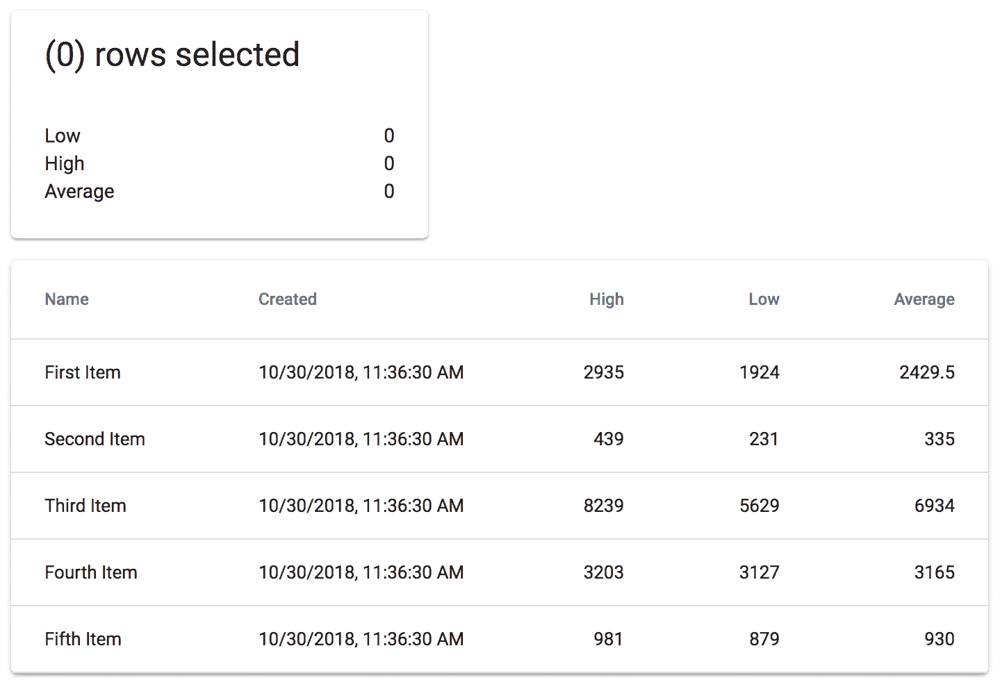

现在，你可以尝试进行一些行选择。如果你选择了第二行和第四行，你会看到以下内容：

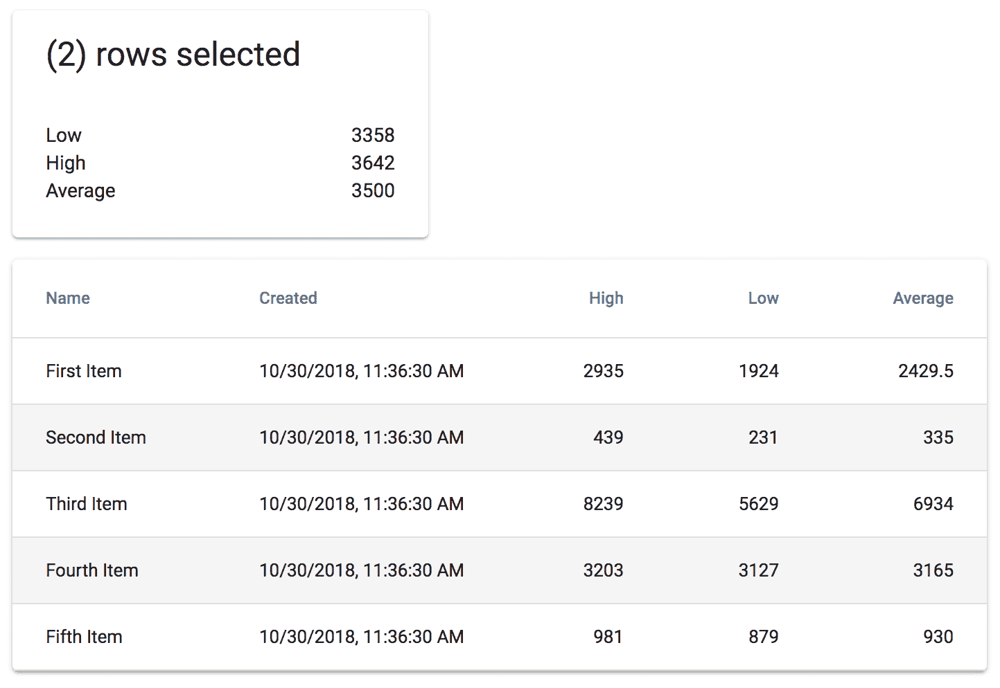

当你点击表格行时，它会从视觉上发生变化，以便用户可以看到它已被选中。此外，请注意，`Card` 组件的内容也会改变，以反映选中的行。它还会告诉你已选中多少行。

# 它是如何工作的...

`Card` 组件依赖于几个辅助函数：

+   `selectedLow`

+   `selectedHigh`

+   `selectedAverage`

这些函数的返回值会随着表格行选择的变化而变化。让我们更仔细地看看这些值是如何计算的：

```js
const selectedLow = () =>
  rows
    .filter(row => row.selected)
    .reduce((total, row) => total + row.low, 0);

const selectedHigh = () =>
  rows
    .filter(row => row.selected)
    .reduce((total, row) => total + row.high, 0);

const selectedAverage = () => (selectedLow() + selectedHigh()) / 2;
```

`selectedLow()`和`selectedHigh()`函数以相同的方式工作——它们只是分别操作`low`和`high`字段。`filter()`调用用于确保你只处理选中的行。`reduce()`调用将选中的行给定字段的值相加，并将结果作为属性值返回。`selectedAverage()`函数使用`selectedLow()`和`selectedHigh()`函数来计算行选择的新的平均值。

接下来，让我们看看当选择行时被调用的处理程序：

```js
const onRowClick = id => () => {
  const newRows = [...rows];
  const index = rows.findIndex(row => row.id === id);
  const row = rows[index];

  newRows[index] = { ...row, selected: !row.selected };
  setRows(newRows);
};
```

`onRowClick()`函数根据`id`参数在`rows`状态中找到选中的行。然后，它切换行的选中状态。结果，你刚才看到的计算属性被更新，行的外观也是如此：

```js
<TableRow
  key={row.id}
  onClick={onRowClick(row.id)}
  selected={row.selected}
>
```

`TableRow`组件有一个`selected`属性，它会改变行的样式以标记它为已选择。

# 参见

+   `表格`演示：[`material-ui.com/demos/tables/`](https://material-ui.com/demos/tables/)

# 行操作

表格行通常代表你可以执行操作的实体。例如，你可能有一个包含服务器的表格，其中每一行代表一个可以开启或关闭的服务器。而不是让用户点击一个将他们从表格带到另一个页面去执行操作的链接，你可以在每一行表格中直接包含常见的操作。

# 如何做到...

假设你有一个表格，其中包含可以开启或关闭的服务器行，这取决于它们当前的状态。你希望将这两个操作作为每一行表格的一部分包含进来，这样用户就可以更容易地控制他们的服务器，而无需花费大量时间导航。按钮还需要根据行的状态改变它们的颜色和禁用状态。

这是完成这个功能的代码：

```js
import React, { useState } from 'react';

import { makeStyles } from '@material-ui/styles';
import Table from '@material-ui/core/Table';
import TableBody from '@material-ui/core/TableBody';
import TableCell from '@material-ui/core/TableCell';
import TableHead from '@material-ui/core/TableHead';
import TableRow from '@material-ui/core/TableRow';
import Paper from '@material-ui/core/Paper';
import IconButton from '@material-ui/core/IconButton';

import PlayArrowIcon from '@material-ui/icons/PlayArrow';
import StopIcon from '@material-ui/icons/Stop';

const useStyles = makeStyles(theme => ({
  root: { margin: theme.spacing(2), textAlign: 'center' },
  button: {}
}));

const StartButton = ({ row, onClick }) => (
  <IconButton
    onClick={onClick}
    color={row.status === 'off' ? 'primary' : 'default'}
    disabled={row.status === 'running'}
  >
    <PlayArrowIcon fontSize="small" />
  </IconButton>
);

const StopButton = ({ row, onClick }) => (
  <IconButton
    onClick={onClick}
    color={row.status === 'running' ? 'primary' : 'default'}
    disabled={row.status === 'off'}
  >
    <StopIcon fontSize="small" />
  </IconButton>
);

export default function RowActions() {
  const classes = useStyles();
  const [rows, setRows] = useState([
    {
      id: 1,
      name: 'First Item',
      status: 'running'
    },
    {
      id: 2,
      name: 'Second Item',
      status: 'off'
    },
    {
      id: 3,
      name: 'Third Item',
      status: 'off'
    },
    {
      id: 4,
      name: 'Fourth Item',
      status: 'running'
    },
    {
      id: 5,
      name: 'Fifth Item',
      status: 'off'
    }
  ]);

  const toggleStatus = id => () => {
    const newRows = [...rows];
    const index = rows.findIndex(row => row.id === id);
    const row = rows[index];

    newRows[index] = {
      ...row,
      status: row.status === 'running' ? 'off' : 'running'
    };
    setRows(newRows);
  };

  return (
    <Paper className={classes.root}>
      <Table>
        <TableHead>
          <TableRow>
            <TableCell>Name</TableCell>
            <TableCell>Status</TableCell>
            <TableCell>Actions</TableCell>
          </TableRow>
        </TableHead>
        <TableBody>
          {rows.map(row => {
            return (
              <TableRow key={row.id}>
                <TableCell component="th" scope="row">
                  {row.name}
                </TableCell>
                <TableCell>{row.status}</TableCell>
                <TableCell>
                  <StartButton
                    row={row}
                    onClick={toggleStatus(row.id)}
                  />
                  <StopButton
                    row={row}
                    onClick={toggleStatus(row.id)}
                  />
                </TableCell>
              </TableRow>
            );
          })}
        </TableBody>
      </Table>
    </Paper>
  );
}
```

这是屏幕首次加载时的样子：

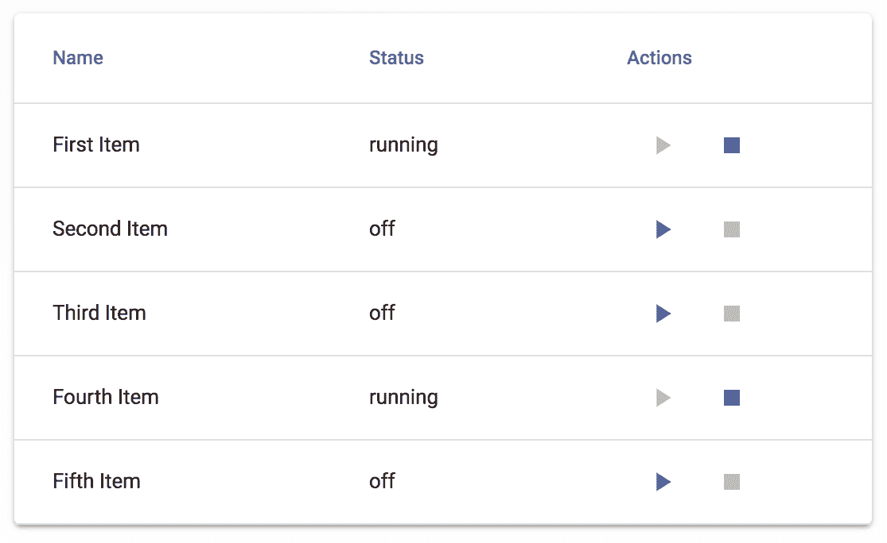

根据行数据的`状态`，操作按钮将显示不同。例如，在第一行中，启动按钮被禁用，因为`状态`是`running`。第二行有一个禁用的停止按钮，因为`状态`是`off`。让我们尝试点击第一行的停止按钮和第二行的启动按钮。完成这些操作后，UI 将如何变化：

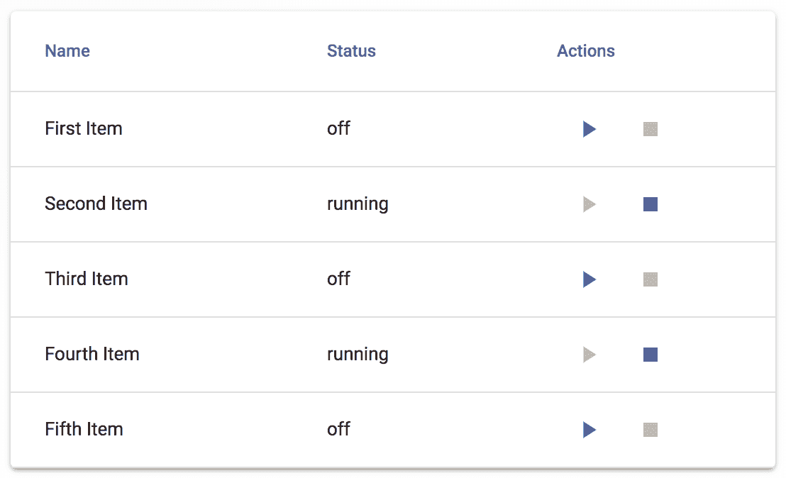

# 它是如何工作的...

让我们从查看用作行操作的两种组件开始：

```js
const StartButton = ({ row, onClick }) => (
  <IconButton
    onClick={onClick}
    color={row.status === 'off' ? 'primary' : 'default'}
    disabled={row.status === 'running'}
  >
    <PlayArrowIcon fontSize="small" />
  </IconButton>
);

const StopButton = ({ row, onClick }) => (
  <IconButton
    onClick={onClick}
    color={row.status === 'running' ? 'primary' : 'default'}
    disabled={row.status === 'off'}
  >
    <StopIcon fontSize="small" />
  </IconButton>
);
```

`StartButton`和`StopButton`组件非常相似。这两个组件在表格的每一行中都被渲染。有一个`onClick`属性，这是一个函数，当点击时它会改变行数据的当前状态。图标的`颜色`会根据行的`状态`改变。同样，`disabled`属性也会根据行的`状态`改变。

接下来，让我们看看当点击操作按钮时被调用的`toggleStatus()`处理程序，它会改变行的状态状态：

```js
const toggleStatus = id => () => {
  const newRows = [...rows];
  const index = rows.findIndex(row => row.id === id);
  const row = rows[index];

  newRows[index] = {
    ...row,
    status: row.status === 'running' ? 'off' : 'running'
  };
  setRows(newRows);
};
```

`StartButton` 和 `StopButton` 组件都使用相同的处理函数——它在 `status` 值之间切换 `running` 和 `off`。最后，让我们看看 `TableCell` 组件，这些 `row` 动作在这里被渲染：

```js
<TableCell>
  <StartButton
    row={row}
    onClick={toggleStatus(row.id)}
  />
  <StopButton
    row={row}
    onClick={toggleStatus(row.id)}
  />
</TableCell>
```

行数据作为 `row` 属性传递。`toggleStatus()` 函数接受一个 `row id` 参数，并返回一个作用于该行的新处理函数。

# 参见

+   `Table` 示例：[`material-ui.com/demos/tables/`](https://material-ui.com/demos/tables/)
