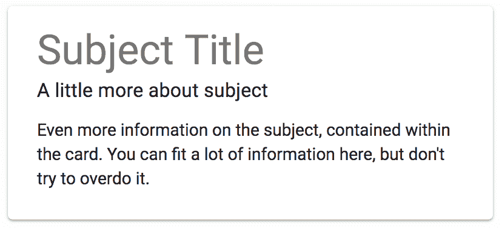
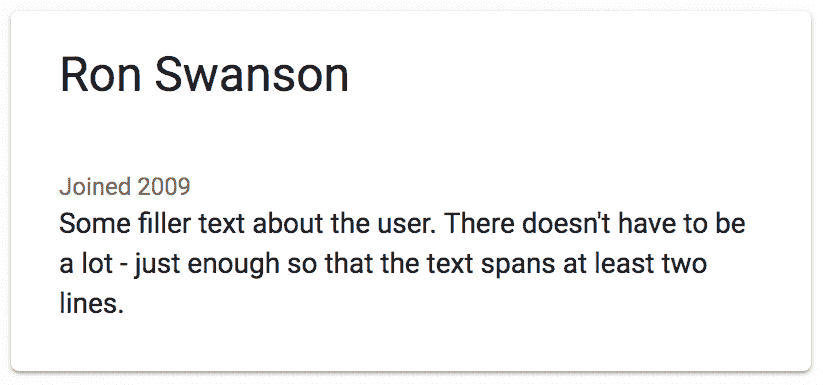
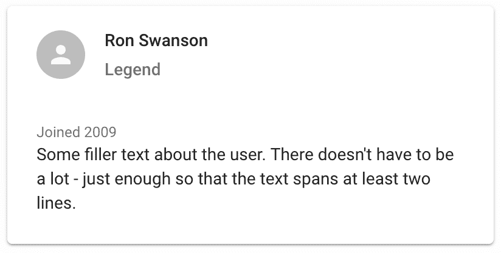
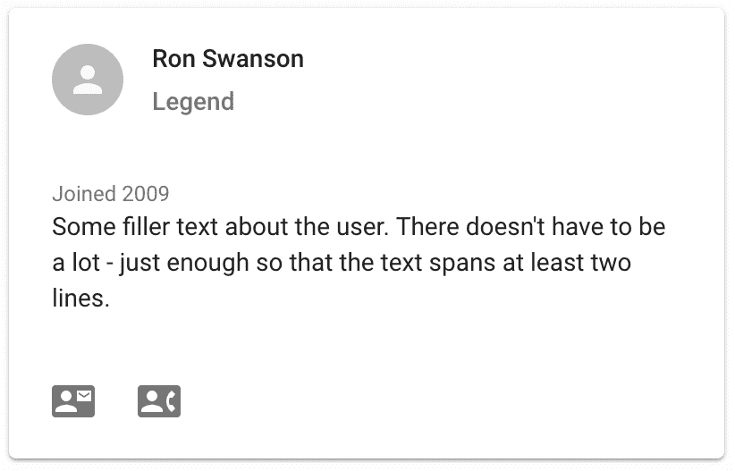
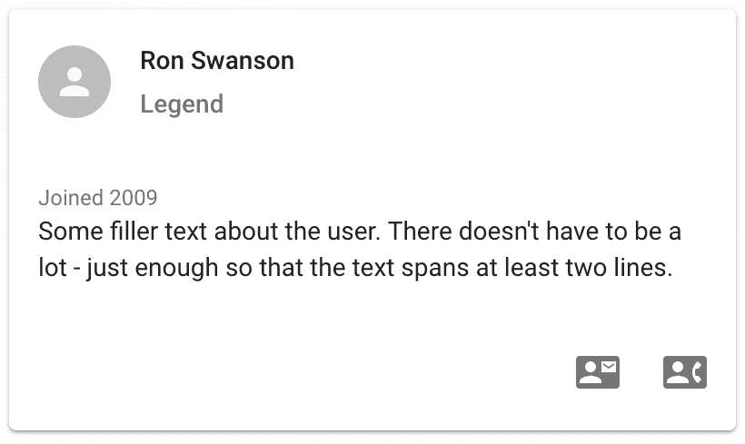
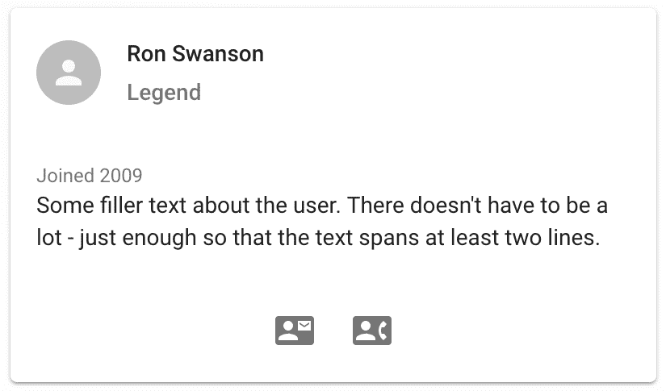
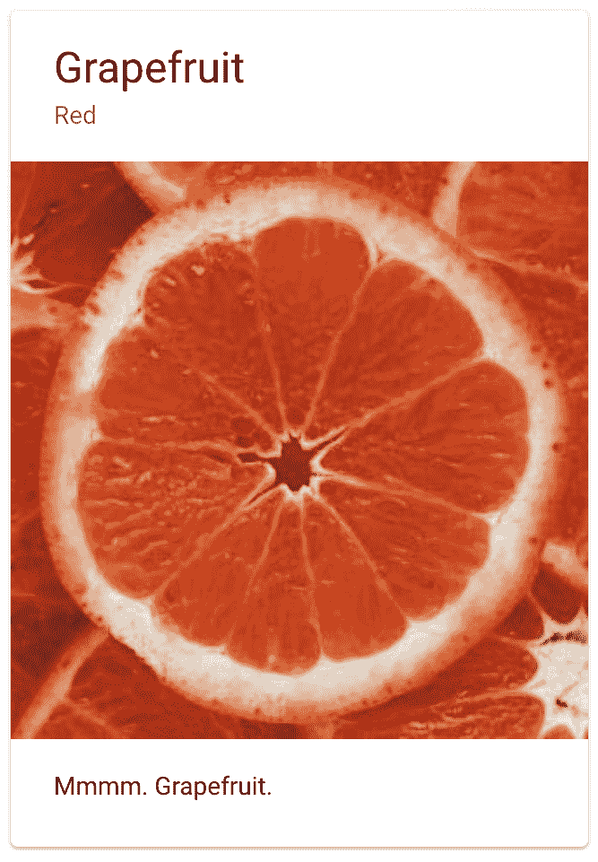
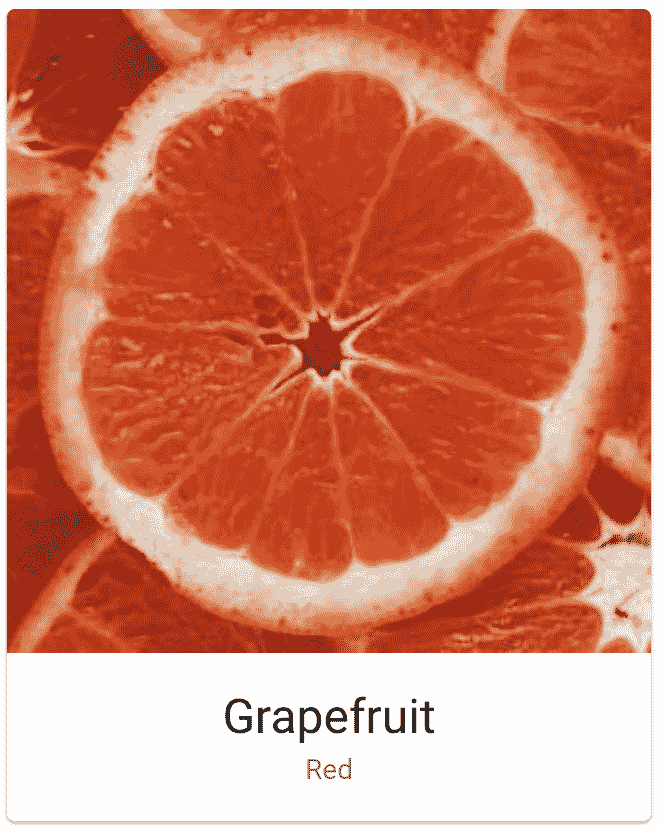
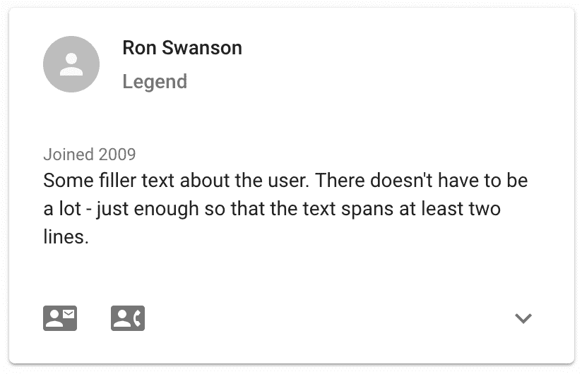
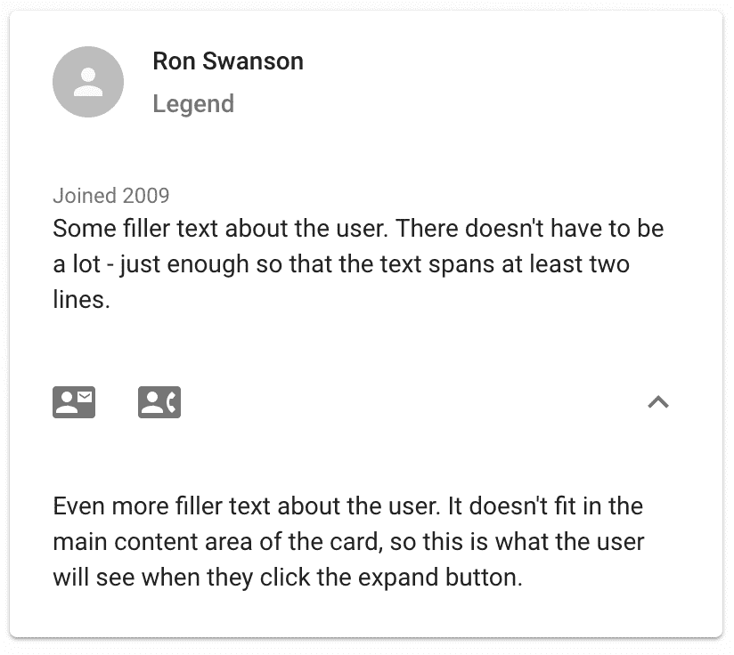

# 卡片 - 显示详细信息

在本章中，您将学习以下关于卡片的内容：

+   主要内容

+   卡片标题

+   执行操作

+   展示媒体

+   可展开卡片

# 简介

卡片是用于在给定主题上显示特定信息的 Material Design 概念。例如，主题可以是 API 端点返回的对象。或者，主题可以是复杂对象的一部分——在这种情况下，您可以使用多个卡片以帮助用户理解他们正在查看的信息的方式来组织信息。

# 主要内容

`Card`组件的主要内容是放置与主题相关的信息的地方。`CardContent`组件是`Card`的子组件，您可以使用它来渲染其他 Material UI 组件，例如`Typography`。

# 如何做...

假设您正在为某种类型的实体（如博客文章）创建一个详情屏幕。您决定使用`Card`组件来渲染一些实体详情，因为实体是考虑的主题。以下是渲染包含特定主题信息的`Card`组件的代码：

```js
import React from 'react';

import { withStyles } from '@material-ui/core/styles';
import Card from '@material-ui/core/Card';
import CardContent from '@material-ui/core/CardContent';
import Typography from '@material-ui/core/Typography';

const styles = theme => ({
  card: {
    maxWidth: 400
  },
  content: {
    marginTop: theme.spacing(1)
  }
});

const MainContent = withStyles(styles)(({ classes }) => (
  <Card className={classes.card}>
    <CardContent>
      <Typography variant="h4">Subject Title</Typography>
      <Typography variant="subtitle1">
        A little more about subject
      </Typography>
      <Typography className={classes.content}>
        Even more information on the subject, contained within the
        card. You can fit a lot of information here, but don't try to
        overdo it.
      </Typography>
    </CardContent>
  </Card>
));

export default MainContent;
```

当您首次加载屏幕时，您将看到以下内容：



卡片内容分为三个部分：

+   **主题标题**：告诉用户他们正在查看什么

+   **副标题**：为用户提供更多上下文

+   **内容**：主题的主要内容

# 它是如何工作的...

此示例使用`CardContent`组件作为`Card`中的主要组织单元。其余部分由您自行决定。例如，本示例中的卡片使用三个`Typography`组件来渲染三种不同样式的文本作为卡片内容。

第一个`Typography`组件使用`h4`变体，作为卡片的标题。第二个`Typography`组件作为卡片的副标题，使用`subtitle1`变体。最后，是卡片的主要内容，使用`Typography`默认字体。此文本设置了`marginTop`样式，以便它不会紧挨着副标题。

# 相关内容

+   卡片参考：[`material-ui.com/demos/cards/`](https://material-ui.com/demos/cards/)

# 卡片标题

`CardHeader`组件用于渲染卡片的标题。这包括标题文本以及一些其他潜在元素。您可能想要使用`CardHeader`组件的原因是让它处理标题的布局样式，并保持您的`Card`语义内的标记。

# 如何做...

假设您正在为您的应用程序用户构建一个`card`组件。作为卡片标题，您想显示用户的姓名。您可以使用`CardHeader`组件，而不是使用`Typography`组件通过文本变体来渲染标题，将其放置在`CardContent`组件旁边。以下是代码的显示方式：

```js
import React from 'react';

import { withStyles } from '@material-ui/core/styles';
import Card from '@material-ui/core/Card';
import CardHeader from '@material-ui/core/CardHeader';
import CardContent from '@material-ui/core/CardContent';
import Typography from '@material-ui/core/Typography';
import Avatar from '@material-ui/core/Avatar';

import PersonIcon from '@material-ui/icons/Person';

const styles = theme => ({
  card: {
    maxWidth: 400
  }
});

const CardHeader = withStyles(styles)(({ classes }) => (
  <Card className={classes.card}>
    <CardHeader
      title="Ron Swanson"
      subheader="Legend"
      avatar={
        <Avatar>
          <PersonIcon />
        </Avatar>
      }
    />
    <CardContent>
      <Typography variant="caption">Joined 2009</Typography>
      <Typography>
        Some filler text about the user. There doesn't have to be a
        lot - just enough so that the text spans at least two lines.
      </Typography>
    </CardContent>
  </Card>
));

export default CardHeader;
```

下面是屏幕的显示效果：



# 它是如何工作的...

让我们看看渲染此卡片所使用的标记：

```js
<Card className={classes.card}>
  <CardHeader title="Ron Swanson" />
  <CardContent>
    <Typography variant="caption">Joined 2009</Typography>
    <Typography>
      Some filler text about the user. There doesn't have to be a
      lot - just enough so that the text spans at least two lines.
    </Typography>
  </CardContent>
```

`CardHeader` 组件是 `CardContent` 的兄弟组件。这使得 `Card` 标记语义化，而不是需要在 `CardContent` 内声明卡片头部。`CardHeader` 组件接受一个 `title` 字符串属性，这是卡片标题的渲染方式。

# 还有更多...

你可以向 `CardHeader` 组件添加不仅仅是字符串。你还可以传递一个副标题字符串和一个头像，以帮助用户识别卡片中的主题。让我们修改这个示例以添加这两者。首先，这里是你需要添加的新组件导入：

```js
import Avatar from '@material-ui/core/Avatar';
import PersonIcon from '@material-ui/icons/Person';
```

接下来，这是更新后的 `CardHeader` 标记：

```js
<CardHeader
  title="Ron Swanson"
  subheader="Legend"
  avatar={
    <Avatar>
      <PersonIcon />
    </Avatar>
  }
/>
```

下面是结果的样子：



`CardHeader` 组件处理三个头部组件的对齐——头像、标题和副标题。

# 相关内容

+   `Card` 示例：[`material-ui.com/demos/cards/`](https://material-ui.com/demos/cards/)

# 执行操作

卡片用于显示关于主题的特定操作。通常，用户会对主题执行操作，例如向联系人发送消息或删除联系人。`CardActions` 组件可以被 `Card` 组件用来显示用户可以对主题执行的操作。

# 如何做到...

假设你正在使用 `Card` 组件来显示一个联系人。除了显示联系人的信息外，你还希望用户能够在卡片内对联系人执行操作。例如，你可以提供两个操作——一个用于给联系人发消息，另一个用于给联系人打电话。以下是执行此操作的代码：

```js
import React from 'react';

import { withStyles } from '@material-ui/core/styles';
import Card from '@material-ui/core/Card';
import CardHeader from '@material-ui/core/CardHeader';
import CardContent from '@material-ui/core/CardContent';
import CardActions from '@material-ui/core/CardActions';
import Typography from '@material-ui/core/Typography';
import Avatar from '@material-ui/core/Avatar';
import IconButton from '@material-ui/core/IconButton';
import PersonIcon from '@material-ui/icons/Person';
import ContactMailIcon from '@material-ui/icons/ContactMail';
import ContactPhoneIcon from '@material-ui/icons/ContactPhone';

const styles = theme => ({
  card: {
    maxWidth: 400
  }
});

const PerformingActions = withStyles(styles)(({ classes }) => (
  <Card className={classes.card}>
    <CardHeader
      title="Ron Swanson"
      subheader="Legend"
      avatar={
        <Avatar>
          <PersonIcon />
        </Avatar>
      }
    />
    <CardContent>
      <Typography variant="caption">Joined 2009</Typography>
      <Typography>
        Some filler text about the user. There doesn't have to be a
        lot - just enough so that the text spans at least two lines.
      </Typography>
    </CardContent>
    <CardActions disableActionSpacing>
      <IconButton>
        <ContactMailIcon />
      </IconButton>
      <IconButton>
        <ContactPhoneIcon />
      </IconButton>
    </CardActions>
  </Card>
));

export default PerformingActions;
```

当屏幕首次加载时，卡片看起来是这样的：



用户可以对主题执行的两种操作以图标按钮的形式渲染在卡片底部。

# 它是如何工作的...

`CardActions` 组件负责在其内部对按钮项进行水平对齐，并确保它们放置在卡片底部。`disableActionSpacing` 属性移除了 `CardActions` 添加的额外边距。通常，你会在使用 `IconButton` 组件作为 `actions` 时使用此属性。

让我们更仔细地看看标记：

```js
<CardActions disableActionSpacing>
  <IconButton>
    <ContactMailIcon />
  </IconButton>
  <IconButton>
    <ContactPhoneIcon />
  </IconButton>
</CardActions>
```

与 `Card` 的其他子组件一样，`CardActions` 组件使整体卡片结构语义化，因为它与相关的卡片功能是兄弟关系。放置在 `CardActions` 内的项可以是任何你想要的内容，但常见的做法是使用图标按钮。

# 还有更多...

你可以改变 `CardActions` 组件中项的对齐方式。由于它使用 flexbox 作为其显示方式，你可以使用任何 `justify-content` 的值。下面是一个更新版本，将操作按钮对齐到卡片的右侧：

```js
const styles = theme => ({
  card: {
    maxWidth: 400
  },
  actions: {
    justifyContent: 'flex-end'
  }
});

const PerformingActions = withStyles(styles)(({ classes }) => (
  <Card className={classes.card}>
    <CardHeader
      title="Ron Swanson"
      subheader="Legend"
      avatar={
        <Avatar>
          <PersonIcon />
        </Avatar>
      }
    />
    <CardContent>
      <Typography variant="caption">Joined 2009</Typography>
      <Typography>
        Some filler text about the user. There doesn't have to be a
        lot - just enough so that the text spans at least two lines.
      </Typography>
    </CardContent>
    <CardActions disableActionSpacing className={classes.actions}>
      <IconButton>
        <ContactMailIcon />
      </IconButton>
      <IconButton>
        <ContactPhoneIcon />
      </IconButton>
    </CardActions>
  </Card>
));

export default PerformingActions;
```

`justify-content` 属性是 `actions` 样式的一部分，然后应用于 `CardActions` 组件。下面是结果的样子：



这是另一个版本，显示 `center` 作为 `justify-content` 的值：



# 相关内容

+   `Card` 示例：[`material-ui.com/demos/cards/`](https://material-ui.com/demos/cards/)

# 展示媒体

卡片具有内置的显示媒体的能力。这包括图像和视频，它们成为卡片的核心内容。

# 如何实现...

假设你有一个 `Card` 组件显示的主题图片。你可以使用 `CardMedia` 组件来渲染图片。你应该使用这个组件而不是 `` 这样的东西，因为它会为你处理许多样式问题。以下是代码：

```js
import React from 'react';

import { withStyles } from '@material-ui/core/styles';
import Card from '@material-ui/core/Card';
import CardHeader from '@material-ui/core/CardHeader';
import CardContent from '@material-ui/core/CardContent';
import CardMedia from '@material-ui/core/CardMedia';
import CardActions from '@material-ui/core/CardActions';
import Button from '@material-ui/core/Button';
import Typography from '@material-ui/core/Typography';

const styles = theme => ({
  card: {
    maxWidth: 322
  },
  media: {
    width: 322,
    height: 322
  }
});

const PresentingMedia = withStyles(styles)(({ classes }) => (
  <Card className={classes.card}>
    <CardHeader title="Grapefruit" subheader="Red" />
    <CardMedia
      className={classes.media}
      image="grapefruit-slice-332-332.jpg"
      title="Grapefruit"
    />
    <CardContent>
      <Typography>Mmmm. Grapefruit.</Typography>
    </CardContent>
  </Card>
));

export default PresentingMedia;
```

这是渲染后的卡片的样子：



# 它是如何工作的...

`CardMedia` 组件就像构成卡片的其它组件一样——只是另一个部分。在这个例子中，`CardMedia` 放在 `CardHeader` 下方和 `CardContent` 上方。但不必这样。你可以重新排列这些组件的顺序。

# 更多内容...

你可以根据你的应用逻辑重新排列你的卡片项目。例如，你的带有媒体的卡片可能没有任何内容，你可能想在卡片的底部显示标题文本，在媒体下方，并且文本居中。以下是修改后的代码：

```js
const styles = theme => ({
  card: {
    maxWidth: 322
  },
  media: {
    width: 322,
    height: 322
  },
  header: {
    textAlign: 'center'
  }
});

const PresentingMedia = withStyles(styles)(({ classes }) => (
  <Card className={classes.card}>
    <CardMedia
      className={classes.media}
      image="https://interactive-grapefruit-slice-332-332.jpg"
      title="Grapefruit"
    />
    <CardHeader
      className={classes.header}
      title="Grapefruit"
      subheader="Red"
    />
  </Card>
));

export default PresentingMedia;
```

这是最终卡片的样式：



# 相关内容

+   `img` HTML 标签参考：[`developer.mozilla.org/en-US/docs/Web/HTML/Element/img`](https://developer.mozilla.org/en-US/docs/Web/HTML/Element/img)

# 可展开卡片

有时，你可能无法将所有想要的内容都放入卡片中。为了适应，你可以使你的卡片可展开，这意味着用户可以点击 `expand` 按钮来显示附加内容。

如果你试图在 `Card` 中放入太多内容，使卡片可展开只是掩盖了问题。相反，考虑一种不同的方法来显示关于所讨论主题的信息。例如，也许，而不是卡片，主题值得拥有自己的页面。

# 如何实现...

让我们看看卡片内关于一个主题的附加内容：

+   占用过多的垂直空间

+   并不重要，不需要默认显示

你可以通过将内容放入卡片的可展开区域来处理这两个挑战。这样，垂直空间就不是问题，用户如果认为内容相关，可以查看内容。以下是一个基于本章早期示例构建的示例，其中默认隐藏卡片的部分内容：

```js
import React, { useState } from 'react';

import { makeStyles } from '@material-ui/styles';
import Card from '@material-ui/core/Card';
import CardHeader from '@material-ui/core/CardHeader';
import CardContent from '@material-ui/core/CardContent';
import CardActions from '@material-ui/core/CardActions';
import Typography from '@material-ui/core/Typography';
import Avatar from '@material-ui/core/Avatar';
import IconButton from '@material-ui/core/IconButton';
import Collapse from '@material-ui/core/Collapse';

import PersonIcon from '@material-ui/icons/Person';
import ContactMailIcon from '@material-ui/icons/ContactMail';
import ContactPhoneIcon from '@material-ui/icons/ContactPhone';
import ExpandLessIcon from '@material-ui/icons/ExpandLess';
import ExpandMoreIcon from '@material-ui/icons/ExpandMore';

const useStyles = makeStyles(theme => ({
  card: {
    maxWidth: 400
  },
  expand: {
    marginLeft: 'auto'
  }
}));

const ExpandIcon = ({ expanded }) =>
  expanded ? <ExpandLessIcon /> : <ExpandMoreIcon />;

export default function ExpandableCards() {
  const classes = useStyles();
  const [expanded, setExpanded] = useState(false);

  const toggleExpanded = () => {
    setExpanded(!expanded);
  };

  return (
    <Card className={classes.card}>
      <CardHeader
        title="Ron Swanson"
        subheader="Legend"
        avatar={
          <Avatar>
            <PersonIcon />
          </Avatar>
        }
      />
      <CardContent>
        <Typography variant="caption">Joined 2009</Typography>
        <Typography>
          Some filler text about the user. There doesn't have to be a
          lot - just enough so that the text spans at least two lines.
        </Typography>
      </CardContent>
      <CardActions disableActionSpacing>
        <IconButton>
          <ContactMailIcon />
        </IconButton>
        <IconButton>
          <ContactPhoneIcon />
        </IconButton>
        <IconButton
          className={classes.expand}
          onClick={toggleExpanded}
        >
          <ExpandIcon expanded={expanded} />
        </IconButton>
      </CardActions>
      <Collapse in={expanded}>
        <CardContent>
          <Typography>
            Even more filler text about the user. It doesn't fit in
            the main content area of the card, so this is what the
            user will see when they click the expand button.
          </Typography>
        </CardContent>
      </Collapse>
    </Card>
  );
}
```

当你首次加载屏幕时，卡片看起来是这样的：



在卡片操作按钮的右侧，现在有一个带有向下箭头的 `expand` 按钮。如果你点击 `expand` 按钮，以下是卡片展开时的样子：



展开图标现在已更改为折叠图标——点击它将使卡片折叠回原始状态。

# 它是如何工作的...

让我们分析一下这个示例中添加的可展开卡片区域。首先，是 `expand` 样式：

```js
expand: {
  marginLeft: 'auto'
}
```

这用于将展开/折叠图标按钮对齐到其他操作按钮的左侧。接下来，让我们看看 `ExpandIcon` 组件：

```js
const ExpandIcon = ({ expanded }) =>
  expanded ? <ExpandLessIcon /> : <ExpandMoreIcon />;
```

这个实用组件用于根据组件的展开状态渲染正确的图标组件。接下来，让我们看看 `toggleExpanded()` 函数：

```js
const toggleExpanded = () => {
  setExpanded(!expanded);
};
```

当调用此处理程序时，将切换展开状态。然后，将此状态传递给 `ExpandIcon` 组件，该组件将渲染适当的图标。接下来，让我们更仔细地看看这张卡的标记：

```js
<CardActions disableActionSpacing>
  <IconButton>
    <ContactMailIcon />
  </IconButton>
  <IconButton>
    <ContactPhoneIcon />
  </IconButton>
  <IconButton
    className={classes.expand}
    onClick={toggleExpanded}
  >
    <ExpandIcon expanded={expanded} />
  </IconButton>
</CardActions>
```

展开折叠按钮是这里显示的最后一个 `IconButton` 组件。它使用展开样式，`toggleExpanded()` 点击处理程序和展开状态。最后，让我们看看当按钮被点击时可以展开和折叠的卡片内容：

```js
<Collapse in={expanded}>
  <CardContent>
    <Typography>
      Even more filler text about the user. It doesn't fit
      in the main content area of the card, so this is what
      the user will see when they click the expand button.
    </Typography>
  </CardContent>
</Collapse>
```

`Collapse` 组件用于根据展开状态显示或隐藏额外的卡片内容。请注意，这里使用的是 `CardContent` 组件，以确保一旦显示额外内容，其样式与卡片内容的其余部分保持一致。

# 参见

+   `Card` 示例：[`material-ui.com/demos/cards/`](https://material-ui.com/demos/cards/)

+   `Card` API 文档：[`material-ui.com/api/card/`](https://material-ui.com/api/card/)

+   `CardHeader` API 文档：[`material-ui.com/api/card-header/`](https://material-ui.com/api/card-header/)

+   `CardContent` API 文档：[`material-ui.com/api/card-content/`](https://material-ui.com/api/card-content/)

+   `CardActions` API 文档：[`material-ui.com/api/card-actions/`](https://material-ui.com/api/card-actions/)

+   `IconButton` API 文档：[`material-ui.com/api/icon-button/`](https://material-ui.com/api/icon-button/)

+   `Collapse` API 文档：[`material-ui.com/api/collapse/`](https://material-ui.com/api/collapse/)
