# Snackbars - 临时消息

在本章中，你将了解以下内容：

+   Snackbar 内容

+   使用状态控制可见性

+   Snackbars 过渡

+   Snackbars 的位置

+   错误边界和错误 Snackbars

+   带有操作的 Snackbars

+   Snackbars 排队

# 简介

Material-UI 附带一个用于向用户显示消息的`Snackbar`组件。这些消息简短、短暂，不会干扰主要应用程序组件。

# Snackbar 内容

文本是你在为用户显示的`Snackbar`消息内容中最常见的形式。因此，`Snackbar`组件使得设置消息内容和显示 snackbar 变得简单直接。

# 如何做到...

`Snackbar`组件的`message`属性接受一个字符串值或任何其他有效的`React`元素。以下代码展示了如何设置`Snackbar`组件的内容并显示它：

```js
import React from 'react';
import Snackbar from '@material-ui/core/Snackbar';

const MySnackbarContent = () => <Snackbar open={true} message="Test" />;
export default MySnackbarContent;
```

当页面首次加载时，你会看到一个看起来像这样的 snackbar：

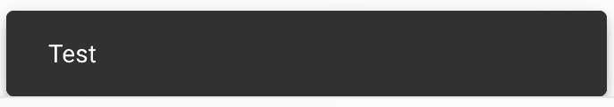

# 它是如何工作的...

默认情况下，snackbar 并不复杂，但它将你的文本内容渲染为`message`属性中指定的内容。`open`属性设置为 true，因为任何其他值都会隐藏 snackbar。

# 更多内容...

`Snackbar`组件使用`SnackbackContent`组件来渲染实际显示的内容。反过来，`SnackbarContent`使用`Paper`，而`Paper`使用`Typography`。在这个所有间接层中导航可能有点棘手，但幸运的是，你不必这样做。相反，你可以通过`ContentProps`属性将属性一路传递到`Typography`组件。

假设你想要使用`h6`排版变体。以下是你可以这样做的方法：

```js
import React from 'react';
import Snackbar from '@material-ui/core/Snackbar';

const MySnackbarContent () => (
  <Snackbar
    open={true}
    message="Test"
    ContentProps={{ variant: 'h6' }}
  />
);

export default MySnackbarContent;
```

你想要传递给`Paper`组件的任何属性都可以通过`ContentProps`设置。在这里，你正在传递`variant`属性——这会导致以下视觉变化：

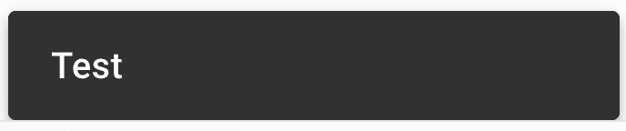

最终结果是更大的文本和更宽的边距。这个例子不是为了这个特定的排版变化，而是为了说明你可以以与`Typography`组件相同的方式自定义`Snackbar`文本。

你可以在 snackbar 内容中放入你想要的任何数量的组件或尽可能少的组件。例如，你可以将子组件传递给`Snackbar`而不是在`message`属性中。然而，我建议尽可能保持你的 snackbar 内容简单。你不想在已经设计用来处理简单文本的组件中陷入设计陷阱。

# 相关内容

+   `Snackbar`演示：[`material-ui.com/demos/snackbars/`](https://material-ui.com/demos/snackbars/)

+   `Snackbar` API 文档：[`material-ui.com/api/snackbar/`](https://material-ui.com/api/snackbar/)

# 使用状态控制可见性

Snackbar 是在响应某些事件时显示的。例如，如果你的应用程序中创建了一个新的资源，那么使用 `Snackbar` 组件将此信息传达给用户是一个不错的选择。如果你需要控制 Snackbar 的状态，那么你需要添加一个控制 Snackbar 可见性的状态。

# 如何做到这一点...

`open` 属性用于控制 Snackbar 的可见性。为了控制这个属性的值，你需要传递一个状态值给它。然后，当这个状态改变时，Snackbar 的可见性也会随之改变。以下是一些代码示例，说明了如何通过状态控制 Snackbar 的基本概念：

```js
import React, { Fragment, useState } from 'react';

import Button from '@material-ui/core/Button';
import Snackbar from '@material-ui/core/Snackbar';

export default function ControllingVisibilityWithState() {
  const [open, setOpen] = useState(false);

  const showSnackbar = () => {
    setOpen(true);
  };

  return (
    <Fragment>
      <Button variant="contained" onClick={showSnackbar}>
        Show Snackbar
      </Button>
      <Snackbar open={open} message="Visible Snackbar!" />
    </Fragment>
  );
}
```

当你首次加载屏幕时，你将看到的只是一个“显示 Snackbar”按钮：

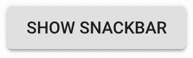

点击此按钮将显示 Snackbar：

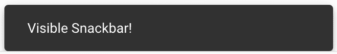

# 它是如何工作的...

组件有一个 `open` 状态，该状态决定了 Snackbar 的可见性。`open` 的值传递给了 `Snackbar` 的 `open` 属性。当用户点击“显示 Snackbar”按钮时，`showSnackbar()` 函数将 `open` 状态设置为 true。结果，true 值被传递给了 `Snackbar` 的 `open` 属性。

# 还有更多...

一旦显示了一个 Snackbar，你将需要某种方式来关闭它。同样，`open` 状态可以隐藏 Snackbar。但如何将 `open` 状态改回 false 呢？Snackbar 消息的典型模式是它们只短暂出现，之后会自动隐藏。

通过向 `Snackbar` 传递两个额外的属性，你可以增强这个例子，使得 Snackbar 在一段时间后自动隐藏。以下是更新后的代码：

```js
import React, { Fragment, useState } from 'react';

import Button from '@material-ui/core/Button';
import Snackbar from '@material-ui/core/Snackbar';

export default function ControllingVisibilityWithState() {
  const [open, setOpen] = useState(false);

  const showSnackbar = () => {
    setOpen(true);
  };
  const hideSnackbar = () => {
    setOpen(false);
  };

  return (
    <Fragment>
      <Button variant="contained" onClick={showSnackbar}>
        Show Snackbar
      </Button>
      <Snackbar
        open={open}
        onClose={hideSnackbar}
        autoHideDuration={5000}
        message="Visible Snackbar!"
      />
    </Fragment>
  );
}
```

组件中添加了一个新函数——`hideSnackbar()`。这个函数被传递给了 `Snackbar` 的 `onClose` 属性。`autoHideDuration` 组件是你希望 Snackbar 保持可见的毫秒数。在这个例子中，五秒后，`Snackbar` 组件将调用传递给其 `onClose` 属性的函数。这会将 `open` 状态设置为 false，然后这个值被传递给了 `Snackbar` 的 `open` 属性。

# 参见

+   `Snackbar` 演示：[`material-ui.com/demos/snackbars/`](https://material-ui.com/demos/snackbars/)

+   `Snackbar` API 文档：[`material-ui.com/api/snackbar/`](https://material-ui.com/api/snackbar/)

+   `Button` API 文档：[`material-ui.com/api/button/`](https://material-ui.com/api/button/)

# Snackbar 过渡

你可以控制 `Snackbar` 组件在显示和隐藏时使用的过渡效果。`Snackbar` 组件直接通过属性支持过渡自定义，因此你不需要花费太多时间去思考如何实现你的 `Snackbar` 过渡效果。

# 如何做到这一点...

假设你想要使整个应用程序中 snackbars 所使用的过渡效果更容易更改。你可以在 `Snackbar` 组件周围创建一个薄的包装组件，负责设置适当的属性。以下是代码的样子：

```js
import React, { Fragment, useState } from 'react';

import Grid from '@material-ui/core/Grid';
import Button from '@material-ui/core/Button';
import Snackbar from '@material-ui/core/Snackbar';
import Slide from '@material-ui/core/Slide';
import Grow from '@material-ui/core/Grow';
import Fade from '@material-ui/core/Fade';

const MySnackbar = ({ transition, direction, ...rest }) => (
  <Snackbar
    TransitionComponent={
      { slide: Slide, grow: Grow, fade: Fade }[transition]
    }
    TransitionProps={{ direction }}
    {...rest}
  />
);

export default function SnackbarTransitions() {
  const [first, setFirst] = useState(false);
  const [second, setSecond] = useState(false);
  const [third, setThird] = useState(false);
  const [fourth, setFourth] = useState(false);

  return (
    <Fragment>
      <Grid container spacing={8}>
        <Grid item>
          <Button variant="contained" onClick={() => setFirst(true)}>
            Slide Down
          </Button>
        </Grid>
        <Grid item>
          <Button variant="contained" onClick={() => setSecond(true)}>
            Slide Up
          </Button>
        </Grid>
        <Grid item>
          <Button variant="contained" onClick={() => setThird(true)}>
            Grow
          </Button>
        </Grid>
        <Grid item>
          <Button variant="contained" onClick={() => setFourth(true)}>
            Fade
          </Button>
        </Grid>
      </Grid>
      <MySnackbar
        open={first}
        onClose={() => setFirst(false)}
        autoHideDuration={5000}
        message="Slide Down"
        transition="slide"
        direction="down"
      />
      <MySnackbar
        open={second}
        onClose={() => setSecond(false)}
        autoHideDuration={5000}
        message="Slide Up"
        transition="slide"
        direction="up"
      />
      <MySnackbar
        open={third}
        onClose={() => setThird(false)}
        autoHideDuration={5000}
        message="Grow"
        transition="grow"
      />
      <MySnackbar
        open={fourth}
        onClose={() => setFourth(false)}
        autoHideDuration={5000}
        message="Fade"
        transition="fade"
      />
    </Fragment>
  );
}
```

此代码渲染了四个按钮和四个 snackbars。当你首次加载屏幕时，你只会看到按钮：

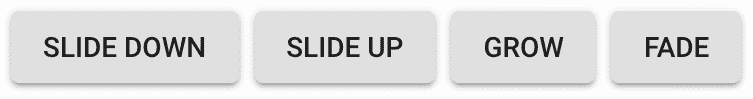

点击这些按钮中的每一个将在屏幕底部显示相应的 `Snackbar` 组件。如果你注意观察每个 snackbars 显示时使用的过渡效果，你会注意到根据你按的按钮的不同而有所差异。例如，点击 Fade 按钮，将使用 `fade` 过渡，结果如下 snackbar：

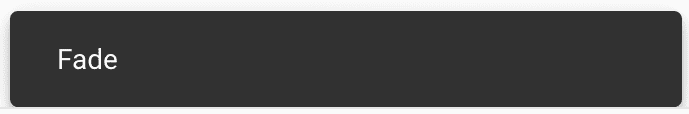

# 它是如何工作的...

让我们从查看这个例子中创建的 `MySnackbar` 组件开始：

```js
const MySnackbar = ({ transition, direction, ...rest }) => (
  <Snackbar
    TransitionComponent={
      { slide: Slide, grow: Grow, fade: Fade }[transition]
    }
    TransitionProps={{ direction }}
    {...rest}
  />
);
```

这里有两个有趣的属性。第一个是 `transition` 字符串。它用于查找要使用的过渡组件。例如，字符串 `slide` 将使用 `Slide` 组件。生成的组件由 `TransitionComponent` 属性使用。`Snackbar` 组件将内部使用此组件来应用您 snackbars 所需要的过渡。`direction` 属性与 `Slide` 过渡一起使用，这就是为什么这个属性被传递给 `TransitionProps`。这些属性值直接传递给传递给 `TransitionComponent` 的组件。

使用 `TransitionProps` 的替代方法是创建一个高阶组件，它包装自己的属性自定义值。但是，由于 `Snackbar` 已经设置好以帮助您传递属性，如果您想避免创建另一个组件，那么就没有必要再创建一个。

接下来，让我们看看组件状态及其改变它的函数：

```js
const [first, setFirst] = useState(false);
const [second, setSecond] = useState(false);
const [third, setThird] = useState(false);
const [fourth, setFourth] = useState(false);
```

`first`、`second`、`third` 和 `fourth` 状态对应于它们自己的 `Snackbar` 组件。这些状态值控制每个函数的可见性，它们对应的设置函数显示或隐藏 snackbars。

最后，让我们看看两个正在渲染的 `MySnackbar` 组件：

```js
<MySnackbar
  open={first}
  onClose={() => setFirst(false)}
  autoHideDuration={5000}
  message="Slide Down"
  transition="slide"
  direction="down"
/>
<MySnackbar
  open={second}
  onClose={() => setSecond(false)}
  autoHideDuration={5000}
  message="Slide Up"
  transition="slide"
  direction="up"
/>
```

这两个实例都使用 `slide` 过渡。然而，每个的 `direction` 属性是不同的。`MySnackbar` 抽象使你指定过渡和过渡参数变得稍微简单一些。

# 参见

+   `Snackbar` 演示：[`material-ui.com/demos/snackbars/`](https://material-ui.com/demos/snackbars/)

+   `Snackbar` API 文档：[`material-ui.com/api/snackbar/`](https://material-ui.com/api/snackbar/)

+   `Slide` API 文档：[`material-ui.com/api/slide/`](https://material-ui.com/api/slide/)

+   `Grow` API 文档：[`material-ui.com/api/grow/`](https://material-ui.com/api/grow/)

+   `Fade` API 文档：[`material-ui.com/api/fade/`](https://material-ui.com/api/fade/)

# snackbars 定位

Material-UI 的 `Snackbar` 组件有一个 `anchorOrigin` 属性，允许你在显示时更改 snackbars 的位置。你可能对 snackbars 的默认定位很满意，但有时你需要这种程度的定制来保持与其他应用程序部分的统一。

# 如何实现...

虽然你无法随意在屏幕上定位 snackbars，但有一些选项允许你更改 snackbars 的位置。以下是一些代码，允许你玩转 `anchorOrigin` 属性值：

```js
import React, { Fragment, useState } from 'react';

import { makeStyles } from '@material-ui/styles';
import Snackbar from '@material-ui/core/Snackbar';
import Radio from '@material-ui/core/Radio';
import RadioGroup from '@material-ui/core/RadioGroup';
import FormControlLabel from '@material-ui/core/FormControlLabel';
import FormControl from '@material-ui/core/FormControl';
import FormLabel from '@material-ui/core/FormLabel';

const useStyles = makeStyles(theme => ({
  formControl: {
    margin: theme.spacing(3)
  }
}));

export default function PositioningSnackbars() {
  const classes = useStyles();
  const [vertical, setVertical] = useState('bottom');
  const [horizontal, setHorizontal] = useState('left');

  const onVerticalChange = event => {
    setVertical(event.target.value);
  };

  const onHorizontalChange = event => {
    setHorizontal(event.target.value);
  };

  return (
    <Fragment>
      <FormControl
        component="fieldset"
        className={classes.formControl}
      >
        <FormLabel component="legend">Vertical</FormLabel>
        <RadioGroup
          name="vertical"
          className={classes.group}
          value={vertical}
          onChange={onVerticalChange}
        >
          <FormControlLabel
            value="top"
            control={<Radio />}
            label="Top"
          />
          <FormControlLabel
            value="bottom"
            control={<Radio />}
            label="Bottom"
          />
        </RadioGroup>
      </FormControl>
      <FormControl
        component="fieldset"
        className={classes.formControl}
      >
        <FormLabel component="legend">Horizontal</FormLabel>
        <RadioGroup
          name="horizontal"
          className={classes.group}
          value={horizontal}
          onChange={onHorizontalChange}
        >
          <FormControlLabel
            value="left"
            control={<Radio />}
            label="Left"
          />
          <FormControlLabel
            value="center"
            control={<Radio />}
            label="Center"
          />
          <FormControlLabel
            value="right"
            control={<Radio />}
            label="Right"
          />
        </RadioGroup>
      </FormControl>
      <Snackbar
        anchorOrigin={{
          vertical,
          horizontal
        }}
        open={true}
        message="Positioned Snackbar"
      />
    </Fragment>
  );
}
```

当屏幕首次加载时，你会看到用于更改 snackbar 位置的控件，以及默认位置的 `Snackbar` 组件：

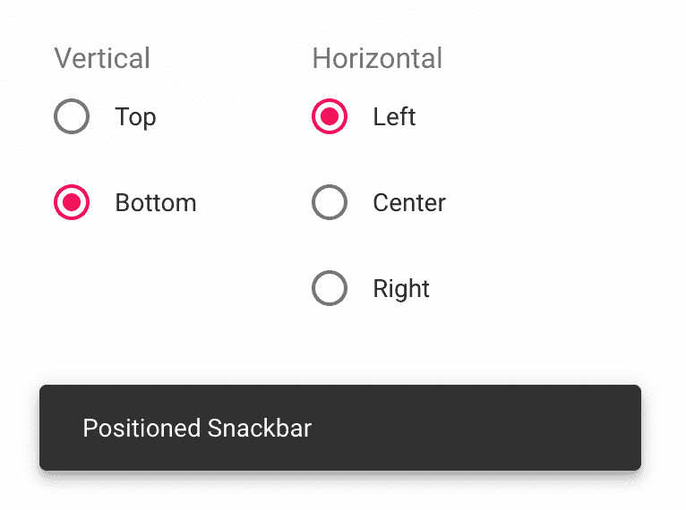

如果你更改了任何位置控制值，snackbar 将移动到新的位置。例如，如果你将垂直锚点更改为顶部，并将水平锚点更改为右侧，以下是你会看到的内容：

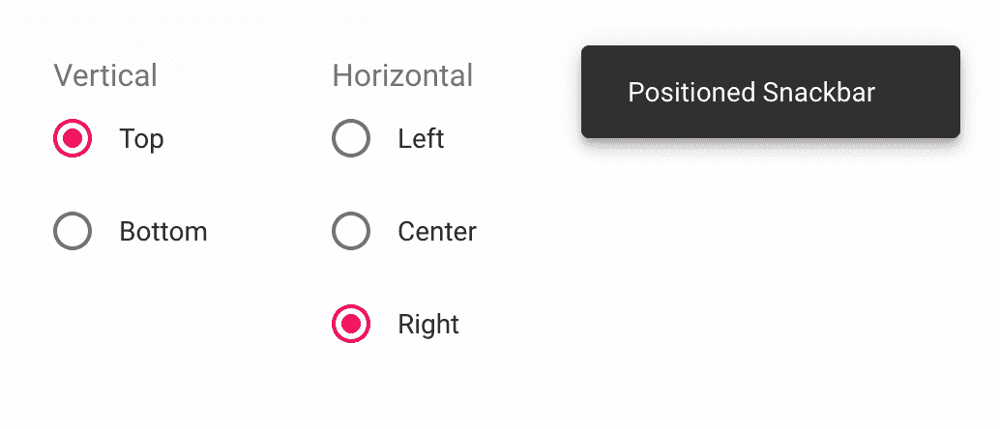

# 它是如何工作的...

在本例中的两个单选按钮组仅用于说明可用的不同位置值组合。在实际应用中，当你显示 snackbars 时，你不会有可配置的状态来改变 snackbars 的位置。相反，你应该将传递给 `anchorOrigin` 属性的值视为在启动时设置的一次性配置值。

依赖于状态值并不好，就像本例中那样：

```js
<Snackbar
  anchorOrigin={{
    vertical,
    horizontal
  }}
  open={true}
  message="Positioned Snackbar"
/>
```

相反，你应该静态地设置 `anchorOrigin` 值：

```js
<Snackbar
  anchorOrigin={{
    vertical: 'top'
    horizontal: 'right'
  }}
  open={true}
  message="Positioned Snackbar"
/>
```

# 还有更多...

一旦你知道你想要将 snackbars 定位在哪里，你就可以创建一个具有定义好的 `anchorOrigin` 值的自己的 `Snackbar` 组件。以下是一个示例：

```js
const MySnackbar = props => (
  <Snackbar
    anchorOrigin={{
      vertical: 'top',
      horizontal: 'right'
    }}
    {...props}
  />
);
```

在你的应用程序中任何使用 `MySnackbar` 的地方，snackbar 都将在屏幕的右上角显示。否则，`MySnackbar` 就像是一个普通的 `Snackbar` 组件。

# 相关内容

+   `Snackbar` 示例：[`material-ui.com/demos/snackbars/`](https://material-ui.com/demos/snackbars/)

+   `Snackbar` API 文档：[`material-ui.com/api/snackbar/`](https://material-ui.com/api/snackbar/)

# 错误边界和错误 snackbars

**React 中的错误边界**使你能够在组件尝试渲染时捕获错误。你可以在错误边界中使用 `Snackbar` 组件来显示捕获的错误。此外，你可以对 snackbars 进行样式化，使错误与普通消息在视觉上有所区别。

# 如何实现...

假设你在应用程序的最高级别有一个错误边界，并且你想使用 `Snackbar` 组件向用户显示错误信息。以下是一个示例，展示了你可以如何做到这一点：

```js
import React, { Fragment, Component } from 'react';

import { withStyles } from '@material-ui/core/styles';
import Snackbar from '@material-ui/core/Snackbar';
import Button from '@material-ui/core/Button';

const styles = theme => ({
  error: {
    backgroundColor: theme.palette.error.main,
    color: theme.palette.error.contrastText
  }
});

const ErrorBoundary = withStyles(styles)(
  class extends Component {
    state = { error: null };

    onClose = () => {
      this.setState({ error: null });
    };

    componentDidCatch(error) {
      this.setState({ error });
    }

    render() {
      const { classes } = this.props;

      return (
        <Fragment>
          {this.state.error === null && this.props.children}
          <Snackbar
            open={Boolean(this.state.error)}
            message={
              this.state.error !== null && this.state.error.toString()
            }
            ContentProps={{ classes: { root: classes.error } }}
          />
        </Fragment>
      );
    }
  }
);

const MyButton = () => {
  throw new Error('Random error');
};

export default () => (
  <ErrorBoundary>
    <MyButton />
  </ErrorBoundary>
);
```

当你加载此屏幕时，`MyButton` 组件在渲染时抛出错误。以下是你会看到的内容：

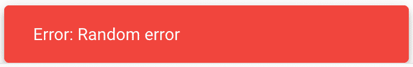

它明确地抛出一个错误，这样你就可以看到错误边界机制在起作用。在实际应用中，错误可能是由渲染过程中调用的任何函数触发的。

# 它是如何工作的...

让我们首先更仔细地看看`ErrorBoundary`组件。它有一个初始为 null 的`error`状态。`componentDidCatch()`生命周期方法在发生错误时改变这个状态：

```js
componentDidCatch(error) {
  this.setState({ error });
}
```

接下来，让我们更仔细地看看`render()`方法：

```js
render() {
  const { classes } = this.props;

  return (
    <Fragment>
      {this.state.error === null && this.props.children}
      <Snackbar
        open={Boolean(this.state.error)}
        message={
          this.state.error !== null && this.state.error.toString()
        }
        ContentProps={{ classes: { root: classes.error } }}
      />
    </Fragment>
  );
}
```

它使用`error`状态来确定是否应该渲染子组件。当`error`状态非空时，渲染子组件没有意义，因为你将陷入错误被抛出和处理的无限循环。`error`状态还用作`open`属性，以确定 snackbar 是否应该显示，以及作为消息文本。

`ContentProps`属性用于样式化 snackbar，使其看起来像错误。`error`类使用`theme`值来改变背景和文字颜色：

```js
const styles = theme => ({
  error: {
    backgroundColor: theme.palette.error.main,
    color: theme.palette.error.contrastText
  }
});
```

# 还有更多...

这个示例中使用的错误边界覆盖了整个应用程序。从一方面来说，你可以一次性在整个应用程序中应用错误处理，这是好的。但这也是不好的，因为整个用户界面都消失了，因为错误边界不知道哪个组件失败了。

因为错误边界是组件，你可以在组件树的任何级别放置尽可能多的它们。这样，你可以在屏幕上保持 UI 中未失败的部分可见的同时显示 Material-UI `error` snackbars。

让我们更改示例中使用的错误边界的范围。首先，你可以更改`MyButton`实现，使其仅在布尔属性为`true`时抛出错误：

```js
const MyButton = ({ label, throwError }) => {
  if (throwError) {
    throw new Error('Random error');
  }
  return <Button>{label}</Button>;
};
```

现在你可以渲染一个带有指定标签的按钮。如果`throwError`为`true`，则由于错误，没有任何内容渲染。接下来，让我们更改示例的标记，以包含多个按钮和多个`error`边界：

```js
export default () => (
  <Fragment>
    <ErrorBoundary>
      <MyButton label="First Button" />
    </ErrorBoundary>
    <ErrorBoundary>
      <MyButton label="Second Button" throwError />
    </ErrorBoundary>
  </Fragment>
);
```

第一个按钮渲染时没有任何问题。然而，如果错误边界像之前那样是全包容性的，那么这个按钮就不会显示。第二个按钮抛出错误，因为`throwError`属性为真。因为这个按钮有自己的错误边界，所以它不会阻止其他工作正常的 UI 部分渲染。现在当你运行示例时，你会看到以下内容：

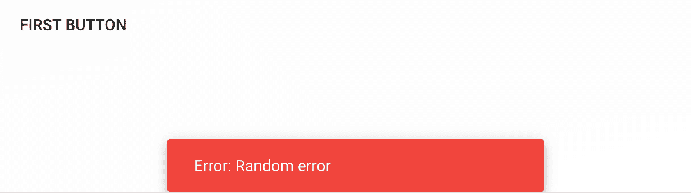

# 参见

+   React `error`边界：[`reactjs.org/docs/error-boundaries.html`](https://reactjs.org/docs/error-boundaries.html)

+   `Snackbar` 示例：[ https://material-ui.com/demos/snackbars/](https://material-ui.com/demos/snackbars/)

+   `Snackbar` API 文档：[`material-ui.com/api/snackbar/`](https://material-ui.com/api/snackbar/)

# 带有操作的 Snackbars

Material-UI snackbars 的目的是向用户显示简短的消息。此外，你还可以在 snackbar 中嵌入用户的下一步操作。

# 如何操作...

假设您想在 Snackbar 中添加一个简单的按钮来关闭 Snackbar。这可以在 Snackbar 自动关闭之前关闭它很有用。或者，您可能希望用户通过手动关闭来明确确认消息。以下是向`Snackbar`组件添加关闭按钮的代码：

```js
import React, { Fragment, useState } from 'react';
import { Route, Link } from 'react-router-dom';

import Snackbar from '@material-ui/core/Snackbar';
import Button from '@material-ui/core/Button';
import IconButton from '@material-ui/core/IconButton';
import Typography from '@material-ui/core/Typography';

import CloseIcon from '@material-ui/icons/Close';

export default function Snackbars() {
  const [open, setOpen] = useState(false);

  return (
    <Fragment>
      <Button onClick={() => setOpen(true)}>Do Something</Button>
      <Snackbar
        open={open}
        onClose={() => setOpen(false)}
        message="All done doing the thing"
        action={[
          <IconButton color="inherit" onClick={() => setOpen(false)}>
            <CloseIcon />
          </IconButton>
        ]}
      />
    </Fragment>
  );
}
```

当屏幕首次加载时，您将只看到一个按钮：

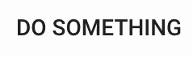

点击此按钮将显示 Snackbar：

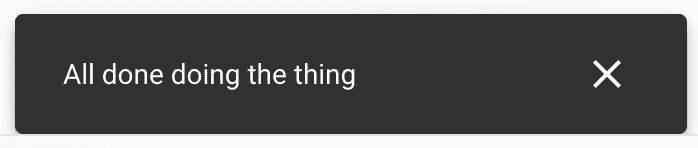

在 Snackbar 右侧的关闭图标按钮，当点击时，会关闭 Snackbar。

# 它是如何工作的...

关闭按钮是通过`action`属性添加到`Snackbar`组件中的，该属性接受节点或节点数组。`SnackbarContent`组件负责应用样式以在 Snackbar 内对齐操作。

# 还有更多...

当用户在您的应用程序中创建新资源时，您可能希望让他们知道资源是否成功创建。Snackbar 是完成这个任务的理想工具，因为它不会强制用户离开他们可能正在进行的事情。如果 Snackbar 中包含一个链接到新创建资源的操作按钮，那就更好了。

让我们修改这个示例，当用户点击 CREATE 按钮时，他们会看到一个包含以下内容的 Snackbar：

+   简短的消息

+   关闭操作

+   新资源的链接

让我们添加来自`react-router-dom`的路由，并将链接添加到 Snackbar 中。以下是新的标记：

```js
<Fragment>
  <Route
    exact
    path="/"
    render={() => (
      <Button onClick={() => setOpen(true)}>create thing</Button>
    )}
  />
  <Route
    exact
    path="/thing"
    render={() => <Typography>The Thing</Typography>}
  />
  <Snackbar
    open={open}
    onClose={() => setOpen(false)}
    message="Finished creating thing"
    action={[
      <Button
        color="secondary"
        component={Link}
        to="/thing"
        onClick={() => setOpen(false)}
      >
        The Thing
      </Button>,
      <IconButton color="inherit" onClick={() => setOpen(false)}>
        <CloseIcon />
      </IconButton>
    ]}
  />
</Fragment>
```

第一条路由是用于索引页面的，因此，当屏幕首次加载时，用户将看到由该路由渲染的按钮：

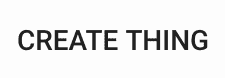

当您点击此按钮时，您将看到一个包含指向新创建资源的链接的 Snackbar：

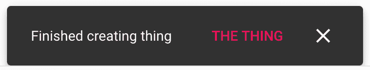

现在您已经为用户提供了一个轻松导航到资源的途径，而不会打断他们当前正在做的事情。

# 参见

+   React 路由指南：[`reacttraining.com/react-router/web/guides/quick-start`](https://reacttraining.com/react-router/web/guides/quick-start)

+   `Snackbar` 演示：[`material-ui.com/demos/snackbars/`](https://material-ui.com/demos/snackbars/)

+   `Snackbar` API 文档：[`material-ui.com/api/snackbar/`](https://material-ui.com/api/snackbar/)

+   `按钮` API 文档：[`material-ui.com/api/button/`](https://material-ui.com/api/button/)

+   `图标按钮` API 文档：[`material-ui.com/api/icon-button/`](https://material-ui.com/api/icon-button/)

# 队列 Snackbar

在较大的 Material-UI 应用程序中，您可能会发现自己在一个很短的时间内发送了多个 Snackbar 消息。为了处理这种情况，您可以创建一个队列来处理所有 Snackbar 消息，以确保只显示最新的通知，并且正确处理过渡。

# 如何操作...

假设你的应用程序中有几个组件需要向用户发送 snackbar 消息。在所有地方手动渲染`Snackbar`组件将会很繁琐——尤其是如果你只是想显示简单的文本 snackbar。

一种替代方法是实现一个高阶组件，它通过调用一个函数并将文本作为参数传递来包装你的组件，使其能够显示消息。然后，你可以包装任何需要 snackbar 功能的组件。以下是代码的样子：

```js
import React, { Fragment, useState } from 'react';

import Snackbar from '@material-ui/core/Snackbar';
import Button from '@material-ui/core/Button';
import IconButton from '@material-ui/core/IconButton';

import CloseIcon from '@material-ui/icons/Close';

const withMessage = Wrapped =>
  function WithMessage(props) {
    const [queue, setQueue] = useState([]);
    const [open, setOpen] = useState(false);
    const [message, setMessage] = useState('');

    const sendMessage = msg => {
      const newQueue = [...queue, msg];
      if (newQueue.length === 1) {
        setOpen(true);
        setMessage(msg);
      }
    };

    const onClose = () => {
      setOpen(false);
    };

    const onExit = () => {
      const [msg, ...rest] = queue;

      if (msg) {
        setQueue(rest);
        setOpen(true);
        setMessage(msg);
      }
    };

    return (
      <Fragment>
        <Wrapped message={sendMessage} {...props} />
        <Snackbar
          key={message}
          open={open}
          message={message}
          autoHideDuration={4000}
          onClose={onClose}
          onExit={onExit}
        />
      </Fragment>
    );
  };

const QueuingSnackbars = withMessage(({ message }) => {
  const [counter, setCounter] = useState(0);

  const onClick = () => {
    const newCounter = counter + 1;
    setCounter(newCounter);
    message(`Message ${newCounter}`);
  };

  return <Button onClick={onClick}>Message</Button>;
});

export default QueuingSnackbars;
```

当屏幕首次加载时，你会看到一个消息按钮。点击它将显示一个类似这样的 snackbar 消息：

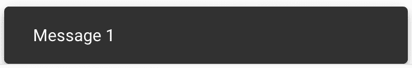

再次点击消息按钮将清除当前的 snackbar，通过在屏幕上视觉上将其移除，然后再将新的 snackbar 转换到屏幕上。即使你连续快速点击按钮几次，一切都会顺利工作，你总是会看到最新的消息：

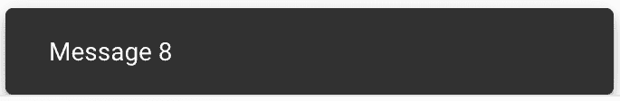

# 它是如何工作的...

让我们先看看`QueuingSnackbars`组件，它渲染了当点击时发送消息的按钮：

```js
const QueuingSnackbars = withMessage(({ message }) => {
  const [counter, setCounter] = useState(0);

  const onClick = () => {
    const newCounter = counter + 1;
    setCounter(newCounter);
    message(`Message ${newCounter}`);
  };

  return <Button onClick={onClick}>Message</Button>;
});
```

`withMessage()`包装器为组件提供了一个作为属性的`message()`函数。如果你查看`onClick()`处理程序，你可以在其中看到`message()`函数的作用。

接下来，让我们分解`withMessage()`高阶组件。我们将从标记开始，逐步向下：

```js
<Fragment>
  <Wrapped message={sendMessage} {...props} />
  <Snackbar
    key={message}
    open={open}
    message={message}
    autoHideDuration={4000}
    onClose={onClose}
    onExit={onExit}
  />
</Fragment>
```

`Wrapped`组件是`withMessage()`被调用的组件。它传递了它通常会被传递的正常属性，加上`message()`函数。旁边是`Snackbar`组件。这里有两个值得注意的属性：

+   `key`：这个值由`Snackbar`内部使用，以确定是否正在显示新消息。它应该是一个唯一的值。

+   `onExit`：当关闭的 snackbar 的转换完成时被调用。

接下来，让我们看看`sendMessage()`函数：

```js
const sendMessage = msg => {
  const newQueue = [...queue, msg];
  if (newQueue.length === 1) {
    setOpen(true);
    setMessage(msg);
  }
};
```

当一个组件想要显示 snackbar 消息时，这个函数会被调用。它将`message`字符串放入队列。如果消息是队列中唯一的项，那么`open`和`message`状态会立即更新。

接下来，让我们看看`onClose()`函数。当 snackbar 关闭时，这个函数会被调用：

```js
const onClose = () => {
  setOpen(false);
};
```

这个函数的唯一任务就是确保打开状态为 false。

最后，让我们看看当 snackbar 完成其退出转换时被调用的`onExit()`函数：

```js
const onExit = () => {
  const [msg, ...rest] = queue;

  if (msg) {
    setQueue(rest);
    setOpen(true);
    setMessage(msg);
  }
};
```

队列中的第一条消息被分配给`message`常量。如果有消息，它将成为活动消息状态，并且下一个 snackbar 将被打开。此时，项目也将从队列中移除。

# 参见

+   `Snackbar`演示：[`material-ui.com/demos/snackbars/`](https://material-ui.com/demos/snackbars/)

+   `Snackbar` API 文档：[`material-ui.com/api/snackbar/`](https://material-ui.com/api/snackbar/)

+   `Button` API 文档：[`material-ui.com/api/button/`](https://material-ui.com/api/button/)

+   `IconButton` API 文档：[`material-ui.com/api/icon-button/`](https://material-ui.com/api/icon-button/)
