# 按钮 - 启动操作

在本章中，您将学习以下主题：

+   按钮变体

+   按钮强调

+   链接按钮

+   浮动操作

+   图标按钮

+   按钮大小

# 简介

在 Material-UI 应用程序中，按钮用于启动操作。用户点击按钮，就会发生某些事情。按钮被激活时会发生什么完全取决于您。Material-UI 按钮的复杂度从简单的文本按钮到浮动操作按钮不等。

# 按钮变体

Material-UI 的 `Button` 组件存在三种变体之一。这些如下所示：

+   `文本`

+   `Outlined`

+   `Filled`

# 如何操作...

下面是一些渲染三个 `Button` 组件的代码，每个组件都明确设置了它们的 `variant` 属性：

```js
import React from 'react';

import { withStyles } from '@material-ui/core/styles';
import Button from '@material-ui/core/Button';
import Grid from '@material-ui/core/Grid';

const styles = theme => ({
  container: {
    margin: theme.spacing(1)
  }
});

const ButtonVariants = withStyles(styles)(({ classes }) => (
  <Grid
    container
    direction="column"
    spacing={2}
    className={classes.container}
  >
    <Grid item>
      <Button variant="text">Text</Button>
    </Grid>
    <Grid item>
      <Button variant="outlined">Outlined</Button>
    </Grid>
    <Grid item>
      <Button variant="contained">Contained</Button>
    </Grid>
  </Grid>
));

export default ButtonVariants;
```

当您加载屏幕时，您将看到以下内容：

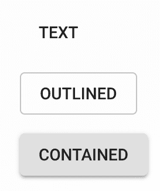

# 它是如何工作的...

`variant` 属性控制渲染的按钮类型。这三个变体可以根据您的需要用于不同的场景或上下文。例如，如果这是您需要的，TEXT 按钮的注意力较少。相反，CONTAINED 按钮试图成为用户明显的交互点。

默认变体是 `text`。我发现当您明确包含变体时，`Button` 标记更容易阅读。这样，您或任何阅读代码的人都不必记住默认的 `variant` 是什么。

# 相关内容

+   `Button` 示例：[`material-ui.com/demos/buttons/`](https://material-ui.com/demos/buttons/)

+   `Button` API 文档：[`material-ui.com/api/button/`](https://material-ui.com/api/button/)

# 按钮强调

`Button` 的 `color` 和 `disabled` 属性允许您控制按钮相对于其周围环境的强调程度。例如，您可以指定按钮应使用 `primary` 颜色值。按钮的强调是 `variant` 和 `color` 属性累积的结果。您可以调整这两个属性，直到按钮具有适当的强调。

没有正确的强调级别。请使用适合您应用程序上下文的内容。

# 如何操作...

下面是一些显示您可以应用于 `Button` 组件的不同颜色值的代码：

```js
import React from 'react';

import { withStyles } from '@material-ui/core/styles';
import Button from '@material-ui/core/Button';
import Grid from '@material-ui/core/Grid';
import Typography from '@material-ui/core/Typography';

const styles = theme => ({
  container: {
    margin: theme.spacing(1)
  }
});

const ButtonEmphasis = withStyles(styles)(({ classes, disabled }) => (
  <Grid
    container
    direction="column"
    spacing={16}
    className={classes.container}
  >
    <Grid item>
      <Typography variant="h6">Default</Typography>
    </Grid>
    <Grid item>
      <Grid container spacing={16}>
        <Grid item>
          <Button variant="text" disabled={disabled}>
            Text
          </Button>
        </Grid>
        <Grid item>
          <Button variant="outlined" disabled={disabled}>
            Outlined
          </Button>
        </Grid>
        <Grid item>
          <Button variant="contained" disabled={disabled}>
            Contained
          </Button>
        </Grid>
      </Grid>
    </Grid>
    <Grid item>
      <Typography variant="h6">Primary</Typography>
    </Grid>
    <Grid item>
      <Grid container spacing={16}>
        <Grid item>
          <Button variant="text" color="primary" disabled={disabled}>
            Text
          </Button>
        </Grid>
        <Grid item>
          <Button
            variant="outlined"
            color="primary"
            disabled={disabled}
          >
            Outlined
          </Button>
        </Grid>
        <Grid item>
          <Button
            variant="contained"
            color="primary"
            disabled={disabled}
          >
            Contained
          </Button>
        </Grid>
      </Grid>
    </Grid>
    <Grid item>
      <Typography variant="h6">Secondary</Typography>
    </Grid>
    <Grid item>
      <Grid container spacing={16}>
        <Grid item>
          <Button
            variant="text"
            color="secondary"
            disabled={disabled}
          >
            Text
          </Button>
        </Grid>
        <Grid item>
          <Button
            variant="outlined"
            color="secondary"
            disabled={disabled}
          >
            Outlined
          </Button>
        </Grid>
        <Grid item>
          <Button
            variant="contained"
            color="secondary"
            disabled={disabled}
          >
            Contained
          </Button>
        </Grid>
      </Grid>
    </Grid>
  </Grid>
));

export default ButtonEmphasis;
```

当屏幕首次加载时，您将看到以下内容：

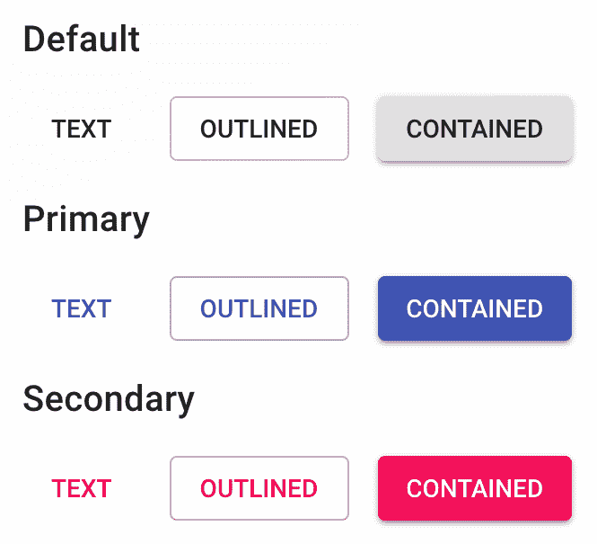

如果 `disabled` 属性为 `true`，您将看到以下内容：

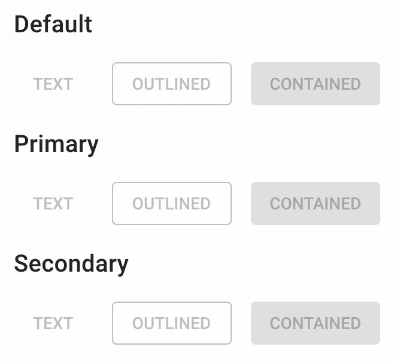

# 它是如何工作的...

此示例旨在说明 `variant` 和 `color` 属性的组合结果。或者，您可以完全禁用按钮，同时仍然控制其强调方面的 `variant`（`color` 属性对禁用按钮没有影响）。

最强调到最不强调的 `variant` 值的顺序如下：

1.  `filled`

1.  `概述`

1.  `text`

最强调到最不强调的 `color` 值的顺序如下：

1.  `primary`

1.  `secondary`

1.  `默认`

通过结合这两个属性值，你可以控制按钮的强调。有时，你确实需要一个按钮非常突出，因此你可以将`contained`和`primary`结合使用：

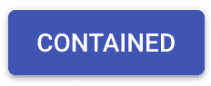

如果你希望你的按钮完全不突出，你可以将`text`变体与`default`颜色结合使用：

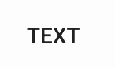

# 更多内容...

如果你的按钮放置在另一个 Material-UI 组件中，确保正确的颜色选择可能会很困难。例如，假设你有一个`AppBar`组件中的按钮，如下所示：

```js
<AppBar color={appBarColor}>
  <Toolbar>
    <Grid container spacing={16}>
      <Grid item>
        <Button variant="text" disabled={disabled}>
          Text
        </Button>
      </Grid>
      <Grid item>
        <Button variant="outlined" disabled={disabled}>
          Outlined
        </Button>
      </Grid>
      <Grid item>
        <Button variant="contained" disabled={disabled}>
          Contained
        </Button>
      </Grid>
    </Grid>
  </Toolbar>
</AppBar>
```

如果`AppBar`颜色值是`default`，你会看到以下内容：

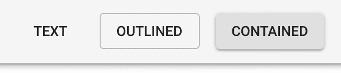

这实际上看起来并不太糟糕，因为按钮本身正在使用默认颜色。但是，如果你将`AppBar`颜色更改为`primary`会发生什么呢：

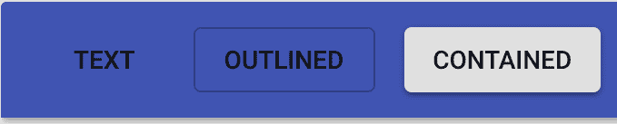

`contained`变体是唯一一个看起来几乎像是属于应用栏的按钮。让我们修改按钮，使它们都使用`inherit`颜色属性值，如下所示：

```js
<AppBar color={appBarColor}>
  <Toolbar>
    <Grid container spacing={16}>
      <Grid item>
        <Button
          variant="text"
          disabled={disabled}
          color="inherit"
        >
          Text
        </Button>
      </Grid>
      <Grid item>
        <Button
          variant="outlined"
          disabled={disabled}
          color="inherit"
        >
          Outlined
        </Button>
      </Grid>
      <Grid item>
        <Button
          variant="contained"
          disabled={disabled}
          color="inherit"
        >
          Contained
        </Button>
      </Grid>
    </Grid>
  </Toolbar>
</AppBar>
```

现在，你的应用栏和按钮看起来是这样的：

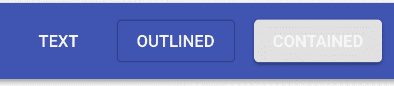

文本和轮廓按钮现在看起来好多了。它们已经从其父组件继承了主题字体颜色。实际上，包含按钮现在看起来更糟，因为它正在使用`继承`作为其字体颜色。这是因为当继承颜色时，包含按钮的背景颜色不会改变。因此，相反，你必须自己更改包含按钮的颜色。

让我们看看我们是否可以通过实现一个返回要使用颜色的函数来自动设置包含按钮的颜色，基于其父元素的色彩：

```js
function buttonColor(parentColor) {
  if (parentColor === 'primary') {
    return 'secondary';
  }

  if (parentColor === 'secondary') {
    return 'primary';
  }

  return 'default';
}
```

现在，当你设置你包含按钮的`颜色`时，你可以使用这个`函数`。只需确保你以参数的形式传递父元素的`颜色`，如下所示：

```js
<Button
  variant="contained"
  disabled={disabled}
  color={buttonColor(appBarColor)}
>
  Contained
</Button>
```

现在，如果你将应用栏颜色更改为`primary`，你的按钮看起来是这样的：

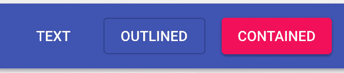

如果你将应用栏颜色更改为`secondary`，你的按钮看起来是这样的：

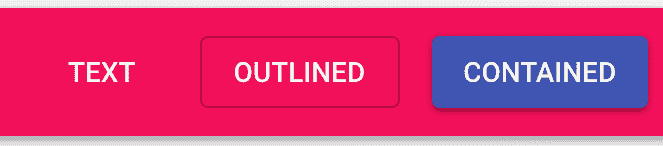

快速回顾：TEXT 和 OUTLINED 按钮可以安全地使用`inherit`作为颜色。如果你正在处理包含按钮，你需要采取额外步骤来使用正确的颜色，就像你使用`buttonColor()`函数所做的那样。

# 参见

+   `Button` 示例：[`material-ui.com/demos/buttons/`](https://material-ui.com/demos/buttons/)

+   `Button` API 文档：[`material-ui.com/api/button/`](https://material-ui.com/api/button/)

+   `AppBar` API 文档：[`material-ui.com/api/app-bar/`](https://material-ui.com/api/app-bar/)

+   `Toolbar` API 文档：[`material-ui.com/api/toolbar/`](https://material-ui.com/api/toolbar/)

# 链接按钮

Material-UI 的 `Button` 组件也可以用作链接，指向应用中的其他位置。最常见的例子是将按钮用作通过 `react-router` 声明的路由的链接。

# 如何实现...

假设你的应用有三个页面，你需要三个按钮将它们链接到每个页面。随着应用的扩展，你可能还需要从任意位置链接到它们。以下是实现这一点的代码：

```js
import React from 'react';
import { Switch, Route, Link } from 'react-router-dom';

import { withStyles } from '@material-ui/core/styles';
import Grid from '@material-ui/core/Grid';
import Button from '@material-ui/core/Button';
import Typography from '@material-ui/core/Typography';

const styles = theme => ({
  content: {
    margin: theme.spacing(2)
  }
});

const LinkButtons = withStyles(styles)(({ classes }) => (
  <Grid container direction="column" className={classes.container}>
    <Grid item>
      <Grid container>
        <Grid item>
          <Button component={Link} to="/">
            Home
          </Button>
        </Grid>
        <Grid item>
          <Button component={Link} to="/page1">
            Page 1
          </Button>
        </Grid>
        <Grid item>
          <Button component={Link} to="/page2">
            Page 2
          </Button>
        </Grid>
      </Grid>
    </Grid>
    <Grid item className={classes.content}>
      <Switch>
        <Route
          exact
          path="/"
          render={() => <Typography>home content</Typography>}
        />
        <Route
          path="/page1"
          render={() => <Typography>page 1 content</Typography>}
        />
        <Route
          path="/page2"
          render={() => <Typography>page 2 content</Typography>}
        />
      </Switch>
    </Grid>
  </Grid>
));

export default LinkButtons;
```

设置此示例以运行的 Storybook 代码包括一个 `BrowserRouter` 组件。在你的代码中，你需要将此组件包含为任何 `Route` 组件的父组件。

当屏幕首次加载时，你会看到以下内容：

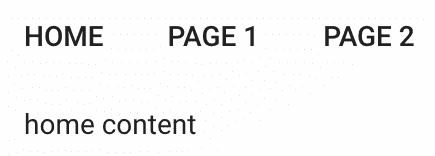

如果你点击“页面 2”按钮，你将被带到 `/page2`，内容将相应更新：

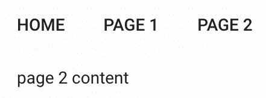

# 它是如何工作的...

当你使用 `react-router` 作为应用的路由器时，你可以使用来自 `react-router-dom` 的 `Link` 组件来渲染链接。由于你想要渲染 Material-UI 按钮以获得一致的 Material-UI 主题和用户交互行为，你不能直接渲染 `Link` 组件。相反，你可以将底层的 `Button` 组件变成一个 `Link` 组件，如下所示：

```js
<Button component={Link} to="/">
  Home
</Button>
```

通过使用 `component` 属性，你可以告诉 `Button` 组件将样式和事件处理逻辑应用到该组件而不是默认样式。然后，任何你通常传递给 `Link` 的附加属性都设置在 `Button` 组件上——并将它们转发给 `Link`。例如，`to` 属性不是 `Button` 的属性，所以它被传递给 `Link`，这是它工作所必需的。

# 还有更多...

这个示例的一个问题是，没有视觉指示按钮链接到当前 URL。例如，当应用首次加载 `/` URL 时，主页按钮应该从其他按钮中突出出来。一种方法是将 `color` 属性更改为 `primary`，如果按钮被认为是活动的。

你可以使用来自 `react-router-dom` 的 `NavLink` 组件。这个组件允许你设置仅在链接活动时应用的样式或类名。挑战在于，你只需要在活动时更改一个简单的 `Button` 属性。维护活动按钮的样式似乎有点多，尤其是如果你想使你的 UI 容易主题化。

相反，你可以创建一个按钮抽象，使用 `react-router` 工具在活动时渲染适当的 `Button` 属性，如下所示：

```js
const NavButton = ({ color, ...props }) => (
  <Switch>
    <Route
      exact
      path={props.to}
      render={() => (
        <Button color="primary" component={Link} {...props} />
      )}
    />
    <Route
      path="/"
      render={() => <Button component={Link} {...props} />}
    />
  </Switch>
);
```

`NavButton`组件使用`Switch`和`Route`组件来确定活动路由。它是通过比较传递给`NavButton`的`to`属性与当前 URL 来做到这一点的。如果找到匹配项，则渲染带有`color`属性设置为`primary`的`Button`组件。否则，不指定颜色（如果`Switch`中的第一个`Route`不匹配，则第二个`Route`匹配一切）。以下是新组件在操作中的样子：

```js
<Grid container>
  <Grid item>
    <NavButton to="/">Home</NavButton>
  </Grid>
  <Grid item>
    <NavButton to="/page1">Page 1</NavButton>
  </Grid>
  <Grid item>
    <NavButton to="/page2">Page 2</NavButton>
  </Grid>
</Grid>
```

这是屏幕首次加载时的样子：

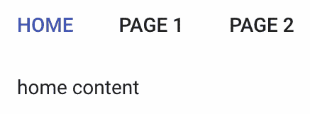

因为初始 URL 是`/`，并且第一个`NavButton`组件有一个`to`属性为`/`，所以主页按钮颜色被标记为`primary`。

# 参见

+   `Button`演示：[`material-ui.com/demos/buttons/`](https://material-ui.com/demos/buttons/)

+   `Button` API 文档：[`material-ui.com/api/button/`](https://material-ui.com/api/button/)

+   React Router 指南：[`reacttraining.com/react-router/web/guides/quick-start`](https://reacttraining.com/react-router/web/guides/quick-start)

# 浮动操作

你的应用程序中的某些屏幕将有一个主要操作。例如，如果你在一个列出项目的屏幕上，主要操作可能是添加新项目。如果你在一个项目详情页面上，主要操作可能是编辑项目。Material-UI 提供了一个`Fab`组件（浮动操作按钮），以突出显示主要屏幕操作。

# 如何实现...

浮动操作按钮的常见情况是向用户展示一个带有表示要执行的操作的图标、位于屏幕右下角的圆形按钮。此外，浮动操作按钮的位置是`固定`的，这意味着当用户滚动页面时，主要操作始终可见。

让我们编写一些代码来`定位`一个位于屏幕右下角的浮动操作按钮，以指示添加操作，如下所示：

```js
import React, { Fragment } from 'react';

import { withStyles } from '@material-ui/core/styles';
import Fab from '@material-ui/core/Fab';
import AddIcon from '@material-ui/icons/Add';

const styles = theme => ({
  fab: {
    margin: 0,
    top: 'auto',
    left: 'auto',
    bottom: 20,
    right: 20,
    position: 'fixed'
  }
});

const FloatingActions = withStyles(styles)(({ classes, fabColor }) => (
  <Fragment>
    <Fab className={classes.fab} color={fabColor}>
      <AddIcon />
    </Fab>
  </Fragment>
));

export default FloatingActions;
```

当你加载屏幕时，你会在屏幕右下角看到以下内容：

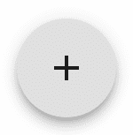

该屏幕组件有一个`fabColor`属性，用于设置`Fab`组件的颜色。以下是`primary`颜色的样子：

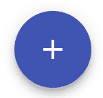

最后，这是以`secondary`颜色为背景的浮动操作按钮的样子：

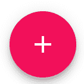

# 它是如何工作的...

`Fab`组件与`Button`组件非常相似。实际上，你过去使用`Button`来渲染浮动操作按钮，使用`fab`变体。按钮的圆角样式由`Fab`处理。你只需要支持图标和任何其他按钮属性，例如`onClick`处理程序。此外，你可以在浮动操作按钮中包含文本。如果你这样做，你应该使用`extended`变体，以便正确地样式化按钮的形状（顶部和底部是平的而不是圆角）。

# 还有更多...

让我们为`Fab`组件创建一个小型的抽象，它应用`fab`样式并使用正确的变体。由于`extended`变体仅在按钮中有文本时才有用，因此你不需要每次使用时都记住设置它。如果你的应用程序既有图标又有图标加文本的浮动操作按钮，这可能会特别令人困惑。

这是实现新`Fab`组件的代码：

```js
const ExtendedFab = withStyles(styles)(({ classes, ...props }) => {
  const isExtended = React.Children.toArray(props.children).find(
    child => typeof child === 'string'
  );

  return (
    <Fab
      className={classes.fab}
      variant={isExtended && 'extended'}
      {...props}
    />
  );
});
```

`className`属性设置方式与之前相同。当`isExtended`为`true`时，`variant`属性设置为`extended`。为了找出这一点，它使用`React.Children.toArray()`函数将`children`属性转换为普通数组。然后，`find()`方法查找任何文本元素。如果找到了一个，`isExtended`将为`true`，并使用`extended`变体。

这是如何使用新的`ExtendedFab`按钮的：

```js
export default ({ fabColor }) => (
  <ExtendedFab color={fabColor}>
    Add
    <AddIcon />
  </ExtendedFab>
);
```

`添加`文本放置在`AddIcon`组件之前。这个`ExtendedFab`组件有两个子组件，其中一个是有文本的，这意味着将使用`extended`变体。以下是它的样子：

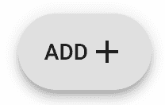

# 参见

+   `按钮`演示：[`material-ui.com/demos/buttons/`](https://material-ui.com/demos/buttons/)

+   `Fab` API 文档：[`material-ui.com/api/fab/`](https://material-ui.com/api/fab/)

# 图标按钮

有时，你需要一个仅是图标的按钮。这就是`IconButton`组件派上用场的地方。你可以传递任何图标组件作为子组件，然后你就有了一个图标按钮。

# 如何做到这一点...

图标按钮在你处理受限的屏幕空间或想要直观地显示某物的切换状态时特别有用。例如，如果启用/禁用状态表示实际的麦克风，用户切换麦克风的开关可能更容易。

让我们在此基础上构建，并在应用程序中使用图标按钮实现麦克风和音量的切换控制。以下是代码：

```js
import React, { useState } from 'react';

import IconButton from '@material-ui/core/IconButton';
import Grid from '@material-ui/core/Grid';

import MicIcon from '@material-ui/icons/Mic';
import MicOffIcon from '@material-ui/icons/MicOff';
import VolumeUpIcon from '@material-ui/icons/VolumeUp';
import VolumeOffIcon from '@material-ui/icons/VolumeOff';

export default function IconButtons({ iconColor }) {
  const [mic, setMic] = useState(true);
  const [volume, setVolume] = useState(true);

  return (
    <Grid container>
      <Grid item>
        <IconButton color={iconColor} onClick={() => setMic(!mic)}>
          {mic ? <MicIcon /> : <MicOffIcon />}
        </IconButton>
      </Grid>
      <Grid item>
        <IconButton
          color={iconColor}
          onClick={() => setVolume(!volume)}
        >
          {volume ? <VolumeUpIcon /> : <VolumeOffIcon />}
        </IconButton>
      </Grid>
    </Grid>
  );
}
```

当你首次加载屏幕时，你会看到以下内容：

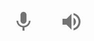

如果你点击两个图标按钮，你会看到以下内容：

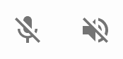

无论麦克风或音量的状态如何，用户仍然可以有一个对项目及其状态的视觉指示。

# 它是如何工作的...

此屏幕的组件维护两个状态：`mic`和`volume`。这两个都是布尔值，用于控制`IconButton`组件中显示的图标：

```js
const [mic, setMic] = useState(true);
const [volume, setVolume] = useState(true);
```

然后，基于这些状态，当`状态`改变时，图标会相应交换，为用户提供有用的视觉反馈：

```js
<Grid item>
  <IconButton color={iconColor} onClick={() => setMic(!mic)}>
    {mic ? <MicIcon /> : <MicOffIcon />}
  </IconButton>
</Grid>
<Grid item>
  <IconButton
    color={iconColor}
    onClick={() => setVolume(!volume)}
  >
    {volume ? <VolumeUpIcon /> : <VolumeOffIcon />}
  </IconButton>
</Grid>
```

此外，此屏幕的组件接受一个`iconColor`属性，它可以是`default`、`primary`或`secondary`。以下是`primary`颜色的样子：


# 参见

+   `按钮`演示：[`material-ui.com/demos/buttons/`](https://material-ui.com/demos/buttons/)

+   `IconButton` API 文档：[`material-ui.com/api/icon-button/`](https://material-ui.com/api/icon-button/)

# 按钮尺寸

Material-UI 按钮支持 T 恤式尺寸。与其试图为您的按钮找到完美的尺寸，您可以使用最接近您需求的预定义尺寸之一。

# 如何做到这一点...

如果您需要调整按钮的大小，可以使用`small`、`medium`（默认值）或`large`。以下是如何设置`Button`组件的`size`的示例：

```js
import React from 'react';

import Button from '@material-ui/core/Button';

export default function ButtonSizes({ size, color }) {
  return (
    <Button variant="contained" size={size} color={color}>
      Add
    </Button>
  );
}
```

下面是各种尺寸的外观：

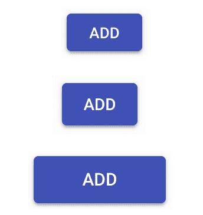

# 它是如何工作的...

中等尺寸和大型尺寸之间的区别最大。使用大型按钮，结合其他`Button`属性，如`color`和`Icons`，可以使按钮真正脱颖而出。

# 还有更多...

使用带按钮的 T 恤尺寸的一个缺点是，当结合文本和图标图像时。图标不会像文本一样缩放，所以按钮看起来永远不太对劲，除非使用中等默认尺寸。

让我们实现一个按钮抽象，使其更容易使用可一致调整大小的文本按钮或图标按钮。以下是代码：

```js
import React from 'react';

import Grid from '@material-ui/core/Grid';
import Button from '@material-ui/core/Button';
import IconButton from '@material-ui/core/IconButton';
import Fab from '@material-ui/core/Fab';

import AddIcon from '@material-ui/icons/Add';

const MyButton = ({ fab, ...props }) => {
  const [child] = React.Children.toArray(props.children);
  let ButtonComponent;

  if (React.isValidElement(child) && fab) {
    ButtonComponent = Fab;
  } else if (React.isValidElement(child)) {
    ButtonComponent = IconButton;
  } else {
    ButtonComponent = Button;
  }

  return <ButtonComponent {...props} />;
};

export default function ButtonSizes({ size, color }) {
  return (
    <Grid container spacing={16} alignItems="center">
      <Grid item>
        <MyButton variant="contained" size={size} color={color}>
          Add
        </MyButton>
      </Grid>
      <Grid item>
        <MyButton size={size} color={color}>
          <AddIcon />
        </MyButton>
      </Grid>
      <Grid item>
        <MyButton fab size={size} color={color}>
          <AddIcon />
        </MyButton>
      </Grid>
    </Grid>
  );
}
```

当`size`属性设置为`small`时，屏幕上三个按钮的外观如下：

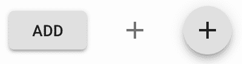

下面是`large`尺寸的外观：

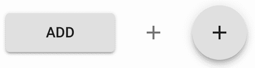

让我们分析`MyButton`组件中正在发生的事情。它期望一个单一的`child`节点，它通过将`children`属性转换为数组并将第一个元素分配给`child`常量来获取：

```js
const [child] = React.Children.toArray(props.children);
```

理念是根据`child`元素和`fab`属性渲染适当的`Button`元素。以下是正确组件分配给`ButtonComponent`的方式：

```js
if (React.isValidElement(child) && fab) {
  ButtonComponent = Fab;
} else if (React.isValidElement(child)) {
  ButtonComponent = IconButton;
} else {
  ButtonComponent = Button;
}
```

如果`child`是一个元素且`fab`属性为真，则使用`Fab`组件。如果`child`是一个元素且`fab`为假，则使用`IconButton`。否则，使用`Button`。这意味着您可以将有效的图标元素或文本作为子元素传递给`MyButton`。使用此组件渲染的任何按钮的大小设置都将保持一致。

# 参见

+   `Button`演示：[`material-ui.com/demos/buttons/`](https://material-ui.com/demos/buttons/)

+   `Button` API 文档：[`material-ui.com/api/button/`](https://material-ui.com/api/button/)

+   `IconButton` API 文档：[`material-ui.com/api/icon-button/`](https://material-ui.com/api/icon-button/)

+   `Fab` API 文档：[`material-ui.com/api/fab/`](https://material-ui.com/api/fab/)
