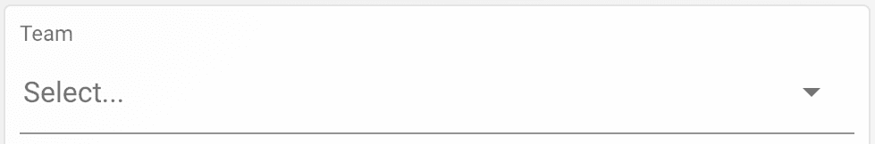
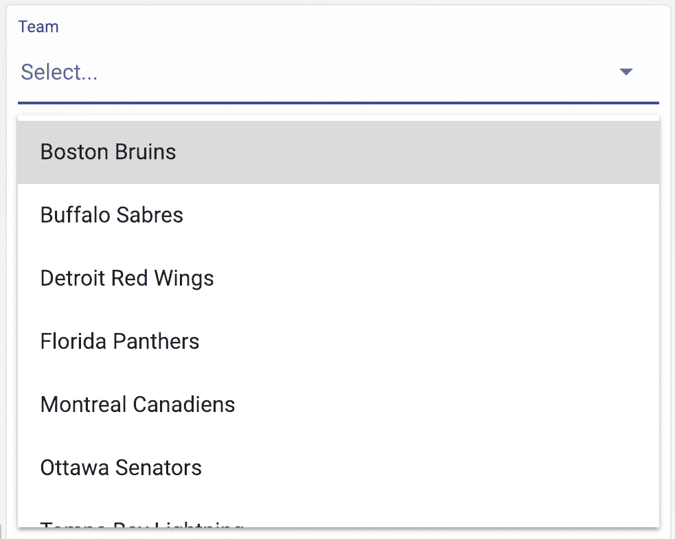
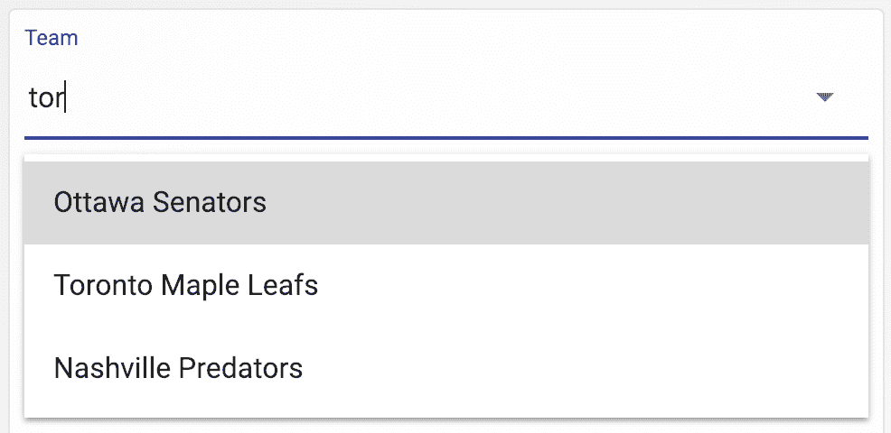
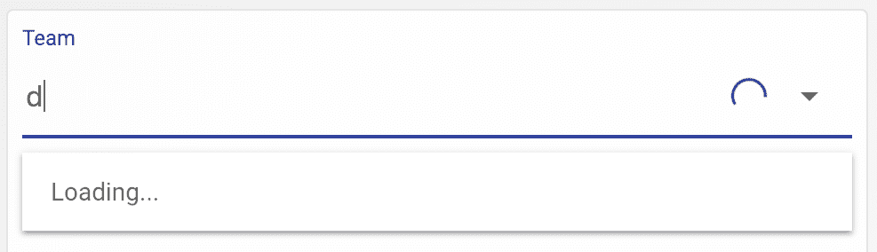
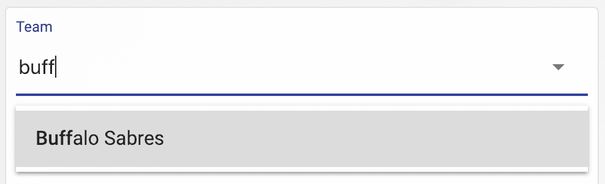
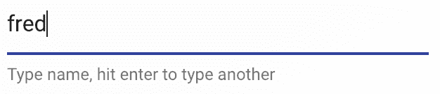
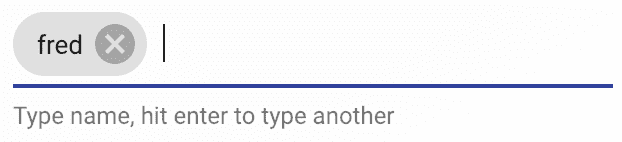
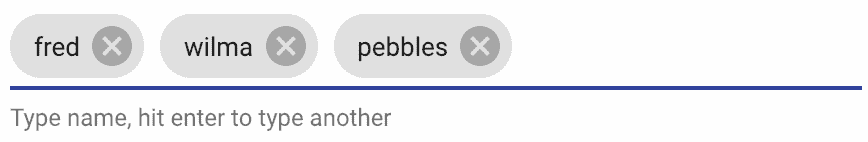

# 自动完成和芯片 - 多个项目的文本输入建议

在本章中，你将学习以下主题：

+   构建自动完成组件

+   选择自动完成建议

+   API 驱动的自动完成

+   突出显示搜索结果

+   独立芯片输入

# 简介

当有太多选择时，Web 应用程序通常会提供自动完成输入字段。自动完成字段类似于文本输入字段——当用户开始输入时，他们会根据输入的内容得到一个更小的选择列表。一旦用户准备好进行选择，实际的输入将被称为 `Chips` 的组件填充——特别是当用户需要能够进行多项选择时。

# 构建自动完成组件

Material-UI 并不实际包含一个 `Autocomplete` 组件。原因是，在 React 生态系统中已经存在许多不同的自动完成选择组件的实现，因此再提供一个没有意义。相反，你可以选择现有的实现，并用 Material-UI 组件增强它，以便它可以很好地与你的 Material-UI 应用程序集成。

# 如何做到这一点...

假设你有一个用于选择曲棍球队的选择器。但是，由于球队太多，无法合理地放入简单的选择组件中——你需要自动完成功能。你可以使用来自 `react-select` 包的 `Select` 组件来提供所需的自动完成功能。你可以使用 `Select` 属性来替换关键自动完成组件，以便自动完成与你的应用程序的其他部分保持一致的外观和感觉。

让我们创建一个可重用的 `Autocomplete` 组件。`Select` 组件允许你替换自动完成体验的某些方面。特别是，以下是你将替换的组件：

+   `控制`：要使用的文本输入组件

+   `菜单`：当用户开始输入时显示带有建议的菜单

+   `NoOptionsMessage`：当没有建议显示时显示的消息

+   `Option`：用于 `菜单` 中每个建议的组件

+   `Placeholder`：文本输入的占位文本组件

+   `SingleValue`：用于显示已选择的值的组件

+   `ValueContainer`：包装 `SingleValue` 的组件

+   `IndicatorSeparator`：分隔自动完成右侧的按钮

+   `ClearIndicator`：用于清除当前值的按钮的组件

+   `DropdownIndicator`：用于显示 `菜单` 的按钮的组件

这些组件中的每一个都将被替换为改变自动完成外观和感觉的 Material-UI 组件。此外，你将拥有所有这些作为新的 `Autocomplete` 组件，你可以在整个应用程序中重用它们。

在深入研究每个替换组件的实现之前，让我们看看结果。以下是在屏幕首次加载时你会看到的内容：



如果你点击向下箭头，你会看到一个包含所有值的菜单，如下所示：



尝试在自动完成文本字段中输入 tor，如下所示：



如果你进行选择，菜单将关闭，文本字段将填充所选值，如下所示：


你可以通过打开菜单并选择另一个值来更改你的选择，或者你可以通过点击文本右侧的清除按钮来清除选择。

# 它是如何工作的...

让我们通过查看组成 `Autocomplete` 组件的各个组件以及替换 `Select` 组件的部分来分解源代码。然后，我们将查看最终的 `Autocomplete` 组件。

# 文本输入控件

这是 `Control` 组件的源代码：

```js
const inputComponent = ({ inputRef, ...props }) => (
  <div ref={inputRef} {...props} />
);

const Control = props => (
  <TextField
    fullWidth
    InputProps={{
      inputComponent,
      inputProps: {
        className: props.selectProps.classes.input,
        inputRef: props.innerRef,
        children: props.children,
        ...props.innerProps
      }
    }}
    {...props.selectProps.textFieldProps}
  />
);
```

`inputComponent()` 函数是一个组件，它将 `inputRef` 值（对底层输入元素的引用）传递给 `ref` 属性。然后，`inputComponent` 传递给 `InputProps` 以设置 `TextField` 使用的输入组件。这个组件有点令人困惑，因为它在传递引用并使用一个 `helper` 组件来完成这个目的。重要的是要记住，`Control` 的任务是设置 `Select` 组件以使用 Material-UI `TextField` 组件。

# 选项菜单

这是当用户开始输入或点击向下箭头时显示自动完成选项的组件：

```js
const Menu = props => (
  <Paper
    square
    className={props.selectProps.classes.paper}
    {...props.innerProps}
  >
    {props.children}
  </Paper>
);
```

`Menu` 组件渲染一个 Material-UI `Paper` 组件，以便围绕选项的元素相应地主题化。

# 没有可用的选项

这是 `NoOptionsMessage` 组件。当没有自动完成选项可以显示时，它会被渲染，如下所示：

```js
const NoOptionsMessage = props => (
  <Typography
    color="textSecondary"
    className={props.selectProps.classes.noOptionsMessage}
    {...props.innerProps}
  >
    {props.children}
  </Typography>
);
```

这会渲染一个具有 `textSecondary` 作为 `color` 属性值的 `Typography` 组件。

# 单个选项

在自动完成菜单中显示的单独选项使用 `MenuItem` 组件渲染，如下所示：

```js
const Option = props => (
  <MenuItem
    buttonRef={props.innerRef}
    selected={props.isFocused}
    component="div"
    style={{
      fontWeight: props.isSelected ? 500 : 400
    }}
    {...props.innerProps}
  >
    {props.children}
  </MenuItem>
);
```

`selected` 和 `style` 属性根据 `isSelected` 和 `isFocused` 属性改变项目显示的方式。`children` 属性设置项目的值。

# 占位文本

`Autocomplete` 组件的 `Placeholder` 文本在用户输入任何内容或进行选择之前显示，如下所示：

```js
const Placeholder = props => (
  <Typography
    color="textSecondary"
    className={props.selectProps.classes.placeholder}
    {...props.innerProps}
  >
    {props.children}
  </Typography>
);
```

Material-UI `Typography` 组件用于主题化 `Placeholder` 文本。

# SingleValue

再次强调，Material-UI `Typography` 组件用于在自动完成输入中渲染来自菜单的选中值，如下所示：

```js
const SingleValue = props => (
  <Typography
    className={props.selectProps.classes.singleValue}
    {...props.innerProps}
  >
    {props.children}
  </Typography>
);
```

# ValueContainer

使用 `ValueContainer` 组件将 `SingleValue` 组件包裹在一个 `div` 元素和 `valueContainer` CSS 类中，如下所示：

```js
const ValueContainer = props => (
  <div className={props.selectProps.classes.valueContainer}>
    {props.children}
  </div>
);
```

# IndicatorSeparator

默认情况下，`Select` 组件使用管道字符作为自动完成菜单右侧按钮之间的分隔符。由于它们将被 Material-UI 按钮组件替换，因此这个分隔符不再必要，如下所示：

```js
const IndicatorSeparator = () => null;
```

通过让组件返回 `null`，不渲染任何内容。

# 清除选项指示器

此按钮用于清除用户之前所做的任何选择，如下所示：

```js
const ClearIndicator = props => (
  <IconButton {...props.innerProps}>
    <CancelIcon />
  </IconButton>
);
```

此组件的目的是使用 Material-UI 的 `IconButton` 组件并渲染 Material-UI 图标。点击处理程序通过 `innerProps` 传入。

# 显示菜单指示器

就像 `ClearIndicator` 组件一样，`DropdownIndicator` 组件用 Material-UI 的图标替换了显示自动完成菜单的按钮，如下所示：

```js
const DropdownIndicator = props => (
  <IconButton {...props.innerProps}>
    <ArrowDropDownIcon />
  </IconButton>
);
```

# 样式

这里是自动完成各个子组件使用的样式：

```js
const useStyles = makeStyles(theme => ({
  root: {
    flexGrow: 1,
    height: 250
  },
  input: {
    display: 'flex',
    padding: 0
  },
  valueContainer: {
    display: 'flex',
    flexWrap: 'wrap',
    flex: 1,
    alignItems: 'center',
    overflow: 'hidden'
  },
  noOptionsMessage: {
    padding: `${theme.spacing(1)}px ${theme.spacing(2)}px`
  },
  singleValue: {
    fontSize: 16
  },
  placeholder: {
    position: 'absolute',
    left: 2,
    fontSize: 16
  },
  paper: {
    position: 'absolute',
    zIndex: 1,
    marginTop: theme.spacing(1),
    left: 0,
    right: 0
  }
}));
```

# 自动完成

最后，以下是在整个应用程序中可以重用的 `Autocomplete` 组件：

```js
export default function Autocomplete(props) {
  const classes = useStyles();
  const [value, setValue] = useState(null);

  return (
    <div className={classes.root}>
      <Select
        value={value}
        onChange={v => setValue(v)}
        textFieldProps={{
          label: 'Team',
          InputLabelProps: {
            shrink: true
          }
        }}
        {...{ ...props, classes }}
      />
    </div>
  );
}

Autocomplete.defaultProps = {
  isClearable: true,
  components: {
    Control,
    Menu,
    NoOptionsMessage,
    Option,
    Placeholder,
    SingleValue,
    ValueContainer,
    IndicatorSeparator,
    ClearIndicator,
    DropdownIndicator
  },
  options: [
    { label: 'Boston Bruins', value: 'BOS' },
    { label: 'Buffalo Sabres', value: 'BUF' },
    { label: 'Detroit Red Wings', value: 'DET' },
    { label: 'Florida Panthers', value: 'FLA' },
    { label: 'Montreal Canadiens', value: 'MTL' },
    { label: 'Ottawa Senators', value: 'OTT' },
    { label: 'Tampa Bay Lightning', value: 'TBL' },
    { label: 'Toronto Maple Leafs', value: 'TOR' },
    { label: 'Carolina Hurricanes', value: 'CAR' },
    { label: 'Columbus Blue Jackets', value: 'CBJ' },
    { label: 'New Jersey Devils', value: 'NJD' },
    { label: 'New York Islanders', value: 'NYI' },
    { label: 'New York Rangers', value: 'NYR' },
    { label: 'Philadelphia Flyers', value: 'PHI' },
    { label: 'Pittsburgh Penguins', value: 'PIT' },
    { label: 'Washington Capitals', value: 'WSH' },
    { label: 'Chicago Blackhawks', value: 'CHI' },
    { label: 'Colorado Avalanche', value: 'COL' },
    { label: 'Dallas Stars', value: 'DAL' },
    { label: 'Minnesota Wild', value: 'MIN' },
    { label: 'Nashville Predators', value: 'NSH' },
    { label: 'St. Louis Blues', value: 'STL' },
    { label: 'Winnipeg Jets', value: 'WPG' },
    { label: 'Anaheim Ducks', value: 'ANA' },
    { label: 'Arizona Coyotes', value: 'ARI' },
    { label: 'Calgary Flames', value: 'CGY' },
    { label: 'Edmonton Oilers', value: 'EDM' },
    { label: 'Los Angeles Kings', value: 'LAK' },
    { label: 'San Jose Sharks', value: 'SJS' },
    { label: 'Vancouver Canucks', value: 'VAN' },
    { label: 'Vegas Golden Knights', value: 'VGK' }
  ]
};
```

将所有上述组件联系在一起的是传递给 `Select` 的 `components` 属性。实际上，它在 `Autocomplete` 中被设置为 `default` 属性，因此可以进一步覆盖。传递给 `components` 的值是一个简单的对象，将组件名称映射到其实例。

# 相关内容

+   React 的 `Select` 组件：[`react-select.com/`](https://react-select.com/)

+   `Autocomplete` 示例：[`material-ui.com/demos/autocomplete/`](https://material-ui.com/demos/autocomplete/)

+   `TextField` API 文档：[`material-ui.com/api/text-field/`](https://material-ui.com/api/text-field/)

+   `Typography` API 文档：[`material-ui.com/api/typography/`](https://material-ui.com/api/typography/)

+   `Paper` API 文档：[`material-ui.com/api/paper/`](https://material-ui.com/api/paper/)

+   `MenuItem` API 文档：[`material-ui.com/api/menu-item/`](https://material-ui.com/api/menu-item/)

+   `IconButton` API 文档：[`material-ui.com/api/icon-button/`](https://material-ui.com/api/icon-button/)

# 选择自动完成建议

在上一节中，你构建了一个能够选择单个值的 `Autocomplete` 组件。有时，你需要从 `Autocomplete` 组件中选择多个值。好消息是，通过一些小的添加，上一节中创建的组件已经完成了大部分工作。

# 如何操作...

让我们逐一查看需要添加以支持 `Autocomplete` 组件中多值选择的修改，从新的 `MultiValue` 组件开始，如下所示：

```js
const MultiValue = props => (
  <Chip
    tabIndex={-1}
    label={props.children}
    className={clsx(props.selectProps.classes.chip, {
      [props.selectProps.classes.chipFocused]: props.isFocused
    })}
    onDelete={props.removeProps.onClick}
    deleteIcon={<CancelIcon {...props.removeProps} />}
  />
);
```

`MultiValue` 组件使用 Material-UI 的 `Chip` 组件来渲染选定的值。为了将 `MultiValue` 传递给 `Select`，请将其添加到传递给 `Select` 的 `components` 对象中：

```js
components: {
  Control,
  Menu,
  NoOptionsMessage,
  Option,
  Placeholder,
  SingleValue,
  MultiValue,
  ValueContainer,
  IndicatorSeparator,
  ClearIndicator,
  DropdownIndicator
},
```

现在，你可以使用你的 `Autocomplete` 组件进行单值选择，或者进行多值选择。你可以在 `defaultProps` 中添加 `isMulti` 属性，默认值为 `true`，如下所示：

```js
isMulti: true,
```

现在，你应该能够从自动完成中选择多个值。

# 它是如何工作的...

当首次渲染或显示菜单时，自动完成看起来并没有什么不同。当你做出选择时，`Chip` 组件用于显示值。Chips 非常适合显示此类小块信息。此外，关闭按钮与它很好地集成，使用户在做出选择后很容易移除单个选择。

这是多次选择后自动完成的样子：


已选择的价值将从菜单中移除。

# 参见

+   React 的选择组件：[`react-select.com/`](https://react-select.com/)

+   `Autocomplete` 演示：[`material-ui.com/demos/autocomplete/`](https://material-ui.com/demos/autocomplete/)

+   `TextField` API 文档：[`material-ui.com/api/text-field/`](https://material-ui.com/api/text-field/)

+   `Typography` API 文档：[`material-ui.com/api/typography/`](https://material-ui.com/api/typography/)

+   `Paper` API 文档：[`material-ui.com/api/paper/`](https://material-ui.com/api/paper/)

+   `MenuItem` API 文档：[`material-ui.com/api/menu-item/`](https://material-ui.com/api/menu-item/)

+   `IconButton` API 文档：[`material-ui.com/api/icon-button/`](https://material-ui.com/api/icon-button/)

+   `Chip` API 文档：[`material-ui.com/api/chip/`](https://material-ui.com/api/chip/)

# API 驱动的自动完成

你并不总是能在页面初始加载时准备好自动完成的数据。想象一下在用户能够与任何东西交互之前尝试加载数百或数千个项目。更好的方法是保持数据在服务器上，并提供一个带有自动完成文本的 API 端点。然后你只需要加载 API 返回的较小数据集。

# 如何实现...

让我们重新整理前一个示例。我们将保留所有相同的自动完成功能，除了，我们不会将数组传递给 `options` 属性，而是传递一个返回 `Promise` 的 API 函数。以下是一个模拟 API 调用并解决 `Promise` 的 API 函数：

```js
const someAPI = searchText =>
  new Promise(resolve => {
    setTimeout(() => {
      const teams = [
        { label: 'Boston Bruins', value: 'BOS' },
        { label: 'Buffalo Sabres', value: 'BUF' },
        { label: 'Detroit Red Wings', value: 'DET' },
        ...
      ];

      resolve(
        teams.filter(
          team =>
            searchText &&
            team.label
              .toLowerCase()
              .includes(searchText.toLowerCase())
        )
      );
    }, 1000);
  });
```

此函数接受一个搜索字符串参数，并返回一个 `Promise`。这里过滤的是本应传递给 `Select` 组件 `options` 属性的相同数据。将此函数中发生的任何操作视为在真实应用程序中的 API 后面发生。然后，返回的 `Promise` 在模拟的 1 秒延迟后解决为匹配项的数组。

你还需要将几个组件添加到 `Select` 组件的组成中（现在我们有 13 个了），如下所示：

```js
const LoadingIndicator = () => <CircularProgress size={20} />;

const LoadingMessage = props => (
  <Typography
    color="textSecondary"
    className={props.selectProps.classes.noOptionsMessage}
    {...props.innerProps}
  >
    {props.children}
  </Typography>
);
```

`LoadingIndicator`组件显示在自动完成文本输入的右侧。它使用 Material-UI 中的`CircularProgress`组件来指示自动完成正在执行某些操作。`LoadingMessage`组件与示例中用于`Select`的其他文本替换组件遵循相同的模式。当菜单显示时，会显示加载文本，但解析`options`的`Promise`仍然挂起。

最后，还有`Select`组件。您需要使用`AsyncSelect`版本而不是`Select`，如下所示：

```js
import AsyncSelect from 'react-select/lib/Async';
```

否则，`AsyncSelect`与`Select`的工作方式相同，如下所示：

```js
<AsyncSelect
  value={value}
  onChange={value => setValue(value)}
  textFieldProps={{
    label: 'Team',
    InputLabelProps: {
      shrink: true
    }
  }}
  {...{ ...props, classes }}
/>
```

# 它是如何工作的...

`Select`自动完成和`AsyncSelect`自动完成的唯一区别在于 API 请求挂起时发生的情况。以下是发生这种情况时自动完成的外观：



随着用户输入，`CircularProgress`组件将在右侧渲染，同时使用`Typography`组件在菜单中渲染加载消息。

# 另请参阅

+   React 的 Select 组件：[`react-select.com/`](https://react-select.com/)

+   `Autocomplete`演示：[`material-ui.com/demos/autocomplete/`](https://material-ui.com/demos/autocomplete/)

+   `TextField` API 文档：[`material-ui.com/api/text-field/`](https://material-ui.com/api/text-field/)

+   `Typography` API 文档：[`material-ui.com/api/typography/`](https://material-ui.com/api/typography/)

+   `Paper` API 文档：[`material-ui.com/api/paper/`](https://material-ui.com/api/paper/)

+   `MenuItem` API 文档：[`material-ui.com/api/menu-item/`](https://material-ui.com/api/menu-item/)

+   `IconButton` API 文档：[`material-ui.com/api/icon-button/`](https://material-ui.com/api/icon-button/)

+   `Chip` API 文档：[`material-ui.com/api/chip/`](https://material-ui.com/api/chip/)

# 突出显示搜索结果

当用户在自动完成中开始输入并在下拉菜单中显示结果时，并不总是明显地知道某个项目是如何与搜索条件匹配的。您可以通过突出显示字符串值的匹配部分来帮助用户更好地理解结果。

# 如何实现...

您将需要使用`autosuggest-highlight`包中的两个函数来帮助`突出显示`自动完成下拉菜单中呈现的文本，如下所示：

```js
import match from 'autosuggest-highlight/match';
import parse from 'autosuggest-highlight/parse';
```

现在，您可以构建一个新的组件，该组件将渲染项目文本，并在必要时进行突出显示，如下所示：

```js
const ValueLabel = ({ label, search }) => {
  const matches = match(label, search);
  const parts = parse(label, matches);

  return parts.map((part, index) =>
    part.highlight ? (
      <span key={index} style={{ fontWeight: 500 }}>
        {part.text}
      </span>
    ) : (
      <span key={index}>{part.text}</span>
    )
  );
};
```

最终结果是`ValueLabel`渲染一个由`parse()`和`match()`函数确定的`span`元素数组。如果`part.highlight`为 true，则其中一个 span 将被加粗。现在，您可以在`Option`组件中使用`ValueLabel`，如下所示：

```js
const Option = props => (
  <MenuItem
    buttonRef={props.innerRef}
    selected={props.isFocused}
    component="div"
    style={{
      fontWeight: props.isSelected ? 500 : 400
    }}
    {...props.innerProps}
  >
    <ValueLabel
      label={props.children}
      search={props.selectProps.inputValue}
    />
  </MenuItem>
);
```

# 它是如何工作的...

现在，当您在自动完成的文本输入中搜索值时，结果将突出显示每个项目中的搜索条件，如下所示：



# 另请参阅

+   React 的自动建议：[`github.com/moroshko/autosuggest-highlight`](https://github.com/moroshko/autosuggest-highlight)

+   React 的 `Select` 组件：[`react-select.com/`](https://react-select.com/)

+   `Autocomplete` 示例：[`material-ui.com/demos/autocomplete/`](https://material-ui.com/demos/autocomplete/)

+   `TextField` API 文档：[`material-ui.com/api/text-field/`](https://material-ui.com/api/text-field/)

+   `Typography` API 文档：[`material-ui.com/api/typography/`](https://material-ui.com/api/typography/)

+   `Paper` API 文档：[`material-ui.com/api/paper/`](https://material-ui.com/api/paper/)

+   `MenuItem` API 文档：[`material-ui.com/api/menu-item/`](https://material-ui.com/api/menu-item/)

+   `IconButton` API 文档：[`material-ui.com/api/icon-button/`](https://material-ui.com/api/icon-button/)

+   `Chip` API 文档：[`material-ui.com/api/chip/`](https://material-ui.com/api/chip/)

# 独立的芯片输入

一些应用程序需要多值输入但没有为用户预定义选择列表。这排除了使用自动完成或 `select` 组件的可能性，例如，如果您要求用户提供姓名列表。

# 如何实现...

您可以安装 `material-ui-chip-input` 包并使用 `ChipInput` 组件，该组件将 Material-UI 中的 `Chip` 和 `TextInput` 组件结合在一起。代码如下：

```js
import React, { useState } from 'react';

import { makeStyles } from '@material-ui/styles';
import ChipInput from 'material-ui-chip-input';

const useStyles = makeStyles(theme => ({
  chipInput: { minWidth: 300 }
}));

export default function StandaloneChipInput() {
  const classes = useStyles();
  const [values, setValues] = useState([]);

  const onAdd = chip => {
    setValues([...values, chip]);
  };

  const onDelete = (chip, index) => {
    setValues(values.slice(0, index).concat(values.slice(index + 1)));
  };

  return (
    <ChipInput
      className={classes.chipInput}
      helperText="Type name, hit enter to type another"
      value={values}
      onAdd={onAdd}
      onDelete={onDelete}
    />
  );
}
```

当屏幕首次加载时，字段看起来像一个普通的文本字段，您可以在其中输入，如下所示：



如辅助文本所示，您可以按 *Enter* 添加项目并输入更多文本，如下所示：



您可以随意向字段中添加项目，如下所示：



确保辅助文本提到了回车键。否则，用户可能无法弄清楚他们可以输入多个值。

# 它是如何工作的...

保存 `chip` 输入字段值的 `state` 是一个数组——因为存在多个值。与 `chip` 输入状态相关的两个操作是从该数组中添加和删除字符串。让我们更详细地看看 `onAdd()` 和 `onDelete()` 函数，如下所示：

```js
const onAdd = chip => {
  setValues([...values, chip]);
};

const onDelete = (chip, index) => {
  setValues(values.slice(0, index).concat(values.slice(index + 1)));
};
```

`onAdd()` 函数将 `chip` 添加到数组中，而 `onDelete()` 函数删除给定 `index` 的 `chip`。当用户点击芯片中的 `Delete` 图标时，芯片将被删除。最后，让我们看看 `ChipInput` 组件本身，如下所示：

```js
<ChipInput
  className={classes.chipInput}
  helperText="Type name, hit enter to type another"
  value={values}
  onAdd={onAdd}
  onDelete={onDelete}
/>
```

它非常类似于 `TextInput` 组件。它实际上接受相同的属性，例如 `helperText`。它还接受在 `TextInput` 中找不到的附加属性，例如 `onAdd` 和 `onDelete`。

# 参见

+   一个 Material-UI `ChipInput` 组件：[`www.npmjs.com/package/material-ui-chip-input`](https://www.npmjs.com/package/material-ui-chip-input)
