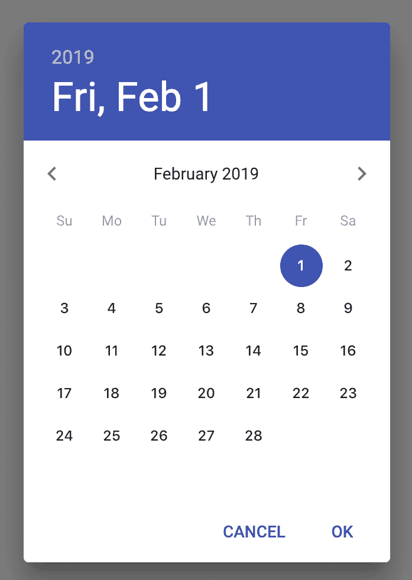

# 选择器 - 选择日期和时间

在本章中，我们将涵盖以下主题：

+   使用日期选择器

+   使用时间选择器

+   设置初始日期和时间值

+   结合日期和时间组件

+   集成其他日期和时间包

# 简介

大多数应用程序都需要允许用户选择日期和时间值。例如，如果表单包含一个调度部分，用户需要一个直观的方式来选择日期和时间值。在 Material-UI 应用程序中，你可以使用库中提供的日期和时间选择器组件。

# 使用日期选择器

要在 Material-UI 应用程序中使用日期选择器，你可以利用`TextField`组件。它接受一个`type`属性，你可以将其设置为`date`。然而，除了更改文本字段类型之外，你还需要注意其他一些事情。

# 如何实现...

下面是一段代码，用于为用户渲染一个日期选择器文本字段，并在日期选择改变时显示另一个格式的文本字段：

```js
import React, { Fragment, useState } from 'react';

import { makeStyles } from '@material-ui/styles';
import TextField from '@material-ui/core/TextField';

const useStyles = makeStyles(theme => ({
  textField: { margin: theme.spacing(1) }
}));

export default function UsingDatePickers() {
  const classes = useStyles();
  const [date, setDate] = useState('');

  const onChange = e => {
    setDate(e.target.value);
  };

  const dateFormatted = date
    ? new Date(`${date}T00:00:00`).toLocaleDateString()
    : null;

  return (
    <Fragment>
      <TextField
        value={date}
        onChange={onChange}
        label="My Date"
        type="date"
        className={classes.textField}
        InputLabelProps={{
          shrink: true
        }}
      />
      <TextField
        value={dateFormatted}
        label="Updated Date Value"
        className={classes.textField}
        InputLabelProps={{
          shrink: true
        }}
        InputProps={{ readOnly: true }}
      />
    </Fragment>
  );
}
```

当页面首次加载时，你会看到以下内容：


左侧的“我的日期”字段是日期选择器。右侧的“更新日期值”字段以不同的格式显示选定的日期。以下是日期选择器在获得焦点时的外观：


日期的年份部分被突出显示。你可以输入年份，或者可以使用上下箭头按钮来更改选定的值。通过按*Tab*键或使用鼠标指针，你可以切换到日期的月份或日部分。最右侧的向下箭头在点击时会显示以下原生浏览器日期选择器：


一旦你选择了日期，下面是“我的日期”和“更新日期值”字段的外观：


# 它是如何工作的...

让我们先看看日期选择器`TextField`组件：

```js
<TextField
  value={date}
  onChange={onChange}
  label="My Date"
  type="date"
  className={classes.textField}
  InputLabelProps={{
    shrink: true
  }}
/>
```

大多数日期选择器功能来自设置为`date`的`type`属性。这应用了输入掩码和原生浏览器日期选择器控件。由于输入掩码值，`shrink`输入属性需要设置为`true`以避免重叠。`value`属性来自`UsingDatePickers`组件的状态。此值默认为空字符串，但需要以特定格式。日期选择器文本字段将把日期值放入正确的格式，因此`onChange()`处理程序实际上不需要做任何事情，只需设置`date`状态即可。

“更新日期值”字段使用不同的日期格式。让我们看看这是如何实现的：

```js
const dateFormatted = date
  ? new Date(`${date}T00:00:00`).toLocaleDateString()
  : null;
```

首先，你需要从组件状态中获取`date`字符串，并使用它来构造一个新的`Date`实例。为此，你需要将时间字符串附加到日期字符串上。这使得它成为一个有效的 ISO 字符串，并使得日期可以无任何意外地构造。现在你可以使用任何可用的日期格式化函数，例如`toLocaleDateString()`。

现在，你可以将`dateFormatted`传递给第二个文本字段，该字段是只读的，因为它只用于显示值：

```js
<TextField
  value={dateFormatted}
  label="Updated Date Value"
  className={classes.textField}
  InputLabelProps={{
    shrink: true
  }}
  InputProps={{ readOnly: true }}
/>
```

# 还有更多...

可以对前面的示例进行一些改进。首先，你可以有一个`DatePicker`组件，它隐藏了一些将`TextField`组件转换为选择日期的组件的细节。此外，如果新的`DatePicker`组件支持实际的`Date`实例作为值，那就更好了。

首先，你需要一个实用函数，可以将`Date`实例格式化为`TextField`组件作为日期选择器使用时预期的字符串格式：

```js
function formatDate(date) {
  const year = date.getFullYear();
  const month = date.getMonth() + 1;
  const day = date.getDate();

  return [
    year,
    month < 10 ? `0${month}` : month,
    day < 10 ? `0${day}` : day
  ].join('-');
}
```

`formatDate()`函数接受一个`Date`实例，并返回一个格式为`YYYY-MM-dd`的字符串。现在，你已经准备好构建`DatePicker`组件了：

```js
const DatePicker = ({ date, ...props }) => (
  <TextField
    value={date instanceof Date ? formatDate(date) : date}
    type="date"
    InputLabelProps={{
      shrink: true
    }}
    {...props}
  />
);
```

`DatePicker`组件渲染一个`TextField`组件。它将`type`属性值设置为`date`，将`shrink`输入属性设置为`true`。它还设置了`value`属性——首先检查`date`属性是否是`Date`实例，如果是，则调用`formatDate()`。否则，直接使用`date`参数。

现在，让我们用`DatePicker`组件替换前面示例中的`TextField`组件：

```js
<Fragment>
  <DatePicker
    date={date}
    onChange={onChange}
    label="My Date"
    className={classes.textField}
  />
  <TextField
    value={dateFormatted}
    label="Updated Date Value"
    className={classes.textField}
    InputLabelProps={{
      shrink: true
    }}
    InputProps={{ readOnly: true }}
  />
</Fragment>
```

`onChange`、`label`和`className`属性以与之前相同的方式传递给`TextField`组件。与`DatePicker`组件的主要区别是，你不需要传递`type`或`InputProps`，而是使用`date`而不是`value`。

# 参见

+   选择器演示：[`material-ui.com/demos/pickers/`](https://material-ui.com/demos/pickers/)

+   `TextField` API 文档：[`material-ui.com/api/text-field/`](https://material-ui.com/api/text-field/)

# 使用时间选择器

与日期选择器一样，时间选择器帮助用户输入时间值。同样，Material-UI 应用程序中的时间选择器也是从`TextInput`组件派生出来的。

# 如何实现...

让我们创建与*使用日期选择器*部分中使用的相同抽象，但这次是为了`time`选择器：

```js
import React, { Fragment, useState } from 'react';

import { makeStyles } from '@material-ui/styles';
import TextField from '@material-ui/core/TextField';

const useStyles = makeStyles(theme => ({
  textField: { margin: theme.spacing(1) }
}));

const TimePicker = ({ time, ...props }) => (
  <TextField
    value={time}
    type="time"
    InputLabelProps={{
      shrink: true
    }}
    inputProps={{
      step: 300
    }}
    {...props}
  />
);

export default function UsingTimePickers() {
  const classes = useStyles();
  const [time, setTime] = useState('');

  const onChange = e => {
    setTime(e.target.value);
  };

  return (
    <Fragment>
      <TimePicker
        time={time}
        onChange={onChange}
        label="My Time"
        className={classes.textField}
      />
      <TextField
        value={time}
        label="Updated Time Value"
        className={classes.textField}
        InputLabelProps={{
          shrink: true
        }}
        InputProps={{ readOnly: true }}
      />
    </Fragment>
  );
}
```

页面首次加载时，你会看到以下内容：


当 My Time 字段获得焦点后，你可以使用上/下箭头键或显示在时间值右侧的上/下箭头按钮来更改单个时间部分：


更新时间值字段不会更新，直到在 My Time 字段中选择了完整的时间，因为在此发生之前没有时间值：


# 它是如何工作的...

`TimePicker`组件的结构与上一道菜谱中的`DatePicker`组件非常相似。主要区别在于`TimePicker`不支持`Date`实例，因为它只处理时间。因为没有日期部分，使用`Date`实例仅表达时间比仅表达日期要困难得多：

```js
const TimePicker = ({ time, ...props }) => (
  <TextField
    value={time}
    type="time"
    InputLabelProps={{
      shrink: true
    }}
    inputProps={{
      step: 300
    }}
    {...props}
  />
);
```

`TimePicker`组件在`TextField`上设置的属性与`DatePicker`组件相同。此外，`step`值为`300`使得时间部分的分钟数每次移动五分钟。

# 参见

+   选择器演示：[`material-ui.com/demos/pickers/`](https://material-ui.com/demos/pickers/)

+   `TextField` API 文档：[`material-ui.com/api/text-field/`](https://material-ui.com/api/text-field/)

# 设置初始日期和时间值

日期和时间选择器可以分别具有默认的日期和时间值。例如，一个常见的场景是让这些输入默认为当前日期和时间。

# 如何实现...

假设你在应用的屏幕上有一个日期选择器和时间选择器。你希望`date`字段默认为当前日期，`time`字段默认为当前时间。为此，最好依赖于`Date`实例来设置初始的`Date/Time`值。然而，这需要一点工作，因为你不能原生地将`Date`实例传递给`TextField`组件。以下是一个示例，说明这是如何工作的：

```js
import React, { Fragment, useState } from 'react';

import { makeStyles } from '@material-ui/styles';
import TextField from '@material-ui/core/TextField';

const useStyles = makeStyles(theme => ({
  textField: { margin: theme.spacing.unit }
}));

function formatDate(date) {
  const year = date.getFullYear();
  const month = date.getMonth() + 1;
  const day = date.getDate();

  return [
    year,
    month < 10 ? `0${month}` : month,
    day < 10 ? `0${day}` : day
  ].join('-');
}

function formatTime(date) {
  const hours = date.getHours();
  const minutes = date.getMinutes();

  return [
    hours < 10 ? `0${hours}` : hours,
    minutes < 10 ? `0${minutes}` : minutes
  ].join(':');
}

const DatePicker = ({ date, ...props }) => (
  <TextField
    value={date instanceof Date ? formatDate(date) : date}
    type="date"
    InputLabelProps={{
      shrink: true
    }}
    {...props}
  />
);

const TimePicker = ({ time, ...props }) => (
  <TextField
    value={time instanceof Date ? formatTime(time) : time}
    type="time"
    InputLabelProps={{
      shrink: true
    }}
    inputProps={{
      step: 300
    }}
    {...props}
  />
);

export default function SettingInitialDateAndTimeValues() {
  const classes = useStyles();
  const [datetime, setDatetime] = useState(new Date());

  const onChangeDate = e => {
    if (!e.target.value) {
      return;
    }

    const [year, month, day] = e.target.value
      .split('-')
      .map(n => Number(n));

    const newDatetime = new Date(datetime);
    newDatetime.setYear(year);
    newDatetime.setMonth(month - 1);
    newDatetime.setDate(day);

    setDatetime(newDatetime);
  };

  const onChangeTime = e => {
    const [hours, minutes] = e.target.value
      .split(':')
      .map(n => Number(n));

    const newDatetime = new Date(datetime);
    newDatetime.setHours(hours);
    newDatetime.setMinutes(minutes);

    setDatetime(newDatetime);
  };

  return (
    <Fragment>
      <DatePicker
        date={datetime}
        onChange={onChangeDate}
        label="My Date"
        className={classes.textField}
      />
      <TimePicker
        time={datetime}
        onChange={onChangeTime}
        label="My Time"
        className={classes.textField}
      />
    </Fragment>
  );
}
```

当屏幕首次加载时，你会看到以下内容：


你看到的日期和时间将取决于你何时加载屏幕。然后你可以更改日期和时间值。

# 它是如何工作的...

这种方法的优点是，你只需要处理一个`state`，即`datetime`，它是一个`Date`实例。让我们逐步查看代码，看看这是如何实现的，从`UsingDatePickers`组件的初始状态开始：

```js
const [datetime, setDatetime] = useState(new Date());
```

当前日期和时间被分配给`datetime`状态。接下来，让我们看看两个格式化函数，它们使`Date`实例能够与`TextField`组件一起工作：

```js
function formatDate(date) {
  const year = date.getFullYear();
  const month = date.getMonth() + 1;
  const day = date.getDate();

  return [
    year,
    month < 10 ? `0${month}` : month,
    day < 10 ? `0${day}` : day
  ].join('-');
}

function formatTime(date) {
  const hours = date.getHours();
  const minutes = date.getMinutes();

  return [
    hours < 10 ? `0${hours}` : hours,
    minutes < 10 ? `0${minutes}` : minutes
  ].join(':');
}
```

这两个函数，`formatDate()`和`formatTime()`，都接受一个`Date`实例作为参数，并返回一个与`TextField`组件一起工作的字符串格式值。接下来，让我们看看`onChangeDate()`处理程序：

```js
const onChangeDate = e => {
  if (!e.target.value) {
    return;
  }

  const [year, month, day] = e.target.value
    .split('-')
    .map(n => Number(n));

  const newDatetime = new Date(datetime);
  newDatetime.setYear(year);
  newDatetime.setMonth(month - 1);
  newDatetime.setDate(day);

  setDatetime(newDatetime);
};
```

在`onChangeDate()`中发生的第一个检查是对`value`属性的检查。这个检查之所以需要发生，是为了让日期选择器实际上允许用户选择一个无效的日期，比如 2 月 31 日。当选择这个无效日期时，不改变`state`实际上是在防止选择无效日期。

接下来，`year`、`month` 和 `day` 值被分割并映射到数字。然后，通过使用 `datetime` 作为值创建一个新的 `Date` 实例来初始化新的 `newDatetime` 值。这样做是为了保留时间选择。最后，使用 `setYear()`、`setMonth()` 和 `setDate()` 更新 `Date` 实例而不改变时间。

最后，让我们来看看 `onChangeTime()` 处理器：

```js
const onChangeTime = e => {
  const [hours, minutes] = e.target.value
    .split(':')
    .map(n => Number(n));

  const newDatetime = new Date(datetime);
  newDatetime.setHours(hours);
  newDatetime.setMinutes(minutes);

  setDatetime(newDatetime);
};
```

`onChangeTime()` 处理器遵循与 `onChangeDate()` 相同的一般模式。它更简单，因为值更少，且不需要检查无效的时间 - 每天都有 24 小时。

# 参见

+   选择器演示：[`material-ui.com/demos/pickers/`](https://material-ui.com/demos/pickers/)

+   `TextField` API 文档：[`material-ui.com/api/text-field/`](https://material-ui.com/api/text-field/)

# 合并日期和时间组件

如果你的应用程序需要从用户那里收集日期和时间，你不必一定需要两个 `TextField` 组件。相反，你可以将它们合并成一个字段。

# 如何实现...

你可以通过将 `type` 属性设置为 `datetime-local` 来使用单个 `TextInput` 组件收集用户的日期和时间输入：

```js
import React, { Fragment, useState } from 'react';

import { makeStyles } from '@material-ui/styles';
import TextField from '@material-ui/core/TextField';

const useStyles = makeStyles(theme => ({
  textField: { margin: theme.spacing(1) }
}));

const formatDate = date =>
  date
    .toISOString()
    .split(':')
    .slice(0, 2)
    .join(':');

const DateTimePicker = ({ date, ...props }) => (
  <TextField
    value={
      date instanceof Date
        ? date.toISOString().replace('Z', '')
        : date
    }
    type="datetime-local"
    InputLabelProps={{
      shrink: true
    }}
    {...props}
  />
);

export default function CombiningDateAndTimeComponents() {
  const classes = useStyles();
  const [datetime, setDatetime] = useState(new Date());

  const onChangeDate = e => {
    setDatetime(new Date(`${e.target.value}Z`));
  };

  return (
    <DateTimePicker
      date={formatDate(datetime)}
      onChange={onChangeDate}
      label="My Date/Time"
      className={classes.textField}
    />
  );
}
```

当屏幕首次加载时，你会看到以下内容：


这是字段获得焦点并且显示更改日期/时间控件时的外观：


# 它是如何工作的...

当你使用 `datetime-local` 类型的输入时，它简化了与 `Date` 实例的工作。让我们看看 `onChangeDate()` 处理器：

```js
const onChangeDate = e => {
  setDatetime(new Date(`${e.target.value}Z`));
};
```

你可以将 `e.target.value` 作为参数传递给一个新的 `Date` 实例，然后它将成为新的 `datetime` 状态值。最后，让我们看看用于将正确值传递给 `TextField` 的 `value` 属性的 `formatDate()` 函数：

```js
const formatDate = date =>
  date
    .toISOString()
    .split(':')
    .slice(0, 2)
    .join(':');
```

使用此函数的原因是删除 `value` 属性中的秒和毫秒。否则，这些将显示为用户可以选择的输入字段中的值。当选择时间时，用户选择秒或毫秒的情况非常罕见。

# 参见

+   选择器演示：[`material-ui.com/demos/pickers/`](https://material-ui.com/demos/pickers/)

+   `TextField` API 文档：[`material-ui.com/api/text-field/`](https://material-ui.com/api/text-field/)

# 集成其他日期和时间包

你不必只使用 `TextField` 组件在你的 Material-UI 应用程序中进行 `日期/时间` 选择。有可用的包可以让 `日期/时间` 选择体验更接近传统的 Material Design 组件。

# 如何实现...

`material-ui-pickers` 包包含一个 `DatePicker` 组件和一个 `TimePicker` 组件。以下是一些代码示例，展示了如何使用这两个组件：

```js
import React, { useState } from 'react';
import 'date-fns';
import DateFnsUtils from '@date-io/date-fns';

import { makeStyles } from '@material-ui/styles';
import Grid from '@material-ui/core/Grid';

import {
  MuiPickersUtilsProvider,
  TimePicker,
  DatePicker
} from 'material-ui-pickers';

const useStyles = makeStyles(theme => ({
  grid: {
    width: '65%'
  }
}));

export default function IntegratingWithOtherDateAndTimePackages() {
  const classes = useStyles();
  const [datetime, setDatetime] = useState(new Date());

  const onChange = datetime => {
    setDatetime(datetime);
  };

  return (
    <MuiPickersUtilsProvider utils={DateFnsUtils}>
      <Grid container className={classes.grid} justify="space-around">
        <DatePicker
          margin="normal"
          label="Date picker"
          value={datetime}
          onChange={onChange}
        />
        <TimePicker
          margin="normal"
          label="Time picker"
          value={datetime}
          onChange={onChange}
        />
      </Grid>
    </MuiPickersUtilsProvider>
  );
}
```

当屏幕首次加载时，你会看到以下内容：


当你点击日期选择器字段时，你会看到以下内容：



你可以使用这个对话框来选择你的日期，然后点击“确定”来更改它。当你点击时间选择器字段时，你会看到以下内容：


# 它是如何工作的...

来自 `material-ui-pickers` 包的 `DatePicker` 和 `TimePicker` 组件显示的对话框可以渲染其他 Material-UI 组件，这使得选择日期/时间更加容易。你无需直接与文本输入进行交互，可以展示给用户这样的对话框，这些对话框的主题与你的应用程序的其他部分相匹配，并提供视觉交互来选择日期/时间。

# 相关内容

+   选择器演示：[`material-ui.com/demos/pickers/`](https://material-ui.com/demos/pickers/)

+   Material-UI 选择器：[`github.com/chingyawhao/material-ui-next-pickers`](https://github.com/chingyawhao/material-ui-next-pickers)
