# 对话框 - 用户交互的模态屏幕

在本章中，我们将涵盖以下主题：

+   收集表单输入

+   确认操作

+   显示警报

+   API 集成

+   创建全屏对话框

+   滚动对话框内容

# 简介

在与应用程序的交互过程中，用户将不得不在某个时刻向应用程序提供一些信息，做出是/否的决定，或确认重要信息。Material-UI 有一个对话框组件，非常适合这些场景——当你需要一个不会干扰当前屏幕内容的模态显示时。

# 收集表单输入

当你需要从用户那里收集输入，但又不想失去当前屏幕时，对话框很有用。例如，用户正在查看显示项目列表的屏幕，并想创建一个新项目。对话框可以显示必要的表单字段，一旦创建了新项目，对话框就会关闭，用户就会回到他们的项目列表。

# 如何操作...

假设你的应用程序允许创建新用户。例如，从显示用户列表的屏幕中，用户点击一个按钮，显示包含创建新用户字段的对话框。以下是如何操作的示例：

```js
import React, { Fragment, useState } from 'react';

import Button from '@material-ui/core/Button';
import TextField from '@material-ui/core/TextField';
import Dialog from '@material-ui/core/Dialog';
import DialogActions from '@material-ui/core/DialogActions';
import DialogContent from '@material-ui/core/DialogContent';
import DialogContentText from '@material-ui/core/DialogContentText';
import DialogTitle from '@material-ui/core/DialogTitle';
import Snackbar from '@material-ui/core/Snackbar';

export default function CollectingFormInput() {
  const [dialogOpen, setDialogOpen] = useState(false);
  const [snackbarOpen, setSnackbarOpen] = useState(false);
  const [snackbarMessage, setSnackbarMessage] = useState('');
  const [first, setFirst] = useState('');
  const [last, setLast] = useState('');
  const [email, setEmail] = useState('');

  const onDialogOpen = () => {
    setDialogOpen(true);
  };

  const onDialogClose = () => {
    setDialogOpen(false);
    setFirst('');
    setLast('');
    setEmail('');
  };

  const onSnackbarClose = (e, reason) => {
    if (reason === 'clickaway') {
      return;
    }

    setSnackbarOpen(false);
    setSnackbarMessage('');
  };

  const onCreate = () => {
    setSnackbarOpen(true);
    setSnackbarMessage(`${first} ${last} created`);
    onDialogClose();
  };

  return (
    <Fragment>
      <Button color="primary" onClick={onDialogOpen}>
        New User
      </Button>
      <Dialog open={dialogOpen} onClose={onDialogClose}>
        <DialogTitle>New User</DialogTitle>
        <DialogContent>
          <TextField
            autoFocus
            margin="normal"
            label="First Name"
            InputProps={{ name: 'first' }}
            onChange={e => setFirst(e.target.value)}
            value={first}
            fullWidth
          />
          <TextField
            margin="normal"
            label="Last Name"
            InputProps={{ name: 'last' }}
            onChange={e => setLast(e.target.value)}
            value={last}
            fullWidth
          />
          <TextField
            margin="normal"
            label="Email Address"
            type="email"
            InputProps={{ name: 'email' }}
            onChange={e => setEmail(e.target.value)}
            value={email}
            fullWidth
          />
        </DialogContent>
        <DialogActions>
          <Button onClick={onDialogClose} color="primary">
            Cancel
          </Button>
          <Button
            variant="contained"
            onClick={onCreate}
            color="primary"
          >
            Create
          </Button>
        </DialogActions>
      </Dialog>
      <Snackbar
        open={snackbarOpen}
        message={snackbarMessage}
        onClose={onSnackbarClose}
        autoHideDuration={4000}
      />
    </Fragment>
  );
}
```

这是屏幕首次加载时你会看到的按钮：

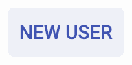

这是点击 NEW USER 按钮时你会看到的对话框：

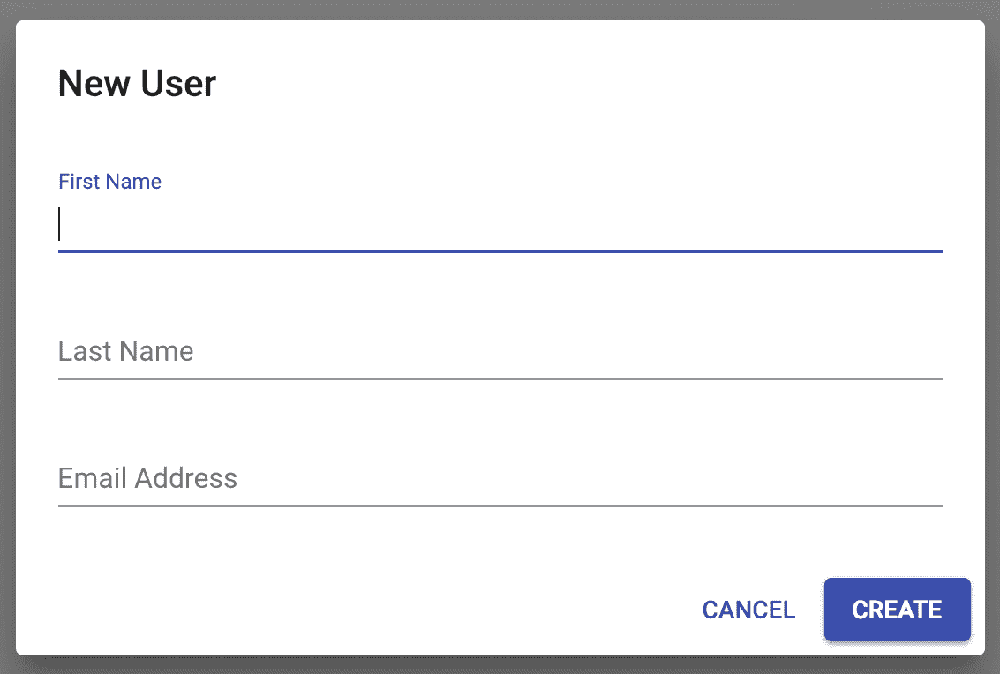

然后，你可以填写创建新用户的三个字段，并点击 CREATE 按钮。对话框将关闭，你将看到以下`Snackbar`组件显示：

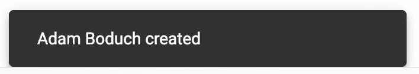

# 它是如何工作的...

对话框和 Snackbar 的可见性由布尔状态值`dialogOpen`和`snackbarOpen`分别控制。`dialog`组件内字段的值也存储在`CollectingFormInput`组件的状态中。让我们更仔细地看看`dialog`标记：

```js
<Dialog open={dialogOpen} onClose={onDialogClose}>
  <DialogTitle>New User</DialogTitle>
  <DialogContent>
    <TextField
      autoFocus
      margin="normal"
      label="First Name"
      InputProps={{ name: 'first' }}
      onChange={e => setFirst(e.target.value)}
      value={first}
      fullWidth
    />
    <TextField
      margin="normal"
      label="Last Name"
      InputProps={{ name: 'last' }}
      onChange={e => setLast(e.target.value)}
      value={last}
      fullWidth
    />
    <TextField
      margin="normal"
      label="Email Address"
      type="email"
      InputProps={{ name: 'email' }}
      onChange={e => setEmail(e.target.value)}
      value={email}
      fullWidth
    />
  </DialogContent>
  <DialogActions>
    <Button onClick={onDialogClose} color="primary">
      Cancel
    </Button>
    <Button
      variant="contained"
      onClick={onCreate}
      color="primary"
    >
      Create
    </Button>
  </DialogActions>
</Dialog>
```

`Dialog`组件是其他几个组件的父组件，这些组件构成了`dialog`的不同部分。`DialogTitle`组件渲染对话框标题，而`DialogActions`组件用于在对话框底部渲染操作按钮。`DialogContent`组件用于渲染对话框的主要内容——创建新用户的三个文本字段。

对于这些`TextField`组件，有两个属性与在对话框内渲染相关。首先，`fullWidth`属性将字段水平扩展，使其与对话框宽度相同。这通常与只有几个字段的表单配合得很好。其次，`margin`属性设置为`normal`，这为对话框中的字段提供了适当的垂直间距。

接下来，让我们浏览这个组件的事件处理器，从`onDialogOpen()`开始：

```js
const onDialogOpen = () => {
  setDialogOpen(true);
};
```

这将通过将 `dialogOpen` 状态更改为 `true` 来显示对话框。接下来，让我们看看 `onDialogClose()`：

```js
const onDialogClose = () => {
  setDialogOpen(false);
  setFirst('');
  setLast('');
  setEmail('');
};
```

这将通过将 `dialogOpen` 状态设置为 `false` 来关闭对话框。它还将表单字段值重置为空字符串，以便在下一次对话框显示时为空。接下来，我们有 `onSnackbarClose()`：

```js
const onSnackbarClose = (e, reason) => {
  if (reason === 'clickaway') {
    return;
  }

  setSnackbarOpen(false);
  setSnackbarMessage('');
};
```

如果 `reason` 参数是 `clickaway`，则无需操作。否则，`snackbarOpen` 状态将更改为 `false`，这将隐藏 snackbar。`snackbarMessage` 状态设置为空字符串，以防 snackbar 在未设置新消息的情况下打开。最后，我们有 `onCreate()` 处理器：

```js
const onCreate = () => {
  setSnackbarOpen(true);
  setSnackbarMessage(`${first} ${last} created`);
  onDialogClose();
};
```

这将通过将 `snackbarOpen` 设置为 `true` 来显示 snackbar。它还设置了包含访问 `first` 和 `last` 状态值的 `snackbarMessage` 值。然后，调用 `onDialogClose()` 来隐藏对话框并重置表单字段。由于 `autoHideDuration` 值设置为 `4000`，snackbar 在四秒后关闭。

# 相关内容

+   `Dialog` 示例：[`material-ui.com/demos/dialogs/`](https://material-ui.com/demos/dialogs/)

+   `Dialog` API 文档：[`material-ui.com/api/dialog/`](https://material-ui.com/api/dialog/)

+   `DialogActions` API 文档：[`material-ui.com/api/dialog-actions/`](https://material-ui.com/api/dialog-actions/)

+   `DialogContent` API 文档：[`material-ui.com/api/dialog-content/`](https://material-ui.com/api/dialog-content/)

+   `DialogContentText` API 文档：[`material-ui.com/api/dialog-content-text/`](https://material-ui.com/api/dialog-content-text/)

+   `Snackbar` API 文档：[`material-ui.com/api/snackbar/`](https://material-ui.com/api/snackbar/)

+   `TextField` API 文档：[`material-ui.com/api/text-field/`](https://material-ui.com/api/text-field/)

+   `Button` API 文档：[`material-ui.com/api/button/`](https://material-ui.com/api/button/)

# 确认操作

确认对话框充当用户的安全网。当用户即将执行可能具有潜在危险的操作时，它们很有用，但不是针对应用中每个可想象的操作。如果执行后无法撤销，则操作可以被认为是危险的。删除账户或处理付款的操作就是一个危险的例子。在这些情况下，您应该始终使用确认对话框。

# 如何操作...

确认对话框应该简单明了，以便用户可以轻松阅读即将发生的事情，并决定是否取消操作或继续。以下是一些在执行操作前显示确认对话框的代码示例：

```js
import React, { Fragment, useState } from 'react';

import Button from '@material-ui/core/Button';
import DialogTitle from '@material-ui/core/DialogTitle';
import DialogContent from '@material-ui/core/DialogContent';
import DialogContentText from '@material-ui/core/DialogContentText';
import DialogActions from '@material-ui/core/DialogActions';
import Dialog from '@material-ui/core/Dialog';

export default function ConfirmingActions() {
  const [open, setOpen] = useState(false);

  const onShowConfirm = () => {
    setOpen(true);
  };

  const onConfirm = () => {
    setOpen(false);
  };

  return (
    <Fragment>
      <Button color="primary" onClick={onShowConfirm}>
        Confirm Action
      </Button>
      <Dialog
        disableBackdropClick
        disableEscapeKeyDown
        maxWidth="xs"
        open={open}
      >
        <DialogTitle>Confirm Delete Asset</DialogTitle>
        <DialogContent>
          <DialogContentText>
            Are you sure you want to delete the asset? This action
            cannot be undone.
          </DialogContentText>
        </DialogContent>
        <DialogActions>
          <Button onClick={onDialogClose} color="primary">
            Cancel
          </Button>
          <Button
            variant="contained"
            onClick={onConfirm}
            color="primary"
          >
            Confirm
          </Button>
        </DialogActions>
      </Dialog>
    </Fragment>
  );
}
```

当通过点击“确认”按钮显示确认对话框时，它看起来是这样的：

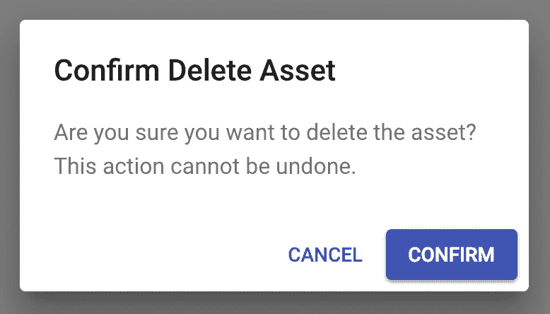

您可以点击取消对话框操作来关闭对话框而不做任何事情，或者点击确认对话框操作，这将实际执行操作然后再关闭对话框。

# 它是如何工作的...

`DialogContentText` 组件用于在对话框中渲染确认消息。它实际上只是一个围绕 `Typography` 组件的薄包装。传递给对话框组件的两个有趣的属性是 `disableBackdropClick` 和 `disableEscapeKeyDown`，它们分别防止通过点击对话框外的屏幕或按 *Esc* 键来关闭确认对话框。

这两个属性的想法是让用户明确承认他们正在执行需要他们密切注意的操作，或者他们选择不执行该操作。

# 相关内容

+   `Dialog` 演示：[`material-ui.com/demos/dialogs/`](https://material-ui.com/demos/dialogs/)

+   `Dialog` API 文档：[`material-ui.com/api/dialog/`](https://material-ui.com/api/dialog/)

+   `DialogActions` API 文档：[`material-ui.com/api/dialog-actions/`](https://material-ui.com/api/dialog-actions/)

+   `DialogContent` API 文档：[`material-ui.com/api/dialog-content/`](https://material-ui.com/api/dialog-content/)

+   `DialogContentText` API 文档：[`material-ui.com/api/dialog-content-text/`](https://material-ui.com/api/dialog-content-text/)

+   `Button` API 文档：[`material-ui.com/api/button/`](https://material-ui.com/api/button/)

# 显示警报

警报对话框类似于确认对话框。你可以把警报看作是真正重要的 snackbars，不能被忽视。像确认一样，警报会引起干扰，并且必须明确承认才能消除它们。此外，警报对话框可能不是用户采取直接行动的直接结果。警报可以是用户交互的环境发生变化的结果。

# 如何做...

假设你的应用程序需要能够提醒用户当他们的磁盘空间即将用尽时。以下是一个示例，展示了警报可能的样子：

```js
import React, { Fragment, useState } from 'react';

import Button from '@material-ui/core/Button';
import DialogContent from '@material-ui/core/DialogContent';
import DialogContentText from '@material-ui/core/DialogContentText';
import DialogActions from '@material-ui/core/DialogActions';
import Dialog from '@material-ui/core/Dialog';

export default function ConfirmingActions() {
  const [open, setOpen] = useState(false);

  return (
    <Fragment>
      <Button color="primary" onClick={() => setOpen(true)}>
        Show Alert
      </Button>
      <Dialog open={open}>
        <DialogContent>
          <DialogContentText>
            Disk space critically low. You won't be able to perform
            any actions until you free up some space by deleting
            assets.
          </DialogContentText>
        </DialogContent>
        <DialogActions>
          <Button
            variant="contained"
            onClick={() => setOpen(false)}
            color="primary"
          >
            Got It
          </Button>
        </DialogActions>
      </Dialog>
    </Fragment>
  );
}
```

当你点击显示警报按钮时，这就是警报对话框的显示效果：

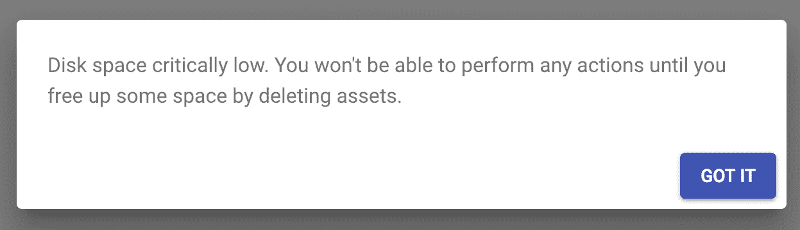

# 它是如何工作的...

警报与常规对话框没有太大区别，你使用它们来收集用户的输入。警报的原则是保持简短并直截了当。例如，这个警报对话框没有标题。它不需要标题就能传达要点——如果用户不开始删除内容，他们将无法做任何事情。

# 还有更多...

你可以通过在警报消息和关闭警报的按钮上添加图标来让你的警报更加引人注目。以下是一个修改后的示例：

```js
import React, { Fragment, useState } from 'react';

import { makeStyles } from '@material-ui/styles';
import Button from '@material-ui/core/Button';
import DialogContent from '@material-ui/core/DialogContent';
import DialogContentText from '@material-ui/core/DialogContentText';
import DialogActions from '@material-ui/core/DialogActions';
import Dialog from '@material-ui/core/Dialog';
import Grid from '@material-ui/core/Grid';

import WarningIcon from '@material-ui/icons/Warning';
import CheckIcon from '@material-ui/icons/Check';

const useStyles = makeStyles(theme => ({
  rightIcon: {
    marginLeft: theme.spacing(1)
  }
}));

export default function ConfirmingActions() {
  const classes = useStyles();
  const [open, setOpen] = useState(false);

  return (
    <Fragment>
      <Button color="primary" onClick={() => setOpen(true)}>
        Show Alert
      </Button>
      <Dialog open={open}>
        <DialogContent>
          <Grid container>
            <Grid item xs={2}>
              <WarningIcon fontSize="large" color="secondary" />
            </Grid>
            <Grid item xs={10}>
              <DialogContentText>
                Disk space critically low. You won't be able to
                perform any actions until you free up some space by
                deleting assets.
              </DialogContentText>
            </Grid>
          </Grid>
        </DialogContent>
        <DialogActions>
          <Button
            variant="contained"
            onClick={() => setOpen(false)}
            color="primary"
          >
            Got It
            <CheckIcon className={classes.rightIcon} />
          </Button>
        </DialogActions>
      </Dialog>
    </Fragment>
  );
}
```

这是新警报的样子：

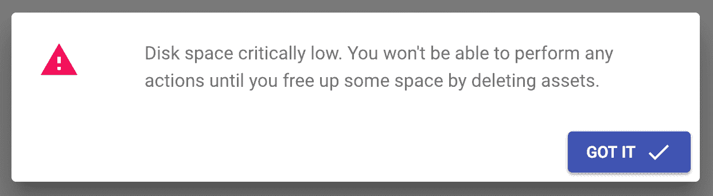

# 相关内容

+   `Dialog` 示例：[`material-ui.com/demos/dialogs/`](https://material-ui.com/demos/dialogs/)

+   `Dialog` API 文档：[`material-ui.com/api/dialog/`](https://material-ui.com/api/dialog/)

+   `DialogActions` API 文档：[`material-ui.com/api/dialog-actions/`](https://material-ui.com/api/dialog-actions/)

+   `DialogContent` API 文档：[`material-ui.com/api/dialog-content/`](https://material-ui.com/api/dialog-content/)

+   `DialogContentText` API 文档：[`material-ui.com/api/dialog-content-text/`](https://material-ui.com/api/dialog-content-text/)

+   `Button` API 文档：[`material-ui.com/api/button/`](https://material-ui.com/api/button/)

# API 集成

对话框通常需要从 API 端点提供数据。挑战是在用户等待后台加载 API 数据的同时显示加载状态。

# 如何实现...

假设你的应用程序需要显示一个带有 `Select` 组件的对话框来选择一个项目。选择框的选项是从 API 端点填充的，因此你需要处理用户打开对话框和 API 数据到达之间的延迟。以下是一个示例，展示了实现这一点的其中一种方法：

```js
import React, { Fragment, useState } from 'react';

import { makeStyles } from '@material-ui/styles';
import Button from '@material-ui/core/Button';
import DialogTitle from '@material-ui/core/DialogTitle';
import DialogContent from '@material-ui/core/DialogContent';
import DialogContentText from '@material-ui/core/DialogContentText';
import DialogActions from '@material-ui/core/DialogActions';
import Dialog from '@material-ui/core/Dialog';
import LinearProgress from '@material-ui/core/LinearProgress';
import MenuItem from '@material-ui/core/MenuItem';
import Select from '@material-ui/core/Select';

const useStyles = makeStyles(theme => ({
  dialog: { minHeight: 200 },
  select: { width: '100%' }
}));

const fetchItems = () =>
  new Promise(resolve => {
    setTimeout(() => {
      resolve([
        { id: 1, name: 'Item 1' },
        { id: 2, name: 'Item 2' },
        { id: 3, name: 'Item 3' }
      ]);
    }, 3000);
  });

const MaybeLinearProgress = ({ loading, ...props }) =>
  loading ? <LinearProgress {...props} /> : null;

const MaybeSelect = ({ loading, ...props }) =>
  loading ? null : <Select {...props} />;

export default function APIIntegration() {
  const classes = useStyles();
  const [open, setOpen] = useState(false);
  const [loading, setLoading] = useState(false);
  const [items, setItems] = useState([]);
  const [selected, setSelected] = useState('');

  const onShowItems = () => {
    setOpen(true);
    setLoading(true);

    fetchItems().then(items => {
      setLoading(false);
      setItems(items);
    });
  };

  const onClose = () => {
    setOpen(false);
  };

  const onSelect = e => {
    setSelected(e.target.value);
  };

  return (
    <Fragment>
      <Button color="primary" onClick={onShowItems}>
        Select Item
      </Button>
      <Dialog
        open={open}
        classes={{ paper: classes.dialog }}
        maxWidth="xs"
        fullWidth
      >
        <DialogTitle>Select Item</DialogTitle>
        <DialogContent>
          <MaybeLinearProgress loading={loading} />
          <MaybeSelect
            value={selected}
            onChange={onSelect}
            className={classes.select}
            loading={loading}
          >
            <MenuItem value="">
              <em>None</em>
            </MenuItem>
            {items.map(item => (
              <MenuItem key={item.id} index={item.id} value={item.id}>
                {item.name}
              </MenuItem>
            ))}
          </MaybeSelect>
        </DialogContent>
        <DialogActions>
          <Button
            disabled={loading}
            onClick={onClose}
            color="primary"
          >
            Cancel
          </Button>
          <Button
            disabled={loading}
            variant="contained"
            onClick={onClose}
            color="primary"
          >
            Select
          </Button>
        </DialogActions>
      </Dialog>
    </Fragment>
  );
}
```

这是对话框首次打开时的样子：

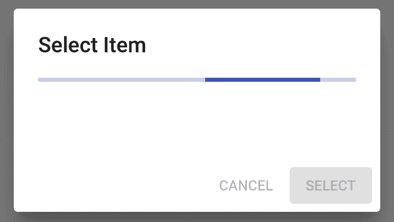

对话框显示一个 `LinearProgress` 组件，并在 API 数据加载时禁用对话框操作按钮。一旦响应到达，对话框看起来是这样的：

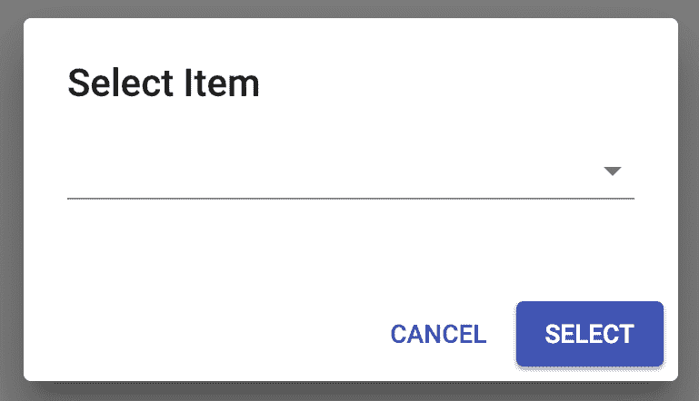

线性进度条消失了，对话框操作按钮被启用，并且有一个可供用户选择项目的“选择项”字段可见。以下是显示从 API 加载的项目选择项的“选择项”：

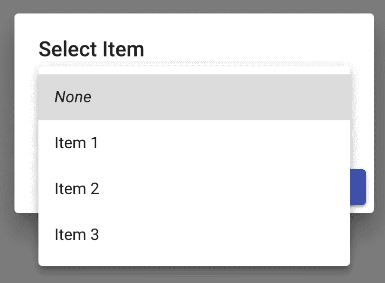

# 工作原理...

让我们逐步分析这段代码的主要部分，从模拟的 API 函数开始：

```js
const fetchItems = () =>
  new Promise(resolve => {
    setTimeout(() => {
      resolve([
        { id: 1, name: 'Item 1' },
        { id: 2, name: 'Item 2' },
        { id: 3, name: 'Item 3' }
      ]);
    }, 3000);
  });
```

`fetchItems()` 函数通过返回一个在三个秒后解析为数组数据的承诺来模拟一个 API 函数。这允许你在等待实际的 API 端点响应时看到用户将看到的内容。接下来，让我们看看两个帮助渲染或隐藏选择和进度指示器的实用组件：

```js
const MaybeLinearProgress = ({ loading, ...props }) =>
  loading ? <LinearProgress {...props} /> : null;

const MaybeSelect = ({ loading, ...props }) =>
  loading ? null : <Select {...props} />;
```

理念是，你不想在加载为 `false` 时渲染 `LinearProgress` 组件。相反，你不想在加载为 `true` 时渲染 `Select` 组件。接下来，让我们看看 `onShowItems()`：

```js
const onShowItems = () => {
  setOpen(true);
  setLoading(true);

  fetchItems().then(items => {
    setLoading(false);
    setItems(items);
  });
};
```

首先，通过将 `open` 设置为 `true` 来打开对话框，并通过将 `loading` 设置为 `true` 来显示进度指示器。然后，调用 API 的 `fetchItems()` 函数，当它返回的 `Promise` 解析时，将 `loading` 设置为 `false` 并更新 `items` 数组。这隐藏了进度指示器并显示了现在已填充了项目的选择框。

# 相关内容

+   `Dialog` 示例：[`material-ui.com/demos/dialogs/`](https://material-ui.com/demos/dialogs/)

+   `Dialog` API 文档：[`material-ui.com/api/dialog/`](https://material-ui.com/api/dialog/)

+   `DialogActions` API 文档：[`material-ui.com/api/dialog-actions/`](https://material-ui.com/api/dialog-actions/)

+   `DialogContent` API 文档：[`material-ui.com/api/dialog-content/`](https://material-ui.com/api/dialog-content/)

+   `DialogContentText` API 文档：[`material-ui.com/api/dialog-content-text/`](https://material-ui.com/api/dialog-content-text/)

+   `Button` API 文档：[`material-ui.com/api/button/`](https://material-ui.com/api/button/)

+   `LinearProgress` API 文档：[`material-ui.com/api/linear-progress/`](https://material-ui.com/api/linear-progress/)

+   `MenuItem` API 文档：[`material-ui.com/api/menu-item/`](https://material-ui.com/api/menu-item/)

+   `Select` API 文档：[`material-ui.com/api/select/`](https://material-ui.com/api/select/)

# 创建全屏对话框

在全屏对话框中，您有更多空间来渲染信息。大多数情况下，您不需要全屏对话框。在不常见的情况下，您的对话框需要尽可能多的空间来渲染信息。

# 如何做到...

假设，在您的应用程序的某个屏幕上有一个按钮，用于导出用户数据。当点击时，您想在用户确认之前给他们一个即将导出的数据的预览。以下是代码的样子：

```js
import React, { Fragment, useState } from 'react';

import { makeStyles } from '@material-ui/styles';
import Button from '@material-ui/core/Button';
import Dialog from '@material-ui/core/Dialog';
import AppBar from '@material-ui/core/AppBar';
import Toolbar from '@material-ui/core/Toolbar';
import IconButton from '@material-ui/core/IconButton';
import Typography from '@material-ui/core/Typography';
import Slide from '@material-ui/core/Slide';
import Table from '@material-ui/core/Table';
import TableBody from '@material-ui/core/TableBody';
import TableCell from '@material-ui/core/TableCell';
import TableHead from '@material-ui/core/TableHead';
import TableRow from '@material-ui/core/TableRow';

import CloseIcon from '@material-ui/icons/Close';

const useStyles = makeStyles(theme => ({
  appBar: {
    position: 'relative'
  },
  flex: {
    flex: 1
  }
}));

const Transition = props => <Slide direction="up" {...props} />;

const id = (function*() {
  let id = 0;
  while (true) {
    id += 1;
    yield id;
  }
})();

const rowData = (name, calories, fat, carbs, protein) => ({
  id: id.next().value,
  name,
  calories,
  fat,
  carbs,
  protein
});

const rows = [
  rowData('Frozen yoghurt', 159, 6.0, 24, 4.0),
  rowData('Ice cream sandwich', 237, 9.0, 37, 4.3),
  rowData('Eclair', 262, 16.0, 24, 6.0),
  rowData('Cupcake', 305, 3.7, 67, 4.3),
  rowData('Gingerbread', 356, 16.0, 49, 3.9)
];

export default function FullScreenDialogs() {
  const classes = useStyles();
  const [open, setOpen] = useState(false);

  const onOpen = () => {
    setOpen(true);
  };

  const onClose = () => {
    setOpen(false);
  };

  return (
    <Fragment>
      <Button variant="outlined" color="primary" onClick={onOpen}>
        Export Data
      </Button>
      <Dialog
        fullScreen
        open={open}
        onClose={onClose}
        TransitionComponent={Transition}
      >
        <AppBar className={classes.appBar}>
          <Toolbar>
            <IconButton
              color="inherit"
              onClick={onClose}
              aria-label="Close"
            >
              <CloseIcon />
            </IconButton>
            <Typography
              variant="h6"
              color="inherit"
              className={classes.flex}
            >
              Export Data
            </Typography>
            <Button color="inherit" onClick={onClose}>
              Export
            </Button>
          </Toolbar>
        </AppBar>
        <Table className={classes.table}>
          <TableHead>
            <TableRow>
              <TableCell>Dessert (100g serving)</TableCell>
              <TableCell align="right">Calories</TableCell>
              <TableCell align="right">Fat (g)</TableCell>
              <TableCell align="right">Carbs (g)</TableCell>
              <TableCell align="right">Protein (g)</TableCell>
            </TableRow>
          </TableHead>
          <TableBody>
            {rows.map(row => (
              <TableRow key={row.id}>
                <TableCell component="th" scope="row">
                  {row.name}
                </TableCell>
                <TableCell align="right">{row.calories}</TableCell>
                <TableCell align="right">{row.fat}</TableCell>
                <TableCell align="right">{row.carbs}</TableCell>
                <TableCell align="right">{row.protein}</TableCell>
              </TableRow>
            ))}
          </TableBody>
        </Table>
      </Dialog>
    </Fragment>
  );
}
```

这里是对话框打开时的样子：

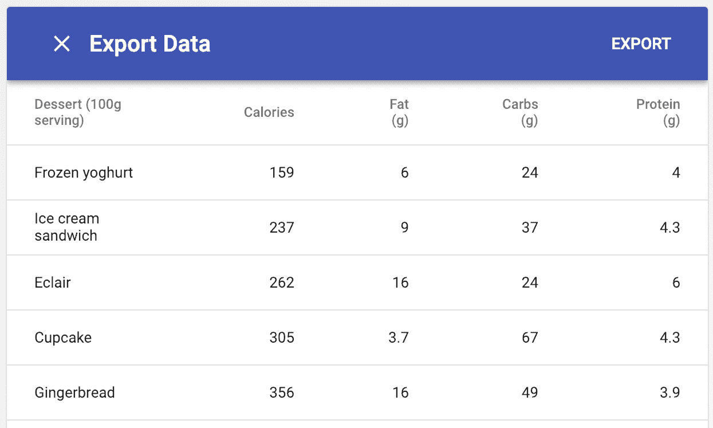

您可以点击对话框标题旁边的 X 按钮，关闭对话框，或者点击右侧的导出按钮。

# 它是如何工作的...

让我们看看传递给 `Dialog` 组件的属性：

```js
<Dialog
  fullScreen
  open={open}
  onClose={onClose}
  TransitionComponent={Transition}
>
```

`fullScreen` 布尔属性决定了对话框在全屏模式下的渲染方式。`TransitionComponent` 属性改变了对话框过渡到屏幕上的方式。

因为对话框以全屏模式显示，您可能想要更改标题和操作对用户显示的方式，如下例所示。您可以使用 `AppBar` 和 `Toolbar` 组件而不是使用 `DialogTitle` 和 `DialogAction` 组件：

```js
<AppBar className={classes.appBar}>
  <Toolbar>
    <IconButton
      color="inherit"
      onClick={onClose}
      aria-label="Close"
    >
      <CloseIcon />
    </IconButton>
    <Typography
      variant="h6"
      color="inherit"
      className={classes.flex}
    >
      Export Data
    </Typography>
    <Button color="inherit" onClick={onClose}>
      Export
    </Button>
  </Toolbar>
</AppBar>
```

这使得标题、关闭操作和主要操作对用户更加可见。

# 相关内容

+   `Dialog` 演示：[`material-ui.com/demos/dialogs/`](https://material-ui.com/demos/dialogs/)

+   `Dialog` API 文档：[`material-ui.com/api/dialog/`](https://material-ui.com/api/dialog/)

+   `AppBar` API 文档：[`material-ui.com/api/app-bar/`](https://material-ui.com/api/app-bar/)

+   `Toolbar` API 文档：[`material-ui.com/api/toolbar/`](https://material-ui.com/api/toolbar/)

+   `Table` API 文档：[`material-ui.com/api/table/`](https://material-ui.com/api/table/)

# 滚动对话框内容

可能很难找到足够的空间将所有内容放入对话框中。当对话框空间不足时，会添加一个垂直滚动条。

# 如何操作...

假设你有一个需要显示在对话框中供用户在导出为其他格式之前查看的长数据表格。用户将需要能够滚动浏览表格行。以下是一个示例：

```js
import React, { Fragment, useState } from 'react';

import Button from '@material-ui/core/Button';
import Dialog from '@material-ui/core/Dialog';
import DialogTitle from '@material-ui/core/DialogTitle';
import DialogContent from '@material-ui/core/DialogContent';
import DialogActions from '@material-ui/core/DialogActions';
import Table from '@material-ui/core/Table';
import TableBody from '@material-ui/core/TableBody';
import TableCell from '@material-ui/core/TableCell';
import TableHead from '@material-ui/core/TableHead';
import TableRow from '@material-ui/core/TableRow';

const id = (function*() {
  let id = 0;
  while (true) {
    id += 1;
    yield id;
  }
})();

const rowData = (name, calories, fat, carbs, protein) => ({
  id: id.next().value,
  name,
  calories,
  fat,
  carbs,
  protein
});

const rows = new Array(50)
  .fill(null)
  .reduce(
    result =>
      result.concat([
        rowData('Frozen yoghurt', 159, 6.0, 24, 4.0),
        rowData('Ice cream sandwich', 237, 9.0, 37, 4.3),
        rowData('Eclair', 262, 16.0, 24, 6.0),
        rowData('Cupcake', 305, 3.7, 67, 4.3),
        rowData('Gingerbread', 356, 16.0, 49, 3.9)
      ]),
    []
  );

export default function FullScreenDialogs() {
  const [open, setOpen] = useState(false);

  const onOpen = () => {
    setOpen(true);
  };

  const onClose = () => {
    setOpen(false);
  };

  return (
    <Fragment>
      <Button variant="outlined" color="primary" onClick={onOpen}>
        Export Data
      </Button>
      <Dialog open={open} onClose={onClose}>
        <DialogTitle>Desserts</DialogTitle>
        <DialogContent>
          <Table>
            <TableHead>
              <TableRow>
                <TableCell>Dessert (100g serving)</TableCell>
                <TableCell align="right">Calories</TableCell>
                <TableCell align="right">Fat (g)</TableCell>
                <TableCell align="right">Carbs (g)</TableCell>
                <TableCell align="right">Protein (g)</TableCell>
              </TableRow>
            </TableHead>
            <TableBody>
              {rows.map(row => (
                <TableRow key={row.id}>
                  <TableCell component="th" scope="row">
                    {row.name}
                  </TableCell>
                  <TableCell align="right">{row.calories}</TableCell>
                  <TableCell align="right">{row.fat}</TableCell>
                  <TableCell align="right">{row.carbs}</TableCell>
                  <TableCell align="right">{row.protein}</TableCell>
                </TableRow>
              ))}
            </TableBody>
          </Table>
        </DialogContent>
        <DialogActions>
          <Button onClick={onClose} color="primary">
            Cancel
          </Button>
          <Button
            variant="contained"
            onClick={onClose}
            color="primary"
          >
            Export
          </Button>
        </DialogActions>
      </Dialog>
    </Fragment>
  );
}
```

这是对话框打开时的样子：

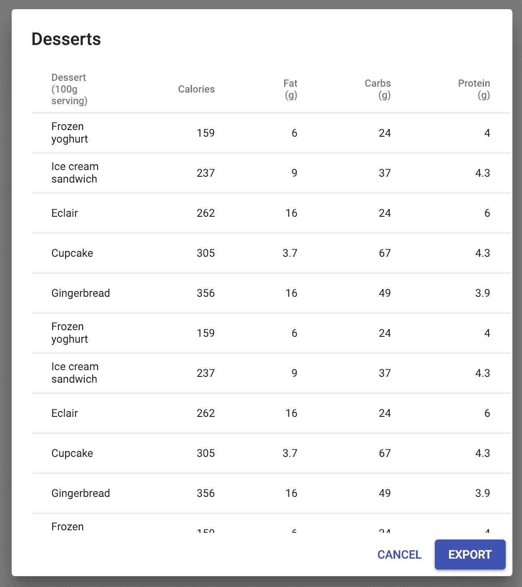

如果你将鼠标指针移到表格行上并开始滚动，表格行将在对话框标题和对话框操作按钮之间上下滚动。

# 它是如何工作的...

默认情况下，对话框内容将在对话框的`Paper`组件（即`DialogContent`组件）内部滚动，因此无需指定属性。但是，你可以将`body`值传递给`Dialog`组件的`scroll`属性。这将使对话框的高度改变以适应内容。

# 相关内容

+   `Dialog`演示：[`material-ui.com/demos/dialogs/`](https://material-ui.com/demos/dialogs/)

+   `Dialog` API 文档：[`material-ui.com/api/dialog/`](https://material-ui.com/api/dialog/)

+   `Table` API 文档：[`material-ui.com/api/table/`](https://material-ui.com/api/table/)
