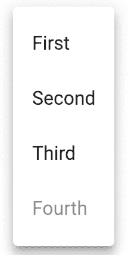
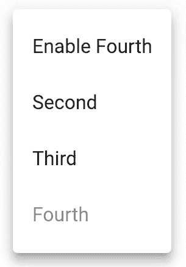
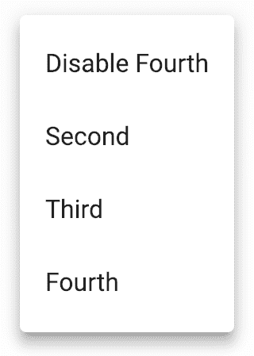
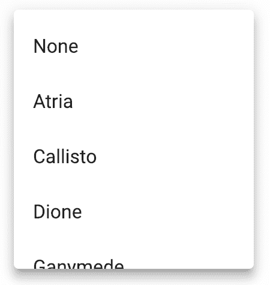
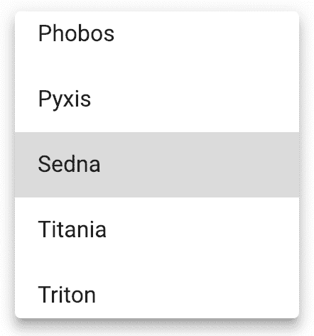
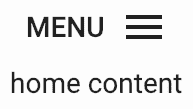
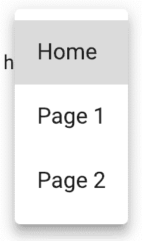
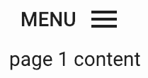
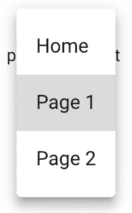

# 第十六章：菜单 - 显示弹出动作

在本章中，我们将涵盖以下主题：

+   使用状态组合菜单

+   菜单滚动选项

+   使用菜单过渡

+   自定义菜单项

# 简介

菜单用于组织用户可以执行的一组命令。通常，菜单有一些上下文，比如应用程序中某个资源的详细信息屏幕。Material-UI 提供了一个`Menu`组件，它允许你为给定的屏幕组织命令。

# 使用状态组合菜单

`Menu`组件用于执行某些操作。将菜单视为列表和按钮的组合。菜单最适合在只想临时显示菜单项的场景中使用。菜单和菜单项的可见性可以通过组件状态来控制。

# 如何做到...

假设你的应用程序中有一个组件有一个菜单按钮，点击后会显示一个包含几个选项的菜单。这些选项可以根据应用程序中的其他状态变化，比如权限或另一个资源的状态。以下是构建此组件的源代码：

```js
import React, { Fragment, useState } from 'react';

import { makeStyles } from '@material-ui/styles';
import Button from '@material-ui/core/Button';
import Menu from '@material-ui/core/Menu';
import MenuItem from '@material-ui/core/MenuItem';
import MenuIcon from '@material-ui/icons/Menu';

const useStyles = makeStyles(theme => ({
  rightIcon: {
    marginLeft: theme.spacing(1)
  }
}));

export default function ComposingMenusWithState() {
  const onOpen = e => {
    setAnchorEl(e.currentTarget);
  };

  const onClose = () => {
    setAnchorEl(null);
  };

  const classes = useStyles();
  const [anchorEl, setAnchorEl] = useState(null);
  const [items, setItems] = useState([
    { name: 'First', onClick: onClose },
    { name: 'Second', onClick: onClose },
    { name: 'Third', onClick: onClose },
    { name: 'Fourth', onClick: onClose, disabled: true }
  ]);

  return (
    <Fragment>
      <Button onClick={onOpen}>
        Menu
        <MenuIcon className={classes.rightIcon} />
      </Button>
      <Menu
        anchorEl={anchorEl}
        open={Boolean(anchorEl)}
        onClose={onClose}
      >
        {items.map((item, index) => (
          <MenuItem
            key={index}
            onClick={item.onClick}
            disabled={item.disabled}
          >
            {item.name}
          </MenuItem>
        ))}
      </Menu>
    </Fragment>
  );
}
```

当屏幕首次加载时，你会看到以下内容：


当你点击菜单按钮时，菜单会按以下方式显示：



# 它是如何工作的...

让我们先看看`ComposingMenusWithState`组件的状态：

```js
const [anchorEl, setAnchorEl] = useState(null);
const [items, setItems] = useState([
  { name: 'First', onClick: onClose },
  { name: 'Second', onClick: onClose },
  { name: 'Third', onClick: onClose },
  { name: 'Fourth', onClick: onClose, disabled: true }
]);
```

`anchorEl`状态引用了当菜单打开时菜单所锚定的元素。当它是 null 时，菜单是关闭的。`items`数组包含菜单项。`name`属性被渲染为菜单项文本。当菜单项被选中时，会调用`onClick`函数。当`disabled`属性为`true`时，会禁用该项。接下来，让我们看看`onOpen()`和`onClose()`处理程序：

```js
  const onOpen = e => {
    setAnchorEl(e.currentTarget);
  };

  const onClose = () => {
    setAnchorEl(null);
  };
```

当用户点击菜单按钮时，`anchorEl`状态被设置为`e.currentTarget`——这是被点击的按钮，也是菜单知道如何渲染自己的方式。当菜单关闭时，这被设置为`null`，导致菜单被隐藏。最后，让我们看看`Menu`标记：

```js
<Menu
  anchorEl={anchorEl}
  open={Boolean(anchorEl)}
  onClose={onClose}
>
  {items.map((item, index) => (
    <MenuItem
      key={index}
      onClick={item.onClick}
      disabled={item.disabled}
    >
      {item.name}
    </MenuItem>
  ))}
</Menu>
```

`open`属性期望一个布尔值，这就是为什么改变`anchorEl`状态会导致`Boolean(anchorEL)`根据用户与它的交互打开或关闭菜单。然后`items`状态被映射到`MenuItem`组件。

# 还有更多...

如果你的应用程序有多个屏幕，你可以创建自己的`Menu`组件，该组件负责将项目映射到`MenuItem`组件。让我们修改这个示例来构建菜单抽象，并进一步说明菜单项如何随着应用程序数据随时间变化而改变状态。以下是修改后的示例：

```js
import React, { Fragment, useState, useEffect } from 'react';

import { makeStyles } from '@material-ui/styles';
import Button from '@material-ui/core/Button';
import Menu from '@material-ui/core/Menu';
import MenuItem from '@material-ui/core/MenuItem';
import MenuIcon from '@material-ui/icons/Menu';

const useStyles = makeStyles(theme => ({
  rightIcon: {
    marginLeft: theme.spacing.unit
  }
}));

const MyMenu = ({ items, onClose, anchorEl }) => (
  <Menu
    anchorEl={anchorEl}
    open={Boolean(anchorEl)}
    onClose={onClose}
  >
    {items.map((item, index) => (
      <MenuItem
        key={index}
        onClick={item.onClick}
        disabled={item.disabled}
      >
        {item.name}
      </MenuItem>
    ))}
  </Menu>
);

export default function ComposingMenusWithState() {
  const classes = useStyles();
  const [anchorEl, setAnchorEl] = useState(null);
  const [items, setItems] = useState([
    { name: 'Enable Fourth' },
    { name: 'Second', onClick: onClose },
    { name: 'Third', onClick: onClose },
    { name: 'Fourth', onClick: onClose, disabled: true }
  ]);

  useEffect(() => {
    const toggleFourth = () => {
      let newItems = [...items];

      newItems[3] = { ...items[3], disabled: !items[3].disabled };
      newItems[0] = {
        ...items[0],
        name: newItems[3].disabled
          ? 'Enable Fourth'
          : 'Disable Fourth'
      };

      setItems(newItems);
    };

    const newItems = [...items];
    newItems[0] = { ...items[0], onClick: toggleFourth };
    setItems(newItems);
  });

  const onOpen = e => {
    setAnchorEl(e.currentTarget);
  };

  const onClose = () => {
    setAnchorEl(null);
  };

  return (
    <Fragment>
      <Button onClick={onOpen}>
        Menu
        <MenuIcon className={classes.rightIcon} />
      </Button>
      <MyMenu items={items} onClose={onClose} anchorEl={anchorEl} />
    </Fragment>
  );
}
```

`MyMenu` 组件接受 `onClose` 处理程序、`anchorEl` 状态和 `items` 数组作为属性。为了展示您如何更新菜单项状态并使它们渲染（即使在菜单打开时），有一个新的 `toggleFourth()` 处理程序应用于第一个菜单项的 `onClick` 属性。它是在 `useEffect()` 内部应用的，因为这是 `toggleFourth()` 获取新 `items` 值的唯一方式；当它改变时，我们必须重新定义函数并将其重新分配给 `onClick`。这将切换第一菜单项的文本和 `Fourth` 项的禁用状态。以下是菜单首次打开时的样子：



点击第一个菜单项后，菜单看起来是这样的：



第一项的文本已被切换，第四项现在处于启用状态。您可以继续点击第一项以切换这两个项目的状态。

# 参见

+   `Menu` 演示：[`material-ui.com/demos/menus/`](https://material-ui.com/demos/menus/)

+   `Menu` API 文档：[`material-ui.com/api/menu/`](https://material-ui.com/api/menu/)

+   `MenuItem` API 文档：[`material-ui.com/api/menu-item/`](https://material-ui.com/api/menu-item/)

# 菜单滚动选项

有时菜单有很多选项。这可能会对菜单的高度造成问题。您不必显示非常长的菜单，可以为菜单设置最大高度，并使其垂直滚动。

# 如何做到这一点...

假设您需要渲染一个菜单，其中包含的选项比一次合理显示在屏幕上的多。此外，菜单中的一个选项可能处于选中状态。以下是一些代码示例，展示了如何处理这种情况：

```js
import React, { Fragment, useState } from 'react';

import { makeStyles } from '@material-ui/styles';
import IconButton from '@material-ui/core/IconButton';
import Menu from '@material-ui/core/Menu';
import MenuItem from '@material-ui/core/MenuItem';
import MenuIcon from '@material-ui/icons/Menu';

const items = [
  'None',
  'Atria',
  'Callisto',
  'Dione',
  'Ganymede',
  'Hangouts Call',
  'Luna',
  'Oberon',
  'Phobos',
  'Pyxis',
  'Sedna',
  'Titania',
  'Triton',
  'Umbriel'
];

const ITEM_HEIGHT = 48;

const useStyles = makeStyles(theme => ({
  menuPaper: { maxHeight: ITEM_HEIGHT * 4.5, width: 200 }
}));

export default function MenuScrollingOptions() {
  const classes = useStyles();
  const [anchorEl, setAnchorEl] = useState(null);
  const [selected, setSelected] = useState('');

  const onOpen = e => {
    setAnchorEl(e.currentTarget);
  };

  const onClose = () => {
    setAnchorEl(null);
  };

  const onSelect = selected => () => {
    setSelected(selected);
    setAnchorEl(null);
  };

  return (
    <Fragment>
      <IconButton onClick={onOpen}>
        <MenuIcon />
      </IconButton>
      <Menu
        anchorEl={anchorEl}
        open={Boolean(anchorEl)}
        onClose={onClose}
        PaperProps={{
          classes: { elevation8: classes.menuPaper }
        }}
      >
        {items.map((item, index) => (
          <MenuItem
            key={index}
            selected={index === selected}
            onClick={onSelect(index)}
          >
            {item}
          </MenuItem>
        ))}
      </Menu>
    </Fragment>
  );
}
```

初始时，没有项目被选中。以下是菜单首次打开时的样子：



您可以滚动菜单项。以下是菜单底部的样子：


您可以选择一个选项来关闭菜单。选择将被保留，因此下次您打开菜单时，您将看到所选的项目：



当菜单有一个选中项时，`Menu` 组件会自动滚动到选中项。您可以通过在关闭菜单后再重新打开它，将选中项滚动出视图来测试这一点。您将在菜单中间看到选中项。

# 它是如何工作的...

让我们先看看这个例子中使用的 `menuPaper` 样式：

```js
const ITEM_HEIGHT = 48;

const useStyles = makeStyles(theme => ({
  menuPaper: { maxHeight: ITEM_HEIGHT * 4.5, width: 200 }
}));
```

`ITEM_HEIGHT` 值是每个菜单项高度的近似值。乘数（`4.5`）是屏幕上应适合多少菜单项的近似值。现在，让我们跳入 `Menu` 组件的标记：

```js
<Menu
  anchorEl={anchorEl}
  open={Boolean(anchorEl)}
  onClose={onClose}
  PaperProps={{
    classes: { elevation8: classes.menuPaper }
  }}
>
  {items.map((item, index) => (
    <MenuItem
      key={index}
      selected={index === selected}
      onClick={onSelect(index)}
    >
      {item}
    </MenuItem>
  ))}
</Menu>
```

每个 `MenuItem` 组件的 `selected` 属性在 `selected` 状态与当前项的 `index` 匹配时设置为 `true`。`menuPaper` 类通过 `PaperProps` 属性应用，但其中有一个 `elevation8` 属性，实际上应用了该类。这是因为如果您只是通过 `className` 分配类，`Menu` 组件将覆盖 `maxHeight` 样式。为了解决这个问题，您必须使用更具体的 CSS API。`Paper` 组件有几个高度级别——数字越高，应用的阴影就越多（使元素看起来更高）。

`Paper` 的默认高度为 `2`。但 `Menu` 组件使用 `Popover` 组件来渲染 `Paper`，将高度更改为 `8`。简而言之，`elevation8` CSS API 允许您应用覆盖默认值的类样式。这就是如何得到可滚动的菜单。

# 相关内容

+   `Menu` 示例：[`material-ui.com/demos/menus/`](https://material-ui.com/demos/menus/)

+   `Menu` API 文档：[`material-ui.com/api/menu/`](https://material-ui.com/api/menu/)

+   `MenuItem` API 文档：[`material-ui.com/api/menu-item/`](https://material-ui.com/api/menu-item/)

# 使用菜单过渡

您可以更改 `Menu` 组件使用的过渡效果。默认情况下，`Menu` 使用 `Grow` 过渡组件。

# 如何实现...

为了演示如何将不同的过渡效果应用到 `Menu` 组件，我们将为这个示例添加一些过渡选项到 Storybook。您可以使用以下代码更改使用的过渡组件，以及过渡效果的持续时间：

```js
import React, { Fragment, useState } from 'react';

import { makeStyles } from '@material-ui/styles';
import Button from '@material-ui/core/Button';
import Menu from '@material-ui/core/Menu';
import MenuItem from '@material-ui/core/MenuItem';
import Collapse from '@material-ui/core/Collapse';
import Fade from '@material-ui/core/Fade';
import Grow from '@material-ui/core/Grow';
import Slide from '@material-ui/core/Slide';

import MenuIcon from '@material-ui/icons/Menu';

const useStyles = makeStyles(theme => ({
  rightIcon: {
    marginLeft: theme.spacing.unit
  }
}));

export default function UsingMenuTransitions({
  transition,
  duration
}) {
  const classes = useStyles();
  const [anchorEl, setAnchorEl] = useState(null);

  const onOpen = e => {
    setAnchorEl(e.currentTarget);
  };

  const onClose = () => {
    setAnchorEl(null);
  };

  return (
    <Fragment>
      <Button onClick={onOpen}>
        Menu
        <MenuIcon className={classes.rightIcon} />
      </Button>
      <Menu
        anchorEl={anchorEl}
        open={Boolean(anchorEl)}
        onClose={onClose}
        transitionDuration={duration}
        TransitionComponent={
          {
            collapse: Collapse,
            fade: Fade,
            grow: Grow,
            slide: Slide
          }[transition]
        }
      >
        <MenuItem onClick={onClose}>Profile</MenuItem>
        <MenuItem onClick={onClose}>My account</MenuItem>
        <MenuItem onClick={onClose}>Logout</MenuItem>
      </Menu>
    </Fragment>
  );
}
```

您将在 Storybook Knobs 面板中看到不同的过渡选项。当您更改过渡效果时，您将在打开和关闭菜单时注意到差异。不幸的是，我无法捕获这些过渡效果的截图。

# 它是如何工作的...

传递给 `UsingMenuTransitions` 组件的 `transition` 属性来自 Storybook，并用于确定使用的过渡效果。让我们更详细地看看 `Menu` 使用的 `TransitionComponent` 属性，以确定使用哪种过渡效果：

```js
TransitionComponent={
  {
    collapse: Collapse,
    fade: Fade,
    grow: Grow,
    slide: Slide
  }[transition]
}
```

`transition` 字符串映射到 Material-UI 过渡组件，您可以将其传递给 `Menu`。

# 相关内容

+   `Menu` 示例：[`material-ui.com/demos/menus/`](https://material-ui.com/demos/menus/)

+   `菜单` API 文档：[`material-ui.com/api/menu/`](https://material-ui.com/api/menu/)

+   `菜单项` API 文档：[`material-ui.com/api/menu-item/`](https://material-ui.com/api/menu-item/)

+   `Collapse` API 文档：[`material-ui.com/api/collapse/`](https://material-ui.com/api/collapse/)

+   `Fade` API 文档：[`material-ui.com/api/collapse/`](https://material-ui.com/api/collapse/)

+   `Grow` API 文档：[`material-ui.com/api/grow/`](https://material-ui.com/api/grow/)

+   `Slide` API 文档：[`material-ui.com/api/slide/`](https://material-ui.com/api/slide/)

# 自定义菜单项

你可以将具有 `onClick` 处理器的常规菜单项改为更复杂的形式。例如，你可能希望菜单中包含指向你应用中其他屏幕的链接。

# 如何实现...

假设你在你的应用程序中使用 `react-router` 来控制从一个屏幕到另一个屏幕的导航，并且你希望使用 `Menu` 组件来 `渲染` 链接。以下是一个示例，展示了如何实现这一点：

```js
import React, { Fragment, useState } from 'react';
import { Switch, Route, Link } from 'react-router-dom';

import { makeStyles } from '@material-ui/styles';
import Button from '@material-ui/core/Button';
import Menu from '@material-ui/core/Menu';
import MenuItem from '@material-ui/core/MenuItem';
import Typography from '@material-ui/core/Typography';
import MenuIcon from '@material-ui/icons/Menu';

const NavMenuItem = ({ color, ...props }) => (
  <Switch>
    <Route
      exact
      path={props.to}
      render={() => <MenuItem selected component={Link} {...props} />}
    />
    <Route
      path="/"
      render={() => <MenuItem component={Link} {...props} />}
    />
  </Switch>
);

const useStyles = makeStyles(theme => ({
  rightIcon: {
    marginLeft: theme.spacing(1)
  }
}));

export default function CustomizingMenuItems() {
  const classes = useStyles();
  const [anchorEl, setAnchorEl] = useState(null);

  const onOpen = e => {
    setAnchorEl(e.currentTarget);
  };

  const onClose = () => {
    setAnchorEl(null);
  };

  return (
    <Fragment>
      <Button onClick={onOpen}>
        Menu
        <MenuIcon className={classes.rightIcon} />
      </Button>
      <Menu
        anchorEl={anchorEl}
        open={Boolean(anchorEl)}
        onClose={onClose}
      >
        <NavMenuItem to="/" onClick={onClose}>
          Home
        </NavMenuItem>
        <NavMenuItem to="/page1" onClick={onClose}>
          Page 1
        </NavMenuItem>
        <NavMenuItem to="/page2" onClick={onClose}>
          Page 2
        </NavMenuItem>
      </Menu>
      <Switch>
        <Route
          exact
          path="/"
          render={() => <Typography>home content</Typography>}
        />
        <Route
          path="/page1"
          render={() => <Typography>page 1 content</Typography>}
        />
        <Route
          path="/page2"
          render={() => <Typography>page 2 content</Typography>}
        />
      </Switch>
    </Fragment>
  );
}
```

当屏幕首次加载时，你会看到以下内容：



当菜单打开时，菜单看起来是这样的：



尝试点击第 1 页。这应该会关闭菜单并更改菜单下方显示的内容，因为你已经导航到了另一个屏幕，如下面的截图所示：



活跃链接会在菜单中反映出来。如果你从第 1 页打开菜单，菜单看起来是这样的：



# 它是如何工作的...

让我们从查看 `NavMenuItem` 组件开始：

```js
const NavMenuItem = ({ color, ...props }) => (
  <Switch>
    <Route
      exact
      path={props.to}
      render={() => <MenuItem selected component={Link} {...props} />}
    />
    <Route
      path="/"
      render={() => <MenuItem component={Link} {...props} />}
    />
  </Switch>
);
```

这将基于当前路由渲染一个 `MenuItem` 组件。如果 `to` 属性的值与当前路由匹配，则 `selected` 属性将为 `true`——这就是当你打开菜单时菜单项看起来被选中时的原因。接下来，让我们看看 `Menu` 的标记：

```js
<Menu
  anchorEl={anchorEl}
  open={Boolean(anchorEl)}
  onClose={onClose}
>
  <NavMenuItem to="/" onClick={onClose}>
    Home
  </NavMenuItem>
  <NavMenuItem to="/page1" onClick={onClose}>
    Page 1
  </NavMenuItem>
  <NavMenuItem to="/page2" onClick={onClose}>
    Page 2
  </NavMenuItem>
</Menu>
```

你可以渲染 `NavMenuItem` 组件而不是渲染 `MenuItem` 组件。这些组件将渲染带有 `selected` 属性设置为 `true` 的当前路由的链接。请注意，这里需要 `to` 属性来链接到另一个页面，并且需要 `onClick` 处理器来在页面过渡时关闭菜单。

# 参见

+   `菜单`演示：[`material-ui.com/demos/menus/`](https://material-ui.com/demos/menus/)

+   `Menu` API 文档：[`material-ui.com/api/menu/`](https://material-ui.com/api/menu/)

+   `MenuItem` API 文档：[`material-ui.com/api/menu-item/`](https://material-ui.com/api/menu-item/)
